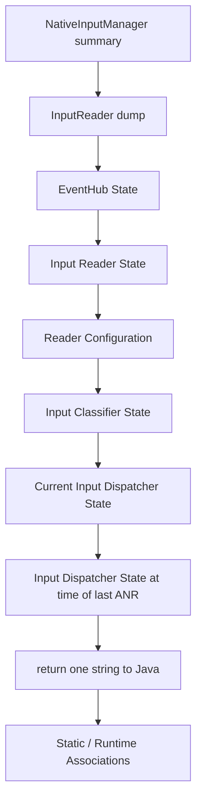
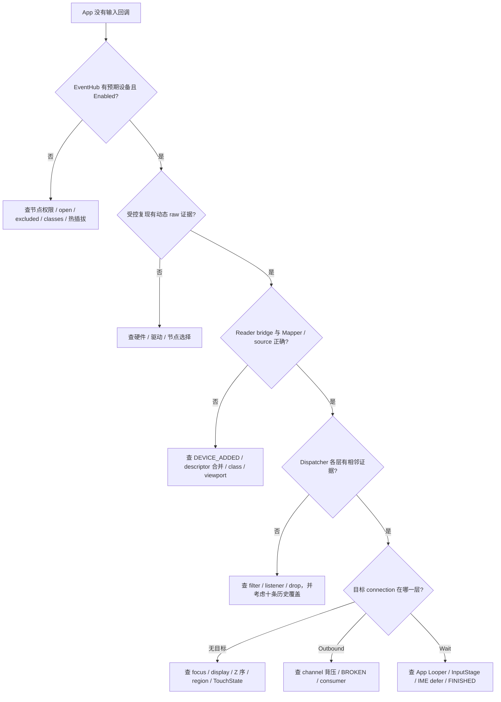
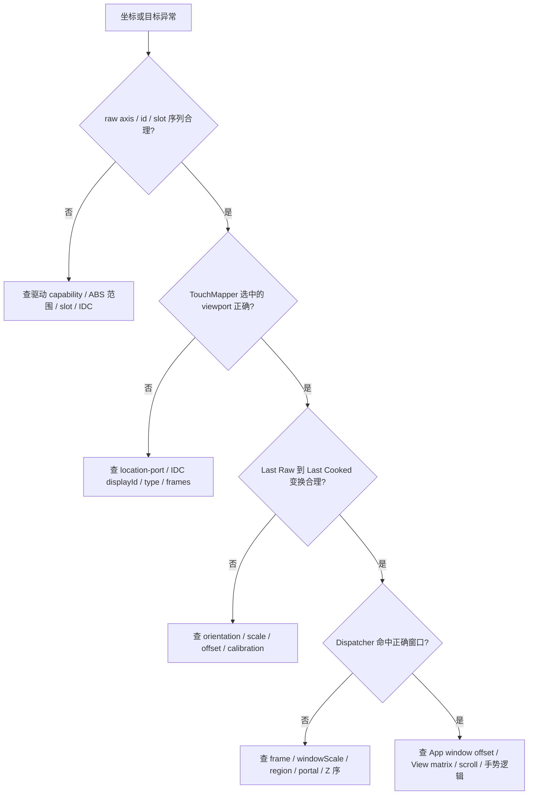
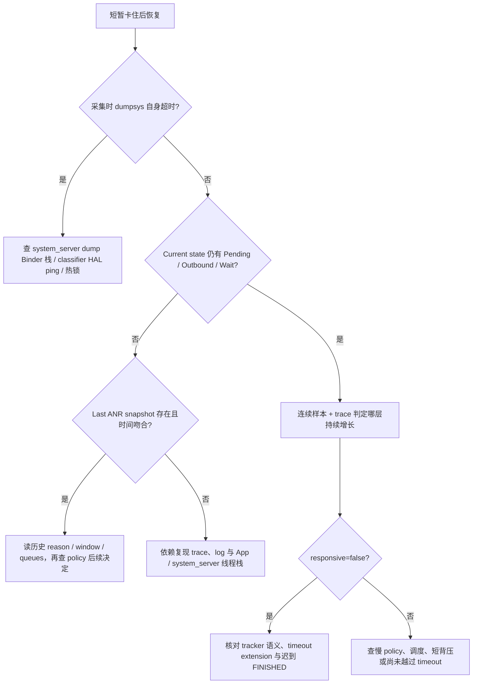

# 194 Android dumpsys input 与输入故障现场诊断：一份静态输出能把“点了没反应”定位到哪一层

> 源码版本：Android 11 / `android-11.0.0_r48`  
> 当前环境：macOS 源码树，只做只读研究；设备命令仅作为未来获授权真机的采集模板。

## 1. 从“我点了，但 App 没反应”建立证据问题

输入故障最浪费时间的问法是：

> 输入系统是不是挂了？

这个问题把设备、映射、路由、传输、App 处理和绘制混成了一个黑盒。`dumpsys input` 能打开黑盒的一部分，但它不是事件录像，也不是全系统事务快照。正确问题应拆成：

1. EventHub 是否知道这个节点，节点当前是否启用？
2. InputReader 把哪些 EventHub 子设备合并成了哪个逻辑设备？
3. 哪些 Mapper、source、range、viewport 与校准值已经生效？
4. Dispatcher 当前是否 enabled / frozen，focus 与窗口快照是什么？
5. 事件仍在 inbound、pending、某个 connection 的 outbound，还是 wait？
6. 最近一次输入 ANR 的 Dispatcher 现场是什么，而不是当前又恢复成了什么？
7. 哪些结论必须再用 raw 采集、线程栈、log 或 trace 证明？

### 本章只解决“证据边界”

本章不再重走每个输入算法，而是训练一种现场阅读法：

```text
先定位输出的生产对象与锁
-> 再确认字段代表当前状态、短历史还是冻结历史
-> 再区分存在、配置、排队、发送、完成
-> 最后为缺失的时间线选择下一种证据
```

看到某一行时，必须同时回答两个问题：

- 它由哪段 r48 源码打印？
- 它没有打印哪些决定性状态？

### 三条总原则

- **有设备不等于有 raw**：EventHub dump 展示已知设备与配置，不展示“刚才是否收到 SYN_REPORT”。
- **有队列不等于原因已知**：PendingEvent 能证明 Dispatcher 手里有事件，却不直接打印它在等 focus、policy、前序事件还是别的条件。
- **没有队列不等于没有故障**：事件可能快速完成、已被 drop、被十条 RecentQueue 覆盖，或根本没到 Dispatcher。

### 版本与产品边界

以下字段名、顺序和实现都限定在 Android 11 r48。`dumpsys` 文本不是稳定 API；厂商可以增加段落、隐藏字段、迁移 inputflinger 宿主或改变 SELinux / 权限。现场必须先记 build fingerprint、`ro.debuggable` 与服务实际 PID，再套用本文模型。

## 2. `dumpsys input` 到底调用了谁，输出怎样拼起来

### 入口是 Java `input` 服务，不是服务名相近的 `inputflinger`

标准 Framework 路径中，SystemServer 以 `Context.INPUT_SERVICE`，也就是 `input`，发布 Java `InputManagerService`。shell 执行：

```text
adb shell dumpsys input
```

会对这个 Binder 服务发 dump transaction。服务端通常由 `system_server` 的某条 Binder 线程执行 `InputManagerService.dump()`；命令名本身不会把工作切到 InputReader 或 InputDispatcher 线程。

`InputManagerService.dump()` 的顺序是：

```text
check android.permission.DUMP
print "INPUT MANAGER (dumpsys input)"
call nativeDump(mPtr)
  -> build one native std::string
print returned Java String
print Java static/runtime port associations
```

这解释了两个常见误会：

- `dumpsys input` 不是让 Reader / Dispatcher 各自向 shell 流式输出；
- Java associations 在完整 native string 返回之后才打印，与 native 段之间又隔了一个观察时刻。

### native 段的真实顺序



这里有一处嵌套关系：`NativeInputManager::dump()` 调的是 `InputReader::dump()`，而 Reader 在自己的输出开头先调用 `EventHub::dump()`。所以 EventHub 不是 NativeInputManager 直接并列调用的第四个组件。

### 哪些段一定出现，哪些段按条件出现

| 段落 | r48 条件 |
|---|---|
| Input Manager State | native dump 正常进入就打印 |
| Event Hub State | Reader dump 正常进入就打印 |
| Input Reader State / Configuration | Reader dump 继续完成后打印 |
| Input Classifier State | 始终有标题；未安装 MotionClassifier 时显示 `<nullptr>` |
| 当前 Input Dispatcher State | Dispatcher lock 可取得后打印 |
| last ANR state | `mLastAnrState` 非空才追加 |
| Static Associations | Java 静态 map 非空才打印 |
| Runtime Associations | Java runtime map 非空才打印 |

某个条件段不存在，首先按源码条件解释，不能直接写成“dump 截断”。

### 进程级 dump disable gate 早于 IMS

Java Binder 的 `doDump()` 在分派到具体服务 `dump()` 之前先检查进程级 `sDumpDisabled`。system_server Watchdog 向 activity controller 报告系统卡死时，可以把它设为：

```text
Service dumps disabled due to hung system process.
```

此时 Binder 只打印该消息，根本不会进入 `InputManagerService.dump()`、权限检查或 native 链。它和下面的 permission denial 是两个不同的短路点；看到标题缺失时应先按实际错误文本区分。

### 权限失败发生在任何 native 状态读取之前

在调用已经到达 IMS 的前提下，Java 入口先调用 `DumpUtils.checkDumpPermission()`。调用者缺少 `android.permission.DUMP` 时只打印 denial，随后立即返回；Reader、Dispatcher 和窗口名都不会被读取。

因此“命令只返回 Permission Denial”证明的是调用身份不足，不是输入服务失活。shell 在标准系统通常持有相应权限，但应用自行调用 Binder dump 不能假定如此。

### `nativeDump()` 先整体构造，再转成 Java String

JNI 创建本地 `std::string`，让各 native 对象依次 append，最后 `NewStringUTF()`。这带来一个诊断限制：即使 EventHub 段已经在内存里构造完成，只要后面的 Classifier 或 Dispatcher 卡住，先前 native 段也不会作为独立 chunk 返回给 Java。

所以“输出停在哪个标题”不是可靠的锁定位法。要定位 dump 自身卡点，应结合 system_server Binder 线程栈、Reader / Dispatcher 心跳和 HAL 状态，而不是只等半截文本。

## 3. 一次 dump 的锁时间线：段内受保护，跨段不原子

### 锁获取顺序

一次正常 native dump 可概括为：

```text
serving system_server Binder thread
  -> read NativeInputManager interactive atomic
  -> lock NIM mLock
       append cached policy fields
     unlock NIM mLock

  -> lock InputReader mLock
       -> lock EventHub mLock
            append EventHub devices
          unlock EventHub mLock
       append logical devices, Mapper state, Reader config
     unlock InputReader mLock

  -> lock InputClassifier mLock
       -> lock MotionClassifier mLock, if installed
            sync HAL ping for service status
            -> lock BlockingQueue mLock for size()
          unlock MotionClassifier mLock
     unlock InputClassifier mLock

  -> lock InputDispatcher mLock
       append current routing / queues / connections
       append already-frozen last-ANR string, if any
     unlock InputDispatcher mLock

return native string
-> later lock Java mAssociationsLock for runtime associations
```

`Interactive` 是 atomic load；不能把整个 NativeInputManager 摘要都笼统标成 `mLock` 快照。相反，Reader 在整个 Reader dump 期间一直持有 `mLock`，其中又嵌套获取 EventHub 的锁。

### “一致”要注明范围

| 比较 | 一致性 |
|---|---|
| 同一次 Dispatcher 段里的 windows、queues、connections | 在同一次 Dispatcher `mLock` 临界区内读取 |
| EventHub device list 与随后 Reader logical map | Reader lock 一直持有；EventHub 子段另受 EventHub lock 保护，但仍可能捕获 DEVICE_ADDED 尚待 Reader 消费的合法中间态 |
| Reader config 与 Dispatcher windows | 两次不同锁、不同时间 |
| 当前 Dispatcher 段与 last ANR 段 | 前者是现在；后者是过去已经格式化好的字符串 |
| native port 消费结果与底部 Java associations | native 先完成，Java map 后读取；不是同一时刻 |

“每段取了锁”不等于“整份文本原子”。如果 Reader 段构造后发生旋转，Dispatcher 段可能已经观察到新窗口；反过来也可能成立。

### dump 自身会扰动被观察系统

`dumpsys input` 不是零开销探针：

- Reader dump 持 Reader lock 格式化所有设备、Mapper 与配置；
- Dispatcher dump 持 Dispatcher lock 遍历窗口和每条 connection 队列；
- 队列越长、窗口越多，临界区越长；
- Binder dump 线程持锁期间，工作线程和控制面 caller 可能在相同 mutex 上等待。

native 状态先写入内存字符串，随后才由 Java 写向 dump fd。因此慢 shell consumer 不会持续持有已经释放的 native mutex；真正的扰动主要来自锁内遍历和格式化，而不是后续把整串文字写到终端。

### Classifier 段还会主动同步调用 HAL

`MotionClassifier::dump()` 为打印 `mService status`，在自己的 `mLock` 内调用 `mService->ping()`。这个 call site 没有设置显式超时。也就是说，dump 并非纯粹读取本地字段；异常 HAL / transport 可能让承接 dump 的 Binder 线程停在同步 ping 上。

这比“某个 mutex 忙”多一层：

```text
dumpsys client 等 system_server Binder reply
system_server Binder thread 等 classifier HAL ping
InputClassifier mLock 在这段期间仍被持有
Reader / Dispatcher 未必有故障
```

### Watchdog monitor 与 dump 不是替代关系

Reader monitor 会等待 Reader loop 的 alive broadcast，再探 EventHub lock；Dispatcher monitor 会等待 Dispatcher loop 心跳。dump 则读取大量结构，Classifier 还会 ping HAL。于是：

- monitor 成功不保证一份大 dump 很快完成；
- dump 卡住不自动等于 Reader 或 Dispatcher 工作线程死锁；
- dump 正常返回也只说明采样期间所需锁和 ping 路径完成，不证明随后事件持续推进。

## 4. 建立“能证明 / 不能证明”的字段语法

### 先把证据分成六级

```text
L1 存在：对象或注册项在采样时存在
L2 配置：某个消费者当前保存了什么值
L3 占有：事件在某层队列或当前槽位里
L4 发送：一笔目标消息已经写入 transport
L5 完成：FINISHED 已关闭这一轮 delivery 的等待账；Key fallback 仍可能重启分发
L6 时序：多个状态先后与耗时如何演变
```

一份 `dumpsys input` 擅长 L1—L3，能通过 WaitQueue 间接证明某目标曾到达 L4；它通常不能单独证明某笔事件的 L5，更不能还原完整 L6。

### 常见观察的证据边界

| 观察 | 可以证明 | 不能证明 |
|---|---|---|
| EventHub 中设备存在、Enabled=true | EventHub 认识设备，采样时标记启用 | 刚才有 raw；epoll 后 Mapper 已收到事件 |
| Reader 中有 Mapper / source / range | 当前逻辑设备配置可产出这些公开能力 | 本次事件已通过 Mapper；App source 过滤正确 |
| RecentQueue 有一条 MotionEvent | 某条 MotionEntry 已从 pending 释放，可能已分发也可能已 drop | 目标 App 收到；这就是用户刚才那一笔 |
| PendingEvent 非空 | Dispatcher 当前持有一条尚未 release 的 inbound event | 精确卡因；最终目标已确定 |
| InboundQueue 非空 | 某个 producer 已把事件入 Dispatcher；Key / Motion 常来自 listener 或 injection，Focus 也可直接插入 | 单次非空就是持续拥塞 |
| Connection OutboundQueue 非空 | 已为该 connection 建立尚待 publish 的 DispatchEntry | App 已收到；唯一原因就是 socket 满 |
| Connection WaitQueue 非空 | 对该 connection 的 publish 已成功，尚未收到匹配 FINISHED | Java callback 已开始；App 业务一定卡住 |
| responsive=false | Dispatcher 已把这条 connection 判为 unresponsive | 当前仍在同一根因；policy 没有延长等待 |
| last ANR 段存在 | 进程生命周期内至少发生过一次输入 ANR，并保存最近那次 Dispatcher 快照 | ANR 仍在发生；Reader / App stack 也被保存 |

### 正证据通常比负证据强

“WaitQueue 有一条”能证明一次成功 publish；“WaitQueue 为空”却有很多解释：

- 事件根本没到这个 connection；
- 刚到又快速 FINISHED；
- 被 policy / disabled / stale / blocked 路径 drop；
- connection 被移除或 broken 后队列已 drain；
- 采样发生在两笔事件之间。

所以负证据必须配合时间窗口和相邻层：

```text
上游有正证据 + 本层连续无证据
```

才适合把怀疑范围收窄到两层之间。

### 单样本的 `length=0/1` 不叫趋势

队列瞬时非空是正常状态。只有带采样时间的多份 dump，或 trace counter 持续抬升，才能使用“堆积”“持续增长”“恢复”这些时序词。

这条规则也适用于 `responsive`：看到 false 是强信号，但要解释何时开始、何时恢复，仍需 last ANR、log 与 trace。

## 5. Event Hub State：它是设备拓扑，不是 raw 事件监视器

### 一条 device 记录实际打印什么

r48 的 EventHub 段按 `mDevices` 打印：

- EventHub id、name；
- classes 十六进制位；
- `/dev/input/event*` path；
- Enabled；
- descriptor、location、controller number、uniqueId；
- bus / vendor / product / version；
- 最终成功加载的 KeyLayout、KeyCharacterMap，以及选中的 Configuration 文件路径；
- keyboard overlay 是否存在；
- 已关联或尚未关联的 video device。

这些是“EventHub 当前知道什么”的拓扑与配置证据，不包含 raw ring buffer、最近 `input_event`、SYN_REPORT 次数或 epoll 活动时间。

### `Enabled` 的精确语义

EventHub device 被 disable 时会从 epoll 注销并关闭 fd，把 `enabled` 置 false，但 Device 对象和 path 仍可留在 `mDevices` 中。因此：

| 输出 | 合理解释 |
|---|---|
| device 存在、Enabled=true | 对象处于启用状态，非虚拟设备 fd 应参与 epoll |
| device 存在、Enabled=false | EventHub 仍保存身份和配置，但 fd 已关闭 / 不参与 epoll |
| device 完全不存在 | 未发现、打开失败、被 excluded、已移除，或采样时扫描尚未完成；需其他证据区分 |

仅靠 `Enabled=true` 仍不能证明 kernel 正在送数据，也不能证明 fd 没有静默异常。

### Classes 是十六进制能力判定结果

EventHub 根据 EV_KEY / EV_ABS / EV_REL / property 等能力位推断 KEYBOARD、CURSOR、TOUCH、TOUCH_MT、JOYSTICK 等 classes。InputDevice 随后按这些 bit 创建 Mapper。

dump 不替你把十六进制 classes 解成自然语言。遇到“节点存在却没有 Touch Mapper”，顺序应是：

1. 对照 classes bit；
2. 回查 `openDeviceLocked()` 的 capability 判定；
3. 再看 `InputDevice::addEventHubDevice()` 是否创建相应 Mapper；
4. 最后才研究 Mapper 内算法。

### 实际文件路径比猜文件名强

`KeyLayoutFile` 与 `KeyCharacterMapFile` 是解析成功后保存的路径；`ConfigurationFile` 则在调用 `PropertyMap::load()` 之前就会赋值。它们可以证伪“我放了一个 vendor 文件，所以系统必然选中了它”，但 IDC 路径出现仍不能证明内容解析成功，还要查相邻解析错误日志与最终 Mapper 参数。

不过空路径只能说明该类文件没有被选中，不能单独说明原因。可能是无此文件、候选 basename 不匹配、该设备无需该类映射，或前置设备识别已不同。

### 五组身份字段不要混用

| 字段 | 适合回答 |
|---|---|
| path | 本次启动具体打开哪个节点；热插拔后可能变化 |
| descriptor | Reader 合并复合子设备的重要键；由标识信息派生 |
| location | Linux input physical location；也被 port association 当 key |
| uniqueId | 内核 `EVIOCGUNIQ` 返回的输入设备唯一串；参与 descriptor 与 alias 查询，不是显示关联键 |
| VID/PID/version | 硬件型号、配置文件候选与变体核对 |

TouchMapper 的显式显示身份来自 IDC `touch.displayId`，它匹配的是 `DisplayViewport.uniqueId`；不要把这两个同名概念与 EventHub `UniqueId` 混起来。

跨重启关联设备时，不要只存 EventHub id 或 `/dev/input/eventN`。至少同时保存 name、descriptor、location、uniqueId 与 VID/PID。普通物理 id 动态分配，但还有两个保留值要单独记：虚拟键盘是 `-1`；内建键盘在 EventHub device 表中保留实际正 id，送给 Reader 的 raw event id 则会改写成 `0`。

### dump 看不到 raw，下一步必须换工具

若问题是“按下时 kernel 到底有没有上报”，EventHub dump 最多证明观察入口存在。真正的正证据来自获授权设备上的短时定向 `getevent`、内核 / EventHub trace 或受控 debug log。

因此故障树里的第一问不应写“EventHub dump 有 raw 吗”，而应写成两问：

```text
EventHub dump 有预期设备与正确配置吗？
动态 raw 证据在复现窗口内出现了吗？
```

## 6. Input Reader State：把子设备、逻辑设备与 generation 对齐

### `Nums of device` 统计的是映射表项

标题中的数量来自 `mDeviceToEventHubIdsMap.size()`。每个 key 是一个共享 `InputDevice`，value 是它包含的 EventHub ids；它不是简单等于 EventHub 的 evdev 节点数，也不是 Java 可枚举设备数，因为 ignored / no-mapper 对象仍可计入这里。

每个逻辑设备开头的关键结构是：

```text
Device <Android inputDeviceId>: <display name>
  EventHub Devices: [ <eventHubId> ... ]
  Generation: ...
  IsExternal: ...
  AssociatedDisplayPort: ...
  HasMic: ...
  Sources: ...
  KeyboardType: ...
  ControllerNum: ...
  Motion Ranges: ...
  <zero or more mapper-specific blocks>
```

“Nums” 是源码中的原始标签拼写，不应据此发明第三种 device 计数。

### 两套 id 的桥就在 `EventHub Devices` 行

动态 EventHub id 从 1 开始分配；Reader 的动态 logical id 由另一计数器分配。Reader 还会按非空 descriptor 查找已有 `InputDevice`，把多个 EventHub 子设备合并进去。

所以：

- EventHub id 与 Android `InputDevice.getId()` 不属于同一命名空间；
- 一个逻辑 id 可对应多个 EventHub ids；
- descriptor 相同是 r48 复合合并的核心条件；
- 热插拔 / 重启会重新分配动态 id，不能拿数字本身做长期身份。

descriptor 的设计目标是稳定，但也不是无条件的永久主键：设备没有 uniqueId、基础 descriptor 又发生碰撞时，EventHub 会把本次连接期 nonce 混入结果以保持当前运行期唯一；这种值跨重连可能变化。

日志写 `device=4` 时，先确认它位于 raw、Reader、Dispatcher 还是 App 层，再使用 dump 中的映射桥。

### “EventHub 有、Reader 也有”仍可能没有 Mapper

每个 EventHub added event 都会创建或合并一个 `InputDevice`，即使最终没有 Mapper；`isIgnored()` 在 r48 只是 `getMapperCount()==0`。这种逻辑设备仍可能出现在 Reader dump，但通常表现为：

```text
Sources: 0x00000000
没有 Keyboard / Cursor / Touch / Joystick mapper block
```

所以“Reader 无对应 Device 行”不能由 ignored 解释。r48 中 ignored 的 dump 形态恰恰是逻辑 Device 行仍存在，但 `Sources=0` 且没有 Mapper block；只有对外设备枚举才过滤它。更有区分力的问题是：Device 行是否存在、映射 bridge 是否包含目标 EventHub id、Mapper block 是否存在、source 是否为 0。

### 合法的短暂拓扑中间态

EventHub 可能已经打开节点并准备 `DEVICE_ADDED` synthetic event，而 Reader 尚未消费该通知。Binder dump 此时可先在 EventHub 子段看到设备、随后在 logical map 中暂时看不到它。

连续采样很快收敛时，这可以是线程交接窗口；长期不收敛才继续检查 Reader loop、配置、reset 与日志。

### generation 是全局版本戳，不是事件计数

`InputReader` 维护一个全局 generation。某个 `InputDevice` 被系统标记为已重新配置、其公开属性可能变化时，会把自己的 generation 设置为全局计数器下一值。因此：

- generation 不是 raw / KeyEvent / MotionEvent seq；
- 手指移动不会按帧增加 generation；
- 同一设备两次 generation 的差值不等于它自己变化次数，因为其他设备也共享全局分配器；
- 走到设备重新配置并触发 bump，才会留下新版本戳；这不保证每个公开属性实际都改变；
- “值没变”只说明没有走到 bump，不证明期间无输入。

### Sources 与 Motion Ranges 是加工后的公开能力

`InputDevice::getDeviceInfo()` 让每个 Mapper 填充 sources 与 motion ranges，再由 dump 输出。它们接近 Framework 暴露给 App 的设备描述，而不是 kernel `EVIOCGABS` 原样抄写。

这使它们适合检查：

- 应用按 source 筛选时，设备是否宣称预期 source；
- 某个轴是否对外公布；
- 轴是否缺失、是否出现 `min >= max`、跨度或分辨率是否明显违背该硬件预期，以及它们是否与 Mapper 配置结果一致。

`min=0` 很常见，`flat`、`fuzz` 或 `resolution` 为 0 也未必异常；不要把单个零值做成故障规则。TouchMapper disabled 时还不会贡献 touch ranges，所以“范围缺失”要与 mapper mode 一起解释。

但要诊断坐标换算，仍需同时看 Touch Mapper 的 Raw Touch Axes、surface、scale 和 last raw/cooked state。

## 7. Mapper、viewport 与 associations：生产值和消费值分开读

### Touch Mapper 的阅读顺序

Touch dump 信息很多，建议固定成五层：

```text
1. mode / DeviceType / GestureMode / source
2. associated display / viewport / orientation
3. Raw Touch Axes 与 calibration
4. surface geometry 与 translation / scaling factors
5. Last Raw State / Last Cooked State，以及已打印的 pointer gesture 参数
```

若 mode 是 disabled，先区分 Raw X / Y axis 是否有效与 `findViewport()` 是否返回空，再查 association 与配置门；不要从最后的 pointer 坐标倒推内核坏了。

Touch block 的 `AssociatedDisplay ... displayId='...'` 容易误读：这里打印的是 `mParameters.uniqueDisplayId`，也就是 IDC `touch.displayId` 字符串，不是数值型 `DisplayViewport.displayId`。

### Raw axis、MotionRange 与 App 坐标不是一套数

| 层 | 典型字段 | 坐标含义 |
|---|---|---|
| Mapper raw | Raw Touch Axes、Last Raw Touch | evdev 轴空间经 accumulator 组织后的整数状态 |
| Mapper cooked | Last Cooked Touch、surface/scale | 显示逻辑空间附近的加工坐标 |
| DeviceInfo | Motion Ranges | 对 Framework / App 宣告的 axis 能力与范围 |
| Dispatcher | window frame、windowScale、touchableRegion | 目标选择及窗口变换输入 |
| App | MotionEvent local coordinates | 经过目标 offset / scale 及 View 层变换后的坐标 |

因此不能把 App 的 `getX()` 直接与 Raw Touch X 比较。正确做法是逐层记录输入空间、变换参数和输出空间。

### `Last Raw` / `Last Cooked` 是状态快照，不是事件日志

Touch Mapper 打印的是 `mLastRawState` 与 `mLastCookedState`。它们适合看最近提交状态中的 pointer count、id、位置、pressure 与 tool type；不保证正好对应用户口述的那一帧，也不会保留完整历史。

手势已经结束时 pointerCount 可能为 0；这不能反证先前没有 DOWN。要关联某次复现，必须在明确时间窗口采集或使用 trace。

### Keyboard 与 Cursor 也有自己的状态边界

Keyboard block 可见参数、keyboard type、orientation、当前 down key 数、meta state 与 downTime；它不逐项列出每个 down key。Cursor block 可见 `HasAssociatedDisplay`、mode、orientation-aware、scale、precision、wheel 能力、buttonState、Down 与 downTime；它不直接打印 displayId、pointer-capture boolean 或 PointerController 当前屏幕坐标。relative-pointer mode 只能作为 pointer capture 的交叉线索。

看到 `KeyDowns: 1` 或 `Down: true` 长期残留，能提示状态未闭合；要知道是哪一键、哪一 seq、是否已交给 Dispatcher，还需 log / trace 与 Dispatcher 队列。

### Reader Configuration 只是 `mConfig` 的部分投影

r48 文本打印：

- ExcludedDeviceNames；
- VirtualKeyQuietTime；
- pointer / wheel velocity 参数；
- PointerGesture 阈值；
- Viewports。

它没有把 `InputReaderConfiguration` 的每个成员都打印出来，尤其不会直接列出 Reader 已消费的完整 `portAssociations`、`defaultPointerDisplayId`、`showTouches`、`pointerCapture`、`disabledDevices` 等成员。Viewports 也只是缓存的 `mDisplays`。不要把“Configuration 段没看到字段”误写成该字段不存在。

### 底部 Associations 是 Java 生产侧的两个 map

Java 先打印 static associations，再在 `mAssociationsLock` 下打印 runtime associations。真正提供给 native Reader 的 getter 会复制 static map，再用 runtime map 的同 key 覆盖，最后 flatten 成字符串数组。

因此底部输出要这样读：

```text
同一个 inputPort 同时出现在 static 与 runtime
-> runtime 是当前 Java 合并规则的胜者
-> 仍需看 Reader device 的 AssociatedDisplayPort / viewport
   才能证明 Reader 已消费到相应结果
```

Java map 更新、JNI callback、Reader pending change bit 与 Reader 下一轮配置刷新是多个完成点。单份 dump 又先采 native、后采 Java，所以极短时间的不一致可能只是采样顺序；持续不一致才指向 refresh / wake / Reader 推进问题。

### viewport 对齐至少核对四个键

触摸错屏时同时保存：

1. EventHub `Location`；
2. Java association 的 inputPort → displayPort；
3. Reader device `AssociatedDisplayPort`；
4. Reader Configuration / Touch Mapper viewport 的 physicalPort、uniqueId、displayId 与 logical / physical frame。

任何一层缺失都可能让设备禁用、选错 viewport 或沿用另一套几何。只看到 displayId 相同不足以证明物理 port 与坐标框也一致。

这里还要区分两种禁用：location 已关联到 display port、却找不到同 port viewport 时，整个 `InputDevice` 会被禁用；IDC `touch.displayId` 查找失败会直接令 TouchMapper 找不到 viewport。按 type 查找时，internal miss 直接失败，external miss 则会先回退 internal，回退仍失败才进入 disabled。TouchMapper 实际采用哪一个 viewport，应以它自己的 surface dump 为准，不能只看 Configuration 列表。

r48 的选择优先级是 port → pointer 的 `defaultPointerDisplayId` → IDC uniqueId → external/internal type（external 可回退 internal）→ 无关联时构造 non-display viewport。port 已声明却查找失败会直接失败，不会继续偷偷回退。`DisplayViewport.isValid()` 只检查 `displayId >= 0`，`isActive` 又是独立字段；无显示关联的设备可以合法使用 `displayId=-1, isActive=false` 的 non-display viewport，因而单看 invalid 或 inactive 不能判 Mapper 已禁用。

这些 lookup 都不主动过滤 `isActive` 或 `isValid()`。发生重复时，uniqueId 查询记录错误却返回最后一项，type 查询记录错误并返回第一项，port / id 查询返回第一项且不报告重复；配置列表里“有一个能对上的值”仍可能掩盖歧义。

## 8. Input Classifier State：`<nullptr>`、queue 与 HAL ping 各说明什么

### `<nullptr>` 表示全局分类实例未安装，不表示触摸主链断裂

`InputClassifier` 对 configuration、key、switch 直接 pass-through；对 motion 也只有在 `mMotionClassifier` 存在且事件是 touch 时才使用分类器。否则立即把原参数交给 Dispatcher。

所以：

```text
Motion Classifier: <nullptr>
```

可以由全局 feature 未启用、异步初始化尚未完成、系统没有对应 HAL、连接 / link-to-death 失败、HAL death 后被清空等原因造成。MotionClassifier 是全局启停，不存在逐输入设备 enable；它不等于 InputClassifier 对象不存在，更不等于 touch 必然中断。

### service status 只是同步 ping 的结果

安装了 MotionClassifier 时，dump 打印：

```text
mService status: null | running | not responding
```

`running` 的精确含义是这次 `mService->ping().isOk()`。它不证明专用 `InputClassifier` worker 正在消费 queue，也不证明 worker 下一次 HAL `mService->classify()` 会在某个时限内返回；`MotionClassifier::classify()` 本身只是入队并读取当前缓存结果。

### queue 上限为 5，但单个长度不是结论

`mEvents` 是容量 5 的 BlockingQueue。push 满时不会覆盖最旧事件，而是返回 false；调用方记录 error，执行 reset：清 queue，再放入 HAL_RESET。

因此：

| 观察 | 可用解释 |
|---|---|
| `0 element(s)` | 此刻无排队；也可能 worker 刚取走 |
| `1—4 element(s)` | 此刻有待处理 classifier event；单样本不能判定变慢 |
| `5 element(s)` | 当前已满，是 backlog / 即将 overflow 的线索；单样本不证明 HAL 异常，后续新 push 才可能失败并触发 reset |
| 长度反复升降且有 reset/error log | HAL 慢、worker 退出或通信异常都需继续区分 |

HAL worker 若因通信错误返回，`mMotionClassifier` 对象不一定立刻被置空。于是 service ping、queue 长度和 worker 存活是三件事。

### per-device classification 不是逐事件回放

dump 合并 `mClassifications` 与 `mLastDownTimes` 的 device id 集合，打印每设备最近保存的 classification 与 last down time。分类允许滞后，旧 gesture 的迟到结果还会按 down time 丢弃。

这张表不是所有 Reader 设备的清单。已安装 classifier 却只有表头，表示两张 map 此刻都没有条目，可见于刚创建、尚无相关 touch state，或相关 device state 已 reset；不等于按设备 disabled。表中的 Device Id 来自 `NotifyMotionArgs.deviceId`，属于 Reader logical id，不是 EventHub id。

不能把这张表某一行与 Dispatcher RecentQueue 中同一屏看到的 MotionEvent 强行一一配对；两段在不同锁、不同时间，表本身也没有 event id。

### Classifier 异常的下一份证据

若 touch 仍到 Dispatcher，classification 为 NONE 或滞后，问题可能只影响手势分类而非输入可达性。若 dump 卡在 classifier 怀疑点，应收集：

- 承接 IMS dump 的 system_server Binder 线程栈；
- InputClassifier worker 的线程栈 / 调度；
- classifier HAL 进程与 Binder/HIDL 状态；
- 相关 reset、death、communication error log。

不要用反复执行同一个可能同步 ping HAL 的 dump 代替这些证据。

## 9. Dispatcher 全局路由状态：先看开关，再看目标视图

`Input Dispatcher State` 的开头固定打印四个字段：

| 字段 | 准确含义 | 不能据此证明 |
|---|---|---|
| `DispatchEnabled` | Key / Motion 是否允许正常分发 | false 时所有 per-connection 队列都已瞬间清空 |
| `DispatchFrozen` | `dispatchOnceInnerLocked()` 是否暂停处理新事件 | Dispatcher 外层 command 与 ANR 检查也停止 |
| `InputFilterEnabled` | 物理 Key / Motion 是否应先进入 InputFilter | Java filter Handler 正常运行，或 reinjection 已成功 |
| `FocusedDisplayId` | 未显式指定 display 的事件使用哪个 fallback display | 所有触摸都发往该 display |

`DispatchFrozen=true` 时，Dispatcher 不从 Inbound 继续取事件，也不推进正常目标选择；但 `dispatchOnce()` 外层仍可 drain command，并执行 `processAnrsLocked()`。因此 frozen 期间既可能看到 Inbound 堆积，也不能据此断言既有 WaitQueue 不会超时。

从 enabled 切到 disabled，Dispatcher 会 reset 当前状态、释放 Pending / Inbound、清 TouchState 与 ANR tracker，并为连接合成必要的 CANCEL；这不等于所有已存在的 outbound / wait 条目必然在同一瞬间消失。切换 InputFilter 也会触发一次类似的 reset-and-drop，以避免新旧过滤语义混在同一输入流中。

### FocusedApplication 不是 FocusedWindow

`FocusedApplications` 每个 display 打印应用名和配置的 `dispatchingTimeout`；`FocusedWindows` 只打印当前焦点窗口名。前者表示系统期望哪个应用在该 display 上承接焦点，后者才是 Key 或非 pointer focus 路由所需的窗口目标。

有 FocusedApplication、没有 FocusedWindow，只是 no-focused-window ANR 的候选前置状态。只有一笔需要焦点目标的事件真正进入 `findFocusedWindowTargetsLocked()`，Dispatcher 才创建 `mNoFocusedWindowTimeoutTime` 并开始等待。当前 dump 不打印这个活动计时器，也不打印 `mAwaitedFocusedApplication`，所以：

```text
FocusedApplication 存在 + FocusedWindow 缺失
≠ 已开始 ANR 倒计时
≠ 必然发生 ANR
```

还要结合 PendingEvent、时间线和 ANR 日志，证明确有 focused event 到达目标选择阶段。

### Windows 是候选快照，不是“都能命中”

全量 Windows 按 display 打印 Dispatcher 当前保存的输入窗口快照，包括前后顺序、visible、paused、focus、flags / type、frame、scale、touchableRegion、owner pid / uid 和 dispatchingTimeout。

列表中的窗口并非都可接收当前事件。一次触摸至少还要核对：

- 坐标是否落入 touchableRegion；
- 窗口是否 visible、可触摸且未 paused；
- 前方 touch-modal 窗口是否截住该点；
- 对应 InputChannel connection 是否仍存在且 responsive；
- 本次手势是否已被既有 TouchState 锁定到其他窗口。

普通文本行不打印可直接用于关联的完整 token。窗口名、channel 名、pid / uid 只能辅助匹配，不能替代 token 身份。

### TouchState 是 Dispatcher 的手势账，不是物理手指状态

`TouchStatesByDisplay` 打印 display、`down`、`split`、deviceId、source，以及当前 `TouchedWindow` 的 pointerIds、targetFlags；有 portal 时还打印 portal windows。

其中 `down=true` 表示 Dispatcher 认为该 display 上仍存在一条有效 pointer stream，不证明屏幕此刻物理上一定还有手指。缺失 UP / CANCEL、错误设备序列或 pilfer 后仍在进行的 monitor 流，都可能造成不同表象。

窗口快照更新和 touched-window 清理都在 Dispatcher 同一把 `mLock` 下完成：标准 r48 会同步删除已不在全量窗口表中的 touched window，并为旧目标合成 CANCEL。因此不能把“TouchState 指向已删除窗口”轻率解释为 dump 恰好采到更新中间态；若确实观察到，应先排查只按名称误关联、portal / display 归属、厂商改动或状态不变量破坏。

### Monitors 段只证明注册

Dispatcher 分别打印 global monitors 和 gesture monitors 的注册列表。它能证明某个 monitor channel 已注册到某 display，但不能证明：

- gesture monitor 已加入当前 TouchState；
- 它已经收到本次 DOWN；
- 它成功执行过 pilfer；
- 它的 App 端已消费事件。

`TouchState` 内部虽然保存参与当前手势的 `gestureMonitors`，r48 的 dump 却不打印该成员。pilfer 会清普通 touched windows、保留 gesture monitors，因此 `down=true, Windows: <none>` 与 pilfer 相容，但不能仅凭这组文本断言 pilfer 已发生。

### AppSwitch 与 KeyRepeat 不是应用生命周期字段

`AppSwitch: pending` 是 Dispatcher 的输入队列优化状态，不是 Activity 或 task “正在切换”的通用标志。它由 trusted 且 `PASS_TO_USER` 的 HOME、ENDCALL 或 APP_SWITCH 键在观察到 DOWN → UP 后建立；超时到期后，Dispatcher 可丢弃排在 app-switch key 前面的普通 Key / Motion，以优先推进切换键。

末尾的：

```text
KeyRepeatDelay
KeyRepeatTimeout
```

只是 repeat 配置。`KeyRepeatTimeout` 是首次合成 repeat 前的等待时间，`KeyRepeatDelay` 是后续 repeat 的间隔。dump 不打印当前保存的 lastKeyEntry 或 nextRepeatTime，因此仅凭这两个数不能证明 repeat 定时器正在运行。

## 10. 四层队列生命周期：不要把 Recent 当作完成队列

Dispatcher 的事件状态不是一条简单的 FIFO。更准确的关系是：

```text
InputReader / injection
        |
        v
InboundQueue
        |
        v
PendingEvent
   |             \
   | drop         \ target selected
   v               v
RecentQueue      per-Connection DispatchEntry
                     |
                  OutboundQueue
                     |
             socket send 成功
                     |
                  WaitQueue
                  /       \
       broken / drain      FINISHED
              |            /      \
           release      release   unhandled Key fallback
                                      |
                              restart -> OutboundQueue

EventEntry 经 `releasePendingEventLocked()` / `releaseInboundEventLocked()` 释放时会留下 RecentQueue 引用；focus 更新把 Pending 直接推回 Inbound 是反例。
```

因此同一 EventEntry 可以已经出现在 RecentQueue，同时仍被一个或多个 connection 的 Outbound / WaitQueue 引用。

### InboundQueue：Dispatcher 已接收，尚未开始本轮处理

事件进入 Inbound，只证明某个 producer 已完成 Dispatcher 入队：Key / Motion 通常来自 Reader listener 或 injection，FocusEntry 也可以由 Dispatcher 控制面直接插入。它不证明已经选择窗口，也不证明已创建任何 connection entry；合成 key repeat 还可以绕过 Inbound，直接成为 Pending。

持续增长通常应检查：

- `DispatchFrozen`；
- 一个长期不结束的 PendingEvent；
- 慢 policy callback；
- Dispatcher 线程调度或锁竞争；
- 输入产生速度持续高于处理速度。

一次瞬时非空是正常现象，应连续观察长度和最老 age。

### PendingEvent：已从 Inbound 取出，当前处理尚未结束

Pending 是单个当前事件。它可能正在：

- 等待 FocusedWindow 出现；
- 等 paused window 恢复；
- 等 `interceptKeyBeforeDispatching` 返回或重试；
- 等旧事件结束后再投递 Key；
- 执行目标选择或其他尚未完成的 dispatch 分支。

dump 只打印事件描述和 age，不直接打印“正在等待哪一条件”。长期 Pending 必须与 focus、window paused、connection wait 和 policy 栈一起解释。

### OutboundQueue 与 WaitQueue：每个目标各有一本账

一次事件可能面向前台窗口、wallpaper、outside target、global monitor 或 gesture monitor 等多个目标。Dispatcher 按 target connection 与命中的 dispatch mode 创建一条或多条 DispatchEntry；一个 InputTarget 同时带多个 mode bit 时，同一 connection 也可能对应多条。

| 状态 | 已证明 | 尚未证明 |
|---|---|---|
| Outbound | 已选择该 connection，并创建 DispatchEntry | socket send 成功 |
| Wait | `InputPublisher` 的 send 已成功，正在等待 FINISHED | App 已从 socket 读取、Java callback 已进入 |
| Wait 条目移除 | 该次 delivery 已不在 Wait；可能 finish、abort、drain，或 unhandled Key fallback restart | entry 已最终释放，或 App 业务正常完成 |

若 send 返回 `WOULD_BLOCK`，entry 留在 Outbound。已有 Wait 条目时，这通常表示 consumer 尚未赶上；若 Wait 为空而 pipe 却已满，r48 会将其视作异常并中止 broken dispatch cycle。

WaitQueue 的“已 publish”只表示消息被 socket send 接受，不表示 App Looper 已消费。定位时应继续区分：

```text
send 成功
-> client fd readable
-> App consume
-> Java onInputEvent
-> ViewRoot / InputStage 完成
-> FINISHED 写回
-> Dispatcher WaitQueue erase
-> 必要时 unhandled Key fallback 回到 Outbound，否则 release
```

### RecentQueue：短历史，不是最终完成点

RecentQueue 最多保存 10 个经 `releaseInboundEventLocked()` 释放的 EventEntry，并按旧到新打印。它既可能来自正常 dispatch / drop 后释放，也可能来自 reset / drain，未必经过目标选择。focus 更新把 Pending 直接放回 Inbound 时不会立刻进入 Recent。

因此 Recent 中出现一笔 MotionEvent，只能证明 Dispatcher 曾处理并释放它的主 EventEntry；不能证明：

- 找到过前台窗口；
- 所有目标都 publish 成功；
- App 已收到；
- FINISHED 已返回。

高频 MOVE 会很快覆盖十条历史。目标事件不在 Recent，也不能反推它从未到过 Dispatcher。

此外，Key / Motion 的详细 description 受 `ro.debuggable` 控制。非 debuggable build 通常只显示 `KeyEvent` 或 `MotionEvent`，不显示 deviceId、action、keyCode、坐标等明细。标准 dump 也不打印可用于逐笔关联的 EventEntry id 或 transport seq。

### age、wait、deliveryTime 与 timeoutTime

所有队列中的：

```text
age = dumpCurrentTime - eventTime
```

它是事件时间到 dump 的总年龄，不是该队列的驻留时间。物理输入的 eventTime 通常来自 monotonic 时钟，可以近似理解为端到端年龄；注入者可提供 eventTime，因此注入事件的 age 不能直接解释成硬件延迟，甚至可能出现异常值。

WaitQueue 还打印：

```text
wait = dumpCurrentTime - deliveryTime
```

`deliveryTime` 是 `startDispatchCycleLocked()` 收到的 currentTime，在尝试 publish 前写入；send 成功后 entry 才进入 Wait。同一 dispatch cycle 内的多笔 entry 可以共享该值，所以它不是 App 读取消息的精确时刻。

`timeoutTime` 初始为：

```text
deliveryTime + getDispatchingTimeoutLocked(connectionToken)
```

token 能匹配窗口时，这个 helper 使用窗口的 dispatchingTimeout；monitor 或已找不到窗口时使用默认 5 秒。policy 还可能延长它。但 r48 dump 不直接打印 entry 的 deliveryTime、timeoutTime 或 ANR tracker，因此不能简单用：

```text
窗口当前 dispatchingTimeout - wait
```

推算精确剩余 ANR 时间。

例如：

```text
RecentQueue:
  MotionEvent(...), age=1230ms
Connections:
  ... responsive=true
    WaitQueue:
      MotionEvent(...), age=1230ms, wait=1200ms
```

能得出的结论是：Dispatcher 已处理主 EventEntry，并曾成功把该目标消息写入 channel，目前尚未收到对应 FINISHED。它仍不能证明 App 的 `onInputEvent()` 已进入。

## 11. Connections、ANR 与 Last ANR：当前账、隐藏计时器和历史快照

Connections 段以 fd 为键打印：

```text
channelName
windowName
status
monitor
responsive
OutboundQueue
WaitQueue
```

fd 可能在关闭后被系统复用，名称也可能重复；跨采样关联仍应尽量结合 pid / uid、窗口信息、时间线和 token 证据。标准 r48 的 `channelName` 与 `windowName` 都来自 InputChannel name，不能把这两个相同字符串误当作两种独立身份校验。

### 三种 status 与 responsive

| 字段 | 含义 |
|---|---|
| `NORMAL` | transport status 尚未变成 BROKEN / ZOMBIE；不保证它会被新手势选中 |
| `BROKEN` | 已遇到不可恢复的 transport 错误，等待上层清理 |
| `ZOMBIE` | channel 已注销 |
| `responsive=false` | Dispatcher 已判定该 connection 的等待账超时 |

标准 r48 注销路径先把 connection 从 `mConnectionsByFd` 删除，随后才在同一锁内设为 ZOMBIE；dump 也持这把锁遍历该表。因此正常源码的 Connections 段通常看不到 ZOMBIE。若确实打印出来，应优先检查定制修改或状态不变量，而不是解释成普通采样竞态。

`status` 与 `responsive` 是正交维度：NORMAL 但 `responsive=false` 的 window / monitor 会在新手势目标选择中被跳过。`monitor=true` 只表示这是 monitor connection，不能区分 global 还是 gesture；应再回到对应的 monitors 注册段。`responsive` 也是 Dispatcher 对该 connection 等待账的判断，不等于该进程所有线程和业务都“响应正常”。

### ANR tracker 是隐藏索引

成功 publish 后，DispatchEntry 总会进入 WaitQueue；只有 connection 当前仍 responsive 时，`(timeoutTime, connection token)` pair 才加入 `mAnrTracker`。tracker 使用按 timeout 排序的 multiset，`processAnrsLocked()` 从全局最早到期项开始检查。

发生 connection ANR 时，Dispatcher：

1. 将 connection 标为 `responsive=false`；
2. 删除该 token 的全部 tracker 项；
3. 保存 Last ANR snapshot；
4. post policy `notifyANR()` command。

所以 unresponsive connection 可以继续保留很大的 WaitQueue，却不会按每个旧 entry 不断重复触发 ANR。dump 本身不打印 tracker，不能从 WaitQueue 文本直接知道哪些 entry 仍被 tracker 追踪。

在 connection ANR 分支，若 policy 返回正的 timeout extension，Dispatcher 会重新将 connection 设为 responsive，更新适用 entry 的 timeoutTime，并重新插入 tracker；若 policy 不再等待，则保持 unresponsive 并开始取消相应输入状态。无焦点分支的正 extension 只会重置隐藏 deadline，不会设置 connection responsive 或插入 tracker。

no-focused-window ANR 使用另一组隐藏字段：

```text
mNoFocusedWindowTimeoutTime
mAwaitedFocusedApplication
```

它不依赖某个 connection 的 WaitQueue，也不存放在 `mAnrTracker` 中。FocusedApplications 里打印的 timeout 只是配置值，不是这只活动计时器。

### Last ANR 是 policy 回调前的历史文本

ANR 路径会保存：

```text
Time
Reason
Window
dumpDispatchStateLocked() 的当时文本
```

当前 `dumpsys input` 在实时 Dispatcher state 后追加最近一次 `mLastAnrState`。它的价值在于：即使 App 已恢复、WaitQueue 已清，历史文本仍保留触发 ANR 时看到的窗口和队列状态。

但它有四个边界：

- 只保存最近一次，下一次会覆盖；
- 保存的是 `dumpDispatchStateLocked()` 能打印的字段子集，不是全部内部状态；
- snapshot 在 policy `notifyANR()` 前生成，因此不包含 policy 随后的延时、取消、恢复或终止决定；
- connection ANR 的 reason 选取 `waitQueue.front()` 作为最有诊断价值的最老 entry；窗口 timeout 改变时，它未必就是 tracker 中真正最先到期的 entry。

其中 `Time` 使用墙上时间字符串，队列 age / wait 来自 monotonic 时间差，两者不能直接当作同一数值基准运算。

### 一条不会越级的判断链

面对“App 没收到事件”，应按完成点推进：

| 证据 | 下一步结论 |
|---|---|
| EventHub dump 中有设备 | 只证明 EventHub 保留该设备记录；还要结合 Enabled 判断当前启用，raw 是否发生需另用短时 `getevent`、trace 或日志 |
| Dispatcher Inbound 有目标事件 | 已入 Dispatcher，尚未选目标 |
| Pending 长期不变 | 查 focus、paused、policy、旧 Wait 与 frozen |
| 某 connection Outbound 堆积 | 已选目标，优先查 socket 背压及 connection 状态 |
| 某 connection Wait 堆积 | send 已成功，继续查 App Looper、InputStage、FINISHED |
| `responsive=false` | 该 connection 已被判超时；结合 Last ANR 与 policy 日志 |
| 只看到 Last ANR | 这是历史现场；必须再看当前 state 判断是否仍故障 |

任何一步的“没有看到”都不是绝对反证：Recent 只有十条，详细事件字段可能被 user build 隐去，Wait 消失也可能来自 unregister、broken 或 drain。静态 dump 应与线程栈、Perfetto / atrace 和针对性日志共同使用。

## 12. 构建类型、隐私与静默字段：看不到不能当成 false

### `ro.debuggable` 会改变事件描述的诊断密度

r48 的 KeyEntry / MotionEntry description 都检查 `ro.debuggable`：

| 构建属性 | 典型文本 |
|---|---|
| `ro.debuggable=1` | Key 可带 action、keyCode、scanCode；Motion 可带 action、deviceId、source、displayId、pointer 坐标等 |
| `ro.debuggable=0` | 通常只保留 `KeyEvent` 或 `MotionEvent` 这一事件类型 |

所以同一套 Dispatcher 逻辑，在 userdebug 与 user build 上会给出信息密度完全不同的 Recent / Pending / queue 文本。“没有 deviceId”可能只是主动收敛输出，不是 Entry 内部没有 deviceId。

这也影响连续采样关联：user build 上十条 `MotionEvent` 很难与某一次点击唯一对应。应依靠受控复现窗口、队列层级、窗口 / connection 状态与 trace，而不是从相同字符串猜事件身份。

### dump 没打印的内部状态至少有这些

| 静默字段 | 缺失带来的限制 |
|---|---|
| EventEntry 内部 id、DispatchEntry seq | 无法只靠文本把同一事件跨所有目标精确 join |
| DispatchEntry `deliveryTime` / `timeoutTime` | 不能由 wait 和当前窗口 timeout 精确反算 ANR deadline |
| `mAnrTracker` | 看不到全局最早到期项和同 token 的所有 timeout |
| `mNoFocusedWindowTimeoutTime` / awaited app | 看不到无焦点活动计时器是否真的建立 |
| Dispatcher command queue | 看不到哪些 policy command 已 post、尚未执行 |
| 当前 key-repeat entry / next repeat time | 只看到配置，看不到动态 repeat 状态 |
| `TouchState.gestureMonitors` | 不能由 TouchState 文本证明 monitor 正参与当前手势 |
| filter Handler 队列与 reinjection 账 | `InputFilterEnabled=true` 不等于 Java filter 正常 |
| App InputConsumer / ViewRoot / InputStage 状态 | Wait 不能直接定位到具体 App 阶段 |

这张表的用途是决定下一种证据。一个字段没有被打印时，不要用“没有这一行”构造否定结论。

### 权限门只解决访问控制，不自动完成脱敏

`InputManagerService.dump()` 先检查 `android.permission.DUMP`，标准 adb shell 通常有该权限。这能阻止普通应用随意读取现场，却不表示输出适合长期保存或公开分享。

输入现场可能包含：

- 窗口、包或组件名称；
- owner pid / uid；
- USB / 蓝牙设备标识与物理 port；
- userdebug 上的键码、触摸坐标和最近输入；
- log / trace 中更完整的交互时间线。

分享前应去掉账号、窗口业务名、设备序列、坐标轨迹和不必要的系统日志。原始输入尤其可能泄露密码、解锁轨迹和实体键操作。

### 注入事件会破坏“age 就是硬件延迟”的假设

对正常物理输入，eventTime 沿 monotonic 时钟传递，`age` 可以作为端到端陈旧程度的近似线索。注入 API 的 caller 却可提供 eventTime；错误、刻意回填或跨时钟处理都可能让 age 异常。

因此看到极大 age 时先区分：

```text
物理设备路径
辅助功能 / 测试框架 / shell 注入
厂商中间层重新构造
```

若不能确认事件来源，就只能陈述“dumpCurrentTime 与 Entry.eventTime 的差值”，不能把它直接命名为硬件到 App 的耗时。

## 13. `dumpsys inputflinger` 陷阱：相似服务名不代表相同 dump

### 标准 r48 主路径通常返回空内容

标准 Framework 初始化中，NativeInputManager 把同一个 native `InputManager` 对象注册为 `inputflinger`。这个 `InputManager` 继承 `BnInputFlinger`，但没有覆写 `dump()`；DUMP_TRANSACTION 最终落到 `BBinder::dump()` 的空实现。

所以标准路径下：

```text
adb shell dumpsys inputflinger
```

通常没有正文。它绝不等于 `dumpsys input` 的 native 子段，也不能作为 EventHub / Reader / Classifier / Dispatcher 的替代入口。

### 独立 host 是另一套实现

r48 源码还包含 host `InputFlinger`，它覆写 dump，标题为 `INPUT FLINGER (dumpsys inputflinger)`，并列出旧 input HAL driver 摘要。但这个 host 的窗口设置与 channel 注册等路由接口是空实现，不包含前文那套 Reader → Classifier → Dispatcher 主流水线。

这造成三个现场分支：

| `dumpsys inputflinger` 结果 | 应怎样解释 |
|---|---|
| 空正文 | 与标准 native `InputManager` 未覆写 dump 相符 |
| `INPUT FLINGER` + drivers | 实际服务 owner 可能是独立 host 或厂商等价实现 |
| 厂商自定义长输出 | 只能按该构建源码 / 符号解释，不能套 r48 文本契约 |

若定制产品让两个 publisher 争用同一名字，后注册者还可能替换服务项。服务名只是一张 servicemanager 表的 key，不证明实现类，更不证明独立进程。

### 先查 owner，再解释输出

r48 的 dumpsys 支持按服务查 PID。未来设备上的只读核对可以写成：

```text
adb shell dumpsys --pid input
adb shell dumpsys --pid inputflinger
adb shell dumpsys input
adb shell dumpsys inputflinger
```

默认 Framework 路径中，前两个 PID 通常都指向 system_server；产品差异必须以实际结果为准。即使 PID 相同，两条 dump transaction 仍由不同 Binder 对象处理，输出契约也不同。

## 14. 真机采集：让每份证据拥有构建、时间与复现边界

本节命令只用于未来已获授权的 adb 设备。当前源码学习环境不执行它们。

### 第一步：先保存构建与服务身份

```text
adb shell getprop ro.build.fingerprint
adb shell getprop ro.debuggable
adb shell getprop ro.build.type
adb shell dumpsys --pid input
adb shell dumpsys --pid inputflinger
adb shell service list
```

没有 fingerprint，就无法判断文本字段属于哪套源码；没有 `ro.debuggable`，就无法解释事件描述为何被收敛；没有 owner PID，就不应猜 `inputflinger` 的实现。

### 第二步：围绕一次受控复现收集最小包

```text
adb shell dumpsys input
adb shell dumpsys window windows
adb shell dumpsys activity processes
adb shell ps -AT
adb logcat -b all -d -v threadtime -t 2000
```

记录复现动作、display、设备类型、点击坐标或按键、肉眼发生时间，以及每条命令的主机开始 / 结束时间。最好在动作前保存一次基线、动作后立即保存一次现场；不要为了追求“同步”同时轰入许多会争用 system_server 的大 dump。

这些命令分别回答不同问题：

| 证据 | 主要用途 |
|---|---|
| input dump | 设备 / Mapper / Dispatcher / connection 静态状态 |
| window dump | WMS 侧窗口 token、层级、focus 与 Surface 状态交叉核对 |
| activity processes | 进程 / 调度与组件上下文 |
| `ps -AT` | 进程和线程身份，辅助绑定 trace / stack |
| threadtime log | ANR、channel broken、policy、HAL 与窗口更新的墙上时间线 |

日志量必须按问题收敛。`-t 2000` 只是示例上限，不应无差别采集并传播整台设备的长期日志。

### 第三步：把“设备存在”与“raw 发生”分开证明

在已授权 adb shell 上，先只读枚举：

```text
adb shell getevent -il
```

确认目标节点后，再对单一设备做很短的交互采集：

```text
adb shell getevent -lt /dev/input/event4
```

完成一个最小动作后立即用 Ctrl-C 停止。AOSP r48 的 adb shell 通常具备 input 组和相应只读 SELinux 权限，不必笼统写成“必须 root”；OEM 可以另行收紧，仍以设备实测为准。

`getevent` 打开节点时会尝试用 `EVIOCSCLOCKID` 切到 `CLOCK_MONOTONIC`；失败只打印 `Can't enable monotonic clock reporting`，不会终止采集。若出现这条错误，`-t` 打印的时间可能仍沿用驱动默认时钟，不能未经核对就和 input dump 的 monotonic age / wait 对齐。

这里的目标只是回答“复现窗口内，该节点是否产生预期 EV_* / SYN_REPORT 序列”。不要后台监听所有节点，也不要让密码、解锁或其他人的操作进入样本。

### 第四步：用 trace 补上状态演变

先确认设备实际开放的类别：

```text
adb shell atrace --list_categories
```

r48 AOSP 定义了 input、view、wm、sched 等类别。只选择设备实际列出的类别，一次十秒模板可以是：

```text
adb shell atrace -b 16384 -t 10 input view wm sched > input-atrace.txt 2>&1
```

其中 input 类别能看到 Dispatcher 的 `iq`、`oq:<window>`、`wq:<window>` 计数，sched 用来判断线程何时运行或阻塞，view / wm 用来连接 App 与窗口侧。输出文件可能包含窗口名和行为时间线，仍需最小化保存与脱敏。

`iq/oq/wq` counter 只在选定的 mutation 点采样队列长度，记录的也不是条目内容。看到转移是正证据，没看到却不是反证：例如 direct Focus enqueue / Pending requeue 改变 iq 时不发 trace，而 drain 即使长度没变也会 emit；`oq/wq` label 使用固定 40 字节缓冲区，长 channel 名还会被截断。它们不能单独告诉你是哪一个 action 或 seq。

### 六种时间不要直接相减

| 时间 | 基准 / 含义 |
|---|---|
| logcat threadtime | 设备 wall clock |
| Last ANR `Time` | 格式化的 wall clock |
| eventTime、age、wait | 设备 monotonic 域及其差值 |
| `getevent -t` | `EVIOCSCLOCKID` 成功时为 monotonic，失败时须重新确认 |
| trace timestamp | trace clock，通常可与系统 monotonic 对齐但应验证 |
| 主机命令时间 | 包含 adb、调度、序列化和传输延迟 |

可以用事件顺序和同域差值关联它们；不要直接拿 wall clock 字符串减 monotonic eventTime。若必须对齐，使用同一设备上的已知 marker 或同步事件，并记录测量误差。

### `DUMP TIMEOUT` 不是服务端取消证明

r48 dumpsys client 对每个服务默认有约 10 秒总超时。超时会在客户端标记 `DUMP TIMEOUT`、关闭读端并 detach dumpsys 自己的 helper `activeThread_`；这不是 system_server Binder 线程。native dump 各段没有因此获得取消点，服务端 Binder 工作仍可能滞留。

更容易踩坑的是：一旦进入正常的 service dump 遍历路径，单个服务不存在、调用失败或超时，r48 客户端仍可能走到返回 0；其中服务缺失与 dump status 错误写到 stderr。非法参数、servicemanager 初始化失败等更早错误则可返回非零。自动采集应同时保存 / 扫描 stdout 与 stderr，不能只看 `$?`；还要检查 permission denial、process-level dump disabled、`DUMP TIMEOUT`、缺少固定标题或明显截断。

## 15. 三棵诊断树：无回调、错坐标与偶发卡住

### 故障树一：完全没有 App 回调



其中 `Dispatcher 各层` 的检查范围必须覆盖 Inbound、Pending、Recent 以及每个目标的 Outbound / Wait，不要求同一事件在一份 dump 里同时出现于这些通常互斥的阶段。只问“Recent 有没有”会漏掉正在 Pending 的事件，也会把已 drop 的 Recent 误当成功投递。

每个“否”都要符合：

```text
复现窗口明确
+ 上游有正证据
+ 本层连续采样或 trace 仍无证据
```

否则它只能降低概率，不能排除这一层。

### 故障树二：坐标错、旋转错或点到别处



每层都写清坐标系：

```text
kernel ABS
-> Mapper raw
-> Mapper cooked / display logical
-> Dispatcher window target space
-> App MotionEvent / View local
```

App `getX()` 与 kernel ABS 值不同通常是正常变换结果。判断错误必须指出在哪一次变换前后出现不符合配置的跳变，而不是比较两端绝对数值。

association 也要做生产 / 消费双向核对：Java static/runtime map 的 winner 是生产值；Reader `AssociatedDisplayPort` 与 TouchMapper surface 是消费结果。Configuration 中列出一个 viewport，不证明该 Mapper 选中了它。

### 故障树三：偶发卡住，稍后又恢复



Current state 与 Last ANR 必须用不同语气：

- Current 是本次采样时仍存在的账；
- Last ANR 是最近一次超时时预先格式化的历史；
- App 已恢复时，历史仍可存在；
- 又一次 ANR 会覆盖旧历史；
- policy 延长 timeout 后，connection 可以重新变成 responsive 并进入新一轮 tracker。

若 current 已空、last ANR 也没有，单份恢复后 dump 通常无法复原短卡。此时最有价值的是短环形 trace、问题时刻线程栈和带准确时间的复现记录，而不是事后反复采同一份静态状态。

## 16. 九组源码练习：从打印点追到写入、清理与完成点

以下命令只读源码。每组先观察“谁打印”，再继续找“谁写入、谁清理、哪个锁保护”；不要只记字段名称。

### 练习 1：确认 Java、JNI 与 native 拼接边界

```bash
nl -ba frameworks/base/services/core/java/com/android/server/input/InputManagerService.java | sed -n '1825,1865p'
nl -ba frameworks/base/core/java/android/os/Binder.java | sed -n '655,675p;845,885p'
nl -ba frameworks/base/services/core/jni/com_android_server_input_InputManagerService.cpp | sed -n '350,385p'
nl -ba frameworks/base/services/core/jni/com_android_server_input_InputManagerService.cpp | sed -n '1660,1680p'
```

检查点：

1. permission denial 是否发生在 native call 前；
2. native string 是否整体返回后才 `println`；
3. static associations 与 runtime associations 各在什么锁域读取。

### 练习 2：画出锁时间线与客户端 timeout

```bash
nl -ba frameworks/native/services/inputflinger/reader/InputReader.cpp | sed -n '630,715p'
nl -ba frameworks/native/services/inputflinger/reader/EventHub.cpp | sed -n '1915,1975p'
nl -ba frameworks/native/services/inputflinger/InputClassifier.cpp | sed -n '300,335p;408,430p'
nl -ba frameworks/native/services/inputflinger/dispatcher/InputDispatcher.cpp | sed -n '5055,5080p'
nl -ba frameworks/native/cmds/dumpsys/dumpsys.cpp | sed -n '120,135p;255,285p;330,385p;395,470p'
```

把 Reader → EventHub 的嵌套锁、Classifier 的同步 HAL ping、Dispatcher lock 与 dumpsys client timeout 分开画。回答：客户端超时为什么不能推出服务端 dump 已取消？

### 练习 3：连接 EventHub id、保留 id 与 Reader logical id

```bash
nl -ba frameworks/native/services/inputflinger/reader/EventHub.cpp | sed -n '680,740p;860,905p;985,1005p;1280,1300p;1590,1610p;1915,1960p'
nl -ba frameworks/native/services/inputflinger/reader/InputReader.cpp | sed -n '180,290p'
nl -ba frameworks/native/services/inputflinger/reader/InputReader.cpp | sed -n '630,660p'
nl -ba frameworks/native/include/input/InputDevice.h | sed -n '170,190p'
```

选择一个复合设备，手工写出：

```text
EventHub device rows
-> descriptor 相等条件
-> EventHub Devices bridge
-> Reader logical id
```

再解释内建键盘 `0`、虚拟键盘 `-1` 与 EventHub 表中实际正 id 的差别。

### 练习 4：追踪 port association 与 viewport 选择

```bash
nl -ba frameworks/native/services/inputflinger/reader/InputDevice.cpp | sed -n '270,320p'
nl -ba frameworks/native/services/inputflinger/reader/mapper/TouchInputMapper.cpp | sed -n '450,485p;545,615p;635,670p'
nl -ba frameworks/native/services/inputflinger/InputReaderBase.cpp | sed -n '70,155p'
nl -ba frameworks/base/services/core/jni/com_android_server_input_InputManagerService.cpp | sed -n '390,430p;455,505p;525,550p'
nl -ba frameworks/base/services/core/java/com/android/server/input/InputManagerService.java | sed -n '2070,2090p'
nl -ba frameworks/base/core/jni/android_hardware_display_DisplayViewport.cpp | sed -n '50,90p'
```

分别标注 location → port、IDC `touch.displayId` → display uniqueId，以及 port / id / type / uniqueId 查询。说明何时禁用整个 InputDevice，何时只禁用 TouchMapper，何时构造 non-display viewport。

### 练习 5：验证 Classifier 是全局旁路与异步缓存

```bash
nl -ba frameworks/base/services/core/java/com/android/server/input/InputManagerService.java | sed -n '345,380p;1675,1700p'
nl -ba frameworks/native/services/inputflinger/InputClassifier.cpp | sed -n '40,230p;245,350p;350,430p'
nl -ba frameworks/native/services/inputflinger/BlockingQueue.h | sed -n '30,100p'
```

从 motion 入队、立即读取缓存结果、worker 消费、queue 满 reset、HAL death 清空实例一路标注。回答为什么 `mEvents: 0`、ping running 与 worker 健康是三个不同命题。

### 练习 6：审计 Dispatcher 开关、窗口与 TouchState

```bash
nl -ba frameworks/native/services/inputflinger/dispatcher/InputDispatcher.cpp | sed -n '3880,3945p;4020,4045p'
nl -ba frameworks/native/services/inputflinger/dispatcher/InputDispatcher.cpp | sed -n '445,685p'
nl -ba frameworks/native/services/inputflinger/dispatcher/InputDispatcher.cpp | sed -n '4055,4185p'
nl -ba frameworks/native/services/inputflinger/dispatcher/InputDispatcher.cpp | sed -n '3555,3800p'
nl -ba frameworks/native/services/inputflinger/dispatcher/InputDispatcher.cpp | sed -n '4420,4485p'
```

验证 disabled、frozen、filter toggle 的差异，并找出窗口表刷新清 touched window 与 pilfer 的锁。最后回答：为什么注册表里有 gesture monitor 仍不能证明它 pilfer 了当前手势？

### 练习 7：沿四层队列核对 age、wait 与脱敏

```bash
nl -ba frameworks/native/services/inputflinger/dispatcher/InputDispatcher.cpp | sed -n '735,810p;980,1010p'
nl -ba frameworks/native/services/inputflinger/dispatcher/InputDispatcher.cpp | sed -n '2200,2435p'
nl -ba frameworks/native/services/inputflinger/dispatcher/InputDispatcher.cpp | sed -n '2450,2620p'
nl -ba frameworks/native/services/inputflinger/dispatcher/InputDispatcher.cpp | sed -n '2630,2770p;4745,4990p'
nl -ba frameworks/native/services/inputflinger/dispatcher/InputDispatcher.cpp | sed -n '4180,4290p'
nl -ba frameworks/native/services/inputflinger/dispatcher/Entry.cpp | sed -n '145,245p'
```

在纸上为一个双目标 MotionEvent 画两个 DispatchEntry。标记 EventEntry 进入 Recent 的时刻、每个 entry 进入 Wait 的时刻、FINISHED erase 时刻，以及 unhandled Key fallback 回到 Outbound 的分支；再找出 `ro.debuggable` 控制了哪些 description。

### 练习 8：追踪 connection ANR 与 Last ANR

```bash
nl -ba frameworks/native/services/inputflinger/dispatcher/AnrTracker.h | sed -n '20,65p'
nl -ba frameworks/native/services/inputflinger/dispatcher/AnrTracker.cpp | sed -n '20,80p'
nl -ba frameworks/native/services/inputflinger/dispatcher/InputDispatcher.cpp | sed -n '450,530p'
nl -ba frameworks/native/services/inputflinger/dispatcher/InputDispatcher.cpp | sed -n '2450,2620p'
nl -ba frameworks/native/services/inputflinger/dispatcher/InputDispatcher.cpp | sed -n '4535,4710p;4725,4815p'
```

找出 tracker 插入、最早 timeout 选择、同 token 清理、policy extension 重新插入与 Last ANR 格式化。特别核对 reason 使用的最老 Wait 条目为什么未必就是真正最先到期的 tracker entry。

### 练习 9：证伪 `inputflinger` 同名等价，并找到 trace counter

```bash
nl -ba frameworks/base/services/core/jni/com_android_server_input_InputManagerService.cpp | sed -n '335,355p'
nl -ba frameworks/native/services/inputflinger/InputManager.h | sed -n '75,120p'
nl -ba frameworks/native/libs/input/IInputFlinger.cpp | sed -n '60,105p'
nl -ba frameworks/native/libs/binder/Binder.cpp | sed -n '205,225p'
nl -ba frameworks/native/libs/binder/Binder.cpp | sed -n '340,365p'
nl -ba frameworks/native/services/inputflinger/host/InputFlinger.h | sed -n '30,58p'
nl -ba frameworks/native/services/inputflinger/host/InputFlinger.cpp | sed -n '40,75p'
nl -ba frameworks/native/services/inputflinger/dispatcher/InputDispatcher.cpp | sed -n '5035,5070p'
```

从 service 注册一路追到 Bn 的 default、`BBinder::onTransact()` 与空 `BBinder::dump()`，再与 host override / 空路由接口对照。最后找到 `iq`、`oq`、`wq` 的 `ATRACE_INT`：它们在选定调用点采样当前长度，不是完整长度变化日志或事件明细。

完成这九组后，应能为任一 dump 行写出四联表：

| 项目 | 要填写的答案 |
|---|---|
| producer | 哪个对象、哪段代码打印 |
| lock / time | 在哪个锁域、哪个观察时刻 |
| positive evidence | 这一行能证明到哪个完成点 |
| missing evidence | 下一步需要 raw、log、stack、window dump 还是 trace |

第195篇《Android 完整触摸事件源码实战追踪》将把这套证据语法用于一笔完整触摸：从 EV_ABS / SYN_REPORT 经 Mapper、NotifyMotion、Dispatcher 目标与 InputChannel，一直走到 ViewRoot 和 FINISHED，并逐层对齐对象、线程、坐标与编号。
