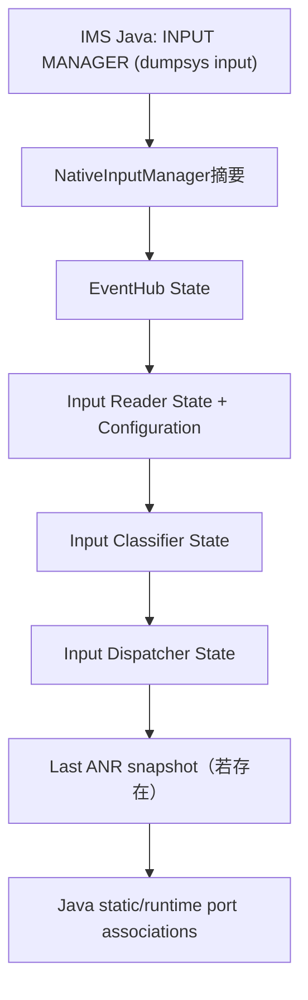
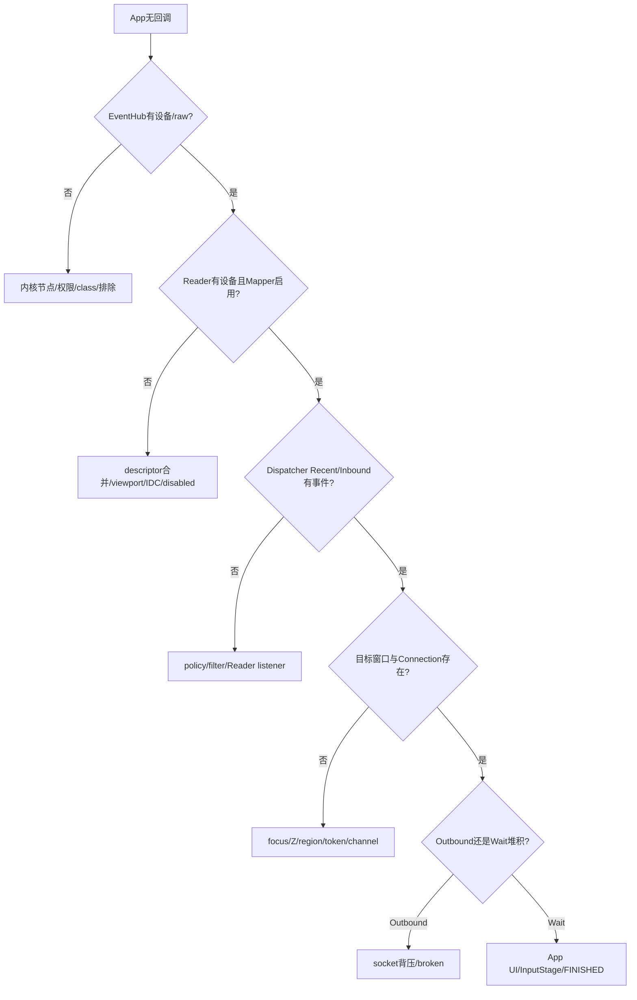

# 194 Android dumpsys input 与输入故障现场诊断

> 源码版本：Android 11 / `android-11.0.0_r48`  
> 当前环境：macOS只读学习，不实际连接或修改设备。文中adb命令是未来真机采集模板。

## 1. 本章目标：把dump变成证据链

看到“点了没反应”时，不应立刻猜View、驱动或ANR。输入现场至少有五层：EventHub设备、Reader设备/Mapper、Dispatcher窗口路由、Connection队列、App UI接收。

本章先理解`dumpsys input`每段源码，再建立从上游到下游、从静态状态到时间线的固定诊断顺序。

## 2. 一次dump的真实拼接顺序



`NativeInputManager::dump()`依次调用Reader、Classifier、Dispatcher；Reader内部又先dump EventHub。

## 3. dump权限

IMS Java入口先执行`DumpUtils.checkDumpPermission()`。无DUMP权限时不会泄露完整窗口、设备和队列信息。

这很重要，因为dump包含窗口名称、owner pid/uid、最近按键/触摸事件描述和设备标识。

## 4. dump是不是原子快照

不是全系统同一时刻原子快照。NativeInputManager、Reader/EventHub、Classifier、Dispatcher分别取得自己的锁并顺序拼接；前一段输出期间，其他模块可能继续前进。

因此跨段比较要允许少量时间偏差。需要严格时序时，应结合Perfetto/atrace或连续采样。

## 5. dump本身可能阻塞吗

可能。Reader dump持Reader锁并在内部调用EventHub dump取EventHub锁；Classifier/Dispatcher也各取自己的锁。r48这条nativeDump链没有为每段设置显式超时。

若某锁死锁，`dumpsys input`本身可能卡住；Watchdog monitor通过尝试锁和线程存活条件提供另一类证据。

## 6. Input Manager State看什么

Native摘要包含Interactive、System UI Visibility、Pointer Speed、Pointer Gestures Enabled、Show Touches、Pointer Capture Enabled。

它适合先排除全局开关问题，但不表示事件已到Reader或某窗口。例如Interactive=false会影响policy，却不能单独证明硬件没上报。

## 7. Event Hub State看设备是否打开

每个EventHub device打印id、name、classes、path、Enabled、descriptor、location、controller number、uniqueId、bus/vendor/product/version，以及实际加载的KL/KCM/IDC文件。

第一问：问题设备是否存在且Enabled？若这里都没有，先看内核节点、权限、热插拔与EventHub过滤，不必先查App。

## 8. EventHub id与Android InputDevice id不同

EventHub id对应打开的evdev子设备；InputReader可按descriptor把多个EventHub节点合并成一个逻辑InputDevice。

Reader dump里的`EventHub Devices: [ ... ]`正是两种id的桥。日志里id不一致不一定是事件跑错设备。

## 9. Classes能告诉你什么

Classes位反映键盘、cursor、touch、joystick等能力推断，并决定创建哪些Mapper。

触摸节点存在却未被识别为TOUCH/TOUCH_MT时，应回查ABS/KEY能力和EventHub class判定；这比直接调整TouchInputMapper公式更靠前。

## 10. 实际加载文件最有价值

`KeyLayoutFile`、`KeyCharacterMapFile`、`ConfigurationFile`直接告诉你最终命中的`.kl/.kcm/.idc`路径。

不要只因某vendor文件名“看起来应该匹配”就认为已加载；dump是运行时选择结果。

## 11. descriptor/location/uniqueId如何用

- descriptor：Reader合并与稳定识别的重要线索；
- location：input port关联display port的键；
- uniqueId：设备/显示显式关联线索；
- vendor/product/version：查找配置命名与硬件变体。

一次采集应把这四类身份同时记录，避免只拿易变device id做跨重启比较。

## 12. Input Reader State的设备数量

标题打印逻辑InputDevice数量，随后每个设备展示generation、external/mic、associated display port、sources、keyboard type、controller number、motion ranges和各Mapper内部状态。

EventHub有节点、Reader却无对应逻辑设备时，查ignored/excluded、descriptor合并、设备新增事件是否完成。

## 13. generation怎样解读

同一Reader device id的generation变化表示公开设备信息发生了可观察更新，例如layout/alias/source/range/viewport相关重配。

它不是事件序号。连续两次dump generation不变，也不意味着期间没有输入事件。

## 14. Sources与Mapper是否一致

Sources是各Mapper getSources的OR结果。比如触控板可能表现为MOUSE，触屏为TOUCHSCREEN，混合设备还可能含STYLUS/KEYBOARD。

若应用用source过滤，先确认dump的source是否符合预期，再查App逻辑。

## 15. Motion Ranges诊断什么

范围包含axis、source、min/max、flat/fuzz/resolution等公开信息。明显为0、宽高颠倒或缺轴会影响坐标、速度与App能力判断。

但MotionRange是加工后的设备描述，不完全等于内核EVIOCGABS原值；需要与EventHub/Mapper dump交叉看。

## 16. AssociatedDisplayPort与viewport

设备打印关联port，Reader Configuration末尾打印所有viewports。两者对不上时，增量DISPLAY_INFO可能禁用InputDevice，TouchMapper也可能因找不到viewport进入DISABLED mode。

触摸坐标错屏时，应同时核对location→port association和viewport physicalPort/displayId。

## 17. Reader Configuration看运行值

这里有ExcludedDeviceNames、VirtualKeyQuietTime、pointer/wheel velocity、PointerGesture各阈值以及Viewports。

它是Reader当前已经拉到的配置快照，比只看Settings数据库更接近真实消费值。

## 18. 配置生产值与消费值为何可能不同

设置刚变化时，NativeInputManager缓存可能已更新，但Reader pending refresh尚未处理；dump又是顺序非原子采样。

短暂不一致先重复采样；长期不一致再查requestRefresh、EventHub wake和Reader线程是否存活。

## 19. TouchMapper应重点看什么

按具体dump字段关注device mode、source、viewport、surface尺寸/方向、raw axes、calibration、current/last states和gesture状态。

判断顺序是：模式是否启用 → viewport是否正确 → raw range是否合理 → cooked坐标是否合理 → action/id状态是否连续。

## 20. Cursor/Keyboard Mapper重点

Cursor看mode、display、pointer capture、button/relative axis与velocity配置；Keyboard看keyboard type、orientation-aware、down keys、meta state、KL/KCM文件。

“按键有raw却无KeyEvent”常见于KL映射缺失、ignored/virtual策略或Mapper状态配对，不一定在Dispatcher。

## 21. Input Classifier State看什么

若MotionClassifier启用，会打印HAL service状态、内部BlockingQueue元素数与上限、每device classification和last down time。

队列持续接近上限说明HAL分类线程跟不上；分类允许滞后一两笔，不能拿某行classification与同一时刻单笔Motion强行一一对应。

## 22. Classifier为空意味着故障吗

不一定。设备可能未启用MotionClassifier或没有相应HAL，InputClassifier会作为pass-through继续向Dispatcher发事件。

应把分类器当附加阶段，而非所有触摸必需的硬件依赖。

## 23. Dispatcher摘要先看四个开关

`DispatchEnabled`、`DispatchFrozen`、`InputFilterEnabled`、`FocusedDisplayId`。

Frozen会停止正常推进但保留队列；disabled会重置/丢弃；filter enabled意味着事件可能先被Java过滤变换。不要把三种情况都写成“Dispatcher没工作”。

## 24. FocusedApplications与FocusedWindows不同

FocusedApplication表示系统期望该display上的应用及无窗口等待超时；FocusedWindow才是键事件实际目标。

有FocusedApplication但无FocusedWindow，正是no-focused-window ANR场景；两者名字相同也不能省略token/窗口状态核对。

## 25. TouchStatesByDisplay是手势路由现场

它打印display、down、split、deviceId、source，以及每个TouchedWindow的pointerIds和targetFlags。

若手指已经抬起但down仍长期true，查Reader是否发UP/CANCEL、Dispatcher是否因错误序列未提交状态；若pilfer后windows为空而gesture monitor仍在，可能是正常系统手势。

## 26. TouchState窗口与全量Windows的区别

全量Windows是当前可用于命中的输入窗口快照；TouchState windows只是当前手势已锁定的目标子集。

一个窗口在全量列表却不在TouchState，可能只是本次DOWN没命中；在TouchState却已不在全量列表，则窗口刷新清理/CANCEL可能尚处于竞态。

## 27. Windows列表怎样读

每display按前到后打印name、portal、paused、focus、wallpaper、visible、canReceiveKeys、flags/type、frame、scale、touchableRegion、inputFeatures、owner pid/uid和timeout。

点击无响应时用实际坐标判断：前面是否有touch modal窗口、区域是否包含点、目标是否visible/paused、token对应Connection是否存在。

## 28. 窗口名不是连接身份

dump可读性主要用name，但真实关联依赖token；r48的普通文本窗口行未把所有token都直接打印出来。

同名窗口、重建窗口或多display场景要结合WMS dump、channelName、owner pid/uid和时间线，不要只按字符串强关联。

## 29. Monitors段怎样判断抢流

分别列global与gesture monitors及display。它只能证明注册存在，不能证明某gesture monitor已加入当前TouchState或成功pilfer。

要判断pilfer，应同时看TouchState是否只剩monitor语义、普通窗口是否收到合成CANCEL，以及相关日志。

## 30. RecentQueue是什么

它保存最近已dispatch或drop的EventEntry，r48上限为10，按旧到新打印description与基于eventTime的age。

这是短历史而非完整录制。高频MOVE下十条很快被覆盖，故障发生后应尽快采集。

## 31. age不是排队耗时

Recent/Pending/Inbound的age是`now - eventTime`。它混合了硬件到当前的总年龄，不等于只在某一队列等待的时间。

Connection WaitQueue额外打印`wait=now-deliveryTime`，才更接近App已收到后未finish的等待。

## 32. PendingEvent说明什么

PendingEvent是Dispatcher当前取出、尚未完成目标处理/释放的事件。它可能在等焦点窗口、policy intercept重试或其他同步条件。

同一PendingEvent长期age增长，比单纯InboundQueue有元素更值得查其具体type和等待原因。

## 33. InboundQueue堆积说明什么

事件已从Reader进入Dispatcher但还未成为pending。队列持续增长说明Dispatcher处理速度低于输入产生速度，可能被pending等待、policy慢调用或线程调度卡住。

一次瞬时非空很正常；诊断要连续采样长度和最老age。

## 34. OutboundQueue与WaitQueue再区分

- Outbound：已为某Connection建DispatchEntry，但尚未成功publish完；
- Wait：已publish给consumer，等待FINISHED。

Outbound长大优先查socket背压/Connection状态；Wait长大优先查App Looper、InputStage defer、IME或finish回执。

## 35. Connection行的三个核心字段

`status=NORMAL/BROKEN/ZOMBIE`、`monitor=true/false`、`responsive=true/false`。

NORMAL+responsive=false多为ANR/过期wait；BROKEN是传输不可恢复。注销路径先把Connection从`mConnectionsByFd`移除，随后才置ZOMBIE，而dump持同一Dispatcher锁遍历这张表，所以标准r48的Connections段正常不应打印ZOMBIE；若真的出现，应优先怀疑定制改动或状态不变量被破坏，不能用普通采样竞态敷衍解释。

## 36. wait很大为何不一定立刻再ANR

Connection一旦标为unresponsive，旧ANRTracker项会清理，新publish条目也不再重复加入tracker。Policy还可能延长timeout。

因此dump中wait持续增长与“每5秒不断新ANR”不是一一对应。

## 37. Last ANR snapshot价值

Dispatcher在ANR发生时把reason、时间、窗口和当时完整dispatch state保存到`mLastAnrState`；当前dump若非空会追加这份历史。

它比事后当前状态更接近现场：App可能已恢复、waitQueue已清，但last snapshot仍显示当时卡住的entry。

## 38. Last ANR snapshot也有局限

只保存最近一次，会被下一次覆盖；它是Dispatcher状态，不包含同一时刻完整Reader/App线程栈；时间字符串与monotonic event age基准也不同。

应配合ANR traces、system_server/App stack和logcat，不要把它当全系统墓碑。

## 39. AppSwitch与KeyRepeat配置

Dispatcher末尾打印AppSwitch pending/due和KeyRepeat delay/timeout。按键似乎被跳过或延迟时，检查是否处于app switch优化窗口及repeat合成配置。

Motion触摸故障一般不应首先纠结KeyRepeat字段。

## 40. Java Associations为何在最后

native dump完成后IMS打印static/runtime input port associations。Runtime可覆盖静态关联；清除runtime后静态项恢复。

它们是配置生产侧证据，需与Reader当前associated port/viewports对照，才能知道刷新是否已消费。

## 41. dumpsys inputflinger是什么

源码中的独立host服务实现自己的`dumpsys inputflinger`标题与Host dump。在r48常规Framework主路径，system_server NativeInputManager也注册名为inputflinger的Binder对象。

具体设备上命令返回哪套实现取决于构建和服务发布者；不要假设`dumpsys inputflinger`必等于`dumpsys input`全部内容，也不要只看服务名推进程。

## 42. 未来真机最小采集包

```bash
adb shell dumpsys input
adb shell dumpsys window windows
adb shell dumpsys activity processes
adb shell ps -AT
adb logcat -b all -d
```

同一故障尽量在短时间内连续采集并记录操作时间、display、设备类型、坐标/按键。这里仅作模板，当前Mac无需执行。

## 43. 原始层未来怎样采集

有权限的debug设备可短时使用`getevent -lt`观察evdev。先限定具体节点和数秒窗口，完成后立即停止。

原始输入可能包含密码、解锁轨迹和实体按键，日志必须最小化、脱敏并遵守设备授权；不要长时间后台录制所有输入节点。

## 44. 时间线工具如何补dump

Perfetto/atrace可观察InputReader、InputDispatcher、App main、ViewRoot、Choreographer线程，以及`iq/oq/wq`队列计数trace。

dump回答某一采样附近的状态，trace回答状态怎样演变；两者结合才能区分瞬时队列与持续阻塞。

## 45. “完全没事件”的诊断树



## 46. “坐标错/点到别处”的诊断树

先核对raw axis，再看Reader viewport与orientation、physical/logical frame、TouchMapper scale/offset；之后看Dispatcher窗口frame/windowScale/touchableRegion；最后才看View的matrix、scroll和事件变换。

每层都记录输入坐标系与输出坐标系，不要拿App local坐标直接和raw ABS数值比较。

## 47. “偶发卡住后恢复”的诊断树

连续采样Pending/Inbound、目标Connection outbound/wait/responsive和last ANR；trace InputDispatcher是否被policy占用、App main是否在GC/Binder/锁/IME defer；检查迟到FINISHED后responsive是否恢复。

偶发问题最怕只留恢复后的单份dump，last ANR和时间线优先级更高。

## 48. 源码级字段定位练习

```bash
rg -n "Event Hub State|Input Reader State|Input Dispatcher State" \
  frameworks/native/services/inputflinger

rg -n "RecentQueue|PendingEvent|InboundQueue|OutboundQueue|WaitQueue" \
  frameworks/native/services/inputflinger/dispatcher/InputDispatcher.cpp
```

在Mac上任选一个字段，从打印位置反向追到写入/清理位置，比死记dump模板更有效。

## 49. 复读审计

复读后限定了六点：dump各段不是全局原子；native链无逐段显式timeout；RecentQueue仅10条且age不是队列时间；global/gesture注册不等当前参与；last ANR只是Dispatcher最近快照；服务名不能证明独立进程。

还应避免为了“看更多”盲目打开详细输入日志。输入数据高度敏感，证据采集必须短时、定向、可授权和可脱敏。

## 50. 检查题与下一章

1. EventHub有设备而Reader无设备，应优先检查哪些环节？
2. PendingEvent age与WaitQueue wait分别代表什么？
3. 当前Connection已恢复时，为什么还要看Last ANR snapshot？
4. 为什么一份`dumpsys input`不能证明各段完全同一时刻？

下一章将做一次**完整触摸事件源码实战追踪**：从EV_ABS/SYN_REPORT开始，沿Mapper、NotifyMotion、Dispatcher目标、InputChannel、ViewRoot和FINISHED逐步标注对象、线程、坐标与编号。
