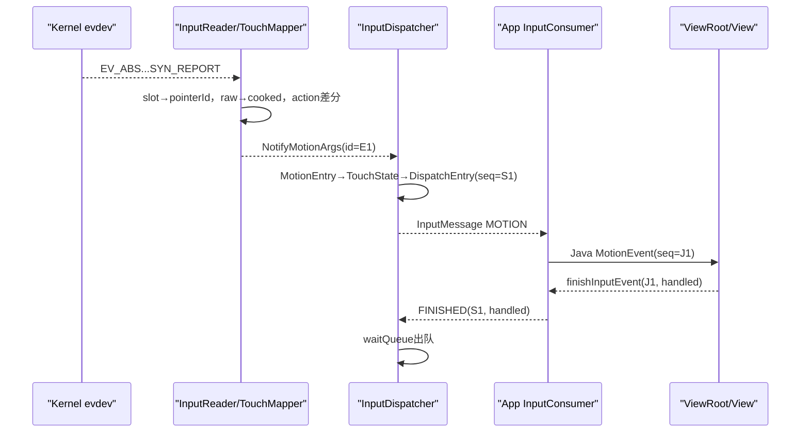

# 195 Android 完整触摸事件源码实战追踪

> 场景：Protocol B单指触屏，slot 0、trackingId 42，完成DOWN→MOVE→UP。  
> 源码：Android 11 `android-11.0.0_r48`；Mac只读推演，不编译。

## 1. 本章读法

不再分模块背函数，而是跟随同一根手指，逐跳记录“对象、线程、编号、坐标、状态、完成边界”。示例数值用于推演，真实scale取决于设备axis和viewport。

## 2. 六类身份先列清

| 名称 | 示例 | 生命周期 |
|---|---:|---|
| Linux slot | 0 | 设备并行contact容器 |
| trackingId | 42 | 驱动此次contact身份 |
| Android pointerId | 0 | Framework手势内身份 |
| Notify/Event id | E1 | 一笔逻辑事件身份 |
| DispatchEntry seq | S1 | 该目标的传输/回执身份 |
| Java InputEvent seq | J1 | App native→Java映射身份 |

前三个标识“哪根手指”，后三个标识“哪笔事件/发送”。

## 3. 端到端总图



## 4. DOWN的raw packet

典型Protocol B上报：

```text
EV_ABS ABS_MT_SLOT        0
EV_ABS ABS_MT_TRACKING_ID 42
EV_ABS ABS_MT_POSITION_X  300
EV_ABS ABS_MT_POSITION_Y  500
EV_ABS ABS_MT_PRESSURE    60
EV_SYN SYN_REPORT         0
```

同一个SYN_REPORT之前的轴更新组成一帧，不是每行都独立生成MotionEvent。

## 5. EventHub做什么

InputReader线程从EventHub取得带deviceId、when、type/code/value的RawEvent数组。EventHub不解释pointerId，也不做窗口坐标。

设备的monotonic时间成为后续eventTime基础。

## 6. MultiTouchAccumulator选择slot

ABS_MT_SLOT把`mCurrentSlot=0`；后续各axis写`mSlots[0]`。trackingId 42非负令slot inUse，并保存42。

任一位置/压力轴也会置inUse，这是第183章所说异常轴可能复活旧slot的边界。

## 7. SYN_REPORT触发同步

TouchInputMapper看到SYN_REPORT后建立next RawState，收button/scroll，再调用`syncTouch(when, &next)`。

Protocol B的`finishSync()`不会每帧清slots；未更新轴沿用上帧值。

## 8. trackingId怎样变pointerId

Mapper遍历in-use slots，寻找旧`mPointerTrackingIdMap`中值42；首次找不到，就分配第一个空闲pointerId，通常为0，并保存0→42。

pointerId不是trackingId取模，也不是slot号复制。

## 9. RawPointerData怎样建立

把slot的x=300、y=500、pressure等复制到pointer数组；设置`idToIndex[0]=0`，mark pointerId 0为touching，并把pointerCount设1。

Pointer数组index是当前打包位置，pointerId是稳定身份，两者恰好都为0只是本例巧合。

## 10. current/last RawState

next进入pending后，processRawTouches将它复制成CurrentRawState；LastRawState仍是空帧。

不变量是只有完整走过cook/dispatch的Current才会成为下一轮Last，避免内部状态先于下游可见事件。

## 11. raw坐标如何变cooked

`cookPointerData()`应用校准、viewport natural surface scale/offset、orientation和pressure/size公式。假设raw(300,500)最终成为display cooked(600,1000)。

这仍是display/Dispatcher输入坐标，不是目标View local坐标。

## 12. DOWN action怎样由集合差分得到

Last touching bits为空，Current含id0，所以downIdBits={0}。`dispatchTouches()`先mark id0，发现当前仅一个pointer，设置`mDownTime=when`。

内部以POINTER_DOWN调用`dispatchMotion()`，单指特例把它替换为ACTION_DOWN。

## 13. pointer数组为何按id排序

`dispatchMotion()`反复清`idBits`最低置位，按pointerId升序拷贝properties/coords。changedId匹配时将当前打包index写入action index位。

首DOWN只一个pointer，最终action就是DOWN且index为0。

## 14. NotifyMotionArgs里有什么

它取得新的全局event id E1，携带eventTime、deviceId、source、displayId、policyFlags、DOWN、pointerCount=1、id0、cooked坐标、precision和downTime。

trackingId和slot不再向应用传输。

## 15. Classifier这一跳

InputClassifier同步接收Notify；若HAL启用，读取已有classification并异步排队本笔数据，再把新Notify副本或原args继续送Dispatcher。

E1通常保持，classification可能来自稍早一笔结果。

## 16. Dispatcher notifyMotion先验证

检查action、actionButton、pointerCount、pointer properties合法性；失败则直接返回，不建MotionEntry。

随后加TRUSTED policy flag，并同步执行`interceptMotionBeforeQueueing`。

## 17. InputFilter分叉

若filter启用，Dispatcher构造native MotionEvent交Java filter。Filter消费则原事件不入队；放行则加FILTERED后继续；Accessibility还可能另行注入新事件。

本例假设未启用filter。

## 18. MotionEntry保留哪个id

Dispatcher用`args->id`创建MotionEntry，所以逻辑事件id仍为E1。入inbound queue后按是否从空变非空决定wake Dispatcher线程。

入队发生在Reader调用链，目标选择发生在Dispatcher线程。

## 19. Dispatcher取成PendingEvent

`dispatchOnceInnerLocked()`从Inbound头取E1成为mPendingEvent，检查dispatch mode、stale/app-switch/drop reason，再进入`dispatchMotionLocked()`。

Pending不是已发送，只是当前正在决策。

## 20. DOWN怎样建立TouchState

按display与cooked坐标(600,1000)从窗口Z序查找，检查visible、paused、touchableRegion、modal、portal、responsive等。

假设命中Window A，临时TouchState记录down=true、device/source/display和Window A foreground AS_IS。

## 21. 临时状态为何最后才提交

目标选择先在tempTouchState操作；注入权限和目标有效性全部通过后才写回`mTouchStatesByDisplay`。

失败不会留下“DOWN没发出去但路由认为已按下”的半状态。

## 22. monitor怎样加入本例

DOWN时responsive gesture monitors写入TouchState；目标成功后global monitors逐事件追加。普通Window A、gesture/global各自成为InputTarget。

本例继续只跟Window A，其他目标拥有不同DispatchEntry seq。

## 23. display坐标怎样变window参数

`addWindowTargetLocked()`保存offset=`-frameLeft/-frameTop`、windowX/YScale和globalScale。假设窗口frame左上(100,200)，初步local位置是(500,800)。

真正变换分两部分随InputMessage发送，避免破坏raw coordinate语义。

## 24. 一个EventEntry为何有多个DispatchEntry

同一E1向Window A、monitor、wallpaper等目标分别创建DispatchEntry。每个有自己的targetFlags、offset、timeout和非零seq。

因此事件id相同不表示回执seq相同。

## 25. InputState在发送前更新

为Window A enqueue DispatchEntry时，Connection InputState trackMotion记录“该接收者已看到id0 DOWN流”。

若后续窗口移除，可据此合成CANCEL；它记录接收者视角，不是硬件真相。

## 26. channel seq何时产生

DispatchEntry构造取得该传输条目的seq S1。它必须非0，FINISHED按S1定位waitQueue。

同一目标的DOWN/MOVE/UP各有不同seq；批处理会在App端建立seq chain。

## 27. publish前坐标如何处理

Dispatcher计算xScale/yScale、xOffset/yOffset；globalScale若非1会预缩coords，但window scale作为message参数由client用于相对坐标。

ZERO_COORDS目标则清coords，防止OUTSIDE监听者跨UID窃取位置。

## 28. publish成功的完成边界

InputPublisher把MOTION InputMessage写server socket，成功后DispatchEntry从outbound移到wait，记录deliveryTime/timeout并加入ANRTracker。

这只证明消息进入传输，不证明App Java回调、View处理或屏幕更新。

## 29. App Looper收到DOWN

client fd可读，NativeInputEventReceiver在App UI Looper调用InputConsumer.consume。DOWN不能被MOVE batch吞并，立即创建native MotionEvent，outSeq=S1。

JNI复制为Java MotionEvent，并分配Java对象自己的mSeq J1，mSeqMap保存J1→S1。

## 30. Java MotionEvent坐标

MotionEvent同时保留转换参数；`getX/getY`给应用窗口坐标，raw访问体现显示空间语义。精确API实现受native MotionEvent transform影响。

不要认为socket中的coords已经简单减frame且所有raw/local字段共用一份值。

## 31. ViewRoot输入队列

WindowInputEventReceiver把event加入ViewRoot pending queue，依次走NativePreIme、ViewPreIme、Ime、EarlyPostIme、NativePostIme、ViewPostIme、Synthetic stages。

Touch通常从post-IME链进入DecorView/ViewGroup命中。

## 32. ViewGroup建立TouchTarget

DOWN按子View Z序和坐标命中，inverse matrix变为child local，调用listener/onTouchEvent。处理成功后TouchTarget锁住该child。

后续MOVE不重新按全树命中，除非拦截/移除/手势取消等状态变化。

## 33. DOWN完成如何回S1

所有stage最终调用Receiver.finishInputEvent(Java event, handled)。JNI用J1查出S1，回收映射并发送FINISHED(S1, handled)。

Dispatcher fd回调按S1找到wait entry，移除ANRTracker和waitQueue，再释放DispatchEntry。

## 34. MOVE raw packet

slot通常无需重报trackingId：

```text
EV_ABS ABS_MT_SLOT       0
EV_ABS ABS_MT_POSITION_X 320
EV_ABS ABS_MT_POSITION_Y 530
EV_SYN SYN_REPORT        0
```

Protocol B slot保留trackingId 42和未变axis。

## 35. MOVE为何仍是pointerId 0

syncTouch找到trackingId42对应旧map id0，所以Current与Last touching bits相同，坐标不同。

`dispatchTouches()`走集合相等分支，只要非空就发ACTION_MOVE。

## 36. MOVE也可能零位移

即使坐标完全未变，只要收到同步帧且touching集合非空，这条r48路径仍可dispatch MOVE；下游 batching/过滤可能改变应用观察频率。

不能把每个MOVE等同于“坐标必变化”。

## 37. MOVE的downTime与eventTime

eventTime是本帧SYN时间；downTime沿用首DOWN的mDownTime。两者之差是手势持续时间，不是Dispatcher排队时长。

每笔MOVE取得新event id E2和目标seq S2。

## 38. App为何不一定立即看到MOVE

InputConsumer遇到MOVE会建立/追加batch，通知`onBatchedInputEventPending()`，通常等Choreographer帧时以frameTime消费。

多个InputMessage MOVE可合成一个Java MotionEvent：最新sample为current，更早sample成为history。

## 39. 批处理seq怎样完成

合并后的Java event只暴露一个J seq，但NativeInputEventReceiver保存seq chain。Java finish一次会展开，对所有原始channel seq分别发送FINISHED。

因此Dispatcher仍能清每条S2/S3 wait entry。

## 40. resampling放在哪

App InputConsumer消费batch时按frameTime-5ms目标时间插值或受限外推，并保持pointer连续性。它不会修改Dispatcher TouchState。

应用看到的MOVE坐标可能不是任一原始SYN帧的精确坐标。

## 41. UP的raw packet

Protocol B释放：

```text
EV_ABS ABS_MT_SLOT        0
EV_ABS ABS_MT_TRACKING_ID -1
EV_SYN SYN_REPORT         0
```

Accumulator只令slot inUse=false，旧trackingId/coords字段可能保留但本帧不输出contact。

## 42. UP怎样由集合差分产生

Current touching bits为空，Last={0}，所以upIdBits={0}。dispatchTouches先用Last cooked数组发POINTER_UP；因pointerCount为1，dispatchMotion特例改为ACTION_UP。

UP携带最后已知坐标，不是“空pointer MotionEvent”。

## 43. UP后pointerId映射怎样释放

syncTouch构造newPointerIdBits为空并赋回mPointerIdBits。下次新trackingId可复用pointerId0。

App不能跨独立手势把pointerId0视为同一根物理手指。

## 44. DOWN/MOVE/UP目标是否重选

DOWN建立TouchState；MOVE/UP沿用Window A目标，不因坐标移出普通窗口自动换窗。只有slippery等显式机制例外。

UP完成后TouchState down=false并移除该display状态。

## 45. UP到App前会先flush MOVE吗

InputConsumer若已有不能与UP合并的MOVE batch，会先消费旧batch并defer当前UP，确保MOVE在UP之前交Java。

App下一轮再取UP；顺序不会因按帧batch反转。

## 46. handled对Motion有什么影响

Motion FINISHED的handled用于完成协议和统计，但不像未处理Key那样进入fallback key policy。

无论View返回true/false，该Motion目标的wait entry都必须finish。

## 47. 四个完成点

1. SYN_REPORT：硬件帧结束；
2. Notify入Dispatcher：Reader加工结束；
3. publish→wait：消息送入App通道；
4. FINISHED→wait出队：App输入管线结束。

四者都不证明因此触发的UI已由SurfaceFlinger present到屏幕。

## 48. 故障插点表

| 现象 | 首查位置 |
|---|---|
| 无raw | EventHub/kernel |
| raw有、无Notify | slot/axis/Mapper disabled/palm |
| Notify有、无目标 | display/窗口/region/Connection |
| outbound堵 | socket/App未读 |
| wait堵 | App UI/InputStage/FINISHED |
| 坐标错 | viewport→window transform→View matrix |
| pointer错乱 | tracking map/id bits/action index |

## 49. macOS源码练习

```bash
rg -n "ABS_MT_TRACKING_ID|syncTouch" \
  frameworks/native/services/inputflinger/reader/mapper/MultiTouchInputMapper.cpp
rg -n "dispatchTouches|dispatchMotion" \
  frameworks/native/services/inputflinger/reader/mapper/TouchInputMapper.cpp
rg -n "publishMotionEvent|consume\(" \
  frameworks/native/libs/input/InputTransport.cpp
```

自己给DOWN/MOVE/UP各画一行，填slot、trackingId、pointerId、eventId、channel seq和Java seq。

## 50. 复读审计与下一章

复读限定：SYN_REPORT才提交帧；首/末单指由POINTER action改写；slot/trackingId不传App；eventId与每目标seq不同；MOVE可零位移并在App批处理/重采样；UP用Last坐标；FINISHED不等画面显示。

下一章用同样方法追踪**完整Key事件**，重点加入scanCode→keyCode、meta/repeat、两次policy、焦点、IME和fallback链。
