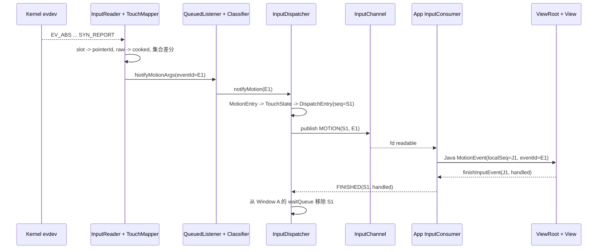

# 195 Android 完整触摸事件源码实战追踪：一根手指如何从 `EV_ABS` 走到 `FINISHED`

> 源码版本：Android 11 / `android-11.0.0_r48`  
> 当前环境：macOS 源码树，只做只读研究；数值用于建立对象关系，不代表某台设备的校准结果。

## 1. 固定案例：先给这次追踪划清边界

这一章不按类名逐个背函数，而是只跟一根手指。假设一块直接触摸屏使用 Linux Multi-touch Protocol B，驱动为第一次接触选择：

```text
slot = 0
trackingId = 42
raw DOWN position = (300, 500)
raw MOVE position = (320, 530)
```

手势只有三帧：`DOWN -> MOVE -> UP`。为把主干讲清，案例还固定以下前提：

- 设备已经打开、配置完成并关联到正确 display；
- Mapper 处于 `DEVICE_MODE_DIRECT`，不是鼠标式 pointer mode；
- 接触不是 virtual key、palm 或外置触控笔融合数据；
- InputFilter 未启用，没有注入、portal、slippery、wallpaper 或 monitor 抢流；
- 触点命中前台 `Window A`，其根布局中的 `Child B` 在 `DOWN` 返回 `true`；
- channel 可写、App Looper 能运行，ViewRoot 的输入 stage 最终正常结束事件。

这些条件不是在说分支不存在。恰恰相反：先锁定一条可验证主线，随后每到分叉点再写明“若条件变化，哪本账会不同”。

### 一句话结论

一笔触摸并不是一个对象从内核一路原样搬到 View。它会依次经历：

```text
evdev input_event 序列
-> EventHub RawEvent 数组
-> Touch Mapper RawState / CookedState
-> NotifyMotionArgs
-> Dispatcher MotionEntry
-> 每目标 DispatchEntry
-> InputMessage
-> native MotionEvent
-> Java MotionEvent
-> ViewRoot QueuedInputEvent
-> FINISHED reply
```

其中坐标会变换，集合会做差，事件可能被复制或批处理，编号也分属不同账本。真正稳定的阅读方法是：每一步都同时回答“当前对象是谁、运行在哪条线程、保存哪种编号、跨过了哪个完成点”。

### 端到端主线



图中的箭头不是全都跨线程。Mapper 到 `QueuedInputListener`、Classifier、Dispatcher `notifyMotion()` 这一段仍在 InputReader 调用栈；真正的目标选择和 channel publish 由 InputDispatcher 线程推进。

## 2. 四本账：身份、时间、线程与完成点不能混写

端到端追踪最容易错在“同名词跨层复用”。先把四本账摊开，后面所有状态都往账上落。

### 身份账：八种标识回答八个问题

| 名称 | 本例 | 产生位置 | 生命周期与用途 |
|---|---:|---|---|
| EventHub deviceId | `H7` | EventHub | 标识这次 raw 来自哪个 evdev 子设备；Reader 据此找到处理对象 |
| Reader logical deviceId | `D3` | InputReader | 标识合并后的逻辑 InputDevice；Mapper 把它写入通知 |
| Linux slot | `0` | 驱动 / Protocol B | 设备保存并行 contact 状态的槽，不传给 App |
| trackingId | `42` | 驱动 | 本次物理 contact 的标识，释放时以负值结束，不传给 App |
| Android pointerId | `0` | `MultiTouchInputMapper` | Framework 手势内的 pointer 身份，出现在 `PointerProperties.id` |
| motion event id | `E1` | InputReader 的 `IdGenerator` | 逻辑 Motion 事件身份，正常 `AS_IS` 路径跨进程保留 |
| DispatchEntry / channel seq | `S1` | Dispatcher | 某条 connection 上一次投递及回执的身份，每个目标各自拥有 |
| Java object sequence | `J1` | Java `InputEvent` 对象 | App 进程内对象映射键，用来查回 native transport seq |

两套 deviceId 回答“哪个子设备产生 raw”和“哪个逻辑设备发出通知”；slot、trackingId、pointerId 在不同层参与 contact 跟踪；后三个事件编号回答“哪笔逻辑事件、哪次目标投递、哪个 Java 对象”。本例恰好 `slot=0`、`pointerId=0`，并不建立二者相等的规则。

`RawEvent.deviceId` 来自 EventHub，内建键盘还有映射为保留值 0 的规则；Reader 用它找到 EventHub 子设备及 Mapper。`NotifyMotionArgs.deviceId` 则由 `InputMapper::getDeviceId()` 取得，是 Mapper 所属的 Reader logical device id。复合设备中一个逻辑 InputDevice 可以对应多个 EventHub id，两者不能只写成笼统的 `deviceId`。

`E1` 也不是简单自增数。r48 的 `IdGenerator` 用 2 位 source 和 30 位随机数构造 id；InputReader 与 Dispatcher 能区分来源，随机空间使碰撞概率很低，但源码没有把它定义成严格递增序列。诊断时可按十六进制 id 关联相邻对象，不能拿大小关系当时间顺序。

### Java 的两个“sequence”尤其容易混

Java `InputEvent.getId()` 返回跨进程携带的事件 id；`getSequenceNumber()` 返回当前 Java 对象自己的本地序号。后者由 App 进程里的静态原子计数器分配，parcel 化时不作为原 transport seq 保留。

NativeInputEventReceiver 把 Dispatcher channel seq `S1` 交给 Java 回调，同时 Java 事件对象自己已有 `J1`。`InputEventReceiver.dispatchInputEvent()` 保存的是：

```text
J1 -> S1
```

所以 Java 完成事件时传回事件对象，Receiver 先取 `J1`，再查到真正应回给 Dispatcher 的 `S1`。把 `event.getSequenceNumber()` 当成 Dispatcher seq，会让跨进程日志完全错位。

### 时间账：至少分开五种时间

| 时间 | 含义 | 本例如何使用 |
|---|---|---|
| evdev timestamp | 驱动写入 `input_event` 的时间 | EventHub 转成纳秒，成为 raw `when` |
| `eventTime` | 当前逻辑事件时间 | 通常来自结束该帧的 `SYN_REPORT.when` |
| `downTime` | 本次手势第一指按下时间 | DOWN 时设置，后续 MOVE / UP 沿用 |
| `deliveryTime` | Dispatcher 开始向某目标 publish 的时间 | 用于 wait、timeout 与延迟诊断 |
| frame / resample time | App 消费 MOVE batch 的帧目标时间 | 可以生成不等于某个原始 SYN 样本的坐标 |

EventHub 在设备打开时尝试用 `EVIOCSCLOCKID(CLOCK_MONOTONIC)` 对齐时钟。ioctl 失败只留下日志，设备仍可继续使用；因此只有确认该设置成功后，才可无条件把 evdev timestamp 与 Android monotonic 时间域直接对齐。

另一个边界是排序：一次 `getEvents()` 返回多个设备的可读批次，不承诺把不同 fd 的事件重新排成全局 timestamp 有序流。本文只跟同一触摸设备内的三帧，不用跨设备数组位置推导先后。

### 线程账：调用栈与工作线程分开画

```text
InputReader thread
  EventHub.getEvents()
  InputReader.processEventsLocked()
  TouchInputMapper.process()/sync()/cookAndDispatch()
  QueuedInputListener.flush()
  InputClassifier.notifyMotion()
  InputDispatcher.notifyMotion()
    policy intercept 也在这条 caller 线程同步执行
    只把 MotionEntry 放进 inbound queue

InputDispatcher thread
  取 inbound -> pending
  选择 targets / 更新 TouchState
  为每个 target 建 DispatchEntry
  publish 到每条 InputChannel
  接收 FINISHED 并清 waitQueue

App Looper thread（Window A 通常是 UI Looper）
  NativeInputEventReceiver.handleEvent()
  InputConsumer.consume()
  Java InputEventReceiver.dispatchInputEvent()
  ViewRootImpl 输入 stages / ViewGroup / View
  finishInputEvent()
```

`InputEventReceiver` 本身绑定的是构造时传入的 `Looper`，并非类型上强制 UI 线程；只是 Window 的 ViewRoot 主路径通常把它放在 UI Looper。

### 完成点账：同一个“完成”有六种范围

| 完成点 | 能证明什么 | 仍不能证明什么 |
|---|---|---|
| `SYN_REPORT` | 驱动结束一帧 MT 状态更新 | Mapper 一定产生 MotionEvent |
| `cookAndDispatch()` 返回 | queued listener 已保存通知副本，Mapper current 已推进为 last | queue 已 flush、Dispatcher 已选中窗口 |
| MotionEntry 入 inbound | Dispatcher listener 已接收逻辑事件 | Dispatcher 线程已发送 |
| `publishMotionEvent()` 成功 | 消息已写入目标 channel，条目进入 wait | App 已读、Java 已回调 |
| `FINISHED(S1)` 被处理 | 该目标的 App 输入管线已回复这次投递 | `handled=true`，也不证明画面已绘制 |
| Surface present | 新画面已被合成显示 | 这是输入协议之外的图形完成点 |

全文最重要的纪律是：任何结论都停在证据已经跨过的那条线，不能从 `SYN_REPORT` 一步跳到“用户已经看到 UI 响应”。

## 3. DOWN 原始帧：EventHub 只搬运事实，不解释手势

本例的第一次接触可由如下 Protocol B 包表达：

```text
EV_ABS  ABS_MT_SLOT         0
EV_ABS  ABS_MT_TRACKING_ID  42
EV_ABS  ABS_MT_POSITION_X   300
EV_ABS  ABS_MT_POSITION_Y   500
EV_ABS  ABS_MT_PRESSURE     60
EV_SYN  SYN_REPORT          0
```

行顺序取决于驱动，关键约束是这组更新由最后的 `SYN_REPORT` 封口。每一行不是一个独立 Android `MotionEvent`。

### EventHub 从 fd 得到什么

`EventHub::getEvents()` 等待 epoll，某个 input fd 可读后，把一批 `struct input_event` 读进 buffer。对每项只填充：

```text
RawEvent.when
RawEvent.deviceId
RawEvent.type
RawEvent.code
RawEvent.value
```

它没有 slot 数组、pointerId、action、窗口或 View 的概念。这里的 `deviceId` 还处在 EventHub / Reader 桥接语境；复合设备随后可能由 InputReader 映射成逻辑设备，不能仅凭 `/dev/input/eventX` 文件名猜应用看到的 `InputDevice.getId()`。

### `when` 来自事件，不是读取时刻

`processEventTimestamp()` 把 `input_event.time.tv_sec/tv_usec` 转成纳秒。它没有在 `read()` 完成后调用 `systemTime()` 给所有事件盖同一个章，因此：

- `eventTime` 更接近驱动把事件排进 evdev buffer 的时间；
- Reader 被调度得晚，不会把旧事件伪装成“刚发生”；
- 只有时钟域已确认一致时，`now - eventTime` 才能解释为同域 age。

源码注释写的是 monotonic 假设，真正建立该假设的动作在 `configureFd()`。`usingClockIoctl=false` 并不会让设备 open 失败，所以现场必须把成功日志也纳入证据。

### InputReader 的锁边界

`InputReader::loopOnce()` 有三个阶段：

```text
持 Reader mLock：刷新配置，算 EventHub timeout
不持 Reader mLock：EventHub.getEvents()
持 Reader mLock：processEventsLocked()，更新 Mapper 状态
不持 Reader mLock：QueuedInputListener.flush()
```

最后一次解锁非常关键。Mapper 在 Reader lock 内把通知复制进 queue；真正调用下游 listener 时已不持 Reader lock，避免 Dispatcher / policy 回调间接回到 Reader 形成锁环。不过它仍发生在同一条 InputReader 工作线程，不是另起一条“flush 线程”。

### 一帧的边界只对当前设备成立

在当前设备上，`SYN_REPORT` 使 TouchInputMapper 调用 `sync(rawEvent->when)`。它表示“此前累积的 slot/axis 更新现在可作为一个 evdev 同步 packet 观察”，不表示：

- 所有设备都同步到了同一物理时刻；
- 这一帧一定包含坐标变化；
- 一帧只会产生一条 Android Motion；
- 事件已经离开 InputReader。

多指拓扑在同一帧同时变化时，`dispatchTouches()` 可以按 `UP -> 必要 MOVE -> DOWN` 产生多条 Motion。单指案例只会命中其中一个动作。

read buffer 边界也不是同步 packet 边界：一批 EventHub 返回可以含多个 `SYN_REPORT`，一个未结束的 packet 也可以跨两次 read，Accumulator 会保留中间状态。若内核报告 `SYN_DROPPED`，InputDevice 会 reset 并忽略后续 raw，直到下一个 `SYN_REPORT` 才恢复对齐；这个恢复用 SYN 本身不会按正常触摸帧送进 Mapper。

## 4. Protocol B 累加器：slot 是状态容器，不是事件对象

`MultiTouchMotionAccumulator` 保存每个硬件 slot 的最近字段。看到 raw 行时，应把它理解为“修改容器”，而不是“创建 pointer”。

### 第一次接触如何写 slot 0

`ABS_MT_SLOT 0` 只把 `mCurrentSlot` 切到 0。随后的字段都写向 `mSlots[0]`：

| raw code | 对 slot 0 的改变 |
|---|---|
| `ABS_MT_TRACKING_ID 42` | `mInUse=true`，保存 trackingId 42 |
| `ABS_MT_POSITION_X 300` | `mInUse=true`，保存 X |
| `ABS_MT_POSITION_Y 500` | `mInUse=true`，保存 Y |
| `ABS_MT_PRESSURE 60` | `mInUse=true`，保存 pressure |

位置、压力、距离、工具类型等轴更新也会把 `mInUse` 置为 true。这能兼容部分上报方式，也解释了一个故障边界：设备若在释放后异常发送旧 slot 的轴值，累加器可能再次把它视为使用中。

### 释放只关 `inUse`，不会抹掉坐标

Protocol B 的：

```text
ABS_MT_TRACKING_ID -1
```

只执行 `slot->mInUse = false`。旧 trackingId、X、Y、pressure 等字段仍保留，可能被之后的接触覆盖或复用。因此 dump / 调试器里看到 slot 内还有 `(320, 530)`，不等于当前仍有 active contact；判断当前接触必须以 `isInUse()` 为主。

这个细节也是 UP 能带最后坐标的背景之一，但不是直接原因。最终 UP 读取的是 Mapper 的 `LastCookedState`，不是去读取一个“已清空 slot”。

### 为什么 Protocol B 不在每帧清 slot

`finishSync()` 只在非 slots 协议，也就是 Protocol A 路径调用 `clearSlots(-1)`。Protocol B 的核心正是状态延续：下一帧没有重报的 trackingId、X 或 pressure 继续沿用旧值。

所以 MOVE 可以只上报：

```text
EV_ABS  ABS_MT_SLOT        0
EV_ABS  ABS_MT_POSITION_X  320
EV_ABS  ABS_MT_POSITION_Y  530
EV_SYN  SYN_REPORT         0
```

slot 0 仍然是 `inUse=true, trackingId=42`。不能要求每个 `SYN_REPORT` 前都出现完整 DOWN 包。

### reset 时存在一个真实但很窄的失同步窗口

累加器 reset 能通过 ioctl 查询“当前 slot index”，却无法读取所有 slot 的初始内容。源码明确承认：如果 evdev buffer 里第一批事件形成时的 current slot 与查询时不同，两个 slot 的数据可能短暂混淆，直到下一条 `ABS_MT_SLOT` 才恢复。

它更可能表现为一次 pointer 跳动，而不是永久 stuck touch。排查开机、热插拔或重配后的首帧异常时，这比“pointerId 算法随机错了”更贴近源码。

### Protocol A 不要套用本章结论

非 slots 协议以 `SYN_MT_REPORT` 推进累加器索引，并在 `finishSync()` 后清 slot。它没有 Protocol B 的持久 slot 语义。本章的 `slot 0 / trackingId 42` 推演只适用于 `mUsingSlotsProtocol=true`。

## 5. `SYN_REPORT`：从 slot 快照生成 `RawState` 与 pointerId

TouchInputMapper 收到 `SYN_REPORT` 后调用 `sync(when)`。这一步先建立一个 `RawState`，收集当前按键、滚轮和触点，再由具体 Mapper 的 `syncTouch()` 填充 raw pointer 数据。

### `syncTouch()` 只打包正在使用的 slot

`MultiTouchInputMapper::syncTouch()` 按 slot index 从小到大扫描。`mSlots[0].isInUse()` 为 true，于是把它打包进 `outState->rawPointerData.pointers[0]`：

```text
packed array index = 0
source slot index = 0
trackingId = 42
raw x/y = 300/500
tool type = FINGER（按设备能力与字段推导）
```

数组 index 只是当前快照的紧凑存储位置。多指时，低 slot 往往先进入数组，但这不等于 pointerId；后面的 `dispatchMotion()` 还会按 pointerId bitset 重新组织发送数组。

### trackingId 42 为什么得到 pointerId 0

映射算法先在旧 `mPointerTrackingIdMap` 中查找 trackingId 42。第一次接触没有旧项，再从尚未占用的 pointerId bit 中取第一个空位。本例得到 0，并记下：

```text
pointerId 0 -> trackingId 42
```

因此 pointerId：

- 不是 `trackingId % 32`；
- 不是 slot 号复制；
- 只要求同一 contact 存活期间保持稳定，并在同一 MotionEvent 中唯一；
- contact 结束后，空闲 id 可被后续 contact 复用，甚至不必等整段多指手势结束。

如果 trackingId 匹配失败且没有可用 id，Mapper 会把 `mHavePointerIds` 置 false、清掉已做映射，之后由通用 `assignPointerIds()` 尝试按位置等信息分配。这是降级分支，不能拿本例的精确 tracking map 推断所有坏驱动仍会保持 id。

### palm 与容量限制发生在输出 RawState 前

若 slot 工具类型是 palm，Mapper 会取消当前触摸手势并跳过该 palm slot；取消后的 direct-touch 分发被抑制，直到触点集合清空。若 in-use slot 超过 Android 最大 pointer 数，额外项也不会无限写入数组。这些情况下，“raw 里有轴更新”并不保证该 contact 出现在通知里。

本文已排除 palm，所以输出状态为：

```text
RawPointerData.pointerCount = 1
RawPointerData.touchingIdBits = {0}
RawPointerData.idToIndex[0] = 0
RawPointerData.pointers[0].id = 0
```

slot 和 trackingId 完成了它们的桥接任务；从这一层往后，应用侧身份主要由 pointerId 表达。

### pending、current 与 last 是三种观察位置

`sync()` 把完整 RawState 放入 `mRawStatesPending`。`processRawTouches()` 依次处理 pending：

1. 外置触控笔需要融合时可以延后；
2. 就绪后复制为 `mCurrentRawState`；
3. 若 current.when 比 last.when 早，则钳到 last.when；
4. 调用 `cookAndDispatch(current.when)`；
5. 只有完整处理后，pending 项才被移除。

外置 stylus 融合被本文排除，但这个 queue 解释了为何 `SYN_REPORT` 不总是立刻变成下游 Motion。超时分支甚至可以复制 LastRawState、加入新的 stylus 数据后合成一次事件。

### `last` 何时推进

`cookAndDispatch()` 最后才执行：

```text
mLastRawState = mCurrentRawState
mLastCookedState = mCurrentCookedState
```

这里的 “dispatch” 只到 Reader listener；通知尚未完成 Dispatcher 选窗、channel 发送或 App 回执。该顺序保证 Mapper 自己的 last 状态只包含已经走完当前 cook/listener 路径的状态，却不能被扩大解释为整个系统已完成。

## 6. 从 raw 到 cooked：坐标变换与 action 都在这里定型

`cookAndDispatch()` 每次从干净的 `CurrentCookedState` 开始。它处理 virtual key / off-screen touch、校准、viewport、pressure / size、显示方向、按钮和 hover/touch 分流，然后才由 `dispatchTouches()` 比较 current 与 last。

### 本例的坐标账

假设设备轴范围、校准、viewport logical / physical frame 与 orientation 共同把 raw `(300, 500)` 映射成 display cooked `(600, 1000)`。这个数字只是示例，真实公式由设备配置决定。

此时要坚持区分：

```text
kernel raw ABS              (300, 500)
Mapper cooked/display       (600, 1000)
Dispatcher target transform 尚未应用
View local                  尚未产生
```

若 App 最终 `getX()` 不是 600，不意味着 Mapper 错。窗口 frame、window scale、global scale 与 View matrix 仍会继续改变目标坐标；raw/local 访问器也不等于共享同一份“减 frame 后数值”。

### DOWN 来自集合差，不来自 trackingId 的正负值直接翻译

第一次接触时：

```text
Last touchingIdBits    = {}
Current touchingIdBits = {0}
downIdBits             = {0}
upIdBits               = {}
moveIdBits             = {}
```

`dispatchTouches()` 将 id 0 加入待发送集合；这是第一根 pointer，因而把 `mDownTime=when`。内部先以 `ACTION_POINTER_DOWN` 调用 `dispatchMotion()`，后者看到 pointerCount 为 1，再改写成 `ACTION_DOWN`。

同理，最后一根 pointer 离开时先形成 `ACTION_POINTER_UP`，单指特例再改为 `ACTION_UP`。这比“trackingId 正值就是 DOWN、负值就是 UP”更准确：trackingId 更新先改变 contact 集合，action 由相邻完整帧的集合差得到。

### 一帧多种拓扑变化的固定顺序

若多指场景中同一 `SYN_REPORT` 同时有人离开、有人移动、有人加入，r48 的顺序是：

```text
所有 UP（使用更新过仍存 pointer 的 last 数组）
-> 必要的一条 MOVE
-> 所有 DOWN
```

所以一个硬件同步帧可以创建多条不同 event id 的 `NotifyMotionArgs`。把 SYN 帧数与 MotionEvent 数做一比一统计会得出错误结论。

### 发送数组按 pointerId 升序排列

`dispatchMotion()` 反复取 `idBits` 的最低置位 bit，用 `idToIndex[id]` 找到源数组，再复制到发送数组。多指时最终 `PointerProperties[]` / `PointerCoords[]` 按 pointerId 升序，而不是承诺保持 slot scan 顺序。

若动作涉及 changedId，还会把它在最终发送数组中的 index 写入 action 高位。于是：

```text
pointerId = 稳定身份
pointer index = 这一笔 MotionEvent 数组中的位置
action index = changed pointer 在这一笔数组中的位置
```

三者不可替换。

### `NotifyMotionArgs` 的 E1 在这里产生

`dispatchMotion()` 最终构造通知，主要字段为：

```text
id = E1（InputReader IdGenerator 新值）
eventTime = DOWN 帧的 when
downTime = 同一个 when
deviceId/source/displayId
policyFlags
action = ACTION_DOWN
pointerCount = 1
PointerProperties.id = 0
PointerCoords = cooked 坐标与各轴
classification = NONE（进入 Classifier 前）
```

slot 0 与 trackingId 42 都不在这个应用级 Motion 载荷里。想把 App pointerId 回溯到驱动 trackingId，必须在 Reader/Mapper 边界采集关联证据，不能只看 App `MotionEvent`。

## 7. Reader 出口：队列、Classifier 与事件 id 如何保持

Mapper 调用的 `getListener()->notifyMotion(&args)` 指向 `QueuedInputListener`。名字里的 queued 容易让人误以为它有独立 worker；r48 实际只是把通知复制到一个向量，等待本次 Reader loop 解锁后同步 flush。

### 为什么先复制、后 flush

Reader lock 内若直接进入 Dispatcher policy，后者可能经 WindowManager / InputManager 路径回调 Reader，形成锁次序风险。于是主线变成：

```text
Reader lock 内
  Touch Mapper 构造栈上 NotifyMotionArgs(E1)
  QueuedInputListener 复制一份 Notification

Reader lock 外，但仍是 InputReader thread
  QueuedInputListener.flush()
  notification->notify(innerListener)
```

flush 按队列顺序逐个调用 inner listener，之后清空 queue。它建立的是锁边界，不是线程切换，也不是 Dispatcher 已消费的完成点。

### Classifier 在主调用链上的同步部分

标准 r48 `InputManager` 会创建 `InputClassifier` 包装层，它是 queued listener 的下一站；内部 MotionClassifier / HAL 后端则可不存在。对 Motion：

1. 持有 `InputClassifier::mLock`，检查当前 `MotionClassifier`；该锁覆盖 classify 及向下游转发；
2. 若未安装，原 `NotifyMotionArgs` 直接向 Dispatcher 转发；
3. 若本笔是 DOWN，先把该 logical device 的缓存 classification 重置为 `NONE`；
4. 复制 args，把本笔事件排入分类器 worker；
5. 随即读取当时的缓存 classification，写入另一个通知副本；
6. 把该副本向 Dispatcher 转发。

分类 HAL 处理本笔数据是异步的。worker 可能尚未消费，也可能刚好在入队与读缓存之间完成；源码不承诺固定滞后一笔。因此某笔通知可能读到此前状态，也可能竞态读到刚更新的结果，不能写成“Reader 等 HAL 判完 E1 才继续”。正常转发中 event id 仍是 E1。

### Classifier 的故障边界

内部分类算法不是物理触摸主链的必经算法：`InputClassifier` 包装层固定存在，但内部 `MotionClassifier` 可以为空，此时通知直接透传。安装后的 HAL queue 也有自己的 reset / death 行为。诊断 `classification=NONE` 时，只能说当前通知没有别的分类结果，不能单凭该字段宣判 HAL、worker 或触摸设备故障。

### 到 Dispatcher 前仍未发生的事

在这一节末尾，以下动作都还没有发生：

- 没有根据 `(600, 1000)` 命中 Window A；
- 没有创建 TouchState；
- 没有给 Window A 分配 channel seq S1；
- 没有调用 `publishMotionEvent()`；
- App fd 当然也还不可读。

只看到 Reader / Classifier 的 `notifyMotion(E1)`，最多证明逻辑事件已经走到 Dispatcher listener 入口附近。

## 8. Dispatcher 入口：验证、policy、filter 与 inbound queue

`InputDispatcher::notifyMotion()` 由 InputReader 线程调用。它先做无锁验证和 policy 工作，再在 Dispatcher lock 内创建 `MotionEntry` 并加入 inbound queue。

### 验证失败不会产生 MotionEntry

入口检查 action、actionButton、pointerCount，以及 pointerId 的范围与重复等结构约束。这里并不会遍历证明每个坐标都是有限数，也没有把所有 toolType 枚举都作为同一层校验。验证失败时记录错误并返回：

```text
NotifyMotionArgs E1 已经存在
MotionEntry E1 不存在
inbound queue 没有这笔事件
```

这类失败与“Dispatcher 选不到窗口”不是一层。后者至少已经有合法 entry，前者连 Dispatcher 队列对象都没建立。

### TRUSTED 与第一次 policy intercept

本例来自正常物理 Reader 路径，Dispatcher 在入口给 policy flags 加 `POLICY_FLAG_TRUSTED`，然后同步调用 `interceptMotionBeforeQueueing()`。这个 policy callback 仍跑在调用 `notifyMotion()` 的 InputReader 线程，不应归到 Dispatcher loop 延迟。

policy 可以调整 flag 或产生副作用；它不是窗口 target 选择。若在这里出现慢 Binder / policy 实现，Reader flush 也会被拖住，即使 Dispatcher inbound 尚未堆积。

### InputFilter 是真正的短路分支

启用 filter 时，Dispatcher 会构造 native `MotionEvent`，并在交给 policy 前给本地 policy flags 加 `POLICY_FLAG_FILTERED`。r48 标准 IMS 持有 filter 时把事件异步送给 `InputFilter`，并固定向 native 返回“不要继续”，所以原物理事件不会直接创建 MotionEntry。Filter 若要放行，必须调用 `sendInputEvent()` 形成一条新的异步注入路径；不重发才是消费。那条新路径的 injection 身份、权限、id 与时间都要单独追，不能把它描述成原对象在当前栈上继续。

因此完整诊断不能从“Mapper 发了 E1”直接断言“inbound 必有 E1”。本文主线固定 filter 关闭，才继续以下步骤。

### MotionEntry 保留 E1

Dispatcher 在锁内用 `args->id` 构造 `MotionEntry`：

```text
NotifyMotionArgs.id = E1
MotionEntry.id      = E1
```

同时复制 eventTime、downTime、action、flags、displayId、pointer arrays 和 classification。这个对象进入全局 inbound queue。`needWake` 初值与入队前是否为空有关，Motion pruning / unblock 等逻辑还可强制唤醒；不能把 wake 简化成只在“空变非空”时发生。

“入队”发生在 Reader 线程，“从 inbound 取出”发生在 Dispatcher 线程。两者之间可能存在调度等待。

### inbound、pending 与 target 三道状态

Dispatcher loop 取队头后，把 entry 放到 `mPendingEvent`，再检查 enabled/frozen、stale、app-switch、drop reason 等条件。只有进入 `dispatchMotionLocked()` 并成功解析 targets 后，才会为 connection 建 DispatchEntry。

```text
inbound: 已被 Dispatcher 接收，尚未成为当前处理项
pending: 当前正在做策略 / 路由 / 等待条件
target: 已决定向某个 connection 投递
```

同一个 EventEntry 不会同时以独立所有权留在 inbound 又成为 pending。现场 dump 若只查 inbound，很可能漏掉正在处理或等待的当前事件。

### drop 也必须精确到位置

E1 可能在进入 target 前因 stale、disabled、app-switch、无效 display、取消等理由结束；也可能成功选窗后在 connection / publish 阶段失败。它们对账本留下的对象不同：

| 位置 | 最远对象 | Window A waitQueue |
|---|---|---|
| 入口验证失败 | NotifyMotionArgs | 无 |
| filter 消费 | filter MotionEvent | 无 |
| inbound/pending drop | MotionEntry | 无 |
| 无有效 target | MotionEntry / 路由状态 | 无 |
| publish 成功 | DispatchEntry S1 | 有 |

下一节才进入 Window A 的目标选择。到这里不能提前说 App “丢了事件”。

## 9. DOWN 目标选择：几何命中、TouchState 与 monitor 各有边界

`dispatchMotionLocked()` 确认这是 pointer source 后，为 DOWN 调用目标查找。输入是 Mapper 已经做好的 display cooked 坐标 `(600, 1000)`；此刻还没有减 Window A 的 frame。

### 几何扫描只回答“第一候选是谁”

`findTouchedWindowAtLocked()` 按当前 display 的窗口 Z 序寻找第一个候选，核心判断包括：

- 窗口是否 visible；
- 是否带 `NOT_TOUCHABLE`；
- touch-modal 规则或点是否落在 `touchableRegion`；
- portal 是否把查询带到另一 display。

它找到第一个几何候选就返回。paused、缺少有效 connection、窗口不 responsive 等检查发生在候选返回之后；若候选随后被拒绝，代码不会回头继续把同一个 DOWN 交给更低一层窗口。

这个反例很有用：

```text
顶层 touch-modal Window X：几何命中，但 paused
底层 Window B：健康且坐标也落在其区域

结果：X 被后置检查拒绝，并不自动穿透到 B
```

因此现场不能把“Window B 的 region 包含坐标”当成它必定接收的证据，必须先核对它上方的首候选及后置状态。

### 本例为什么得到 Window A

本例让 Window A 同时满足几何与后置条件：

```text
display 匹配
visible 且 touchable
坐标命中 modal/region 规则
未 paused
存在 NORMAL connection
connection 可参与新手势
```

Dispatcher 把它加入临时 `TouchState`，其 target flags 包含 foreground 与 `DISPATCH_AS_IS`。这里的 foreground 是输入目标角色，不等同于应用生命周期术语。

### TouchState 是路由账，不是物理触点账

`TouchState` 保存该 display 上 Dispatcher 认为当前手势属于哪些窗口、各自 pointer id bits、dispatch flags、device/source/display 与 down 状态。它不保存驱动 slot，也不是 Reader 的 touching bitset。

三本状态可能短暂不同步：

```text
Reader：物理 id0 已按下
Dispatcher TouchState：正在建立或已记录 Window A 路由
Window A Connection InputState：尚未或已经预登记将收到 DOWN
```

这正是 CANCEL 合成、窗口移除和 channel 故障需要分层记账的原因。

### “临时状态最后提交”不能说得过满

目标查找先操作临时 TouchState，注入权限检查是重要提交门。但 r48 的 `Failed:` 路径并非“只要目标失败就绝不提交”：在 permission 已通过且不是 wrong-device 的情况下，即使 injection result 是 `FAILED`，仍可能把临时状态写回。

例如一个普通物理 DOWN 没有任何 window 或 gesture monitor：代码已经给临时状态写入 `down=true` 和 device/source/display，随后因无目标失败；它没有 injection state，权限判定可通过，最终仍可能留下一个无窗口的 TouchState。故障分析必须看实际结构，不能靠“事务性提交”想象它必为空。

### gesture monitor 与 global monitor 不是同一种加入时机

DOWN 目标搜索时，responsive gesture monitor 可以进入 TouchState，并参与“是否至少有目标”的判断。目标选择整体返回成功后，Dispatcher 还会把 global monitor 作为逐事件 target 追加；仅有 gesture monitor、没有前台窗口时也可能成功。

每个 monitor 都有自己的 connection 与 DispatchEntry seq。它们收到 E1，并不让 Window A 的 S1 与 monitor seq 合并；某个 monitor 完成，也不等于前台 Window 已完成。

本文从这里起只追 Window A。实际多目标诊断应复制同一张表，为每条 connection 分别记录 outbound、wait 与 FINISHED。

### MOVE / UP 为什么通常不重新按 Z 序命中

DOWN 建立手势路由后，普通 MOVE 和 UP 复用当前 TouchState。手指移出 Window A 的 frame，不会自然改投下面的窗口。只有 slippery 转移、portal、pilfer、窗口移除、split pointer、cancel 等显式机制会改变目标关系。

所以“MOVE 坐标现在落在 Window B”不是 B 应收到 MOVE 的充分条件。触摸路由首先是手势状态机，其次才是每帧几何位置。

## 10. 从 InputTarget 到 channel：一笔 E1 可以拆成多次独立投递

目标查找得到的是 `InputTarget`，还不是 socket 消息。Dispatcher 要针对每个 connection、每种 dispatch mode 建立 `DispatchEntry`，再把坐标参数和 Motion 载荷发布到 InputChannel。

### Window A 的坐标参数如何保存

`addWindowTargetLocked()` 由窗口 frame 推导并保存 offset，同时保存 window / global scale 参数。对普通 Window A，先记：

```text
target.xOffset = -frameLeft
target.yOffset = -frameTop
target.globalScaleFactor = windowInfo.globalScaleFactor
target.windowXScale / windowYScale
```

真正 publish 前计算：

```text
message.xScale  = windowXScale
message.yScale  = windowYScale
message.xOffset = target.xOffset * xScale
message.yOffset = target.yOffset * yScale
```

client 初始化 MotionEvent 后，窗口坐标的核心关系是：

```text
getX = messageRawX * xScale + xOffset
getY = messageRawY * yScale + yOffset
getRawX / getRawY 保留显示空间语义
```

本例未 split、未做多窗口 pointer normalization 时，`messageRawX` 等于 MotionEntry 的 cooked display X。若它为 600、`frameLeft=100` 且 `windowXScale=1`，才得到 window X=500。scale 不为 1 时，不能只做 `600-100`。

### global scale 不要误写成预缩 X/Y

r48 在发送前对复制的 `PointerCoords` 调用 `scale(globalScaleFactor, 1, 1)`。这里 global factor 影响的是 touch/tool major/minor 等尺寸量，X/Y 使用传入的 1，并未在这一步被 global factor 缩放。X/Y 的窗口变换由 message 的 scale / offset 表达。

`ZERO_COORDS` target 则对每个 `PointerCoords` 调用 `clear()`，清空包括 X/Y、pressure、size 在内的全部 axis，用于限制某些观察者获得跨 UID 数据。它不是普通 Window A 的路径。

### 为什么一个 InputTarget 也可能产生多个 DispatchEntry

`enqueueDispatchEntriesLocked()` 会依次检查多种 dispatch-mode flag，例如 `AS_IS`、`OUTSIDE`、`HOVER_ENTER`、`HOVER_EXIT`、`SLIPPERY_ENTER`、`SLIPPERY_EXIT`。同一个 target 同时带多个 flag 时，可以建立多条 DispatchEntry。

此外还有两个扩大分支：

- 一个逻辑事件向 Window、wallpaper、gesture/global monitor 等多个 target 投递；
- split motion 会为目标构造新的 Dispatcher 来源 MotionEntry。

所以“一笔 E1 必定对应一个 S1”只在本文单目标、未 split、仅 `AS_IS` 的局部主线成立。

### event id 在正常与改写模式中的区别

普通 `AS_IS` DispatchEntry 的 `resolvedEventId` 保留 MotionEntry 的 E1，InputMessage 也携带 E1。`OUTSIDE`、hover/slippery 转换等模式会改写 action，并可生成新的 Dispatcher 来源 event id；split entry 也有自己的 id。

因此日志关联规则是：

```text
本例 AS_IS：Reader E1 = MotionEntry E1 = InputMessage eventId E1
特殊改写：原 EventEntry id 与 resolvedEventId 可能不同
```

不能把“event id 总会端到端不变”提升成无条件定律。

### S1 在 DispatchEntry 构造时产生

DispatchEntry 构造函数从进程级静态原子计数器取得 seq，并跳过 0。本例 Window A 的 DOWN 得到符号 S1。它不是 Reader 的随机 event id，也不是 Java 对象 seq。

同一 Window A 的 MOVE、UP 通常得到不同 channel seq；同一 E1 发给另一个 monitor 也得到另一个 seq。FINISHED 必须按各自 seq 清各自 wait entry。

### Connection InputState 在 publish 前先记账

Dispatcher 对 DispatchEntry 调用 `trackMotion()`，让 Window A 的 `Connection::inputState` 预先记录 Dispatcher 打算交付给该连接的 DOWN 流。这个状态用于一致性检查和之后合成 CANCEL。

它发生在 entry 加入 outbound、socket publish 之前，因此只能表述为“预期交付账已推进”，不能说“接收者已经看到 id0”。如果随后 publish 失败，Dispatcher 的接收者视角账与 peer 实际读取之间就需要由连接错误处理来收束。

### publish 前后严格分界

Window A 的 outbound queue 原先为空时，Dispatcher 会立即尝试启动发送周期：

1. 在尝试 publish 前写入 `deliveryTime`；
2. 根据 window timeout / 默认值计算 `timeoutTime`；
3. 组装 eventId、S1、action、transform、pointer arrays；
4. `InputPublisher::publishMotionEvent()` 写 server 端 channel；
5. 成功后才从 outbound 移除并放入 waitQueue；
6. 只有 connection 当前 responsive 时才把 timeout 加入 ANR tracker。

因此 delivery/timeout 不是 DispatchEntry 构造时就固定的字段，ANR tracker 也不是 publish 成功后一概插入。

### InputChannel 的传输语义

r48 的 channel pair 由 Unix `socketpair(AF_UNIX, SOCK_SEQPACKET, ...)` 建立。`SOCK_SEQPACKET` 保留消息边界；InputMessage 头中的 type/seq 与 Motion body 一次传送，不是让 receiver 自己从任意字节流拼包。

publish 成功只证明消息被内核 socket 接受。本例此时：

```text
Window A outbound：S1 已移除
Window A wait：S1 已加入
App Java 回调：尚不能由此证明
View handled：未知
画面 present：未知
```

若 socket 暂时不可写，entry 可留在 outbound 等待再次尝试；永久错误则可能使 connection broken 并触发清理。不能看到 outbound 就笼统归因于“App onTouch 很慢”，因为 peer 尚未成功接收这笔消息。

## 11. App 接收：`InputMessage`、native MotionEvent 与 Java 对象不是同一个实例

Window A 的 client fd 注册在 App 侧 Looper。可读后，`NativeInputEventReceiver::handleEvent()` 调用 `InputConsumer.consume()`。这里开始跨进程恢复事件对象。

### DOWN 为什么立即交付

在没有更早遗留 batch 的本例中，InputConsumer 收到非 MOVE 的 DOWN，不会把它加入 MOVE batch。它用 InputMessage 初始化 native `MotionEvent`，返回：

```text
outSeq = S1
native MotionEvent.id = E1
action = DOWN
pointerId = 0
raw/display coordinates + transform parameters
eventTime/downTime
```

`initializeMotionEvent()` 复制 message 中的 eventId、offset/scale、precision、pointer properties / coords 等。App 由此既有显示空间的 raw 语义，也能通过 transform 访问 window 坐标。

### JNI 到 Java 时发生两件不同的事

native receiver 把 native MotionEvent 复制成 Java `MotionEvent`，随后调用 Java 私有方法：

```text
dispatchInputEvent(S1, javaMotionEvent)
```

Java 对象有自己的本地 sequence `J1`，而 `InputEventReceiver` 在 Java 层执行：

```text
mSeqMap.put(javaMotionEvent.getSequenceNumber(), S1)
```

即 `J1 -> S1`。这张 map 不在 JNI，也不是 event id map。Java `getId()` 仍返回 E1；`getSequenceNumber()` 返回 J1。

### 三种编号的实用日志格式

若要自己加临时观测点，应同时打印：

```text
eventId=E1      用于连接 Reader / Dispatcher / App 逻辑事件
transportSeq=S1 用于连接 Window A wait 与 FINISHED
javaSeq=J1      用于验证 App Receiver 本地 in-progress map
```

只打印 action、坐标和墙上时间，在 MOVE 密集或多 target 情况下很难证明是哪一笔。

### MOVE batch 从这里才真正开始

InputConsumer 只批处理可兼容的 MOVE / HOVER_MOVE。收到 MOVE 时，它可以建立或追加 batch，并通知 Java `onBatchedInputEventPending(source)`；ViewRoot 通常把消费安排到 Choreographer input callback。

多个 channel 消息的 samples 可以合成一个 Java MotionEvent。未追加 resample sample 时，最后一个原始 sample 成为 current，更早 samples 进入 history；若随后成功追加合成 sample，它才成为 current，原始 samples 都进入 history。该 Java 对象完成一次时，native consumer 的 seq chain 仍要把每个原始 S2、S3……分别回给 Dispatcher。

### 不兼容消息到来时的 deferred 规则

若已有 MOVE batch，而下一条 socket 消息是不能合并的 UP，InputConsumer 先消费旧 batch，并把当前 UP 标为 deferred。这个设计保持：

```text
已积累 MOVE 的 Java 交付
-> UP 的 Java 交付
```

但“deferred”不等于“必须等下一次 Looper 回调”。native `consumeEvents()` 是循环，本次 fd callback 在完成前一条后可以继续取 deferred UP，并在同一个回调中按顺序交 Java。准确说法是顺序被保留，而不是固定跨到下一帧或下一轮 Looper。

### resampling 只作用于 App 消费的 MOVE

按帧消费 batch 时，目标时间通常是 frame time 减 5 ms。InputConsumer 可根据已有样本做插值或受限外推，使应用看到的当前坐标不恰好等于任一原始 `SYN_REPORT` 坐标。

这不会反向修改：

- Reader 的 LastCookedState；
- Dispatcher 的 MotionEntry；
- TouchState 的 pointer ownership；
- 已在 waitQueue 中的原始 seq 数量。

重采样的具体约束还区分“有 future sample 的插值”与“只有历史样本的外推”。不能把所有路径概括成同一个固定 2–20 ms 窗口；本章只需要记住它发生在 client batch 消费，而不是 Mapper cooking。

## 12. ViewRoot 到 Child B：Window 路由与 View 路由是两棵状态树

Java `WindowInputEventReceiver.onInputEvent()` 先经过兼容处理，再把事件包装成 ViewRoot 的 `QueuedInputEvent`。这又是一层 App 内队列，与 Dispatcher inbound/outbound/wait 完全不同。

### ViewRoot 按接收顺序排队，不按 timestamp 重排

`enqueueInputEvent()` 总是把新项加到 pending tail。源码特意不按 eventTime 排序，因为应用或 IME 可响应触摸注入 key，而注入时间戳不值得作为全序依据。

`doProcessInputEvents()` 从 head 取出，更新 Choreographer 的 input time，再调用 `deliverInputEvent()`。MotionEvent 有 history 时，最老 sample 与 current eventTime 都会参与 frame info；这不把 history 拆回多个 Java 回调。

### touch 主线从 post-IME stage 开始

ViewRoot 的 stage 图包含：

```text
NativePreIme -> ViewPreIme -> Ime
-> EarlyPostIme -> NativePostIme -> ViewPostIme -> Synthetic
```

但本例触摸的 `QueuedInputEvent.shouldSkipIme()` 为 true，从 `mFirstPostImeInputStage` 进入，因此实际跳过 pre-IME 与 IME 三段，从 EarlyPostIme 侧开始。把完整构造链全部写成“每笔 touch 都逐段经过”会夸大路径。

stage 可以返回 forward、finish handled、finish not handled，或 defer。只有最终到 `finishInputEvent(q)`，ViewRoot 才把 handled bit 交还 receiver。某个 stage defer 时，Dispatcher 的 S1 仍留在 Window A wait。

### Window A 命中不等于 Child B 命中

Dispatcher 只选择 Window A；窗口内部由 DecorView / ViewGroup 再按 View 树做一次命中。`ViewGroup.dispatchTouchEvent()` 对初始 DOWN：

1. 清理上一手势残留的 TouchTarget；
2. 询问 `onInterceptTouchEvent()`；
3. 按子 View 绘制 / Z 顺序从前向后找可接收且坐标命中的 child；
4. 用 parent scroll、child left/top 和 child inverse matrix 转成 child local；
5. 调用 child 的 listener / `onTouchEvent()`；
6. child 返回 true 时建立 `TouchTarget(child=Child B)`；开启 split 时本例记录 `{0}`，未开启时记录 `ALL_POINTER_IDS`。

本文明确让 Child B 对 DOWN 返回 true，所以它锁定为后续 target。若它返回 false，ViewGroup 可以继续找其他 child，最终也可能由自己处理；不能只凭几何命中断言 Child B 已拥有手势。

### MOVE / UP 如何沿 TouchTarget 走

有 `mFirstTouchTarget` 后，后续 MOVE 通常沿已有 Child B 投递，不再为每帧对整棵子树重新 hit-test。以下变化会改写这条线：

- parent 后续开始 intercept，Child B 收到 CANCEL；
- child 被移除或设置取消标记；
- split motion 改变 pointerIdBits；
- 安全过滤拒绝事件；
- 手势本身收到 CANCEL。

普通单指 UP 仍先交给 Child B，随后 ViewGroup `resetTouchState()` 清掉 App 内的 TouchTarget。这与 Dispatcher 清自己的 TouchState 是两次不同的状态收束。

### handled 只是 View 输入处理结果

若 Child B 或父链最终处理了事件，QueuedInputEvent 标记 `FLAG_FINISHED_HANDLED`；若没有，Motion 仍要正常 finish。未处理 Motion 不会像未处理 Key 那样进入 fallback key policy。

`handled=true` 也不代表调用了 `invalidate()`、完成 traversal、RenderThread 提交或 SurfaceFlinger present。输入消费和画面显示是两条需要另行连接的证据链。

## 13. `FINISHED` 回程：Java 调用结束，不等于 Dispatcher 已经清账

ViewRoot 最终调用 `q.mReceiver.finishInputEvent(event, handled)`。从这里回到 Dispatcher，还要经过 Java map、client socket、server fd callback 与 command 执行。

### Java 先用 J1 找回 S1

`InputEventReceiver.finishInputEvent()`：

1. 检查 event 非空；
2. 检查 native receiver 尚未 dispose；
3. 用 `event.getSequenceNumber()`，即 J1，查询 `mSeqMap`；
4. 取出 S1 并删除 map 项；
5. 调用 `nativeFinishInputEvent(S1, handled)`；
6. native 调用正常返回后回收 Java event。

若 receiver 已 dispose 或 J1 不在 map，只记录警告并回收，不会凭空向 Dispatcher 发 FINISHED。若 native 返回 `DEAD_OBJECT`，JNI 不抛异常，Java 也继续回收；若是其他 native 错误，JNI 抛出运行时异常，行尾的回收语句不会执行。无回执的 wait 只能由随后真实 FINISHED、channel teardown / unregister 等路径收束；ANR timeout 本身只会改变响应账、tracker 与 policy 流程，不会删除原 wait entry。

### FINISHED socket 也可能背压

native receiver 调用 `InputConsumer.sendFinishedSignal(S1, handled)`。若 client socket 当下返回 `WOULD_BLOCK`，它把 `{S1, handled}` 放进 `mFinishQueue`，给 Looper 增加 OUTPUT 监听，之后可写时再发送。

因此这三个时刻不能合并：

```text
ViewRoot finishInputEvent(q)
Java mSeqMap 删除 J1 -> S1
FINISHED(S1) 真正写入 socket
```

前两项完成时，Dispatcher 仍可能没收到 reply。App 端 finishQueue 是定位罕见反向 channel 背压的重要对象。

### 回调异常还有直接失败回执路径

native receiver 若创建 Java 对象失败，或 Java callback 抛异常后进入 `skipCallbacks`，会对当前事件以及本次 consume 循环之后在 skipCallbacks 状态下消费到的事件直接尝试 `sendFinishedSignal(seq, false)`，不走正常 Java `mSeqMap -> finishInputEvent()` 路径。Focus 类事件也可由 native 直接 finish。这些直接调用不会把 `WOULD_BLOCK` 包装进正常的 `mFinishQueue` 重试，故障边界比 Java finish 路径更窄。

所以看到 `handled=false` 的 FINISHED，不能无条件推出 View 树返回了 false；还要确认 Java callback 是否真正建立并完成。

### Dispatcher 收到 S1 后不是在读回调里直接删完

Dispatcher 的 server fd 可读后解析 FINISHED，先把“dispatch cycle finished”工作放入 command queue。随后执行 command，才按 connection 与 seq 找到 wait entry，更新响应状态、移除 ANR tracker / wait 项，并继续 outbound 发送。正常 r48 路径仍在同一次 `handleReceiveCallback()` 返回前调用 `runCommandsLockedInterruptible()`；这里是函数与状态的两阶段，不表示必然跨到下次 fd callback。

于是严格完成顺序是：

```text
client 成功发送 FINISHED(S1)
-> Dispatcher Looper 读到 reply
-> command 被执行
-> Window A waitQueue 中的 S1 被完成并移除
```

诊断 race 时，socket 已读与 wait 已清之间仍有很短的 command 阶段。

### 完成范围只覆盖 Window A 的 S1

E1 若同时发给 global monitor，monitor 有独立 seq 与 wait entry。Window A 的 S1 完成只证明 Window A 这次投递结束；不能推出 E1 的所有目标都回复。

同样，MOVE batch 的一个 Java finish 可展开多个原始 seq reply。它在应用层看似“一次完成”，Dispatcher 仍逐项清 S2、S3 等 wait 账。

### timeout 与迟到 FINISHED

publish 成功且 connection responsive 时，S1 的 timeout 会进入 ANR tracker。若 App 没及时回复，Dispatcher 可经 policy 进入 unresponsive / timeout extension 等流程；迟到 FINISHED 仍要按当时 connection 状态处理。

一份 dump 里 `waitQueue` 有 S1，只能证明该目标投递尚未在 Dispatcher 账上完成。根因可能在：

- App Looper 长时间没被调度；
- native consume / Java callback 未推进；
- ViewRoot stage defer 或应用代码阻塞；
- Java finish 查表失败；
- client FINISHED 暂存在 finishQueue；
- Dispatcher 尚未执行接收后的 command。

不能把所有 wait 都命名成 `onTouchEvent` 卡死。

### 六个完成边界重新对齐

```text
C0 看到 SYN_REPORT
   仅结束一个 evdev 同步 packet

C1 QueuedInputListener 已保存 Notify 副本，Mapper current 已复制为 last
   Reader 内主算法完成；下游 listener 尚可能未 flush

C2 MotionEntry(E1) 进入 Dispatcher inbound
   Dispatcher 接收完成；目标尚可能未知

C3 Window A publish(S1) 成功并进入 wait
   channel 发送完成；App 尚可能未读

C4 Dispatcher 执行 FINISHED(S1) command 并清 wait
   Window A 输入投递完成；其他 target 可仍未完成

C5 对应 UI frame 被 SurfaceFlinger present
   用户可见完成；本章输入链本身不提供该证明
```

这张表是排障结论的语法边界。说“事件到了 App”时，至少还要明确指 C3 的 socket 发送，还是已经观测到 Java callback；说“处理完了”时，要明确是 C4 还是 C5。

## 14. MOVE 全链：同一 pointerId、新事件 id、可合并的多条 seq

DOWN 建立三层手势状态后，第二个同步 packet 只更新坐标：

```text
EV_ABS  ABS_MT_SLOT        0
EV_ABS  ABS_MT_POSITION_X  320
EV_ABS  ABS_MT_POSITION_Y  530
EV_SYN  SYN_REPORT         0
```

Protocol B 不要求重报 trackingId。slot 0 仍为 `inUse=true`，旧 `trackingId=42` 与 pressure 等未更新字段继续有效。

### Mapper 为什么仍得到 pointerId 0

`syncTouch()` 遍历 slot 0，在旧 `mPointerTrackingIdMap` 找到 42，复用已分配的 pointerId 0：

```text
Last touchingIdBits    = {0}
Current touchingIdBits = {0}
pointerId map          = 0 -> 42
```

两个集合相等且非空，`dispatchTouches()` 直接发 `ACTION_MOVE`。这次没有 changedId，也不需要 action index。

### MOVE 不承诺坐标一定改变

r48 这条 direct-touch 路径在 touching 集合相等且非空时就调用 `dispatchMotion(MOVE)`，没有先以“X/Y 必须不同”为条件。即使驱动发来一个只有 `SYN_REPORT`、所有 contact 值都沿用的 packet，也可能产生零位移 MOVE。

这并不保证应用每次都观察到独立回调：Classifier 与 Dispatcher 在这条主线不把这些 Reader MOVE 合成一笔，App InputConsumer 的 batching 与后续处理却会改变可见粒度。诊断时应分别统计 Reader Notify 数、Dispatcher 投递数与 App Java callback 数。

### MOVE 的时间与编号

为避免把符号标签理解成数值递增，这里记为：

```text
eventTime = 本 packet 的 SYN when，经倒退钳制后使用
downTime  = 首个 DOWN 保存的时间
eventId   = E_move（新的 InputReader 来源随机 id）
Window A channel seq = S_move
```

`eventTime - downTime` 表示手势已持续多久，不是 Dispatcher 排队时间。Dispatcher 延迟要用 publish/delivery、wait 与同域 now 另算。

### Dispatcher 沿既有 TouchState 路由

普通 MOVE 不重新从 Z 序找 Window A。Dispatcher 从该 display 的 TouchState 取原有 touched window，生成 `AS_IS` target，再为 Window A 建新的 DispatchEntry `S_move`。

如果坐标已经越出 Window A，普通手势仍归 Window A；若它突然改到别的窗口，应追 slippery、pilfer、portal、窗口更新或 CANCEL，而不是默认解释成每帧 hit-test。

### 多个 MOVE 怎样变成一个 Java MotionEvent

假设 Dispatcher 连续发布三条：

```text
M1: eventId=E_m1, seq=S_m1, sample=t1
M2: eventId=E_m2, seq=S_m2, sample=t2
M3: eventId=E_m3, seq=S_m3, sample=t3
```

它们在 device/source 等条件兼容时进入同一 InputConsumer batch。消费后：

- native / Java MotionEvent 继承该 batch 第一条 message 的 eventId `E_m1`；
- `outSeq` 取 batch 最后一条 channel seq `S_m3`；
- 较早 seq 通过 `mSeqChains` 串到最终 seq；
- t1、t2 可作为 history，t3 或重采样值作为 current。

所以 Java 一次 callback 的 eventId 不能列出 batch 内每个原始 E，Java 一次 finish 也不意味着 Dispatcher 只有一个 wait entry。

### 一次 handled 值会用于整条 seq chain

ViewRoot 完成合并后的 Java MotionEvent 后，只产生一个 handled 布尔值。`sendFinishedSignal(S_m3, handled)` 展开 seq chain，按链为 S_m1、S_m2、S_m3 发送 FINISHED，并对整批使用同一个 handled 值。

这是一种协议聚合，不是 Dispatcher 把三个 DispatchEntry 合成一个。每条原始 seq 的 wait 仍要分别完成。

### 按帧消费与立即消费

WindowInputEventReceiver 收到 batched-pending 通知后，通常安排 Choreographer `CALLBACK_INPUT`；若处于 unbuffered input、指定 unbuffered source 或 ViewRoot stopped，则立即消费，避免等待没有机会到来的帧回调。

因此“MOVE 都延后一帧”也不成立。是否按帧、是否已有 batch、是否立即消费，必须从 ViewRoot 当时的 dispatch mode 判断。

### 重采样怎样改变应用坐标但不改变路由

按帧消费时先以 `frameTime - 5ms` 为候选目标；只有 resampling 开启，且 touch state、tool、样本间隔等条件满足时，InputConsumer 才追加插值或受限外推 sample。条件不满足就保留原始 samples。成功追加时，Child B 可能观察到一个介于 t2/t3、甚至短距离预测的坐标，而 Dispatcher hit-test 与 TouchState 已按送入 channel 的 cooked samples 建立。

这解释了一个常见现象：

```text
App 当前 MOVE 坐标 != 任一 getevent sample 映射后的精确值
```

它可能是合法 resampling，不足以单独证明 Mapper 或窗口 transform 错。应同时查看 MotionEvent history、eventTime 与 frameTime。

### MOVE 的局部完成表

| 观察 | 最多能推出 |
|---|---|
| Mapper 发 `E_m2` | Reader 建立了一条 MOVE 通知 |
| Window A wait 有 `S_m2` | 该 message 已 publish，尚未在 Dispatcher 完成 |
| Java 一次 MOVE historySize=2 | 至少多个 sample 被聚合，不能直接恢复所有原 eventId |
| Java finish 一次 | native 将尝试完成整个关联 seq chain |
| Dispatcher 清掉 `S_m1..S_m3` | Window A 已完成这批原始投递 |

## 15. UP 全链：Current 已空，为什么事件仍带 pointer 0 与最后坐标

最后一个 Protocol B packet 通常很短：

```text
EV_ABS  ABS_MT_SLOT         0
EV_ABS  ABS_MT_TRACKING_ID -1
EV_SYN  SYN_REPORT          0
```

Accumulator 把 slot 0 的 `mInUse` 置 false，但旧 trackingId 和坐标字段仍留在 slot 对象里。

### `syncTouch()` 先得到空 Current

扫描时 slot 0 已不 in-use，不会打包 contact：

```text
Current Raw pointerCount   = 0
Current touchingIdBits     = {}
newPointerIdBits           = {}
Last Cooked touchingIdBits = {0}
```

`mPointerIdBits` 在 sync 阶段被替换成空集合，表示当前 active 映射已释放。下一次新 trackingId 可以再次取得 pointerId 0。

### UP 使用 LastCookedState，不会构造零 pointer 事件

`dispatchTouches()` 做集合差：

```text
upIdBits   = Last & ~Current = {0}
downIdBits = Current & ~Last = {}
```

UP 分支明确把 `mLastCookedState` 的 properties、coords、`idToIndex` 交给 `dispatchMotion()`，并让待发送集合最初包含 id0。于是事件仍有：

```text
pointerCount = 1
pointerId = 0
coordinates = pointer 0 最后已知 cooked 坐标
```

内部先形成 `ACTION_POINTER_UP`；因发送集合只有一根 pointer，再改成 `ACTION_UP`。Android 不会向 App 发送一个 pointerCount=0 的 UP。

### 同帧剩余 pointer 的坐标为何可能先写进 UP

多指拓扑改变时，`updateMovedPointers()` 会先把仍存在 pointer 的新坐标复制到 last 数组，再发离开 pointer 的 UP。这样 UP 载荷里既有离开者最后坐标，也能让仍存 pointer 同步反映本帧位置；若需要，之后再补一条 MOVE。

单指本例没有剩余 pointer，但理解这一步能解释为何多指 `POINTER_UP` 的其他 pointer 坐标可能已是当前帧值。

### Dispatcher 在何时删除 TouchState

UP 仍从既有 TouchState 收集 Window A target，而不是重新 hit-test。目标收集完成后，`findTouchedWindowTargetsLocked()` 就 reset 临时 touch state，并从 `mTouchStatesByDisplay` 删除该 display 的手势状态。

这个删除早于：

- `dispatchEventLocked()` 为 Window A 建 UP DispatchEntry；
- UP publish 到 channel；
- App 收到 UP；
- FINISHED 返回。

所以 UP 尚在 Window A waitQueue 时，Dispatcher dump 里该手势的 TouchState 已经可以不存在。不能用“没有 TouchState”证明 UP 已完成。

### 旧 MOVE batch 会在 UP 前交付

如果 client 已积累 MOVE batch，UP 与它不兼容。InputConsumer 先产出旧 MOVE batch，把 UP 暂存为 deferred，随后再交 UP。native consume 循环可以在同一个 fd callback 内连续完成两次 Java dispatch；固定的是次序，不是 Looper 轮次：

```text
MOVE batch callback
-> UP callback
```

若没有遗留 batch，本例 UP 与 DOWN 一样可直接初始化 native MotionEvent。DOWN 遇到一批更早、尚未消费且不兼容的 MOVE 时也需先清旧 batch，所以“非 MOVE 永远第一时间直接交 Java”仍要带这个前提。

### ViewGroup 在交付后清自己的 TouchTarget

Window A 收到 UP 后，ViewRoot 的 pointer stage 把它送到 DecorView / ViewGroup。Child B 仍由已有 TouchTarget 获得 UP；ViewGroup 完成这次 dispatch 后调用 `resetTouchState()`，清 App 内 target 链。

时间顺序因此是：

```text
Dispatcher 收集 UP targets 后清 Dispatcher TouchState
-> publish UP
-> App 按 Child B TouchTarget 交付 UP
-> ViewGroup 清 App TouchTarget
-> ViewRoot / Receiver 发 FINISHED
-> Dispatcher 清 Window A 的 UP wait entry
```

两边都叫 touch state，但生命周期并不同步。

### pointerId 复用的正确边界

trackingId 42 结束后，后续 contact 的 trackingId 99 也可能被分配 pointerId 0；多指时甚至不必等其他 contact 全部抬起。应用应只在该 pointer contact 存活期间用 pointerId 关联事件，不能把后来复用的 id0 当作同一根物理手指或同一用户。

slot 0 也可以被驱动复用；它只说明设备当前选择哪个 contact 容器。真正需要跨层追踪时，应写完整元组：

```text
(device identity, gesture boundary, slot, trackingId, pointerId, eventId, target seq)
```

### UP 后哪些账已经空、哪些可能仍不空

| 时刻 | Mapper active id | Dispatcher TouchState | Window A wait | App TouchTarget |
|---|---|---|---|---|
| UP 完成 `syncTouch()` | 空 | 仍待 Dispatcher 处理 | 可能还有 MOVE | 仍有 Child B |
| Dispatcher 完成目标选择 | 空 | 已删除 | UP 将进入或已进入 | 仍有 Child B |
| `ViewGroup.dispatchTouchEvent(UP)` 返回时 | 空 | 已删除 | UP 仍可能在 wait | 已清理 |
| Dispatcher 执行 UP FINISHED | 空 | 已删除 | UP 项已清 | 已清理 |

这张错位表能阻止一个高频误判：某层手势状态已经清空，只说明那一层完成了自己的状态转换，不代表所有下游完成。

## 16. 诊断方法与九组源码练习：把每个箭头变成可核对结论

面对“点了没有回调”“MOVE 卡住”“UP 后一直 ANR”时，先定位最远正证据，再检查下一条边界。不要从最终症状反向猜整条链。

### 一张从现象到首查位置的表

| 现象 | 首先证明 | 下一层关键对象 |
|---|---|---|
| 设备完全无 raw | 节点已打开且复现时有 `EV_* / SYN_REPORT` | EventHub device / RawEvent |
| raw 有、Reader 无 Motion | slot inUse、axis、palm、virtual key、disabled、stylus fusion | RawState / CookedState / queued Notify |
| Notify 有、Dispatcher 无 entry | validation、policy、InputFilter | inbound / pending |
| entry 有、无 Window A target | display、首个几何候选、paused、connection、TouchState | InputTarget |
| target 有、outbound 堵 | channel 可写、connection status | DispatchEntry / socket |
| wait 长时间不退 | App Looper、batch、ViewRoot stage、finishQueue、Dispatcher command | S1 |
| pointer 突然换 id | slot/tracking map、fallback assign、`SYN_DROPPED` | pointerId bits |
| 坐标跳变 | raw axis -> cooked display -> window transform -> child inverse matrix | 四套坐标 |

### 现场记录模板

对每一笔可疑事件写一行，而不是只保存一句“没响应”：

```text
复现边界：设备 / display / Window / 手势起止
raw：slot, trackingId, ABS, SYN time
Reader：logical deviceId, pointerId, action, E, eventTime/downTime, cooked
Dispatcher：candidate, TouchState, target mode, S, outbound/wait
App：Java callback, getId, local seq（若可观测）, history, raw/window coords
View：stage, target child, handled/defer
reply：FINISHED write, Dispatcher command, wait removal
visual：traversal / buffer / present 的独立证据
```

普通应用公开 API 能稳定记录 action、pointerId、history、eventTime/downTime、X/rawX 等；event id 和 Java object sequence 在 r48 Java API 中不是普通应用公开接口。量产 `dumpsys input` 也不保证打印 DispatchEntry seq。E/S/J 的精确全链关联属于源码推演、userdebug 插桩或受控测试能力，不能声称靠一条量产命令就全部读出。

以下九组命令只读当前源码树。每组都要把“对象创建、状态更新、完成边界”写成自己的三列表，而不是只找到函数名。

### 练习 1：核对 EventHub 时间、两套 deviceId 与 Reader 锁边界

```bash
nl -ba frameworks/native/services/inputflinger/reader/EventHub.cpp | sed -n '121,137p;975,1010p;1503,1521p'
nl -ba frameworks/native/services/inputflinger/reader/include/EventHub.h | sed -n '48,58p'
nl -ba frameworks/native/services/inputflinger/reader/InputReader.cpp | sed -n '85,180p;288,303p;723,790p'
nl -ba frameworks/native/services/inputflinger/reader/InputDevice.cpp | sed -n '335,365p;487,493p'
```

回答四个问题：`input_event.time` 在哪里复制；monotonic ioctl 失败是否中止 open；RawEvent id 如何找到子设备；Notify 为什么改用 Reader logical id。

### 练习 2：验证 Protocol B slot、释放残留与 pointerId 分配

```bash
nl -ba frameworks/native/services/inputflinger/reader/mapper/MultiTouchInputMapper.cpp | sed -n '41,174p'
nl -ba frameworks/native/services/inputflinger/reader/mapper/MultiTouchInputMapper.cpp | sed -n '225,331p'
nl -ba frameworks/native/services/inputflinger/reader/mapper/TouchInputMapper.cpp | sed -n '1405,1504p'
```

手算本例 DOWN、MOVE、UP 三次扫描后的 `inUse`、tracking map、pointerCount、touching bits。再解释 `TRACKING_ID -1` 后为何内存中的旧坐标不是 active contact。

### 练习 3：从 current/last 集合差追到 action、坐标与 Reader event id

```bash
nl -ba frameworks/native/services/inputflinger/reader/mapper/TouchInputMapper.cpp | sed -n '1506,1628p'
nl -ba frameworks/native/services/inputflinger/reader/mapper/TouchInputMapper.cpp | sed -n '1853,1934p'
nl -ba frameworks/native/services/inputflinger/reader/mapper/TouchInputMapper.cpp | sed -n '2018,2275p;3532,3586p;3623,3654p'
nl -ba frameworks/native/include/input/Input.h | sed -n '268,298p'
nl -ba frameworks/native/libs/input/Input.cpp | sed -n '46,70p'
```

标出单指 POINTER_DOWN/UP 改写点、pointerId 排序点、`mDownTime` 设置点与 last state 推进点。说明为什么 E 标签只可关联，不能用于排序。

### 练习 4：拆开 Reader deferred queue、Classifier 与 InputFilter

```bash
nl -ba frameworks/native/services/inputflinger/InputListener.cpp | sed -n '235,289p'
nl -ba frameworks/native/services/inputflinger/InputClassifier.cpp | sed -n '120,214p;254,279p;380,392p'
nl -ba frameworks/native/services/inputflinger/dispatcher/InputDispatcher.cpp | sed -n '137,188p;3152,3240p'
nl -ba frameworks/base/services/core/java/com/android/server/input/InputManagerService.java | sed -n '1964,1976p;2311,2331p'
nl -ba frameworks/base/core/java/android/view/InputFilter.java | sed -n '145,193p;243,252p'
```

画出三条线程：Reader flush 调用链、Classifier worker、Filter 的异步 Java / reinjection。回答原物理事件为何不会在 filter 返回后原地继续。

### 练习 5：审计首候选、后置拒绝与 TouchState 提交/清理

```bash
nl -ba frameworks/native/services/inputflinger/dispatcher/InputDispatcher.cpp | sed -n '533,680p;802,861p'
nl -ba frameworks/native/services/inputflinger/dispatcher/InputDispatcher.cpp | sed -n '1225,1362p'
nl -ba frameworks/native/services/inputflinger/dispatcher/InputDispatcher.cpp | sed -n '1562,1996p'
nl -ba frameworks/native/services/inputflinger/dispatcher/InputDispatcher.cpp | sed -n '1999,2073p'
```

构造“顶层 paused、底层健康”的窗口表，验证为何不会穿透。再标出无目标物理 DOWN 可能留下 TouchState，以及 UP 在 publish 前删除 TouchState 的位置。

### 练习 6：为一个多 target Motion 画 DispatchEntry、坐标与 publish 账

```bash
nl -ba frameworks/native/services/inputflinger/dispatcher/InputDispatcher.cpp | sed -n '2209,2425p'
nl -ba frameworks/native/services/inputflinger/dispatcher/InputDispatcher.cpp | sed -n '2456,2613p;2925,3009p'
nl -ba frameworks/native/services/inputflinger/dispatcher/Entry.cpp | sed -n '239,271p'
nl -ba frameworks/native/libs/input/Input.cpp | sed -n '227,245p;410,427p'
nl -ba frameworks/native/libs/input/InputTransport.cpp | sed -n '275,340p;483,553p'
```

分别为 Window A 和一个 monitor 填 E、resolved E、S、mode、offset/scale、outbound/wait。找出 `trackMotion()`、delivery/timeout、publish 与 ANR tracker 的严格先后。

### 练习 7：验证 App batching、deferred、resampling 与 seq chain

```bash
nl -ba frameworks/native/libs/input/InputTransport.cpp | sed -n '611,812p'
nl -ba frameworks/native/libs/input/InputTransport.cpp | sed -n '930,1122p;1177,1222p'
nl -ba frameworks/base/core/jni/android_view_InputEventReceiver.cpp | sed -n '223,354p'
nl -ba frameworks/base/core/java/android/view/InputEvent.java | sed -n '35,48p;155,163p;220,249p'
nl -ba frameworks/base/core/java/android/view/ViewRootImpl.java | sed -n '8137,8171p;8213,8269p'
```

用三条 MOVE 加一条 UP 模拟 consume 循环。写出 batch eventId、最终 outSeq、history、seq chain，以及 deferred UP 为什么可以在同一 fd callback 中继续交付。

### 练习 8：沿 ViewRoot stage 与 ViewGroup TouchTarget 走一次 DOWN/UP

```bash
nl -ba frameworks/base/core/java/android/view/ViewRootImpl.java | sed -n '1124,1160p;5287,5376p;5689,6033p'
nl -ba frameworks/base/core/java/android/view/ViewRootImpl.java | sed -n '7893,8122p;8182,8269p'
nl -ba frameworks/base/core/java/android/view/View.java | sed -n '14275,14327p;14566,14571p'
nl -ba frameworks/base/core/java/android/view/ViewGroup.java | sed -n '2632,2834p;3058,3145p'
```

找出 pointer event 跳过 IME 的条件、ViewPostIme 进入 `dispatchPointerEvent()` 的调用、child inverse matrix、TouchTarget 建立与 UP 后 reset。再分别推演 Child B 对 DOWN 返回 true 和 false。

### 练习 9：完整核对 J1→S1、FINISHED 背压与 Dispatcher 清 wait

```bash
nl -ba frameworks/base/core/java/android/view/InputEventReceiver.java | sed -n '47,75p;156,180p;215,221p'
nl -ba frameworks/base/core/jni/android_view_InputEventReceiver.cpp | sed -n '111,220p;223,354p;393,402p'
nl -ba frameworks/native/libs/input/InputTransport.cpp | sed -n '1068,1122p'
nl -ba frameworks/native/services/inputflinger/dispatcher/InputDispatcher.cpp | sed -n '2638,2762p'
nl -ba frameworks/native/services/inputflinger/dispatcher/InputDispatcher.cpp | sed -n '4511,4521p;4751,4806p;4986,5011p'
```

分别标出 Java map 删除、client 首次发送、`WOULD_BLOCK` 入 finishQueue、Dispatcher 接收、post command、wait / ANR tracker 删除。最后回答 `handled=false` 为什么不一定来自 View 返回 false，以及 Motion 为什么没有 Key fallback。

### 全章自检：为三帧填写同一张账

| 帧 | raw contact | pointer/action | event id | Window seq | App 形态 | Dispatcher 完成 |
|---|---|---|---|---|---|---|
| DOWN | slot0 / tid42 / (300,500) | id0 / DOWN | `E_down` | `S_down` | 独立 Java Motion | 清 `S_down` wait |
| MOVE | slot0 / tid42 / (320,530) | id0 / MOVE | `E_move` | `S_move` | 可与其他 MOVE 合批 | 展开并清相关 seq chain |
| UP | slot0 inUse=false | id0 / UP / last coords | `E_up` | `S_up` | 先于它交付旧 MOVE batch | 清 `S_up` wait |

若这张表的任一格只能写“应该如此”，就回到对应练习找生产语句和清理语句。完整源码追踪不是把函数串起来，而是能指出每个状态由谁建立、在哪条线程可见、什么条件下不建立、最终由哪条代码清除。

第196篇《Android 完整 Key 事件源码实战追踪》将沿用同一套账本，加入 scanCode 到 keyCode、meta / repeat、两次 policy、焦点与 IME 路由，以及未处理 Key 才有的 fallback 分支。
