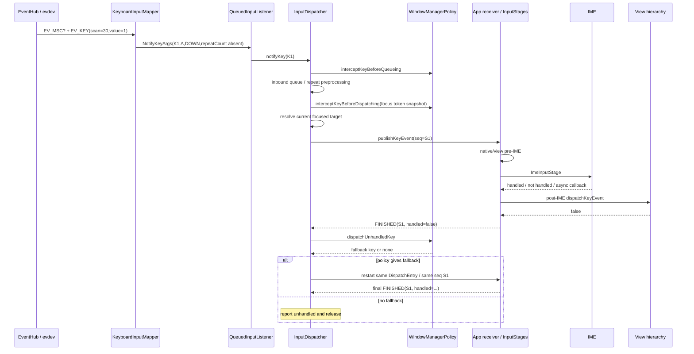

# 196 Android 完整 Key 事件源码实战追踪

> 源码基线：Android 11 `android-11.0.0_r48`。  
> 固定案例：一把实体键盘先上报 `scanCode=30` 的首次按下，再上报重复按下和释放；映射结果假定为 `KEYCODE_A`。在 fallback 变体中，前台应用从初始 DOWN 起明确返回“未处理”，repeat/UP 沿同一生命周期继续，借此追踪 native fallback。  
> 阅读目标：不靠“按键最终生效了”倒推中间过程，而是逐段核对映射、重复、两次 policy、焦点、IME、View、`FINISHED` 与 fallback 各自改变了什么。

## 1. 固定案例：先把一条 Key 链拆成可证伪的问题

触摸事件的难点常在坐标、pointer 集合与目标窗口；Key 没有这些字段，却多了一组很容易串台的状态机：

- Linux `scanCode` 与 HID usage 先被解释成 Android `keyCode`；
- Mapper 记录“哪些物理扫描码仍按下”，Dispatcher 另行记录“该不该合成下一次 repeat”；
- 入队前和投递前各有一次 policy 回调，二者线程、输入和结论不同；
- 前台窗口内还要走 pre-IME、IME、post-IME 与 View 层；
- 应用返回 `handled=false` 后，Dispatcher 可能把同一投递项改写成另一枚 fallback 键并再次发送；
- Java 已调用 `finishInputEvent()`，不代表 native 侧已经最终释放原始 `KeyEntry`。

本章为三笔原始输入使用下列符号：

| 原始事实 | 本文符号 | 预期动作 | 说明 |
|---|---|---|---|
| `EV_KEY(30, 1)` | `R↓` | `ACTION_DOWN` | 首次按下 |
| `EV_KEY(30, 2)` | `R↻` | 仍是 `ACTION_DOWN` | 驱动重复值，不直接等于 Java `repeatCount=1` |
| `EV_KEY(30, 0)` | `R↑` | `ACTION_UP` | 释放 |

为避免把实现细节写成普遍承诺，再加四个限定：

1. `scanCode=30 → KEYCODE_A` 是场景假设，真实结果由设备的 `.kcm`、`.kl` 和 meta 状态共同决定。
2. 文中的 `K1`、`K2`、`K3` 是便于阅读的逻辑标签，不表示 Android 的事件 id 连续递增。
3. “重复 DOWN”既可能来自 evdev 的 `value=2`，也可能由 Dispatcher 的定时器合成；这两条路必须分别追踪。
4. fallback 只讨论前台窗口收到 Key 后返回未处理的 native 路径，不把应用侧 `FallbackEventHandler` 混进来。

先给出整条主线，后文再逐个拆开箭头：



这张图最重要的不是“链很长”，而是两次回程：第一次 `FINISHED(false)` 可能只是原始键这一段的结束；fallback 再投递完成后，才可能是整个投递项的最终完成。

## 2. 四本账：身份、时间、线程与完成点不能互相代替

完整追踪 Key，至少同时记四本账。只记 `keyCode` 会遗漏 fallback；只记 `seq` 又会看不见 Reader 到 Dispatcher 入队前的变化。

**身份账**

| 层次 | 例子 | 生成或来源 | 主要用途 |
|---|---:|---|---|
| Linux scan code | `30` | evdev | 物理控件身份，也是 `mKeyDowns` 的查询键 |
| HID usage 候选 | 可选 | r48 将 `EV_MSC/MSC_SCAN.value` 用作 usageCode | 在 `SYN_REPORT` 前供下一笔 `EV_KEY` 使用 |
| EventHub device id | 例如 `7` | EventHub 子设备 | `RawEvent.deviceId` 的命名空间 |
| Reader logical device id | 例如 `3` | InputReader/InputDevice | `NotifyKeyArgs.deviceId` 及后续 Key 的设备身份 |
| Android key code | `KEYCODE_A` | KCM/KL 映射 | Framework 语义，可在 policy/fallback 中改变 |
| Reader/Dispatcher event id | `K1` | 构造 `NotifyKeyArgs` 时由 Reader 生成 | 正常路径传入 `KeyEntry`，不是 channel 回执号 |
| `DispatchEntry.seq` | `S1` | 全局原子生成的非零值，每个目标独立分配 | 在具体 connection 中匹配当前在途投递与 `FINISHED` |
| Java receiver seq | `J1` | App 进程本地 | Java 对象到 native transport seq 的映射键 |

一笔 `KeyEntry` 发给前台窗口和全局 monitor 时，会产生不同 `DispatchEntry`，因此有不同 seq。反过来，前台窗口的 native fallback 在 r48 中会把同一个 `DispatchEntry` 从 wait 队列搬回 outbound 队列前端，所以原始腿和 fallback 腿复用同一个 `S1`。这两个结论并不矛盾。

**时间账**

| 字段或期限 | 本章含义 | 常见误判 |
|---|---|---|
| `eventTime` | 当前这笔原始或合成 Key 的发生时刻 | 把它当成首次按下时间 |
| Mapper `mDownTime` | r48 中 Mapper 共享字段，且每个 DOWN 都会覆盖 | 误以为按 scanCode 分表保存 |
| `nextRepeatTime` | Dispatcher 合成下一次 repeat 的唤醒点 | 误以为驱动 `value=2` 自带此时间 |
| policy wakeup time | 第二次 policy 要求稍后重试的绝对唤醒点 | 误以为 Dispatcher 线程阻塞睡眠 |
| wait-queue timeout | 窗口/monitor 未回 `FINISHED` 的 ANR 期限 | 与 IME 自己的 2500 ms 超时混为一谈 |

**线程账**

```text
InputReader thread
  EventHub → KeyboardInputMapper → QueuedInputListener.flush()
  → InputClassifier.notifyKey() → InputDispatcher.notifyKey()
  → interceptKeyBeforeQueueing()

InputDispatcher thread
  inbound → repeat/policy/focus/targets → outbound → publish
  FINISHED command → afterKeyEvent → optional fallback restart

App window Looper（通常是主线程）
  NativeInputEventReceiver → ViewRootImpl InputStages → View/IME
  → finishInputEvent()
```

`notifyKey()` 通常仍运行在 InputReader 调用线程，而不是 Dispatcher 线程；它会加锁修改 Dispatcher 队列。第二次 policy 则由 Dispatcher 调度路径发起，并在调用 policy 前暂时解锁。只用“native 线程”概括会掩盖竞态窗口。

**完成点账**

| 完成点 | 能证明什么 | 不能证明什么 |
|---|---|---|
| EventHub 读到 `EV_KEY` | 内核事实已经进入用户空间 | 已映射、已发给窗口 |
| Mapper 构造 `NotifyKeyArgs` | Reader 已解释本笔 Key | Dispatcher 已接受目标 |
| 进入 inbound queue | Dispatcher 已持有事件 | 已找到焦点、已 publish |
| publish 成功并进入 wait | publisher 已成功写入目标 channel | App 已从 fd 读取或处理 |
| Java `finishInputEvent` | App 决定了 handled 位 | native 已执行回执命令 |
| 原始腿 `FINISHED(false)` | 原始键在该前台 connection 未处理 | 整个投递项已释放 |
| fallback 腿完成或无 fallback | 该 connection 的 Key 流程可最终清账 | 用户必然看见某种界面效果 |

后文每次出现“完成”，都要能落到这张表的一格，而不是凭日志先后猜测。

## 3. evdev 入口：`MSC_SCAN` 是一次性线索，`EV_KEY` 的 1 与 2 都是 DOWN

`KeyboardInputMapper::process()` 对三类输入做的事情很短，却直接决定后续能否正确解释 repeat：

```cpp
case EV_KEY: {
    int32_t scanCode = rawEvent->code;
    int32_t usageCode = mCurrentHidUsage;
    mCurrentHidUsage = 0;
    if (isKeyboardOrGamepadKey(scanCode)) {
        processKey(rawEvent->when, rawEvent->value != 0, scanCode, usageCode);
    }
    break;
}
case EV_MSC:
    if (rawEvent->code == MSC_SCAN) {
        mCurrentHidUsage = rawEvent->value;
    }
    break;
case EV_SYN:
    if (rawEvent->code == SYN_REPORT) {
        mCurrentHidUsage = 0;
    }
```

由这段代码可以得到四条严格结论。

第一，Linux 常见的 `value=0/1/2` 在这里没有被完整保留。EventHub 为每一项 `input_event` 建立 `RawEvent`，其 `when` 来自该项时间；Mapper 只把 `value != 0` 传为布尔 `down`，所以 `1` 与 `2` 都进入 DOWN 分支。`NotifyKeyArgs` 里没有“原始 value=2”字段可供 Dispatcher 读取。

第二，r48 把 `MSC_SCAN.value` 当作 usageCode/HID usage 候选。多笔 `MSC_SCAN` 会以后值覆盖前值；中间可以出现其他 raw，但在下一个 `SYN_REPORT` 前遇到的下一笔 `EV_KEY` 会先取走并清零缓存，即使该 scanCode 随后被 `isKeyboardOrGamepadKey()` 排除。它不是设备级永久属性，也不会跨过 `SYN_REPORT` 保留。

第三，`isKeyboardOrGamepadKey()` 按 scanCode 范围排除鼠标、触控笔和触摸相关 BTN。这是防止同一底层按钮又被 Keyboard Mapper 解释一次的入口过滤，不代表被排除的事件从整个输入系统消失；它可能由其他 Mapper 消费。

第四，EventHub 设备 id 与 Reader 通知使用的逻辑 device id 不是天然同一个命名空间。Mapper 的 `getDeviceId()` 会体现 InputReader 对设备组合与 mapper 的抽象，排障时不能只拿一个整数在所有日志中做等值连接。

**关于内核自动重复的第一处陷阱**

EventHub 打开键盘设备时会尝试用 `EVIOCSREP` 把内核 repeat delay 和 period 都设置为 0。这个 ioctl 的尝试并不以 `keyboard.handlesKeyRepeat` 属性为前提；失败也只是警告，设备仍可能继续工作。因此现场可能同时存在三种情况：

- ioctl 成功，内核不再产生 `value=2`，主要由 Dispatcher 合成 repeat；
- ioctl 失败，驱动仍产生 `value=2`，Dispatcher 尝试按连续 DOWN 识别它；
- 设备声明自行处理 repeat，Mapper 加 `DISABLE_KEY_REPEAT`，但原始 `value=2` 仍只会成为普通 DOWN。

最后一种最值得警惕：属性名表达的是策略能力，不会让 Mapper 自动生成正确的 `repeatCount` 与 `LONG_PRESS`。若 `EVIOCSREP` 又恰好成功，而设备没有独立 firmware repeat，Mapper 的 DISABLE 与内核 repeat 关闭叠加后，最终甚至可能完全没有重复事件。

## 4. `mapKey()`：KCM、KL 与 remap 的真实优先级

固定案例进入 `processKey()` 后，第一步是：

```cpp
getDeviceContext().mapKey(
        scanCode, usageCode, mMetaState,
        &keyCode, &keyMetaState, &policyFlags);
```

名字容易让人误以为 `.kl` 总是先把 scanCode 映射成 keyCode，再由 `.kcm` 解释字符。r48 的 `EventHub::mapKey()` 实际顺序是：

1. 若设备存在 KCM，先调用 `KeyCharacterMap::mapKey(scanCode, usageCode)`；其内部优先尝试 usage，再尝试 scanCode。
2. 只有 KCM 直接映射失败，才调用 KeyLayoutMap；它同样先尝试 usage、再尝试 scanCode，得到 keyCode 和 layout policy flags。
3. 只要前两步任一成功，最后都再调用 KCM 的 `tryRemapKey(keyCode, metaState)`，它可依据修饰键替换 keyCode 并消费相关 meta 位。

写成判定表更清楚：

| KCM 直接映射 | KL 映射 | 最初 keyCode | policy flags | 之后是否尝试 KCM remap |
|---|---|---|---|---|
| 成功 | 不查 | KCM 结果 | `0` | 是 |
| 失败 | 成功 | KL 结果 | KL 结果 | 是 |
| 失败 | 失败 | `KEYCODE_UNKNOWN` | `0` | 无成功路径 |

这带来两个诊断要点。

- KCM 直接命中会绕开 KL，因此不能看到最终 `keyCode` 就断言相应 `.kl` 行上的 `WAKE`、`VIRTUAL` 等 flags 已生效。
- `tryRemapKey()` 替换 keyCode 后不会回头重新查询 KL flags。替换结果携带的是原映射路径已得到的 flags，而不是“新 keyCode 对应的 flags”。

映射失败也不等于本笔被丢弃。`processKey()` 会回退到 `KEYCODE_UNKNOWN`、当前 meta、`policyFlags=0`，随后仍可构造通知。真正的丢弃需要在后续边界另找证据。

这里还有三种完全不同的“替换”，不要混用名称：

| 替换点 | 输入依据 | 发生位置 | 是否是未处理 fallback |
|---|---|---|---|
| KCM `tryRemapKey` | keyCode + meta | Reader 映射阶段 | 否 |
| Meta shortcut acceleration | Meta 组合键 | Dispatcher `notifyKey` 前处理 | 否 |
| `dispatchUnhandledKey` | 前台 App 回 `handled=false` | Dispatcher 回执阶段 | 是 |

对于只提供 usage、`scanCode=0` 的设备，还要注意 r48 的按下表以 scanCode 为键。两个并发的 usage-only 按键都落在 scanCode 0，可能互相竞争同一条 `mKeyDowns` 记录。这不是 KCM 查表失败，而是后续配对模型的边界。

## 5. Mapper 的 DOWN/UP 状态机：方向旋转、meta 与共享 `mDownTime`

映射完成后，`processKey()` 分别处理 DOWN 和 UP。固定案例首次 `R↓` 的关键顺序如下：

```text
mapKey(scan=30, usage, oldMeta)
  → 若 orientationAware，先旋转方向键 keyCode
  → 按 scanCode 查 mKeyDowns
  → 首次 DOWN 才检查虚拟键静默期与取消 touch gesture
  → 保存 {keyCode, scanCode}
  → mDownTime = when
  → 更新 meta / policy flags
  → 构造 NotifyKeyArgs
```

**最终 keyCode 如何被锁住**

若设备配置为 orientation-aware，Mapper 会在每次 DOWN 先调用旋转逻辑；它只转换支持的 DPAD、SYSTEM_NAVIGATION 以及已配置 stem 映射，并非任意 keyCode。首次 DOWN 把旋转后的 `{keyCode, scanCode}` 保存进 `mKeyDowns`。同 scanCode 的重复 DOWN 虽也先尝试按当前方向旋转，随即会被表中旧 keyCode 覆盖；UP 直接取记录结果。即使中途屏幕方向或映射条件改变，这一组按下/释放仍尽量配成同一个 Android keyCode。

“orientation 只改 DOWN”不是说 UP 不需要方向一致性，而是 UP 通过已保存结果获得一致性。配置是否生效还取决于 `keyboard.orientationAware` 和 Mapper 是否拿到关联 viewport，不能只看到设备物理朝向就假定会旋转。

**`mKeyDowns` 保存得比想象中少**

单条记录只有 `keyCode` 与 `scanCode`。它不保存 usage、displayId、meta、policy flags 或每键 downTime。查找也只按 scanCode：

- 首次 DOWN 未找到记录，新增一条；
- 重复 DOWN 找到记录，使用已锁定的 keyCode；
- UP 找到记录，取其 keyCode 并先从表中删除；
- UP 找不到记录，记录异常并直接返回，不通知 Dispatcher。

所以“两个 scanCode 映射为同一 keyCode”仍能在 Mapper 中并存；“两个 usage-only 键都以 scanCode 0 到达”则不能安全地区分。

被锁回旧值的只有 keyCode。重复 DOWN 与 UP 仍会先为本笔重新 `mapKey()`，其 policyFlags 以及随后收束的 keyMetaState 不保存在 `mKeyDowns` 中，可能与初始 DOWN 不同。不能把“keyCode 配对”扩大成整组 flags/meta 冻结。

**共享 `mDownTime` 是 r48 的实现边界**

DOWN 分支末尾无条件执行 `mDownTime = when`，包括同一 scanCode 的驱动重复 DOWN，也包括另一个键的 DOWN。随后所有通知读取这个 Mapper 级共享字段：

```text
t0  scan30 DOWN(value=1)  → mDownTime=t0
t1  scan30 DOWN(value=2)  → mDownTime=t1
t2  scan31 DOWN(value=1)  → mDownTime=t2
t3  scan30 UP             → 通知携带的 downTime 仍可能是 t2
```

因此本版本的 `downTime` 不能被描述成“按 scanCode 保存的首次按下时刻”。简单单键且无原始 repeat 时看起来通常正确，复杂多键场景才会暴露共享字段的语义。

**meta 与 policy flags 在通知前最后收束**

Mapper 调用 `updateMetaStateIfNeeded()` 处理 Shift、Ctrl、Alt、Meta 与锁定键。它比较并更新当前 KeyboardInputMapper 的局部 `mMetaState`；若局部状态改变，本笔改用更新后的局部值，同时触发 InputReader 重新 OR 汇总全局 meta。若局部状态未变，则可保留映射阶段的 `keyMetaState`，包括 KCM replacement 暂时消费的修饰位。`NotifyKeyArgs` 并不直接读取 Reader 的全局 meta。

此外：

- 外接设备的非媒体键只在 DOWN 时可能按默认规则补 `POLICY_FLAG_WAKE`，而 KL 自带的 flags 可随其映射结果出现在 DOWN/UP；
- 设备声明 `keyboard.handlesKeyRepeat` 时，DOWN/UP 都会补 `POLICY_FLAG_DISABLE_KEY_REPEAT`；
- 通知中的 Key flags 包含 `AKEY_EVENT_FLAG_FROM_SYSTEM`；
- policy flags 与 Java `KeyEvent.flags` 是不同字段，名字相似不能直接按位比较。

Keyboard Mapper 的 `reset()` 会清空 meta、共享 downTime、`mKeyDowns` 与当前 HID usage。外层 `InputDevice::reset()` 在重置各 Mapper 后重新汇总全局 meta，再通过 listener 发出设备重置通知。它是 Reader 配对状态的重建边界，但不等于每个 connection 已立即收到一组真实物理 UP。

## 6. Reader 出口与 Dispatcher 入口：event id、第一次 policy 和 InputFilter

Mapper 最后构造 `NotifyKeyArgs`：

```text
id = InputReaderContext::getNextId()
eventTime = 当前 RawEvent.when
deviceId = Reader 逻辑设备 id
source / displayId = Mapper 当前配置
policyFlags = 映射与设备策略结果
action = DOWN 或 UP
flags = FROM_SYSTEM
keyCode / scanCode / metaState
downTime = Mapper 共享 mDownTime
```

这里的 id 由带来源标记的生成器给出，低位包含随机空间，不能期待 `K2=K1+1`。本文的 K1/K2 只是用于画账。

**为什么 Mapper 的回调没有立刻跨线程**

`getListener()->notifyKey(&args)` 通常先到 `QueuedInputListener`。它把参数深拷贝进一个内部队列；InputReader 完成一批原始事件并退出 Reader 锁保护区后，仍由同一 InputReader 线程调用 `flush()`，依序把通知交给外层 listener。这样做把“Mapper 在 Reader 锁内改状态”和“外部组件可能回调更多逻辑”隔开了，但不是另起一个 Key 专用线程。

若启用 InputClassifier，`notifyKey()` 在 r48 只是直接向下转发；分类 HAL 的重点在 Motion。于是常见调用栈是：

```text
InputReader thread
  KeyboardInputMapper::processKey
  QueuedInputListener::notifyKey       // 深拷贝、排队
  InputReader 解锁
  QueuedInputListener::flush
  InputClassifier::notifyKey           // pass-through
  InputDispatcher::notifyKey
```

到达 `InputDispatcher::notifyKey()` 后，尚未直接进入 inbound queue。它依次完成：

1. 验证 action，只接受合法 Key 动作；
2. 将 `repeatCount` 明确初始化为 0；
3. 在 policy flag 和 Key flag 之间对齐 virtual 标志；
4. 若有 `POLICY_FLAG_FUNCTION`，向 meta 补 `AMETA_FUNCTION_ON`；
5. 为 Reader 来的事件补 `POLICY_FLAG_TRUSTED`；
6. 执行 Meta shortcut acceleration；
7. 构造临时 native `KeyEvent`，同步调用第一次 policy；
8. 处理可选 InputFilter；
9. 构造 `KeyEntry` 并加入 inbound queue，必要时唤醒 Dispatcher Looper。

**Meta shortcut 发生在第一次 policy 之前**

r48 在这里把 `Meta+DEL` 替换为 `BACK`，把 `Meta+ENTER` 替换为 `HOME`。DOWN 时以 `{原 keyCode, deviceId}` 为键保存替换关系，并清掉 Meta 相关位；UP 时即使 Meta 已先释放，也会查表补成对应的 replacement keyCode，然后删除关系。

所以第一次 policy 看到的是已经加速后的 keyCode/meta，而不是 Reader 的原始结果。这个表又独立于 Mapper `mKeyDowns`：一个保证 Dispatcher 层替换后的 DOWN/UP 配对，另一个保证 Reader 层物理 scanCode 的配对。

**第一次 policy：`interceptKeyBeforeQueueing()`**

此回调发生在 `notifyKey()` 调用线程上，通常就是 InputReader 线程，并且调用时没有持有 Dispatcher 主锁。native policy 接口以引用接收 `policyFlags`；在 stock system_server 桥接中，它先补当前 `INTERACTIVE` 状态，Java policy 返回的 action mask 决定 `PASS_TO_USER`，输入已有的 `WAKE` 则用于执行唤醒策略。临时 KeyEvent 的 keyCode/meta 已由此前 Meta shortcut 决定，不是 Java 回调任意改写的结果。此回调不接收最终焦点窗口 token，因为此时还没有执行目标选择。

因此下面两句话都不准确：

- “第一次 policy 决定发给哪一个窗口”——此时尚未找窗口；
- “进入 `notifyKey()` 就已经进 inbound”——policy 和 filter 都在此前。

**InputFilter 不是一条透明旁路**

启用 Java `InputFilter` 后，标准 `InputManagerService.filterInputEvent()` 会把事件异步交给过滤器并返回 false，于是当前这条物理输入路径在 native `notifyKey()` 中直接结束。过滤器可通过“不调用 host”消费；默认实现或自定义保留逻辑会显式调用 `sendInputEvent()`，形成异步注入路径。该路径使用 `VIRTUAL_KEYBOARD_ID`，增加 `INJECTED`，并携带 `FILTERED`，所以跳过注入路径中的第一次 policy；传入 KeyEvent 的 id 则继续由注入代码采用，不能把整条回注简化成原物理 entry 原地前进。

```text
无 filter：K1 → first policy → KeyEntry(K1) → inbound

有 filter：K1 → first policy → Java filter → 原路径结束
                              └→ 可选重新注入 → 新路径 → inbound
```

所以不能说“过滤器看一眼，原 K1 继续”。排障时如果 filter 开启，应把首次路径与回注路径分别记账，并检查是否被消费、改写或延迟。

## 7. repeat 状态机：驱动重复与 Framework 合成不是同一笔事件

`notifyKey()` 无论收到 evdev `value=1` 还是 `value=2`，都把 `repeatCount` 设为 0。真正的识别在 `dispatchKeyLocked()` 首次预处理时发生，条件是：

```text
repeatCount == 0
action == DOWN
policyFlags 含 TRUSTED
policyFlags 不含 DISABLE_KEY_REPEAT
```

满足条件后，Dispatcher 查看全局 `mKeyRepeatState.lastKeyEntry`。

**首次 `R↓`**

若没有同 keyCode 的上一条记录，Dispatcher 清旧 repeat 状态，设置：

```text
lastKeyEntry = 当前 KeyEntry(K1)
nextRepeatTime = K1.eventTime + keyRepeatTimeout
```

并额外持有该 entry 的引用。如果定时点来到，并且当前没有 `mPendingEvent`、inbound queue 也为空，`synthesizeKeyRepeatLocked()` 才会生成或复用一条合成事件。原 DOWN 若仍卡在 policy、焦点或前序事件门，deadline 到达也不会并行合成。合成项使用 Dispatcher 来源的新 event id、当前时间、`repeatCount+1`，保留原 `downTime`，仅保留 `RAW_MASK | PASS_TO_USER | TRUSTED` 范围的 policy flags，标记 `syntheticRepeat=true`，再把下一次时间设为 `currentTime + keyRepeatDelay`。

repeat 预处理早于第二次 policy 和目标选择。因此保存 `lastKeyEntry`、启动 timer 只能证明 Dispatcher 已预处理 DOWN，不能证明它后来通过 policy、找到焦点或成功 publish。

**驱动上报 `R↻`**

下一条原始 DOWN 到预处理时仍是 `repeatCount=0`。若 `lastKeyEntry->keyCode == entry->keyCode`，Dispatcher 判定设备在自行重复：

```text
entry.repeatCount = last.repeatCount + 1
清旧 lastKeyEntry 引用
nextRepeatTime = LONG_LONG_MAX
lastKeyEntry = 当前原始 KeyEntry
```

关键条件只比较 keyCode，不比较 deviceId、scanCode 或 source。于是两个设备连续按下同一 keyCode，或同设备两个 scanCode 映射到同一 keyCode，都可能被误判为驱动 repeat。这是 r48 的具体实现，不应美化成“按物理键精确识别”。

**`LONG_PRESS` 只对应 repeatCount 恰好为 1**

预处理接着执行：

```cpp
if (entry->repeatCount == 1) {
    entry->flags |= AKEY_EVENT_FLAG_LONG_PRESS;
} else {
    entry->flags &= ~AKEY_EVENT_FLAG_LONG_PRESS;
}
```

因此首次 repeat 带 `LONG_PRESS`，后续 repeat 反而清掉这个 flag。`isLongPress()` 不是“只要一直按着就永远为 true”。此外，App 能否把第一次 repeat 当成长按消费，还取决于其 Key 处理逻辑，不是 flag 一出现就必有长按 UI。

**原始与合成 repeat 的身份差异**

| 维度 | 驱动重复 DOWN | Dispatcher 合成 repeat |
|---|---|---|
| evdev 原始事实 | 有，通常 `value=2` | 无 |
| Mapper 是否经过 | 是 | 否 |
| 入 Dispatcher 时 count | 0，后续推导 | 已由合成器递增 |
| event id | Reader 来源 | Dispatcher 来源的新 id |
| eventTime | 驱动时间 | 合成时的当前时间 |
| downTime | 受 Mapper 共享字段影响 | 从保存的 last entry 延续 |
| `syntheticRepeat` | false | true |

任何进入 `dispatchKeyLocked()`、又不符合上述首个条件的非合成 KeyEntry 都会重置 repeat 状态，例如 UP、不可信注入、带 `DISABLE_KEY_REPEAT` 的 DOWN。Motion 等其他 EventEntry 不走这段 Key 预处理；合成 repeat 自己也不会在这条分支把状态清掉。

需要再强调一个时序边界：只有当 UP 到达 Dispatcher 的这段预处理时，才通常清除全局 repeat 状态；即使该 UP 随后因 policy 或其他 drop reason 没有 publish，清理也已发生。物理键已经释放并不自动撤销此前已入 inbound、outbound 或 wait 的重复事件；各层队列仍需按自己的生命周期结算。

## 8. 第二次 policy：token 是快照，正数返回值是延后重试

repeat 预处理后，`dispatchKeyLocked()` 才进入第二次 policy。只有 `policyFlags` 含 `PASS_TO_USER` 时，它才投递一个 command 去调用 `interceptKeyBeforeDispatching()`。不含时，外层 `dispatchOnceInnerLocked()` 已把 drop reason 设为 `POLICY`；`dispatchKeyLocked()` 内部虽将 intercept 结果标为继续，也会立刻进入丢弃清理，不会选择窗口。

为构造 command，Dispatcher 在锁内按目标 display 查询当时的 focused window，并把其 input channel 保存给 command。执行 command 时会从 channel 取 connection token，构造 KeyEvent，解开 Dispatcher 主锁后调用 policy，再重新加锁。

这个顺序意味着 policy 收到的是**焦点 token 快照**。在解锁回调期间、或 policy 要求延迟期间，焦点都可能改变；之后真正找目标时会再次读取当前焦点。不要用第二次 policy 日志里的 token 证明最终投递窗口。

policy 的返回值按纳秒解释：

| 返回值 | Dispatcher 结果 | 后续 |
|---:|---|---|
| `< 0` | `SKIP` | 以 policy 原因丢弃，不选窗口 |
| `0` | `CONTINUE` | 进入目标选择 |
| `> 0` | `TRY_AGAIN_LATER` | 记录 `now()+delay`，到期再走调度 |

正数不是让 Dispatcher 线程 `sleep(delay)`。当前 `KeyEntry` 仍是 pending 事件，Looper 的下一唤醒点被提前到 `interceptKeyWakeupTime`；到期后状态复位，再次运行第二次 policy。这一期间其他 command、唤醒与系统状态变化仍可能发生。

若 policy 最终给出 `SKIP`，Dispatcher 把 drop reason 设为 policy；对同步注入者，这类策略消费可被报告为注入成功，因为“系统已接受并由策略处理”不同于权限或分发失败。对排障者而言，它仍没有进入前台窗口 channel。

两次 policy 的职责可以压缩为：

| 对比项 | before queueing | before dispatching |
|---|---|---|
| 常见调用线程 | InputReader 调用线程 | Dispatcher command 路径 |
| Dispatcher 主锁 | 未持有 | 回调前主动解锁 |
| 是否有焦点 token | 无 | 有，但只是快照，也可能为空 |
| 主要结果 | 修改 policy flags、系统级处理 | 跳过、立即继续或延后重试 |
| 是否已经选定最终目标 | 否 | 回调结束后仍需重选 |

## 9. 焦点与前序事件门：Key 不做几何命中，却可能等待 500 ms

第二次 policy 通过后，`findFocusedWindowTargetsLocked()` 才确定前台目标。Key 的 display 规则是：事件带有效 displayId 就使用它；为 `ADISPLAY_ID_NONE` 时，使用当前 `mFocusedDisplayId`。

然后按该 display 同时查询 focused window 与 focused application：

| 状态 | 结果 |
|---|---|
| 两者都没有 | 直接失败并丢弃 |
| 有 focused app、没有 focused window | 启动 no-focused-window 计时并保持 pending |
| focused window 存在但 paused | 保持 pending |
| focused window 正常 | 继续权限与前序事件检查 |

“有应用但还没有窗口”的计时长度取应用 dispatch timeout，窗口在启动期出现可解除等待；超时会进入无焦点窗口的 ANR 通知，policy 若返回正的 timeout extension 还可把期限重设为 `now()+extension`，未延长时后续目标查找才失败/丢弃。paused 分支本身在这段代码里没有新建同样的独立 deadline，不能把两种 pending 画成同一计时器。

注入事件还要通过目标窗口的 injection permission。来自受信 Reader 的实体键通常不是在此失败，但诊断自动化或 shell 注入时必须保留该分支。

**为什么已经有焦点还要等前面的输入**

Key 到来前，一次触摸可能正在等待 App 处理，而该触摸的副作用可能创建弹窗并转移焦点。为了不把紧随的字符过早发给旧窗口，r48 检查全局 `mAnrTracker`：

```text
mAnrTracker 为空
  → 立即向当前焦点投递，并清等待标记

mAnrTracker 非空、尚未开始 Key 等待
  → 设置 now + KEY_WAITING_FOR_EVENTS_TIMEOUT，保持 pending

期限内仍非空
  → 继续 pending

500 ms 左右期限已过
  → 即使其他 connection 尚有未处理输入，也向当前焦点投递
```

这不是只检查“本窗口前一枚 Key”，也不只是检查 motion；实现条件是全局 ANR tracker 是否还有条目。源码注释以可能改变焦点的前序 motion 解释动机，但代码边界更宽。

等待期间新入队的一次 pointer DOWN 会把 Key 等待期限直接改成 `now()`，使 pending Key 下一次调度时停止继续等待。已经被判为 unresponsive、因而从 `mAnrTracker` 移除的 wait 项也不再挡这道门。无论如何，超过 Key 专用等待窗口后，Dispatcher 会继续发，而不是等到所有前序输入永久清空。

成功时，前台 `InputTarget` 带：

```text
FLAG_FOREGROUND | FLAG_DISPATCH_AS_IS
```

之后才追加该 display 的 global monitor。Key 不会创建 touch 的 gesture monitor 目标；全局 monitor 是另一类独立 connection。只有前台 target 的 `FINISHED(false)` 有资格触发后面的 native fallback，monitor 返回 false 不会替前台启动 fallback。

## 10. 从 `InputTarget` 到 App：`InputState` 记录期望流，channel 负责背压

`dispatchEventLocked()` 为每个目标查找 connection 并调用 `prepareDispatchCycleLocked()`。一个 `KeyEntry(K1)` 可以同时对应前台窗口和多个全局 monitor；每个仍存在且 `STATUS_NORMAL` 的目标 connection 各自创建 `DispatchEntry` 与 seq，找不到或非正常的 connection 会被跳过：

```text
KeyEntry K1
  ├─ foreground connection F → DispatchEntry(seq=S1, FOREGROUND)
  ├─ global monitor M1       → DispatchEntry(seq=S2)
  └─ global monitor M2       → DispatchEntry(seq=S3)
```

创建每个目标的 Key 投递项时，Key 的 `resolvedEventId`、`resolvedAction`、`resolvedFlags` 先从 `KeyEntry` 复制，然后调用该 connection 的 `InputState.trackKey()`；前台窗口和 global monitor 的 connection 都各自记账。它按 device/source/display/keyCode/scanCode 查找，并为 DOWN 覆盖或增加 memento、为匹配 UP 删除 memento；r48 对不匹配的 Key UP 也返回 true，因此维护的是 Dispatcher 期望状态，而不是严格证明流自洽。

这一步发生在真正 publish 之前。因此 InputState 证明的是“Dispatcher 期望该 connection 拥有怎样的按键状态”，不是“App 已经看见这枚键”。publish 若随后失败，连接状态、取消与清理逻辑还要继续收口。

合法 `DispatchEntry` 进入该 connection 的 outbound queue。若队列此前为空，`startDispatchCycleLocked()` 立即尝试发布：

```cpp
publishKeyEvent(
    seq,
    resolvedEventId,
    deviceId, source, displayId, hmac,
    resolvedAction, resolvedFlags,
    keyCode, scanCode, metaState, repeatCount,
    downTime, eventTime);
```

每次尝试前都会设置 `deliveryTime=currentTime` 与 `timeoutTime=currentTime+dispatchTimeout`。publish 成功后，投递项从 outbound 转到 wait queue；若 connection 响应正常，相应 timeout 也进入 `mAnrTracker`。于是三处位置的含义应明确区分：

| 队列 | 可以下的结论 |
|---|---|
| inbound | Dispatcher 尚在决定这笔事件怎么分发 |
| outbound | 已属于某个 connection，等待 channel 可写/轮到发送 |
| wait | publish 已成功，等待该 seq 的 `FINISHED` |

Key 在 `InputConsumer` 侧不像 Motion 那样参与 move batching。native consumer 读到 Key message 后直接初始化 native `KeyEvent`，JNI 再构造 Java `KeyEvent`。这些是逐层承载相同字段的对象，不是跨进程共享同一 C++ 实例。

Java `WindowInputEventReceiver` 收到事件时，会把其本地 seq 与 transport seq 建立映射。ViewRoot 排队的是 Java 对象；最终调用 `finishInputEvent(event, handled)` 时，receiver 用本地映射找回 native seq 并向服务端写 `FINISHED`。所以日志中的 Java `getSequenceNumber()` 不应直接当成 `DispatchEntry.seq` 数字比较。

receiver 挂在哪个 Looper，应用端逻辑就在哪个线程被回调。普通窗口根通常绑定 UI Looper，但“所有 InputChannel 天然属于主线程”不是 transport 层保证；自建 receiver 可以选择其他 Looper。

## 11. App 输入流水线：pre-IME、IME、post-IME 与 View 的真实顺序

普通窗口的 `ViewRootImpl` 建立如下 stage 链：

```text
mFirstInputStage
  NativePreImeInputStage
  → ViewPreImeInputStage
  → ImeInputStage
  → EarlyPostImeInputStage
  → NativePostImeInputStage
  → ViewPostImeInputStage
  → SyntheticInputStage
```

正常从 window channel 收到的实体 Key 没有 `FLAG_DELIVER_POST_IME`，`QueuedInputEvent.shouldSkipIme()` 对它通常返回 false，因此从 `mFirstInputStage` 开始。来自 IME 的再分发 Key 会带 App 队列自己的 `FLAG_DELIVER_POST_IME`，直接从 EarlyPostIme 开始；带 `FLAG_UNHANDLED` 的内部合成请求则直接选择 Synthetic stage。在选择 stage 后，所有 Key 还会先调用一次 `mUnhandledKeyManager.preDispatch()`，再进入所选链头；它和 ViewPostIme 中稍后的 `preViewDispatch()` 是两个位置。

链被构造出来不表示每一站都执行了实质业务。`NativePreImeInputStage` 和 `NativePostImeInputStage` 只有 `mInputQueue != null` 时才向 NativeActivity 侧发送，否则立刻 `FORWARD`。诊断普通 Java Activity 时，不能把 stage 名称出现当成 NativeActivity 已处理的证据。

**pre-IME：View 先得到一次拦截机会**

Native pre-IME 未处理后，`ViewPreImeInputStage` 调用根 View 的 `dispatchKeyEventPreIme()`。编辑控件可在软键盘正式处理前拦截某些 Key。若它返回 true，当前 QueuedInputEvent 标为 handled 并直接走 App 回执；此时不会继续进入 IME 和普通 `dispatchKeyEvent()`。

**IME：三个返回值，只有一个需要等待回调**

`ImeInputStage` 先经过 IME focus controller。仅在窗口拥有 IME focus、不是 local-focus mode 且 `InputMethodManager` 可用时，才进入 `InputMethodManager.dispatchInputEvent()`；否则直接按未处理继续。真正调用 IMM 后，结果有三种：

| IMM 结果 | ViewRoot stage 结果 | 当前 Key 去向 |
|---|---|---|
| `DISPATCH_HANDLED` | `FINISH_HANDLED` | App 立即准备回 `handled=true` |
| `DISPATCH_NOT_HANDLED` | `FORWARD` | 继续 post-IME |
| `DISPATCH_IN_PROGRESS` | `DEFER` | 留在异步 stage 队列，等 callback |

若调用线程已经是 IMM 主 Looper，IMM 会直接尝试向 IME channel 发送；否则先向该 Looper 投递异步消息。成功发送后，以 Java event sequence number 记录 `PendingEvent`，并设置 2500 ms 的 `INPUT_METHOD_NOT_RESPONDING_TIMEOUT`。

IME 在期限内回 handled=true，ViewRoot 结束该事件；回 false，则从 EarlyPostIme 继续。若 2500 ms 到期，IMM 移除 pending 记录并按未处理回调，ViewRoot 也继续向后走。迟到的 IME 回复因找不到 pending seq 而被忽略。

这个 2500 ms 是 **IMM 内部等待 IME channel 回执** 的期限，不是 Dispatcher 对前台窗口的 ANR timeout。原始前台 `DispatchEntry(S1)` 此时仍在 system_server 的 wait queue，它自己的计时一直在走。两个 timeout 可能先后触发，不能拿一条 “IME timeout” 日志断言 Dispatcher 已重置连接。

`ImeInputStage` 继承 `AsyncInputStage`。异步完成后，stage 会按 deviceId 保证同设备的先来事件先向下一 stage 释放；来自其他 deviceId 的事件不受这一局部串行条件约束，可能先行。这是 App 内部 stage 队列的顺序，不改变 system_server 已经分配的各自 seq。

**EarlyPostIme：离开 touch mode 与应用侧预处理**

IME 未消费时，EarlyPostIme 先处理 tooltip，再检查 Key 是否用于离开 touch mode。某些导航键会在这里被消费并返回 handled；只有继续向 View 层的 Key 才调用 `mFallbackEventHandler.preDispatchKeyEvent(event)`。

标准 `PhoneFallbackEventHandler.preDispatchKeyEvent()` 会让 AudioManager 预处理 Key。这里已经出现 “fallback” 名字，但还没有发生 native 未处理键替换。

**ViewPostIme：普通 Key 的消费顺序**

Native post-IME 若未处理，`ViewPostImeInputStage.processKeyEvent()` 按以下顺序尝试：

```text
mUnhandledKeyManager.preViewDispatch(event)
  → mView.dispatchKeyEvent(event)
  → shouldDropInputEvent(q)
  → mUnhandledKeyManager.dispatch(mView, event)
  → modifier shortcut dispatch（DOWN、有 modifier、count=0、非 modifier key、非 Meta+Tab group navigation）
  → shouldDropInputEvent(q)
  → mFallbackEventHandler.dispatchKeyEvent(event)
  → shouldDropInputEvent(q)
  → keyboard group / focus navigation（DOWN）
  → FORWARD 到 SyntheticInputStage
```

`mView.dispatchKeyEvent()` 会进入 Window callback、DecorView 与 View 层的 Key 分发；具体 Activity/Window/View 顺序应继续沿其实现确认，而不能只在 Activity 的 `onKeyDown()` 打日志就代表整棵 View 树没有处理。

`shouldDropInputEvent()` 还会处理 App 内部状态变化。例如异步 IME 等待期间窗口失焦或停止，非终止 Key 可能被丢弃；终止事件如 UP 通常改为 canceled 后继续，而不是简单消失。这说明 Dispatcher 选中过窗口，并不保证几百毫秒后 ViewRoot 仍把事件当作正常输入。

若所有站都返回 `FORWARD`，链尾最终调用 `finishInputEvent(q)`，handled 位由 `FLAG_FINISHED_HANDLED` 决定。正常物理 `KEYCODE_A` 不符合 SyntheticInputStage 的 `FLAG_UNHANDLED` 专用条件时，Synthetic stage 也只会继续到链尾，于是 App 回 `handled=false`。

## 12. 三种“fallback”分开记：应用策略、应用合成与 native 替换

Android Key 路径里至少三套机制都容易被简称为 fallback，但它们的触发点和身份完全不同。

| 机制 | 所在进程/层 | 触发条件 | 结果如何回给原 Dispatcher |
|---|---|---|---|
| `FallbackEventHandler` | App 的 ViewRoot/Phone policy helper | 普通 View 分发未处理 | 若消费，原 `S1` 回 `handled=true` |
| `SyntheticInputStage` | App 的 ViewRoot | App 队列带 `FLAG_UNHANDLED` 等内部合成场景 | 合成 App 内部事件；该队列项通常无 receiver，本身不发送 `FINISHED` |
| `dispatchUnhandledKey` | system_server 的 Dispatcher + Window policy | 前台原始 Key 的 `FINISHED(S1,false)` | 可改写并重启同一 native 投递项 |

**应用侧 `FallbackEventHandler`**

`PhoneFallbackEventHandler` 可处理音量、媒体、CALL、CAMERA、SEARCH 等系统语义键。它直接运行在 App 的 stage 链中，若返回 true，ViewRoot 对原始 transport seq 回 handled=true。它没有把 `DispatchEntry` 从 wait 搬回 outbound，也没有让 Dispatcher 再发一遍。

对本章的 `KEYCODE_A`，默认 handler 通常不会消费，但这是场景结果，不是类名保证。若厂商替换了 handler 或 Window 层已处理，native `dispatchUnhandledKey` 根本不会启动。

**应用侧 `SyntheticInputStage`**

它主要将未处理的 trackball、joystick、touch navigation 转成其他输入；`SyntheticKeyboardHandler` 只在 `QueuedInputEvent.FLAG_UNHANDLED` 已由 App 内部入口设置时处理 Key。`MSG_SYNTHESIZE_INPUT_EVENT` 以 `receiver=null` 入队，链尾只回收该内部对象；合成出的新 Key 也走无 receiver 的本地队列。原 transport seq 必须由发起合成请求的原路径另行清账，不能期待这枚内部队列项发送 `FINISHED`。正常 window channel 收到后一路未处理的物理 Key，不会仅因前面都 `FORWARD` 就自动获得这个 flag。

因此看到 `KeyEvent.FLAG_FALLBACK` 也要问清来源：ViewRoot 的合成 handler 能创建带此 Java flag 的新 Key；native Dispatcher 的替换也在自己的 `KeyEntry.flags` 上设置 `AKEY_EVENT_FLAG_FALLBACK`。相同位名不等于相同生命周期。

**native `dispatchUnhandledKey`**

只有以下条件组合才进入其核心分支：

```text
目标是 FOREGROUND
当前 KeyEntry 尚未标记 FALLBACK
该 target 对当前 seq 回 handled=false
并且是初始 DOWN，或已有 original→fallback 生命周期记录
```

global monitor 即使对自己的 seq 返回 false，也因没有 `FOREGROUND` 标志而不会启动替换。反过来，前台原始腿返回 false 是一种合法处理结果，不是“App 忘记 finish”。两者在日志上必须分开。

## 13. native 未处理键：同一 `DispatchEntry` 如何变成 fallback 再发送

服务端读到 `FINISHED(S1,false)` 后，先按 connection 与 seq 在 wait queue 查找投递项，再为 Key 调用 `afterKeyEventLockedInterruptible()`。

第一道防线是：若 `keyEntry.flags` 已含 `FALLBACK`，就不再递归询问 policy。handled=false 时只报告最终未处理，随后返回“不重启”；handled=true 也直接结束。这保证最多只有一层 native fallback。

对于尚非 fallback 的原始 Key，Dispatcher 先从 connection 的 InputState 查询：

```text
mFallbackKeys[originalKeyCode] → fallbackKeyCode
```

返回 `-1` 表示从未建立记录；值为 `AKEYCODE_UNKNOWN` 表示该 original 生命周期已经询问过 policy、当前没有可继续发送的 fallback——可能初始就没有，也可能后续被撤回或改码。这两个状态不能合并。该表属于 connection，却只以 original keyCode 为键，不含 deviceId/source；同一窗口从多个设备并发收到相同原始 keyCode 时，也要把潜在碰撞列入版本边界。处理原始 UP 时，会在继续判定前先移除该映射，使生命周期必然有清理点。

**初始 DOWN 如何锁定映射**

若前台没有处理且 `action=DOWN && repeatCount=0`，即使当前没有记录，也可调用 `policy.dispatchUnhandledKey()`。调用前由 KeyEntry 构造临时 `KeyEvent`，Dispatcher 解开主锁；policy 可返回 false，或返回 true 并在输出 event 中给出替代 keyCode、meta、时间等字段。

重新加锁后先检查 connection 仍为 `STATUS_NORMAL`。初始 DOWN 将结果锁进表：

```text
policy 返回 true  → originalCode → returned fallbackCode
policy 返回 false → originalCode → AKEYCODE_UNKNOWN
```

这个“无替代”的 UNKNOWN 哨兵同样重要：它让后续 repeat/UP 区分“已有 original 生命周期”与“从未建表”，并继续询问 policy；`initialDown` 本身仍只由 action 与 repeatCount 判定。

**repeat 与 UP 为什么还要再次问 policy**

只要已有 fallback 记录，后续未处理的 repeat 或 UP 仍会调用 `dispatchUnhandledKey()`。初始 DOWN 锁住的 fallback code 不允许中途改变：

- policy 继续返回相同 code，允许本笔 fallback；
- policy 改成另一 code，请求取消旧 fallback，本笔不改投新的 code；
- policy 撤回 fallback，请求取消旧 fallback；
- 初始记录本来就是 UNKNOWN，Dispatcher 仍会再次询问 policy；它依赖 policy 在同一生命周期维持“不提供 fallback”的一致决定。

最后一条不是 native 的硬性禁止。若初始 DOWN 返回 false、后续 policy 却反常地返回 true，锁定值仍是 UNKNOWN，r48 甚至可能以 UNKNOWN 进入重启分支，而不会改锁成新 code。stock policy 的配对约定避免这种情况；自定义 policy 审计则必须验证返回值在 DOWN/repeat/UP 间稳定。

存在实际 fallback code 的取消分支会以 `CANCEL_FALLBACK_EVENTS` 请求相关 connection 合成取消事件。若原始事件后来被 App 处理，或该投递项不是前台目标，只要表中已有记录，都会先通知 policy 的 canceled 版本并清理映射；但记录值为 UNKNOWN 时不会提出合成取消请求。“请求”也不等于本版本一定能产出 transport 事件：`InputState` 只会从 flags 已含 `FALLBACK` 的 Key memento 合成，而下面的直接重启没有再执行 `trackKey()`，通常没有建立这样的 fallback memento。

若没有历史记录，而收到的第一笔未处理事件已经是 repeat 或 UP，代码直接返回，不询问 policy，也不凭空制造 fallback DOWN。这条门槛防止产生没有起点的替代键流。

**重启不是创建新的 `DispatchEntry`**

policy 允许 fallback 时，r48 直接改写当前 `KeyEntry` 的 eventTime、device/source/display、flags、keyCode、scanCode、meta、repeatCount 与 downTime，额外在 `KeyEntry.flags` 上加 `FALLBACK`，并把 `syntheticRepeat` 清为 false。`KeyEntry.id` 没有在这段代码中重新生成。

随后 `afterKeyEvent...()` 返回 true。外层完成命令因为 policy 回调曾解锁，会再次按 `S1` 查 wait queue；若投递项仍存在且 connection 正常，就执行：

```text
waitQueue.erase(S1)
  → 从 mAnrTracker 删除原 timeout
  → outboundQueue.push_front(同一个 DispatchEntry)
  → startDispatchCycleLocked(now)
  → 用同一个 seq=S1 再次 publish
```

`DispatchEntry.seq` 是构造时生成的 `const uint32_t`，重启路径没有新建对象，所以“fallback 应该拿 S2”与源码不符。第二次 publish 会刷新 deliveryTime 和 timeoutTime；成功后同一投递项再次进入 wait，等待第二个 `FINISHED(S1, ...)`。

主例可以画成：

```mermaid
sequenceDiagram
    participant A as App receiver
    participant D as InputDispatcher
    participant P as Policy

    D->>A: publish original A DOWN, seq=S1
    A-->>D: FINISHED S1, false
    D->>P: dispatchUnhandledKey(A DOWN)
    P-->>D: true, fallback=F
    Note over D: mutate KeyEntry; keep DispatchEntry and S1
    D->>A: publish fallback F DOWN, seq=S1
    A-->>D: FINISHED S1, true/false
    Note over D: FALLBACK flag blocks recursion; release
```

**r48 的复用边界值得单独标注**

正常新建 `DispatchEntry` 时，`resolvedEventId/action/flags` 被复制，并执行 `InputState.trackKey()`；fallback 重启直接把旧对象从 wait 放回 outbound，不重新经过 `enqueueDispatchEntryLocked()`。因此：

- `InputState.trackKey()` 不会针对改写后的 fallback 再执行一次；
- `resolvedAction` 和 `resolvedFlags` 不会在该路径重新从已改写 KeyEntry 计算；
- publish 的 keyCode、scanCode、meta、repeatCount、时间取改写后的 KeyEntry，但 action/flags 取旧 DispatchEntry 的 resolved 字段；
- 服务端判断第二次回执是否已是 fallback，则看已改写的 `KeyEntry.flags`。

换言之，虽然服务端 `KeyEntry.flags` 已加 `FALLBACK`，r48 这条重启的 transport-visible flags 仍取旧 `resolvedFlags`，不能无条件假定 App 看到的 flags 已同步带上该位；而 fallback cancel 的合成筛选又要求 memento flags 含该位，直接重启通常没有对应 memento 可命中。这是阅读 r48 代码得到的对象复用事实，不应把它抽象成“系统创建了一枚字段全部重新解析的新 KeyEvent”。版本迁移或修复分析时，要逐字段核对，而不是只比较日志中的 keyCode。

**repeat seed 与 fallback 还共享同一个 `KeyEntry*`**

`mKeyRepeatState.lastKeyEntry` 保存的不是不可变快照，而是对原始 DOWN `KeyEntry` 的额外引用。若这枚 A DOWN 完成原始腿后被 native fallback 原地改成 F，repeat state 所指对象的 keyCode/flags 也随之成为 F。于是固定案例叠加 fallback 时会出现时序分叉：

```text
R↻ 在 K1 被改写前完成 repeat 预处理
  → last.keyCode 仍是 A，与新 A 相等
  → R↻ 常见得到 repeatCount=1

K1 已被改写为 F 后，R↻ 才完成 repeat 预处理
  → 比较变成 last F 与新 A
  → 不认作同 key repeat，R↻ 仍可能是 count=0

没有原始 R↻，合成 timer 在 K1 改写后触发
  → 合成器从已变成 F 的 last entry 复用/复制字段
  → 可能直接生成 F repeat，且服务端 flags 已含 FALLBACK
```

因此“驱动 value=2 必然成为 A 的 count 1”和“Framework timer 必然继续合成原始 A”在 fallback 变体中都不是稳定结论。要用 K1 原始腿 `FINISHED`、fallback 改写和 R↻ 预处理的实际先后顺序判断。

## 14. repeat、UP、cancel 与 reset：四套状态各自在哪一刻清理

固定案例的 `R↑` 到达 Mapper 时，`down=false`。Mapper 重新执行映射只是得到一个候选 keyCode；随后按 scanCode 查 `mKeyDowns`，找到后改用首次 DOWN 保存的 keyCode，并在构造通知前删除记录。这样即使方向改变，UP 仍与旧 DOWN 配对。

若查不到 scanCode，Mapper 直接丢弃 UP。这是 Reader 边界；但一枚已经进入 Dispatcher 的“不一致 UP”又是另一回事。r48 的 `InputState.trackKey()` 若找不到匹配 memento，代码中保留了一段不执行的严格丢弃方案，实际仍返回 true 并允许 UP 发送，兼容按住键时新弹窗接管焦点等情况。

同一 UP 会触及至少四张状态表：

| 状态 | 所属对象 | UP 的常见动作 | 重要边界 |
|---|---|---|---|
| `mKeyDowns` | KeyboardInputMapper | 按 scanCode 删除 | 查不到则 Reader 丢弃 |
| `mDownTime` | KeyboardInputMapper | 不重置 | 仍是最近一次任意 DOWN 的时间 |
| `mKeyRepeatState` | InputDispatcher 全局 | 非合成 UP 在预处理时清 last entry | 必须先走到 Dispatcher 预处理 |
| Key memento | 每个 connection 的 InputState | 匹配则删除 | 不匹配 UP 在 r48 仍可投递 |
| fallback map | 每个 connection 的 InputState | 原始 UP 回执处理中删除 | 删除发生在 policy 最终判定前 |

由此可以解释一个看似矛盾的现场：内核已经上报 UP，Mapper 的按下表也已空，但 App 仍可能收到先前排队的 repeat；原因是 Reader 状态清理不反向撤销其他层已经拥有的对象。若要证明“repeat 已停止”，要检查 Dispatcher 的 pending/inbound/repeat 状态，而不是只看 `mKeyDowns`。

**取消事件不是伪造物理 UP**

窗口失去资格、仍可投递的 connection 被判 ANR、策略改变或设备重置时，Dispatcher 可根据每个 connection 的 InputState 请求合成带 `CANCELED` 的 Key UP。`STATUS_BROKEN` 的 connection 已不可投递，相关函数会跳过它。取消事件表达“请客户端终止这条已预记账的按键流”，不是声称 evdev 又出现了一笔 value 0。

对于 fallback，policy 在 repeat/UP 阶段改变主意，或 App 后来处理了原始键，都可能触发 `CANCEL_FALLBACK_EVENTS`。取消目标受 fallback keyCode 与 memento flags 约束；这和原始 `mKeyDowns` 删除完全不在同一对象上。

**DeviceReset 与 repeat reset 不应凭名字等同**

r48 的 `dispatchDeviceResetLocked()` 为该 deviceId 在所有可用 connection 请求合成取消事件，但函数本身没有调用 `resetKeyRepeatLocked()`。相邻的 `dispatchConfigurationChangedLocked()` 明确会清 repeat 状态；`resetAndDropEverythingLocked()` 则显式清 repeat、待处理事件和其他全局状态。

所以看到 DeviceReset 不能只靠函数名推断全局 repeat 引用已归零；要看该版本的具体调用链及后续事件是否使预处理重置。反过来，ConfigurationChanged 清 repeat 也不等于 App 已收到每个实体键的正常 UP。

**不叠加 native fallback 时，三笔原始输入的最小状态表**

| 时点 | Mapper `mKeyDowns` | Mapper downTime | Dispatcher count | App 可见动作 |
|---|---|---:|---:|---|
| `R↓@t1` 后 | `{30→A}` | `t1` | `0` | `A DOWN` |
| `R↻@t2` 后 | `{30→A}` | `t2` | 常见为 `1` | `A DOWN + LONG_PRESS` |
| 驱动 repeat 被识别后 | `{30→A}` | `t2` | `last=count1; nextRepeatTime=∞` | 不再另造 Framework repeat；后续 UP/其他 Key 可重置状态 |
| `R↑@t3` Mapper 后 | `{}` | 仍为 `t2` | 入 Dispatcher 时 `0` | `A UP`，downTime 可为 `t2` |

若采用另一条互斥分支——驱动没有上报 `R↻`——首次 `R↓` 才可能在期限到达、`mPendingEvent == null` 且 inbound queue 为空时触发 Framework 合成 repeat；connection 的 outbound/wait 并不要求为空。其 count 从 1、2、3 递增，只有 count 1 带 `LONG_PRESS`。不能在已经识别驱动 repeat 后又接着画 Dispatcher 合成 repeat。

这张表只给出原始腿基线，成立的前提是没有 native fallback 原地改写 repeat seed，也没有另一枚同 keyCode 事件扰动 Dispatcher 的全局 repeat 判断，以及没有 `DISABLE_KEY_REPEAT`、policy drop、filter 重注入或焦点改变。叠加 fallback 时应使用上一节的时序分叉；二者都不是所有键盘设备的协议承诺。

## 15. `FINISHED` 回程：第一次 false 可以只是原始腿完成

ViewRoot 某个 stage 返回 handled 后，最终汇合到 `finishInputEvent(q)`。它从队列 flags 算出 handled，并调用 receiver；若事件经过兼容性修改，还会先取得用于 finish 的 processed event。

`InputEventReceiver.finishInputEvent()` 必须在 receiver 所属 Looper 线程调用。它以 Java `event.getSequenceNumber()` 查 `mSeqMap`，取出 transport seq `S1` 并删除映射，再进入 JNI。找不到映射只会记录“event not in progress”，不能凭这一条日志断言服务端 wait queue 的全部状态。

native receiver 尝试 `InputConsumer.sendFinishedSignal(S1, handled)`。socket 暂不可写时，回执进入 `mFinishQueue`，Looper 增加 OUTPUT 监听，稍后再发；receiver 已 dispose 会在 Java 层直接告警返回，channel 失效或其他 native 错误也有各自分支。因此一次 Java 调用至多证明“已尝试 finish”；只有成功或 `WOULD_BLOCK` 入队时，才能进一步说回执已发送或已在本进程排队，即便如此也不保证 system_server 已经读取。

服务端 channel 可读回调循环取出 `{seq, handled}`，调用 `finishDispatchCycleLocked()` 并投递完成 command。command 再次按 `S1` 查 wait queue，统计处理时长，并对 Key 执行 after hook。policy 回调可能解锁，所以 after hook 返回后还必须重新查一次 `S1`，防止期间队列或连接已被清空。

固定案例的前台回程有两种：

```text
App 处理原始 A：
  FINISHED(S1,true)
  → 不做 fallback
  → wait 删除、ANR tracker 删除、DispatchEntry 释放

App 未处理原始 A，policy 给出 F：
  FINISHED(S1,false)
  → 原始腿统计结束
  → 同 DispatchEntry 改写并重进 outbound
  → publish fallback F，仍是 S1，刷新 timeout
  → 第二次 FINISHED(S1,handled)
  → FALLBACK 防递归，最终释放
```

如果 policy 不提供替代键，第一次 false 后就报告未处理并释放；如果 fallback 腿也返回 false，则报告 fallback 最终未处理后释放。无论 handled 值是什么，只要合法回执到达，它都代表客户端完成了这次投递处理；false 不是超时，也不是缺失回执。

**前台与 monitor 各自清账**

同一 K1 发给前台 `S1` 和 monitor `S2`，两者各自进入自己的 wait queue、各自拥有 timeout、各自必须 finish。前台先完成不会替 monitor 清账；monitor 卡住仍可使其 connection 不响应。只是 monitor 的 `handled=false` 不参与 native fallback。

对同步注入者，`pendingForegroundDispatches` 只统计带 FOREGROUND 的投递项；monitor 是否完成不会直接充当前台完成。对用户可见结果更要谨慎：即使所有 seq 都最终清账，也只能证明输入协议完成，不能证明字符一定写入文本框、焦点动画一定显示或业务状态一定保存。

**最后用八个边界验收一条 Key**

1. 原始边界：EventHub 是否读到目标 deviceId/scanCode/value 与时间。
2. Reader 边界：映射、meta、`mKeyDowns`、downTime 后的 `NotifyKeyArgs` 是什么。
3. 入队边界：第一次 policy/filter 后，哪个 id 的 `KeyEntry` 真正进入 inbound。
4. 调度边界：repeatCount、第二次 policy 和当前焦点得到什么结果。
5. 投递边界：为哪些 connection 创建哪些 seq，publish 是否成功。
6. 应用边界：IME/View 哪一站消费或延后，Java seq 如何映射 transport seq。
7. 原始腿边界：前台 `FINISHED` 的 handled 是什么，是否触发 fallback。
8. 最终边界：fallback/no-fallback、取消、wait 与 ANR tracker 是否完成收口。

只有八格都有证据，才能把“按键没反应”定位到最小修改点。

## 16. 九组源码练习：用只读切片重建完整 Key 证据链

下面九组命令都只读取当前源码树。每次练习先填“输入对象—输出对象—持有什么锁—运行在哪个线程—状态留在哪里”五列，再写结论；不要从函数名直接推测行为。

### 练习 1：确认 EventHub 的时间、deviceId 与 repeat ioctl

```bash
nl -ba frameworks/native/services/inputflinger/reader/EventHub.cpp \
  | sed -n '121,137p;975,1005p;1488,1518p'
```

核对三件事：`RawEvent.when` 取自哪一笔 `input_event`，EventHub deviceId 在何处写入，打开设备时 `EVIOCSREP` 是否以 `handlesKeyRepeat` 为条件。再说明 ioctl 失败为何不能推出设备不可用。

### 练习 2：画出 usage cache 与 `EV_KEY` 布尔化

```bash
nl -ba frameworks/native/services/inputflinger/reader/mapper/KeyboardInputMapper.cpp \
  | sed -n '198,239p;270,355p'
```

用 `MSC_SCAN(u1) → MSC_SCAN(u2) → EV_KEY(30,2) → SYN_REPORT` 填表：每一步后 `mCurrentHidUsage` 是多少，传给 `processKey()` 的 usage/down 是什么。再换成被过滤的 BTN，确认 usage 仍先被消费。

### 练习 3：验证 KCM-first、KL-second 与最终 remap

```bash
nl -ba frameworks/native/services/inputflinger/reader/EventHub.cpp \
  | sed -n '546,584p'
nl -ba frameworks/native/libs/input/KeyCharacterMap.cpp \
  | sed -n '331,402p'
nl -ba frameworks/native/libs/input/KeyLayoutMap.cpp \
  | sed -n '85,123p'
```

分别推演“KCM usage 命中”“KCM 失败、KL scan 命中”“两者都失败”。每条路径填写 keyCode、policy flags、meta，并解释为何 remap 后不会重新取得替代 keyCode 的 KL flags。

### 练习 4：重建 Mapper 三笔状态与 Reader 解锁边界

```bash
nl -ba frameworks/native/services/inputflinger/reader/mapper/KeyboardInputMapper.cpp \
  | sed -n '270,365p;382,400p'
nl -ba frameworks/native/services/inputflinger/InputListener.cpp \
  | sed -n '261,289p'
nl -ba frameworks/native/services/inputflinger/reader/InputReader.cpp \
  | sed -n '85,180p'
```

为 `t1 DOWN / t2 repeat DOWN / t3 UP` 填 `mKeyDowns`、局部 meta、downTime 与 Notify id。标出通知深拷贝时仍持 Reader 锁的位置，以及同一 Reader 线程锁外 flush 的位置。

### 练习 5：区分第一次 policy、Meta shortcut 与 filter 重注入

```bash
nl -ba frameworks/native/services/inputflinger/dispatcher/InputDispatcher.cpp \
  | sed -n '3040,3150p;3274,3329p'
nl -ba frameworks/base/services/core/java/com/android/server/input/InputManagerService.java \
  | sed -n '1964,1976p;2311,2331p'
nl -ba frameworks/base/core/java/android/view/InputFilter.java \
  | sed -n '151,193p;243,252p'
```

回答：Meta 替换发生在 policy 前还是后；stock IMS 安装 filter 后为何原调用返回；默认 filter 如何显式回注；回注后的 deviceId、`FILTERED/INJECTED` 与 event id 应到哪条注入路径继续核对。

### 练习 6：给 repeat 的五个反例做判定

```bash
nl -ba frameworks/native/services/inputflinger/dispatcher/InputDispatcher.cpp \
  | sed -n '533,583p;1007,1045p;1111,1147p;4954,4966p'
```

依次判断：两个设备连续 DOWN 同一 keyCode、原 DOWN 正卡在 policy、inbound 尚有其他事件、设备带 `DISABLE_KEY_REPEAT`、原 A DOWN 已被 fallback 原地改成 F 后才到达 raw A repeat。填写是否保存 last entry、比较哪一个 keyCode、是否能在 deadline 合成、event id 来源及 `LONG_PRESS` 位。

### 练习 7：证明第二次 policy 的 token 不是最终目标

```bash
nl -ba frameworks/native/services/inputflinger/dispatcher/InputDispatcher.cpp \
  | sed -n '95,105p;1149,1211p;1390,1533p;4701,4728p'
```

构造 policy 首次返回正延迟、期间焦点从 W1 切到 W2、第二次返回 0 的时间线。分别记录第一次 token、再次询问、最终 focused target 与 500 ms 前序事件门，避免把任一快照当成最终路由。

### 练习 8：沿 App stage 区分 IME timeout 和窗口 ANR

```bash
nl -ba frameworks/base/core/java/android/view/ViewRootImpl.java \
  | sed -n '1145,1160p;5444,5684p;5689,5721p;5781,6015p;7866,7908p;8048,8122p'
nl -ba frameworks/base/core/java/android/view/inputmethod/InputMethodManager.java \
  | sed -n '320,332p;2573,2613p;2652,2714p'
```

让 IME 返回 `DISPATCH_IN_PROGRESS` 后不回复，列出 App 异步 stage 队列、IMM pending map、2500 ms message、Dispatcher wait queue 四个对象。说明哪个 timeout 只会让 Key 继续 post-IME，哪个才负责窗口 connection 的响应性。

### 练习 9：验证两次 `FINISHED(S1)` 与 fallback 生命周期

```bash
nl -ba frameworks/native/services/inputflinger/dispatcher/InputDispatcher.cpp \
  | sed -n '2298,2339p;2456,2493p;2638,2734p;4751,4983p'
nl -ba frameworks/native/services/inputflinger/dispatcher/Entry.h \
  | sed -n '190,224p'
nl -ba frameworks/native/services/inputflinger/dispatcher/InputState.cpp \
  | sed -n '41,89p;195,229p;268,297p;384,425p'
```

从原始 `A DOWN` 创建 `S1` 开始，画出 `outbound → wait → FINISHED(false) → outbound → wait → FINISHED`。逐字段标记哪些来自改写后的 KeyEntry，哪些仍来自旧 `resolved*`；再检查 repeat state 是否引用同一 KeyEntry，并证明 UNKNOWN 哨兵、UP 清映射、取消与防递归各自在哪一行。

完成九组练习后，应该能回答一个可执行的问题：故障证据最早在哪个边界偏离预期？若 scan→key 已错，修改 View 没有意义；若 Key 已正确 publish 但卡在 IME，修改 Mapper 只会扩大风险；若仅 fallback 生命周期错误，就应把补丁限定在 policy/Dispatcher 的对应状态转换。

下一篇进入 **197 Android 输入故障案例复盘与最小修改点选择**：把 Touch 与 Key 的对象账、线程账、完成点账合并成故障矩阵，练习从最早偏离证据选择最小修改层，而不是沿整条链同时改动。
