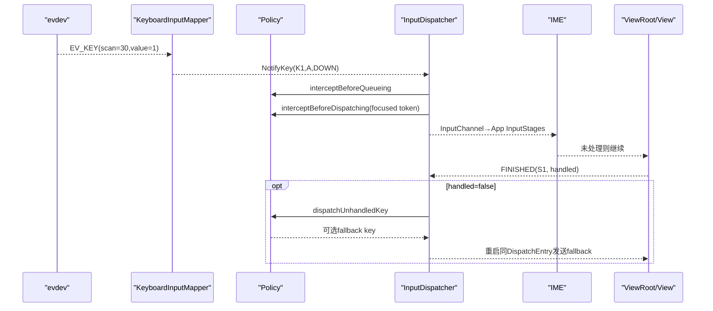

# 196 Android 完整 Key 事件源码实战追踪

> 场景：实体键scanCode 30映射为KEYCODE_A，经历首次DOWN、重复DOWN、UP；再补充未处理fallback。  
> 源码版本：Android 11 `android-11.0.0_r48`；Mac只读推演。

## 1. Key链比Touch多了什么

Key没有坐标和TouchState，却多出scanCode→keyCode、meta、repeat、focused window、两次policy、pre-IME/IME、handled fallback等分叉。

本章仍按“对象、线程、编号、状态、完成点”跟一条事件。

## 2. 五种Key身份

| 身份 | 示例 | 含义 |
|---|---:|---|
| Linux scanCode | 30 | evdev按键编号 |
| HID usage | 可选 | MSC_SCAN提供的一次性usage |
| Android keyCode | KEYCODE_A | KL/KCM映射后的Framework语义 |
| Event id | K1 | 一笔KeyEntry逻辑身份 |
| channel seq | S1 | 对某Connection发送与回执身份 |

scanCode与keyCode不是同一命名空间。

## 3. 总链路



## 4. EV_KEY value语义

Linux常见value：0释放、1首次按下、2自动重复。r48 KeyboardInputMapper调用`rawEvent->value != 0`，所以1和2都作为down处理。

Mapper不直接把value=2写成repeatCount；repeat识别在Dispatcher。

## 5. MSC_SCAN怎样使用

若EV_MSC/MSC_SCAN先到，Mapper缓存为`mCurrentHidUsage`；下一笔EV_KEY取走usage并立即清零。SYN_REPORT也会清未消费usage。

usage只与紧随的单笔key配对，不是永久设备属性。

## 6. 哪些EV_KEY进入Keyboard Mapper

`isKeyboardOrGamepadKey()`过滤mouse/touch button区间，避免同一BTN被Keyboard和Cursor/Touch重复解释。

边界由scanCode区间决定，不是所有EV_KEY都变KeyEvent。

## 7. mapKey的查找结果

DeviceContext根据scanCode、usage、当前meta查KL/KCM，输出keyCode、keyMetaState和policyFlags。失败则使用KEYCODE_UNKNOWN、当前meta和0 flags。

UNKNOWN仍可作为Key事件继续，不等于Mapper必然丢弃。

## 8. orientation-aware只改DOWN

首次down时可按display方向旋转方向键keyCode，并把最终keyCode与scanCode存入mKeyDowns。

UP和repeat从mKeyDowns取同一keyCode，即使中途屏幕旋转，也保证配对。

## 9. mKeyDowns按什么查

按scanCode查，不按keyCode。两个scanCode映射同一keyCode仍可各有down记录。

UP找不到对应scanCode会记录并丢弃，避免App收到无DOWN的UP。

## 10. 首次DOWN状态

scan30不在mKeyDowns：通过virtual-key quiet与gesture cancel检查后，保存`{keyCode=A, scanCode=30}`。

随后更新meta，设置Mapper `mDownTime=when`，构造NotifyKeyArgs。

## 11. Mapper mDownTime的版本细节

r48的`mDownTime`是KeyboardInputMapper共享字段，并在每个down分支末尾赋当前when，包括驱动重复DOWN，甚至其他键DOWN。

因此它不是严格的“每个scanCode首次按下时间表”。复杂多键/硬件repeat下，Notify的downTime会被最近down覆盖，这是读源码必须保留的实现边界。

## 12. meta何时更新

Shift/Ctrl/Alt/Meta/lock等键由`updateMetaStateIfNeeded()`更新设备meta；若全局meta变化，则本笔使用更新后的mMetaState。

InputDevice还会汇总各Keyboard Mapper形成Reader全局meta。

## 13. policyFlags从哪里来

KL映射可产生WAKE、VIRTUAL、GESTURE等flags；外接非media键默认可加WAKE；设备若声明自己处理repeat则加DISABLE_KEY_REPEAT。

这些是policy控制位，不等于最终KeyEvent flags。

## 14. NotifyKeyArgs首次DOWN

包含新event id K1、when、device/source/display、policyFlags、ACTION_DOWN、FROM_SYSTEM flag、keyCode A、scanCode30、meta和downTime。

Reader线程同步送InputClassifier；非motion事件直接pass-through给Dispatcher。

## 15. Dispatcher先把repeatCount设0

`notifyKey()`明确使用常量repeatCount=0，因为Dispatcher承担repeat跟踪/生成。即使evdev value=2，进入KeyEntry前仍为0。

驱动repeat要等dispatchKey预处理通过连续DOWN识别。

## 16. accelerateMetaShortcuts是什么位置

在第一次policy之前，Dispatcher可根据Meta组合替换keyCode并暂时调整meta；UP再按device/key表恢复同一replacement。

所以policy和App看到的keyCode可能不同于Mapper初始映射，但scanCode仍提供物理线索。

## 17. 第一次policy：beforeQueueing

Dispatcher在notify调用线程上构造临时KeyEvent，调用`interceptKeyBeforeQueueing`。Policy可修改PASS_TO_USER/WAKE等policyFlags并处理电源、音量等系统行为。

它发生在进入Dispatcher inbound queue之前，尚未选择focused window。

## 18. InputFilter分叉

Filter启用时Key也可被Java filter消费或重新注入。原Key被消费则不建KeyEntry；放行加FILTERED。

本例假设PASS_TO_USER且未被filter消费。

## 19. KeyEntry进入inbound

Dispatcher用K1和临时event修改后的keyCode/meta创建KeyEntry，入队并wake Dispatcher线程。

此时还没有target channel seq。

## 20. repeat状态预处理

首次trusted DOWN、repeatCount0且未DISABLE_REPEAT：Dispatcher保存lastKeyEntry，并把nextRepeatTime设为`eventTime + keyRepeatTimeout`。

如果在超时前收到UP或其他非synthetic事件，repeat状态可能reset。

## 21. Dispatcher合成repeat

到deadline且没有新inbound时，`synthesizeKeyRepeatLocked()`复用或复制last entry，生成新event id、当前eventTime、repeatCount+1，并标记syntheticRepeat。

下一次repeat间隔使用keyRepeatDelay；downTime沿用被保存entry的值。

## 22. 驱动repeat怎样识别

evdev value2再次走Mapper down，生成新K2、repeatCount仍0。Dispatcher若lastKeyEntry keyCode相同，就令K2 repeatCount=上次+1，并关闭自己的repeat timer。

这是“硬件正在repeat”的推断，判断键是keyCode相同，不检查scanCode。

## 23. LONG_PRESS flag何时加

Dispatcher仅在`repeatCount == 1`时加`AKEY_EVENT_FLAG_LONG_PRESS`，其他repeat清掉该flag。

所以LONG_PRESS标记第一笔repeat，不表示所有长按后续事件都有该flag。

## 24. 第二次policy：beforeDispatching

PASS_TO_USER KeyEntry第一次dispatch时，Dispatcher post command，取目标display当前focused window channel，在锁外调用`interceptKeyBeforeDispatching(token,event,flags)`。

它已知道预期窗口token，适合policy针对当前焦点延迟、跳过或放行。

## 25. policy返回三种语义

- delay < 0：SKIP，按policy drop；
- delay == 0：CONTINUE；
- delay > 0：TRY_AGAIN_LATER，记录绝对wakeup time。

延迟期间Key保持pending，不是睡眠阻塞整个Dispatcher线程。

## 26. focused target怎样查

按Key target display找FocusedWindow和FocusedApplication。两者都无则drop；有application无window则启动no-focused-window等待/ANR；window paused则继续pending。

Key不像Touch通过坐标选窗。

## 27. Key为何等之前事件

`shouldWaitToSendKeyLocked()`会等待其他Connection先前事件完成一小段时间，因为触摸可能刚打开新窗口并改变焦点。

超时后仍发送给当前focused window，避免永远被无关motion拖住。

## 28. InputTarget与monitor

Focused window得到FOREGROUND|AS_IS；随后添加目标display global monitors。Gesture monitor不因普通Key加入TouchState。

只有foreground目标增加同步注入finished计数。

## 29. InputState trackKey

Connection按device/source/display/keyCode/scanCode建立KeyMemento。重复DOWN更新/接受既有状态；UP清除。

窗口焦点丢失或设备reset时可据此合成CANCELED UP。

## 30. publish KeyMessage

每目标DispatchEntry得到seq S1，InputPublisher发送eventId、device/source/display、HMAC、resolved action/flags、keyCode、scanCode、meta、repeatCount、downTime和eventTime。

成功后outbound→wait并加入ANRTracker。

## 31. App Receiver收到Key

Key不参与MOVE batching，InputConsumer立即创建native KeyEvent；JNI复制Java KeyEvent并建立Java sequence→channel S1映射。

ViewRoot pending queue开始七段InputStage处理。

## 32. Pre-IME路径

NativePreIme可交InputQueue；ViewPreIme调用`dispatchKeyEventPreIme()`，常用于返回键在IME前拦截。

处理成功就finish，不再送IME或普通View dispatch。

## 33. IME为何能异步defer

ImeInputStage调用IMM。结果可能HANDLED、NOT_HANDLED或DISPATCH_IN_PROGRESS；第三种让QueuedInputEvent保持deferred，等待callback恢复。

这段延迟仍计入Dispatcher waitQueue的App处理时间。

## 34. EarlyPostIme做什么

可因键盘导航退出touch mode，并调用FallbackEventHandler `preDispatchKeyEvent`准备状态。

它不是native Dispatcher的unhandled fallback。

## 35. ViewPostIme分发顺序

先UnhandledKeyManager预分发，再`mView.dispatchKeyEvent()`进入DecorView/Activity/Window/View树；未处理还会尝试shortcut、ViewRoot FallbackEventHandler、focus navigation等。

任一步返回true都使最终handled=true。

## 36. App端FallbackEventHandler是什么

PhoneFallbackEventHandler可处理媒体、音量、电话等Framework默认行为。它运行在App ViewRoot输入链内，处理结果直接影响本次FINISHED handled。

它与Dispatcher收到handled=false之后调用policy `dispatchUnhandledKey`是两层机制。

## 37. handled=true如何结束

App发FINISHED(S1,true)。Dispatcher `afterKeyEvent`发现原key已处理，不生成新fallback；若以前为该original建立过fallback，会请求取消旧fallback并清映射。

随后S1从waitQueue移除。

## 38. handled=false的前提

必须是foreground原始key、不是已经带FALLBACK flag的key，才可能进入native unhandled处理。Monitor目标即使返回false也不会为它单独生成fallback。

Fallback key再次未处理，只report unhandled，不递归fallback。

## 39. initial DOWN为何关键

只有ACTION_DOWN且repeatCount=0、当前没有fallback map时，policy可首次决定original→fallback并锁存选择。

Repeat或UP若缺少先前map，会跳过unhandled处理，避免中途凭空创造fallback序列。

## 40. dispatchUnhandledKey做什么

Dispatcher解锁，把原KeyEvent交policy，并提供out event。Policy可返回false，或返回true且改写keyCode/meta等作为fallback。

返回后Dispatcher重新检查Connection仍NORMAL，因为锁外期间窗口可能销毁。

## 41. fallback map保存什么

首次DOWN将original keyCode映射到fallback keyCode；无fallback也存UNKNOWN，表示本生命周期已经决定过“不fallback”。

UP后删除map，确保下一次独立手势重新决策。

## 42. 怎样重启同一DispatchEntry

若policy给fallback，Dispatcher改写KeyEntry的eventTime/device/source/display/flags/keyCode/scan/meta/repeat/downTime，置FALLBACK，并返回restartEvent=true。

原wait entry先从wait取出再push到outbound前部，重新publish；它是重启发送流程，不是新Reader事件。

## 43. fallback seq会怎样

复用同一个DispatchEntry意味着其seq字段保持不变；原始FINISHED已被消费处理，但同一seq随后可对应重新发送的fallback并再次进入wait。

接收端前一笔映射已清，顺序发送使该seq可再次用于下一轮回执；不能假设fallback一定创建全新seq。

## 44. fallback生命周期变化怎么办

Repeat/UP仍向policy询问，但已锁存fallback keyCode不能随意改变。若policy不再要或给不同key，Dispatcher给旧fallback合成CANCELED UP并把map改为UNKNOWN/清理。

避免App卡在旧fallback DOWN。

## 45. UP如何从Mapper产生

EV_KEY value0按scan30找mKeyDowns，取保存的keyCode A并删除记录；找不到则丢。更新meta后构造ACTION_UP。

其downTime取Mapper当前共享mDownTime，可能已被repeat或其他键down改写，这是r48实现边界。

## 46. UP怎样停止repeat

非synthetic UP进入dispatchKey预处理的else分支，`resetKeyRepeatLocked()`释放lastKeyEntry并关闭repeat状态。

若UP在Dispatcher阻塞前已经排队，时序仍按inbound处理，不能仅看硬件已抬起就假设App立刻停止收到先前repeat。

## 47. Key的五个完成点

1. EV_KEY：内核状态变化；
2. NotifyKey：Mapper映射/meta完成；
3. beforeDispatching完成：policy允许目标选择；
4. publish→wait：App通道已接收；
5. FINISHED：App/IME/View链结束，可能还触发fallback重启。

第一次FINISHED handled=false不一定是整个逻辑处理终点。

## 48. 故障插点

| 现象 | 首查 |
|---|---|
| raw有、KeyCode UNKNOWN | KL/usage映射 |
| DOWN有UP无 | mKeyDowns scan配对/设备reset |
| Key不进App | beforeQueueing PASS、filter、beforeDispatching、focus |
| Key延迟 | prior events序列化、IME defer、waitQueue |
| repeat异常 | handlesKeyRepeat、连续keyCode、Mapper downTime |
| fallback卡键 | InputState fallback map/CANCELED UP |

## 49. macOS源码练习

```bash
rg -n "processKey|mKeyDowns|mDownTime" \
  frameworks/native/services/inputflinger/reader/mapper/KeyboardInputMapper.cpp
rg -n "synthesizeKeyRepeatLocked|interceptKeyBeforeDispatching|afterKeyEvent" \
  frameworks/native/services/inputflinger/dispatcher/InputDispatcher.cpp
rg -n "ViewPreImeInputStage|ImeInputStage|FallbackEventHandler" \
  frameworks/base/core/java/android/view/ViewRootImpl.java
```

## 50. 复读审计与下一章

复读限定：EV_KEY 1/2在Mapper都为down；repeatCount由Dispatcher生成；Mapper mDownTime是共享且每次down重写；LONG_PRESS只标repeatCount1；Key需序列化前序事件；App fallback与native policy fallback不同；fallback可复用DispatchEntry seq。

下一章进入**输入故障案例复盘与源码修改点选择**：用几类真实症状练习如何从证据选择最小、正确的修改层，而不是在最熟悉的文件里盲改。
