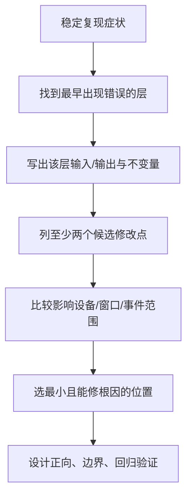

# 197 Android 输入故障案例复盘与最小修改点选择

> 源码版本：Android 11 `android-11.0.0_r48`。  
> 本章只做源码级方案设计，不在Mac上编译或修改AOSP。

## 1. 本章目标

“找到相关代码”不等于“找到了正确修改点”。输入链每层都会变换数据，越靠后补丁越容易掩盖上游错误，越靠前修改影响范围越大。

本章用案例训练：先证伪其他层，再选择最小、可恢复、保持状态机不变量的修改位置。

## 2. 最小修改原则



## 3. 什么叫“最早出现错误”

若raw ABS正确、Cooked已错误，根因在Reader配置/Mapper附近；若Cooked正确、命中窗口错误，查Dispatcher/WMS快照；若App MotionEvent正确、View回调错误，查View树。

第一处偏离预期的输出，比最终现象所在文件更接近根因。

## 4. 修改前固定记录

- 设备descriptor/location/vendor/product；
- displayId、viewport与窗口frame；
- action、pointerId、event/down time；
- EventEntry id、目标channel与wait状态；
- 复现步骤及“正常对照设备”；
- Android tag和厂商配置版本。

没有基线，修改后只能判断“似乎好了”。

## 5. 案例一：整块触屏X/Y颠倒

证据：EventHub raw X/Y符合硬件文档；所有App、系统栏、show touches均按同一种方式颠倒；Dispatcher窗口frame正常。

错误首次出现在Reader cooked坐标，应查viewport orientation、axis声明、IDC affine/calibration，而不是每个App View。

## 6. 候选修改点比较

| 修改点 | 影响 | 判断 |
|---|---|---|
| App交换x/y | 仅一个App，raw/local语义破裂 | 不适合系统触屏根因 |
| Dispatcher交换 | 所有同source事件，窗口/monitor都受影响 | 太晚且范围难控 |
| IDC affine/viewport | 特定设备、进入cooking前 | 优先 |
| 驱动axis声明 | 所有系统/用户 | 仅硬件描述本身错误时 |

## 7. 仿射修复的边界

先确认旋转前还是旋转后应用矩阵，避免把90度屏幕方向和硬件安装方向重复补偿。还要测试四角、中心、所有orientation和多指。

只测试竖屏中心点，无法发现offset、镜像和边界clamp错误。

## 8. 案例二：触摸仅在右下角偏移

若中心正确、边缘逐渐偏，常是scale/range/physical frame问题，不像固定offset。比较raw min/max、viewport physical/logical尺寸和TouchMapper surface scale。

不要先加常量偏移；线性斜率错误用常量只能修一个点。

## 9. 正确修改层

硬件上报范围与声明不一致：优先驱动/axis或设备专属校准；显示裁剪/overscan导致：修viewport生产；只有某窗口错：查windowScale/globalScale和App变换。

同一数学症状可来自不同层，必须用跨App/跨display对照定界。

## 10. 案例三：边缘虚拟键容易误触

证据应包含virtualkeys sysfs hit box、raw touch位置、屏幕内外状态、quiet time和Key DOWN/UP/CANCELED序列。

VirtualKey是TouchInputMapper状态机，不是普通View按钮。

## 11. 最小修复选择

单一机型区域过大：改该设备virtualkeys定义；滑动入边缘误触：评估命中/quiet策略；业务只想屏蔽某页面：App层消费可能更合适。

不要通过全局删除KEYCODE影响实体键盘同keyCode。

## 12. 必测VirtualKey序列

- 屏幕外DOWN并命中→按住→UP；
- 命中后滑出→CANCELED UP；
- 未命中后移动到另一key；
- virtual key滑入surface后Motion重新DOWN；
- 真实触屏活动触发quiet suppression。

只看最终点击会漏掉卡键。

## 13. 案例四：第二根手指偶尔变第一根

先区分pointer数组index变化与pointerId变化。Pointer index可因低id排序、UP移除而变化，这是合法；同一contact的pointerId无故改变才是问题。

App若用`getX(0)`长期追手指，通常应修App按pointerId查index。

## 14. 何时需要改Mapper

若trackingId稳定而Android pointerId中途变化，检查duplicate tracking、id map清理或fallback距离匹配；若驱动trackingId复用/跳变，优先修驱动，或为特定设备设计受限兼容。

不要为错误App假设破坏全系统pointer id协议。

## 15. 多指修复的不变量

- 同一手势id 0..31唯一；
- action index指向本次changed pointer；
- POINTER_UP事件仍包含即将抬起pointer；
- UP后id可复用，但旧手势结束；
- split窗口只收到自己的pointer子集。

任何补丁都要逐条验证。

## 16. 案例五：触控板双指偶尔飞跳

先看raw contacts是否突然换tracking/id，再看gesture状态、reference deltas、quiet mode和common motion。若raw稳定、pointer gesture输出跳，问题在TouchInputMapper gesture层。

不要在App对Mouse MOVE做低通，系统光标和其他App仍会跳。

## 17. 候选策略

设备噪声阈值可放IDC/参数；状态切换缺少settle/quiet应修gesture状态机；PointerController自身显示异常才查controller。

修改阈值要测试慢速精细移动，过强过滤会造成粘滞和高延迟。

## 18. 案例六：实体键长按不重复

证据：EV_KEY是否有value2；设备是否声明handlesKeyRepeat；Dispatcher KeyRepeat state、repeat timeout；App是否收到repeatCount。

没有value2并不必然故障，Dispatcher可定时合成；DISABLE_KEY_REPEAT才会阻止它。

## 19. 最小修改点

KL/IDC错误声明设备自己repeat：修设备配置；驱动确实repeat但节奏错：驱动层；只有某App忽略repeat：App KeyEvent逻辑。

不要同时保留驱动repeat和Dispatcher timer，否则可能双重重复。

## 20. Key回归矩阵

测试首次DOWN repeatCount0、首repeat count1+LONG_PRESS、后续count递增、UP停止、两键交错、旋转方向键、IME处理和fallback。

r48 Mapper共享mDownTime也应记录，避免补丁误宣称每键独立时间。

## 21. 案例七：按键DOWN有、UP丢失

若EventHub无value0，查硬件/驱动；EventHub有但Mapper日志丢“key was not down”，查scanCode配对、设备reset或重复节点；Dispatcher有UP而App无，查focus/channel/取消路径。

不要直接在App定时合成UP，它无法正确处理meta、repeat和窗口切换。

## 22. 何时合成CANCELED UP

设备reset、焦点丢失、连接状态收尾适合由Dispatcher基于Connection InputState合成；硬件永久漏UP若必须兼容，需要明确timeout、设备范围和误取消风险。

通用Dispatcher超时合成会伤害正常长按设备，通常不是最小修改。

## 23. 案例八：点窗口B，事件仍到A

先判断是同一旧手势的MOVE还是新的DOWN。普通Touch手势对DOWN目标粘性，移动进B仍到A是正常；新DOWN错才查Z序、touchableRegion、modal、portal与快照。

先修产品预期，避免把合法gesture ownership当bug。

## 24. 正确修改层

窗口区域/flags错误：WMS/InputWindowInfo生产；路由算法不符平台规则：Dispatcher（高风险）；业务希望滑动切换：App/父View手势或合法SLIPPERY窗口。

不要在Dispatcher按每个MOVE重选普通窗口，会破坏所有App手势。

## 25. 案例九：系统手势触发后App仍滑动

检查gesture monitor是否从DOWN参与TouchState、是否调用pilfer、pilfer token/display/device校验是否成功、App是否收到CANCEL。

只有monitor看到事件不代表已抢流。

## 26. 最小修改点

识别成功却未pilfer：系统手势组件；调用失败：monitor生命周期/display；Dispatcher没有给窗口CANCEL：才查pilfer实现/InputState。

不要让App凭某个坐标猜系统手势并自我CANCEL，这会复制系统policy。

## 27. 案例十：窗口销毁后App认为手指仍按下

对照setInputWindows移除、TouchState旧window、channel是否仍注册、合成CANCEL是否进入outbound/wait、Connection是否BROKEN。

窗口快照移除和channel注销是两阶段，任一顺序异常都可能影响收尾。

## 28. 修复选择

WMS未及时移除/注销：修生命周期；token提前清导致找不到channel：修操作顺序；channel已BROKEN：CANCEL无法可靠发送，应让客户端死亡/重建路径清状态。

不要无限重试向BROKEN socket发CANCEL。

r48的收尾代码把这个边界写得很直接：

```cpp
void InputDispatcher::synthesizeCancelationEventsForConnectionLocked(
        const sp<Connection>& connection, const CancelationOptions& options) {
    if (connection->status == Connection::STATUS_BROKEN) {
        return;
    }
    std::vector<EventEntry*> cancelationEvents =
            connection->inputState.synthesizeCancelationEvents(now(), options);
    // 后续才会把合成事件加入该Connection的派发队列
}
```

源码：`frameworks/native/services/inputflinger/dispatcher/InputDispatcher.cpp`。这说明CANCEL是“通道仍可工作时使两端状态重新一致”的协议事件，不是已经断链后的万能补救。

## 29. 案例十一：App偶发输入ANR

WaitQueue显示已publish未finish；trace App main卡在锁/GC/IME/Binder；Dispatcher正常。根因在App或其同步依赖，不应修改5秒timeout掩盖。

Timeout是症状报警线，不是性能修复器。

## 30. 何时才调整timeout

只有交互本来就允许长时间同步处理、产品policy明确且不会阻断核心导航时，才讨论窗口dispatching timeout；仍应先改异步架构。

全局放大timeout会延迟所有真实ANR发现。

## 31. 案例十二：OutboundQueue增长

Wait非空且socket满说明App消费不及；wait为空却WOULD_BLOCK被源码视为异常并可能break。检查client fd是否注册、App Looper是否读、channel端点是否错配。

不要增大队列当永久方案，积压只会提高输入延迟和内存。

## 32. 案例十三：坐标正确但View收不到点击

若App MotionEvent已到ViewRoot且坐标正确，继续查InputStage是否handled/defer、DecorView安全过滤、父View intercept、TouchTarget、child matrix和listener返回值。

此时修改Reader/Dispatcher是跨层误修。

## 33. View层最小修复

父容器误拦截：修`onInterceptTouchEvent`状态机；child在DOWN返回false：修消费契约；动画变换后区域不符：检查matrix/layout；遮挡安全flag被拒：修窗口安全关系。

保持DOWN→后续序列归属一致。

## 34. 案例十四：只有注入事件失败

真实硬件正常说明Reader/Mapper无需修改。检查injector pid/uid、目标owner uid、INJECT_EVENTS权限、displayId、WAIT模式和filter flags。

不要给所有窗口放宽`checkInjectionPermission()`来方便测试。

## 35. 安全边界

输入注入、MONITOR_INPUT、pilfer和跨UID OUTSIDE坐标都属于安全边界。修改前必须区分平台签名系统组件与普通App。

“功能能跑”不能作为降低权限门的充分理由。

以注入为例，r48不是简单判断“是不是注入事件”，而是比较目标窗口owner UID与injector UID；跨UID时再要求注入权限：

```cpp
if (injectionState &&
    (windowHandle == nullptr ||
     windowHandle->getInfo()->ownerUid != injectionState->injectorUid) &&
    !hasInjectionPermission(injectionState->injectorPid,
                            injectionState->injectorUid)) {
    return false;
}
```

因此，测试工具向自己窗口注入成功，不能推出它可以向任意窗口注入；修复也不应删除这层目标相关校验。

## 36. 案例十五：旋转后鼠标在旧屏幕

检查DMS viewport列表、pointerDisplayId、Reader DISPLAY_INFO刷新、PointerController viewport和CursorInputMapper display选择。

若仅图标留旧位置但event display正确，再查PointerController/Sprite事务，而不是Cursor raw REL。

## 37. 修改层选择表

| 最早错误证据 | 常见修改层 |
|---|---|
| evdev值/能力错 | 驱动 |
| 文件映射/参数错 | KL/KCM/IDC/virtualkeys |
| raw→cooked/action错 | InputMapper |
| display关联错 | DMS/IMS Configuration |
| 窗口快照错 | WMS/InputWindowHandle |
| 命中/状态/队列错 | InputDispatcher |
| App收到后错 | ViewRoot/View/业务 |

## 38. 配置优先于C++补丁

若问题能由特定descriptor的IDC/KL/virtualkeys表达，优先配置：范围可控、升级冲突小、容易回滚。

但配置不能修状态机内存安全、跨设备共性算法或错误生命周期。

## 39. 何时需要Mapper quirk

只有硬件无法升级、错误模式稳定可识别、配置表达力不足时，才考虑按vendor/product/descriptor受限quirk。

必须避免模糊name匹配和对所有touch设备生效。

## 40. Dispatcher修改为何高风险

它服务所有输入设备、display、窗口、monitor和注入者，且维护手势/连接一致性。一个“特例”可能破坏CANCEL、split、ANR或安全。

修改前至少覆盖触屏、鼠标、触控板、多显示、窗口销毁和注入回归。

## 41. 不变量先于实现

补丁说明应先写：修改后仍保证什么。例如“在进程、channel和派发链仍有效的正常协议路径中，App看到DOWN后最终看到匹配的UP或CANCEL”“同一手势内pointerId唯一”“未授权注入不能到跨UID窗口”。进程崩溃或channel已经BROKEN时，服务端只能清理自身状态，不能承诺死亡客户端还会收到收尾事件。

若无法写出不变量，说明尚未真正理解修改点。

## 42. 只读概念diff模板

```text
问题：
最早错误层：
证据：
候选A/B：
选择与影响范围：
保持的不变量：
概念修改：
正向/边界/回归用例：
回滚方式：
```

Mac阶段写概念diff即可，不把“未编译方案”表述为已验证修复。

## 43. 负向用例为什么重要

修虚拟键误触还要证明实体键不受影响；修touch viewport还要证明鼠标/外屏不变；修repeat还要证明设备自带repeat不双发。

负向用例定义补丁作用域。

## 44. 状态切换用例

输入bug常在中途变化：旋转、窗口销毁、display移除、设备拔出、pointer capture、filter启停、ANR恢复。

静态DOWN/UP通过并不足以证明生命周期正确。

## 45. 日志补丁应放哪里

放在状态边界并打印可关联身份：device/display、event/action、pointer/key、token/channel、旧→新状态。避免每个MOVE无条件刷大量敏感坐标。

调试日志本身不能改变锁持有时间或制造新延迟。

## 46. 性能补丁怎样证明

比较同场景Reader→Dispatcher、publish→App、App→FINISHED延迟分布和队列峰值，不只比较平均值。

输入体验更受尾延迟、丢序列和批处理节奏影响。

## 47. 安全审查问题

- 是否让普通UID看到其他窗口坐标/按键？
- 是否绕过INJECT_EVENTS或MONITOR_INPUT？
- 是否接受伪造token/display/device？
- 是否破坏HMAC/可信flag语义？
- dump/log是否泄露输入内容？

## 48. 可维护性审查问题

能否用配置替代？是否限定版本/设备？注释是否解释“为什么”而非复述代码？未来Android升级该逻辑是否已迁移？测试能否自动捕获回归？

最短代码不一定是最小风险修改。

## 49. 复读审计

本章复读避免三种错误倾向：把合法手势粘性当路由bug；把timeout/队列增大当性能修复；为单设备问题修改全局Dispatcher。

每个案例均要求先定位第一处错误输出，再选修改层；未真机/编译验证的内容只称方案。

## 50. 检查题与下一章

1. 所有App坐标同样偏，为什么不应先改View？
2. App waitQueue卡住，何时可以调整timeout？
3. gesture monitor看到事件但App没CANCEL，应检查哪三步？
4. 一个设备repeat异常，怎样避免影响其他键盘？

下一章学习**AOSP输入定制的补丁组织、测试与升级策略**，把“找到最小修改点”进一步变成可维护的工程方案。
