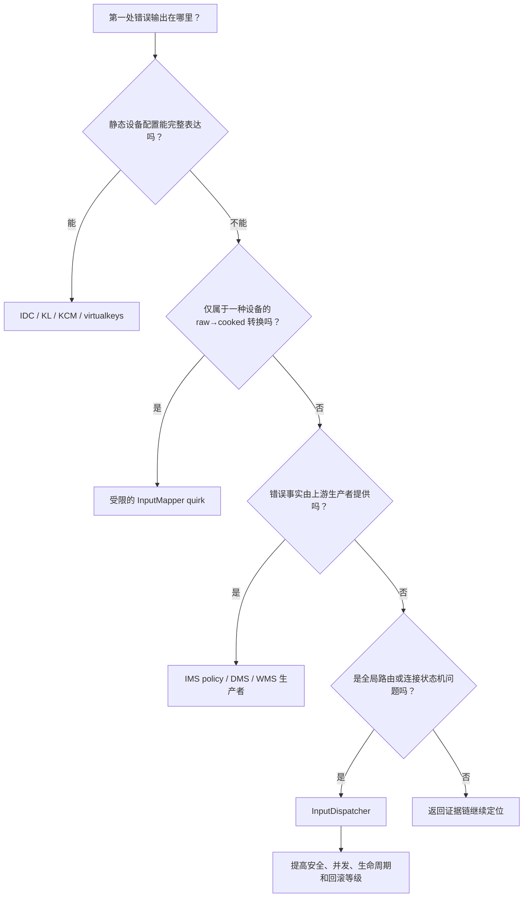
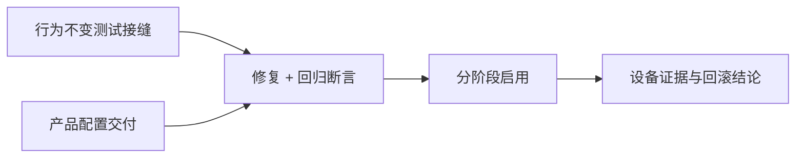
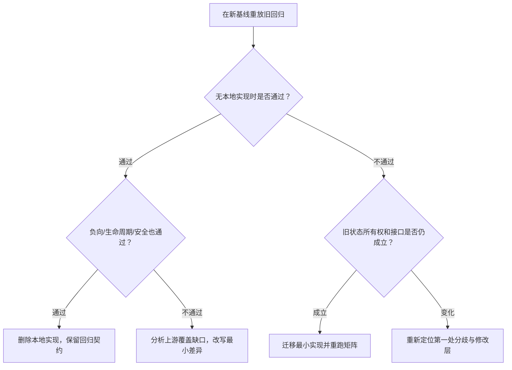

# 198 Android 输入定制的补丁组织、测试与升级策略

> 源码基线：Android 11 `android-11.0.0_r48`。  
> 阅读环境：macOS；本章执行源码级只读验证，不把本机阅读冒充设备编译或真机结果。  
> 贯穿场景：一款身份确定的外接触摸设备在重连后可能重复报告仍活动的 tracking ID，留下旧 pointer 状态；修复必须只作用于该设备，并经得住后续 Android 基线升级。

设备上的问题第一次被修好，并不等于工程已经结束。

更危险的时刻通常发生在半年后：原始样机不在手边，提交说明只写着“修复触摸异常”，测试没有区分 Reader 通知、Dispatcher 取消和 App 完成，升级人员只看到一段能干净应用的 C++ 差异。

**本章结论：可维护的输入补丁不是一段 diff，而是一份可重复判定的行为契约。**  
它必须把设备身份、第一处错误、最小修改层、状态不变量、分层测试、启用边界、回滚条件和升级去留绑在一起。

读完后，你应该能完成三件事：

1. 判断一个定制应落在配置、Mapper、Policy 生产者还是 Dispatcher；
2. 为 Reader 与 Dispatcher 分别选择能证明目标结论的测试缝；
3. 在升级时用行为证据决定删除、改写或迁移旧补丁。

本章不承诺当前 macOS 能构建 `inputflinger_tests`，也不声称已经完成跨 Android 版本对比。当前源码树只足以建立 r48 的基准事实和升级检查方法。

---

## 1. 一次修复为什么会变成长期维护契约

先看一个代表性任务：

> 一款确定 vendor、product、version 的外接触摸设备，在重连后重复报告仍活动的 tracking ID；同类其他设备必须保持原状，系统升级后也不能让旧兼容逻辑悄悄扩大作用域。

这个场景真正需要维护的不是“哪几行代码变了”，而是下面这条因果链：

```text
设备身份与能力
    ↓
可重复的 raw / 配置 / 窗口前置状态
    ↓
第一处错误输出
    ↓
最小负责层
    ↓
修复后的状态不变量
    ↓
分层自动测试与真机证据
    ↓
启用、观测、回滚和升级结论
```

只保存实现差异，会丢失至少四种信息：

| 丢失的信息 | 未来最容易发生的错误 |
|---|---|
| 为什么只匹配这批设备 | 新硬件被错误命中，或同名设备漏命中 |
| 哪个输出最先错误 | 在下游再次补偿，形成双重变换 |
| 哪些旧状态必须清理 | 中途开关、拔设备或换窗口后留下悬空手势 |
| 什么才算修复完成 | 把“注入已接受”误当成“客户端已处理” |

因此，补丁的稳定接口不是函数签名，而是行为契约：

- 对哪些输入和状态生效；
- 对哪些输入明确不生效；
- 修改前哪条断言失败；
- 修改后哪条断言通过；
- 发生设备 reset、窗口移除、channel 断开时怎样收尾；
- 何时允许开启或关闭；
- 新基线满足什么证据时可以删除。

**完成点也必须写进契约。**

以一次触摸为例，下面几句话不能互换：

| 观察 | 最多能证明什么 |
|---|---|
| Mapper 发出 `NotifyMotionArgs` | Reader 侧完成了一次转换 |
| Dispatcher 接受 `notifyMotion` | 事件进入了派发入口 |
| injection 返回成功 | 达到了所选同步模式的注入完成点 |
| client channel 收到事件 | 事件已发布到该连接 |
| client 成功发送 `FINISHED(seq)` | FINISHED 消息已写入 channel |
| Dispatcher 处理该响应 | 该 connection 的匹配等待项已删除并更新完成账 |
| App 画面发生变化 | 上层业务和渲染也产生了可见结果 |

一个维护周期里，补丁可能经历“配置版 → 设备 quirk → 上游通用修复 → 删除本地代码”。只要行为契约仍在，代码形态变化并不会让知识丢失。

---

## 2. 最小可审计补丁单元包含哪些内容

“一个补丁”在这里表示一个逻辑变更单元，不要求仓库里真的存在同名目录。

至少应保存以下九类事实：

| 字段 | 必须回答的问题 |
|---|---|
| 现象 | 用户看见什么，发生概率和前置状态是什么 |
| 身份 | descriptor、bus、vendor、product、version、设备名分别是多少 |
| 基线 | Android tag、内核/固件版本、产品配置是什么 |
| 第一处分歧 | raw、Mapper notify、窗口快照、目标选择、publish、finish 中哪里先错 |
| 作用域 | 为什么不能在更窄层表达 |
| 不变量 | 正常、异常和生命周期路径分别必须保持什么 |
| 测试 | 哪个用例在有故障的旧基线上失败，在哪一层观察 |
| 发布 | 默认值、生效时机、观测指标和止损阈值是什么 |
| 退出 | 上游修复或硬件退役后，怎样证明可删除 |

一条实用的记录可以写成：

```text
selector:
  bus/vendor/product/version + 必要的能力特征
trigger:
  完整事件序列与前置状态
first_bad_output:
  具体类、方法、字段或队列
invariants:
  正向、负向、生命周期、安全、完成账
activation:
  启动、设备重开或下一次手势
rollback:
  操作、触发阈值、状态清理方式
upgrade:
  delete / rewrite / migrate 的判据
```

**现场样本不是越多越好。**

输入日志可能包含：

- 键值和快捷键；
- 触摸坐标与轨迹；
- 窗口名称、包名、UID；
- 设备序列号或 descriptor；
- 精确时间线。

进入代码仓库的证据应最小化并脱敏。原始长日志若确有保留价值，应进入受控存储，只在变更记录中保存受控引用、采集条件和哈希；不要把生产环境原始输入流直接提交到普通源码历史。

这些事实共同定义补丁的行为边界；实现、测试与提交怎样保持可二分，由第 7 节统一处理。这里的验收标准是：第三个人能否只凭记录重建当时的决策。

---

## 3. 从配置到 Dispatcher 的风险漏斗怎样使用

最小修改层不是“越靠近内核越好”，而是“最早能完整表达根因、又不制造第二套事实的层”。



四层的典型责任如下：

| 修改层 | 适合解决 | 不适合解决 | 主要回归面 |
|---|---|---|---|
| 设备配置 | 稳定属性、轴解释、键映射、设备类型 | 需要记忆历史的状态机 | 文件误匹配、加载顺序 |
| InputMapper | 特定设备的 raw 状态归一化 | 窗口焦点、跨连接路由 | 同类设备、手势生命周期 |
| Policy/WMS/DMS | display viewport、窗口快照、策略事实 | 在 native 下游猜测上游真实意图 | 显示、窗口和策略更新 |
| InputDispatcher | 命中、焦点、连接、等待账、安全和全局手势所有权 | 单设备静态校准 | 所有设备、窗口、monitor、注入者 |

回到贯穿场景：静态配置不能表达“重连前后的 tracking ID 历史”；若第一处错误位于 Mapper 且稳定 selector 能隔离该设备，就应停在设备受限 quirk，而不是继续下沉到 Dispatcher。只有所有合规设备都违反同一协议不变量时，才上升为通用算法修复。

一次排查应先写“首个错误”：

```text
raw 正确，NotifyMotion 坐标错误
→ 看 Mapper / calibration / viewport

NotifyMotion 正确，InputWindowInfo frame 错误
→ 看窗口快照生产链

快照正确，目标选择或连接等待账错误
→ 才进入 Dispatcher
```

下游补偿经常暂时掩盖现象，却使升级更危险。

例如上游把 display 关联写错，若在 Dispatcher 再把 displayId 猜回去：

- dump 中会同时存在两套互相矛盾的事实；
- 上游真正修复后可能发生二次改写；
- monitor、注入和非触摸设备可能经过不同分支；
- 负向测试很难定义“谁不该被补偿”。

进入更宽层之前，至少回答：

1. 配置为什么表达不了；
2. Mapper 为什么不是事实所有者；
3. 上游生产者是否已经错；
4. 修改会不会改变正在进行的手势；
5. 连接断开、窗口移除、设备 reset 时谁清理旧状态；
6. 权限和目标隔离是否改变；
7. 如何在不重启整机的情况下止损，若不能，为何不能。

答不完整，说明补丁边界还没有收敛。

---

## 4. 配置补丁必须证明匹配、搜索、打包与加载

r48 中最容易混淆的是：文件类型、文件名选择、目录搜索、运行时加载是四个不同问题。

**先分开五种载体。**

| 载体 | r48 的主要用途 | 身份/入口 | 关键边界 |
|---|---|---|---|
| `.idc` | 输入设备属性与 Mapper 校准参数 | `EventHub::loadConfigurationLocked` | 不等于任意 XY 仿射矩阵 |
| `.kl` | scan code / usage 到 keyCode、flags 或 axis | `KeyMap::load` | 不定义字符组合 |
| `.kcm` | keyCode、meta 到字符及行为 | `KeyMap::load` | 与 KL 的物理映射职责不同 |
| `virtualkeys.*` | 屏外虚拟按键几何 | EventHub 的 sysfs 路径 | 不走普通配置文件搜索器 |
| 持久 `TouchCalibration` | descriptor + rotation 对应的 XY 仿射 | IMS 数据存储 → JNI policy callback | 不是 IDC 文件 |

`InputDeviceConfigurationFileType` 只列出 IDC、KL、KCM 三类：

```cpp
enum InputDeviceConfigurationFileType {
    INPUT_DEVICE_CONFIGURATION_FILE_TYPE_CONFIGURATION = 0,
    INPUT_DEVICE_CONFIGURATION_FILE_TYPE_KEY_LAYOUT = 1,
    INPUT_DEVICE_CONFIGURATION_FILE_TYPE_KEY_CHARACTER_MAP = 2,
};
```

这已经说明 `virtualkeys` 与持久仿射校准不能被笼统叫作“同一类设备配置文件”。

**文件名先做三档选择。**

`frameworks/native/libs/input/InputDevice.cpp` 的 r48 实现依次尝试：

```cpp
if (deviceIdentifier.vendor != 0 && deviceIdentifier.product != 0) {
    if (deviceIdentifier.version != 0) {
        // Vendor_%04x_Product_%04x_Version_%04x
    }
    // Vendor_%04x_Product_%04x
}
return getInputDeviceConfigurationFilePathByName(
        deviceIdentifier.getCanonicalName(), type);
```

也就是：

```text
Vendor_1234_Product_5678_Version_0001
    ↓ 未找到
Vendor_1234_Product_5678
    ↓ 未找到
规范化后的设备名
```

设备名规范化会把不属于字母、数字、连字符和下划线的字符替换成下划线。它不是 descriptor。

因此，提交说明不能只写“按 descriptor 命中 IDC”，也不能只放一个文件名而不记录实际 `InputDeviceIdentifier`。

**每个候选名内部再做目录搜索。**

`getInputDeviceConfigurationFilePathByName()` 的顺序是：

```cpp
const char *rootsForPartition[] {"/odm", "/vendor", getenv("ANDROID_ROOT")};
for (...) {
    // <root>/usr/<type>/<name>.<extension>
    if (!access(path.c_str(), R_OK)) {
        return path;
    }
}
// 最后检查 ANDROID_DATA/system/devices/...
```

在常见设备上，`ANDROID_ROOT` 对应 `/system`，`ANDROID_DATA` 对应 `/data`，但源码表达的是环境变量，记录时最好同时保存设备上的实际值。

两层优先级组合时，**文件名候选是外层循环，目录是内层循环**。实现先拿 version 名调用完整的目录搜索；所有目录都找不到时，才改用 product 名，因此通常会得到：

```text
version 名：/odm → /vendor → ANDROID_ROOT → ANDROID_DATA
    ↓ 全部未找到
product 名：/odm → /vendor → ANDROID_ROOT → ANDROID_DATA
    ↓ 全部未找到
canonical name：/odm → /vendor → ANDROID_ROOT → ANDROID_DATA
```

这意味着 `ANDROID_DATA` 中更精确的 version 文件可以先于 `/odm` 中较宽的 product 文件被选择。审查覆盖关系时必须按真实嵌套顺序手算。

**EventHub 只保存实际选中的路径。**

```cpp
device->configurationFile =
        getInputDeviceConfigurationFilePathByDeviceIdentifier(
                device->identifier,
                INPUT_DEVICE_CONFIGURATION_FILE_TYPE_CONFIGURATION);
if (!device->configurationFile.empty()) {
    PropertyMap::load(String8(device->configurationFile.c_str()),
                      &device->configuration);
}
```

“镜像里有文件”只证明打包成功。`configurationFile` 在 `PropertyMap::load()` 之前就已赋值，所以路径或 dump 只能证明候选被选中；还要确认解析没有报错，并用具体属性驱动的 Mapper 行为证明它已被消费。

KL/KCM 还会经过 `frameworks/native/libs/input/Keyboard.cpp` 的 `KeyMap::load`。它先分别尝试 device configuration 指定的 `keyboard.layout` 与 `keyboard.characterMap`；若两项尚未齐全，再依次探测 device identifier、`Generic`、`Virtual`，而且每轮只加载尚缺的那一项。

所以最终 KL 与 KCM 可以来自不同候选名或不同文件，不能把它们假设成一对同时命中的配置。

**virtualkeys 另走 sysfs。**

r48 的 `EventHub::loadVirtualKeyMapLocked()` 构造：

```text
/sys/board_properties/virtualkeys.<canonical-device-name>
```

它不调用上述 `/odm`、`/vendor`、`ANDROID_ROOT`、`ANDROID_DATA` 搜索器。把 `virtualkeys.*` 放进普通 `usr` 配置目录，文件即使被打包，也不会因此被这里读取。

**XY 仿射来自另一条链。**

`InputManagerService.getTouchCalibrationForInputDevice()` 以 descriptor 和 surface rotation 查询 `PersistentDataStore`；JNI policy 回调把六个 float 转成 `TouchAffineTransformation`；`TouchInputMapper::updateAffineTransformation()` 再取得它：

```cpp
mAffineTransform =
        getPolicy()->getTouchAffineTransformation(
                getDeviceContext().getDescriptor(),
                mSurfaceOrientation);
```

它在 cooking 坐标时先应用仿射，再做 surface 的旋转与缩放。IDC 仍负责许多触摸参数，但不能因此把持久 XY 仿射说成 IDC 属性。

**加载时机决定回滚方式。**

设备打开时，EventHub 读取 IDC；`TouchInputMapper::configure()` 在首次配置时解析并确定 Mapper 校准参数。普通文件内容变更不会凭空触发重载。

r48 另有两种明确路径：

- `CHANGE_MUST_REOPEN`：Reader 请求 EventHub 重开全部设备；
- `CHANGE_TOUCH_AFFINE_TRANSFORMATION`：重新取得持久仿射，无需把它假设成 IDC 重载。

因此每个配置补丁要写清：

| 问题 | 必须记录 |
|---|---|
| 如何命中 | 三档文件名中的哪一档 |
| 从哪里读取 | 实际分区/数据路径 |
| 谁打包 | 对应产品 make/Soong 入口 |
| 何时生效 | 开机、重插、设备重开或专用刷新 |
| 如何证明 | dump 字段、行为断言、必要的读取日志 |
| 如何撤回 | 删除覆盖文件、恢复值以及重开边界 |

资源 overlay 只有在真正的读取者消费 framework resource 时才合适。它不能代替 EventHub 的文件查找，也不能给 Mapper 增加一段状态机。

---

## 5. 设备受限 quirk 怎样避免扩散

当固件暂时无法修复、静态配置表达力不足，而且错误只属于一小批设备时，可以在 Mapper 附近引入 quirk。

它必须把“识别谁”和“怎样处理”分开：

```cpp
// 概念结构，不是 r48 原样代码
bool matchesAffectedDevice(const InputDeviceIdentifier& id,
                           const Capabilities& caps);

Result normalizeAffectedSequence(const RawState& oldState,
                                 const RawState& newState);
```

拆开的价值有三点：

1. selector 可以独立做命中与不命中测试；
2. 热路径不必反复解析产品字符串；
3. 升级时能分别判断“设备范围是否仍成立”和“行为修复是否已被上游吸收”。

**selector 要从稳定到易漂移排序。**

| 信号 | 适合程度 | 风险 |
|---|---|---|
| bus + vendor + product + version | 优先 | 固件 version 可能变化 |
| 必要的 capability 组合 | 作为收窄条件 | 同协议设备可能共享能力 |
| descriptor | 可用于系统内持久身份 | 生成规则或连接拓扑变化需复核 |
| 设备 name | 只作末级辅助 | 同名、改名、本地化或空格规范化 |
| 产品型号字符串 | 不宜散落在事件热路径 | 与输入设备身份不是同一事实 |

不要为了“以后可能还有设备”预先扩大匹配。更稳妥的规则是：

```text
明确受影响的身份
AND
能证明根因所需的能力特征
AND
只在异常序列出现时改变行为
```

**quirk 仍要服从协议不变量。**

假设固件会给出异常 tracking ID，兼容策略不能只写“去重”。它必须定义：

- 旧 pointer 的所有权怎样结束；
- 本帧 action index 是否仍合法；
- pointerId 是否在当前手势内唯一；
- 丢弃、重建还是触发 device reset；
- 下一帧怎样重新建立基线；
- 正常多指设备为什么不会被命中。

“重复 raw trackingId”与 Dispatcher 拒绝“同一 MotionEvent 内重复 pointerId”属于不同层。后者的注入验证不能证明 Mapper 已经正确容错前者。

**状态切换必须选安全边界。**

如果 quirk 会改变坐标、pointer 身份或手势展开，中途切换可能让旧 `downTime`、旧 pointer 集合与新规则混在同一手势。

可选边界按风险从低到高排列：

```text
下次开机
→ 设备重开/重插
→ 没有活动手势时
→ 下一次 DOWN
→ 当前 MOVE 中途立即切换
```

最后一种通常需要显式取消、清空状态并重建，否则“开关可热变”只是表面能力。

设备 quirk 的负向测试至少覆盖：

- 同 vendor/product、不同 version；
- 同名但不同 vendor/product；
- 能力相近的正常设备；
- 正常长按与正常多指；
- reset、拔出、重新加入；
- quirk 关闭时保持基线行为。

如果 selector 不能被测试直接构造，说明它与系统环境耦合过深，升级时也很难审计。

---

## 6. 通用 Mapper、Policy 与 Dispatcher 的修改门槛

只有当问题对所有满足协议的设备都成立时，才把设备故障上升为通用 Mapper 修复。

一个合格的通用结论应像：

> 给定合法的 active pointer 集合，展开后的 action index 必须指向本事件中的有效 pointer；reset 后 Mapper 不得继续携带上一代设备状态。

它不应像：

> 某个 vendor 的样机这样处理手感更好。

**通用 Mapper 修改要审查三份状态。**

| 状态 | 典型问题 |
|---|---|
| 原始上一帧 | slot、tracking ID、button、axis 是否完整 |
| cooked 当前帧 | pointerId、坐标、tool type、usage 是否一致 |
| 已派发历史 | downTime、上一 action、虚拟键或手势状态是否需要收尾 |

修改 mapping 算法后，不能只断言最后一个坐标值。要验证完整事件序列，以及状态在 device reset 后是否清空。

**Policy/WMS/DMS 修改先确认事实所有权。**

display viewport、`InputWindowInfo`、焦点、窗口 frame、touchable region 和超时通常由上游组件生产，再传给 Reader 或 Dispatcher。

若 native 消费者拿到的快照已经错了，应先修生产者：

```text
DMS / WMS / IMS policy
    ↓ JNI 或服务内接口
ReaderConfiguration / InputWindowInfo
    ↓ 缓存
Mapper / Dispatcher 消费
```

只有证据表明“生产事实正确，消费状态机错误”，才应在 native 消费层修改。

**Dispatcher 修改是全局状态机修改。**

它至少影响以下一项：

- `TouchState` 的窗口—pointer 关系；
- `Connection` 的 outbound / wait 队列；
- `InputState` 的提前按键和触摸状态；
- monitor 与 gesture monitor；
- 注入权限和同步等待；
- ANR deadline 与恢复；
- 焦点、窗口移除、channel 断开。

评审时要逐一回答：

| 事件 | 需要证明的收尾 |
|---|---|
| 手势中窗口移除 | 旧目标是否获得可发送的取消，状态何时删除 |
| channel 断开 | 旧 connection 如何清理；恢复应注册新 channel/window |
| device reset | Key 流与 Motion 流分别合成什么 |
| focus 改变 | 已派发按键、待派发按键和新焦点如何分账 |
| monitor 加入/移除 | 是否只影响合法 display 和当前流 |
| 未授权注入 | 目标 channel 是否确实没有收到事件 |
| client 不回 FINISHED | waitQueue、ANR 与后续恢复是否收敛 |

Dispatcher 的锁内热路径还要检查：

- 是否新增磁盘 I/O、Binder 调用或不可控日志；
- 是否对每个 MOVE 做字符串构造或动态查表；
- 是否改变锁顺序；
- 是否让状态更新早于可能失败的 publish；
- 是否把一个 connection 的完成账误扩成全局完成。

修改越靠近这里，越不能用“一次手点成功”作为验收。

---

## 7. 怎样组织原子提交与可二分补丁栈

补丁栈的目标不是看起来整齐，而是让每个历史点都能构建、解释和回滚。

一组常见依赖可以组织为：

```text
1. 行为不变的测试接缝（seam）/ 可观测性准备
2. 配置或基础事实生产者修复
3. 设备受限 quirk，连同正向与负向回归
4. 必要的产品 policy 接线
5. 独立的性能优化或诊断增强
```

这个顺序不是固定模板。真正的规则有三条：

1. 行为不变的准备提交应单独绿色；
2. 修复和能证明该修复的回归断言放在同一逻辑提交；
3. 每个后续提交显式写出依赖，不制造只能整体搬运的大差异。

**不要机械地把所有测试放到最后。**

否则二分历史可能出现：

- 代码已改变但没有行为证据；
- 测试提交单独落地后只会失败；
- 回滚实现却遗漏对应测试；
- 升级人员无法判断冲突属于实现还是 oracle。

配置文件和代码有时需要分提交，是因为它们属于不同产品或仓库；这种情况下要在两边写相同的变更 ID、应用顺序与单独回滚后果。

若能取得可重现故障的旧基线，直接针对根因的新增回归断言应在该基线上失败；若新基线已经含修复，回迁或特征测试可能一开始就通过。两种情况都要写明对照基线，不能只留下“新增测试通过”。

**提交说明至少回答八问。**

1. 什么设备、版本和事件序列稳定触发？
2. 第一处错误输出在哪里？
3. 为什么配置或更窄层不能解决？
4. 修改了哪个状态所有者？
5. 保持哪些正向、负向和生命周期不变量？
6. 哪个测试在什么对照基线上区分修改前后？
7. 开关何时生效，正在进行的手势怎样处理？
8. 触发什么条件时撤回，撤回后怎样证明状态恢复？

**补丁依赖要能画成有向图。**



如果 B 实际不依赖 C，就不要仅为了编号顺序把它们绑死；如果依赖，就不能声称 B 可单独 cherry-pick。

**每个提交的本地检查与设备检查要分栏。**

```text
源码侧：
  格式、静态分析、目标单测、相邻模块单测、benchmark

设备侧：
  文件实际命中、目标设备序列、非目标设备负向、
  生命周期、权限、完成账、性能和回滚演练
```

---

## 8. r48 测试构建拓扑能证明到哪里

`frameworks/native/services/inputflinger/tests/Android.bp` 定义一个 `cc_test`：

```bp
cc_test {
    name: "inputflinger_tests",
    defaults: [
        "inputflinger_defaults",
        "libinputflinger_base_defaults",
        "libinputreader_defaults",
        "libinputreporter_defaults",
        "libinputdispatcher_defaults",
        "libinputflinger_defaults",
    ],
    srcs: [
        "InputDispatcher_test.cpp",
        "InputReader_test.cpp",
        // 还包含其他测试与辅助源码
    ],
    require_root: true,
}
```

同一文件的注释给出关键设计：inputflinger 内部目标的实现源码通过 defaults 编进测试，而不是把被测 inputflinger 目标作为 shared/static library 链进来；这样用例面向当前源码树编译出的实现，不会误跑设备上已有的 inputflinger 版本。

这个结论要限定在“inputflinger 各目标的被测实现”：

- 模块仍会正常链接 `libbase`、`libbinder`、`libui` 等依赖；
- defaults 的具体 filegroup 和 source 列表也会随基线变化；
- 升级时既要看测试文件，也要看 reader、dispatcher 和顶层 `Android.bp`。

`srcs` 实际还包含：

- `AnrTracker_test.cpp`；
- `BlockingQueue_test.cpp`；
- `EventHub_test.cpp`；
- `TestInputListener.cpp`；
- classifier 相关测试；
- `UinputDevice.cpp`。

这说明模块名称相同，不代表每个路径都由同一种夹具覆盖。

**`require_root: true` 只是一条模块执行属性。**

从这一行不能推出：

- 每个用例都在验证 root 特权；
- 跨 UID 注入分支已经覆盖；
- SELinux、system_server 权限或真实 App UID 已参与；
- 测试里传入的 `injectorUid` 就等于进程有效 UID。

权限语义仍要从 Dispatcher 的判断条件、FakePolicy 返回值、窗口 ownerUid 和测试入参逐项证明。

**r48 还有独立 benchmark。**

`frameworks/native/services/inputflinger/benchmarks/Android.bp` 定义 `inputflinger_benchmarks`，当前源码主要覆盖 Dispatcher 的 `notifyMotion` 与 `injectMotion` 循环。

它能比较特定构造下的吞吐或耗时变化，但不能替代：

- Reader 转换正确性；
- 真正的 evdev/EventHub 接入；
- system_server/WMS/App 主线程；
- 显示与触控端到端延迟；
- 长时间运行下的内存和抖动。

功能测试回答“行为是否正确”，benchmark 回答“特定路径成本是否变化”，真机测量回答“产品链路是否满足目标”。三者不能互相代替。

本章接下来将 r48 的测试缝拆成 Reader 与 Dispatcher 两组，因为它们拥有不同的输入、oracle 和完成点。

---

## 9. InputReader 的三种测试缝分别证明什么

测试缝（seam）是为了控制输入和观察输出而选择的替换边界；oracle 是判定结果正确与否的断言依据。`InputReader_test.cpp` 不是一种统一夹具，而是至少包含三种层级。

| 测试缝 | 输入方式 | 运行主体 | 适合证明 | 不能直接证明 |
|---|---|---|---|---|
| 直接 Mapper | 构造 device/context，直接调 `mapper.process()` | Mapper 同步逻辑 | raw 状态如何成为 notify 序列 | Reader 编排、真实 EventHub、配置文件查找 |
| 同步 Reader | `FakeEventHub` + 显式 `loopOnce()` | `InstrumentedInputReader` | 设备事件与 Reader 编排 | 真实 evdev 批处理、物理能力和 sysfs |
| 集成缝 | `/dev/uinput` + 真实 EventHub + Reader 线程 | 测试进程内的真实 Reader 接入 | evdev/EventHub/Reader 接入 | 真实固件、产品打包、WMS/Dispatcher/App |

先选 oracle，再选测试缝。若只改 `TouchInputMapper` 的一条转换规则，直接 Mapper 测试最短；若问题是设备加入、scan 完成和 Reader 通知顺序，同步 Reader 更合适；若要证明 Linux 输入节点确实进入 EventHub，则需要 uinput 集成层。

**同步 Reader 夹具的组成。**

`InputReaderTest::SetUp()` 创建：

```cpp
mFakeEventHub = std::make_unique<FakeEventHub>();
mFakePolicy = new FakeInputReaderPolicy();
mFakeListener = new TestInputListener();
mReader = std::make_unique<InstrumentedInputReader>(
        mFakeEventHub, mFakePolicy, mFakeListener);
```

这里替换了三处外部依赖：

- FakeEventHub 控制设备、配置和 `RawEvent`；
- FakePolicy 控制 viewport、禁用设备、仿射等 policy 值；
- TestInputListener 保存 Reader 向下游发出的 notify 参数。

它适合判断：

```text
给定可控设备事实
+ 给定 ReaderConfiguration
+ 给定 RawEvent 序列
→ Reader 发出哪些 Notify*Args
```

但 FakeEventHub 的配置、key map 和 virtual key 都是直接注入的。它不会自动证明：

- IDC/KL/KCM 文件名是否正确命中；
- `PropertyMap` 是否从产品镜像成功解析；
- sysfs 中的 `virtualkeys.*` 是否存在；
- 真实设备声明的 `INPUT_PROP_*` 是否准确。

边界还要再收紧一层：这个 fake 的 `hasInputProperty()` 恒为 false，若要测试 `INPUT_PROP_*` 为真的分支必须先扩展它；`getKeyCharacterMap()` 恒为 null，`mapKey()` 只查测试手工写入的表，也不覆盖真实 KL/KCM 解析和组合。

FakePolicy 的 affine 也只返回一个预设 transform，不根据传入 descriptor 或 rotation 选择。因此 Mapper affine 用例能证明矩阵的应用顺序与数值结果，不能证明 `PersistentDataStore` 的查找键。

**两次 `loopOnce()` 是白盒夹具约定。**

`addDevice()` 中的核心代码是：

```cpp
mFakeEventHub->addDevice(eventHubId, name, classes);
mFakeEventHub->finishDeviceScan();
mReader->loopOnce();
mReader->loopOnce();
```

原因可以从 FakeEventHub 本身证明：

- `addDevice()` 入队一个 `DEVICE_ADDED`；
- `finishDeviceScan()` 入队一个 `FINISHED_DEVICE_SCAN`；
- FakeEventHub 的 `getEvents()` 每次固定只返回一个 `RawEvent`。

所以此处恰好调用两次。它不是 `InputReader::loopOnce()` 的公共契约，也不是生产 EventHub 每批只返回一个事件的保证。夹具若改成一次返回多个事件，调用次数就应随之变化。

**Reader reset 与客户端 CANCEL 要分层断言。**

Reader 测试可以证明：

- `NotifyDeviceResetArgs` 被发出；
- Mapper 内部状态被清空；
- reset 后的新事件从新状态开始。

它不能直接证明窗口已经收到取消。Dispatcher 接到 device reset 后，才根据已有 `InputState` 合成：

- Key 的 `UP | CANCELED`；
- Motion 的 `CANCEL`。

要证明窗口 client-channel 侧的派发协议，应另在 Dispatcher 测试中先建立 DOWN stream，再调用 `notifyDeviceReset()`，最后从目标 channel 断言取消序列；ViewRootImpl 与 App 的实际处理仍需更上层测试或真机证据。

**坐标测试要按字段所属层拆开。**

`NotifyMotionArgs` 可以直接断言 displayId、pointer properties、coords、action、downTime、eventTime、precision 等；方向应通过 0/90/180/270 度各自的期望坐标体现。

`MotionRange` 属于 `InputDeviceInfo`，不应假装是同一条 notify 内的字段。logical/physical/device frame 不等时，也要显式构造 viewport，不能只依赖默认 helper 中相等的 frame。

现有 r48 用例提供了可借鉴的相邻路径，但测试名不等于完整覆盖：

- 方向转换有多组用例；
- affine 用例只覆盖其具体构造；
- surface range 的现有角度组合并非所有维度的笛卡尔积；
- 多指正常序列不等于异常重复 tracking ID 已覆盖。

**VirtualKey 还有两个现成盲点。**

直接 Mapper 夹具中的 virtual-key quiet-time 相关 context 方法是空实现或恒定返回，因此现有命中、释放、滑出用例不能证明全局 quiet window。

若补丁涉及 quiet-time，应扩展 fake context：

```text
记录 disableVirtualKeysUntil(deadline)
→ shouldDropVirtualKey(eventTime) 按 deadline 返回
```

此外，r48 某个 VirtualKey 测试的注释声称“不应发 Motion”，实际却调用“无 Key”断言。阅读相邻用例时必须核对断言对象，不能用注释替代 oracle。

**负向 Motion helper 本身也有缺陷。**

`TestInputListener.cpp` 中：

```cpp
void TestInputListener::assertNotifyMotionWasNotCalled() {
    ASSERT_NO_FATAL_FAILURE(
            assertNotCalled<NotifySwitchArgs>(
                    "notifySwitch() should not be called."));
}
```

函数名说检查 Motion，模板类型和消息却检查 Switch。因此，任何只依赖这个 helper 的“没有 Motion”结论都不可靠。

修复或绕开这个 helper 时，先加一个故意送入 Motion 的哨兵事件（sentinel），确认负向断言真的会失败；否则可能只是把一条永远绿色的断言换了名字。

Reader 回归的最小完整序列应包含：

```text
设备身份与能力
→ 配置/viewport
→ DOWN
→ 触发异常或生命周期变化
→ 预期 notify 序列
→ 队列清空
→ 下一次正常 DOWN/UP
```

只断言最后一个 keyCode 或坐标，无法证明状态已经收敛。

---

## 10. InputDispatcher 夹具怎样保留真实线程与 FINISHED 账

`InputDispatcherTest::SetUp()` 创建 FakePolicy，却启动真实 Dispatcher 线程：

```cpp
mFakePolicy = new FakeInputDispatcherPolicy();
mDispatcher = new InputDispatcher(mFakePolicy);
mDispatcher->setInputDispatchMode(true, false);
ASSERT_EQ(OK, mDispatcher->start());
```

`FakeWindowHandle` 又通过 `InputChannel::openInputChannelPair()` 建立 server/client channel，并把 server 端注册给 Dispatcher。

因此这组测试真实包含：

- Dispatcher 自己的线程和 Looper；
- `Connection`、outboundQueue、waitQueue；
- InputPublisher/InputConsumer 消息；
- channel 的 seq 与 finished signal；
- 窗口、monitor、焦点和 ANR 状态机。

它仍然没有穿过：

- Reader 和 EventHub；
- IMS 的 Java policy 与 JNI；
- WMS/SF 生产真实窗口快照的链；
- ViewRootImpl 和 App 主线程；
- 物理设备、SELinux 与显示硬件。

“真实 Dispatcher 线程”与“整机端到端”必须同时写在测试说明里。

**`consume()` 默认会自动发送完成响应。**

`FakeInputReceiver::consume()` 的顺序是：

```cpp
std::optional<uint32_t> consumeSeq = receiveEvent(&event);
if (!consumeSeq) {
    return nullptr;
}
finishEvent(*consumeSeq);
return event;
```

因此以下两种写法证明的事情不同：

```text
consume()
→ 收到事件
→ 立即 sendFinishedSignal(seq, true)
→ Dispatcher 稍后读取并处理该响应

receiveEvent()
→ 只取出事件并保留 seq
→ waitQueue 仍可能有债
→ 显式 finishEvent(seq) 发送响应
→ Dispatcher 处理后才结账
```

测试 ANR、等待队列或 `WAIT_FOR_FINISHED` 时，必须使用第二种方式故意留债。普通 `consumeMotionDown()` 已自动发送 FINISHED，不能再拿它证明“客户端未响应”；若要证明账已关闭，还需等待 Dispatcher 处理响应。

错误 seq 测试也不能直接复用会硬断言 `OK` 的 `finishEvent()` helper。`seq == 0` 会被发送端拒绝，可断言 `BAD_VALUE`；未知但非零的 seq 可能成功写入 channel，Dispatcher 找不到匹配 waitQueue entry 后不会清掉真实债。后一种情况应断言真实等待项仍在，最后再用正确 seq 使其收敛。

**注入的三个完成模式要分开。**

概念上可按 r48 语义理解为：

| 模式 | 等待边界 |
|---|---|
| `SYNC_NONE` | 结构校验通过并入队后，不等待路由或权限结果 |
| `WAIT_FOR_RESULT` | 等待注入/路由结果 |
| `WAIT_FOR_FINISHED` | 还要等待 foreground dispatch 的完成账归零 |

非法 Key/Motion 的结构可以在入队前立即失败，即使调用者选择 `SYNC_NONE`。测试中的常用 helper 多使用 `WAIT_FOR_RESULT`；它返回成功仍不证明目标 client 已发送 FINISHED，更不证明 Dispatcher 已处理该响应。

因此一条 Dispatcher 回归应同时写：

```text
入口返回值
≠
目标 channel 收到的事件
≠
目标 channel 发出 FINISHED
≠
Dispatcher 处理响应后的等待账
```

**权限测试不能借模块 root 属性代替。**

r48 对非空目标窗口的注入授权至少有这些分支：

- 目标 ownerUid 与 injectorUid 相同；
- injector uid 为 0；
- policy 明确授予跨 UID 注入权限；
- 其余跨 UID 被拒绝。

若目标窗口为空，同 UID 快路不存在，仍需 uid 0 或 policy grant。

而现有 FakePolicy 的权限检查恒 false，默认 FakeWindow ownerUid 又与 `INJECTOR_UID` 相同，常见成功用例主要证明同 UID 路径。

若补丁触及授权，需要让 fake 可配置，并分别构造：

| 用例 | ownerUid / injectorUid / policy | 应观察 |
|---|---|---|
| 同 UID | 非空目标且相同 / false | 允许 |
| 跨 UID 拒绝 | 不同 / false | `WAIT_FOR_RESULT` 返回拒绝，目标无事件 |
| 跨 UID 授权 | 不同 / true | 允许 |
| uid 0 | 不同 / false | 按 r48 特权分支验证 |

`SYNC_NONE` 不等待这次后续权限判定，不能用它要求初始返回拒绝。“返回拒绝”还不够；目标窗口、其他窗口和 monitor 的 channel 都要按契约检查是否没有意外事件。

常用注入 helper 传入的 `POLICY_FLAG_FILTERED` 只跳过 before-queue policy interception，不会授予注入权限；默认成功的关键仍是非空目标窗口与 injectorUid 同 ownerUid。

**pilfer 不以 display 参数作为直接输入。**

r48 的 `pilferPointers(token)` 先用 token 找到已注册的 gesture monitor，再由该 monitor 关联的 display 和活动 pointer stream 工作。

有价值的负例是：

- token 无效或 monitor 已注销；
- monitor 在本次 DOWN 时没有进入对应 TouchState；
- monitor 所在 display 没有活动 pointer stream。

不要把它简化成一个不存在的“传入错误 display 参数”用例。

**`waitForIdle()` 也不是端到端完成证明。**

r48 实现使用固定的短等待去观察 Dispatcher idle，适合测试同步，但不能证明任意 client 已处理业务，也不能替代对具体 channel 和 waitQueue 的断言。

---

## 11. 六维测试矩阵怎样覆盖作用域而不爆炸

输入补丁至少从六个维度选用例：

| 维度 | 核心问题 | 代表性断言 |
|---|---|---|
| 正向 | 原故障是否被精确修复 | 完整输入序列得到目标输出 |
| 负向 | 修改是否越界 | 非目标设备、正常流、其他 display 不变 |
| 边界 | 极值和空值是否破坏状态 | min/max axis、region 边、最大 pointer、空 token |
| 生命周期 | 所有权变化能否收尾 | reset、拔出、旋转、移窗、断 channel、换焦点 |
| 安全 | 不该接收者是否仍隔离 | 跨 UID 拒绝且目标 channel 无事件 |
| 完成 | 队列和回执是否收敛 | receive 留债、ANR、finish、旧连接清理 |

贯穿场景若是设备受限 Mapper quirk，可以得到一组最小矩阵：

```text
正向：受影响身份 + 异常序列
负向：相似身份 + 同序列；受影响身份 + 正常序列
边界：首帧、末帧、最大 pointer、重复值
生命周期：异常前后各插入 reset / remove
安全：证明输出身份和 display 没有被扩大
完成：FakeEventHub 输入队列为空，listener 的预期队列逐类消费且没有额外通知；若进入 Dispatcher，再证明 FINISHED 账
```

不要机械穷举所有维度的笛卡尔积。先覆盖：

1. 原故障；
2. 最可能被误命中的邻居；
3. 状态所有权发生变化的高风险交叉；
4. 修改新增的每个分支；
5. 过去真实出现过的失败样本。

**每条测试只选一个主要 oracle。**

例如“设备 reset 后 App 收到 Motion CANCEL”应拆成：

```text
Reader 测试：
  reset raw/设备事件
  → NotifyDeviceResetArgs
  → Reader/Mapper 状态清理

Dispatcher 测试：
  先建立 Motion DOWN
  → notifyDeviceReset
  → 窗口收到 CANCEL
  → FINISHED 后 waitQueue 收敛
```

这样失败时能知道错误位于哪一层。

若再用性质测试扩展组合，每条性质都必须写成“满足前置条件 P、排除合法例外 E 后，输出满足不变量 I”；具体生成与缩减策略放到下一节。

---

## 12. 并发、时间、性质测试和 benchmark 怎样保持确定

输入测试的慢与不稳定，经常来自把“等待一段时间”当作“目标事件已经发生”。

更可靠的优先顺序是：

```text
直接同步调用
→ 带 predicate 的 condition variable
→ channel receive / 明确完成回执
→ waitForIdle 等局部同步点
→ 有截止时间的轮询
→ 真实 timer 无法注入时的有界 sleep
```

这不是绝对禁止 sleep。r48 的 Dispatcher 测试确有为真实 timeout 行为保留的短 sleep；正确要求是：

- 每次等待有上限；
- sleep 后仍断言目标状态，而不是只相信时间过去；
- 超时使用容差，不比较精确纳秒；
- 能注入时钟或 deadline 时优先注入；
- 失败信息打印等待的是哪个状态。

**五类时间不能共用一个含糊的 `now`。**

| 时间 | 用途 | 测试重点 |
|---|---|---|
| eventTime | 事件发生时间 | 序列单调性和原始样本 |
| downTime | 当前手势/按键起点 | 同一手势是否保持 |
| repeat deadline | 按键 repeat | 起始、间隔、UP 后停止 |
| gesture/stylus deadline | 手势分类、外部 stylus 融合等定时路径 | 边界前后行为 |
| virtual-key quiet interval | 屏内触摸后的虚拟键静默窗口 | 后续事件时间是否早于截止点 |
| ANR deadline | connection 响应 | 留债、通知、延长和恢复 |

使用真实单调时钟的测试应断言顺序或区间；使用假时钟的组件才能断言精确 deadline。

**并发用例要控制交错点。**

比“启动两个线程跑很多次”更有价值的是明确：

```text
事件已进入 inbound
→ 窗口快照更新
→ publish
→ client 尚未 finish
→ channel 移除或 policy 返回
```

在每个可观察点放 barrier、condition 或 channel 操作，才能稳定复现所有权竞态。

**性质测试（property-based testing）与 fuzz 是新增策略，不是 r48 现成保证。**

当前 inputflinger 目录能看到单测和 benchmark，不能据此声称已有覆盖上述输入状态机的 fuzz 模块。若新增：

- fuzz 负责畸形字节、非法组合、崩溃和资源上界；
- 性质测试负责合法生成器下的不变量；
- 单元回归负责最小、可读、永久样本。

性质不能写得过宽。“DOWN 先于 MOVE”和“未命中窗口不收事件”只适用于限定的普通 foreground touch 流；hover、scroll、OUTSIDE、wallpaper、monitor 与 split touch 都可能是合法例外。永久丢失 UP 且没有 reset 时，也不能假定系统会凭空收敛。

每条性质应明确：

```text
对满足前置条件 P 的合法序列
在排除机制 E 后
输出始终满足不变量 I
```

三类测试共享的关键是：失败必须最小化为确定序列，并记录生成器版本、前置条件和最小 case，不能只保存一个随机 seed。

**benchmark 只比较同一构造。**

`inputflinger_benchmarks` 的合成窗口和事件适合比较修改前后 Dispatcher 特定入口；若 quirk 位于 Mapper，这个 benchmark 可能根本不经过被改代码。

性能结论至少记录：

- 被测函数和事件类型；
- pointer 数、窗口数、monitor 数；
- 是否包含 publish/finish；
- 样本数与设备构建；
- CPU 调频、debug 日志等环境差异；
- 修改前后相同构造。

“benchmark 未回退”仍不等于整机触控延迟未回退。

---

## 13. 真机验证如何补齐源码测试看不到的事实

Reader 的 fake 测试与 uinput 集成测试都很有价值，但仍不能替代目标硬件。

目标设备独有的事实包括：

- 固件真实发包时序；
- evdev capability 和 `INPUT_PROP_*`；
- board sysfs virtualkeys；
- 产品镜像的文件打包与分区覆盖；
- SELinux 和启动时机；
- 物理安装方向、display 拓扑；
- App 主线程、渲染和用户可见行为。

建议用三层证据对齐同一次短复现：

| 层 | 采集内容 | 回答的问题 |
|---|---|---|
| raw | 受控的 getevent/trace 片段、设备能力 | 内核实际送了什么 |
| system | `dumpsys input`、受控 trace、窗口与队列状态 | Reader/Dispatcher 到了哪里 |
| App | MotionEvent/KeyEvent 摘要、可见结果 | 客户端收到并处理了什么 |

对齐时至少保留：

- 设备 descriptor 与 vendor/product/version；
- displayId 和窗口 token 的可脱敏关联；
- 单调时间或可校准的时间偏移；
- action、pointerId、seq 的必要子集；
- 补丁开关和构建指纹。

**证据采集要先做隐私设计。**

默认不要长期记录：

- 每个 MOVE 的精确坐标；
- 可还原文本的按键；
- 完整窗口标题和包信息；
- 永久设备标识；
- 高频队列内容。

更安全的诊断字段通常是：

```text
受控设备类别/哈希
状态迁移枚举
displayId
event id 或局部 seq
队列长度
选择/拒绝原因码
计数与耗时桶
```

调试开关应默认关闭、限时开启，并有采样和速率限制。日志本身会改变热路径时序，所以“打开日志后不再出现”不是根因消失的证据。

**性能验证至少观察三类回归。**

| 类型 | 例子 |
|---|---|
| 热路径成本 | 每个 MOVE 新增分配、字符串或锁竞争 |
| 状态增长 | outbound/wait、缓存或设备表不收敛 |
| 端到端体验 | 输入延迟、ANR、掉事件、错误目标 |

小范围真机验证通过后，仍要在非目标设备上跑负向矩阵；设备 quirk 的主要风险正是“目标样机好了，邻近设备被命中”。

真机栏应明确写“尚未执行”或填入真实构建与结果，不能留一句没有上下文的“验证通过”。

---

## 14. 开关、分阶段发布与回滚如何形成闭环

高风险兼容逻辑需要止损手段，但“有布尔开关”还不等于可安全回滚。

每个开关至少定义：

| 字段 | 示例问题 |
|---|---|
| 默认值 | 新安装、升级安装分别是什么 |
| 作用域 | 全局、产品、设备还是连接 |
| 读取时机 | 启动、设备 open、每次 DOWN、每个事件 |
| 生效边界 | 是否允许当前手势中途变化 |
| 状态处理 | 旧 pointer、downTime、队列怎样清理 |
| 持久性 | 重启后是否保留 |
| 权限 | 谁能改变 |
| 观测 | dump 如何显示有效值和来源 |

若配置只在 EventHub 打开设备时读取，回滚文件后还需要重开设备或重启；若持久 affine 有专用刷新位，则应按该路径验证。两者不能共用一句“动态生效”。

对贯穿场景中的 tracking ID quirk，更安全的生效点通常是设备重开或下一次没有旧状态的手势，而不是当前 MOVE 中途切换；具体选择仍须由状态清理测试证明。

**安全的分阶段发布是证据逐级扩大。**

```text
关闭状态的基线
→ 工程样机
→ 受影响硬件的小批次
→ 更宽产品批次
→ 默认启用
```

每一级都应有进入条件、观察窗口、样本身份和退出条件。

可用的回滚触发不应写成“出现问题就回滚”，而要具体到：

- 非目标设备命中计数大于零；
- reset 后活动 pointer 或队列未清空；
- 目标 channel 之外出现事件；
- ANR、断 channel 或取消率超过预先批准的基线区间；
- 热路径成本超过性能预算；
- 日志/trace 暴露了不允许的数据。

阈值必须来自产品基线或上线策略；没有测量时，不编造百分比。

**回滚动作也有完成点。**

```text
开关值已写入
≠
Reader 已重新配置
≠
设备已重开
≠
当前手势已清理
≠
新事件已走旧路径
```

如果回滚只能在下一次重启生效，就直说。若允许下一次 DOWN 生效，应证明当前 gesture 结束前有效值不变。

发布记录最后要包含一次真实回滚演练：关闭、触发生效边界、重放原序列、检查目标和非目标行为、确认队列及状态收敛。

---

## 15. Android 升级时如何决定删除、改写还是迁移

升级不是把旧提交“应用成功”，而是重新验证旧行为契约。

首先建立跨项目清单：

| 字段 | 说明 |
|---|---|
| project | `frameworks/native`、`frameworks/base` 或产品仓库 |
| old commit/tag | 旧基线精确版本 |
| patch commit | 每个项目自己的提交 |
| path/symbol | 触及文件、类、函数和状态字段 |
| dependency | 跨项目应用顺序和接口假设 |
| tests | 用例名、输入、oracle、对照基线 |
| device scope | 身份、固件、产品和排除项 |
| rollout/rollback | 有效值、观测和生效边界 |
| upstream reference | 变更或问题的受控引用 |

`frameworks/native` 与 `frameworks/base` 是两个 Git 项目。跨两者的补丁不能只记一个根提交，也不能假装一次 cherry-pick 能原子覆盖 JNI、Java policy 和 native 实现。

当前本地两个项目都只是 r48 的单提交浅快照，而且没有目标基线可供比较，因此不能从本地历史完成 blame、祖先关系或上游提交追踪。若另有旧、新两个源码快照，仍可做语义对比；只有追提交来源时才需要足够的历史。这里先建立 r48 基准，目标核对还需取得新基线源码。

**先问根因是否还存在，再处理差异。**

贯穿场景的第一步就是在不带本地 quirk 的新基线上重放“重连后重复 active tracking ID”序列；只看新代码里有没有相似条件，不能决定旧补丁去留。



三种结论需要不同证据：

| 结论 | 必须看到 |
|---|---|
| 删除 | 不带旧实现时，所有适用的正向、负向、生命周期、安全、完成和性能证据均通过；不适用项写明理由 |
| 改写 | 新基线只覆盖部分条件，剩余差异被新的最小用例隔离 |
| 迁移 | 根因仍在，状态所有权未变或已重新定位，旧意图由新实现保持 |

“代码看起来相似”不能证明上游已修；“无文本冲突”也不能证明语义正确。

**语义差异至少比较六件事。**

1. 输入参数和调用者；
2. 输出字段和返回完成点；
3. 状态由谁拥有、何时更新；
4. 锁、线程与异步回调；
5. reset、断连、移窗和取消路径；
6. 相邻测试的输入与断言。

若函数被搬家，应沿一条具体事件重走全链，而不是只在新文件中搜索旧函数名。

**配置也必须重新追加载链。**

升级后逐项确认：

- 文件名候选顺序是否变化；
- 分区和数据目录搜索顺序是否变化；
- canonical name 或 descriptor 生成是否变化；
- 属性名、默认值和 Mapper 消费者是否变化；
- virtualkeys 与持久 calibration 是否仍走各自路径；
- 产品构建是否仍把文件放到实际读取位置；
- 运行时刷新是否仍需要 reopen。

“文件还在镜像中”仍不等于它被选中。

**测试代码迁移不能以删断言换编译通过。**

FakePolicy、窗口模型、事件构造参数、线程同步和完成 helper 都可能变化。迁移时保留的是行为意图：

```text
相同前置状态
→ 相同触发序列
→ 相同层级的 oracle
→ 相同负向边界
→ 新实现下正确的同步方式
```

如果新 helper 会自动发送 FINISHED，旧 waitQueue 用例就必须重新拆出 receive；如果新 fake 改了默认权限，安全用例要显式设定身份，不能依赖默认值。

升级完成的定义是：

- 旧补丁每一项都有删除、改写或迁移结论；
- 正向与作用域负向证据已更新；生命周期对有状态修改必需，安全、完成和性能按触及边界验证，不适用项有明确理由；
- 若涉及配置交付，实际命中和生效边界已在目标构建确认；
- 若补丁有开关或分阶段发布，回滚演练仍有效；
- 旧实现、废弃开关和失效文档没有残留。

---

## 16. 九组只读练习怎样把补丁闭环落到 r48 源码

下面九组练习都从 `/Users/ninebot/androidSource` 执行。命令只读取源码或 Git 元数据，不编译、不安装、不修改仓库。

每组都要求写出“能证明什么”和“不能证明什么”。命令退出为 0 只表示定位成功，不代表设备行为已经验证。

### 练习 1：画出 inputflinger 测试与 benchmark 的构建图

先从测试模块的 defaults 追到各子目录，再核对 benchmark 的独立入口：

```bash
nl -ba frameworks/native/services/inputflinger/tests/Android.bp | sed -n '15,41p'
nl -ba frameworks/native/services/inputflinger/Android.bp | sed -n '31,56p;96,118p'
nl -ba frameworks/native/services/inputflinger/reader/Android.bp | sed -n '24,65p'
nl -ba frameworks/native/services/inputflinger/dispatcher/Android.bp | sed -n '22,54p'
nl -ba frameworks/native/services/inputflinger/reporter/Android.bp | sed -n '20,37p'
nl -ba frameworks/native/services/inputflinger/benchmarks/Android.bp | sed -n '1,23p'
nl -ba frameworks/native/services/inputflinger/benchmarks/InputDispatcher_benchmarks.cpp | sed -n '244,318p'
```

记录：

1. `inputflinger_tests` 引用了哪六个 defaults；
2. 哪些 defaults 通过 filegroup 把 Reader/Dispatcher 实现源码带入测试；
3. 哪些仍是普通 shared/static 依赖；
4. benchmark 实际覆盖哪两个 Dispatcher 入口。

预期结论：

- 测试面向当前源码树编译的 inputflinger 实现；
- `require_root` 是模块属性，不是某条权限断言；
- benchmark 的合成 Dispatcher 路径不能外推到 Reader 或整机延迟。

### 练习 2：拆开 IDC、键映射、virtualkeys 与持久校准

逐段查看文件名选择、EventHub 加载、键盘加载和 descriptor 校准：

```bash
nl -ba frameworks/native/libs/input/InputDevice.cpp | sed -n '31,146p'
nl -ba frameworks/native/services/inputflinger/reader/EventHub.cpp | sed -n '1285,1307p;1394,1416p;1615,1646p'
nl -ba frameworks/native/libs/input/Keyboard.cpp | sed -n '41,146p'
nl -ba frameworks/base/services/core/java/com/android/server/input/InputManagerService.java | sed -n '955,991p'
nl -ba frameworks/base/services/core/java/com/android/server/input/PersistentDataStore.java | sed -n '90,110p'
nl -ba frameworks/base/services/core/jni/com_android_server_input_InputManagerService.cpp | sed -n '916,952p'
nl -ba frameworks/base/services/core/jni/com_android_server_input_InputManagerService.cpp | sed -n '883,890p'
nl -ba frameworks/native/services/inputflinger/reader/InputReader.cpp | sed -n '338,358p'
nl -ba frameworks/native/services/inputflinger/reader/mapper/TouchInputMapper.cpp | sed -n '1353,1357p;2189,2194p'
```

手算一个 vendor=`0x1234`、product=`0x5678`、version=`0x0001` 的查找顺序，先列文件名，再在每个名字下列目录。

然后填写：

| 载体 | 选择键 | 加载者 | 生效边界 |
|---|---|---|---|
| IDC |  |  |  |
| KL/KCM |  |  |  |
| virtualkeys |  |  |  |
| TouchCalibration |  |  |  |

预期结论：descriptor 不是所有文件的通用匹配键；virtualkeys 不走普通配置目录；打包成功不能证明运行时选中。

### 练习 3：比较 Reader 的三种测试缝

定位 FakeEventHub、同步 Reader、真实 EventHub/uinput 和直接 Mapper：

```bash
nl -ba frameworks/native/services/inputflinger/tests/InputReader_test.cpp | sed -n '353,475p;678,688p;1129,1168p;1352,1409p;1736,1768p;2241,2321p'
nl -ba frameworks/native/services/inputflinger/tests/UinputDevice.cpp | sed -n '23,73p;75,126p;131,198p'
```

为三种测试各写一行：

```text
输入：
真实组件：
替身：
oracle：
无法覆盖：
```

特别解释 `addDevice()` 为什么调用两次 `loopOnce()`：把两个入队事件和 FakeEventHub 每次返回一个事件对应起来。

预期结论：两次调用来自当前 fake 的确定安排，不是生产 EventHub 批大小或 Reader API 保证。

### 练习 4：为坐标补丁建立真正的覆盖矩阵

阅读方向、affine、surface range 与实际 cooking 顺序：

```bash
nl -ba frameworks/native/services/inputflinger/tests/InputReader_test.cpp | sed -n '2323,2333p;4599,4685p;4731,4752p;7217,7338p'
nl -ba frameworks/native/services/inputflinger/reader/mapper/TouchInputMapper.cpp | sed -n '179,235p;612,790p;1353,1357p;2189,2245p'
```

不要只抄测试名。建立矩阵：

```text
orientation × affine × viewport frame 关系 × 角/边/中心
```

对每个已有格子写出实际断言，对缺失格子标为新增用例候选。

观察标准：

- 方向用预期坐标体现，不把 orientation 当成 `NotifyMotionArgs` 的字段；
- range 从 `InputDeviceInfo` 验证；
- logical/physical/device frame 不等时需显式构造；
- 当前相邻用例不能自动证明所有组合都覆盖。

### 练习 5：审查 VirtualKey、多指与负向 helper

不要相信名称，直接读 fake 行为和断言：

```bash
nl -ba frameworks/native/services/inputflinger/tests/InputReader_test.cpp | sed -n '899,934p;4167,4336p;5405,5485p;5681,5768p;5856,5945p'
nl -ba frameworks/native/services/inputflinger/reader/InputReader.cpp | sed -n '397,409p'
nl -ba frameworks/native/services/inputflinger/reader/mapper/MultiTouchInputMapper.cpp | sed -n '239,331p'
nl -ba frameworks/native/services/inputflinger/tests/TestInputListener.cpp | sed -n '59,77p;85,117p'
```

找出并记录：

1. quiet-time fake 怎样跳过了真实 deadline 判断；
2. 哪处注释说无 Motion，代码却检查了另一类事件；
3. `assertNotifyMotionWasNotCalled()` 实际读取哪个队列；
4. 三类正常多指测试为何不等于重复 tracking ID 容错测试。

为新用例补一份 oracle：

```text
Key 队列：
Motion 队列：
pointerId：
action index：
最终活动 pointer：
下一次正常手势：
```

预期结论：先证明断言工具会在错误输入下失败，再用它证明业务负例。

### 练习 6：界定 Dispatcher 夹具的真实与替身

阅读 fixture、channel、reset、touch transfer、monitor 和多 display：

```bash
nl -ba frameworks/native/services/inputflinger/tests/InputDispatcher_test.cpp | sed -n '358,392p;601,740p;745,909p;1214,1412p;1506,1580p;1870,1968p'
nl -ba frameworks/native/services/inputflinger/dispatcher/InputDispatcher.cpp | sed -n '3691,3793p;4359,4488p'
```

画出：

```text
test thread
  → real InputDispatcher thread
  → server InputChannel
  → client InputConsumer
  → FINISHED(seq)
```

在图旁列出 FakePolicy、FakeWindowHandle（内部构造 InputWindowInfo）和未经过的 Reader/WMS/IMS/JNI/ViewRoot/App。

再从实现核对 `pilferPointers(token)` 怎样找到 monitor 与 display。设计无效 token、未进入当前 TouchState、对应 display 无活动 pointer stream 三个负例，不虚构 display 入参。

### 练习 7：把事件结构合法性与注入授权分开

同时阅读校验用例、fixture 默认身份和 Dispatcher 授权分支：

```bash
nl -ba frameworks/native/services/inputflinger/tests/InputDispatcher_test.cpp | sed -n '235,263p;395,556p;745,805p;913,975p'
nl -ba frameworks/native/services/inputflinger/dispatcher/InputDispatcher.cpp | sed -n '2056,2074p;3274,3348p;3510,3513p'
```

先列结构合法性已有断言：

- Key action；
- Motion action；
- pointer count；
- pointer id；
- action index。

再列授权矩阵：

```text
same UID
cross UID + policy false
cross UID + policy true
uid 0
```

对每格同时记录入口返回和目标 channel 是否收到事件。

预期结论：默认成功 helper 的同 UID 条件不能证明跨 UID policy 分支；`POLICY_FLAG_FILTERED` 只跳过 before-queue interception，不授予权限，模块要求 root 也不能替代显式 injectorUid 测试。跨 UID 返回值断言应使用 `WAIT_FOR_RESULT`。

### 练习 8：制造并关闭一笔真实等待债

阅读 receive/finish、ANR、延长 timeout 与队列处理：

```bash
nl -ba frameworks/native/services/inputflinger/tests/InputDispatcher_test.cpp | sed -n '124,168p;601,662p;2421,2505p;2638,2707p;2903,2928p'
nl -ba frameworks/native/services/inputflinger/dispatcher/InputDispatcher.cpp | sed -n '2456,2613p;2696,2734p;3398,3475p;3547,3562p;4511,4520p;4751,4806p;5082,5098p'
nl -ba frameworks/native/services/inputflinger/tests/AnrTracker_test.cpp | sed -n '26,163p'
```

用伪步骤写出两个对照：

```text
A. consume() → 自动发送 FINISHED
   → 等 Dispatcher 处理 → 不应留下该 seq 的等待债
B. receiveEvent() → 不 finish → ANR/等待可观察
   → finishEvent(seq) 发送响应 → 等 Dispatcher 处理 → 队列收敛
```

找出真实 timer 测试保留的短 sleep，并说明为什么不能把规则写成“测试中绝不 sleep”。同时区分 `WAIT_FOR_RESULT` 与 `WAIT_FOR_FINISHED`。

预期结论：时间过去不是完成证据；具体事件、seq、ANR callback 和队列收敛才是。

### 练习 9：确认升级证据必须按两个 Git 项目记录

核对当前 checkout 的项目根、精确 tag、浅仓库状态、提交数和局部修改：

```bash
git -C frameworks/native rev-parse --show-toplevel
git -C frameworks/native describe --tags --exact-match HEAD
git -C frameworks/native rev-parse HEAD
git -C frameworks/native rev-parse --is-shallow-repository
git -C frameworks/native rev-list --count HEAD
git -C frameworks/base rev-parse --show-toplevel
git -C frameworks/base describe --tags --exact-match HEAD
git -C frameworks/base rev-parse HEAD
git -C frameworks/base rev-parse --is-shallow-repository
git -C frameworks/base rev-list --count HEAD
git -C frameworks/native status --short -- services/inputflinger libs/input
git -C frameworks/base status --short -- services/core/java/com/android/server/input services/core/jni/com_android_server_input_InputManagerService.cpp
```

把清单按 project 拆成两行，分别记录 tag、commit 和 path；再结合实际补丁人工填写跨项目依赖与应用顺序。

预期观察：

- 两个命令给出不同 Git 根；
- HEAD 都对应 `android-11.0.0_r48`；
- 本次审读时两者都是 shallow 且各只有一个提交，无法从本地历史追 blame 或上游提交；若仓库后来补齐历史，以命令实际输出为准；
- `status` 只报告工作区事实，不修改任何文件。

因此，本地可完成 r48 基准清单，却不能声称已经确认某个新版本吸收了旧补丁。删除、改写或迁移必须在目标基线补齐语义差异和行为测试。

**合入前的闭环清单**

- [ ] 现象能由最小、脱敏序列重现；
- [ ] 已定位第一处错误输出；
- [ ] 已证明更窄层无法完整表达；
- [ ] selector 同时有命中和不命中测试；
- [ ] 修复与回归断言构成一个逻辑提交；
- [ ] Reader、Dispatcher 与 App 完成点没有混写；
- [ ] 正向、负向、边界、生命周期、安全和完成维度有取舍说明；
- [ ] 负向断言工具已用哨兵事件验证会失败；
- [ ] 并发等待有 predicate、上限和明确状态；
- [ ] `require_root` 没有被当成权限覆盖证据；
- [ ] 配置的匹配、目录、打包、加载、生效已分别确认；
- [ ] debug 观测默认关闭、限时、脱敏且受速率控制；
- [ ] 开关的默认值、读取时机和手势边界已定义；
- [ ] 回滚触发、操作和完成点已演练；
- [ ] 跨项目依赖和升级去留已记录。

**最后记住一句话：**

> 输入定制真正要升级的不是旧 diff，而是“什么输入在什么状态下应产生什么输出，并在哪个完成点收敛”的契约。

下一篇进入 **Android 输入系统源码知识地图与综合诊断实战**：把 EventHub、Reader、Mapper、Dispatcher、窗口、App 消费和诊断证据压成一张可用于现场排障的导航图。
