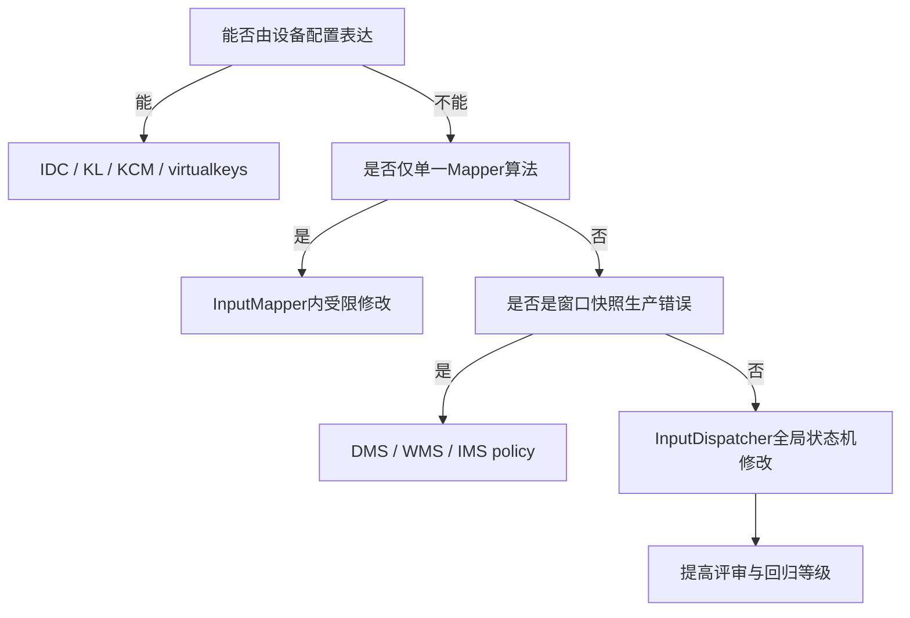
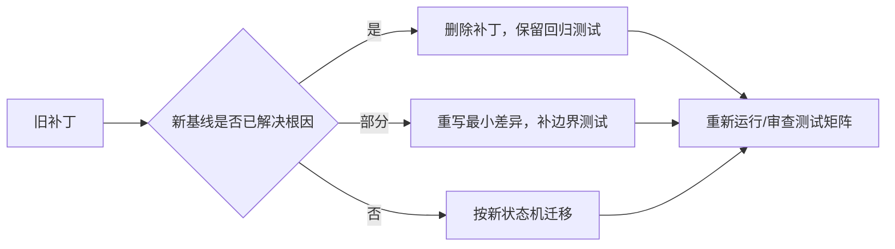

# 198 Android 输入定制的补丁组织、测试与升级策略

> 源码版本：Android 11 `android-11.0.0_r48`。  
> 本章面向源码阅读与方案设计；当前使用Mac，不要求真正编译AOSP。

## 1. 本章目标

第197章解决“应该改哪一层”，本章继续回答三个工程问题：补丁怎样组织才不失控、怎样把故障变成可重复测试、升级Android时怎样判断补丁去留。

真正昂贵的往往不是第一次写补丁，而是两年后没人知道它为什么存在。

## 2. 定制不是直接改源码

一次可维护定制至少包含：问题证据、作用域、实现、测试、回滚和升级说明。只保留一段C++差异，后来者无法区分它是硬件兼容、产品需求还是历史误修。

## 3. 从最小作用域开始



图不是绝对优先级，而是风险漏斗：越接近全局Dispatcher，影响设备、窗口与安全边界越多。

## 4. 五类交付物

建议每个输入补丁目录或变更单同时保存：

- `README`：现象、根因和设备范围；
- 概念diff：改前/改后状态与不变量；
- 自动测试：至少固化原始故障；
- 现场样本：脱敏后的raw/cooked/dump片段；
- 升级记录：每次基线迁移后的结论。

## 5. 配置型补丁

IDC、KL、KCM和virtualkeys适合表达设备属性、轴校准、按键映射和边缘虚拟键。优点是作用域清楚、容易删除；风险是文件匹配错误或同名设备变体被误命中。

配置提交必须写明最终匹配键：descriptor、vendor/product/version或设备名，而不只是文件名。

## 6. Overlay不是万能输入配置

资源overlay适合framework资源策略值；它不能替代EventHub寻找的设备配置文件，也不能修InputMapper状态机。先确认数据的实际读取者，避免“文件能打包但运行路径从不读取”。

## 7. 设备专属代码补丁

若硬件固件无法修复且配置表达力不足，可在Mapper附近加入严格quirk。识别条件应稳定、可审计，并把识别与行为分开：一个函数判断设备，一个函数处理异常。

不要把产品型号字符串散落在MOVE热路径中。

## 8. 通用算法补丁

只有问题对所有符合协议的设备都成立，才应修改通用算法。此类补丁最好能用协议不变量表述，而不是“让某台样机可用”。

例如“重复trackingId不得在同帧产生两个相同pointerId”是通用不变量；“vendor 0x1234感觉更顺”不是。

## 9. Policy与窗口补丁

display viewport、input window、焦点和超时的生产者多在Java policy/WMS/DMS。不要因为最终消费在native，就把错误快照在Dispatcher内二次猜测修正。

补丁说明应画出生产→JNI→缓存→消费链。

## 10. Dispatcher补丁门槛

Dispatcher维护TouchState、Connection、InputState、注入权限、ANR和队列。修改必须同时回答：旧手势怎么办、窗口移除怎么办、通道断开怎么办、monitor怎么办、注入者怎么办。

答不出这些问题时，方案还不成熟。

## 11. 一个补丁只解决一个根因

不要在“触屏坐标修复”提交里顺便调整repeat timeout和日志格式。独立提交让二分、回滚、上游对照与升级冲突处理更可靠。

## 12. 提交说明六问

1. 什么输入序列稳定复现？
2. 第一处错误输出在哪里？
3. 为什么不能用更小层解决？
4. 修改保持哪些不变量？
5. 新增哪些正向和负向测试？
6. 出问题如何关闭或回滚？

## 13. r48已有测试总入口

`frameworks/native/services/inputflinger/tests/Android.bp`定义`inputflinger_tests`，源码包含EventHub、InputReader、InputDispatcher、Classifier、ANR tracker和BlockingQueue测试。

```bp
cc_test {
    name: "inputflinger_tests",
    defaults: [
        "libinputreader_defaults",
        "libinputdispatcher_defaults",
        "libinputflinger_defaults",
    ],
    srcs: [
        "InputDispatcher_test.cpp",
        "InputReader_test.cpp",
        // ...
    ],
    require_root: true,
}
```

注意：`require_root: true`是测试安装/运行属性；本章在Mac只阅读结构，不宣称已经运行。

## 14. 为什么测试直接编译实现源码

该`Android.bp`注释明确说明：测试通过defaults编译inputflinger源码，而非链接设备上已有版本。这样测试针对当前代码树实现，避免“新测试却跑旧设备库”的错配。

这也意味着升级时defaults/source列表变化值得检查。

## 15. InputReader测试夹具

`InputReader_test.cpp`使用`FakeEventHub`、`FakeInputReaderPolicy`、`TestInputListener`和`InstrumentedInputReader`。它把内核设备、policy与下游listener换成可控对象。

```cpp
mFakeEventHub = std::make_unique<FakeEventHub>();
mFakePolicy = new FakeInputReaderPolicy();
mFakeListener = new TestInputListener();
mReader = std::make_unique<InstrumentedInputReader>(
        mFakeEventHub, mFakePolicy, mFakeListener);
```

## 16. Reader测试的数据路径

测试向FakeEventHub加入设备与RawEvent，调用`loopOnce()`，最后从TestInputListener断言`NotifyKeyArgs`或`NotifyMotionArgs`。

它适合回答“给定能力、配置和evdev序列，Mapper应输出什么”。

## 17. 为什么常调用两次loopOnce

测试的`addDevice()`在结束设备扫描后调用两次`loopOnce()`，再断言设备变化并检查FakeEventHub队列为空。这提醒我们：设备扫描、合成DEVICE_ADDED/FINISHED_DEVICE_SCAN与实际处理可能分批完成。

不要把一个loop次数当平台API保证；应理解测试夹具队列安排。

## 18. Reader回归测试模板

以“漏UP兼容”为例，测试应构造完整设备能力和DOWN，再触发异常/reset，断言下游收到了预期reset或取消序列；还要增加正常长按负例，证明不会被误取消。

只断言最终keyCode，不足以验证downTime、meta、flags与action。

## 19. 坐标补丁怎样测试

选择角、边、中心而非单点；逐一断言displayId、X/Y、precision、orientation与range。若涉及旋转，要覆盖0/90/180/270度以及logical/physical viewport不等的情况。

多指还要断言pointerId和action index，而不是只看坐标数组。

## 20. VirtualKey怎样测试

构造屏外DOWN命中、按住、滑出、UP，以及触屏quiet time干扰。断言Key DOWN/UP/CANCELED与重新进入surface后的Motion DOWN顺序。

这是典型状态测试，无法被单事件测试替代。

## 21. InputDispatcher测试夹具

`InputDispatcher_test.cpp`创建FakePolicy和真实InputDispatcher，并真正启动Dispatcher线程：

```cpp
mFakePolicy = new FakeInputDispatcherPolicy();
mDispatcher = new InputDispatcher(mFakePolicy);
mDispatcher->setInputDispatchMode(true, false);
ASSERT_EQ(OK, mDispatcher->start());
```

因此它既有可控policy，也包含真实并发、Looper与InputChannel行为。

## 22. Dispatcher测试的窗口对象

测试通常创建带InputChannel的窗口、设置frame/flags/display/focus，再通过notify或inject输入，最后从窗口client端消费事件并finish。

它适合验证命中、焦点、split、monitor、取消、注入和连接状态。

## 23. 现成测试告诉了什么

r48已有`SetInputWindow_*`、`NotifyDeviceReset_Cancels*Stream`、`TransferTouchFocus_*`、`GestureMonitor_*`等测试。这些名称本身就是Dispatcher重要不变量索引。

写补丁前先找相邻测试，能发现作者预设的边界。

## 24. 注入合法性测试

现有测试会拒绝未定义Key action、`ACTION_MULTIPLE`以及越界的pointer action index。输入定制若改变验证逻辑，必须保留这些负例。

“常规事件成功”不能证明恶意或损坏事件安全。

## 25. 多线程测试避免纯sleep

固定sleep会在慢机器假失败、快机器浪费时间。优先通过可观察事件、condition variable、channel receive或有界等待同步。

超时应该是失败保护，不是事件正确性的证明。

## 26. 测试中的时间

输入逻辑同时使用eventTime、downTime、repeat deadline、ANR deadline与gesture timeout。可注入时钟的组件应使用确定时间；不可注入时，断言顺序和范围，避免纳秒绝对值。

## 27. 正向用例

正向用例精确重放原故障：同设备能力、同配置、同事件序列、同状态切换。它必须在补丁前失败、补丁后通过，否则没有证明补丁修了所述根因。

## 28. 负向用例

负向用例证明作用域：其他vendor设备不变、正常长按不变、鼠标不变、外屏不变、未授权注入仍失败。

输入补丁最常见回归来自“修得太宽”。

## 29. 边界用例

覆盖最小/最大轴值、最大pointer数、重复trackingId、零位移MOVE、窗口恰好在region边缘、token为空、channel刚断开等边界。

边界值比随机几个中间值更容易揭示状态错误。

## 30. 生命周期用例

在手势中途旋转、移除窗口、拔设备、切display、切focus、启停filter或pointer capture。验证接收者得到合理CANCEL/UP，服务端TouchState/InputState也被清理。

## 31. 安全用例

至少包含同UID注入、跨UID无权限拒绝、授权系统UID允许、无效monitor token拒绝、不同display pilfer失败，以及敏感坐标不泄露给不应接收的窗口。

权限测试不能只写“返回失败”，还应确认目标channel确实没收到事件。

## 32. 队列与完成用例

构造窗口不finish、延迟finish、错误seq、channel断开和恢复响应。观察outbound/wait、ANR通知、foreground pending计数是否收敛。

没有“最终队列为空”断言，内存或状态泄漏可能被遗漏。

## 33. 属性测试思路

对随机合法pointer序列检查通用性质：DOWN先于MOVE、pointerId同手势唯一、action index有效、序列最终收敛、未命中目标不收事件。

这类测试适合发现未想到的组合，但必须保留最小失败样本。

## 34. Fuzz与单元测试的分工

Fuzz擅长损坏输入、组合爆炸和崩溃；单元测试擅长可读协议与确定回归。发现fuzz问题后，把最小case转为永久单元测试，而不是只保留随机seed日志。

## 35. 真机验证仍不可省略

FakeEventHub无法验证真实内核capability、sysfs路径、固件时序、SELinux、display物理安装和App帧节奏。未来有目标设备时，还需小范围真机验证。

Mac只读阶段应明确标注“源码推导/待真机验证”。

## 36. 真机验证分三层

1. 原始层：短时`getevent`或等价证据；
2. 系统层：`dumpsys input`、trace与窗口/队列状态；
3. App层：MotionEvent/KeyEvent及用户可见行为。

三层时间与设备身份要能互相对应。

## 37. 测试矩阵不要无限膨胀

用风险维度组合：设备类型、display、窗口生命周期、事件阶段和权限。优先两两组合与已知高风险交叉，而不是机械穷举所有笛卡尔积。

## 38. 补丁开关与回滚

高风险兼容逻辑可设计只读设备属性、明确配置项或窄设备匹配作为关闭手段。开关默认值和生效时机必须记录；运行时中途切换若会破坏手势状态，就只允许重启/重建设备后生效。

## 39. 可观测性不是永久刷屏

加入可控debug日志或dump字段，打印设备、display、事件id、状态迁移和选择原因。MOVE逐笔坐标、高频队列内容与按键字符可能敏感且影响时序，不应默认开启。

## 40. 补丁栈组织

建议顺序：基础配置→通用上游修复→设备quirk→产品policy→诊断/测试。每个提交可单独应用和回滚，依赖关系写在提交说明中。

不要维护一个每次升级都只能整体搬运的巨大patch。

## 41. 升级前建立清单

记录旧tag、补丁提交、触及文件/函数、对应测试、设备范围和上游bug链接。升级前先在新基线搜索函数和不变量，而不是立即机械cherry-pick。

## 42. 三种升级结论



最好的升级结果有时是删除代码，而不是成功应用旧patch。

## 43. 不要以“无冲突”判断升级成功

函数未冲突不表示语义未变。上游可能改变锁、线程、坐标空间、token含义或取消路径，使旧补丁干净应用却行为错误。

升级审查要比较输入、输出、状态所有权和完成条件。

## 44. 版本差异阅读法

先看新旧函数签名和调用者，再看状态字段、测试与dump；最后沿一条具体事件重走全链。不要只diff补丁附近十行。

如果逻辑迁移到新组件，应重新选择修改层。

## 45. 上游已修复怎样确认

删除旧补丁后，原正向回归测试应通过，负向与安全测试也应通过；再检查实现是否覆盖厂商设备特有条件。

代码长得相似不是证据，测试行为才是。

## 46. 配置升级风险

文件搜索顺序、descriptor生成、属性名、默认校准和display关联都可能变化。配置仍被打包不等仍被读取；需要从新基线重新追加载链。

## 47. 测试代码也要迁移

FakePolicy接口、事件构造参数、窗口模型和线程同步会随版本变化。迁移测试时保持行为意图，不要为了编译通过删掉关键断言。

## 48. 评审清单

- 根因与第一处错误输出是否有证据？
- 作用域是否比故障更宽？
- 正常、异常、生命周期和安全序列是否覆盖？
- 锁内是否增加I/O、Binder或高频分配？
- dump/log是否泄露？
- 是否有关闭、回滚和升级说明？

## 49. 复读审计

本章复读特别限定：r48测试虽启动真实Dispatcher线程，却仍不等于整机端到端；`require_root`不代表每个测试逻辑都在root权限下验证安全；FakeEventHub重放也不证明真实驱动声明正确。

文中的测试命令与结果均未在Mac执行，属于源码可读的实施方案。

## 50. 检查题与下一章

1. 为什么设备配置能解决时不应先改Dispatcher？
2. 一个输入补丁至少需要哪四类测试？
3. 新Android已上游修复时，旧补丁和回归测试分别怎样处理？
4. 为什么patch无冲突不能证明升级成功？

下一章制作**Android输入系统源码知识地图与综合诊断实战**，把分散章节压缩成可用于实际排障的导航图。
