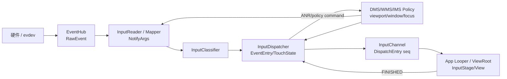
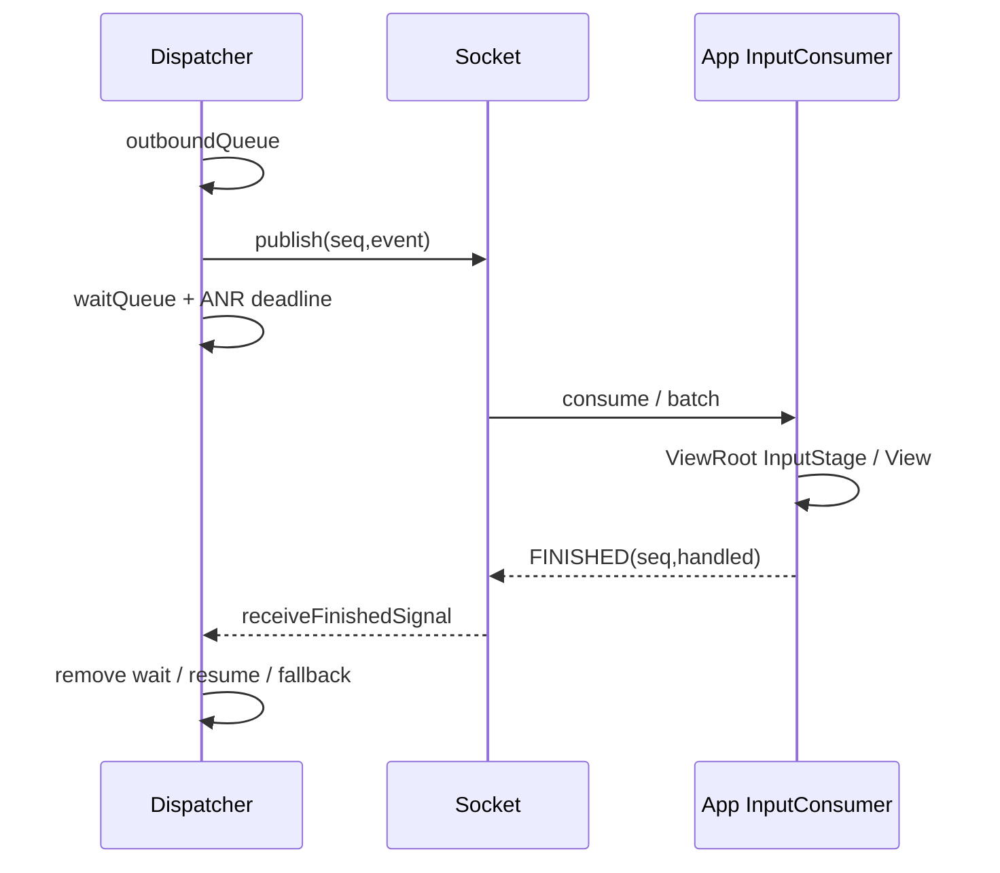

# 199 Android 输入系统源码知识地图与综合诊断实战

> 源码版本：Android 11 `android-11.0.0_r48`。  
> 本章把第173～198章压缩为一套可导航、可诊断、可继续深入的心智模型。

## 1. 本章目标

读完输入专题后，最重要的能力不是背函数名，而是拿到现象时知道：先观察哪一层、用哪个身份串联、看到什么结果后跳到哪个源码文件。

## 2. 一张总图



任何故障都可先放进三条链：事件数据链、控制快照链、完成反馈链。

## 3. 三条链不要混

- 数据链：raw事件怎样变成App事件；
- 控制链：viewport、窗口、焦点、权限怎样决定变换和目标；
- 反馈链：App完成怎样返回Dispatcher并驱动ANR/注入等待。

只追数据链会漏掉大量“事件正确但目标错误”的问题。

## 4. AOSP路径从仓库根开始

Native输入核心在`frameworks/native/services/inputflinger/`；Java IMS在`frameworks/base/services/core/java/com/android/server/input/`；App输入入口在`frameworks/base/core/java/android/view/`。

包名`android.view`不是仓库根目录，检索时不要漏掉`frameworks/base/`。

## 5. 第一入口：EventHub

文件：`EventHub.cpp/.h`。职责是发现evdev节点、读capability、加载部分配置、epoll等待并输出`RawEvent`。

现场若完全没有事件，从设备节点、权限、fd enable和EventHub dump开始，不要先读View。

## 6. RawEvent回答什么

它回答“内核送来了哪种type/code/value、来自哪个eventHubId、时间是什么”。它还没有Android keyCode、窗口坐标或pointerId语义。

## 7. 第二入口：InputReader

文件：`reader/InputReader.cpp`、`reader/InputDevice.cpp`和`reader/mapper/`。它把RawEvent按设备分给Mapper，并通过QueuedInputListener输出NotifyArgs。

## 8. Reader主循环地图

r48 `loopOnce()`的核心顺序是：锁内处理待刷新配置→锁外`EventHub.getEvents()`→锁内处理事件/timeout/设备代际→锁外通知设备变化并flush listener。

```cpp
size_t count = mEventHub->getEvents(timeoutMillis,
                                    mEventBuffer, EVENT_BUFFER_SIZE);
{
    AutoMutex _l(mLock);
    if (count) processEventsLocked(mEventBuffer, count);
}
// inputDevicesChanged与queued listener通知在锁外送出
```

锁外回调是理解线程与死锁边界的关键。

## 9. Mapper选择表

| 现象/设备 | 首看Mapper |
|---|---|
| 实体键、meta、LED、repeat输入 | KeyboardInputMapper |
| 鼠标REL、按钮、滚轮、capture | CursorInputMapper |
| 触屏、多指、virtual key | TouchInputMapper |
| 触控板gesture | TouchInputMapper pointer gesture |
| 摇杆轴 | JoystickInputMapper |

## 10. Reader关键状态

输入设备/Mapper状态、raw/cooked touch state、mKeyDowns、pointer gesture state、configuration和generation都归Reader侧。坐标或action在NotifyArgs前已错，优先留在这一侧。

## 11. DisplayViewport从哪里来

DMS生成viewport，经IMS/NativeInputManager缓存，被Reader policy拉取。TouchMapper使用它完成display关联和坐标cooking；Cursor/PointerController也消费相关信息。

因此viewport问题不是单纯“触摸算法问题”。

## 12. 第三入口：InputClassifier

r48主路径中Classifier位于Reader listener和Dispatcher之间。Motion可异步送HAL分类，结果可能滞后；它不是把每个事件阻塞到分类完成后再放行。

排查classification时要保留事件时序观念。

## 13. 第四入口：InputDispatcher

文件：`dispatcher/InputDispatcher.cpp/.h`。职责包括入队、policy、焦点/触摸命中、monitor、注入权限、Connection发送、完成确认与ANR。

## 14. Dispatcher主循环地图

`dispatchOnce()`锁内执行派发、可中断policy commands与ANR检查，锁外进入Looper poll。

```cpp
if (!haveCommandsLocked()) {
    dispatchOnceInnerLocked(&nextWakeupTime);
}
if (runCommandsLockedInterruptible()) {
    nextWakeupTime = LONG_LONG_MIN;
}
nextWakeupTime = std::min(nextWakeupTime, processAnrsLocked());
// 解锁后mLooper->pollOnce(timeoutMillis)
```

读某个调用时先问它发生在锁内还是通过command解锁回调policy。

## 15. Dispatcher三组状态

- 全局事件：inbound queue、pending event、recent queue；
- 每display手势：TouchState、focused window/application、window snapshot；
- 每channel连接：Connection、outbound/wait queue、InputState、responsive状态。

三组状态对应三类不同故障。

## 16. TouchState与InputState

TouchState记录“当前display手势路由给谁”；InputState记录“某个Connection已经看到了什么”。前者选择未来目标，后者为该接收者合成CANCEL/UP。

名称相似，但所有权与用途不同。

## 17. 窗口快照路径

WMS准备InputWindowHandle，SurfaceControl事务把输入信息送到SF；SF基于drawing layer状态形成窗口列表，再装入system_server内的native Dispatcher。

Java WindowState、native handle和Dispatcher snapshot不是同一时刻的同一个对象。

## 18. 触摸命中入口

首个DOWN通常进入`findTouchedWindowTargetsLocked()`；它检查display、可见性、flags、touchable region、Z序、portal、split、wallpaper和注入权限。

后续MOVE一般沿既有TouchState，不重新普通命中。

## 19. Key目标入口

Key依赖focused window/application；还经过`interceptKeyBeforeQueueing`和带focused token的`interceptKeyBeforeDispatching`两个policy阶段。

“窗口能收Touch但不收Key”首先检查focus而非channel是否存在。

## 20. Monitor导航

Global monitor在成功事件后追加目标；gesture monitor在手势DOWN阶段进入TouchState并可pilfer。两者都有InputChannel和完成队列，但语义不同。

看到monitor事件不等于已经从App抢走流。

## 21. 注入导航

入口从Java InputManager/IMS到JNI再到Dispatcher。重点身份是injector pid/uid、target ownerUid、displayId、sync mode和foreground target计数。

返回`SUCCEEDED`的具体含义取决于NONE/WAIT_RESULT/WAIT_FINISH。

## 22. 第五入口：InputChannel

服务端和客户端通过非阻塞`SOCK_SEQPACKET`通信，共享connection token。Dispatcher publish后把DispatchEntry从outbound移入wait，App通过FINISHED反向消息结账。

## 23. 三层队列图



定位卡顿时必须说明事件卡在outbound、socket、App pending还是wait完成阶段。

## 24. 第六入口：App Looper

`InputEventReceiver`在App Looper监听client fd，native consume后回调Java `onInputEvent()`。ViewRoot的`WindowInputEventReceiver`把事件排入自己的输入队列。

它不是每个窗口单独创建一条线程。

## 25. ViewRoot InputStage导航

Key可走native pre-IME、View pre-IME、IME、early post-IME、native post-IME、View post-IME与synthetic；Touch通常走post-IME侧主链。

异步stage可DEFER，不能把调用栈表面返回误当最终完成。

## 26. View分发导航

DecorView/Activity/PhoneWindow再到ViewGroup：DOWN命中建立TouchTarget，父级intercept可给旧child发CANCEL，listener与`onTouchEvent`决定handled。

App已经收到正确MotionEvent时，问题常在这一层。

## 27. 完成边界

`ViewRootImpl.finishInputEvent()`调用receiver的`finishInputEvent(event, handled)`，native用Java mSeq映射回一个或多个channel seq，再写FINISHED。

FINISHED表示输入处理责任完成，不表示新画面已经present。

## 28. 六类身份不要混

| 身份 | 作用域 |
|---|---|
| eventHubId/deviceId | 硬件节点/逻辑输入设备 |
| slot/trackingId | Linux多点协议 |
| pointerId/action index | Android单手势指针 |
| EventEntry id | Dispatcher事件与验证 |
| DispatchEntry seq | 某channel一次派发/完成 |
| Java InputEvent mSeq | App对象到native receiver映射 |

同一个数字碰巧相等也不能当作同一身份。

## 29. 五类时间不要混

eventTime是采样/事件时间，downTime是手势起点语义，enqueue/publish时间描述系统排队，delivery timeout描述完成期限，frameTime用于App批处理/重采样。

“事件年龄大”不自动等于“App处理慢”。

## 30. 四个完成点

SYN_REPORT完成一帧evdev提交；NotifyArgs完成Reader语义输出；publish完成服务端写channel；FINISHED完成客户端处理反馈。

它们都不等于屏幕已经显示。

## 31. 综合诊断第一步：缩小现象

记录设备、display、窗口、事件类型、稳定复现步骤、起止状态和正常对照。明确是无事件、数据错、目标错、顺序错、延迟还是完成不回来。

模糊的“触摸失灵”无法映射到源码状态。

## 32. 第二步：找最早正确层

从可获得证据由外向内二分：raw是否有→Reader cooked是否对→Dispatcher目标是否对→channel是否发→App是否收→View是否消费→FINISHED是否回。

第一次由正确变错误的位置是最有价值的边界。

## 33. 无任何事件诊断

1. 节点是否存在并有raw；
2. EventHub是否open、enabled并识别class；
3. InputReader设备/Mapper是否创建；
4. 是否被配置disabled或viewport缺失；
5. Dispatcher是否启用/frozen。

## 34. 坐标错误诊断

比较raw轴范围、IDC affine/calibration、cooked坐标、viewport logical/physical/orientation、窗口frame与App local坐标。不要只看最终`getX()`。

## 35. 多指错误诊断

逐帧列slot、trackingId、pointerId数组和action index；检查Protocol A/B、duplicate tracking、id映射和App是否把index当ID。

这张表通常比大量MOVE日志更清楚。

## 36. 目标窗口错误诊断

先分首DOWN还是旧手势后续；再查display、Z序、visible、touchableRegion、modal/slippery/split、portal和TouchState。Key另查focused token。

## 37. 系统手势问题诊断

检查gesture monitor是否在DOWN时已注册、当前TouchState是否包含它、识别成功后是否pilfer、token/display/device是否匹配、普通窗口是否收到CANCEL。

## 38. 偶发卡住诊断

查看Pending/Inbound、目标Connection outbound/wait、seq age、responsive和Last ANR；App侧对齐主线程、IME、Binder、锁与GC。

队列所在位置决定责任层。

## 39. DOWN后无UP诊断

raw是否缺value0/tracking -1；Mapper是否认为未按下；设备reset是否发生；Dispatcher是否已给该Connection记录memento；窗口/通道移除是否触发取消。

不要用App timeout掩盖上游协议缺失。

## 40. 只有一个View错

若窗口内其他View和App事件日志正常，查父intercept、TouchTarget、DOWN返回值、matrix/layout、动画、遮挡安全和listener。Reader/Dispatcher全局补丁通常过宽。

## 41. 只有注入错

硬件链正常时直接查注入参数、权限、目标owner UID、display和等待模式。注入不经过EventHub/Reader正常Mapper路径，不能用硬件成功证明注入参数正确。

## 42. 多显示问题

同时写出input device display关联、pointerDisplayId、viewport、window displayId、event displayId和monitor display。只说“副屏”不足以定位。

## 43. dumpsys input快速阅读顺序

先设备/Mapper与viewport，再focused application/window和窗口快照，再TouchState，最后Connection outbound/wait与Last ANR。Recent仅是有限历史，不应被当完整trace。

## 44. 日志关联模板

```text
device/eventHub: ___   display: ___
raw type/code/value/time: ___
cooked action/pointer/key/time: ___
eventId -> window token/channel seq: ___
App Java seq/action/handled: ___
FINISHED time/result: ___
```

缺哪一栏，就去相邻边界补证据。

## 45. 锁与线程阅读法

每看到回调都问：当前持哪个锁、是否跨Binder/JNI、是否通过command延迟、回调是否可能反向进入。InputReader特意锁外flush，Dispatcher特意通过可中断command调policy，这些都是架构线索。

## 46. 源码搜索方法

从名词搜定义，再搜写入点和dump输出；从状态枚举搜所有转换；从测试名反推不变量；最后沿一个具体事件串调用链。不要一开始顺读数千行文件。

## 47. 证据到修改层

raw错→驱动；设备映射/参数错→配置；cooked/action错→Mapper；viewport/window快照错→DMS/WMS/IMS；命中/连接状态错→Dispatcher；App事件正确而交互错→View/业务。

这是导航，不是替代证据的固定公式。

## 48. 常见错误心智模型

- “inputflinger一定是独立进程”：r48 Framework常规主路径在system_server；
- “MOVE进入新窗口就换目标”：普通touch有手势粘性；
- “handled=false就是ANR”：ANR看完成是否回来，不看handled真假；
- “FINISHED就是上屏”：输入完成与渲染present不同；
- “monitor看到就独占”：需要pilfer才取消普通窗口。

## 49. 复读审计

本章复读统一了路径、线程、状态、身份、时间和完成边界；同时避免把诊断表写成绝对根因规则。具体产品可能有厂商HAL、filter或独立服务变化，仍需用构建产物、进程和调用现场确认。

## 50. 检查题与下一章

1. TouchState和InputState分别回答什么？
2. App收到正确事件但仍ANR，应沿哪条反馈链检查？
3. 为什么Recent Events不能替代完整trace？
4. 从一个错误pointerId现象，怎样同时记录四种指针身份？

下一章进入第200章：对全部Android源码学习路线做总复盘，并给出可持续的下一阶段阅读方法。
