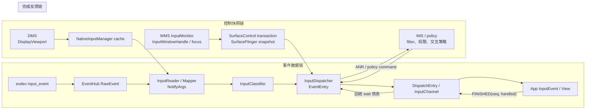
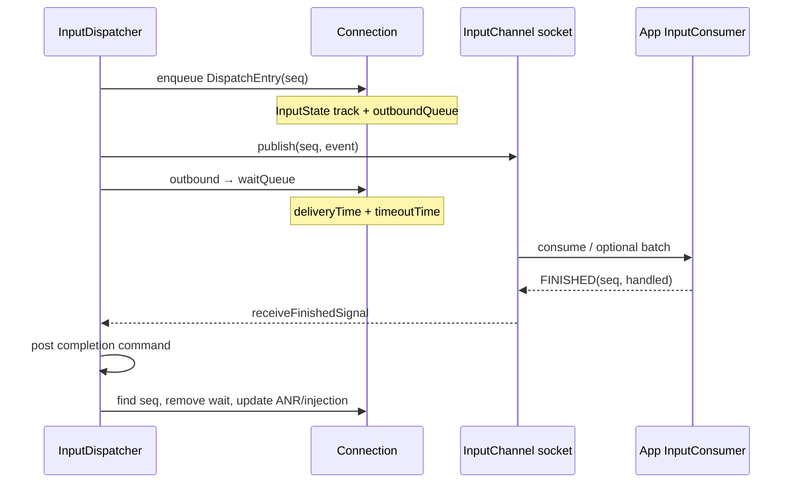

# 199 Android 输入系统源码知识地图与综合诊断实战

> 源码基线：Android 11 `android-11.0.0_r48`。  
> 阅读环境：macOS；本章只对本地源码做只读验证，不把源码检索冒充设备现场或真机构建。  
> 贯穿探针：一次可复现的外接触屏 `DOWN → MOVE → UP`，用户报告为“按钮偶尔点了没反应”。

输入专题读到最后，最危险的状态不是“记不住函数”，而是记住了很多函数，却仍会从现象直接跳到熟悉的模块。

“点了没反应”可能意味着：

- 内核没有产生事件；
- EventHub 读到了错误值；
- Mapper 输出了错误 cooked 值（Android 语义化后的坐标/action）或 pointer 身份；
- viewport、窗口或焦点快照不对；
- Dispatcher 选错目标；
- channel 已发布，但客户端迟迟不结账；
- App 收到正确事件，却在 View 或业务层没有形成点击；
- 输入已经完成，画面却没有按预期提交或 present（真正显示到面板）。

这些现象共享一句用户描述，却没有共享同一个修复层。

**本章结论：综合诊断不是从头顺读整条调用链，而是让同一条探针依次跨过可观察边界，同时维护身份账、时间账、状态账和完成账；第一处由正确变错误的位置，决定下一份证据与最小候选层。**

读完后，你应该能把第 173～198 篇的知识压成三种动作：

1. 先把现象放进数据链、控制快照链或完成反馈链；
2. 用六个主边界与两个控制接点判断“已经证明什么、还不能证明什么”；
3. 从第一处分歧跳到负责的源码、测试缝与回滚点。

---

## 1. 用一条触摸探针定义综合诊断目标

本章不从组件清单开始，而从一张故障单开始：

> 外接触屏连接默认显示后，连续点击同一个可见按钮，约每几十次有一次没有反应。屏幕没有旋转，窗口看起来也没有切换。

这句话只描述了用户可见结果。它没有证明：

- `ACTION_DOWN` 是否存在；
- 坐标是否仍落在按钮上；
- 首个 DOWN 命中了哪个窗口；
- App 是否收到事件；
- View 是否返回 handled；
- `FINISHED` 是否回到 Dispatcher；
- 点击回调是否执行；
- 新画面是否 present。

因此，第一步不是猜“触摸驱动丢事件”或“主线程卡住”，而是把一次完整手势定义为诊断探针。

```text
探针 P
  设备：外接触屏的稳定 descriptor 与 vendor/product/version
  显示：displayId、viewport uniqueId、方向
  窗口：目标 token、ownerUid、frame、touchableRegion、焦点
  序列：DOWN → 若干 MOVE → UP
  对照：同一前置状态下一次正常点击
  结果：App 点击回调与可见画面是否发生
```

探针必须覆盖一个完整生命周期。只截一条 MOVE，无法回答 DOWN 是否建立了手势所有权；只截最终 UP，也无法判断中途是否发生设备 reset、窗口移除或 pilfer。

一次有效诊断最终应交付四张表：

| 账本 | 最少记录 | 用途 |
|---|---|---|
| 身份账 | device、slot/trackingId、pointerId、eventId、channel seq、Java seq、token、displayId | 防止拿碰巧相等的数字串错对象 |
| 时间账 | eventTime、downTime、边界观察时刻、deliveryTime、deadline、finish、frame/present | 区分采样旧、排队久、处理慢和显示晚 |
| 状态账 | raw/cooked、viewport、window snapshot、TouchState、Connection queue、View target | 找到状态第一次分叉的位置 |
| 完成账 | raw 帧、Reader 通知、目标解析、publish、App 回调、FINISHED 发送/处理、present | 防止把早期成功写成端到端完成 |

这四张表不是额外文档负担。它们恰好对应输入链里最容易混淆的四类事实。

**诊断问题要写成可证伪句子。**

例如：

```text
假设 A：异常样本在 EventHub 前已经缺少 UP。
证伪证据：异常样本中同一 eventHubId 存在 BTN/ABS 释放与 SYN_REPORT。

假设 B：异常样本首次命中错误窗口。
证伪证据：异常 DOWN 的 display、坐标与窗口快照对应，目标 token 与正常样本相同。

假设 C：目标正确，但 FINISHED 债务回收过晚。
证伪证据：对应 DispatchEntry seq 很快从 waitQueue 消失。
```

如果一个判断没有可观察的证伪条件，它还只是故事，不是诊断。

本章后续每一层都回答三个固定问题：

1. 进入该边界的对象是什么；
2. 离开该边界后最多能证明什么；
3. 若此处仍正确，下一跳应该去哪，而不是继续在本层扩大日志。

---

## 2. 三条链、六个主边界与两个控制接点构成诊断罗盘

输入系统不是一条只有事件对象的直线。至少有三条链在同一时刻交汇：



三条链回答不同问题：

| 链 | 核心问题 | 典型错误 |
|---|---|---|
| 数据链 | 事件的类型、值、坐标和 action 怎样变化 | 丢事件、坐标错、pointer 身份错 |
| 控制快照链 | 哪个显示、窗口、焦点、区域和权限参与决策 | 目标错、只在旋转/转场/多显示时错 |
| 完成反馈链 | 每个接收者是否在期限内归还处理债务 | wait 堆积、ANR、同步注入超时 |

只追数据链，会漏掉“事件完全正确但窗口快照错误”；只看窗口命中，会漏掉“目标正确但客户端不结账”；只看 App 点击日志，又无法证明上游究竟是否投递。

为了快速二分，本章使用六个事件/完成主边界，并把两份控制输入放在真正的消费位置：

| 边界 | 代表对象 | 通过后能证明 | 仍不能证明 |
|---|---|---|---|
| B0 内核 → EventHub | `input_event` / `RawEvent` | 节点产生了某类原始数据 | Android action、目标窗口、App 收到 |
| C-R Reader 控制接点 | 实际消费的 viewport、配置、校准 | 本次 raw→cooked 使用了哪份 Reader 控制事实 | cooked 输出一定正确 |
| B1 Reader → listener | `NotifyKeyArgs` / `NotifyMotionArgs` | Mapper 已形成 Android 输入语义 | Dispatcher 将选择哪个目标 |
| C-D Dispatcher 控制接点 | 实际消费的 window handles、focus、policy 状态 | 本次目标决策使用了哪份路由事实 | 目标计算一定正确 |
| B2 Dispatcher 目标解析 | target token、flags、变换、权限结果 | 已得到本事件的目标集合 | socket 写入成功 |
| B3 Dispatcher → channel | `DispatchEntry` / publish | 某连接的消息已写入 channel | App 已完成、View 已消费 |
| B4 native consumer → Java/ViewRoot | channel seq + Java `InputEvent` | 客户端 Looper 已收到/排入事件 | 具体 View handled、FINISHED 已处理 |
| B5 App → Dispatcher | 匹配的 `FINISHED(seq, handled)` 与 wait 删除 | 对应连接的完成反馈已由服务端回收 | 点击业务或新画面已经出现 |

这里的“通过”必须由证据决定，不由函数名决定。

例如，看到 `startDispatchCycleLocked()` 出现在堆栈，不足以证明 publish 成功；只有 `InputPublisher` 写入成功、`DispatchEntry` 从 outbound 转入 wait，才能越过 B3。客户端调用 `sendFinishedSignal()` 也只证明尝试把消息写回；Dispatcher 收到匹配 seq、执行完成命令并删除 wait 项，才完成服务端结账。

**第一处分歧算法**可以写成：

```text
同一探针的正常样本 N 与异常样本 X
    ↓
按 B0 → C-R → B1 → C-D → B2 → B3 → B4 → B5 对齐
    ↓
找到最后一个 N、X 都正确的边界
    ↓
找到紧邻的第一个 X 错误或缺失边界
    ↓
只展开这两个边界之间的生产者、输入状态与完成条件
```

C-R 与 C-D 是旁路控制输入，不增加事件对象经过的层数：Reader 做坐标 cooking 时在 B1 前消费 viewport，Dispatcher 做 B2 目标解析前消费窗口和焦点。对齐时要记录“事件实际使用了哪一版状态”，不能把事后 dump 的控制对象硬塞进线性调用栈。

同理，Classifier、InputFilter、policy command 可能引入异步或解锁回调。一次探针可以跨线程、Binder、JNI 和 socket；“当前栈已经返回”从来不是完成点。

---

## 3. 先固定复现环境、正常对照与证据卡

输入状态高度依赖前置条件。没有固定环境的两次点击，可能不是同一个实验。

最小复现卡应记录：

| 维度 | 建议字段 | 为什么必须固定 |
|---|---|---|
| 源码与产品 | Android tag、产品 build、内核、厂商输入改动 | 同名函数在不同版本可能有不同语义 |
| 设备 | 节点、name、descriptor、bus/vendor/product/version、能力位 | 名称相同不保证配置或 Mapper 相同 |
| 显示 | displayId、uniqueId、logical/physical frame、orientation、active | 坐标和目标都依赖它 |
| 窗口 | token、ownerUid、Z 序、frame、touchableRegion、flags、focus | 首个 DOWN 的命中输入 |
| 系统状态 | interactive、frozen、filter、pointer capture、monitor | 可改变是否入队或目标集合 |
| 手势 | 起点、轨迹、指针数、节奏、重复次数 | 触发状态机分支 |
| App | 进程、线程、页面、动画、IME、业务前置状态 | 区分系统输入与应用消费 |

**正常对照必须贴近异常样本。**

最好在同一轮采集中得到：

```text
N：相同设备、显示、窗口与手势，按钮正常响应
X：只改变触发条件，按钮不响应
```

如果正常样本来自重启前，异常样本来自旋转后，那么 display、window snapshot、App 状态和设备 generation 都可能同时改变，差异无法归因。

建议使用一张逐边界证据卡：

```text
case_id: touch-199-X07
baseline: android-11.0.0_r48 / product-build
device: descriptor=... eventHubId=... inputReaderDeviceId=...
display: displayId=... viewport.uniqueId=... orientation=...
window: token=... ownerUid=... frame=... touchableRegion=...

B0 raw:
  DOWN frame=...  MOVE frame=...  UP frame=...
C-R reader control:
  viewport/config/calibration observation=...
B1 cooked:
  action=... pointerIds=... x/y=... eventTime/downTime=...
C-D dispatcher control:
  windows/focus/policy observation=...
B2 target:
  eventId=... target token=... target flags/permission=...
B3 publish:
  channel seq=... deliveryTime=... result=...
B4 app:
  Java seq=... action=... receiver time=... View target=...
B5 finish:
  FINISHED send=... receive=... wait removed=... handled=...
visible result:
  click=... frame commit/present=...
```

源码自身并不为所有边界保存统一的“snapshot version”。无法直接取得版本号时，可以记录采集时刻、关键字段哈希或一次 dump 的样本编号，但要明确这是近似关联，不是假装原子事务。

采集顺序也会扰动现场：

- 打开大量详细日志会改变时序；
- 单步调试 InputReader 或 Dispatcher 会制造不自然的超时；
- `dumpsys input` 是一段读取过程，不是冻结三个线程后的原子快照；
- App 主线程日志过重，可能让原本很窄的延迟窗口扩大；
- user build 可能缺少调试字段，或对窗口信息做限制。

因此应先采最轻的稳定证据，再针对第一处分歧增加局部观测。不要一开始同时开启所有 debug 宏。

一份合格证据还要标注来源：

| 标签 | 含义 |
|---|---|
| observed | 工具或日志直接看到 |
| derived | 由两个已观察字段计算，例如延迟差 |
| inferred | 根据源码状态机推断，需要下一条证据证伪 |
| unavailable | 当前构建或权限无法取得 |

把推断写成观察，是综合诊断最常见的自欺。

---

## 4. 身份账把设备、手势、事件与连接分开

输入链里有许多整数。它们的生命周期、创建者和作用域不同。

| 身份 | 创建/拥有位置 | 作用域 | 不能替代 |
|---|---|---|---|
| evdev 节点与 `eventHubId` | EventHub | 一次 EventHub 设备打开生命周期 | 稳定硬件身份、逻辑 deviceId |
| descriptor | 设备标识计算/配置匹配 | 相对稳定的物理设备描述 | 当前 fd、当前显示 |
| InputReader `deviceId` | Reader 创建逻辑 `InputDevice` | 逻辑输入设备生命周期 | 不能据此假定与 eventHubId 一一对应 |
| slot | Linux MT Protocol B | 当前设备 raw 槽位 | Android pointerId |
| trackingId | 驱动/内核触点身份 | 某次 raw 接触生命周期 | slot、pointerId |
| pointerId | Touch Mapper | 一次 Android 手势 | pointer index |
| action index | `MotionEvent.action` 高位 | 当前一条事件 | 稳定 pointer 身份 |
| `EventEntry.id` | Reader/Dispatcher 事件身份 | 当前 Dispatcher 事件；派生事件可能换 id | 某个连接的派发 seq、全局 trace id |
| `DispatchEntry.seq` | Dispatcher | 一次目标连接上的投递债务 | Java 对象 seq |
| Java `InputEvent.mSeq` | Java `InputEvent` | 当前 Java 对象实例 | channel seq |
| InputChannel connection token / `InputWindowHandle.token` | InputChannel 注册与窗口快照 | r48 中把输入窗口目标关联到已注册连接 | WMS `WindowToken`、application token、包名、UID |
| displayId | DMS/WMS/输入事件 | 显示路由域 | viewport uniqueId |

一个容易忽略的 r48 细节是：`RawEvent.deviceId` 字段装的是 EventHub 侧 id。Reader 的 `mDevices` 也先按 eventHubId 查找；随后 `createDeviceLocked()` 才可能创建或复用一个逻辑 `InputDevice`。相同 descriptor 的多个 EventHub 子设备可以聚合到同一个逻辑设备。

因此日志应显式写：

```text
eventHubId=12
inputReaderDeviceId=7
descriptor=4f3a...
```

不要统一缩写成 `deviceId=12`，然后拿它与 App `InputDevice.getId()` 生硬关联。

多指场景还应按帧记账：

| raw frame | slot | trackingId | Android pointerId | pointer index | masked action |
|---|---:|---:|---:|---:|---|
| F10 | 0 | 41 | 0 | 0 | DOWN |
| F11 | 0 | 41 | 0 | 0 | MOVE |
| F12 | 1 | 57 | 1 | 1 | POINTER_DOWN |
| F13 | 0/1 | 41/57 | 0/1 | 0/1 | MOVE |
| F14 | 1 | -1 | 1 | 1 | POINTER_UP |

`pointer index` 是当前数组位置，可以因事件内容变化；`pointerId` 才是手势内关联身份。slot 是内核协议存储位置，trackingId 是内核接触身份。四者碰巧同为 0，也不构成同一命名空间。

派发侧需要另一张映射：

```text
EventEntry id
  ├─ target window A → DispatchEntry seq 301
  ├─ gesture monitor M → DispatchEntry seq 302
  └─ global monitor G → DispatchEntry seq 303
```

同一个 EventEntry 可以为多个目标生成不同 DispatchEntry。ANR 和 FINISHED 按连接及 seq 结账，不能只拿 EventEntry id 找债务。

r48 的 `InputWindowHandle.token` 在这里指向输入连接 token。它不等于 WMS 层用来组织窗口层级的 `WindowToken`，也不等于 `InputApplicationHandle.token`。日志里只写 `windowToken`，会再次把三个命名空间混在一起。

客户端收到 channel seq 后，native receiver 把它与 Java `InputEvent.getSequenceNumber()` 建立映射。Java `finishInputEvent(event, handled)` 再用 Java seq 找回 native/channel seq。Motion batch 还可能通过 `mSeqChains` 让一个消费结果归还多个底层消息。

所以客户端日志最少应同时保留：

```text
channel_seq=<native callback seq>
java_seq=<InputEvent.getSequenceNumber()>
event_id=<若当前 API/调试面可见>
connection_token=<InputWindowHandle.token / InputChannel token>
```

stock r48 的 `dumpsys input` 不打印 DispatchEntry seq，EventEntry 的普通 dump 也不提供可直接串联的 id；user build 还可能隐藏 key/motion 细节。要填满这张理想关联表，往往需要受控 debug log、trace 或测试钩子。拿不到就标 unavailable，不得用相邻层数字代填。

身份账的验收标准很简单：

> 任取一条日志中的数字，第三个人都能回答“谁创建、在哪个作用域唯一、何时失效、怎样映射到下一层”。

---

## 5. 时间账与完成账避免把“晚”归错层

“延迟 200 ms”至少需要两个端点。不同时间字段不能随意相减。

| 时间 | 语义 | 典型拥有者 |
|---|---|---|
| `RawEvent.when` / `eventTime` | 事件采样或语义发生时间 | EventHub、NotifyArgs、EventEntry |
| `downTime` | 当前按键/手势开始时间 | Key/Motion 语义 |
| 边界观察时刻 | 日志或 trace 看到对象的时刻 | 诊断工具 |
| `DispatchEntry.deliveryTime` | Dispatcher 开始本次 publish 周期时记录 | Dispatcher |
| `timeoutTime` | deliveryTime 加目标派发超时 | Dispatcher/ANR tracker |
| finish receive time | Dispatcher 收到 FINISHED 时的当前时刻 | Dispatcher |
| `frameTimeNanos` | App 消费 batch、重采样所参考的帧时刻 | Choreographer/InputConsumer |
| commit/present time | 渲染提交与显示完成 | App/SF/display pipeline |

`eventTime` 很旧可能来自上游积压，也可能是设备时间转换问题；`deliveryTime → finish` 很长才更直接指向该连接的完成债务。App 收到事件后迅速 FINISHED，但画面很晚，应该继续看渲染，而不是把 waitQueue 当作证据。

需要特别说明两类时间：

- **源码字段时间**：如 eventTime、deliveryTime、timeoutTime，有明确创建位置；
- **外部观察时间**：如日志打印、trace slice 起止，由采集系统产生。

不同 clock domain 或日志缓冲会影响比较。证据卡要注明时钟来源；只在确认同一时间基后做精确差值。

完成账比“调用成功”更细：

| 完成点 | 已经发生 | 尚未保证 |
|---|---|---|
| 触摸帧的 evdev `SYN_REPORT` | Touch accumulator 可提交一组 raw 更新 | Keyboard 等其他 Mapper 都以它为统一边界、Reader 已接受 |
| `NotifyMotionArgs` 发出 | Reader 形成 cooked 语义 | Dispatcher 已选目标 |
| inbound 入队 | Dispatcher 接受事件对象 | 已路由或 publish |
| target 解析成功 | 找到了目标集合 | socket 写入成功 |
| publish 成功 | 消息写到目标 channel，进入 wait 债务 | App Java 回调 |
| Java `onInputEvent` | 客户端 Looper 收到对象 | View handled 或已结账 |
| client 发送 FINISHED | 回包写入 client channel | Dispatcher 已匹配并删 wait |
| Dispatcher 处理 FINISHED | 对应 wait 项删除、ANR/注入账更新 | 点击业务、渲染完成 |
| frame present | 新帧被显示 | 输入链本身没有更晚阶段 |

`SYN_REPORT` 不是所有输入的统一完成点：Touch Mapper 在它到来时处理整帧；KeyboardInputMapper 对 `EV_KEY` 到达即处理，`SYN_REPORT` 只承担有限清理语义。Protocol A 的 `SYN_MT_REPORT` 也只是结束一个 pointer report，不是整个触摸帧。

`handled=false` 与“没有完成”是两回事。只要 App 正常调用 finish，FINISHED 可以携带 false，Dispatcher 仍能回收等待项；Key 的 unhandled 结果还可能触发 fallback，但不能据此宣称 ANR。

反过来，客户端 `sendFinishedSignal()` 返回成功，也不是服务端结账证明。r48 的 consumer 只直接拒绝 seq 0；一个结构合法但服务端找不到匹配 wait 项的非零 seq，可能已经发出，却不会删除目标债务。服务端 `doDispatchCycleFinishedLockedInterruptible()` 查到匹配项并执行删除，才是闭环。

同步注入也依赖完成点：

| Java 模式 / native 模式 | r48 返回成功的主要边界 |
|---|---|
| `ASYNC` / `INPUT_EVENT_INJECTION_SYNC_NONE` | 事件结构通过并入 Dispatcher 队列；后续路由、权限或投递仍可能失败 |
| `WAIT_FOR_RESULT` / `INPUT_EVENT_INJECTION_SYNC_WAIT_FOR_RESULT` | 等待目标解析/注入结果，不等待 App |
| `WAIT_FOR_FINISH` / `INPUT_EVENT_INJECTION_SYNC_WAIT_FOR_FINISHED` | 目标解析成功后，还等 foreground 目标计数归零 |

monitor 的 DispatchEntry 不带 foreground 标记，所以 WAIT_FOR_FINISH 不等待 monitor 结账。即便所有 foreground 目标完成，也不等于 View 点击业务正确，更不等于帧 present。

---

## 6. EventHub 边界先回答“无 raw”还是“raw 已错”

r48 的第一组核心文件是：

```text
frameworks/native/services/inputflinger/reader/EventHub.cpp
frameworks/native/services/inputflinger/reader/include/EventHub.h
```

`EventHub` 负责发现 evdev 节点、读取 capability、建立 fd/epoll 监听、加载与设备有关的部分配置，并把 Linux `input_event` 转成 `RawEvent`。

`RawEvent` 只有五个核心字段：

```cpp
struct RawEvent {
    nsecs_t when;
    int32_t deviceId;
    int32_t type;
    int32_t code;
    int32_t value;
};
```

这里的 `deviceId` 是前一节强调的 eventHubId。它还没有：

- Android keyCode；
- `MotionEvent.ACTION_*`；
- pointerId；
- displayId 下的 cooked 坐标；
- 窗口 token；
- handled 或 FINISHED。

因此 B0 的证据上限是：

> 某个 EventHub 设备在某个时间产生了某种 type/code/value，设备生命周期事件与 SYN 边界也可见。

它不能证明“Android 把点击送给了按钮”。

对“完全无事件”的现场，检查顺序应从外向内：

1. 目标 `/dev/input/eventX` 是否存在，是否真对应该硬件；
2. 节点是否产生 raw，权限与 SELinux 是否允许系统进程打开；
3. EventHub 是否扫描、open、enable 该设备；
4. capability 是否让设备得到预期 class；
5. 是否出现 DEVICE_ADDED、DEVICE_REMOVED 或 reopen；
6. Reader 是否为 eventHubId 建立 InputDevice/Mapper。

“节点有 raw、EventHub 没有”与“EventHub 有 RawEvent、Reader 没有输出”是两个不同缺口。

触摸样本应按 `SYN_REPORT` 分帧，不要把连续文本行当作独立 Android 事件。Protocol B 还要保留 `ABS_MT_SLOT`、`ABS_MT_TRACKING_ID`、位置轴和释放值。若 UP 丢失，应先确认 raw 帧是否真的缺少 trackingId=-1 或按钮释放，再追 Mapper 状态。

Protocol A 以 `SYN_MT_REPORT` 分隔单个 pointer report，仍以 `SYN_REPORT` 结束本轮设备 report。这个规则只服务于触摸 accumulator；键盘 Mapper 对 EV_KEY 到达即处理，不能套用“等 SYN_REPORT 才产生 Key”。

设备打开时还要记录配置命中。IDC、KL、KCM 的文件选择与解析属于不同配置类型；“找到了路径”也不自动证明文件解析成功或对应属性实际被消费。

EventHub 适合回答：

- 设备是否出现或重开；
- 内核到底送了什么；
- raw 时间与能力是什么；
- 第一处缺失是否已经发生。

它不适合回答：

- 坐标为何映射到某个 display；
- 首个 DOWN 命中哪个窗口；
- App 为何没有点击。

一旦异常样本的完整 raw report 与正常样本等价，就应越过 B0，避免继续堆驱动日志。

---

## 7. InputReader 与 Mapper 边界判断 raw 怎样成为 cooked 语义

r48 的 Reader 主入口在：

```text
frameworks/native/services/inputflinger/reader/InputReader.cpp
frameworks/native/services/inputflinger/reader/InputDevice.cpp
frameworks/native/services/inputflinger/reader/mapper/
frameworks/native/services/inputflinger/include/InputListener.h
```

`InputManager` 的标准装配关系是：

```text
InputReader → InputClassifier → InputDispatcher
```

常规 r48 Framework 路径中的 native 输入核心由 system_server 的 JNI/IMS 启动。SurfaceFlinger 通过名为 inputflinger 的 Binder 接口送窗口快照，并不意味着 Reader/Dispatcher 必然在一个独立同名进程；厂商拆分必须由产品构建与进程现场确认。

`InputReader::loopOnce()` 的结构非常重要：

```text
锁内：读取并刷新待处理配置、计算 EventHub timeout
锁外：EventHub::getEvents()
锁内：processEventsLocked、timeout、generation/设备变化
锁外：notifyInputDevicesChanged
锁外：QueuedInputListener::flush()
```

这段是对 r48 顺序的简化示意，不是可独立编译的源码。

`QueuedInputListener` 没有自己的派发线程。Mapper 在 Reader 线程中把 NotifyArgs 放入队列，`loopOnce()` 最后仍由 Reader 线程在锁外 flush 给下游。锁外是为了避免 listener 反向进入 Reader 或形成跨模块锁等待。

**逻辑设备可以聚合多个 EventHub 子设备。**

`InputReader::createDeviceLocked()` 先按 descriptor 搜索已有逻辑 InputDevice。命中时把新的 eventHubId 加入它；未命中时才分配逻辑 deviceId。因此设备重开或复合设备现场应同时查看：

```text
descriptor
  └─ logical InputReader deviceId
       ├─ eventHubId A
       └─ eventHubId B
```

Mapper 选择由设备 capability、配置和 `InputDevice::addEventHubDevice()` 共同决定：

| 输入语义 | 实际类/基类 | 关键中间状态 |
|---|---|---|
| 物理键、meta、LED | `KeyboardInputMapper` | scanCode/keyCode、key down、meta |
| 鼠标 REL、按钮、滚轮 | `CursorInputMapper` | cursor delta/button/capture |
| 单点触摸 | `SingleTouchInputMapper`，共用 `TouchInputMapper` 基类 | raw/cooked pointer data、surface |
| 多点触摸 | `MultiTouchInputMapper`，共用 `TouchInputMapper` 基类 | slot/trackingId、pointerId |
| 触控板手势 | Touch pointer gesture 路径 | gesture mode、pointer controller |
| 摇杆 | `JoystickInputMapper` | axis normalization |

实体键先由 KeyboardInputMapper 映射。硬件重复 DOWN 可在这里复用原 keyCode，但 repeatCount 的统一处理、以及设备没有硬件重复时的软件 repeat，由 InputDispatcher 维护。不能把所有 repeat 所有权写给 KeyboardInputMapper。

触摸诊断应把转换分成四步：

```text
raw accumulator
    ↓ 同一 SYN_REPORT 内形成 raw state
触点身份分配
    ↓ slot/trackingId → pointerId / action
设备参数与校准
    ↓ 轴范围、IDC 参数、持久校准
display/viewport 变换
    ↓ cooked x/y、orientation、displayId
NotifyMotionArgs
```

配置边界必须拆清：

- IDC 表达 touch.deviceType、orientationAware、size/pressure/orientation/distance/coverage 等设备参数；
- KL/KCM 负责键布局与字符映射；
- sysfs `virtualkeys.<name>` 描述虚拟按键区域；
- XY affine 来自 IMS 的 PersistentDataStore，按设备 descriptor 与 surface rotation 查询 `TouchCalibration`；
- viewport 是 DMS 产生、Reader 消费的显示映射事实。

不要把持久仿射校准简写为“IDC affine”，那会把加载、所有权和生效时机都说错。

B1 必须至少核对：

| 字段组 | 问题 |
|---|---|
| device/source/display | 是否属于预期逻辑设备和显示 |
| action/downTime/eventTime | 手势生命周期是否自洽 |
| pointerCount/properties | pointerId 是否唯一、连续事件是否稳定 |
| coords/precision | cooked 坐标与范围是否正确 |
| flags/classification | 是否携带预期策略与分类语义 |
| reset/config generation | 异常前是否发生设备或配置生命周期变化 |

若 raw 正确而 NotifyArgs 首次错误，候选通常位于设备配置、Mapper、viewport 消费或持久校准；仍需用哪一字段先错来缩小，不能直接写成“Reader bug”。

若 NotifyArgs 与正常样本等价，则 Mapper 已经越过证据门。后续目标错误应转向控制快照与 Dispatcher；在 Mapper 再做一次窗口补偿，会制造第二套窗口事实。

---

## 8. 控制快照链解释“事件正确，决定依据却不正确”

输入系统消费的控制事实主要来自两条独立路径。

**显示 viewport 路径**

```text
DisplayManagerService
  → DisplayViewport 列表
  → InputManagerService.LocalService.setDisplayViewports
  → nativeSetDisplayViewports
  → NativeInputManager 缓存
  → getReaderConfiguration
  → InputReaderConfiguration
  → InputDevice / TouchInputMapper / PointerController
```

DMS 是显示关联、logical/physical frame、orientation、active 等事实的生产者。Reader policy 提供缓存，Mapper 在 configure/cook 路径中消费。坐标在 NotifyArgs 前已经错时，应把“raw 轴范围”和“使用的 viewport”一起对照。

r48 对 viewport 有版本特有限制：virtual viewport 可按 uniqueId 区分；非 virtual 的 INTERNAL 与 EXTERNAL 会把 uniqueId 强制为空，因此按 type 实际各只支持一个。不要把后续版本或厂商扩展的任意多 external viewport 能力倒灌到 r48。

viewport 找不到也有两种不同后果：

- InputDevice 按 port association 找不到对应 viewport 时，可以把整个逻辑设备置为 disabled；
- TouchInputMapper 自身选择不到 surface viewport 时，其 mapper mode 变为 disabled。

证据必须指出哪个对象 disabled，不能只写“viewport 缺失导致设备禁用”。

**窗口与焦点路径**

```text
WindowManagerService / InputMonitor
  → 填充 Java InputWindowHandle
  → SurfaceControl.Transaction.setInputWindowInfo 写入 layer
  → SurfaceFlinger 按 drawing state 与 reverse Z 形成 InputWindowInfo 列表
  → 名为 inputflinger 的 Binder 服务
  → system_server 内 InputManager 转成 native handle snapshot
  → InputDispatcher 每 display 窗口列表与 focus
```

这条路径经过 SurfaceControl 事务，使输入窗口信息能与 surface 层级变化一起提交。r48 的 `syncInputWindows()` 可以等待窗口信息送达 InputDispatcher 的完成回调；它仍不是“新画面已经 present”的承诺。

必须区分四个对象：

| 对象 | 所在层 | 角色 |
|---|---|---|
| Java `WindowState` | WMS | 窗口管理真实对象 |
| Java `InputWindowHandle` | WMS/SurfaceControl bridge | 写入 layer 的输入信息载体 |
| SF drawing-state `InputWindowInfo` | SurfaceFlinger | 与 layer 事务结合、按 Z 序收集的输入事实 |
| native handle snapshot | InputManager/InputDispatcher | 实际命中读取的窗口列表 |

它们不是同一对象，也不保证在任意采样瞬间同步更新。

控制快照问题常表现为：

- 旋转后短窗口内坐标错；
- 动画或窗口转场期间命中旧区域；
- 多显示设备关联到错误 display；
- Java 层看起来已经 focus，Dispatcher 快照尚未对应；
- touchableRegion、scale、portal 或 Z 序与画面观感不同。

这类现场要记录两个时间轴：

```text
事件时间轴：RawEvent.when → NotifyArgs.eventTime → dispatch
控制时间轴：viewport/window 产生 → 提交 → 消费
```

然后问“异常事件实际消费的是哪份状态”，不能只截事后 WMS 对象。

多显示至少同时列出：

- 输入设备的 port association 与选择到的 viewport；
- `NotifyMotionArgs.displayId`；
- Dispatcher 查询的 window displayId；
- focused display 与 focused window；
- monitor 所注册的 display；
- App 收到事件的 displayId。

“发生在副屏”不是一个可检索字段。

`dumpsys input` 可以展示 Reader viewport 和 Dispatcher 窗口/焦点状态，但不同段落的采样不是跨线程原子快照。若问题只持续几毫秒，需要 trace、局部日志或测试钩子补上状态版本与事件关联。

---

## 9. Classifier、InputFilter 与 policy 是三种不同的中间变换

这三者都位于“Reader 输出到最终派发”附近，却有不同线程模型与完成语义。

控制状态就绪后，先排除会改写、消费或延迟事件的中间机制，再进入目标选择。贯穿触摸探针一定经过 Classifier 包装层，但只有启用 HAL 时才产生异步分类；只有 filter 已安装时才展开 filter 分支；两个 Key intercept 只用于 Key 对照，不是触摸主路径的必经点。

**InputClassifier**

r48 `InputManager.cpp` 总是把 `InputClassifier` 包装层接在 Reader listener 与 Dispatcher 之间。未启用或拿不到 HAL 时直接透传；启用 MotionClassifier 后，只有 `source` 精确等于 `AINPUT_SOURCE_TOUCHSCREEN` 或 `AINPUT_SOURCE_TOUCHPAD` 的 Motion 会进入容量为 5 的事件队列，叠加了其他 source bit 的值不会命中这个相等判断。

HAL `classify()` 在专用 `InputClassifier` 线程调用，Reader 路径不会等待本次 HAL 结果。`notifyMotion()` 立即给当前事件附上该 device 当时缓存的 classification，再继续通知 Dispatcher。HAL 回答更新后续事件；新 DOWN 清掉旧分类，属于前一手势的迟到回答会按 down time 丢弃。

因此：

- Motion 很快到 Dispatcher，不证明 HAL 分类已完成；
- 当前事件 classification 为 NONE，不等于 HAL 没运行；
- 当前事件可能携带之前已返回的缓存结果；
- 分类线程阻塞可能让结果持续滞后，但不会直接把每条触摸同步堵在 Reader；
- device reset、容量 5 的队列满和 HAL death 都会改变分类状态。

**InputFilter**

启用系统 input filter 后，Dispatcher 在入 inbound queue 前释放自己的锁并调用 policy。IMS 把事件通过 one-way Binder 交给 `InputFilter`，后者再投递到指定 Looper。原始事件在这里被消费；filter 若要继续传递，必须通过 host 重新发送。

回送事件走注入入口，host 强制附加 `POLICY_FLAG_FILTERED`；在 r48 的注入路径中，这使事件跳过相应的 before-queue policy intercept。注入路径本身不会重新进入硬件 `notifyKey/notifyMotion` 的 filter 分支。这个 flag 也不是跨 UID 授权：普通注入者是否可投向目标，仍由 injector pid/uid、目标 ownerUid 与 `INJECT_EVENTS` 权限决定；filter host 使用系统受信身份，是另一件事。

安装或移除 filter 会触发 `resetAndDropEverythingLocked()`：先依据各 Connection 的 InputState 向仍可投递的连接合成取消，再清 pending/inbound、repeat、ANR tracker、TouchState 与 hover 等全局状态；已经 publish 的 waitQueue 不会被这个动作直接清空。filter 仍须自己维护 DOWN/UP、pointerId 与多设备/source 隔离；只回送半条手势会在下游制造看似 Mapper 或 App 的异常。

**Policy**

r48 至少有两个容易混淆的 Key 策略点：

- `interceptKeyBeforeQueueing()`：入 Dispatcher 队列前的策略；
- `interceptKeyBeforeDispatching()`：已知 focused token 后、目标派发前的策略，可延迟或消费。

Motion 也有 before-queue 的非交互策略。`dispatchOnce()` 在 `mLock` 保护范围内选择事件、运行 command 队列并计算 ANR；具体 `LockedInterruptible` command 在跨 policy 回调前临时 unlock，回调后再 lock，最终整个循环解锁后进入 `pollOnce()`。

排查中间层时使用下表：

| 现象 | 先确认 | 不能直接推出 |
|---|---|---|
| classification 滞后一两条 | classifier 是否启用、HAL 队列与 lastDown | Dispatcher 卡住 |
| 原始硬件事件没进 inbound | filter 是否启用、是否回送、policy flags | Reader 没输出 |
| Key 晚于 Touch | before-dispatch policy 延迟、focus | channel 一定满 |
| filter 回送失败 | 流合法性、host 生命周期、注入结果 | `FILTERED` 自动授权 |

对贯穿探针，证据卡必须增加：

```text
classifier_enabled=...
classification_by_event=...
filter_enabled=...
filter_receive/send=...
policyFlags_before/after=...
key_intercept_delay=...
```

只有启用状态与事件路径明确，才能把这一层纳入候选。

---

## 10. Dispatcher 用快照选择目标，并维护手势所有权

`InputDispatcher.cpp/.h` 同时承担入队、策略、目标选择、连接发送、完成回收与 ANR。阅读时先把状态分为三组：

本节先沿贯穿探针走 Touch 正常路由；Key、monitor、pilfer 与 injection 是满足各自前置条件才展开的分叉。

| 状态域 | 代表对象 | 回答的问题 |
|---|---|---|
| 全局事件流 | inbound queue、pending event、recent queue | 下一条处理什么、为何等待/丢弃 |
| 每 display 路由 | focused window/application、window handles、`TouchState` | Key/Touch 应投向谁 |
| 每 connection 债务 | outbound/wait queue、`InputState`、responsive | 为某接收者排了什么、是否结账 |

`dispatchOnce()` 的主节奏是：

```text
持 mLock：
  若无 command，执行 dispatchOnceInnerLocked
  运行 command 队列；跨 policy 的 command 临时释放 mLock
  计算 ANR 下次检查时刻
释放 mLock：
  Looper.pollOnce(timeout)
```

这是控制流示意，不是逐字源码。遇到 policy 回调时，应继续查看 command 的创建、unlock/callback/relock 和结果消费位置。

**Key 目标**

Key 主要依赖目标 display 上的 focused window/application。没有 focused window 但有 focused application 时，Dispatcher 可以建立“等待焦点窗口”超时；这与某个已发布 connection 的 waitQueue ANR 是两条不同等待。

“窗口能收 Touch 但不收 Key”并不矛盾。Touch 可以由坐标命中，Key 则先查焦点与 policy。

**Touch 目标**

新 DOWN 通常进入 `findTouchedWindowTargetsLocked()`，结合：

- displayId；
- 窗口 Z 序与可见性；
- frame/touchableRegion；
- touch modal、split、slippery（单指滑出时允许窗口转移）等 flags；
- wallpaper、portal（把命中继续导向另一 display）；
- 注入权限；
- gesture monitor。

新 DOWN 建立 TouchState；split 模式的 POINTER_DOWN 可以扩展目标。普通、非 slippery touchscreen 的后续 MOVE/UP 沿既有状态，不因为坐标越界就做一遍全新 DOWN 命中。

r48 仍有明确例外：

- 单指 slippery MOVE 会再次 `findTouchedWindowAtLocked()`；只有旧、新 foreground 窗口都非空且彼此不同，才向旧窗口派 CANCEL、向新窗口派 DOWN；
- hover 与 scroll 按当前坐标重新选择目标；
- portal、split、窗口快照更新和 pilfer 有各自状态转换。

所以“后续 MOVE 永不重命中”同样是错误规则。

**TouchState 不等于 InputState**

- `TouchState`：每 display 的当前手势路由计划，决定后续事件属于哪些窗口/gesture monitor；
- `InputState`：每 connection 的 Dispatcher 侧已排队派发语义，用于一致性检查；device reset、失焦、窗口移除、ANR、touch transfer 或 pilfer 等特定路径会按条件用它合成 canceled key-UP、motion CANCEL 或 HOVER_EXIT。channel broken/unregistered 本身只清队列，不能保证收尾可达。

r48 在 `enqueueDispatchEntryLocked()` 中先调用 `connection->inputState.trackKey/trackMotion()`，随后才把 DispatchEntry 放入 outbound；真正 publish 更晚。因此两种状态都不是“客户端已经看到”的证据。

**Monitor 与 pilfer**

global monitor 在普通 Key/Motion 目标选择成功后追加到对应 display 的目标集合；gesture monitor 只在 pointer DOWN 时进入 TouchState，不接收 Key。两者都有 channel、DispatchEntry 和 waitQueue，monitor 自身也可能不响应。

monitor 的 DispatchEntry 没有 `FLAG_FOREGROUND`，因此注入 WAIT_FOR_FINISH 不等待 monitor。看到 monitor 收到事件，也不等于它已经独占。

`pilferPointers(token)` 只接受已注册 gesture monitor 的 token。Dispatcher 先由 token 反查 display，再从该 display 的当前 TouchState 取得 deviceId；还要求这个 monitor 已进入正在进行的 down stream。成功后，它向 TouchState 中仍能解析到 channel 的普通窗口合成 CANCEL，再移除 windows、保留该手势里已经加入的全部 gesture monitors；保留下来的可能不止调用者。

已经 broken/unregistered 的 peer 无法被可靠送达最后一条 CANCEL。

**注入**

注入绕过 EventHub、Reader 与 Mapper，但除带 `POLICY_FLAG_FILTERED` 的回送外，仍会经过相应 before-queue policy intercept。它不是绕过所有正常策略。

r48 为注入 entry 使用 `VIRTUAL_KEYBOARD_ID`，并保留输入事件的 source/display 等语义。权限判断以 injector pid/uid 与目标 window ownerUid 为核心：uid 0 特许；非空目标且同 UID 可以通过；目标为空或跨 UID 时需要注入权限。

结构校验、目标解析、授权、publish 和 FINISHED 是不同阶段。所以“硬件触摸正常”不能证明注入参数正确，“ASYNC 返回成功”也不能证明稍后的目标或权限成功。

B2 目标解析与 B3 publish 之间最关键的诊断产物，不是一段函数栈，而是一张目标表：

| EventEntry | display | 目标 token | 类型 | flags/变换 | 权限 | 结果 |
|---|---:|---|---|---|---|---|
| X-DOWN | 0 | W | foreground window | AS_IS | pass | publish |
| X-DOWN | 0 | M | gesture monitor | AS_IS | 不作为普通窗口授权 | publish |

若异常与正常在 NotifyArgs、控制快照都相同，却从这里开始目标 token 或 target flags 不同，才应深入 hit test、focus、TouchState 或注入分支。

---

## 11. Connection 与 InputChannel 把一次派发变成可回收债务

目标选择完成后，Dispatcher 为每个目标建立 `DispatchEntry`。一条典型债务路径是：



服务端与客户端通过非阻塞 `SOCK_SEQPACKET` InputChannel 通信。消息边界被保留，但 socket 仍可能返回 WOULD_BLOCK、DEAD_OBJECT 或其他错误。

四个位置含义不同：

| 位置 | 含义 | 典型原因 |
|---|---|---|
| inbound/pending | 尚未完成当前事件的策略/目标处理 | focus 等待、policy delay、冻结、前序状态 |
| connection outbound | 已为目标建立债务，尚未成功 publish | socket 背压、连接状态 |
| connection wait | publish 成功，等待该连接 FINISHED | App/IME/View 延迟、回包未处理 |
| App pending/batch | 客户端已 consume 或等待帧批处理 | Looper、batch、InputStage defer |

`startDispatchCycleLocked()` 在 publish 前设置 `deliveryTime` 与 `timeoutTime`。publish 成功后 DispatchEntry 从 outbound 移到 wait，并加入 ANR tracker；失败时依据错误与现有 wait 状态选择等待或中止连接。

客户端 FINISHED 返回后，Dispatcher 的 fd callback 调 `receiveFinishedSignal()`，再由 `finishDispatchCycleLocked()` 投递可中断完成 command。`doDispatchCycleFinishedLockedInterruptible()` 重新按 seq 找 wait 项，执行 post-event policy/fallback，删除 wait、移除 ANR 记录，并更新同步注入的 foreground 计数。

这形成三个不可互换的陈述：

```text
client 写出了 FINISHED
≠ Dispatcher fd callback 已读到
≠ Dispatcher 已找到匹配 seq 并删除 wait
```

**ANR 看债务年龄，不看 handled 真值。**

目标在期限内返回 `handled=false`，债务仍正常关闭。未处理 Key 还可能进入 fallback 重派；目标一直不返回，即使业务最后看起来执行过，也可能触发 ANR。

r48 还区分：

- 已有 focused application、却迟迟没有 focused window；
- 某个 Connection 的 waitQueue 项超过 timeout；
- gesture monitor 是否仍 responsive；
- policy 是否为 ANR 延长 timeout。

不要把所有 `processAnrsLocked()` 分支归为“App 主线程卡”。

连接 teardown 的证据也有上限：

- InputDevice reset 会清 Mapper 状态并发 `NotifyDeviceReset`；
- Dispatcher 再按 deviceId 与各 Connection 的 InputState 合成 canceled key-UP 或 motion CANCEL；
- window 从 snapshot 移除时，若 channel 仍注册，可以合成 CANCEL；
- channel 已 broken/unregistered 时只会 drain 队列，不能向死 peer 保证送达最终 UP/CANCEL。

定位“偶发卡住”时，至少记录：

```text
connection token/name/status
outbound length + head event description
wait length + oldest delivery/timeout
responsive
inbound/pending
last ANR reason
App looper/sched/binder/GC 同时间片
```

stock r48 dump 的 OutboundQueue/WaitQueue 不输出 DispatchEntry seq；`RecentQueue` 也只是有限历史，不是完整 trace。队列为空不能证明更早没有异常，需要受控日志或 trace 才能精确串 seq。

---

## 12. App 完成链把 socket 消息变成 View 结果，再把债务送回

客户端入口由 `InputEventReceiver` 绑定到创建它的 Looper。native `InputConsumer` 从 client channel consume 消息，必要时对 MOVE 做 batch 和重采样，然后 JNI 回调 Java。

关键路径是：

```text
InputChannel client fd ready
  → NativeInputEventReceiver::consumeEvents
  → InputConsumer::consume
  → Java InputEventReceiver.dispatchInputEvent(channel seq, InputEvent)
  → WindowInputEventReceiver.onInputEvent
  → ViewRootImpl.enqueueInputEvent
  → deliverInputEvent
  → InputStage chain
  → View / Window.Callback
  → ViewRootImpl.finishInputEvent
  → InputEventReceiver.finishInputEvent
  → nativeFinishInputEvent
  → InputConsumer.sendFinishedSignal
```

它不是“每个窗口一条输入线程”。窗口 receiver 依附 App Looper，常规 UI 窗口最终在主线程处理。

**Java seq 映射**

JNI 把 channel seq 与新建的 Java InputEvent 一起回调。Java `InputEventReceiver` 用 `event.getSequenceNumber()` 作为 key 保存 channel seq；finish 时取回并删除映射。若 Java 对象不在进行中映射里，调用会警告而不能替那笔债务结账。

一个 Java mSeq 只映射一个 native consumer seq。Motion batch 的“一次完成归还多笔消息”发生在更下层：`InputConsumer` 用 `mSeqChains` 记录被合并的 channel seq，`sendFinishedSignal()` 先展开链，再归还最后一个 seq。不要把两层映射合并成“Java mSeq 直接对应多个 seq”。

**InputStage**

r48 ViewRoot 包含 native pre-IME、View pre-IME、IME、early post-IME、native post-IME、View post-IME 与 synthetic 等阶段。同步 stage 可以：

- FORWARD；
- FINISH_HANDLED；
- FINISH_NOT_HANDLED。

AsyncInputStage 还可以 DEFER，等待异步结果后再继续。方法在 Java 栈上暂时返回，不表示事件已 finish。

Touch 通常从 post-IME 侧进入 View 分发；Key 会经过更多 pre-IME、IME 和 fallback 分支。看到一个 App 同时“Touch 正常、Key 异常”，应先比较 stage、IME 与 focus，不应先假设 channel 按事件类型丢包。

**从 ViewRoot 到具体 View**

对普通触摸，`ViewPostImeInputStage` 调根视图 `mView.dispatchPointerEvent()`。根视图通常是 DecorView，随后路径是：

```text
DecorView.dispatchTouchEvent
  → Window.Callback.dispatchTouchEvent（通常是 Activity）
  → Activity.dispatchTouchEvent
  → PhoneWindow.superDispatchTouchEvent
  → DecorView.superDispatchTouchEvent
  → ViewGroup.dispatchTouchEvent
  → child View
```

这不是简单的“Activity → PhoneWindow → DecorView”单向层级列表，而是 Window.Callback 与 `superDispatchTouchEvent()` 组成的回路。

进入 ViewGroup 后，DOWN 命中建立 `TouchTarget`；父 ViewGroup 后续可 intercept，并向旧 child 发送 CANCEL。listener、`onTouchEvent()`、enabled/clickable、matrix、动画和业务状态共同决定 handled 与 click。

如果以下事实都成立：

- App receiver 收到正确完整的 DOWN/MOVE/UP；
- 坐标换算到窗口与 View local 后正确；
- FINISHED 按时回到 Dispatcher；
- 同窗口其他 View 正常；

那么全局修改 Reader 或 Dispatcher 的作用域通常过宽，应留在 App/View/业务层继续二分。

**FINISHED 的边界**

`ViewRootImpl.finishInputEvent()` 最终调用 receiver 的 finish，并携带 handled。它表示 App 对这份输入责任作出完成答复。

它不保证：

- `performClick()` 一定执行；
- 业务状态一定更新；
- RenderThread/GPU 已完成；
- SurfaceFlinger 已合成；
- 面板已 present 新帧。

因此，“Dispatcher waitQueue 已清空但用户仍看不到变化”应把渲染与业务链加入证据，而不是重新追 raw。

---

## 13. 按第一处分歧把现场归并为六类

症状列表很容易无限增长。更稳定的分类方式，是看正常样本与异常样本从哪一个边界开始分开。

| 类别 | 最后正确边界 | 第一处错误/缺失 | 下一步证据 | 常见候选层 |
|---|---|---|---|---|
| A 无 raw/设备生命周期错 | 设备物理前置 | B0 | 节点、capability、EventHub open/enable/reopen | 驱动、权限、设备配置 |
| B raw 对，cooked 错 | B0 | C-R 或 B1 | raw report 对实际 viewport/calibration，再对 cooked action/id/coords | Mapper、IDC、持久校准、viewport 消费 |
| C cooked 对，Dispatcher 控制错 | B1 | C-D | window/focus/policy 的产生、提交、消费时间 | WMS、IMS、SF 事务 |
| D 控制输入对，目标错 | C-D | B2 | focus/hit test/TouchState/flags/permission | Dispatcher 目标决策 |
| E 目标对，交付/完成错 | B2 | B3、B4 或 B5 | outbound/wait、socket、App Looper、finish seq | Connection、App、IME、锁/调度 |
| F App 事件对，交互/显示错 | B4/B5 | click、业务、frame/present | View target、listener、状态、render trace | View/业务/渲染 |

“常见候选”不是绝对根因映射。例如 B0 没看到 raw，仍可能是采集权限或采错节点；B1 坐标错，也可能是 DMS 提供了错误 viewport，而不是 Mapper 算法本身。

六类之外有四个交叉维度，应叠加在证据卡上：

| 维度 | 额外字段 | 特殊边界 |
|---|---|---|
| 注入 | injector pid/uid、mode、display、source、target ownerUid | 不经过 EventHub/Reader；成功含义随 mode 改变 |
| 多显示 | device↔viewport、event/window/monitor displayId | 同一坐标值在不同 display 没有可比性 |
| monitor/pilfer | monitor type、token、注册 display、TouchState、CANCEL | 看见不等于独占，gesture monitor 的 pilfer 才改变普通目标 |
| Key | focus、application、两个 policy intercept、IME/fallback | 不使用普通触摸命中 |

下面是常见模糊描述的改写方法：

| 模糊描述 | 可诊断问题 |
|---|---|
| “触摸失灵” | 异常手势在 B0/C-R/B1/C-D/B2/B3/B4/B5 哪个检查点首次缺失或错误？ |
| “坐标漂了” | raw 轴值、cooked display 坐标、window local、View local 哪一步首次偏离？ |
| “DOWN 后没 UP” | raw 释放、Mapper action、TouchState、connection 合成取消、App receiver 哪一层先缺？ |
| “切屏后点错窗口” | 异常 DOWN 使用的 viewport 与 window snapshot 分别是哪版？ |
| “系统手势没抢到” | gesture monitor 是否在 DOWN 时进入 TouchState，pilfer token 是否对应这条 active stream？ |
| “注入成功但页面没动” | 返回模式到哪个完成点，目标权限、wait、View 与 present 各是什么？ |
| “输入 ANR” | 是无 focused window，还是某 Connection 的哪条 wait 债务超时？ |

生命周期结束也要按边界拆开：

- `InputDevice::reset()` 清 Mapper 状态并发送 `NotifyDeviceReset`；
- Dispatcher 收到 deviceId 后，依据各 Connection 的 InputState 合成 canceled key-UP 或 motion CANCEL；
- 窗口从 snapshot 移除时，如果 channel 仍注册，可以给对应连接合成取消；
- channel 已 broken/unregistered 时只能清队列，不能向死 peer 可靠送出最后事件。

所以“App 没看到 UP”不能自动改写成“系统必须补一条 UP”。它可能应收到 CANCEL，也可能因 peer 已断开而无法收到任何收尾消息。

二分时始终从最早可比较边界开始，但不必机械地采完所有层。若 B0 已经缺 UP，采集 View 日志不会增加根因信息；若 B5 已按时完成，继续扩大 Dispatcher 日志也解释不了为何没有新画面。

---

## 14. 一次端到端演练如何从模糊报告收敛到最小候选

下面用贯穿探针演练。数据是用于说明方法的构造样本，不代表某台真实设备的测量结果。

**阶段一：把报告改成实验**

原报告：

> 外接触屏偶尔点按钮没反应。

改写后：

```text
在 default display、固定横屏、同一窗口 token、无系统手势 monitor 的前置状态下，
使用 descriptor D 的外接触屏点击按钮中心。
每轮记录完整 DOWN→UP；连续采到一个正常样本 N 与一个异常样本 X。
```

同时排除设备重插、旋转、窗口转场和 filter 开关，避免多个生命周期变量混入。

**阶段二：逐边界对照**

| 边界 | 正常 N | 异常 X | 当前结论 |
|---|---|---|---|
| B0 RawEvent | DOWN/UP 与 SYN 完整 | DOWN/UP 与 SYN 完整 | 不支持 raw 丢释放 |
| C-R Reader control | viewport V17、校准 C3 | 同一 V17/C3 | 未见 Reader 控制差异 |
| B1 NotifyMotion | display 0，坐标在按钮中心，id/action 自洽 | 字段等价 | Mapper 不是第一处分歧 |
| C-D Dispatcher control | 窗口 W，region 覆盖坐标 | 同一 W/region/focus | 未见路由控制差异 |
| B2 target | W 为 foreground target | W 为 foreground target | 未见 hit test 分歧 |
| B3 publish | seq 801 入 wait | seq 941 入 wait | 两者均已发布 |
| B4 App receiver | publish 后 6 ms 收到 | publish 后 4 ms 收到 | socket/Looper 唤醒不是差异 |
| ViewRoot finish | 12 ms 完成 | 4.8 s 后完成 | 第一处分歧 |
| B5 wait removal | 13 ms 清账 | 4.8 s 后清账 | 与 App 完成延迟一致 |
| visible result | click + 新帧 | 4.8 s 后才出现结果 | 需继续分 View/业务 |

这张表已经淘汰了几类诱人的补丁：

- 不应在驱动补一个“缺失 UP”，因为 raw UP 存在；
- 不应加 IDC 坐标补偿，因为 cooked 坐标等价；
- 不应改 Dispatcher hit test，因为目标 token 等价；
- 不应延长输入 timeout 来“解决”问题，因为这只延后症状。

第一处分歧位于 App receiver 已收到与 ViewRoot finish 之间。下一轮只展开 App 内部：

| App 子边界 | N | X |
|---|---|---|
| enqueueInputEvent | 立即 | 立即 |
| 当前 InputStage | ViewPostIme 快速返回 | ViewPostIme 已进入，目标回调尚未返回 |
| 主线程 trace | 可运行 | 在触摸回调内等待同步 Binder 返回 |
| View dispatch | 完整 DOWN/UP | DOWN 回调 4.8 s 后才退出，UP 被排在后面 |
| finish | 12 ms | 4.8 s |

现在的最小候选是 App 触摸回调中的同步 Binder 时序，不是 inputflinger。仍不能只凭“主线程有 Binder”就提交修复；要用调用对象、正常对照与可重复测试证明是哪次等待阻断了事件。

**阶段三：定义修复契约**

```text
first_bad_boundary:
  B4 receiver 已收 → InputStage 完成之间

invariant:
  目标页面的触摸回调不得以同步远端调用占住主线程并跨过 dispatch timeout

negative_scope:
  不修改 raw、Mapper、viewport、窗口命中与全局 timeout

test:
  用可控慢服务重现同步阻塞；断言修复后回调不等待远端、事件顺序与 finish 时刻正确

rollback:
  恢复旧业务路径，不改变系统输入状态
```

修复后不能只看“这一次不卡”。同一证据卡应再次得到：

```text
B4 App receive → View callback return → B5 wait removal：稳定低于目标 timeout
完整 DOWN→UP：顺序与 pointer 身份不变
click 与 frame present：恢复且时间端点可解释
negative control：其他页面、Key、其他设备不受影响
lifecycle：页面销毁、服务断开、窗口切换时不遗留输入债务
rollback：关闭改动后可恢复原路径，操作本身不破坏手势状态
```

若实际对照在 B1 就出现坐标差异，整条后半段分析应立即停止，转去 Mapper/viewport 证据。这正是“第一处分歧”比“完整调用链背诵”更有效的原因。

---

## 15. dump、日志、trace 与源码搜索要形成同一份修改闭环

`dumpsys input` 的实用阅读顺序是：

1. Input Reader 的设备、Mapper、配置与 viewport；
2. Input Classifier 是否存在、队列与分类状态；
3. Dispatcher 的 dispatch enabled/frozen、focused application/window；
4. 每 display 的窗口列表与 TouchState；
5. Connections 的 status、outbound/wait；
6. pending/inbound/RecentQueue 与 last ANR。

顺序不是因为前一段一定先出错，而是先建立身份和控制上下文，再解释队列债务。

对 dump 要保留三条限制：

- 它由多个子系统依次输出，不是事件、Reader、Classifier、Dispatcher 的原子快照；
- RecentQueue 只保存有限历史，不能替代完整 trace；
- stock user build 的详细 key/motion 字段可能受 `ro.debuggable` 控制，产品权限或脱敏策略也可能隐藏窗口信息。

**日志关联模板**

```text
case_id / sample=N|X

identity:
  descriptor / eventHubId / readerDeviceId
  slot / trackingId / pointerId
  eventId / target token / dispatch seq / Java seq
  displayId / viewport uniqueId

time:
  raw when / eventTime / downTime
  target resolve / delivery / App receive
  finish send / finish process / frame present

state:
  raw report / cooked action+coords
  viewport / focused window / window snapshot
  TouchState / outbound / wait / App stage

completion:
  B0 / C-R / B1 / C-D / B2 / B3 / B4 / B5 / present
```

这是理想关联表，不是 stock dump 字段清单。日志中的每一行都应有 case_id、层、身份和时间；拿不到 seq 时写 unavailable，只打印“dispatch motion”又没有身份，无法与正常样本配对。

**Trace 的角色**

当第一处分歧是“晚”而非“值错”，trace 比大量值日志更适合回答：

- Reader/Dispatcher/App 线程何时 runnable、running 或 blocked；
- Binder/IME 回调是否跨越延迟区间；
- Looper 是否及时处理 fd；
- App 输入 stage、Choreographer 与渲染是否连续；
- GC、锁竞争或 CPU 饥饿是否与样本重合。

trace 能证明调度与切片相关性，不能凭一条相邻 slice 自动证明业务因果。

**源码导航法**

不要从文件第一行顺读到末尾。对一个状态按四步搜索：

```text
1. 定义：字段/枚举/结构在哪里声明？
2. 写入：谁创建、修改、清空？
3. 消费：哪个条件分支读取它并改变下一步？
4. 外显：dump、trace、测试怎样观察它？
```

对回调再加四个问题：

```text
当前线程是谁？
持有哪些锁？
是否跨 Binder/JNI/socket？
返回表示调用结束，还是状态机完成？
```

例如 `onDispatchCycleFinishedLocked()` 的名字很像“完成了”，但它只是 post command；真正 wait 删除在后续 command 中。函数名不能替代读写点。

**证据到最小修改层**

| 第一处分歧 | 优先候选 | 必须补的验证 |
|---|---|---|
| raw 已违反设备协议 | driver/firmware | 采集本身可信、正常硬件对照、reopen 生命周期 |
| 配置实际选中文件/值错误 | IDC/KL/KCM/virtualkeys | 搜索顺序、解析、打包、消费 |
| raw 正确而 cooked 首次错误 | 受限 Mapper 或其控制输入 | 多设备、多指、reset、负向样本 |
| viewport/window/focus 的生产值错误 | DMS/WMS/IMS/SF 事务 | 更新顺序、多显示、转场 |
| 生产值正确而路由/连接状态错误 | Dispatcher | focus/touch/monitor/injection、并发、teardown |
| App event 正确 | InputStage/View/业务 | 线程、IME、父拦截、生命周期 |
| FINISHED 后才异常 | 业务/渲染/display | frame commit 与 present |

这是条件化导航，不是“看到 raw 异常就必改驱动”的公式。每一步都要有正常对照和下一条证伪证据。

修改层确定后，还要闭合：

```text
可复现旧行为
  → 最小补丁
  → 正向断言
  → 负向与生命周期断言
  → 对应层自动测试
  → 真机证据
  → 开关/观测/回滚
  → 升级时重新验证行为契约
```

升级时迁移的是这份行为契约，不是机械搬运旧行号。r48 的 viewport 限制、Classifier HAL、函数名和 dump 字段都可能变化；新基线必须重新查定义、写入、消费、外显与测试。能够干净应用的 diff 不等于仍然正确，能够消除一次日志也不等于端到端完成。

---

## 16. 九组只读练习把地图变成可执行导航

以下练习都从同时包含 `frameworks/native` 与 `frameworks/base` 的 AOSP r48 仓库根目录执行，只读源码，不要求在 macOS 构建 Android。命令依赖 `rg`；它不是 macOS 系统自带工具。当前两个源码目录可能是独立浅仓，因此练习不依赖完整 Git 历史。

每组运行后，都写三句话：

```text
观察：命令直接显示了什么？
不变量：r48 源码由此建立什么边界？
下一跳：若该边界正确，接下来查哪里？
```

### 练习 1：证明 Reader、Classifier、Dispatcher 的真实装配顺序

```bash
set -euo pipefail

src="frameworks/native/services/inputflinger/InputManager.cpp"
test -f "$src"

rg -n \
  'mDispatcher = createInputDispatcher|mClassifier = new InputClassifier|mReader = createInputReader|mDispatcher->start|mReader->start' \
  "$src"
```

预期能看到构造时先创建 Dispatcher，再以它为 listener 创建 Classifier，最后以 Classifier 为 listener 创建 Reader；启动时 Dispatcher 先 start，Reader 后 start。

回答：

1. 数据流为何仍是 Reader → Classifier → Dispatcher？
2. 构造顺序与事件流顺序为什么不能混为一谈？
3. 服务接口名为什么不能证明存在独立 inputflinger 进程？

验收：能画出对象装配与线程启动两张不同的小图。

### 练习 2：把六类身份定位到各自定义与映射点

```bash
set -euo pipefail

rg -n 'struct RawEvent|struct NotifyMotionArgs' \
  frameworks/native/services/inputflinger/reader/include/EventHub.h \
  frameworks/native/services/inputflinger/include/InputListener.h

rg -n 'addDeviceLocked|createDeviceLocked|mDevices.emplace|addEventHubDevice|mDeviceToEventHubIdsMap' \
  frameworks/native/services/inputflinger/reader/InputReader.cpp

rg -n 'struct MotionEntry|const uint32_t seq|nextSeq' \
  frameworks/native/services/inputflinger/dispatcher/Entry.h \
  frameworks/native/services/inputflinger/dispatcher/Entry.cpp

rg -n 'ABS_MT_SLOT|ABS_MT_TRACKING_ID|mPointerTrackingIdMap' \
  frameworks/native/services/inputflinger/reader/mapper/MultiTouchInputMapper.cpp

rg -n 'ACTION_POINTER_INDEX_SHIFT|getActionIndex' \
  frameworks/base/core/java/android/view/MotionEvent.java

rg -n 'createDispatchEntry|eventEntry->id|seq\(nextSeq\(\)\)' \
  frameworks/native/services/inputflinger/dispatcher/InputDispatcher.cpp \
  frameworks/native/services/inputflinger/dispatcher/Entry.cpp

rg -n 'mSeq|getSequenceNumber|nativeFinishInputEvent' \
  frameworks/base/core/java/android/view/InputEvent.java \
  frameworks/base/core/java/android/view/InputEventReceiver.java
```

把输出整理成：

```text
eventHubId → Reader logical deviceId
slot/trackingId → pointerId/index
EventEntry.id → DispatchEntry.seq
channel seq ↔ Java InputEvent.mSeq
```

验收：不能用“sequence id”一个词代替后两组身份；能指出 RawEvent 的 `deviceId` 字段在该边界实际表示 eventHubId。

### 练习 3：验证 Reader 锁内处理与锁外 flush 的边界

```bash
set -euo pipefail

src="frameworks/native/services/inputflinger/reader/InputReader.cpp"
test -f "$src"

start="$(rg -n -m1 '^void InputReader::loopOnce\(\)' "$src" | cut -d: -f1)"
end="$(rg -n -m1 '^void InputReader::processEventsLocked\(' "$src" | cut -d: -f1)"

sed -n "${start},$((end - 1))p" "$src" |
  rg -n 'AutoMutex|refreshConfigurationLocked|getEvents|processEventsLocked|notifyInputDevicesChanged|mQueuedListener->flush'
```

按输出重建执行顺序，并解释：

- `getEvents()` 为什么不在 Reader 锁内；
- `flush()` 为什么必须在锁外；
- QueuedInputListener 为什么不能被画成独立线程。

验收：明确 B1 是 listener flush 出去的 NotifyArgs，而不是“Mapper 某函数返回”。

### 练习 4：分别追踪 viewport 与窗口快照的生产路径

```bash
set -euo pipefail

rg -n 'populateViewportLocked|mInputManagerInternal.setDisplayViewports' \
  frameworks/base/services/core/java/com/android/server/display/DisplayManagerService.java

rg -n 'setDisplayViewportsInternal|nativeSetDisplayViewports|setDisplayViewports\(' \
  frameworks/base/services/core/java/com/android/server/input/InputManagerService.java \
  frameworks/base/services/core/jni/com_android_server_input_InputManagerService.cpp

rg -n 'getReaderConfiguration|requestRefreshConfiguration|findViewport|configureSurface' \
  frameworks/base/services/core/jni/com_android_server_input_InputManagerService.cpp \
  frameworks/native/services/inputflinger/reader/InputReader.cpp \
  frameworks/native/services/inputflinger/reader/mapper/TouchInputMapper.cpp

rg -n 'setInputWindowInfo|syncInputWindows|setInputWindows\(' \
  frameworks/base/services/core/java/com/android/server/wm/InputMonitor.java \
  frameworks/native/services/surfaceflinger/SurfaceFlinger.cpp \
  frameworks/native/services/inputflinger/InputManager.cpp
```

输出应形成两条互不替代的路径：

```text
DMS/IMS viewport → Reader/Mapper
WMS/SF window handles → Dispatcher
```

验收：能解释为何事后 Java WindowState、SF layer 与 Dispatcher snapshot 不能当作同一时刻的同一对象，以及 `syncInputWindows` 为什么不代表 present。

### 练习 5：区分异步分类、异步 filter 与 policy 截点

```bash
set -euo pipefail

rg -n 'mHalThread|enqueueEvent|MotionClassifier::classify|late classification|notifyMotion' \
  frameworks/native/services/inputflinger/InputClassifier.cpp

rg -n 'oneway interface IInputFilter|MSG_INPUT_EVENT|sendInputEvent' \
  frameworks/base/core/java/android/view/IInputFilter.aidl \
  frameworks/base/core/java/android/view/InputFilter.java

rg -n 'POLICY_FLAG_FILTERED|interceptKeyBeforeQueueing|interceptKeyBeforeDispatching' \
  frameworks/native/services/inputflinger/dispatcher/InputDispatcher.cpp
```

回答：

1. 当前 Motion 为什么可以携带此前已返回的缓存分类？
2. 原始事件进入 filter 后为什么不会同时沿原路径入 inbound？
3. `FILTERED` 跳过什么，为什么不等于给普通注入者授权？

验收：能画出 classifier 异步旁路与 filter consume/reinject 两种不同形态。

### 练习 6：找到 Key、Touch 与 monitor 的目标选择分叉

```bash
set -euo pipefail

src="frameworks/native/services/inputflinger/dispatcher/InputDispatcher.cpp"
test -f "$src"

rg -n \
  'findFocusedWindowTargetsLocked|findTouchedWindowTargetsLocked|addGlobalMonitoringTargetsLocked|mTouchStatesByDisplay|pilferPointers' \
  "$src"

rg -n 'isSlippery|HOVER_MOVE|ACTION_SCROLL|filterNonMonitors' "$src"

rg -n 'trackMotion|synthesizeCancelationEvents' \
  frameworks/native/services/inputflinger/dispatcher/InputState.cpp \
  frameworks/native/services/inputflinger/dispatcher/InputState.h
```

用输出回答：

- Key 和首个 Touch DOWN 各自从什么状态选目标；
- 后续 MOVE 为什么通常沿 TouchState，又有哪些 r48 例外；
- InputState 为什么不是“App 已收到”的证据；
- pilfer 成功后谁得到 CANCEL，谁继续保留在 TouchState。

验收：把 per-display TouchState 与 per-connection InputState 分成两列。

### 练习 7：重建 outbound、publish、wait 与完成回收事务

```bash
set -euo pipefail

src="frameworks/native/services/inputflinger/dispatcher/InputDispatcher.cpp"
test -f "$src"

rg -n \
  'outboundQueue.push_back|startDispatchCycleLocked|publishMotionEvent|waitQueue.push_back|receiveFinishedSignal|finishDispatchCycleLocked|doDispatchCycleFinishedLockedInterruptible|waitQueue.erase' \
  "$src"

rg -n 'DispatchEntry::DispatchEntry|seq\(nextSeq\(\)\)|DispatchEntry::nextSeq' \
  frameworks/native/services/inputflinger/dispatcher/Entry.cpp
```

按源码行号画出债务状态机，并标注：

```text
创建 seq
→ outbound
→ publish
→ wait + timeout
→ receive FINISHED
→ completion command
→ remove wait
```

验收：明确 send FINISHED、receive FINISHED、remove wait 是三个完成点；能解释 `handled=false` 为什么仍可正常清账。

### 练习 8：追踪 App 侧 channel seq、Java seq 与 InputStage

```bash
set -euo pipefail

rg -n 'consumeEvents|dispatchInputEvent|sendFinishedSignal' \
  frameworks/base/core/jni/android_view_InputEventReceiver.cpp

rg -n 'mSeqMap|finishInputEvent|WindowInputEventReceiver|enqueueInputEvent|deliverInputEvent|class AsyncInputStage|DEFER' \
  frameworks/base/core/java/android/view/InputEventReceiver.java \
  frameworks/base/core/java/android/view/ViewRootImpl.java

rg -n 'mSeqChains|sendFinishedSignal|sendUnchainedFinishedSignal' \
  frameworks/native/libs/input/InputTransport.cpp \
  frameworks/native/include/input/InputTransport.h

rg -n 'finishDispatchCycleLocked|doDispatchCycleFinishedLockedInterruptible|waitQueue.erase' \
  frameworks/native/services/inputflinger/dispatcher/InputDispatcher.cpp
```

回答：

1. Java 对象如何映射回一个 channel seq？
2. AsyncInputStage 的 DEFER 为什么不是完成？
3. 一个 batched Java Motion 为什么可能归还多笔底层债务？

验收：能从 `WindowInputEventReceiver.onInputEvent()` 一直追到服务端 wait 删除，但不把 FINISHED 写成 present。

### 练习 9：用 dump 索引完成一次第一处分歧决策

```bash
set -euo pipefail

rg -n \
  'Input Reader State|Input Classifier State|Input Dispatcher State|FocusedWindows|TouchStatesByDisplay|RecentQueue|InboundQueue|Connections' \
  frameworks/native/services/inputflinger/reader/InputReader.cpp \
  frameworks/native/services/inputflinger/InputClassifier.cpp \
  frameworks/native/services/inputflinger/dispatcher/InputDispatcher.cpp

rg -n \
  'InputDispatcherSingleWindowAnr|FocusedWindow_ReceivesFocusEventAndKeyEvent|consumeMotionCancel|finishEvent' \
  frameworks/native/services/inputflinger/tests/InputDispatcher_test.cpp
```

先把命中的 dump 段映射到第 13 节六类现场，再使用下面这对简化证据卡：

```text
N：B0/C-R/B1/C-D/B2/B3/B4/B5 全部通过，点击与 present 正常
X：B0/C-R/B1/C-D/B2/B3/B4 通过；观察窗口内 B5 未通过，waitQueue 债务仍在
```

必须输出：

1. 最后正确边界与第一处错误边界；
2. 下一条能区分“客户端未发送、服务端未收到、seq 未匹配”的证据；
3. 最小候选层，以及明确不修改的 negative scope；
4. 一个正常、一个超时、一个 channel teardown 测试；
5. 回滚操作与回滚后如何确认没有悬空债务。

最后再从测试命名中找：

- focus 与 Key 的正向断言；
- wait/finish 的完成断言；
- CANCEL 生命周期断言；
- no-focused-window 与 connection ANR 的区别。

验收：不仅不会把 RecentQueue 当完整历史或把单次 dump 当作原子快照，还能把一对 N/X 证据收敛成“下一证伪证据 → 最小修改层 → 测试 → 回滚”的完整决策。

**发布前闭环清单**

- [ ] 同一条完整探针有正常与异常对照；
- [ ] 身份账没有混用 eventHubId、logical deviceId、pointerId、eventId、dispatch seq、Java seq；
- [ ] 时间差的两个端点与 clock domain 明确；
- [ ] 数据链、控制快照链、完成反馈链分别有证据；
- [ ] 已写出最后正确边界与第一处分歧；
- [ ] 每条证据都标明 observed、derived、inferred 或 unavailable；
- [ ] 没把 InputState 写成客户端已接收；
- [ ] 没把 handled=false 写成未完成；
- [ ] 没把 monitor 可见写成 gesture monitor 已 pilfer 独占；
- [ ] 没把注入返回、FINISHED 或 syncInputWindows 写成画面 present；
- [ ] 修改层与第一处分歧相邻，未在下游重复补偿；
- [ ] 正向、负向、生命周期、并发与回滚条件可执行；
- [ ] dump 的非原子性、RecentQueue 的有限性与构建权限限制已注明。

完成这张清单，你掌握的不再是一组“从 EventHub 到 View”的文件名，而是一套能反复使用的诊断算法：

```text
固定探针与对照
→ 维护四本账
→ 对齐三条链、六个主边界与两个控制接点
→ 找第一处分歧
→ 只展开相邻生产者与完成条件
→ 在最小层修复并闭环验证
```

下一篇进入第 200 篇《Android 源码学习二百章总复盘与后续路线》，把输入专题的边界诊断方法提升为跨 Binder、图形、包管理、运行时与系统服务都可复用的源码学习框架。
