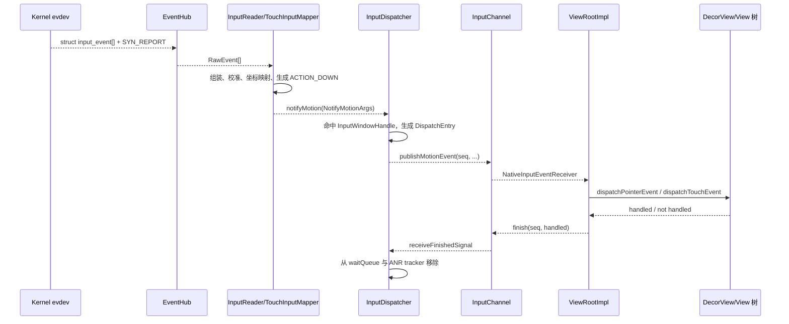
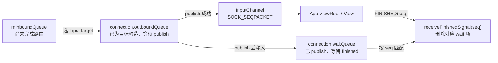

# 20 InputReader 与 InputDispatcher：一次触摸为什么会“消失”？

Activity B 已经显示，用户点击“继续”按钮，界面却毫无反应。你知道触摸屏驱动产生过数据，但 `View.OnClickListener` 没有日志。

这类问题不能只问“事件有没有发出来”。Android 输入链真正做了三次工作：

```text
InputReader：把硬件字段变化翻译成 Android 事件
InputDispatcher：根据当前窗口快照选择目标并发送
App：在 View 树中处理事件，再返回完成回执
```

先记住本章结论：

> **输入投递是一条有回执的流水线。`ACTION_DOWN` 被生成、找到窗口、写入 InputChannel、进入 `dispatchTouchEvent()`、返回 finished signal，是五个不同完成点。Input ANR 关注的是事件成功发给某个连接后，完成回执是否超时；它不直接证明触摸驱动坏了，也不直接证明某个 View 的回调执行太慢。**

读完后，你应该能：

1. 从 `/dev/input/event*` 追到 `MotionEvent.ACTION_DOWN`。
2. 解释 EventHub、InputReader、InputMapper 和 InputDispatcher 的职责边界。
3. 解释触摸为什么按坐标命中，而不是简单发给 focused window。
4. 区分 inbound queue、某连接的 outbound queue 和 wait queue。
5. 从 InputChannel 追到 ViewRootImpl、View 分发和 `finishInputEvent()`。
6. 准确说出普通窗口 input dispatch ANR 的计时起点和完成点。

本文基于 Android 11 / `android-11.0.0_r48`。只追一根手指点击 Activity B 按钮的主线；键盘映射、多指 split touch、鼠标、手写笔、输入注入和 Accessibility InputFilter 只用于说明边界。macOS 上只做静态阅读，不执行 AOSP 编译。

---

## 1. 先用五个检查点定位“事件消失”

可以把输入链想成一次需要签收的快递：

```text
硬件原始数据      = 零散货物
InputReader       = 分拣并组装成标准包裹
InputDispatcher   = 查地址、选择收件窗口
InputChannel      = 到该窗口的专用运输通道
finished signal   = 带 seq 的签收回执
```

“货物从仓库发出”不等于“收件人已经签收”。同样，看到 Linux 事件不等于 App 收到 `ACTION_DOWN`，看到 App 收到也不等于 InputDispatcher 已经得到完成回执。

### 五个完成点分别证明什么

| 检查点 | 典型证据 | 能证明 | 不能证明 |
|---|---|---|---|
| A. EventHub 读到 RawEvent | 对应 event fd 可读，`getEvents()` 返回数据 | 内核输入设备有原始变化 | 已形成合法 MotionEvent |
| B. Reader 生成 NotifyMotionArgs | `TouchInputMapper.dispatchMotion()` | 原始状态已被翻译和映射 | 已找到目标窗口 |
| C. Dispatcher 找到 InputTarget | `findTouchedWindowTargetsLocked()` 成功 | 当前输入窗口快照中存在目标 | App 已经开始处理 |
| D. 事件发布到连接 | publish 成功，DispatchEntry 进入 wait queue | 事件已写入目标 InputChannel | App 主线程已经运行 View 回调 |
| E. App 返回 finished | Dispatcher 按 seq 移除 wait queue 项 | 该目标完成了本次事件处理 | 界面一定完成下一帧绘制 |

排查时先找“最后一个成立的检查点”，下一段就是故障范围。

### 一次点击的主链与回执链



图中的 `ACTION_UP` 会再走一遍发送和回执。`OnClickListener` 通常依赖同一手势里的 DOWN、UP 和 View 状态，并不是收到 DOWN 就立即触发。

---

## 2. 这些代码运行在哪些线程？

Android 11 的 Java `InputManagerService`，简称 IMS，运行在 `system_server`。它通过 JNI 创建 native `NativeInputManager`，其中的 `InputManager` 再创建：

```cpp
mDispatcher = createInputDispatcher(dispatcherPolicy);
mClassifier = new InputClassifier(mDispatcher);
mReader = createInputReader(readerPolicy, mClassifier);
```

启动时先启动 Dispatcher，再启动 Reader：

```cpp
status_t InputManager::start() {
    status_t result = mDispatcher->start();
    ...
    result = mReader->start();
    ...
    return OK;
}
```

### 不要把“native”误解成“另一个 daemon”

在本版本主线中：

| 执行位置 | 主要对象 | 作用 |
|---|---|---|
| `system_server` Java/DisplayThread 等 | `InputManagerService`、WMS policy bridge | 启动、配置、窗口和策略协作 |
| `system_server` native InputReader 线程 | `EventHub`、`InputReader`、`InputMapper` | 读取设备并生成标准输入事件 |
| `system_server` native InputDispatcher 线程 | `InputDispatcher` | 路由、发送、等待回执和 ANR 计时 |
| App UI 线程 | `NativeInputEventReceiver`、`ViewRootImpl`、View 树 | 消费并分发到业务代码 |

InputReader 和 InputDispatcher 是两条独立 native 线程，但仍位于 `system_server` 进程地址空间内。App 的触摸回调通常运行在创建 ViewRootImpl 的 UI Looper，也就是主线程。

### 为什么 Reader 和 Dispatcher 要拆线程？

Reader 面对的是设备发现、阻塞读取和原始状态组装；Dispatcher 面对的是窗口路由、多个连接、策略与超时。

如果目标 App 卡住就连带停止读取硬件，后续设备状态会被拖死。拆开后，Reader 可继续生产事件，Dispatcher 用队列和每连接状态管理慢消费者。

这不表示队列容量无限，也不表示慢 App 没有影响：连接的 wait queue 会积压，通道可能写满，最终仍需要丢弃、取消或 ANR 处理。

---

## 3. Linux `input_event` 为什么不能直接变成一个 MotionEvent？

Linux evdev 从 `/dev/input/event*` 提供的是字段变化记录：

```c
struct input_event {
    struct timeval time;
    __u16 type;
    __u16 code;
    __s32 value;
};
```

一次手指落下可能对应：

```text
ABS_MT_SLOT
ABS_MT_TRACKING_ID
ABS_MT_POSITION_X
ABS_MT_POSITION_Y
ABS_MT_PRESSURE
SYN_REPORT
```

前五条只是在更新“当前这次采样的某些字段”。`SYN_REPORT` 才表示这一组状态可以作为一个同步快照处理。

如果每读到一个 X 或 Y 就立即构造 MotionEvent，App 会看到坐标来自不同采样时刻、pointer 信息不完整的事件。因此 Reader 必须先聚合状态，再比较前后快照。

### EventHub 负责“读”，不负责决定 ACTION_DOWN

InputReader 的循环先调用 EventHub：

```cpp
size_t count = mEventHub->getEvents(
        timeoutMillis, mEventBuffer, EVENT_BUFFER_SIZE);

if (count) {
    processEventsLocked(mEventBuffer, count);
}
```

`EventHub::getEvents()` 管理设备扫描、inotify、epoll、wake pipe 和 event fd 读取，输出统一的 `RawEvent`。它也产生设备添加、移除等 synthetic event。

它回答的是：

```text
哪个设备、哪个时间、哪个 type/code/value 发生变化？
```

至于这些变化代表 DOWN、MOVE 还是 UP，由对应 `InputDevice` 上的 InputMapper 决定。

### TouchInputMapper 在 SYN_REPORT 时同步状态

```cpp
void TouchInputMapper::process(const RawEvent* rawEvent) {
    mCursorButtonAccumulator.process(rawEvent);
    mCursorScrollAccumulator.process(rawEvent);
    mTouchButtonAccumulator.process(rawEvent);

    if (rawEvent->type == EV_SYN && rawEvent->code == SYN_REPORT) {
        sync(rawEvent->when);
    }
}
```

随后 `cookAndDispatch()` 校准、旋转并整理 pointer 数据，`dispatchTouches()` 比较本次和上次的 pointer id 集合：

```text
上次没有触点，本次出现第一个触点  → ACTION_DOWN
pointer id 集合相同、位置变化      → ACTION_MOVE
又出现一个 id                     → ACTION_POINTER_DOWN
减少一个但仍有其他 id             → ACTION_POINTER_UP
最后一个 id 消失                  → ACTION_UP
```

这就是为什么“一条 Linux event 对应一条 MotionEvent”是错误模型。

---

## 4. Reader 不只改名字，还要决定坐标属于哪个 Display

触摸控制器上报的 X/Y 常是设备原始范围，不一定等于屏幕像素，也没有天然考虑旋转、显示区域和校准参数。

`TouchInputMapper` 会结合设备配置和 `DisplayViewport` 处理：

- 触摸设备关联到哪个 display；
- raw 轴的最小值、最大值与精度；
- 屏幕旋转与逻辑 frame；
- pressure、size、orientation 等校准；
- pointer id、tool type 和当前 downTime。

最终 `dispatchMotion()` 构造 `NotifyMotionArgs` 并交给 listener：

```cpp
NotifyMotionArgs args(getContext()->getNextId(), when, deviceId,
        source, displayId, policyFlags, action, actionButton, flags,
        metaState, buttonState, MotionClassification::NONE, ...);
getListener()->notifyMotion(&args);
```

### Reader 的输出已经是“面向 Android 的事件”，但还不是“某个 App 的本地坐标”

Reader 生成的是 display 空间中的标准事件。等 Dispatcher 选定窗口后，还会根据目标窗口 frame、缩放和 transformation 计算该目标需要的 offset/scale。

因此坐标问题要分两段：

```text
设备 raw 坐标 → display 坐标：看 TouchInputMapper / DisplayViewport
display 坐标 → 窗口局部坐标：看 InputDispatcher / InputWindowInfo
```

如果所有 App 的点击都整体旋转或偏移，优先看 Reader/viewport；如果只有某个窗口或嵌入场景偏移，优先看窗口 frame、transform 与 input window 信息。

### Reader 发给谁？

本版本构造链是：

```text
InputReader
→ QueuedInputListener
→ InputClassifier
→ InputDispatcher
```

`InputReader::loopOnce()` 最后在 Reader 锁外调用 `mQueuedListener->flush()`。源码注释明确说明，这是为了避免 listener 回调 Dispatcher/WMS 后再反向等待 Reader 锁造成死锁。

这条锁边界很有意义：高频事件链不仅要“快”，还要避免 Reader 锁跨越可能回调其他子系统的边界。

---

## 5. Dispatcher 根据什么窗口列表命中 Activity B？

InputDispatcher 不会在每个 ACTION_DOWN 到来时，通过 Binder 临时询问 WMS“屏幕上有哪些窗口”。WMS 会提前把输入窗口快照同步过去。

每个 `InputWindowHandle`/`InputWindowInfo` 包含的关键事实包括：

| 字段 | 用途 |
|---|---|
| `displayId` | 事件和窗口是否属于同一显示屏 |
| `frame`、touchable region、transform | 坐标是否命中，怎样换算 |
| `visible`、窗口 flags | 是否可见、可触摸、可聚焦 |
| `ownerPid` / `ownerUid` | 权限、安全判断和归责 |
| InputChannel token | 找到目标连接 |
| `hasFocus` / `canReceiveKeys` | 聚焦按键路由；触摸不只看它 |
| `paused`、dispatch timeout | 是否暂停投递与等待多久 |

Android 11 中，WMS 的 `InputMonitor` 通过 `SurfaceControl.Transaction.setInputWindowInfo()` 把这些信息和 layer transaction 一起提交。SurfaceFlinger 汇总可见 layer 的输入信息，再传给 InputFlinger/InputDispatcher。

这样设计的意义是：显示层级、裁剪、变换和输入命中尽量来自同一批 transaction，减少“画面已经移动，点击区域还在旧位置”的时间差。

### ACTION_DOWN 不是简单发给 focused window

触摸是按坐标命中的。新手势开始时，Dispatcher 进入：

```text
findTouchedWindowTargetsLocked
→ 取得 displayId 与 DOWN 坐标
→ findTouchedWindowAtLocked
→ 从高到低检查可见、touchable region、flags、连接状态
→ 生成一个或多个 InputTarget
```

关键源码：

```cpp
sp<InputWindowHandle> newTouchedWindowHandle =
        findTouchedWindowAtLocked(displayId, x, y, &tempTouchState,
                isDown /* addOutsideTargets */,
                true /* addPortalWindows */);
```

因此 Activity B 拿到了键盘焦点，也不保证屏幕任意坐标的触摸都发给 B。一个更高的可触摸窗口、错误的 touchable region、display 不匹配或遮挡安全策略都可能改变结果。

按键与触摸的区别可以先记成：

```text
KeyEvent：主要寻找该 display 的 focused window
ACTION_DOWN：主要按坐标和 InputWindowInfo 做 hit test
```

---

## 6. 为什么 MOVE/UP 通常继续交给 DOWN 命中的窗口？

如果每一帧 MOVE 都重新按坐标选窗口，手指刚移出按钮或窗口边缘，后续 UP 就可能送给另一个应用。这样一个手势会被撕裂，任何 View 都无法可靠维护按下状态。

所以 Dispatcher 在 ACTION_DOWN 时建立 display 对应的 `TouchState`。它记录本次 gesture 的前台窗口、pointer ids、split 状态和 monitors。

后续普通 MOVE、UP、CANCEL 复用这份状态：

```text
DOWN：命中并建立 touch target
MOVE：继续发给已有 target
UP：发给已有 target，然后清理 touch state
CANCEL：通知已有 target 终止手势，然后清理
```

源码把“新手势/新 pointer”和“已有手势的 move/up/cancel”分成两类：

```cpp
if (newGesture ||
        (isSplit && maskedAction == AMOTION_EVENT_ACTION_POINTER_DOWN)) {
    // 为新的 pointer 寻找目标
} else {
    // move、up、cancel 使用已有 tempTouchState
}
```

### 这不是绝对永不改变目标

存在有意设计的例外：

- slippery window 可在 MOVE 时产生 slippery exit/enter；
- 多指且窗口支持 split touch 时，不同 pointer id 可分配到不同目标；
- 窗口被移除、连接断开、策略接管或状态冲突时会生成 CANCEL；
- gesture monitor、wallpaper、outside touch 可能收到派生目标，但它们不等于前台业务窗口。

对于本章的单指按钮点击，先按“不重新命中、同一 target 收到 DOWN 到 UP”理解即可。

### 系统 touch target 和 ViewGroup touch target 是两层

InputDispatcher 先选择 Activity B 的窗口。事件进入 App 后，`ViewGroup.dispatchTouchEvent()` 又会在 DOWN 时选择具体子 View，并在后续事件中维护自己的 touch target。

所以：

```text
系统层 target = 哪个窗口/哪个 InputChannel
View 层 target = 该窗口里的哪个 View
```

窗口命中正确但按钮不响应，问题可能已经进入 App 的 View 分发层；不要再回头怪 EventHub。

---

## 7. InputChannel 不是 Binder：它是一对带回执的 socket

WMS 为可接收输入的窗口创建 InputChannel pair：

```cpp
int sockets[2];
if (socketpair(AF_UNIX, SOCK_SEQPACKET, 0, sockets)) {
    ...
}
sp<IBinder> token = new BBinder();

android::base::unique_fd serverFd(sockets[0]);
outServerChannel = InputChannel::create(
        name + " (server)", std::move(serverFd), token);

android::base::unique_fd clientFd(sockets[1]);
outClientChannel = InputChannel::create(
        name + " (client)", std::move(clientFd), token);
```

服务端一端注册给 InputDispatcher，客户端一端在窗口添加结果中转交给 App 的 ViewRootImpl。

Binder 负责创建窗口、传递 channel fd 和配置控制；高频 Key/Motion/Focus 消息以及 finished signal 走 InputChannel。说“输入事件通过 Binder 一条条送到 View”在这条主路径上是不准确的。

### 为什么用 `SOCK_SEQPACKET`？

输入消息需要保留消息边界，并支持双向的事件/回执传输。`InputMessage` 包含 KEY、MOTION、FOCUS 和 FINISHED 等类型，seq 用于把回执对应回具体投递。

它仍不是无限邮箱：socket buffer 可能写满。如果 publisher 得到 `WOULD_BLOCK`，而 wait queue 中已有未完成事件，Dispatcher 会等待消费者赶上；如果连接损坏，则进入 broken channel 清理与通知。

### 三类队列不要和 App MessageQueue 混淆



表述要精确：

| 队列 | 元素所处状态 | 积压通常提示 |
|---|---|---|
| global inbound | Reader/注入已交给 Dispatcher，尚未完成路由 | Dispatcher/policy 忙、事件过多、目标等待 |
| per-connection outbound | 已生成该连接的 DispatchEntry，尚未成功 publish | channel 背压或连接状态问题 |
| per-connection wait | 已 publish，尚未收到同 seq 的 finished | App/monitor 没及时完成处理 |

wait queue 是 InputDispatcher native 连接状态，不是 App 主线程的 `MessageQueue`。两者可能因果相关，但不能在 dump 中看到 `waitQueue` 就说“Java Handler 队列里有同名对象”。

---

## 8. 事件进入 App 后，为什么还要经过 InputStage？

App 端 native receiver 在目标 Looper 上监听 client InputChannel。读到 KEY/MOTION 后，JNI 创建 Java `InputEvent` 并调用 `dispatchInputEvent(seq, event)`；ViewRootImpl 的 `WindowInputEventReceiver` 再把它加入 pending input event 队列。

ViewRootImpl 建立的主 stage 链为：

```text
NativePreImeInputStage
→ ViewPreImeInputStage
→ ImeInputStage
→ EarlyPostImeInputStage
→ NativePostImeInputStage
→ ViewPostImeInputStage
→ SyntheticInputStage
```

### Why：输入并不总是直接交给 View

按键可能先给输入法、native activity 或 fallback policy；触摸还要处理 touch mode、滚动、无障碍、兼容变换和合成事件。InputStage 让每层都能：

```text
FINISH_HANDLED      已处理，结束
FINISH_NOT_HANDLED  未处理，结束
FORWARD             交给下一 stage
DEFER               异步等待，稍后恢复
```

这解释了一个重要边界：事件已进入 App 进程，不等于已经进入业务 View。它可能还在前置 stage，或被异步 IME/native stage 延后。

### 触摸最终怎样进入 View 树？

在 `ViewPostImeInputStage` 中，pointer 事件的关键调用是：

```java
boolean handled = mView.dispatchPointerEvent(event);
...
return handled ? FINISH_HANDLED : FORWARD;
```

对于触摸屏事件，后续进入 DecorView、Activity 的 `dispatchTouchEvent()`、PhoneWindow/DecorView 的 super dispatch，最终由 `ViewGroup.dispatchTouchEvent()` 在子 View 之间分发。

对本章按钮而言，至少要满足：

```text
DOWN 命中 Activity B 的窗口
→ App 主线程运行到 ViewPostImeInputStage
→ ViewGroup 在 DOWN 选择按钮或其父级 touch target
→ 后续 UP 没被 CANCEL/拦截破坏
→ 点击条件成立，才调用 OnClickListener
```

### `handled=false` 不等于把触摸重发给下面的 App

系统窗口 target 已在 ACTION_DOWN 时确定。Activity B 的 View 树返回 false，主要表示这条 App 分发链没有消费事件，并用于系统后处理；它不会把同一手势像网页冒泡那样重新命中屏幕下方另一个应用。

对于 KeyEvent，未处理结果可能触发 fallback key 等 policy 行为，所以 `handled` 的后果要按事件类型分析。

---

## 9. finished signal 为什么决定 ANR，而不是 `dispatchTouchEvent()` 的返回日志？

### 先讲 Why：发送者必须知道接收者是否还活着

如果 Dispatcher 只往 socket 写、不等待回执，它无法区分：

- App 正常处理完成；
- UI 线程卡在锁或同步 Binder 调用中；
- 事件停在异步 InputStage；
- App 进程还活着，但永远不再消费 channel。

因此每个 publish 使用 seq，App 无论 handled 与否，最终都要调用 `finishInputEvent()`。

ViewRootImpl 的结束点：

```java
private void finishInputEvent(QueuedInputEvent q) {
    ...
    boolean handled =
            (q.mFlags & QueuedInputEvent.FLAG_FINISHED_HANDLED) != 0;
    q.mReceiver.finishInputEvent(q.mEvent, handled);
    ...
}
```

Java `InputEventReceiver` 再把事件 sequence number 映射回 transport seq，并调用 native finish。

### 普通连接的 ANR 计时从 publish 开始

`InputDispatcher::startDispatchCycleLocked()` 取出 outbound 项时设置：

```cpp
DispatchEntry* dispatchEntry = connection->outboundQueue.front();
dispatchEntry->deliveryTime = currentTime;
const nsecs_t timeout = getDispatchingTimeoutLocked(
        connection->inputChannel->getConnectionToken());
dispatchEntry->timeoutTime = currentTime + timeout;
```

publish 成功后，同一个 DispatchEntry 才从 outbound 移到 wait queue，并加入 ANR tracker：

```cpp
connection->outboundQueue.erase(...);
connection->waitQueue.push_back(dispatchEntry);
if (connection->responsive) {
    mAnrTracker.insert(dispatchEntry->timeoutTime,
            connection->inputChannel->getConnectionToken());
}
```

所以要准确记忆：

> 对已经选定并成功 publish 给窗口连接的事件，等待处理超时以 `deliveryTime/timeoutTime` 为核心，而不是从手指接触硬件的 `eventTime` 开始，也不是从 `OnTouchListener` 第一行开始。

事件还停在 Reader 或 global inbound 时，不属于“这个 App 已拿到事件但没回执”的 wait-queue 阶段。

### 回执怎样解除等待？

Dispatcher 从 server channel 读到 finished signal：

```text
receiveFinishedSignal(&seq, &handled)
→ finishDispatchCycleLocked(..., seq, handled)
→ 找到 waitQueue 中对应 DispatchEntry
→ 从 waitQueue 删除
→ 从 mAnrTracker 删除 timeoutTime/token
→ 尝试启动下一轮 dispatch cycle
```

因此 `handled=false` 仍然是有效完成；真正危险的是迟迟没有 finished。

### Input ANR 不等于 `dispatchTouchEvent()` 自己执行了 5 秒

InputDispatcher 看到的直接事实只有：

```text
某个连接已有事件进入 waitQueue
超过 timeoutTime 仍没有对应 finished signal
```

根因可能是：

- 主线程在事件到达前就被其他消息、锁、I/O 或 Binder 调用卡住；
- 事件在某个 InputStage 被 DEFER 后没有及时恢复；
- `dispatchTouchEvent()` 或业务回调本身耗时；
- 回调返回前又同步等待其他进程，而对方反向等待它；
- native/JNI 层或进程调度异常。

所以 ANR 诊断要结合主线程栈、Binder 等待链和 trace；不能仅凭 InputDispatcher 超时就给某个 View 方法定罪。

### 和“有 focused app、没有 focused window”ANR 分开

第 19 章讲的 no-focused-window ANR 是另一条计时：有 focused application，但尚无 focused window；当聚焦输入需要目标时开始等待。

本节讲的是：目标连接已经存在，事件已经 publish，但 App 没有完成回执。两者都叫 input ANR，现场证据不同。

---

## 10. batching、CANCEL 和策略过滤会制造哪些“像丢事件”的现象？

### MOVE batching：回调次数减少，不等于坐标历史全被抹掉

连续 MOVE 很密集时，App 若每个采样都立刻处理，可能把主线程淹没。InputConsumer/ViewRootImpl 可把 MOVE 批次对齐到 Choreographer 帧时机，并在一个 MotionEvent 的 history 中携带历史采样。

因此：

```text
getevent 看见很多坐标变化
App 只收到较少次 ACTION_MOVE 回调
```

不自动等于系统随意丢失整个手势。检查 `MotionEvent.getHistorySize()`，并区分 DOWN/UP 与可批处理 MOVE。

### CANCEL：不是硬件必须上报的一种触摸动作

`ACTION_CANCEL` 可由系统或 View 分发层合成，用来告诉当前 target：这条手势不再按正常 UP 结束，请清理 pressed、drag、velocity 等状态。

窗口被移除、输入通道失效、焦点/策略切换等可能在系统层导致 CANCEL；父 View 改为拦截时，也可能在 View 分发层给原子 View 合成 CANCEL。收到 CANCEL 后不出现 OnClick 是正确行为，不应只寻找“为什么少了 UP”。

### Policy/InputFilter：Reader 生成事件后仍可能被消费

`InputDispatcher::notifyMotion()` 在进入 inbound queue 前会调用 policy 的 `interceptMotionBeforeQueueing()`；启用 InputFilter 时，还可能把事件交给 Java filter。过滤器返回不继续时，原事件不会进入正常目标投递。

所以“Reader 已生成 NotifyMotionArgs，但 inbound 没有对应事件”的排查范围包括 policy/filter，不能直接断言 Dispatcher 线程丢内存。

### 输入注入绕过了哪些环节？

`adb shell input tap x y` 产生的是注入事件，不是触摸控制器经过 EventHub、TouchInputMapper 的物理链路。

它适合验证：

```text
当前 InputWindowInfo 命中
→ Dispatcher
→ InputChannel
→ App View 分发
```

但它不能证明触摸硬件、evdev、设备配置和 Reader 坐标映射正常。物理点击失败而注入成功时，差异本身就把范围缩到了注入点之前。

---

## 11. 按检查点排查“按钮没反应”

### A → B：有原始数据，却没生成正确 MotionEvent

检查：

- 事件来自哪个 `/dev/input/eventX`；
- 设备是否被识别为 touch，还是被忽略/分类错误；
- 是否有完整 `SYN_REPORT`；
- slot、tracking id 和 X/Y 是否形成合法状态；
- `.idc`、viewport、旋转和 display association 是否正确。

将来有设备时可尝试 `adb shell getevent -lt`；权限和输出能力随 build 类型而异。本轮不把它当已执行结果。

### B → C：Reader 有 Motion，Dispatcher 找不到 Activity B

检查 InputDispatcher 日志和输入窗口快照：

```text
displayId 是否一致？
Activity B 的 input window 是否 visible？
frame/touchableRegion 是否覆盖点击坐标？
是否有更高的可触摸窗口？
InputChannel token 是否能找到 connection？
连接是否已被标记 unresponsive？
policy/InputFilter 是否先消费？
```

这类错误常见日志包含 `no touchable window`、`no touched foreground window`、`paused` 或找不到 connection；具体文本不是稳定 API，要结合 r48 源码定位。

### C → D：已有目标，但 channel 发不进去

看该 connection：

- outbound queue 是否积压；
- publish 是否返回 `WOULD_BLOCK`；
- wait queue 是否已有大量未完成项；
- channel 是否 broken/zombie；
- App 进程或窗口是否已死亡但 WMS 快照尚在变化中。

### D → E：已 publish，却长期没有 finished

这时才把 App/monitor 消费端作为重点：

```text
App UI 线程栈在哪里？
ViewRoot pending input event 是否积压？
事件停在哪个 InputStage？
dispatchTouchEvent/OnTouch/手势识别是否阻塞？
是否同步 Binder、锁等待、I/O 或 GC 停顿？
```

若 wait queue 最老项超时，系统看到的是“窗口连接不响应”；最终根因仍需线程栈和跨进程等待链证明。

### 将来设备上的只读入口

```bash
adb shell dumpsys input
adb shell dumpsys window windows
adb shell dumpsys activity activities
```

在 `dumpsys input` 中重点找：

```text
Input Reader State / devices
Input Dispatcher State
InboundQueue
Connections
OutboundQueue / WaitQueue
TouchStatesByDisplay
FocusedApplications / FocusedWindows
```

厂商可能改变 dump 格式。字段缺失时，应读取对应版本的 `InputReader::dump()`、`InputDispatcher::dump()`，不要死记输出排版。

---

## 12. 在 Mac 上完成一次不编译的源码验证

### 验证一：证明 RawEvent 先聚合，SYN_REPORT 才触发 touch sync

```bash
rg -n 'getEvents|processEventsLocked|processEventsForDeviceLocked' \
  frameworks/native/services/inputflinger/reader/InputReader.cpp

rg -n 'TouchInputMapper::process|SYN_REPORT|dispatchTouches|dispatchMotion' \
  frameworks/native/services/inputflinger/reader/mapper/TouchInputMapper.cpp
```

记录：EventHub 输出什么，`TouchInputMapper` 在哪里比较前后 pointer id，第一根手指怎样从 POINTER_DOWN 被规范成 ACTION_DOWN。

### 验证二：证明 ACTION_DOWN 按窗口命中，MOVE/UP 复用 TouchState

```bash
rg -n 'findTouchedWindowTargetsLocked|findTouchedWindowAtLocked|mTouchStatesByDisplay' \
  frameworks/native/services/inputflinger/dispatcher/InputDispatcher.cpp
```

记录 `newGesture` 分支与“move/up/cancel”分支。预期结论：单指普通手势不是每个 MOVE 都重新从屏幕顶层命中窗口。

### 验证三：证明 ANR 等待在 publish 后建立，在 finished 后解除

```bash
rg -n 'startDispatchCycleLocked|deliveryTime|timeoutTime|waitQueue.push_back' \
  frameworks/native/services/inputflinger/dispatcher/InputDispatcher.cpp

rg -n 'receiveFinishedSignal|finishDispatchCycleLocked|findWaitQueueEntry|mAnrTracker.erase' \
  frameworks/native/services/inputflinger/dispatcher/InputDispatcher.cpp
```

画出：

```text
outbound → publish → waitQueue/ANR tracker
                         ↑
App FINISHED(seq) ───────┘  然后删除对应项
```

### 验证四：证明 App 最终显式 finish

```bash
rg -n 'WindowInputEventReceiver|enqueueInputEvent|deliverInputEvent|finishInputEvent' \
  frameworks/base/core/java/android/view/ViewRootImpl.java

rg -n 'nativeFinishInputEvent|finishInputEvent' \
  frameworks/base/core/java/android/view/InputEventReceiver.java \
  frameworks/base/core/jni/android_view_InputEventReceiver.cpp
```

预期结论：View 分发返回 handled 后，链路仍要把 seq/handled 送回 Dispatcher；“业务处理完”与“系统知道它处理完”之间有明确协议。

### 自检题与答案

**1. EventHub 读到 `ABS_MT_POSITION_X`，为什么还不能立刻发 ACTION_MOVE？**

它只是一项 raw 字段更新，Y、slot、tracking id 等可能还没更新完。TouchInputMapper 等到 SYN_REPORT 形成一致快照，再比较前后状态生成语义事件。

**2. Activity B 有键盘焦点，点击坐标为什么仍可能落到另一个窗口？**

触摸 DOWN 主要根据 display、Z-order、可见性、touchable region、flags 和坐标 hit test 选择目标，不等同于键盘 focused window。

**3. 手指移出按钮，为什么后续 UP 仍可能到原窗口？**

系统在 DOWN 建立 TouchState，普通 MOVE/UP 延续同一 gesture target。进入 App 后，ViewGroup 还会维护自己的子 View touch target；是否形成 click 由 View 层状态决定。

**4. wait queue 中的事件处于什么状态？**

它已经成功 publish 到该连接的 InputChannel，但 Dispatcher 尚未收到同 seq 的 finished signal。

**5. App 返回 `handled=false` 会触发 ANR 吗？**

不会。`handled=false` 仍是完成回执。ANR 关心的是回执超时，而不是业务是否消费；不过未处理 KeyEvent 可能触发 fallback policy。

**6. 普通连接的 input ANR 从物理 `eventTime` 开始计时吗？**

不是。本版本在 `startDispatchCycleLocked()` 为目标 DispatchEntry 设置 `deliveryTime` 和 `timeoutTime`，publish 成功后加入 wait queue/ANR tracker。硬件时间可用于端到端延迟分析，但不是这里的 wait-queue 超时起点。

**7. `OnClickListener` 没执行，能直接说明 ACTION_DOWN 丢了吗？**

不能。Click 通常还要求 DOWN/UP 序列、同一 View 的 pressed 状态、没有 CANCEL/父级拦截等。应先在 ViewRoot 或 `dispatchTouchEvent()` 入口确认事件，再下沉到具体 View。

**8. `adb shell input tap` 成功，能证明触摸驱动正常吗？**

不能。注入绕过物理 evdev、EventHub 和 TouchInputMapper；它只验证注入点之后的大部分路由与 App 分发链。

### 本章 takeaway

以后遇到输入问题，先画五格：

```text
[RawEvent] → [NotifyMotion] → [InputTarget] → [publish/waitQueue] → [FINISHED]
```

再给每一格填证据。这样“硬件没数据”“坐标映射错”“窗口没命中”“App 主线程不消费”和“业务没形成 click”就不会再被统称为“触摸丢了”。

---

## 源码定位表

| 目的 | 文件与符号 |
|---|---|
| Java 输入服务与 native 启动 | `frameworks/base/services/core/java/com/android/server/input/InputManagerService.java` |
| IMS JNI bridge | `frameworks/base/services/core/jni/com_android_server_input_InputManagerService.cpp` |
| Reader/Dispatcher 创建与启动 | `frameworks/native/services/inputflinger/InputManager.cpp` |
| evdev 设备与原始读取 | `frameworks/native/services/inputflinger/reader/EventHub.cpp` |
| Reader 主循环 | `frameworks/native/services/inputflinger/reader/InputReader.cpp` |
| 触摸状态、校准与 Motion 生成 | `frameworks/native/services/inputflinger/reader/mapper/TouchInputMapper.cpp` |
| 路由、队列、发送、回执与 ANR | `frameworks/native/services/inputflinger/dispatcher/InputDispatcher.cpp` |
| per-connection outbound/wait 队列 | `frameworks/native/services/inputflinger/dispatcher/Connection.h` |
| InputChannel transport | `frameworks/native/libs/input/InputTransport.cpp` |
| App native receiver JNI | `frameworks/base/core/jni/android_view_InputEventReceiver.cpp` |
| App Java receiver协议 | `frameworks/base/core/java/android/view/InputEventReceiver.java` |
| App InputStage 与 View 分发入口 | `frameworks/base/core/java/android/view/ViewRootImpl.java` |
| WMS 输入窗口快照 | `frameworks/base/services/core/java/com/android/server/wm/InputMonitor.java` |
| layer 输入信息交给 InputFlinger | `frameworks/native/services/surfaceflinger/SurfaceFlinger.cpp` |

源码行号随分支变化，应以类名和方法名定位。本文只依据 r48 静态源码确认机制和调用方向；真实设备的事件延迟、厂商策略、driver 行为和 ANR 现场仍需将来通过 trace、dump 与线程栈验证。
