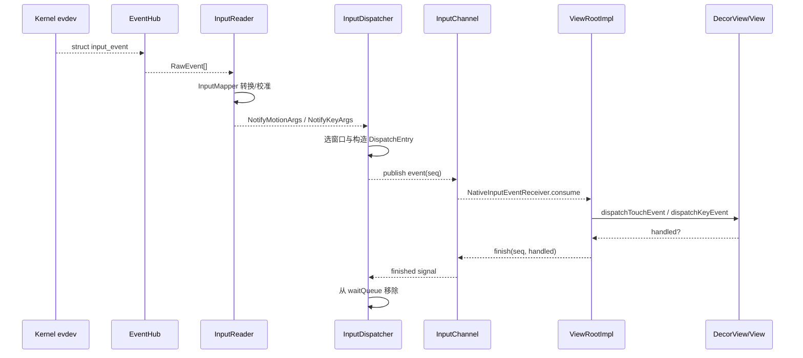
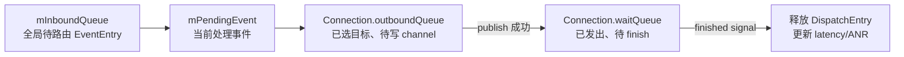
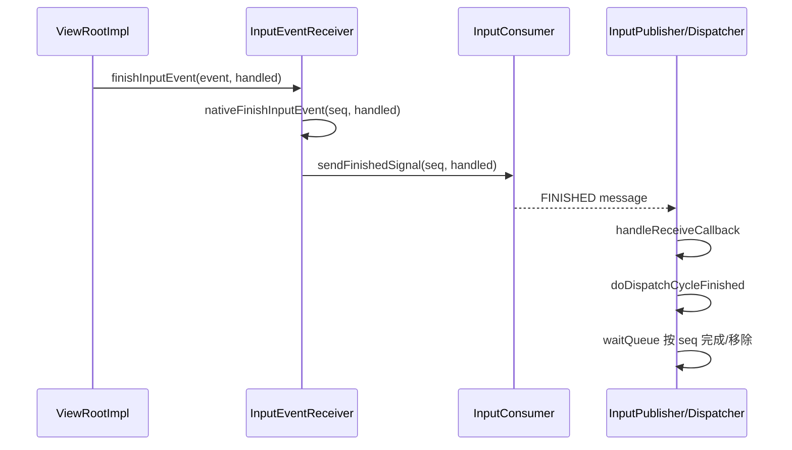
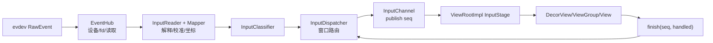

# 20 InputReader 与 InputDispatcher 输入系统

> 源码版本：Android 11 / API 30 / `android-11.0.0_r48`  
> 学习方式：macOS 只读源码，不要求连接设备或编译 AOSP。  
> 前置章节：[07-Binder基础与完整调用链](./07-Binder基础与完整调用链.md)、[11-View到Window与ViewRootImpl](./11-View到Window与ViewRootImpl.md)、[18-ANR原理与系统诊断](./18-ANR原理与系统诊断.md)、[19-WMS窗口管理与焦点切换](./19-WMS窗口管理与焦点切换.md)

---

## 1. 本章目标

这一章追踪一根手指从触摸屏落下，到 App 收到 `MotionEvent.ACTION_DOWN`，再到系统收到处理完成回执的全过程：

```text
触摸控制器/驱动
 → /dev/input/eventX
 → EventHub
 → InputReader
 → InputMapper
 → InputClassifier
 → InputDispatcher
 → InputChannel
 → App NativeInputEventReceiver
 → ViewRootImpl
 → DecorView/ViewGroup/View
 → finishInputEvent
 → InputDispatcher waitQueue 清理
```

学完后应能：

1. 区分 EventHub、InputReader、InputDispatcher 的职责。
2. 解释 Linux `input_event` 与 Android `MotionEvent` 为什么不是一一对应。
3. 解释扫描码、Android keyCode、key layout/key character map。
4. 解释触摸坐标如何校准、旋转并映射到 Display。
5. 区分 inbound、outbound、wait 三类队列。
6. 区分按键焦点、触摸命中与一段 gesture 的 touch focus。
7. 解释 InputChannel 的 server/client 端和 seq 回执。
8. 追踪 App 内输入阶段链与 `dispatchTouchEvent()`。
9. 解释 MotionEvent batching 与 VSync 对齐。
10. 准确描述 Input ANR 的计时起点。

---

## 2. 先回答：输入系统运行在哪个进程

Android 11 的 Java `InputManagerService` 在：

```text
system_server 进程
```

它通过 JNI 创建 native `NativeInputManager`，内部创建：

```text
InputManager
 ├─ InputReader
 ├─ InputClassifier
 └─ InputDispatcher
```

InputReader 和 InputDispatcher 各有独立 native 线程，但仍在 system_server 进程地址空间内，并不是两个独立 Linux 守护进程。

App 进程只有 InputChannel 客户端、NativeInputEventReceiver、ViewRootImpl 等消费端。

---

## 3. 四层职责总览

| 层 | 核心对象 | 回答的问题 |
|---|---|---|
| Linux/设备 | evdev、`/dev/input/event*` | 硬件产生了什么原始 type/code/value？ |
| 读取与解释 | EventHub、InputReader、InputMapper | 这是哪个设备？原始数据应变成什么 Android 事件？ |
| 路由与传输 | InputDispatcher、InputWindowInfo、InputChannel | 事件应发给哪个窗口？如何等待完成？ |
| App 分发 | InputEventReceiver、ViewRootImpl、DecorView/View | 窗口内部哪个 View 处理？何时返回 handled？ |

最容易记的分工：

```text
EventHub：读
InputReader：翻译
InputDispatcher：选目标并发送
ViewRootImpl：接入 App 的 View 分发
```

---

## 4. 总体时序图



---

## 5. Linux evdev 提供什么

触摸、键盘、鼠标等驱动向 input subsystem 注册设备，用户空间通常从：

```text
/dev/input/event0
/dev/input/event1
...
```

读取：

```c
struct input_event {
    struct timeval time;
    __u16 type;
    __u16 code;
    __s32 value;
};
```

含义是“某个时刻发生一个原始变化”，例如：

```text
EV_KEY + KEY_POWER + 1：某物理键按下
EV_ABS + ABS_MT_POSITION_X + 1234：多点触摸 X 原始值更新
EV_ABS + ABS_MT_POSITION_Y + 567：Y 原始值更新
EV_SYN + SYN_REPORT：这一组更新结束
```

一个 Java MotionEvent 通常由多条 Linux input_event 聚合而成。

---

## 6. 为什么需要 SYN_REPORT

触摸屏一次采样会分别报告槽位、tracking id、X、Y、pressure 等字段。若读取一条就立刻发一个 MotionEvent，会得到不完整状态。

```text
ABS_MT_SLOT
ABS_MT_TRACKING_ID
ABS_MT_POSITION_X
ABS_MT_POSITION_Y
ABS_MT_PRESSURE
SYN_REPORT
```

InputMapper 累积当前 raw state，在 `SYN_REPORT` 等同步边界形成一次完整触摸快照，再与上一次快照比较，生成 DOWN/MOVE/UP/POINTER_*。

所以 Linux 的“事件”更像字段变更记录，Android MotionEvent 才是面向应用的语义事件。

---

## 7. InputManagerService 启动

Java 入口：

```text
InputManagerService.start
 → nativeStart(mPtr)
```

JNI：

```text
com_android_server_input_InputManagerService.cpp
 → NativeInputManager
 → new InputManager(readerPolicy, dispatcherPolicy)
```

native InputManager 构造：

```cpp
mDispatcher = createInputDispatcher(dispatcherPolicy);
mClassifier = new InputClassifier(mDispatcher);
mReader = createInputReader(readerPolicy, mClassifier);
```

启动顺序：

```text
InputManager.start
 → InputDispatcher.start
 → InputReader.start
```

先让接收方 Dispatcher 就绪，再开始 Reader 生产事件。

---

## 8. Java IMS、JNI 和 native policy

`NativeInputManager` 同时实现 reader/dispatcher policy 接口，把 native 决策桥接回 Java Framework：

```text
读取配置、Display viewport、key repeat/触摸设置
拦截按键（PhoneWindowManager）
通知 ANR、焦点、设备变化
调用 InputFilter/Accessibility
振动、指针图标、show touches 等
```

高频数据面尽量留在 native，系统策略通过 policy 回调接入 Java。

不要理解成每个 MOVE 都必然做多次普通 Java Binder 调用；JNI/policy 只在需要的节点参与。

---

## 9. EventHub 的职责

核心文件：

```text
frameworks/native/services/inputflinger/reader/EventHub.cpp
```

EventHub 负责：

- 扫描 `/dev/input`。
- 打开/关闭 event device。
- 用 inotify 感知设备增删。
- 用 epoll 等待多个 fd。
- 读取内核 `input_event`。
- 查询设备能力 bitmask 和 abs axis 范围。
- 加载设备配置、key layout/key character map。
- 输出统一 `RawEvent`。

EventHub 不决定某个触摸应该投给哪个窗口。

---

## 10. EventHub 的 epoll 循环

`EventHub::getEvents(timeoutMillis, buffer, size)` 概念流程：

```text
处理待打开/关闭设备
 → 返回 DEVICE_ADDED / DEVICE_REMOVED 等合成事件
 → epoll_wait 等待 input fd、inotify fd、wake fd
 → read(input_event[])
 → 转为 RawEvent[]
 → 返回 InputReader
```

使用 wake fd 是为了配置刷新或停止线程时唤醒阻塞的 epoll，而不是轮询浪费 CPU。

`EPOLLWAKEUP` 等机制还与 suspend/wakelock 协作，防止刚收到输入事件系统就睡眠。

---

## 11. 设备发现与分类

EventHub 通过 ioctl 查询：

```text
EV_KEY / EV_REL / EV_ABS / EV_SW 能力
按键 bitmask
absolute axis min/max/fuzz/flat/resolution
INPUT_PROP_DIRECT / POINTER 等 property
vendor/product/version/unique id
```

据此给设备标记类别，例如：

```text
keyboard
cursor/mouse
touchscreen/touchpad
joystick
switch
vibrator
external stylus
```

同一物理设备还可能暴露多个 event 节点，并由 InputReader 按 descriptor 组合进一个逻辑 InputDevice。

---

## 12. 输入配置文件

常见文件：

| 后缀 | 作用 |
|---|---|
| `.idc` | input device configuration，触摸/指针模式、校准、关联 display 等 |
| `.kl` | key layout，把 Linux scan code 映射成 Android keyCode/flags |
| `.kcm` | key character map，把 keyCode+meta 映射为字符/行为 |
| `.vk` | virtual key 定义，旧式屏幕外虚拟按键区域 |

常见目录：

```text
/system/usr/idc
/vendor/usr/idc
/product/usr/idc
/system/usr/keylayout
/vendor/usr/keylayout
/system/usr/keychars
```

搜索优先级和分区随版本/设备定制变化，应查 `InputDevice.cpp`、`EventHub.cpp` 和设备镜像实际文件。

---

## 13. scanCode、keyCode、字符不能混为一谈

```text
scanCode：内核/硬件报告的代码，如 KEY_* 对应值
Android keyCode：KEYCODE_BACK、KEYCODE_A 等逻辑键
字符：'a'、'A'、'@'，取决于 keyCode + meta + KCM
```

转换：

```text
EventHub.mapKey
 → KeyLayoutMap.findKeyByScanCode/usage
 → Android keyCode + flags
 → KeyboardInputMapper 维护 meta state
 → KeyCharacterMap 在更高层解释字符
```

按键事件不是一开始就携带最终文本。IME 输入文字也不等于把每个字符伪装成硬件 KeyEvent。

---

## 14. InputReader 线程循环

核心：

```text
InputReader::loopOnce
 → EventHub.getEvents
 → processEventsLocked
 → 设备增删/扫描完成/普通 RawEvent
 → InputDevice.process
 → 各 InputMapper.process
 → mQueuedListener.flush
```

InputReader 持有自己的锁更新设备与 mapper 状态，但通过 `QueuedInputListener` 先积累通知，退出关键锁区后再 flush 给下游，避免调用 Dispatcher 时长期占住 Reader 状态锁。

---

## 15. InputDevice 与 InputMapper

一个 InputDevice 根据能力建立一个或多个 mapper：

```text
KeyboardInputMapper
CursorInputMapper
TouchInputMapper
SingleTouchInputMapper
MultiTouchInputMapper
JoystickInputMapper
SwitchInputMapper
VibratorInputMapper
```

同一设备可能同时拥有键盘和触摸能力，因此 mapper 不是“一个设备只能选一个”。

InputDevice 把 RawEvent 交给各 mapper；mapper 只处理自己关心的 type/code，维护独立状态并产生 Notify*Args。

---

## 16. TouchInputMapper 的任务

TouchInputMapper 不只是把 ABS_X 改名为 X。它负责：

- 解析单点/多点协议与 slot/tracking id。
- 维护上一帧和当前 raw pointer state。
- 分配稳定 pointer id。
- 判断工具类型 finger/stylus/eraser。
- 去抖、校准、pressure/size/orientation 归一化。
- 将 raw axis 映射到 Display viewport。
- 处理 rotation、缩放、offset。
- 识别触摸屏、触摸板、pointer gesture 模式。
- 生成 MotionEvent action 语义。

输入坐标错误既可能是 App matrix 问题，也可能早在 IDC、viewport 或 TouchInputMapper 阶段就错了。

---

## 17. 多点触摸 slot 与 pointer id

Linux Protocol B 常用：

```text
ABS_MT_SLOT：当前更新哪个硬件 slot
ABS_MT_TRACKING_ID：这一接触点生命周期 id，-1 表示离开
ABS_MT_POSITION_X/Y：该 slot 坐标
```

Android MotionEvent 中：

```text
pointer index：当前 MotionEvent 数组下标，会变化
pointer id：一段接触生命周期内相对稳定的逻辑 id
```

不能保存 pointer index 跨事件追手指，应保存 `getPointerId(index)`，下一事件再 `findPointerIndex(id)`。

---

## 18. MotionEvent action 怎样产生

比较上次与本次 pointer 集合：

```text
0 → 1 个：ACTION_DOWN
已有 pointer 新增：ACTION_POINTER_DOWN
位置/属性变化：ACTION_MOVE
多个 pointer 中一个离开：ACTION_POINTER_UP
最后一个离开：ACTION_UP
系统取消 gesture：ACTION_CANCEL
```

`ACTION_POINTER_DOWN/UP` 的 action int 还编码 actionIndex。使用时要：

```java
int masked = event.getActionMasked();
int index = event.getActionIndex();
int id = event.getPointerId(index);
```

直接比较 `getAction() == ACTION_POINTER_DOWN` 容易因高位 index 而判断失败。

---

## 19. 坐标从 raw 到 Display

概念转换：

```text
raw ABS min/max
 → 校准/归一化
 → 关联 DisplayViewport
 → 按 logical/physical frame 缩放
 → rotation 变换
 → display logical coordinates
 → Dispatcher 按目标窗口 offset/scale
 → App MotionEvent 窗口局部 x/y
```

`getRawX/Y()` 也不要简单理解为永远等于触摸控制器 ADC 原始值；到 Java MotionEvent 时已经经过输入系统的显示映射，raw 主要表达相对窗口坐标之前的显示空间含义。

多屏设备还需确定 deviceId 可否 dispatch 到目标 displayId。

---

## 20. DisplayViewport 从哪里来

WMS/DisplayManager 等系统组件通过 InputManager policy 提供 viewport：

```text
displayId
orientation
logicalFrame
physicalFrame
deviceWidth/Height
uniqueId/physicalPort
```

InputReader 配置刷新时把触摸设备关联到合适 viewport。

屏幕旋转后不是 App 自己把所有触摸坐标旋转一遍；输入系统根据最新 viewport 产生与逻辑 Display 对齐的坐标。

---

## 21. InputClassifier 在中间做什么

Android 11 构造链：

```text
InputReader → InputClassifier → InputDispatcher
```

Classifier 可与 input classifier HAL/算法协作，为 MotionEvent 提供诸如 ambiguous gesture、deep press 等 classification。

若 classifier 未启用或不支持，事件仍可直接向下转发。它不是选择目标窗口的组件，也不是 View 的 GestureDetector。

---

## 22. Reader 如何通知 Dispatcher

Mapper 生成：

```text
NotifyKeyArgs
NotifyMotionArgs
NotifySwitchArgs
NotifyDeviceResetArgs
NotifyConfigurationChangedArgs
```

调用链：

```text
InputMapper
 → InputReaderContext / QueuedInputListener
 → flush
 → InputClassifier.notifyMotion/notifyKey
 → InputDispatcher.notifyMotion/notifyKey
```

此处传的是 C++ 结构，不是向另一个进程发 Binder；Reader 与 Dispatcher 同在 system_server native 地址空间，但处于不同线程。

---

## 23. Dispatcher notify 阶段

`notifyKey()`/`notifyMotion()` 主要：

1. 校验 action、pointer count 等输入。
2. 加入 trusted policy flag（来自真实 Reader 路径）。
3. 调 policy 的 before-queueing 拦截。
4. 可选经过 Java InputFilter/Accessibility。
5. 创建 `KeyEntry`/`MotionEntry`。
6. 放入 `mInboundQueue`。
7. wake InputDispatcher looper。

这里还没有把事件写进某个 App 的 InputChannel。

---

## 24. Policy 拦截点

按键常见拦截：

```text
interceptKeyBeforeQueueing
interceptKeyBeforeDispatching
dispatchUnhandledKey
```

PhoneWindowManager 可处理：

- 电源、音量、Home 等系统键。
- non-interactive/wake 行为。
- keyguard/系统快捷键。
- 延迟或消费按键。

触摸也有 before queueing policy，但普通 App 目标命中主要仍在 InputDispatcher。

“硬件键没有到 Activity”不一定是 Activity 的 `dispatchKeyEvent` 丢了，可能更早被 policy 消费。

---

## 25. InputDispatcher 线程循环

```text
InputDispatcher::dispatchOnce
 → 加锁
 → dispatchOnceInnerLocked
 → runCommandsLockedInterruptible
 → processAnrsLocked
 → 解锁
 → Looper.pollOnce(next timeout)
```

它既要处理新事件，也要：

- policy commands。
- channel finished signal。
- focus/window 更新。
- key repeat。
- injection 完成等待。
- ANR deadline。

当无事可做时阻塞 poll，不持续空转。

---

## 26. 三类队列



含义：

- inbound：还没完成目标选择。
- outbound：目标已确定，但可能因 channel 暂时满而没发出去。
- wait：App 已收到/可读取，Dispatcher 等回执。

分析 dumpsys input 时先判断事件卡在哪个队列。

---

## 27. WMS 如何把窗口信息给 Dispatcher

上一章的 InputMonitor 遍历 WindowState，把每个潜在输入窗口转换成 InputWindowInfo：

```text
token/InputChannel
name
displayId
frame
surface transform
touchable region
layout flags/type
ownerPid/ownerUid
visible/focusable/hasFocus
dispatchingTimeout
trusted overlay 等安全属性
```

通过 SurfaceControl transaction 的 input window info 与 InputManager 同步到 native InputDispatcher。

Dispatcher 不读 App View 树，也不知道按钮范围；它只在“窗口级”选目标。窗口内部 View 命中由 App 完成。

---

## 28. KeyEvent 目标怎样选

按键通常走 focused window：

```text
event.displayId
 → focused window handle for display
 → 检查 connection、paused、responsive、可 dispatch
 → InputTarget
```

若有 focused application 但没有 focused window，且收到需要定向的输入，Dispatcher 可启动 no-focused-window timeout；窗口及时出现则取消，否则上报 ANR。

按键目标主要由窗口焦点决定，不按屏幕坐标 hit test。

---

## 29. ACTION_DOWN 如何选择触摸窗口

触摸/鼠标 pointer 事件从 display 上按 Z-order 查找：

```text
findTouchedWindowTargetsLocked
 → 遍历 display input windows（通常 top-to-bottom）
 → frame/touchable region 是否包含坐标
 → flags、visibility、paused、drop input、安全遮挡规则
 → 找到 foreground touch target
 → 可能添加 wallpaper、outside、spy/input consumer 等目标
```

视觉上透明不等于一定让触摸穿透；alpha、touchable region、NOT_TOUCHABLE、NOT_TOUCH_MODAL、安全遮挡策略共同决定。

---

## 30. 一段手势的 touch focus

ACTION_DOWN 命中窗口 A 后，Dispatcher 记录该 display/device 的 TouchState：

```text
DOWN → 选择 A，建立 touch focus
MOVE → 通常继续发 A，即使坐标移出 A
UP → 发 A，gesture 结束后清理
CANCEL → 通知 A 丢弃当前 gesture
```

这样 View 才能收到完整 down-move-up 序列。

因此 MOVE 不是每次重新寻找屏幕下方窗口。`FLAG_SLIPPERY`、split touch、pilfer pointers、transferTouchFocus 等是改变普通所有权的特殊机制。

---

## 31. 触摸焦点与窗口焦点不同

```text
窗口键盘焦点：决定 KeyEvent 和非坐标定向输入
touch focus：决定当前 pointer gesture 的后续 MotionEvent
View focus：App 窗口内哪个 View 收键/IME
```

点击另一个可聚焦窗口时，ACTION_DOWN 可以先按坐标命中新窗口，并通过 policy 请求 WMS 调整窗口焦点；这一手势的触摸投递不需要等 Java `onWindowFocusChanged()` 完成才开始。

---

## 32. split touch

若窗口允许拆分触摸：

- 第一根手指可属于窗口 A。
- 后续 pointer down 可能命中窗口 B。
- Dispatcher 为不同目标创建只包含对应 pointer id 的拆分 MotionEntry。
- 每个窗口看到的 action 可能被重写成符合自己局部 pointer stream 的 DOWN/POINTER_DOWN 等。

所以系统收到一个多指 MotionEntry，不等于每个目标窗口都看到完全相同的 pointer 数组和 action。

---

## 33. 安全遮挡与事件丢弃

输入路由还要防止 tapjacking：

- 不受信任 overlay 遮挡目标。
- `FLAG_FILTER_TOUCHES_WHEN_OBSCURED`。
- MotionEvent obscured/partially obscured flags。
- trusted overlay、owner UID、opacity 等规则。

窗口可见但事件被安全策略丢弃时，应同时查看 WindowManager/InputDispatcher 日志和 overlay 属性，不要只看 View 的 listener。

---

## 34. InputChannel 是什么

添加可接收输入的窗口时，WMS/WindowState 打开一对 InputChannel：

```text
server channel：注册给 InputDispatcher，持有 InputPublisher
client channel：返回 App，持有 InputConsumer
```

底层使用 Unix domain socket pair 风格的双向传输：

```text
Dispatcher → App：Key/Motion/Focus 等消息
App → Dispatcher：finished(seq, handled) 回执
```

它不是“每个输入事件一次 Binder 调用”。Binder/WMS 负责建立和管理 channel，事件数据走 InputTransport。

---

## 35. DispatchEntry 与 seq

一个 EventEntry 可投向多个目标，因此为每个 connection 创建 DispatchEntry，包含：

- 目标 flags/mode。
- 坐标 offset/scale。
- resolved action/flags。
- deliveryTime/timeoutTime。
- 唯一传输 seq。

`seq` 用于把 App 完成回执和 waitQueue 中的具体 DispatchEntry 对上。

Java MotionEvent 自己的 sequence number/对象生命周期概念不要与 InputTransport 的 publish seq 随意等同。

---

## 36. 事件怎样写入 channel

```text
enqueueDispatchEntriesLocked
 → Connection.outboundQueue
 → startDispatchCycleLocked
 → InputPublisher.publishKeyEvent/publishMotionEvent
 → InputChannel sendMessage
 → publish 成功后 DispatchEntry 移到 waitQueue
```

Motion 在发送前还会根据目标窗口应用：

- x/y offset。
- window scale/global scale。
- target flags，如 zero coords。
- pointer split/action rewrite。

App 收到的 `event.getX()` 已是适合目标窗口的局部坐标。

---

## 37. Input ANR 从什么时候计时

在 Android 11 `startDispatchCycleLocked()` 每次尝试发布当前 DispatchEntry 前设置：

```cpp
dispatchEntry->deliveryTime = currentTime;
dispatchEntry->timeoutTime = currentTime + getDispatchingTimeoutLocked(token);
```

发布成功后进入 waitQueue，并由 AnrTracker 跟踪 timeoutTime。

更精确地说，源码是在一次 publish 尝试之前先写入这两个时间；如果 channel 已满并返回 `WOULD_BLOCK`，DispatchEntry 仍留在 outboundQueue，等待 App 消化已有事件后再次尝试。下次 `startDispatchCycleLocked()` 会用新的 `currentTime` 重设时间。只有 publish 返回成功，才从 outbound 移到 waitQueue，并把 deadline 登记到 AnrTracker。因此不能看到对象上曾写过 `timeoutTime` 就断言它已进入“等待 App finish”的阶段。

因此普通 connection ANR 的等待核心是：

> 事件已经成功发布到目标 connection 后，长期没有收到 finish 回执。

不是从触摸控制器电信号产生时开始，也不是从 Activity 的 `onTouchEvent()` 被调用时才开始。

事件在 inbound/outbound 前面排队造成的延迟仍然重要，但与 waitQueue 的 connection ANR 计时语义要分开。

---

## 38. App 端怎样接收

ViewRootImpl 创建 `WindowInputEventReceiver extends InputEventReceiver`，绑定 client InputChannel 和 App Looper。

native 层：

```text
NativeInputEventReceiver
 → Looper 监听 channel fd
 → InputConsumer.consume
 → 构造 native KeyEvent/MotionEvent
 → JNI 回调 InputEventReceiver.dispatchInputEvent
```

Java：

```text
InputEventReceiver.dispatchInputEvent
 → onInputEvent
 → WindowInputEventReceiver.onInputEvent
 → ViewRootImpl.enqueueInputEvent
```

通常 ViewRootImpl 在主线程创建，因此输入消费和 View 分发也在主线程。

---

## 39. ViewRootImpl 输入阶段链

ViewRootImpl 不会收到事件后立刻只调用一个 `dispatchTouchEvent()`，而是经过多个 InputStage：

```text
NativePreImeInputStage
 → ViewPreImeInputStage
 → ImeInputStage
 → EarlyPostImeInputStage
 → NativePostImeInputStage
 → ViewPostImeInputStage
 → SyntheticInputStage
```

大意：

- pre-IME：某些按键先给 View/原生输入机会。
- IME：输入法可消费键盘事件。
- post-IME：再交给 Window/View 层。
- synthetic：把 trackball/joystick 等转为合成导航行为。

不同事件类型和处理结果会跳过某些阶段。

---

## 40. 触摸事件进入 DecorView/View

典型链：

```text
ViewRootImpl.ViewPostImeInputStage
 → processPointerEvent
 → mView.dispatchPointerEvent
 → DecorView.dispatchTouchEvent
 → Window.Callback.dispatchTouchEvent
 → Activity.dispatchTouchEvent
 → PhoneWindow.superDispatchTouchEvent
 → DecorView.superDispatchTouchEvent
 → ViewGroup.dispatchTouchEvent
 → child View.dispatchTouchEvent
 → OnTouchListener / View.onTouchEvent
```

Activity 位于分发链中，但事件真正从 InputChannel 接入点是 ViewRootImpl，不是 AMS 直接调用 Activity。

---

## 41. ViewGroup 的触摸分发核心

`ViewGroup.dispatchTouchEvent()` 维护本窗口 View 树内的 gesture target：

```text
ACTION_DOWN
 → resetTouchState
 → onInterceptTouchEvent
 → 从上层/绘制顺序查找命中 child
 → child.dispatchTouchEvent
 → 建立 TouchTarget

后续 MOVE/UP
 → 沿 TouchTarget 继续投递
 → parent 可中途 intercept
 → child 收 ACTION_CANCEL
```

这与 InputDispatcher 的窗口级 TouchState 是两层相似但独立的机制：

```text
InputDispatcher：选择哪个 WindowState
ViewGroup：选择该窗口内哪个 child View
```

---

## 42. handled 表示什么

View 分发返回 boolean，最终传给：

```text
finishInputEvent(event, handled)
```

`handled=true` 表示 App 消费了事件语义；`false` 表示未消费。但无论 handled 是 true 还是 false，只要处理流程结束，都必须发送 finished signal。

ANR 等待的是“是否 finish”，不是“必须 handled=true”。

未处理按键还可能触发 policy 的 `dispatchUnhandledKey()` 等后续路径。

---

## 43. finish 回执完整链



事件对象随后会 recycle；业务代码不应把 MotionEvent 引用保存到异步线程后继续使用，除非先 `MotionEvent.obtain()` 拷贝并正确 recycle。

---

## 44. 为什么主线程卡住会 Input ANR

App Looper 负责：

```text
读取 InputChannel
 → 执行 ViewRootImpl InputStage
 → 运行 Activity/View 回调
 → finishInputEvent
```

若主线程正在做长任务：

- channel fd 虽可读，但 Looper 没机会消费。
- 或事件已消费，View 分发迟迟不返回。
- finished signal 都无法及时产生。

Dispatcher 的 waitQueue 到期后通过 InputManagerCallback/WMS/AMS 上报 ANR。

---

## 45. MotionEvent batching

高频 MOVE 可能远高于显示刷新率。InputConsumer 可把兼容的连续 motion sample 合并为 batch。

App 端：

```text
onBatchedInputEventPending
 → ViewRootImpl.scheduleConsumeBatchedInput
 → Choreographer CALLBACK_INPUT
 → consumeBatchedInputEvents(frameTimeNanos)
```

这样可在下一帧前一次取出多份历史 sample，减少 Looper 消息与对象开销，并让输入更贴近 VSync。

`MotionEvent.getHistorySize()` 和 `getHistoricalX/Y()` 可读取合并样本。

---

## 46. batching 不等于丢 MOVE

合批后的一个 MotionEvent 可能包含：

```text
historical sample 1
historical sample 2
...
current sample
```

若只读 `getX()`，业务只使用最新坐标，但历史轨迹仍可能存在。绘图/手写应用可按时间顺序处理 history。

系统会根据 frameTime 分割 batch，不能笼统说“Android 每帧只保留最后一个点”。

DOWN/UP、pointer 数变化或不兼容属性通常会结束/刷新当前 batch。

---

## 47. 事件时间的区别

| 时间 | 含义 |
|---|---|
| kernel event time | 驱动/内核记录原始变化的时间 |
| `eventTime` | 当前 Key/Motion sample 的发生时间 |
| `downTime` | 当前 key/gesture 首次 DOWN 时间 |
| Dispatcher deliveryTime | 向具体 connection 开始发布的时间 |
| finish time | App 回执完成时间 |
| frameTimeNanos | Choreographer 这一帧基准时间 |

端到端输入延迟应拆成：

```text
硬件/读取延迟
+ Reader 映射
+ Dispatcher 排队/路由
+ channel/App Looper 排队
+ View 处理
+ 绘制/合成/显示
```

只用 `System.currentTimeMillis()` 减 MotionEvent.eventTime 还可能混用 wall clock 与 monotonic timebase。

---

## 48. Key repeat

真实键盘通常先报告 DOWN，长按重复由 InputDispatcher 按配置生成 repeat KeyEntry：

```text
首次 DOWN
 → 安排 key repeat timeout
 → repeatCount 增长
 → 收到 UP/新 key/dispatch disabled 时停止
```

因此日志出现多个 KeyEvent DOWN 不一定是驱动重复上报。

系统 policy、long press timeout 和设备 flags 会影响 repeat 行为。

---

## 49. 输入注入

测试/adb/Instrumentation 可通过 IMS 注入 InputEvent：

```text
IInputManager.injectInputEvent
 → 权限检查 INJECT_EVENTS
 → nativeInjectInputEvent
 → InputDispatcher.injectInputEvent
```

注入模式可选择：

- async：入队即可返回。
- wait for result：等目标/投递结果。
- wait for finish：等所有相关 dispatch 完成。

注入事件不经过真实 EventHub/驱动读取，但进入 Dispatcher 后仍遵守目标、权限和窗口规则。`adb shell input tap` 的时序/可信属性不应完全等同物理触摸硬件。

---

## 50. Pointer capture 与 pilfer pointers

### Pointer capture

窗口请求捕获鼠标时，可接收相对运动，不再受普通屏幕边界命中方式限制，常用于游戏/远程桌面。焦点丢失等情况会解除。

### pilfer pointers

受信任的手势消费者可从当前目标“夺取”后续 pointer stream；原目标通常收到 CANCEL，新消费者继续处理。

它们都是改变默认 touch ownership 的特殊能力，普通 View 的 `requestDisallowInterceptTouchEvent()` 只影响 App 内 ViewGroup 拦截，不能控制系统窗口级路由。

---

## 51. CANCEL 从哪里来

ACTION_CANCEL 不仅是 App ViewGroup 中途拦截产生。系统层也可能取消：

- 窗口被移除/暂停/失去可接收条件。
- ANR 后 Dispatcher 取消 connection events。
- 新手势导致旧状态不一致。
- input channel broken。
- pilfer/transfer touch focus。
- 系统策略或 display 变化。

收到 CANCEL 时应清理按压、拖动、velocity tracker 等 gesture 状态，不能等 UP。

---

## 52. 输入窗口与 Surface 层同步

WMS 通过 SurfaceControl.Transaction 同步：

```text
layer/position/crop/transform
InputWindowInfo.frame/touchable region/flags
```

尽量让“用户看到的窗口位置”和“InputDispatcher 用于 hit test 的位置”在同一 Surface transaction 生效，减少动画中画面已移动但触摸区域没移动的竞态。

动画 leash、SurfaceView、嵌入式窗口和 transform 会让坐标链更复杂，调试时应同时看 WindowManager 与 SurfaceFlinger/InputDispatcher 状态。

---

## 53. 性能分析：输入延迟不都是 App 慢

可能瓶颈：

```text
驱动/硬件采样率或中断延迟
EventHub 被系统调度延迟
Reader mapper 配置/设备异常
policy/InputFilter 执行过慢
Dispatcher inbound 堆积
WMS input windows 更新滞后
channel 背压
App 主线程消息排队
View 分发/手势代码慢
下一帧 traversal/render/SF 合成晚
```

“点击后画面晚”还需区分：事件晚到 App，还是 App 很快处理但下一帧晚显示。

Perfetto 中可结合 input、binder、sched、view/choreographer、gfx、surfaceflinger 轨道建立时间线。

---

## 54. dumpsys input 怎么读

可选命令：

```bash
adb shell dumpsys input
adb shell getevent -lp
adb shell getevent -lt
adb shell dumpsys window windows
adb shell dumpsys activity top
```

`getevent` 直接观察 Linux 原始事件；需要设备权限并谨慎使用，输出中的坐标是 raw 值，不等于 App `MotionEvent.getX()`。

`dumpsys input` 重点：

- Input Reader State：设备、mapper、viewport、校准。
- Input Dispatcher State：dispatch enabled/frozen、focused app/window。
- Windows：frame、touchable region、flags、owner PID/UID。
- Connections：status、outbound/wait queue。
- last ANR state。

---

## 55. 三类故障定位

### 故障一：完全没有原始事件

`getevent` 无输出：优先查硬件、驱动、设备节点、SELinux/权限、电源状态，不要先查 Activity。

### 故障二：raw 有，App 坐标错误

查 EventHub axis range、IDC、TouchInputMapper viewport/rotation、Display mapping，再查窗口 transform 和 App matrix。

### 故障三：事件路由到错误窗口/无事件

查 focused window、touchable region、Z-order、overlay、安全遮挡、InputChannel connection、touch focus。

### 故障四：App 收到但响应晚

查 delivery/finish、主线程 Looper、InputStage、View listener、下一帧 Choreographer/RenderThread/SF。

---

## 56. 常见误区纠正

### 误区 1：一个 Linux input_event 就是一个 MotionEvent

错误。多个 axis 变化在 SYN_REPORT 处形成一次完整触摸采样。

### 误区 2：EventHub 负责选择目标 Activity

错误。EventHub 只读/管理设备；Dispatcher 按窗口信息路由。

### 误区 3：InputReader 和 Dispatcher 是两个进程

错误。它们是 system_server 中的两个 native 线程。

### 误区 4：pointer index 在整个手势中稳定

错误。稳定的是 pointer id，index 会随 pointer 数组变化。

### 误区 5：MOVE 每次重新命中窗口

错误。DOWN 建立窗口级 touch focus，后续通常沿同一目标。

### 误区 6：触摸目标就是 mCurrentFocus

错误。触摸按坐标/region 命中，按键主要走 focused window。

### 误区 7：InputChannel 每个事件走 Binder

错误。事件走 socket 型 InputTransport，Binder 主要负责建立/管理。

### 误区 8：handled=false 会导致 ANR

错误。只要及时 finish 就不会因该事件无回执而 ANR。

### 误区 9：Input ANR 从手指按下那刻固定计 5 秒

错误。普通 connection timeout 以向目标发布 DispatchEntry 的 deliveryTime 为核心。

### 误区 10：合批就是丢掉中间 MOVE

错误。兼容 sample 可放入 MotionEvent history。

### 误区 11：Activity 是 InputChannel 接收者

错误。ViewRootImpl/InputEventReceiver 接入，再进入 DecorView/Activity/View 分发。

### 误区 12：requestDisallowInterceptTouchEvent 能阻止系统换窗口目标

错误。它只约束当前 App View 树内的 parent intercept。

---

## 57. 源码路线一：启动与 EventHub

```text
frameworks/base/services/core/java/com/android/server/input/InputManagerService.java
 → constructor / start

frameworks/base/services/core/jni/com_android_server_input_InputManagerService.cpp
 → NativeInputManager / nativeStart

frameworks/native/services/inputflinger/InputManager.cpp
 → InputManager / start

frameworks/native/services/inputflinger/reader/EventHub.cpp
 → openDeviceLocked
 → getEvents
 → readNotify
```

记录进程、线程、fd、epoll/inotify/wake fd 的作用。

---

## 58. 源码路线二：InputReader

```text
frameworks/native/services/inputflinger/reader/InputReader.cpp
 → loopOnce
 → processEventsLocked
 → processEventsForDeviceLocked

frameworks/native/services/inputflinger/reader/InputDevice.cpp
 → configure / addEventHubDevice / process

frameworks/native/services/inputflinger/reader/mapper/TouchInputMapper.cpp
frameworks/native/services/inputflinger/reader/mapper/MultiTouchInputMapper.cpp
frameworks/native/services/inputflinger/reader/mapper/KeyboardInputMapper.cpp
```

找一组 ABS_MT + SYN_REPORT，追它如何变成 NotifyMotionArgs。

---

## 59. 源码路线三：InputDispatcher

```text
frameworks/native/services/inputflinger/dispatcher/InputDispatcher.cpp
 → notifyMotion / notifyKey
 → enqueueInboundEventLocked
 → dispatchOnce / dispatchOnceInnerLocked
 → findFocusedWindowTargetLocked
 → findTouchedWindowTargetsLocked
 → enqueueDispatchEntriesLocked
 → startDispatchCycleLocked
 → doDispatchCycleFinishedLockedInterruptible
 → processAnrsLocked
```

每到一个队列，画出 EventEntry/DispatchEntry/Connection 的关系。

---

## 60. 源码路线四：InputTransport 与 App

```text
frameworks/native/libs/input/InputTransport.cpp
 → InputPublisher.publishMotionEvent
 → InputConsumer.consume
 → sendFinishedSignal

frameworks/base/core/jni/android_view_InputEventReceiver.cpp
 → NativeInputEventReceiver.handleEvent

frameworks/base/core/java/android/view/InputEventReceiver.java
 → dispatchInputEvent / finishInputEvent

frameworks/base/core/java/android/view/ViewRootImpl.java
 → WindowInputEventReceiver
 → enqueueInputEvent / deliverInputEvent
 → InputStage
 → finishInputEvent

frameworks/base/core/java/android/view/ViewGroup.java
 → dispatchTouchEvent
```

---

## 61. 八组只读练习

### 练习一：翻译 getevent

写一组多点 ABS_MT 原始事件，标出 slot/tracking id/SYN_REPORT，并推导 Android action。

### 练习二：追设备创建

从 inotify 发现 event 节点，追到 EventHub device、InputReader InputDevice 和 mapper 列表。

### 练习三：追坐标

记录 abs min/max、viewport、rotation、window offset，计算一个 raw point 到 App x/y 的各阶段。

### 练习四：追队列

为一个 ACTION_DOWN 记录 inbound → pending → outbound → wait → finish。

### 练习五：比较 Key 与 Touch 目标

分别写 focused window 查找与 touched window hit test 的输入条件。

### 练习六：追两层 TouchTarget

画 InputDispatcher Window touch focus 和 ViewGroup child TouchTarget，解释两次 CANCEL 的来源差异。

### 练习七：追 batching

从 InputConsumer 合并 sample 到 Choreographer consume，再读 MotionEvent history。

### 练习八：写延迟报告

按“kernel→reader→dispatcher→delivery→app finish→frame→present”列时间戳和缺失证据。

---

## 62. 自测题

1. EventHub、InputReader、InputDispatcher 各做什么？
2. 为什么多个 input_event 才组成一个 MotionEvent？
3. `.idc`、`.kl`、`.kcm` 有什么区别？
4. scanCode、keyCode、字符有什么区别？
5. InputReader 与 Dispatcher 是否跨进程？
6. InputMapper 为什么可以一个设备有多个？
7. pointer index 与 pointer id 哪个稳定？
8. MotionEvent 坐标经过哪些主要转换？
9. InputClassifier 是否负责选窗口？
10. inbound/outbound/waitQueue 各表示什么？
11. KeyEvent 与 ACTION_DOWN 怎样选目标？
12. MOVE 为什么通常不重新命中窗口？
13. InputChannel 为什么不需要每个事件 Binder 调用？
14. 普通 connection ANR 从什么阶段计时？
15. handled=false 与未 finish 有何区别？
16. App 输入为什么通常运行在主线程？
17. Dispatcher 和 ViewGroup 的 touch target 有何区别？
18. batching 是否丢弃历史点？

### 参考答案

1. EventHub 读设备，Reader 翻译/校准，Dispatcher 选窗口并传输/等回执。
2. axis/slot 是分字段上报，SYN_REPORT 才形成完整采样边界。
3. IDC 配设备/触摸，KL 映射 scanCode→keyCode，KCM 映射 key+meta→字符。
4. 分别是硬件/内核代码、Android 逻辑键和布局/meta 下的文本结果。
5. 不跨进程；它们是 system_server 内不同 native 线程。
6. 一个物理设备可同时提供 keyboard、cursor、touch 等能力。
7. pointer id 在接触生命周期内稳定，index 可变。
8. raw axis 校准→viewport/rotation→display 坐标→窗口 offset/scale。
9. 否；它给动作分类，Dispatcher 选目标。
10. 待路由、已选目标待发布、已发布待 finish。
11. Key 主要按焦点，DOWN 按 display 窗口 Z-order/region hit test。
12. DOWN 建立 touch focus，以保持完整 gesture stream。
13. channel 使用 Unix socket 型 InputTransport 双向消息。
14. 发布到目标 connection 时设置 deliveryTime/timeoutTime，成功后进入 waitQueue 跟踪。
15. false 是及时回复未消费；未 finish 是没有完成回执，可能超时。
16. ViewRootImpl/InputEventReceiver 通常绑定创建它的主 Looper。
17. 前者选 WindowState，后者选该窗口 View 树内 child。
18. 不一定；兼容 MOVE sample 合并进 history，可按需读取。

---

## 63. 本章源码地图

```text
Java 服务/JNI：
frameworks/base/services/core/java/com/android/server/input/InputManagerService.java
frameworks/base/services/core/jni/com_android_server_input_InputManagerService.cpp

native 管理：
frameworks/native/services/inputflinger/InputManager.cpp
frameworks/native/services/inputflinger/InputListener.cpp
frameworks/native/services/inputflinger/InputClassifier.cpp

Reader：
frameworks/native/services/inputflinger/reader/EventHub.cpp
frameworks/native/services/inputflinger/reader/InputReader.cpp
frameworks/native/services/inputflinger/reader/InputDevice.cpp
frameworks/native/services/inputflinger/reader/mapper/TouchInputMapper.cpp
frameworks/native/services/inputflinger/reader/mapper/MultiTouchInputMapper.cpp
frameworks/native/services/inputflinger/reader/mapper/KeyboardInputMapper.cpp

Dispatcher/Transport：
frameworks/native/services/inputflinger/dispatcher/InputDispatcher.cpp
frameworks/native/services/inputflinger/dispatcher/AnrTracker.cpp
frameworks/native/libs/input/InputTransport.cpp

App：
frameworks/base/core/jni/android_view_InputEventReceiver.cpp
frameworks/base/core/java/android/view/InputChannel.java
frameworks/base/core/java/android/view/InputEventReceiver.java
frameworks/base/core/java/android/view/BatchedInputEventReceiver.java
frameworks/base/core/java/android/view/ViewRootImpl.java
frameworks/base/core/java/android/view/ViewGroup.java
```

---

## 64. 最终记忆图



请记住：

1. 原始设备字段、Android 语义事件、窗口目标、View 目标是四个不同层次。
2. Reader 负责“这是什么事件”，Dispatcher 负责“发给哪个窗口”。
3. DOWN 建立窗口级 touch focus，ViewGroup 又建立窗口内 child TouchTarget。
4. InputChannel 传事件和 finish 回执，waitQueue 是 Input ANR 的关键现场。
5. 分析输入延迟时要从 eventTime 一直追到屏幕 present，而不只看 `onTouchEvent()`。
