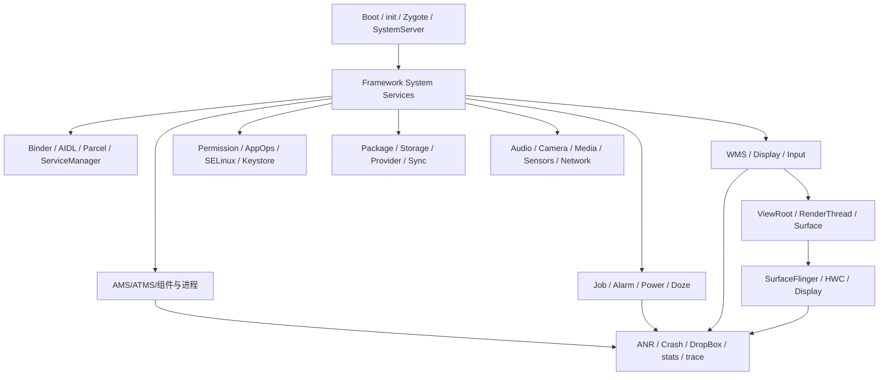
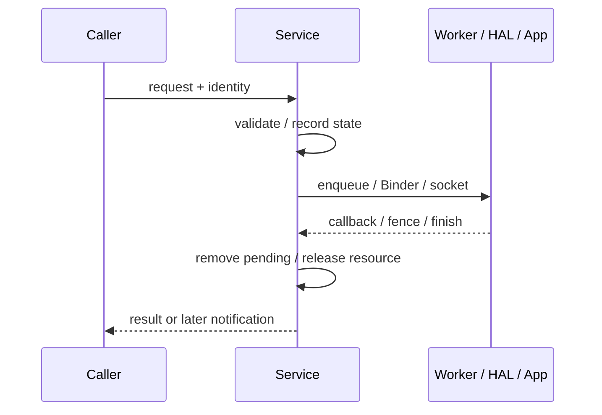

# 200 Android 源码学习二百章总复盘与后续路线

> 基线：Android 11 / API 30 / `android-11.0.0_r48`。  
> 本章是第01～199章的收束，不把“读完文档”误当成“记住整个Android”。

## 1. 到第200章真正获得了什么

这200章覆盖的不是两百个孤立知识点，而是一套看Android系统的方法：辨认进程和线程、跟踪对象与身份、重建状态机、区分控制面与数据面、找到完成协议，再用dump/trace/test验证。

## 2. Android不是一棵调用树

一次功能常同时穿过Binder、Handler、socket、共享Buffer、HAL回调和内核事件。同步调用结束后，真正工作可能刚入队；某个callback到达，也可能只表示阶段完成。

所以源码阅读应画“图”，不能只抄“函数A调用B”。

## 3. 全书总地图



模块看似分散，底层反复出现相同设计语言。

## 4. 第一阶段：先建立坐标系

第01～14章从进程、线程、Binder、Java/native/HAL/内核边界和AOSP目录开始，再沿系统启动、Activity、View/Window、Surface和包管理走第一遍主链。

这部分的目的不是深，而是以后不会迷路。

## 5. 启动主链的核心问题

Bootloader/Kernel建立硬件和内核环境，init按rc拉起关键进程，Zygote预加载并孵化Java进程，system_server集中创建Framework服务，Launcher只是系统就绪后的一个重要应用。

看到“开机失败”，先问失败发生在哪个世界建立之前或之后。

## 6. 服务并非构造完就可用

SystemService通常经历构造、`onStart()`发布Binder/Local服务、不同boot phase、用户starting/unlocking/switching等阶段。调用者还受服务发布和依赖顺序约束。

对象存在、Binder可查、功能ready是三个不同条件。

## 7. Binder专题的收获

第07及90～98章从Java接口一路深入Proxy/Stub、Parcel对象表、ServiceManager、Binder驱动事务、线程池、oneway、死亡通知、SELinux与性能故障。

核心不是背ioctl，而是识别调用身份、同步边界、线程归属与资源所有权。

## 8. 一次Binder调用的五问

1. caller pid/uid在哪里取得、是否clear identity？
2. Proxy与Stub分别在哪个进程/线程？
3. 同步还是oneway，返回值代表什么？
4. Binder线程里是否持锁或继续同步外调？
5. 对端死亡后引用、状态与回调怎样清理？

## 9. AMS/ATMS与组件专题

Activity、Service、Broadcast、Provider都不是简单“调用生命周期”。系统端维护任务、进程、连接、引用、超时和重启，客户端通过ApplicationThread接收调度。

组件代码只是一条跨进程状态机的终端。

## 10. 进程管理专题

LMKD、OomAdjuster、LRU、`appDiedLocked`、Service重启和ANR章节说明：进程重要性来自组件和依赖传播，回收来自内核压力决策，死亡后Framework还必须拆引用并选择是否重建。

“进程没了”不是生命周期分析的终点。

## 11. 后台调度专题

JobScheduler章节深入JobStore、各约束Controller、Quota、并发槽位、JobServiceContext、WorkItem、backoff、replacement、cancel和dump；Alarm章节继续拆时间、批处理、Doze、standby、投递、WakeLock与完成。

共同模型是：请求持久化→约束聚合→候选→执行→完成/重试→记账。

## 12. Job与Alarm不能互换理解

Job是带约束、可延迟的工作调度；Alarm是时间触发信号，也受批处理和空闲策略约束。Alarm触发Service/广播后，后续执行生命周期仍属于相应组件。

不要把“闹钟送达”当“业务已完成”。

## 13. 电源与显示电源专题

WakeLock、wakefulness、DisplayPowerController、DisplayPowerState、PhotonicModulator、自动亮度、环境白平衡和颜色矩阵展示了多级异步收敛。

请求状态、逻辑决策、动画值、底层面板状态和回调完成不是同一个变量。

## 14. 图形专题

从ViewRoot/RenderThread生产一帧，经过Surface/BufferQueue、SurfaceControl Transaction、SurfaceFlinger、RenderEngine/HWC、fence到present；再用VSync、刷新率、FrameInfo/TimeStats、trace和dump诊断。

图形问题必须同时跟踪Buffer所有权和时间线。

## 15. Buffer的四个问题

谁分配、谁持有slot、哪条fence保证可读/可写、何时release回生产者。把GraphicBuffer对象、native handle、slot、frameNumber和真实显存混为一谈，会产生错误结论。

## 16. “一帧完成”的多种含义

UI遍历完成、DisplayList录制完成、RenderThread提交、GPU完成、SF latch、HWC present调用和present fence signal都不同。

性能分析必须先说清采用哪个完成点。

## 17. 输入专题

第173～199章从窗口快照、InputChannel、ViewRoot输入阶段，反向深入Dispatcher、Reader、EventHub、Mapper、多指、手势、批处理、完成、取消、monitor、viewport和诊断测试。

它把硬件事件到App回执闭合成完整环。

## 18. 输入与图形如何相接

WMS/SF提供输入窗口快照，输入选择目标进入App；App处理后invalidate，请求下一帧，经RenderThread和SF显示。输入FINISHED与画面present是两套协议，只在用户体验时间线上关联。

## 19. 安全专题

权限、AppOps、SELinux、Keystore/GateKeeper、用户隔离、DevicePolicy、输入注入和secure/protected content反复说明：安全判断分布在多个层级。

Java权限通过不代表内核访问必然允许；SELinux允许也不代表Framework业务授权通过。

## 20. 存储与升级专题

分区/FBE、vold/fs_mgr、checkpoint、A/B slot、update_engine、APEX、AVB和rollback把“写入新版本”扩展成验证、激活、启动试用、健康判定、提交或回退状态机。

更新成功不是文件复制成功。

## 21. 网络与媒体等系统专题

网络、Wi-Fi、VPN、DNS、Tethering、音频、相机、Codec、蓝牙、传感器、定位、电话等章节建立了子系统入口和跨层边界。

面对具体产品问题，应在这些总览上选择一条真实场景继续纵向深挖。

## 22. 诊断与可观测性专题

Watchdog、RescueParty、Rollback、DropBox、BootReceiver、tombstoned/debuggerd、ApplicationExitInfo、ANR trace、statsd以及图形/窗口/输入trace展示“现场怎样留下”。

没有可靠证据链，复杂系统只能靠猜。

## 23. 反复出现的模式一：生产者与消费者

配置、窗口快照、Buffer、事件、Job和回调都有生产者/消费者。阅读时同时找双方：谁写字段、谁解释字段、单位和生命周期是否一致。

只读消费者容易把上游契约错误误判成当前模块bug。

## 24. 模式二：current、pending、active

Android常用current/pending/drawing/active/desired记录异步状态。它们不是冗余副本，而是跨线程、跨帧或跨硬件提交的阶段边界。

看到多个相似state，应先画转换而非急着合并概念。

## 25. 模式三：请求与完成分离

请求通过Binder/Handler/socket入队，完成通过callback、fence、FINISHED、alarmComplete或jobFinished返回。超时通常监视这段未闭合区间。



## 26. 模式四：引用计数和所有权

Provider引用、Service连接、WakeLock、Buffer slot、Input Connection、Binder death recipient都在回答“谁还需要它”。清理bug常源于重复释放、漏释放或身份匹配错误。

## 27. 模式五：代际与陈旧结果

generation、sequence、token、frameNumber、connectId、session id用于识别旧回调。异步结果回来时，当前对象可能已经替换；没有代际校验就会把旧结果写进新状态。

## 28. 模式六：快照而非实时真相

dumpsys、WMS/SF trace、窗口列表、设备列表常是分段或特定时刻快照。跨线程读取的不同段不一定全局原子。

诊断时要对齐时间，不要把两段输出强行视为同一瞬间。

## 29. 模式七：锁外调用

系统服务常先锁内更新/复制状态，再锁外调用远端或policy，避免死锁和长时间占锁。但解锁后对象可能变化，因此常配合token、generation或重查。

源码中的“锁边界”本身就是设计文档。

## 30. 模式八：权限与调用身份

Binder caller身份、package/UID映射、userId、AppOps、signature permission与SELinux共同决定能力。`clearCallingIdentity()`只改变后续Binder身份语境，不会自动使先前业务校验失效或赋予任意权限。

## 31. 怎样判断自己读懂一个模块

你应该能不用看文档回答：入口在哪个进程/线程；核心状态归谁；关键身份是什么；正常状态怎样转换；完成信号是什么；死亡/超时怎样收尾；dump/test如何证明。

背出类名但答不出这些，还没有形成可用模型。

## 32. 一页模块卡片

```text
模块/场景：
源码基线：
入口（API/Binder/socket/event）：
进程与线程：
核心对象/身份：
状态机：
数据面：
控制面：
完成/超时/死亡：
权限边界：
dump/trace/test：
仍待验证：
```

以后每读一个新模块，都可以先填这张卡。

## 33. 一次场景追踪模板

选择一个具体输入而非泛泛模块，例如“点击通知后启动Activity并显示首帧”。逐段记录通知PendingIntent→ATMS→进程/Activity→ViewRoot→Buffer→SF→present，再补输入或动画反馈。

场景能迫使分散模块连接起来。

## 34. 源码阅读的第一遍

先确定tag与产品差异；用README/Android.bp/接口找到模块边界；定位入口、核心类和dump；只画主链，不在辅助分支里迷失。

第一遍目标是正确地图，不是完整细节。

## 35. 第二遍：状态与所有权

列关键字段及谁写谁读，找枚举转换、队列进出、引用增减和token生成销毁。选择一个具体序列手工推演。

这一遍通常能发现文档最容易写错的地方。

## 36. 第三遍：异常路径

主动搜索timeout、death、cancel、abort、reset、remove、rollback、WOULD_BLOCK和错误码。检查失败发生在状态提交前还是后，资源是否仍会释放。

正常路径相似，真正体现架构的是异常收尾。

## 37. 第四遍：证据与测试

读dump、trace、EventLog/stats和测试。测试名常直接揭示维护者认为重要的不变量；dump字段说明运行时真正保留了哪些状态。

## 38. 代码摘录原则

文档只贴能证明关键结论的短片段，并解释上下文、锁、线程和版本。不要大段复制源码后不说明字段含义。

伪代码必须明确标记，不能伪装成r48原文。

## 39. 图的使用原则

跨三个以上线程/进程画时序图；状态分支画状态图；模块依赖画架构图；字段对照用表。图中标注完成反馈和异常出口，不只画向前箭头。

## 40. 版本准确性原则

每个结论绑定tag；在当前树中确认文件、符号、调用者和测试。源码里存在某个独立进程入口，不等于产品构建一定使用；新Android文档也不能直接覆盖r48实现。

## 41. 遇到矛盾怎么办

按优先级核对：当前tag实现→当前tag测试/构建文件→同版本接口注释→产品运行证据→外部资料。注释与实现冲突时应记录冲突，不擅自替实现“圆回来”。

## 42. 怎样避免越读越乱

始终维护三张表：名词表、身份/时间表、未证实假设表。新证据只更新对应项，不让同一个“完成”“窗口”“进程”在不同段落偷偷换含义。

## 43. 怎样从阅读走向修改

稳定复现，找第一处错误输出，列候选修改层，选择最小作用域，先写不变量与测试，再写概念diff；最后才在有条件的环境编译和真机验证。

当前Mac阶段停在“可审查方案”是诚实边界，不是缺陷。

## 44. 怎样复盘一次故障


复盘产物要让下一次相似问题更快，而不是只证明这次修好了。

## 45. 200章后的路线一：纵向实战

挑与工作最相关的一个场景做5～10章深挖。例如：应用冷启动首帧、触屏到显示响应、后台任务被限制、低内存进程死亡恢复、OTA失败回退。

每个场景都闭合请求、状态、完成、失败和证据。

## 46. 路线二：跨版本对照

选择Android 11与当前产品版本，对照一个专题的接口、线程、状态和测试。不要逐文件漫游；以本套笔记中的不变量为基准，标记“保持、迁移、删除、新增”。

## 47. 路线三：产品差异审计

从产品manifest、build配置、vendor HAL、overlay、SELinux和补丁栈找相对AOSP的差异。每个差异关联到一章知识地图、一个测试和一个回滚方式。

## 48. 路线四：建立个人实验库

未来具备Linux构建/设备条件时，积累小型测试：Binder death、Service重启、Job约束、Alarm完成、Buffer fence、输入CANCEL等。实验记录tag、命令、期望、实际与反例。

本次Mac上未实际编译，后续实验不要回填成“当时已验证”。

## 49. 最终复读审计

本章避免三种夸张：200章不等于覆盖AOSP所有代码；理解r48不等于自动理解所有厂商版本；源码推导不等于真机事实。真正可迁移的是阅读方法、系统不变量和证据意识。

笔记的价值也不在绝对无误，而在每个结论都能回到明确版本、源码锚点并允许后续修正。

## 50. 第200章检查题与暂停点

1. 为什么Android调用链应画成带反馈的图，而不是单向函数列表？
2. 任选一个模块，说出入口、状态、身份、完成、超时和证据。
3. “请求成功”“任务完成”“用户看到结果”通常为什么是三个时刻？
4. 下一阶段你最希望纵向深挖哪个真实场景？

第01～200章至此完成。进度文件将停在此处，等待你确认下一阶段方向；以后恢复时先读`00-学习进度.md`和本章即可。
