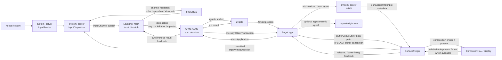
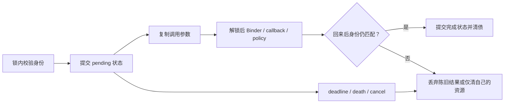

# 200 Android 源码学习二百章总复盘与后续路线

> 源码基线：Android 11 / API 30 / `android-11.0.0_r48`。
>
> 唯一主问题：前 199 章留下的知识，怎样变成一套可重复的办法——面对“用户点击图标后，目标应用迟迟没有首帧”这样的跨系统问题，能够划清边界、对齐时间、记清身份和状态、找到真正完成点、用证据定位第一处分歧，并把结论收束成最小修改与回归契约？

这不是一份模块名录，也不是“已经读完 Android”的宣言。它是一场能力验收：拿一个足够具体、又足够跨层的场景，把启动、Binder、组件、进程、输入、窗口、图形、电源、安全和诊断重新接成闭环。

除非另行标注，本章所说“存在”只表示 r48 AOSP 源树具有相应实现。产品是否把它编入、装载、启用并在某次场景中实际执行，仍须分别核对 `Android.bp`/product 配置、init rc 或 VINTF manifest、property/DeviceConfig 以及运行证据。

## 1. 二百章的成果不是目录，而是一套可验证的方法

阅读源码最容易积累的是名词：`SystemServer`、ATMS、AMS、`ActivityThread`、`ViewRootImpl`、BufferQueue、SurfaceFlinger。名词能帮助搜索，却不能单独回答现场问题。真正能迁移到陌生模块的，是下面六类问题。

| 问题 | 必须写出的内容 | 常见误判 |
|---|---|---|
| 边界在哪里 | 进程、线程、IPC、队列、Buffer、HAL 与内核边界 | 把跨边界异步工作画成同一条 Java 调用栈 |
| 这是谁的结果 | pid/uid、userId、token、sequence、generation、slot、frameNumber | 看到都叫 id 就默认能直接关联 |
| 时间能否对齐 | clock、单位、采样点、时间区间与 happens-before | 直接相减 wall、uptime、elapsed 或不同 trace 时钟 |
| 状态由谁拥有 | 写入者、读取者、锁、更新时间、失效条件 | 把 current、pending、desired 当同义字段 |
| 哪笔债真正结清 | 请求、创建、入队、执行、绘制、present、回调、清理 | 把方法返回当成业务或用户可见结果 |
| 结论凭什么成立 | 当前 tag 源码、构建条件、测试、dump、日志、trace、设备实验 | 用源码可能路径冒充本机实际路径 |

这六类问题可以压成一句工作定义：

> 读懂一个 Android 场景，就是能说明某个有身份的工作，如何跨过明确边界，在状态所有者处留下债务，再由匹配的完成信号或异常清理把债务关闭；每一步都有与结论强度相称的证据。

因此，学习成果有三个层级：

1. **认识**：知道类、文件、接口和主路径在哪里。
2. **解释**：能说清线程、身份、状态、完成和失败边界。
3. **改变**：能找到第一处错误输出，选择作用域最小的修改层，并设计能杀死错误实现的测试。

前 199 章提供大量局部模型；第 200 章要做的是把局部模型装进同一套推理协议。

各专题在这里不再按类名排队，而是被压回同一组问题：

| 前序主题 | 留下的可迁移模型 | 在毕业场景中的位置 |
|---|---|---|
| Boot / init / Zygote / SystemServer | 世界建立顺序、服务发布与 ready 分层 | 点击成立前的系统坐标 |
| Binder / 组件 / 进程管理 | caller 身份、IPC 语义、生命周期与死亡清理 | Launcher 请求到目标进程和 Activity |
| Job / Alarm / Power | 约束、时间门、资源持有与独立完成债 | 首屏业务的条件分支 |
| WMS / Display / 图形 | 窗口状态、Buffer 所有权、fence 与 present | Activity 从“运行”变成“可见” |
| Input | 原始事件、窗口快照、目标 connection 与 FINISHED | 场景的物理入口 |
| Permission / AppOps / SELinux / 多用户 | 分层授权、身份切换与隔离 | 每个跨边界入口的门 |
| Package / Storage / Upgrade | 安装身份、数据可用与条件化提交/恢复 | 解析、解锁和产品差异分支 |
| Network / Media / Sensor | HAL、socket、callback 与资源状态 | 业务首屏可能依赖的外部执行者 |
| ANR / Crash / DropBox / trace / stats | 现场证据的生产、保存、裁剪与上限 | N/X 对照和第一处分歧 |

## 2. 用“点击启动到首帧可见”定义毕业场景与完成点

先固定场景，避免“启动慢”在讨论中不断换含义。

**共同前提**

- 源码和符号判断只针对 `android-11.0.0_r48`。
- 设备已开机、当前用户已解锁、Launcher 可交互、目标 Activity 可解析。
- 点击前目标应用进程不存在，因此需要冷启动。
- 起点是这次点击对应的输入流进入 Android 输入系统；终点是目标应用某个首帧 Buffer 与平台可观察的 present 边界对齐。
- “首帧”不自动等于“业务内容完整”。应用显式调用 `reportFullyDrawn()` 是另一份信号。

**正常样本 N**

- 在为同一产品、设备和场景约定的预算 T 内，能够把目标应用 Buffer 的局部身份对齐到一次平台可观察的 present 边界。
- 重复采样得到可解释的正常区间，而不是只保留一次最快值。

**异常 X**

- 共同前提不变，但目标完成点显著偏离 N 的区间，或到预算 T 结束仍缺失。

仅说“X 慢”还不能定位。先把沿途检查点拆成四条偏序分支：

| 点位 | 可回答的问题 | 不能顺带证明的事 |
|---|---|---|
| I0：EventHub 读到事件 | 内核输入已进入用户空间读取路径 | 已映射成正确逻辑设备和坐标 |
| I1：Reader 产出通知 | Mapper 已把原始事件解释成逻辑输入 | Dispatcher 已选中 Launcher 窗口 |
| I2：Dispatcher publish 成功 | InputPublisher 已把消息写入目标 connection 的 channel | Launcher 已取出并处理，或点击回调已执行 |
| I3：输入 FINISHED | App 输入接收端已为该投递回执 | `OnClickListener` 已发起并完成启动 |
| A0：ATMS 内部启动决定 | 解析、权限、任务选择已产生处置，并可派生进程请求 | Launcher 已收到同步 reply、目标进程已 fork |
| AR：Launcher 收到启动结果 | 同步 Binder 请求的结果码已回到调用者 | 目标进程已 attach、Activity 已创建 |
| A1：进程 attach | 新进程已向 AMS 建立应用线程能力 | 目标 Activity 已执行 `onCreate()` |
| A2：客户端事务执行 | `LaunchActivityItem` 与目标生命周期项已进入客户端执行 | 窗口已画出或 Buffer 已 present |
| G0：WMS 收到 finish drawing | 客户端报告本轮绘制完成，窗口状态可继续推进 | 该 Buffer 已被 SurfaceFlinger 合成并显示 |
| G1：目标 Buffer 与 present 边界对齐 | 目标 layer/frame 已对齐到成功 HWC present，并在有效且可靠时得到 fence 时间 | 整屏像素已经物理显示，或业务页面已“完全可用” |
| B0：应用报告 fully drawn | 应用声明其定义的完整绘制点已到达 | 用户一定感知流畅，或所有异步业务都结束 |

这里最重要的结论有两个。

第一，这些点不是 I0→B0 的全序。输入分支有 I0→I1→I2→Launcher dispatch→I3；同一个 Launcher dispatch 还可能走 click→A0，但 View 可以在当前路径执行 click，也可能把动作 post，因此 I3 与 A0 没有全局固定先后。ATMS 内部 A0 决定再分出“同步 reply→AR”和“异步进程请求→A1→A2”两支；AR 与 A1/A2 的现场观测时刻也可能交错，除非 trace 已证明，不能互相充当 L/F。A2 后的客户端绘制同时产生 WMS 报告分支 G0 和 Buffer→SurfaceFlinger→present 分支 G1，二者也不能只按标题编号推断先后。B0 是应用可选的业务语义信号，不是 G1 的系统强制后继。

第二，整条链没有一个天然贯穿的万能 correlation id。输入 sequence、Activity token、进程 `startSeq`、窗口 token、Buffer slot 和 `frameNumber` 各管一段。端到端关联依赖局部身份映射加时间线，而不是寻找一个神奇字段。

后文所有方法都用 N/X 这对样本和 I/A/G/B 四组点位验收。只有源码或 trace 已证明的因果边，才允许参与“最后正确点/第一处分歧”的排序。

## 3. 总地图按进程、线程和三条链组织，而不是按专题堆模块

Android 不是一棵从 API 向下展开的调用树。更接近真实情况的画法，是同时保留三条链：

- **请求链**：输入或 API 请求向工作执行者前进。
- **控制与状态链**：窗口快照、权限、进程状态、配置和调度条件决定请求能否以及如何前进。
- **完成反馈链**：reply、callback、FINISHED、fence、timeout 和 death 把未完成工作结账。



这张图仍是压缩模型，不能被误读成所有箭头都同步，也不能把同一参与者框中的工作当成同一线程：

| 参与者 | 至少要区分的执行上下文 |
|---|---|
| system_server 输入侧 | InputReader 线程、InputDispatcher 线程、Java policy/IMS 调用路径 |
| Launcher | Binder 线程、主 Looper、View 输入阶段、可能被 post 的点击动作 |
| ATMS/AMS/WMS | Binder 入口、持全局锁区域、Handler/动画等后续线程 |
| 目标应用 | Binder 线程池、`ActivityThread` 主线程、RenderThread |
| SurfaceFlinger | Binder 接收、主合成调度、渲染/HWC 相关执行路径 |

在常规 r48 系统路径里，`InputManagerService` 经 JNI 创建 native InputManager，Reader/Dispatcher 线程运行在 `system_server` 进程内。源码树同时存在可承载 inputflinger 的 host 入口，不等于任一产品都把它拆成独立进程。

如果图里只有向前箭头，就看不见“谁还在等”；如果图里没有锁和快照，就看不见“为什么同一时刻两边状态不同”；如果图里没有异常出口，就无法解释 ANR、进程死亡或陈旧回调。

## 4. Boot 与 SystemService readiness 为场景建立前置坐标

毕业场景从点击开始，但点击能成立，依赖更早完成的坐标系：内核输入设备可读、`system_server` 已运行、关键系统服务已发布、用户与包状态可用、显示和窗口系统能工作。

Android 11 的 `SystemService` 把系统服务生命周期显式拆成 `onStart()`、boot phase 与用户生命周期回调。以 ATMS 为例，`ActivityTaskManagerService.Lifecycle` 是 `SystemService` 包装层；这不意味着构造出 ATMS 对象的瞬间，所有依赖都已可用。

应把“服务起来了”拆成至少五个问题：

| 阶段 | 需要确认的事实 | 典型证据 | 仍不能证明 |
|---|---|---|---|
| 对象已构造 | Java/native 对象存在 | 构造路径、字段初始化 | Binder 客户端能查到 |
| 能力已发布 | Binder 或 LocalService 已注册 | `onStart()`、publish 调用 | 下游依赖已 ready |
| boot phase 已到 | 服务收到目标阶段 | `startBootPhase()` 与 `onBootPhase()` | 当前用户数据已解锁 |
| 用户状态已到 | starting/unlocking/unlocked 等回调已处理 | 用户生命周期实现与状态字段 | 设备/HAL 当前健康 |
| 运行时 ready | 现场满足服务自己的门槛 | dump、日志、trace、设备探针 | 后续每个请求都会成功 |

`SystemService.PHASE_ACTIVITY_MANAGER_READY` 和 `PHASE_THIRD_PARTY_APPS_CAN_START` 是阶段标记，不是“所有应用已经完成启动”的承诺。阶段值也不能脱离当前 tag 的调用位置解释。

对 I/A/G/B 场景，这一节的作用不是把 Boot 全链再讲一遍，而是记录前置假设。若 N 成功而 X 发生在同一次开机的同一用户会话中，某些全局前置条件可以暂时降权；若故障只在首轮解锁前后发生，用户生命周期与服务阶段必须重新进入候选集。

## 5. Input、窗口快照与安全规则决定请求从哪里开始

一笔触摸进入系统后，至少经过五个阶段：

1. EventHub 从 evdev 读取 `RawEvent`；读取批次不等于一帧触摸语义。
2. InputReader 与具体 Mapper 在 `SYN_REPORT` 等边界上解释设备协议，产出通知参数。
3. WMS 把 InputWindowHandle 等输入元数据放入 SurfaceControl 事务；SurfaceFlinger 根据已提交的 Layer drawing state 生成 InputWindowInfo 列表并交给 InputFlinger。
4. InputDispatcher 结合自己已接收的窗口快照、焦点和触摸状态，构造目标与每条 connection 的投递项。
5. Launcher 的 `ViewRootImpl` 经输入阶段把事件交给 View 层，并最终对该 native 投递发送 FINISHED。

这里有三类状态源，不能揉成“InputManager 当前状态”：

| 状态源 | 主要所有者 | 更新节奏 | 诊断风险 |
|---|---|---|---|
| 设备与 Mapper 状态 | EventHub / InputReader | 设备扫描、原始事件帧、配置刷新 | 设备存在不等于事件值正确 |
| 输入窗口与显示映射 | WMS 提交元数据，SurfaceFlinger 汇总，Dispatcher 消费 | SurfaceControl 事务提交与输入窗口同步路径 | Dispatcher 使用的是已接收快照，不是 WMS 此刻对象 |
| 每手势/每连接状态 | Dispatcher / Connection | 每个 entry、目标选择、publish、回执 | TouchState、InputState 与 App 收尾时刻不同 |

命中 Launcher 窗口还要经过权限与策略边界。窗口是否可触、遮挡规则、显示映射、InputFilter 与 policy 拦截属于不同层；注入权限只在带 injection state 的注入分支参与，物理触摸不靠它获得资格。某一层放行不代表其他层必然放行。

I3 也需要收窄：FINISHED 关闭的是一次 InputChannel 投递账。它的 handled 位描述 App 输入管线对事件的处理结果，不承诺业务点击动作已经完成。View 的点击可能在当前处理路径执行，也可能因具体交互分支被 post；因此不能建立“FINISHED 一定晚于 `startActivity()`”这样的全局时序假设。

对 N/X，输入侧最有价值的问题不是“有没有 touch 日志”，而是：

- N 与 X 是否属于同一物理/逻辑设备身份？
- ACTION_DOWN 到 ACTION_UP 的手势状态是否连续？
- Dispatcher 是否在相同窗口快照上选择了相同 token？
- publish 是否成功，目标 connection 是否积压？
- 对应 dispatch sequence 是否收到 FINISHED？
- 如果 I3 相同，第一处分歧是否已经移动到 Launcher 业务与启动请求之后？

输入完成与首帧 present 是两份独立协议。它们只能通过场景时间线联系，不能互相替代。

## 6. Binder、ATMS/AMS 与 Zygote 把点击变成运行中的 Activity

Launcher 发起启动后，请求跨 Binder 进入 ATMS。阅读这段路径时，先回答一次 Binder 调用的五问：

1. 调用者 pid/uid 在哪里读取，`callingPackage` 又怎样校验？
2. Proxy、Stub 与业务实现分别处于哪个进程和线程？
3. 当前事务是同步还是 oneway，返回值只承诺到哪里？
4. 是否在持锁区域继续调用远端、policy 或其他服务？
5. 对端死亡、超时或请求被替换时，哪一方清理状态？

对 `startActivity()`，同步 Binder 返回的是系统对启动请求的结果码。它可以说明解析、权限、后台启动规则和任务选择等系统端决策走到了某个结果，却不等于目标进程已启动，更不等于 `Activity.onCreate()` 或首帧完成。A0 是服务端产生处置并可派生 spawn 请求的点，AR 才是 Launcher 观察到 reply；两者不能和异步进程分支揉成一个时间戳。

冷启动还要经过一段独立的进程账：

```text
ATMS 决定目标 Activity
    ↓ 需要目标进程
AMS / ProcessList 建立 ProcessRecord 与 pending start
    ↓ 携带 startSeq 请求 Zygote
Zygote fork 后分成可竞跑的 parent / child 两支
    ├─ parent：经 socket 返回 pid
    │      ↓ system_server 匹配 startSeq、移除常态 pending entry、校验后登记 pid
    └─ child：specialize → RuntimeInit → ActivityThread.main()
           ↓ 应用以 IApplicationThread、startSeq 调 attachApplication
AMS 按 pid、callingUid、startSeq 核对 ProcessRecord
    ↓ 两支状态汇合，进程具备客户端调度能力
ATMS 为 Activity 组织 ClientTransaction
    ↓ IApplicationThread.scheduleTransaction()
客户端主线程执行 LaunchActivityItem 与生命周期项
```

`ProcessList.mProcStartSeqCounter`、`ProcessRecord.startSeq` 与 `mPendingStarts` 保护的是进程启动这一局部异步协议。常态下 fork 结果由 `handleProcessStartedLocked()` 匹配后就移除对应 pending start；`attachApplicationLocked()` 再按 pid、callingUid 与保留在 ProcessRecord 上的 `startSeq` 核验。只有进程先 attach、服务端尚未来得及登记 fork 结果的竞态，attach 路径才回查 `mPendingStarts`。这些键不是 Activity token，也不是输入 sequence。

应用 attach 后，`ActivityStackSupervisor.realStartActivityLocked()` 构造含 `LaunchActivityItem` 的 `ClientTransaction`，再设置期望生命周期项。Android 11 的 `IApplicationThread` 整体是 oneway AIDL 接口，所以“事务已 schedule”不能当成客户端已经执行。客户端由 `TransactionExecutor` 驱动 `ActivityThread.handleLaunchActivity()`，后者再进入 `performLaunchActivity()` 创建 Activity 与调用生命周期。

这一段常见的错误串联是：

> `startActivity()` 返回成功 → 进程已启动 → `onCreate()` 已完成。

正确写法是三笔不同的债：

- 启动请求债由 ATMS 的结果码处置；
- 冷进程启动债由 pid/startSeq/attach 协议推进；
- Activity 客户端事务债由 oneway 调度与后续生命周期报告推进。

任何一笔都可能先于下一笔很久完成。

这套边界也不能粗暴套给四大组件。Activity 生命周期在 r48 主要经 `ClientTransaction`/`IApplicationThread` 调度；Service 与 Broadcast 也经 `IApplicationThread` 进入 `ActivityThread`。Provider 的安装与发布参与进程协作，但后续 CRUD 通常经 `IContentProvider`/`ContentProvider.Transport` 直接落到 Provider 进程的 Binder 线程。组件共享进程管理背景，不共享一条客户端线程和完成协议。

## 7. ViewRoot、BufferQueue 与 SurfaceFlinger 把首帧变成 present

Activity 创建和 resume 仍不是像素可见。窗口与图形链还要继续：

```text
Activity / PhoneWindow / DecorView
    ↓ WindowManagerGlobal.addView()
ViewRootImpl.setView() 与 IWindowSession.addToDisplayAsUser()
    ↓ scheduleTraversals()
Choreographer 回调进入 performTraversals()
    ↓ measure / layout / draw
软件或硬件渲染路径生产 Buffer
    ↓ dequeue / render / queue + fence
BufferQueue 消费侧可获取新 Buffer
    ↓ SurfaceFlinger latch / compose
HWC present
    ↓ present fence / 帧时间反馈
```

“首帧完成”必须选择层级：

| 层级 | 代表动作 | 所有者视角 | 不是 |
|---|---|---|---|
| traversal requested | `scheduleTraversals()` | App 已请求未来一次遍历 | 遍历已运行 |
| traversal executing | `performTraversals()` | App 主线程执行 measure/layout/draw 协调 | GPU 已完成 |
| client draw report | `reportDrawFinished()` / `finishDrawing()` | App 向 WMS 报告绘制阶段完成 | 显示硬件已 present |
| Buffer queued | producer `queueBuffer()` | 生产者把填充后的 slot 交还队列 | SF 已 acquire 或 latch |
| Buffer latched | SurfaceFlinger latch | SF 选取 Buffer 进入合成状态 | HWC 已显示 |
| display submitted | `presentDisplay()` / `presentAndGetReleaseFences()` 成功返回 | 本轮已验证的显示状态已提交给显示管线 | present fence 已 signal，或整屏已扫描完成 |
| display feedback | 有效且可靠的 present fence signal；无有效 fence 时仅记录明确标注的降级时序 | 物理屏在目标 vsync 开始显示本帧结果，或开始向 panel memory 传输 | 整屏已扫描完成；未做 layer/frame 对齐时也不能证明目标 Buffer 属于该帧 |

Buffer 的身份也不能简化成“那张图”：

- `GraphicBuffer` 对象、native handle 与底层分配不是同一个身份层。
- slot 是一条 BufferQueue 连接内的槽位，不是全局编号。
- `frameNumber` 在相应生产/消费时间线中递增，不能和输入 sequence 比较。
- acquire fence 约束消费者何时可读，release fence 约束生产者何时可再次安全使用；present fence 又属于显示提交时间线。

图形侧至少还有两条不能串成固定直线的输入：传统 BufferQueueLayer 的 dequeue/queue Buffer 是数据链，`SurfaceControl.Transaction` 是图层属性与控制状态链；BufferStateLayer 场景还可随事务携带 Buffer 状态。两条链在 SurfaceFlinger 的 layer 状态与合成阶段汇合；SurfaceFlinger 按 layer 与本帧策略安排 HWC device composition、RenderEngine client composition，二者可在同一 display frame 中并存，最后由 Composer HAL 执行 present。

WMS 的 `finishDrawing()` 允许窗口状态从“等待客户端绘制”继续推进，但不替代 SurfaceFlinger 的 latch 与 HWC present 证据。反过来，看到某次全局 present fence 也不能自动证明目标应用 Buffer 就在那一帧；还需用 layer、Buffer/`frameNumber` 与时间把两段对齐。

present fence 也不是“用户已经看完整屏像素”的绝对时刻。r48 HWC2 契约把它约束在显示开始该帧的边界：video-mode 面板对应目标 vsync 开始显示，command-mode 面板对应开始把帧传入 panel memory。HAL 还可以声明 `PRESENT_FENCE_IS_NOT_RELIABLE`，返回的 fence 也可能无效；`BufferLayer::onPostComposition()` 在没有有效 fence 时会退化到 `HWComposer::getRefreshTimestamp()`，该值还可能根据最近 vsync 推算，只能算降级时序证据。`Display::presentAndGetFrameFences()` 调用 HWC 后仍会读取 last present fence，因此 fence 对象单独出现也不证明本轮 present 成功。只有同时核对 HWC 调用状态、capability、fence 有效性，以及 layer/Buffer/frame 映射，才可把 signal 时间用作 G1。

这正是 G0 与 G1 必须分开的原因；表中的细分动作只解释图形局部链，不再另造一套全局编号。

## 8. Job、Alarm、电源、存储、网络与媒体作为条件分支接入

总复盘不需要把每个专题硬塞进点击主链。更有效的方式，是问它是否构成当前场景的前置条件、并行条件或业务依赖。

| 子系统 | 可能怎样影响毕业场景 | 自己的请求点 | 自己的完成点 |
|---|---|---|---|
| JobScheduler | App 把关键数据错误地留给尚未满足约束的 Job | schedule 登记请求；仅 persisted Job 可由 JobStore 落盘 | start/stop acknowledgement、`onStartJob()` 返回、`jobFinished()` 或停止清理 |
| AlarmManager | 用时间信号触发预热或刷新 | alarm 被登记 | PendingIntent send-finished 或 listener `alarmComplete()` 清投递账 |
| Power / Doze | CPU、显示或后台执行门改变时序 | acquire/状态请求 | 持有状态、释放或状态收敛；不等于任务结果 |
| Package / Storage | 包解析、CE 数据、FBE 解锁或升级状态阻断启动 | 安装、挂载、更新请求 | 验证、激活、健康提交或回退各有独立点 |
| Network / DNS | 首屏同步依赖网络导致业务内容迟到 | socket/API 请求 | 响应或失败；不等于窗口首帧 |
| Media / Camera / Sensor | Activity 首屏依赖设备资源或 HAL 回调 | open/configure/start 请求 | 对应 callback、fence 或状态；不等于 Activity fully drawn |

Job 和 Alarm 尤其不能互换：

- Job 表达“满足约束后执行一段工作”，有 pending、约束、active、stop、reschedule 等账。
- Alarm 表达“在时间策略允许时发出一次信号”，受 batching、idle 和 standby 等规则影响。
- Alarm 触发 Broadcast 或 Service 后，组件后续完成属于组件自己的协议。
- JobService 的 `jobFinished()` 只结清那次 Job 执行，不会替应用首屏或网络请求结账。

Alarm 的 in-flight 账会随投递形态由 PendingIntent 的 send-finished callback 或 listener 的 `alarmComplete()` 收束；Job 还要区分启动/停止确认、`onStartJob()` 的返回值和稍后的 `jobFinished()`。它们都不是单一万能完成点。

WakeLock 也是资源所有权，不是业务成功标志。持有它只改变相应 level/flag 定义的电源约束：常见的 PARTIAL_WAKE_LOCK 用来阻止 CPU suspend，其他级别还可能影响显示；泄漏会延长资源占用，过早释放可能让后续工作失去假设，但它本身不告诉你工作内容是否正确。

把这些专题作为分支接入后，问题会变得清楚：只有当 N/X 的第一处分歧指向某个分支，才沿该分支纵向追踪；否则保留为已排除条件，不让名词数量淹没主线。

存储与升级也必须按产品条件拆开：FBE/vold/fs_mgr、A/B 或 Virtual A/B/update_engine、staged APEX、AVB 与 RollbackManager 各有自己的状态和完成协议。只有产品配置、底层能力和具体安装会话启用相应机制时，才存在对应的试启动、健康判定、提交或回退步骤。

## 9. 生产者、消费者与多份快照解释状态从哪里来

Android 中大量“同名但不同步”的状态，来自生产者和消费者分离。一个模块写出控制状态，另一个模块在自己的线程和时机消费；中间可能复制、序列化、过滤、合并或丢弃陈旧版本。

| 生产者 | 传递物 | 消费者 | 局部身份/时序依据 |
|---|---|---|---|
| WMS 经 SurfaceControl/SF | 已提交的输入窗口信息与显示属性 | InputFlinger / InputDispatcher | token、displayId 与观测时刻；没有通用窗口 generation |
| ATMS | ClientTransaction | 目标应用主线程 | activity token 与收发/执行观测顺序；没有通用 transaction sequence |
| App producer | `BufferItem`；BLAST 下再转为带 buffer/acquire fence 的 `SurfaceControl.Transaction` | BufferQueueLayer consumer；或 BLASTBufferQueue → BufferStateLayer | queue identity、slot、producer frameNumber；layer id、SF frameNumber、fence/callback |
| 各约束 Controller | Job 约束变化 | JobScheduler 核心调度 | JobStatus 身份、变更时刻 |
| DisplayPowerController | 期望显示状态 | 动画、PhotonicModulator、底层显示 | pending/current 与 clean 回调 |
| 配置/overlay | 资源与设备策略 | Framework/HAL/Mapper | 文件选择、generation、重载时机 |

看到 `current`、`pending`、`active`、`desired`、`drawing` 时，不应凭英文词义猜状态。对每个字段都要写：

1. 谁在什么线程写？
2. 谁在什么锁下读？
3. 值是引用同一对象，还是复制出的快照？
4. 什么事件把 pending 提升为 current？
5. 新 generation 到来时旧结果如何作废？
6. dump 打印的是哪一份，是否与别的段落原子一致？

快照不是缺陷，而是跨线程设计的常见代价。真正的缺陷通常出现在契约破裂处：生产者漏发更新、消费者未唤醒、generation 未校验、字段单位变化、或清理只改了其中一份状态。

对点击首帧场景，WMS 当前窗口树、Dispatcher 已接收窗口快照、App 本地 View 树、SurfaceFlinger drawing state 可能处于四个不同时刻。把它们强行描述成“此刻的窗口状态”，会制造不存在的矛盾。

## 10. 身份、所有权、权限与 generation 解释结果属于谁

跨系统排障时，身份表应先于调用图。因为相邻模块经常用不同键表达“同一段工作”，而相同数值也可能只是巧合。

| 身份域 | 代表键 | 作用域 | 生命周期结束条件 |
|---|---|---|---|
| Linux 执行实例 | pid、tid | 一次进程或线程实例 | 进程/线程退出；数值以后可能复用 |
| Binder incoming caller | callingPid、callingUid | 当前 Binder 处理线程的传入调用者语境 | 事务退出，或 clear 暂时切换语境 |
| Binder 身份保存点 | `clearCallingIdentity()` 返回的不透明 token | 当前线程一次 clear/restore 配对 | `restoreCallingIdentity()`；它不是 uid |
| Android 用户与包 | uid、userId、appId、packageName | 安装与多用户命名空间 | 包/用户关系变化；不随单次进程结束 |
| 组件与窗口 | Activity token、window token、input token | 三类不同关系，经显式映射相连 | 各自的 finish、remove、death 或替换 |
| Pending spawn entry | `mPendingStarts[startSeq]` | Zygote 请求到 parent 侧 pid 结果处理；也供 attach-first 竞态回查 | fork 结果处理移除；默认异步启动的异常分支也移除，其他配置分支须另行核对；晚到结果还可能被判陈旧 |
| 进程启动代际 | `ProcessRecord.startSeq` | ProcessRecord 最近一次启动，跨过 pid 结果并用于 attach 校验 | 后续启动重置/替换或 ProcessRecord 清理 |
| 运行进程 | pid、ProcessRecord | 一次进程实例及系统端记录 | 进程死亡并完成相应记录清理 |
| 输入设备 | EventHub/Reader deviceId、descriptor | 各自设备注册表与配置选择 | 设备移除或重新打开；两套 id 仍须映射 |
| 输入事件 | event id、action、downTime/eventTime | Reader/Dispatcher 队列中的一笔逻辑事件 | entry 被消费、丢弃或回收；不等于目标投递结账 |
| 输入投递 | native dispatch seq、Java seq | 一个 connection 到客户端 receiver 的 publish/finish 映射 | FINISHED 或清队列的 teardown；CANCEL 是另一事件，不直接关闭旧 wait |
| 图层与队列 | layer identity、BufferQueue connection | 一个 layer 或 producer/consumer 连接 | layer 销毁或 queue disconnect |
| Buffer 使用与顺序 | slot、frameNumber、fence | 一条 BufferQueue/Layer 的局部时间线 | slot release/reallocation、disconnect；编号不可跨队列比较 |

**身份不是权限。** Activity token 能找到对象，不代表调用者可操作它；packageName 是声明数据，不代替 UID 校验；SELinux 允许 Binder 或设备节点访问，也不代替 Framework permission、AppOps、用户隔离和业务规则。

**权限也不是所有权。** 有权发起请求，不代表持有目标资源；拿到一个 Binder 引用，也不代表远端不会死亡；持有 Buffer slot，则必须遵守该队列的状态与 fence 协议。

**generation 是时间化身份。** 异步结果回来时，名字相同的对象可能已换代。常见保护方式包括：

- 递增 sequence 与 pending map 匹配；
- token 对象身份重查；
- callback 携带 generation 或 request id；
- 在锁外调用返回后重新确认当前对象；
- 旧连接、旧窗口或旧进程的回调只清理自己的债。

`Binder.clearCallingIdentity()` 重置当前 Binder 处理线程上的 incoming caller identity，直到配对的 restore。它不会改变进程 Linux UID 或 SELinux domain；clear 前已复制到局部变量的 caller pid/uid 也不会随之改写。clear 之后再调用 `Binder.getCallingPid()`/`getCallingUid()`，看到的是本进程身份，所以依赖原 caller 的鉴权必须在 clear 前完成，或显式保存并传递原值；这仍不会自动绕过独立的业务或 AppOps 校验。

当 N 与 X 无法关联时，不要先扩大日志量。先问：是不是用 Input seq 去找 Activity token、用 pid 去跨进程重启、或用 slot 去跨 BufferQueue？修正身份域往往比增加十条打印更有效。

时间戳也有作用域。wall clock、uptime、elapsed realtime、native monotonic 和 trace packet 中的时间，只有在确认 clock、单位与转换关系后才能相减；是否计入 suspend 也要按具体 API 核对。跨进程日志的打印顺序不是 happens-before，异步队列中的源码顺序也不是运行时先后。最稳妥的做法，是在每个局部身份旁记录“由谁在何处取时”，再用统一 trace 时钟或经验证的映射连接区间。

## 11. 请求、完成、超时、死亡与锁外回调解释何时闭环

可以把每次异步工作写成一条“完成债务”：

```text
Debt {
    key:         这笔工作的局部身份
    createdAt:   请求被接受或状态被提交的时刻
    owner:       谁保存未完成状态
    executor:    谁实际执行
    settlement:  哪个 callback / FINISHED / fence / reply 结账
    deadline:    谁从何时开始计时
    cleanup:     timeout / death / cancel / replacement 如何释放状态
}
```

毕业场景里至少有这些互不替代的债：

| 债务 | 建账 | 正常结账 | 异常出口 |
|---|---|---|---|
| 输入窗口投递 | Dispatcher 为 connection 建 DispatchEntry | App 返回 FINISHED，Dispatcher 移除相应等待项 | 断连/移除可清队列；ANR 标记 unresponsive 并可能合成 CANCEL，但不直接清原 wait 项 |
| 启动请求 | ATMS 接收并执行启动决策 | 同步结果码返回调用者 | 安全拒绝、解析失败、后台启动限制 |
| 进程 spawn | ProcessList 建 pending start 与 `startSeq` | fork 结果按 `startSeq` 匹配，pending start 被移除 | fork/参数失败、结果陈旧或被新启动取代 |
| 应用 attach | AMS 保留 ProcessRecord 的 pid/startUid/`startSeq` 预期 | `attachApplication()` 通过身份匹配并推进绑定 | 错 pid/callingUid/`startSeq`、进程先死、PROC_START_TIMEOUT |
| 客户端生命周期事务 | system_server schedule `ClientTransaction` | 没有通用 transaction ACK；须分别选择 item 执行探针及目标生命周期自己的 report/state transition | send 端 RemoteException 只说明提交失败；已提交后还要分别处理进程死亡或生命周期替换 |
| 窗口首绘 | WMS 等待客户端绘制 | `finishDrawing()` 推进窗口状态 | relayout/remove/death/超时策略 |
| Buffer 使用 | producer dequeue/queue，consumer acquire | release fence 与 slot 状态允许复用 | disconnect、abandon、错误 fence |
| 显示 present | SF/HWC 提交显示 | HWC status 成功且目标 layer/frame 已映射时，有效且未声明不可靠的 present fence 提供平台边界 | HWC error、fence 无效/不可靠、帧被替换 |

超时证明的是“某个观察者等太久”，不自动证明执行者是根因。Input ANR 可能来自 App 主线程、Binder 依赖或系统调度。r48 的 `PROC_START_TIMEOUT` 在 system_server 收到并登记 pid 后才开始等待 attach；它不覆盖等待 Zygote fork/pid 结果本身，但子进程后续的 specialize、运行时初始化与 attach 前路径仍可能消耗这段时间。应从超时所监视的 debt 反向找最后正确点。

死亡也不是一种统一完成：

- 同步 Binder 调用可能先得到 `DeadObjectException`；
- death recipient 是能力死亡的另一路通知；
- system_server 仍需清理 Activity、Service、Provider、window、input channel 等自己的引用；
- 业务是否重启、重试或丢弃由各自策略决定。

系统服务常在锁内更新或复制状态，再锁外调用远端或 policy，以减少死锁和重入风险。但锁外返回时世界可能已变化，所以必须检查后续是否还要把结果提交到可能换代的当前状态；若要提交，就应以 generation/token 或等价条件重验。没有后续状态提交的 fire-and-forget 路径不必机械添加同类检查。



## 12. dump、日志、trace 与测试把源码判断变成证据

证据强度必须和结论强度匹配。建议给每条笔记标注四种认识状态：

- **observed**：在指定设备、构建、时间窗口里直接观察到。
- **derived**：能由当前 tag 源码和明确前提推出。
- **inferred**：最能解释现象，但仍有竞争假设。
- **unavailable**：当前环境没有所需构建、设备、trace 类别或版本树。

| 证据 | 最适合证明 | 主要上限 |
|---|---|---|
| 当前 tag 源码 | 某实现可能路径、锁、字段与异常分支 | 不证明产品构建采用该路径 |
| Android.bp / 产品配置 | 模块、依赖、编译条件与是否纳入产品 | 不证明运行时走到 |
| 当前 tag 测试 | 维护者编码的不变量和可构造边界 | 不证明目标设备配置与时序 |
| dump | 某次采集附近仍保留的状态 | 常非全局原子；历史可能有限 |
| 日志 / EventLog / stats | 被埋点路径的离散事件 | 无日志不等于没有执行 |
| Perfetto / 专项 trace | 跨线程时间线与 slice/counter 关系 | 未开启类别、缓冲覆盖会造成空白 |
| 设备实验 | 该 build、硬件和复现条件下的事实 | 不能自动推广到所有版本与产品 |

源码锚点应写到“文件 + 符号 + 语义”，而不是只贴长代码：

```text
frameworks/base/core/java/android/view/ViewRootImpl.java
  scheduleTraversals(): 建立未来遍历请求
  performTraversals(): 执行视图与窗口协调
  reportDrawFinished(): 通过 IWindowSession 报告客户端绘制

frameworks/native/libs/gui/Surface.cpp
  queueBuffer(): producer 把 slot 与 fence 交回 BufferQueue

frameworks/native/services/surfaceflinger/SurfaceFlinger.cpp
  latchBuffer 调用点与 present fence 处理：属于后续合成/显示时间线
```

这三段锚点能证明源码中存在三类阶段，不能单独证明某次 X 已到哪一段。要判断现场，需要同一复现窗口的 trace、dump 或定向探针。

另一个常见陷阱是把多份 dump 拼成“一次原子快照”。例如输入、窗口、Activity 与 SurfaceFlinger dump 由不同服务、不同锁生成；即使同一个脚本连续采集，中间状态也可能推进。正确做法是记录采集起止、使用稳定身份关联，并把不一致先视为时间差假设。

当前工作区适合做源码、测试与构建描述的只读验证；没有设备结果时，相关格必须写 `unavailable`，而不是补出想象中的日志。

## 13. 正常/异常对照与第一处分歧缩小故障候选

诊断不是从最醒目的错误向外发散，而是让 N 与 X 经过同一组点位。在同一条因果有序分支，或已由源码/trace 证明的 happens-before 边上，再找：

- **L：最后一个两者都正确的边界**；
- **F：紧随其后的第一个不同或错误的边界**。

候选范围先收敛到 L→F，而不是整个 Android。

| 观察结果 | 最早可降权的范围 | 下一份最有区分力的证据 |
|---|---|---|
| N/X 都有相同 I3 输入回执，只有 X 未发启动 Binder | EventHub→Launcher 输入投递主链 | Launcher 主线程 slice、点击回调与 Intent 构造 |
| 两者 A0/AR 结果相同，X 的 `startSeq` 长时间未 attach | 启动解析与任务选择 | ProcessList/Zygote/attach 时间线 |
| X 已 attach，但无客户端 launch 执行 | fork 与基础 attach | IApplicationThread transaction、主 Looper 堵塞 |
| X 已执行 Activity 生命周期，但无 G0 | 启动决策和进程创建 | ViewRoot traversal、窗口 relayout、draw 报告 |
| X 有 G0 与 queueBuffer，无目标 layer latch | App 生命周期与首绘协调 | BufferQueue、transaction、SF layer 身份 |
| 目标 Buffer 已 latch，但对应 display present 延迟 | App 与 Buffer 生产 | SF composition、HWC、fence 与显示调度 |
| G1 正常，业务内容仍空白 | Framework 冷启动与首个可见帧 | 应用数据、网络、异步渲染与 fully-drawn 定义 |

**第一处分歧算法**

1. 固定版本、设备状态、输入动作和终点定义。
2. 给 N/X 分别记录 I/A/G/B 点位，未知项保留未知。
3. 标出各点之间已证明的因果边；I3 与 A0、AR 与 A1、G0 与 G1 之类未证明全序的点不得互相充当 L/F。
4. 沿选定分支找 L 与 F；若边上缺证据，下一步只补这一段。
5. 为 L→F 写至少两个竞争假设。
6. 选择能让两个假设产生不同输出的最小探针。
7. 证据更新后重新计算 L/F，不固守最初猜测。

例如，“X 有 FINISHED，但没有启动 Binder”不能直接归因 ATMS；请求根本没进入它。反过来，“X 的 `startActivity()` 返回相同成功码”也不能排除 ProcessList、客户端主线程或图形链，因为该结果码只完成 AR。

下面是一份教学用 N/X 数据，所有数字都表示同一 trace clock 上相对输入起点的毫秒数；它不是设备实测，也不能拿来评价真实性能门槛。

| 已证明的分支点 | N | X | 解释 |
|---|---:|---:|---|
| I2 publish 成功 | 4 | 4 | 输入到 Launcher 的路径一致 |
| Launcher 输入处理入口 | 7 | 7 | 两者进入同一 App 主线程边界 |
| I3 FINISHED | 12 | 11 | 这笔输入投递都结清；不与 A0 排全序 |
| A0 ATMS 内部决定 | 13 | 13 | 服务端处置一致，并发起相同后续动作 |
| AR Launcher 收到结果 | 15 | 15 | 本样本中 reply 时刻一致；不据此排序 A1 |
| Zygote pid 结果匹配 | 48 | 49 | spawn 局部账一致 |
| A1 attach 被 AMS 接受 | 76 | 77 | 冷进程已建立应用线程能力 |
| system_server schedule client transaction | 83 | 84 | oneway 请求已从服务端发出 |
| A2 App 主线程执行 launch item | 105 | 620 | 第一处显著分歧 |
| G0 客户端 draw report | 158 | 681 | 是 A2 延迟的下游结果 |
| G1 目标 Buffer 对齐 present | 176 | 704 | 是 A2 延迟的下游结果 |
| B0 fully drawn | unavailable | unavailable | 本样本未采集，不参与排序 |

在这份数据中，选定的启动分支上 L 是“system_server schedule client transaction”，F 是“A2 App 主线程执行”。两个仍可竞争的假设是：oneway transaction 没有及时抵达 App Binder 侧；或者 transaction 已抵达并入主线程队列，但主 Looper 被更早工作占住。下一条探针应同时覆盖 Binder 接收/排队和 App 主线程 slice，而不是继续增加 InputDispatcher 日志。

负证据需要特别谨慎：trace 中没有某 slice，可能是路径未执行，也可能是类别未开、名称变化或缓冲丢失。只有先证明探针在 N 中可见，才适合用它比较 X。

## 14. 一页场景卡与四遍阅读法让方法可以重复

下面是一份已经填入毕业场景的最小卡片。它不是结论集合，而是每次深入时更新的索引。

```text
场景：
  Launcher 点击冷启动目标 Activity，直到目标 Buffer 进入一次 display present

基线与变量：
  AOSP android-11.0.0_r48
  N/X 使用同一设备、用户、Launcher、目标包与冷进程前提

入口：
  输入流进入 EventHub；Launcher 点击逻辑发起 startActivity Binder

边界：
  evdev → Reader → Dispatcher → InputChannel → Launcher
  Launcher → Binder → ATMS/AMS → zygote socket → target app
  target app → [BufferQueueLayer；或 BufferQueue → BLAST adapter
  → buffer transaction / BufferStateLayer] → SurfaceFlinger → Composer/HWC

局部身份：
  input device/event/dispatch seq
  caller pid/uid/package/user
  Activity/window/input token
  process startSeq/pid
  layer/slot/frameNumber/fence

状态所有者：
  Reader/Dispatcher、ATMS/AMS/WMS、ActivityThread/ViewRoot、BufferQueue/SF

完成分支：
  FINISHED ≠ start result ≠ attach ≠ lifecycle ≠ finishDrawing
  ≠ queueBuffer ≠ latch ≠ present fence ≠ reportFullyDrawn

异常出口：
  filter/policy、权限拒绝、spawn failure、attach timeout、death、window removal、
  channel error、Buffer disconnect、HWC/fence error

现场证据：
  源码/测试/构建条件：derived
  目标设备 dump/trace/实验：当前未提供时为 unavailable
```

实际阅读可分四遍，每一遍只解决一类认知负担。

**第一遍：地图**

- 固定 tag 与产品差异范围。
- 从 API、AIDL、socket、event 或 Buffer 接口确定边界。
- 找入口、核心状态类、dump 与测试目录。
- 只画主路径和反馈，不钻辅助分支。

**第二遍：状态与所有权**

- 列字段、写入者、读取者、锁与线程。
- 找队列进出、引用增减、token/sequence 产生与销毁。
- 手工推演一笔有明确身份的 N。
- 把 current/pending/active 等词翻译成模块自己的转换。

**第三遍：异常与陈旧结果**

- 搜索 timeout、death、cancel、abort、reset、remove、rollback 和错误码。
- 判断失败发生在状态提交前还是后。
- 核对清理是否幂等、是否只清当前 generation。
- 检查远端调用、callback，以及需要把结果提交回当前状态时的锁外重验。

**第四遍：证据与反例**

- 从测试提炼不变量，但不把测试环境当产品事实。
- 找 dump/trace 字段能观测哪份状态。
- 给每个关键结论设计一个反例。
- 用 N/X 的第一处分歧决定下一条探针。

判断自己是否读懂，不看记住多少类名，而看能否不用文章回答八个问题：入口、进程/线程、身份、状态所有者、正常转换、完成信号、异常清理、可证伪证据。

## 15. 最小补丁、版本迁移、产品差异与实验库组成后续路线

后续路线不是四选一。纵向场景是主轴，版本、产品与实验是每个场景的三层加固。

```text
一个真实场景
    ├─ 纵向：闭合请求、状态、完成、失败、证据
    ├─ 版本：比较保持、迁移、删除、新增
    ├─ 产品：检查 manifest、build、overlay、HAL、SELinux、补丁
    └─ 实验：保存最小 N/X、命令、预期、实际、反例
```

**纵向场景**

第 201 章《Android 应用冷启动到首帧显示完整链路》会直接承接本章的毕业场景。它不是重新罗列本章名词，而是把 A0/AR/A1/A2 与 G0/G1 的路径展开。以后也可以选择输入到显示响应、后台任务受限、低内存死亡恢复、OTA 提交/回退等场景。

**版本对照**

以 r48 的场景契约和比较点位为起点，对目标版本逐项标记；这些内容在目标版本都必须重新核验，不能先宣称为跨版本不变量：

| 状态 | 含义 | 必须留下的证据 |
|---|---|---|
| 保持 | 所有权与完成协议本质相同 | 对应实现与测试锚点 |
| 迁移 | 职责移到新进程、类或模块 | 旧入口删除与新入口接管 |
| 删除 | 旧状态或兼容路径消失 | 调用者和构建引用均已消失 |
| 新增 | 新门槛、身份或反馈改变闭环 | 生产者、消费者与失败清理 |

只有 r48 树时，不能声称完成跨版本比较；应把目标版本列为 `unavailable`。

**产品差异**

从产品 manifest、`Android.bp`、product 配置、overlay、vendor HAL、SELinux 与补丁栈核对 AOSP 路径是否真的进入设备。单看同名文件存在不够，还要检查编译条件、服务注册和运行时选择。

**实验库**

每个实验至少保存：基线、前提、输入、成功标准、超时、采集命令、N/X 结果、不可得证据和清理方式。实验应能重复，不能只保存一次漂亮截图。

从阅读走向修改时，按下面顺序收敛：

1. 稳定 N/X，确认第一处分歧。
2. 写出被破坏的不变量和债务所有者。
3. 列出候选修改层，选择作用域最小者。
4. 先设计正向、负向、异常、生命周期和陈旧结果测试。
5. 写概念 diff，说明状态何时提交、失败怎样清理。
6. 在有条件的环境编译、运行和采集现场证据。
7. 在可行时准备回滚开关或可逆提交；若涉及不可逆数据迁移、熔丝、rollback index 或分区格式变化，则明确不可回滚边界、兼容窗口、止损与恢复方案。

本地只读源码可以把方案推进到可审查边界，却不能替代编译和真机事实。把这条限制写清，是证据纪律，不是学习终点。

## 16. 九组只读练习完成二百章能力验收

以下命令均从 Android 源码根目录执行，只读取文件并输出锚点。每组都包含“观察什么”和“不能证明什么”；真正验收不是命中字符串，而是能把命中写回本章的边界、身份、状态和完成表。

### 练习 1：跨 Java、JNI 与 native 核对 Binder 调用身份

```bash
set -euo pipefail

java="frameworks/base/core/java/android/os/Binder.java"
jni="frameworks/base/core/jni/android_util_Binder.cpp"
native="frameworks/native/libs/binder/IPCThreadState.cpp"
test -f "$java" && test -f "$jni" && test -f "$native"

rg -n -m1 'public static final native int getCallingUid\(\);' "$java"
rg -n -m1 'android_os_Binder_getCallingUid\(\)' "$jni"
rg -n -m1 'IPCThreadState::getCallingUid\(\) const' "$native"

rg -n -m1 'public static final native long clearCallingIdentity\(\);' "$java"
rg -n -m1 'android_os_Binder_clearCallingIdentity\(\)' "$jni"
rg -n -m1 'IPCThreadState::clearCallingIdentity\(\)' "$native"
rg -n -m1 'IPCThreadState::restoreCallingIdentity\(int64_t token\)' "$native"
```

观察：Java API、JNI 桥与 `IPCThreadState` 实现形成身份读取和 clear/restore 配对。

不能证明：某次运行时调用者是谁、具体服务是否正确鉴权，以及 SELinux 或 AppOps 是否放行。

验收：为一次 Binder 事务写 caller、callee、保存身份、清除区间、恢复点和业务权限检查，禁止把 uid 与 token 混为一个身份。

### 练习 2：区分 DisplayPower 的 pending、ready 与底层 clean

```bash
set -euo pipefail

controller="frameworks/base/services/core/java/com/android/server/display/DisplayPowerController.java"
state="frameworks/base/services/core/java/com/android/server/display/DisplayPowerState.java"
test -f "$controller" && test -f "$state"

rg -n -m1 'private DisplayPowerRequest mPendingRequestLocked;' "$controller"
rg -n -m1 'mPendingRequestLocked = new DisplayPowerRequest\(request\);' "$controller"
rg -n -m1 'mDisplayReadyLocked = false;' "$controller"
rg -n -m1 'mPowerState.waitUntilClean\(mCleanListener\)' "$controller"
rg -n -m1 'mDisplayReadyLocked = true;' "$controller"
rg -n -A4 -m1 'final boolean ready = mPendingScreenOnUnblocker == null' "$controller"
rg -n -A6 -m1 'if \(ready && mustNotify\)' "$controller"

rg -n -m1 'public boolean waitUntilClean\(Runnable listener\)' "$state"
rg -n -m1 'mScreenReady = true;' "$state"
```

观察：请求变化先令 ready 为 false；`waitUntilClean()` 是后续 ready 表达式的一项门槛，旁边还检查 screen-on unblocker 与 color-fade animator，锁内也会拒绝在新 pending request 到来时提交 ready。

不能证明：真实面板已经点亮或完成 present，也不能证明运行时没有动画、HAL 或调度延迟。

验收：画出 request→pending→state update→clean/其他门→ready，并为每条箭头标写入者；明确 clean 是必要条件之一，而不是 ready 的唯一充分条件。

### 练习 3：重建 Alarm 的完成债务

```bash
set -euo pipefail

aidl="frameworks/base/core/java/android/app/IAlarmCompleteListener.aidl"
service="frameworks/base/services/core/java/com/android/server/AlarmManagerService.java"
test -f "$aidl" && test -f "$service"

rg -n -m1 'void alarmComplete\(in IBinder who\);' "$aidl"
rg -n -m1 'class DeliveryTracker extends IAlarmCompleteListener.Stub' "$service"
rg -n -m1 'mWakeLock.acquire\(\);' "$service"
rg -n -m1 'mInFlight.add\(inflight\);' "$service"
rg -n -m1 'public void alarmComplete\(IBinder who\)' "$service"
rg -n -m1 'mInFlight.remove\(i\)' "$service"
rg -n -m1 'mBroadcastRefCount--;' "$service"
rg -n -m1 'mBroadcastRefCount == 0' "$service"
rg -n -m1 'mWakeLock.release\(\);' "$service"
```

观察：完成接口、in-flight 记账、回调匹配、引用计数和 WakeLock 释放组成一条投递债。

不能证明：Alarm 触发的后续业务已经完成、回调按时到达，或现场不存在泄漏。

验收：写出 debt key、owner、settlement、资源释放和晚到回调处理；再解释为什么不能用它代替 Job 的完成。

### 练习 4：验证 InputReader 的锁内与锁外边界

```bash
set -euo pipefail

src="frameworks/native/services/inputflinger/reader/InputReader.cpp"
test -f "$src"

start="$(rg -n -m1 '^void InputReader::loopOnce\(\)' "$src" | cut -d: -f1)"
end="$(rg -n -m1 '^void InputReader::processEventsLocked\(' "$src" | cut -d: -f1)"
test "$end" -gt "$start"

needles=(
  'AutoMutex _l(mLock);'
  'mEventHub->getEvents'
  'processEventsLocked'
  'notifyInputDevicesChanged'
  'mQueuedListener->flush();'
)
for needle in "${needles[@]}"; do
  sed -n "${start},$((end - 1))p" "$src" | rg -n -m1 -F "$needle"
done
```

观察：`getEvents()` 位于 Reader 锁外，事件处理位于锁内，设备通知和 queued listener flush 位于锁外。

不能证明：下游回调不持其他锁，也不能证明现场没有死锁或调度延迟。

验收：为 `loopOnce()` 画锁区间，解释为何 flush 前要离开 Reader 锁，以及锁外期间哪些状态可能已变化。

### 练习 5：拆开启动结果、进程 spawn/attach 与客户端事务

```bash
set -euo pipefail

atms="frameworks/base/services/core/java/com/android/server/wm/ActivityTaskManagerService.java"
starter="frameworks/base/services/core/java/com/android/server/wm/ActivityStarter.java"
processes="frameworks/base/services/core/java/com/android/server/am/ProcessList.java"
ams="frameworks/base/services/core/java/com/android/server/am/ActivityManagerService.java"
application="frameworks/base/core/java/android/app/IApplicationThread.aidl"
supervisor="frameworks/base/services/core/java/com/android/server/wm/ActivityStackSupervisor.java"
item="frameworks/base/core/java/android/app/servertransaction/LaunchActivityItem.java"
client="frameworks/base/core/java/android/app/ActivityThread.java"

for src in "$atms" "$starter" "$processes" "$ams" "$application" "$supervisor" "$item" "$client"; do
  test -f "$src"
done

rg -n -m1 '^    public final int startActivity\(' "$atms"
rg -n -m1 'private int mLastStartActivityResult;' "$starter"
rg -n -m1 'private long mProcStartSeqCounter = 0;' "$processes"
rg -n -m1 'mPendingStarts.put\(startSeq, app\);' "$processes"
rg -n -m1 '^    private boolean attachApplicationLocked\(' "$ams"
rg -n -m1 '^oneway interface IApplicationThread' "$application"
rg -n -m1 'clientTransaction.addCallback\(LaunchActivityItem.obtain' "$supervisor"
rg -n -m1 'client.handleLaunchActivity\(' "$item"
rg -n -m1 'private Activity performLaunchActivity\(' "$client"
```

观察：A0 服务端决定、AR 同步结果、process `startSeq`/pending start、A1 attach 与 A2 oneway client transaction 分属不同对象和完成协议。

不能证明：相邻文本命中是连续调用，也不能把 `scheduleTransaction()` 当成 App 主线程已执行 `performLaunchActivity()`。

验收：为 A0、AR、spawn result、A1、transaction send 与 A2 各写局部身份、owner、正常结账和异常出口；解释 AR 为何不能与 A1 互排，并说明 pending start 在常态与先 attach 竞态中的不同作用。

### 练习 6：追踪 DropBox 证据的生产、保存与裁剪

```bash
set -euo pipefail

boot="frameworks/base/core/java/com/android/server/BootReceiver.java"
ams="frameworks/base/services/core/java/com/android/server/am/ActivityManagerService.java"
dropbox="frameworks/base/services/core/java/com/android/server/DropBoxManagerService.java"
test -f "$boot" && test -f "$ams" && test -f "$dropbox"

rg -n -m1 'addFileToDropBox\(db, timestamps, headers, tombstoneFiles\[i\]' "$boot"
rg -n -m1 '^    public void addErrorToDropBox\(' "$ams"
rg -n -m1 '^    public void add\(DropBoxManager.Entry entry\)' "$dropbox"
rg -n -m1 'if \(!isTagEnabled\(tag\)\) return;' "$dropbox"
rg -n -m1 '^    public synchronized void dump\(' "$dropbox"
rg -n -m1 '^    private synchronized long trimToFit\(' "$dropbox"
```

观察：BootReceiver 与 AMS 是部分证据生产者，DropBox 服务负责接收、tag 开关、dump 和配额裁剪。

不能证明：某条记录仍然存在、内容完整，或相邻记录之间存在因果关系。

验收：给一条“没有 DropBox 记录”的负证据列出至少三种替代解释，再设计能区分它们的下一条证据。

### 练习 7：核对 draw、BufferQueue、present 与 fully drawn 的不同完成点

```bash
set -euo pipefail

activity="frameworks/base/core/java/android/app/Activity.java"
viewroot="frameworks/base/core/java/android/view/ViewRootImpl.java"
session="frameworks/base/services/core/java/com/android/server/wm/Session.java"
queue="frameworks/native/libs/gui/BufferQueueProducer.cpp"
sf="frameworks/native/services/surfaceflinger/SurfaceFlinger.cpp"
buffer_layer="frameworks/native/services/surfaceflinger/BufferLayer.cpp"
display="frameworks/native/services/surfaceflinger/CompositionEngine/src/Display.cpp"
hwc="frameworks/native/services/surfaceflinger/DisplayHardware/HWComposer.cpp"
queue_test="frameworks/native/libs/gui/tests/BufferQueue_test.cpp"

for src in "$activity" "$viewroot" "$session" "$queue" "$sf" "$buffer_layer" \
  "$display" "$hwc" "$queue_test"; do
  test -f "$src"
done

rg -n -m1 'public void reportFullyDrawn\(\)' "$activity"
rg -n -m1 'mWindowSession.finishDrawing\(' "$viewroot"
rg -n -m1 'public void finishDrawing\(IWindow window' "$session"
rg -n -m1 '^status_t BufferQueueProducer::queueBuffer\(' "$queue"
rg -n -m1 'layer->latchBuffer\(' "$sf"
rg -n -m1 'PRESENT_FENCE_IS_NOT_RELIABLE' "$sf"
rg -n -m1 'getRefreshTimestamp\(' "$buffer_layer"
rg -n -m1 'hwc.presentAndGetReleaseFences' "$display"
rg -n -m1 '^status_t HWComposer::presentAndGetReleaseFences\(' "$hwc"
rg -n -m1 '^TEST_F\(BufferQueueTest, TestGenerationNumbers\)' "$queue_test"
rg -n -m1 '^TEST_F\(BufferQueueTest, TestStaleBufferHandleSentAfterDisconnect\)' "$queue_test"
```

观察：G0 draw report、Buffer queue/latch、G1 HWC present 与 B0 `reportFullyDrawn()` 是不同锚点；present fence 还受 reliability capability 和无 fence 时的 refresh timestamp 降级影响，测试则显式关心 generation 与断连后的陈旧 handle。

不能证明：这些静态锚点没有把目标 App Buffer 与某次 present fence 自动关联；测试存在也不表示产品运行过它。

验收：分别写 G0、queue、latch、G1、B0 的所有者和“下一层仍未知”；再把两个测试名展开为前提、动作、不变量、反例与清理。

### 练习 8：核对版本身份与构建模块类型

```bash
set -euo pipefail

version="build/make/core/version_defaults.mk"
build_id="build/make/core/build_id.mk"
input_bp="frameworks/native/services/inputflinger/Android.bp"
sf_bp="frameworks/native/services/surfaceflinger/Android.bp"
services_bp="frameworks/base/services/Android.bp"
test -f "$version" && test -f "$build_id"
test -f "$input_bp" && test -f "$sf_bp" && test -f "$services_bp"

git -C build/make describe --tags --exact-match HEAD
rg -n -m1 'PLATFORM_VERSION_LAST_STABLE := 11' "$version"
rg -n -m1 'PLATFORM_SDK_VERSION := 30' "$version"
rg -n -m1 '^BUILD_ID=' "$build_id"

rg -n -B1 -m1 'name: "libinputflinger"' "$input_bp"
rg -n -B1 -m1 'name: "surfaceflinger"' "$sf_bp"
rg -n -B1 -m1 'name: "services"' "$services_bp"
```

观察：当前 `build/make` project 的精确 tag、Android 版本、API、BUILD_ID，以及 `libinputflinger`、`surfaceflinger`、`services` 的模块类型。

不能证明：所有子仓都在同一 tag、产品一定包含这些模块，或当前 macOS 环境能完成 Android 构建。

验收：把 tag、platform version、BUILD_ID、模块定义、product inclusion 分成五个字段；没有 product 配置时不得把前四项升级成“设备已采用”。

### 练习 9：建立冷启动到首帧的跨模块源码索引

```bash
set -euo pipefail

reader="frameworks/native/services/inputflinger/reader/InputReader.cpp"
dispatcher="frameworks/native/services/inputflinger/dispatcher/InputDispatcher.cpp"
atms="frameworks/base/services/core/java/com/android/server/wm/ActivityTaskManagerService.java"
processes="frameworks/base/services/core/java/com/android/server/am/ProcessList.java"
zygote="frameworks/base/core/java/android/os/ZygoteProcess.java"
ams="frameworks/base/services/core/java/com/android/server/am/ActivityManagerService.java"
server="frameworks/base/services/core/java/com/android/server/wm/ActivityStackSupervisor.java"
item="frameworks/base/core/java/android/app/servertransaction/LaunchActivityItem.java"
client="frameworks/base/core/java/android/app/ActivityThread.java"
activity="frameworks/base/core/java/android/app/Activity.java"
windows="frameworks/base/core/java/android/view/WindowManagerGlobal.java"
viewroot="frameworks/base/core/java/android/view/ViewRootImpl.java"
session="frameworks/base/services/core/java/com/android/server/wm/Session.java"
queue="frameworks/native/libs/gui/BufferQueueProducer.cpp"
sf="frameworks/native/services/surfaceflinger/SurfaceFlinger.cpp"
display="frameworks/native/services/surfaceflinger/CompositionEngine/src/Display.cpp"
hwc="frameworks/native/services/surfaceflinger/DisplayHardware/HWComposer.cpp"

for src in "$reader" "$dispatcher" "$atms" "$processes" "$zygote" "$ams" \
  "$server" "$item" "$client" "$activity" "$windows" "$viewroot" \
  "$session" "$queue" "$sf" "$display" "$hwc"; do
  test -f "$src"
done

rg -n -m1 '^void InputReader::loopOnce\(\)' "$reader"
rg -n -m1 '^void InputDispatcher::dispatchOnce\(\)' "$dispatcher"
rg -n -m1 'private void finishInputEvent\(QueuedInputEvent q\)' "$viewroot"
rg -n -m1 '^    public final int startActivity\(' "$atms"
rg -n -m1 'mPendingStarts.put\(startSeq, app\);' "$processes"
rg -n -m1 'private Process.ProcessStartResult zygoteSendArgsAndGetResult\(' "$zygote"
rg -n -m1 '^    private boolean attachApplicationLocked\(' "$ams"
rg -n -m1 'clientTransaction.addCallback\(LaunchActivityItem.obtain' "$server"
rg -n -m1 'scheduleTransaction\(clientTransaction\);' "$server"
rg -n -m1 'client.handleLaunchActivity\(' "$item"
rg -n -m1 'wm.addView\(decor, l\);' "$client"
rg -n -m1 'root.setView\(view, wparams, panelParentView, userId\);' "$windows"
rg -n -m1 '^    void scheduleTraversals\(\)' "$viewroot"
rg -n -m1 '^    private void performTraversals\(\)' "$viewroot"
rg -n -m1 'mAttachInfo.mThreadedRenderer.draw\(' "$viewroot"
rg -n -m1 'mWindowSession.finishDrawing\(' "$viewroot"
rg -n -m1 'public void finishDrawing\(IWindow window' "$session"
rg -n -m1 '^status_t BufferQueueProducer::queueBuffer\(' "$queue"
rg -n -m1 'layer->latchBuffer\(' "$sf"
rg -n -m1 '^void SurfaceFlinger::commitTransaction\(\)' "$sf"
rg -n -m1 '^void SurfaceFlinger::postComposition\(\)' "$sf"
rg -n -m1 'hwc.presentAndGetReleaseFences' "$display"
rg -n -m1 '^status_t HWComposer::presentAndGetReleaseFences\(' "$hwc"
rg -n -m1 'public void reportFullyDrawn\(\)' "$activity"
```

观察：命中结果覆盖 I 分支、A0/AR、process start/zygote/A1/A2、窗口 draw、BufferQueue、G0/G1 与 B0，形成带反馈和可选侧信号的源码导航。

不能证明：相邻命中就是直接调用，或者任一源码锚点已在 X 中实际运行；静态索引仍不能提供目标 layer/Buffer 与 display present 的现场关联。

验收：先用第 13 节明确标为教学用的 N/X 数据，沿已证明的启动分支找 L/F，并为该 L→F 写两个竞争假设和下一条区分探针；再给出最小修改层、正向/负向/异常测试、回滚点与升级重验条件。没有真实设备数据时，结论标为 derived training，不得写成 observed。

完成九组练习后，真正应保留的不是输出行数，而是同一份闭环：

> 明确终点 → 画边界与反馈 → 分开身份和状态 → 找完成债务 → 用 N/X 定位第一处分歧 → 选择最小修改 → 以测试、回滚和版本证据守住契约。

第 200 章到这里完成方法收束。下一篇是第 201 章《Android 应用冷启动到首帧显示完整链路》，它会把本章的毕业场景变成更细的源码时间线。
