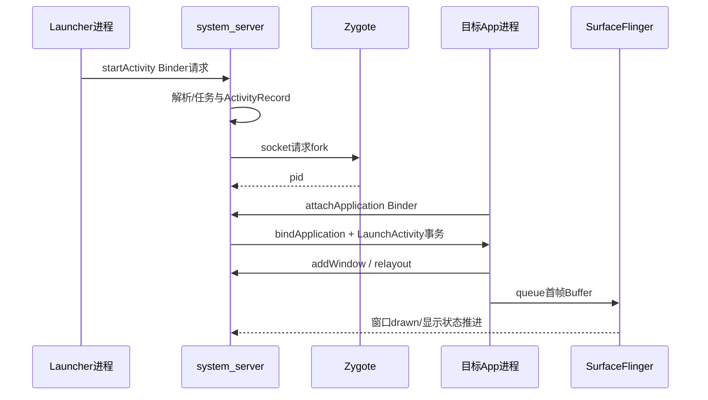

# 201 Android 应用冷启动到首帧显示完整链路

> 源码版本：Android 11 `android-11.0.0_r48`。  
> 本章做完整链路总览；后续章节会逐段深入。当前Mac只读源码，不实际编译或启动设备。

## 1. 本章目标

以“Launcher点击一个尚无进程的应用，直到该Activity真实窗口完成首次绘制”为场景，串起Launcher、ATMS、AMS、Zygote、ActivityThread、WMS、ViewRootImpl、RenderThread和SurfaceFlinger。

重点不是背调用栈，而是理解每段工作的进程、线程、状态和完成边界。

## 2. 先定义冷启动

本章所说冷启动：目标应用进程不存在，需要创建Linux进程、绑定Application，再创建Activity和首帧窗口。

日常常把已有进程但Activity需重建称为温启动，把Activity仍在前台/后台栈中快速恢复称为热启动；具体统计分类应以当前版本`ActivityMetricsLogger`实现为准。

## 3. 冷启动不是一个同步调用



多个箭头之间有排队、锁、线程切换和异步回调，`startActivity()`返回远早于首帧显示。

## 4. 涉及的主要进程

| 进程 | 主要责任 |
|---|---|
| Launcher/调用App | 发出Intent启动请求 |
| system_server | ATMS/AMS/WMS决策、记录和调度 |
| Zygote | fork目标应用进程 |
| 目标App | 创建Application/Activity、构建View、生产Buffer |
| SurfaceFlinger | latch、合成并提交显示 |

GPU、HWC和内核还参与后半段，但本章不把它们假装成Java调用栈的一部分。

## 5. 涉及的主要线程

Launcher通常从主线程调用API；system_server先在Binder线程接收，再可能经ATMS Handler、AMS/ProcessList路径继续；Zygote在其命令处理路径fork；目标App由ActivityThread主线程执行组件生命周期；RenderThread和SF主线程处理渲染合成。

同一进程不等于同一线程。

## 6. 第一段入口：Launcher

Launcher最终通过`Instrumentation.execStartActivity()`走到`ActivityTaskManager.getService().startActivity(...)`。Binder参数包含caller ApplicationThread、calling package、Intent、resolved type、result token、flags/options和userId等。

此处的成功返回主要表示系统接受/处理了启动请求，不表示目标Activity已`onCreate()`。

## 7. Binder调用身份

system_server能从Binder取得calling pid/uid，并结合callingPackage、userId、权限和AppOps校验。不能只相信客户端传来的包名。

调用身份会影响跨用户、后台启动、Intent目标和URI授权等判断。

## 8. ATMS Binder入口

r48入口位于：

`frameworks/base/services/core/java/com/android/server/wm/ActivityTaskManagerService.java`

`startActivityAsUser()`会检查目标用户，再构造/调用`ActivityStarter`。入口方法不是整个启动算法本身。

## 9. ActivityStarter做什么

它集中处理Intent解析结果、调用者、启动flags、launchMode、Task复用/创建、目标Display、权限与后台启动限制，并产出或复用ActivityRecord。

同一个Intent可能启动新实例，也可能把已有Task移到前台并投递`onNewIntent()`。

## 10. Resolve与启动不是同一阶段

PackageManager提供ActivityInfo/ResolveInfo，ATMS再根据任务和窗口状态决定怎样启动。解析到组件只回答“谁能处理”，不回答“创建新实例还是复用旧实例”。

## 11. ActivityRecord的角色

ActivityRecord是system_server对一次Activity实例的核心记录，关联Intent、ActivityInfo、token、Task、进程、生命周期、可见性、配置和窗口容器状态。

它不是App进程里的Activity Java对象。

## 12. Task与Activity栈决策

启动flags、launchMode、document模式、resultTo和当前Task共同决定目标Task与顶部Activity。此时可能发生复用、清栈、重排或新Task建立。

因此“点击图标”不必然走冷启动，即使用户视觉上像重新打开。

## 13. 启动性能记录起点

`ActivityMetricsLogger.notifyActivityLaunching()`在ActivityStarter附近建立LaunchingState，后续由`notifyActivityLaunched()`、可选starting window、transition和`notifyWindowsDrawn()`补齐。

测量起点是Framework定义的事件，不等于用户手指接触屏幕的硬件时间。

## 14. 尝试恢复顶部Activity

Task/Activity确定后，RootWindowContainer/ActivityStack推进可见与resume状态；若目标Activity尚无可用进程，会走`ActivityStackSupervisor.startSpecificActivity()`。

这里出现冷/温路径分叉。

## 15. 已有进程分支

r48源码先查`WindowProcessController`及其ApplicationThread：

```java
final WindowProcessController wpc =
        mService.getProcessController(r.processName,
                r.info.applicationInfo.uid);
if (wpc != null && wpc.hasThread()) {
    realStartActivityLocked(r, wpc, andResume, checkConfig);
    return;
}
```

有进程且Binder线程有效时可直接调度Activity，不需要再fork。

## 16. 无进程分支

若进程不存在或旧ApplicationThread已死亡，`startSpecificActivity()`调用ATMS的`startProcessAsync()`。ActivityRecord先保留在system_server，等待未来进程attach后继续。

“等待进程”不是丢失启动请求。

## 17. 为什么startProcessAsync要post

r48明确说明：避免持ATMS锁调用AMS造成潜在死锁，因此把`ActivityManagerInternal.startProcess`消息发送给ATMS Handler。

```java
final Message m = PooledLambda.obtainMessage(
        ActivityManagerInternal::startProcess, mAmInternal,
        activity.processName, activity.info.applicationInfo,
        knownToBeDead, isTop, hostingType,
        activity.intent.getComponent());
mH.sendMessage(m);
```

函数名中的Async对应真实线程/锁边界，不只是命名风格。

## 18. AMS与ProcessList

AMS侧创建或更新ProcessRecord，分配startSeq，确定uid/gid、ABI、runtime flags、挂载模式、SELinux信息、entry point和hosting reason，再交给ProcessList启动。

ProcessRecord是system_server中的进程状态，不是Linux task_struct。

## 19. startSeq为什么重要

进程启动是异步的：旧启动结果可能迟到，新一轮同名进程可能已经开始。startSeq帮助AMS把attach/pid结果与期望的启动轮次关联。

仅按processName匹配不足以抵御陈旧回调。

## 20. 送往Zygote的数据

`Process.start()`委托`ZygoteProcess.start()`，经本地socket发送参数。内容可包含uid/gid、补充组、runtime flags、target SDK、SELinux info、nice name、ABI和入口类等。

它不是通过Binder请求Zygote。

## 21. Zygote连接与ABI

ZygoteProcess会根据ABI选择主/次Zygote连接；若USAP机制适用，也可能尝试未专门化进程池并在失败时回退常规Zygote路径。

产品是否启用USAP及实际命中需要运行证据，不能仅凭源码存在断言。

## 22. fork的意义

Zygote已预加载大量Framework类和资源；fork让子进程通过写时复制继承地址空间，再在子进程中特化uid、权限、SELinux域、进程名和运行时环境。

预加载减少重复工作，但首次写页面仍可能产生私有内存。

## 23. 父子两端结果

Zygote父进程继续服务启动请求并把子pid回给system_server；子进程进入应用入口`android.app.ActivityThread`。这两条执行流在fork后分开。

不要把“Zygote返回pid”理解为应用已经attach。

## 24. ActivityThread.main

目标进程从`ActivityThread.main()`开始Java Framework应用入口：准备主Looper、创建ActivityThread、读取startSeq、调用`attach(false, startSeq)`，最后`Looper.loop()`。

应用的`Application.onCreate()`还没有在main最开头执行。

## 25. attachApplication反向Binder

ActivityThread把内部ApplicationThread Binder对象与startSeq传给AMS：

```java
final IActivityManager mgr = ActivityManager.getService();
mgr.attachApplication(mAppThread, startSeq);
```

方向由system_server→Zygote请求创建，转为新App→system_server主动报到。

## 26. AMS确认新进程

AMS根据calling pid/uid和startSeq找到预期ProcessRecord，连接IApplicationThread、注册死亡通知、更新pid/线程与进程状态，并继续绑定应用和等待该进程的组件。

attach失败或超时需要走进程死亡/启动清理，而不是永久保留半连接状态。

## 27. bindApplication调度

AMS调用ApplicationThread的`bindApplication()`，传入ApplicationInfo、providers、instrumentation、profiler、配置、compat、服务缓存、字体和autofill等初始化数据。

Binder入口再把消息送到ActivityThread主线程处理`handleBindApplication()`。

## 28. handleBindApplication的顺序意义

它设置进程名、包名、data directory、时区/locale、StrictMode、Profiler、兼容策略、资源与LoadedApk，并准备Instrumentation和Application。

这些工作必须在应用类大量加载和组件创建前完成。

## 29. LoadedApk是什么

LoadedApk保存某个包在当前进程中的代码/资源、ClassLoader、Application、组件派发器等运行时信息。它不是磁盘APK本身，也不等于PackageManager的PackageSetting。

## 30. ClassLoader建立

应用代码路径、split、共享库、native library和instrumentation会参与ClassLoader构造。类加载性能既受磁盘/页缓存影响，也受dex/oat/JIT/AOT状态影响。

后续ART专题会单独拆解。

## 31. ContentProvider为什么早

在r48普通应用绑定路径中，`makeApplication()`先创建Application对象，随后`installContentProviders()`，再调用Instrumentation和`Application.onCreate()`；受限backup模式会跳过Provider安装。Provider初始化做重I/O会直接进入冷启动关键路径。

但只在其他进程中的Provider不会凭空在当前进程初始化。

## 32. Application创建

LoadedApk通过Instrumentation创建Application、attach Context，再调用Instrumentation的`callApplicationOnCreate()`进入应用代码。

Application构造、`attachBaseContext()`和`onCreate()`是不同阶段。

## 33. 为什么Application之后才启动Activity

应用进程先建立包、资源、Instrumentation和Application环境，之后才能可靠反射目标Activity并交付生命周期。AMS attach期间也会继续调度该进程待启动的组件。

## 34. realStartActivityLocked

进程可用后，ActivityStackSupervisor把ActivityRecord绑定到WindowProcessController，处理配置/可见性，并创建客户端事务。

r48使用ClientTransaction而非直接逐个调用旧式`scheduleLaunchActivity()`主链。

## 35. LaunchActivityItem与最终状态

事务加入`LaunchActivityItem` callback，携带Intent、ActivityInfo、配置、saved state、结果、新Intent、profiler与assist token；再设置ResumeActivityItem或PauseActivityItem为最终生命周期请求。

```java
clientTransaction.addCallback(LaunchActivityItem.obtain(/* ... */));
clientTransaction.setLifecycleStateRequest(
        ResumeActivityItem.obtain(isForward));
mService.getLifecycleManager().scheduleTransaction(clientTransaction);
```

## 36. 客户端事务执行

ApplicationThread收到`scheduleTransaction()`后切到App主线程，TransactionExecutor依次执行callbacks，再把Activity推进到期望的最终生命周期状态。

Launch callback完成不必然等于事务中Resume也已执行。

## 37. performLaunchActivity

ActivityThread先获得LoadedApk与Activity Context，用ClassLoader和Instrumentation实例化Activity，取得Application，再调用`activity.attach(...)`建立token、Window、Instrumentation和Context关联。

之后才调用Activity的创建生命周期。

## 38. Activity.attach建立什么

它把Activity Java对象连接到ActivityThread、Application、token、Intent、ActivityInfo、PhoneWindow和WindowManager。Activity在system_server的身份依赖token，而不是对象地址。

## 39. onCreate与setContentView

Instrumentation调用Activity `onCreate()`；业务通常在其中调用`setContentView()`，由PhoneWindow把布局放入DecorView。此时只是建立View树，尚未完成屏幕显示。

XML inflate耗时、同步I/O和主线程初始化都会延迟后续窗口与首帧。

## 40. Resume与窗口加入

Activity进入resume相关流程后，ActivityThread/WindowManagerGlobal为DecorView创建ViewRootImpl并调用`setView()`；ViewRoot在App主线程成为View树、WMS和Surface之间的桥。

具体addWindow时机受首次可见与生命周期调度影响，不能简化成`setContentView()`立即addWindow。

## 41. ViewRootImpl.setView

r48在setView中保存root view和LayoutParams、设置display监听与AttachInfo、决定硬件加速，并在调用WMS addWindow前安排第一次layout。

它还启用了r48相应的BLAST私有窗口flag，但后续Buffer路径仍需结合该版本实现阅读。

## 42. addWindow跨进程

ViewRoot的IWindowSession调用进入WMS；WMS验证token、display、权限和窗口类型，创建WindowState并加入窗口层级，同时建立/关联input channel与Surface相关状态。

add成功表示窗口被系统接受，不表示已有可显示Buffer。

## 43. 第一次Traversal

`requestLayout()`通过Choreographer安排Traversal callback，ViewRoot在`performTraversals()`中按需执行measure、layout、draw，并通过relayout与WMS交换frame、insets、surface和配置状态。

一次Traversal可能因状态变化再次请求后续Traversal。

## 44. measure/layout/draw的边界

measure决定测量尺寸，layout确定子View位置，draw把View状态记录/绘制到渲染管线。它们运行在App UI线程，但硬件加速下真正GPU工作由RenderThread/图形后端继续。

UI线程draw返回不代表GPU完成。

## 45. RenderThread生产首帧

ThreadedRenderer把RenderNode/DisplayList与同步状态交给RenderThread，后者取得目标Surface buffer、执行Skia渲染并queue。UI线程与RenderThread有同步点，但通常不会等到显示器扫描完成。

## 46. SurfaceFlinger接收首Buffer

Buffer进入应用窗口对应Layer后，SF在合适的VSync/事务阶段检查fence、latch buffer，进行CLIENT或DEVICE合成选择，并交HWC present。

从queue到可见可能跨一个或多个显示周期。

## 47. starting window的作用

冷启动期间WMS可先显示starting window，减少空白并参与启动过渡。它是系统/窗口管理提供的占位视觉，不是目标Activity真实View首帧。

看到启动图不等于Application或Activity已经完成创建。

## 48. Framework怎样认定windows drawn

ActivityRecord的`onWindowsDrawn()`通知ActivityMetricsLogger，报告launch状态并停止等待可见；ActivityMetricsLogger可输出`Displayed ...`及统计信息。

这是Framework窗口绘制完成边界，仍不等于“用户眼睛已在面板上看到每个像素”的精确硬件时刻。

## 49. 复读审计与诊断切分

复读后要避免五种混淆：startActivity返回≠onCreate；fork返回pid≠attach；bindApplication≠Activity创建；UI draw返回≠GPU完成；starting window drawn≠真实窗口首帧。

诊断冷启动时可分：ATMS解析/Task、进程创建/attach、Application初始化、Activity/View创建、首帧渲染/SF五段，不要只看一个总耗时。

Mac只读练习：

```bash
rg -n "startSpecificActivity|realStartActivityLocked" \
  frameworks/base/services/core/java/com/android/server/wm/ActivityStackSupervisor.java
rg -n "bindApplication|handleBindApplication|performLaunchActivity" \
  frameworks/base/core/java/android/app/ActivityThread.java
rg -n "setView|performTraversals" \
  frameworks/base/core/java/android/view/ViewRootImpl.java
```

先把每个命中点标上进程/线程，再补它的输入与完成信号；不要尝试在Mac上执行Android设备命令来伪装验证。

## 50. 检查题与下一章

1. 为什么ATMS要把进程启动post到Handler，而不是持锁直调AMS？
2. Zygote返回pid后，为什么还不能调度Activity生命周期？
3. `bindApplication`、`LaunchActivityItem`和`onWindowsDrawn`分别标志哪一段？
4. starting window与真实Activity首帧有什么区别？

下一章深入**Launcher到ActivityStarter：Intent解析、启动权限、Task与ActivityRecord决策**。
