# 201 Android 应用冷启动到首帧显示完整链路

> 源码基线：Android 11 / API 30 / `android-11.0.0_r48`。
>
> 当前环境只有源码快照，能够证明静态调用、状态与失败分支，不能证明某台设备实际命中了哪条产品分支，也不能替代真机 trace。

用户点下桌面图标，启动动画已经出现，目标页面却迟迟没有内容。此时一句“冷启动慢”几乎没有诊断价值：Launcher 可能已经收到成功返回，目标进程可能刚 fork，Application 可能堵在 Provider 初始化，真实窗口也可能已经向 WMS 报告绘制而目标 Buffer 仍未 present。

本章只追一个问题：**Launcher 发出的普通同用户启动请求，怎样在目标进程原本不存在的前提下，最终变成目标 Activity 首个 Buffer 的一次可核对 present？**

核心结论是：这不是一条同步调用栈，而是四段由不同所有者接力的协议。ATMS 用 `ActivityRecord` 保存“要启动谁”，AMS/ProcessList 用 `ProcessRecord + startSeq` 保存“这一轮进程是谁”，App 主线程用 activity token 和 ViewRoot 保存“哪个真实窗口要画”，图形链再用 layer、buffer/frame 与 fence 保存“哪一帧走到了显示提交”。每次异步切换都必须同时找到状态保存点和完成信号。

读完后，你应该能把“点了没出来”定位到第一段缺失的交接，而不是只在 `Application.onCreate()` 周围猜耗时；也应该能解释为什么 `startActivity()` 返回、`onCreate()`、WMS 的 windows drawn、HWC present 和 `reportFullyDrawn()`互相不能替代。

## 1. 先固定场景，否则“冷启动”和“首帧”都会漂移

本章的贯穿场景采用以下前提：

1. 当前用户已经解锁，Launcher 自身处于可发起启动的状态；
2. 用户点击一个普通应用图标，目标是标准 Activity，而不是 deep shortcut、跨用户入口或安装会话页面；
3. ATMS 最终决定创建新的目标 Activity 实例，不复用已有实例或只把已有 Task 移到前台；
4. 目标应用进程在决策时尚未运行/attach；本章主线选择常规 Zygote 按需 fork，USAP 作为条件分支单列；
5. 进程启动采用 r48 默认的异步开关值，不考虑运行时 constants 覆盖；
6. 目标窗口位于默认显示并使用硬件加速；图形主线采用 `wm_use_blast_adapter`无覆盖时的传统 BufferQueue，BLAST 作为条件分支单列；starting window 可以出现，但不算目标 Activity 的真实首帧；
7. 文章跟到显示提交边界，不继续讨论面板逐行扫描、背光响应或人的视觉感知。

“目标进程不存在”也与 r48 的指标分类相合。对 `TransitionInfo.create()`接受的 `START_SUCCESS/START_TASK_TO_FRONT`，`processRunning == false`记为 cold launch；进程已存在但目标 Activity 尚未 attach 是 warm，目标 Activity 已 attach 到进程则是 hot。日常口语可能混用这些词，源码分析时应以当前版本分类为准。

起点定为 Launcher 即将调用 Framework 启动 API 的时刻。这个点已经晚于触摸硬件时间、InputReader/InputDispatcher 投递和 View 点击识别。若从物理触摸展开，上游还会经过 `EventHub → InputReader → InputDispatcher → Launcher InputChannel → ViewRootImpl → View.onTouchEvent()/performClick()`；该输入投递的 FINISHED 只结清 Dispatcher 等待账，不会替 click callback、`startActivity()`或目标首帧结账。本章把这段压成前置边界，不重走输入专题。

主终点记为 G1：**目标 Activity 的首个有效 Buffer 已与目标 layer/frame 对齐；该 layer 是目标 display 的 OutputLayer 且这一轮 `visibleRegion`非空，当前 buffer 参与该帧的 client 或 device composition；HWC 的 present 或 present-or-validate 快路径成功，并取得有效、可靠且已 signal 的 present fence。** 这是一条平台可观察边界，仍不能直接等同于整帧扫描结束或人眼已经看见。

将主终点与三个辅助完成点并列如下：

| 记号 | 完成点 | 它能证明什么 | 它不能证明什么 |
|---|---|---|---|
| AR | Launcher 收到 `startActivity()` 同步结果 | system_server 已完成这一笔启动请求的同步处置 | 目标进程已 attach、Activity 已创建或首帧已显示 |
| G0 | `ActivityRecord.onWindowsDrawn()`推进窗口绘制指标 | WMS 按自身窗口状态口径认定相关真实窗口 drawn | 指定 Buffer 已经通过 HWC present |
| G1 | 目标 layer/frame 在目标 display 上具有非空可见区的成功 present | 目标首帧抵达图形系统的平台提交边界 | 面板完整扫描、背光和人眼感知一定完成 |
| B0 | App 可选调用 `reportFullyDrawn()` | App 声明关键内容已达到可用状态，Framework 记录 fully drawn | 系统自动判定所有业务数据都正确 |

如果没有设备 trace，源码只能证明 G1 的实现路径存在；“这次启动确实抵达 G1”必须标成 `unavailable`，不能用 G0 或一行 `Displayed` 日志冒充。

## 2. 一张偏序图同时放下请求、进程、窗口和显示

先看全图，再进入文件。箭头表示源码中的因果交接，不表示所有节点都在同一线程，也不把并行分支强行排成一条时间线。

```mermaid
flowchart LR
    L0[Launcher 点击回调] -->|同步 Binder| A0[ATMS / ActivityStarter 决策]
    A0 -->|reply| AR[同步启动结果 AR]
    A0 --> R0[ActivityRecord 等待目标进程]
    R0 -->|post 到 DisplayThread| P0[ProcessList 建 pending start / startSeq]
    P0 -->|本地 socket| Z0[进程供给: 常规 fork / USAP 变体]
    Z0 --> PP[pid reply 路径]
    Z0 --> PC[应用入口路径]
    PP --> JP[parent 结果处理]
    PC --> CA[ActivityThread.main / attach]
    JP -. pid-first 时先登记 .-> J0[AMS 按 pid map 或 pending startSeq 校验 attach]
    CA --> J0
    J0 -->|oneway| B1[提交 bindApplication]
    B1 -->|server 随后 oneway| C1[提交 ClientTransaction]
    B1 --> AP[Application 环境与 onCreate]
    C1 --> CT[App 主线程执行 transaction]
    AP --> CT
    CT --> AC[Activity create / resume]
    AC -->|同步 window Binder| W0[ViewRoot add window / relayout]
    W0 --> D0[Traversal / HWUI / RenderThread]
    D0 -->|同步 Binder| FD[App 向 WMS finishDrawing]
    FD -->|WM 锁内改 draw state| WR[requestTraversal]
    WR -->|post AnimationThread| WP[surface placement / reported visibility]
    WP --> G0[WMS windows drawn]
    D0 -->|buffer / transaction| Q0[传统 BufferQueue 或 BLAST 适配分支]
    Q0 --> SF[SurfaceFlinger latch / compose]
    SF -->|present submit| HWC[HWC present]
    HWC -->|OutputLayer 可见且可靠有效 fence signal| G1[目标 frame 的 present 边界]
    AC -. 可选业务声明 .-> B0[reportFullyDrawn]
    SW[starting window] -. 独立占位视觉 .-> SF
```



图中有三个容易被线性编号掩盖的事实：

- A0 会同时派生同步 reply 和异步进程分支；AR 与后续异步进展不能仅靠编号推断先后。
- fork 后 parent 返回 pid、child 进入 `ActivityThread.main()`是两条可竞跑的执行流，汇合点不是某个固定源码行，而是 `ProcessRecord/startSeq` 协议。
- G0 由 App→WMS 的 `finishDrawing()`反馈推进，G1 由 Buffer→SurfaceFlinger→HWC 的显示链推进；不存在“SurfaceFlinger 回调 system_server 窗口已绘制”这条边。

主要执行上下文如下：

| 进程 / 线程 | 本场景中的工作 | 关键切换 |
|---|---|---|
| Launcher 主线程 | 点击分派、构造/修饰 Intent、调用 Activity API | 同步 Binder 进入 system_server |
| system_server Binder 线程 | ATMS 入口、调用者身份与同步启动结果 | `ActivityStarter`在全局锁保护下提交状态 |
| system_server ATMS Handler | 承接 `startProcessAsync()`消息；r48 实例由 DisplayThread Looper 支撑 | 避免持 ATMS 锁直接进入 AMS |
| system_server ProcStartHandler | 在 AM 全局锁外执行可能阻塞的 Zygote 请求 | pid 返回后重新进入 AM 锁提交结果 |
| Zygote 命令处理路径 | 解析请求、fork；parent 写回 pid，child 特化 | fork 后两支并行 |
| 目标 App 主线程 | `ActivityThread.main()`、同步 attach；随后处理 bind 与 lifecycle 消息 | `Looper.loop()`在 attach 返回后才开始 |
| RenderThread / 图形后端 | 消费 UI 线程录制内容、取得 Surface Buffer、绘制与 swap | BufferQueue 或 BLAST 适配器接棒 |
| SurfaceFlinger / HWC | 应用事务、选择合成、latch、present 与 fence | 显示设备边界 |

后文每一段都用同一套核对问题：输入身份是什么，谁保存尚未完成的状态，哪个信号结账，失败或迟到结果怎样处理。

## 3. Launcher 发出的只是启动请求，不是首帧承诺

r48 Launcher3 的普通图标路径从 `ItemClickHandler.onClick()`识别 `WorkspaceItemInfo/AppInfo`，进入 `startAppShortcutOrInfoActivity()`，再调用 `Launcher.startActivitySafely()`。`BaseDraggingActivity.startActivitySafely()`会补 `FLAG_ACTIVITY_NEW_TASK` 和图标的 source bounds；对当前用户的普通 Activity，它最终调用 Activity 的 `startActivity()`。

这条具体路径有明确变体：

| Launcher 条件 | 实际分支 | 为什么不能混入主线 |
|---|---|---|
| 当前用户、普通应用图标 | `Activity.startActivity()` | 本章采用 |
| 其他用户 | `LauncherApps.startMainActivity()` | 入口和跨用户校验不同 |
| deep shortcut | shortcut 专用入口 | 还包含 shortcut 身份和权限规则 |
| Launcher 尚未 resumed | 先注册 on-resume callback | 点击回调与真正启动之间又多一段延迟 |
| 安全模式、无效图标或状态切换中 | 本地拒绝或提示 | 甚至不会产生 ATMS 请求 |

Activity 再经 `startActivityForResult()`走到 `Instrumentation.execStartActivity()`。在 r48 普通重载中，客户端传递的是 `IApplicationThread`、calling package、calling feature id、Intent、resolved type、result token、request code 和 options；没有一个由客户端显式指定的普通 `userId` 参数，服务端使用 Binder 调用者所属用户。把其他重载或 `startActivityAsUser()`的参数表套在这里，会制造并不存在的线。

`Instrumentation`在发请求前还会迁移 stream extra 到 `ClipData`、准备 Intent 离开当前进程；随后同步调用 `ActivityTaskManager.getService().startActivity(...)`，并用 `checkStartActivityResult()`把部分错误结果转换为异常。AOSP Launcher3 是这里核对的具体实现，OEM Launcher 可能选择不同入口，不能由包名相同推断调用链相同。

因此 AR 的准确含义是“同步 Binder 请求已返回并通过客户端结果检查”。Launcher 可以继续自己的动画和状态更新，但 AR 不包含目标 App 的回执。Launcher 源码甚至明确说明没有 Activity 完成启动的 callback；它只能在以后回到 Launcher 时恢复图标按压状态。

这也给诊断一个很实用的第一刀：如果 Launcher 本地分支没有调用 Framework，问题仍在 Launcher；如果 ATMS 已收到请求且 AR 成功，先核 system_server 的内部 result、ActivityRecord 与 Task 状态。只有 A0 确实 accepted，才继续追目标进程和窗口；不要把 AR 或启动动画当作目标首帧。

## 4. ATMS 先固定真实调用者，再交给 ActivityStarter

Binder 到达 `ActivityTaskManagerService.startActivity()`后，服务端不能只相信 Parcel 里的 `callingPackage`。r48 会校验包名与调用 UID 的关系、拒绝 isolated caller，并根据 `Binder.getCallingPid()/getCallingUid()`确定调用用户；涉及显式跨用户时还要走对应用户检查。

身份读取和身份清除必须按顺序理解。`ActivityStarter.execute()`在需要以 system_server 身份继续内部工作前调用 `Binder.clearCallingIdentity()`，但授权与归属判断所需的原始 caller 信息已经被解析进 request。clear 返回的是当前线程的不透明恢复 token，不是 uid；也不能在 clear 后重新读取 Binder caller 并当成 Launcher。

服务入口随后通过 `ActivityStartController.obtainStarter(intent, reason)`建立一次性 `ActivityStarter`，设置 caller、package、feature、resolved type、result target、request code、options 和 user，然后执行。这里至少有两层工作：

1. `Request.resolveActivity()`取得 `ResolveInfo/ActivityInfo`，回答哪个组件能处理 Intent；
2. `executeRequest()`结合调用者、权限、后台启动规则、launch flags、launchMode、Task、display、resultTo 等状态，回答本次怎样启动。

resolve 成功不等于 launch 成功。显式组件也可能不存在；解析出的组件还可能被权限、exported、后台启动、锁任务或用户状态挡住。反过来，同一个组件也可能因为 `FLAG_ACTIVITY_NEW_TASK`、`CLEAR_TOP`、`singleTask` 等规则而复用已有 Task/Activity。

内部启动结果与 caller 收到的外部结果还要分账。内部 `START_SUCCESS`表示创建/推进工作已被接受，`START_TASK_TO_FRONT`表示已有 Task 被带到前台；但 `ActivityStarter.getExternalResult()`会为兼容性把内部 `START_ABORTED`映射成外部 `START_SUCCESS`。因此只看到 Launcher 的 AR=success，最多证明客户端没有收到会被 `checkStartActivityResult()`抛出的硬失败，不能反推 ActivityRecord 或进程工作一定已经建立。要声称 A0“accepted”，必须再取得 system_server 内部结果/状态证据；无论内外结果，它们都不是 `onCreate()`或显示结果码。

`ActivityMetricsLogger.notifyActivityLaunching()`在 `ActivityStarter.execute()`靠前位置用 `elapsedRealtimeNanos`建立 Framework 启动起点；它不是触摸硬件时间。`notifyActivityLaunched()`又根据最终 Activity 和进程状态创建或更新 transition，并可能把 trampoline Activity 合并进同一序列。看到一个总耗时时，先问它从哪个 Framework 事件开始，而不是默认从手指按下开始。

## 5. ActivityRecord 保存“要启动谁”，Task 决策决定是否进入冷分支

ATMS 完成决策后，用 `ActivityRecord`表示 system_server 眼中的 Activity 实例。它关联 Intent、`ActivityInfo`、activity token、Task、目标进程名/uid、配置、可见性、生命周期和窗口容器；它不是目标进程里的 `Activity` Java 对象。

这一层最关键的不是把所有 Task 规则背下来，而是确认本场景是否仍满足合同：

| 决策结果 | 后续路径 | 是否仍是本章主线 |
|---|---|---|
| 已有目标 Activity 可复用 | move-to-front 或 `onNewIntent()`等 | 否，跳过新实例甚至跳过进程创建 |
| 目标进程存在且有 `IApplicationThread` | 直接尝试 `realStartActivityLocked()` | 否；最终是 hot 还是 warm，要看 metrics 取样时新 Activity 是否已 `attachedToProcess()` |
| 找到同名进程记录但 client call 抛 `RemoteException` | 标记 known-to-be-dead，落入重启 | 否于本文普通无进程前提；重启路径与指标分类还要分别核对 |
| 无可用目标进程 | ActivityRecord 留在系统端，发起进程创建 | 是 |

`ActivityStackSupervisor.startSpecificActivity()`通过 `WindowProcessController`查询目标进程。`wpc.hasThread()`只表示其中持有非空 `IApplicationThread`能力，不表示某条 Binder 工作线程“健康”或业务主线程空闲。调用 `realStartActivityLocked()`时若远端异常，代码会回落到重启进程。若 transaction 成功，`realStartActivityLocked()`会先执行 `r.setProcess(proc)`；稍后 `notifyActivityLaunched()`再读取 `r.attachedToProcess()`时，这个新 Activity 通常已满足 hot 条件。warm 的准确条件只是 metrics 取样时“进程记录存在、Activity 尚未 attached”，不能由“进程有 thread”三个字提前贴标签。

无进程时，ActivityRecord 并没有随 Binder 返回而丢失。它仍在 Task/RootWindowContainer 状态中，等待匹配进程 attach 后由 `RootWindowContainer.attachApplication()`重新扫描并调用 `realStartActivityLocked()`。这就是第一处“异步之后还能继续”的保存点。

starting window 也可能在这一阶段由窗口管理决定并异步建立。它属于目标 Task 的占位视觉，可以减少空白，却既不是目标 Activity 的 View 树，也不证明目标进程存在。后文会把它与真实窗口分账。

## 6. startProcessAsync 的重点是锁边界，不是名字里的 Async

无进程分支调用 `ActivityTaskManagerService.startProcessAsync()`。源码注释给出的原因很直接：避免持有 ATMS 全局锁时调用 AMS 而形成潜在死锁，因此它把 `ActivityManagerInternal.startProcess(...)`封装成消息投递给 ATMS Handler。

```java
final Message message = PooledLambda.obtainMessage(
        ActivityManagerInternal::startProcess, mAmInternal,
        activity.processName, activity.info.applicationInfo,
        knownToBeDead, isTop, hostingType,
        activity.intent.getComponent());
mH.sendMessage(message);
```

这段经过删节的证据只证明两件事：Activity 进程创建从 ATMS 锁内切到 Handler；传给 AMS 的 hosting reason 会保留“为什么启动该进程”。它不证明消息已被执行，也不证明 Zygote 已经收到请求。

消息由 r48 的 DisplayThread Looper 消费；`ActivityManagerService.LocalService.startProcess()`随后取得 AMS 锁，再进入 `ProcessList.startProcessLocked()`。它创建或复用 `ProcessRecord`，准备 uid/gid、supplementary groups、mount mode、runtime flags、SELinux info、required ABI、instruction set、entry point 与 hosting record。`ProcessRecord`是 system_server 的进程状态对象，不是内核 `task_struct`。

真正发起一轮创建前，ProcessList 会：

```text
app.pendingStart = true
startSeq = ++mProcStartSeqCounter
app.startSeq = startSeq
mPendingStarts[startSeq] = app
```

这里有两份生命周期不同的状态：

- `mPendingStarts[startSeq]`只覆盖尚未完成 parent pid 结果处理的创建请求，同时供 attach-first 竞态回查；
- `ProcessRecord.startSeq`保留在进程记录上，pid 已登记后仍用于校验 child attach 是否属于这一轮。

r48 的 `DEFAULT_PROCESS_START_ASYNC`为 true；在默认分支，ProcessList 再把 `handleProcessStart()`投递到名为 `ActivityManager:procStart`的专用 Handler 线程。该函数刻意不持 AM 全局锁执行可能阻塞的 Zygote 请求，拿到结果后才重新入锁提交。该开关可由 ActivityManager constants 覆盖；默认异步异常分支会移除对应 pending entry、清 `pendingStart` 并停止包，而关闭开关后的同步 catch 清理细节不同，不能把一个分支的代码承诺成所有产品相同。

到这里，system_server 已经有了“目标 Activity 等哪个进程”和“这一轮进程启动的 startSeq”两层状态，但 Linux pid 还可能不存在。

## 7. Zygote 使用本地 socket，ABI 先决定连接再参与 fork

ProcessList 最终经 `Process.start()`进入 `ZygoteProcess.start()`。它不是 Binder 调用：system_server 通过 Zygote 本地 socket 发送参数，Zygote 命令处理路径解析后执行 fork。

required ABI 的第一项作用是选择能支持该 ABI 的 primary/secondary Zygote 连接，而不是简单把一句“ABI”当作普通 wire 参数。实际参数仍会包括 uid/gid、supplementary groups、runtime flags、target SDK、SELinux info、nice name、instruction set、应用数据目录、入口类和 `seq=<startSeq>`等。

r48 还存在 USAP 路径：满足条件时可把参数发送给已经预 fork 的未专门化进程。USAP 先向 session socket 写回自身 pid 并关闭连接，随后才执行 `specializeAppProcess()`；`ZygoteProcess`只在这次 USAP 通信抛 `IOException`时于该处回退常规 Zygote。负 pid 触发的 `ZygoteStartFailedEx`不会被这个 catch 接住，pid 已回后 specialize 崩溃也不会由同一请求透明重试，而要走上层失败、死亡或 attach-timeout 清理。冷启动只要求目标应用进程此前尚未运行/attach，不要求本次点击一定新执行 fork。源码里有 USAP 能力不等于设备启用了池，更不等于某次请求实际命中；需要产品配置、运行状态和 trace 一起证明。

Zygote socket 也有自己的身份边界，不继承 Binder caller。`ZygoteConnection`读取 socket peer credentials，并由 Zygote 的 uid/gid 安全策略校验请求参数；不能把 ATMS 保存的 Launcher Binder 身份一路画到 fork 内部。

fork 的价值是让 child 继承 Zygote 已预加载的 Framework 类和资源页，再通过写时复制与 specialize 建立自己的 uid、能力、SELinux 域、进程名和运行时环境。它减少重复初始化，但不意味着所有页面都已私有驻留，也不消除 App 自己的类加载和磁盘缺页。

常规 fork 成功后立即出现两条执行流：

```text
parent: handleParentProc() → 把 pid 写回 socket → 返回 Zygote server select loop
child : specialize → RuntimeInit / ZygoteInit → ActivityThread.main() → attachApplication
```

pid 写回后，Zygote parent 继续 select loop 与 system_server 读取/处理该结果可以并行；“system_server 先处理 pid、child 再 attach”也只是常见观察，不是必须的全序。调度器可以让 child 更早跑到 attach；源码专门保留了 attach-first 补偿路径。

## 8. pid 结果与 child attach 在 startSeq 协议处汇合

child 进入 `ActivityThread.main()`后先准备主 Looper，从命令行参数取出 `seq=`，创建 `ActivityThread`，然后调用 `attach(false, startSeq)`。只有同步 `attachApplication()`返回后，它才进入 `Looper.loop()`；此时 `Application.onCreate()`还没有运行。

`attachApplication()`是新 App 主动向 AMS 报到的同步 Binder 调用。AMS 读取真实 Binder `callingPid/callingUid`，并用 startSeq 核对预期 `ProcessRecord`。两种合法顺序如下：

| 竞态 | system_server 怎样汇合 | pending / timeout 结果 |
|---|---|---|
| pid-first | parent 结果进入 `handleProcessStartedLocked()`：先移除 pending，校验启动仍有效，再登记 pid；child attach 后按 pid map 找到记录并核对 uid/startSeq | pid 登记后启动 `PROC_START_TIMEOUT`等待 attach；attach 成功时取消 |
| attach-first | pid map 尚无记录；AMS 用 `mPendingStarts[startSeq]`、callingUid 和记录上的 startSeq 找到 pending，再以 `procAttached=true`补做 pid 登记 | 同一步移除 pending；因为已经 attach，不再建立等待 attach 的 timeout |

因此不能笼统写“attach 时更新 pid”：常态 pid 早已由 parent 结果登记，只有 attach-first 分支在 attach 中补登记。也不能只按 process name 匹配；同名进程的新一轮创建必须拒绝旧 startSeq 或错误 uid/pid。

`PROC_START_TIMEOUT`的监视区间也要读准。r48 普通值为 10 秒，它在 parent pid 被 system_server 接受并登记后才开始，等待 child attach；它不覆盖等待 ProcStartHandler、socket 或 fork 结果的时间。使用 wrapper 时另有更长值。进程先死、身份不匹配、记录已被新启动替换或找不到 pending 时，AMS 会丢弃/清理进程，而不是把任意来报到的 `IApplicationThread`接入旧 ActivityRecord。

attach 校验通过后，AMS 获得目标 App 的 `IApplicationThread`，注册死亡通知并取消正常 attach timeout。下一段真正容易误判：system_server 会先发送 `bindApplication()`，再扫描等待这个进程的 Activity 并发送 ClientTransaction，但它并不等待 `Application.onCreate()`回执。

## 9. bindApplication 先排进主队列，Application 才建立进程级环境

`ActivityManagerService.attachApplicationLocked()`在 AM 锁内准备进程配置、Provider 列表、Instrumentation、Profiler 和公共服务缓存。普通应用路径先调用 `thread.bindApplication(...)`，随后 `app.makeActive(...)`，再通过 `mAtmInternal.attachApplication()`寻找等待这个进程的 Activity。

这里必须拆开“服务端发送顺序”和“客户端执行完成”：`IApplicationThread.aidl`整个接口是 `oneway`。AMS 调用 `bindApplication()`返回，只说明异步 Binder 请求成功提交；它没有收到 `Application.onCreate()`完成 ACK。随后发送的 `scheduleTransaction()`同样没有通用 transaction ACK。

普通冷启动仍能保持正确的客户端顺序，依靠的是这一组具体条件：

1. `ActivityThread.main()`在进入主 Looper 前同步调用 `attachApplication()`；
2. AMS 在这次 attach 处理中先向同一个 `IApplicationThread`发送 bind，再发送 Activity transaction；
3. `ApplicationThread.bindApplication()`在 Binder 线程直接初始化 service cache；`setCoreSettings()`先把 `SET_CORE_SETTINGS`排入 ActivityThread 主 Handler，随后才排 `BIND_APPLICATION`，core settings 的实际应用仍在主线程；
4. `ApplicationThread.scheduleTransaction()`转交外层 `ActivityThread`；后者继承 `ClientTransactionHandler`，其 `scheduleTransaction()`把 `EXECUTE_TRANSACTION`放入同一主线程队列；
5. attach 返回后 `Looper.loop()`才开始消费这些消息。

因此普通路径会先处理 `handleBindApplication()`，再执行 `LaunchActivityItem`。这不是“AMS 同步等 Application 初始化完再发 Activity”，而是两个 oneway 请求在目标主队列上的有序接力。若 bind 抛异常、进程死亡或 client Binder 失败，AMS 会清理/杀死这次进程，后续 Activity 也不能凭空继续。

`handleBindApplication()`内部最值得记的是精确顺序：

| 顺序 | 动作 | 可能进入冷启动关键路径的工作 |
|---|---|---|
| 1 | 设置进程名、包名、data directory、时区、locale、StrictMode、配置等进程环境 | 系统属性、资源配置、调试/Profiler 条件 |
| 2 | 建立 `LoadedApk`、应用 Context 与 ClassLoader | APK/split/shared library、native library、资源与类加载 |
| 3 | 构造并 `init()`测试 Instrumentation，或为普通进程建立默认 Instrumentation | 测试/插桩环境可能改变类加载和后续回调；这一步尚未调用其 `onCreate()` |
| 4 | `makeApplication(..., null)` | 构造 Application 对象并执行 `attachBaseContext()`；此处尚不调用 `Application.onCreate()` |
| 5 | 非 restricted backup 模式下安装本进程声明的 ContentProvider | Provider 类加载、实例化、`attachInfo()`与 `onCreate()` |
| 6 | `mInstrumentation.onCreate(...)` | 测试 Instrumentation 在 Provider 之后启动自己的测试逻辑 |
| 7 | `callApplicationOnCreate(app)` | 进入应用自己的 `Application.onCreate()` |

这解释了常见误判：“卡在 Application 之前”可能其实卡在 Provider。`makeApplication()`已经创建并 attach 了 Application 对象，Provider 安装随后发生，`Application.onCreate()`最后才被调用。只有属于当前进程的 Provider 会在这里安装；其他进程的 Provider 不会无条件挤进本进程冷启动。

`LoadedApk`是当前进程对包的运行时视图，持有代码/资源路径、ClassLoader、Application 和组件派发器等；它不是磁盘 APK，也不是 PMS 的包设置记录。后续 `performLaunchActivity()`再次调用 `makeApplication()`时，普通路径会取回已经存在的 `mApplication`，不会第二次运行 `Application.onCreate()`。

## 10. ClientTransaction 创建 Activity，并把最终生命周期作为另一项请求

AMS 发完 bind 后调用 ATMS 内部的 `attachApplication()`，`RootWindowContainer`扫描可见 Activity，找到 processName/uid 匹配且正在等待的 `ActivityRecord`，再进入 `ActivityStackSupervisor.realStartActivityLocked()`。如果仍有 Activity 未完成 pause，该方法可以暂不启动并等待后续状态推进；“进程已 attach”不必然等于 transaction 立即发出。

准备完成后，system_server 把 ActivityRecord 关联到 `WindowProcessController`，计算配置与可见性，然后构造 `ClientTransaction`：

```java
final ClientTransaction transaction = ClientTransaction.obtain(
        proc.getThread(), r.appToken);
transaction.addCallback(LaunchActivityItem.obtain(/* 参数已省略 */));
transaction.setLifecycleStateRequest(
        andResume ? ResumeActivityItem.obtain(isForward)
                  : PauseActivityItem.obtain());
mService.getLifecycleManager().scheduleTransaction(transaction);
```

这是明确标注过删节的结构证据，不是可独立编译的连续源码。它说明 launch callback 与最终生命周期请求是同一 transaction 中的不同项目：`LaunchActivityItem`负责创建 Activity，`ResumeActivityItem/PauseActivityItem`负责把它推进到期望终态。launch callback 执行完不代表 resume 已执行。

客户端 `ApplicationThread.scheduleTransaction()`最终把 `EXECUTE_TRANSACTION`消息放入主线程。`TransactionExecutor.execute()`先按顺序执行 callbacks，再执行 lifecycle state request；如果 token 已被标记为预销毁，整个 transaction 还可能被跳过。

`LaunchActivityItem.execute()`进入 `ActivityThread.handleLaunchActivity()`与 `performLaunchActivity()`：

```text
ActivityClientRecord / ActivityInfo
    → 取得 LoadedApk 与 Activity Context
    → 用 ClassLoader + Instrumentation 实例化 Activity
    → 取得已建立的 Application
    → Activity.attach(Context, ActivityThread, token, Window, ...)
    → Instrumentation.callActivityOnCreate()
```

`Activity.attach()`把 App 里的 Activity 对象连接到 Context、ActivityThread、Application、activity token、Intent、PhoneWindow 和 WindowManager。system_server 与客户端通过 activity token 对齐实例，不靠 Java 对象地址。

业务通常在 `onCreate()`调用 `setContentView()`，PhoneWindow 把布局装进 DecorView。此时完成的是 View 树创建，尚未建立 `ViewRootImpl`，也没有向 WMS 加入真实窗口。XML inflate、主线程 I/O、类初始化和同步依赖会延迟后续 lifecycle，但 `onCreate()`返回本身也不是首帧。

final lifecycle item 随后触发 start/resume 路径。`ResumeActivityItem.postExecute()`会调用 `activityResumed(token)`形成生命周期专用反馈，但它仍不覆盖窗口绘制。system_server 在 schedule 后更新自己的 Activity 状态，是服务端期望状态的推进，不是客户端通用 transaction ACK；如果要证明 App 真执行到 `onResume()`，应核对这条专用反馈或客户端 trace，而不能借它证明 G0/G1。

## 11. Resume 阶段才让真实 DecorView 通过 ViewRoot 进入 WMS

`ActivityThread.handleResumeActivity()`先调用 `performResumeActivity()`推进客户端生命周期。随后在 Activity 未 finish、将可见且窗口尚未加入时，取得 PhoneWindow 的 DecorView，设置基础应用窗口参数，并调用 WindowManager 的 `addView()`。

调用链是：

```text
ActivityThread.handleResumeActivity
  → WindowManagerImpl.addView
  → WindowManagerGlobal.addView
  → new ViewRootImpl(...)
  → ViewRootImpl.setView
  → IWindowSession.addToDisplayAsUser
  → WindowManagerService.addWindow
```

`WindowManagerGlobal`在 App 进程内维护 view/root/params 对应表；`ViewRootImpl`绑定一棵 View 树、一个窗口 client、一次主 Looper 和后续 Surface。它不是 system_server 的 WindowState。

`ViewRootImpl.setView()`有一个容易忽略的顺序：先保存 root/参数、配置 renderer，调用 `requestLayout()`安排第一次 traversal，然后才同步调用 `addToDisplayAsUser()`。这样可确保来自 system_server 的其他窗口事件到来前，第一次布局已经进入本地调度队列。

WMS 在 `addWindow()`中验证 display、user、窗口类型、权限、app token 与重复添加，创建 `WindowState`并接入窗口层级；需要输入时还会建立 InputChannel。返回码可能是 bad token、app exiting、invalid display、permission denied 等。`ADD_OKAY`只表示窗口被接受，不表示 Surface 已有内容；真实可绘制的 Surface/SurfaceControl 主要在后续首次 relayout 中建立并交回客户端。

r48 的 BLAST 也不能仅凭 ViewRoot 设置 private flag 就断言启用：

- ViewRoot 会给窗口参数加 `PRIVATE_FLAG_USE_BLAST`；
- WMS 读取 `DeviceConfig`的 `wm_use_blast_adapter`，默认值为 false；
- 只有 WMS 的 `mUseBLAST`为真才在 add 结果里返回 `ADD_FLAG_USE_BLAST`；
- ViewRoot 看到该结果位后才置 `mUseBLASTAdapter`。

因此源码证明传统和 BLAST 两条可选实现都存在，具体产品和启动实例走哪条仍需运行证据。

starting window 走另一条窗口管理路径。它可以早于目标进程和真实 DecorView 出现在同一个 Task 上，拥有自己的 surface/layer。r48 的 `performShowLocked()`会在 draw state 为 `READY_TO_SHOW`时先调用 `onFirstWindowDrawn()`，随后才检查 `isReadyForDisplay()`并决定能否把真实窗口推进到 `HAS_DRAWN`；前一个 callback 已可发起 starting window 移除。因此截屏里看到主题背景、应用图标或预览，不能直接作为真实窗口 `addWindow()`、真实 surface 已 show 或首帧证据。

## 12. 第一次 Traversal 把 View 状态交给 Surface，但不等待显示器

`requestLayout()`最终调用 `scheduleTraversals()`。ViewRoot 在主消息队列插入同步屏障，并向 Choreographer 的 traversal 阶段注册 callback；下一次合适的帧调度中，`doTraversal()`进入 `performTraversals()`。

第一次 traversal 不是简单的 `measure → layout → draw`三行：它还会检查可见性/配置/insets，必要时通过 `relayoutWindow()`与 WMS 交换 frame、SurfaceControl 和 Surface 状态，再执行测量、布局与 pre-draw。WMS 返回 `RELAYOUT_RES_FIRST_TIME`时，ViewRoot 调用 `reportNextDraw()`，建立“下一次真实绘制后要向 WMS 反馈”的债。

如果 `OnPreDrawListener`取消本帧，ViewRoot 会在仍可见时重新安排 traversal；如果 Surface 丢失、尺寸或配置变化，也可能 relayout 或重画。因此“一次 VSync 必然产出首帧”不是源码契约。

硬件加速的普通路径里，UI 主线程遍历 View 树并更新 RenderNode/DisplayList，`ThreadedRenderer.draw()`再通过 `syncAndDrawFrame()`把工作交给 RenderThread。`CanvasContext::draw()`等待相关 fence、执行渲染管线并在需要时 swap；UI 线程的 draw 返回和 RenderThread 的 frame-complete callback 都不是 HWC present fence。

`reportNextDraw`的完成方式必须按绘制所有者拆开。本章硬件加速主线在 `ThreadedRenderer`可异步报告时设置 frame-complete callback，RenderThread 回调再投回 App 主 Handler 并调用 `pendingDrawFinished()`；若没有可用的异步 renderer，例如 `drawSoftware()`在 App 主线程以 Canvas/Surface 绘制，则 draw 返回后的非异步分支直接结清 pending draw。若根 View 接管 `SurfaceHolder`，ViewRoot 改由 `SurfaceCallbackHelper.dispatchSurfaceRedrawNeededAsync()`等待 holder callbacks，再 `postDrawFinished()`。三条路最终都能进入 `reportDrawFinished()`，但不能把 HWUI callback 泛化为软件或 holder 路径，更不能把其中任一路当作 HWC present fence。

第一次绘制还分成两条相邻但不同的反馈：

```text
反馈支路：HWUI frame-complete / 软件 draw 返回 / holder redraw callback
  → App 主 Handler 或当前主线程
  → pendingDrawFinished()
  → reportDrawFinished()
  → IWindowSession.finishDrawing()
  → WMS（G0 的上游）

像素支路：renderer / software Canvas / holder producer 提交
  → 传统 BufferQueue，或 BLAST 本地队列再转 SurfaceControl transaction
  → SurfaceFlinger
  → HWC present（G1 的上游）
```

r48 `CanvasContext`还有一条容易漏掉的空帧分支：dirty 为空、允许 skip empty frame 且 surface 无需重画时，它不 swap 也会立即触发 frame-complete callbacks，避免 waiter 永久悬挂；普通绘制分支则只在 `didSwap`为真时触发。源码同时承认这里还没有用真正的完成 fence。因此 callback 可以驱动 WMS draw-state 协议，却既不无条件证明发生了 swap，也不能证明显示 present；本章首次真实绘制还须继续核对 buffer/frame 身份。

传统路径中，App 的 Surface 是 BufferQueue producer，SurfaceFlinger 侧的 BufferQueueLayer 消费 queued buffer。BLAST 启用时，HWUI 先向 App 侧 BLASTBufferQueue 的本地 BufferQueue 生产；adapter acquire BufferItem 后，用 `SurfaceComposerClient::Transaction.setBuffer()/setAcquireFence()`把 buffer 和 acquire fence提交给 SurfaceFlinger 的 BufferStateLayer。把两条路径混写成“queueBuffer 直接到同一种 SF Layer”，会掩盖 r48 正在迁移的接口边界。

无论哪条路径，至少要区分这些身份：Activity token、IWindow、WindowState、SurfaceControl/layer、BufferQueue connection、slot、frameNumber 和 fence。它们通过显式状态逐层关联；数值相同或时间接近不构成跨层证明。

## 13. SurfaceFlinger 要等 Buffer 可用，再决定怎样组合这一帧

SurfaceFlinger 接到传统 BufferQueue 的 frame-available 信号或 BLAST 的 SurfaceControl buffer transaction 后，并不会立即把像素送上屏。它要在调度的事务/刷新周期中提交状态，检查 acquire fence 与目标 present time，选择可 latch 的 buffer，再为 display 准备 composition。

传统 BufferQueueLayer 的关键入口包括 `BufferLayer::latchBuffer()`；BLAST 对应 BufferStateLayer 应用 transaction state 后更新 active buffer。两者最终都要进入 output layer、display 和 composition engine，不能拿一条路径的类名证明另一条路径已经执行。

一次 display frame 里，CLIENT composition 与 DEVICE composition 也可能并存：

- CLIENT 表示某些 layer 先由 RenderEngine 合成为 client target；
- DEVICE 表示某些 layer 由 Hardware Composer 直接合成；
- HWC 最终仍要接收 client target 与 device layers 并完成 display present。

所以“用了 HWC”不等于没有 GPU/RenderEngine，“用了 GPU”也不等于所有 layer 都由 client composition 完成。判断目标 Activity 首帧时，应先证明它的 layer/frame 在这一轮 output 中，而不是从 display 级合成方式反推单个 layer。

r48 的 present 不是永远只有一次末端 `presentDisplay()`调用。在 composition strategy/validate 阶段，如果这一帧没有 client composition，`HWComposer::getDeviceCompositionChanges()`会先尝试 `HWC2::Display::presentOrValidate()`：返回 `state == 1`时 HWC 已经 present，代码保存 present/release fence 并标记 `validateWasSkipped`；随后 `presentAndGetReleaseFences()`只刷新命令并检查已保存的错误，不会再调用一次 `Display::present()`。若快路径只完成 validate（`state == 0`），或这一帧存在 client composition，则走稍后的普通 present 分支。

两条分支可收束为：

```text
SurfaceFlinger invalidate / refresh
  → handlePageFlip() / CompositionEngine Output.present()
  → prepare/validate
      ├─ 无 client composition：presentOrValidate(state == 1 可已完成 present)
      └─ validate 后继续
  → Output.postFramebuffer() / Display.presentAndGetFrameFences()
      ├─ validateWasSkipped：flush/check，不做第二次 present
      └─ HWC2 Display.present() → Composer HAL presentDisplay()
```

这里还有四个证据门：

1. 必须证明目标 layer 在该 display 的 OutputLayer 集合里、本轮 `visibleRegion`非空，并把当前 buffer 归入该帧的 client target 或 device layer；只有 latch 到 buffer 不等于像素参与这个 output。
2. 实际命中的 HWC 分支必须成功；既要接受 `presentOrValidate(state == 1)`已经 present，也不能用上一次保存的 fence 补偿本次错误。
3. present fence 必须有效；无效 fence 不能提供目标边界。
4. 设备不能声明 `PRESENT_FENCE_IS_NOT_RELIABLE`；否则 fence 时间不能作为可靠 present 证据，部分统计会退回 refresh timestamp 一类估计值。

present fence 是 display 级信号，不自带“属于哪个 Activity”的标签。`SurfaceFlinger`还会遍历 drawing state 中的 layer 调用 `onPostComposition()`；`BufferLayer`即使找不到该 display 的 OutputLayer，仍可能把 display present fence 记到刚 latch 的 frame history。因此必须先用同一轮的 OutputLayer、非空 `visibleRegion`和 frameNumber 证明目标首帧确实进入这个 display frame，不能把 frame timeline 上出现 fence 当作可见性证明。即使 fence 可靠且 signal，它描述的仍是显示管线约定的 present：video-mode 通常接近从该 VSync 开始显现，command-mode 可表示开始把内容传入面板内存；它不是“最后一个像素已经发光”的统一硬件定义。

因此本章的 G1 必须写成带条件的证据：目标 layer/frame 关联成立、目标 OutputLayer 的可见区非空且当前 buffer 参与该帧合成、实际 HWC present 分支成功、fence 有效可靠并已 signal。若缺任何一项，就把更强结论降级为 inferred 或 unavailable。

## 14. WMS 的 windows drawn 与图形 present 是两本账

回到反馈支路。ViewRoot 的 `reportDrawFinished()`通过同步 `IWindowSession.finishDrawing()`进入 WMS。WMS 在全局锁内找到对应 WindowState，`WindowStateAnimator.finishDrawingLocked()`把 `DRAW_PENDING`推进到 `COMMIT_DRAW_PENDING`；若需要布局，`finishDrawingWindow()`只调用 `requestTraversal()`，后者把 surface placement 投递到 AnimationThread。Binder 返回时只是状态已改、任务已排队，G0 尚不必成立。稍后的 placement 才由 `commitFinishDrawingLocked()`把状态推进为 `READY_TO_SHOW`并尝试 `performShowLocked()`。

这里的命名容易制造倒序误读。`performShowLocked()`先在 `READY_TO_SHOW/HAS_DRAWN`条件下调用 `ActivityRecord.onFirstWindowDrawn()`，然后才检查 `isReadyForDisplay()`；通过检查后才把真实窗口推进到 `HAS_DRAWN`并安排 surface show。`onFirstWindowDrawn()`会设置 `firstWindowDrawn`、清理 dead window、调用 `removeStartingWindow()`并更新 reported visibility；但 `removeStartingWindow()`只是同步清掉 WMS 侧引用，再把 `StartingSurface.remove()`投递到 AnimationThread，所以 starting window 的实际消失也是异步的。不能把 callback 名字或移除请求当成真实 surface 已 show。

`updateReportedVisibilityLocked()`聚合该 Activity 的 interesting windows。当它判定这些窗口 drawn 时，调用 `onWindowsDrawn()`与 `ActivityMetricsLogger.notifyWindowsDrawn()`，形成 G0；这个状态协议同样不等待 HWC present。

这条因果链是：

```text
App ViewRoot → 同步 finishDrawing Binder → WMS 全局锁内 draw state
             → requestTraversal → AnimationThread surface placement
             → ActivityRecord reportedDrawn → ActivityMetricsLogger（G0）
```

它不是 SurfaceFlinger 向 system_server 回调“已经 present”。G0 可能在目标 Buffer 真正 latch/present 前发生；没有跨层 frame 关联和同一时钟证据时，也不应仅凭日志顺序武断比较 G0 与 G1。

starting window 还有自己的 drawn 记录，`notifyStartingWindowDrawn()`可产生 starting-window delay。它的出现改善感知空白，却不结清目标 Activity 真实窗口的 G0/G1。真实窗口进入 `performShowLocked()`即可发起异步移除，而不必先通过 readiness 检查成为 `HAS_DRAWN`；过渡动画和 AnimationThread 上的实际 remove 还可能让视觉切换继续延后。

五类常见“完成”应始终分栏：

| 观察点 | 所有者 / 输入 | 正常结账 | 诊断用途 |
|---|---|---|---|
| AR 启动请求 | ATMS / ActivityStarter request | 同步返回 `START_*`外部结果 | 排除 Launcher→ATMS 同步请求仍未返回 |
| 进程 attach | ProcessList/AMS / pid、uid、startSeq | `attachApplicationLocked()`匹配并取得 `IApplicationThread` | 分开 Zygote 创建与 App 报到 |
| G0 windows drawn | WMS / ActivityRecord 与 interesting windows | `onWindowsDrawn(true, timestamp)` | Framework 的 `Displayed`与 windows-drawn delay |
| G1 target present | SF/HWC / layer、frame、OutputLayer 可见区、合成分支与 fence | 当前 buffer 参与目标 display 合成，成功 present 加可靠有效 fence signal | 本章主终点，最接近平台显示提交 |
| B0 fully drawn | App/ATMS / activity token 与业务声明 | 首次有效 `reportFullyDrawn()`记录 | 关键业务内容可用；调用过早会等到 windows drawn 后处理 |

`ActivityMetricsLogger.notifyWindowsDrawn()`会记录 delay 并从 pending-draw 集合移除 Activity；如果 app transition 尚未标记 starting，最终日志还要等待另一条件。`Displayed component: duration`只面向 cold/warm，duration 来自 Framework 的 transition start 到 windows drawn，不是从手指按下到 G1 的物理测量。`reportFullyDrawn()`若早于 windows drawn，会被延后到窗口 drawn 后再记；若晚于 G0，则记录 App 实际声明时刻。它仍由 App 选择调用，系统无法替业务判断数据是否完整。

至此，标题里的“首帧显示”才有了可审计定义：业务和 Framework 可以分别报告 B0/G0，但只有图形身份对齐后的 G1 才是本章选定的主终点。

## 15. 用同前提的 N/X 找到第一段缺失交接

诊断前先构造正常样本 N 与异常样本 X。两者必须使用同一构建、用户、目标组件、冷启动前提、display、动画策略和采集时钟，并约定预算 T。否则“正常有进程、异常无进程”这类对比只会把路径差异误当根因。

对每个检查点记录四列：identity、timestamp、state、completion。证据强度也要标明：

- `observed`：日志、trace、dump 或测试直接看到；
- `derived`：由本版本源码中的明确赋值和调用关系推出；
- `inferred`：多个事实支持但缺少直接关联；
- `unavailable`：当前没有足够证据，不能填一个“应该如此”。

下面是教学数据，不是设备测量。示例目标至少声明一个运行在主进程的 Provider；两组时间都假设来自同一 elapsed-realtime 时钟，T 为 5000 ms。示例还假设 App 主线程的 trace 与检查点探针从 bind 入口持续覆盖到 T，所以“未观察到”本身是一次有覆盖边界的观测，而不是 `unavailable` 的同义词：

| 检查点 | N 时间 / 状态 | X 时间 / 状态 | 证据 |
|---|---:|---:|---|
| A0 ActivityStarter 接受 | 4 ms / accepted | 4 ms / accepted | observed |
| P0 pending start 建账 | 8 ms / startSeq=41 | 8 ms / startSeq=57 | observed |
| parent pid 被接受 | 23 ms / pid=4101 | 24 ms / pid=5220 | observed |
| attach 匹配 | 29 ms / uid+seq match | 31 ms / uid+seq match | observed |
| `handleBindApplication`进入 | 34 ms | 36 ms | observed |
| Provider 安装完成 | 46 ms | T 内未观察到 | observed（连续覆盖） |
| `Application.onCreate()`退出 | 62 ms | T 内未观察到 | observed（连续覆盖） |
| Activity launch transaction 执行 | 66 ms | T 内未观察到 | observed（连续覆盖） |
| 真实窗口 add 成功 | 75 ms | T 内未观察到 | observed（连续覆盖） |
| 目标 frame G1 | 112 ms / visible OutputLayer + frame match + reliable fence | T 内未观察到 | observed（连续覆盖） |

在这份具有连续覆盖的 App 主线程证据上，X 的最后正确点 L 是 `handleBindApplication`进入，第一项预期但未在 T 内出现的点 F 是 Provider 安装完成。候选范围因此从整条冷启动缩到 `handleBindApplication()`进入后、Provider 完成前；下一步应在 ClassLoader、Application 构造/`attachBaseContext()`以及每个 Provider 的实例化/`onCreate()`边界加最小探针，并同时观察主线程是否阻塞。F 只表示下一检查点缺席，不能跳过中间阶段直接宣布“Provider 慢”或“Application.onCreate 慢”。若 trace 中途丢失、探针未启用或时钟不一致，这些行只能标成 `unavailable`，也就不能据此确定 L/F。

常见现场可按最后证据快速分层：

| 最后可证点 | 第一项应找的下一证据 | 优先检查 |
|---|---|---|
| Launcher 本地点击 | ATMS Binder 入口 | 本地拒绝、defer、Intent 分支 |
| A0/AR | ActivityRecord 与 process branch | resolve/权限/Task 复用，是否真的走冷分支 |
| pending start | pid 结果或 attach-first | ProcStartHandler、Zygote socket、USAP/常规分支 |
| pid 已登记 | attach | child specialize、RuntimeInit、进程死亡、timeout |
| attach/bind 已发送 | `handleBindApplication`阶段点 | 主 Looper、ClassLoader、Provider、Application |
| Activity `onCreate()` | resume / real window add | lifecycle 队列、可见性、token、窗口错误 |
| add/relayout | traversal / renderer swap | pre-draw 取消、主线程、Surface、RenderThread |
| WMS G0 | 目标 layer/frame latch 与 HWC present | 身份关联、acquire fence、SF 调度、HWC 错误 |
| G1 | B0 或业务内容状态 | 异步数据、占位内容、App 的可用性定义 |

L/F 只沿已证明的因果边计算。parent pid 与 child attach、G0 与 G1 这类并行或独立反馈若没有相关标识，不能按墙上时钟排成虚假的调用栈。每加一处探针，都应能区分至少两个竞争假设；否则它只是增加日志噪声。

下一节用九组只读练习把这套链路落回 r48 文件。练习只能证明源码结构；要把某次真机启动推进到 G1，还需要同一采集会话中的 App、WMS、SurfaceFlinger/HWC 运行证据。

## 16. 九组只读练习重建完整链路

以下命令默认在 Android 源码根目录运行，也可先把 `ANDROID_BUILD_TOP`指向 r48 源码根。它们只读取文件，不编译、不启动 Android 组件、不改工作树。每组都先检查目标文件存在，避免把路径错误误读为“该机制不存在”。

### 练习 1：确认普通同用户 Launcher 图标走哪条客户端入口

```bash
set -euo pipefail
SRC="${ANDROID_BUILD_TOP:-$PWD}"
CLICK="$SRC/packages/apps/Launcher3/src/com/android/launcher3/touch/ItemClickHandler.java"
SAFE="$SRC/packages/apps/Launcher3/src/com/android/launcher3/BaseDraggingActivity.java"
INST="$SRC/frameworks/base/core/java/android/app/Instrumentation.java"
VIEW="$SRC/frameworks/base/core/java/android/view/View.java"
VRI="$SRC/frameworks/base/core/java/android/view/ViewRootImpl.java"
READER="$SRC/frameworks/native/services/inputflinger/reader/InputReader.cpp"
DISPATCH="$SRC/frameworks/native/services/inputflinger/dispatcher/InputDispatcher.cpp"
test -f "$CLICK" && test -f "$SAFE" && test -f "$INST" && test -f "$VIEW" && test -f "$VRI" && test -f "$READER" && test -f "$DISPATCH"
rg -n 'void InputReader::loopOnce|mQueuedListener->flush' "$READER" | sed -n '1,20p'
rg -n 'dispatchOnce\(|dispatchMotionLocked|startDispatchCycleLocked|finishDispatchCycleLocked' "$DISPATCH" | sed -n '1,28p'
rg -n 'WindowInputEventReceiver|finishInputEvent\(' "$VRI" | sed -n '1,20p'
rg -n 'onTouchEvent\(|performClickInternal|performClick\(' "$VIEW" | sed -n '1,24p'
rg -n 'onClick\(|startAppShortcutOrInfoActivity|startActivitySafely' "$CLICK" | sed -n '1,24p'
rg -n 'FLAG_ACTIVITY_NEW_TASK|LauncherApps.class|startActivity\(intent, optsBundle\)' "$SAFE" | sed -n '1,24p'
rg -n 'execStartActivity\(|ActivityTaskManager.getService\(\).startActivity|checkStartActivityResult' "$INST" | sed -n '1,28p'
```

把命中点连成“click → safe launch → 当前用户 Activity API → Instrumentation”。同时标出 cross-user 与 shortcut 分支；若现场走的是它们，就不能继续假设普通分支的参数和校验完全相同。

### 练习 2：拆开 Binder 身份、ActivityStarter 决策与冷启动指标

```bash
set -euo pipefail
SRC="${ANDROID_BUILD_TOP:-$PWD}"
ATMS="$SRC/frameworks/base/services/core/java/com/android/server/wm/ActivityTaskManagerService.java"
STARTER="$SRC/frameworks/base/services/core/java/com/android/server/wm/ActivityStarter.java"
METRICS="$SRC/frameworks/base/services/core/java/com/android/server/wm/ActivityMetricsLogger.java"
test -f "$ATMS" && test -f "$STARTER" && test -f "$METRICS"
rg -n 'assertPackageMatchesCallingUid|enforceNotIsolatedCaller|checkTargetUser|obtainStarter' "$ATMS" | sed -n '1,28p'
rg -n 'Binder\.getCallingPid|Binder\.getCallingUid|Binder\.clearCallingIdentity|Binder\.restoreCallingIdentity|realCallingPid|realCallingUid' "$ATMS" "$STARTER" | sed -n '1,44p'
rg -n 'notifyActivityLaunching|resolveActivity\(|executeRequest\(|getExternalResult|START_ABORTED' "$STARTER" | sed -n '1,36p'
rg -n 'TYPE_TRANSITION_COLD_LAUNCH|processRunning|LAUNCH_STATE_COLD|notifyWindowsDrawn' "$METRICS" | sed -n '1,36p'
```

输出应支持四条独立结论：caller 归属先被固定；resolve 与启动策略不是同一步；内部 aborted 可以对外映射成 success；cold 指标取决于目标进程是否已经运行。再说明为什么仅凭 AR 不能填写 A0，以及 Framework 指标起点为什么不是触摸时间。

### 练习 3：找到 ActivityRecord 等待进程的保存点

```bash
set -euo pipefail
SRC="${ANDROID_BUILD_TOP:-$PWD}"
SUP="$SRC/frameworks/base/services/core/java/com/android/server/wm/ActivityStackSupervisor.java"
ROOT="$SRC/frameworks/base/services/core/java/com/android/server/wm/RootWindowContainer.java"
ATMS="$SRC/frameworks/base/services/core/java/com/android/server/wm/ActivityTaskManagerService.java"
AMS="$SRC/frameworks/base/services/core/java/com/android/server/am/ActivityManagerService.java"
test -f "$SUP" && test -f "$ROOT" && test -f "$ATMS" && test -f "$AMS"
rg -n 'startSpecificActivity\(|hasThread\(|realStartActivityLocked\(|startProcessAsync\(' "$SUP" | sed -n '1,36p'
rg -n 'attachApplication\(|realStartActivityLocked\(' "$ROOT" | sed -n '1,28p'
rg -n 'startProcessAsync\(|ActivityManagerInternal::startProcess|avoid possible deadlock' "$ATMS" | sed -n '1,28p'
rg -n 'mActivityTaskManager.initialize|DisplayThread.get\(\).getLooper' "$AMS" | sed -n '1,16p'
```

画出“已有 ApplicationThread → 直接 transaction”和“无可用进程 → Handler 消息”两条边。`hasThread()`只能标成“有 client Binder 引用”，不要标成“App 主线程空闲”。

### 练习 4：验证 pending start、pid-first 与 attach-first

```bash
set -euo pipefail
SRC="${ANDROID_BUILD_TOP:-$PWD}"
PL="$SRC/frameworks/base/services/core/java/com/android/server/am/ProcessList.java"
AMS="$SRC/frameworks/base/services/core/java/com/android/server/am/ActivityManagerService.java"
CONSTANTS="$SRC/frameworks/base/services/core/java/com/android/server/am/ActivityManagerConstants.java"
test -f "$PL" && test -f "$AMS" && test -f "$CONSTANTS"
rg -n 'DEFAULT_PROCESS_START_ASYNC|KEY_PROCESS_START_ASYNC|FLAG_PROCESS_START_ASYNC' "$CONSTANTS" | sed -n '1,24p'
rg -n 'mProcStartSeqCounter|mPendingStarts.put|handleProcessStart\(|handleProcessStartedLocked\(|PROC_START_TIMEOUT_MSG' "$PL" | sed -n '1,52p'
rg -n 'attachApplicationLocked\(|mPendingStarts.get\(startSeq\)|app\.startUid != callingUid|app\.startSeq != startSeq|removeMessages\(PROC_START_TIMEOUT_MSG' "$AMS" | sed -n '1,52p'
rg -n 'mPendingStarts.remove\(expectedStartSeq\)|procAttached|sendMessageDelayed\(msg' "$PL" | sed -n '1,32p'
```

按源码重建两张表：pid-first 怎样移除 pending、登记 pid 并开始 attach timeout；attach-first 怎样用 startSeq 回查并以 `procAttached=true`补登记。注意比较的是 `ProcessRecord`字段和 Binder 实参，不是把同一个局部变量与自己比较。

### 练习 5：确认 Zygote socket、USAP 分支与 child 入口

```bash
set -euo pipefail
SRC="${ANDROID_BUILD_TOP:-$PWD}"
ZP="$SRC/frameworks/base/core/java/android/os/ZygoteProcess.java"
ZC="$SRC/frameworks/base/core/java/com/android/internal/os/ZygoteConnection.java"
ZS="$SRC/frameworks/base/core/java/com/android/internal/os/ZygoteServer.java"
ZYGOTE="$SRC/frameworks/base/core/java/com/android/internal/os/Zygote.java"
AT="$SRC/frameworks/base/core/java/android/app/ActivityThread.java"
test -f "$ZP" && test -f "$ZC" && test -f "$ZS" && test -f "$ZYGOTE" && test -f "$AT"
rg -n 'startViaZygote|openZygoteSocketIfNeeded|attemptUsapSendArgsAndGetResult|attemptZygoteSendArgsAndGetResult|catch \(IOException|ZygoteStartFailedEx' "$ZP" | sed -n '1,56p'
rg -n 'getPeerCredentials|applyUidSecurityPolicy|forkAndSpecialize|handleChildProc|handleParentProc|mSocketOutStream.writeInt\(pid\)|ZygoteInit\.zygoteInit' "$ZC" | sed -n '1,52p'
rg -n 'runSelectLoop|processOneCommand' "$ZS" | sed -n '1,28p'
rg -n 'forkAndSpecialize|usapMain\(|usapOutputStream.writeInt\(pid\)|specializeAppProcess' "$ZYGOTE" | sed -n '1,44p'
rg -n 'PROC_START_SEQ_IDENT|attach\(false, startSeq\)|Looper\.loop\(\)' "$AT" | sed -n '1,28p'
```

在图上把常规 Zygote parent 的“处理 parent → 写 pid → 回 select loop”与 child 的 `ActivityThread.main()`画成两个分支；再单列 USAP 的“先回 pid → specialize”顺序和仅 `IOException`回退范围。源码含 USAP 尝试只证明能力存在；产品是否启用、某次是否命中必须保留为运行态问题。

### 练习 6：证明 bind 先发送，但 AMS 不等待 Application 完成

```bash
set -euo pipefail
SRC="${ANDROID_BUILD_TOP:-$PWD}"
AMS="$SRC/frameworks/base/services/core/java/com/android/server/am/ActivityManagerService.java"
APP="$SRC/frameworks/base/core/java/android/app/ActivityThread.java"
CTH="$SRC/frameworks/base/core/java/android/app/ClientTransactionHandler.java"
AIDL="$SRC/frameworks/base/core/java/android/app/IApplicationThread.aidl"
LOADED="$SRC/frameworks/base/core/java/android/app/LoadedApk.java"
test -f "$AMS" && test -f "$APP" && test -f "$CTH" && test -f "$AIDL" && test -f "$LOADED"
rg -n 'thread.bindApplication|app.makeActive|mAtmInternal.attachApplication' "$AMS" | sed -n '1,32p'
rg -n 'oneway interface IApplicationThread|bindApplication\(|scheduleTransaction\(' "$AIDL" | sed -n '1,28p'
rg -n 'initServiceCache|setCoreSettings\(coreSettings\)|SET_CORE_SETTINGS|BIND_APPLICATION|scheduleTransaction\(|EXECUTE_TRANSACTION|makeApplication\(data.restrictedBackupMode|installContentProviders\(app|callApplicationOnCreate' "$APP" | sed -n '1,76p'
rg -n 'void scheduleTransaction|EXECUTE_TRANSACTION' "$CTH" | sed -n '1,20p'
rg -n 'makeApplication\(|newApplication\(|instrumentation != null' "$LOADED" | sed -n '1,32p'
```

用行序证明服务端先发 bind 再扫描 Activity；再用 `oneway`证明“发送返回”不是 App callback 完成。区分 Binder 线程直接初始化 service cache、先排队的 core-settings 消息、bind 消息和随后 transaction 消息；最后写出对象构造、Provider 安装与 `Application.onCreate()`的实际顺序。

### 练习 7：把 LaunchActivityItem 与最终 lifecycle item 分开

```bash
set -euo pipefail
SRC="${ANDROID_BUILD_TOP:-$PWD}"
SUP="$SRC/frameworks/base/services/core/java/com/android/server/wm/ActivityStackSupervisor.java"
EXEC="$SRC/frameworks/base/core/java/android/app/servertransaction/TransactionExecutor.java"
APP="$SRC/frameworks/base/core/java/android/app/ActivityThread.java"
CTH="$SRC/frameworks/base/core/java/android/app/ClientTransactionHandler.java"
RESUME="$SRC/frameworks/base/core/java/android/app/servertransaction/ResumeActivityItem.java"
test -f "$SUP" && test -f "$EXEC" && test -f "$APP" && test -f "$CTH" && test -f "$RESUME"
rg -n 'ClientTransaction.obtain|LaunchActivityItem.obtain|setLifecycleStateRequest|scheduleTransaction' "$SUP" | sed -n '1,36p'
rg -n 'void scheduleTransaction|EXECUTE_TRANSACTION' "$CTH" | sed -n '1,20p'
rg -n 'executeCallbacks\(|executeLifecycleState\(|item.execute\(' "$EXEC" | sed -n '1,36p'
rg -n 'performLaunchActivity\(|activity.attach\(|callActivityOnCreate|handleResumeActivity\(|wm.addView\(' "$APP" | sed -n '1,52p'
rg -n 'execute\(|postExecute\(|activityResumed\(' "$RESUME" | sed -n '1,24p'
```

输出应还原 callback-first、final-state-second 的客户端事务语义。分别给“Activity 对象创建”“`onCreate()`返回”“resume”“DecorView add”标点，禁止用一个 `EXECUTE_TRANSACTION`入口替四步结账。

### 练习 8：重建真实窗口从 add 到 WMS G0 的反馈链

```bash
set -euo pipefail
SRC="${ANDROID_BUILD_TOP:-$PWD}"
VRI="$SRC/frameworks/base/core/java/android/view/ViewRootImpl.java"
ACT="$SRC/frameworks/base/core/java/android/app/Activity.java"
WS="$SRC/frameworks/base/services/core/java/com/android/server/wm/WindowState.java"
WSA="$SRC/frameworks/base/services/core/java/com/android/server/wm/WindowStateAnimator.java"
WSP="$SRC/frameworks/base/services/core/java/com/android/server/wm/WindowSurfacePlacer.java"
AR="$SRC/frameworks/base/services/core/java/com/android/server/wm/ActivityRecord.java"
ATMS="$SRC/frameworks/base/services/core/java/com/android/server/wm/ActivityTaskManagerService.java"
METRICS="$SRC/frameworks/base/services/core/java/com/android/server/wm/ActivityMetricsLogger.java"
SESSION="$SRC/frameworks/base/services/core/java/com/android/server/wm/Session.java"
WMS="$SRC/frameworks/base/services/core/java/com/android/server/wm/WindowManagerService.java"
test -f "$VRI" && test -f "$ACT" && test -f "$WS" && test -f "$WSA" && test -f "$WSP" && test -f "$AR" && test -f "$ATMS" && test -f "$METRICS" && test -f "$SESSION" && test -f "$WMS"
rg -n 'requestLayout\(\)|addToDisplayAsUser|RELAYOUT_RES_FIRST_TIME|setFrameCompleteCallback|drawSoftware\(|dispatchSurfaceRedrawNeededAsync|pendingDrawFinished|finishDrawing\(' "$VRI" | sed -n '1,72p'
rg -n 'DRAW_PENDING|COMMIT_DRAW_PENDING|READY_TO_SHOW|HAS_DRAWN|commitFinishDrawingLocked' "$WSA" | sed -n '1,52p'
rg -n 'boolean performShowLocked|onFirstWindowDrawn|isReadyForDisplay|mDrawState = HAS_DRAWN' "$WS" | sed -n '1,32p'
rg -n 'finishDrawing\(' "$SESSION" | sed -n '1,20p'
rg -n 'finishDrawingWindow\(|mAnimationHandler' "$WMS" | sed -n '1,28p'
rg -n 'requestTraversal\(|mAnimationHandler.post|performSurfacePlacement' "$WSP" | sed -n '1,32p'
rg -n 'onFirstWindowDrawn|removeStartingWindow|mAnimationHandler.post|updateReportedVisibilityLocked|onWindowsDrawn' "$AR" | sed -n '1,56p'
rg -n 'reportFullyDrawn\(|reportActivityFullyDrawn|reportFullyDrawnLocked' "$ACT" "$ATMS" "$AR" | sed -n '1,36p'
rg -n 'notifyStartingWindowDrawn|notifyWindowsDrawn|logAppDisplayed|logAppTransitionReportedDrawn' "$METRICS" | sed -n '1,44p'
```

先区分 HWUI、software 与 SurfaceHolder 三种 draw-finished 来源，再把结果画成“同步 Binder 改状态 → requestTraversal → AnimationThread placement”的反馈链。给 starting window 的异步移除、G0、B0 三种记录分别着色；`finishDrawing()`返回不等于 G0。这里没有任何命中能证明 HWC present，正是练习要验证的边界。

### 练习 9：并列验证传统/BLAST 路径和条件化 present 终点

```bash
set -euo pipefail
SRC="${ANDROID_BUILD_TOP:-$PWD}"
WMS="$SRC/frameworks/base/services/core/java/com/android/server/wm/WindowManagerService.java"
VRI="$SRC/frameworks/base/core/java/android/view/ViewRootImpl.java"
BLAST="$SRC/frameworks/native/libs/gui/BLASTBufferQueue.cpp"
BQP="$SRC/frameworks/native/libs/gui/BufferQueueProducer.cpp"
BQL="$SRC/frameworks/native/services/surfaceflinger/BufferQueueLayer.cpp"
BLAYER="$SRC/frameworks/native/services/surfaceflinger/BufferLayer.cpp"
BSL="$SRC/frameworks/native/services/surfaceflinger/BufferStateLayer.cpp"
LAYER="$SRC/frameworks/native/services/surfaceflinger/Layer.cpp"
SF="$SRC/frameworks/native/services/surfaceflinger/SurfaceFlinger.cpp"
OUTPUT="$SRC/frameworks/native/services/surfaceflinger/CompositionEngine/src/Output.cpp"
DISPLAY="$SRC/frameworks/native/services/surfaceflinger/CompositionEngine/src/Display.cpp"
HWC="$SRC/frameworks/native/services/surfaceflinger/DisplayHardware/HWComposer.cpp"
HWC2="$SRC/frameworks/native/services/surfaceflinger/DisplayHardware/HWC2.cpp"
COMPOSER="$SRC/frameworks/native/services/surfaceflinger/DisplayHardware/ComposerHal.cpp"
HWCABI="$SRC/hardware/libhardware/include/hardware/hwcomposer2.h"
test -f "$WMS" && test -f "$VRI" && test -f "$BLAST" && test -f "$BQP" && test -f "$BQL" && test -f "$BLAYER" && test -f "$BSL" && test -f "$LAYER" && test -f "$SF" && test -f "$OUTPUT" && test -f "$DISPLAY" && test -f "$HWC" && test -f "$HWC2" && test -f "$COMPOSER" && test -f "$HWCABI"
rg -n 'wm_use_blast_adapter|mUseBLAST|ADD_FLAG_USE_BLAST' "$WMS" | sed -n '1,32p'
rg -n 'PRIVATE_FLAG_USE_BLAST|mUseBLASTAdapter|getOrCreateBLASTSurface' "$VRI" | sed -n '1,36p'
rg -n 'acquireBuffer|setBuffer\(|setAcquireFence\(|apply\(\)' "$BLAST" | sed -n '1,36p'
rg -n 'queueBuffer\(' "$BQP" | sed -n '1,20p'
rg -n 'onFrameAvailable|updateTexImage' "$BQL" | sed -n '1,24p'
rg -n 'setBuffer\(|updateActiveBuffer' "$BSL" | sed -n '1,24p'
rg -n 'latchBuffer\(|onPostComposition|findOutputLayerForDisplay|getRefreshTimestamp|setPresentFence' "$BLAYER" | sed -n '1,44p'
rg -n 'findOutputLayerForDisplay|getVisibleRegion' "$LAYER" | sed -n '1,20p'
rg -n 'onMessageRefresh\(|handlePageFlip\(|PRESENT_FENCE_IS_NOT_RELIABLE' "$SF" | sed -n '1,36p'
rg -n 'collectVisibleLayers|ensureOutputLayerIfVisible|visibleRegion.isEmpty|outputLayerState.visibleRegion|requiresClientComposition|renderLayers|postFramebuffer|presentAndGetFrameFences' "$OUTPUT" | sed -n '1,64p'
rg -n 'presentAndGetFrameFences' "$DISPLAY" | sed -n '1,24p'
rg -n 'getDeviceCompositionChanges|presentOrValidate|state == 1|validateWasSkipped|presentAndGetReleaseFences|executeCommands' "$HWC" | sed -n '1,64p'
rg -n 'Display::present\(|Display::presentOrValidate|presentDisplay\(|presentOrValidateDisplay' "$HWC2" | sed -n '1,40p'
rg -n 'Composer::presentDisplay|Composer::presentOrValidateDisplay|presentOrvalidateDisplay' "$COMPOSER" | sed -n '1,36p'
rg -n 'HWC2_FUNCTION_PRESENT_DISPLAY|present sync fence|video-mode panels|command-mode panels' "$HWCABI" | sed -n '1,36p'
```

先用 WMS 返回位证明 BLAST 是配置分支，再分别追传统 BufferLayer 与 BLAST adapter。随后验证 OutputLayer/非空 visibleRegion，并把当前 buffer 归入 client target 或 device layer；不要用 `onPostComposition()`记下的 display fence 独自证明目标 layer 可见。最后并列 `presentOrValidate(state == 1)`快路与普通 `presentDisplay()`慢路，把目标身份/可见性、合成参与、HWC status、fence validity/reliability/signal 列成 G1 证据；其中任一项无法取得，就明确写 `unavailable`。

完成九组练习后，保留一张自己的端到端账本：每行只写一个 owner、一个 identity、一个状态和一个完成信号。第 201 章解决的是全链路交接；下一章放大最前端的决策段——第 202 章《Android Launcher 到 ActivityStarter：Intent、权限、Task 与 ActivityRecord 启动决策》。
