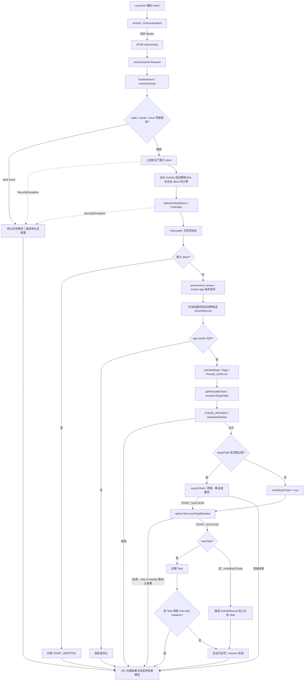

# 202 Android Launcher 到 ActivityStarter：Intent、权限、Task 与 ActivityRecord 启动决策

> 源码基线：Android 11 / API 30 / `android-11.0.0_r48`。
>
> 当前环境只有源码快照，能够证明静态分支、状态写入与返回语义，不能证明某台设备的一次点击实际命中了哪条分支；需要真机事实时，应另取日志、窗口层级或 trace。

桌面图标已经被点击，Launcher 也确实调用了 `startActivity()`，但这并不等于系统接下来一定会创建一个新的 Activity。相同的 Intent 在不同现场里，可能被拒绝、被系统页面接管、交给已有顶部实例、只把旧 Task 移到前台，或者才真正把一个新 `ActivityRecord` 放入目标 Task。

本章只追一个问题：**AOSP Launcher3 发出一笔普通同用户应用图标启动后，Android 11 的 `ActivityStarter` 怎样把可变的 Intent、调用者身份和现有窗口容器状态，收敛成唯一一次可解释的启动处置？**

核心结论是：`ActivityStarter` 不是“创建 Activity 的函数”，而是一笔启动事务的决策协调器。它先固定请求和身份，再解析目标、执行能力检查、处理策略改写，随后创建候选 `ActivityRecord`，最后依据 flags、launchMode、result 关系、Task 历史、display 与前后台约束选择终局。只有“新建或加入 Task”这一类终局才会把候选记录交给后续生命周期与进程链；其他成功码可能完全没有新 Java Activity 实例。

## 1. 先固定点击场景和本章完成点

贯穿主线采用以下前提：

1. 当前用户已解锁，AOSP Launcher3 处于前台，用户点击普通应用图标；
2. 图标不是 deep shortcut、promise icon，也不是跨用户入口；Launcher 走当前用户的 `Activity.startActivity()`；
3. Intent 是显式 `MAIN/LAUNCHER` 请求，初始 flags 含 `FLAG_ACTIVITY_NEW_TASK | FLAG_ACTIVITY_RESET_TASK_IF_NEEDED`；系统仍要验证组件并计算是否复用；
4. 不考虑测试用 `ActivityMonitor` 在客户端直接截住请求；
5. 目标不是 voice session、heavy-weight app 或安装器特例；这些分支存在，但不拿来遮住普通路径；
6. 既不预设目标进程是否存在，也不预设历史 Task 是否存在，因为这正是决策要回答的内容。

Launcher 虽然调用的是 `startActivity()`，`Activity` 仍会把自己的 activity token 作为 `resultTo` 传给服务端；只是普通启动的 `requestCode` 为负，因此能找到 `sourceRecord`，却不会建立等待结果的 `resultRecord`。同时，Launcher 已添加 `NEW_TASK`，所以“有来源 Activity”和“沿来源 Task 启动”并不是同义词。

本章的完成点记为 D0：**`ActivityStarter` 已产生内部结果，并把对应状态稳定地交给后续所有者，或已完成拒绝/排队/复用所需的清理。** D0 有多种合法形态：

| D0 类型 | 代表结果或动作 | D0 时是否已有新客户端 Activity 对象 |
|---|---|---|
| 立即失败 | 抛出安全异常，或返回解析、类、voice 等 fatal result | 否 |
| 兼容性终止 | 内部 `START_ABORTED`，外部可能映射为 `START_SUCCESS` | 否 |
| 延后处理 | `START_SWITCHES_CANCELED`，请求可能进入 pending launch | 否，当前调用未完成创建 |
| 复用既有对象 | 典型顶部路径以 `START_DELIVERED_TO_TOP`结束并投递新 Intent；`recycleTask()`也可能返回同码 | 否；是否投递必须回到具体分支 |
| 复用已有 Task | `START_TASK_TO_FRONT`，移动或重挂 Task | 通常否；清理规则也可能改变 Task 内容 |
| 新建/加入 | `START_SUCCESS`，候选记录加入新 Task 或既有 Task | 否；此时只有服务端记录，客户端对象仍待后续生命周期 |

D0 不是目标进程 attach、`Activity.onCreate()`、窗口 drawn 或首帧 present。第 201 章追踪这些后续交接；本章只把最前端决策做成可核对的账。

## 2. 一张决策图先分开五种对象

下面的箭头表示数据和控制权交接，不表示每个节点都会被所有请求经过。



阅读源码时最容易混淆的是五种不同对象：

| 对象 | 它回答的问题 | 可否在流程中被替换 |
|---|---|---|
| 原始 `Intent` | Launcher 想做什么 | 会复制；拦截后不再是最终目标 |
| `ResolveInfo` | PackageManager 的一次匹配结果是什么 | interceptor/review 可替换或重算；instant 分支沿用含 `auxiliaryInfo`的既有结果 |
| `ActivityInfo` | 最终候选组件有哪些 manifest 元数据 | 会随重定向改变 |
| `ActivityRecord` | system_server 如何表示这一次候选 Activity | 权限与改写完成后才创建；不等于已进 Task |
| `Task` | Activity 应放在哪个长期容器，是否复用历史 | 来自显式 taskId、搜索、来源或新建 |

把它们都简称为“目标 Activity”，就会看不见两个关键变化：一是系统页面可能替换原目标，二是候选 `ActivityRecord` 可能只服务于查找，最后实际收到 Intent 的却是历史记录。

## 3. Launcher 交付的是带上下文的请求，不是组件创建指令

AOSP Launcher3 的 `AppInfo.makeLaunchIntent()`先生成带显式 component 的 `ACTION_MAIN + CATEGORY_LAUNCHER` Intent，并设置 `NEW_TASK | RESET_TASK_IF_NEEDED`。普通图标入口位于 `ItemClickHandler.startAppShortcutOrInfoActivity()`：它取得图标携带的 Intent，再交给 `Launcher.startActivitySafely()`；基类 `BaseDraggingActivity.startActivitySafely()`先做安全模式检查，构造启动动画 options，再次补 `FLAG_ACTIVITY_NEW_TASK`并写入图标的 source bounds。

之后有三类入口分流：

| 图标条件 | 客户端调用 | 本章处理方式 |
|---|---|---|
| 当前用户普通应用 | `startActivity(intent, optsBundle)` | 主线 |
| 其他用户 | `LauncherApps.startMainActivity()` | 跨用户旁路，不套用普通入口参数 |
| legacy/deep shortcut | `startShortcutIntentSafely()` | 还含 shortcut 身份规则，排除 |

`Activity.startActivity()`进入 `startActivityForResult(..., -1, options)`，再由 `Instrumentation.execStartActivity()`迁移 stream extra 到 `ClipData`、调用 `prepareToLeaveProcess()`，并同步调用 `IActivityTaskManager.startActivity()`。这一层交付的不是“请 new 某个类”，而是一组仍需服务端裁决的输入：

```text
IApplicationThread caller
+ callingPackage / callingFeatureId
+ Intent / resolvedType
+ activity token(resultTo) / resultWho / requestCode
+ startFlags / profilerInfo / ActivityOptions
```

`Instrumentation`还有一条测试钩子：阻塞型 `ActivityMonitor`可在客户端直接返回，根本不发 Binder。若没有排除该钩子，“客户端未抛异常”甚至不能证明 ATMS 收到请求。本章主线已明确排除它，因此同步 Binder 正常返回至少证明 ATMS 的这次同步决策已经返回、且 `checkStartActivityResult()`没有把结果判成 fatal；但非 fatal 结果本来就不会抛异常，服务端还会把一个内部终止码伪装为成功，所以这仍不能证明新实例、目标进程或界面已经存在。

Launcher 自己的启动动画也不是目标应用回执。它可以在同步调用前后更新 UI，但目标的 Task 选择、进程启动和窗口提交均由别的所有者继续完成。

## 4. ATMS 先约束用户与包名，再借出一次性 Starter

普通 `IActivityTaskManager.startActivity()`在服务端先用 `UserHandle.getCallingUserId()`确定用户，然后转入私有 `startActivityAsUser()`。后者执行三项入口约束：

1. `assertPackageMatchesCallingUid(callingPackage)`防止调用者随意冒用包名；
2. `enforceNotIsolatedCaller()`拒绝 isolated 进程使用该入口；
3. `checkTargetUser()`按 Binder pid/uid 验证并归一化目标用户。

随后 `ActivityStartController.obtainStarter(intent, reason)`从最多三个对象的池中借出 `ActivityStarter`，链式写入 caller、包名、resolved type、result token、request code、options 和 userId，最后调用 `execute()`。`execute()`的 `finally`总会进入 `onExecutionComplete()`：Controller 先复制一份“最近一次 Starter”供诊断，再调用 `reset(true)`清空请求并把对象放回池中。

这解释了 `Request` 和 Starter 成员的分工：

| 区域 | 生命周期 | 典型字段 |
|---|---|---|
| `ActivityStarter.Request` | 从入口 setter 到本次 `execute()`结束 | 原始 caller、Intent、calling/real pid/uid、resultTo、options、user |
| Starter 工作区 | `startActivityInner()`一次计算期间 | `mLaunchFlags`、`mSourceRecord`、`mTargetTask`、`mTargetStack`、`mDoResume` |
| `mLastStarter`副本 | 为日志和 post processing 保留最近结果 | 最近原因、记录、结果和计算状态 |

因此不能把正在执行的 Starter 当成长期异步状态保存。真正跨阶段存活的是 `ActivityRecord`、`Task`、pending launch 等专门对象。

调用者身份还有两套坐标。`callingPid/Uid`表示逻辑发起者；`realCallingPid/Uid`表示实际进入当前 Binder 或内部入口的实体，PendingIntent 场景尤其可能不同。`Binder.clearCallingIdentity()`只把当前 system_server 线程切换到服务端执行身份，Request 中已经保存的业务身份仍用于解析、授权和后台启动判断。

## 5. resolve 阶段产出三份结果，并预检 URI 能力

`ActivityStarter.execute()`最先拒绝含文件描述符的 Intent。接着它短暂进入全局锁，通过 `resultTo`找到 caller record，建立 `ActivityMetricsLogger` 的 launching state；如果调用方没有预先提供 `ActivityInfo`，则在主要决策锁外调用 `Request.resolveActivity()`。

`Request.resolveActivity()`的关键顺序如下：

1. 从 Binder 现场补齐 `realCallingPid/Uid`；根据是否已有逻辑 UID、是否提供 `IApplicationThread`决定逻辑 pid/uid 的初值；
2. 若有 caller binder，短暂在全局锁内反查 `WindowProcessController`，只为得到更可靠的 resolved calling UID；
3. 保存 `ephemeralIntent`，再复制一份 Intent，避免直接修改客户端对象；
4. 调用 `resolveIntent()`取得 `ResolveInfo`，其过滤 UID 由 `computeResolveFilterUid()`决定；
5. 调用 `resolveActivity()`取得并调整 `ActivityInfo`；
6. 若存在 `ActivityInfo`，调用 UriGrantsManager 的 `checkGrantUriPermissionFromIntent()`计算 `NeededUriGrants`。

三份产物不能互换：

| 产物 | 静态含义 | 尚未证明的事 |
|---|---|---|
| `ResolveInfo` | 当前 user/filter 视角下的匹配 | 调用者被允许启动 |
| `ActivityInfo` | 选中组件的应用、权限、launchMode、affinity 等元数据 | 已有 Task 被选定 |
| `NeededUriGrants` | 原 Intent 到原目标所需 URI 授权的预检结果 | 授权已经提交，或可给重定向目标使用 |

显式 Intent 也不能跳过这一步：组件可能不存在、对当前 user 不可用或需要 manifest 权限。这里还不能把普通 package query 的可见性结论直接套过来：`ActivityStackSupervisor.resolveIntent()`调用 PackageManagerInternal 时传入 `resolveForStart=true`，完整应用的启动解析与 `queryIntentActivities()`一类查询的过滤边界不同；`filterCallingUid`仍显式参与 instant-app 与跨 profile 等语义。

隐式 Intent 在没有首选项且出现多个匹配时，PMS 可以返回合成的 `ResolverActivity`。`ChooserActivity`通常来自调用者以 `Intent.createChooser()`构造一个无显式 component 的 `ACTION_CHOOSER` Intent，再由 PackageManager 按系统 manifest filter 解析到该组件；它不是“多个匹配”自动选择的另一个名字。从解析完成起，后文必须跟实际 `ActivityInfo`，不能一直拿用户最初想去的应用当作当前目标。

URI grant 在这里是“为这个目标算出的能力方案”，真正授予要等 Task 决策通过。这样既避开主 WM 锁内的动态 URI 检查风险，也允许目标改变时整体丢弃旧能力。

## 6. caller token 与 result token 分别建立身份和结果链

进入 `executeRequest()`后，服务端若收到 `IApplicationThread caller`，会从 ATMS 进程表反查 `WindowProcessController`，并用其中 pid/uid 覆盖逻辑 calling 值。找不到 caller 进程时，结果置为 `START_PERMISSION_DENIED`。客户端传来的整数不能替代一个受服务端登记的 application-thread binder。

`resultTo`则是另一种 token。`RootWindowContainer.isInAnyStack(resultTo)`用它找 `sourceRecord`；只有 `requestCode >= 0`且来源没有 finishing，`resultRecord`才等于来源。对本章 Launcher 主线：

```text
sourceRecord = Launcher 的 ActivityRecord
resultRecord = null，因为 requestCode < 0
launchFlags 含 NEW_TASK
```

这三个条件同时成立，不应把 `resultTo`看到非空就误判为 `startActivityForResult()`。

`FLAG_ACTIVITY_FORWARD_RESULT`是结果链转移协议。如果同时指定非负 requestCode，源码立即 abort options 并返回 `START_FORWARD_AND_REQUEST_CONFLICT`；否则它把 source 原先的 `resultTo/resultWho/requestCode`交给新目标，清除 source 上的旧链接，并在同 UID trampoline 情形修正 launched-from package。

在权限门之前，源码还检查两类解析错误和 voice 兼容性：Intent 没有最终 component 对应 `START_INTENT_NOT_RESOLVED`，`ActivityInfo`为空对应 `START_CLASS_NOT_FOUND`。这些失败若已有 `resultRecord`，会先发送 `RESULT_CANCELED`，随后 abort `SafeActivityOptions`。因此一条完整失败证据至少应包含结果码、结果链收尾和 options 收尾，而不只是某条警告日志。

## 7. 授权是多门串联，throw、abort 与外部成功要分账

解析通过后，`executeRequest()`依次累积三道布尔门：

```java
boolean abort = !mSupervisor.checkStartAnyActivityPermission(/* ... */);
abort |= !mService.mIntentFirewall.checkStartActivity(/* ... */);
abort |= !mService.getPermissionPolicyInternal().checkStartActivity(/* ... */);
```

这里的 `|=`会求值右侧，所以在没有异常时三道检查都会运行；它们也不是同一种权限：

| 门 | 主要问题 | 拒绝表现 |
|---|---|---|
| `checkStartAnyActivityPermission()` | `START_ANY_ACTIVITY`特权、exported、组件/动作权限与 AppOps | 权限限制可直接抛 `SecurityException`；AppOps 限制返回 false |
| `IntentFirewall` | system_server 的 Intent 策略是否允许 | 返回 false，累积到 `abort` |
| `PermissionPolicyInternal` | r48 中主要拦截已移除的默认拨号器/短信切换 action | target Q+ 可返回 false；旧 target 放行时还会写 `EXTRA_CALLING_PACKAGE` |
| `SafeActivityOptions` | launchTaskId、TaskDisplayArea/display、lock-task option、remote animation 是否有权使用 | `getOptions()`校验失败可抛 `SecurityException` |
| `ActivityController` | 外部系统观察者是否允许本次开始 | 只收到去掉 extras 的 `cloneFilter()`；可把 `abort`置真 |

`checkStartAnyActivityPermission()`并非只看目标 Activity 的一个 permission。具有 `START_ANY_ACTIVITY`的调用者可提前通过；recents 向显式 inTask 启动也有特例。普通调用者则要经过组件 exported/permission、与特定 Intent action 关联的 runtime permission，以及对应 AppOps。voice 兼容性已在更早的错误检查中处理；通用 display/embedding 权限则主要由后面的 `SafeActivityOptions.getOptions()`检查，不能都归到这个方法。

执行顺序也要分清：三道布尔门完成后，只有 `abort`仍为 false 才计算后台限制；随后无论此前布尔值如何，代码都会由 `SafeActivityOptions`校验并合并 options，再调用 ActivityController 和 interceptor，最后才检查累计的 `abort`。options 权限异常不会经过 `START_ABORTED`兼容映射。

若布尔 `abort`最终为真，系统仅在 `resultRecord != null`时发送 `RESULT_CANCELED`，随后 abort checked options，并返回内部 `START_ABORTED`。本章 Launcher 主线没有 `resultRecord`，因此不存在这笔 result cancel。`execute()`结束前还会调用：

```java
static int getExternalResult(int result) {
    return result != START_ABORTED ? result : START_SUCCESS;
}
```

所以必须同时记录两本账：内部结果用于说明系统真正做了什么，外部结果用于说明客户端看见什么。权限检查直接抛出的 `SecurityException`不会先变成 `START_ABORTED`；而布尔策略拒绝可能在外部表现为正常返回。`START_SUCCESS`因而不能独自证明 `ActivityRecord`已创建，更不能证明新 Activity 实例出现。

## 8. 后台启动限制与 app-switch gate 控制的是不同阶段

前三道布尔门未拒绝时，`shouldAbortBackgroundActivityStart()`才评估后台 Activity 启动限制（background activity launch，BAL）。它按源码顺序寻找以下放行条件：

1. logical caller 是 root、system 或 NFC UID；
2. calling UID 有可见非 toast 窗口，或处于 persistent/persistent-UI 级；
3. real caller 与 logical caller 不同时，real UID 有可见窗口；
4. 两者不同时，real caller 是 persistent system process，且 `allowBackgroundActivityStart=true`；
5. 两者不同时，real UID 是关联 companion app；
6. calling UID 持有 `START_ACTIVITIES_FROM_BACKGROUND`，或是 recents、device owner、关联 companion app；
7. caller 进程或同 UID 其他进程的 `areBackgroundActivityStartsAllowed()`为 true；
8. calling UID 持有 `SYSTEM_ALERT_WINDOW`。

仅有 `originatingPendingIntent != null`不是独立豁免；它在这段方法中主要进入诊断日志。PendingIntent 相关的直接 allowance 是上面第 4 项的组合条件，不能泛化成“由 PendingIntent 发起就允许”。

方法返回 true 时，`executeRequest()`只把结果保存为 `restrictedBgActivity`，此处并不立即 return。限制会在两个后续位置生效：

1. `setInitialState()`在全局后台启动开关关闭时设置 `mAvoidMoveToFront=true`、`mDoResume=false`；
2. `isAllowedToStart()`仅当目标是新 Task，或既有目标 Task 中没有 calling UID 时，才调用 `handleBackgroundActivityAbort()`并返回 `START_ABORTED`。

也就是说，restricted 请求可能被彻底终止，也可能被允许写入调用者已经参与的 Task，但不把它带到前台。把方法名直译成“这里立刻 abort”会丢掉这一层延迟判定。

app-switch gate 是另一套时序控制。候选 `ActivityRecord`创建后，只有 `voiceSession == null`、focused stack 非空，并且“当前没有 resumed Activity，或其应用 UID 不等于 `realCallingUid`”时，才调用 `checkAppSwitchAllowedLocked()`。它可能暂时不允许切换：普通请求会被包装成 `PendingActivityLaunch`并返回 `START_SWITCHES_CANCELED`；如果同时是应终止的后台启动，则不入队。

| 机制 | 判断重点 | 发生位置 | 可能后果 |
|---|---|---|---|
| 能力/策略门 | 是否有资格请求目标 | 候选记录创建前 | throw 或内部 abort |
| 后台启动限制 | 后台主体能否带来新前台界面 | 先标记，Task 确定后裁决 | 终止，或留在现有 Task 且不前移 |
| app-switch gate | 当前是否允许跨应用切换前台 | 候选记录创建后 | pending launch / `START_SWITCHES_CANCELED` |

本章的 Launcher 处于可见前台，通常会在可见窗口豁免处通过后台检查；这只是本场景判断，不应推广到 PendingIntent 或后台服务发起的启动。

## 9. 目标一旦被系统改写，原 URI grants 必须作废

三道布尔门完成后，目标仍可能变化；即使 `abort`已经为 true，源码也会先完成 options/controller 处理并运行 interceptor，再到后面的统一 abort 判断。`ActivityStartInterceptor`按顺序检查 quiet profile、suspended package、lock-task violation package、harmful app 警告和 locked managed profile；命中后会替换 Intent、`ResolveInfo`、`ActivityInfo`、resolvedType、inTask、逻辑 `callingPid/callingUid`及 options，让系统中间页面成为当前真正目标。原 `IApplicationThread caller`和此前反查到的 `callerApp`不会被替换，后者仍传入 `ActivityRecord`构造器。

此外还有两类独立改写：

- 若目标包需要 permissions review，系统创建一次性 `IntentSender`保存原启动，改为 `ACTION_REVIEW_PERMISSIONS`，并重新解析 review Activity；`NEW_TASK/NEW_DOCUMENT`时还会补 `MULTIPLE_TASK`，避免不同应用错误复用同一个 review 实例。只有后续 review 流程实际发送该 IntentSender，原请求才会作为新事务再次进入启动链。
- 若 `ResolveInfo.auxiliaryInfo`非空，系统构造 instant-app installer Intent，切换到 real caller 身份并清空 grants；该代码随后使用已有的 `rInfo`调用 `resolveActivity()`取得安装器 `ActivityInfo`，没有在这里再调用一次 `resolveIntent()`查询。

三类改写共享同一条安全不变量：

```text
原 Intent → 原 ActivityInfo → 原目标专属 NeededUriGrants
                         × 目标改变后不可继续携带
新 Intent → 新 ActivityInfo → intentGrants = null
```

源码在 interceptor、permissions review 和 instant-app 三处都把 `intentGrants`清空。原因不是“中间页面暂时用不到”，而是 URI 能力绑定了原接收方；把它沿用给系统页面会造成 confused-deputy 式越权。review 流程若发送保存的 IntentSender，产生的是一笔新的解析与授权事务。

还要注意代码顺序：原目标先经过三道布尔门和 options/controller 检查，interceptor 随后才可替换目标；permissions-review 与 instant 分支又发生在 hard-abort 判断之后。这段代码不会把系统替代目标重新送回前面的同一组三道门。它们之所以可作为目标，是系统受控重定向路径，不能据此概括成“每个最终 `ActivityInfo`都在同一调用中重新逐项过原门”。

所以排查目标错乱时，要记录至少三列：客户端原 Intent、策略改写后的 Intent、最终用于构造 `ActivityRecord`的 `ActivityInfo`。只截取入口 Intent 会把合法重定向误诊成“系统启动了错误组件”。

## 10. ActivityRecord 只是最终目标的候选服务端记录

解析、能力门、后台标记和必要改写完成后，`executeRequest()`才调用 `new ActivityRecord(...)`。构造参数已经是最终 Intent、最终 `ActivityInfo`、解析后的 calling pid/uid、result 链、source、options 与当前 configuration。

构造函数会建立 application token，记录 launched-from 身份，处理 activity alias 对应的真实 `mActivityComponent`，保存 affinity、launchMode、processName、window 属性，并把状态设为 `INITIALIZING`。同时它初始不可见，`task`仍可能为 null。

这时三个常见推论都不成立：

| 已观察到 | 可以证明 | 不能证明 |
|---|---|---|
| `new ActivityRecord`执行 | 最终候选目标已有服务端身份和元数据 | 已加入 Task |
| `mLastStartActivityRecord = r` | 诊断字段暂时指向候选记录 | 它就是最后实际显示/收 Intent 的历史实例 |
| record 状态为 `INITIALIZING` | 服务端对象进入初态 | 客户端 Activity 对象已构造 |

若 app-switch 不允许，候选记录可能只进入 pending launch；若后续复用历史实例，`recycleTask()`还可能把 `mLastStartActivityRecord`改指向 Task 顶部；若后续 `startActivityUnchecked()`失败，`handleStartResult()`只在候选已经挂入 root Task 时调用 `finishIfPossible()`，尚无 parent 的候选只是未提交，空 stack 则按独立条件移除。ActivityRecord 因而是决策载体，不是“已 new Java Activity”的完成信号。

候选记录之后，服务端先处理 app-switch gate；允许继续时才调用 `onStartActivitySetDidAppSwitch()`、清理可执行的 pending starts，并进入 `startActivityUnchecked()`。

## 11. setInitialState 把 manifest、flags、来源与显示偏好放进同一工作区

`startActivityUnchecked()`先 `deferWindowLayout()`，在 `try`内调用 `startActivityInner()`，再在 `finally`里执行 `handleStartResult()`和 `continueWindowLayout()`。即使决策失败，窗口布局 defer 计数和半成品容器也必须收尾。

`startActivityInner()`第一步 `setInitialState()`会重置上次计算留下的成员，然后保存本次 record、Intent、source、inTask、options、calling UID 与 restricted 状态。它还分两阶段使用 `LaunchParamsController`：此处以 `PHASE_DISPLAY`先求 preferred TaskDisplayArea/windowing mode，找到候选 Task 后再以 `PHASE_BOUNDS`重算。

flags 不是客户端输入的只读常量。关键改写顺序包括：

1. `adjustLaunchFlagsToDocumentMode()`让 manifest 的 documentLaunchMode 与 `NEW_DOCUMENT/MULTIPLE_TASK`协调；`singleTask/singleInstance`会压掉冲突的 document flags；
2. 若候选 `ActivityRecord.resultTo`所代表的真实结果链与 `NEW_TASK`冲突，立即发送 `RESULT_CANCELED`并清除该字段，但新 Task 启动仍可继续；Request 只携带来源 token 而未形成 `resultRecord`时不触发此取消，本章 Launcher 主线正是如此；
3. `NEW_DOCUMENT`且无 result target 时补 `NEW_TASK`；`launchTaskBehind`或 document always 还会补 `MULTIPLE_TASK`；
4. 调用方要求不 resume、记录当前不可展示或 launch-behind 时，会设置 `delayedResume`并关闭 `mDoResume`；有效 `launchTaskId`的 task-overlay 还须同时满足 `canTaskOverlayResume=false`、目标 Task 有顶部且顶部不是 `RESUMED`，才会关闭 `mDoResume`并设置 `mAvoidMoveToFront`；若未进入 overlay 分支，`getAvoidMoveToFront=true`也会设置这两项；
5. restricted background 在全局开关关闭时也会设置 avoid-move 与 no-resume。

接着 `computeLaunchingTaskFlags()`验证显式 `inTask`，并处理没有 Activity 来源、来源是 `singleInstance`、目标是 `singleTask/singleInstance`等情况。没有 `sourceRecord`和合法 `inTask`时会强制 `NEW_TASK`；但本章 Launcher 主线本来已经携带该 flag。

`computeSourceStack()`再处理正在 finishing 的来源。这样的 Activity 所属 Task 可能正在消失，所以源码必要时补 `NEW_TASK`，仅保存可用于新 Task 的 info/intent，然后清掉 sourceRecord/sourceStack。来源 token 曾经有效，不代表它永远是安全的父容器。

## 12. 可复用 Task 是搜索结果，不是“同包即命中”

`getReusableTask()`先尊重 options 中的显式 launchTaskId；该 id 找不到时直接返回 null，不再落入通用搜索。没有显式 launchTaskId 时，只有满足以下总条件才搜索历史：`NEW_TASK`且没有 `MULTIPLE_TASK`，或 launchMode 为 `singleTask/singleInstance`，并且没有显式 `inTask`、没有 result target。

搜索策略随后分流：

| 条件 | 搜索入口 | 比较重点 |
|---|---|---|
| `singleInstance` | `RootWindowContainer.findActivity()` | 唯一历史 Activity；按组件或特定 filter 语义 |
| `LAUNCH_ADJACENT` | `findActivity()` | 只在历史中已有 Activity 时复用 |
| 一般 `NEW_TASK/singleTask` | `RootWindowContainer.findTask()` | preferred display 优先，再遍历其他 display area |

`findTask()`对每个候选还会排除 voice task、不同 user、无可用顶部、`singleInstance`顶部和不兼容 activity type。理想匹配要求 Task 的 `realActivity`或 `affinityIntent`组件与目标一致，并在 document 场景匹配 data；非 document 情况下，相同 `rootAffinity`只能成为次优候选，还要继续寻找理想匹配。因此包名相同、affinity 相同甚至组件相同，都不是脱离 user、document data、activity type 和 display 后的充分条件。

Home 还有跨 DisplayArea 保护：若候选或目标是 Home，而候选不在 preferred area，`ActivityStarter`放弃复用。多显示设备上不能为追求历史命中而把 Home 随意跨显示复用。

如果找到 `reusedTask`，它就是首个 targetTask；否则 `computeTargetTask()`按以下优先级决定承载位置：

1. 满足“无 result、无 inTask、不在 adding 状态且 NEW_TASK”时返回 null，明确表示应创建新 Task；
2. 有有效 sourceRecord 时使用来源 Task；
3. 有显式 inTask 时使用它；
4. 否则从计算出的 launch stack 顶部取得 Task；空 stack 会被移除，仍返回 null。

返回 null 是一种正常决策结果，不是查找异常。

## 13. 复用已有对象仍可能清栈、投递 Intent 或移动 Task

targetTask 确定后，`computeLaunchParams()`结合候选 Task 重算 bounds 与显示参数，`isAllowedToStart()`再检查最终位置。它会拒绝没有 package 的目标、不能放到 preferred display 的 Home、满足终止条件的后台启动，以及 lock-task mode violation。找到 Task 并不代表允许把目标放进去。

已有 Task 顶部非空时进入 `recycleTask()`。它先把 Task 放到合适 stack/display，再让 `complyActivityFlags()`解释 CLEAR/RESET/REORDER/single 语义：

| 规则 | 可能的结构动作 | 可能的 Intent 动作 |
|---|---|---|
| `NEW_TASK`与`CLEAR_TASK`同时存在 | 清空 Task，候选记录准备成为新根 | 更新 Task base intent |
| `CLEAR_TOP`、document intoExisting、singleTask/singleInstance | 清掉目标之上的记录；找不到目标则准备新增 | 找到目标时 `deliverNewIntent()` |
| `REORDER_TO_FRONT` | 把历史目标移到 Task 顶部 | 向该历史记录投递新 Intent |
| 根组件/Intent filter 条件 | 保持旧根、前移 Task，或决定在顶部新增 | singleTop 条件下可投递 |
| 普通既有 Task | 不重置 Task | 候选记录准备加入顶部 |

若无需新增，`recycleTask()`会调用 `resumeTargetStackIfNeeded()`：只有 `mDoResume=true`时才按目标 stack 是否 focusable，分别请求 resume 或 `ensureActivitiesVisible()`；为 false 时只 abort options，不执行这两项，随后仍更新该用户的 stack 记录。方法再依据 `mMovedToFront`标志返回 `START_TASK_TO_FRONT`或 `START_DELIVERED_TO_TOP`。该标志不总等同于肉眼理解的“执行过移动”：split-screen-top 特例即使调用了 Task 前移，也故意保持 false，以免返回 `START_TASK_TO_FRONT`触发异常动画。`START_FLAG_ONLY_IF_NEEDED`还可能返回 `START_RETURN_INTENT_TO_CALLER`。

即使没有在 Task 搜索阶段结束，`deliverToCurrentTopIfNeeded()`仍会检查当前 focused stack 顶部：组件和 user 相同、顶部已 attach、无 result target，并满足 `FLAG_ACTIVITY_SINGLE_TOP`或 `singleTop/singleTask` launchMode；Home 还要求 display area 与 preferred area 一致。条件成立后，若设置 `START_FLAG_ONLY_IF_NEEDED`，则不投递并返回 `START_RETURN_INTENT_TO_CALLER`；否则才向现有顶部记录调用 `deliverNewIntent()`并返回 `START_DELIVERED_TO_TOP`。

所以“复用”不是单一动作。它至少要回答三个问题：复用的是 Activity 还是 Task，Task 内容是否被 flags 改写，以及旧对象是否收到新 Intent。只看到 `START_TASK_TO_FRONT`不能推断 `onNewIntent()`一定发生；只看到 `onNewIntent()`也不能推断 Task 曾移动。

## 14. 新建路径先确定容器，再授予 URI 并请求可见性

若复用没有提前返回，系统取得 `mTargetStack`。targetTask 为 null 时，`setNewTask()`通过目标 stack 的 `reuseOrCreateTask()`建立容器并把候选记录加入其中；已有 Task 且 `mAddingToTask`为真时，`addOrReparentStartingActivity()`把记录添加或重挂到该 Task。新 Task 创建后还要再查一次 lock-task violation。

URI 能力要等最终接收记录明确后才提交。新建或加入 Activity 的路径在 Task 归属确定后执行：

```java
mService.mUgmInternal.grantUriPermissionUncheckedFromIntent(
        intentGrants, mStartActivity.getUriPermissionsLocked());
```

复用已有 Activity 的路径则由 `deliverNewIntent()`进入 `ActivityRecord.deliverNewIntentLocked()`，先把同一份 grants 授给历史记录的 URI owner，再立即调度或排队 `ReferrerIntent`。两条路径共同形成完整安全链：先对原目标预检，目标改写则清空，最终接收者确定后才提交。把 `checkGrant...`误写成已经授权，或只追新建路径，都会漏掉保护点。

随后 `ActivityStack.startActivityLocked()`准备 transition、starting window 和可见性。`mDoResume=true`时，若目标 stack 不可 focus，或目标之上有 task overlay，源码调用 `ensureActivitiesVisible()`并显式执行 transition；否则由 `RootWindowContainer.resumeFocusedStacksTopActivities()`接手。`mDoResume=false`时，此处两条分支都不执行，等待其他状态变化继续推进。最后更新 user stack、recent tasks 和 non-resizable 处置。

这仍没有直接构造 App 进程中的 Activity。下游可见性/生命周期算法会在需要时走 `startSpecificActivity()`：已有进程可直接 real-start，不存在则发起进程启动。第 201 章已经追踪该异步链；下一章则深入 `ActivityRecord → Task → RootWindowContainer`的长期层级、焦点和生命周期状态。

对已经进入 `startActivityUnchecked()`、且 `startActivityInner()`返回非成功类别的请求，`handleStartResult()`先检查候选是否已经有 root Task：只有已挂入时才调用 `finishIfPossible()`，入 Task 前被拒绝的候选不会走这一步。随后它独立检查本次 `startedActivityStack`，仅在仍挂于 display、没有 Activity 且不是 Home 时移除空 stack。`continueWindowLayout()`位于同一 `finally`，所以凡已进入该方法的请求都会恢复布局事务。这些清理或“不提交”状态同样属于 D0，而不是附带细节。

## 15. 用终局矩阵定位第一处与预期不一致的决策

静态源码能给出“若条件成立则走哪条边”，设备现场还要提供条件是否成立。排查时可把一次启动压成下面八列：

```text
原 Intent
→ logical / real caller
→ ResolveInfo / ActivityInfo
→ 能力门与 restricted 标记
→ 改写后的最终目标
→ launch flags / launchMode / result 关系
→ reusedTask / targetTask / display
→ 内部 result 与最终状态所有者
```

常见观察的正确边界如下：

| 观察 | 首先核对 | 不应直接推断 |
|---|---|---|
| 客户端抛 `ActivityNotFoundException` | component、`ResolveInfo/ActivityInfo`、fatal result | 权限门曾完整执行 |
| 客户端抛 `SecurityException` | exported、组件/动作 permission、caller pid/uid | 一定经过外部 `START_ABORTED→SUCCESS`映射 |
| 客户端正常返回但无界面 | 内部 `START_ABORTED`、restricted background、pending app switch | 新记录已经加入 Task |
| 收到 `onNewIntent()` | 顶部投递或清栈/重排中的历史实例 | 创建了新 Activity 对象 |
| 旧页面重新出现 | `mMovedToFront`、Task reparent、`START_TASK_TO_FRONT` | Intent 一定投递给顶部 |
| 有候选 ActivityRecord | parent Task、`handleStartResult()`、`mLastStartActivityRecord`是否被改指 | 客户端 lifecycle 已开始 |
| Task 被找到却未启动 | `isAllowedToStart()`、lock-task、display、后台限制 | 搜索算法出错 |
| record 已加入 Task 仍未前台 | `mDoResume/mAvoidMoveToFront`、focusability、overlay | 目标进程或绘制一定失败 |

普通 Launcher 请求的 `waitResult`为 null，同步 Binder 等到的是服务端决策返回，不等进程、`onCreate()/onResume()`或首帧。`startActivityAndWait`等专用入口才会进入 `waitForResult()`：普通 `START_SUCCESS`会等待 activity-launched 报告，这条账通常由 windows-drawn 路径推进；`START_TASK_TO_FRONT`可能等待目标 visible，`START_DELIVERED_TO_TOP`则直接填写结果。这些等待口径仍不能统一替代图形 present。

r48 的常见非 fatal 结果也应放在同一张终局表里：

| 值 | 内部结果 | 本次决策的最小含义 | 普通客户端表现 |
|---:|---|---|---|
| 0 | `START_SUCCESS` | 新建/加入路径被接受 | `checkStartActivityResult()`不抛异常 |
| 1 | `START_RETURN_INTENT_TO_CALLER` | `ONLY_IF_NEEDED`判定无需执行 | 不抛异常 |
| 2 | `START_TASK_TO_FRONT` | 历史 Task 被带到前台 | 不抛异常 |
| 3 | `START_DELIVERED_TO_TOP` | 复用路径结束；是否实际投递要看具体分支 | 不抛异常 |
| 100 | `START_SWITCHES_CANCELED` | app switch 暂停，可能已保存 pending launch | 不抛异常，也不会被改成 0 |
| 101 | `START_RETURN_LOCK_TASK_MODE_VIOLATION` | lock-task 约束阻止当前处置 | 不抛异常，也不会被改成 0 |
| 102 | `START_ABORTED` | 策略或后台规则内部终止 | `getExternalResult()`单独把它映射为 0 |
| 负值 | fatal results | 解析、类、权限、参数等硬失败 | `Instrumentation`按具体值抛异常 |

沿用第 201 章的记号：N/X 分别表示同前提下的正常样本与异常样本，L 是两者最后一个仍一致且正确的节点，F 是第一个出现分歧的节点。本章应记录 L/F，而不重定义 N/X。例如 L=`final ActivityInfo`、F=`new ActivityRecord`，先查能力门和改写；L=`ActivityRecord`、F=`targetTask`，先查 app-switch、flags 和可复用搜索；L=`targetTask`、F=`startActivityLocked`，先查 `isAllowedToStart/recycleTask/deliverToCurrentTopIfNeeded`。

贯穿全章的五条不变量是：

1. resolve 成功不等于 authorization 成功；
2. 目标改变时，原目标的 URI grants 不得沿用；
3. `sourceRecord`、`resultRecord`与 targetTask 是三种关系，不能互相替代；
4. 候选 `ActivityRecord`不等于已加入 Task，更不等于客户端实例；
5. 外部 success、内部 success、Task 前移和新实例创建是四个不同事实。

## 16. 九组只读练习重建一次完整决策

以下命令只读取源码。每组都先确认文件存在，再输出足以手工连线的命中；可在 Android 源码根目录直接运行，也可预先设置 `ANDROID_BUILD_TOP`。

### 练习 1：证明普通图标从 Launcher 进入同步 ATMS 调用

```bash
set -euo pipefail
SRC="${ANDROID_BUILD_TOP:-$PWD}"
APPINFO="$SRC/packages/apps/Launcher3/src/com/android/launcher3/model/data/AppInfo.java"
ITEM="$SRC/packages/apps/Launcher3/src/com/android/launcher3/touch/ItemClickHandler.java"
BASE="$SRC/packages/apps/Launcher3/src/com/android/launcher3/BaseDraggingActivity.java"
ACT="$SRC/frameworks/base/core/java/android/app/Activity.java"
INST="$SRC/frameworks/base/core/java/android/app/Instrumentation.java"
ATMS="$SRC/frameworks/base/services/core/java/com/android/server/wm/ActivityTaskManagerService.java"
test -f "$APPINFO" && test -f "$ITEM" && test -f "$BASE" && test -f "$ACT" && test -f "$INST" && test -f "$ATMS"
rg -n 'makeLaunchIntent|ACTION_MAIN|CATEGORY_LAUNCHER|FLAG_ACTIVITY_NEW_TASK|FLAG_ACTIVITY_RESET_TASK_IF_NEEDED' "$APPINFO" | sed -n '1,32p'
rg -n 'startAppShortcutOrInfoActivity|startActivitySafely' "$ITEM" | sed -n '1,32p'
rg -n 'FLAG_ACTIVITY_NEW_TASK|startActivity\(intent, optsBundle\)|startMainActivity' "$BASE" | sed -n '1,28p'
rg -n 'startActivityForResult\(|execStartActivity\(' "$ACT" | sed -n '1,32p'
rg -n 'ActivityMonitor|isBlocking\(|migrateExtraStreamToClipData|prepareToLeaveProcess|ActivityTaskManager.getService\(\).startActivity|checkStartActivityResult' "$INST" | sed -n '1,44p'
rg -n 'final int startActivity\(|UserHandle.getCallingUserId|private int startActivityAsUser' "$ATMS" | sed -n '1,28p'
```

先确认 Launcher 补了 `NEW_TASK`，再确认普通当前用户分支没有走 `LauncherApps`。最后写出客户端交给 Binder 的 token、package、Intent、requestCode 与 options；不要把同步返回标成 Activity 创建完成。

### 练习 2：确认 Request 与可回收 Starter 的生命周期

```bash
set -euo pipefail
SRC="${ANDROID_BUILD_TOP:-$PWD}"
ATMS="$SRC/frameworks/base/services/core/java/com/android/server/wm/ActivityTaskManagerService.java"
ASC="$SRC/frameworks/base/services/core/java/com/android/server/wm/ActivityStartController.java"
STARTER="$SRC/frameworks/base/services/core/java/com/android/server/wm/ActivityStarter.java"
test -f "$ATMS" && test -f "$ASC" && test -f "$STARTER"
rg -n 'obtainStarter\(intent|setCaller\(|setCallingPackage\(|setResultTo\(|setUserId\(|\.execute\(' "$ATMS" | sed -n '1,44p'
rg -n 'ActivityStarter obtainStarter|onExecutionComplete|mLastStarter.set|mFactory.recycle' "$ASC" | sed -n '1,28p'
rg -n 'MAX_STARTER_COUNT|SynchronizedPool|ActivityStarter obtain\(|void recycle\(|reset\(true' "$STARTER" | sed -n '1,36p'
rg -n 'static class Request|void reset\(\)|realCallingPid|realCallingUid|allowBackgroundActivityStart' "$STARTER" | sed -n '1,52p'
```

把入口 setter 写入的 Request 字段与 `startActivityInner()`工作区分成两栏。解释为什么异步逻辑不能长期保存借来的 Starter，以及 `mLastStarter`副本为何不等于仍在执行的事务。

### 练习 3：重建锁外解析与 URI grant 预检

```bash
set -euo pipefail
SRC="${ANDROID_BUILD_TOP:-$PWD}"
STARTER="$SRC/frameworks/base/services/core/java/com/android/server/wm/ActivityStarter.java"
SUP="$SRC/frameworks/base/services/core/java/com/android/server/wm/ActivityStackSupervisor.java"
PMS="$SRC/frameworks/base/services/core/java/com/android/server/pm/PackageManagerService.java"
MANIFEST="$SRC/frameworks/base/core/res/AndroidManifest.xml"
test -f "$STARTER" && test -f "$SUP" && test -f "$PMS" && test -f "$MANIFEST"
rg -n 'hasFileDescriptors|notifyActivityLaunching|activityInfo == null|mRequest.resolveActivity|synchronized \(mService.mGlobalLock\)|clearCallingIdentity' "$STARTER" | sed -n '1,52p'
sed -n '444,525p' "$STARTER"
rg -n 'resolveIntent\(|resolveActivity\(|checkGrantUriPermissionFromIntent|computeResolveFilterUid|ephemeralIntent = new Intent|intent = new Intent' "$STARTER" | sed -n '1,60p'
rg -n 'ResolveInfo resolveIntent|ActivityInfo resolveActivity' "$SUP" | sed -n '1,28p'
rg -n 'resolveForStart|!resolveForStart|shouldFilterApplicationLocked' "$PMS" | sed -n '1,52p'
rg -n 'ResolverActivity|ACTION_CHOOSER|ChooserActivity' "$PMS" "$MANIFEST" | sed -n '1,44p'
```

按源码顺序标出 real caller、resolved caller、Intent copy、`ResolveInfo`、`ActivityInfo`和 `NeededUriGrants`。再说明为何预检与真正授予不是同一个完成点。

### 练习 4：区分 sourceRecord、resultRecord 与失败收尾

```bash
set -euo pipefail
SRC="${ANDROID_BUILD_TOP:-$PWD}"
STARTER="$SRC/frameworks/base/services/core/java/com/android/server/wm/ActivityStarter.java"
AM="$SRC/frameworks/base/core/java/android/app/ActivityManager.java"
INST="$SRC/frameworks/base/core/java/android/app/Instrumentation.java"
test -f "$STARTER" && test -f "$AM" && test -f "$INST"
rg -n 'isInAnyStack\(resultTo\)|requestCode >= 0|FLAG_ACTIVITY_FORWARD_RESULT|START_FORWARD_AND_REQUEST_CONFLICT|removeResultsLocked|sendResult\(INVALID_UID' "$STARTER" | sed -n '1,60p'
rg -n 'START_INTENT_NOT_RESOLVED|START_CLASS_NOT_FOUND|START_FORWARD_AND_REQUEST_CONFLICT|START_NOT_VOICE_COMPATIBLE' "$AM" | sed -n '1,36p'
rg -n 'checkStartActivityResult|ActivityNotFoundException|SecurityException|START_FORWARD_AND_REQUEST_CONFLICT' "$INST" | sed -n '1,44p'
```

分别画普通 Launcher、`startActivityForResult()`和 `FORWARD_RESULT`三种关系。为每种早期失败补上 result cancel、options abort 与客户端异常是否发生。

### 练习 5：把多道策略门和结果映射分开

```bash
set -euo pipefail
SRC="${ANDROID_BUILD_TOP:-$PWD}"
STARTER="$SRC/frameworks/base/services/core/java/com/android/server/wm/ActivityStarter.java"
SUP="$SRC/frameworks/base/services/core/java/com/android/server/wm/ActivityStackSupervisor.java"
SAFE="$SRC/frameworks/base/services/core/java/com/android/server/wm/SafeActivityOptions.java"
POLICY="$SRC/frameworks/base/services/core/java/com/android/server/policy/PermissionPolicyService.java"
AM="$SRC/frameworks/base/core/java/android/app/ActivityManager.java"
test -f "$STARTER" && test -f "$SUP" && test -f "$SAFE" && test -f "$POLICY" && test -f "$AM"
rg -n 'checkStartAnyActivityPermission|mIntentFirewall.checkStartActivity|getPermissionPolicyInternal\(\).checkStartActivity|cloneFilter\(|activityStarting\(' "$STARTER" | sed -n '1,36p'
rg -n 'START_ANY_ACTIVITY|getComponentRestrictionForCallingPackage|getActionRestrictionForCallingPackage|ACTIVITY_RESTRICTION_APPOP|throw new SecurityException' "$SUP" | sed -n '1,60p'
rg -n 'void checkPermissions|getLaunchTaskId|getLaunchTaskDisplayArea|getLaunchDisplayId|getLockTaskMode|getRemoteAnimationAdapter|throw new SecurityException' "$SAFE" | sed -n '1,60p'
rg -n 'boolean checkStartActivity|ACTION_CHANGE_DEFAULT_DIALER|ACTION_CHANGE_DEFAULT|VERSION_CODES.Q|EXTRA_CALLING_PACKAGE' "$POLICY" | sed -n '1,40p'
rg -n 'if \(abort\)|return START_ABORTED|static int getExternalResult|result != START_ABORTED' "$STARTER" | sed -n '1,36p'
rg -n 'START_SUCCESS|START_ABORTED|isStartResultFatalError|isStartResultSuccessful' "$AM" | sed -n '1,36p'
```

给每道门标注“throw”还是“boolean abort”。最后写一个反例，说明外部 `START_SUCCESS`为何不能证明内部结果也是 `START_SUCCESS`。

### 练习 6：验证后台标记、app-switch 与三类目标改写

```bash
set -euo pipefail
SRC="${ANDROID_BUILD_TOP:-$PWD}"
STARTER="$SRC/frameworks/base/services/core/java/com/android/server/wm/ActivityStarter.java"
INTERCEPT="$SRC/frameworks/base/services/core/java/com/android/server/wm/ActivityStartInterceptor.java"
test -f "$STARTER" && test -f "$INTERCEPT"
rg -n 'shouldAbortBackgroundActivityStart|isAnyNonToastWindowVisibleForUid|START_ACTIVITIES_FROM_BACKGROUND|isCallerRecents|isDeviceOwner|isAssociatedCompanionApp|SYSTEM_ALERT_WINDOW' "$STARTER" | sed -n '1,72p'
rg -n 'mRestrictedBgActivity|isBackgroundActivityStartsEnabled|newTask \|\| !targetTask.isUidPresent|handleBackgroundActivityAbort|START_SWITCHES_CANCELED|PendingActivityLaunch' "$STARTER" | sed -n '1,60p'
rg -n 'interceptQuietProfileIfNeeded|interceptSuspendedPackageIfNeeded|interceptLockTaskModeViolationPackageIfNeeded|interceptHarmfulAppIfNeeded|interceptLockedManagedProfileIfNeeded' "$INTERCEPT" | sed -n '1,44p'
rg -n 'isPermissionsReviewRequired|ACTION_REVIEW_PERMISSIONS|auxiliaryInfo|createLaunchIntent|intentGrants = null' "$STARTER" | sed -n '1,60p'
```

把 restricted flag 从产生点追到两个消费点，再把 app-switch pending 单列。对每次 Intent 改写，核对最终 `ActivityInfo`与 `intentGrants`是否同步更新或清空。

### 练习 7：还原 flags、result 与来源 Task 的改写顺序

```bash
set -euo pipefail
SRC="${ANDROID_BUILD_TOP:-$PWD}"
STARTER="$SRC/frameworks/base/services/core/java/com/android/server/wm/ActivityStarter.java"
test -f "$STARTER"
rg -n 'void setInitialState|PHASE_DISPLAY|PHASE_BOUNDS|computeLaunchParams|adjustLaunchFlagsToDocumentMode|sendNewTaskResultRequestIfNeeded|FLAG_ACTIVITY_NEW_DOCUMENT|FLAG_ACTIVITY_MULTIPLE_TASK' "$STARTER" | sed -n '1,76p'
rg -n 'void computeLaunchingTaskFlags|non-Activity context; forcing|LAUNCH_SINGLE_INSTANCE|LAUNCH_SINGLE_TASK|mReuseTask = mInTask' "$STARTER" | sed -n '1,72p'
rg -n 'void computeSourceStack|mSourceRecord.finishing|mNewTaskInfo|mNewTaskIntent|mSourceRecord = null' "$STARTER" | sed -n '1,48p'
rg -n 'mDoResume =|mAvoidMoveToFront =|delayedResume|canTaskOverlayResume|isBackgroundActivityStartsEnabled' "$STARTER" | sed -n '1,52p'
```

不要按文件中的字段赋值孤立阅读。以“输入 flags → document 改写 → result 取消 → Task flags → finishing source → resume 状态”为序写出一张变换表。

### 练习 8：证明 Task 命中依赖组件、document、affinity、user 与 display

```bash
set -euo pipefail
SRC="${ANDROID_BUILD_TOP:-$PWD}"
STARTER="$SRC/frameworks/base/services/core/java/com/android/server/wm/ActivityStarter.java"
ROOT="$SRC/frameworks/base/services/core/java/com/android/server/wm/RootWindowContainer.java"
TDA="$SRC/frameworks/base/services/core/java/com/android/server/wm/TaskDisplayArea.java"
test -f "$STARTER" && test -f "$ROOT" && test -f "$TDA"
rg -n 'Task getReusableTask|getLaunchTaskId|putIntoExistingTask|findActivity\(|findTask\(|computeTargetTask|isAllowedToStart' "$STARTER" | sed -n '1,68p'
rg -n 'class FindTaskResult|voiceSession|different user|realActivity.*compareTo|affinityIntent|isDocument =|documentData|taskDocumentData|rootAffinity|mIdealMatch' "$ROOT" | sed -n '1,80p'
rg -n 'findTaskLocked|isPreferredDisplayArea|affinity match|mIdealMatch' "$TDA" | sed -n '1,44p'
rg -n 'isActivityTypeHome|preferredTaskDisplayArea|canStartHomeOnDisplayArea' "$STARTER" | sed -n '1,40p'
```

把 ideal component/document match 与 affinity candidate 分开，再标出 preferred display 和 Home 特例。以 `documentData/taskDocumentData`的直接比较为准，不要把整个 Intent 当成 Task 搜索键。

### 练习 9：枚举投递、前移、新建与清理四个终局

```bash
set -euo pipefail
SRC="${ANDROID_BUILD_TOP:-$PWD}"
STARTER="$SRC/frameworks/base/services/core/java/com/android/server/wm/ActivityStarter.java"
ROOT="$SRC/frameworks/base/services/core/java/com/android/server/wm/RootWindowContainer.java"
AR="$SRC/frameworks/base/services/core/java/com/android/server/wm/ActivityRecord.java"
test -f "$STARTER" && test -f "$ROOT" && test -f "$AR"
rg -n 'new ActivityRecord|mLastStartActivityRecord|PendingActivityLaunch|startActivityUnchecked' "$STARTER" | sed -n '1,52p'
rg -n 'ActivityRecord\(ActivityTaskManagerService|setState\(INITIALIZING|ActivityRecord ctor' "$AR" | sed -n '1,36p'
rg -n 'int recycleTask|complyActivityFlags|deliverToCurrentTopIfNeeded|deliverNewIntent|setNewTask|addOrReparentStartingActivity' "$STARTER" | sed -n '1,72p'
rg -n 'START_RETURN_INTENT_TO_CALLER|START_TASK_TO_FRONT|START_DELIVERED_TO_TOP|return START_SUCCESS' "$STARTER" | sed -n '1,60p'
rg -n 'grantUriPermissionUncheckedFromIntent|startActivityLocked|resumeFocusedStacksTopActivities|ensureActivitiesVisible|mRecentTasks.add' "$STARTER" | sed -n '1,64p'
rg -n 'deliverNewIntentLocked|grantUriPermissionUncheckedFromIntent|scheduleNewIntent|newIntents' "$AR" | sed -n '1,48p'
rg -n 'handleStartResult|finishIfPossible|removeIfPossible|continueWindowLayout' "$STARTER" | sed -n '1,48p'
rg -n 'boolean resumeFocusedStacksTopActivities|resumeTopActivityUncheckedLocked|ensureActivitiesVisible' "$ROOT" | sed -n '1,40p'
```

为每个返回码记录：最后实际拥有状态的是新候选 record、历史 Activity、历史 Task，还是 pending queue。最后确认 URI grant、Task parent 和 resume 请求只出现在相应终局，任何一个都不能替代下一章要分析的长期层级与生命周期状态。

完成九组练习后，应能从同一笔 Launcher 请求推导出唯一终局，而不是把所有可能分支串成一条假调用链。下一章进入第 203 章《Android ActivityRecord、Task 与 RootWindowContainer：层级、焦点和生命周期状态》。
