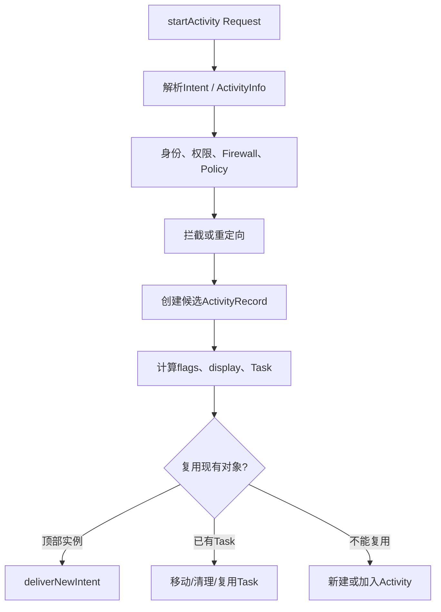

# 202 Android Launcher 到 ActivityStarter：Intent、权限、Task 与 ActivityRecord 启动决策

> 源码版本：Android 11 `android-11.0.0_r48`。  
> 本章只读本地源码，不在Mac上编译；命令练习均为`rg`/`sed`等只读操作。

## 1. 本章目标

上一章把冷启动画成总链，本章专门拆system_server接到`startActivity`以后、真正启动进程以前的决策。

要分清四件事：Intent解析到谁、调用者是否允许、使用哪个Task/Activity、对外返回什么结果。

## 2. ActivityStarter不是固定新建流程



一次“成功启动”可能根本没有创建新的Activity实例。

## 3. 主要源码入口

- `frameworks/base/services/core/java/com/android/server/wm/ActivityTaskManagerService.java`
- `frameworks/base/services/core/java/com/android/server/wm/ActivityStarter.java`
- `ActivityStackSupervisor.java`
- `RootWindowContainer.java`
- `Task.java`、`ActivityRecord.java`

阅读时先围绕`ActivityStarter.execute()`，不要从整个WMS目录顺读。

## 4. Request是输入快照

`ActivityStarter.Request`汇集Intent、caller、calling pid/uid、real caller、calling package、user、resultTo、requestCode、options、inTask、reason和已解析结果。

这些字段有的来自Binder现场，有的由上层代表其他调用者填写，不能只看一个UID。

## 5. Starter会被回收复用

ActivityStartController通过Factory取得ActivityStarter，执行完成后`onExecutionComplete()`重置状态并回收。成员字段是一次请求的工作区，不是跨启动永久记录。

因此异步代码不能随意长期持有这个可复用Starter对象。

## 6. execute先拒绝Intent里的FD

r48首先检查`Intent.hasFileDescriptors()`并抛出异常，防止未按预期传播文件描述符。

这发生在常规解析和Task决策之前，是输入结构安全门。

## 7. 启动测量从这里建立

`execute()`在全局锁内根据result token找caller ActivityRecord，并调用ActivityMetricsLogger的`notifyActivityLaunching()`。

LaunchingState用于把后续launched、transition、starting window和windows drawn串成同一次启动统计。

## 8. 解析为何可在锁外发生

当Request尚无ActivityInfo时，`mRequest.resolveActivity(mSupervisor)`在进入主要全局锁临界区前执行。源码注释还提醒：持WM锁时动态URI权限解析可能造成死锁约束。

“启动决策在全局锁内”不等于每个准备步骤都在锁内。

## 9. resolveIntent与resolveActivity

resolveIntent向PackageManager查询匹配结果，得到ResolveInfo；resolveActivity再提取/调整ActivityInfo，并考虑user、start flags、profiler等条件。

ResolveInfo描述解析结果，ActivityInfo描述最终组件元数据，两者不是Task实例。

## 10. 显式与隐式Intent

显式Intent已有component，仍需确认组件存在与可访问；隐式Intent按action/category/data/type和包可见性等规则解析。

`intent.getComponent()==null`在解析完成后仍为空会得到`START_INTENT_NOT_RESOLVED`，ActivityInfo为空则可能是`START_CLASS_NOT_FOUND`。

## 11. Resolver/Chooser是实际目标

多个匹配或需要用户选择时，系统可能把ResolverActivity/ChooserActivity作为本次真正启动的Activity。不能把解析前原始Intent目标直接当最终ActivityRecord组件。

## 12. effective caller与real caller

Request同时保存callingPid/Uid和realCallingPid/Uid。前者可能代表被代理的逻辑调用者，后者是实际进入Binder/内部入口的身份。

PendingIntent、系统代理和后台启动判断会用到不同身份，混用会制造权限漏洞。

## 13. caller ApplicationThread校验

若提供IApplicationThread，ActivityStarter会从ATMS进程表反查WindowProcessController，并用其中pid/uid覆盖逻辑calling值。找不到caller进程时返回权限错误。

客户端不能靠伪造整数pid/uid冒充已有ApplicationThread。

## 14. clearCallingIdentity的正确理解

`execute()`在进入内部启动算法前clear Binder identity，避免system_server后续内部调用继续以外部UID运行；但Request里已保存calling/real calling身份供业务校验。

清身份不是“忘掉调用者”，而是分离Binder执行身份与显式业务身份。

## 15. resultTo怎样找到来源Activity

`resultTo`是Activity token。RootWindowContainer用它找sourceRecord；requestCode非负且来源未finishing时才建立resultRecord。

App对象引用不会跨进程传给ATMS，token才是system_server可验证的实例身份。

## 16. FORWARD_RESULT

`FLAG_ACTIVITY_FORWARD_RESULT`把来源Activity原本的结果目标转交给新Activity；若同时又指定requestCode会返回`START_FORWARD_AND_REQUEST_CONFLICT`。

这是结果链转移，不是普通`startActivityForResult`叠一层。

## 17. 失败时结果怎样收尾

解析或兼容性检查在创建目标前失败时，若已有resultRecord，系统发送`RESULT_CANCELED`，同时abort ActivityOptions。

否则调用者可能永远等待一个不会产生的结果。

## 18. 第一组权限门

```java
boolean abort = !mSupervisor.checkStartAnyActivityPermission(/*...*/);
abort |= !mService.mIntentFirewall.checkStartActivity(/*...*/);
abort |= !mService.getPermissionPolicyInternal()
        .checkStartActivity(intent, callingUid, callingPackage);
```

这里是多门串联，不是一次Manifest permission判断。

## 19. checkStartAnyActivityPermission

它综合`START_ANY_ACTIVITY`特权、目标exported、目标声明权限、calling uid/pid、result关系、task/voice等条件。普通App通常依赖目标Activity对外暴露和所需权限满足。

不能仅凭Intent能resolve就断言能启动。

## 20. IntentFirewall

Intent Firewall可按系统规则阻止Activity启动。它独立于目标Manifest权限，属于system_server额外策略层。

排查“解析成功但未启动”时要区分permission denial与firewall rejection。

## 21. PermissionPolicyInternal

权限策略服务还能基于调用包和目标Intent做运行时裁决。多层门的目的不同，修改时不应为“方便跳转”整体旁路。

## 22. 后台Activity启动判断

在前三类硬拒绝未发生后，`shouldAbortBackgroundActivityStart()`评估calling/real UID的可见窗口、持久进程、权限、recents/device owner/companion、PendingIntent许可和进程状态等豁免。

其结果在r48保存为`restrictedBgActivity`，后续还结合全局开关和启动路径处理，不能简单等同为此处立即return。

## 23. 为什么后台限制与权限拒绝不同

权限拒绝意味着调用能力不足；后台启动限制是前后台政策。r48部分兼容路径会对外伪装成功、取消result或避免把Activity移到前台。

日志、内部result和调用者看到的result可能不同。

## 24. ActivityController观察者

若设置系统ActivityController，ActivityStarter把去除extras的`cloneFilter()`交给controller，避免观察者直接看到Intent中潜在私密数据。

远端controller死亡时会清除记录，而不是让所有后续启动永久失败。

## 25. ActivityStartInterceptor

工作资料quiet mode、应用suspended、锁屏凭据确认等场景可拦截原启动，替换Intent、ResolveInfo、ActivityInfo、caller和options。

拦截不是“拒绝”，而可能是先启动一个系统中间页面。

## 26. 重定向后为何清URI grants

原目标需要的URI授权不能自动送给拦截页面。因此源码在intercept命中后令`intentGrants=null`。

这是典型的“目标身份改变，能力不可沿用”安全不变量。

## 27. 权限审查重定向

若PackageManager要求旧式permissions review，系统创建一次性PendingIntent保存原启动，再改为review Activity；review结束后才继续原Intent。

NEW_TASK/NEW_DOCUMENT场景还可能增加MULTIPLE_TASK，避免不同应用错误复用同一review实例。

## 28. Instant App重定向

ResolveInfo含auxiliaryInfo时，ActivityStarter构造instant app installer Intent，并重新解析安装器Activity；同样清除面向原目标的URI grants。

源码存在该路径不代表产品每次隐式启动都会使用它。

## 29. abort为何可能对外成功

硬策略abort内部返回`START_ABORTED`，而`getExternalResult()`把它映射为`START_SUCCESS`：

```java
static int getExternalResult(int result) {
    return result != START_ABORTED ? result : START_SUCCESS;
}
```

这是兼容行为，所以API成功码不能单独证明界面真的启动。

## 30. ActivityRecord何时创建

完成解析、权限、策略和必要重定向后，才用最终Intent/ActivityInfo/caller/result/options/source创建候选ActivityRecord，并保存到`mLastStartActivityRecord`。

此时它还未必已加入Task，更未必已绑定进程。

## 31. App switch gate

当实际调用UID不同于当前resumed Activity UID时，还会检查app switch是否允许。若暂不允许，可能加入PendingActivityLaunch，返回`START_SWITCHES_CANCELED`。

这是启动时序节流，与目标组件不存在不是同一故障。

## 32. startActivityUnchecked的事务外壳

它先`deferWindowLayout()`，调用`startActivityInner()`，finally中处理结果并`continueWindowLayout()`，再做post processing。

即使内部失败，也必须恢复窗口layout defer计数并清理半挂Activity容器。

## 33. setInitialState重置工作区

`startActivityInner()`先reset成员，再保存Activity、Intent、source、options、voice与restricted状态，计算首轮LaunchParams和preferred display area/windowing mode。

旧Starter请求状态不能泄漏到新启动。

## 34. documentMode怎样改flags

`adjustLaunchFlagsToDocumentMode()`结合manifest documentLaunchMode、singleTask/singleInstance和Intent flags调整NEW_DOCUMENT等语义；NEW_DOCUMENT且无resultTo时会补NEW_TASK。

flags不是客户端传入后永不变化的常量。

## 35. 无Activity来源时强制NEW_TASK

若没有sourceRecord和合法inTask，且客户端没给NEW_TASK，`computeLaunchingTaskFlags()`会记录警告并补上NEW_TASK。

这就是非Activity Context启动通常要求`FLAG_ACTIVITY_NEW_TASK`的系统端根因之一。

## 36. NEW_TASK与返回结果冲突

若目标带NEW_TASK但已有resultTo，`sendNewTaskResultRequestIfNeeded()`立即向原result目标发送RESULT_CANCELED并清掉结果依赖，随后新Task仍可继续启动。

跨Task启动不会保留普通Activity result链。

## 37. 来源正在finishing

finishing source不能继续作为可靠Task来源；若没有NEW_TASK会补上，并保存可用于新Task的部分task信息，然后清除sourceRecord/sourceStack。

Task可能正在移除，不能盲目把新Activity插进去。

## 38. LaunchParams决定显示与窗口模式

LaunchParamsController分阶段结合options、Activity windowLayout、source、inTask和Display状态计算preferred TaskDisplayArea、windowing mode与bounds。

“启动哪个Activity”和“放到哪个显示区域”是相邻但不同的决策。

## 39. 何时寻找可复用Task

有显式launchTaskId时先尝试该Task；否则通常在NEW_TASK且非MULTIPLE_TASK，或singleTask/singleInstance时搜索已有匹配。

还要求没有显式inTask、没有resultTo等条件，不能只看launchMode。

## 40. findActivity与findTask

singleInstance会寻找唯一实例；LAUNCH_ADJACENT有自己的查找方式；一般NEW_TASK复用走RootWindowContainer.findTask，比较组件/affinity/Intent等候选条件。

复用是搜索算法结果，不等于“包名相同就复用”。

## 41. Home跨Display限制

若候选或新目标是Home Activity，而候选所在DisplayArea不是preferred area，r48会放弃该复用候选。

多显示系统不能把Home实例随意跨显示复用。

## 42. computeTargetTask

没有reusedTask时，系统根据NEW_TASK、sourceRecord、inTask或合适stack顶部决定targetTask；返回null表示需要新Task，而不是算法失败。

## 43. isAllowedToStart

找到目标Task后仍需检查目标display、lock task、允许嵌入/启动等约束。Task可找到不代表允许把Activity放进去。

## 44. recycleTask

已有Task时，`recycleTask()`可能根据CLEAR_TOP、RESET_TASK_IF_NEEDED、singleTask等清理/复用Activity，并决定是否只投递新Intent或把Task带到前台。

Task复用也可能改变其中Activity集合。

## 45. 顶部singleTop投递

若当前顶部组件与目标相同，且launchMode/FLAG满足singleTop语义，`deliverToCurrentTopIfNeeded()`调用`deliverNewIntent()`，返回`START_DELIVERED_TO_TOP`。

此路径不会创建新Activity Java实例。

## 46. 已有Task移到前台

找到不同位置的匹配Task时，系统可能moveTaskToFront或reparent到目标stack，设置BROUGHT_TO_FRONT，并返回`START_TASK_TO_FRONT`。

“Activity启动成功”在此可能实际是旧Task重新可见。

## 47. 新建或加入Task

targetTask为空时`setNewTask()`通过目标stack创建/复用Task容器并加入Activity；已有Task且需要添加时则add/reparent ActivityRecord。

随后检查lock task violation，准备transition、可见性和resume。

## 48. resume不是无条件执行

`mDoResume`会受调用参数、Activity是否可显示、launch-behind、task overlay、avoidMoveToFront和后台限制影响。不可focus的stack可能只ensure visible并执行transition。

创建ActivityRecord不等于它一定立刻成为RESUMED。

## 49. 返回码、等待与Mac只读练习

常见内部结果包括START_SUCCESS、START_DELIVERED_TO_TOP、START_TASK_TO_FRONT、START_SWITCHES_CANCELED和各种错误。带WaitResult的内部/命令路径还可能等待目标可见；普通API返回并不等待首帧。

Mac只读练习：

```bash
rg -n "int execute|executeRequest|startActivityInner" \
  frameworks/base/services/core/java/com/android/server/wm/ActivityStarter.java
rg -n "START_DELIVERED_TO_TOP|START_TASK_TO_FRONT|START_ABORTED" \
  frameworks/base/services/core/java/com/android/server/wm/ActivityStarter.java
sed -n '2418,2475p' \
  frameworks/base/services/core/java/com/android/server/wm/ActivityStarter.java
```

阅读时手画“原始Intent→拦截后Intent→最终ActivityRecord”三列，避免把重定向前后的权限和目标混为一谈。

## 50. 复读审计、检查题与下一章

复读限定四点：resolve成功不等于授权成功；restricted background并非在检查点无条件立即return；START_SUCCESS不证明新建实例；Task复用不等于按包名复用。

检查题：

1. 为什么ActivityStarter同时保存callingUid和realCallingUid？
2. 拦截目标改变后为什么必须清除原URI grants？
3. START_DELIVERED_TO_TOP与START_TASK_TO_FRONT有什么不同？
4. 哪些条件会让`mDoResume`变成false？

下一章深入**ActivityRecord、Task与RootWindowContainer层级及生命周期状态**。
