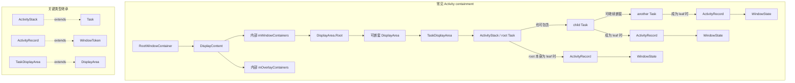
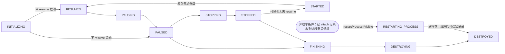
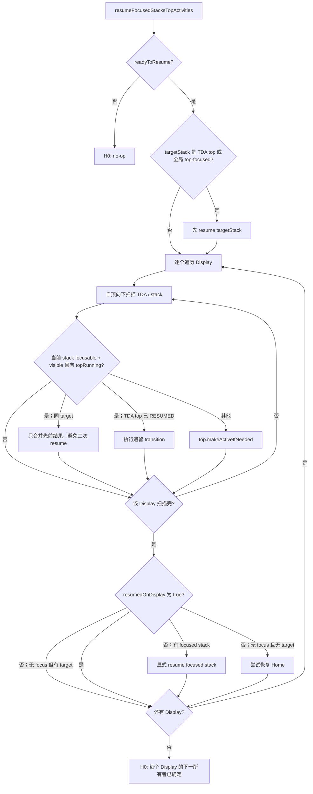

# 203 Android ActivityRecord、Task 与 RootWindowContainer：层级、焦点和生命周期状态

> 源码基线：Android 11 / API 30 / `android-11.0.0_r48`。
>
> 当前环境只有源码快照，可以证明容器关系、选择条件、状态写入和异步交接点；不能据此证明某台设备当时选中了哪个 Display、Task 或 Activity，也不能替代真机 `dumpsys`、日志和 trace。

第 202 章把一笔 Launcher 请求收敛为拒绝、复用或“新建/加入”之一。即使最后一种路径已经把候选 `ActivityRecord` 放进 Task，界面仍不一定立刻切换：树顶可能另有记录，目标 stack 可能不是 focused，旧 Activity 可能还在 PAUSING，目标进程可能尚未 attach，窗口也可能还没可见或绘制。

本章只追一个问题：**目标 `ActivityRecord` 已加入 Task 后，Android 11 r48 怎样沿窗口容器树选择应该活跃的对象，并把 parent、focus、lifecycle、visibility 与 drawn 这些互不等价的事实分别记账？**

核心结论是：容器树只提供“对象在哪里”和“从哪里开始找”；`top`、focused、RESUMED、top-resumed、visible 与 drawn 都由不同过滤器或状态所有者产生。一次恢复请求可能只得到 no-op、等待旧 Activity pause、异步启动进程或向客户端发出生命周期事务请求；任何一种服务端结果都不自动证明窗口已经显示到屏幕。

## 1. 固定三对象场景和本章完成点

贯穿主线固定三个服务端记录：

```text
默认 Display D0 / TaskDisplayArea TDA0
├─ 旧 root stack S_A / Task T_A / A_old：切换前处于 RESUMED
└─ 目标 root stack S_B / Task T_B / B_target：刚由 ActivityStarter 加入

副 Display D1 / TaskDisplayArea TDA1
└─ root stack S_C / Task T_C / C_side：仍可见，且在多窗口策略下可能保持 RESUMED
```

基线把选择条件钉死：D0 是 `mTopFocusedDisplayId`，`S_B`是 TDA0 的 top/focused stack，`B_target`是 `topRunningActivity(true)`且进程已 attach；全屏的 B 会让 `S_A/A_old`进入 pause。D1 不是全局 top-focused Display，但它自己的 `S_C/C_side`仍可见并处于 RESUMED。于是第一次服务端推进通常停在“等待 A_old pause”，pause 结清后的再次推进才把 B 送往客户端 Resume 事务；C 不因 D0 换页而自动暂停。

后文只做单变量变体，不把互相矛盾的现场混成同一时刻：

| 变体 | 只改变什么 | 预期最先改变的结论 |
|---|---|---|
| 无目标进程 | B 的 process/thread 不存在 | pause 等待期可预启动，之后走 `startSpecificActivity()` |
| B 为透明上层 | `B_target.occludesParent()`为 false | A 的 visibility 可能继续为真；是否保留 RESUMED 仍看 stack visibility/focusability |
| sleep/keyguard | Display 或 Keyguard gate 改变 | resume 可在创建客户端事务前停止 |
| recent-only 对照 | 令 `T_B`只在 recents，撤销“已经 live 入树”的前提 | 先回到 restore/parent 账，不能参与当前 focus；这是边界对照，不是基线并发状态 |

本章完成点记为 H0：**system_server 已能说明 `B_target`的有效 parent chain、各层 top/focus 选择结果，以及下一项由谁继续的动作。** H0 可以有多种形态：

| H0 形态 | 服务端已经确定的事实 | 尚未证明的事实 |
|---|---|---|
| 已满足、无需重复 | 目标已经是合格的 resumed top，本轮至多补 transition | 客户端刚执行过 `onResume()` |
| 门拒绝或暂缓 | ready/compat/sleep/user/global-pause 等门没有通过 | 以后不需要重试，或客户端已收到 Resume |
| 等待 pause | 旧记录进入 PAUSING，`mPausingActivity`持有等待账 | 客户端已正确完成 `onPause()` |
| 已发客户端事务请求 | normal resume 或 real-start 分支的 `scheduleTransaction()`在服务端返回且未抛异常 | 客户端 Binder stub 已运行、主线程消息已入队或回调已执行 |
| 已请求新进程 | pause 等待期的预启动或 `startSpecificActivity()`内层已经调用 `startProcessAsync()` | 进程已创建/attach，或 Activity 对象已创建 |
| 改选或回 Home | 当前 stack 没有合格 next，焦点转到其他 stack 或 Home | Home 窗口已经 visible |

第 204 章会深入 pause/resume 的 `ClientTransaction`、回报与 timeout；本章只解释为什么服务端选择了这条交接边。第 201 章已经说明 drawn 之后仍有 Buffer 与 present 链，因此 H0 也不是首帧完成点。

## 2. 一张 r48 容器图分开父子关系与类型继承

Android 11 正处于 WindowContainer/Task 统一模型的迁移阶段。下面实线表示运行时 containment，虚线只表示 Java 继承：



图中的三个 ActivityRecord/WindowState 标签表示可选的结构角色，不表示一次运行必须复制三份对象。`DisplayContent → DisplayArea`也不是直接泛型关系：`DisplayContent`实际继承 `WindowContainer<DisplayContent.DisplayChildWindowContainer>`，先挂 `mWindowContainers`与 `mOverlayContainers`；前者再添加 `mRootDisplayArea`，由 `DisplayAreaPolicy`装配 DisplayArea 树。Overlay、IME 和非 Activity 窗口还有别的分支，所以不能说“Display 上的所有窗口都在 TaskDisplayArea 下”。

各层回答的问题也不同：

| 层级 | 主要所有权 | 不应让它代答的问题 |
|---|---|---|
| `RootWindowContainer` | 所有 Display、跨 Display 遍历与全局恢复入口 | 某窗口是否已 present |
| `DisplayContent` | 单个逻辑显示的窗口、焦点、策略与 DisplayArea 树 | Task 的业务 identity |
| `TaskDisplayArea` | 可承载 root Task 的显示区域和特定 root 引用 | 客户端 Activity 是否存在 |
| `ActivityStack` / root Task | root 级 pause/resume、可见性与 Task 调度 | 所有显示只有一个 RESUMED |
| `Task` | 用户任务身份、子 Task/Activity 顺序和 recents 属性 | 当前顶层窗口是否 drawn |
| `ActivityRecord` | system_server 的 Activity 实例、WindowToken 和生命周期状态 | App 进程里的 Java 对象本身 |
| `WindowState` | 单个应用窗口及其 Surface/布局状态 | Activity 的 Task identity |

## 3. `ActivityStack extends Task` 是本版本的首要类型陷阱

r48 中 `ActivityStack extends Task`，而 `Task extends WindowContainer<WindowContainer>`。因此 `ActivityStack`既是 Task 类型，又承担 root stack 的调度职责；Task 的子节点可以是嵌套 Task 或 `ActivityRecord`，是否为 root/leaf 是运行时父子角色，不是两套互斥 Java 类。

这会造成三个常见误读：

1. `getRootTask()`在源码和旧命名里常被称为 `getStack()`，两者在 r48 指向同一个 `ActivityStack`对象；
2. `mResumedActivity`与 `mPausingActivity`实际声明在 `Task.java`，不是 `ActivityStack.java`新增字段，`ActivityStack`通过继承使用它们并实现 root 级调度；
3. `Task.onActivityStateChanged()`会把嵌套 Task 中的状态变化向父 Task 传播，普通层级最终由 root Task 维护 resumed 引用，而不是每个 leaf Task 各自形成一套互不相干的状态机。

`Task.isRootTask()`通过 `getRootTask() == this`判断，`isLeafTask()`则检查是否还含 Task 子节点。不要用类名推断角色，也不要把后续版本已经移除或重命名的 ActivityStack 模型反套到 r48。

TaskDisplayArea 还缓存 Home、Pinned、Split-screen primary 与 Recents 等 root Task 引用；子节点加入、移除或重排时会维护这些引用。这里的 “stack” 是历史命名，不能与 Java 调用栈或 Linux 线程栈混淆。

## 4. ActivityRecord 同时有五种身份或关系，但它们不会同步诞生

`ActivityRecord`首先是 system_server 对一次 Activity 实例的记录。它又继承 `WindowToken`，所以能承载 `WindowState`子节点；构造器还创建 `ActivityRecord.Token` Binder token，通过弱引用 attach 回记录。客户端 `Activity`和目标 `WindowProcessController`则属于另外两条关系。

| 身份/关系 | 建立动作 | 可以证明 | 不能证明 |
|---|---|---|---|
| 服务端记录 | `new ActivityRecord(...)` | manifest、Intent、user、launchMode 等元数据已有所有者 | 已加入 Task |
| application token | `appToken.attach(this)` | token 能关联候选记录 | token 已能从活动树查询到记录 |
| parent Task | `Task.addChild()`或 `reparent()` | 直接 parent 已是该 Task，`inHistory=true` | 该 Task 已经挂到 root/Display，或目标进程已 attach |
| hosting process | `setProcess(proc)`，且 `proc.hasThread()` | `attachedToProcess()`可为真 | 客户端 Activity 已执行生命周期 |
| 客户端 Activity | launch transaction 在 App 主线程构造 | Java 对象存在 | 窗口已 visible/drawn/present |

Token 的边界尤其容易被忽略。`ActivityRecord.Token.tokenToActivityRecordLocked()`不仅解弱引用，还要求记录已有 root Task；刚构造但尚未加入层级的候选即使已经 `appToken.attach(this)`，常规 token 反查仍会返回 null。

还要把“没有构造记录”和“构造后没有入树”分开。component permission、IntentFirewall 与 permission-policy 等主要拒绝门位于 `new ActivityRecord(...)`之前；构造后仍可能因 app-switch/BAL、lock-task 或 placement 分支而挂起、放弃，或者根本没有进入 Task。不能把所有启动失败都描述成“先建记录，再从 Task 删除”。

构造器中的初值进一步证明这些账不同步：

```java
setVisible(false);
mVisibleRequested = false;
appToken.attach(this);
setState(INITIALIZING, "ActivityRecord ctor");
nowVisible = false;
mDrawn = false;
mClientVisible = true;
```

`mClientVisible`初始为 true 也不能解释成“客户端已显示”；此时 `app`仍可能为 null，窗口也尚未添加。字段必须结合写入者和生命周期阶段解读，不能仅凭名字翻译。

## 5. 加入 Task 会同时改变 parent、identity 与持久化线索

`Task.addChild()`先根据当前用户可见性和 always-on-top 规则校正位置，再由 `WindowContainer.addChild()`写入 `mChildren`并设置 parent。对子节点是 `ActivityRecord`的情况，它还会：

- 把 `inHistory`设为 true；
- 让首个 Activity 决定 Task 的 activity type、persistable、calling UID/package 与 `maxRecents`；
- 对后续 Activity 统一 activity type；
- 调用 `updateEffectiveIntent()`刷新 Task 的有效 identity；
- 更新当前 Display 上出现的 UID 集合。

这些副作用只结清 ActivityRecord 到直接 parent Task 的关系；detached/recent Task 也可以先恢复子 Activity，稍后才由 `restoreRecentTaskLocked()`把 Task 加入或 reparent 到 stack。只有继续沿祖先走到 root Task、TaskDisplayArea、DisplayContent 与 RootWindowContainer，才可称为当前 live 容器链。

Task identity 不是“顶部 Activity 的包名”。诊断时至少要区分：

| 字段 | 作用线索 | 变化边界 |
|---|---|---|
| `mTaskId` | 系统分配的 Task 主键 | 不因普通顶部切换而改变 |
| `intent` / base Intent | Task 根语义和恢复入口 | 根 Activity 或 reset/reuse 规则可更新 |
| `affinityIntent` | 按 affinity 建立的替代根线索 | 不等于当前顶部 Intent |
| `realActivity` / `origActivity` | alias、真实根组件与原始组件 | 不等于任意子 Activity |
| `affinity` / `rootAffinity` | 当前任务亲和性与初始根亲和性 | `rootAffinity`保留创建时语义用于特定匹配 |
| `mUserId` / effective UID | 用户与包身份隔离 | 不能只用包名代替 |

live Task 与 Recent Task 也不是同一个集合概念。live Task 有 parent，位于 Display/TaskDisplayArea 层级；`RecentTasks`还能保存当前不在 live stacks 的 Task。`RootWindowContainer.anyTaskForId()`提供三种范围：只查 live stacks、查 live 加 recents、查到 recent 后还允许 restore。默认重载使用第三种，因此“按 id 找到 Task”可能已经把它重新 `addChild()`或 `reparent()`进目标 root Task。

这一区分直接影响本章主线：若 `T_B`只是 recent 对象，`B_target`的历史仍可存在，但它还没有当前 Display 上可参与 focus/resume 的完整 parent chain。

## 6. child 顺序提供搜索起点，五种 top 查询却有不同过滤

`WindowContainer.mChildren`中索引越大通常越靠上；`POSITION_TOP`放到尾部，top-to-bottom 遍历从 `size - 1`向 0 走。但 Task 会按 user 可见性、always-on-top 等规则夹紧请求位置，DisplayArea 和动画系统也会追加自己的排序约束。

常见 top 查询的差别如下：

| 查询 | 核心过滤 | 会不会自动过滤不可 focus | 会不会证明窗口可见 |
|---|---|---:|---:|
| `getTopMostActivity()` | 无谓词，取树遍历遇到的首个 Activity | 否 | 否 |
| `getTopNonFinishingActivity()` | 排除 `finishing`；默认包含 task overlay | 否 | 否 |
| `topRunningActivity(false)` | `canBeTopRunning()`：非 finishing 且 `okToShowLocked()` | 否 | 否 |
| `topRunningActivity(true)` | 上一行再加 `isFocusable()` | 是 | 否 |
| `getTopVisibleActivity()` | 非 exiting、client visible、`mVisibleRequested` | 否 | 仍不检查 `nowVisible/mDrawn` |

`okToShowLocked()`还考虑用户/profile 是否在运行、用户密钥与 encryption-aware 等条件。因此“树最上面的记录”可能是 finishing、其他用户当前不可展示或不可聚焦对象；resume 算法明确使用 `topRunningActivity(true)`，不能换成肉眼看到的数组尾元素。

容器顺序也不是 SurfaceFlinger 最终 Z 的完整证据。动画 leash、relative layer、IME/overlay DisplayArea、TaskOrganizer 与 always-on-top surface 都能改变合成层次。这里只把 child order 当作逻辑遍历和常规层级线索；像素最终顺序仍要回到图形链和 present 证据。

## 7. focused stack、focused app/window/display 与 top-resumed 分属不同范围

“焦点”在 r48 至少拆成下面六个选择结果：

| 范围 | r48 入口/字段 | 选择方式 | 可能为空或滞后的原因 |
|---|---|---|---|
| TaskDisplayArea | `getFocusedStack()` | 优先 `mPreferredTopFocusableStack`，否则自顶向下找首个 focusable 且 visible 的 stack | 没有合格 root Task |
| DisplayContent | `getFocusedStack()` | 自顶向下遍历该 Display 的 TaskDisplayArea | Display 只有非 Activity 窗口 |
| Root activity focus | `getTopDisplayFocusedStack()` | 自顶向下遍历 Display，取首个 focused stack | 上层 Display 暂无可聚焦 stack |
| Focused app | `DisplayContent.mFocusedApp` | 记录 ActivityRecord 层的 focused app，并同步给该 Display 的 InputMonitor | Activity 已被选中但窗口尚未添加 |
| Focused window | `DisplayContent.mCurrentFocus` | `findFocusedWindow()`自窗口 Z 序中选择可接收按键的 `WindowState` | focused app 还没有合格窗口 |
| Focused display | `RootWindowContainer.mTopFocusedDisplayId` | 自顶向下先取有 `mCurrentFocus`的 Display；若窗口未就绪，可用 `mFocusedApp`兜底，最终回退 D0 | 每 Display 的窗口焦点仍在重算 |

`mTopFocusedDisplayId`会同步给 InputManager 和窗口策略；它不是 `getTopDisplayFocusedStack()`的别名。一个表示窗口/输入焦点所在 Display，另一个从 activity container 树选择 root Task。Key 等 focus-dispatched input 最终面向 focused `WindowState`，这类事件未指定 Display 时才会回退到 InputDispatcher 的 focused Display；pointer/touch Motion 则按 `entry.displayId`在该 Display 上 hit-test。正常现场里的几层选择往往相符，排障时却必须分别取证，尤其不能用 activity focus 代替 pointer 命中目标。

多窗口与多显示还允许多个 root Task 各自持有 `mResumedActivity`。r48 另外维护一个特殊的 top-resumed 身份：`ActivityStackSupervisor.mTopResumedActivity`通常取全局 top focused stack 的 resumed 记录。若旧 top-resumed 的 loss 请求实际调度成功，服务端会等它回报释放或 500 ms timeout 后才通知新记录获得 top-resumed；旧记录无法接收该请求时则不会制造这笔等待。

因此以下关系都不是恒等式：

```text
树顶 Activity
≠ topRunningActivity(true)
≠ focused stack 的 mResumedActivity
≠ 全局 top-resumed Activity
≠ 当前 mCurrentFocus 所属 ActivityRecord
```

## 8. 用六本账描述 A_old、B_target 与 C_side

同一瞬间应至少记录六列，而不是写一句“B 已经在前台”：

| 对象/时刻 | parent 账 | process 账 | lifecycle 账 | focus 账 | visibility/drawn 账 | present 账 |
|---|---|---|---|---|---|---|
| `B_target`刚加入 | `T_B → S_B → TDA0 → D0 → RWC` | 可有或无 thread | 通常 INITIALIZING | `S_B`已是 activity focus 候选，但窗口焦点未必存在 | requested=false、`mDrawn=false`均可能成立 | 没有 B 的新帧证据 |
| `A_old`开始让位 | `T_A → S_A → TDA0 → D0 → RWC` | attached | RESUMED → PAUSING | 已不是目标 focused stack | 仍可 visible/drawn，遮住冷启动空窗 | 屏上的旧帧不等于 B 已完成 |
| `B_target`的 Resume 请求已发出 | parent 不变 | attached | 服务端已写 RESUMED | 可成为 root/top-resumed 候选 | requested/client 可见已推进，`mDrawn`仍可为 false | 客户端是否收到及新帧均未证明 |
| `C_side`在副屏 | `T_C → S_C → TDA1 → D1 → RWC` | attached | 可继续 RESUMED | 基线中不是全局 top focused | 仍可 visible/drawn | 可有 D1 自己的已 present 帧 |
| `B_target`进程死亡后保留 | parent 可能仍在 | `app=null` | cleanup 后可为 DESTROYED | 不再是可直接交互客户端 | dead window 可能令 `nowVisible=true` | 旧 surface 不能证明活进程 |

这些列的更新顺序没有一条全局线性时间轴。容器 parent 在客户端对象之前建立；服务端可在发送 Resume 事务前写 RESUMED；visibility request 可以早于窗口可见；drawn 又早于 SurfaceFlinger present。正确问题不是“它启动了吗”，而是“哪本账已由哪个写入者结清”。

对主线而言，H0 读取 parent、process、lifecycle、focus 和 visibility request 来决定下一个所有者；`mDrawn`与 present 仍是下游证据，不用它们反向猜测生命周期是否正确。

## 9. ActivityState 是服务端枚举，不是 App 回调栈镜像

r48 的枚举定义在 `ActivityStack.java`，状态保存在 `ActivityRecord.mState`：

```text
INITIALIZING, STARTED, RESUMED,
PAUSING, PAUSED, STOPPING, STOPPED,
FINISHING, DESTROYING, DESTROYED,
RESTARTING_PROCESS
```

一条常见但并不穷尽所有分支的状态路径是：



这张图不能当成客户端回调逐行镜像：

- `STARTED`在本版主要由 `makeActiveIfNeeded()`把 visible 的 STOPPED/STOPPING 记录重新激活，并排 `StartActivityItem`；它不表示 App 此刻正停在 `onStart()`方法体；
- 已 attach 的 resume 分支先 `setState(RESUMED)`；只有可见性/配置保留了当前实例的 normal 分支才构造并调度 `ResumeActivityItem`，调度异常会恢复旧状态，另一个早退分支则可不构造该 item；
- 冷启动 `realStartActivityLocked()`会根据 `andResume && readyToResume()`把记录记为 RESUMED，否则记为 PAUSED；
- `finishing`布尔可早于 `FINISHING`枚举状态，finish 请求不等于 destroy 已完成；
- `DESTROYED`只描述 Activity 记录的客户端销毁/清理阶段，不推出其 Task 一定删除；
- `RESTARTING_PROCESS`来自 `restartProcessIfVisible()`，只会绕过进程死亡清理中“无 saved state”这一条删除臂；finishing、已移除进程或短时崩溃循环仍可让记录被删。它不是普通应用回调名。

PAUSE、STOP 与 DESTROY timeout 分别是 500 ms、11 s、10 s。timeout 是服务端推进或兜底清理的控制边，不是客户端按约执行完回调的证明。

## 10. setState 会向 root Task、统计与 Surface 侧传播

`ActivityRecord.setState()`先处理同态 no-op，再写 `mState`。若已有 Task，它调用 `task.onActivityStateChanged()`；状态为 STOPPING 且不是 sleep 时，会要求各 `WindowState`的 animator `detachChildren()`；RESUMED/PAUSED 更新 BatteryStats 与 UsageStats，STOPPED/DESTROYED也更新 UsageStats。

`detachChildren()`只在 SurfaceControl transaction 中遍历 ActivityRecord 的 WindowState 子节点，调用 `mWinAnimator.detachChildren()`。它没有执行 `ActivityRecord.reparent()`、`Task.removeChild()`或 `takeFromHistory()`，所以“Surface 子层 detach”绝不等于 Activity 已离开 Task。

Task 对状态变化的处理还有一层向上冒泡：

1. leaf Task 先把事件交给父 Task；
2. 普通嵌套层级由最外层 root Task维护 `mResumedActivity`；
3. organizer-created Task 有额外本地同步，便于日后 reparent；
4. 记录离开 RESUMED 时清对应引用，进入 RESUMED 时设置引用并更新 top-resumed 与 RecentTasks；
5. 只有当该记录也是 `RootWindowContainer.getTopResumedActivity()`时，ATMS 的全局 resumed 进程状态才随之更新。

所以看到 `ActivityRecord.mState == RESUMED`时，还应核对 root Task 的 `mResumedActivity`、全局 top-resumed 以及 hosting process。反过来，`mResumedActivity`指针也要与记录自身状态一起看；`TaskDisplayArea.allResumedActivitiesComplete()`正是在检查这类一致性。

## 11. `mVisibleRequested`、`mVisible`、`mClientVisible`、`nowVisible`、`mDrawn` 与 `allDrawn` 是六个状态字段

ActivityRecord 的可见性字段不能合并成一个 boolean：

| 字段 | 写入语义 | 它为 true 仍不能证明 |
|---|---|---|
| `mVisibleRequested` | system_server 希望该 token 可见，可能还在 app transition 中 | token 已提交为 visible |
| `mVisible` / `isVisible()` | WindowManager 侧 token 的当前可见状态 | 客户端已有内容或所有窗口已显示 |
| `mClientVisible` | 客户端可见门的服务端缓存；构造初值就是 true，hide 可 defer | 客户端进程存在、通知已实际送达，或窗口已报告 visible |
| `nowVisible` | interesting 子窗口的 reported visibility 聚合达到可见，并要求 token 的 `mVisible`为 true | 所有内容已 drawn 或帧已 present |
| `mDrawn` | `updateReportedVisibilityLocked()`聚合得到的 reported-drawn 结果 | surface-placement 的 `allDrawn`条件刚在同一时刻成立 |
| `allDrawn` | 当前子窗口都已被评估、interesting 窗均 drawn 且不在 relaunch，用于 show/layout 协调 | Buffer 已由 HWC present |

`mDrawn`与 `allDrawn`来源不同：前者由 reported visibility 聚合经 `onWindowsDrawn()`写入，并推进启动等待；后者在 `DisplayContent.applySurfaceChangesTransaction`相关遍历中计算，成立后要求额外 layout/show。两者名字接近，不能互相代替。

透明与 keyguard 又是可见性输入维度。`occludesParent=false`的上层 Activity 不会遮住下面全部内容；分屏中非顶 Activity 也可继续 visible。`visibleIgnoringKeyguard`记录忽略锁屏时的可见性候选，真正展示仍要经过 `checkKeyguardVisibility()`。因此：

```text
not top 不能推出 invisible
PAUSED 不能推出 invisible
RESUMED 不能推出 drawn
drawn 不能推出 present
```

进程死亡时，保留记录的分支还会把 `nowVisible`设为原 `mVisibleRequested`，以便暂留 dead window。此时 `nowVisible=true`甚至不能证明 hosting process 仍在。

## 12. RootWindowContainer 先仲裁每个 Display，再让 stack 决定 next

正常调用应从 `RootWindowContainer.resumeFocusedStacksTopActivities()`进入，源码明确警告不要任意直调某个非 focused stack 的 `resumeTopActivityUncheckedLocked()`。根入口的顺序是：

套回固定场景：若 `S_B`已经是 D0 的 TDA top，根入口可先尝试目标 `S_B/B_target`，但随后仍会遍历 D0 和 D1；这次调用不会因为处理了 B 就跳过副屏的 `S_C/C_side`。所以 D0 可以进入“A_old 等待 pause、B_target 等待接棒”，D1 的 C_side 同时仍可满足本 Display 的 resumed 条件。



循环从 child 尾部向前遍历 Display、TaskDisplayArea 和 ActivityStack。只有 `isFocusableAndVisible()`且有 `topRunningActivity()`的 stack 才参与；非 target stack 通过 `ActivityRecord.makeActiveIfNeeded(target)`决定 resume、pause 或把 visible stopped 记录转 STARTED。

该方法返回的 `result`并不是主循环全部 `makeActiveIfNeeded()`结果的总和：这些结果只 OR 到每个 Display 的局部 `resumedOnDisplay`，用来决定是否执行 focused-stack/Home fallback；最终 `result`只累计前置 target resume 与各 Display 的 fallback。无论哪个 boolean 为 true，都只是服务端控制流结果，不是客户端生命周期回执。一个 Display 上已经 RESUMED 的 top 可能只执行 transition；多 Display 也不是“只恢复全局唯一一个 Activity”的单选循环。

## 13. stack 内部先过 next 与 pause 门，才选择事务或进程

`ActivityStack.resumeTopActivityUncheckedLocked()`用 `mInResumeTopActivity`阻止递归，并在 `finally`清除标志。内部流程按以下顺序缩小候选：

1. ATMS 必须处于 booting/booted；
2. `topRunningActivity(true)`选出非 finishing、当前可展示且 focusable 的 next；
3. 有 next 时 root stack 必须 attached；没有 next 则改找下一 focusable stack 或 Home；
4. next 已是 `mResumedActivity`、状态为 RESUMED 且该 TaskDisplayArea 的 resumed 均一致时，只执行 transition；
5. `canResumeByCompat()`、全局 `allPausedActivitiesComplete()`、sleep/keyguard 与 user-started 条件必须通过；
6. `pauseBackStacks()`先暂停不再 visible/focusable 的其他 stack，本 stack 有旧 `mResumedActivity`时再 `startPausingLocked()`。

`RootWindowContainer.allPausedActivitiesComplete()`会跨所有 Display、TaskDisplayArea 与 ActivityStack 查 `mPausingActivity`。只看目标 stack 没有 PAUSING 不足以继续，因为别处未结清的生命周期交接也可能阻塞本次 resume。

在固定场景里，进入 `S_B`后 next 才被精确收敛为 `B_target`。如果同一 TDA 上的 `S_A/A_old`按当前可见与聚焦规则不能继续 RESUMED，`pauseBackStacks()`会启动 A_old 的 pause，本次对 B 的路径就在“等待旧记录”这个 H0 停下；若多窗口策略允许某个旧 stack 继续 resumed，则不会为了制造一条单线程式时间轴而强制暂停它。D1 上的 C_side 也不会仅因 B 成为 D0 的目标而自动离开 RESUMED。

若确实需要 pause，旧记录先写 PAUSING并成为 `mPausingActivity`，attached 时才排 `PauseActivityItem`；通常调度 500 ms pause timeout并返回等待。进程未 attached 或事务调度失败会清掉等待并继续推进；`FLAG_RESUME_WHILE_PAUSING`且旧记录不能进入 PiP 时，服务端还可在客户端回报前立即 `completePauseLocked()`，timeout 也会经 `activityPaused(true)`推进。因此服务端 PAUSED 不是客户端正常完成 `onPause()`的充分证据。next 已 attached 时会更新其进程信息；只有 `next.isProcessRunning()`为 false 时才在等待期异步 `startProcessAsync(..., "pre-top-activity"/"pre-activity")`隐藏冷启动延迟，但新 Activity 的生命周期并没有越过 pause 完成点。

pause 不再阻塞后，流程先按目标记录是否已经 attached 分流；未 attached 时，`startSpecificActivity()`内部再查有没有可复用的进程线程：

| 判断层 | 条件 | 服务端动作与下一证据边界 |
|---|---|---|
| resume 外层 | 已 `attachedToProcess()` | 推进 visibility 并先写 RESUMED，再进入可见性/配置判断 |
| attached 早退 | `!shouldBeVisible(next)`，或 `ensureVisibilityAndConfig()`未保留当前实例 | 调用服务端 `completeResumeLocked()`并返回；这条路径没有构造 `ResumeActivityItem` |
| attached normal | 当前实例通过可见性/配置判断 | 构造并调用 `scheduleTransaction(ResumeActivityItem)`；服务端调用无异常返回后再执行 `completeResumeLocked()` |
| resume 外层 | 未 attached | 调用 `startSpecificActivity(next, true, true)`，进入下一层判断 |
| `startSpecificActivity()`内层 | 同 UID/processName 的 `WindowProcessController`有存活 thread | 可直接 `realStartActivityLocked()`并向现有 `IApplicationThread`发 launch transaction 请求 |
| `startSpecificActivity()`内层 | 没有可用 thread，或复用 thread 的首次 `realStartActivityLocked()`抛出并上抛 `RemoteException` | 调用 `startProcessAsync()`，由 ProcessList/Zygote 与后续 attach 链承接；第二次 launch 失败由 real-start 内部 finish，不走这条重启 |

normal 分支中，服务端的 `scheduleTransaction()`无异常返回后才调用 `completeResumeLocked()`；调度异常会恢复旧 state 并转入 `startSpecificActivity()`。普通跨进程场景里的 `IApplicationThread`是 oneway 接口，因此服务端返回只证明本端调用没有报错，不能证明远端 Binder stub 已执行，更不能证明 `ActivityThread`已发送 `H.EXECUTE_TRANSACTION`主线程消息；同进程 Binder 是需要单独识别的特例。相反，pause 路径有明确的 `activityPaused()`回报或 timeout 账。两者的客户端边界和 top-resumed loss 回报在第 204 章展开。

## 14. reparent、remove 与进程死亡分别改变不同账本

`ActivityRecord.reparent(newTask, position, reason)`要求记录已有 parent 且新旧 Task 不同，随后进入 `WindowContainer.reparent()`：旧 parent remove、新 parent add、必要时处理跨 Display、重新 layout/assign layers，最后回调 `onParentChanged()`。ActivityRecord 在回调中更新 `task`、持久化通知、configuration/animation registry；若自身为 RESUMED，还会更新新 Task 的 resumed 引用。它不是一次普通 Java List 移动。这里讨论的是 ActivityRecord 的底层 reparent；`Task.reparent(ActivityStack, ...)`还有暂停目标 stack、调整 focus/PiP、配置、动画与可见性的高层副作用，两者不能互换。

finish、history 移除与 Task 移除是几条不同路径：

- `finishIfPossible()`先校验、置 `finishing`并处理 result；RESUMED 分支隐藏后发起 pause，PAUSING 分支等待，其他状态进入 `completeFinishing()`，后者可能等待下一记录 visible/idle 而进入 STOPPING 或 FINISHING，也可能直接 destroy；stop 不是必经站；
- `removeFromHistory()`执行 result cancel、标记 finishing、退出 history、清 timeout、写 DESTROYED、断开 app token、服务与 URI grants；
- `Task.removeChild()`发现剩余项全是 task overlay 时会请求清 Task；Task 已空且不是 `mReuseTask`、也不是 organizer-created 时才继续移除，所以 Activity 消失不推出 Task 必然同步删除；
- 独立的 Task 移除请求经过 `Task.removeIfPossible()`时，仍有子项、alive windows 且 transition/children 正动画才可能推迟；空 Task 不走这个延迟条件。

进程死亡则先清 root stack 的 pausing/last-paused 引用，再逐个处理属于该 `WindowProcessController`的记录。r48 的判据不是“后台都保留、前台都删除”，也不取决于 Task 位置：

| 条件 | 记录处理 |
|---|---|
| `app.isRemoved()` | 先对该进程全部记录调用 `makeFinishingLocked()`，随后命中 finishing 删除条件 |
| resize relaunch、launchCount < 3 且非 finishing | 强制保留，准备重试 |
| 无 saved state、又不是 state-not-needed/RESTARTING_PROCESS，或已经 finishing | 移除 |
| 不再 requested-visible，60 秒内反复启动超过两次 | 移除，避免崩溃循环 |
| 其余 | 保留 parent/history，`app=null`，`nowVisible=mVisibleRequested` |

无论保留还是移除，代码都会先 `cleanUp(true, true)`，因此保留下来的 ActivityRecord 也可处于 DESTROYED；只有 remove 分支随后 `removeFromHistory()`。可见记录死亡时可能暂留 dead window，所以以下组合完全合法：

```text
ActivityRecord 仍在 Task
+ app == null
+ state == DESTROYED
+ nowVisible 可能为 true
```

它证明系统保留了可恢复的层级/窗口现场，不证明客户端 Activity 仍存活。

## 15. 七步诊断链寻找第一个没有闭合的边界

遇到“Activity 记录存在但没有成为当前页面”，按所有权顺序检查：

```text
P parent chain
→ T top selector
→ F focus / top-resumed
→ L lifecycle / pause gate
→ X process / thread
→ V visibility / drawn
→ G buffer / present
```

这条七阶段诊断链不是第 8 节“六本账”的另一套别名：T 是对 parent 树执行的查询，X 是在生命周期分流点重新核对 process 账，V 把 visibility 与 ActivityRecord 的 drawn 字段放在一起，G 才进入独立的像素提交链。前一步正确、后一步第一次偏离预期的位置才是当前调查重点：

| 观察 | 先核对 | 常见第一处分歧 | 不应直接推断 |
|---|---|---|---|
| 有 `ActivityRecord`但 `getRootTask()==null` | P | 仍是候选，尚未 `addChild()` | appToken 无效或解析失败 |
| Task id 可查到但不在 Display | P | recent-only，或 restore 尚未发生 | Task 已参与当前 focus |
| B 在 Task 却不是 next | T | finishing、user/show 条件、focusable 过滤 | child 顺序损坏 |
| B 是 topRunning 但 stack 不 focused | F | preferred stack、TDA/Display 层级或可见性 | B 应立即 RESUMED |
| stack focused 但仍由 A_old 占 resumed | L | `mPausingActivity`、全局 pause、sleep/user/compat gate | Resume 事务已发出 |
| B 已是 RESUMED但 App 无回调 | L/X | transaction 排队、binder/process 异常 | 服务端状态一定错误 |
| B requested-visible但 `nowVisible=false` | V | client visibility、WindowState 或 transition | 生命周期一定没有 resume |
| `mDrawn=true`但屏幕无新内容 | G | Surface/BufferQueue/SF/present | 再改 ActivityState 可解决 |
| record 在 Task 且 `app=null` | X | 进程死亡后保留 | 记录泄漏 |
| `nowVisible=true`且 `app=null` | X/V | retained dead window | hosting process 正常 |

采集证据时要保留具体方法名和范围：写 `topRunningActivity(true)`，不要只写“top”；写 `TaskDisplayArea.getFocusedStack()`或 `mTopFocusedDisplayId`，不要只写“focus”；写 `mVisibleRequested/nowVisible/mDrawn/allDrawn`，不要只写“visible”。这样第 204 章才能从准确的 pause/resume 交接点继续，而不是重新猜对象。

## 16. 九组只读练习重建层级与状态决策

以下命令只读源码。每组都先确认关键文件存在；可在 Android 源码根目录运行，也可预先设置 `ANDROID_BUILD_TOP`。

### 练习 1：把 containment 与 inheritance 画成两套边

```bash
set -euo pipefail
SRC="${ANDROID_BUILD_TOP:-$PWD}"
WM="$SRC/frameworks/base/services/core/java/com/android/server/wm"
test -f "$WM/RootWindowContainer.java" && test -f "$WM/ActivityRecord.java"
rg -n '^class RootWindowContainer extends|^class DisplayContent extends|^public class DisplayArea|^final class TaskDisplayArea extends|^class ActivityStack extends|^class Task extends|^class WindowToken extends|^final class ActivityRecord extends' \
  "$WM"/{RootWindowContainer,DisplayContent,DisplayArea,TaskDisplayArea,ActivityStack,Task,WindowToken,ActivityRecord}.java
```

先抄出八个 extends 声明，再另画运行时父子链。解释为什么 `ActivityStack → Task`是继承，而 `ActivityStack → leaf Task`可以同时是 containment。

### 练习 2：证明 DisplayArea 与 ActivityRecord 都经过真实挂接

```bash
set -euo pipefail
SRC="${ANDROID_BUILD_TOP:-$PWD}"
WM="$SRC/frameworks/base/services/core/java/com/android/server/wm"
WC="$WM/WindowContainer.java"
test -f "$WC" && test -f "$WM/DisplayContent.java" && test -f "$WM/TaskDisplayArea.java" && test -f "$WM/Task.java" && test -f "$WM/ActivityRecord.java"
sed -n '484,540p' "$WC"
sed -n '1004,1011p;4435,4438p' "$WM/DisplayContent.java"
sed -n '302,312p' "$WM/TaskDisplayArea.java"
sed -n '1361,1416p' "$WM/Task.java"
sed -n '1225,1298p' "$WM/ActivityRecord.java"
```

给每个 `addChild()`写出旧 parent、新 parent 和附带副作用。特别核对 DisplayContent 的内部 wrapper、ActivityRecord 的 `task/inHistory`何时建立，以及为什么还要验证 Task 的祖先链才能称为 live 关系。

### 练习 3：分开 token、parent、process 与客户端对象

```bash
set -euo pipefail
SRC="${ANDROID_BUILD_TOP:-$PWD}"
WM="$SRC/frameworks/base/services/core/java/com/android/server/wm"
AR="$WM/ActivityRecord.java"
STACK="$WM/ActivityStack.java"
AT="$SRC/frameworks/base/core/java/android/app/ActivityThread.java"
test -f "$AR" && test -f "$STACK" && test -f "$AT"
rg -n 'class Token|void attach\(|tokenToActivityRecordLocked|appToken.attach|void setProcess\(|boolean hasProcess\(|boolean attachedToProcess\(' "$AR" | sed -n '1,80p'
rg -n 'handleAppDied\(|class RemoveHistoryRecordsForApp|app = null|nowVisible = r.mVisibleRequested' "$STACK" | sed -n '1,64p'
rg -n 'handleLaunchActivity\(|performLaunchActivity\(' "$AT" | sed -n '1,36p'
sed -n '3312,3436p' "$AT"
```

构造四个反例：有 token 无 parent、有 parent 无 process、有 process 无 thread、有 RESUMED 无 drawn。指出各自下一条有效证据是什么。

### 练习 4：区分 Task identity、recent lookup 与 restore

```bash
set -euo pipefail
SRC="${ANDROID_BUILD_TOP:-$PWD}"
WM="$SRC/frameworks/base/services/core/java/com/android/server/wm"
TASK="$WM/Task.java"
ROOT="$WM/RootWindowContainer.java"
SUP="$WM/ActivityStackSupervisor.java"
test -f "$TASK" && test -f "$ROOT" && test -f "$SUP"
rg -n 'mTaskId|affinityIntent|realActivity|origActivity|rootAffinity|void setIntent\(|updateEffectiveIntent' "$TASK" | sed -n '1,84p'
rg -n 'MATCH_TASK_IN_STACKS_ONLY|MATCH_TASK_IN_STACKS_OR_RECENT_TASKS|anyTaskForId\(' "$ROOT" | sed -n '1,68p'
rg -n 'restoreRecentTaskLocked|task.reparent|stack.addChild' "$SUP" | sed -n '1,36p'
```

给“live 命中”“recent-only 命中”“recent 并 restore”分别画 parent 变化。不要用当前顶部包名替代 Task identity。

### 练习 5：让五种 top selector 处理同一组记录

```bash
set -euo pipefail
SRC="${ANDROID_BUILD_TOP:-$PWD}"
WM="$SRC/frameworks/base/services/core/java/com/android/server/wm"
WC="$WM/WindowContainer.java"
TASK="$WM/Task.java"
AR="$WM/ActivityRecord.java"
test -f "$WC" && test -f "$TASK" && test -f "$AR"
rg -n 'getTopMostActivity\(|getTopNonFinishingActivity\(|topRunningActivity\(|getTopVisibleActivity\(|canBeTopRunning\(' "$WC" "$TASK" "$AR" | sed -n '1,96p'
sed -n '1530,1550p' "$WC"
sed -n '1298,1311p;3276,3287p;3329,3334p' "$TASK"
sed -n '5622,5638p' "$AR"
```

从底到顶放置 normal、不可 focus、finishing、task-overlay 四条记录，再分别计算五个查询。对 `topRunningActivity(true)`额外加入 user/profile 不可展示样本。

### 练习 6：在两个 Display 上分开各层 focus 与 top-resumed

```bash
set -euo pipefail
SRC="${ANDROID_BUILD_TOP:-$PWD}"
WM="$SRC/frameworks/base/services/core/java/com/android/server/wm"
TDA="$WM/TaskDisplayArea.java"
DC="$WM/DisplayContent.java"
ROOT="$WM/RootWindowContainer.java"
SUP="$WM/ActivityStackSupervisor.java"
test -f "$TDA" && test -f "$DC" && test -f "$ROOT" && test -f "$SUP"
rg -n 'getFocusedStack\(|mPreferredTopFocusableStack|getTopDisplayFocusedStack\(|mFocusedApp|mCurrentFocus|mTopFocusedDisplayId|getTopResumedActivity\(' "$TDA" "$DC" "$ROOT" | sed -n '1,132p'
rg -n 'mTopResumedActivity|updateTopResumedActivityIfNeeded|TOP_RESUMED_STATE_LOSS_TIMEOUT' "$SUP" | sed -n '1,60p'
sed -n '1084,1101p' "$TDA"
sed -n '454,488p;1857,1890p' "$ROOT"
sed -n '3193,3208p;3222,3310p;3332,3347p;5245,5254p' "$DC"
```

画 `D0/D1`各自的 focused stack、`mFocusedApp`、`mCurrentFocus`与 resumed Activity，再单独标 `mTopFocusedDisplayId`和全局 top-resumed。解释为什么最多一个 top-resumed 不等于全系统最多一个 RESUMED。

### 练习 7：还原 ActivityState、Task 冒泡与三类 timeout

```bash
set -euo pipefail
SRC="${ANDROID_BUILD_TOP:-$PWD}"
WM="$SRC/frameworks/base/services/core/java/com/android/server/wm"
STACK="$WM/ActivityStack.java"
AR="$WM/ActivityRecord.java"
TASK="$WM/Task.java"
test -f "$STACK" && test -f "$AR" && test -f "$TASK"
sed -n '209,221p' "$STACK"
sed -n '4408,4447p' "$AR"
sed -n '1875,1901p' "$TASK"
rg -n 'PAUSE_TIMEOUT|STOP_TIMEOUT|DESTROY_TIMEOUT|RESTARTING_PROCESS|detachChildren\(' "$AR" | sed -n '1,72p'
rg -n 'setState\((INITIALIZING|STARTED|RESUMED|PAUSING|PAUSED|STOPPING|STOPPED|FINISHING|DESTROYING|DESTROYED|RESTARTING_PROCESS)' "$WM"/*.java | sed -n '1,180p'
```

为每个状态写“服务端写入者、是否等待客户端、timeout 是否存在”。再证明 STOPPING 的 `detachChildren()`没有改变 ActivityRecord 的 parent。

### 练习 8：比较六个可见性与绘制字段

```bash
set -euo pipefail
SRC="${ANDROID_BUILD_TOP:-$PWD}"
AR="$SRC/frameworks/base/services/core/java/com/android/server/wm/ActivityRecord.java"
test -f "$AR"
rg -n 'boolean mVisible;|boolean nowVisible;|boolean mDrawn;|boolean allDrawn;|boolean mVisibleRequested;|boolean mClientVisible;' "$AR"
rg -n 'boolean reportedVisible;|boolean reportedDrawn;' "$AR"
rg -n 'boolean isVisible\(|void setVisibility\(|void updateAllDrawn\(|void updateReportedVisibilityLocked\(|void onWindowsDrawn\(|void onWindowsVisible\(|boolean isClientVisible\(' "$AR"
sed -n '5434,5496p' "$AR"
```

分别为 opaque、透明上层、keyguard、dead-window 四种现场填写 `mVisibleRequested/mVisible/mClientVisible/nowVisible/mDrawn/allDrawn`六列。`reportedVisible/reportedDrawn`只是 reported 聚合用于抑制回退的内部锁存值，单独标注，不把它们算成第七、第八个字段。任何一列未知时都保留未知，不用其他列代填。

### 练习 9：把 root resume 追到 pause 等待或进程分流即停止

```bash
set -euo pipefail
SRC="${ANDROID_BUILD_TOP:-$PWD}"
WM="$SRC/frameworks/base/services/core/java/com/android/server/wm"
ROOT="$WM/RootWindowContainer.java"
STACK="$WM/ActivityStack.java"
SUP="$WM/ActivityStackSupervisor.java"
AR="$WM/ActivityRecord.java"
ATMS="$WM/ActivityTaskManagerService.java"
CLM="$WM/ClientLifecycleManager.java"
IAPP="$SRC/frameworks/base/core/java/android/app/IApplicationThread.aidl"
AT="$SRC/frameworks/base/core/java/android/app/ActivityThread.java"
CTH="$SRC/frameworks/base/core/java/android/app/ClientTransactionHandler.java"
test -f "$ROOT" && test -f "$STACK" && test -f "$SUP" && test -f "$AR" && test -f "$ATMS" && test -f "$CLM" && test -f "$IAPP" && test -f "$AT" && test -f "$CTH"
rg -n 'resumeFocusedStacksTopActivities\(|mInResumeTopActivity|resumeTopActivityInnerLocked|allPausedActivitiesComplete\(|startPausingLocked\(|pre-top-activity|startSpecificActivity\(|ResumeActivityItem|scheduleTransaction\(|completeResumeLocked\(' "$ROOT" "$STACK" | sed -n '1,160p'
rg -n 'void startSpecificActivity\(|getProcessController\(|realStartActivityLocked\(|startProcessAsync\(' "$SUP" | sed -n '1,84p'
rg -n 'mPauseTimeoutRunnable|activityPaused\(|schedulePauseTimeout\(' "$AR" "$ATMS" | sed -n '1,72p'
sed -n '45,53p' "$CLM"
sed -n '59,60p;142,145p' "$IAPP"
sed -n '1715,1722p' "$AT"
sed -n '45,49p' "$CTH"
```

从 `B_target`开始，只画到四个边界之一：no-op、等待 A_old pause、服务端 `scheduleTransaction()`无异常返回、`startProcessAsync()`已调用。最后写出继续阅读第 204 章所需的 token、旧/新 state、`mPausingActivity`与目标 process 状态；不要把 oneway 调用返回写成客户端主线程已经入队。

完成九组练习后，应能解释同一个 ActivityRecord 为什么可以“在 Task 中但没有进程”“RESUMED 但未 drawn”“visible 但不是 top-resumed”，并能沿 P→T→F→L→X→V→G 找到第一个没有闭合的边界。下一章进入第 204 章《Android Activity Pause/Resume、ClientTransaction 与生命周期完成回报》。
