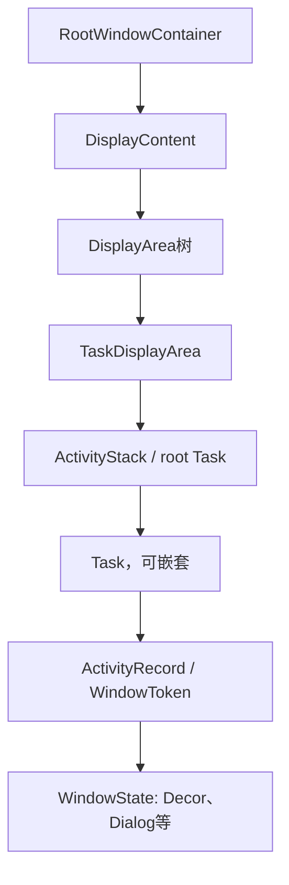

# 203 Android ActivityRecord、Task 与 RootWindowContainer：层级、焦点和生命周期状态

> 源码版本：Android 11 `android-11.0.0_r48`。  
> 本章只做Mac源码阅读；不把其他Android版本的Task组织直接套到r48。

## 1. 本章目标

ActivityStarter选出目标以后，system_server必须回答三个持续性问题：Activity放在窗口容器树哪里、哪个Activity应该活跃、服务端状态怎样与App生命周期协同。

## 2. r48层级不能用旧图硬套

Android 11中`ActivityStack extends Task`，Task又允许容纳Task或ActivityRecord；这是向统一WindowContainer/Task模型迁移中的实现。

旧资料里的“Stack与Task永远是完全不同类型”在本版本不准确。

## 3. 典型层级图



这是常见路径，不表示每种系统窗口都经过TaskDisplayArea。

## 4. RootWindowContainer

`RootWindowContainer extends WindowContainer<DisplayContent>`，是设备所有DisplayContent的根，也是跨显示查Task、选focused stack、恢复Home与遍历Activity的总入口。

## 5. DisplayContent

每个逻辑display有DisplayContent，内部包含DisplayArea层级、窗口token、输入/焦点、旋转和显示策略状态。

Activity属于某个display，但显示上的非Activity窗口也存在于DisplayContent其他分支。

## 6. TaskDisplayArea

`TaskDisplayArea extends DisplayArea<ActivityStack>`，保存能承载Activity root task的显示区域，维护home、recents、pinned、split-screen等特定root task引用。

多显示和分屏下不能只说“当前栈”，还要说明哪个TaskDisplayArea。

## 7. ActivityStack为什么仍存在

r48 `ActivityStack extends Task`，增加mResumedActivity、mPausingActivity、resume/pause和stack可见性等根级调度能力。

代码注释和方法名常同时出现stack与root task，阅读时以实际类型和父子关系为准。

## 8. Task

`Task extends WindowContainer<WindowContainer>`，保存taskId、base Intent、affinity、用户、窗口模式、bounds、recent持久化和子Activity/嵌套Task。

Task是用户任务与窗口容器，不是Linux线程或进程。

## 9. ActivityRecord

`ActivityRecord extends WindowToken`，既是ATMS的Activity实例记录，又作为WMS应用窗口token承载WindowState子节点。

它把组件生命周期和窗口可见性放进同一容器体系，但两者仍是不同状态维度。

## 10. ActivityRecord不等于Activity对象

ActivityRecord位于system_server；真正`android.app.Activity`位于App进程。两者通过appToken、ClientTransaction和IApplicationThread对应。

App崩溃后Activity对象消失，ActivityRecord可能暂时保留以便重启或清理。

## 11. appToken

构造ActivityRecord时创建`ActivityRecord.Token` Binder token，并调用`appToken.attach(this)`。客户端生命周期、窗口add和system_server查找都用token关联实例。

同组件的两个Activity实例具有不同token。

## 12. 构造时并未可见

r48构造器明确：

```java
setVisible(false);
mVisibleRequested = false;
// ...
setState(INITIALIZING, "ActivityRecord ctor");
nowVisible = false;
mDrawn = false;
hasBeenLaunched = false;
```

创建记录只是建立候选实例，不代表已经进入View生命周期或窗口树可见。

## 13. ActivityRecord何时加入Task

ActivityStarter决定target/new Task后，通过Task.addChild或ActivityRecord.reparent把记录放入层级。加入层级与绑定WindowProcessController是两个动作。

有Task但无App进程是合法的冷启动中间态。

## 14. Task identity

Task用base Intent、real/orig activity、affinity、root affinity、用户与taskId等描述身份；根Activity变化时部分身份可能更新，rootAffinity则保留初始语义。

不能用“当前顶部Activity包名”代替Task身份。

## 15. live Task与Recent Task

活动层级中的Task是live容器；RecentTasks还保存可恢复任务信息。Task可从recent恢复进窗口树，也可能已不在live stacks。

`anyTaskForId`的match mode明确区分只查stack、包含recents和允许restore三种范围。

## 16. child顺序就是Z序吗

WindowContainer子顺序通常表达相对前后，但最终Surface层、动画leash、always-on-top、DisplayArea层级还会影响真实合成顺序。

Task列表顺序不能直接替代SurfaceFlinger最终Layer Z证据。

## 17. top Activity有多个定义

`getTopMostActivity()`、`topRunningActivity()`、`getTopNonFinishingActivity()`和`topRunningActivity(focusableOnly)`过滤条件不同。

“树顶节点”可能finishing、不可focus或不可显示，不一定是应resume的对象。

## 18. topRunningActivity

它通常从顶部向下找非finishing且符合用户/focus等条件的Activity。具体调用点的参数决定是否忽略不可focus对象。

诊断时应写出调用的方法版本，而不是笼统说“取栈顶”。

## 19. focused stack

TaskDisplayArea/DisplayContent维护focused root task候选。焦点意味着优先接收导航和Key等交互，但不自动等同于其窗口已drawn。

## 20. top focused display

RootWindowContainer还维护top focused display id，处理未显式指定display的key/pointer及跨显示焦点。

多显示设备可能在不同display各有可见或resumed Activity。

## 21. 生命周期状态枚举

r48在ActivityStack中定义、由ActivityRecord保存：

```java
INITIALIZING, STARTED, RESUMED,
PAUSING, PAUSED, STOPPING, STOPPED,
FINISHING, DESTROYING, DESTROYED,
RESTARTING_PROCESS
```

这是system_server状态机，不是对App回调栈的逐行镜像。

## 22. INITIALIZING

ActivityRecord构造即进入INITIALIZING。它可能还未分配进程、未发送LaunchActivityItem，也可能随后因Task/权限结果失败被移除。

## 23. STARTED

STARTED表示服务端认为Activity处于已启动但不在RESUMED/PAUSED等后续状态之一。不要简单断言它恰好位于App `onStart()`方法执行中。

客户端事务异步，使服务端状态和某一条Java回调之间可能有传输间隔。

## 24. RESUMED

RESUMED代表该Activity被调度为活跃交互对象；ActivityStack的mResumedActivity通常指向它。`setState(RESUMED)`还更新BatteryStats和UsageStats。

RESUMED也不证明首帧已经drawn。

## 25. PAUSING与PAUSED

切换顶部Activity时，旧Activity先进入PAUSING并收到PauseActivityItem；客户端完成后回报activityPaused，服务端转PAUSED并继续新Activity resume。

PAUSING是阻塞很多切换的关键中间态。

## 26. STOPPING与STOPPED

不再需要保持前台可见的Activity进入STOPPING，客户端完成stop与状态保存后进入STOPPED。

r48 STOP_TIMEOUT为11秒，注释说明它刻意比相关ANR边界晚约一秒，避免主线程卡住时先因Surface/资源清理制造次生错误。

## 27. FINISHING布尔与状态

ActivityRecord同时有`finishing`布尔和FINISHING状态；它们服务不同检查路径，不能只查其一推断所有清理已完成。

finish请求可能先标记、等待pause/visibility，再进入destroy。

## 28. DESTROYING与DESTROYED

DESTROYING表示已向客户端请求销毁并等待完成；DESTROYED表示服务端认为销毁阶段结束。r48 DESTROY_TIMEOUT为10秒，超时会走兜底清理。

DESTROYED不等于Task一定也被删除。

## 29. RESTARTING_PROCESS

特殊配置/产品路径可能为Activity重启承载进程并使用RESTARTING_PROCESS，表示记录暂存等待新进程，而非普通用户可见生命周期回调。

## 30. setState不只是赋值

```java
mState = state;
if (task != null) {
    task.onActivityStateChanged(this, state, reason);
}
```

它还更新usage/battery信息；STOPPING且非sleep时触发窗口Surface子层相关detach逻辑。修改状态必须走统一入口。

## 31. detachChildren不是移出Task

setState(STOPPING)中的`detachChildren()`针对WindowToken子窗口的Surface层级处理，不等于`ActivityRecord.reparent/removeChild`，ActivityRecord仍可留在Task历史中。

这是“窗口资源状态”和“任务历史状态”分离的例子。

## 32. 生命周期与可见性是两张表

ActivityRecord还有mVisible/mVisibleRequested、nowVisible、mDrawn、mClientVisible、visibleIgnoringKeyguard、occludesParent等字段。

PAUSED Activity可因分屏或透明上层仍可见；RESUMED Activity也可能尚未drawn。

## 33. requested、client、actual visible

- mVisibleRequested：系统希望该Activity可见；
- mClientVisible：是否通知客户端保持可见；
- nowVisible：窗口侧已达到可见条件；
- mDrawn：相关窗口已绘制。

字段相近但完成层次不同。

## 34. 透明Activity

不occlude parent的Activity位于上层时，下面Activity可能继续visible；因此“不是顶部”不能推出“不可见”。

可见性遍历需要从上向下考虑遮挡、translucent、wallpaper和窗口模式。

## 35. sleep/keyguard维度

shouldSleep、showWhenLocked、dismissKeyguard、turnScreenOn等条件会改变resume/visibility判断。屏幕关闭时PAUSED可能正是期望状态。

## 36. resume总入口

应优先调用`RootWindowContainer.resumeFocusedStacksTopActivities()`，源码警告不要随意直接调用某个stack的`resumeTopActivityUncheckedLocked()`，否则可能resume非focused stack错误对象。

## 37. 跨Display resume遍历

RootWindowContainer遍历每个DisplayContent、TaskDisplayArea和ActivityStack，对focusable/visible stack的top Activity执行makeActive或resume；若display没有可恢复对象，尝试focused stack或Home。

因此全系统不再能简单假设“永远只有一个RESUMED Activity”。

## 38. 目标stack为何先处理

若显式targetStack位于其DisplayArea顶部或是top focused stack，会先resume一次；后续遍历遇到同一stack只合并结果，避免重复启动导致第二次失败。

## 39. 防递归门

ActivityStack用`mInResumeTopActivity`保护`resumeTopActivityUncheckedLocked()`，因为resume中会触发配置、pause、visibility和其他栈操作，可能反向再次请求resume。

finally必须清该标记。

## 40. resume前选择next

`resumeTopActivityInnerLocked()`先找focusable topRunningActivity，检查系统boot状态、stack是否attached、用户是否started、compat和sleep/keyguard。

树中有Activity不代表它当前可resume。

## 41. 为什么先pause旧Activity

若其他back stack或本stack已有resumed Activity，先调用pauseBackStacks/startPausingLocked。只有需要的pause完成后才继续新Activity完整resume。

这维持top-resumed交接和生命周期顺序。

## 42. allPausedActivitiesComplete

RootWindowContainer跨相关层级确认是否仍有PAUSING对象；若未完成，resume路径返回等待客户端回报或timeout。

它不是只看目标stack一个字段。

## 43. pause期间可提前启动进程

若next尚无进程，r48在等待旧Activity pause时可以`startProcessAsync(next, ..., "pre-top-activity")`，并行隐藏部分进程创建延迟。

这不表示新Activity生命周期越过pause先执行。

## 44. PAUSE_TIMEOUT

r48 ActivityRecord的PAUSE_TIMEOUT为500ms。超时用于推进服务端状态机和诊断，不证明App已经正确执行完`onPause()`。

不能通过无条件增大timeout解决主线程阻塞。

## 45. resume已有进程与冷启动分支

next已attached时发送客户端resume/生命周期事务；无进程时走`startSpecificActivity()`，等待attach后由ATMS继续realStartActivityLocked。

层级和状态机因此跨越进程创建异步边界。

## 46. reparent

Task和ActivityRecord都支持reparent，用于多窗口、显示迁移、Task复用或organizer操作。reparent会改变父容器和可能的display/config/焦点关系。

不能只移动Java列表而不更新WindowContainer/Surface关系。

## 47. remove与finish

finish Activity先处理result、pause/stop/destroy和可见性，最终从history/Task移除；空Task/stack是否删除还由上层规则决定。

直接remove容器可能绕过客户端生命周期和结果协议。

## 48. 进程死亡后的记录

WindowProcessController死亡时，ActivityRecord解除app关联、清窗口/状态，并根据finishing、可恢复状态和任务位置选择保留记录待重启或彻底移除。

所以“Activity在Task中”不能证明对应进程仍活着。

## 49. Mac只读练习

```bash
rg -n "class RootWindowContainer|class Task extends|class ActivityStack" \
  frameworks/base/services/core/java/com/android/server/wm/{RootWindowContainer,Task,ActivityStack}.java
rg -n "enum ActivityState|void setState|PAUSE_TIMEOUT|STOP_TIMEOUT" \
  frameworks/base/services/core/java/com/android/server/wm/{ActivityStack,ActivityRecord}.java
sed -n '2290,2350p' \
  frameworks/base/services/core/java/com/android/server/wm/RootWindowContainer.java
```

练习：画两个Display，每个一个TaskDisplayArea，并标出focused、topRunning、resumed、visible、drawn五种身份，观察它们为何不必指向同一条件。

## 50. 复读审计、检查题与下一章

复读限定：r48 ActivityStack继承Task；服务端ActivityState不与单个客户端回调瞬时一一对应；RESUMED、focused、visible、drawn是不同维度；STOPPING中的detachChildren不等于从Task移除。

检查题：

1. ActivityRecord为何既是生命周期记录又是WindowToken？
2. topRunning与树的最顶部节点有什么区别？
3. 为什么多显示环境不能只寻找一个全局RESUMED对象？
4. 进程死亡后ActivityRecord为何可能继续存在？

下一章深入**Activity pause/resume、ClientTransaction与生命周期完成回报**。
