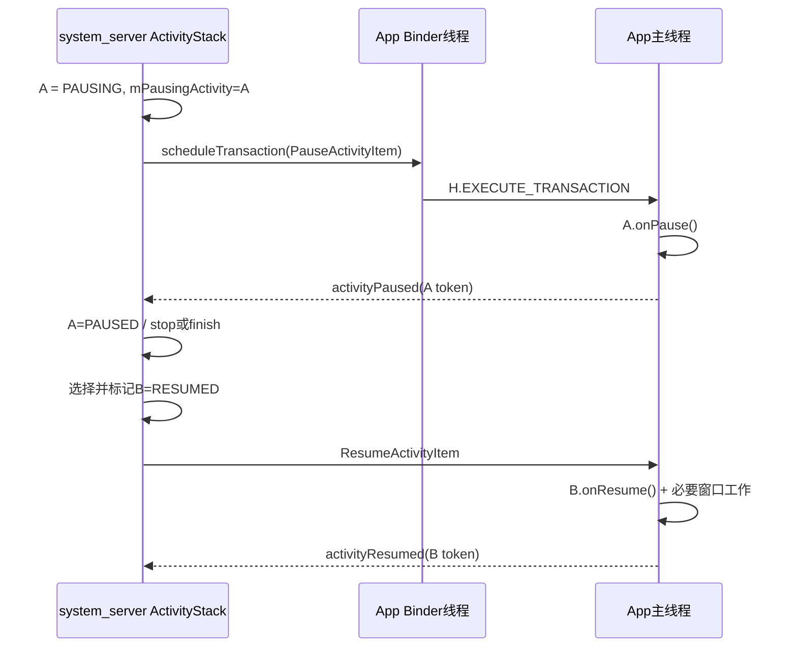

# 204 Android Activity Pause/Resume、ClientTransaction 与生命周期完成回报

> 源码版本：Android 11 `android-11.0.0_r48`。  
> 当前在Mac上只读源码，不实际运行生命周期或编译AOSP。

## 1. 本章目标

上一章建立服务端Activity状态，本章闭合一次A→B切换：system_server怎样暂停A、App主线程怎样执行`onPause()`、完成如何回报、B又怎样resume。

## 2. 两套状态机

system_server的ActivityRecord使用INITIALIZING/RESUMED/PAUSING等状态；App进程ActivityClientRecord使用ON_CREATE/ON_START/ON_RESUME等客户端状态。

两者通过ClientTransaction和Binder完成回报协同，但不是同一个内存变量。

## 3. 完整交接图



真实路径还有pause timeout、进程死亡和resume失败分支。

## 4. 主要源码

- system_server：`ActivityStack.java`、`ActivityRecord.java`、`ClientLifecycleManager.java`；
- 跨进程数据：`android/app/servertransaction/`；
- App客户端：`ClientTransactionHandler.java`、`TransactionExecutor.java`、`ActivityThread.java`。

## 5. 为什么引入ClientTransaction

一次调度可同时携带callbacks（如Launch、NewIntent、ActivityResult）和一个最终lifecycle state request（如Resume）。客户端执行器负责补齐两者之间所需生命周期路径。

这比服务端为每个中间回调分别发Binder事务更集中。

## 6. ClientTransaction的组成

它保存目标IApplicationThread、Activity token、按顺序执行的callback列表和可选最终ActivityLifecycleItem。

callback不一定是生命周期；最终state request才声明事务结束时希望到达的生命周期状态。

## 7. ClientLifecycleManager

system_server通过ClientLifecycleManager构造并`scheduleTransaction()`。远端IApplicationThread调用完成Parcel复制后，服务端即可回收事务对象；同进程本地Binder对象必须等客户端实际执行后再回收。

对象池生命周期取决于跨进程是否已经复制，而不是业务生命周期是否完成。

## 8. schedule不等于执行

`ClientTransaction.schedule()`调用`IApplicationThread.scheduleTransaction()`；App Binder线程进入ApplicationThread后，最终走ClientTransactionHandler：

```java
void scheduleTransaction(ClientTransaction transaction) {
    transaction.preExecute(this);
    sendMessage(ActivityThread.H.EXECUTE_TRANSACTION, transaction);
}
```

真正Activity回调仍在主线程Handler消息中执行。

## 9. preExecute是什么

每个item可在入主线程队列前更新pending configuration、process state或销毁预登记等客户端账本。

`preExecute()`不是Activity `onCreate/onResume`，也不应做依赖主线程顺序的组件回调。

## 10. EXECUTE_TRANSACTION

ActivityThread主Handler收到H.EXECUTE_TRANSACTION后调用TransactionExecutor.execute。system进程内的local transaction在客户端执行后回收，远端普通App事务已由服务端安全回收其原对象。

## 11. Executor总体顺序

```text
transaction.preExecute（Binder接收侧）
  → executeCallbacks（按列表顺序）
  → executeLifecycleState（最终状态）
  → clear PendingTransactionActions
```

callback可能要求执行前/后状态，Executor会插入中间生命周期跃迁。

## 12. 客户端生命周期常量

`ActivityLifecycleItem`定义PRE_ON_CREATE、ON_CREATE、ON_START、ON_RESUME、ON_PAUSE、ON_STOP、ON_DESTROY、ON_RESTART。

ON_RESTART是路径中间态，Helper禁止把它作为普通路径起终点。

## 13. ActivityClientRecord

App进程用token在`mActivities`查ActivityClientRecord，里面持Activity对象、Window、pending results/intents、saved state和客户端lifecycle state。

token找不到时，很多迟到事务只能忽略。

## 14. 生命周期路径计算

TransactionExecutorHelper的`getLifecyclePath(start, finish)`计算要执行的状态序列。低状态到高状态通常顺序前进；从STOP回RESUME会插入ON_RESTART、ON_START、ON_RESUME。

## 15. 特殊最短路径

ON_START→ON_STOP可直接stop，不必为了形式先resume/pause；ON_PAUSE→ON_RESUME可直接resume。Helper还给涉及destroy的候选路径加惩罚，尽量避免无谓重建。

## 16. 最后一步为何单独执行

最终state request可能携带isForward、finished、userLeaving、procState等专用参数。Executor先补到“目标前一状态”，最后直接执行原ActivityLifecycleItem，避免丢失这些参数。

## 17. callback也能要求状态

某个callback可声明postExecutionState。Executor选择较近的pre state、执行callback，再补到其post state；若最后callback的post state等于最终state，会省掉一次重复跃迁。

## 18. Launch+Resume例子

LaunchActivityItem创建ActivityClientRecord并执行handleLaunchActivity；事务若最终要求Resume，Executor接着补Start，最后用ResumeActivityItem执行Resume。

因此服务端可以把“创建并resume”合为一笔ClientTransaction。

## 19. Pause从服务端开始

ActivityStack.startPausingLocked要求当前有mResumedActivity且没有未处理的mPausingActivity。它先把旧Activity写入mPausingActivity/mLastPausedActivity并设置PAUSING。

先记服务端状态，再向远端发送请求，便于处理死亡和迟到回报。

## 20. 重入保护

若已有mPausingActivity却再次请求pause，源码记录wtf；非sleep路径可能先complete旧pause，避免两个未完成pause覆盖同一字段。

这说明mPausingActivity是每个ActivityStack单槽状态。

## 21. PauseActivityItem参数

服务端传入：

- `finished`：目标是否正在finish；
- `userLeaving`：是否触发用户离开语义；
- `configChanges`；
- `dontReport`：是否不需要客户端反向pause完成回报。

## 22. RESUME_WHILE_PAUSING

若新Activity声明FLAG_RESUME_WHILE_PAUSING，且旧Activity不需获得进入PiP机会，服务端可设置`pauseImmediately=true`：仍发送pause item，但自身立即complete pause并继续。

此时该值也传成PauseActivityItem的dontReport，避免迟到回报重复推进。

## 23. pause前的系统保护

非sleep切换会取得launch WakeLock，并暂停旧Activity的Key dispatch，直到新Activity启动；屏幕关闭导致的pause不一定中断同一Activity未来唤醒后的Key路径。

## 24. 进程不存在或发送失败

旧Activity未attached时无需等客户端pause；发送事务异常会清mPausingActivity相关字段，其他死亡清理路径负责收尾。

系统不能等待一个不存在的主线程回报。

## 25. PauseItem.execute

App主线程调用`handlePauseActivity(token, finished, userLeaving, configChanges, ...)`。若userLeaving为true，先触发PiP requested和`onUserLeaveHint`相关Instrumentation调用。

## 26. performPauseActivity

它处理finished标志；仅pre-Honeycomb兼容路径在pause前保存state，现代Activity通常在stop阶段保存；随后调用`performPauseActivityIfNeeded()`。

不要把所有版本都描述成`onPause`必然保存实例状态。

## 27. onPause调用约束

ActivityThread通过Instrumentation调用Activity.onPause，并检查Activity实现是否调用了`super.onPause()`；未调用会抛SuperNotCalledException。

成功后客户端ActivityClientRecord进入ON_PAUSE。

## 28. PauseItem.postExecute

若mDontReport为false，App主线程调用`ActivityTaskManager.getService().activityPaused(token)`返回system_server。

这个Binder回报发生在`onPause()`返回后，但不表示Activity已stop或窗口已隐藏。

## 29. activityPaused服务端入口

ATMS clear Binder identity、持mGlobalLock用token查ActivityRecord，再调用`r.activityPaused(false)`。token对应记录已被销毁时直接忽略。

## 30. timeout与正常回报共用入口

正常回报传`timeout=false`；500ms Pause timeout runnable调用同一ActivityRecord处理并传true。两者最终都尝试让服务端pause状态机收敛。

timeout表示“服务端不再继续等”，不证明客户端真正执行完onPause。

## 31. 取消Pause timeout

ActivityRecord.activityPaused先移除自己的pause timeout。若它仍是stack.mPausingActivity，deferWindowLayout后调用`completePauseLocked(resumeNext=true)`。

完成回报的关键身份是token加当前mPausingActivity关系。

## 32. 迟到或错位回报

若stack.mPausingActivity已不是该Activity，系统写`wm_failed_to_pause`事件；若记录仍处于PAUSING，可补成PAUSED并处理finishing。

旧回报不会无条件完成当前另一个Activity的pause。

## 33. completePauseLocked

它把prev置PAUSED；finishing则继续finish，deferred relaunch则执行重建，已在STOPPING则恢复STOPPING；不可见或sleep则加入stopping队列。

PAUSED之后不必立刻STOPPED，取决于可见性和系统状态。

## 34. pause完成怎样启动B

`resumeNext=true`时重新取top focused stack；正常awake则调用RootWindowContainer.resumeFocusedStacksTopActivities，sleep则检查ready，并在必要时仍推进其他top/Home。

服务端不是保存一个固定的“B指针”后盲目恢复，因为等待期间层级可能变化。

## 35. Resume前服务端先改状态

已有进程的resume路径在发送事务前执行：

```java
final ActivityState lastState = next.getState();
next.setState(RESUMED, "resumeTopActivityInnerLocked");
// 构造callbacks和ResumeActivityItem，再scheduleTransaction
```

若Binder发送异常，会恢复lastState并尝试重启进程。

## 36. 为什么服务端可先标RESUMED

这是调度所有权状态：系统已经选定next为resumed目标，并据此更新进程优先级、可见性与配置。客户端执行完成仍需独立回报。

它不是声称App `onResume()`已返回。

## 37. Resume事务中的callbacks

已有Activity resume时，可先加入ActivityResultItem和NewIntentItem，再设置ResumeActivityItem最终状态。客户端在进入最终resume前交付pending result/new Intent。

## 38. ResumeItem.preExecute

带procState版本会先更新客户端进程状态，使应用在执行resume前看到较新的进程重要性相关状态。

## 39. ResumeItem.execute

它调用`handleResumeActivity(... finalStateRequest=true ...)`。ActivityThread先`performResumeActivity()`，交付pending intents/results，执行`Activity.performResume()`并把ActivityClientRecord设为ON_RESUME。

## 40. handleResumeActivity的窗口工作

若Activity尚无window、未finish且应可见，handleResumeActivity取得DecorView并通过WindowManager加入窗口；已有窗口则处理可见性、清理preserved window等。

`onResume()`返回和窗口首次draw仍是不同阶段。

## 41. ResumeItem.postExecute

App随后调用ATMS.activityResumed(token)。r48服务端`activityResumedLocked`主要清saved state、处理size-compat并通知UnknownAppVisibilityController resume完成。

它不是启动下一Activity的门，pause回报才承担A→B交接的关键推进。

## 42. completeResumeLocked更早发生

服务端成功schedule Resume事务后马上调用`next.completeResumeLocked()`：设visible requested、清results/newIntents、恢复Key dispatch、安排idle timeout和记录CPU时间。

这发生在activityResumed回报之前，体现服务端状态的“已调度”语义。

## 43. activityResumed不等于首帧

该回报只证明App主线程已走完ResumeActivityItem execute/postExecute正常路径。ViewRoot traversal、RenderThread、Buffer queue、SF latch和present仍可能在后面。

冷启动首帧应看windows drawn/图形证据，不看activityResumed单点。

## 44. Resume异常

客户端`onResume()`抛异常且Instrumentation不处理时，App进程可能崩溃，transaction postExecute无法正常回报；system_server通过Binder死亡、进程清理和Activity重启/移除恢复。

## 45. 主线程卡在onPause

500ms后服务端可按timeout完成pause并resume新Activity；旧App若仍存活，之后可能发送迟到回报。系统用token和mPausingActivity检查避免错误推进当前pause。

Pause timeout本身不等于完整ANR处置，主线程卡死还由其他超时/进程诊断路径发现。

## 46. 多Resume与top-resumed

多窗口/多显示允许多个Activity处于RESUMED，但系统另维护唯一的top-resumed交互地位。TopResumedActivityChangeItem通知Activity获得/失去最高交互优先级。

RESUMED与top-resumed不能混为一谈。

## 47. top-resumed丢失回报

当mOnTop=false时，TopResumedActivityChangeItem.postExecute调用`activityTopResumedStateLost()`；ActivityStackSupervisor等待旧top释放后再通知新top，并有单独timeout/慢响应记录。

它与普通activityPaused回报是两条协议。

## 48. ClientTransaction不保证跨事务原子

一笔事务内部有顺序，但前后两笔Binder/Handler消息之间系统状态、配置或进程生死可能改变。TransactionExecutor还会跳过已预标记destroy且客户端记录不存在的迟到事务。

## 49. Mac只读练习

```bash
rg -n "startPausingLocked|completePauseLocked|ResumeActivityItem.obtain" \
  frameworks/base/services/core/java/com/android/server/wm/ActivityStack.java
rg -n "postExecute|activityPaused|activityResumed" \
  frameworks/base/core/java/android/app/servertransaction/{PauseActivityItem,ResumeActivityItem}.java
rg -n "executeCallbacks|executeLifecycleState|cycleToPath" \
  frameworks/base/core/java/android/app/servertransaction/TransactionExecutor.java
```

练习：分别列出“服务端已标RESUMED”“App onResume返回”“activityResumed回报”“窗口drawn”四个时间点，写出每个点能证明和不能证明的事情。

## 50. 复读审计、检查题与下一章

复读限定：PauseItem第四参数在该路径是dontReport；pauseImmediately仍会向客户端发送onPause但服务端不等待；服务端RESUMED和completeResume早于客户端回报；activityResumed不等于首帧；top-resumed是另一套交接协议。

检查题：

1. 为什么ClientTransaction要区分callbacks和final lifecycle request？
2. pause timeout之后迟到activityPaused为什么不会完成另一个Activity的pause？
3. system_server为什么能在发送ResumeItem前先写RESUMED？
4. 多窗口下RESUMED与top-resumed各表示什么？

下一章深入**ActivityThread bindApplication：进程级初始化、Provider与Application创建顺序**。
