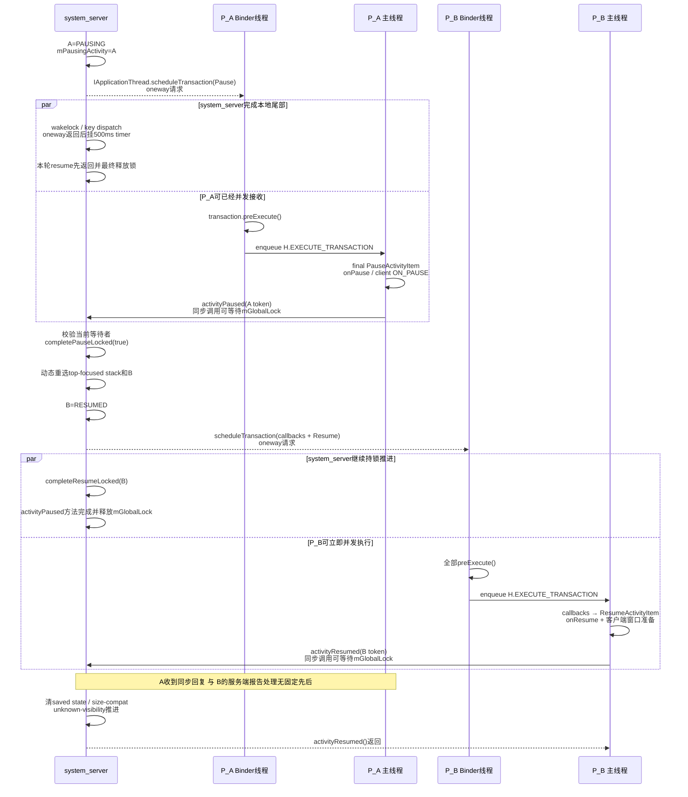
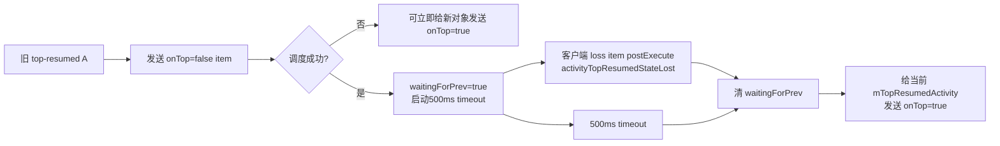

# 204 Android Activity Pause/Resume、ClientTransaction 与生命周期完成回报

> 源码基线：Android 11 / API 30 / `android-11.0.0_r48`。
>
> 当前环境只有源码快照，可以证明状态写入、Binder 方向、主线程执行路径和服务端收敛条件；不能据此测出某台设备的实际调度延迟，也不能把源码调用点替代为窗口 drawn 或硬件 present 证据。

第 203 章停在这样一条交接边：默认 Display 上，目标 `B_target` 已成为应该恢复的 top Activity，但旧的 `A_old` 仍占着 resume/pause 账。服务端第一次推进会先要求 A 让位；只有这张等待账结清，系统才重新选择此刻真正应该接棒的 Activity。

本章只追一个问题：**当 `A_old` 必须让位给 `B_target` 时，system_server 与 App 主线程这两套不共享内存的状态机，怎样借 `ClientTransaction`、Activity token、反向 Binder 回报和 timeout 完成交接；每一个“完成”究竟只证明了什么？**

先给结论：`ClientTransaction` 是“请客户端执行这些 callback，并最终到达某个生命周期状态”的命令信封，不是同步完成屏障。真正挡住正常 B resume 的，是服务端 `mPausingActivity` 所代表的 pause 债；它可以由匹配的 `activityPaused()`、immediate 分支、500 ms timeout 或进程清理收敛。服务端写 `RESUMED`、`completeResumeLocked()`、客户端运行 `onResume()`、`activityResumed()` 到达服务端、窗口 drawn 和硬件 present，必须分别取证。

## 1. 固定 A_old→B_target 场景与本章完成点

沿用上一章的三个对象，并把客户端前提补全：

```text
默认 Display D0
├─ S_A / A_old
│  ├─ system_server：切换前为 RESUMED
│  └─ App 进程 P_A：ActivityClientRecord 为 ON_RESUME
└─ S_B / B_target
   ├─ 已是 D0 的 top/focused 候选，进程 P_B 已 attach
   ├─ system_server：切换前为 PAUSED
   └─ App 进程 P_B：ActivityClientRecord 为 ON_PAUSE

副 Display D1
└─ S_C / C_side：仍可保持 RESUMED，但不是全局 top-resumed
```

主线再固定以下条件：

| 维度 | 固定前提 |
|---|---|
| 进程与对象 | A、B 位于不同 App 进程；B 的客户端记录持续存在，Activity 未 finished，也不在 `mActivitiesToBeDestroyed` |
| 环境与选择 | B 是全屏上层；设备 awake、用户已启动、配置检查保留 B 当前实例；本轮没有其他 Activity 抢走焦点 |
| A 的 pause | B 没有 `FLAG_RESUME_WHILE_PAUSING`；A 的 `onPause()` 正常返回，匹配的 `activityPaused(A)` 在 timeout runnable 之前取得服务端锁并关闭等待槽 |
| B 的 resume | normal schedule 与 `completeResumeLocked()` 都成功；B 的 callbacks、`onResume/onPostResume` 和 `handleResumeActivity()` 同步窗口准备均正常完成，然后事务抵达 post 阶段 |

这些条件保证主线经过两轮服务端推进：

1. 第一轮选中 B，却因 A 进入 `PAUSING` 而停下；
2. A 的有效回报关闭 pause 屏障后，第二轮重新选中 B；
3. 服务端把 B 记为 `RESUMED`并发出 Resume 事务；
4. B 的主线程执行事务并反向报告。

本章完成点记为 L0：**能够为现场指出当前未结的是 pause 屏障、客户端事务、反向回报、top-resumed 交接，还是窗口/图形链，而不是只看到“生命周期没走”就把它们混成一个问题。**

如果 B 没有可用进程，链路会在 `startProcessAsync()` 处转交第 205 章；若进程已绑定但客户端 Activity 尚未创建，`realStartActivityLocked()` 会构造 Launch 与 final lifecycle 事务，这是 `ClientTransaction` 的另一条分支。本章的正常主线只处理已经存在的客户端 Activity。窗口 drawn、Buffer latch 与 present 已在第 201 章拆开，这里只标边界，不重复展开。

## 2. 五本账分开记录服务端、投递、客户端、回报与画面

同一个 token 附近至少有五本账：

| 账本 | 主要所有者 | 代表性字段或对象 | 它不能独自证明什么 |
|---|---|---|---|
| 服务端调度账 | system_server | `ActivityRecord.mState`、root Task 的 `mResumedActivity/mPausingActivity` | App 回调已经执行 |
| 投递账 | Binder 与 App MessageQueue | oneway 调用、`ClientTransaction` Parcel 副本、`H.EXECUTE_TRANSACTION` | 主线程已经处理消息 |
| 客户端生命周期账 | App 主线程 | `ActivityClientRecord.mLifecycleState`、`paused/stopped`、真实 `Activity` | 服务端等待槽已经关闭 |
| 回报与 timeout 账 | ATMS/ActivityRecord/Supervisor | `activityPaused`、`activityResumed`、两个 500 ms timeout | 窗口已经 drawn 或 present |
| 窗口与图形账 | ActivityThread、WMS、SurfaceFlinger、HWC | Decor/ViewRoot、drawn、Buffer、fence | 前四本账一定按理想顺序完成 |

主线可用七个检查点描述：

| 检查点 | 固定正常场景中已经发生 | 仍不能推出 |
|---|---|---|
| P-S | 服务端 A 已写 `PAUSING`，`mPausingActivity=A` | Pause 请求已到 App |
| P-Q | 普通远端 oneway 发送在服务端未同步失败 | App Binder stub 已运行或主线程已入队 |
| P-C | A 主线程正常执行完本次 `onPause()`，客户端为 `ON_PAUSE` | 服务端已取得全局锁并关闭 pause 债 |
| P-A | 服务端确认当前等待者仍是 A，清槽并继续调度 | 关闭原因一定是正常回报 |
| R-S | 服务端 B 已写 `RESUMED`，normal 分支已调度并运行 `completeResumeLocked()` | B 主线程已运行 `onResume()` |
| R-C | 固定正常场景中 B 已完成 Resume item、客户端窗口准备并进入 post 阶段 | 窗口已经完成 traversal/draw |
| R-A/G | 服务端处理 `activityResumed(B)`；更下游另有 drawn/present | `activityResumed` 本身就是首帧证据 |

P、Q、C、A 不是全局时间戳协议，而是阅读源码时的证据标签。尤其是 P-Q 与 P-C 之间可以隔着 Binder 调度、主线程队列、同步屏障和任意 App 工作；源码只能说明偏序，不能给出固定耗时。

## 3. 一张完整时序图标出两个请求与两个反向回报

主线中的 A、B 是两个 App 进程，因此分别画出 Binder 接收线程和主线程：



图中两种箭头不能读成请求/响应对。system_server→App 的 `IApplicationThread` 整个 AIDL 接口是 `oneway`；App→ATMS 的 `activityPaused/activityResumed` 则是另外发起的非 oneway Binder 调用。A 主线程等待 `activityPaused()` 返回期间，system_server 可以在这次调用内部完成第二轮选择、向 B 投递事务并推进服务端 resume 账。

图也没有画成“B 必然紧跟 A”。`completePauseLocked(true)` 会重新读取当前 top display focused stack；如果等待期间焦点、Task 层级、sleep 状态或目标进程发生变化，第二轮可以改选、暂缓或回 Home。

## 4. ClientTransaction 是有序命令信封，不是完成凭据

`ClientTransaction` 有四个核心成员：

| 成员 | 含义 | 可否为空 |
|---|---|---|
| `mClient` | 目标 `IApplicationThread` | 正常调度不可为空 |
| `mActivityToken` | 目标 Activity 的 Binder token | 面向整个进程的事务可为空 |
| `mActivityCallbacks` | 按列表顺序执行的 callback items | 可以为空 |
| `mLifecycleStateRequest` | 事务最后希望到达的生命周期 item | 可以为空 |

callback 不等于 Java 生命周期回调。`ActivityResultItem`、`NewIntentItem`、配置变化和 relaunch 都是 `ClientTransactionItem`；其中有的只交付数据，有的声明执行后的目标状态。`ActivityLifecycleItem` 是其子类，额外给出 `getTargetState()`，用作事务最后的显式状态请求。

已有实例的 B resume 常见构造顺序是：

```text
ClientTransaction.obtain(B.thread, B.token)
  → 可选 ActivityResultItem
  → 可选 NewIntentItem(resume=true)
  → setLifecycleStateRequest(ResumeActivityItem)
  → ClientLifecycleManager.scheduleTransaction(transaction)
```

Android 11 r48 有一个必须按可执行代码判断的版本细节：

- `ActivityResultItem.getPostExecutionState()` 在本版本被整段注释，实际继承默认的 `UNDEFINED`；
- `NewIntentItem` 只有在 `mResume=true` 时返回 `ON_RESUME`；
- 因而不能把“结果”和“新 Intent”概括成都会要求 callback 后恢复到 `ON_RESUME`。

一笔事务只给 App 主线程提供局部串行顺序，没有跨进程提交、失败回滚或“全局状态不可变化”的原子性。执行 callback 时，其他 Binder 线程、system_server 和其他进程仍可改变各自状态。

## 5. 普通远端事务从构造到主线程有四道证据边界

普通 App 的下发链是：

```text
system_server
  ClientLifecycleManager.scheduleTransaction
    → ClientTransaction.schedule
      → IApplicationThread.scheduleTransaction       [oneway发送]

App Binder接收线程
  ApplicationThread.scheduleTransaction
    → ClientTransactionHandler.scheduleTransaction
      → ClientTransaction.preExecute
      → sendMessage(H.EXECUTE_TRANSACTION)           [主线程入队]

App主线程
  ActivityThread.H
    → TransactionExecutor.execute                    [真正执行]
```

这条链有四道不能跳过的证据边界：

| 边界 | 最多能证明 | 不能证明 |
|---|---|---|
| 服务端 `schedule()` 未抛异常 | 本端代理完成了普通 oneway 提交 | 远端 stub 已开始 |
| App `ApplicationThread` 入口出现 | Binder 接收侧取得事务对象 | `preExecute`之后的 H 已处理 |
| `H.EXECUTE_TRANSACTION` 已入队 | 主线程队列持有该消息 | 消息已出队，或前序主线程工作已完成 |
| `TransactionExecutor.execute` 进入 | 主线程开始解析这笔事务 | 每个 item 和反向回报都成功结束 |

对象池回收也只反映对象所有权：

| 路径 | 回收时机 | 原因 |
|---|---|---|
| 普通远端 App | `ClientLifecycleManager` 在 oneway 返回后回收服务端原对象 | App 已获得 Parcel 副本 |
| system_process 本地 Binder | manager 不立即回收，`ActivityThread.H` 的 `isSystem()` 分支在执行后回收 | 没有可独立保留的远端 Parcel 副本 |
| 显式 `executeTransaction()` | 客户端直接 `preExecute→execute→recycle`，不经过 H | 这是另一条本地直执行 API |

第三行不能与“本地 Binder stub 仍排 H 消息”混为一谈。r48 的本地直执行 API 用于若干客户端内部场景；它不是 system_server 下发普通 pause/resume 的默认语义。无论哪条回收路径，对象可回收都不表示业务生命周期已经完成。

## 6. preExecute 与 H.EXECUTE_TRANSACTION 分处接收线程和主线程

`ClientTransactionHandler.scheduleTransaction()` 先调用整笔事务的 `preExecute()`，然后才发送普通的 `H.EXECUTE_TRANSACTION` 消息。远端主线中，这发生在 App Binder 接收线程，不是 App 主线程。

整笔 `preExecute` 的顺序是：

```text
callback[0].preExecute
callback[1].preExecute
...
finalLifecycleItem.preExecute
enqueue H.EXECUTE_TRANSACTION
```

它不是对每个 item 逐个执行“pre→execute→post”。例如：

- `LaunchActivityItem.preExecute` 可更新客户端 process state、pending configuration 和 launching 计数；
- `ResumeActivityItem.obtain(procState, isForward)` 的 `preExecute` 会先更新客户端 process state；
- `PauseActivityItem` 没有覆写 `preExecute`，走默认空实现；
- destroy 类 item 可在主线程真正处理前先登记 `mActivitiesToBeDestroyed`，让更早入队但已失效的事务被 Executor 跳过。

`ActivityThread.H` 收到 `EXECUTE_TRANSACTION` 后才调用 `mTransactionExecutor.execute(transaction)`。该消息通过默认 `sendMessage(what,obj)` 发送，没有被标成 asynchronous 消息；因此“Binder 已收到”和“主线程开始执行”之间仍可能存在队列等待。

`preExecute` 可以维护线程安全的 pending/config/process 账，却不能调用依赖主线程组件顺序的 `Activity.onPause/onResume`。把它叫作“生命周期预回调”会混淆线程和语义。

## 7. TransactionExecutor 怎样补路并保留最后一步参数

Executor 先执行 callbacks，再执行 final lifecycle request，正常结束后清 `PendingTransactionActions`。单个 callback 的次序是：

```text
读取 callback.postExecutionState
  → 选择 closest pre-state
  → cycleToPath(pre-state)
  → callback.execute
  → callback.postExecute
  → cycleToPath(post-state)
```

注意 `callback.postExecute` 在“补到 callback 后置状态”之前。最后一个 callback 的 post state 若与整笔事务 final state 相同，Executor 会省下重复的最后跃迁，把它交给显式 lifecycle item。

final lifecycle request 的次序不同：

```text
按当前客户端状态计算到 target 的 path
  → 删除 path 的最后一项
  → 执行剩余中间跃迁
  → 原 ActivityLifecycleItem.execute
  → 原 ActivityLifecycleItem.postExecute
```

最后一步必须由原 item 执行，因为通用补路没有 `finished`、`userLeaving`、`dontReport`、`procState`、`isForward` 等专用参数。

`TransactionExecutorHelper.getLifecyclePath()` 是硬编码规则，不是按整数大小随意升降的通用图搜索：

| 起点 → 终点 | 完整 path |
|---|---|
| `ON_CREATE → ON_RESUME` | `ON_START, ON_RESUME` |
| `ON_RESUME → ON_PAUSE` | `ON_PAUSE` |
| `ON_PAUSE → ON_RESUME` | `ON_RESUME`，特殊直达 |
| `ON_STOP → ON_RESUME` | `ON_RESTART, ON_START, ON_RESUME` |
| `ON_START → ON_STOP` | `ON_STOP`，特殊直达 |
| `ON_RESUME → ON_START` | `ON_PAUSE, ON_STOP, ON_RESTART, ON_START` |
| `ON_STOP → ON_CREATE` | `ON_DESTROY, ON_CREATE` |

`ON_RESTART=7` 只是路径中的中间指令，不能作为普通起点或终点。“销毁惩罚”也只用于 callback 在多个候选 pre-state 中择近；它不改写 `getLifecyclePath()` 的结果。

还有三个诊断上很重要的边界：

1. final request 开始前若 token 对应的 `ActivityClientRecord` 已不存在，Executor 直接返回，不执行 item，也不发送其 `postExecute` 回报；
2. path 为空不等于 final item 被省略；item 仍会执行，handler 内部才可能 no-op；
3. 中间 path 直接调用 `handlePauseActivity/handleResumeActivity`，没有对应 item 的 `postExecute`，所以不是每次真实 `onPause/onResume` 都伴随 `activityPaused/activityResumed`。

## 8. 服务端先为 A_old 建立 pause 等待账

第一次 root resume 已选中 B，但 `pauseBackStacks()` 或目标 stack 自己发现 A 仍在 `mResumedActivity`。`startPausingLocked(userLeaving, uiSleeping, B)` 按以下顺序建立所有权：

```text
检查是否已有 mPausingActivity
  → 读取 prev = mResumedActivity
  → mPausingActivity = prev
  → mLastPausedActivity = prev
  → prev.setState(PAUSING)
  → 计算 pauseImmediately
  → 若 prev attached，调度 PauseActivityItem
  → 处理 launch wakelock / key dispatch
  → 正常等待则 schedulePauseTimeout 并返回 true
```

`mResumedActivity/mPausingActivity` 声明在 `Task`；Android 11 的 `ActivityStack extends Task`，所以 root stack 直接使用这两个单槽字段。`prev.setState(PAUSING)` 会沿 Task 的状态回调清理 resumed 引用并触发 top-resumed 重新评估。它发生在 outbound Binder 调度之前，因此：

> 看到服务端 A=PAUSING，只能证明系统已经登记“希望 A 让位”；不能证明 Pause item 已成功发出。

已有 `mPausingActivity` 再次进入该方法被视为错误现场，但实现不是简单返回：非 sleep 路径会先尝试 `completePauseLocked(false,resuming)` 结清旧槽，再继续。于是不能把这个 guard 画成永久拒绝门。

正常主线中，A attached、调度未同步失败、`pauseImmediately=false`。方法暂停 A 的 key dispatch，给 A 安排 500 ms pause timeout，并返回 `true`。上层看到 `pausing=true` 后暂不构造 B 的 Resume 事务；若 B 进程已存在，只提升其进程相关优先级，等待下一轮恢复。

## 9. PauseActivityItem 怎样在 A 主线程落实 onPause

服务端构造 `PauseActivityItem.obtain` 时传入四个值：

| 参数 | 来源与用途 | 不应误读为 |
|---|---|---|
| `finished` | A 是否正在 finishing | onPause 后必然立即销毁 |
| `userLeaving` | 是否执行用户离开相关语义 | 任意 pause 都会调用 `onUserLeaveHint` |
| `configChanges` | 累加到客户端配置变化 flags | 本次已完成重建 |
| `dontReport` | 是否跳过反向 `activityPaused` | 是否跳过客户端 pause |

正常 A 客户端当前为 `ON_RESUME`。final state path 到 `ON_PAUSE` 只有最后一项，Executor 因 `excludeLastState=true` 把它留给 `PauseActivityItem.execute()`：

```text
PauseActivityItem.execute
  → ActivityThread.handlePauseActivity
    → userLeaving 时 performUserLeavingActivity
    → 累加 configChangeFlags
    → performPauseActivity
      → pre-Honeycomb 且未 finishing 时先保存 state
      → performPauseActivityIfNeeded
        → 必要时先向 Activity 报告 top-resumed=false
        → Instrumentation.callActivityOnPause
        → Activity.performPause → Activity.onPause
        → 检查 super.onPause()
        → ActivityClientRecord.setState(ON_PAUSE)
    → pre-Honeycomb 时等待 QueuedWork
  → PauseActivityItem.postExecute
    → dontReport=false 时 activityPaused(token)
```

`schedulePauseTimeout()`是在 outbound oneway 调用已经返回后才记录 `pauseTime`并挂定时器，所以这 500 ms 不包含此前的服务端构造和本端 Binder 提交时间。oneway 也允许 A 的远端 stub 甚至主线程在 timer 挂上前已经并发前进；从 timer 起算后，尚未完成的 Binder 分发、主线程排队、`userLeaving`、旧应用的 state/`QueuedWork` 兼容工作，以及反向 Binder 等待全局锁，都可能消耗剩余窗口。它从来不等同于纯 `onPause()` 方法体预算。

一般协议上，`activityPaused(token)` 也不能绝对翻译为“这一次刚执行完一个新的 `onPause()`”：

- 客户端记录存在但已经 paused 时，handler 可以不再调用 `onPause()`，item 仍继续到 `postExecute`；
- 客户端 `Activity.mFinished` 已为 true 的重复路径也可提前返回；
- 客户端记录在 final item 前已不存在时，Executor 连 item 和回报都跳过；
- 未被 Instrumentation 处理的异常会中断 execute，`postExecute` 不会运行。

只有在本章固定的正常前提下，P-C 才能作为“本次 A.onPause 正常返回”的事实。

## 10. activityPaused(token) 如何关闭当前等待槽

`IActivityTaskManager.activityPaused` 没有标 `oneway`。A 主线程从 `PauseActivityItem.postExecute` 发起同步 Binder 调用，ATMS 清 calling identity、取得 `mGlobalLock`，按 token 查 `ActivityRecord`，再调用 `r.activityPaused(false)`。

ActivityRecord 侧的关键判定不是“收到任意 pause 消息”，而是：

```java
if (stack.mPausingActivity == this) {
    stack.completePauseLocked(true, null);
    return;
}
```

若记录仍在 stack 中，入口先移除这条记录的 pause timeout；匹配当前槽时，在 deferred window layout 范围内调用 `completePauseLocked(true)`。若当前槽已经不是它，则写失败事件；只有旧记录自身还停在 `PAUSING` 时，才补写 `PAUSED` 并处理 finishing，绝不会凭另一个 token 结清当前 Activity 的槽。

`completePauseLocked()` 对 A 的后续处置不是单一路径：

| A 当前条件 | 服务端处置 |
|---|---|
| `finishing` | 继续 `completeFinishing()`，可能销毁或移除 |
| 有进程且 `deferRelaunchUntilPaused` | 执行 deferred relaunch |
| 结清 pause 时已经 `STOPPING` | 先写 PAUSED，再恢复 `STOPPING`，避免丢掉 pause 之后紧随而来的 stop |
| 不再 requested-visible 或系统 sleep | 加入 stopping 队列 |
| 仍可见且无需 sleep | 可以保留在 `PAUSED` |
| pause 期间进程已死 | 不再向客户端安排 stop，令其他死亡清理接管 |

方法随后清 `mPausingActivity`。`resumeNext=true` 时，它会重新获取 top display focused stack：本章 awake 主线直接以该 stack 再次调用 root resume；sleep/shutdown 分支先执行 `checkReadyForSleep()`，只有 `top==null` 或 `prev!=null && top!=prev` 时才调用全局 root resume。因为这整段发生在 A 主线程发起的同步 `activityPaused()` 内，A 的主线程要等服务端完成这些同步工作后才从 postExecute 返回；但它并不等待 B 的 oneway 事务在远端执行。

pause 回报能证明与不能证明的边界如下：

| 证据 | 可以证明 | 不能证明 |
|---|---|---|
| ATMS 入口命中有效 token | 服务端找到了当前 ActivityRecord | 它仍是当前 pause 等待者 |
| `mPausingActivity==A` | 当前 A 的服务端 pause 槽可关闭 | 关闭一定早于 timeout |
| `completePauseLocked` 返回 | 服务端已按当前现场处置 A 并触发下一轮选择 | A 已 STOPPED、窗口已隐藏 |
| App 的同步调用返回 | 这次 ATMS 方法已经返回 | B 客户端已执行 Resume |

## 11. immediate、timeout、死亡与迟到回报怎样收敛

正常回报不是关闭 pause 屏障的唯一方式：

| 分支 | `mPausingActivity` | 客户端请求 | timeout/回报 | 关键边界 |
|---|---|---|---|---|
| 正常主线 | 先登记 A | 发送 Pause item | 匹配回报先于 timeout runnable 关闭 | 本章基线 |
| `FLAG_RESUME_WHILE_PAUSING` 且 A 不能进 PiP | 发送后立即清 | 仍发送 Pause item | `dontReport=true`，不设等待 | 不跳过客户端 `onPause()` |
| A 未 attached | 登记后又清 | 不发送 | 不等待 | 此方法本身不把 A 写成 PAUSED |
| 调度同步异常 | 登记后又清 | 无法确认可靠交付 | 不等待 | A 可暂留 PAUSING，死亡清理继续 |
| 500 ms 到期 | 若仍匹配则清 | 可能仍在队列或回调中 | `activityPaused(true)` 共用收敛入口 | 只表示服务端不再等 |
| A 已 paused 的重复 item | 服务端可能仍在等 | handler 可 no-op | postExecute 仍可能回报 | 回报不严格证明新回调 |
| 客户端记录缺失 | 服务端仍可能等 | final item 被跳过 | 没有 postExecute 回报 | 等 timeout 或进程清理 |
| `onPause` 未处理异常 | 服务端仍可能等 | execute 中断 | 没有正常回报 | 进程死亡/timeout 接管 |

`pauseImmediately` 的准确条件是：目标 B 带 `FLAG_RESUME_WHILE_PAUSING`，并且 A 的 `checkEnterPictureInPictureState(...)` 返回 false。服务端仍先向 attached 的 A 调度 Pause item，只是把同一个布尔量作为 `dontReport=true`，随后调用 `completePauseLocked(false,B)`；外层 resume 流程继续处理 B，而不是由这次 complete 调用自己递归 resume。

普通 pause timeout 与正常回报最终都调用 `ActivityRecord.activityPaused(timeout)`。timeout runnable 在 A 仍有进程时还会记录 app-too-slow 线索，但它不是完整 ANR 裁决，更不证明 A 主线程已经跑过回调。

迟到回报的防串账能力也要精确表述：

- token 与 `mPausingActivity==this` 能阻止 A 的旧回报关闭“另一个 Activity B”的 pause；
- 代码没有携带 pause generation/sequence，因此不能把这项身份检查扩大成“同一 token 的所有重复代际都可区分”；
- 无匹配等待时，迟到回报可修正仍为 `PAUSING` 的旧记录、处理它自己的 finishing 并触发可见性重算，但不会推进另一个记录的正常交接。

## 12. 第二轮重新选择 B，并先写服务端 RESUMED

pause 债关闭后，服务端不会使用第一次保存的“B 指针”盲目继续。`completePauseLocked(true)` 重新读取 top display focused stack；root 再按每个 Display/stack 的当前层级、focus、sleep 和全局 pause 状态选择 next。只有当前现场仍满足基线，B 才再次成为目标。

已有进程的常规 B resume 分支顺序是：

```text
必要时 setVisibility(true)
  → 保存 lastState
  → B.setState(RESUMED)
  → 更新进程信息与 OOM 相关账
  → visibility/config 检查
  → 构造 ClientTransaction(B.thread, B.token)
      → ActivityResultItem（若有）
      → NewIntentItem(resume=true)（若有）
      → ResumeActivityItem(procState, isForward)
  → oneway scheduleTransaction
  → B.completeResumeLocked()
```

服务端先写 `RESUMED` 的含义是“系统已经选定 B 并按 resumed 目标维护调度账”，不是“B.onResume 已返回”。`Task.onActivityStateChanged()` 会据此维护 root Task 的 `mResumedActivity`、recent 和 top-resumed 候选。

这个分支还有三个不能藏掉的出口：

| 出口 | Resume item | 服务端状态 |
|---|---|---|
| `!shouldBeVisible(B)`，或配置/可见性检查没有保留当前实例 | 可以根本不构造 | 仍可能已经写 RESUMED并调用 `completeResumeLocked()` |
| normal 构造后 `scheduleTransaction` 同步抛异常 | 没有可靠交付 | 恢复 B 的 `lastState`，必要时恢复旧 resumed，再走 `startSpecificActivity()` |
| normal oneway 已提交，随后 `completeResumeLocked()` 抛异常 | 已经提交，无法靠此 catch 撤回 | `finishIfPossible("resume-exception", true)` 后返回 |

第三行的 catch 只包住 normal schedule 之后的 complete；第一行的可见性/配置早退会直接调用 `completeResumeLocked()`，不在这只 catch 内。

普通远端 oneway 发送之后，客户端稍晚发生的 `onResume()` 异常既不会同步抛回前面的 schedule catch，也不会抛回后面的 complete catch；前者只覆盖构造/本端发送阶段可见的异常，后者只覆盖 `completeResumeLocked()`。

normal 分支在 schedule 未抛后立刻调用 `completeResumeLocked()`。它设置 requested visibility、清服务端 results/newIntents、恢复 key dispatch、安排 idle timeout并记录 CPU 时间。服务端可以清这些待交付列表，是因为远端正常发送时客户端已经取得 Parcel 副本；这仍不是客户端业务完成回执。

## 13. B 客户端怎样执行 callbacks、补路、onResume 与窗口准备

B 的 Binder 接收线程先运行整笔 `preExecute`。带 procState 的 `ResumeActivityItem` 会在这里更新客户端进程状态，然后才把事务放入主线程队列。

固定场景中 B 客户端从 `ON_PAUSE` 出发。若事务同时带 result 和 new Intent：

1. `ActivityResultItem` 的 post state 是 `UNDEFINED`，直接交付结果；
2. `NewIntentItem(resume=true)` 要求 `ON_RESUME`，closest pre-state 在当前现场选择 `ON_PAUSE`；
3. callback 执行 `onNewIntent` 后，因为它与 final Resume 都要求 `ON_RESUME`，最后跃迁留给 `ResumeActivityItem`；
4. final path 从 `ON_PAUSE` 到 `ON_RESUME` 删除最后一步后为空；
5. `ResumeActivityItem.execute` 用完整参数调用 `handleResumeActivity(finalStateRequest=true,isForward)`。

若单变量变体把 B 客户端改成 `ON_STOP`，Executor 会先用 `ON_RESTART→ON_START` 把它带到合适的 pre-state，再由显式 Resume item 完成 `ON_RESUME`。这正是补路算法的用途，而不是服务端逐个发送 Restart、Start、Resume 三笔 Binder 事务。

`ActivityThread.performResumeActivity()` 的正常路径会：

```text
检查 token / finished / 是否已 ON_RESUME
  → onStateNotSaved 与 fragment 状态准备
  → 交付客户端记录中已有的 pending intents/results
  → Activity.performResume
      → 必要时 performRestart(start=true)
      → Instrumentation.callActivityOnResume
      → 检查 super.onResume()
      → fragment resume / onPostResume
  → ActivityClientRecord.setState(ON_RESUME)
  → 补发需要的 top-resumed callback
```

这里 `ActivityClientRecord.pendingIntents/pendingResults` 是客户端记录此前已持有的列表，不等于服务端这次放入 `NewIntentItem/ActivityResultItem` 的那两份字段；阅读时应按所有者分账。

`handleResumeActivity()` 在正常回调之后继续做客户端窗口工作：按需要取得 Decor、调用 `WindowManager.addView`、更新 soft-input 导航位、清 preserved window、写 `Activity.mVisibleFromServer=true`，并按既有 `mVisibleFromClient` 决定是否 `makeVisible()`，最后注册主队列 IdleHandler。它完成的是客户端接窗与可见准备，不是 traversal、draw、Buffer queue、SurfaceFlinger latch 或硬件 present。

## 14. completeResume、activityResumed、idle、drawn 是四种完成点

`ResumeActivityItem.postExecute` 随后同步调用 `ATMS.activityResumed(B token)`。服务端 `ActivityRecord.activityResumedLocked()` 只做三类工作：

1. 清该 ActivityRecord 的 saved state；
2. 若 Display 存在，处理 size-compat；
3. 通知 `UnknownAppVisibilityController` resume 阶段完成，推进其 waiting-relayout 账。

它不在此处写 `RESUMED`，不调用 `completeResumeLocked()`，也不负责选择下一 Activity。oneway 允许 B 客户端与服务端的 `completeResumeLocked()` 并发推进，B 甚至可以先发起同步回报；但 normal 主线此时仍持有 `mGlobalLock`，所以 ATMS 真正取得锁并处理 `activityResumed` 之前，B 的服务端状态和 complete 已经推进。

四个常被混淆的点可以这样对照：

| 完成点 | 正常路径中的位置 | 能证明 | 不能证明 |
|---|---|---|---|
| `completeResumeLocked` | 服务端 oneway schedule 返回后立即 | 服务端 requested-visible、key、idle 等账已推进 | Resume item 必然存在或已被客户端执行 |
| `activityResumed` | final Resume item 的 `postExecute` | 有效客户端记录的 item 执行流抵达 post 阶段，ATMS 已处理 token | 本次一定新调用了 `onResume` |
| `activityIdle` / idle timeout | App 主队列空闲回报或服务端 10 s 兜底 | idle/stopping 等后续工作可推进 | 这只 10 s timer 是等待 `activityResumed` 的专用 timeout |
| windows drawn / present | View/WMS/图形链下游 | 对应窗口或帧达到各自图形完成点 | 前三者可替代这一证据 |

第二行必须保留 no-op 边界：final Resume item 开始时客户端记录仍存在，但若 Activity 已 finished 或客户端已为 `ON_RESUME`，`performResumeActivity()` 可以返回 null；`handleResumeActivity()` 随即返回，Executor 仍调用 `ResumeActivityItem.postExecute`。Instrumentation 若处理了某些异常，也可能让 item 流继续。因此一般意义上的 `activityResumed` 是协议回报，不是“本次 onResume 一定正常执行”的形式化证明。

固定正常场景前提排除了这些分支，所以 R-C 可以说明 B 的 `onResume/onPostResume` 已正常返回，且客户端窗口同步准备代码已走完；即便如此，第一帧仍可能尚未绘制。r48 也没有一只“等待 `activityResumed`”的专用 resume timeout；`completeResumeLocked` 安排的 10 s 是 idle timeout，语义不同。

## 15. top-resumed 是另一条握手，故障要按第一处分歧定位

多 Display/多窗口允许多个 Activity 同时处于 `RESUMED`，但 `ActivityStackSupervisor` 只维护一个全局 `mTopResumedActivity`。它的交接协议与普通 pause 回报不同：



几个差异决定了它不能并入 `activityPaused`：

| 协议 | 回报参数 | 等待槽 | timeout | 它阻塞什么 |
|---|---|---|---|---|
| 普通 pause | Activity token | 每个 root Task 的 `mPausingActivity` | 500 ms | 正常 resume 下一目标 |
| top-resumed loss | 没有 token | supervisor 全局 `mTopResumedActivityWaitingForPrev` | 独立 500 ms | 把最高交互身份授予新对象 |

旧 top loss 调度成功后，server 可以先更新 `mTopResumedActivity` 指针，但要等旧对象释放或 timeout，才给当前新对象发送 `onTop=true`。客户端 `TopResumedActivityChangeItem(onTop=false)` 在 post 阶段发回无 token 的 `activityTopResumedStateLost()`；无等待时的重复/迟到回报只会被忽略。反过来，该接口既无 token 也无 generation：若旧一代迟到回报恰好落入后续新一代的 `waitingForPrev=true` 窗口，r48 的单一布尔槽本身无法区分两代。它能挡住“当前没有等待”的重复回报，不能提供带代际身份的确认。

客户端也会保证回调顺序：pause 前 `performPauseActivityIfNeeded()` 先把本地已报告的 top-resumed 状态降为 false；若 `onTop=true` item 到达时 Activity 尚未 `ON_RESUME`，客户端先保存标志，真正 `onTopResumedActivityChanged(true)` 会在后续 resume 时补发。于是 D1 的 `C_side` 可以保持 RESUMED，却没有最高交互身份。

遇到卡顿或错序，按七步找第一处分歧：

1. 看服务端 A/B 的 `ActivityState` 与 root Task 两个槽；
2. 看 Pause/Resume 事务是否只完成本端 oneway 发送，还是远端 stub 已收到；
3. 看 `H.EXECUTE_TRANSACTION` 是否入队、出队，token 是否仍有客户端记录；
4. 看客户端 `mLifecycleState`、真实回调和窗口准备分别走到哪里；
5. 看反向 `activityPaused/activityResumed` 是否进入 ATMS，以及 pause timeout 是否先赢；
6. 单独看 top-resumed waiting 位、loss 回报和它自己的 timeout；
7. 最后用 windows drawn、Buffer 与 present 证据回答“画面何时出现”。

没有证据时停在未知，不用 `RESUMED` 猜 `onResume`，不用 `activityResumed` 猜首帧，也不用 pause timeout 猜完整 ANR。

## 16. 九组只读练习重建交接链

下面九组命令都只读取 Android 11 r48 源码。默认从源码根目录运行；若当前目录不是源码根，先显式设置 `ANDROID_BUILD_TOP`。每组都可以单独执行。

### 练习 1：分开服务端槽与客户端生命周期状态

```bash
set -euo pipefail
SRC="${ANDROID_BUILD_TOP:-$PWD}"
TASK="$SRC/frameworks/base/services/core/java/com/android/server/wm/Task.java"
STACK="$SRC/frameworks/base/services/core/java/com/android/server/wm/ActivityStack.java"
AT="$SRC/frameworks/base/core/java/android/app/ActivityThread.java"
test -f "$TASK" && test -f "$STACK" && test -f "$AT"
sed -n '400,432p' "$TASK"
rg -n 'enum ActivityState|INITIALIZING|RESTARTING_PROCESS' "$STACK" | sed -n '1,48p'
sed -n '484,526p;613,643p' "$AT"
```

给 A、B、C 各填两列：服务端 `ActivityState` 与客户端 `mLifecycleState`。再指出 `paused/stopped` 是 `ActivityClientRecord.setState()` 的兼容镜像，不能拿来代替服务端状态。

### 练习 2：拆开 ClientTransaction 的四个成员与两类 item

```bash
set -euo pipefail
SRC="${ANDROID_BUILD_TOP:-$PWD}"
BASE="$SRC/frameworks/base/core/java/android/app/servertransaction"
CT="$BASE/ClientTransaction.java"
ITEM="$BASE/ClientTransactionItem.java"
LIFE="$BASE/ActivityLifecycleItem.java"
test -f "$CT" && test -f "$ITEM" && test -f "$LIFE"
sed -n '38,140p' "$CT"
sed -n '24,62p' "$ITEM"
sed -n '24,72p' "$LIFE"
```

画出 `client/token/callbacks/final request` 的所有权。为“只有 callbacks”“只有 final state”“token 为 null 的进程级事务”各写一个容器形态，不把 callback 一律叫作 Activity 生命周期。

### 练习 3：证明下发 oneway、反向回报同步且回收不等于完成

```bash
set -euo pipefail
SRC="${ANDROID_BUILD_TOP:-$PWD}"
IAPP="$SRC/frameworks/base/core/java/android/app/IApplicationThread.aidl"
IATM="$SRC/frameworks/base/core/java/android/app/IActivityTaskManager.aidl"
CLM="$SRC/frameworks/base/services/core/java/com/android/server/wm/ClientLifecycleManager.java"
AT="$SRC/frameworks/base/core/java/android/app/ActivityThread.java"
test -f "$IAPP" && test -f "$IATM" && test -f "$CLM" && test -f "$AT"
sed -n '52,61p;138,147p' "$IAPP"
sed -n '138,149p' "$IATM"
sed -n '35,72p' "$CLM"
sed -n '2058,2076p' "$AT"
```

标出 `scheduleTransaction`、`activityPaused`、`activityResumed`、`activityIdle` 的 Binder 方向和同步属性。再解释普通远端对象为什么能在服务端提早回收，而 system_process 本地对象为何要留到 H 执行后。

### 练习 4：把 Binder 接收、preExecute、H 入队和主线程执行分界

```bash
set -euo pipefail
SRC="${ANDROID_BUILD_TOP:-$PWD}"
AT="$SRC/frameworks/base/core/java/android/app/ActivityThread.java"
CTH="$SRC/frameworks/base/core/java/android/app/ClientTransactionHandler.java"
CT="$SRC/frameworks/base/core/java/android/app/servertransaction/ClientTransaction.java"
test -f "$AT" && test -f "$CTH" && test -f "$CT"
sed -n '1708,1724p;2058,2076p;3188,3224p' "$AT"
sed -n '38,66p' "$CTH"
sed -n '84,137p' "$CT"
```

为四个证据点写谓词：服务端调用返回、App stub 进入、H 消息入队、Executor 进入。另比较 `ClientTransactionHandler.executeTransaction()` 的本地直执行路径，不把它与本地 Binder stub 混成一条链。

### 练习 5：还原 Executor 的 callback 与 final-state 顺序

```bash
set -euo pipefail
SRC="${ANDROID_BUILD_TOP:-$PWD}"
EXEC="$SRC/frameworks/base/core/java/android/app/servertransaction/TransactionExecutor.java"
HELP="$SRC/frameworks/base/core/java/android/app/servertransaction/TransactionExecutorHelper.java"
test -f "$EXEC" && test -f "$HELP"
sed -n '64,181p' "$EXEC"
sed -n '190,250p' "$EXEC"
sed -n '45,180p' "$HELP"
```

分别画出 callback 的五段顺序和 final request 的三段顺序。手算 `ON_PAUSE→ON_RESUME`、`ON_STOP→ON_RESUME`、`ON_START→ON_STOP`，并说明 destruction penalty 只影响哪一步。

### 练习 6：用可执行代码纠正 result 与 new Intent 的后置状态

```bash
set -euo pipefail
SRC="${ANDROID_BUILD_TOP:-$PWD}"
BASE="$SRC/frameworks/base/core/java/android/app/servertransaction"
RESULT="$BASE/ActivityResultItem.java"
INTENT="$BASE/NewIntentItem.java"
TEST="$SRC/frameworks/base/core/tests/coretests/src/android/app/servertransaction/TransactionExecutorTests.java"
test -f "$RESULT" && test -f "$INTENT" && test -f "$TEST"
sed -n '32,60p' "$RESULT"
sed -n '32,62p' "$INTENT"
sed -n '92,145p;420,438p' "$TEST"
```

写出两种 item 在 r48 的真实 `getPostExecutionState()`。再令 B 分别从 `ON_PAUSE` 与 `ON_STOP` 接收“Result→NewIntent(true)→Resume”，逐项写客户端状态。

### 练习 7：追 A 从 PAUSING 到当前 pause 槽关闭

```bash
set -euo pipefail
SRC="${ANDROID_BUILD_TOP:-$PWD}"
WM="$SRC/frameworks/base/services/core/java/com/android/server/wm"
STACK="$WM/ActivityStack.java"
AR="$WM/ActivityRecord.java"
ATMS="$WM/ActivityTaskManagerService.java"
PAUSE="$SRC/frameworks/base/core/java/android/app/servertransaction/PauseActivityItem.java"
AT="$SRC/frameworks/base/core/java/android/app/ActivityThread.java"
test -f "$STACK" && test -f "$AR" && test -f "$ATMS" && test -f "$PAUSE" && test -f "$AT"
sed -n '1048,1160p' "$STACK"
sed -n '1161,1248p' "$STACK"
sed -n '381,386p;694,718p;4944,5002p' "$AR"
sed -n '1832,1848p' "$ATMS"
sed -n '34,72p' "$PAUSE"
sed -n '4630,4748p' "$AT"
```

为正常、immediate、未 attached、发送异常、timeout 五种现场填写：A state、`mPausingActivity`、是否有 Pause item、是否设 timer、谁触发下一轮 resume。特别检查“清槽”是否等于“这里已写 PAUSED”。

### 练习 8：追 B 的服务端先行、客户端 Resume 与弱回报语义

```bash
set -euo pipefail
SRC="${ANDROID_BUILD_TOP:-$PWD}"
WM="$SRC/frameworks/base/services/core/java/com/android/server/wm"
STACK="$WM/ActivityStack.java"
AR="$WM/ActivityRecord.java"
RESUME="$SRC/frameworks/base/core/java/android/app/servertransaction/ResumeActivityItem.java"
AT="$SRC/frameworks/base/core/java/android/app/ActivityThread.java"
test -f "$STACK" && test -f "$AR" && test -f "$RESUME" && test -f "$AT"
sed -n '1790,1878p' "$STACK"
sed -n '1879,1964p' "$STACK"
sed -n '4868,4942p' "$AR"
sed -n '32,76p' "$RESUME"
sed -n '4384,4442p;4460,4592p' "$AT"
```

按源码标出 `setState(RESUMED)`、oneway schedule、`completeResumeLocked`、客户端 `ON_RESUME`、窗口准备和 `activityResumed`。再分析 already-resumed、finished、客户端记录缺失与未处理异常四种分支是否会发回报。

### 练习 9：把普通 pause、top-resumed 与首帧画成三条协议

```bash
set -euo pipefail
SRC="${ANDROID_BUILD_TOP:-$PWD}"
WM="$SRC/frameworks/base/services/core/java/com/android/server/wm"
SUP="$WM/ActivityStackSupervisor.java"
AR="$WM/ActivityRecord.java"
TOP="$SRC/frameworks/base/core/java/android/app/servertransaction/TopResumedActivityChangeItem.java"
AT="$SRC/frameworks/base/core/java/android/app/ActivityThread.java"
test -f "$SUP" && test -f "$AR" && test -f "$TOP" && test -f "$AT"
sed -n '167,190p;2033,2105p;2442,2460p' "$SUP"
sed -n '1126,1154p' "$AR"
sed -n '28,66p' "$TOP"
sed -n '4588,4632p' "$AT"
rg -n 'onWindowsDrawn\(|updateReportedVisibilityLocked\(|allDrawn' "$AR" | sed -n '1,72p'
```

把 D1 的 `C_side` 加入图中，分别标出：A 的 pause 槽、旧 top-resumed 的全局 loss 槽、B 的 Resume 回报，以及 B 的 windows-drawn/首帧链。若 B 没有进程，在 `startProcessAsync()` 处停止，并转入第 205 章《Android ActivityThread bindApplication：进程初始化与组件创建顺序》。

完成九组练习后，应能回答开头的问题：A 的 pause 回报之所以是正常 B 接棒的门，是因为它关闭服务端当前 `mPausingActivity`；B 的 `activityResumed` 却不是同样的启动门，因为服务端在下发前已写 `RESUMED`，并在 oneway 返回后推进 `completeResumeLocked()`。下一章进入第 205 章《Android ActivityThread bindApplication：进程初始化与组件创建顺序》，处理目标尚无完整客户端运行环境时的进程级初始化。
