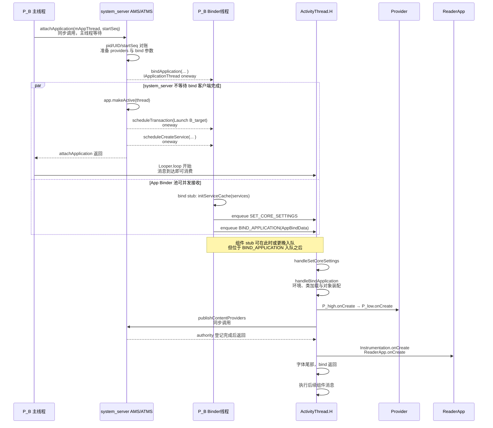

# 205 Android ActivityThread bindApplication：进程初始化与组件创建顺序

> 源码基线：Android 11 / API 30 / `android-11.0.0_r48`。
>
> 当前环境只有源码快照，可以证明调用方向、状态写入、主线程顺序与条件分支；不能据此测出某台设备的实际启动耗时，也不能把源码调用点替代为窗口 drawn 或硬件 present 证据。

第 204 章讨论的是一个已有客户端 Activity 记录时，system_server 与 App 怎样完成 pause/resume 交接；如果目标 Activity 所在进程还没有可用的应用级运行环境，生命周期事务就必须先让位给进程绑定。

本章只追一个问题：**当 `P_B` 已通过 `attachApplication()` 的身份校验，但还没有 `mBoundApplication`、自定义 `Application` 和启动期 Provider 时，Android 怎样把 Zygote fork 出来的通用进程装配成可以创建 `B_target` 的应用进程；Application 对象已 attach、Provider 已发布、`Application.onCreate()` 已返回、`handleBindApplication()` 已结束、Activity 已启动和首帧已显示，为什么是六种不同完成点？**

先给结论：`bindApplication()` 是 system_server 发给 `IApplicationThread` 的 oneway 命令，不是绑定完成回执。App Binder 线程只完成服务缓存初始化、两条主线程消息入队和数据搬运；真正的运行环境校准、类加载、Application/Provider 创建与回调都在 `ActivityThread.H` 所在主线程串行执行。普通路径的核心顺序是：

```text
SET_CORE_SETTINGS
  → BIND_APPLICATION
    → 进程级环境校准
    → LoadedApk / Context / ClassLoader / Instrumentation
    → Application 构造与 attachBaseContext
    → 启动期 Provider 按 initOrder 逐个 onCreate
    → 同步 publishContentProviders
    → Instrumentation.onCreate
    → Application.onCreate
    → 字体尾部
  → 后续组件事务
```

## 1. 固定 P_B、ReaderApp、两个 Provider 与 B_target 场景

沿用第 204 章的目标 Activity `B_target`，把它放进一个明确的普通冷启动场景：

```text
包名：com.example.reader
进程名：com.example.reader
进程：P_B
Application：ReaderApp
启动期 Provider：P_high(initOrder=100)、P_low(initOrder=0)
首个 Activity：B_target
等待启动的 Service：ReaderSyncService
```

本章主线再固定这些条件：

| 维度 | 固定前提 |
|---|---|
| 进程入口 | `ActivityThread.main()` 已 `prepareMainLooper()`，主线程正同步等待 `attachApplication()` 返回，尚未进入 `Looper.loop()` |
| 身份 | AMS 已用 pid、calling UID、startSeq 找到正确 `ProcessRecord`；具体防串账机制留给第 206 章 |
| 模式 | `normalMode=true`，非 restricted backup，非 isolated，也没有 `isolatedEntryPoint` |
| 兼容性 | `targetSdkVersion >= O_MR1`，配置和兼容信息有效 |
| 调试工具 | 无自定义 Instrumentation、debugger、Profiler、startup agent 或分配跟踪 |
| 组件 | 两个 Provider 都与目标进程匹配且正常返回；Application、Activity、Service 都不抛异常 |
| 调度 | 固定调用栈中 AMS 先发 bind，再登记 active，并依次寻找待启动 Activity、Service 与 Broadcast |

这里把两个 Provider 都写进场景，是为了让 `initOrder`、逐个本地创建与一次性发布之间的差别可见。`ReaderSyncService` 只用于标记 bind 后的组件边界，本章不展开它的生命周期。

本章完成点记为 B0：**面对一次冷启动卡顿或初始化竞态，能够指出第一本尚未结清的账，且不把“请求已发”“对象已存在”“authority 已发布”“Application 回调已返回”“Activity 已 resume”或“首帧已 present”互相替代。**

## 2. 八本账与十一个检查点

同一个冷启动进程至少同时推进八本账：

| 账本 | 主要所有者 | 代表性对象或状态 | 它不能独自证明什么 |
|---|---|---|---|
| 启动身份账 | AMS / `ProcessList` | pid、UID、startSeq、pending start | App 已完成绑定 |
| 服务端进程账 | AMS | `ProcessRecord.thread`、`makeActive()`、待启动组件 | `handleBindApplication()` 已运行 |
| Binder 投递账 | Binder | oneway 事务已提交、stub 已进入 | App 主线程已经处理消息 |
| 主队列账 | `ActivityThread.H` | `SET_CORE_SETTINGS`、`BIND_APPLICATION`、`EXECUTE_TRANSACTION` | 对应消息已出队 |
| 运行环境账 | App 主线程 | `mBoundApplication`、Configuration、`LoadedApk`、Context、ClassLoader | `Application.onCreate()` 已返回 |
| Application 账 | `LoadedApk` / `ActivityThread` | 构造、`attachBaseContext()`、`mInitialApplication`、`onCreate()` | Provider 已在 AMS 可获取 |
| Provider 账 | App / AMS | 本地实例、authority 表、`ContentProviderRecord.provider` | 整个 bind 已完成 |
| 组件与画面账 | ATMS、App、WMS、SurfaceFlinger、HWC | Launch/Resume、窗口 drawn、Buffer latch、present | 前面任意完成点可以省略 |

用十一个检查点把主线钉住：

| 检查点 | 固定场景中已经发生 | 仍不能推出 |
|---|---|---|
| I0 | pid、UID、startSeq 已通过 attach 身份核对 | bind 已发出 |
| S0 | AMS 的 oneway `bindApplication()` 提交未同步失败 | App stub 已执行 |
| Q0 | App stub 已直接初始化服务缓存，并把两条 H 消息入队 | 主线程已进入 bind |
| R0 | `handleBindApplication()` 已写进程名、ART dataDir、兼容与资源配置 | 自定义 Application 对象已存在 |
| A0 | `ReaderApp` 已构造并 `attachBaseContext()` | `ReaderApp.onCreate()` 已调用 |
| P0 | 两个 Provider 已在本地逐个完成 `attachInfo()/onCreate()` | AMS authority 已发布 |
| P1 | 同步 `publishContentProviders()` 已返回 | `ReaderApp.onCreate()` 已返回 |
| A1 | `Instrumentation.onCreate()` 与 `ReaderApp.onCreate()` 已正常返回 | bind 尾部字体工作已完成 |
| B1 | `handleBindApplication()` 已走完字体尾部并返回 | `B_target` 的 Launch 已执行 |
| C0 | 先前入队的 `ClientTransaction` 已由 H 执行并推进 `B_target` 生命周期 | 窗口已 drawn |
| G0 | 窗口 drawn、Buffer latch、硬件 present 各自有证据 | 可以倒推每个上游时间点 |

这些符号是源码阅读的证据标签，不是 Android 对外暴露的一套事务协议。尤其没有名为“bind complete”的服务端字段或回调；正常 bind 的最终成功只能通过下游行为和进程仍存活间接观察。

## 3. attach 阻塞、oneway 请求与主队列的完整时序

`ActivityThread.main()` 先准备主 Looper，再调用 `thread.attach(false, startSeq)`。非 system 进程在 `attach()` 中同步调用 AMS；只有这个同步调用返回，主线程才继续并最终进入 `Looper.loop()`。与此同时，App 的 Binder 线程池可以接收 system_server 发来的 oneway 命令并向尚未开始取消息的主队列入队。



图中有三种不同语义：

- App→AMS 的 `attachApplication()` 是同步 Binder 调用，App 主线程等待服务端返回；
- AMS→App 的 `IApplicationThread` 整个 AIDL 接口是 `oneway`，服务端不等待客户端生命周期工作；
- App→AMS 的 `publishContentProviders()` 属于普通同步调用，App 主线程要等 AMS 登记完 Provider 才继续。

`par` 两侧可以交错：App Binder 线程可能在 AMS 继续 `makeActive()` 时已经进入 bind stub，也可能稍后才获调度；唯一不变的是 App 主线程必须等同步 attach 返回、进入 `Looper.loop()` 后才会消费 H。后续组件 stub 可以在主线程处理 bind 之前、期间或之后入队；主线程不额外等待它们，图中的 Note 只表达这些消息位于 `BIND_APPLICATION` 入队之后。

固定场景里的 server 发出顺序是 bind、Activity、Service。`IBinder.FLAG_ONEWAY` 的本版本注释又规定：对同一个 `IBinder` 对象的多次 oneway 调用，远端一次只分派一笔，并保持原始调用顺序，即使执行它们的 IPC 线程可以不同。因此同一个 `IApplicationThread` 上，bind stub 会先完成 `SET_CORE_SETTINGS → BIND_APPLICATION` 入队，后续组件 stub 才入队相应消息。这个局部顺序不能扩张成“所有线程、所有 Binder 对象和所有 Handler 消息全局 FIFO”；不同 Binder 对象、oneway 与同步调用混用、front-of-queue、异步消息和同步屏障都要另行取证。

## 4. AMS 怎样准备 bind 参数并调度等待组件

`ActivityManagerService.attachApplicationLocked()` 的前半段先完成身份与生存期准备：找到正确 `ProcessRecord`、建立 death recipient、初始化调度与缓存状态、移除 `PROC_START_TIMEOUT_MSG`，再判断 `normalMode` 并生成当前进程应安装的 Provider。

Provider 列表不是简单照抄某一个 Manifest 的文本顺序：

```text
PMS.queryContentProviders(processName, uid, ...)
  → 过滤用户、组件启用状态与可见性
  → 选出匹配进程及 appId 的 Provider
  → 按 ProviderInfo.initOrder 降序排序
  → AMS 为每项建立/复用 ContentProviderRecord
  → ProviderInfoList 随 bind 下发
```

因此 shared UID / shared process 场景下，列表可能包含不止一个包的 Provider；固定场景中 `P_high(100)` 会先于 `P_low(0)`。只有目标进程已经处于 `mLaunchingProviders` 时，AMS 才额外挂 `CONTENT_PROVIDER_PUBLISH_TIMEOUT_MSG`。普通 bind 并不天然都有一只覆盖整个初始化过程的 Provider timeout。

AMS 传下来的信息包括：

| 类别 | 代表性参数 |
|---|---|
| 身份与代码 | process name、`ApplicationInfo`、ProviderInfoList |
| 测试与诊断 | Instrumentation、arguments、watcher、debugMode、Profiler、Binder tracking、allocation tracking |
| 运行模式 | restricted backup、persistent、Configuration、CompatibilityInfo |
| 共享输入 | 常用服务 Binder cache、core settings、build serial |
| 功能策略 | Autofill、Content Capture、disabled compatibility changes |

发送前还可能先投递 bind-time agent 与 startup agents；这些是“网络安全配置早于应用代码”结论的重要例外。固定普通场景没有 agent，后文的类加载边界都限定于此。

服务端的关键顺序是：

```text
mAtmInternal.preBindApplication
  → thread.bindApplication(...)
  → app.makeActive(thread, processStats)
  → mAtmInternal.attachApplication(...)      // 查找待启动 Activity
  → mServices.attachApplicationLocked(...)   // 查找待启动 Service
  → sendPendingBroadcastsLocked(...)
  → 可选 scheduleCreateBackupAgent(...)
```

`makeActive()` 只是把客户端 thread 纳入 `ProcessRecord` 与窗口进程控制器等服务端账本，方便后续命令投递；它没有跨进程等待 `handleBindApplication()`。末尾写入的 `PROCESS_START_TIME` 统计同样发生在服务端 attach 流程结束时，不是客户端 bind 完成时间。

## 5. bindApplication 是命令，不是绑定完成回执

`IApplicationThread.aidl` 声明的是 `oneway interface IApplicationThread`。这使每个方法调用都具有异步命令语义：普通远端代理完成提交后即可返回，调用方拿不到 `handleBindApplication()` 的返回值，也不会同步等到 `Application.onCreate()`。

可以把一次 bind 分成四道投递边界：

| 边界 | 最多能证明 | 不能证明 |
|---|---|---|
| `thread.bindApplication()` 本端未抛异常 | system_server 完成一次 oneway 提交 | App Binder stub 已开始 |
| App `ApplicationThread.bindApplication()` 进入 | 目标进程 Binder 线程取得参数副本 | H 消息已经执行 |
| `H.BIND_APPLICATION` 入队 | 主队列持有绑定消息 | 主线程已出队 |
| `handleBindApplication()` 进入/返回 | 客户端开始/结束这段同步方法 | Activity 已启动或首帧已显示 |

这也解释一个异常传播边界：客户端在 Provider、Application 或字体阶段抛出的异常，不会沿最初那次 oneway 调用反抛给 AMS。进程若因此崩溃，服务端最终通过 Binder death 和进程清理路径观察失败，而不是收到一个 bind 返回码。

AMS 的 attach 返回也不能充当替代回执。它只说明服务端这次同步 `attachApplication()` 调用已经把本地账本和候选组件推进到返回点；此时 App 主线程甚至可能刚准备进入 `Looper.loop()`。

## 6. 服务缓存、SET_CORE_SETTINGS 与 BIND_APPLICATION

App 侧入口 `ActivityThread.ApplicationThread.bindApplication()` 并非“只封装一个 AppBindData”。它按以下顺序执行：

```text
Binder线程
  1. ServiceManager.initServiceCache(services)       // 直接执行
  2. setCoreSettings(coreSettings)                   // 入队 H.SET_CORE_SETTINGS
  3. 构造并填充 AppBindData
  4. sendMessage(H.BIND_APPLICATION, data)           // 再入队
```

普通进程的预取缓存包含 package、permission manager、window、alarm、display、connectivity、input、app ops、content、job scheduler、notification 等常用服务 Binder。它没有在 App 内创建这些服务，只是减少启动早期再向 ServiceManager 查询的次数。isolated 进程的缓存被缩到 package 与 permission manager，避免用优化绕过访问边界。

`services` 与 `coreSettings` 都不是 `AppBindData` 字段：前者已在 Binder 线程消费；后者被封装为独立 H 消息。`handleSetCoreSettings()` 才在主线程写 `mCoreSettings` 并处理 View 调试属性变化。随后 `handleBindApplication()` 读取其中的 12/24 小时设置和 View 调试选项。

这条细节给出一个可执行的判断：若只在 `H.BIND_APPLICATION` 断点寻找 core settings 的赋值，会误以为数据凭空存在；正确的前驱是同一次 stub 回调先入队的 `H.SET_CORE_SETTINGS`。

后来的动态设置变化仍可单独调用 `setCoreSettings()`。所以“初始 bind 携带一份设置快照”不表示进程余生只使用这份值。

## 7. handleBindApplication 的阶段总图

`handleBindApplication()` 很长，但不宜按每行一个概念拆碎。按依赖关系可归成七段：

| 阶段 | 代表性动作 | 为什么必须在后阶段之前 |
|---|---|---|
| R1 运行时身份 | sensitive thread、启动时间、compat callbacks、`mBoundApplication`、Profiler、进程名、ART dataDir | 诊断、缓存与运行时必须先知道自己是谁 |
| R2 兼容与资源快照 | targetSdk 开关、时区、Locale、Configuration，随后取得 `LoadedApk` 句柄 | Zygote 继承值可能已过时，后续步骤要先知道目标包与资源配置 |
| R3 包后策略与设施 | agent、density、时间格式、View/StrictMode、debugger、trace、renderer、HTTP proxy | 某些分支会等待或改变后续执行环境 |
| R4 应用代码前置环境 | Instrumentation 信息、首个 app Context、图形支持、网络安全配置、Instrumentation 实例 | 应用类加载依赖 ClassLoader、资源和安全配置 |
| R5 对象装配 | heap growth limit、临时放宽 StrictMode、`makeApplication()`、选项、`mInitialApplication` | Provider 需要可用的 Application Context |
| R6 启动回调 | Provider 创建与发布、Instrumentation、Application | 形成进程级组件前置顺序 |
| R7 尾部 | StrictMode `finally` 判定、FontsContract context、可选预加载字体 | 尾部仍在主线程，仍属于 bind 方法耗时 |

主线程进入方法不等于应用类马上被加载。R1—R4 的大量工作发生在 `ReaderApp` 构造之前；性能分析如果只包围 `ReaderApp.onCreate()`，会漏掉 Binder 排队、资源配置、ClassLoader、图形/网络安全、Instrumentation、Provider 和字体成本。

同理，`mBoundApplication != null` 只说明运行环境账进入 R1，不代表 `mInitialApplication` 已赋值。观察字段时必须先问它对应哪个阶段。

## 8. Zygote 继承状态怎样完成进程级校准

fork 让子进程快速获得预加载类和内存页，也意味着它继承了一份未必仍适合目标包的通用状态。bind 的前半段把这份状态校准成当前进程的身份与策略。

首先区分两个名字：

- `Process.setArgV0(data.processName)` 与 DDM app name 使用进程名，例如 `com.example.reader:remote`；
- `VMRuntime.setProcessPackageName(data.appInfo.packageName)` 使用包名；
- `mBoundApplication.processName` 仍保存进程名，供 ActivityThread 后续查询。

随后 `VMRuntime.setProcessDataDirectory(data.appInfo.dataDir)` 在普通应用代码加载前告诉 ART 缓存与运行时数据属于哪个目录。它不是创建沙箱或授予文件权限；UID、挂载和 SELinux 等进程创建参数属于第 206 章。

targetSdk 驱动的是可观察语义，不是一个只供日志显示的数字。本版本在这里至少设置：旧版 AsyncTask 默认执行器、数组越界兼容、Message recycle 检查和 ImageDecoder API 级别。`AppCompatCallbacks.install(disabledCompatChanges)` 还把服务端决定的兼容变更集合装入进程。

环境校准的另一组动作处理 fork 后可能陈旧的全局缓存：

```text
TimeZone.setDefault(null)
  → 清掉继承的默认时区缓存，下次按当前系统状态解析
LocaleList.setDefault(data.config.getLocales())
  → 先使用服务端 Configuration 的 Locale
ResourcesManager.applyConfigurationToResourcesLocked(config, compat)
  → 更新预加载资源所见配置、densityDpi 与 compat config
getPackageInfoNoCheck(appInfo, compat)
  → 取得或创建目标包的 LoadedApk 句柄
density / 时间格式 / StrictMode / debugger / renderer / proxy
  → 在 LoadedApk 已取得后继续设置进程策略与设施
createAppContext(...)
  → 再依据最终资源选择更新 LocaleList
```

因此 Locale 有“Configuration 初值”和“首个 App Context 校准”两步；只截取其中一行会看漏资源选择对默认 Locale 的修正。12/24 小时偏好、View 调试开关、屏幕密度兼容和默认 density 也都在应用对象创建前落实。

`VMRuntime.registerSensitiveThread()` 在对应 ART 实现里把当前线程登记为 JIT-sensitive thread。它不是 `Thread.setPriority()`，也不证明主线程从此不会被抢占或阻塞。

## 9. 应用类加载前的调试、代理、图形与安全关口

环境校准后仍有数个可能显著改变时序的关口：

| 关口 | 普通路径动作 | 特殊影响 |
|---|---|---|
| StrictMode 默认 | 按 `ApplicationInfo` 初始化 thread/vm policy | 后面还有一段作用域更小的临时放宽 |
| debugger | `DEBUG_WAIT` 时通知 AMS、阻塞等待调试器、再清等待状态 | 可故意把冷启动停在 Application 创建前 |
| profiler/trace | 可启动 method/heap profiling、Binder tracing | 受 profileable/debuggable 与参数控制 |
| renderer | 写调试开关和包名；普通进程执行 graphics setup | isolated 分支改为 renderer isolated 标志 |
| HTTP proxy | 从 connectivity service 取得当前代理并写系统属性 | pre-boot 时服务可能不存在，代码显式容忍 |
| network security | `NetworkSecurityConfigProvider.install(appContext)` | 防止应用先创建使用错误配置的 TLS 对象 |

这里的 `NetworkSecurityConfigProvider` 是注册到 Java Security 体系的安全 Provider，不是 Android 四大组件中的 `ContentProvider`；后文的启动期 Provider 指后者，两本账不能混用。

普通非 isolated、无 agent 的固定场景中，图形支持和 Network Security Config 都在 `makeApplication()` 加载 `ReaderApp` 之前完成。这个结论必须保留条件：AMS 可在 bind 前要求 attach agent，而自定义 Instrumentation 也会引入另一套代码与 ClassLoader，不能泛化成“任何应用相关字节码都绝不可能更早执行”。

图形初始化内部用 `allowThreadDiskWritesMask()` 临时放宽，`finally` 无条件恢复原 mask；稍后的 Application/Provider 初始化使用的是另一段 `StrictMode.ThreadPolicy` 作用域。两者目的和收尾规则不同。

`DEBUG_WAIT` 是定位“服务端 bind 已发但 Application 长时间没创建”的合法解释之一。诊断时应先查看进程是否处于 waiting-for-debugger，而不是直接把时间归给 Application 业务代码。

## 10. LoadedApk、ClassLoader、首个 Context 与 Instrumentation

R2 在资源配置更新后已经通过 `data.info = getPackageInfoNoCheck(data.appInfo, data.compatInfo)` 取得 `LoadedApk`；随后才执行 density、时间格式、StrictMode、debugger、renderer 与代理等 R3 工作。本节讨论的是这个句柄如何在更后的 R4/R5 提供 Context、资源与 ClassLoader，而不是把它的取得时间挪到 debugger 之后。

`LoadedApk` 这个名字容易误导：它不是 APK 字节的完整内存副本，也不是 Application 实例，而是 ActivityThread 侧围绕一个包组织代码路径、资源、ClassLoader、ApplicationInfo、Application 缓存等信息的运行时句柄。

四个对象的职责要分开：

| 对象 | 在本章的职责 | 不等于 |
|---|---|---|
| `ApplicationInfo` | 来自包管理与服务端的静态/策略描述 | 已加载的代码环境 |
| `LoadedApk` | 组织代码、资源、ClassLoader 与 Application 缓存 | `Application` 对象 |
| `ContextImpl` | Context 操作的具体承载者，绑定 `LoadedApk` 与资源 | 对外暴露的唯一 Context 对象 |
| `Application` | ContextWrapper 子类、进程级应用对象及生命周期回调入口 | 整个进程初始化本身 |

如果存在自定义 Instrumentation，代码必须先查询 `InstrumentationInfo` 并记录目标/测试 APK 的 ABI、代码与 native library 路径，因为它会影响 ClassLoader。随后创建目标包的第一个 `appContext`，进行 Locale 的二次校准、图形与网络安全设置，再创建 instrumentation package 的 `LoadedApk`、Context 和 ClassLoader，实例化并 `init()` Instrumentation。

固定场景没有自定义 Instrumentation，因此走：

```text
mInstrumentation = new Instrumentation()
  → mInstrumentation.basicInit(this)
```

但后续 `makeApplication()` 仍通过 `mInstrumentation.newApplication()` 创建对象。传给 `makeApplication()` 的第二个参数为 null，并不等于绕过 `mInstrumentation`；它只控制 `LoadedApk.makeApplication()` 是否在内部立即调用 `callApplicationOnCreate()`。

第一个 `appContext` 是 bind 环境搭建用 Context，稍后还会交给 `FontsContract`。它不是最终 attach 给 `ReaderApp` 的那个 `ContextImpl` 实例。

## 11. makeApplication(restrictedBackupMode, null) 与第二个 Context

进入启动期磁盘策略作用域后，主线调用：

```java
app = data.info.makeApplication(data.restrictedBackupMode, null);
```

两个参数各自决定一件事：

| 参数 | 普通场景 | 特殊场景 |
|---|---|---|
| `forceDefaultAppClass` | false，使用 Manifest 的 `Application` 类；为空时回退基础 `android.app.Application` | restricted 为 true，强制基础 Application |
| `instrumentation` | 传 null，`makeApplication()` 内不调用 Application onCreate | 非 null 的其他调用点可在方法内部调用 |

`LoadedApk.makeApplication()` 的实际链路是：

```text
若 mApplication 已存在则复用
  → 选择 Application 类名
  → getClassLoader()
  → 非 android 包初始化 Java thread context ClassLoader
  → 为共享 library APK rewriteRValues（跳过 0x01 与 0x7f）
  → 创建第二个 ContextImpl
  → NetworkSecurityConfigProvider.handleNewApplication(context)
  → mInstrumentation.newApplication(classLoader, className, context)
  → context.setOuterContext(app)
  → mAllApplications.add(app)
  → LoadedApk.mApplication = app
  → 因参数为 null，不在此处调用 Application.onCreate
```

`rewriteRValues()` 处理运行时分配给共享库的 package id，使其资源引用与本进程资产表一致；它不是重新生成应用的 `R.java`。

两个 `createAppContext()` 使用同一个目标 `LoadedApk`，却返回两个不同 `ContextImpl`。第一个服务于进程环境与字体；第二个成为 Application 的 base Context。不能凭“参数看起来相同”把两次调用当成同一个对象。

## 12. Application 构造、attach、outer Context 与 mInitialApplication

默认 `Instrumentation.newApplication()` 再委托 `AppComponentFactory.instantiateApplication()` 实例化 `ReaderApp`，然后调用 `Application.attach(context)`：

```text
ClassLoader 加载 ReaderApp
  → 类初始化与构造函数
  → Application.attach(secondAppContext)
      → attachBaseContext(context)
      → mLoadedApk = ContextImpl.mPackageInfo
  → secondAppContext.setOuterContext(app)
  → LoadedApk / ActivityThread 登记对象
  → ActivityThread.mInitialApplication = app
  → 稍后才调用 ReaderApp.onCreate()
```

`attachBaseContext()` 发生在 `newApplication()` 返回前，所以自定义 `ReaderApp.attachBaseContext()` 可以运行得非常早；它依然晚于 Java 对象构造。`ContextImpl.setOuterContext(app)` 又在 newApplication 返回后回填，使内部 Context 在需要外层身份时指向真实 Application。

这里存在一个对排障非常重要的中间状态：

```text
ReaderApp 对象已存在
base Context 已 attach
LoadedApk.mApplication 已写入
ActivityThread.mInitialApplication 已写入
ReaderApp.onCreate 尚未调用
```

因此“`Application` 非 null”不能作为 `Application.onCreate()` 完成证据。更反直觉的是，接下来启动期 Provider 会拿着这个已 attach 但尚未 onCreate 的 Application Context 开始工作。

自定义 Instrumentation 可以覆写 `newApplication()` 与 `callApplicationOnCreate()`，所以“必然直接反射构造”和“必然直接调用 `app.onCreate()`”只适用于默认实现；分析测试进程必须查看实际 Instrumentation。

## 13. 启动期 Provider 的实例化、attachInfo 与 onCreate

普通非 restricted 路径只有在 Provider 列表非空时才调用 `installContentProviders(app, providers)`。列表已由 PMS 按 `initOrder` 降序排好，客户端按收到的顺序同步循环，不会为每个 Provider 自动并行开线程。

固定场景的每一项经历：

```text
选择 Context
  → 同包时使用传入的 ReaderApp
  → 必要时创建其他包或 split Context
取得 Context ClassLoader 与 LoadedApk AppComponentFactory
  → instantiateProvider(classLoader, ProviderInfo.name)
  → 取得 IContentProvider transport
  → localProvider.attachInfo(context, info)
      → 保存权限、authority、UID 与 AppOps 等信息
      → ContentProvider.onCreate()
  → 写 App 进程本地 provider authority / binder 表
  → 把 ContentProviderHolder 加入待发布结果
```

于是普通固定顺序是：

```text
ReaderApp 构造与 attach
  → P_high.onCreate
  → P_low.onCreate
  → 一次 publishContentProviders
  → Instrumentation.onCreate
  → ReaderApp.onCreate
```

`ContentProvider.onCreate()` 的 boolean 返回值在 `attachInfo()` 这一调用点没有被用来决定是否发布。真正使某项不进入结果的情况包括：无法取得 Context、transport 为 null，或捕获到的 Exception 被自定义 Instrumentation 接受后让该项返回 null。

“Provider 早于 Application”必须说完整：是**本进程启动期 Provider 的 `onCreate()` 早于自定义 Application 的 `onCreate()`**；Application 对象和 base Context 已经先存在。动态获取的远端 Provider、其他进程 Provider 或后续安装路径不能套用这条局部顺序。

如果 `P_high.onCreate()` 在主线程阻塞，`P_low`、整批发布、`ReaderApp.onCreate()` 和同一主队列后面的 Activity/Service 都会被推迟。这是它放大该进程冷启动的机制，不等于它会拖慢设备上每一次冷启动。

## 14. Provider 发布、Instrumentation/Application 回调与尾部判定

所有成功的本地 Provider 都装好后，`installContentProviders()` 才一次调用：

```text
App主线程
  → IActivityManager.publishContentProviders(appThread, holders)   [同步]
AMS
  → 校验 caller 对应 ProcessRecord
  → 为 class 与各个 authority 写 Provider 映射
  → 从 mLaunchingProviders 移除并取消相应 timeout
  → 把 Provider 所属 package 补入进程账
  → synchronized(ContentProviderRecord)
      → provider = 远端 transport
      → setProcess(process)
      → notifyAll 唤醒等待者
  → 返回 App 主线程
```

P1 因而是一个真实的服务端可见边界：等待该 authority 的其他进程可以继续，并可能很快在本进程 Binder 线程发起 Provider 请求。然而 App 主线程此后才执行 `mInstrumentation.onCreate(args)` 与 `mInstrumentation.callApplicationOnCreate(app)`。因此 Provider 已发布甚至开始接收跨进程调用时，`ReaderApp.onCreate()` 仍可能没有完成；把全局初始化只放在 Application onCreate，再假定所有 Provider 请求一定晚于它，是有竞态的设计。

Application 与 Provider 段外围临时调用 `StrictMode.allowThreadDiskWrites()`；在本版本它同时允许磁盘 read 与 write。`finally` 的源码注释与可执行语义必须分开：

```java
if (data.appInfo.targetSdkVersion < Build.VERSION_CODES.O_MR1
        || StrictMode.getThreadPolicy().equals(writesAllowedPolicy)) {
    StrictMode.setThreadPolicy(savedPolicy);
}
```

注释表达的设计意图是：旧 target 无条件恢复；新 target 只有在启动代码没有主动改 policy 时才恢复，避免覆盖应用自己的选择。但 r48 的 `StrictMode.ThreadPolicy` 没有覆写 `equals/hashCode`，而 `getThreadPolicy()` 每次都 `new ThreadPolicy(...)`。所以这里实际使用对象身份相等：

- targetSdk < O_MR1：短路第一项，确定调用 `setThreadPolicy(savedPolicy)`；
- targetSdk >= O_MR1：第二次 `getThreadPolicy()` 返回新对象，无法与先前保存的 `writesAllowedPolicy` 成为同一对象；静态逐行语义下该支为 false，本 `finally` 不执行恢复。

固定场景正属于后一类；若启动代码没有另设 policy，方法离开这段时仍保留 framework 放宽后的 mask。不能把注释意图直接当成 r48 的实际行为，也不能把这处版本断点推广到未核对的 Android 版本。

异常处理也不是一条统一规则：

| 位置 | 是否交给 `Instrumentation.onException()` | 未被接受时 |
|---|---|---|
| Application 实例化 | 是 | 包装为 `RuntimeException` |
| Provider 实例化或 `attachInfo/onCreate` 的 Exception | 是 | 包装为 `RuntimeException` |
| `Application.onCreate` 的 Exception | 是 | 包装为 `RuntimeException` |
| Instrumentation 信息缺失/构造 | 否 | 直接包装抛出 |
| `Instrumentation.onCreate` 自身异常 | 否 | 直接包装抛出 |

这些 catch 处理的是 `Exception`，不能据此宣称所有 `Error` 也会被 Instrumentation 接住。

Application 回调与 StrictMode `finally` 之后，方法仍有字体尾部：先把第一个 `appContext` 交给 `FontsContract`；非 isolated 进程再查询带 meta-data 的 ApplicationInfo，并在配置非零字体资源时调用 `Resources.preloadFonts()`。所以 A1 仍早于 B1；慢字体加载不应被错算成 `ReaderApp.onCreate()` 本身。

## 15. 特殊分支、失败与冷启动归因边界

主线之外至少要识别五类岔路：

| 分支 | 与普通路径的差别 |
|---|---|
| restricted backup/restore | AMS 在匹配的备份模式下置位；客户端强制基础 `android.app.Application`，跳过 Provider，但仍走 Instrumentation、Application 回调和字体尾部 |
| pre-boot 非 normalMode | AMS 实际传入 `isRestrictedBackupMode || !normalMode`，因此也走受限装配 |
| 配置了 `isolatedEntryPoint` | AMS 发 `runIsolatedEntryPoint()`，根本不调用 `bindApplication()`；反射执行指定静态 main 后退出 |
| 普通 isolated 进程 | 仍可能走 bind，但只收缩后的服务缓存，图形走 isolated 分支；Provider 发布接口本身拒绝 isolated caller |
| 无启动期 Provider | 不调用 `installContentProviders()`，因此也没有 P1 这次同步发布边界 |

客户端未捕获异常导致进程退出时，Binder death 最终让服务端清理 `ProcessRecord`、组件与 Provider 账。由于没有 bind-finished ack，不能把“AMS 没收到 bind 异常”当成成功。

定位慢启动时，可以按“第一处分歧”检查：

1. I0 前：启动身份/pending start 问题，转第 206 章；
2. S0—Q0：Binder 投递或目标进程接收问题；
3. Q0—R0：主线程尚未取到消息，检查 attach 返回、队列与前序工作；
4. R0—A0：运行时校准、资源、Instrumentation、ClassLoader 或 Application 构造；
5. A0—P0：某个 Provider 的构造、`attachInfo()` 或 `onCreate()`；
6. P0—P1：同步 publish 与 AMS 锁/Provider 账；
7. P1—A1：Instrumentation 或 Application 回调；
8. A1—B1：StrictMode `finally` 的版本行为与字体尾部；
9. B1—C0：后续组件事务与生命周期；
10. C0—G0：窗口、绘制、Buffer 与显示链。

`Application.onCreate()` 包围区间只覆盖第 7 项的一部分。AMS 的 `makeActive()`、attach 返回、Provider publish、`handleBindApplication()` 返回、Activity resume、窗口 drawn 和硬件 present 都有各自证据，不能用一个启动日志点代替整条链。

第 206 章将沿因果链向启动上游回溯：`ProcessList` 怎样建立 pending start，怎样组合 Zygote 参数，以及 pid、UID、startSeq 如何把主动 attach 对回唯一一次进程启动。本章把身份校验当作 I0 前提，不提前展开。

## 16. 九组只读练习重建完整装配链

以下命令都只读取 Android 11 r48 源码。每段都可在源码根目录直接运行；若从其他目录运行，把 `ANDROID_BUILD_TOP` 指向源码根目录。每次练习先写出自己的阶段表，再与命令结果核对，避免只记行号。

### 练习 1：追 AMS 从 Provider 列表到等待组件调度

目标：在 `attachApplicationLocked()` 中标出 Provider 生成、bind、`makeActive()`、Activity、Service 与 Broadcast 的发出顺序，并指出哪一步仍未等待客户端 bind 完成。

```bash
set -euo pipefail
SRC="${ANDROID_BUILD_TOP:-$PWD}"
FILE="$SRC/frameworks/base/services/core/java/com/android/server/am/ActivityManagerService.java"
test -f "$FILE"
rg -n 'generateApplicationProvidersLocked|thread\.bindApplication|app\.makeActive|mAtmInternal\.attachApplication|mServices\.attachApplicationLocked|sendPendingBroadcastsLocked' "$FILE"
sed -n '5300,5410p' "$FILE"
```

验收：能够解释 `makeActive()` 是服务端登记，不是 `handleBindApplication()` 完成回执；能够把 pid/UID/startSeq 的细节明确留给第 206 章。

### 练习 2：证明 bind 是 oneway，并拆开四道证据边界

目标：查 AIDL 声明和 App 侧 stub，分别标出“代理提交”“stub 进入”“H 入队”“主线程执行”。

```bash
set -euo pipefail
SRC="${ANDROID_BUILD_TOP:-$PWD}"
AIDL="$SRC/frameworks/base/core/java/android/app/IApplicationThread.aidl"
AT="$SRC/frameworks/base/core/java/android/app/ActivityThread.java"
test -f "$AIDL"
test -f "$AT"
rg -n 'oneway interface IApplicationThread|void bindApplication' "$AIDL"
rg -n 'public final void bindApplication|sendMessage\(H\.BIND_APPLICATION|handleBindApplication' "$AT"
```

验收：不能再用 `thread.bindApplication()` 正常返回证明远端 stub、Application 回调或首帧已经发生。

### 练习 3：重建 SET_CORE_SETTINGS、BIND_APPLICATION 与组件消息队列

目标：证明 core settings 不在 Binder 线程直接写，也不属于 `AppBindData`；再找到 Launch transaction 与 Service 消息的客户端入口。

```bash
set -euo pipefail
SRC="${ANDROID_BUILD_TOP:-$PWD}"
AT="$SRC/frameworks/base/core/java/android/app/ActivityThread.java"
test -f "$AT"
sed -n '1036,1095p' "$AT"
rg -n 'case SET_CORE_SETTINGS|handleSetCoreSettings|case BIND_APPLICATION|case EXECUTE_TRANSACTION|case CREATE_SERVICE' "$AT"
sed -n '793,835p' "$AT"
```

验收：画出固定场景的 `SET_CORE_SETTINGS → BIND_APPLICATION → EXECUTE_TRANSACTION / CREATE_SERVICE`，并注明这是受约束的局部顺序，不是全系统 FIFO。

### 练习 4：把 handleBindApplication 压缩为七个依赖阶段

目标：从一个长方法中抽取 R1—R7，不把每行调用拆成孤立知识点。

```bash
set -euo pipefail
SRC="${ANDROID_BUILD_TOP:-$PWD}"
AT="$SRC/frameworks/base/core/java/android/app/ActivityThread.java"
test -f "$AT"
sed -n '6379,6485p' "$AT"
sed -n '6485,6618p' "$AT"
sed -n '6618,6760p' "$AT"
```

验收：每段至少写出输入、主线程状态写入和下一段依赖；能指出 A1 与 B1 之间还有 StrictMode `finally` 和字体尾部。

### 练习 5：核对 fork 后的身份、兼容、时区与资源校准

目标：分别找出 processName、packageName、ART dataDir、targetSdk 兼容开关、TimeZone、Locale 和 ResourcesManager 更新，不把它们归成一句“设置环境”。

```bash
set -euo pipefail
SRC="${ANDROID_BUILD_TOP:-$PWD}"
AT="$SRC/frameworks/base/core/java/android/app/ActivityThread.java"
test -f "$AT"
rg -n 'setArgV0|setAppName|setProcessPackageName|setProcessDataDirectory|targetSdkVersion|TimeZone\.setDefault|LocaleList\.setDefault|applyConfigurationToResourcesLocked' "$AT"
sed -n '6410,6475p' "$AT"
```

验收：能解释 `data.processName` 与 `data.appInfo.packageName` 的不同去向，并说明重置 TimeZone/Locale 是在修正继承缓存。

### 练习 6：区分 LoadedApk、两个 Context 与 Instrumentation

目标：追 `getPackageInfoNoCheck()`、两次 `createAppContext()`、Instrumentation 信息为何先于目标 ClassLoader 环境确定。

```bash
set -euo pipefail
SRC="${ANDROID_BUILD_TOP:-$PWD}"
AT="$SRC/frameworks/base/core/java/android/app/ActivityThread.java"
CTX="$SRC/frameworks/base/core/java/android/app/ContextImpl.java"
test -f "$AT"
test -f "$CTX"
rg -n 'getPackageInfoNoCheck|createAppContext|InstrumentationInfo|mInstrumentation = new Instrumentation|basicInit' "$AT"
sed -n '2650,2675p' "$CTX"
```

验收：能够说明首个 Context 与 Application base Context 不是同一实例，也能说明 `LoadedApk` 不是 Application。

### 练习 7：证明 Application 的构造、attach 与 onCreate 分离

目标：把 `makeApplication()`、工厂、`newApplication()`、`Application.attach()` 和最终回调连接起来。

```bash
set -euo pipefail
SRC="${ANDROID_BUILD_TOP:-$PWD}"
LAPK="$SRC/frameworks/base/core/java/android/app/LoadedApk.java"
INS="$SRC/frameworks/base/core/java/android/app/Instrumentation.java"
APP="$SRC/frameworks/base/core/java/android/app/Application.java"
test -f "$LAPK"
test -f "$INS"
test -f "$APP"
sed -n '1220,1285p' "$LAPK"
sed -n '1148,1165p' "$INS"
sed -n '345,356p' "$APP"
```

验收：写出 A0 时已经成立的字段与尚未发生的回调，并解释第二个参数 null 只抑制 `makeApplication()` 内部的 onCreate 调用。

### 练习 8：追 Provider initOrder、本地 onCreate 与同步发布

目标：证明服务端排序、客户端逐项安装、`attachInfo()` 内调用 `onCreate()`，以及发布回到 AMS 的同步边界。

```bash
set -euo pipefail
SRC="${ANDROID_BUILD_TOP:-$PWD}"
PMS="$SRC/frameworks/base/services/core/java/com/android/server/pm/PackageManagerService.java"
AT="$SRC/frameworks/base/core/java/android/app/ActivityThread.java"
CP="$SRC/frameworks/base/core/java/android/content/ContentProvider.java"
test -f "$PMS"
test -f "$AT"
test -f "$CP"
rg -n 'queryContentProviders|sProviderInitOrderSorter|initOrder' "$PMS"
rg -n 'installContentProviders|instantiateProvider|localProvider\.attachInfo|publishContentProviders' "$AT"
sed -n '2350,2392p' "$CP"
```

验收：能解释 `P_high → P_low → publish → ReaderApp.onCreate`，并说明 P1 后远端 Provider 请求可能与 Application onCreate 并发。

### 练习 9：建立特殊分支、恢复规则与下游边界表

目标：把 restricted、pre-boot、isolatedEntryPoint、普通 isolated、异常、StrictMode 注释/实现差异、字体和首个 Activity 分开放进决策表。

```bash
set -euo pipefail
SRC="${ANDROID_BUILD_TOP:-$PWD}"
AMS="$SRC/frameworks/base/services/core/java/com/android/server/am/ActivityManagerService.java"
AT="$SRC/frameworks/base/core/java/android/app/ActivityThread.java"
SM="$SRC/frameworks/base/core/java/android/os/StrictMode.java"
test -f "$AMS"
test -f "$AT"
test -f "$SM"
rg -n 'isRestrictedBackupMode|isolatedEntryPoint|runIsolatedEntryPoint|getCommonServicesLocked' "$AMS"
rg -n 'allowThreadDiskWrites|O_MR1|callApplicationOnCreate|setApplicationContextForResources|preloadFonts|Process\.isIsolated' "$AT"
sed -n '6680,6760p' "$AT"
rg -n 'class ThreadPolicy|ThreadPolicy getThreadPolicy|return new ThreadPolicy' "$SM"
if sed -n '/public static final class ThreadPolicy {/,/public static final class VmPolicy {/p' "$SM" | rg -n 'boolean equals|int hashCode'; then
  exit 1
fi
sed -n '1260,1285p' "$SM"
```

验收：能够证明 r48 `ThreadPolicy` 没有值相等实现、`getThreadPolicy()` 每次新建对象，并为每条分支写出缺失或新增的检查点；明确 B1、C0、窗口 drawn、Buffer latch 与硬件 present 不能互相代替。

完成九组练习后，应能从一条卡顿日志反向建立证据链：先判断 bind 请求是否只停在服务端提交，再看 stub 与 H 队列，然后依次排查运行时校准、Application attach、逐个 Provider、同步发布、Application 回调和字体尾部，最后才进入 Activity 与图形链。

下一章转向这条因果链的上游：`ProcessList` 怎样建立进程启动账本，怎样拼出 Zygote 参数，以及 startSeq 为什么能阻止迟到进程把自己 attach 到另一笔启动记录。
