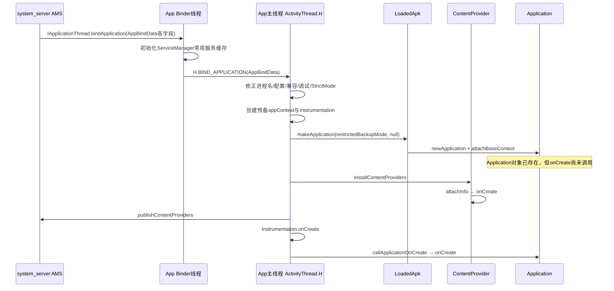

# 205 Android ActivityThread bindApplication：进程初始化与组件创建顺序

> 源码版本：Android 11 `android-11.0.0_r48`。  
> 当前在 Mac 上只读源码，不实际编译 AOSP，也不把源码推演当作真机时序测量。

## 1. 本章目标

第201章把 `bindApplication` 放在冷启动总链路中看过，本章专门展开它：一个刚由 Zygote fork 出来的进程，怎样变成“某个应用已经可以运行组件”的进程。

读完应能准确回答：

- Binder 请求在哪个线程收到，初始化又在哪个线程执行；
- 为什么 fork 后还要重设时区、Locale、进程名和兼容开关；
- `LoadedApk`、`ContextImpl`、`Application` 分别是什么；
- Provider、Instrumentation、`Application.onCreate()` 的真实先后顺序；
- 哪些步骤会放大冷启动耗时，哪些完成点并不代表首帧已经显示。

## 2. 先建立一句话模型

`bindApplication` 不是“调用一下 Application.onCreate”这么简单，而是 App 进程的进程级装配过程：

```text
system_server给启动参数
  → App Binder线程收包
  → App主线程校准进程全局环境
  → 建立LoadedApk/Context/ClassLoader/Instrumentation
  → 创建Application对象
  → 创建并发布启动期Provider
  → 调用Application.onCreate
```

## 3. 它处在冷启动的哪里

前面已经发生 Zygote fork、App 进程 `ActivityThread.main()`、应用线程向 AMS `attachApplication()`；后面才会执行 LaunchActivityItem、Activity 生命周期、窗口和首帧。

因此它是“进程已经存在”和“首个应用组件真正运行”之间的桥梁。

## 4. 完整线程与对象图



## 5. system_server 准备哪些输入

入口在 `ActivityManagerService.attachApplicationLocked()`。它收集进程名、`ApplicationInfo`、启动期 Provider 列表、Instrumentation、调试/Profiler、Configuration、CompatibilityInfo、Autofill 和 ContentCapture 配置等。

这些不是 App 自己临时查询出来的零散值，而是 system_server 对“这个 UID、用户和进程应该怎样启动”的一次输入快照。

## 6. 常用 Binder 服务缓存也随请求下发

AMS 的 `getCommonServicesLocked()`准备 package、window、alarm、display、connectivity、input、appops、content、jobscheduler 等常用服务 Binder。

App 的 `ApplicationThread.bindApplication()`先执行：

```java
if (services != null) {
    ServiceManager.initServiceCache(services);
}
```

这样启动早期调用 `getSystemService()` 时，可少做部分 ServiceManager 查询；它不是创建这些系统服务，服务仍然在 system_server 等进程中。

## 7. AppBindData 是一次主线程消息的载体

`ApplicationThread.bindApplication()`把跨进程参数复制到 `AppBindData`，最后只做：

```java
sendMessage(H.BIND_APPLICATION, data);
```

`ApplicationThread` 是 `IApplicationThread.Stub`，Binder 入站发生在 Binder 线程；`sendMessage` 把真正工作交给 ActivityThread 主 Handler。

## 8. 为什么必须切到主线程

Application、Provider 和后续四大组件的生命周期都要求与 App 主 Looper 串行。若直接在任意 Binder 线程初始化，会和 Activity 启动、配置变化及组件回调并发，顺序无法成立。

主线程收到 `H.BIND_APPLICATION` 后调用 `handleBindApplication(data)`。

## 9. bind 请求不是 bind 完成回执

system_server 发出 Binder 调用，只表示初始化请求已交给目标进程；`sendMessage()`也只表示消息入队。`handleBindApplication()`返回前完成本章所述初始化，但这个流程没有一个等价于“首帧显示”的完成信号。

不要用 `bindApplication` 的发送时间当作 `Application.onCreate()`结束时间，更不能当作窗口 drawn 或硬件 present 时间。

## 10. 第一组工作：标记运行时敏感线程

方法开头调用 `VMRuntime.registerSensitiveThread()`，告诉 ART 当前 UI 线程对延迟敏感；随后按调试配置打开分配跟踪，并记录进程 start 的 elapsedRealtime 与 uptime。

这里是运行时调度和诊断元数据，不是给线程改 Java 优先级。

## 11. 保存绑定主快照

```java
AppCompatCallbacks.install(data.disabledCompatChanges);
mBoundApplication = data;
mConfiguration = new Configuration(data.config);
mCompatConfiguration = new Configuration(data.config);
```

`mBoundApplication`成为 ActivityThread 后续查询初始包、进程和 Profiler 信息的重要账本；Configuration 用副本，避免直接共享调用方传来的可变对象。

## 12. 进程名必须在等调试器前设置

源码先执行 `Process.setArgV0(data.processName)`、DDM app name 和 `VMRuntime.setProcessPackageName()`，再可能等待 debugger。

所以即使进程停在“等待调试器”，工具也能按正确应用/进程名识别它；带 `android:process=":remote"` 的进程名也不是简单包名。

## 13. ART 数据目录必须在应用代码加载前确定

```java
VMRuntime.setProcessDataDirectory(data.appInfo.dataDir);
```

注释明确说它用于缓存信息，必须在应用代码加载前设置。这里给 ART 的是进程对应应用数据目录，不等价于替应用创建目录；目录与权限早由安装和启动体系准备。

## 14. targetSdk 会选择兼容语义

Android 不能只按当前系统版本执行所有新行为，否则旧 App 可能崩溃。r48 在这里按 targetSdk 调整多项进程全局行为，例如：

- 很旧 App 的 AsyncTask 默认 executor；
- util Array 越界策略；
- Message recycle 检查；
- ImageDecoder 对旧行为的兼容。

这是“运行在 Android 11”与“target Android 11”不同的具体证据。

## 15. 为什么 fork 后要重置时区

Zygote 是长期存活的模板进程。它缓存过的默认时区可能在 fork 前后已经过期，因此子进程执行：

```java
TimeZone.setDefault(null);
```

`null` 的意义是清掉 Java 默认缓存，使其重新依据当前系统状态解析，而不是把时区设成“空”。

## 16. Locale 也先按最新 Configuration 校准

`LocaleList.setDefault(data.config.getLocales())`先建立进程默认 Locale；稍后创建 App Context 后，还会用资源配置再调用 `updateLocaleListFromAppContext()`。

第一次是进程级初值，第二次把 App Context 的资源选择纳入考虑，不应把两次调用误认为无意义重复。

## 17. 预加载资源不一定是最新状态

Zygote 预加载了 framework 资源，但设备密度、Locale、夜间模式等可能已变化。ActivityThread 在 `mResourcesManager` 锁内应用服务端传来的 Configuration 与 CompatibilityInfo，并更新默认显示 density。

fork 共享带来启动收益，也带来“继承缓存必须校准”的责任。

## 18. LoadedApk 不是已加载的 APK 文件副本

```java
data.info = getPackageInfoNoCheck(data.appInfo, data.compatInfo);
```

返回的 `LoadedApk` 是进程内包运行信息中心：持有 ApplicationInfo、资源、ClassLoader、应用目录、组件工厂和 Application 引用等。它会按需创建 ClassLoader/Resources，并非把整个 APK 一次读入内存。

## 19. 屏幕密度兼容

不声明支持多密度的旧 App 会进入 density compatibility mode，并把 Bitmap 默认密度设为基准值；随后 `updateDefaultDensity()`按当前显示和兼容条件刷新。

这是资源和像素解释规则，不是物理屏幕分辨率被改变。

## 20. 时间格式和 View 调试开关

ActivityThread 读取 core settings 中的 12/24 小时配置，更新 `DateFormat` 偏好，也设置调试 View attribute 状态。

这些看似零散，却说明应用还没进 `onCreate()`，Framework 已经把进程级公共语义对齐。

## 21. StrictMode 默认规则先建立

`StrictMode.initThreadDefaults(appInfo)`和`initVmDefaults(appInfo)`按应用属性建立线程与 VM 策略。后面为了兼容启动期初始化，Framework 会临时放宽主线程磁盘写入，但放宽前提是这里已有基准策略。

## 22. 等待调试器会故意冻结启动

当 debugMode 是 `DEBUG_WAIT`，进程通知 AMS 展示等待状态，调用 `Debug.waitForDebugger()`，连接后再清除等待标记。

这类启动慢是人为调试门，不应和 ClassLoader、Provider I/O 或主线程卡顿混为一个根因。

## 23. Profiling、Trace 与 Binder tracking

满足 profileable 或 debuggable 条件时，系统允许 App trace、初始化堆 profiling，并可打开 Binder tracking；HardwareRenderer 调试能力也依据应用和系统 debuggable 状态设置。

这些开关影响可观测能力，有些也会引入额外开销，分析 trace 时应先确认启动参数。

## 24. 默认 HTTP 代理也要重新同步

源码从 ConnectivityService 取得当前默认网络代理，并写入进程系统属性。原因与时区类似：Zygote 中旧全局状态不能直接视为 fork 时的设备现状。

pre-boot 场景 ConnectivityService 可能尚不存在，代码允许 Binder 为空而不崩溃。

## 25. 为什么先解析 Instrumentation 信息

源码注释直接说明：Instrumentation 信息会影响 ClassLoader，因此必须在建立 App Context 前读取。

测试 APK 和被测 APK 可能有不同代码、native library 与 ABI；这里记录两边目录，并在 ABI 不同的时候告警。

## 26. 第一次 createAppContext：初始化工作环境

```java
final ContextImpl appContext =
        ContextImpl.createAppContext(this, data.info);
```

这个 Context 供 Locale、图形、网络安全、Instrumentation context 等进程初始化使用。它出现于 Application 对象创建之前，所以此刻 outer context 还不是自定义 Application 实例。

## 27. 图形支持与 isolated 进程不同

非 isolated 进程执行 `setupGraphicsSupport(appContext)`；这一步自己用 mask 临时允许磁盘写入并在 finally 恢复。isolated 进程则告诉 HardwareRenderer 当前是隔离进程。

隔离进程并不是“普通 App 进程但权限少一点”的所有路径完全复刻，它在服务缓存、图形和入口等处都有特化。

## 28. 网络安全 Provider 必须早于应用代码

```java
NetworkSecurityConfigProvider.install(appContext);
```

源码要求它在应用代码加载前安装，避免应用先创建 TLS 对象，导致网络安全配置接入过晚。这里的 Provider 是 Java Security Provider，不是四大组件中的 ContentProvider，两者不要混淆。

## 29. 创建自定义或默认 Instrumentation

若 AMS 传来 instrumentationName，ActivityThread 用测试包 ClassLoader 创建 Instrumentation，并调用 `init()`连接线程、测试 Context、目标 Context、Watcher 和 UI Automation。

普通启动则创建基础 `Instrumentation` 并 `basicInit(this)`。所以即使 App 没写测试，Application/Activity 生命周期仍通过 Instrumentation 包一层调用。

## 30. 大堆标志改变 ART growth limit

声明 `FLAG_LARGE_HEAP` 时清除 growth limit；普通 App 则 clamp 到当前 growth limit。

这只改变堆增长策略，不代表启动时立即分配一大块内存，也不保证应用永远不会 OOM。

## 31. 为什么临时允许主线程磁盘写入

接下来要创建 Application 和 Provider，兼容历史应用时难免触发类、资源或文件访问：

```java
final StrictMode.ThreadPolicy savedPolicy =
        StrictMode.allowThreadDiskWrites();
final StrictMode.ThreadPolicy writesAllowedPolicy =
        StrictMode.getThreadPolicy();
```

这是暂时改变 StrictMode 检测政策，不是把磁盘变快，也不是把同步 I/O 移到后台线程。

## 32. 放宽 StrictMode 不等于鼓励启动 I/O

主线程读配置、数据库迁移或扫描文件仍会占据真实墙钟时间，阻塞后续 Provider、Application、Activity 和首帧。StrictMode 不报警与没有性能代价是两回事。

开发者仍应把非首帧必需的工作延后或异步化，并用 trace 证明优化结果。

## 33. makeApplication 的两个关键参数

```java
app = data.info.makeApplication(
        data.restrictedBackupMode, null);
```

第一个参数在受限备份/恢复模式强制使用基础 `android.app.Application`；第二个参数故意传 `null`，表示 `makeApplication()`此时只创建对象，不在方法内部调用 `Application.onCreate()`。

## 34. Application 类名怎样选出

`LoadedApk.makeApplication()`读取 Manifest 合并后的 `ApplicationInfo.className`。若类名为空或 forceDefaultAppClass 为 true，就使用 `android.app.Application`。

这个选择发生在已安装包元数据上，不是在运行时重新解析原始 AndroidManifest.xml 文本。

## 35. ClassLoader 在这里真正进入关键路径

`getClassLoader()`建立或返回 LoadedApk 的类加载器；随后初始化 Java context ClassLoader。应用 Application 类、Provider 类以及后面的 Activity 类都依赖这套加载环境。

冷启动 trace 中类加载、dex page fault、验证和初始化成本，可能在这一段集中暴露。

## 36. 为什么还要 rewriteRValues

LoadedApk 遍历分配给共享 library APK 的 package identifier，对其 `R.onResourcesLoaded(id)`执行重写。

它解决运行时资源 package id 与库中引用的衔接；跳过 `0x01` framework 与 `0x7f` 应用自身。不是把每个资源值重新生成一遍。

## 37. 第二次 createAppContext：Application 的 base Context

`makeApplication()`内部再次调用：

```java
ContextImpl appContext =
        ContextImpl.createAppContext(mActivityThread, this);
```

这次 Context 与当前 LoadedApk 配对，随后交给新 Application 作为 base Context。前一个预备 Context 与这里的 Application base Context 用途相近但对象阶段不同。

## 38. newApplication 会先 attach，再返回对象

`Instrumentation.newApplication()`先通过对应包的 AppComponentFactory 创建 Application，再调用隐藏的 `Application.attach(context)`；其核心为：

```java
attachBaseContext(context);
mLoadedApk = ContextImpl.getImpl(context).mPackageInfo;
```

因此自定义 `Application.attachBaseContext()`已经执行，Application 能拿到 base Context 和 LoadedApk，但 `onCreate()`仍未执行。

Application 的类静态初始化和构造函数发生在 `attach()`之前，此时 base Context 尚未接入。把依赖 Context 的工作塞进构造函数既容易空指针，也让启动顺序更难观察；正常初始化入口应优先选择 `attachBaseContext()`或`onCreate()`，并清楚它们与 Provider 的相对位置。

## 39. Context outer object 在对象创建后回填

Application 创建成功后，`appContext.setOuterContext(app)`让 ContextImpl 的外层语义指向 Application；然后 ActivityThread 把它加入 `mAllApplications`，LoadedApk 保存到 `mApplication`。

`makeApplication()`若再次调用且已有 `mApplication`，会直接返回同一对象，避免同一 LoadedApk 重复创建 Application。

## 40. 先记住最反直觉的中间状态

此刻满足：

```text
Application构造函数：已经执行
Application.attachBaseContext：已经执行
Application对象和base Context：已经可用
Application.onCreate：尚未执行
```

理解这个中间状态，是理解启动期 Provider 顺序的钥匙。

## 41. mInitialApplication 的意义

ActivityThread 把刚创建的对象存入 `mInitialApplication`。它代表本次进程绑定的初始 Application，供 Context、Provider 安装、配置变化和退出等路径使用。

同一进程后来可能按需加载其他包的 LoadedApk/Application 记录，因此不要把 `mAllApplications`错误理解成永远只有一个元素；但普通单包进程通常只看到初始对象。

## 42. 普通模式先安装 ContentProvider

非 restricted backup 且 provider 列表非空时：

```java
installContentProviders(app, data.providers);
```

传入的 context 是已经 attach 的 Application。Provider 因此能获取 Application Context，但不能据此假设自定义 `Application.onCreate()`已经执行。

## 43. Provider 实例怎样创建

`installProvider()`找到合适包 Context 和 split Context，用其 ClassLoader，再通过 LoadedApk 的 AppComponentFactory `instantiateProvider()`实例化 Provider，并取得 `IContentProvider` Binder transport。

这说明组件创建可以受 AppComponentFactory 影响，并非永远是源码里直接 `Class.newInstance()`。

## 44. attachInfo 就会调用 Provider.onCreate

本地 Provider 创建后执行：

```java
localProvider.attachInfo(c, info);
```

`ContentProvider.attachInfo()`设置 Context、UID、读写权限、path permission、exported、singleUser 和 authorities，最后直接调用：

```java
ContentProvider.this.onCreate();
```

所以“install Provider”不是只注册类名，Provider 的业务 `onCreate()`确实在 App 主线程同步执行。

## 45. Provider 为什么会拖慢所有冷启动

Provider 列表逐个循环安装；任一 `onCreate()`中的数据库、文件、反射、SDK 初始化都会阻塞后续 Provider，随后才轮到 Application.onCreate 和 Activity。

很多第三方库用 Provider 自动初始化，便利的代价是它进入所有相关进程的启动关键路径；优化时应先判断该 Provider 是否属于目标进程、是否首帧必需。

## 46. 创建完后一次性发布给 AMS

ActivityThread 收集 `ContentProviderHolder`，循环完成后调用：

```java
ActivityManager.getService().publishContentProviders(
        getApplicationThread(), results);
```

这是 App 进程告诉 AMS“这些 authority 的 Binder 已可提供服务”。Provider 本地 `onCreate()`完成和远端查询可获得 Provider 是相邻但不同的完成边界。

## 47. Instrumentation.onCreate 为什么放在 Provider 后

源码注释说明测试 Instrumentation 通常会在 `onCreate()`启动测试线程；若它早于 Provider 安装，测试线程可能和 Provider 初始化竞态。

因此顺序是先装并发布 Provider，再调用 `mInstrumentation.onCreate(args)`。

## 48. 最后才调用 Application.onCreate

```java
mInstrumentation.callApplicationOnCreate(app);
```

Instrumentation 最终调用 Application.onCreate。普通 r48 绑定的精确顺序因此是：

```text
Application构造/attachBaseContext
  → ContentProvider逐个attachInfo/onCreate
  → publishContentProviders
  → Instrumentation.onCreate
  → Application.onCreate
```

“Application 最先初始化”若指对象创建可以成立；若指 `Application.onCreate()`则不成立。

## 49. restricted backup 模式是重要例外

备份/恢复受限环境会强制基础 Application 类，并跳过 ContentProvider，因为 Provider 可能依赖自定义 Application。之后仍走 Instrumentation 与基础 Application 的 onCreate 调用。

所以本章普通顺序不能不加条件地外推到 restricted backup，也不能外推到 `runIsolatedEntryPoint()`那条完全不同入口。

## 50. StrictMode 策略怎样恢复

finally 中不是无条件恢复：

```java
if (targetSdk < O_MR1
        || StrictMode.getThreadPolicy().equals(writesAllowedPolicy)) {
    StrictMode.setThreadPolicy(savedPolicy);
}
```

老 target 始终恢复旧策略；较新 target 若启动代码没有主动改 policy，也恢复。若较新 App 在启动期明确换了 policy，Framework 保留它的新策略，避免把应用自己的选择覆盖掉。

## 51. 字体预加载发生得更晚

Application.onCreate 返回后，ActivityThread 设置 FontsContract 的 Application Context；非 isolated 进程再读取 manifest meta-data，按需执行字体资源预加载。

因此字体预加载仍属于 bindApplication 尾部，也可能推迟后续主线程消息，但它不在 Application.onCreate 之前。

## 52. 异常怎样处理

Application、Provider 或 Instrumentation 创建/回调异常会先给 `Instrumentation.onException()`处理机会；未被接管时包装成 RuntimeException 抛出。主线程未捕获致命异常通常导致进程终止，AMS 再按组件和启动策略处理死亡。

这里没有“某个 Provider 失败就自动跳过，其他组件照常启动”的普遍保证。

## 53. bindApplication 与首个 Activity 的排序

system_server 在进程 attach 后先发送 bindApplication，随后才能把等待中的组件工作调度给应用；客户端都落到 ActivityThread 主消息队列，初始化必须先建立组件所需的运行环境。

但“bind 已请求”“bind 方法返回”“LaunchActivityItem 已执行”“Activity.onResume”“首帧 drawn”仍是五个不同边界，诊断时要分别找 trace 或日志证据。

## 54. 性能归因不要只盯 Application.onCreate

一次慢 bind 可能来自：

- 等调试器、Profiler 或 agent；
- ClassLoader、类验证、dex/文件 page fault；
- 资源和 shared library R 重写；
- 图形与网络安全初始化；
- 任意启动期 Provider.onCreate；
- Instrumentation 或 Application.onCreate；
- manifest 字体预加载。

先按 trace slice 和源码边界分段，再决定修改谁。

## 55. 三个最常见误解

误解一：“fork 出来就已经拥有应用全部运行环境。”实际只继承模板，仍须按当前包和设备状态校准。

误解二：“Provider 比 Application 更早创建。”实际是 Application 对象先创建并 attach，只是 Provider.onCreate 早于 Application.onCreate。

误解三：“StrictMode 允许磁盘写就不会卡。”实际只是检测策略改变，主线程等待时间仍然存在。

## 56. 用四个问题读这一章

1. 进程：请求来自 system_server，主体执行在目标 App 进程。
2. 线程：Binder 线程收包；Application、Provider 与 Instrumentation 初始化在 App 主线程。
3. 输入输出：AppBindData 输入；输出是已校准进程环境、可用 Application、已发布 Provider。
4. 边界：AMS→IApplicationThread 是 Binder；Binder线程→主线程是 Handler；本章主要仍在 Java Framework 内。

## 57. Mac 只读源码练习一：还原主顺序

在源码根目录执行：

```bash
sed -n '6379,6760p' \
  frameworks/base/core/java/android/app/ActivityThread.java
```

给每一段标上“全局校准、运行环境、Application对象、Provider、Instrumentation、Application回调、尾部预加载”。不要只搜方法名，要看同一方法内的相对位置。

## 58. Mac 只读源码练习二：证明对象与回调分离

```bash
sed -n '1220,1295p' \
  frameworks/base/core/java/android/app/LoadedApk.java

sed -n '335,355p' \
  frameworks/base/core/java/android/app/Application.java
```

检查 `makeApplication(..., null)`为何不会内部调用 onCreate，再确认 `newApplication()`期间已经触发 `attachBaseContext()`。

## 59. Mac 只读源码练习三：证明 Provider.onCreate 的位置

```bash
sed -n '7186,7260p' \
  frameworks/base/core/java/android/app/ActivityThread.java

sed -n '2340,2390p' \
  frameworks/base/core/java/android/content/ContentProvider.java
```

沿 `installProvider → attachInfo → onCreate`逐行连起来，并记录它们均由 `handleBindApplication()`所在主线程同步调用。

## 60. 自测题

1. 为什么 `ApplicationThread.bindApplication()`不直接创建 Application？
2. Zygote fork 后，时区和资源配置为何还需重新校准？
3. 两次 `createAppContext()`各服务于哪个阶段？
4. Provider.onCreate 与 Application 构造、attachBaseContext、onCreate 的先后关系是什么？
5. `makeApplication(..., null)`中的 null 为什么关键？
6. 为什么“允许主线程磁盘写”不构成性能优化？
7. `publishContentProviders()`完成是否代表 Activity 首帧已显示？

## 61. 本章结论

`handleBindApplication()`把一个继承自 Zygote 的通用 Java 进程校准成具体应用进程：先修正全局运行语义，再建立 LoadedApk、Context、ClassLoader、网络安全与 Instrumentation 环境，然后创建并 attach Application 对象，安装和发布 ContentProvider，最后调用 Application.onCreate。

最值得记住的不是某个类名，而是这条带中间状态的顺序：

```text
Application对象已经可用
≠ Application.onCreate已经完成
≠ Provider已经对外发布
≠ Activity已经启动
≠ 首帧已经显示
```

下一章继续向前追进程是怎样来的：AMS/ProcessList 如何建立进程启动账本、构造 Zygote 参数，并用 startSeq 防止旧启动结果串账。
