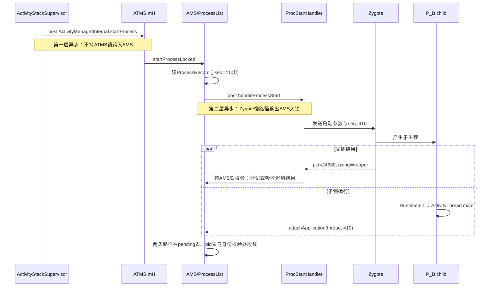

# 206 Android ProcessList：进程启动账本、Zygote 参数与 startSeq 防串账

> 源码基线：Android 11 / API 30 / `android-11.0.0_r48`。
>
> 当前环境只有源码快照，可以证明控制流、建账顺序、参数来源与竞争收敛条件；不能据此测出某台设备的真实 fork 时长，也不能把 Zygote 回出的 pid 当成 specialize、attach、bind 或首帧完成证据。

第 205 章从一个已经通过 attach 身份核对的进程出发，追了 `bindApplication()`、Provider 与 `Application.onCreate()`；本章向前补齐那道身份核对。

本章只追一个问题：**普通冷启动中，Zygote 的 pid 结果与子进程 `attachApplication()` 可能乱序到达，上一代启动结果也可能迟到；system_server 怎样在正常启动协议与账本不变量下，把 Binder 提供的 calling pid/UID、attach 参数带回的 startSeq 与 `IApplicationThread` 关联到当前这一代 `ProcessRecord`，并分别在哪个点才能说“逻辑记录已建立”“启动已建账”“pid 已登记”“attach 身份已匹配”与“控制通道已建立”？**

先给结论：`ProcessRecord`、`pendingStart`、`mPendingStarts`、`mPidsSelfLocked` 和 `thread` 是不同阶段的账；`startSeq` 是贯穿服务端闭包与子进程 argv 的代际关联号，却不是独立认证凭据。正常路径允许两种收敛：

```text
pid-first:
  Zygote结果 → 校验本代 → pid表登记并启动attach timeout
  → child携thread/startSeq发起attach，Binder提供pid/UID → I0身份匹配
  → bindApplication/makeActive建立控制通道

attach-first:
  child携thread/startSeq发起attach，Binder提供pid/UID
  → 从pending表补做pid登记
  → I0身份匹配 → bindApplication/makeActive建立控制通道
  → 迟到的Zygote结果只补正wrapper状态
```

## 1. 固定 P_B、startSeq=410 与唯一竞争问题

沿用第 205 章的 `com.example.reader` 与目标 Activity `B_target`，固定一次普通冷启动：

| 维度 | 固定前提 |
|---|---|
| 包与进程 | 包名、进程名均为 `com.example.reader`，进程记作 `P_B` |
| 触发者 | `B_target` 已在 ATMS 等待目标进程 |
| 用户与身份 | user 0，应用 UID 与本次 `startUid` 均为 `10123` |
| 初态 | 没有可复用的运行中进程，也没有旧 pid |
| 启动类型 | 非 isolated、非 persistent、系统已 ready |
| 调度配置 | r48 默认异步进程启动开启 |
| 供给入口 | 普通全局 Zygote；USAP pool 未启用，无 WebView Zygote、App Zygote 与 wrapper |
| 启动代际 | `ProcessList` 分配 `startSeq=410` |
| 示例结果 | Zygote 侧产生 `pid=24680` |
| attach 输入 | Binder `callingPid=24680`、`callingUid=10123`，参数 `startSeq=410` |

这些数字只为让每一次索引变化可见，不代表系统会按某个固定值分配 pid 或序号。

再准备一个失效分支：同一逻辑槽位后来已进入第 `411` 代，而 `410` 的结果或 attach 才迟到。这里要回答的不是“两个数字是否相等”这么简单，而是以下证据如何共同收敛：

```text
(processName, uid) 当前映射的是哪个 ProcessRecord
pending[startSeq] 当前映射的是哪个 ProcessRecord
pid 当前映射的是哪个 ProcessRecord
Binder 内核提供的 callingPid / callingUid
子进程 argv 原样带回的 startSeq
ProcessRecord 当前的 pendingStart / startSeq / thread
```

本章完成点记为 I0：**AMS 已用 pid 表或 pending 表、Binder calling pid/UID 与 startSeq，把一次正常协议内的 attach 关联到当前 `ProcessRecord`；携带旧代 seq、错误 UID 或已失效账本的迟到进程会被拒绝。** I0 之后发出 `bindApplication()`、保存 `thread`、客户端完成应用装配，属于第 205 章的主问题。

## 2. 八本账、九个检查点与证据边界

一次“启动进程”至少同时推进八本账：

| 账本 | 主要所有者 | 代表性状态 | 它不能独自证明什么 |
|---|---|---|---|
| 等待者账 | ATMS / AMS | `B_target`、`HostingRecord`、启动原因 | 已请求 Zygote |
| 逻辑身份账 | `ProcessList` | `mProcessNames[(processName, uid)]` | Linux 进程已经存在 |
| 启动代际账 | `ProcessList` / `ProcessRecord` | `pendingStart`、`startSeq`、`mPendingStarts` | fork 已发生 |
| 启动输入账 | `ProcessList` | `startUid`、gids、mount、runtime flags、ABI、`seInfo` | Zygote 已接受输入 |
| pid 账 | Zygote / AMS | `ProcessStartResult`、`app.pid`、`mPidsSelfLocked` | child 已 attach |
| attach 身份账 | Binder / AMS | `callingPid`、`callingUid`、child 带回的 `startSeq` | 客户端 bind 已完成 |
| 控制通道账 | AMS / `ProcessRecord` | death recipient、`IApplicationThread`、`thread` | `handleBindApplication()` 已返回 |
| 恢复账 | AMS / `ProcessList` | attach timeout、迟到 pid、等待组件清理 | 正常启动一定成功 |

`ProcessRecord` 上四个常被混用的字段也要拆开：

| 状态 | 最多能证明 | 不能推出 |
|---|---|---|
| `pendingStart=true` | 已有一代启动在途，结果尚未按正常路径收敛 | pid 已产生 |
| `startSeq=410` | 此记录关联第 410 代启动 | 调用者可信或启动成功 |
| `pid=24680` | AMS 已接受该 pid，或 attach-first 已补登记 | `thread` 已存在 |
| `thread!=null` | `makeActive()` 已保存客户端控制 Binder | 客户端 `handleBindApplication()` 已结束 |

把主线标成九个检查点：

| 点 | 已成立 | 仍不能推出 |
|---|---|---|
| W0 | `B_target` 需要 `P_B` | 已有 `ProcessRecord` |
| R0 | 名称表保存了 `P_B` 的当前逻辑记录 | 已发送 Zygote 请求 |
| S0 | `pendingStart=true`、`seq=410`、pending 表已写 | proc-start 任务已开始运行 |
| Q0 | 任务已投给专用 Handler | Zygote socket 已写入 |
| Z0 | proc-start 线程取得 `ProcessStartResult(pid=24680)` | AMS 已接受 pid |
| P0 | 当前代校验通过，pid 与 pid 表已登记 | child 已 attach |
| A0 | AMS 收到 attach 及内核提供的 pid/UID | 声明的 seq 已匹配 |
| I0 | pid、UID、seq 与当前账本共同选中唯一记录 | bind 已在客户端完成 |
| B0 | `bindApplication()` 已发送且 `makeActive()` 保存 `thread` | `Application.onCreate()` 已返回 |

Z0 与 A0 没有固定全序。`pid-first` 是 `Z0 → P0 → A0 → I0`；`attach-first` 是 `A0 → P0 → I0`，Z0 可以随后才被 system_server 处理。若把图画成永远先收到 pid、再收到 attach，就会把源码专门处理的竞争删掉。

## 3. pid 结果和 child attach 只能画成偏序

从 `B_target` 请求进程到客户端绑定之间，有两次 Handler 切换和一次父子并发：



图中的 `Z->>C` 只表达父子从同一次启动产生，不能读成“父侧完成全部 specialize 后才放行 child”。普通 Zygote 的父分支可以准备 pid 回复，子分支则继续专门化；USAP 路径甚至明确先向请求端写 pid，再继续 `specializeAppProcess()`。因此：

```text
收到pid
  ≠ child专门化完成
  ≠ ActivityThread.main已进入
  ≠ attach已发出
  ≠ IApplicationThread已保存
  ≠ bind已执行
  ≠ Activity已创建
```

同理，`startProcessLocked()` 返回一个非空 `ProcessRecord` 也可能只到 R0、S0 或 Q0；boot hold 路径甚至只到 R0。方法返回值不是一个统一的“进程 ready”信号。

## 4. 从 B_target 等待到两层异步切换

Activity 冷启动先在 `ActivityStackSupervisor.startSpecificActivity()` 查询目标 `WindowProcessController`。若记录已有 `thread`，它先尝试 `realStartActivityLocked()`；一旦这里抛出 `RemoteException`，源码就按 dead-object 重启情形把 `knownToBeDead` 置为 true 并落到进程启动，但异常本身不是一份额外的内核死亡证明。

随后 `ActivityTaskManagerService.startProcessAsync()` 并不直接同步调用 AMS。它把 `ActivityManagerInternal.startProcess` 投给 ATMS 的 `mH`，源码给出的理由是避免持 ATMS 锁调用 AMS 形成潜在死锁。

```text
ActivityStackSupervisor
  → ATMS.startProcessAsync
    → ATMS.mH
      → ActivityManagerInternal.startProcess
        → AMS持锁
          → ProcessList.startProcessLocked
```

这是第一层异步，只解决 ATMS→AMS 的跨锁边界。进入 `ProcessList` 后，默认配置还会在完成代际建账后投递到 `mProcStartHandler`：

```text
AMS持锁：做复用判断、构造启动输入、写pending账
  → post ProcStartHandler
  → 释放AMS大锁

ProcStartHandler：等待旧进程、准备数据隔离、访问Zygote并等pid
  → 重新取得AMS锁
  → 校验并登记结果
```

这是第二层异步，目的是让 Zygote socket、存储准备及旧进程交接不长期占住 AMS 全局锁。`mProcStartHandler` 绑定一条 `ServiceThread` 的 Looper；“异步”表示调用者不阻塞在这段慢路径，并不表示为每个请求无限创建并行线程。

`HostingRecord` 在这条链中保留“为什么启动”及承载组件名，也参与 regular / WebView / App Zygote 路由。它是诊断和策略输入，不是进程已运行的证明。

## 5. ProcessRecord 为什么先于 Linux 进程存在

普通应用首先按 `(processName, uid)` 查 `mProcessNames`。默认进程名经常等于包名，但二者不是同一概念：`android:process` 可让一个包拥有多个进程，shared UID 又可能让多个包共享 Linux UID。逻辑槽位必须同时带进程名与 UID。

已有记录时，r48 的复用条件比“`knownToBeDead` 为真就重启”更细：

| 已有记录状态 | 结果 |
|---|---|
| `pid>0`、`thread==null` | 保留这条正在 attach 的记录；即使 `knownToBeDead=true` 也不重复启动 |
| `pid>0`、`thread!=null`、`!knownToBeDead && !killed` | 复用健康记录 |
| `pid>0`、`thread!=null`，且已知死亡或已标记 killed | 杀旧 process group，新建 `ProcessRecord` |
| `pid==0`、`pendingStart=true` | 继续进入更深重载，由 `pendingStart` 门禁直接返回 true |
| isolated 启动 | 不复用普通记录，分配隔离 UID 并新建记录 |

后台请求还会检查 bad-process 状态并可能静默拒绝；显式用户启动则会清 crash time，并把 bad process 恢复为可再次尝试。这是“是否允许再发起一代”的策略，不是 startSeq 校验的一部分。

需要新记录时，`newProcessRecordLocked()` 构造对象后立即调用 `addProcessNameLocked()`：

```text
new ProcessRecord(...)
  → 加入UID记录
  → mProcessNames[(processName, uid)] = record
  → 此时 pid=0、thread=null
```

所以 `ProcessRecord` 是 system_server 的逻辑控制块，不是内核 task 的镜像。它必须先存在，等待 Activity、Service、Provider 等需求才能挂在同一处，也才能在 pid 尚未知时承载启动输入与代际。

若系统尚未 ready，且该应用不允许 boot 期间启动，记录会进入 `mProcessesOnHold` 并直接返回。此时名称表已有记录，但还没有设置 `pendingStart`、分配 `startSeq` 或请求 Zygote。看到非空返回值时必须先问“它停在哪个检查点”。

## 6. UID、GID、mount、runtime flags、ABI 与 seInfo 怎样形成输入

更深的 `startProcessLocked(ProcessRecord, ...)` 先用 `pendingStart` 阻止同一记录重复发起，然后清除残留 pid、pid 表项与旧 attach timeout，再调用 `checkPackageStartable()`。只有包在当前用户下仍可启动，才继续构造这一代输入。

输入不是一个来源的“权限快照”，而是多组不同用途的参数：

| 参数 | 主要来源 | 交给下游做什么 |
|---|---|---|
| `uid` / `gid` | 通常为 `app.uid`；factory-test 特例可改为 0 | 目标进程的 POSIX 身份 |
| `gids` | PMS 权限 GID，经 denied permissions 删除，再补用户/存储组 | supplementary groups |
| `mountExternal` | `StorageManagerInternal` 的包/UID 挂载模式 | 选择外部存储 namespace 视图 |
| `runtimeFlags` | manifest、compat、系统属性与调试配置 | ART、调试、安全与内存策略 |
| `requiredAbi` | override、`primaryCpuAbi`、设备首选 ABI 依次回退 | 选择兼容的 Zygote socket |
| `instructionSet` | 只从 `primaryCpuAbi` 映射 | 可选的 ISA 参数与 tagging 判断 |
| `seInfo` | `seInfo + seInfoUser` | SELinux 上下文派生输入 |
| `targetSdkVersion` | `ApplicationInfo` | Zygote/运行时兼容行为 |
| 数据目录参数 | 包数据 inode、白名单与存储准备结果 | 建立子进程可见的数据视图 |

非 isolated 路径先由 PackageManager 给出包权限对应的 GID；`processInfo.deniedPermissions` 可逐项删除对应组。`computeGidsForProcess()` 再补 shared app、cache、user GID，以及与 `INSTALLER`、`PASS_THROUGH`、`ANDROID_WRITABLE` 等 mount mode 对应的存储组。`mountExternal` 会影响 namespace，也会反向影响 supplementary groups，不能把它简化成一个路径字符串。

`runtimeFlags` 聚合多类开关：

- debuggable 带来 JDWP、Java debug、CheckJNI，并可能受 verifier 设置影响；
- VM safe mode、profileable-by-shell 与若干调试系统属性各自增加位；
- native debugging、embedded dex / system oat、hidden/test API policy、app image cache 进入同一位图；
- GWP-ASan 与 memory tagging 还受 manifest、compat、系统应用及指令集条件影响。

这只是 `ProcessList` 构造的位图；Zygote 端仍可能按自身系统条件补充行为。因此它适合回答“system_server 发了什么”，不应被描述成所有路径上的最终运行状态全集。

ABI 有一个很容易被顺手写错的分叉：

```java
requiredAbi = abiOverride != null
        ? abiOverride
        : (primaryCpuAbi != null ? primaryCpuAbi : Build.SUPPORTED_ABIS[0]);

instructionSet = primaryCpuAbi != null
        ? VMRuntime.getInstructionSet(primaryCpuAbi)
        : null;
```

这是等价语义的压缩写法，不是源码逐字摘录。`requiredAbi` 会回退到设备首选 ABI，并用于选择 primary / secondary Zygote；`instructionSet` 却只看 `primaryCpuAbi`。所以 `primaryCpuAbi==null` 时，即使 `requiredAbi` 已有回退值，`instructionSet` 仍是 null；`abiOverride` 也不会自动改写它。

`seInfoUser` 缺失会记录严重诊断，但源码仍把可用部分拼成 `seInfo` 继续。它是 native SELinux 切换的输入，不是 App 自己选定的最终 domain。

## 7. 两套数据隔离、top hint 与 wrapper 不能混成一个开关

进程启动时有两套容易混淆的数据挂载：

| 机制 | 目标 | 主要输入 | 失败或退化 |
|---|---|---|---|
| private app data 隔离 | CE/DE 私有目录与相关 profile 视图 | 目标/白名单包到 volume UUID、CE inode 的 map，`bindMountAppsData` | inode 信息不完整时关闭本次 private-data bind |
| app storage dirs 隔离 | `Android/data` 与 `Android/obb` | FUSE/vold 条件、mount mode、`prepareStorageDirs()`，`bindMountAppStorageDirs` | 准备失败时置 `bindMountPending=true`，留给后续补挂 |

两者的门控、参数和恢复账不同。不能把 private-data map 取不到写成 `bindMountPending`；该字段服务的是 storage-dir 这条补挂路径。

shared UID 场景下，private-data target map 可包含共享 UID 的多个包；白名单 map 会移除 target，避免同一包重复出现。isolated 进程最后会把两张包 map 清空，但这不等于“隔离关闭”：`bindMountAppsData` 的布尔条件独立存在，空允许集可以表达把数据视图整体遮蔽，而不是把自己的包目录暴露给 isolated 进程。

三类父进程入口对这些参数的处理不同：

- WebView Zygote 路径传空 data maps 与关闭的 bind 标志；
- App Zygote 的父进程已经完成相应隔离，所以 child start 不再重复传两个 bind 标志；
- 普通全局 Zygote 才接收本次计算出的两套完整参数。

`isTopApp`、Zygote policy 与最终 OOM 状态也不是一回事。`ProcessList` 会用 `isTopApp` 做启动期 foreground-activity 提示；App Zygote 与 regular 调用继续传它，`Process.startWebView()` 则固定把下游 `isTopApp` 设为 false。latency-sensitive policy 只会在 regular 全局 Zygote 路径参与 USAP 资格判断。进程 attach 后的调度组与 oom-adj 仍由 AMS/ATMS 后续账本决定。

debuggable 应用若存在 `nativeLibraryDir/wrap.sh`，`ProcessList` 会构造 `/system/bin/logwrapper ...`；`wrap.<processName>` 属性也可能触发 wrapper。建账时会先预估 `usingWrapper`，因为 attach 抢跑时最终 socket 结果还未回来，却已经需要选择相应语义。wrapper 会改变 pid 校正和 timeout，不能只当成“命令前多一个字符串”。

## 8. pendingStart、startSeq 与 pending 表必须先于 post

所有输入就绪后，最深层重载在持 AMS 锁时按固定顺序建账：

```text
app.pendingStart = true
清 killedByAm / removed / killed
检查旧 startSeq 与 pid 应为 0
刷新 disabled compat changes
startSeq = app.startSeq = ++mProcStartSeqCounter
app.setStartParams(startUid, hostingRecord, seInfo, startTime)
预估 app.usingWrapper
mPendingStarts[startSeq] = app
post handleProcessStart(..., captured startSeq)
```

核心不变量是：**异步工作对外可见前，关联它所需的账已经完整写入。** 否则 child 可能先运行并 attach，而 AMS 尚无 `startSeq → ProcessRecord` 的反查入口。

这里同时出现两条 startSeq 传播线：

```text
父侧结果线：
  Handler闭包捕获 expectedStartSeq=410
  → 收到 ProcessStartResult(pid, usingWrapper)
  → 回AMS锁内校验第410代

子侧attach线：
  ProcessList追加 argv "seq=410"
  → Zygote把剩余argv交给 ActivityThread.main
  → child解析410
  → attachApplication(thread, 410)
```

`ProcessStartResult` 只有 pid 与 `usingWrapper`，不会从 Zygote 回显 startSeq。父侧靠本地闭包关联请求，子侧靠 argv 带回代际；两线最终在同一 pending / pid / name 账上汇合。

`mProcStartSeqCounter` 是 system_server 生命周期内跨进程递增的启动序号，不是某个包独享的重试次数。它的职责是区分代际，不是生成保密 token：child 可以读到 argv 中的值，真正可信的调用 pid/UID 来自 Binder 驱动，服务端还要核对名称表、pending 表与对象身份。

最外层 `pendingStart` 门禁也只说明“这条记录已有在途代际”。它返回 true 时可能连 Zygote 线程都尚未取得任务，绝不能翻译成“启动成功”。

源码还有一个值得保留的读取边界：Handler 闭包固定了父侧校验用的 `expectedStartSeq`，但 `handleProcessStart()` 真正执行时仍从 `app` 读取 `hostingRecord`、`startUid`、`seInfo`、`startTime`，三条发送路径也拼接当时的 `app.startSeq`。这不是一份完全不可变的启动快照。本章固定场景没有在 worker 运行前复用同一对象并推进新代，因此不把这个读取差异升级成已证实故障；分析其他版本或异常生命周期时，则要回到实际读取点。

## 9. ProcStartHandler 怎样释放 AM 大锁并处理 precedence

`handleProcessStart()` 的注释明确说明它故意不持 AMS 全局锁。它先处理一个特殊交接：旧 `ProcessRecord` 已有 thread/pid，又被确认死亡时，新记录不会复用旧对象，而会建立：

```text
new.mPrecedence = old
old.mSuccessor = new
```

proc-start 线程先等旧 pid 的内核死亡，再在旧对象监视器上等 Framework 清理解除 precedence。两段共享一个最长 2 秒的截止点；超时或旧进程拒绝退出会记录诊断，但随后仍继续启动新进程。这个等待降低旧清理与新启动交叉的概率，却不代替后面的 startSeq、名称表和 pid 表校验。

还要限定配置边界：这段 precedence 等待位于默认异步 `handleProcessStart()` 中；若关闭异步进程启动、走持锁的同步分支，源码没有经过同一个等待段。不能把默认路径观察写成所有配置的无条件规则。

之后线程执行数据目录准备与 `startProcess()`，可能在 socket 上等待 Zygote/USAP 回复。得到结果才重新：

```java
synchronized (mService) {
    handleProcessStartedLocked(app, startResult, capturedStartSeq);
}
```

若默认异步路径抛运行时异常，catch 会在 AMS 锁内删除这一精确 `mPendingStarts[startSeq]`、清 `pendingStart`，并触发包级恢复。这个显式删除是“请求调用失败”的分支；它不能用来解释所有取消场景。

单线程 Handler 还带来一个诊断含义：Q0→Z0 的延迟可能包含 proc-start 队列等待、precedence 交接、存储准备、socket 往返等多段。只用一个总耗时，无法归因其中任何一段。

## 10. 三类供给入口、USAP 的层级与 seq 发送边界

`ProcessList.startProcess()` 先按 `HostingRecord` 选择父进程入口：

| 第一层入口 | 调用 | data bind 特征 | USAP |
|---|---|---|---|
| WebView | `startWebView(...)` | maps 为空，两个 bind 标志关闭 | 不走全局 ZygoteProcess 的池选择 |
| App Zygote | `appZygote.getProcess().start(...)` | 父 zygote 已隔离，两个 bind 标志关闭 | 自定义 `ZygoteProcess` 不支持池 |
| regular | `Process.start(...)` | 传本次完整 maps 与 bind 标志 | 进入全局 `ZygoteProcess` 后才可能尝试 |

因此 USAP 不是与 regular / WebView / App Zygote 平级的“第四种 ProcessList 路由”。它是 regular 路径已经按 `requiredAbi` 选中 primary 或 secondary Zygote 连接后，`zygoteSendArgsAndGetResult()` 内部的一次优化尝试。

regular 路径最终构造的参数大致依序为：

```text
--runtime-args
--setuid=10123
--setgid=10123
--runtime-flags=...
--mount-external-...
--target-sdk-version=30
--setgroups=...
--nice-name=com.example.reader
--seinfo=...
--instruction-set=...          # 非null才出现
--app-data-dir=...
--invoke-with ...              # 有wrapper才出现
--package-name=com.example.reader
--is-top-app                   # 条件参数
data maps / bind flags / disabled compat changes
android.app.ActivityThread
seq=410
```

`requiredAbi` 值本身不是简单序列化成 `--abi=...`；`openZygoteSocketIfNeeded(requiredAbi)` 用它匹配 primary/secondary Zygote 的 ABI 列表。`instructionSet` 若非 null 才作为独立参数发送。

发送前 `ZygoteProcess` 拒绝参数中的换行与回车，随后使用：

```text
参数个数 + "\n"
参数1 + "\n"
参数2 + "\n"
...
```

普通回复为 `int pid + boolean usingWrapper`；USAP 回复只读 pid，并在客户端把 `usingWrapper=false`。`android.app.ActivityThread` 与 `seq=410` 位于剩余 argv，命令解析、权限检查、fork/specialize、父子分支与 `RuntimeInit` 的细节留给第 207 章。

## 11. pid 回复为何不是 specialize 或 ready 回执

regular 路径在满足全部条件时才尝试 USAP：

- 当前 `ZygoteProcess` 支持且池已启用；
- policy 是 latency-sensitive，且不带 system-process 位；
- 命令属于 USAP 支持集合；
- 没有 `--invoke-with`，`wrap.<niceName>` 也没有使它失去资格。

`isTopApp` 与 latency policy 是两个独立输入，不能只凭 top 状态推断必走 USAP。USAP 通信发生 `IOException` 时会回退普通 Zygote；USAP 返回负 pid 则构成启动失败，不属于同一个回退分支。

无论普通还是 USAP，pid 回复都弱于“child 已完成专门化”：

| 观察 | 可以证明 | 不能证明 |
|---|---|---|
| socket 读到正 pid | 供给侧给出了一个子进程身份 | child 已完成 mount/SELinux/ART 专门化 |
| proc-start 线程拿到结果 | Z0 已发生 | AMS 已在 pid 表接受它 |
| AMS 接受并写 pid 表 | P0 已发生 | child 已执行 `ActivityThread.main()` |
| AMS 收到 attach 与 Binder 调用身份 | A0 已发生 | pid/UID/seq 已通过服务端全部匹配 |
| I0 身份匹配 | 控制对象可继续建立 | 客户端 bind 已完成 |

wrapper 让 pid 语义更值得单列。Zygote 直接 fork 的 child 会执行 wrapper，内层 `app_process` / `WrapperInit` 再通过 pipe 回报自身 pid；父侧还要验证 inner pid 就是直接 fork child 本身或它的后代，成功才用 inner pid 替换外层 pid 并置 `usingWrapper=true`。所以 true 表示返回值已校正到内层应用进程，不是“返回的是壳 pid”。

wrapper 也被排除在 USAP 之外。AMS 对已确认 `usingWrapper` 的 pid-first 启动使用更长 attach timeout，是为了容纳额外启动链，不表示 wrapper 已完成客户端 bind。

## 12. pid 结果为何先消费 pending，再验证当前代际

proc-start 线程拿到 `ProcessStartResult` 后进入一个私有重载。第一步不是无条件登记 pid，而是检查精确的 `mPendingStarts[expectedStartSeq]`：

```text
pending[410] 不存在：
  若 app.pid == result.pid，只补正 usingWrapper
  然后返回 false

pending[410] 仍存在：
  进入公共 handleProcessStartedLocked
```

“pending 项不存在”不能笼统翻译为“已取消”。最重要的正常来源正是 attach-first：child 已经借这条 pending 记录完成 pid 登记并消费表项，迟到结果只需补正 wrapper 信息。

公共重载先删除 `mPendingStarts[expectedStartSeq]`，再调用 `isProcStartValidLocked()`。r48 会在以下任一拒绝条件成立时判本次结果无效：

| 拒绝条件 | 防住的情况 |
|---|---|
| `app.killedByAm == true` | 这一代已被 AMS 主动杀死 |
| `mProcessNames[(name, uid)] != app` | 逻辑槽位已由别的对象占有或被移除 |
| `app.pendingStart == false` | 启动已被逻辑取消或已由别的路径收敛 |
| `app.startSeq > expectedStartSeq` | 同一对象已推进到更高代 |
| 异步路径的 `checkPackageStartable()` 拒绝启动 | 异步期间包已变成冻结或不可启动 |

源码对代际写的是“大于”而不是泛化的“不等于”。这是有方向的“后来代次”检测：正数序号只递增，0 是清理时的哨兵；安全收敛依赖 pending 精确键、名称表对象身份、`pendingStart` 与其他谓词共同成立，而不是只靠一个比较符。

任一拒绝条件成立，返回 pid 会被杀掉，并记录 invalid-start 原因。没有拒绝原因时才会：

```text
记录统计与启动事件
app.setPid(pid)
更新 usingWrapper
app.pendingStart = false
清理可能占用同一pid的旧记录
mPidsSelfLocked[pid] = app
若 procAttached=false，投递attach timeout
```

结果登记路径遇到 pid 已映射到另一条记录、且正在登记的新 `app` 非 isolated 时，会先清理旧记录再加入新映射。这里也不能扩大成“所有 pid 冲突都走完全相同分支”，因为条件判断的是新记录的 isolated 属性。

## 13. pid-first：先登记 pid，再用 Binder 身份完成 I0

固定场景先让 proc-start 结果取得 AMS 锁：

| 步骤 | `pendingStart` | `pending[410]` | `app.pid` | `pidMap[24680]` | timeout |
|---|---:|---|---:|---|---|
| S0 建账 | true | `app` | 0 | 空 | 无 |
| Z0 结果到达锁内 | true | `app` | 0 | 空 | 无 |
| 消费 pending、校验通过 | true | 空 | 0 | 空 | 无 |
| P0 登记完成 | false | 空 | 24680 | `app` | 普通 10 秒 |

普通 timeout 是 10 秒；已确认 wrapper 时为 1200 秒，即 20 分钟。计时从 **pid 被 AMS 接受并登记** 后开始，所以不覆盖此前已经消耗的 proc-start 排队、precedence 交接与 socket 等待；但 pid 回复可能领先 child 专门化完成，回复之后的 child-side specialize 尾段与走到 attach 的时间仍会消耗这只计时器。

child 随后调用 `attachApplication(thread, 410)`。Binder 入口先在清除调用身份前读取内核提供的 `callingPid=24680` 与 `callingUid=10123`，再进入 AMS 锁。pid 表命中 `app` 后还必须同时满足：

```text
app.startUid == callingUid
app.startSeq == startSeq
```

这里核对的是本次真实启动身份 `startUid`，不是始终拿静态 `app.uid` 代替；factory-test 等特例可能让两者不同。若 pid 表命中的记录不满足任一项，AMS 会先清理这条冲突记录，再把 `app` 置空，并允许以同一回传 seq 去 pending 表尝试 attach-first 收敛。固定 pid-first 场景中两项相等，于是选中 `P_B`。

此时 `app.thread` 仍可能为 null。AMS 先为传入的 `IApplicationThread` 建 death recipient，并完成一组 attach 状态初始化；随后才移除 `PROC_START_TIMEOUT_MSG`，而且这发生在生成 Provider、发送 `bindApplication()` 之前。因此 timeout 不是 attach 方法一进入就取消，也不是等客户端 bind 完成才取消。

接下来 AMS 发送 `bindApplication()`，调用 `app.makeActive(thread, ...)` 保存 `thread`，再调度等待的 Activity、Service 与 Broadcast。由于 bind 是 oneway，B0 仍不等于客户端 `handleBindApplication()` 完成；第 205 章从这里继续。

## 14. attach-first：用 pending 表补登记，并吸收迟到结果

再让 child 先抢到 AMS 锁。它能运行说明供给侧已经产生子进程，但 system_server 的 proc-start 线程仍可能没读完回复、没获调度，或拿到结果后还在等 AMS 锁。

`ActivityThread.main()` 先 `Looper.prepareMainLooper()`，再从 argv 尾部向前寻找 `seq=`，解析出 410，构造 `ActivityThread`，然后同步调用：

```text
attachApplication(mAppThread, 410)
```

此时主线程还没有进入 `Looper.loop()`。所以“attach 已到 AMS”仍不等于 App 主队列开始处理 bind 或组件消息。

AMS 取得 Binder `callingPid=24680`、`callingUid=10123`。此时 pid 表还没有 24680，所以转查：

```text
pending = mPendingStarts[410]
pending != null
pending.startUid == 10123
pending.startSeq == 410
```

全部满足后，它以 Binder callingPid 调用 `handleProcessStartedLocked(..., procAttached=true)`。这条公共路径同样消费 pending、执行有效性校验、写 `app.pid` 并加入 pid 表；区别是 child 已经 attach，所以不再创建 attach timeout。

| 步骤 | `pendingStart` | `pending[410]` | `app.pid` | `pidMap[24680]` | timeout |
|---|---:|---|---:|---|---|
| child 到达 A0 | true | `app` | 0 | 空 | 无 |
| pending 身份核对 | true | `app` | 0 | 空 | 无 |
| `procAttached=true` 登记 | false | 空 | 24680 | `app` | 不创建 |
| I0 后继续 attach | false | 空 | 24680 | `app` | 不需要 |
| Z0 结果迟到 | false | 空 | 24680 | `app` | 只补正 wrapper |

稍后父侧结果进入私有 handler，发现 `pending[410]` 已不存在。只要传入的 `ProcessRecord` 上 `app.pid == result.pid`，它就更新 `usingWrapper` 后返回 false，不重复写统计、pid 表或 timeout。这就是两条乱序路径收敛到同一账的关键。

旧 seq 或错误 UID 若无法命中合法 pending 记录，最终会匹配失败。pid 已映射到另一代记录则不一定失败：AMS 先清理并移除那条冲突映射，再允许同一调用凭回传 seq 与 `startUid` 进入 pending 回查；pending 确实对应当前启动时仍可按 attach-first 收敛。只有两条查找都找不到合法记录，AMS 才丢弃并杀掉报告进程；`startSeq` 不能绕过 Binder 提供的调用身份。

## 15. 取消、旧代、pid 复用、timeout 与相邻章节边界

取消在途启动不一定立刻删除 pending 表项。常见 pid 为 0 的非 persistent 路径会先从名称表移除记录，并由 `ProcessRecord.kill()` 清 `pendingStart`、设置 `killed/killedByAm` 状态；`mPendingStarts[410]` 仍可暂时保留。这样迟到的 Zygote 结果仍能进入公共 handler，消费精确表项，再因名称表、`pendingStart` 或 `killedByAm` 谓词失效而杀掉新产生的 pid。

这是一种“先逻辑取消，等异步结果出现后物理回收”的做法。与之不同，默认异步 Zygote 调用直接抛异常时，catch 会显式删除该 startSeq 表项。两类分支不能都概括成“pending 缺项表示取消”；关闭异步配置后的异常清理也不应直接套用默认路径的精确删除。

旧代与 pid 复用还有多层保护：

| 风险 | 防护 |
|---|---|
| 第 410 代结果迟到，而同一对象已到 411 | expected seq、pending 精确键、`pendingStart` 与更高代检查 |
| 名称槽位已换成新 `ProcessRecord` | `mProcessNames[(name, uid)] == app` 对象身份检查 |
| 内核复用了一个旧 pid | pid 登记冲突清理；attach 再核对 `startUid/startSeq` |
| 旧记录清理试图删除新 pid 映射 | `PidMap.doRemoveInternal()` 比较现有记录与待删记录的 `startSeq` |
| 旧名称清理碰到新对象 | 名称表删除可带 expected-object 保护 |
| attach timeout 消息迟到 | `removePidIfNoThread()` 再检查 `thread==null` 与 pid 表代际 |

pid 表的删除保护具体是：按待删记录的 `app.pid` 取出现有映射，只有 `existingApp.startSeq == app.startSeq` 才移除。它能防住序号不同的旧清理擦掉复用 pid 的新映射；仍不应把 startSeq 一项夸大成整套身份安全。

timeout 命中时，只有当前 pid 表仍指向这一代、且 `thread` 仍为空，才移除 pid/name 账、清 Provider/Service/Broadcast 等等待者并杀进程；否则只记录一次 spurious timeout。它不是覆盖整个启动的总计时器，也不覆盖 bind、Provider 发布或 `Application.onCreate()`。

`startSeq` 的能力边界同样重要：

- 它是代际关联号，不是密码学 nonce；
- 它不替代 Binder calling pid/UID；
- 它不证明 SELinux/ART 专门化完成；
- 它不证明 `IApplicationThread` 已保存；
- 它不衡量启动耗时；
- 它不表示 Activity、窗口或首帧 ready。

相邻章节按证据点分工：

| 章节 | 主问题 | 与本章交界 |
|---|---|---|
| 第 201 章 | 冷启动到首帧的端到端地图 | 206 不重讲 Activity、窗口与 present |
| 第 205 章 | attach 后怎样 bind、安装 Provider、创建 Application | 206 交付 I0，并标出 B0 只是 oneway 投递边界 |
| 第 207 章 | Zygote 命令解析、fork/specialize 与 `RuntimeInit` | 206 只负责选择入口、发送参数、接收 pid 与处理竞争 |

面对一次“启动卡住”，先问缺的是哪张账：没有 R0 是逻辑记录问题，没有 S0 是建账/准入问题，没有 Z0 是 proc-start 或供给侧问题，没有 P0 是结果有效性问题，没有 I0 是 attach 身份问题；I0 之后的客户端初始化则回到第 205 章。这样才能避免把一个 `ProcessRecord`、一个 pid 或一条 start log 当成整笔启动完成。

## 16. 九组只读练习重建整笔启动事务

以下练习都只读源码。每段命令可在 Android 源码根目录独立执行；也可以先把 `ANDROID_BUILD_TOP` 指向源码根。命令的目标是固定证据入口，结论仍要由你按本章账本逐项写出。

### 练习 1：证明 Activity 路径存在两层异步

先找 `startSpecificActivity()` 到 ATMS Handler 的第一层，再找 `mProcStartHandler` 的第二层。回答：两次 post 各自跨过哪把锁或哪段慢路径？

```bash
set -euo pipefail
SRC="${ANDROID_BUILD_TOP:-$PWD}"
ASS="$SRC/frameworks/base/services/core/java/com/android/server/wm/ActivityStackSupervisor.java"
ATMS="$SRC/frameworks/base/services/core/java/com/android/server/wm/ActivityTaskManagerService.java"
PL="$SRC/frameworks/base/services/core/java/com/android/server/am/ProcessList.java"
for f in "$ASS" "$ATMS" "$PL"; do test -f "$f"; done
rg -n -C 12 'void startSpecificActivity\(|void startProcessAsync\(' "$ASS" "$ATMS"
rg -n -C 10 'mProcStartHandler[.]post|doesn.t hold the global AM lock' "$PL"
```

### 练习 2：重建 ProcessRecord 复用真值表

分别代入 `pid`、`thread`、`knownToBeDead`、`killed` 与 isolated。特别验证：为什么 `thread==null` 会让已有 pid 的记录保留？

```bash
set -euo pipefail
SRC="${ANDROID_BUILD_TOP:-$PWD}"
PL="$SRC/frameworks/base/services/core/java/com/android/server/am/ProcessList.java"
test -f "$PL"
rg -n -C 16 'it can.t re-use an existing process|app[.]pid > 0|knownToBeDead|app[.]thread == null' "$PL"
rg -n -C 12 'newProcessRecordLocked\(|mProcessesOnHold[.]add' "$PL"
```

### 练习 3：区分身份、附加组、挂载视图与 ABI

为 `P_B` 写一张“参数—来源—消费者—不能证明”的表，再构造 `primaryCpuAbi=null` 和 `abiOverride!=primaryCpuAbi` 两个案例，并把 private-data 与 storage-dir 两套挂载的失败状态分开。

```bash
set -euo pipefail
SRC="${ANDROID_BUILD_TOP:-$PWD}"
PL="$SRC/frameworks/base/services/core/java/com/android/server/am/ProcessList.java"
test -f "$PL"
rg -n -C 8 'getPackageGids|deniedPermissions|computeGidsForProcess|getExternalStorageMountMode' "$PL"
rg -n -C 8 'String requiredAbi|String instructionSet|final String seInfo|runtimeFlags [|]=' "$PL"
rg -n -C 8 'bindMountAppsData|pkgDataInfoMap|bindMountAppStorageDirs|prepareStorageDirs|bindMountPending' "$PL"
```

### 练习 4：验证代际账一定先于异步任务

把实际语句编号，并证明 `pendingStart`、`startSeq`、`setStartParams()` 与 pending 表都在 post 之前。再解释父侧闭包为什么仍要捕获一份 expected seq。

```bash
set -euo pipefail
SRC="${ANDROID_BUILD_TOP:-$PWD}"
PL="$SRC/frameworks/base/services/core/java/com/android/server/am/ProcessList.java"
PR="$SRC/frameworks/base/services/core/java/com/android/server/am/ProcessRecord.java"
for f in "$PL" "$PR"; do test -f "$f"; done
rg -n -C 14 'pendingStart = true|mProcStartSeqCounter|setStartParams\(|mPendingStarts[.]put|mProcStartHandler[.]post' "$PL" "$PR"
```

### 练习 5：画出父进程入口与 USAP 层级

只追发送侧：先比较 WebView、App Zygote 与 regular，再定位 `requiredAbi` 选择 socket 和 regular 内部的 USAP 判断。不要进入第 207 章负责的命令解析实现。

```bash
set -euo pipefail
SRC="${ANDROID_BUILD_TOP:-$PWD}"
PL="$SRC/frameworks/base/services/core/java/com/android/server/am/ProcessList.java"
ZP="$SRC/frameworks/base/core/java/android/os/ZygoteProcess.java"
for f in "$PL" "$ZP"; do test -f "$f"; done
rg -n -C 10 'usesWebviewZygote|usesAppZygote|Process[.]start\(' "$PL"
rg -n -C 10 'openZygoteSocketIfNeeded|shouldAttemptUsapLaunch|commandSupportedByUsap' "$ZP"
```

### 练习 6：核对参数协议与 pid 的弱完成边界

列出 `ActivityThread` 和 `seq=` 在参数向量中的位置；再比较普通回复与 USAP 回复。回答：为什么正 pid 不能证明 child 已 specialize？

```bash
set -euo pipefail
SRC="${ANDROID_BUILD_TOP:-$PWD}"
PL="$SRC/frameworks/base/services/core/java/com/android/server/am/ProcessList.java"
ZP="$SRC/frameworks/base/core/java/android/os/ZygoteProcess.java"
ZG="$SRC/frameworks/base/core/java/com/android/internal/os/Zygote.java"
for f in "$PL" "$ZP" "$ZG"; do test -f "$f"; done
rg -n -C 8 'PROC_START_SEQ_IDENT [+] app[.]startSeq|android[.]app[.]ActivityThread' "$PL"
rg -n -C 10 'argsForZygote[.]add\(processClass\)|args[.]size\(\).*String[.]join|readInt\(\)|usingWrapper = false' "$ZP"
rg -n -C 10 'usapOutputStream[.]writeInt\(pid\)|specializeAppProcess\(' "$ZG"
```

### 练习 7：逐项审计结果有效性与 pid 登记

按源码顺序标出 pending 消费、五类有效性证据、pid 冲突清理、pid 表写入和 timeout 投递。不要把 `startSeq > expectedStartSeq` 改写成另一种比较。

```bash
set -euo pipefail
SRC="${ANDROID_BUILD_TOP:-$PWD}"
PL="$SRC/frameworks/base/services/core/java/com/android/server/am/ProcessList.java"
test -f "$PL"
rg -n -C 18 'isProcStartValidLocked\(|mPendingStarts[.]get\(expectedStartSeq\)|mPendingStarts[.]remove\(expectedStartSeq\)' "$PL"
rg -n -C 18 'setPid\(pid\)|oldApp != null|addPidLocked\(app\)|PROC_START_TIMEOUT_WITH_WRAPPER' "$PL"
```

### 练习 8：分别演算 pid-first 与 attach-first

从 child 的 argv 解析追到 Binder 入口，再写两张状态表。指出 attach-first 为什么传 `procAttached=true`，以及迟到结果为什么只补 `usingWrapper`。

```bash
set -euo pipefail
SRC="${ANDROID_BUILD_TOP:-$PWD}"
AT="$SRC/frameworks/base/core/java/android/app/ActivityThread.java"
AMS="$SRC/frameworks/base/services/core/java/com/android/server/am/ActivityManagerService.java"
PL="$SRC/frameworks/base/services/core/java/com/android/server/am/ProcessList.java"
for f in "$AT" "$AMS" "$PL"; do test -f "$f"; done
rg -n -C 10 'PROC_START_SEQ_IDENT|attach\(false, startSeq\)|attachApplication\(mAppThread, startSeq\)' "$AT"
rg -n -C 18 'app[.]startUid != callingUid|mPendingStarts[.]get\(startSeq\)|startSeq, true|removeMessages\(PROC_START_TIMEOUT_MSG' "$AMS"
rg -n -C 10 'pending[.]pid == startResult[.]pid|setUsingWrapper' "$PL"
```

### 练习 9：验证迟到清理不会擦掉新一代

检查 attach timeout、pid 表代际删除保护和异常结果清理。构造 `410` 已取消、`411` 已成为当前代，而旧 pid 又被内核复用的状态表。

```bash
set -euo pipefail
SRC="${ANDROID_BUILD_TOP:-$PWD}"
AMS="$SRC/frameworks/base/services/core/java/com/android/server/am/ActivityManagerService.java"
PL="$SRC/frameworks/base/services/core/java/com/android/server/am/ProcessList.java"
PR="$SRC/frameworks/base/services/core/java/com/android/server/am/ProcessRecord.java"
for f in "$AMS" "$PL" "$PR"; do test -f "$f"; done
rg -n -C 14 'doRemoveInternal|existingApp[.]startSeq == app[.]startSeq|removePidIfNoThread|processStartTimedOutLocked' "$AMS"
rg -n -C 12 'mPendingStarts[.]remove\(startSeq\)|pendingStart = false|start not valid, killing pid' "$PL" "$PR"
```

做完九组练习，应能只凭某一时刻的字段快照，回答三件事：这条记录是哪一代、哪条到达路径先赢得 AMS 锁、当前最强证据停在哪个检查点。能稳定区分这三件事，才算真正读懂 `ProcessList` 的“进程启动”不是一次函数调用，而是一笔允许乱序、可以取消、最终必须按代际收敛的事务。
