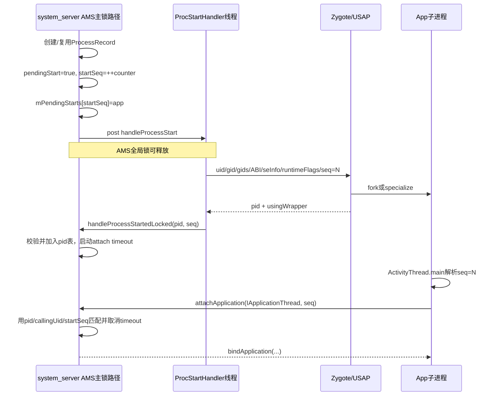

# 206 Android ProcessList：进程启动账本、Zygote 参数与 startSeq 防串账

> 源码版本：Android 11 `android-11.0.0_r48`。  
> 当前在 Mac 上只读源码，不实际 fork Android App 进程，也不宣称完成真机时序验证。

## 1. 本章目标

上一章从 `bindApplication` 看“子进程怎样完成应用装配”，本章向前追：system_server 怎样决定要不要启动进程，怎样把 UID、GID、ABI、SELinux 和存储隔离参数交给 Zygote，又怎样把返回的 pid 与主动 attach 的 App 对回同一次启动。

读完应能回答：

- `ProcessRecord` 为何先于 Linux 进程存在；
- `pendingStart`、pid、thread 和 startSeq 分别代表什么阶段；
- 请求 Zygote 为什么放到专用 Handler，而不是一直占着 AMS 大锁；
- Zygote 返回 pid 和 App attach 谁可能先发生；
- 旧 pid、旧 attach 或已取消启动为何不会接到新账上。

## 2. 一句话模型

AMS 启动的不是一个“裸 pid”，而是一笔带代际的事务：

```text
先创建ProcessRecord和startSeq账本
  → 锁外向Zygote请求子进程
  → 接收pid
  → 等子进程携startSeq反向attach
  → 校验pid + callingUid + startSeq
  → 才把IApplicationThread绑定到ProcessRecord
```

## 3. 为什么只看 fork 不够

fork 只解决 Linux/ART 子进程从哪里来。Framework 还必须知道：是谁要求启动、进程承载哪个包和组件、用哪个 UID/SELinux domain、是否仍需要它、子进程回来时属于哪一次启动。

这些控制面问题集中在 AMS、ProcessList、ProcessRecord 与 ZygoteProcess。

## 4. 完整跨线程时序



图中 pid 回填和 App attach 的先后可以反过来，后文会单独拆解。

## 5. 哪些业务会要求启动进程

Activity、Service、BroadcastReceiver、ContentProvider、备份、Instrumentation 等都可能发现目标 `ProcessRecord`尚未拥有可用应用线程，从而进入 ProcessList 启动路径。

`HostingRecord`记录本次为何启动以及承载组件名称，主要用于日志/统计，同时还携带顶层应用提示和选择 regular/WebView/App Zygote 的信息。

## 6. 进程的 Framework 身份键

普通应用进程主要按 `(processName, uid)`在 `mProcessNames`中查找。包名、进程名和 UID 不是同一个概念：

- 默认 processName 常等于包名；
- `android:process`可产生同包多进程；
- shared UID 下不同包可能共享 Linux UID，仍需结合进程名；
- isolated 进程使用专门 UID，不能普通复用。

## 7. ProcessRecord 先于 pid 存在

`ProcessRecord`是 system_server 的进程控制块，保存包、UID、托管原因、OOM 状态、组件关系、pid、应用线程 Binder、启动参数与错误状态等。

创建它只表示“Framework 计划拥有这个进程”，不表示内核已经分配 pid。

## 8. 四个字段描述不同阶段

可用以下状态理解：

| 字段 | 典型含义 |
|---|---|
| `pendingStart=true` | 一次 Zygote 启动仍在途 |
| `startSeq>0` | 当前 ProcessRecord 关联的启动代际 |
| `pid>0` | 已知道 Linux pid，不一定已 attach |
| `thread!=null` | 已拿到 App 的 IApplicationThread 控制 Binder，但不代表 bind/组件已完成 |

不要把 `pid>0`直接等价成“Application 已运行”。

## 9. 先判断是否已有进程可用

`startProcessLocked(processName, info, ...)`先查已有 ProcessRecord。若已有 pid，且调用方并不确认它已死，或它还处于 pid 已知但 thread 未 attach 的启动阶段，就复用这条记录并返回。

这样多个组件同时唤醒同一进程时，不会各自 fork 一份。

## 10. knownToBeDead 的作用

调用方若有证据旧进程已死，会传 `knownToBeDead`。若旧 ProcessRecord 仍附着旧 thread/pid，ProcessList 先杀旧 process group，并为新记录保存 precedence 关系，避免旧清理与新启动无序交叉。

它不是见到同名进程就无条件复用。

## 11. isolated 进程不复用普通记录

源码明确：isolated process 不能复用 existing process。它需要新的隔离 UID 与独立安全边界，因此直接按新启动处理。

“进程名相同”并不足以跨 UID 或隔离代际复用。

## 12. 系统未 ready 时可能只建账不启动

若系统进程尚未进入可启动普通应用阶段，目标又不属于 boot 期间允许项，ProcessRecord 会进入 `mProcessesOnHold`。

返回 ProcessRecord 不代表 Zygote 请求已经发出；此时 pid 和 thread 仍可为空。

## 13. pendingStart 是重复启动门

更深一层 `startProcessLocked(app, ...)`开头检查：

```java
if (app.pendingStart) {
    return true;
}
```

这避免同一 ProcessRecord 已有在途启动时再次向 Zygote 发请求。返回 true 的语义是“已有启动正在处理”，不是“新进程已 attach 成功”。

## 14. 旧 pid 状态先清理

若记录残留非 system_server 的 pid，代码从 pid map 移除、取消启动 timeout、把 pid 和 startSeq 归零，再开始新一代启动。

先清旧索引再生成新代际，能降低 pid 表和 ProcessRecord 指向不同对象的机会。

## 15. 启动前确认包可启动

`PackageManager.checkPackageStartable(packageName, userId)`会拒绝例如安装/更新冻结状态下不可启动的包。

包存在不等于当前时刻可执行；启动失败会清理相关账本并走 force-stop 风格的恢复路径。

## 16. UID、GID 与附加组从哪来

主 UID 来自 ApplicationInfo/隔离分配；PackageManager 提供包权限对应的 GID，ProcessList 再结合外部存储 mount mode 计算最终 supplementary groups。

若进程级配置拒绝某些权限，还会移除对应 GID。Manifest 权限最终可能影响 Linux supplementary group，并不只停在 Java permission check。

## 17. mountExternal 是访问视图，不是简单路径字符串

ProcessList 查询 StorageManagerInternal，得到目标 UID/包的外部存储挂载模式；之后把模式交给 Zygote 专门化子进程的 mount namespace。

同一路径在不同 App 进程里可能呈现不同可见性，这是进程启动时建立的隔离视图。

## 18. runtimeFlags 汇集运行时策略

r48 根据包属性、系统属性和调试设置拼出 runtimeFlags，包括：

- JDWP、Java/native debuggable、CheckJNI；
- safe mode、profileable；
- verifier 与 debug info；
- hidden/test API enforcement；
- app image startup cache；
- GWP-ASan 与 memory tagging 等。

这些是传给 Zygote/ART 的启动参数，不是 App main 后再随意补开的普通开关。

## 19. debuggable 与生产配置不同

debuggable App 会启用更多调试检查，还可能查找 nativeLibraryDir 下的 `wrap.sh`并通过 logwrapper 启动。

因此调试包的进程启动时间、wrapper 行为和 attach timeout 都可能与 release 包不同，不能直接拿一组数据替代另一组。

## 20. hidden API 策略在 fork 前编码

ProcessList 取得 ApplicationInfo 的 hidden API enforcement policy，移位写入 Zygote runtimeFlags；还可单独禁用 test API 检查。

子进程从一开始就在对应 API 访问政策下运行，而不是等 Application.onCreate 才装一道 Java 拦截器。

## 21. ABI 与 instructionSet 的区别

requiredAbi 决定应连接支持哪个 ABI 的 Zygote；instructionSet 是从主 ABI 映射出的指令集信息。未声明 primaryCpuAbi 时，回退到设备首选 ABI。

ABI 是应用二进制接口选择，instruction set 是 CPU 指令集视角，两者相关但不应在概念上完全合并。

## 22. SELinux seInfo 在启动前确定

ProcessList 合并 `seInfo`与 per-user `seInfoUser`，形成子进程专门化所需安全标签输入。若 per-user 标签缺失，源码会 wtf 告警。

SELinux domain 不是 Application 启动后自己选择的；它必须在进程降低身份和进入沙箱时建立。

## 23. 普通 App 的入口类固定为 ActivityThread

```java
final String entryPoint = "android.app.ActivityThread";
```

Manifest 中的 Application 类不是 Linux 进程 main。Zygote 子进程先进入 `ActivityThread.main()`，之后 bindApplication 才按 ApplicationInfo 创建自定义 Application。

## 24. 真正建立启动代际

进入底层重载后，源码执行：

```java
app.pendingStart = true;
final long startSeq = app.startSeq = ++mProcStartSeqCounter;
app.setStartParams(uid, hostingRecord, seInfo, startTime);
mPendingStarts.put(startSeq, app);
```

这是进程启动事务的建账点。

## 25. mProcStartSeqCounter 是全局递增号

它在 ProcessList 内为 pending process starts 生成唯一序号。每次新的启动代际取得更大 startSeq，然后写入 ProcessRecord 和 `mPendingStarts`。

startSeq 的作用不是统计“这个包启动了几次”，而是把异步结果、子进程参数和反向 attach 关联到同一代。

## 26. mPendingStarts 是按代际索引的在途表

```text
startSeq → ProcessRecord
```

仅靠 `(processName, uid)`无法区分同一进程快速死亡重启的旧、新请求；仅靠 pid 又会遇到 pid 尚未返回和内核未来复用 pid。startSeq 补上了“第几代”的维度。

## 27. startSeq 不是密码学令牌

它是 system_server 内部生成的单调关联号，不是随机 nonce，也不是向第三方开放的认证凭据。真正 attach 还同时依赖 Binder 提供的 callingPid/callingUid、pid 表和 ProcessRecord 状态。

安全与正确性来自多字段交叉校验，不是因为序号本身不可猜。

## 28. 为什么默认异步启动

r48 的 `DEFAULT_PROCESS_START_ASYNC`为 true；运行配置仍可覆盖它。当 `FLAG_PROCESS_START_ASYNC`开启，AMS 在持锁路径只建立账本，然后：

```java
mProcStartHandler.post(() -> handleProcessStart(..., startSeq));
return true;
```

向 Zygote socket 发请求、等待 pid 可能有延迟；移到 ProcStartHandler 可避免长时间占用 AMS 全局锁，减少无关 Activity/Service/Broadcast 管理被阻塞。

## 29. 异步不等于并行无限 fork

同一记录仍受 `pendingStart`门控，mProcStartHandler 也提供明确队列和线程边界。异步的核心收益是释放 AMS 大锁，而不是承诺所有启动同时执行或立刻完成。

## 30. precedence 等旧进程死亡

专用启动线程发现 `app.mPrecedence`时，会先等待旧 pid 死亡，并再短暂等待 Framework 清理完成；超时仍会记录异常并继续。

这是减少同一逻辑进程两代重叠的协调手段，但不能把“等待内核死亡”和“system_server 全部引用已清理”视为同一个完成点。

## 31. app 数据隔离参数

ProcessList 为同 shared UID 的相关包获取 volume UUID 与 inode，按 compat change 决定是否 bind mount CE/DE 应用数据；也会准备 Android/data 与 Android/obb 的存储目录挂载。

若信息或目录准备失败，r48 某些路径会暂时关闭对应隔离挂载并记录 `bindMountPending`，等待解锁后补做，而不是一律让启动失败。

## 32. isolated 进程不挂自己的 App 数据

源码把 isolated 进程的 package data map 清空，因为隔离 UID 本就不应访问应用私有数据。

这再次表明“从同一个 APK 来”不意味着拥有相同文件系统视图。

## 33. 三类 Zygote 路径

`startProcess()`按 HostingRecord 选择：

1. WebView Zygote；
2. App Zygote；
3. 普通 `Process.start()`进入 primary/secondary Zygote 或符合政策时进入 USAP。

它们的父进程和预加载环境不同，但都要把 startSeq 作为额外子进程参数继续传递。

## 34. top app 提示

HostingRecord 若标记 top app，ProcessList 临时设置 foreground-activities 提示，并把 isTopApp/zygotePolicyFlags 交给 Zygote 启动策略。

这用于降低用户可见启动延迟；真正 OOM adj 与调度组仍会在后续状态计算中刷新，不是永久前台身份。

## 35. startSeq 怎样进入 Zygote 参数

三条路径都附加：

```java
new String[] { PROC_START_SEQ_IDENT + app.startSeq }
```

而 `PROC_START_SEQ_IDENT`是 `"seq="`，所以子进程入口最终可看到类似 `seq=114` 的普通 argv 元素。

## 36. Process.start 只是 Java 门面

`android.os.Process.start()`转给全局 `ZygoteProcess`，后者根据 ABI 打开对应 Zygote socket，把 uid/gid/gids、runtime flags、mount、targetSdk、seInfo、nice name、入口类和附加参数编码成命令。

这里还没有在 system_server 内直接调用 Java `fork()`。

## 37. Zygote socket 的线协议

r48 的请求格式核心是参数数量加逐行参数；参数不允许包含换行或回车，避免破坏 framing。Zygote 响应包含子进程 pid 和是否使用 wrapper。

```text
system_server ZygoteProcess
  --LocalSocket--> Zygote/USAP
  <-- pid, usingWrapper --
```

“Java 方法返回 pid”背后实际有一次本地 socket 请求/响应。

## 38. USAP 是预建未专门化进程

Android 11 可对 latency-sensitive 且政策允许的启动尝试 USAP pool：先拿已 fork 的未专门化进程，再应用目标 UID、SELinux、mount 等参数。

它优化的是 fork/初始化前半段；目标进程仍要进入 ActivityThread、携 startSeq attach 和 bindApplication，不能跳过 Framework 记账。

## 39. wrapper 会改变 pid 语义和超时

使用 `invokeWith/wrap.sh`时，Zygote 返回结构标记 `usingWrapper`。AMS 对这类进程使用更长的 attach timeout，因为调试 wrapper 可能显著延迟真正 App 入口。

r48 常量是普通 10 秒、wrapper 1200 秒；这是源码上限配置，不代表任一设备实测启动必然等到该值。

## 40. Zygote 返回 pid 不代表 App 已 ready

pid 返回只说明子进程创建/专门化请求获得结果。此刻：

```text
Linux进程：可能已运行
ActivityThread.main：可能正在执行
IApplicationThread attach：可能尚未到达AMS
bindApplication：尚不保证发送
Application/Provider/Activity：更不保证完成
```

这是启动分析必须分开的第一组完成边界。

## 41. pid 结果回到 AMS 后先查 pending 表

ProcStartHandler 拿到结果后，在 AMS 锁内调用 `handleProcessStartedLocked(pending, result, expectedStartSeq)`。

若 `mPendingStarts[expectedStartSeq]`已不存在，说明这笔结果已被别的路径处理或取消；不能无条件把迟到 pid 写回当前 ProcessRecord。

## 42. isProcStartValidLocked 的校验

它检查：

- app 是否已被 AMS 杀死；
- `(processName, uid)`表是否仍指向这个对象；
- pendingStart 是否仍为 true；
- app 是否已经有更大的 startSeq；
- 包当前是否仍可启动。

任一条件失效，就杀掉本次返回 pid，而不是污染新一代账本。

## 43. 为什么检查 app.startSeq 大于 expected

如果 ProcessRecord 已进入更高代际，例如旧启动尚在 Zygote 中、同名进程已重新发起，那么旧回调携带较小 expectedStartSeq；`app.startSeq > expectedStartSeq`会把它识别为 stale。

它解决的是异步结果迟到，不是比较哪个 pid 数字更大。

## 44. 有效 pid 怎样正式登记

有效结果会记录 BatteryStats、EventLog `AM_PROC_START`、PackageManager 启动日志和 Watchdog 信息，然后：

```java
app.setPid(pid);
app.setUsingWrapper(usingWrapper);
app.pendingStart = false;
mService.addPidLocked(app);
```

此后可通过 pid 找到 ProcessRecord，但 `thread`仍可能为空。

## 45. pid 冲突需要清旧记录

如果 `mPidsSelfLocked[pid]`已指向另一非 isolated ProcessRecord，源码 wtf 并先清理旧 app，再加入新记录。

Linux pid 会复用；system_server 的旧记录若未及时清掉，不能仅凭相同 pid 认为它就是同一个逻辑进程。

## 46. attach timeout 从 pid 登记后开始

若此时子进程尚未 attach，AMS 发送 `PROC_START_TIMEOUT_MSG`：普通进程 10 秒，wrapper 使用更长超时。

timeout 监控的是“已启动进程没有及时交回 IApplicationThread”，不是 Application.onCreate、Activity onResume 或首帧绘制超时。

## 47. 子进程怎样拿回 startSeq

Zygote/RuntimeInit 最终调用 ActivityThread.main(args)。main 从尾到头扫描 `seq=`参数：

```java
long startSeq = 0;
if (arg.startsWith(PROC_START_SEQ_IDENT)) {
    startSeq = Long.parseLong(arg.substring(...));
}
```

随后创建 ActivityThread 并调用 `thread.attach(false, startSeq)`。

## 48. attachApplication 是子进程主动报到

非 system 进程执行：

```java
mgr.attachApplication(mAppThread, startSeq);
```

Binder 驱动同时让 AMS 获得可信的 callingPid 和 callingUid；参数中的 IApplicationThread 是以后 system_server 调度 App 主线程工作的 Binder 接口。

## 49. 三个身份一起匹配

AMS 不只按 startSeq 查，也不只按 pid 查。主要匹配维度是：

```text
Binder callingPid
Binder callingUid == ProcessRecord.startUid
子进程带回的startSeq == ProcessRecord.startSeq
```

再结合 pid map 与 pending map，才能抵抗迟到、pid 复用和错误记录残留。

## 50. 正常竞态 A：pid 先登记，attach 后到

常见顺序是：Zygote 响应先被 ProcStartHandler处理，ProcessRecord写入 pid map 并启动 timeout；稍后 App 调 `attachApplication`，AMS 通过 callingPid 找到记录，再核对 UID 和 startSeq。

匹配成功后取消 timeout，继续 linkToDeath 和 bindApplication。

## 51. 正常竞态 B：attach 抢在 pid 回填前

子进程可能启动很快，在 ProcStartHandler拿到 AMS 锁登记 pid 之前就 attach。此时 pid map 查不到 app，但 AMS 用 startSeq 查 `mPendingStarts`：

```java
pending = mPendingStarts.get(startSeq);
```

若 callingUid 和代际一致，就直接以 `procAttached=true`处理 pid，不再设置多余 attach timeout。

## 52. 为什么竞态 B 不是错误

Zygote 一边把 pid 响应写回 socket，子进程一边已经并发执行；父/子调度与 system_server 两条线程争锁的顺序不固定。

源码为两种顺序都设计了收敛路径，所以不能仅根据“attach 日志早于 Start proc 日志”就断言系统状态错乱。

## 53. 迟到的 Zygote 结果怎样被吸收

若 attach 路径已经借 pending table 完成 `handleProcessStartedLocked`，它会移除该 startSeq。随后 ProcStartHandler处理同一个 pid 结果时发现 pending entry 已空；若 pending.pid 与结果 pid 一致，只补正 usingWrapper 信息，然后返回 false，不重复登记。

同一启动的两个到达顺序最终汇合到一个 ProcessRecord。

## 54. attach 发现 pid 已属于另一记录

若 callingPid 在 pid map 中已有 app，但其 startUid/startSeq 与本次 attach 不符，AMS 会记录严重错误，清掉占用该 pid 的旧记录，再尝试按 startSeq 从 pending table 找真正目标。

这既处理 pid 复用残留，也阻止旧子进程直接接管新记录。

## 55. 找不到任何合法记录就丢弃进程

pid map 和 pending map 都无法匹配时，AMS 写 `AM_DROP_PROCESS`，对普通子进程调用 kill；特殊同进程模拟路径则让 thread scheduleExit。

系统宁可丢掉无法归属的子进程，也不会猜测它应该绑定哪个包。

## 56. linkToDeath 建立反向存活监控

匹配 ProcessRecord 后，AMS 对 `thread.asBinder()`注册 AppDeathRecipient。App 进程死亡时 Binder 驱动触发 death recipient，AMS 才能清组件、依赖、OOM 与进程表状态。

pid 存在检测和 Binder death 各有作用；后者直接绑定到应用控制接口的生命期。

## 57. attach 成功后取消启动 timeout

源码在继续 bind 前执行：

```java
mHandler.removeMessages(PROC_START_TIMEOUT_MSG, app);
```

随后根据 boot normalMode 生成 Provider 列表，准备调试/Profiler/配置并发送上一章的 `bindApplication()`。

取消的是 attach timeout，不表示 bindApplication 已在 App 主线程执行完成。

## 58. attach timeout 触发会清什么

`processStartTimedOutLocked()`确认 ProcessRecord仍无 thread 后，移除 pid/name/LRU 记录，通知 BatteryStats，清等待 Provider、Service、Backup 和 pending Broadcast，并杀进程。

超时清理必须覆盖所有“正在等这个进程”的消费者，否则它们会永久挂在 launching 状态。

## 59. 启动失败与被取消

Zygote 请求抛 RuntimeException 时，异步路径移除 `mPendingStarts[startSeq]`、清 `pendingStart`并执行启动失败恢复。若请求尚在途时包被冻结、进程被 AMS 杀死或 ProcessRecord被替换，有效性校验会杀掉迟到 pid。

异步系统的关键不是避免失败，而是失败后不让旧结果复活状态。

## 60. startSeq 解决的 ABA 问题

设逻辑进程 P：

```text
启动A(seq=10) → 尚未返回
取消A
启动B(seq=11)
旧A的pid/attach迟到
```

如果只看名字 P，旧 A 可能误接到 B；只看 pid，又可能遇到 pid 复用。startSeq 让 A 永远携 10，B 永远携 11，旧结果不能满足新记录的代际校验。

## 61. startSeq 不能解决什么

它不衡量启动耗时、不保证进程不会崩溃、不保证 Application 初始化成功，也不替代 UID/SELinux/Binder 身份检查。

它只解决“这条异步结果属于哪一次启动”的关联与防串账。

## 62. 进程启动的六个完成边界

```text
① ProcessRecord已创建
② pendingStart/startSeq已建账
③ Zygote已返回pid
④ App已attach并提供IApplicationThread
⑤ bindApplication已在主线程完成
⑥ 首个组件/首帧完成
```

线上日志说“进程已启动”时，必须追问它指哪一层。

## 63. 性能分析怎样分段

- ②→③慢：Zygote socket、fork/USAP、specialize、mount、wrapper；
- ③→④慢：子进程 RuntimeInit/ActivityThread.main、调度、Binder attach；
- ④→⑤慢：第205章的 ClassLoader、Provider、Application；
- ⑤→⑥慢：Activity、资源 inflate、View traversal、渲染与 SF。

把所有时间都记到 `Application.onCreate()`会选错修改点。

## 64. 常见误解一：ProcessRecord 就是进程

ProcessRecord 是 system_server 中的控制对象；Linux task 是内核对象。前者可以先创建、等待、残留清理或记录一次失败启动，后者由 Zygote/USAP 真正产生。

两者靠 pid、UID、startSeq 与 Binder thread 逐步绑定。

## 65. 常见误解二：拿到 pid 就能启动 Activity

仅有 pid 时 `app.thread`可能仍为空，system_server还没有可调用的 IApplicationThread。组件事务必须等 attach 建立 Binder 控制通道并完成应用绑定环境。

pid 是必要条件，不是组件 ready 条件。

## 66. 常见误解三：startSeq 等于 pid 的替代品

pid 用于标识当前 Linux 进程并做信号/进程表操作；startSeq 用于标识 Framework 启动代际。二者必须同时存在，生命周期和复用规则不同。

## 67. Mac 只读练习一：找到建账点

```bash
sed -n '1960,2010p' \
  frameworks/base/services/core/java/com/android/server/am/ProcessList.java
```

标出 pendingStart、startSeq、setStartParams、mPendingStarts 和 ProcStartHandler post；用自己的话解释为什么 post 前必须先写账。

## 68. Mac 只读练习二：对照两种竞态

```bash
sed -n '2445,2590p' \
  frameworks/base/services/core/java/com/android/server/am/ProcessList.java

sed -n '5000,5080p' \
  frameworks/base/services/core/java/com/android/server/am/ActivityManagerService.java
```

分别画出“handleProcessStarted 先”和“attachApplication 先”，确认两者都以同一个 startSeq 从 pending table 收敛。

## 69. Mac 只读练习三：追 seq 参数闭环

```bash
rg -n 'PROC_START_SEQ_IDENT|startSeq' \
  frameworks/base/services/core/java/com/android/server/am/ProcessList.java \
  frameworks/base/core/java/android/app/ActivityThread.java
```

把“system_server生成→Zygote argv→ActivityThread.main解析→Binder attach带回”的四个位置逐一记录。

## 70. 自测题

1. `pendingStart=true`为什么不等于 pid 已产生？
2. 为什么 ProcessRecord必须先于 Zygote 请求创建？
3. startSeq 与 pid 分别防什么问题？
4. 为什么 App attach 可能早于 system_server处理 Zygote pid 响应？
5. attach 早到时，AMS 如何找到对应 ProcessRecord？
6. 普通 10 秒 process start timeout 在等待哪一步？
7. 为什么获取 pid 后仍不能说 Application.onCreate 已执行？

## 71. 本章结论

Android 进程启动是带代际、可取消、允许乱序回报的控制事务。ProcessList 先建立 ProcessRecord、pendingStart 和全局递增 startSeq，再锁外把身份、安全、ABI、存储与运行时参数交给 Zygote；pid 结果与子进程 attach 无论谁先到，都由 `mPendingStarts[startSeq]`汇合，并用 callingPid、callingUid、startSeq 和当前表项交叉校验。

最重要的工程思想是：

```text
异步操作发出前先建账；
每一代请求携带不可混用的代际号；
所有迟到结果先验证“我还是当前这一代吗”；
失效结果必须清理，不能把旧世界重新写回新状态。
```

下一章继续进入 Zygote 内部，拆命令解析、fork 前单线程约束、子进程 specialize、文件描述符处理，以及父子分叉后怎样走到 RuntimeInit 与 ActivityThread.main。
