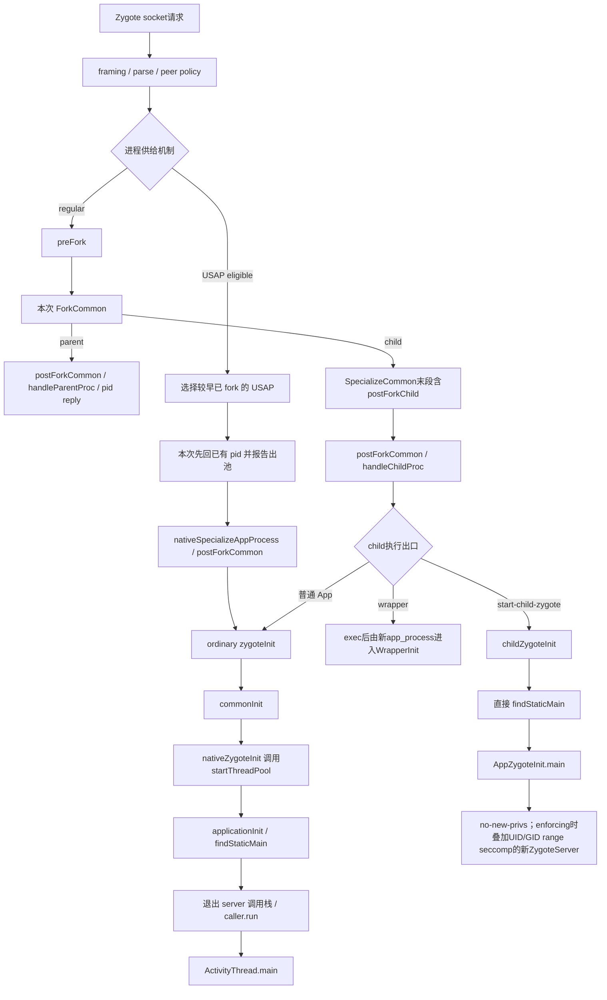

# 207 Android Zygote：命令解析、fork/specialize 与 RuntimeInit 入口

> 源码基线：Android 11 / API 30 / `android-11.0.0_r48`。
>
> 当前环境只有源码快照，可以证明命令边界、父子偏序、权限收敛顺序与入口调用链；不能据此测出某台设备的真实 fork 时长，也不能把固定普通 App 在 regular/unspecialized app process（USAP）路径上的 pid 回复解释成 child 已完成 specialize、Binder 已可回调或 `ActivityThread.main()` 已经执行。wrapper 的已核验 inner pid 具有不同边界，后文单列。

第 206 章停在 system_server 的启动账：`startSeq=410` 把 Zygote 结果和子进程 attach 关联到当前一代 `ProcessRecord`。本章进入 socket 另一端，追同一个 `P_B` 怎样从一组文本参数变成受限的 Linux 进程，并最终把控制权交给 `ActivityThread.main()`。

本章只追一个问题：**system_server 已经拿到 `P_B` 的 `pid=24680`，却迟迟没有看到 `attachApplication()`；这个 pid 在 regular 与 USAP 路径上分别最多证明什么，怎样倒推它此前通过的命令与 fork 边界，又怎样向前判断 child 尚在 FD 清理、specialize、RuntimeInit、Binder 启动、入口类解析，还是已经反射进入 `ActivityThread.main(seq=410)`？**

先给最重要的结论：普通无 wrapper 的 Zygote 在 `fork()` 后分成并发的父、子执行流。父进程的 pid 回复不是 child specialize 的回执；USAP 自己的程序顺序更明确，是先完成已有 pid 的 socket 写入，再开始本次 specialize，但客户端何时读到不在这条本地顺序内。只有逐层找到完成点，才能知道“pid 已知”这份证据能覆盖到哪里。

## 1. 固定 P_B、pid 已回而 attach 缺失的唯一问题

沿用第 206 章的普通应用进程，固定主线条件：

| 维度 | 固定值或前提 |
|---|---|
| 包与进程 | `com.example.reader`，记作 `P_B` |
| 用户与身份 | user 0，目标 UID/GID 均为 `10123` |
| 兼容目标 | `targetSdkVersion=30` |
| 启动代际 | 剩余参数带 `seq=410` |
| 入口类 | `android.app.ActivityThread` |
| Zygote | primary 64-bit 全局 Zygote，已经完成 preload |
| 主路径 | regular fork，USAP pool 关闭，无 wrapper、native bridge 与 child-Zygote 标志 |
| 示例 pid | `fork()` 在父分支返回 `24680`，子分支返回 `0` |
| 观察现象 | system_server 已接收 `pid=24680`，尚未收到 child 的 Binder attach |

固定条件不是说平台只有这一条路。后文还会并列两个反事实分支：

- 同一目标满足 USAP 条件，系统从池中取出一个早已 fork、pid 恰为 `24680` 的未专门化进程；
- 另一条命令携带 `--start-child-zygote`，入口是 `AppZygoteInit`，目标是建立新的受限孵化器，而不是直接建立最终 App。

主线的 socket 参数末尾可抽象为：

```text
--runtime-args
--setuid=10123
--setgid=10123
--target-sdk-version=30
--nice-name=com.example.reader
android.app.ActivityThread
seq=410
```

这里只强调字段角色，不把表格当作实际完整 argv；真实请求还可能有 supplementary groups、mount 模式、runtime flags、`seInfo`、数据目录与包数据映射。`seq=410` 只是 `ActivityThread` 的入口参数，不参与 Zygote 的 UID 授权，也不证明请求者可信。

为避免“启动成功”一词吞掉所有边界，本章定义九个完成点：

| 点 | 已经成立 | 仍不能推出 |
|---|---|---|
| Q0 | 普通 spawn 参数已解析并通过 Java 请求策略 | 已经调用 `fork()` |
| F0 | `ForkCommon()` 产生父、子两个执行流 | child 已完成 specialize |
| S0 | child 完成 `SpecializeCommon()` 与其末段 child post-fork hook | Java Daemon 启动调用已发出或入口已找到 |
| P0 | 固定普通 App 的无 wrapper regular 父进程或 USAP 进程完成 pid 的 socket 写入 | 请求端已经读到；regular child 已到 S0 |
| D0 | ordinary child 执行完 `postForkCommon()`，Java Daemon 的启动调用已发出 | Binder pool 启动调用已发生 |
| C0 | `RuntimeInit.commonInit()` 完成通用 Java 初始化 | B0 的 pool 启动调用已发生 |
| B0 | `ProcessState::startThreadPool()` 已被调用 | `ActivityThread` 或 `IApplicationThread` 已创建 |
| R0 | `findStaticMain()` 初始化入口类并返回 Runnable | `main()` 已被调用 |
| M0 | 最外层 `caller.run()` 已反射进入 `ActivityThread.main()` | 主 Looper、attach 或首条消息已经完成 |

九个点服务于“固定普通 App 最终进入 `ActivityThread.main()`”这条诊断链，却不是一条跨所有分支的全序：regular 的 F0 属于本次请求，USAP 的 F0 属于较早的补池；D0 专指 ordinary child，parent 自己的 `postForkCommon()` 不借用这个标号；wrapper 另有 pipe 完成边；child Zygote 又不经过普通 App 的 C0/B0/M0。后文会逐支映射，不能把表格从上到下直接画成一条线。

本章交付 M0。`ActivityThread.main()` 内部怎样准备主 Looper、创建 `ActivityThread`、同步 attach，并与 Binder 回调和首批主线程消息排序，是第 208 章的问题。

## 2. 八本账与 pid 的弱完成语义

Zygote 启动链至少维护八种彼此不能替代的状态：

| 账本 | 主要证据 | 回答的问题 |
|---|---|---|
| 命令账 | argc 行、argv 行、`ZygoteArguments`、`mRemainingArgs` | 请求被解释成了什么 |
| 请求授权账 | `LocalSocket` peer pid/uid/gid、UID/wrapper/capability 检查 | 谁能要求什么身份与包装方式 |
| fork 安全账 | Daemon 停止、单线程点、信号掩码、FD table | 模板是否处在可复制状态 |
| 沙箱账 | mount、groups、gid、seccomp、scheduler、uid、capability、SELinux | child 怎样失去模板权限并取得目标约束 |
| 父子分支账 | `fork()` 返回值、两侧清理、父侧 pid 回复 | 哪个进程正在推进哪条路径 |
| Runtime 账 | `commonInit()`、target SDK、compat changes | Java 运行语义是否固定 |
| Binder 启动账 | `nativeZygoteInit()`、`ProcessState::startThreadPool()` | pool 启动调用推进到哪里；不等于 worker ready |
| Java 入口账 | start class、反射 `Method`、Runnable、`caller.run()` | 入口只是找到，还是已经调用 |

`pid=24680` 在三种回包形态上的语义并不相同：

| 回包形态 | pid 从哪里来 | 这份 pid 写回证据最多证明什么 |
|---|---|---|
| regular、无 wrapper | 本次 `fork()` 的父返回值 | Linux child 已产生，父侧 pid 写入已完成 |
| wrapper 且 `usingWrapper=true` | 经 pipe 核验的后代 pid | direct child 已跨过 S0/D0 并进入 exec 分支；父侧接受了等于它或经 `/proc` 验证为其后代的 pid，但协议不认证写 pipe 的具体程序，也不硬证 inner B0 |
| USAP | 池中既有未专门化进程的 pid | 一个池进程被分配给请求，随后才 specialize |

因此在固定普通 App 的无 wrapper regular/USAP 场景中，system_server 已读到 pid 时可以倒推出 producer 侧 P0 已发生，却不能用读取时刻给 child 的并发进度设上界：

```text
pid已回复
  ≠ child已完成SpecializeCommon
  ≠ Java Daemon启动调用已发出
  ≠ RuntimeInit.commonInit已完成
  ≠ Binder pool启动调用已发生
  ≠ ActivityThread类已初始化
  ≠ ActivityThread.main已进入
  ≠ attachApplication已发出
```

第 206 章还增加了一层约束：即使 system_server 收到 pid，也要用 `startSeq`、pending 表、pid 表和 Binder calling identity 收敛到正确一代。第 207 章解释请求怎样产生 pid，以及父侧回包之后 child 还能独立走到哪里；它不重复服务端账本的身份匹配。

若从完整请求倒推，Q0 之前还在 framing/parser/policy，Q0 到 F0 是 regular 的 pre-fork 窗口；这两段用于解释 pid 怎样产生。固定现场已经观察到 P0，所以实际向前诊断从 child 自己的泳道开始：

1. F0 到 S0：regular child 可能仍在 ForkCommon 清理或安全专门化；USAP 则从 P0 后才开始本次专门化；
2. S0 到 D0：ART child hook 已完成，Java Daemon 的启动调用尚未发出；
3. D0 到 C0：child 已离开 post-fork 恢复，尚在进入或执行通用 Java 初始化；
4. C0 到 B0：通用 Java 环境已建立，Binder pool 启动调用尚未发生；
5. B0 到 R0：Binder pool 启动调用已发生，入口参数解析、类加载或静态初始化仍可能失败；
6. R0 到 M0：Runnable 已形成，仍要退出旧 Zygote 调用栈并执行 `caller.run()`。

这些区间不能靠 pid 单点区分，需要结合日志、trace、墓碑、进程身份、线程与调用栈证据。

## 3. 两种进程供给机制与三种 child 执行出口

先把“供给机制”和“child 执行出口”两个维度画在同一张图里：



这张图先按“怎样取得进程”分 regular/USAP，再按 regular child “取得后执行什么”分 ordinary、wrapper 与 child Zygote；两组概念不是同一层级。还要保留三条非对称性：

- 固定普通 App 的无 wrapper regular 请求会 fork；父、子在 F0 后并发，`P0` 与 `S0` 没有固定全序；
- USAP 的 fork 发生在较早的 pool refill；USAP 线程本地是“P0 写完成 → S0”，客户端 read completion 却可能因调度落在 S0 前后任意位置；
- child Zygote 不是普通 App 入口。它跳过 `commonInit()`、`nativeZygoteInit()` 与 `applicationInit()`，先运行孵化器 main，再建立新的受限 server。

普通主线更准确的偏序是：

```text
Q0 → preFork → F0
               ├─ parent: postForkCommon → handleParentProc → P0 → 回select loop
               └─ child : ForkCommon child cleanup
                           → SpecializeCommon（末段postForkChild）→ S0
                           → postForkCommon → D0
                           → handleChildProc → zygoteInit
                           → C0 → B0 → R0
                           → 退出runSelectLoop与ZygoteInit.main的finally
                           → caller.run → M0
```

固定普通 App、无 wrapper 主线中，父分支的 `P0` 可能早于或晚于 child 的 S0。内核调度决定两侧何时运行；源码没有父进程等待 child 完成 specialize 的同步边。把流程写成“父回 pid，然后 child specialize”或“child specialize 完成，然后父回 pid”，都把偏序误画成了全序。

## 4. socket framing、参数分层与 peer 身份检查

`ZygoteServer.runSelectLoop()` 用 `poll()` 同时等待 server socket、已经接受的 session socket，以及启用 USAP 后的 event/report FD。索引 0 是监听 socket；新连接会生成 `ZygoteConnection`，后续某个可读事件才执行一条 `processOneCommand()`。同一 session 可以连续发送多条命令，直到 EOF 或错误关闭连接。

这是一个 Java 主线程上的同步服务循环，不是每个 session 配一条 fork worker。一次 `processOneCommand()` 或 wrapper pid 等待尚未返回时，同一 Zygote 不会同时从这个 loop 处理下一条普通命令；多个 fd 同时 ready 也不构成全局 FIFO 承诺。

socket 由 init 创建并通过 `ANDROID_SOCKET_<name>` 文件描述符交给 Zygote。它是本地 UNIX domain socket；文件权限是第一层入口收缩，但不是解析器和运行时策略的替代品。

一条请求采用逐行 framing：

```text
第一行：十进制 argc
接下来：严格读取 argc 行参数
```

`readArgumentList()` 的边界很具体：首行 EOF 表示对端正常断开；argc 不是整数、超过 `MAX_ZYGOTE_ARGC`，或参数行中途 EOF 都是错误。它只建立字符串数组，不负责判断 UID、入口类或 wrapper 是否允许。

`new ZygoteArguments(args)` 再做第二层解释。解析器依次识别选项，遇到单独的 `--`，或第一项不被 Zygote option parser 识别的参数时停止；后者即使以 `--` 开头也会进入 `mRemainingArgs`。普通 Runtime 请求必须携带 `--runtime-args`；对 `P_B` 而言，余项是：

```text
mRemainingArgs[0] = android.app.ActivityThread
mRemainingArgs[1] = seq=410
```

解析器会拒绝多种关键字段重复指定，例如 UID、GID、target SDK、`seInfo`、capabilities、supplementary groups、`invoke-with`、nice name 与 package name；但不能概括成“所有选项都只允许一次”。r48 中 runtime flags、mount external 等字段可能被后值覆盖，rlimit 还明确允许重复累积。语法成功只说明命令形状可解释。

`ZygoteConnection` 在接受 session 时保存 `LocalSocket.getPeerCredentials()` 的 pid/uid/gid。这份身份来自内核连接元数据，而不是 argv 自报。普通 spawn 继续按源码顺序执行：

```text
parse并先分流控制命令
→ 拒绝客户端指定非零permitted/effective capabilities
→ applyUidSecurityPolicy(peer credentials)
→ applyInvokeWithSecurityPolicy(peer credentials)
→ applyDebuggerSystemProperty
→ applyInvokeWithSystemProperty
→ 规划wrapper pipe与fork FD
```

顺序本身就是安全语义：

- system UID 在正常模式下不能显式要求 UID 小于 1000；没有显式 UID/GID 时才继承 peer 的值；
- 非 root 的显式 `--invoke-with` 必须在请求原有 runtime flags 中已经可调试；它不能借助随后才叠加的全局 `ro.debuggable` 通过鉴权；
- `wrap.<niceName>` 是之后由 Zygote 自己读取的受信系统属性来源，只在还没有显式 wrapper 时填入；
- `seq=410` 不参与这些判断，它仍只是最终入口参数。

socket 上也不全是 fork 请求。ABI/PID 查询、boot-completed、preload、USAP 开关以及 hidden-API 配置可以在解析后直接回复或改变 server 状态。观察到 session 可读，只能说有一条命令；观察到 `processOneCommand()`，仍不能先验断言发生了 fork。

“控制命令不直接 fork 目标 App”也不等于执行期间绝无 fork：USAP 状态或 hidden-API 状态变化可以清池并触发 refill，由此创建新的 USAP。另一个边界是 system_server：`ZygoteInit.forkSystemServer()` 在启动期直接构造参数并 fork，不经过普通 socket 的 `processOneCommand()`，所以它的 capability 来源不能套用这里“普通请求拒绝非零 capabilities”的结论。

## 5. regular 的 preFork：把活跃模板压到可复制安全点

Zygote 不是“永远没有线程”的空壳。它在进程启动期预加载 framework 类、资源与共享库，启动过运行时 Daemon；这些页让后续 child 借助 copy-on-write 复用内存。每个普通 spawn 的 `Zygote.forkAndSpecialize()` 仍必须先调用 `ZygoteHooks.preFork()`：

```text
Daemons.stop()
→ nativePreFork()
→ 循环读取 /proc/self/task
→ 只剩当前线程时返回
```

r48 的 `Daemons` 数组包含 HeapTask、ReferenceQueue、Finalizer 与 FinalizerWatchdog 四项。`stop()` 会要求各线程退出并 join，不是只发一个中断就继续。ART 的 `nativePreFork()` 又进入 `Runtime::PreZygoteFork()`，处理 JIT 线程、heap 与 native bridge 等 fork 前状态，并把当前 ART Thread 指针作为 token 带到 child hook。

最后一道 `/proc/self/task` 检查很重要：源码循环到 task 数量为 1，没有“等几秒后带着多线程强行 fork”的降级路径。`preFork()` 从这里返回时可以证明：**普通 fork 前，Zygote 已把 Java Daemon 停下，并在内核 task 视角收敛为单线程。** 它不证明所有 native 资源都天然 fork-safe；后续仍要专门处理锁、信号、allocator 与 FD。

一次性 Zygote 启动准备与每次 fork 窗口必须分开：

| 阶段 | 代表动作 | 频率 |
|---|---|---|
| Zygote 生命周期准备 | `RuntimeInit.preForkInit()`、preload、GC/finalize、`initNativeState()` | 通常进程启动一次 |
| 普通 App fork 窗口 | `ZygoteHooks.preFork()`、`nativeForkAndSpecialize()`、两侧 `postForkCommon()` | 每次 regular spawn |
| USAP pool refill | 一次 `preFork()` 后连续 `forkUsap()` 若干次，父最后才 `postForkCommon()` | 每次补池批次 |

因此“每个 App 都重新 preload framework”与“Zygote 从始至终只有一个线程”都不成立。预加载成果由 fork 继承；单线程只是受控窗口。

`postForkCommon()` 也不是 child 专属。它先让 ART 做 `PostZygoteFork`，再启动那四个 Java Daemon：

```text
parent: preFork → fork → postForkCommon → 继续做Zygote server
child : preFork → fork → SpecializeCommon内postForkChild → postForkCommon → 继续做App
```

“调用并返回 `postForkCommon()`”最多证明 Daemon 启动调用已发出，不能推成每个 Daemon 已完成第一轮工作，更不能推成 Binder pool 启动调用已经发生。Binder 是稍后的另一条账。

## 6. ForkCommon：信号、FD、allocator 与 COW 的真实边界

JNI `nativeForkAndSpecialize()` 在 fork 前按目标 UID/GID/groups 计算受控 capability 集，补齐需要 close/ignore 的 fd，然后调用 `ForkCommon(..., is_priority_fork=true)`。普通主线的 `true` 与 `isTopApp` 不是一回事：前者控制 fork child 的临时 native priority，后者稍后选择专门化的调度策略。

`ForkCommon()` 的关键顺序是：

```text
安装Zygote信号处理
→ block SIGCHLD
→ 关闭Android log与stats socket
→ 创建或restat open-FD table
→ 保存fdsan级别
→ mallopt(M_PURGE)
→ fork
```

block `SIGCHLD` 的直接原因很细：Zygote 的 child reaper 可能在 handler 中记日志，从而重新打开刚关闭的 logging fd，破坏 fork 前的 FD 一致性窗口。`M_PURGE` 尝试减少 allocator 元数据造成的 private dirty；调用出现在这里，不等于每一页都已回收或未来零 COW 成本。

第一次 fork 建立 `FileDescriptorTable`，以后调用 `Restat()`。r48 不能被描述成“FD 集合从此绝不许变化”：消失的记录会删除，新 fd 经检查后可以加入，同一个编号换目标也会重建信息。真正的硬边界是受支持的 fd 类型、路径与 socket 规则；child 对 regular/character fd 按类型重开，socket detach 到 `/dev/null`，允许的单个 ART memfd 可原样保留，从而避免父子继续共享不合适的 open file description。

Java 为普通请求显式提供两组 fd：

| 集合 | `P_B` 主线中的成员 | native child 行为 |
|---|---|---|
| `fdsToClose` | 当前 session socket、Zygote listening socket | 用 `/dev/null` 通过 `dup3(..., O_CLOEXEC)` 替换原编号 |
| `fdsToIgnore` | 无 wrapper 时为 null；wrapper 时是 pipe 两端 | 从 FD table 扫描/重开策略排除，后续仍按分支关闭或传递 |

JNI 还把 USAP report pipe、pool socket/event fd、system-server socket 等纳入相应计划。`fdsToIgnore` 只表示“不按普通 open-FD 基线处理”，绝不等于“允许业务 App 随意继承”。例如 wrapper child 只保留 write 端跨 exec 报告 inner pid，父进程关闭 write 端；两边都不会把 pipe 当作通用 App 能力。

child 的 `ForkCommon()` 清理顺序大致是：

1. 设临时优先级并执行 allocator 的 `PreApplicationInit()`；
2. detach `fdsToClose`，清理复制来的 USAP table；
3. 对其余 open fd 执行 `ReopenOrDetach()`；
4. 恢复 fdsan，清空 child 中的 system-server socket 全局值；
5. 解开 `SIGCHLD` 屏蔽并返回 0。

parent 不执行这些 child 清理；`pid != 0` 的分支会记录返回值，fork 失败的 `-1` 也落在这里，随后同样解除 `SIGCHLD` 屏蔽。child 此时仍暂时继承 Zygote 的 `SIGCHLD` handler，直到 `SpecializeCommon()` 后段才恢复默认处理；`SIGHUP` 则继续忽略。

COW 的准确说法是：fork 时父子虚拟地址空间从同一物理页起步，某一侧写页后才产生私有副本。它不能保证“同一个 Java 对象永远共享”，也不能证明 preload 越多必然越省；预加载页的后续写入、重定位与 allocator 行为都会改变真实收益。

## 7. SpecializeCommon：权限依赖决定顺序

`ForkCommon()` 只复制出 child，尚未把它变成 UID 10123 的应用。`nativeForkAndSpecialize()` 只在 `pid==0` 的执行流调用 `SpecializeCommon()`；父 Zygote 永远不走这条降权路径。

对固定场景，假定 SELinux enforcing、普通非 system-server、非 child Zygote。r48 的主顺序可压缩成五组：

| 阶段 | 代表动作 | 为什么在这里 |
|---|---|---|
| 保留过渡能力 | `PR_SET_KEEPCAPS`、设 inheritable、drop capability bounding set | 为降 UID 后写入受控 current caps 留出过渡条件，同时封闭未来 exec 获得 bounding caps 的空间 |
| 建资源视图 | mount emulated storage、可选 app-data/JIT profile 隔离、Android/data/obb bind、create process group | 需要 Zygote 身份或特权完成 namespace/cgroup 操作 |
| 固定 POSIX 约束 | supplementary groups、rlimit、native bridge 预处理、`setresgid()` | 在失去 UID 特权前完成组与资源设置 |
| 安装内核策略并降 UID | seccomp、scheduler/cpuset、`setresuid()` | seccomp 安装仍需要相应能力；saved UID 一并切到目标身份 |
| 收尾安全域 | dumpable/debug/profile、内存策略、最终 caps、SELinux context、进程名、信号、post-fork hook | 将 remaining runtime/security 状态收敛为目标 child |

把它展开成可核对的程序序列：

```text
EnableKeepCapabilities(targetUid != 0)
→ SetInheritable(permitted)
→ DropCapabilitiesBoundingSet()
→ 判定native bridge
→ MountEmulatedStorage及可选数据目录隔离/bind
→ createProcessGroup（条件成立时）
→ SetGids → SetRLimits
→ PreInitializeNativeBridge（可选）
→ setresgid
→ SetUpSeccompFilter
→ SetSchedulerPolicy / DropTaskProfilesResourceCaching
→ setresuid
→ dumpable / debugger / profileable / memory策略
→ SetCapabilities(permitted, effective, permitted)
→ 再关log/stats socket
→ selinux_android_setcontext
→ SetThreadName
→ SIGCHLD恢复SIG_DFL
→ child-Zygote或system-server专属收尾（若适用）
→ Java postForkChild hook
→ native priority恢复默认
```

这里有四个常见但危险的缩写：

- `setresuid()` 是关键降权点，却不是完整 sandbox 完成点；最终 caps、SELinux domain 与运行时 hook 仍在后面；
- `DropCapabilitiesBoundingSet()` 在 r48 遍历并 drop 可读的整个 bounding set，不是只删“本 App 不允许的若干项”；随后 `SetCapabilities()` 设置受控 current 集，二者并不矛盾；
- seccomp 与 SELinux 是不同机制。r48 在 `gIsSecurityEnforced` 为 false 时跳过这处 seccomp 安装，不能把 permissive 分支也写成已经装载过滤器；
- child 内的 `createProcessGroup(uid, pid)` 是 libprocessgroup/cgroup 操作，父分支稍后的 `setChildPgid()` 是 Unix process group 操作；名字相近，不是同一本账。

不少关键 syscall 或 SELinux 转换失败会走 `ZygoteFailure`，通过 JNI fatal error 终止当前进程；但也有 best-effort 分支只记录错误，例如部分 process-group、命名、调试或优先级操作。不能把整段概括成“任一调用失败都继续”，也不能写成“任一调用失败都只杀 child”：若 native fatal error 发生在 fork 前，当前进程仍是父 Zygote，后果会更大。

`SpecializeCommon()` 末段调用 Java `Zygote.callPostForkChildHooks()`，进入 ART 的 `postForkChild`：把 Runtime 标为 Zygote child，修复当前 Thread、heap、JIT、trace、native bridge 与 runtime flags，并重播 `Math` 随机种子。返回 Java 后，普通 `forkAndSpecialize()` 还会依据 groups 是否含 `INET_GID` 设置本进程网络允许状态，恢复 Java thread priority，然后执行 `postForkCommon()`。因此 S0、D0 是两个不同完成点。

## 8. fork 返回值怎样拆开 parent reply 与 child 世界

同一次 `fork()` 在两个地址空间返回不同值：parent 得到 `24680`，child 得到 0。之后双方只共享“fork 前内存快照的来源”，不共享 Java 对象状态，也不会通过 `mIsForkChild` 自动彼此同步。

`Zygote.forkAndSpecialize()` 返回 Java 前，两边都恢复 Java priority 并执行 `postForkCommon()`；区别是 child 已先在 native 侧完成 `SpecializeCommon()` 与 `postForkChild`。回到 `processOneCommand()` 后才出现显式分叉：

| 动作 | parent Zygote | `P_B` child |
|---|---|---|
| `pid` | `24680` | `0` |
| `mIsForkChild` | 保持 false | 在自己的地址空间置 true |
| server socket | 保持以继续服务 | 关闭 Java server 包装对象 |
| session socket | 保留用于回包 | 在 `handleChildProc()` 中关闭 |
| 后续方法 | `handleParentProc()` | `handleChildProc()` |
| 命令返回值 | 始终 `null` | 普通分支返回入口 `Runnable` |

无 wrapper 的 parent 先尝试把 direct child 放入 peer 所在 Unix process group，再写一个 int pid 与一个 boolean `usingWrapper=false`。fork 失败时 pid 为负，也由这套响应传回，客户端将其变成启动异常。

有 wrapper 时，多了一条 pipe 协议：fork 前用 `pipe2(O_CLOEXEC)` 建 read/write 两端，清 child write 端的 close-on-exec；child 经 `WrapperInit.execApplication()` 执行配置的外部命令，常规 AOSP 链最终启动新的 `app_process` 并由 `WrapperInit.main()` 写回 inner pid；parent 最多等 30 秒，并沿 `/proc` 父链确认 inner pid 等于 direct child 或确是其后代，才用 inner pid 回包并置 `usingWrapper=true`。

pipe 在 fork 前为空，而且 write 端只有 direct child 跨过 `SpecializeCommon()`、child `postForkCommon()` 与 `handleChildProc()` 并进入 exec 分支后才交给 wrapper 命令。因此 `usingWrapper=true` 至少硬证 direct child 已经过 S0/D0。常规 `WrapperInit` 链的 pipe 写入还发生在新 `app_process` 的 `RuntimeInit.main() → commonInit() → nativeFinishInit() → AppRuntime::onStarted() → startThreadPool()` 之后；不过 `invokeWith` 可以是外部命令，继承 write fd 的程序可能自行提前写一个后代 pid。父侧只验证数字和祖先链，不认证写者或 inner B0，所以不能把常规实现顺序升级成协议通则。

这段等待发生在 Zygote 的单线程 `runSelectLoop()` 调用栈上，会占住该 server 的普通命令处理，并非后台异步检查。若超时、读取失败或后代关系不成立，parent 仍可回 direct child pid，但 `usingWrapper=false`。

固定主线没有 wrapper，所以 P0 很简单：父侧已把 `24680,false` 写给 system_server。但 child 是否已经跨过 S0、D0、B0 或 M0，仍完全未知：

```text
parent: F0 → postForkCommon(parent) → setChildPgid → P0
child : F0 → FD清理 → S0 → D0(child) → RuntimeInit → M0

两行之间没有等待边。
```

这正是“pid 已回、attach 未到”可以正常短暂出现的根因之一，也是第 206 章必须容纳 attach-first 与 pid-first 竞争的底层来源。

## 9. handleChildProc 的普通、wrapper 与 child-Zygote 分支

child 先关闭从 Zygote 继承的 session Java 对象，必要时用 `Process.setArgV0()` 设置进程名，再结束 fork trace。随后有三个互斥出口：

| 分支 | 行为 | 是否返回普通 App Runnable |
|---|---|---|
| wrapper | `WrapperInit.execApplication()` 替换进程镜像 | 正常不会返回 |
| ordinary App | `ZygoteInit.zygoteInit(targetSdk, compat, remainingArgs, classLoader)` | 是 |
| child Zygote | `ZygoteInit.childZygoteInit(...)` | 返回孵化器 main 的 Runnable |

wrapper 外壳不走当前 child 的普通 `zygoteInit()`；新 `app_process` 稍后由 wrapper 的 RuntimeInit 路径调用 Binder pool 启动并进入目标入口。改变 Runtime 路线的是 `mInvokeWith` 分支；父侧响应中的 `usingWrapper` 只记录 inner pid 是否成功读出并通过后代检查。

child Zygote 则故意走窄路径：

```java
static final Runnable childZygoteInit(...) {
    RuntimeInit.Arguments args = new RuntimeInit.Arguments(argv);
    return RuntimeInit.findStaticMain(args.startClass, args.startArgs, classLoader);
}
```

它不调用 `RuntimeInit.commonInit()`，不经 `nativeZygoteInit()` 启动普通 App Binder pool，也不通过 `applicationInit()` 固定 target SDK/compat 语义。入口 `AppZygoteInit.main()` 或 `WebViewZygoteInit.main()` 会继续解析 child socket 与 ABI，先设置 `PR_SET_NO_NEW_PRIVS`，再要求 range 的 start/end 都存在、start 不大于 end 且 start 不低于 `FIRST_APP_ZYGOTE_ISOLATED_UID`；`gIsSecurityEnforced` 为 true 时才安装限制该数值范围的 UID/GID seccomp 规则，随后运行新的 `ZygoteServer`。r48 没有在这里验证 range 上界必处于 isolated UID 区间。这是受限的新孵化器，不是 `P_B` 已 ready。

USAP 的请求验证会拒绝 `--start-child-zygote` 和 wrapper 等不支持选项，因此不能把“USAP + child Zygote”拼成一条不存在的路径。

## 10. zygoteInit 的四阶段：从日志到入口 Runnable

普通 child 在 D0 后进入 `ZygoteInit.zygoteInit()`。这个方法短，却串起四份不同职责：

```java
RuntimeInit.redirectLogStreams();
RuntimeInit.commonInit();
ZygoteInit.nativeZygoteInit();
return RuntimeInit.applicationInit(targetSdkVersion,
        disabledCompatChanges, argv, classLoader);
```

四阶段的完成语义如下：

| 阶段 | 主要动作 | 完成后仍缺什么 |
|---|---|---|
| redirect | 关闭原 `System.out/err`，换成 Android log 输出流 | 通用 Java 环境、Binder、入口 |
| common | 异常处理、时区、日志、HTTP user-agent、socket tagging 等 | Binder pool、target SDK、入口 |
| native | 经 JNI 进入 `AppRuntime::onZygoteInit()`，调用 `startThreadPool()` | worker ready、`ActivityThread` 实例与主 Looper |
| application | 固定退出/兼容语义，解析 start class，返回 Runnable | `main()` 尚未调用 |

`redirectLogStreams()` 是进程级输出策略，不是把 Zygote 父进程的流全局改掉：它在 fork 后 child 自己的地址空间执行。

`zygoteInit()` 与 wrapper、child Zygote 不能混写。wrapper 会 exec 新进程镜像并从 `RuntimeInit.main()`/`nativeFinishInit()` 体系进入；child Zygote 直接找孵化器入口。相同的最终目标可能在某处都启动 Binder pool，但调用栈与完成点不同。

固定场景里若 tombstone/trace 表明 child 已进 `zygoteInit()` 却没有 B0，可以沿这四阶段向内缩小：日志重定向是否结束、`commonInit()` 是否卡住、JNI 是否进入 `onZygoteInit()`、还是 `applicationInit()` 找入口失败。pid 本身无法提供这种分辨率。

## 11. commonInit 与 Binder pool 启动请求是两本账

`RuntimeInit.commonInit()` 建立普通 Java 进程共同需要的环境，包括默认 uncaught-exception 前后处理、时区 supplier、Android log handler、HTTP user-agent、network socket tagging，以及特定 emulator trace 开关。源码用 `initialized` 标记完成。这就是 C0，但它不创建 `ActivityThread`，也不启动主 Looper。

下一句 `ZygoteInit.nativeZygoteInit()` 才沿 native 虚方法到：

```text
ZygoteInit.nativeZygoteInit
→ AndroidRuntime::onZygoteInit
→ AppRuntime::onZygoteInit
→ ProcessState::self()
→ ProcessState::startThreadPool()
```

B0 的准确表述只是：Binder `ProcessState.startThreadPool()` 已被调用，并执行到设置 started flag、请求 `spawnPooledThread(true)`。r48 不等待 worker 进入 `joinThreadPool()`，`spawnPooledThread()` 对底层 `run()` 的 status 也不向上转成失败；所以 B0 不是“已有可工作的 Binder 线程”完成点，更不证明 system_server 已拥有一个可调用的 `IApplicationThread`。此时 `ActivityThread` 对象尚未在 `main()` 中 `new`；`mAppThread` 会随该实例创建，随后 `attach()` 才把这个既有对象通过 `ActivityManager.getService().attachApplication(mAppThread, seq)` 传给 AMS。

线程账要分成至少三类：

| 线程/机制 | 启动位置 | 对 M0 的关系 |
|---|---|---|
| ART Java Daemon | `postForkCommon()` | 早于 `zygoteInit()` |
| Binder pool 启动请求 | `nativeZygoteInit()` | 调用顺序早于 `applicationInit()` 与 M0 |
| 主线程 Looper | `ActivityThread.main()` 内 | M0 之后，由第 208 章展开 |

所以固定普通路径的硬顺序是“Binder pool 启动请求早于主 Looper 准备”，不是“某条 Binder worker 必已先运行”。要让 AMS 随后发送 `bindApplication()`，还需要 `new ActivityThread()` 先带出 `mAppThread`，再由 `ActivityThread.attach()` 把这个既有 Binder 对象发布给 AMS。底层启动请求与上层 Binder 对象已发布，是两份证据。

这一先后对下一章很关键：child 在主线程建 Looper 前已经发出 Binder pool 启动请求，但 worker 是否已经运行、真正的反向回调何时可用还受线程创建和 attach 发布时机控制；回调最终怎样排入 `H` 的 MessageQueue，不能仅凭 B0 推断。

## 12. applicationInit 固定运行语义并解析入口

`RuntimeInit.applicationInit()` 先把“退出”定义成应用进程语义：调用 `nativeSetExitWithoutCleanup(true)`，让 `System.exit()` 直接终止，不运行可能关闭 Binder driver、干扰仍在运行线程的通用 shutdown hooks。接着把 `targetSdkVersion=30` 与 disabled compat changes 写进 `VMRuntime`。

这些值源自 Zygote 已通过的参数，但作用是在 child 中固定后续 runtime 行为。它们不是解析阶段的身份认证，也不能被 `seq=410` 替代。

`RuntimeInit.Arguments` 在 `mRemainingArgs` 上再做一次更窄的切分：遇到单独的 `--` 就越过分隔符，否则无条件跳过所有以 `--` 开头的前导字符串，取第一个不以 `--` 开头的参数作为 `startClass`，其后所有项复制为 `startArgs`。它并不识别或校验这些前导字符串各自的含义。固定场景得到：

```text
startClass = android.app.ActivityThread
startArgs  = ["seq=410"]
```

这解释了三层参数边界：

| 层 | 消费者 | 典型字段 |
|---|---|---|
| wire frame | `readArgumentList()` | argc 与完整字符串数组 |
| spawn 参数 | `ZygoteArguments` | UID/GID、runtime flags、mount、`seInfo`、wrapper |
| Java 入口参数 | `RuntimeInit.Arguments` | start class 与 `seq=410` |

第二层还负责切出 remaining args；第三层不会重新验证 UID，也不会理解 `startSeq` 的 AMS 代际语义，只把字符串交给 `ActivityThread.main()`。

完成参数拆分后，`applicationInit()` 结束 ZygoteInit trace 并调用 `findStaticMain()`。如果没有入口类参数，它会在 child 中抛出异常；这时已经有 pid，甚至 B0 已经成立，但 M0 永远不会到达。这正说明“Binder pool 启动调用已发生”仍不是“应用入口健康”。

## 13. findStaticMain：类初始化先于 main 调用

`findStaticMain()` 做的不是只保存一个类名。它依次：

1. `Class.forName(className, true, classLoader)` 加载并初始化入口类；
2. 用 `getMethod("main", String[].class)` 找方法；
3. 检查方法同时是 `public` 与 `static`；
4. 构造保存 `Method` 和 argv 的 `MethodAndArgsCaller`。

第二个参数 `true` 意味着 R0 已经跨过入口类静态初始化。于是有三个必须分开的点：

```text
class找到并初始化
→ public static main签名通过
→ Runnable构造且findStaticMain返回     = R0
→ Runnable沿Zygote栈返回并退出旧服务栈
→ MethodAndArgsCaller.run执行invoke
→ ActivityThread.main(["seq=410"])    = M0
```

类不存在、找不到符合签名的 main、访问检查失败或类初始化异常，都发生在 M0 之前。`InvocationTargetException` 则说明反射调用已经开始；`MethodAndArgsCaller.run()` 会取出 cause，若它是 `RuntimeException` 或 `Error` 就按原类型继续抛出。

对 `ActivityThread` 而言，类初始化不是 `Application.onCreate()`，也不是应用组件加载。入口 `main()` 接下来才会处理 `seq=410`、建立主线程对象和 Looper、调用 attach。本文到 M0 立即停止，不把第 208 章的主消息队列时序提前算作本章完成。

## 14. Runnable 怎样退完 Zygote 栈再交出 M0

ordinary child 的 `handleChildProc()` 得到 `RuntimeInit.MethodAndArgsCaller` 后，控制权不是就地调用 `ActivityThread.main()`，而是沿旧服务栈逐层返回：

```text
findStaticMain返回Runnable                         = R0
→ handleChildProc返回Runnable
→ processOneCommand返回Runnable
→ runSelectLoop看到本进程mIsForkChild=true并返回
→ ZygoteInit.main的finally关闭server socket
→ caller.run执行反射调用
→ ActivityThread.main(String[])开始               = M0
```

这个 trampoline 的价值，是让入口 `main()` 不背着 `runSelectLoop()`、`processOneCommand()` 与 session 处理栈运行。parent 那份 `mIsForkChild` 永远是 false，它要求 `processOneCommand()` 返回 null 并继续 poll；只有 child 自己那份状态触发退栈。

“退栈后才进入 main”不等于“退栈前没有做 App runtime 工作”。R0 前已经依次完成日志重定向、C0、B0 调用、应用运行语义设置、入口类初始化与 main 签名检查。若入口类静态初始化失败，根本拿不到 Runnable；若 `main()` 内抛错，则已经位于旧 Zygote loop 的 child catch 之外，不能归类成 `processOneCommand()` 的“fork 后命令异常”。

`runSelectLoop()` 的 Java catch 以当前地址空间里的 `mIsForkChild` 为分界，不以 `fork()` 那一行自动分界：flag 为 false 时，它记录错误并关闭本副本的当前 session；在真实 parent 中，哪怕错误发生在 fork 后的 `handleParentProc()`，server 仍可继续。child 要到 `processOneCommand()` 从 `forkAndSpecialize()` 返回、调用 `setForkChild()` 后才把 flag 置 true；此后、返回 Runnable 前的异常会重抛。fork 后但 flag 尚未置位的极窄 child Java 窗口会落入前一种 catch 分类，却只修改 child 自己的地址空间，不能反向伤到已经独立的 parent。native fatal error、Zygote 进程级信号或 `caller.run()` 之后的入口异常，又不受这套 Java catch 概括。

当现场是“pid 已回，attach 缺失”，可以用完成点避免错误归因：

| 最后证据 | 合理调查方向 | 仍不该声称 |
|---|---|---|
| 只有 P0 | child 调度、fork 清理、specialize fatal、USAP 尚未 specialize | Zygote 已成功交付 Java 入口 |
| 有 S0 | `postForkCommon()` 与 Java Daemon 启动调用 | D0 或 B0 已成立 |
| 有 D0 | `zygoteInit()` 入口及 `commonInit()` 前后异常 | C0 或 B0 已成立 |
| 有 C0 | `nativeZygoteInit()` 与 Binder 初始化 | B0 已成立 |
| 有 B0 | `applicationInit()` 参数、入口类加载/初始化 | `ActivityThread.main()` 已执行 |
| 有 R0 | trampoline 退栈或 `caller.run()` 附近 | attach 已发出 |
| 有 M0 | 转入第 208 章检查 main 内顺序 | 主 Looper 或 attach 已完成 |

## 15. USAP、child Zygote、异常与章节边界

USAP 用“提前 fork、延后 specialize”换取请求时延。pool refill 的 parent 只调用一次 `preFork()`，可以连续建立多个 unspecialized app process；父 Zygote 补完整批次后才 `postForkCommon()`。USAP child 创建时不执行 `postForkChild()` 或 `postForkCommon()`，保持未专门化的单线程状态进入 `usapMain()` 等待请求。

当 `P_B` 请求真正到来，USAP child：

```text
accept session
→ block SIGTERM
→ 取得peer credentials
→ framing / ZygoteArguments / validateUsapCommand
→ UID policy / debugger property
→ 把已有pid=24680写给system_server并关闭session
→ 关闭USAP pool socket
→ 通过report pipe告诉Zygote自己已出池
→ 关闭report write端
→ nativeSpecializeAppProcess
→ SpecializeCommon（末段postForkChild）→ S0
→ postForkCommon
→ zygoteInit → C0 → B0 → R0
→ usapMain finally解除SIGTERM屏蔽
→ 从fillUsapPool/runSelectLoop与外层finally退栈
→ caller.run → M0
```

这条路径在 USAP 自己的线程上给出严格的“P0 socket write 完成 → S0”。socket write 不等待 system_server 的 `readInt()`，所以客户端真正读到 pid 时，USAP 可能尚未到 S0，也可能早已越过 S0 甚至 M0；这份 pid 证据本身不能区分。请求发生时没有新的 fork。固定普通 App 的无 wrapper regular 路径则只有同一次 F0，producer P0 与 child S0 无全序。两条路径最终都汇入 ordinary `zygoteInit()`，但前半段的性能点和失败边界不能共用一条直线。

USAP 的 validator 拒绝 ABI/PID query、preload、hidden-API 调整、child-Zygote、wrapper 与 caller 指定的非零 permitted/effective capabilities 等不兼容选项；显式的 `--capabilities=0` 本身不会触发这项非零检查。它仍取得 peer credentials 并应用 UID policy；“提前有 pid”没有绕开目标身份检查。

child Zygote 走的是另一种复用：先由普通 fork/specialize 建一个 `isZygote=true` 的受限进程，再经 `childZygoteInit()` 直接进入 App/WebView 孵化器 main。它自己的 `runZygoteServer()` 在解析 socket/ABI 后先启用 no-new-privs，再校验 range 参数存在、次序与 start 下界；仅在 security enforcing 时安装范围受限的 seccomp，然后接受后续 child。r48 不在这里验证 isolated range 上界。这个中间孵化器不具备普通 App 的 B0；它以后生成的最终 App child 才走完整 `zygoteInit()`。

最后把失败与性能边界收成一张表：

| 位置 | 典型结果 | 影响范围 |
|---|---|---|
| parent Java 命令处理且 child flag 为 false | 当前 session 关闭，select loop 通常继续；可发生在 fork 前，也可发生在 parent 的 fork 后回包 | 单次请求 |
| native fatal、fork 前 | 当前仍是 Zygote，自身可能终止并由 init 重启 | 整个该 Zygote 服务窗口 |
| fork 后 child 专门化/RuntimeInit | child 终止，parent 已独立继续 | 本次 child |
| wrapper inner-pid 等待 | 最多占住单线程 server 约 30 秒 | 同一 Zygote 的其他命令延迟 |
| USAP pool miss/refill | 退回 regular 或触发补池策略，依条件而定 | 启动时延与池容量 |
| `caller.run()` 后入口异常 | 已离开旧 server catch，按 App 入口异常处理 | 本次进程 |

第 206、207、208 章的交界由证据而不是文件名决定：

```text
第206章：system_server建启动账、发送命令、接pid/startSeq并等待attach
第207章：Zygote接命令、fork/specialize、RuntimeInit，交付M0
第208章：ActivityThread.main内部的Looper、attach、Binder回调与首批消息
```

回到唯一问题：system_server 只有 `pid=24680` 这份证据时，只能倒推出 producer 的 P0；child 可能仍在此前分出的 specialize 路径，也可能已经跨过 M0，pid 本身不给上界。只有另有 B0 证据，才能说 Binder pool 启动调用已发生；看到 R0 才能说入口类已初始化且 Runnable 已形成，看到 M0 才能把调查交给 `ActivityThread.main()`。没有 attach 并不自动说明 system_server 串账；它也可能是 child 尚未跨过本章某个中间完成点。

## 16. 九组只读练习：重建供给与入口链

下面的命令都只读取源码。默认在 Android 源码根目录运行；若当前目录不是源码根，可先把 `ANDROID_BUILD_TOP` 指向 `android-11.0.0_r48` 根目录。行号只用于当前快照定位，结论必须由方法和调用关系支撑。

### 练习 1：划开 Zygote 一次性准备与长期 server

```bash
set -euo pipefail
SRC="${ANDROID_BUILD_TOP:-$PWD}"
F="$SRC/frameworks/base/core/java/com/android/internal/os/ZygoteInit.java"
S="$SRC/frameworks/base/core/java/com/android/internal/os/ZygoteServer.java"
test -f "$F" && test -f "$S"
rg -n 'startZygoteNoThreadCreation|preload\(|gcAndFinalize|initNativeState|stopZygoteNoThreadCreation|forkSystemServer|runSelectLoop|caller\.run' "$F"
rg -n 'runSelectLoop|mIsForkChild|processOneCommand|return command' "$S"
```

按源码排列 `ZygoteInit.main()` 的启动步骤，并回答：

1. preload 为什么不是 `P_B` 的每次启动成本？
2. `startZygoteNoThreadCreation()` 覆盖的窗口与每次 `ZygoteHooks.preFork()` 有何不同？
3. 为什么父 Zygote 的 `runSelectLoop()` 正常情况下不返回，而 ordinary child 会带 Runnable 返回？

完成标准：能把“Zygote 模板准备”“每次 regular fork”“最终入口调用”画成三个不重叠区段。

### 练习 2：从 frame、parser 追到请求授权

```bash
set -euo pipefail
SRC="${ANDROID_BUILD_TOP:-$PWD}"
Z="$SRC/frameworks/base/core/java/com/android/internal/os/Zygote.java"
C="$SRC/frameworks/base/core/java/com/android/internal/os/ZygoteConnection.java"
A="$SRC/frameworks/base/core/java/com/android/internal/os/ZygoteArguments.java"
test -f "$Z" && test -f "$C" && test -f "$A"
rg -n 'readArgumentList|MAX_ZYGOTE_ARGC|Truncated request|applyUidSecurityPolicy|applyInvokeWithSecurityPolicy|applyDebuggerSystemProperty|applyInvokeWithSystemProperty' "$Z" "$C"
rg -n 'mRemainingArgs|--runtime-args|Unexpected argument|Duplicate arg specified|--rlimit=' "$A"
```

把结果整理为四层：wire 完整性、Zygote option 语法、kernel peer identity、spawn policy。再解释：

- 为什么 `mRemainingArgs=[ActivityThread, seq=410]` 不能证明入口类存在？
- 为什么非 root 的显式 wrapper 不能只靠全局 debuggable 属性通过检查？
- 哪些字段拒绝重复，哪些允许累计或以后值为准？

完成标准：不再用“参数解析成功”代替“请求获得授权”。

### 练习 3：证明 fork 前单线程与两类 post hook

```bash
set -euo pipefail
SRC="${ANDROID_BUILD_TOP:-$PWD}"
H="$SRC/libcore/dalvik/src/main/java/dalvik/system/ZygoteHooks.java"
D="$SRC/libcore/libart/src/main/java/java/lang/Daemons.java"
N="$SRC/art/runtime/native/dalvik_system_ZygoteHooks.cc"
test -f "$H" && test -f "$D" && test -f "$N"
rg -n 'preFork\(|Daemons\.stop|waitUntilAllThreadsStopped|/proc/self/task|postForkChild|postForkCommon|startPostZygoteFork' "$H" "$D"
rg -n 'ZygoteHooks_nativePreFork|ZygoteHooks_nativePostForkChild|ZygoteHooks_nativePostZygoteFork|PreZygoteFork|PostZygoteFork' "$N"
```

画 parent/child hook 表：谁调用 `postForkChild()`，谁调用 `postForkCommon()`，哪个动作恢复四个 Java Daemon。说明 `/proc/self/task` 数量为 1 能证明什么，又不能证明什么。

完成标准：把 D0 与 B0 分开；`postForkCommon()` 不能被标成 Binder-ready。

### 练习 4：给每个 FD 标注 detach、ignore 或 reopen

```bash
set -euo pipefail
SRC="${ANDROID_BUILD_TOP:-$PWD}"
C="$SRC/frameworks/base/core/java/com/android/internal/os/ZygoteConnection.java"
N="$SRC/frameworks/base/core/jni/com_android_internal_os_Zygote.cpp"
U="$SRC/frameworks/base/core/jni/fd_utils.cpp"
test -f "$C" && test -f "$N" && test -f "$U"
rg -n 'fdsToClose|fdsToIgnore|pipe2|F_SETFD|handleParentProc|handleChildProc' "$C"
rg -n 'DetachDescriptors|ReopenOrDetach|gOpenFdTable|AStatsSocket_close|M_PURGE|BlockSignal|UnblockSignal' "$N" "$U"
```

分别追 session socket、listening socket、wrapper pipe、普通文件与 ART memfd。回答：

1. 为什么 `fdsToClose` 的底层编号先被 `/dev/null` 替换，Java 包装对象再关闭？
2. 为什么 `fdsToIgnore` 不是“允许泄漏给 App”的白名单？
3. r48 的 `Restat()` 怎样处理消失、新增或换目标的 fd？

完成标准：对每个 fd 都能写出 parent 与 child 的最终所有权。

### 练习 5：按权限依赖重排 SpecializeCommon

```bash
set -euo pipefail
SRC="${ANDROID_BUILD_TOP:-$PWD}"
N="$SRC/frameworks/base/core/jni/com_android_internal_os_Zygote.cpp"
test -f "$N"
rg -n 'SpecializeCommon|EnableKeepCapabilities|SetInheritable|DropCapabilitiesBoundingSet|MountEmulatedStorage|createProcessGroup|SetGids|SetRLimits|setresgid|SetUpSeccompFilter|SetSchedulerPolicy|setresuid|SetCapabilities|selinux_android_setcontext|UnsetChldSignalHandler|CallStaticVoidMethod' "$N"
```

不要照 API 名机械抄写；把结果分成“必须在降 UID 前”“降 UID 动作”“仍在降 UID 后收尾”三栏。然后回答：

- `setresuid()` 后为什么还能写受控 current capability 集？
- bounding set 已 drop 与 current permitted/effective caps 非空为何不矛盾？
- seccomp、SELinux、UID 与 supplementary groups 分别是哪本安全账？

完成标准：S0 必须放在 child post-fork hook 之后，不能放在 `setresuid()` 之后立刻结束。

### 练习 6：证明无 wrapper regular 的 pid reply 与 specialize 没有全序

```bash
set -euo pipefail
SRC="${ANDROID_BUILD_TOP:-$PWD}"
J="$SRC/frameworks/base/core/java/com/android/internal/os/Zygote.java"
C="$SRC/frameworks/base/core/java/com/android/internal/os/ZygoteConnection.java"
N="$SRC/frameworks/base/core/jni/com_android_internal_os_Zygote.cpp"
test -f "$J" && test -f "$C" && test -f "$N"
rg -n 'forkAndSpecialize|postForkCommon|pid == 0|handleChildProc|handleParentProc|writeInt\(pid\)|setForkChild|setChildPgid' "$J" "$C"
rg -n 'ForkCommon|fork\(\)|if \(pid == 0\)|SpecializeCommon|UnblockSignal' "$N"
```

为固定普通 App 的无 wrapper regular 分支画两条泳道，所有 parent 内的边按源码排列，所有 child 内的边也按源码排列；只在 `fork()` 处连接它们。尝试寻找 parent 等待 `SpecializeCommon()` 的 join、pipe 或 futex：找不到就是结论的一部分。wrapper pipe 是另一个分支，不能拿来给本题添加完成边。

完成标准：既不画 `P0 → S0`，也不画 `S0 → P0`；只标二者都在 F0 之后。

### 练习 7：拆开 commonInit、Binder pool、入口类与 main

```bash
set -euo pipefail
SRC="${ANDROID_BUILD_TOP:-$PWD}"
Z="$SRC/frameworks/base/core/java/com/android/internal/os/ZygoteInit.java"
R="$SRC/frameworks/base/core/java/com/android/internal/os/RuntimeInit.java"
A="$SRC/frameworks/base/cmds/app_process/app_main.cpp"
T="$SRC/frameworks/base/core/java/android/app/ActivityThread.java"
test -f "$Z" && test -f "$R" && test -f "$A" && test -f "$T"
rg -n 'zygoteInit\(|redirectLogStreams|commonInit|nativeZygoteInit|applicationInit' "$Z" "$R"
rg -n 'findStaticMain|Class\.forName|MethodAndArgsCaller|mMethod\.invoke|setTargetSdkVersion|setDisabledCompatChanges' "$R"
rg -n 'onZygoteInit|startThreadPool' "$A"
rg -n 'public static void main|seq=|attach\(' "$T"
```

把 C0、B0、R0、M0 标到调用链上。特别回答：`Class.forName(..., true, ...)` 与 `mMethod.invoke(...)` 各证明什么；B0 为什么还不能证明 AMS 已取得 `IApplicationThread`。

完成标准：能解释“类已初始化但 main 尚未调用”这一真实中间态。

### 练习 8：证明 USAP 是较早 fork、本次先回 pid

```bash
set -euo pipefail
SRC="${ANDROID_BUILD_TOP:-$PWD}"
S="$SRC/frameworks/base/core/java/com/android/internal/os/ZygoteServer.java"
Z="$SRC/frameworks/base/core/java/com/android/internal/os/Zygote.java"
test -f "$S" && test -f "$Z"
rg -n 'fillUsapPool|preFork|forkUsap|postForkCommon|numUsapsToSpawn' "$S"
rg -n 'usapMain|validateUsapCommand|writeInt\(pid\)|writeLong\(pid\)|specializeAppProcess|zygoteInit\(' "$Z"
```

画两个时间段：pool refill 与本次 `P_B` 请求。标出 USAP child 何时没有 Java Daemon、何时报告出池、何时才执行 `SpecializeCommon()` 与 `postForkCommon()`。

完成标准：在 USAP 自己的线程图上写出严格的“P0 写完成 → S0”，另画 system_server read completion 为无固定相对位置，并注明“本次请求没有 fork”。

### 练习 9：制作 regular、wrapper、USAP、child Zygote 对照表

```bash
set -euo pipefail
SRC="${ANDROID_BUILD_TOP:-$PWD}"
Z="$SRC/frameworks/base/core/java/com/android/internal/os/ZygoteInit.java"
C="$SRC/frameworks/base/core/java/com/android/internal/os/ChildZygoteInit.java"
A="$SRC/frameworks/base/core/java/com/android/internal/os/AppZygoteInit.java"
G="$SRC/frameworks/base/core/java/com/android/internal/os/Zygote.java"
N="$SRC/frameworks/base/core/java/com/android/internal/os/ZygoteConnection.java"
W="$SRC/frameworks/base/core/java/com/android/internal/os/WrapperInit.java"
R="$SRC/frameworks/base/core/java/com/android/internal/os/RuntimeInit.java"
M="$SRC/frameworks/base/cmds/app_process/app_main.cpp"
test -f "$Z" && test -f "$C" && test -f "$A" && test -f "$G" && test -f "$N" && test -f "$W" && test -f "$R" && test -f "$M"
rg -n 'zygoteInit\(|childZygoteInit|findStaticMain|nativeZygoteInit' "$Z"
rg -n 'runZygoteServer|PR_SET_NO_NEW_PRIVS|nativeInstallSeccompUidGidFilter|registerServerSocketAtAbstractName|runSelectLoop' "$C" "$A"
rg -n 'validateUsapCommand|mStartChildZygote|mInvokeWith|specializeAppProcess' "$G"
rg -n 'handleChildProc|handleParentProc|execApplication|writeInt\(Process\.myPid\(\)\)' "$N" "$W"
rg -n 'public static final void main|commonInit|nativeFinishInit' "$R"
rg -n 'onStarted|onZygoteInit|startThreadPool' "$M"
```

表格至少包含：fork 发生时机、是否 wrapper exec、是否执行 `commonInit()`、Binder pool 由哪条路径启动、入口 Runnable 指向什么、pid 回复位于 specialize 前后何处、最终产物是普通 App 还是新孵化器。

完成标准：不能把 child Zygote 写成已经完成普通 App B0，也不能把 wrapper 或 child-Zygote 请求塞进 USAP。

把九组结果合在一起，应能重建这条诊断句：**对固定普通 App 的无 wrapper regular/USAP 场景，读到 `pid=24680` 只能证明 producer 侧 P0 已发生，不能给 child 进度设上界；另有 child 证据依次覆盖 S0、D0、C0、B0、R0 与 M0 时，调查范围才从 Zygote 缩小到 `ActivityThread.main()`。**

自测时只问五件事：

1. 普通 fork 后，谁能建立 parent 与 child 的跨泳道先后？为什么源码没有这条边？
2. `setresuid()` 已返回时，哪几项安全与 Runtime 工作还没完成？
3. 为什么 USAP 的 pid 证据比 regular pid 更明确地早于 specialize？
4. 为什么 B0 早于 M0，却仍不能说明 `bindApplication()` 已可送达？
5. child Zygote 为什么跳过普通 RuntimeInit 三阶段，而它后来生成的最终 App 又必须重新汇入 `zygoteInit()`？

若答案都能落到具体方法、分支和完成点，而不是“Zygote 把 App 启起来了”这句总括，本章的源码模型才算闭合。
