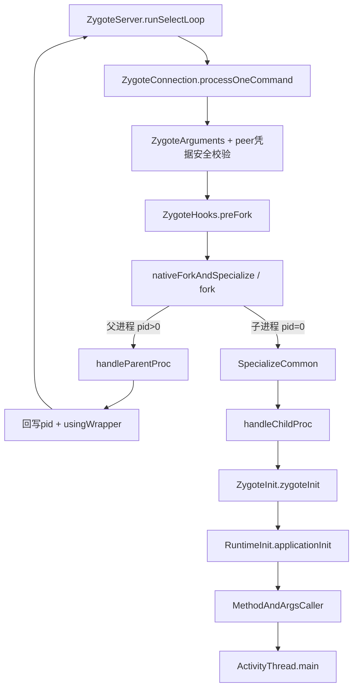

# 207 Android Zygote：命令解析、fork/specialize 与 RuntimeInit 入口

> 源码版本：Android 11 `android-11.0.0_r48`。  
> 当前在 Mac 上只读源码；本章所有进程、权限和时序结论来自 r48 源码，不声称在 macOS 上实际执行 Android fork。

## 1. 本章目标

上一章看到 ProcessList 把启动参数送入 Zygote，并接收 pid；本章进入 Zygote 内部，回答“一条 socket 命令怎样真的变成一个 App 主线程”。

读完应能解释：

- Zygote 怎样接收、解析并验证启动命令；
- 为什么每次普通 fork 前要停止后台线程；
- fork 后父子进程各走哪条分支；
- UID/GID、mount、seccomp、SELinux 等 specialize 顺序为何不能随意交换；
- RuntimeInit 怎样启动 Binder 线程池并最终调用 `ActivityThread.main()`；
- USAP 的“先 fork、后 specialize”与普通路径有什么差异。

## 2. 一句话主线

```text
Zygote监听socket
  → 解析并验证system_server请求
  → 暂停运行时后台线程
  → native fork
  → 父进程回pid并继续监听
  → 子进程切UID/GID、mount、seccomp、SELinux
  → RuntimeInit建立进程公共环境和Binder线程池
  → 反射调用ActivityThread.main
```

## 3. 总体父子分叉图



## 4. Zygote 不是每次从零启动虚拟机

Zygote 在开机时已启动 ART，预加载常用 framework 类、资源和 native library。App 子进程通过 fork 继承这些只读/尚未修改的页，随后才变成目标 UID 的应用进程。

因此它同时解决启动复用和统一安全专门化，但共享页不是“父子永远共享所有 Java 对象”。写时复制后，父子各有自己的修改结果。

## 5. Zygote main 的启动准备

`ZygoteInit.main()`解析自身 ABI、socket 名、是否启动 system_server、是否 lazy preload；按配置预加载并执行一次 GC/finalization，再初始化 native Zygote 状态和 ZygoteServer。

这属于 Zygote 自身生命周期，不是每个 App 启动都重复执行。

## 6. socket 文件描述符来自 init

ZygoteServer 调用 `createManagedSocketFromInitSocket()`，从 `ANDROID_SOCKET_<name>`环境变量取得 init 预先创建的 socket fd，再包装成 LocalServerSocket。

也就是说，Java Zygote 接管的是 init 配置好的监听端点，不是在任意路径随意创建一个公网 socket。

## 7. primary 与 secondary Zygote

不同 ABI 配置可有 primary/secondary Zygote，各自声明支持的 abiList。ZygoteProcess 根据目标 ABI 选择连接哪个 socket。

两个 Zygote 是不同进程/监听端，不能把一个 Zygote 内的对象或 Daemon 状态当成跨 ABI 全局单例。

## 8. runSelectLoop 是父进程长期循环

`ZygoteServer.runSelectLoop()`用 `Os.poll()`同时监听服务 socket、已接受的 session socket，以及启用 USAP 时的 event fd/报告 pipe。

父 Zygote 正常情况下无限循环；只有 fork 出来的子进程会从循环提前返回一个 Runnable。

## 9. 新连接与一条命令

监听 fd 可读时先 `acceptCommandPeer(abiList)`产生 ZygoteConnection；session fd 可读时调用：

```java
Runnable command = connection.processOneCommand(this);
```

同一连接可承载命令，EOF 后父进程才移除并关闭它。

## 10. socket framing 先读参数个数

线协议核心为：

```text
第一行：argc
随后argc行：每一项参数
```

`readArgumentList()`拒绝非整数 argc、过大的参数数目和中途 EOF；客户端也拒绝参数中嵌入换行/回车，避免破坏逐行 framing。

## 11. ZygoteArguments 不是简单 split

`new ZygoteArguments(args)`逐项识别 setuid/setgid/setgroups、runtime flags、targetSdk、seInfo、mount、ABI、nice name、package、数据隔离和剩余 RuntimeInit 参数。

关键参数禁止重复，例如两次 setuid、seInfo 或 targetSdk 会抛异常，减少“前一个检查、后一个执行”的参数注入歧义。

## 12. RemainingArgs 是下一阶段输入

Zygote 参数解析遇到 `--`或第一个非 Zygote option 后，把剩余部分保存为 `mRemainingArgs`。普通 App 典型语义为：

```text
android.app.ActivityThread
seq=<startSeq>
```

第一项是 RuntimeInit 要找的 main 类，后续 `seq=`继续交给 ActivityThread。

## 13. socket 不只处理 fork 命令

`processOneCommand()`还可处理查询 ABI/PID、boot completed、lazy preload、USAP 开关、hidden API exemption/采样等控制命令。

这些分支处理完直接回响应，不进入 fork。看到 Zygote socket 流量不应一律计成新 App 进程。

## 14. peer Credentials 是内核给出的身份

ZygoteConnection 构造时调用 `LocalSocket.getPeerCredentials()`，保存连接端 pid/uid/gid。后续安全策略以 peer 凭据为依据，而不是相信命令字符串自报“我是 system_server”。

这与上一章 attachApplication 使用 Binder callingUid 的思想相同：跨进程入口先取可信传输层身份。

## 15. capability 参数不能由普通启动请求指定

普通 `processOneCommand()`若解析到 permitted/effective capabilities 非零，直接抛 ZygoteSecurityException。

App 能力由 native 端按目标身份计算和安全策略决定，不能让 socket 调用者随意要求 CAP_SYS_ADMIN 等高权限。

## 16. UID/GID 安全策略

`applyUidSecurityPolicy()`限制 SYSTEM_UID 在正常模式不能请求低于 system UID 的目标 UID；未显式给 uid/gid 时继承 peer uid/gid。

它说明参数解析成功只是语法正确，仍必须结合发送者身份做语义授权。

## 17. invoke-with 的安全门

非 root peer 只有在目标 runtimeFlags 允许 JDWP/debuggable 时才可显式指定 wrapper；之后还可能从 `wrap.<niceName>`系统属性补出 invokeWith。

wrapper 会执行额外程序，改变 pid 返回和启动时间，必须比普通参数更严格。

## 18. 全局 debuggable 属性也会修正参数

`applyDebuggerSystemProperty()`在系统整体 debuggable 时给请求加 JDWP flag。

最终 runtimeFlags 是 ProcessList 输入与 Zygote 本地系统政策共同作用的结果，不应只看 socket 原始文本。

## 19. wrapper pipe 的用途

存在 invokeWith 时，ZygoteConnection 先建 pipe。wrapper 最外层子进程可能再 exec/fork 出真正 App，后者通过 pipe 报告 inner pid。

父 Zygote验证 inner pid 是直接 child 的后代后，才用它替换响应 pid，并返回 `usingWrapper=true`。

## 20. 为什么要显式管理 fd

fork 会复制调用进程的文件描述符表。若不处理，App 子进程可能继承 Zygote 服务 socket、其他 session socket、日志/统计 fd 或敏感文件，从而造成权限泄漏和生命周期引用泄漏。

因此 fd 处理不是性能细节，而是进程隔离正确性的组成部分。

## 21. fdsToClose 包含哪些关键 socket

Java 层把当前命令 connection fd 与 Zygote 服务监听 fd 放入 `fdsToClose`；native 端还加入 USAP pipe/socket、system_server socket 等不应留给普通子进程的 fd。

关闭不是依赖 Java GC，而是在子进程降低权限前由 native 路径确定性完成。

## 22. fdsToIgnore 不等于留给 App 使用

`fdsToIgnore`用于开放 fd 表一致性检查时忽略某些有意变化的描述符，例如 wrapper pipe；它与“子进程业务可合法使用”不是同一概念。

最终是否关闭、重开或保留还要结合 `fdsToClose`和 native FD table 处理。

## 23. fork 前第一步：停止运行时 Daemon

Java 入口 `Zygote.forkAndSpecialize()`先调用：

```java
ZygoteHooks.preFork();
```

其实现停止 Java Daemons，调用 ART `nativePreFork()`取得 token，再等待 `/proc/self/task`只剩一个线程。

## 24. 为什么多线程 fork 危险

POSIX fork 后子进程只保留发起 fork 的线程，其他线程消失，但它们当时持有的用户态锁、allocator 状态或 runtime 状态会被复制。

如果某把锁在 fork 瞬间由“消失的线程”持有，子进程可能永远无人解锁。因此 Zygote 要在可控的单线程点 fork。

## 25. “Zygote 永远单线程”是错误说法

Zygote 启动早期有禁止创建线程的窗口，预加载后会结束该限制；运行时 Daemon 也会存在。

正确说法是：普通每次 fork 前 `preFork()`停 Daemon并等待 OS 线程退出，fork 后父子通过 post-fork hook 恢复各自需要的运行时服务。

## 26. nativeForkAndSpecialize 的两段结构

JNI 层先计算 capabilities，整理必须 close/ignore 的 fd，然后：

```cpp
pid_t pid = ForkCommon(...);
if (pid == 0) {
    SpecializeCommon(...);
}
return pid;
```

`ForkCommon`负责安全 fork 现场；`SpecializeCommon`只在子进程把通用副本改造成目标身份。

## 27. ForkCommon 先处理信号

它安装 SIGCHLD 处理并在 fork 周围临时 block SIGCHLD，防止 signal handler 写日志时重新打开本应检查/关闭的 fd；fork 后父子再 unblock。

信号、日志 fd 和 fork 的顺序有关，不能把 signal mask 当作无关模板代码。

## 28. open FD table 做什么

第一次 fork 时创建当前开放 fd 的基线表，以后 fork 前 restat 检查是否发生非预期变化。子进程对剩余 fd 执行 reopen 或 detach，避免父子继续共享同一个 open file description 的状态。

这是“白名单/基线 + 每次复核”的资源泄漏防线。

## 29. fork 前清日志 fd 与 allocator 空闲页

native 路径关闭 Android log/stats socket，再执行 `mallopt(M_PURGE)`回收未使用 native 内存，减少 allocator 元数据在子进程写时造成的 private dirty 页。

前者服务 fd 一致性，后者服务 fork 后内存共享效率，目标不同。

## 30. fork 的返回值决定世界分裂

```text
pid < 0：fork失败
pid > 0：仍在父Zygote，值是child pid
pid == 0：已经在子进程
```

同一行 `fork()`后父子从相同程序计数点继续，却拥有不同返回值和逐步分离的地址空间。

## 31. 写时复制的准确含义

父子初始页表可指向相同物理页，只读时共享；任一方写入页面会触发 copy-on-write，获得自己的私有副本。

因此预加载越有共享价值，越应避免每个 App 启动后立刻改写大量继承对象；但“某个 Java 对象字段写一次就复制整个堆”也不准确，复制粒度由内存页等底层机制决定。

## 32. child 的 ForkCommon 清理

子进程先临时调高或调低 nice 以配合启动策略，执行 `PreApplicationInit()`标记 allocator 已成为 Zygote child；随后 detach 指定 fd、清 USAP table、重开或断开其余 fd，并恢复 fdsan error level。

此时还没进入 ActivityThread，也未执行 Application 代码。

## 33. parent 不执行 SpecializeCommon

父 Zygote只记录“Forked child process”，解开 SIGCHLD，然后从 native 返回正 pid。它继续保持 Zygote 的 UID、SELinux domain、监听 socket和预加载内存。

若父进程也执行 setuid 或切 SELinux，后续就无法安全孵化其他 App。

## 34. specialize 为什么必须紧接 fork

子进程刚复制自高权限 Zygote，拥有远超普通 App 的能力。它必须在运行 App main 和创建任意业务线程前完成 mount、groups、uid、seccomp、capabilities 与 SELinux 转换。

这是一个“高权限、极短、顺序敏感”的收敛窗口。

## 35. SpecializeCommon 先保留必要 capability

当目标 uid 非 root 时先设置 keep capabilities，再设置 inheritable 和丢弃 capability bounding set。

因为后面 `setresuid()`会改变权限；需要在降权前准备好最终能力集合，同时把不允许的能力从边界集中去掉。

## 36. mount namespace 要在失去权限前建立

`MountEmulatedStorage()`按 mount mode 建私有 mount namespace；需要时再隔离 App CE/DE 数据、JIT profile，并 bind mount Android/data/obb 可见目录。

mount/unshare 要求特权，所以必须早于 setuid。它建立的是进程看到的文件系统视图，不是 Java Context 的目录映射。

## 37. process group 也在 root 阶段创建

普通 child 且 Zygote仍是 root 时，native 为 uid/pid 建 process group，用于后续 cgroup/accounting/整组回收。

Framework 后面按 uid/pid 杀 process group，依赖启动阶段已有正确底层分组。

## 38. supplementary groups 与 rlimit

`SetGids()`设置附加组，`SetRLimits()`应用每个 `(resource, soft, hard)`元组。child Zygote 在未给 gids 时还会主动清掉父亲继承的 supplementary groups。

组和资源上限都应在业务线程启动前固定，避免不同线程观察到不同安全阶段。

## 39. native bridge 预初始化

若目标 instructionSet 需要 native bridge，且 bridge 尚未初始化，会在降权和进入最终代码前准备 app data dir 与 bridge 环境。

它服务跨 ISA native code，不等于普通 App 都经过模拟执行。

## 40. 先 setgid，再安装 seccomp，再 setuid

源码顺序为设置真实/有效/保存 GID，然后在仍拥有所需能力时安装目标 seccomp filter、设置调度策略，最后 `setresuid(uid, uid, uid)`。

注释明确 seccomp 必须在失去 CAP_SYS_ADMIN 前完成；随意调换会造成过滤器无法安装或 SELinux 转换受损。

## 41. seccomp 与 SELinux 不是一回事

seccomp 限制允许的 syscall 集；SELinux 按 domain/type 和对象标签做强制访问控制。普通 App 同时受 UID/GID、capability、seccomp、SELinux 和 mount namespace 多层约束。

任一层都不是其他层的简单替代品。

## 42. 调度组要在降权前设置

`SetSchedulerPolicy()`按 isTopApp 选择 top-app 或 default policy，并在失去写 cgroup/调度权限前设置。

这只是初始启动提示；AMS 后续 OomAdjuster 仍会随组件状态更新 sched group 和 adj。

## 43. setresuid 是关键降权点

```cpp
setresuid(uid, uid, uid)
```

把 real/effective/saved UID 都改为目标 UID，避免 App 之后借 saved UID 恢复 Zygote root 身份。

降权之后的代码必须按普通 App 权限可执行来设计。

## 44. dumpable 与调试标志

UID/GID 改变可能重置进程 dumpable；native 根据平台环境、JDWP 和 profileable flag 再建立目标调试/采样行为，并控制 core dump。

debuggable 是受启动策略约束的进程属性，不是 App 任意调用一个 API 就能获得的 root 调试能力。

## 45. 内存调试策略也在这里消费

SpecializeCommon 从 runtimeFlags 取 memory tagging level 与 GWP-ASan level，通过 allocator 控制接口设置，再清除已消费的 bit，避免把 native 专用位作为未知 ART flag继续传递。

这说明同一个 runtimeFlags 可能由 native 和 ART 分层消费。

## 46. 最终 capability 集

完成 UID 切换后，代码写 permitted/effective/inheritable capability。普通应用通常不会因此获得广泛 root capability，特殊系统 UID/组按受控规则计算需要的位。

capability 不是 Manifest permission 的同义词。

## 47. SELinux domain 转换

native 调用：

```cpp
selinux_android_setcontext(uid, isSystemServer,
                           seInfo, niceName)
```

将子进程从 Zygote domain 切到目标 App domain。失败走 fatal error，不能在旧高权限 domain 下“凑合启动”。

## 48. 进程和主线程名称

niceName 存在时设置 native 主线程名称/日志默认 tag；Java child 路径稍后还调用 `Zygote.setAppProcessName()`设置 argv0 等可观测名称。

`ps`中名字、Linux comm 和 packageName 相关但不必逐字符相同。

## 49. child 信号与 ART post-fork hook

SpecializeCommon 恢复子进程 SIGCHLD 默认处理，调用 `ZygoteHooks.postForkChild(runtimeFlags, ...)`让 ART 应用 child runtime flags、native bridge 等 post-fork 状态，并重新播种 Math random seed。

父 Zygote 不执行 child 专用 hook。

## 50. postForkCommon 父子都执行

native 返回 Java 后，`forkAndSpecialize()`在父和子都把 Java thread priority 设为正常值，再调用：

```java
ZygoteHooks.postForkCommon();
```

它通知 ART fork 已结束并启动 post-Zygote Daemons。父需要恢复服务下一次请求，子需要建立自己独立的运行时后台线程。

## 51. 父分支怎样回应 system_server

`processOneCommand()`看到 pid 非零，关闭 child pipe，调用 `handleParentProc()`：设置 child process group关系，必要时等待 wrapper inner pid，然后向 socket写 int pid 和 boolean usingWrapper。

之后父路径返回 null，runSelectLoop继续监听下一条命令。

## 52. fork 失败如何传播

pid 小于零也进入 parent handler，由响应把失败值送回 ZygoteProcess；客户端把负 pid 转成启动异常，ProcessList再执行第206章的 pending-start失败清理。

失败不会返回一个“半合法 ProcessRecord完成态”。

## 53. child 为什么要关闭 ZygoteServer

pid 为零时，child 设置 `mIsForkChild`，关闭 server socket和父端 wrapper pipe，再进入 `handleChildProc()`关闭当前 command LocalSocket包装对象。

否则 App 继续持有监听 fd，会让 socket生命周期、权限边界和服务可用性都出错。

## 54. runSelectLoop 返回 Runnable 的意义

child 的 `processOneCommand()`返回主类 Runnable，runSelectLoop发现 `mIsForkChild`后立即 return；`ZygoteInit.main()`的 finally 关闭 server资源，最后才执行 `caller.run()`。

这种 trampoline 先退掉 Zygote 命令处理栈，再进入 App main，异常栈和进程入口更干净。

## 55. wrapper 分支不走普通 zygoteInit

若 mInvokeWith 非空，child 调 `WrapperInit.execApplication()`执行 wrapper并传递 remaining args；正常情况下该方法不会返回。

因此普通 `ZygoteInit.zygoteInit → RuntimeInit`顺序不能原样套在调试 wrapper 外壳上，真正 App 入口会在 exec 后的新映像/内层进程继续。

## 56. 普通 child 进入 ZygoteInit.zygoteInit

无 wrapper、非 child Zygote 时：

```java
return ZygoteInit.zygoteInit(
        targetSdkVersion,
        disabledCompatChanges,
        remainingArgs,
        null);
```

它返回的是最终 main Runnable，而不是在 handleChildProc 深层立即调用 ActivityThread.main。

## 57. redirectLogStreams

`zygoteInit()`先把 System.out/System.err 重定向到 Android log。App 后续标准输出不会继续沿用 Zygote 启动终端的传统 fd 语义。

这发生在自定义 Application 和 Activity 之前。

## 58. RuntimeInit.commonInit

它安装未捕获异常预处理/默认处理器、Android 时区 supplier、java.util.logging 配置、默认 HTTP User-Agent、TrafficStats socket tagger，并按属性处理模拟器 trace。

这是每个普通 App 子进程公共运行环境，不是 `Application.onCreate()`的工作。

## 59. nativeZygoteInit 启动 Binder 线程池

`ZygoteInit.nativeZygoteInit()`进入 `AndroidRuntime::onZygoteInit()`；app_process 的 AppRuntime 实现调用：

```cpp
ProcessState::self()->startThreadPool();
```

因此 App 能在 ActivityThread主 Looper启动前接收 Binder 调用。上一章的 ApplicationThread.attach 正依赖这个 Binder 基础设施。

## 60. applicationInit 固定进程运行语义

RuntimeInit 设置 `exitWithoutCleanup=true`，写入 VM targetSdk 和 disabled compat changes，再解析 remaining args。

Android App 调 `System.exit()`不走传统完整 shutdown hook清理；Binder和其他线程环境不适合按普通桌面 Java 程序优雅关闭模型处理。

## 61. findStaticMain 做什么

它用 `Class.forName(className, true, classLoader)`加载并初始化入口类，反射查找 public static `main(String[])`，最后返回 `MethodAndArgsCaller`。

对普通 App，className 就是 `android.app.ActivityThread`；`seq=N`成为其 main 参数。

## 62. 入口类初始化与 main 调用是两个点

`Class.forName(..., true, ...)`已触发 ActivityThread 类初始化；真正 `main()`直到外层执行 `caller.run()`才由反射调用。

“找到 main 方法”和“main 已经运行”仍是两个完成边界。

## 63. ActivityThread.main 接回第206章

Runnable 最终调用 ActivityThread.main，它准备主 Looper、解析 `seq=`、创建 ActivityThread，并通过 `attachApplication(mAppThread, startSeq)`向 AMS 主动报到，然后进入 `Looper.loop()`。

至此 Zygote 数据面与 AMS 启动账本闭环。

## 64. Binder线程与主线程谁先存在

nativeZygoteInit 已启动 Binder线程池；ActivityThread.main 随后在 fork 保留下来的当前线程上准备 main Looper。

所以 App 进程既有 Binder入站线程，也有组件主线程；`bindApplication()`先在前者收到，再用 Handler切后者，正是第205章的线程模型。

## 65. USAP 的核心不同点

USAP pool refill 时，ZygoteServer 调一次 `ZygoteHooks.preFork()`，在单线程窗口连续 `forkUsap()`补足池，再由父 Zygote `postForkCommon()`恢复 Daemon。

池中 child 先进入 `usapMain()`等待目标请求，此时还没有具体 App UID、seInfo 或 ActivityThread。

## 66. USAP 收到请求后不再 fork

USAP accept 专用 socket，解析并 `validateUsapCommand()`，取得 peer credentials，向 system_server回自己的既有 pid并报告池状态，然后调用 `specializeAppProcess()`。

该方法只走 `nativeSpecializeAppProcess → SpecializeCommon`，不调用 `fork()`；最后同样进入 `ZygoteInit.zygoteInit()`。

## 67. USAP 为什么仍然安全校验

“进程已经预建”不代表任何调用者都可决定它变成谁。USAP仍按 peer应用 UID policy、调试属性，并限制不支持的命令/wrapper能力；specialize期间阻塞 SIGTERM，避免池清空与身份转换竞态。

安全边界没有因优化而删除，只是 fork 时间提前。

## 68. USAP pid 的完成语义

USAP 回 pid 时进程已存在，但 specialize 和 RuntimeInit可能仍在继续；普通路径回 pid 时 child同样可能尚未 attach。

两者都只能证明“目标启动已获得一个 pid”，不能证明 `ActivityThread.attach`、bindApplication或首帧完成。

## 69. child Zygote 是另一种入口

若 `--start-child-zygote`，参数必须包含 child socket name；child 分支调用 `childZygoteInit()`，刻意跳过普通 `nativeZygoteInit()`启动 Binder thread pool的路径，进入新的 Zygote main。

App Zygote/WebView Zygote 是孵化者，不应当按普通最终 App 进程理解。

## 70. 五层安全收敛

```text
socket peer UID/GID授权
  → 参数语法与重复项检查
  → fork fd/信号/线程安全
  → UID/GID/capability/seccomp/mount/SELinux specialize
  → App attach时Binder callingUid/pid/startSeq再校验
```

Android 不把进程安全寄托在单一检查点。

## 71. 常见误解一：fork 后才加载全部 framework

大量 framework 类和资源已由 Zygote预加载并通过 COW共享；child仍需加载应用自身类、按需类和私有资源。

“完全不加载”和“全部重新加载”都不准确。

## 72. 常见误解二：specialize 只是 setuid

实际还包括 mount namespace、App数据/JIT profile隔离、groups、rlimit、process group、native bridge、seccomp、scheduler、dumpable、allocator安全模式、capability、SELinux和ART hook。

setuid只是多层沙箱中的一个关键步骤。

## 73. 常见误解三：Zygote 父进程也进入 App main

父进程从 `processOneCommand()`得到 null并继续 select loop；只有 child拿到非空 Runnable并执行入口类。

同一 Java源码在 fork 返回值处分流，不能只看调用栈文本就忽略当前 pid 所在分支。

## 74. 启动性能怎样分段

- socket排队/解析：ZygoteServer与command connection；
- preFork：Daemon停止、ART线程收敛；
- ForkCommon：fd检查、malloc purge、fork；
- SpecializeCommon：mount、身份、安全策略；
- RuntimeInit：公共Java环境、Binder pool、类入口；
- ActivityThread后：attach、bindApplication和组件启动。

USAP主要提前消化 preFork/fork部分，不能消除所有后续成本。

## 75. 异常边界

父 Zygote的 pre-fork命令异常会记录并关闭该 session socket，继续服务其他连接；child在 post-fork、进入 main 前异常会记录后抛出，让该子进程退出。

区分父/子异常非常重要：不能因为一个 App specialize失败就让父 Zygote带着错误身份继续运行。

## 76. Mac 只读练习一：画父子分支

```bash
sed -n '110,290p' \
  frameworks/base/core/java/com/android/internal/os/ZygoteConnection.java
```

在 `pid == 0`处画竖线：左边列 child关闭哪些资源、返回什么；右边列 parent回写什么、为何返回 null。

## 77. Mac 只读练习二：核对 specialize 顺序

```bash
sed -n '1603,1815p' \
  frameworks/base/core/jni/com_android_internal_os_Zygote.cpp
```

把 mount、setgroups、setgid、seccomp、scheduler、setuid、capability、SELinux、postForkChild 按源码排序，并为每个“必须在降权前”的步骤写原因。

## 78. Mac 只读练习三：追到 ActivityThread.main

```bash
sed -n '985,1020p' \
  frameworks/base/core/java/com/android/internal/os/ZygoteInit.java

sed -n '390,430p' \
  frameworks/base/core/java/com/android/internal/os/RuntimeInit.java

sed -n '345,385p' \
  frameworks/base/core/java/com/android/internal/os/RuntimeInit.java
```

依次找到 commonInit、nativeZygoteInit、applicationInit、findStaticMain和MethodAndArgsCaller，再接第206章 ActivityThread.main解析seq。

## 79. 自测题

1. 为什么普通 Zygote fork 前必须让线程收敛？
2. fdsToClose 与 fdsToIgnore 有什么区别？
3. `forkAndSpecialize()`中哪些逻辑只在 child执行？
4. 为什么 mount、seccomp和scheduler设置要早于 setuid？
5. `postForkChild`与`postForkCommon`分别在哪些进程执行？
6. Binder线程池在哪个源码入口启动？
7. USAP收到目标请求时为什么不再 fork？
8. Zygote返回 pid为什么仍不等于 Application已创建？

## 80. 本章结论

Zygote 把一个经过预加载的高权限模板进程安全地转化成普通 App：socket协议先用 peer凭据和参数规则控制请求，preFork建立单线程安全点，ForkCommon管理信号、fd与COW现场，SpecializeCommon按严格顺序完成 mount、身份、seccomp、capability和SELinux降权，RuntimeInit再安装进程公共Java环境、Binder线程池并反射进入 ActivityThread.main。

普通路径和 USAP 最终汇合在同一思想上：

```text
模板进程只负责提供可复用起点；
每个child必须在执行应用代码前完成不可跳过的安全专门化；
父Zygote与App child从fork返回起就是两个独立状态机；
拿到pid只是启动中间态，不是应用就绪或首帧完成。
```

下一章进入 `ActivityThread.main()`和主 Looper 建立过程，解释主线程为什么既能同步 attach AMS，又能在 Binder线程提前接收请求，以及 Handler消息怎样决定首批进程初始化顺序。
