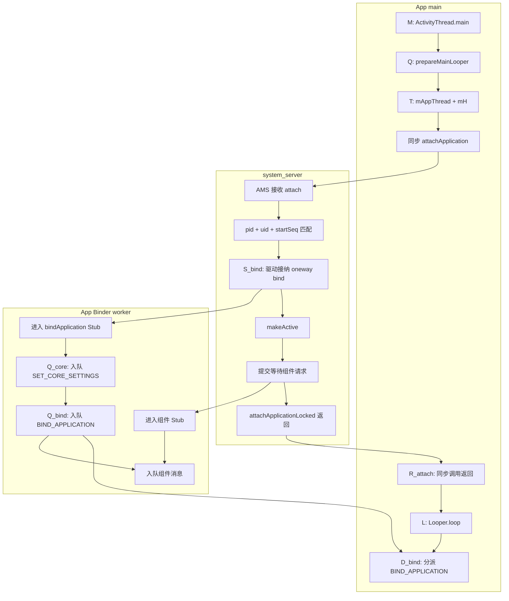

# 208 Android ActivityThread.main：主 Looper、Binder 线程池与首批消息顺序

> 源码基线：Android 11 / API 30 / `android-11.0.0_r48`。
>
> 当前环境只有源码快照，可以证明 Java 程序顺序、AIDL 调用属性、Binder 回调入口与 MessageQueue 排序条件；不能仅凭源码断言某台设备上 Binder worker 与 App 主线程谁先获得 CPU，也不能把一次 `sendMessage()` 当成回调已经执行。

第 207 章把固定普通 App 进程 `P_B` 送到了 `ActivityThread.main(seq=410)` 的入口点 M0，并特别留下一个边界：`ProcessState::startThreadPool()` 已经被调用，不等于首个 Binder worker 已经进入驱动等待。本章从 M0 继续；为让图表短一些，下文把同一个点简记为 `M`，再追主 MessageQueue、`ApplicationThread` Binder 端点、同步 attach 与首批主线程消息怎样汇合。

本章只追一个问题：**`P_B` 的主线程已经调用 `attachApplication()`，system_server 也已经提交 `bindApplication()`；为什么 `attachApplication()` 可以先返回，也可以先看到 App Binder 线程入队，而无论哪种调度，`handleBindApplication()` 都只能在主 Looper 开始后执行？正常启动路径中，core settings、bind 与首个组件事务又靠哪些有条件的顺序组成初始化门槛？**

## 1. 固定 P_B，并把“首批消息”拆成十个完成点

沿用前两章的同一进程，先冻结主线条件：

| 维度 | 固定值或前提 |
|---|---|
| 包与进程 | `com.example.reader`，记作 `P_B` |
| pid 与启动尝试 | `pid=24680`，关联 token `startSeq=410` |
| 入口 | 普通 Zygote child 已反射进入 `ActivityThread.main()` |
| App 类型 | 普通非 isolated、非 system 进程 |
| 服务端模式 | `normalMode=true`，普通成功 attach 路径 |
| 调试分支 | 非 debuggable，没有 profiler agent 或 startup agent |
| 启动原因 | system_server 中至少有一个等待此进程的 Activity |
| 故障现象 | attach 已发起，但尚未观察到 `Application.onCreate()` |

这些限定很重要。debuggable App 可能在 bind 前收到 agent 消息；isolated entry point 根本不发送普通 `BIND_APPLICATION`；Provider、Service、Receiver 或 Backup 也可能是进程的启动原因。它们都在第 15 节单列，不能偷偷混入固定主线。

把常被压成一句“App attach 完成”的过程拆成十个点：

| 点 | 精确定义 | 仍不能推出 |
|---|---|---|
| `M` | 已进入 `ActivityThread.main()` | 主 MessageQueue 已存在 |
| `Q` | `Looper.prepareMainLooper()` 已返回 | 主线程正在取消息 |
| `T` | `new ActivityThread()` 已返回，`mAppThread/mLooper/mH` 已建立 | AMS 已取得 Binder 端点 |
| `S_bind` | Binder 驱动已接纳 system_server 发出的 bind oneway transaction，可向目标交付 | App 侧 Stub 方法已开始，或发送端 Java 代理调用已返回 |
| `Q_core` | App Binder 回调已把 `H.SET_CORE_SETTINGS` 放入 `mH` 队列 | core settings 已应用 |
| `Q_bind` | 同一回调已把 `H.BIND_APPLICATION` 放入队列 | `handleBindApplication()` 已开始 |
| `R_attach` | App 主线程的同步 `attachApplication()` 调用已返回 | `Q_core` 或 `Q_bind` 已发生 |
| `L` | App 主线程已经进入 `Looper.loop()` | bind 消息已经到队首 |
| `D_bind` | `H` 开始分派 `BIND_APPLICATION` | Application/Provider 初始化已完成 |
| `F_bind` | `handleBindApplication()` 正常返回 | 首个 Activity 已创建或首帧已提交 |

固定普通路径中可以先写出这些必然边：

```text
M → Q → T → App发起同步attach
S_bind → system_server提交等待组件 → R_attach → L
S_bind → App Binder回调 → Q_core → Q_bind
Q_bind 与 L 都成立 → D_bind → F_bind
```

最容易画错的是 `Q_bind` 与 `R_attach`：二者有共同原因 `S_bind`，却没有彼此之间的必然先后。Binder worker 快时，消息先入队、主线程仍在等 attach；主线程先拿到同步回复时，也可以先进入 `Looper.loop()`，再由稍后就绪的 Binder worker 入队并唤醒它。

这些符号与相邻章节共用同一证据边界：本章的 `M` 就是第 207 章 M0；`S_bind` 对应第 205 章 S0 的驱动接纳边界；ServiceManager cache direct work 加上 `Q_core/Q_bind`，合起来对应第 205 章 Q0；`F_bind` 对应第 205 章 B1。

## 2. 三个相似名字、四条执行流与四本账

`ActivityThread`、`ApplicationThread` 与 App 主线程不是三个同义词：

| 名称 | 本质 | 创建或运行位置 | 主要职责 |
|---|---|---|---|
| App 主线程 | Zygote child 继承下来的 Java/Linux 线程 | 执行 `ActivityThread.main()` | 建立主 Looper，之后串行执行组件与 UI 工作 |
| `ActivityThread` | 普通 Java 总管对象，不继承 `Thread` | 由 App 主线程构造 | 保存包、资源、组件、`mH` 与客户端状态 |
| `ApplicationThread` | `IApplicationThread.Stub` 的私有内部类实例 | 作为 `ActivityThread.mAppThread` 字段构造 | 接收 system_server 对 App 控制面的 Binder 调用 |
| `H` | 绑定主 Looper 的 `Handler` | 作为 `ActivityThread.mH` 字段构造 | 把 bind、组件、配置等消息分派到主线程 handle 方法 |

实际时序至少有四条执行流：

1. App 主线程从 M 走到同步 attach，返回后进入主循环；
2. App Binder pool 的 worker 执行 `ApplicationThread` Stub 方法；
3. system_server 的 Binder 线程接收 App 发来的同步 attach；
4. system_server 内部的 AMS、ATMS、ActiveServices 等对象在服务端调用链中提交反向控制事务。

分析日志时还要分开四本账：

| 账本 | 典型事件 | 完成语义 |
|---|---|---|
| 服务端提交账 | `thread.bindApplication()`、`scheduleTransaction()` 返回 | oneway 事务已提交，不等客户端完成 |
| App Binder 接收账 | Stub 方法进入、参数解包、`preExecute()` | Binder worker 已处理到某一步 |
| 主队列账 | `mH.sendMessage()`、`MessageQueue.enqueueMessage()` | Message 已进入队列，不等于已分派 |
| 主线程执行账 | `H.handleMessage()`、`handleBindApplication()` | 组件环境正在建立或已经建立 |

“Binder 可达”“消息已排队”“主线程已开始执行”“Application 已 ready”分别属于四个完成点。把它们写成一条日志文案，是冷启动误判的主要来源。

## 3. M 之前：Binder pool 的启动调用早于 main，worker 就绪却是并发事件

第 207 章已经核出的普通 child 调用链是：

```text
ZygoteInit.zygoteInit
  → RuntimeInit.commonInit
  → ZygoteInit.nativeZygoteInit
  → AndroidRuntime::onZygoteInit
  → ProcessState::startThreadPool
  → spawnPooledThread(true)
  → RuntimeInit.applicationInit 返回入口 Runnable
  → MethodAndArgsCaller.run
  → ActivityThread.main
```

`ProcessState::startThreadPool()` 在锁内把 `mThreadPoolStarted` 置为 true，并调用 `spawnPooledThread(true)`；后者构造 `PoolThread` 并调用 `Thread::run()`。新线程真正运行时，`PoolThread::threadLoop()` 才进入 `IPCThreadState::joinThreadPool(mIsMain)`。

因此进入 M 时可以确定：

- pool 启动调用已执行并返回；
- 首个用户态 Binder 线程的创建已经被请求；
- JVM 已在调用静态 `main()` 前完成 `ActivityThread` 类初始化，但 `ActivityThread` 实例及其 `mAppThread` 字段尚未构造。

但 M 不能证明：

- worker 已获得 CPU；
- worker 已经执行到 `joinThreadPool()`；
- 驱动里已经有空闲接收线程；
- system_server 已经拿到 `IApplicationThread`。

这不会破坏协议。如果 system_server 的反向事务先到，事务可以等待可用 worker；如果 worker 先就绪，它就在 Binder 驱动中等待。主 Looper 不负责接收 Binder transaction，所以“尚未 `Looper.loop()`”也不等于“反向 Binder 一定无法到达”。

同理，增加 Binder pool 线程数不会让 `Application.onCreate()` 并行执行。pool 只推进接收账；用户组件仍要经过 `mH` 汇入单一主线程执行账。

## 4. `ActivityThread.main()` 的本地程序顺序

M 之后，r48 的 `main()` 按以下顺序执行：

```java
Trace.traceBegin(Trace.TRACE_TAG_ACTIVITY_MANAGER, "ActivityThreadMain");
AndroidOs.install();
CloseGuard.setEnabled(false);
Environment.initForCurrentUser();
TrustedCertificateStore.setDefaultUserDirectory(configDir);
initializeMainlineModules();
Process.setArgV0("<pre-initialized>");
Looper.prepareMainLooper();
// 从 args 尾部寻找 seq=
ActivityThread thread = new ActivityThread();
thread.attach(false, startSeq);
if (sMainThreadHandler == null) {
    sMainThreadHandler = thread.getHandler();
}
Trace.traceEnd(Trace.TRACE_TAG_ACTIVITY_MANAGER);
Looper.loop();
```

这段入口可以切成五段：

| 段 | 主要工作 | App 自定义代码是否已运行 |
|---|---|---|
| 进程公共准备 | syscall interception、CloseGuard、用户 Environment、证书目录、Mainline 初始化 | 否 |
| 临时标识 | argv0 设为 `<pre-initialized>` | 否 |
| 消息基础设施 | 建立主 Looper/MessageQueue | 否 |
| 控制面 attach | 构造 `ActivityThread`，同步调用 AMS | 否 |
| 消费循环 | `Looper.loop()` 取消息并分派 | 要等具体 Message |

`startSeq` 在 `prepareMainLooper()` 之后从参数尾部扫描，默认值为 0；固定主线取到 410，再传给 `attach(false, 410)`。它是 system_server 分配并写入 pending start 的启动尝试关联 token：AMS 用它联合 pid、calling UID、`startUid` 与 `ProcessRecord.startSeq` 识别本次启动，也用 pending 表承接“child attach 早于异步 Zygote start result 入账”的竞态。它不是 Handler 的序号，也不决定首批 Message 的 `what` 或 `when`。

`<pre-initialized>` 也不是最终进程名。普通 bind 真正执行到 `handleBindApplication()` 后，才用 `data.processName` 更新 `Process.setArgV0()` 与 DDM 名称。看到临时名字只能说明进程尚未走完绑定，不能单凭它定位在 Binder 还是主队列哪一段。

`ActivityThreadMain` trace 在 `Looper.loop()` 之前结束，所以它覆盖入口公共准备和同步 attach，却不覆盖后续无限消息循环。拿它的结束时间当作 `Application.onCreate()` 完成时间，边界会整段错位。

## 5. Q：`prepareMainLooper()` 建的是可入队容器，不是正在消费的线程

`Looper.prepareMainLooper()` 先调用 `prepare(false)`：

```java
private static void prepare(boolean quitAllowed) {
    if (sThreadLocal.get() != null) {
        throw new RuntimeException("Only one Looper may be created per thread");
    }
    sThreadLocal.set(new Looper(quitAllowed));
}
```

新 `Looper` 构造时创建 `MessageQueue`，并记录 `Thread.currentThread()`；随后 `prepareMainLooper()` 把同一个对象发布到静态 `sMainLooper`。`quitAllowed=false` 表示这条核心队列不按普通工作线程方式退出。

Q 只建立了三条事实：

1. 当前 App 主线程的 ThreadLocal 已有一个 Looper；
2. 这个 Looper 已持有 MessageQueue；
3. 其他代码以后可以取得 main Looper，并把 Handler 绑定到它。

Q 没有执行 `queue.next()`。真正的消费者要等 L，也就是 `Looper.loop()` 进入无限循环。Q 与 L 之间存在一个刻意保留的窗口：Handler 已能接受跨线程消息，主线程却还可以完成同步 attach 等启动工作。

当队列尚未开始 loop 时，入队消息会保存在链表中；当 loop 已经阻塞在 native poll 时，`enqueueMessage()` 会在需要时调用 `nativeWake()`。因此下面两种调度都正常：

```text
消息先入队 → 主线程稍后loop → 第一次next直接取得
主线程先loop并阻塞 → Binder线程稍后入队 → nativeWake唤醒
```

“prepare 以后消息立刻执行”与“必须先 loop 才能 sendMessage”都是错误模型。

## 6. T：字段初始化把 Binder 端点与主 Handler 接到同一个 `ActivityThread`

`new ActivityThread()` 的相关实例字段按源码声明顺序初始化；这里只摘出与本章有关的相对次序，中间及后面仍有其他实例字段：

```java
final ApplicationThread mAppThread = new ApplicationThread();
final Looper mLooper = Looper.myLooper();
final H mH = new H();
final Executor mExecutor = new HandlerExecutor(mH);
```

所有实例字段初始化完成后，才执行构造器体，把 `mResourcesManager` 指向 `ResourcesManager.getInstance()`。这四个相关字段各有不同角色：

| 字段 | 绑定对象 | 谁主要使用 |
|---|---|---|
| `mAppThread` | 当前 `ActivityThread` 的 Binder Stub | system_server 反向调用，App Binder worker 执行入口 |
| `mLooper` | 构造当前线程的 ThreadLocal Looper | `ActivityThread` 保存主循环引用 |
| `mH` | 默认同步 Handler，隐式绑定 `Looper.myLooper()` | Binder worker 与其他生产者入队，App 主线程分派 |
| `mExecutor` | 以 `mH` 为后端的 `HandlerExecutor` | 把部分任务统一送到主线程 |

这解释了为什么 Q 必须早于 T。r48 的无参 `Handler()` 最终读取 `Looper.myLooper()`；若为空便抛出“当前线程尚未调用 Looper.prepare”的异常。`mH` 不是等到 attach 后才绑定，也不是看到第一条消息后才选择线程。

静态 `sMainThreadHandler` 是另一件事。`main()` 要在 `thread.attach()` 返回后才执行：

```java
if (sMainThreadHandler == null) {
    sMainThreadHandler = thread.getHandler();
}
```

Binder 回调在这之前已经可以直接使用实例字段 `mH`。所以 `sMainThreadHandler == null` 不能推出“bind 无法入队”；它只是进程级静态便捷取用点尚未发布。

T 同样不代表 Binder 回调一定已可执行。system_server 还没有从同步 attach 参数中取得 `mAppThread`，pool worker 也可能尚未进入驱动。对象存在、端点已传出、事务已提交、Stub 已执行仍是四个点。

## 7. App 侧 `attach(false, startSeq)`：先交出端点，再阻塞等待同步回复

`attach()` 进入后先无条件设置 `sCurrentActivityThread=this` 与 `mSystemThread=system`；固定普通分支的 `system=false`，随后设置 DDM 临时名称：

```text
sCurrentActivityThread = this
mSystemThread = system  // 固定主线为false
DDM app name = <pre-initialized>
```

随后 `RuntimeInit.setApplicationObject(mAppThread.asBinder())` 保存用于 VM/进程错误上报的应用标识。它不是把端点发送给 AMS；真正跨进程交付发生在下一步：

```java
final IActivityManager mgr = ActivityManager.getService();
mgr.attachApplication(mAppThread, startSeq);
```

`IActivityManager.aidl` 的 `attachApplication` 没有 `oneway`，因此这是同步 Binder 调用。App 主线程提交请求后，要等 system_server 的 Stub 方法返回或抛出远端异常。等待期间它尚未走到 L，不能执行 `H.handleMessage()`。

主线程被同步调用占住，不等于整个进程只有一条可运行线程。第 3 节的 Binder worker 可以并行接收 system_server 对 `mAppThread` 的反向 oneway 调用，完成参数解包、少量接收侧工作和 `mH` 入队。于是形成一条很容易误认成“同步递归回调”的结构：

```text
App main ──同步attach──▶ system_server
App Binder worker ◀──异步IApplicationThread── system_server
App Binder worker ──enqueue──▶ App main MessageQueue
```

它不是在 App 主线程栈上直接重入 `handleBindApplication()`。真正业务回调仍要等同步 attach 返回、`main()` 完成余下语句并进入 L。

同步调用返回后，`attach()` 还会注册 Binder GC watcher 与 `ViewRootImpl.ConfigChangedCallback`；`main()` 再发布 `sMainThreadHandler`、结束 trace，最后进入 `Looper.loop()`。因此严格的 App 主线程本地顺序是：

```text
R_attach
  → 注册GC watcher
  → 注册全局配置回调
  → attach返回
  → 发布sMainThreadHandler
  → ActivityThreadMain trace结束
  → L
```

## 8. system_server 侧 attach：先核对代际，再提交 bind 与等待组件

AMS 的 `attachApplication()` 从 Binder 取得 calling pid/UID，清理调用身份，并在 AMS 锁内调用 `attachApplicationLocked(thread, pid, uid, startSeq)`。固定 `P_B` 要先通过三元匹配：

```text
pid = 24680
callingUid = 10123
startSeq = 410
```

如果 pid 表里的记录属于另一 UID 或启动代际，AMS 会清理冲突记录；若仍找不到合法 pending/current `ProcessRecord`，会杀掉进程或异步要求它退出。外层 AIDL 方法返回 `void`，也没有把内部 boolean 结果作为“App 已绑定完成”的回执交给客户端。

固定普通成功路径的服务端程序顺序可压成：

```text
匹配ProcessRecord与启动代际
  → linkToDeath并准备配置/Provider/Profiler参数
  → S_bind：Binder驱动接纳thread.bindApplication(...)的oneway事务
  → app.makeActive(thread, ...)
  → 更新LRU与进程账本
  → ATMS检查等待Activity并提交ClientTransaction
  → ActiveServices检查等待Service
  → 检查pending Broadcast与Backup
  → 必要时更新OOM adj并记录PROCESS_START_TIME
  → 返回同步attach
```

`app.makeActive()` 把 `IApplicationThread` 接入 `ProcessRecord`、WindowProcessController 与 process stats 等服务端账本。源码把它放在 bind 提交之后，是为了让后续控制请求排在初始化请求之后；它不等待 App 主线程执行 `handleBindApplication()`，更不证明 `Application.onCreate()` 已返回。

同样，`bindApplicationTimeMillis` 在 `preBindApplication()` 与 bind IPC 之前取样，但 r48 不能把相关相减结果不加检查地称为纯阶段时长：`ProcessList.startProcessLocked()` 用 `SystemClock.uptimeMillis()` 写入 `app.startTime`，这里却用 `SystemClock.elapsedRealtime()` 取得 bind 与 attach 结束样本，而 atom 注释又把 `process_start_time_millis` 定义成 elapsed realtime 起点。源码最终逐字写入 `app.startTime`、`bindApplicationTimeMillis - app.startTime` 与 `elapsedRealtime() - app.startTime`；设备经历 deep sleep 时，两种时基差值会混入结果。无论如何，这几个服务端表达式都没有等待客户端 bind dispatch，不能当作 `handleBindApplication()` wall time。

固定条件排除了两个 bind 前分支：profile agent 可触发 `thread.attachAgent()`，debuggable App 可触发 `thread.attachStartupAgents()`；这两者都会先向 `mH` 排 agent 消息。还要排除 `isolatedEntryPoint`，因为它发送 `runIsolatedEntryPoint()` 而不是普通 `bindApplication()`。

## 9. 核心偏序：`Q_bind` 与 `R_attach` 无全序，dispatch 却有双前提

把三条泳道放在一张偏序图中：



图中故意没有 `Q_bind → R_attach` 或 `R_attach → Q_bind`。两种合法调度分别是：

```text
调度A：S_bind → Binder worker运行 → Q_core → Q_bind → R_attach → L → D_bind
调度B：S_bind → R_attach → L并阻塞 → Binder worker运行 → Q_core → Q_bind → 唤醒 → D_bind
```

第二种调度不违反“服务端先 bind 后组件”。`S_bind` 是驱动接纳 oneway transaction 的因果点；接收端只有在此后才可能进入 Stub。发送端 Java 代理也要在驱动交互后才能返回，但接收 Stub 可以与代理返回并发，二者没有固定先后。`Q_bind` 则要等目标进程真正运行 Stub 并成功入队；异步接纳与目标执行之间本来就允许延迟。

`D_bind` 则有两个独立前提：消息已经到达队列 `Q_bind`，消费者也已经进入 L。任一缺失都不能 dispatch。这个“join 点”比一条看似顺滑的 sequence diagram 更准确：

```text
Q_bind ─┐
        ├─▶ D_bind
L ──────┘
```

固定主线上，App 主线程在 `R_attach` 前不能执行 `H` 消息，所以服务端 attach 内部工作会先于 `D_bind` 完成；但 Binder 接收侧的 direct work 与入队可以和服务端后半段并发。

## 10. `ApplicationThread.bindApplication()` 的真实首批顺序

`IApplicationThread.aidl` 把整个接口声明为 `oneway interface`。跨进程调用时，`ApplicationThread.bindApplication()` 的方法体由 App Binder 基础设施分派，不在 App 主线程执行。

r48 方法体有三段，顺序不能缩成“收到 bind 后 post 一个 BIND”：

```text
若 services 非空：ServiceManager.initServiceCache(services)
  → setCoreSettings(coreSettings)
  → 构造并填充 AppBindData
  → sendMessage(H.BIND_APPLICATION, data)
```

第一段直接在 Binder worker 上初始化常用 Binder service cache，没有经过 `mH`。第二段名字具有迷惑性：这里解析到的是内部类 `ApplicationThread.setCoreSettings()`，它执行的是：

```java
public void setCoreSettings(Bundle coreSettings) {
    sendMessage(H.SET_CORE_SETTINGS, coreSettings);
}
```

所以它产生 `Q_core`，并未在 Binder worker 上直接写 `ActivityThread.mCoreSettings`。真正写入发生在主线程 `H.SET_CORE_SETTINGS → handleSetCoreSettings()`。之后 Stub 才复制 processName、ApplicationInfo、Provider、Instrumentation、Configuration、Profiler 等参数到 `AppBindData`，最后产生 `Q_bind`。

这里还要区分“调用发送函数”与“队列确认接受”。`ActivityThread.sendMessage()` 自身返回 `void`，并丢弃 `mH.sendMessage()` 的 boolean；所以单看 Stub 走过该调用，只能证明尝试发送。本文的 `Q_core/Q_bind` 特指 `MessageQueue.enqueueMessage()` 在健康、未退出的主队列上成功返回。由固定普通成功路径中的单次 Stub 程序顺序，可以得到：

```text
Service cache direct work → Q_core → Q_bind → bind Stub返回
```

由同一主 Handler 的普通同步消息顺序，又能得到正常固定路径中的执行顺序：

```text
dispatch SET_CORE_SETTINGS → dispatch BIND_APPLICATION
```

但不要额外假设两条 Message 一定都早于 L 入队。若 `R_attach` 和 L 很快发生，主线程甚至可能在 Binder worker 尚未构造完 `AppBindData` 时就处理完 `SET_CORE_SETTINGS`，随后再次等待 `Q_bind`。

这也解释了为什么 `handleBindApplication()` 可以安全读取 `mCoreSettings`：协议在同一 `mH` 上先排应用 core settings 的消息，再排 bind。固定非 debuggable、无其他生产者的路径中，`SET_CORE_SETTINGS` 才是这次 bind 回调产生的第一条 H 消息，`BIND_APPLICATION` 是第二条；它不是整个进程所有可能消息的无条件“第一条”。

## 11. bind 之后的组件请求：Binder 接收可提前，组件回调仍在主线程串行

服务端的 bind 代理调用返回后才 `makeActive()`，再检查等待 Activity、Service、Broadcast 与 Backup；因此这些动作也必然晚于更早发生的 `S_bind` 驱动接纳点。它们最终仍调用同一个 `IApplicationThread` 控制端点：

| 工作 | App Binder 入口 | 主线程消息或执行入口 |
|---|---|---|
| Activity transaction | `scheduleTransaction()` | `H.EXECUTE_TRANSACTION` |
| 创建 Service | `scheduleCreateService()` | `H.CREATE_SERVICE` |
| 投递 Receiver | `scheduleReceiver()` | `H.RECEIVER` |
| 创建 Backup agent | `scheduleCreateBackupAgent()` | `H.CREATE_BACKUP_AGENT` |

`IBinder.FLAG_ONEWAY` 对跨进程、同一 `IBinder` object 的多次 oneway 调用提供特殊顺序：按原调用顺序一次分派一笔，前一笔完成后才分派下一笔；不同 object，或在同一 object 上混用 oneway 与非 oneway，均没有这项保证。固定 attach 又由同一服务端调用链先提交 bind、后提交等待组件，因此后续组件 Stub 不会越过尚未返回的 `bindApplication()` Stub。至少可以得到：

```text
Q_bind → bind Stub返回 → 后续组件 Stub进入 → Q_component
```

这个保证只覆盖同一 `IApplicationThread` 端点上的控制流，不是全系统时钟序。其他 Binder 对象、其他本地生产者、agent 分支或不同线程向队列放入的工作，仍可能交错。

Activity 还有一层容易混淆的接收侧工作：

```text
ApplicationThread.scheduleTransaction
  → ActivityThread.this.scheduleTransaction
  → ClientTransaction.preExecute(this)
  → sendMessage(H.EXECUTE_TRANSACTION, transaction)
```

`preExecute()` 在 Binder 接收侧先更新 pending configuration、进程状态或 launching activity 计数等客户端账本，然后才产生 `Q_component`。它可以在主线程尚未处理 bind，甚至正在执行 `handleBindApplication()` 时运行；它不创建 Activity，也不调用生命周期。

主线程取到 `H.EXECUTE_TRANSACTION` 后，才调用 `TransactionExecutor.execute()`。在固定普通消息条件下，`Q_bind` 已排在组件消息之前，因此沉重的 Application/Provider 初始化先完成，Activity 生命周期再执行。第 205 章展开 `F_bind` 内部；第 209 章从 `EXECUTE_TRANSACTION` 中的 `LaunchActivityItem` 继续。

## 12. MessageQueue 的顺序是 `when + 入队位置 + barrier`，不是一句绝对 FIFO

`ActivityThread.sendMessage(what, obj)` 默认创建普通同步 Message，再调用 `mH.sendMessage(msg)`。Handler 的零延时发送最终以当前 `SystemClock.uptimeMillis()` 作为 `when` 进入 MessageQueue。

`enqueueMessage()` 在锁内按以下规则插入：

1. 队列为空、`when == 0` 或新 `when` 更早时，放到队首；
2. 否则向后扫描，直到找到 `when` 更大的节点；
3. 对相同 `when`，新消息插到已有同时间消息之后；
4. 若消费者正在 native poll 且新消息需要更早处理，则唤醒它。

因此固定主线的三个普通零延时发送具有非递减 `when`，并按实际 enqueue 顺序稳定排列：

```text
Q_core → Q_bind → Q_component
```

只要这三条消息都成功进入同一 `mH` 队列且没有被移除，它们彼此的 dispatch 相对顺序仍是 core、bind、component。front-of-queue 消息或被 sync barrier 放行的 async 消息可以插到它们前面或中间，使三者不再连续执行，却不会把后入队的这三条同步消息互相倒置；barrier 被移除后，它们仍按原相对次序前进。

四种常见反例说明为什么“Handler 永远严格 FIFO”不够准确：

| 机制 | 对直觉顺序的影响 |
|---|---|
| 延时消息 | 更早调用但 `when` 更晚，可以后执行 |
| `sendMessageAtFrontOfQueue()` | 以 `when=0` 插到队首，可抢先或插入，但不反转已排普通消息彼此的次序 |
| sync barrier | 暂停同步 Message并允许 async Message越过；屏障后的同步消息仍保留彼此次序 |
| 多生产者 | 可在协议消息之间插入其他工作；新增消息以真正完成 enqueue 的位置为准 |

`mH` 由默认 `Handler()` 构造，本身是同步 Handler；`ActivityThread.sendMessage(..., async)` 只有显式传 true 时才给 Message 设置 asynchronous。普通 `SET_CORE_SETTINGS`、`BIND_APPLICATION` 与 `EXECUTE_TRANSACTION` 路径没有这样标记。

首个 Activity 的 View 层尚未建立时通常还没有由 View traversal 引入的同步屏障，但这只是固定启动现场的条件，不应外推成 MessageQueue 的永久性质。

## 13. L 之后：`Looper.loop()` 才把队列状态变成主线程执行状态

`Looper.loop()` 先验证当前线程已经 prepare，取得 `me.mQueue`，把 `mInLoop` 置为 true，然后两次调用 `Binder.clearCallingIdentity()`，以本进程身份建立后续 dispatch 的基线。它不是在修复某次必然泄漏，而是给无限消息循环设置明确、可校验的身份边界。

核心循环只有三步：

```java
Message msg = queue.next();       // 无到期消息时可阻塞
msg.target.dispatchMessage(msg);  // 在当前主线程调用目标Handler
msg.recycleUnchecked();
```

每次 dispatch 后，Looper 再清理并比较 Binder calling identity；若业务或 Framework 代码把 IPC 调用身份泄漏过消息边界，会记录严重错误。Looper 还支持 slow delivery 与 slow dispatch 阈值：

- slow delivery 关注 `dispatchStart - msg.when`，说明消息在队列中等得久；
- slow dispatch 关注处理函数自身用时，说明当前回调跑得久；
- 阈值未配置时，不能假设每台设备都会自动打印对应日志。

`H.handleMessage()` 根据 `what` 分派。`SET_CORE_SETTINGS` 调用 `handleSetCoreSettings()`；`BIND_APPLICATION` 用 `bindApplication` trace 包住 `handleBindApplication()`；`EXECUTE_TRANSACTION` 交给 `TransactionExecutor`；Service 与 Receiver 进入各自 handle 方法。

第 205 章已经证明，`handleBindApplication()` 会同步建立 LoadedApk、Context、ClassLoader、Instrumentation、Provider 与 Application，并调用 `Application.onCreate()`。主 Looper 一次只 dispatch 一个 Message，所以它处理 BIND 时，后面的 Activity/Service/Receiver 业务回调不能在同一主线程并行执行。

正常 App 生命周期也不是靠让 `Looper.loop()` 自然结束来收尾。r48 在 loop 返回后立即抛出 `RuntimeException("Main thread loop unexpectedly exited")`；主进程终止由进程生命周期控制，而不是普通 `quit()` 成功返回 main。

## 14. 用完成点诊断：attach 卡住、Binder 卡住、排队与执行是四类故障

把线程快照、trace 与消息证据放到同一张表：

| 观测 | 已知下界 | 优先检查 | 不能直接归因 |
|---|---|---|---|
| main 栈停在 `attachApplication` transact | `T` 已完成、`R_attach` 未完成 | AMS 锁、服务端 attach 调用链、system_server 健康 | `bindApplication` 一定未提交 |
| `ActivityThreadMain` 已结束，未见 bind Stub | `R_attach` 已完成，main 已到 L 前沿 | main 当前栈、Binder worker 是否就绪、驱动事务与 pool 阻塞 | L 已实际进入，或 AMS 一定未调用 bind |
| bind Stub 已返回，main 尚未进 bind | 健康未退出队列上 `Q_bind` 已完成 | main 栈、队首消息、`when`、barrier、前序 agent/core 消息 | Binder 仍未送达 |
| `bindApplication` trace 已开始但很久不结束 | `D_bind` 已完成、`F_bind` 未完成 | Application/Provider、类初始化、I/O、锁与 StrictMode | Binder pool 线程数太少 |
| `preExecute()` 已出现而 Activity 回调未开始 | 组件事务已到接收侧 | BIND 是否仍在执行、主队列积压 | Activity 对象一定已经创建 |
| Binder dump 接口仍响应但 UI 无响应 | 至少部分 Binder worker 健康 | main stack 与 MessageQueue | 主线程健康 |

反过来，App Binder pool 全部阻塞也会形成另一类故障：system_server 已提交 oneway 请求，目标 Stub 却迟迟不能执行，连 `Q_core/Q_bind` 都没有。它与“消息已经入队、main 不消费”应通过 Binder worker 栈和主线程栈分开。

`ActivityThreadMain`、`bindApplication` 与后续 lifecycle trace 的边界也各不相同：

```text
ActivityThreadMain：M → attach返回 → L之前
bindApplication：D_bind → handleBindApplication返回
activity lifecycle：后续EXECUTE_TRANSACTION内部
首帧：还要继续到ViewRootImpl/RenderThread/SurfaceFlinger链
```

因此“进程已 attach”“Application 已创建”“Activity 已 resume”“首帧已 present”至少是四个完成点，不能用一个冷启动时间戳互相替代。

## 15. 分支、失败边界与最终心智模型

固定主线之外有五组必须显式标注的分支或失败族：

| 分支 | 与普通主线的差异 |
|---|---|
| pre-bind/startup agent | AMS 可在 bind 前调用 `attachAgent()` 或 `attachStartupAgents()`，对应 H 消息可先于 core/bind |
| isolated entry point | AMS 调 `runIsolatedEntryPoint()`；H 反射执行指定 `main()` 后退出，不建立普通 Application/Provider 环境 |
| `ActivityThread.systemMain()` | system_server 内走 `attach(true, 0)`，本地创建 system Context/Application，不做普通 App 的 AMS 双向 attach |
| 非 Activity 启动 | Provider 可在 bind 内安装，Service、Receiver 或 Backup 可成为后续首条组件消息；Instrumentation 又会改变 bind 参数与初始化分支，因此不保证新进程首先执行 LaunchActivityItem |
| attach 失败族 | 无匹配记录时 drop/kill 或 `scheduleExit()`；`linkToDeath` 失败会尝试重新启动；bind/`makeActive` 异常或后续组件调度形成 `badApp` 时会清理并杀进程；外层 `void attachApplication()` 不把内部 boolean 结果回传给 App |

还要保留一次 oneway 的语义边界：发送方不等方法结果，客户端 Stub、`handleBindApplication()` 或 `Application.onCreate()` 的异常也不会沿这次 oneway 同步返回 AMS；这更不表示所有对象、所有线程、所有队列之间都有全局顺序。固定路径依赖的是同一 system_server 调用链按程序顺序向同一 `IApplicationThread` 端点提交、该端点的串行接收、Stub 内程序顺序与同一 `mH` 的条件排序；一旦换成另一个 Binder 节点或独立本地生产者，就要重新找同步边。

本章的最小模型可以收成六句话：

```text
pool启动调用已返回 ≠ Binder worker已进入驱动等待
prepareMainLooper已返回 ≠ 主线程正在消费消息
S_bind已完成 ≠ bind Stub已经执行
R_attach已完成 ≠ Q_bind已经发生
Q_bind已完成 ≠ handleBindApplication已经开始
F_bind已完成 ≠ Activity已创建、resume或首帧已显示
```

真正可靠的主线是：Q 先让 `mH` 有可写队列，T 建立 Binder 端点与 Handler，App 主线程同步 attach；system_server 核对 pid/UID/startSeq 后提交 bind，再开放等待组件；App Binder worker 先排 core settings、再排 bind，后续组件接收可继续推进；App 主线程只有在 `R_attach → L` 后才逐条 dispatch。`Q_bind` 与 `R_attach` 可以交换先后，而 `D_bind` 必须同时等待 `Q_bind` 与 L。

第 205 章覆盖 `D_bind → F_bind` 内部；本章交付的边界是：当 `Q_component` 有独立证据成立时，固定同端点路径保证它晚于 `Q_bind`，而服务端组件 oneway 已提交本身不能证明 `Q_component` 已成立。第 209 章将从 `H.EXECUTE_TRANSACTION → LaunchActivityItem.execute()` 进入 Activity 实例、Context 与 Window 的客户端组装。

## 16. 九组只读练习：亲手重建 attach、入队与 dispatch 偏序

以下练习默认当前目录是 Android 11 源码根；也可预先设置 `ANDROID_BUILD_TOP`。每段只读取源码，不编译、不连接设备，也不改动工作区。

### 练习 1：锁定 `ActivityThread.main()` 的本地全序

```bash
set -eu
SRC="${ANDROID_BUILD_TOP:-$PWD}"
T="$SRC/frameworks/base/core/java/android/app/ActivityThread.java"
test -f "$T"
grep -nE 'public static void main|ActivityThreadMain|AndroidOs\.install|setArgV0\("<pre-initialized>"\)|prepareMainLooper|PROC_START_SEQ_IDENT|new ActivityThread|attach\(false, startSeq\)|sMainThreadHandler|traceEnd|Looper\.loop' "$T"
```

按行号排列 M、Q、T、同步 attach、静态 Handler 发布和 L。再回答：`ActivityThreadMain` trace 为什么能包含 attach 等待，却不包含第一条 Message dispatch？

完成标准：不得把 `Looper.prepareMainLooper()` 与 `Looper.loop()` 合并成同一点。

### 练习 2：证明 pool 启动调用与 worker 入池是两个点

```bash
set -eu
SRC="${ANDROID_BUILD_TOP:-$PWD}"
A="$SRC/frameworks/base/cmds/app_process/app_main.cpp"
P="$SRC/frameworks/native/libs/binder/ProcessState.cpp"
Z="$SRC/frameworks/base/core/java/com/android/internal/os/ZygoteInit.java"
test -f "$A" && test -f "$P" && test -f "$Z"
grep -nE 'nativeZygoteInit|applicationInit' "$Z"
grep -nE 'onZygoteInit|startThreadPool' "$A"
grep -nE 'class PoolThread|threadLoop|joinThreadPool|startThreadPool|spawnPooledThread|t->run' "$P"
```

画出“调用 `startThreadPool()`”“调用 `Thread::run()`”“新线程进入 `joinThreadPool()`”三个点。说明为什么前两点有程序顺序，而第三点何时获得 CPU 不能由调用者源码决定。

完成标准：只能写“pool 启动调用早于 M”，不能写“空闲 worker 必然早于 M ready”。

### 练习 3：证明 Q 必须早于 `mH` 构造

```bash
set -eu
SRC="${ANDROID_BUILD_TOP:-$PWD}"
T="$SRC/frameworks/base/core/java/android/app/ActivityThread.java"
L="$SRC/frameworks/base/core/java/android/os/Looper.java"
H="$SRC/frameworks/base/core/java/android/os/Handler.java"
test -f "$T" && test -f "$L" && test -f "$H"
grep -nE 'final ApplicationThread mAppThread|final Looper mLooper|final H mH|final Executor mExecutor|ActivityThread\(\)' "$T"
grep -nE 'prepareMainLooper|prepare\(boolean|sThreadLocal\.set|new Looper' "$L"
grep -nE 'public Handler\(\)|mLooper = Looper\.myLooper|has not called Looper\.prepare' "$H"
```

解释 `mAppThread → mLooper → mH → mExecutor` 这四个相关字段的相对次序，并注明其后仍要完成其他实例字段初始化才进入构造器体。再指出 `mH` 与稍后才赋值的 `sMainThreadHandler` 为什么不是同一个完成点。

完成标准：能从 Handler 构造器的异常分支证明“先 prepare、后 new ActivityThread”不是风格偏好。

### 练习 4：对照同步 attach 与异步反向接口

```bash
set -eu
SRC="${ANDROID_BUILD_TOP:-$PWD}"
IAM="$SRC/frameworks/base/core/java/android/app/IActivityManager.aidl"
IAT="$SRC/frameworks/base/core/java/android/app/IApplicationThread.aidl"
T="$SRC/frameworks/base/core/java/android/app/ActivityThread.java"
R="$SRC/frameworks/base/core/java/com/android/internal/os/RuntimeInit.java"
B="$SRC/frameworks/base/core/java/android/os/IBinder.java"
test -f "$IAM" && test -f "$IAT" && test -f "$T" && test -f "$R" && test -f "$B"
grep -nE '^interface IActivityManager|attachApplication\(' "$IAM"
grep -nE 'oneway interface IApplicationThread|bindApplication\(|scheduleTransaction\(' "$IAT"
grep -nE 'RuntimeInit\.setApplicationObject|mgr\.attachApplication|addGcWatcher|addConfigCallback' "$T"
grep -nE 'mApplicationObject|setApplicationObject|getApplicationObject|handleApplicationCrash|handleApplicationWtf' "$R"
sed -n '154,170p' "$B"
```

画 App main、system_server、App Binder worker 三条泳道。把 `attachApplication()` 的回复箭头画回 main，把 `bindApplication()` 画到 worker，禁止直接画到 `H.handleMessage()`。

完成标准：能说明“同步外呼期间发生异步反向调用”不等于同栈重入，并写出 remote、oneway、同一 `IBinder` object、已建立原调用顺序四个条件；different object 与 mixed oneway/non-oneway 不能借用这项排序。

### 练习 5：核出 AMS 的 bind-before-component 服务端顺序

```bash
set -eu
SRC="${ANDROID_BUILD_TOP:-$PWD}"
A="$SRC/frameworks/base/services/core/java/com/android/server/am/ActivityManagerService.java"
test -f "$A"
sed -n '5019,5460p' "$A" | grep -nE 'normalMode|startSeq|callingUid|linkToDeath|attachAgent|attachStartupAgents|runIsolatedEntryPoint|thread\.bindApplication|app\.makeActive|mAtmInternal\.attachApplication|mServices\.attachApplicationLocked|sendPendingBroadcastsLocked|scheduleCreateBackupAgent|PROCESS_START_TIME|return true'
```

先只画固定非 debuggable 普通路径，再另画 agent、isolated 与 attach 失败分支。说明 `app.makeActive()` 为什么是服务端可投递状态，而不是 `Application.onCreate()` 完成回报。

完成标准：固定路径必须是 `S_bind → makeActive → Activity/Service/Broadcast 检查 → R_attach`。

### 练习 6：找出 bind 回调真正产生的前两条 H 消息

```bash
set -eu
SRC="${ANDROID_BUILD_TOP:-$PWD}"
T="$SRC/frameworks/base/core/java/android/app/ActivityThread.java"
S="$SRC/frameworks/base/core/java/android/os/ServiceManager.java"
test -f "$T" && test -f "$S"
sed -n '1030,1095p' "$T"
sed -n '1598,1615p' "$T"
sed -n '2008,2022p' "$T"
sed -n '4938,4952p' "$T"
grep -nE 'initServiceCache|sCache\.putAll' "$S"
```

把结果分成 Binder worker direct work、`Q_core`、`Q_bind`、main dispatch 四栏。特别确认无限定的 `setCoreSettings(coreSettings)` 在内部类里解析到哪个方法。

完成标准：写出 `initServiceCache → enqueue SET_CORE_SETTINGS → enqueue BIND_APPLICATION`，不能写成 Binder worker 直接赋值 `mCoreSettings`。

### 练习 7：从等待 Activity 追到 `H.EXECUTE_TRANSACTION`

```bash
set -eu
SRC="${ANDROID_BUILD_TOP:-$PWD}"
C="$SRC/frameworks/base/services/core/java/com/android/server/wm/ClientLifecycleManager.java"
R="$SRC/frameworks/base/services/core/java/com/android/server/wm/RootWindowContainer.java"
A="$SRC/frameworks/base/services/core/java/com/android/server/wm/ActivityStackSupervisor.java"
I="$SRC/frameworks/base/core/java/android/app/ActivityThread.java"
H="$SRC/frameworks/base/core/java/android/app/ClientTransactionHandler.java"
X="$SRC/frameworks/base/core/java/android/app/servertransaction/ClientTransaction.java"
test -f "$C" && test -f "$R" && test -f "$A" && test -f "$I" && test -f "$H" && test -f "$X"
grep -nE 'boolean attachApplication|startActivityForAttachedApplicationIfNeeded' "$R"
grep -nE 'realStartActivityLocked|ClientTransaction\.obtain|LaunchActivityItem\.obtain|getLifecycleManager\(\)\.scheduleTransaction' "$A"
grep -nE 'void scheduleTransaction|transaction\.schedule' "$C"
grep -nE 'public void scheduleTransaction|ActivityThread\.this\.scheduleTransaction|case EXECUTE_TRANSACTION|mTransactionExecutor\.execute' "$I"
grep -nE 'void scheduleTransaction|preExecute|sendMessage.*EXECUTE_TRANSACTION' "$H"
grep -nE 'void preExecute|mActivityCallbacks|getLifecycleStateRequest|void schedule\(|mClient\.scheduleTransaction' "$X"
```

区分服务端 transaction 提交、App Binder worker 的 `preExecute()`、`Q_component` 与主线程 `TransactionExecutor.execute()`。解释为什么看到 launching count 或 pending configuration 更新仍不能证明 Activity 对象存在。

完成标准：`preExecute()` 必须画在 enqueue 之前，Activity 生命周期必须画在主线程 dispatch 之后。

### 练习 8：用源码重建 MessageQueue 的条件顺序

```bash
set -eu
SRC="${ANDROID_BUILD_TOP:-$PWD}"
H="$SRC/frameworks/base/core/java/android/os/Handler.java"
Q="$SRC/frameworks/base/core/java/android/os/MessageQueue.java"
test -f "$H" && test -f "$Q"
grep -nE 'sendMessageDelayed|SystemClock\.uptimeMillis|sendMessageAtFrontOfQueue|enqueueMessage' "$H"
sed -n '330,390p' "$Q"
sed -n '549,603p' "$Q"
```

在纸上插入三条相同 `when` 的 Message，再插入一条 `when=0` 的 front 消息；随后给队首画 sync barrier，观察 `next()` 怎样寻找 asynchronous Message。

完成标准：能用源码条件解释“普通同时间消息稳定有序”，并说明 front、delay、barrier 与多生产者会怎样抢先或插入，又为什么不会凭空反转已经入队的三条同步协议消息。

### 练习 9：把十个完成点做成可证伪的诊断表

```bash
set -eu
SRC="${ANDROID_BUILD_TOP:-$PWD}"
T="$SRC/frameworks/base/core/java/android/app/ActivityThread.java"
L="$SRC/frameworks/base/core/java/android/os/Looper.java"
Q="$SRC/frameworks/base/core/java/android/os/MessageQueue.java"
A="$SRC/frameworks/base/services/core/java/com/android/server/am/ActivityManagerService.java"
test -f "$T" && test -f "$L" && test -f "$Q" && test -f "$A"
grep -nE 'ActivityThreadMain|BIND_APPLICATION|SET_CORE_SETTINGS|EXECUTE_TRANSACTION|bindApplication' "$T"
grep -nE 'public static void loop|clearCallingIdentity|queue\.next|dispatchMessage|showSlowLog|slowDeliveryThresholdMs|slowDispatchThresholdMs' "$L"
grep -nE 'Message next\(|nativePollOnce|mBlocked|nativeWake|msg\.when' "$Q"
sed -n '5295,5455p' "$A" | grep -nE 'thread\.bindApplication|app\.makeActive|mAtmInternal\.attachApplication|mServices\.attachApplicationLocked|sendPendingBroadcastsLocked|return true|attachApplication\('
```

为 M、Q、T、`S_bind`、`Q_core`、`Q_bind`、`R_attach`、L、`D_bind`、`F_bind` 各写一条“最小证据”和一条“尚不能推出”。最后分别构造 callback-fast 与 reply-fast 两个合法时序。

完成标准：诊断表中不得出现 `Q_bind → R_attach` 或 `R_attach → Q_bind` 的无条件边；`D_bind` 必须同时依赖 `Q_bind` 与 L。

把九组结果合起来，应能重建这一结论：**普通 App 的同步 attach 负责让 system_server 完成服务端匹配与首批控制请求提交，App Binder worker 负责把这些请求转换成主队列工作，主 Looper 负责真正执行；三层完成点由因果边连接，却不是一条可随意压平的时间线。**
