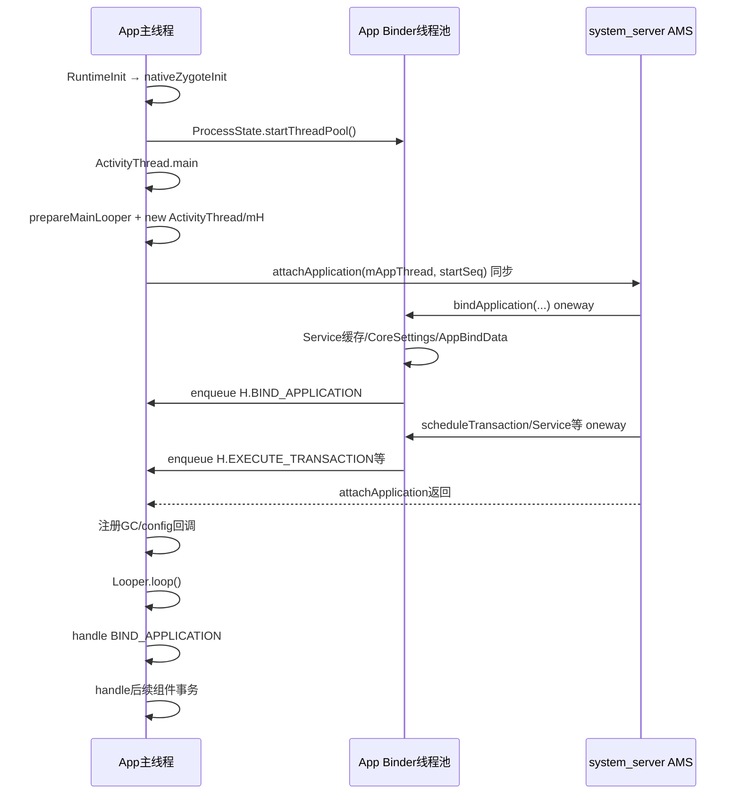

# 208 Android ActivityThread.main：主 Looper、Binder 线程池与首批消息顺序

> 源码版本：Android 11 `android-11.0.0_r48`。  
> 当前在 Mac 上只读源码，不实际启动 Android Looper 或 Binder 驱动。

## 1. 本章目标

第207章走到 `ActivityThread.main()`，第205章又从 `H.BIND_APPLICATION`展开了应用初始化。本章连接中间空白：主线程、主 Looper、ApplicationThread Binder Stub 与首批消息究竟以什么顺序建立。

读完应能回答：

- `ActivityThread`为什么不是一个 Java Thread；
- Binder 线程池为什么早于主 Looper 开始循环；
- 主线程同步 attach AMS 时，bindApplication 怎样已经进入队列；
- Handler 创建、消息入队和消息执行为什么是三个完成点；
- bind、Activity、Service、Broadcast 首批工作怎样保持必要顺序；
- 哪些“顺序”只是单一发送者/队列内保证，不能外推成全系统绝对顺序。

## 2. 先纠正名字

`ActivityThread`是 App 进程的 Java Framework 总管对象，保存组件、资源、Provider、Instrumentation 和主 Handler 等状态；它没有继承 `java.lang.Thread`。

真正的 Linux/Java 主线程是执行 `ActivityThread.main()`的那条 Zygote child 当前线程。

## 3. 三类关键执行者

| 执行者 | 主要职责 |
|---|---|
| App 主线程 | Looper/H 消息、组件生命周期、View/UI |
| Binder 线程池 | 接收 system_server 的 IApplicationThread oneway 调用 |
| system_server Binder/服务线程 | 发送 bind、transaction、Service/Broadcast 等调度 |

它们不是一个“Android主线程”的不同名字。

## 4. 完整并发时序图



箭头 `BP→M`表示向主 MessageQueue 入队，不是 Binder 线程直接调用主线程方法。

## 5. Binder 线程池在何时启动

普通 Zygote child 先执行：

```text
ZygoteInit.zygoteInit
  → nativeZygoteInit
  → AndroidRuntime::onZygoteInit
  → ProcessState::startThreadPool
```

之后 RuntimeInit 才返回调用 `ActivityThread.main()`的 Runnable。

## 6. 为什么 Binder pool 要这么早

App 向 AMS attach 后，system_server要立即反向调用它提供的 `IApplicationThread`；如果进程没有 Binder线程读取驱动事务，bind 和组件调度无法进入 App。

所以 Binder通信能力必须早于 Application、Activity甚至主 Looper开始消费消息。

## 7. Binder pool 存在不等于主线程可执行生命周期

Binder线程能接包、解析 Parcel、更新少量线程安全全局状态并向 Handler发消息；Application/Provider/Activity回调仍要求主线程串行。

“Binder可达”和“组件运行环境已绑定”是两个阶段。

## 8. ActivityThread.main 的启动前清理

main 开头安装 AndroidOs syscall interception，关闭默认 CloseGuard噪声，初始化当前用户 Environment、用户证书目录和 Mainline module Framework initializer。

这些都发生在应用自定义代码之前，属于每个 App 进程公共入口。

## 9. 临时进程名

```java
Process.setArgV0("<pre-initialized>");
```

此时 App 已是目标 UID 的进程，但 bindApplication尚未根据 AppBindData设置最终 processName；临时名字准确表达“进程存在、应用环境未绑定”。

## 10. prepareMainLooper 做了什么

```java
Looper.prepareMainLooper();
```

它为当前线程创建 Looper/MessageQueue，写入 ThreadLocal，并发布静态 `sMainLooper`。主 Looper 使用 `quitAllowed=false`，设计为与进程同寿命的核心循环。

## 11. prepare 不等于 loop

Looper.prepare只创建队列和线程关联；真正取消息要等稍后的 `Looper.loop()`。

在两者之间，其他线程已经可以向队列 enqueue，消息会等待而不会凭空执行。

## 12. 为什么必须先 prepare 再 new ActivityThread

ActivityThread字段按声明顺序初始化，其中包括：

```java
final ApplicationThread mAppThread = new ApplicationThread();
final Looper mLooper = Looper.myLooper();
final H mH = new H();
```

`H`继承 Handler，默认绑定当前线程 Looper。若当前线程尚未 prepare，Handler无法正确绑定主队列。

## 13. mLooper 捕获的是当前主 Looper

`mLooper = Looper.myLooper()`在构造对象字段阶段执行，因此它是 ActivityThread创建线程的 Looper，不是从 `Looper.getMainLooper()`以后随时动态查询。

普通 App入口保证创建 ActivityThread的正是 main线程。

## 14. mH 在 attach 前已经存在

`new ActivityThread()`返回前，`mAppThread`、`mLooper`和`mH`都已建立。虽然静态 `sMainThreadHandler`要在 attach 后才赋值，Binder回调完全可以使用实例字段 `mH`提前排消息。

这是理解“主线程还没 loop，bind 消息却已在队列”的关键。

## 15. startSeq 的最后一段传递

main 从 args 尾部扫描 `seq=`，转换为 long，随后：

```java
ActivityThread thread = new ActivityThread();
thread.attach(false, startSeq);
```

startSeq只用于把此次进程 attach 对回 ProcessList启动代际，之后不会充当主消息序号。

## 16. attach 先发布 ApplicationThread Binder

非 system 路径设置 `sCurrentActivityThread`和 mSystemThread，然后：

```java
RuntimeInit.setApplicationObject(mAppThread.asBinder());
mgr.attachApplication(mAppThread, startSeq);
```

`mAppThread`是 `IApplicationThread.Stub`，不是主线程对象；它是 system_server以后调用 App控制面的 Binder端点。

## 17. attachApplication 是同步 Binder 调用

`IActivityManager.attachApplication()`不是 oneway。App主线程发出后，会等待 system_server 的 `attachApplicationLocked()`处理并返回。

因此这一段主线程尚未进入 Looper.loop，也不能消费 mH消息。

## 18. 反向 IApplicationThread 是 oneway

`IApplicationThread.aidl`声明：

```aidl
oneway interface IApplicationThread
```

AMS 调 `thread.bindApplication()`只把事务交给 Binder，不等待 App主线程执行 `handleBindApplication()`。

## 19. 同步外呼中可以发生异步反调

主线程正在等待 AMS attach返回时，App Binder线程池是独立运行的。AMS 可通过 mAppThread反向发 oneway事务，Binder驱动唤起池中线程处理。

这不是同一线程递归回调，而是跨进程、跨线程的双向控制流。

## 20. ApplicationThread.bindApplication 的 Binder线程工作

它先初始化 ServiceManager常用服务缓存、写 core settings，再复制参数到 AppBindData，最后：

```java
sendMessage(H.BIND_APPLICATION, data);
```

缓存与参数封装发生在入站 Binder线程；Application和Provider创建不在这里执行。

## 21. MessageQueue 支持跨线程 enqueue

Handler.sendMessage最终进入 MessageQueue的同步保护代码，并在需要时唤醒 native poll。生产者可以是任意 Binder线程，消费者固定是 mH所属主线程。

因此无需让主线程先开始 loop，才能安全排入首条消息。

## 22. sendMessage 不是直接方法调用

ActivityThread封装的 `sendMessage()`创建 Message、设置 what/obj/arg，再调用 `mH.sendMessage(msg)`。

返回时只能说明队列已接受消息；`H.handleMessage()`、Application.onCreate和任何组件回调都可能尚未发生。

## 23. AMS 的普通 attach 顺序

`attachApplicationLocked()`匹配 ProcessRecord、linkToDeath并取消 start timeout后，生成 Provider列表，先发送 bindApplication，然后 `app.makeActive(thread, ...)`，再依次检查等待中的 Activity、Service、Broadcast和Backup工作。

服务端先建立应用环境请求，再开放组件投递。

## 24. makeActive 的语义边界

`app.makeActive()`把 IApplicationThread放入 ProcessRecord并接入 process stats等服务端账本；它不表示 App已经执行完 bindApplication。

注释说“after binding application”指服务端已经发出 bind请求，不能解读成跨进程同步完成回报。

## 25. 等待中的 Activity 怎样进入 App

ATMS attachApplication找到此进程等待启动的 Activity，构造 ClientTransaction，最终通过 `IApplicationThread.scheduleTransaction()`发送。

App Binder线程调用 `transaction.preExecute()`后，把 `H.EXECUTE_TRANSACTION`排给主线程。

## 26. Service 与 Broadcast 也走主队列

ApplicationThread 的 scheduleCreateService、scheduleReceiver、scheduleBindService等方法把对应数据封装为 `H.CREATE_SERVICE`、`H.RECEIVER`、`H.BIND_SERVICE`消息。

四大组件控制入口共享主 Looper串行语义，但消息类型和完成回报协议不同。

## 27. 为什么先 bind 再组件

Activity/Service/Receiver 创建需要 LoadedApk、ClassLoader、Application、Instrumentation和Provider环境。如果组件消息先执行，会在未绑定进程中访问空账本或错误 Context。

因此 BIND_APPLICATION是普通 App组件队列的初始化栅栏。

## 28. “先发送”与“先执行”必须分开

正常 attach路径源码顺序为：

```text
system_server先调用bindApplication
  → 再调度等待Activity/Service/Broadcast
```

目标端通常据同一 IApplicationThread有序收到并依次 enqueue；真正执行仍等主线程 loop，并受队列已有工作和消息时间影响。

## 29. 不要夸大为全系统绝对顺序

多个 system_server线程、不同 Binder对象、本地线程直接 post、异步消息和未来同步屏障都可能形成其他交错。源码保证的是启动协议中必要的 bind-before-component路径，而不是“BIND_APPLICATION必然是进程收到的第一笔任何类型消息”。

分析异常时要查看具体发送者、Binder端点和实际 enqueue顺序。

## 30. oneway 为什么仍可有顺序

oneway表示发送方不等处理结果，不表示同一发送线程面向同一 Binder端点的事务可以任意乱序执行。普通 attach路径由同一服务端流程先发 bind，再发后续 ApplicationThread调度，Framework依赖这条有序控制流；换成多个发送线程时仍应回到具体同步和队列证据。

但它不提供业务完成确认；需要完成语义时仍要单独 Binder回报或 timeout。

## 31. attachApplicationLocked 返回前做了什么

除发送 bind，它还激活 ProcessRecord、更新 LRU、投递等待组件、更新 OOM状态并记录 PROCESS_START_TIME统计。

这些都是 system_server控制面工作；App主线程可能仍在同步 Binder调用中等待。

## 32. attach 返回后的客户端工作

ActivityThread.attach 返回后注册 BinderInternal GC watcher：当有 Activity变化且堆使用超过阈值时，请求 ATMS释放部分 Activity；还注册 ViewRootImpl全局配置变化回调。

这些回调注册仍早于 `Looper.loop()`。

## 33. sMainThreadHandler 为什么后设

main 在 attach后执行：

```java
if (sMainThreadHandler == null) {
    sMainThreadHandler = thread.getHandler();
}
```

静态入口方便进程内其他代码取主 Handler；真正 bind入队此前使用的是实例 mH，所以不依赖这次静态赋值。

## 34. Looper.loop 才开始消费

main结束 ActivityThreadMain trace后调用 `Looper.loop()`。循环先验证当前线程已有 Looper，取得 MessageQueue，清 Binder calling identity，然后不断执行：

```java
Message msg = queue.next();
msg.target.dispatchMessage(msg);
```

`queue.next()`无到期工作时可阻塞 native poll。

## 35. 为什么 loop 前清 calling identity

主线程刚从一次 Binder调用链返回，Framework要确保后续普通消息以本进程身份执行，而不是意外继承某次 IPC调用者身份。

Looper还会在每条 dispatch后核对 identity，发现组件错误泄漏 Binder身份时记录严重问题。

## 36. Message 依 when 排队

MessageQueue按执行时间 `when`排序；普通 `sendMessage()`使用当前 uptime，多个同一到期时间消息按插入遍历位置保持队列顺序。

延时消息、前置插入和屏障会改变肉眼看到的“调用时间顺序”，所以诊断要同时看 when和是否异步。

## 37. 同步屏障与异步消息

MessageQueue存在 sync barrier时，会跳过同步消息寻找 asynchronous message。ActivityThread的 sendMessage可按参数给某些消息 `setAsynchronous(true)`。

BIND_APPLICATION和 ClientTransaction普通发送没有在这些片段中标成 async；启动最初通常尚无 View遍历屏障，但不能把一般 Handler排序简化成永远纯 FIFO。

## 38. H.handleMessage 是主线程分派总表

H通过 what区分 BIND_APPLICATION、RECEIVER、CREATE_SERVICE、BIND_SERVICE、CONFIGURATION_CHANGED、EXECUTE_TRANSACTION等，再调用 ActivityThread对应 handle方法。

H不是 Binder Stub；它只在主 Looper消费阶段运行。

## 39. 首次处理 BIND_APPLICATION 会很重

第205章所述时区/配置/兼容、LoadedApk、Context、ClassLoader、Instrumentation、Provider和Application.onCreate都在一次 H消息中同步完成。

主 Looper在处理它时不能同时执行后续 Activity transaction。

## 40. 串行带来的正确性与代价

串行保证 Provider/Application初始化不会和首个 Activity生命周期并发；代价是任一启动 I/O、类初始化或锁等待都会把后续所有组件消息压在队列中。

主线程启动优化的本质经常是缩短这条初始化栅栏，而不是增加 Binder线程数。

## 41. EXECUTE_TRANSACTION 的 Binder前置工作

ApplicationThread.scheduleTransaction调用 ActivityThread的 scheduleTransaction；`ClientTransactionHandler`先在接收侧执行 `transaction.preExecute(this)`，再发送 H.EXECUTE_TRANSACTION。

preExecute可登记配置/待销毁状态，但 Activity生命周期回调仍在主线程 TransactionExecutor执行。

## 42. preExecute 可能早于 bind完成吗

Binder线程可在主线程处理 BIND_APPLICATION时接收后续 transaction并执行 preExecute；这正是共享状态需要线程安全/预登记设计的原因。

但 transaction的 Activity回调消息只能等主线程完成当前 bind消息后执行。

## 43. Binder线程池不执行UI的原因

池中线程数量和调度不可作为组件顺序基础，且 View/Activity状态主要由主线程拥有。让 Binder线程直接调用生命周期会引入并发访问和重入。

因此 ApplicationThread通常是“快速接收、快照参数、post主线程”。

## 44. 不是所有 Binder入口都只做 post

例如 bindApplication先写 ServiceManager cache/core settings，某些 dump/诊断接口也可能在 Binder线程做专用工作。判断线程必须逐方法核源，不能仅因类名 ApplicationThread就断言都在主线程。

组件业务回调主链仍通过 H串行。

## 45. 主线程卡住时 Binder仍可能活着

若 Application.onCreate卡住，Binder pool还能接收事务并继续向 MessageQueue堆消息，甚至响应部分不依赖主线程的接口。

“进程 Binder可达”不能证明 UI主线程健康；ANR诊断要看 main stack、queue与等待链。

## 46. Binder池耗尽是另一类故障

如果 App Binder线程都阻塞在同步外呼或锁上，system_server的反向控制事务也会延迟，连 enqueue都无法及时完成。

这与消息已入队但主线程不消费不同，诊断时要分别检查 Binder线程池和 main Looper。

## 47. 主 Looper不会自动并行执行消息

同一时刻只 dispatch一条 Message；即使多个 Binder线程同时 post，mH也按队列逐条处理。

需要后台并行的业务必须明确使用其他 Executor/HandlerThread，不能期待主队列自行扩容。

## 48. attach完成点重新划分

```text
① App发起attachApplication
② AMS匹配ProcessRecord并发bind
③ App Binder线程把BIND_APPLICATION入队
④ AMS attachApplication返回
⑤ App主线程进入Looper.loop
⑥ handleBindApplication完成
⑦ 后续组件消息执行
```

日志里的“attach完成”若未说明编号，很容易产生错误归因。

## 49. bindApplication 没有同步完成回报

AMS发 oneway bind后不会等待 Application.onCreate返回。进程启动统计中的 bind时间更多描述服务端attach/发送阶段，不能直接当作客户端 handleBindApplication wall time。

客户端具体耗时要结合 atrace/Perfetto中的 bindApplication slice和主线程消息。

## 50. 首批消息不只 Activity

进程可能因 Provider、Service、Receiver、Backup或Instrumentation启动；AMS attach后会检查各自等待列表。首个业务组件由 HostingRecord和当时系统状态决定，不保证每个新进程第一项都是 LaunchActivityItem。

这也是 ActivityThread名称容易误导的另一处。

## 51. isolatedEntryPoint 是例外

若 ProcessRecord设置 isolatedEntryPoint，AMS发送 `runIsolatedEntryPoint()`而不是普通 bindApplication；App主 Handler执行反射 main，返回后进程退出。

普通 Application/Provider顺序不能套到该专用路径。

## 52. systemMain 也是另一条路径

system_server内的 `ActivityThread.systemMain()`调用 `attach(true, 0)`，本地创建系统 Context/Application，不向 AMS做普通 App attach。

本章双向 Binder与首批 BIND_APPLICATION时序针对 Zygote孵化的普通 App进程。

## 53. 主线程退出为何视为异常

ActivityThread.main在 `Looper.loop()`后直接抛：

```java
throw new RuntimeException(
        "Main thread loop unexpectedly exited");
```

正常 App进程不是通过让 main Looper自然返回来完成优雅退出，而是由进程生命周期管理终止。

## 54. 慢消息可观测性

Looper支持 slow delivery和slow dispatch阈值：delivery慢表示消息排队过久，dispatch慢表示处理函数自身过久。两者可能分别指向前序阻塞和当前回调耗时。

只看某个生命周期结束时间，无法判断时间花在排队还是执行。

## 55. Trace 的边界

ActivityThread.main有 `ActivityThreadMain` slice，H处理 BIND_APPLICATION包 `bindApplication` slice，组件transaction另有 lifecycle/launch trace。

这些 trace嵌套/相邻位置能把 Zygote→attach→bind→组件拆段，但仍不代表 Surface已 present。

## 56. 常见误解一：ApplicationThread 就是主线程

ApplicationThread是 Binder Stub对象；它的方法先运行在 Binder线程。ActivityThread才持有主 Handler，但 ActivityThread本身也不是 Thread子类。

线程身份必须看当前入口和 Handler切换，而不是看类名。

## 57. 常见误解二：Looper.prepare 后消息立刻执行

prepare只创建队列；loop才消费。正因为中间有窗口，Binder线程才能在主线程同步 attach期间提前排入 bind消息。

队列存在、队列非空、消费者正在 dispatch是三个状态。

## 58. 常见误解三：AMS 调完 bind 就表示 onCreate结束

IApplicationThread是 oneway，AMS调用返回与客户端主线程完成没有同步关系。Application.onCreate异常甚至可能发生在 system_server已经继续调度 Activity之后。

最终由进程死亡、组件回报和timeout路径收敛错误。

## 59. 常见误解四：Handler队列永远严格FIFO

MessageQueue按 when排序；延时、front-of-queue、sync barrier和async message都能改变简单FIFO直觉。普通同时间同步消息通常保持插入顺序，但结论必须带条件。

启动协议还同时依赖 Binder发送顺序和服务端先bind后组件的源码结构。

## 60. Mac只读练习一：证明H在attach前存在

```bash
sed -n '300,325p' \
  frameworks/base/core/java/android/app/ActivityThread.java

sed -n '7615,7665p' \
  frameworks/base/core/java/android/app/ActivityThread.java
```

按Java字段初始化顺序标出 mAppThread、mLooper、mH，再解释为何 `prepareMainLooper()`必须在 `new ActivityThread()`之前。

## 61. Mac只读练习二：证明双向时序

```bash
sed -n '7330,7360p' \
  frameworks/base/core/java/android/app/ActivityThread.java

sed -n '5290,5415p' \
  frameworks/base/services/core/java/com/android/server/am/ActivityManagerService.java
```

画出 App主线程同步 attach、AMS oneway bind、App Binder线程post，以及 AMS继续投递 Activity/Service的四条箭头。

## 62. Mac只读练习三：区分入队与执行

```bash
sed -n '1030,1100p' \
  frameworks/base/core/java/android/app/ActivityThread.java

sed -n '1895,1930p' \
  frameworks/base/core/java/android/app/ActivityThread.java

sed -n '145,225p' \
  frameworks/base/core/java/android/os/Looper.java
```

分别找到 ApplicationThread.bindApplication、H.handleMessage和Looper.loop，记录每段运行线程及完成含义。

## 63. 自测题

1. ActivityThread、ApplicationThread和App主线程分别是什么？
2. Binder线程池为何早于 ActivityThread.main开始工作？
3. 主线程阻塞在 attachApplication时，bind消息怎样进入主队列？
4. 为什么 mH在 sMainThreadHandler赋值前就可使用？
5. oneway bind返回证明了什么，又没有证明什么？
6. bind消息与 Activity transaction为什么能串行执行？
7. 哪些因素使“Handler严格FIFO”这个说法不准确？
8. slow delivery和slow dispatch分别提示什么？

## 64. 本章结论

App进程在进入 ActivityThread.main前已经启动 Binder线程池；main线程随后建立正常情况下不允许主动 quit 的主 Looper、ActivityThread及 mH，再同步向 AMS attach。主线程等待期间，AMS通过 oneway IApplicationThread把 bind和后续组件控制请求交给 Binder线程，后者只做安全的接收/预处理并向主 MessageQueue入队；attach返回后主线程进入 Looper.loop，才按协议顺序完成进程绑定和组件生命周期。

最重要的模型是：

```text
Binder可接收 ≠ 主线程正在循环
消息已入队 ≠ 回调已经执行
AMS已发bind ≠ Application.onCreate已完成
ProcessRecord已active ≠ App组件已ready
Activity已resume ≠ 首帧已显示
```

下一章继续追首个 Activity 的客户端创建：LaunchActivityItem怎样解包 Intent/ActivityInfo，Instrumentation与AppComponentFactory怎样实例化 Activity，Context、Window和生命周期记录又怎样组装。
