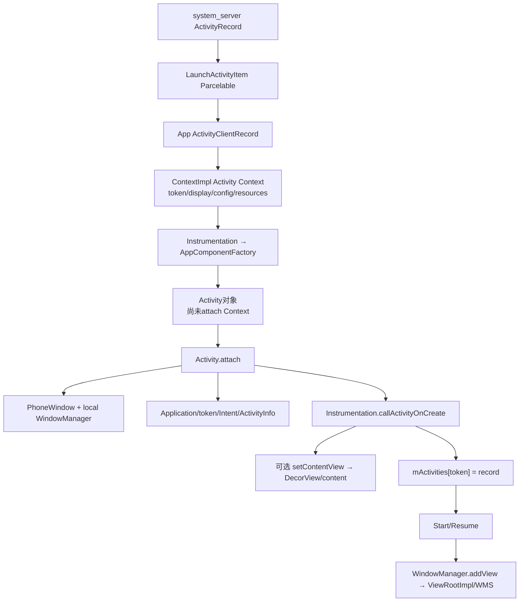

# 209 Android LaunchActivityItem：实例化 Activity 与 Context、Window 组装

> 源码版本：Android 11 `android-11.0.0_r48`。  
> 当前在 Mac 上只读源码，不实际启动 Activity 或连接设备 WMS。

## 1. 本章目标

第208章解释 LaunchActivityItem怎样排进主线程，本章进入它的 execute：服务端 ActivityRecord 如何变成客户端 ActivityClientRecord，Activity对象怎样由 Factory创建，Context、Application、PhoneWindow、WindowManager和生命周期又怎样逐步接上。

读完应能区分：

- 服务端 ActivityRecord、客户端 ActivityClientRecord和业务 Activity实例；
- Activity类实例化、attachBaseContext、Activity.attach、onCreate的顺序；
- Activity Context为什么带 token、display和override configuration；
- PhoneWindow、DecorView、ViewRootImpl、WMS WindowState与Surface何时才出现；
- onCreate完成究竟证明了什么，没有证明什么。

## 2. 一句话主线

```text
ActivityRecord服务端状态
  → LaunchActivityItem跨Binder
  → ActivityClientRecord客户端账本
  → Activity Context与Resources
  → AppComponentFactory创建Activity空壳
  → Activity.attach组装Application/Token/PhoneWindow
  → Instrumentation调用onCreate
  → 记录进入mActivities
  → 后续Start/Resume才把Decor加入WindowManager
```

## 3. 三个“Activity”不是同一对象

| 对象 | 所在进程 | 职责 |
|---|---|---|
| `ActivityRecord` | system_server | Task层级、可见性、服务端生命周期和窗口token |
| `ActivityClientRecord` | App | Intent/state/config、真实Activity引用和客户端生命周期 |
| `Activity`子类实例 | App | 开发者生命周期、Context、Window和UI业务 |

它们靠 Binder token关联，不共享 Java引用。

## 4. 完整对象组装图



## 5. 服务端从 realStartActivityLocked 开始

ActivityStackSupervisor确认旧 Activity pause完成、目标进程已有 IApplicationThread，给 ActivityRecord设置进程、可见性、launch count、配置与compat信息，然后构造 ClientTransaction。

若目标进程还没有 thread，就不能进入本章客户端实例化。

## 6. LaunchActivityItem 携带什么

它包含 Intent、ActivityInfo、进程/override Configuration、CompatibilityInfo、referrer、voice interactor、proc state、saved state、pending results/intents、Profiler、assist token和fixed rotation adjustments等。

这不是只传一个 Activity类名，而是一份“创建客户端实例所需状态快照”。

## 7. Intent 为什么再 new 一份

服务端调用 `LaunchActivityItem.obtain(new Intent(r.intent), ...)`，先复制服务端当前 Intent；跨 Binder Parcel后，App得到自己的对象图。

App后续设置 component、extras ClassLoader不会修改 system_server中的 ActivityRecord Intent。

## 8. token 是跨进程主键

ClientTransaction以 `r.appToken`为 activity token；LaunchActivityItem.execute收到同一 IBinder token并写入 ActivityClientRecord。

后续生命周期、窗口 LayoutParams、配置、结果和服务端回报都用 token定位同一逻辑 Activity代际。

## 9. ident 不是稳定业务ID

r48服务端传 `System.identityHashCode(r)`作为 ident，主要用于事件日志等进程内身份提示；它不是跨重启稳定主键，也不能替代 Binder token。

## 10. final lifecycle request 与 launch callback

事务先添加 LaunchActivityItem callback，再按 `andResume`设置 ResumeActivityItem或PauseActivityItem为最终状态。

因此“launch Activity”通常是一笔包含 create与目标生命周期的事务，不是每个 onCreate/onStart/onResume各发一笔 Binder。

## 11. preExecute 先在 Binder接收侧运行

LaunchActivityItem.preExecute会增加 launching activities计数、更新进程状态和pending configuration。

它发生在主线程真正 execute前，用于提前建立客户端配置/进程状态；不创建 Activity实例。

## 12. execute 首先创建 ActivityClientRecord

```java
ActivityClientRecord r = new ActivityClientRecord(
        token, mIntent, mIdent, mInfo, ...);
client.handleLaunchActivity(r, pendingActions, null);
```

此时 r.activity仍为空，它只是把跨进程参数收拢成客户端账本。

## 13. ActivityClientRecord 构造时已有 LoadedApk

构造函数通过 `client.getPackageInfoNoCheck(activityInfo.applicationInfo, compatInfo)`取得 LoadedApk，保存 ActivityInfo、Intent、state、pending结果、配置和fixed rotation信息。

LoadedApk是包代码/资源/ClassLoader环境，不是 Activity对象。

## 14. 客户端初始生命周期

ActivityClientRecord的 mLifecycleState初始为 PRE_ON_CREATE。init还建立 configCallback，初始化 paused/stopped/hideForNow等兼容字段。

服务端可能已把 ActivityRecord标成INITIALIZING甚至准备RESUMED，客户端状态仍从PRE_ON_CREATE开始，两边不是同一个变量。

## 15. handleLaunchActivity 的准备工作

主线程取消后台GC idle，标记进程中Activity有变化，按需启动Profiler；若有fixed rotation adjustment，先覆盖应用display adjustments，再处理最新Configuration。

Activity创建前先校准资源视图，避免构造/onCreate看到旧旋转或旧密度。

## 16. 图形环境先做轻量预备

硬件加速Activity且Renderer未禁用时调用 HardwareRenderer.preload；随后 `WindowManagerGlobal.initialize()`并提示 GraphicsEnvironment即将启动Activity。

这不等于已经创建RenderThread绘制一帧，也不等于 WMS已有该Activity窗口。

## 17. performLaunchActivity 是核心组装方法

它依次完成：

```text
确认LoadedApk和组件名
→ createBaseContextForActivity
→ newActivity
→ makeApplication
→ Activity.attach
→ theme/network gate
→ callActivityOnCreate
→ 写ActivityClientRecord和mActivities
```

顺序比记住单个方法名更重要。

## 18. 组件名可能来自三处

优先用 `r.intent.getComponent()`；为空时由 PackageManager resolve并写回Intent；若 ActivityInfo.targetActivity非空（Activity alias），实例化类切换为targetActivity。

alias场景中“Intent逻辑组件名”和“实际Java类名”可以不同。

## 19. 先创建 Activity Context，再创建 Activity

```java
ContextImpl appContext = createBaseContextForActivity(r);
Activity activity = null;
```

Factory创建 Activity时需要其 ClassLoader；这个ClassLoader来自已按Activity split/display/config准备的 Context。

## 20. displayId 要向 ATMS 查询

createBaseContextForActivity先用 token调用 `ActivityTaskManager.getDisplayId()`，取得 Activity当前所属display。

这是主线程上的同步 Binder查询；多显示环境下不能默认所有Activity都使用 Display.DEFAULT_DISPLAY。

## 21. Activity Context 带 token

`ContextImpl.createActivityContext()`构造 ContextImpl时写入 activityToken、splitName和目标ClassLoader，并标记它是 UI Context、与display关联。

Application Context通常没有某个Activity token，因此二者不能无条件互换。

## 22. isolated split loading

若包请求 isolated split loading，ContextImpl按 ActivityInfo.splitName取得专用 split ClassLoader和split资源路径。

同一APK安装单元中的不同Activity也可能并非都由完全相同的类加载路径实例化。

## 23. Activity Resources 按token建基线

ResourcesManager的 `createBaseTokenResources()`用token、resDir、split/overlay/shared-library路径、displayId、overrideConfig、compatInfo和ClassLoader组成ResourcesKey。

以后同token的配置Context会在这份base override上合并，token同时是资源配置隔离键。

## 24. INVALID_DISPLAY 的回退

若服务端返回 INVALID_DISPLAY，ContextImpl回退DEFAULT_DISPLAY；非默认display时使用默认CompatibilityInfo，而默认display使用包compat信息。

多显示和旧应用兼容会共同影响Resources/Display，不能只看全局Configuration。

## 25. fixed rotation 为什么早于实例化

若Activity在过渡期使用fixed rotation，ActivityThread先把调整应用到token资源和display adjustments，再创建Activity。

这样Activity构造或onCreate早期读取DisplayInfo时看到的是过渡期目标方向，而不是等窗口创建后再突然修正。

## 26. AppComponentFactory 是真正实例化钩子

```java
activity = mInstrumentation.newActivity(
        cl, component.getClassName(), r.intent);
```

Instrumentation根据目标包取得AppComponentFactory，再调用 `instantiateActivity(cl, className, intent)`；默认实现才是ClassLoader加载类并newInstance。

## 27. Factory 返回的是未初始化Activity

AppComponentFactory源码注释明确：返回对象还没有作为Context初始化，不应在Factory里用它调用依赖Android Context的API。

此时Java字段初始化/构造函数已执行，但 `Activity.attachBaseContext()`尚未执行。

## 28. 依赖注入的安全边界

自定义Factory可替换Activity子类、定制ClassLoader或做构造期注入；但不能假设Application字段、Window、token、Intent和Resources已经全部写入Activity。

需要Context/Window的初始化应等attach或生命周期阶段。

## 29. StrictMode 记录预期Activity数量

实例化后 `StrictMode.incrementExpectedActivityCount(activity.getClass())`记录实例计数，帮助VM策略检测 Activity泄漏。

这是诊断账本，不改变服务端ActivityRecord数量。

## 30. Intent extras 必须换 ClassLoader

ActivityThread设置 Intent extras和saved state Bundle的ClassLoader为Activity ClassLoader，并调用 `intent.prepareToEnterProcess()`。

否则自定义Parcelable在系统ClassLoader下反序列化可能报ClassNotFound；跨进程容器到达不等于所有嵌套对象已用正确类加载器展开。

## 31. Application 通常已经存在

```java
Application app = r.packageInfo.makeApplication(
        false, mInstrumentation);
```

普通冷启动第205章已创建初始Application，所以LoadedApk直接返回缓存对象，不会再次调用onCreate。

## 32. makeApplication 的非普通边界

共享进程或后续加载另一个包的LoadedApk可能尚无Application；这里传入非null Instrumentation时，makeApplication创建对象后会在内部调用该Application.onCreate。

因此“所有Activity launch都绝不会创建Application”也过强，只是普通初始包路径通常已完成。

## 33. title 与合并Configuration

ActivityThread从ActivityInfo加载label作为title，复制 mCompatConfiguration并叠加Activity overrideConfig，形成传给Activity.attach的config。

它不是直接复用服务端可变Configuration引用。

## 34. preserved Window 用于重建优化

若 relaunch请求保留旧Window，ActivityClientRecord可把 mPendingRemoveWindow作为构造PhoneWindow的preservedWindow，并清pending字段。

普通首次启动window为null；保留路径会复用Decor等状态，不能把每次relaunch都写成全新窗口树。

## 35. Application ResourceLoader 同步到Activity

在attach前，Activity Context Resources加入Application Resources当前的ResourcesLoader列表。

这保证运行时资源loader（例如动态加载资源）在Activity资源环境中一致，不只是APK静态路径一致。

## 36. outer Context 在 attach 前回填

```java
appContext.setOuterContext(activity);
activity.attach(appContext, ...);
```

ContextImpl负责底层服务/资源实现，外层Activity提供ContextWrapper语义。两者不是同一个对象，却共同表现为开发者使用的Activity Context。

## 37. Activity.attach 首先接 base Context

Activity.attach调用 `attachBaseContext(context)`，然后把FragmentController接到host。

从这里开始Activity的getResources/getSystemService等Context API才有可靠base实现。

## 38. PhoneWindow 在 onCreate 前创建

```java
mWindow = new PhoneWindow(this, preservedWindow,
        activityConfigCallback);
```

PhoneWindow是客户端Window策略对象，负责Decor、feature、LayoutInflater和LayoutParams；此刻不是system_server的WindowState。

## 39. Window callback 指向Activity

attach设置WindowControllerCallback、Window.Callback、dismiss callback，并把Activity设为LayoutInflater private factory。

于是按键、窗口属性、content变化和XML中View创建钩子可回到Activity。

## 40. softInputMode 和 uiOptions 先写入Window

ActivityInfo中的softInputMode/uiOptions在onCreate前设置，Activity随后读取Window属性或inflate Decor时已有Manifest配置。

但IME是否显示仍取决于窗口加入、焦点和WMS/IMMS后续状态。

## 41. attach 写入Activity核心字段

包括当前UI线程、ActivityThread、Instrumentation、activity token、assist token、ident、Application、Intent、referrer、component、ActivityInfo、title、parent、non-config实例和voice interactor。

Activity构造函数阶段这些字段大多尚未就绪。

## 42. alias 下 mComponent 的细节

Activity.attach写 `mComponent = intent.getComponent()`；而实例化类名可能因targetActivity换成alias目标类。

因此 `getComponentName()`可反映Manifest入口/alias，`getClass()`反映实际Activity类，二者不必相同。

## 43. setWindowManager 仍是客户端组装

PhoneWindow取得Context的WindowManager服务，写app token/app name/hardware accelerated，并创建一个绑定当前PhoneWindow的local WindowManagerImpl。

Window.java注释明确：这个设置主要供Window添加panel/subwindow，不负责把Activity主Window本身立即显示出来。

## 44. mWindowManager 是本地门面

`Activity.mWindowManager = mWindow.getWindowManager()`得到local WindowManagerImpl；其addView最终会进WindowManagerGlobal。

持有WindowManager对象不等于已经调用addView，更不等于WMS创建WindowState。

## 45. theme 在 onCreate 前设置

attach返回后，ActivityThread等待必要的NetworkPolicy状态更新，再读取ActivityInfo主题资源并调用 `activity.setTheme(theme)`。

因此开发者onCreate中的styled attribute、setContentView通常使用Manifest指定主题。

## 46. 为什么可能阻塞网络规则

若进程状态更新伴随NetworkPolicy规则序号，`checkAndBlockForNetworkAccess()`同步等待AMS确认规则应用，再允许Activity代码继续。

这是防止进程前后台状态变化与网络访问政策短暂错位；它也可能成为onCreate前的等待点。

## 47. Instrumentation 调用 Activity.onCreate

```java
mInstrumentation.callActivityOnCreate(activity, state);
```

默认实现执行prePerformCreate、`activity.performCreate()`、postPerformCreate；Instrumentation可监控、等待或处理异常。

## 48. Activity.performCreate 的内部顺序

它发送pre-created生命周期callback，初始化PiP/多窗口状态、恢复权限请求状态，再调用开发者onCreate；之后写EventLog、恢复transition state、计算mVisibleFromClient并分发Fragment/post-created callback。

所以 `onCreate()`只是performCreate中间的重要一步。

## 49. super.onCreate 强制检查

ActivityThread在调用前设置 `activity.mCalled=false`；Activity基类onCreate会置true。返回后仍为false则抛SuperNotCalledException。

子类必须调用 `super.onCreate()`，否则Framework内部Fragment/Window/状态恢复不变量无法保证。

## 50. saved state 与persistent state

ActivityInfo声明persistable时，Instrumentation调用带Bundle和PersistableBundle的重载；普通Activity只传saved instance Bundle。

这两个state来源、序列化类型和生命周期用途不同，不应统称为同一个“缓存”。

## 51. setContentView 可能在 onCreate 创建Decor

开发者调用Activity.setContentView最终到PhoneWindow.setContentView；若mContentParent为空，会执行 `installDecor()`生成DecorView和主题对应content layout，再inflate业务布局。

因此Decor可能在onCreate中出现，但前提是访问了setContentView/getDecorView等触发点。

## 52. onCreate 不要求必须 setContentView

无UI、延迟构建或特殊Activity可以不在onCreate调用setContentView。PhoneWindow对象已存在不代表Decor一定存在，Decor存在也不代表已经attach到ViewRootImpl。

要分开“Window策略对象”“View根容器”“系统窗口连接”。

## 53. onCreate 后才把真实实例写回Record

成功回调后：

```java
r.activity = activity;
r.setState(ON_CREATE);
synchronized (mResourcesManager) {
    mActivities.put(r.token, r);
}
```

Activity对象在onCreate期间已持token，但ActivityThread的mActivities主表直到回调完成后才正式登记它。

## 54. 为什么 mActivities 修改要加资源锁

注释指出其他线程的pending activity configuration更新会读取mActivities；修改在 mResourcesManager锁内完成，避免配置到达与实例登记竞态。

这不表示所有ActivityClientRecord字段都可在任意线程无锁读写。

## 55. 客户端ON_CREATE兼容字段

`r.setState(ON_CREATE)`同时把paused=true、stopped=true。这里stopped/paused是客户端路径兼容账本，不代表刚执行完真实onStop/onPause回调。

它表达“尚未走Start/Resume”的初始生命周期位置，不能反推回调历史。

## 56. LaunchActivityItem execute 到此只负责Create

performLaunchActivity返回后，handleLaunchActivity记录createdConfig、上报size configurations，并让PendingTransactionActions在后续Start阶段恢复实例状态、调用onPostCreate。

Launch callback本身不直接完成整笔Resume目标。

## 57. TransactionExecutor 自动补Start

事务最终若是ResumeActivityItem，Executor会在Launch callback后补到目标前一状态：调用handleStartActivity→`Activity.performStart()`，再由最终Resume item执行resume。

onStart/onResume不是performLaunchActivity内部偷偷调用的。

## 58. Window何时真正 addView

`handleResumeActivity()`完成performResume后，若Activity可见且未结束：

```java
View decor = r.window.getDecorView();
wm.addView(decor, layoutParams);
```

这里才进入WindowManagerGlobal、创建ViewRootImpl并通过Session与WMS协商添加主窗口。

## 59. Decor可能在resume才首次创建

若onCreate未触发installDecor，resume路径的 `getDecorView()`会调用installDecor。因此“DecorView一定在setContentView时创建”也不完整。

最终要显示主窗口时Framework会确保Decor存在。

## 60. addView 仍不等于Surface已经显示

WindowManager.addView开始客户端ViewRoot/WMS窗口连接；随后还需relayout、Surface/BufferQueue、measure/layout/draw、buffer提交、SurfaceFlinger latch/composition/present。

所以 Window已add、View已draw、windows drawn和硬件present仍是不同完成边界。

## 61. mWindowAdded 的意义

Activity用mWindowAdded防止重复addView；preserved Window路径可直接标true并通知旧ViewRoot child rebuilt。

它是客户端“是否已把Decor交给WindowManager”账本，不是WMS WindowState实时回读。

## 62. 异常处理

实例化、attach或onCreate异常先交给 `Instrumentation.onException(activity, e)`；未处理则包装成Unable to instantiate/start activity异常，让主线程崩溃并由system_server处理进程死亡。

若handleLaunchActivity最终得到null，会请求ATMS finish对应token，避免服务端ActivityRecord无限等待一个不存在的实例。

## 63. Activity构造函数为何应轻量

构造时Context、Application、Intent、token和Window尚未attach；重I/O还会直接占用主线程启动关键路径。

构造函数适合普通Java字段初值，不适合依赖Android环境或做昂贵初始化。

## 64. Context边界总结

```text
Application Context：进程/包级，生命周期长
Activity Context：带activity token/display/override config的UI Context
PhoneWindow Context：使用Activity作为外层Context
Decor Context：可能按Window主题建立
```

随意把Application Context用于主题/窗口，会丢失Activity级display和配置语义。

## 65. Token边界总结

- activity token：ActivityRecord/ActivityClientRecord、资源和主Window身份；
- assist token：Assist/语音上下文独立授权身份；
- window token写入LayoutParams：WMS关联窗口层级；
- Binder token不是Activity Java对象地址。

同名token概念需看字段来源与消费者。

## 66. 完成点阶梯

```text
① LaunchActivityItem已到App
② ActivityClientRecord已创建
③ Activity Java对象已实例化
④ Activity.attach已完成/PhoneWindow已创建
⑤ Activity.onCreate已完成
⑥ Start/Resume已完成
⑦ Decor已addView/ViewRoot已建立
⑧ 首帧已draw并提交
⑨ SurfaceFlinger已present
```

冷启动日志必须明确说的是哪一级。

## 67. 常见误解一：ActivityRecord就是Activity对象

ActivityRecord在system_server，业务Activity在App；中间还有ActivityClientRecord。服务端先有记录，App进程甚至可以尚未存在。

跨进程只能传token和状态快照，不能传业务对象引用。

## 68. 常见误解二：new Activity后就能getSystemService

Factory返回时尚未attach base Context。只有Activity.attachBaseContext完成后，ContextWrapper API才有有效delegate。

AppComponentFactory文档专门警告不要过早使用Activity Android API。

## 69. 常见误解三：onCreate里已有系统窗口

onCreate前有PhoneWindow对象，onCreate可创建Decor；主窗口通常到resume阶段才wm.addView并接入WMS。

PhoneWindow存在、Decor存在、ViewRoot存在、WindowState存在、Surface有buffer是五个阶段。

## 70. 常见误解四：setContentView就是绘制

setContentView只建立/替换View层级并请求insets/layout。实际measure/layout/draw要等ViewRoot traversal和VSync，buffer再经SurfaceFlinger处理。

布局inflate完成不等于屏幕出现像素。

## 71. Mac只读练习一：还原对象顺序

```bash
sed -n '3310,3425p' \
  frameworks/base/core/java/android/app/ActivityThread.java

sed -n '7885,7960p' \
  frameworks/base/core/java/android/app/Activity.java
```

按Context、Factory、Application、outerContext、attach、theme、onCreate、mActivities登记编号，检查每一步Activity中哪些字段已经可用。

## 72. Mac只读练习二：证明Factory对象尚无Context

```bash
sed -n '1240,1265p' \
  frameworks/base/core/java/android/app/Instrumentation.java

sed -n '80,110p' \
  frameworks/base/core/java/android/app/AppComponentFactory.java
```

阅读instantiateActivity的Javadoc，把“构造完成”和“Android Context初始化完成”分成两栏。

## 73. Mac只读练习三：证明Window分阶段出现

```bash
sed -n '430,490p' \
  frameworks/base/core/java/com/android/internal/policy/PhoneWindow.java

sed -n '4470,4540p' \
  frameworks/base/core/java/android/app/ActivityThread.java
```

定位setContentView/installDecor与resume中的getDecorView/wm.addView，画出PhoneWindow→Decor→ViewRoot/WMS的边界。

## 74. 自测题

1. ActivityRecord、ActivityClientRecord和Activity实例各在哪里？
2. 为什么先创建Activity Context再调用AppComponentFactory？
3. Factory刚返回的Activity可以安全使用Window吗？为什么？
4. alias场景下Intent component与实际Activity类有什么不同？
5. Activity.attach在onCreate前组装了哪些关键对象？
6. PhoneWindow创建为什么不代表WMS已有窗口？
7. DecorView最早和最迟可能在哪个阶段创建？
8. onCreate完成距离首帧present还隔哪些步骤？

## 75. 本章结论

LaunchActivityItem把服务端ActivityRecord的启动快照转换为App内ActivityClientRecord；ActivityThread先按token/display/config建立Activity Context和Resources，再通过Instrumentation与AppComponentFactory创建尚未attach的Activity对象，随后Activity.attach接入base Context、Application、Intent、token、PhoneWindow与local WindowManager，最后由Instrumentation调用onCreate并登记客户端账本。

必须牢牢记住：

```text
Activity实例已new
≠ Context已attach
≠ onCreate已完成
≠ DecorView已创建
≠ Window已add到WMS
≠ ViewRoot已完成首帧
≠ SurfaceFlinger已present
```

下一章专门拆PhoneWindow与DecorView：主题feature怎样选择Decor布局、setContentView怎样inflate到content parent，以及为何requestFeature必须早于内容安装。
