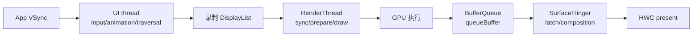
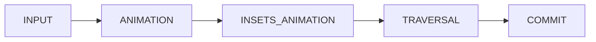
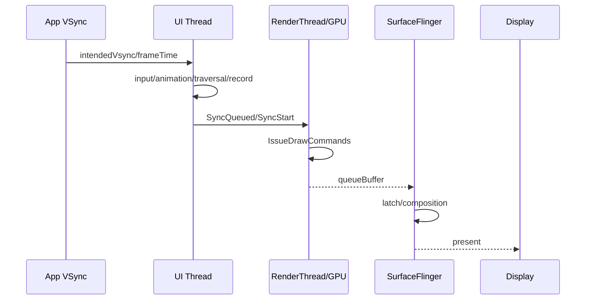

# 21 Choreographer、VSync 与帧调度

> 源码版本：Android 11 / API 30 / `android-11.0.0_r48`  
> 学习方式：macOS 只读源码，不要求编译 AOSP。  
> 前置章节：[11-View到Window与ViewRootImpl](./11-View到Window与ViewRootImpl.md)、[12-Surface到SurfaceFlinger显示链路](./12-Surface到SurfaceFlinger显示链路.md)、[20-InputReader与InputDispatcher输入系统](./20-InputReader与InputDispatcher输入系统.md)

---

## 1. 本章要解决的问题

常见说法是：“屏幕 60Hz，所以 App 每 16.67ms 画一帧。”它遗漏了很多关键点：

- 没有界面变化时，App 是否仍在每个 VSync 遍历 View 树？
- VSync 会直接在硬件中断线程调用 Java `doFrame()` 吗？
- input、animation、traversal 为什么有固定顺序？
- `requestLayout()` 与 `invalidate()` 怎样合并？
- UI thread、RenderThread、GPU、SurfaceFlinger 各做什么？
- UI traversal 小于 16.67ms 为什么仍会卡？

本章目标：

1. 解释 Choreographer 的线程归属和按需调度。
2. 从 callback/traversal 追到 VSync 和 `doFrame()`。
3. 解释同步屏障与异步 VSync Message。
4. 理解五类 callback 的次序。
5. 区分 UI、RenderThread、GPU、SF/HWC 阶段。
6. 区分 intended VSync、frameTime、开始、完成和 present 时间。
7. 用 gfxinfo/Perfetto 判断卡顿阶段。

---

## 2. 一帧是一条流水线



每段都可能错过目标刷新：

- UI thread 晚开始或执行太久。
- RenderThread/GPU 太慢。
- 可用 buffer 不足导致 dequeue 等待。
- SF 没及时 latch/composition。
- HWC/present fence 晚。

所以“主线程不超过 16ms”有用但不充分。

---

## 3. 刷新率与理想周期

```text
60Hz  → 16.67ms
90Hz  → 11.11ms
120Hz → 8.33ms
```

刷新率越高，周期越短。还要区分：

```text
Display refresh rate：屏幕刷新频率
App frame rate：App 实际提交新 buffer 的频率
animation sample rate：动画更新频率
content frame rate：视频等内容自身帧率
```

120Hz 屏幕不代表 App 必然每秒提交 120 个不同 buffer。

---

## 4. VSync 是什么

VSync 是显示刷新节奏上的同步时间点。概念链：

```text
硬件/HWC VSync
 → SurfaceFlinger Scheduler 校准/预测
 → App 与 SF 使用不同 source/phase
 → EventThread 向订阅者发送 display event
```

App 与 SF 通常不在完全相同的瞬间开始工作；phase offset 给 buffer 生产和合成留出流水线时间。

---

## 5. Android 11 的关键对象

| 层 | 对象 | 作用 |
|---|---|---|
| 硬件 | HWC callback | 上报 VSync/timing |
| SurfaceFlinger | Scheduler、DispSync 等 | 校准/预测刷新节奏 |
| SF 分发 | EventThread、DisplayEventConnection | 管理订阅并发送事件 |
| App native | DisplayEventReceiver | 接收 display event，挂入 Looper |
| App Java | Choreographer.FrameDisplayEventReceiver | 转成异步 Message，调用 doFrame |

Scheduler/DispSync/VSyncDispatch 的组织随版本变化，应以本工程源码为准。

---

## 6. Choreographer 的职责

Choreographer 是某个 Looper 线程上的帧回调编排器：按 VSync 节奏，把 input、animation、insets animation、traversal、commit 合并并顺序执行。

它不负责读取触摸驱动、WMS 层级、GPU shader 或 SF 最终合成。它负责的是：

> 这个线程上，一帧相关的 Java/View 工作何时开始、先做什么。

---

## 7. 它是 ThreadLocal，不是进程唯一对象

```text
Choreographer.getInstance()
 → 当前线程必须有 Looper
 → ThreadLocal 为该线程保存实例
```

主线程有主 Choreographer，其他带 Looper 的线程也可有实例。ViewRootImpl 使用创建它的线程对应实例。平常说“App Choreographer”通常特指主线程实例。

---

## 8. 五类 callback 队列

```java
CALLBACK_INPUT = 0;
CALLBACK_ANIMATION = 1;
CALLBACK_INSETS_ANIMATION = 2;
CALLBACK_TRAVERSAL = 3;
CALLBACK_COMMIT = 4;
```



设计意图：先处理输入，再推进动画和 Insets，随后用最新状态布局绘制，最后收尾。

---

## 9. CallbackQueue

每类 callback 有按 `dueTime` 排序的链表，`CallbackRecord` 保存：

```text
dueTime
action：Runnable 或 FrameCallback
token
next
```

`postFrameCallback()` 使用特殊 token，执行 `FrameCallback.doFrame(frameTimeNanos)`；普通 callback 执行 `Runnable.run()`。

回调是一次性的；持续动画需要动画系统继续申请下一帧。

---

## 10. 有工作才请求一帧

加入 callback 后：

```text
dueTime 已到 → scheduleFrameLocked
尚未到 → Handler 到期后 scheduleFrameLocked
```

`mFrameScheduled` 去重：多个 invalidate/requestLayout/动画请求通常合并到同一即将到来的 VSync。

没有帧工作时，App 不必在每个 VSync 都运行完整 `doFrame()`。

---

## 11. scheduleVsync 必须回所属 Looper

DisplayEventReceiver 绑定 Looper。若请求来自该线程，直接 `scheduleVsyncLocked()`；若来自其他线程：

```text
MSG_DO_SCHEDULE_VSYNC
 → asynchronous=true
 → sendMessageAtFrontOfQueue
 → 在所属 Looper 调 scheduleVsync
```

后台线程触发的相关请求最终仍需切回 UI Looper。

---

## 12. VSync 从 SF 到 App

```text
SurfaceFlinger Scheduler/EventThread
 → DisplayEventConnection
 → native DisplayEventReceiver
 → Looper fd callback
 → Java DisplayEventReceiver.dispatchVsync
 → FrameDisplayEventReceiver.onVsync
```

这不是每次 VSync 都通过 Java Binder 同步调用。App 通常 one-shot 请求下一次 VSync，有后续工作时再请求。

---

## 13. onVsync 为什么再发 Message

```text
保存 timestamp/frame
 → 创建 Handler Message
 → setAsynchronous(true)
 → sendMessageAtTime(vsync timestamp)
 → FrameDisplayEventReceiver.run
 → Choreographer.doFrame
```

这样 display event 进入 Looper 时序；时间早于该帧时间的已有消息可先处理。若 VSync timestamp 错误地位于未来，源码会校正并告警。

---

## 14. 同步屏障

MessageQueue 插入 sync barrier 后：

```text
屏障之前已到期的 Message 仍按顺序处理
排在屏障之后的同步 Message 暂停通过
排在屏障之后的 asynchronous Message 可被挑出执行
```

ViewRootImpl：

```text
scheduleTraversals
 → mTraversalScheduled = true
 → MessageQueue.postSyncBarrier
 → Choreographer.postCallback(CALLBACK_TRAVERSAL)
```

VSync Message 是异步消息，因此可越过屏障执行 doFrame/traversal。

---

## 15. 为什么需要屏障

```text
requestLayout/invalidate
 → 插 barrier
 → 后续普通同步消息暂缓
 → VSync 异步消息越过 barrier
 → doFrame → traversal
 → doTraversal 移除 barrier
```

它防止已经请求的帧被后续大量普通消息无限推迟，但不能中断一个正在执行的长任务。屏障若未移除会饿死同步消息，应用不应滥用隐藏 API。

因此“异步 VSync Message 能越过 barrier”也不等于它永远立刻执行：当前正在运行的任务不会被抢占，屏障之前应先处理的旧消息仍可能造成等待，其他符合条件的异步消息也会参与队列调度。

---

## 16. requestLayout 到 traversal

```text
View.requestLayout
 → 父链标记 layout requested
 → ViewRootImpl.requestLayout
 → scheduleTraversals
 → CALLBACK_TRAVERSAL
 → TraversalRunnable.run
 → doTraversal
 → performTraversals
 → performMeasure/layout/draw
```

多次 requestLayout 通常被 `mTraversalScheduled` 合并。布局过程中再次请求，可能需要额外 pass 或下一帧处理。

---

## 17. invalidate 与 requestLayout

```text
invalidate：内容脏了，通常重绘，不一定改变尺寸/位置
requestLayout：测量/布局可能变化，通常还会引起 draw
```

两者都可能 schedule traversal，但 performTraversals 根据标志决定实际运行哪些阶段。不是每次 invalidate 都完整 measure/layout。

---

## 18. doFrame 的迟到修正

```java
startNanos = System.nanoTime();
jitterNanos = startNanos - frameTimeNanos;
```

若迟到超过一周期：

```text
skippedFrames = jitter / frameInterval
lastFrameOffset = jitter % frameInterval
frameTime = start - lastFrameOffset
```

这样动画使用的 frameTime 对齐到最近合理刷新节奏，而不是继续使用过期时间。

---

## 19. “Skipped N frames”边界

Android 11 默认：

```text
debug.choreographer.skipwarning = 30
```

30 是打印醒目日志的阈值，不是少于 30 就不卡，也不是唯一 jank 标准。

该计算主要看 `doFrame start - VSync timestamp`，擅长发现 UI Looper 晚执行。RT/GPU/SF 后段卡顿不一定出现同一日志。

---

## 20. intended VSync 与 adjusted frameTime

```text
intendedFrameTime：收到的原始目标 VSync
frameTime：迟到修正后供回调使用的帧时间
```

两者写入 `FrameInfo.setVsync(intended, adjusted)`。同帧动画应使用统一 frameTime，不应各自读取 wall clock。

---

## 21. doFrame 顺序

```text
markInputHandlingStart → CALLBACK_INPUT
markAnimationsStart → CALLBACK_ANIMATION
CALLBACK_INSETS_ANIMATION
markPerformTraversalsStart → CALLBACK_TRAVERSAL
CALLBACK_COMMIT
```

前一阶段可以向尚未执行的后一阶段发布本帧 callback；已执行阶段再次发布的任务通常留到下一帧。

---

## 22. INPUT 阶段

第 20 章的 MotionEvent batching 在这里消费：

```text
scheduleConsumeBatchedInput
 → CALLBACK_INPUT
 → doConsumeBatchedInput(frameTime)
 → consumeBatchedInputEvents
```

高频 MOVE 在帧开始附近进入 View，使动画/绘制使用较新输入。DOWN/UP 或非 batching 事件可以直接经 Looper 消费。

---

## 23. ANIMATION 阶段

典型来源：

- ValueAnimator/ObjectAnimator 的 AnimationHandler。
- `View.postOnAnimation()`。
- `postFrameCallback()`。
- 滚动、RecyclerView、过渡逻辑。

它更新动画值和 View/RenderNode 属性，为 traversal 准备状态。持续动画需继续申请下一帧，Choreographer 不会因一次 callback 永久循环。

---

## 24. INSETS_ANIMATION 阶段

输入与普通动画都可能改变 Insets。Android 11 将多个 Insets 动画更新汇总，在普通 animation 后、traversal 前统一向 View 树分发 progress，减少同帧状态不一致。

---

## 25. TRAVERSAL 阶段

```text
doTraversal
 → removeSyncBarrier
 → performTraversals
```

performTraversals 可能包含：

- 与 WMS relayout 协商 frame/Insets/Surface。
- measure、layout。
- global layout/pre-draw。
- draw 或延迟 draw。

它不是每帧必然执行所有步骤。

---

## 26. COMMIT 阶段

Commit 在 traversal 后做 post-draw/提交收尾。若到 commit 已比 frameTime 晚两个以上周期，Choreographer 会再次校正该阶段看到的 frameTime，以保持单调并更贴近实际生效帧。

因此严重迟到时，commit callback 的 frame time 不应与原始硬件 VSync 无条件等同。

---

## 27. 哪些工作在 UI thread

传统 View 树：

```text
measure：UI thread
layout：UI thread
View.draw/dispatchDraw 与 DisplayList 录制：UI thread
```

硬件加速后，UI thread 遍历 Java View 并录制/更新 RenderNode DisplayList；RenderThread 再转成 GPU 工作。RenderThread 不会替主线程执行任意 Java `View.onDraw()`。

---

## 28. ThreadedRenderer.draw

```text
ThreadedRenderer.draw
 → FrameInfo.markDrawStart
 → updateRootDisplayList
 → syncAndDrawFrame(frameInfo)
```

`updateRootDisplayList()` 在 UI thread 更新需要重录的 View/RenderNode；`syncAndDrawFrame()` 经 RenderProxy/DrawFrameTask 把状态和帧时间交给 RenderThread。

---

## 29. UI 与 RenderThread 并非完全互不等待

syncAndDrawFrame 包含同步阶段：

- 同步 RenderNode/property。
- RT prepareTree 判断绘制。
- buffer/资源压力可能背压。
- RT 结果可能要求 UI relayout/redraw。

RT、GPU 或 BufferQueue 持续拥塞，最终可反压 UI thread。ThreadedRenderer 不表示“主线程发请求后永不等待”。

---

## 30. native HWUI 主线

```text
RenderProxy.syncAndDrawFrame
 → DrawFrameTask
 → RenderThread
 → CanvasContext.prepareTree
 → 同步 RenderNode tree/动画/资源
 → CanvasContext.draw
 → IRenderPipeline.draw
 → swapBuffers / queueBuffer
```

Skia OpenGL/Vulkan pipeline 可变，但 RenderThread/CanvasContext 边界相对稳定。

---

## 31. RenderThread 动画

部分 RenderNode 属性动画可在 RenderThread 推进，UI thread 短暂忙时仍可能平滑。但依赖 Java 状态、布局或 View.onDraw 的动画仍要 UI thread；RT 动画也无法解决 GPU 过载和 buffer 堵塞。

不能笼统说“属性动画都不占主线程”。

---

## 32. BufferQueue 流水

```text
dequeueBuffer
 → GPU/CPU 绘制
 → queueBuffer + acquire fence
 → SF latch
 → composition/present
 → release fence
 → buffer 可复用
```

多 buffer 允许生产、GPU、SF 并行，但增加内存和潜在延迟。三缓冲不是固定延迟三帧；可用 buffer 耗尽时 producer 会等待。

---

## 33. App VSync 与 SF VSync

```text
App VSync：驱动应用生产 buffer
SF VSync：驱动 SF latch/合成/present
```

二者同源但可有 phase offset。60Hz 的 16.67ms 不是“UI 16.67 + RT 16.67 + SF 16.67”三个可相加预算；它们围绕不同 deadline 重叠执行。

App 未及时交 buffer 时，SF 只能继续显示旧 buffer。

---

## 34. SurfaceFlinger 一帧

```text
SF frame signal
 → 处理 transaction/layer state
 → latchBuffer
 → CompositionEngine 规划合成
 → HWC validate/present 或 GPU client composition
 → present fence
```

App 按时并不保证 SF 按时；SF/HWC 卡顿会影响多个窗口。

---

## 35. Fence

```text
acquire fence：生产完成前 consumer 不能读
release fence：consumer 用完前 producer 不能复用
present fence：合成结果提交显示的时间依据
```

`queueBuffer()` 返回不等于 GPU 完成，更不等于像素已显示。

---

## 36. 帧时间线



常见节点：IntendedVsync、Vsync、HandleInputStart、AnimationStart、PerformTraversalsStart、DrawStart、SyncQueued、SyncStart、IssueDrawCommandsStart、SwapBuffers、FrameCompleted。

---

## 37. FrameInfo 如何贯穿 UI 与 RT

Choreographer 写 VSync/input/animation/traversal/draw；ThreadedRenderer 将数组交给 native HWUI；CanvasContext 补 Sync、Issue、Swap、Complete、dequeue/queue duration、GPU completion 等。

JankTracker/FrameMetrics 因而可查看跨 UI 与 RT 的分段，而非只有总耗时。

---

## 38. FrameMetrics

`Window.OnFrameMetricsAvailableListener` 可观察 input、animation、layout/measure、draw、sync、command issue、swap、total、intended vsync 等指标。

回调也有成本，宜在专用 HandlerThread 做低开销聚合，不要每帧打印大量日志。它主要覆盖 App/HWUI 视角，不等于最终 present 的完整系统真相。

---

## 39. 卡顿模式：UI thread 晚开始

特征：VSync→doFrame start jitter 大，主线程此前有长 Message/Binder/锁/I/O。根因可能不在当前 traversal，而在 VSync 消息之前的任务。

---

## 40. 卡顿模式：measure/layout 过重

特征：PerformTraversals/LayoutMeasure 高，多轮 measure、深层 View、layout 中 requestLayout、列表一帧创建/绑定过多 item。

方向：减少重复测量和层级，避免布局回调反复改尺寸，分批更新列表。

---

## 41. 卡顿模式：draw/display list 过重

特征：Draw 高，大范围重录、自定义 onDraw 分配/路径/文本计算、复杂 clip/阴影/overdraw。

方向：缓存计算、缩小脏区、避免 draw 分配、减少复杂效果。

---

## 42. 卡顿模式：RT/GPU 慢

UI traversal 不长，但 IssueDrawCommands/FrameCompleted 晚，RenderThread 或 GPU fence 长。可能由 fill rate、透明、blur、shader、纹理上传引起。

---

## 43. 卡顿模式：BufferQueue 背压

dequeue/queue duration 异常，producer 等 buffer，SF/HWC 或 GPU pipeline 积压。App 可能表面卡在 RT/syncAndDrawFrame，根因却在下游 consumer/present。

---

## 44. 卡顿模式：SF/HWC

App buffer 按时 queue，但 SF composition/present 或显示 fence 晚，多个应用同时受影响。需看系统 Perfetto、GPU frequency、thermal、HWC，而非只归责 App main。

---

## 45. jank、掉帧、冻结、ANR

```text
jank：帧未按预期节奏呈现
掉帧：目标刷新点无新合适帧，重复旧画面
冻结：较长时间画面不更新
ANR：系统监督的输入/组件协议超时
```

40ms UI 任务可能明显 jank，却远未达到 5s Input ANR。GPU 卡顿也可能冻结画面但不立刻触发组件 ANR。

---

## 46. 16ms 不是绝对判定线

- 刷新率可能不是 60Hz。
- App/SF 有 phase/deadline。
- 多阶段流水并行。
- 可变刷新率/帧率策略改变节奏。
- 用户感知与连续性、输入延迟有关。

更好的问题：目标 deadline 是什么、哪段错过、最终何时 present、是否连续错过。

---

## 47. Looper 消息怎样影响帧

主线程共享处理生命周期、Handler、Binder 转主线程、输入、Choreographer 与 traversal。屏障可让异步 VSync 越过部分同步消息，但不能打断已运行的 200ms 任务；其他异步消息也可能越过屏障。

---

## 48. postFrameCallback 的时间语义

它表示“下一次帧调度运行一次”，不是精确定时器，也不保证在硬件 VSync 同一纳秒执行。主线程拥塞时 callback 会迟到，动画应使用 `frameTimeNanos` 算进度。

---

## 49. postOnAnimation 与 postDelayed

```text
postOnAnimation：对齐下一帧 animation callback
postDelayed：按 Looper uptime 到期的普通 Runnable
```

UI 动画宜与帧对齐；普通延迟任务不必绑定 VSync。

---

## 50. 掉帧后动画为何跳位置

正确方式：

```text
progress = (frameTime - startTime) / duration
```

错过两帧后会跳过中间采样，但总时长正确。若每次 callback 固定 `x += 1`，掉帧会令动画变慢，刷新率变化也会改变速度。

---

## 51. 可变刷新率

业务应使用 frameTime，不假设固定 callback 次数，不写死 16.67ms，并在报告中记录当时 display mode/refresh rate。

Android 11 Choreographer 的 frame interval 初始化/更新有版本细节，动态刷新率分析应结合设备 trace，而非只看构造函数一行。

---

## 52. gfxinfo

```bash
adb shell dumpsys gfxinfo <package> reset
adb shell dumpsys gfxinfo <package> framestats
```

先 reset，再复现单一场景。它适合 App/HWUI 快速统计，但环形缓冲有限，也不完整覆盖 SF/HWC/最终 present。

---

## 53. Profile HWUI 柱状图

开发者选项可快速观察帧分段，但不能给出业务调用栈，且版本间颜色/含义有差异。它适合发现现象，不足以单独确认系统级根因。

---

## 54. Perfetto 分析顺序

查看：app main、Choreographer phases、ViewRootImpl、RenderThread、GPU/fence、BufferQueue、SurfaceFlinger、HWC/present、sched/CPU frequency/thermal、input。

步骤：

1. 找 intended VSync。
2. 看 UI 是否准时开始。
3. 找 input/animation/traversal/draw 最长段。
4. 看 RT/GPU。
5. 找 queue/latch/composition/present。
6. 判断线程是 Running、Runnable、等锁还是等 fence。

---

## 55. 不要只看 slice 宽度

同样 20ms：

```text
20ms Running：CPU 工作重
2ms Running + 18ms Runnable：CPU 争抢/调度
1ms Running + 19ms futex：锁/依赖
长时间 sleeping on fence：GPU/下游等待
```

修复方向完全不同。

---

## 56. 五个案例

1. 点击后数据库同步查询 80ms：UI 前置长任务。
2. doFrame 准时，但多轮 measure/layout 35ms：View 布局问题。
3. UI 4ms，RT/GPU 25ms：渲染后段问题。
4. RT 等 dequeueBuffer，SF/HWC 同时晚：下游背压。
5. App/SystemUI/SF 均 Runnable，温控降频：系统资源问题。

---

## 57. 常见误区

1. 每次 VSync 都调用所有 App doFrame——错误，App 通常按需请求。
2. Choreographer 是进程唯一单例——错误，它是 ThreadLocal。
3. 硬件中断直接执行 Java 绘制——错误，中间有 SF/EventReceiver/Looper。
4. 同步屏障能抢占长任务——错误，只影响消息选择。
5. 每次 traversal 都 measure/layout/draw——错误，按状态决定。
6. 硬件加速后 View.onDraw 在 RT——错误，Java 录制主要在 UI。
7. UI 10ms 一定不卡——错误，后段仍可错 deadline。
8. 30 skipped 才叫卡——错误，30 只是默认日志阈值。
9. queueBuffer 就已显示——错误，还需 SF/HWC/present。
10. UI、RT、SF 各有 16.67ms——错误，是重叠流水线。
11. FrameCallback 间隔固定——错误，会迟到且刷新率可变。
12. gfxinfo 能解释全部——错误，系统端需 Perfetto/SF 证据。

---

## 58. 源码路线：Choreographer

```text
frameworks/base/core/java/android/view/Choreographer.java
 → getInstance / constructor
 → postCallbackDelayedInternal
 → scheduleFrameLocked / scheduleVsyncLocked
 → FrameDisplayEventReceiver.onVsync/run
 → doFrame / doCallbacks
```

记录 mFrameScheduled、dueTime、callback type、frameTime、jitter、skippedFrames。

---

## 59. 源码路线：DisplayEvent 与 SF

```text
frameworks/base/core/java/android/view/DisplayEventReceiver.java
frameworks/base/core/jni/android_view_DisplayEventReceiver.cpp
frameworks/native/libs/gui/DisplayEventReceiver.cpp
frameworks/native/services/surfaceflinger/Scheduler/EventThread.cpp
frameworks/native/services/surfaceflinger/Scheduler/DispSync.cpp
frameworks/native/services/surfaceflinger/Scheduler/Scheduler.cpp
```

从 `scheduleVsync()` 追 one-shot request，再追 EventThread connection 到 App fd/Looper。

---

## 60. 源码路线：View traversal

```text
ViewRootImpl.requestLayout / scheduleTraversals
 → sync barrier
 → TraversalRunnable
 → doTraversal
 → performTraversals
 → performMeasure / performLayout / performDraw
```

记录屏障何时插入/移除，以及哪些标志决定跳过阶段。

---

## 61. 源码路线：HWUI

```text
ThreadedRenderer.draw / updateRootDisplayList / syncAndDrawFrame
RenderProxy.cpp
DrawFrameTask.cpp
RenderThread.cpp
CanvasContext.cpp
FrameInfo.h
```

追 UI FrameInfo 如何传给 RT，并补齐 Sync/Issue/Swap/Complete。

---

## 62. 源码路线：SurfaceFlinger

```text
SurfaceFlinger.cpp
Scheduler/MessageQueue.cpp
Scheduler/Scheduler.cpp
CompositionEngine/
DisplayHardware/HWComposer.cpp
```

本章只追 signal→latch→composition→present 骨架，buffer/fence 细节回看第 12 章。

---

## 63. 八组只读练习

1. 从 View.invalidate 追到 VSync、doFrame、performDraw，标合并点。
2. 追 ValueAnimator 如何注册 callback、用 frameTime 更新并请求下一帧。
3. 画同步消息、barrier、异步 VSync Message 的出队顺序。
4. 60Hz 下 VSync 后 52ms 才 doFrame，计算 skippedFrames 和 offset。
5. 比较只 invalidate、尺寸变化、首次 Surface 三种 traversal。
6. 从 ThreadedRenderer.draw 追到 CanvasContext.draw，标线程边界。
7. 从 trace 写出 intendedVsync、UI、RT、queue、SF、present 时间。
8. 用下列模板写结论：

```text
刷新率/周期：
目标帧/Surface：
intended deadline：
UI 是否准时开始：
最长 UI phase：
RT/GPU：
BufferQueue：
SF/HWC/present：
根因与旁证：
修复方向：
```

---

## 64. 自测题与答案

1. Choreographer 做什么？——在某 Looper 上按 VSync 编排帧工作。
2. 为何不是进程唯一？——ThreadLocal，每个 Looper 线程可有实例。
3. 无变化是否每个 VSync doFrame？——通常不，按需 one-shot 请求。
4. callback 顺序？——input→animation→insets→traversal→commit。
5. 为何 scheduleVsync 回所属 Looper？——DisplayEventReceiver 与该 Looper 绑定。
6. 为何 VSync Message 异步？——可越过 sync barrier，并进入 Looper 时序。
7. barrier 能中断长任务吗？——不能。
8. invalidate 与 requestLayout？——重绘请求与测量/布局请求。
9. skippedFrames 与 30？——jitter/interval；30 是默认警告阈值。
10. intended 与 adjusted time？——原始目标与迟到校正后的统一帧时间。
11. View.onDraw 与 GPU 在哪？——Java 录制主要 UI，RT/GPU 后续执行。
12. UI/RT 是否完全不等待？——否，sync/buffer/背压会产生等待。
13. App 与 SF VSync？——生产 buffer 与合成/present 的不同相位信号。
14. queueBuffer 为何不等于显示？——尚需 GPU、latch、composition、present。
15. UI 快还会卡在哪？——RT/GPU/BQ/SF/HWC/调度/温控。
16. 为何动画按 frameTime？——回调会跳帧，刷新率会变。
17. gfxinfo 与 Perfetto？——App 快速统计与跨系统完整时间线。

---

## 65. 本章源码地图

```text
frameworks/base/core/java/android/view/Choreographer.java
frameworks/base/core/java/android/view/DisplayEventReceiver.java
frameworks/base/core/jni/android_view_DisplayEventReceiver.cpp
frameworks/native/libs/gui/DisplayEventReceiver.cpp
frameworks/base/core/java/android/view/ViewRootImpl.java
frameworks/base/core/java/android/animation/AnimationHandler.java
frameworks/base/core/java/android/view/ThreadedRenderer.java
frameworks/base/libs/hwui/renderthread/RenderProxy.cpp
frameworks/base/libs/hwui/renderthread/DrawFrameTask.cpp
frameworks/base/libs/hwui/renderthread/RenderThread.cpp
frameworks/base/libs/hwui/renderthread/CanvasContext.cpp
frameworks/base/libs/hwui/FrameInfo.h
frameworks/native/services/surfaceflinger/SurfaceFlinger.cpp
frameworks/native/services/surfaceflinger/Scheduler/EventThread.cpp
frameworks/native/services/surfaceflinger/Scheduler/DispSync.cpp
frameworks/native/services/surfaceflinger/Scheduler/Scheduler.cpp
frameworks/native/services/surfaceflinger/CompositionEngine/
frameworks/native/services/surfaceflinger/DisplayHardware/HWComposer.cpp
```

---

## 66. 最终记忆图

```mermaid
flowchart LR
    W["invalidate/requestLayout/animation/input"] --> C["Choreographer queues"]
    C --> R["one-shot VSync"]
    R --> M["异步 VSync Message"]
    M --> F["doFrame 五阶段"]
    F --> UI["UI 录制 DisplayList"]
    UI --> RT["RenderThread/GPU"]
    RT --> B["queueBuffer"]
    B --> SF["SF/HWC"]
    SF --> P["present"]
```



请记住：

1. Choreographer 按需把帧工作对齐 VSync，并非持续自转。
2. sync barrier 保护 traversal 时机，但不能抢占长任务。
3. 16.67ms 是 60Hz 周期，不是每段各自预算。
4. UI、RT/GPU、BufferQueue、SF/HWC 任一段都能产生 jank。
5. 诊断必须指出错过哪个 deadline、卡在哪段、何时 present。
