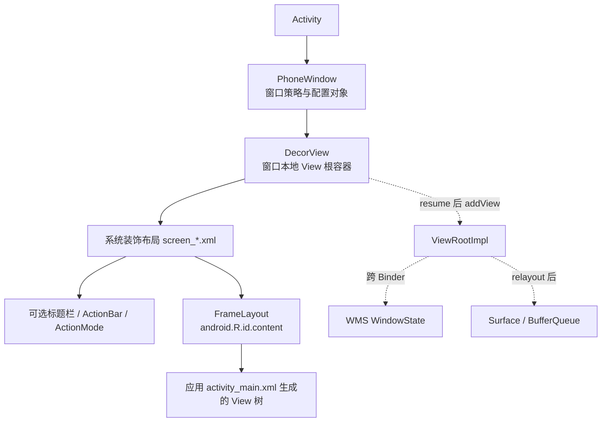

# 210 Android PhoneWindow、DecorView、主题 Feature 与 setContentView

> 源码版本：Android 11 `android-11.0.0_r48`。  
> 当前在 macOS 上只读源码，不实际编译、启动 Activity 或连接设备窗口系统。

## 1. 本章目标

第209章停在 `Activity.attach()` 已经创建 `PhoneWindow`、`onCreate()` 可以开始执行的位置。本章继续追开发者最熟悉的这一句：

```java
setContentView(R.layout.activity_main);
```

读完应能准确回答：

- `PhoneWindow`、`DecorView`、系统装饰布局和业务布局各是什么；
- 为什么 Activity 已有 Window，却可能还没有 DecorView；
- Manifest/Theme 中的窗口属性何时转成 Feature、Flag 和真实布局；
- `android.R.id.content` 在窗口树中的位置；
- `setContentView()` 完成后已经有什么，还没有什么；
- 为什么 `requestWindowFeature()` 必须早于 `setContentView()`。

## 2. 一句话主线

```text
Activity.attach 创建 PhoneWindow
  → onCreate 调用 setContentView
  → installDecor 懒创建 DecorView
  → generateLayout 读取 Window 主题属性
  → Feature 决定 screen_*.xml 系统骨架
  → 找到 android.R.id.content
  → inflate 应用布局并挂入 content
  → onContentChanged
  → 后续 resume 才 WindowManager.addView
```

## 3. 先看全景对象树



实线部分是本章 `setContentView()` 主要构建的本地 Java 对象树；虚线部分属于后续窗口加入与绘制阶段。

## 4. 先纠正“Window 是一个 View”

`PhoneWindow` 继承 `Window`，但它不是 View，也不参与 `measure/layout/draw`。它保存窗口 Feature、`WindowManager.LayoutParams`、主题解析结果、LayoutInflater、DecorView、内容容器和菜单等策略状态。

真正进入 View 树的是 `DecorView`。在 r48 中它继承 `FrameLayout`：

```java
public class DecorView extends FrameLayout
        implements RootViewSurfaceTaker, WindowCallbacks {
```

因此关系是 `Activity 持有 Window，Window 持有 DecorView`，不是 Activity 本身继承 Window 或 DecorView。

## 5. PhoneWindow 什么时候创建

第209章看到 `Activity.attach()`：

```java
mWindow = new PhoneWindow(this, window, activityConfigCallback);
mWindow.setCallback(this);
mWindow.getLayoutInflater().setPrivateFactory(this);
```

这发生在 `Activity.onCreate()` 之前，所以开发者在 `onCreate()` 中可立即调用 `getWindow()`、`requestWindowFeature()` 和 `setContentView()`。

## 6. 构造 PhoneWindow 时还没有 DecorView

普通新建窗口的构造函数主要取得 LayoutInflater和少量配置：

```java
public PhoneWindow(Context context) {
    super(context);
    mLayoutInflater = LayoutInflater.from(context);
    ...
}
```

此处通常没有执行 `new DecorView`，也没有膨胀任何 `screen_*.xml`。所以“Activity 已有 PhoneWindow”不等于“Activity 已有完整 View 树”。

## 7. 为什么采用懒创建

窗口装饰结构依赖最终主题属性和 Feature。应用可能在 `onCreate()` 开头先请求无标题、进度条或自定义标题；过早建 Decor 会让系统选错骨架，或者不得不拆掉重建。

懒创建也让无 UI、未设置内容或提前结束的路径少做工作。

## 8. DecorView 的创建触发点不只 setContentView

`PhoneWindow.getDecorView()` 本身就会触发安装：

```java
public final View getDecorView() {
    if (mDecor == null || mForceDecorInstall) {
        installDecor();
    }
    return mDecor;
}
```

因此 `getWindow().getDecorView()`、某些 `findViewById()`、ActionBar 初始化和后续 resume 都可能让 Decor 提前出现。

## 9. findViewById 也可能有副作用

`Window.findViewById()` 不是只查已有字段：

```java
public <T extends View> T findViewById(int id) {
    return getDecorView().findViewById(id);
}
```

若 Decor 尚未安装，这个查询会先执行 `installDecor()`。所以不要把所有 getter 都想成无副作用读取。

## 10. Activity.setContentView 只是门面

Activity 的资源ID重载很短：

```java
public void setContentView(@LayoutRes int layoutResID) {
    getWindow().setContentView(layoutResID);
    initWindowDecorActionBar();
}
```

真正决定内容容器、LayoutInflater 和转换动画的是 `PhoneWindow.setContentView()`；Activity 随后按最终 Feature 初始化 WindowDecorActionBar。

## 11. 为什么 ActionBar 初始化必须在后面

`generateLayout()` 才会读取主题中的 `windowActionBar`、`windowNoTitle` 等属性并把它们固化成 Feature。`initWindowDecorActionBar()` 又主动调用 `window.getDecorView()`，确保检查 Feature 前装饰已经安装。

所以不能只看 Activity.setContentView 的两行，就误以为 ActionBar 在应用布局之前独立创建完毕。

## 12. installDecor 分成两层

核心结构可以压缩为：

```java
if (mDecor == null) {
    mDecor = generateDecor(-1);
}
if (mContentParent == null) {
    mContentParent = generateLayout(mDecor);
    ...
}
```

第一层造最外部 DecorView；第二层根据主题与 Feature 造它里面的系统装饰结构，并找出应用内容容器。

## 13. generateDecor 创建的只是外壳

`generateDecor()` 最终执行：

```java
return new DecorView(context, featureId, this, getAttributes());
```

它会选择合适的 DecorContext，避免主 Activity Window 的 Decor 无谓强引用 Activity Context，同时仍通过 DecorContext 访问正确 PhoneWindow 和主题。

这一步还没有把 `screen_simple.xml` 等系统布局加入 DecorView。

## 14. DecorContext 不等于 Activity Context

主 Activity Window 设置 `mUseDecorContext = true`。若能取得 Application Context，系统基于它创建 `DecorContext(applicationContext, this)`，需要时再设置 PhoneWindow 的显式主题。

它主要用于装饰视图资源和服务访问；业务 View 的语义 Context 仍由 LayoutInflater 和主题包装共同决定，不能简单说“整棵 Activity View 都只持 Application Context”。

## 15. preservedWindow 是特殊分支

构造 `PhoneWindow(context, preservedWindow, ...)` 时，系统可能复用旧窗口的 DecorView，继承 elevation和token，并设置 `mForceDecorInstall`。

这是配置变化等保留窗口场景的优化。学习普通冷启动主线时，不应把“每次必 new DecorView”写成绝对规律。

## 16. generateLayout 才是主题固化点

方法开头取得 Window 样式：

```java
TypedArray a = getWindowStyle();
mIsFloating = a.getBoolean(
        R.styleable.Window_windowIsFloating, false);
```

后续把 Theme 中的窗口属性翻译为：

- Window Feature；
- WindowManager.LayoutParams flags与尺寸；
- 状态栏、导航栏和对比度配置；
- 背景、frame、elevation、动画；
- 最终使用的系统装饰 layout资源。

## 17. Theme 不是一张立即生成的布局

Theme 是层层继承并解析得到的属性集合。`windowNoTitle=true` 本身不是一个 View；`generateLayout()` 读取它后调用 `requestFeature(FEATURE_NO_TITLE)`，再由 Feature 分支选择 `screen_simple` 等布局。

因此正确链路是：

```text
Manifest android:theme
→ Context theme资源
→ Window style TypedArray
→ Feature/Flag/Drawable/尺寸
→ 系统装饰布局
```

## 18. Feature 与 Flag 不要混用

Feature 描述窗口内部要什么能力或装饰，例如：

- `FEATURE_NO_TITLE`；
- `FEATURE_ACTION_BAR`；
- `FEATURE_CUSTOM_TITLE`；
- `FEATURE_PROGRESS`；
- `FEATURE_CONTENT_TRANSITIONS`。

Flag 是 `WindowManager.LayoutParams.flags` 中交给窗口管理/显示策略的位，例如 `FLAG_FULLSCREEN`、`FLAG_DIM_BEHIND`、`FLAG_DRAWS_SYSTEM_BAR_BACKGROUNDS`。

两者都可能来自主题，但作用层次不同。

## 19. 浮动窗口先改变尺寸与 inset 策略

当 `windowIsFloating=true`：

```java
setLayout(WRAP_CONTENT, WRAP_CONTENT);
setFlags(0, flagsToUpdate);
```

非浮动窗口则设置 layout-in-screen/inset-decor相关 flags，并更新 fit insets。Dialog风格 Activity和普通全屏 Activity因此可能选择不同装饰布局和尺寸策略。

## 20. 主题可以隐式请求 Feature

例如：

```java
if (a.getBoolean(R.styleable.Window_windowNoTitle, false)) {
    requestFeature(FEATURE_NO_TITLE);
} else if (a.getBoolean(R.styleable.Window_windowActionBar, false)) {
    requestFeature(FEATURE_ACTION_BAR);
}
```

开发者没显式调用 `requestWindowFeature()`，不代表 Window 没有 Feature；主题会在安装 Decor 时补充它们。

## 21. No Title 压过 ActionBar

PhoneWindow 对冲突有明确规则：已有 `FEATURE_NO_TITLE` 时再请求 ActionBar返回false；已有 ActionBar时再请求No Title，会移除 ActionBar。

```java
if (hasNoTitle && featureId == FEATURE_ACTION_BAR) return false;
if (hasActionBar && featureId == FEATURE_NO_TITLE) {
    removeFeature(FEATURE_ACTION_BAR);
}
```

所以“两个位都请求了就看最后绘制谁”是不准确的，冲突在 Feature账本阶段就被处理。

## 22. 自定义标题还有组合限制

`FEATURE_CUSTOM_TITLE` 不能和不兼容的其他标题 Feature组合。PhoneWindow会直接抛 `AndroidRuntimeException`，而不是静默挑一个布局。

这也是必须读具体实现、不能只背 Feature常量的例子。

## 23. 为什么 requestFeature 必须在内容之前

PhoneWindow保存：

```java
private boolean mContentParentExplicitlySet = false;
```

请求 Feature 时首先检查：

```java
if (mContentParentExplicitlySet) {
    throw new AndroidRuntimeException(
            "requestFeature() must be called before adding content");
}
```

因为内容一旦放入某个系统骨架，再改变标题栏或内容转换能力就可能需要重建父子关系，系统选择禁止这种不确定操作。

## 24. 精确理解“before adding content”

对普通 API使用来说，就是在首次 `setContentView()` 之前调用 `requestWindowFeature()`。但实现检查的是 `mContentParentExplicitlySet`，不是单纯 `mDecor != null`。

仅调用 `getDecorView()` 会安装主题骨架，却不会把这个布尔值设为true；实现层随后请求Feature可能不抛这个异常，但已经安装的骨架也不会因此自动重新执行 `generateLayout()`。应用代码仍应严格遵循公开契约：先请求Feature，再触发Decor或设置内容。

## 25. Window.requestFeature 的位图账本

基类 Window把 featureId变成位：

```java
final int flag = 1 << featureId;
mFeatures |= flag;
mLocalFeatures |= mContainer != null
        ? (flag & ~mContainer.mFeatures) : flag;
```

`mFeatures` 表示有效 Feature集合，`mLocalFeatures` 处理嵌套/容器窗口只需本地提供的部分。普通顶层 Activity Window通常两者接近，但概念上不能永远画等号。

## 26. generateLayout 还读取哪些主题属性

除标题外，r48 还处理：

- fullscreen、translucent status/navigation；
- wallpaper、split touch；
- fixed/min width、fixed height；
- content/activity transitions；
- status/navigation bar颜色和明暗图标；
- display cutout模式、softInputMode；
- dim behind及dim amount；
- window动画、背景、frame、elevation和outline裁剪。

这说明 Theme不只影响颜色，也会影响窗口协议和几何。

## 27. targetSdk 会改变默认解释

源码会按 targetSdk选择 split touch、system bar背景、透明栏对比度等默认或兼容行为。

因此同一系统版本上，两个targetSdk不同的应用使用相似主题，也可能得到不同flags或视觉策略；读源码时要同时看OS版本和targetSdk分支。

## 28. 系统装饰 layout 如何选择

`generateLayout()` 根据 `getLocalFeatures()` 依次匹配：

```text
左右图标标题
→ 进度条且无ActionBar
→ 自定义标题
→ 有标题：浮动标题 / ActionBar / 普通标题
→ 无标题但ActionMode覆盖
→ 最简screen_simple
```

顺序有优先级，不是每个Feature各inflate一份互不相关的布局。

## 29. 常见系统装饰布局

| 条件 | 常见资源 | 大致结构 |
|---|---|---|
| 无标题、普通内容 | `screen_simple.xml` | ActionMode Stub + content |
| 普通标题 | `screen_title.xml` | title区域 + content |
| ActionBar | `screen_action_bar.xml` | ActionBarOverlayLayout + content + bar容器 |
| overlay action mode | `screen_simple_overlay_action_mode.xml` | content + overlay stub |
| 进度/自定义标题 | `screen_progress` / `screen_custom_title` | 对应装饰 + content |

具体主题资源可能覆盖某些布局属性，表中是r48主干默认骨架。

## 30. screen_simple 的关键不是“simple”而是 content

r48布局中有：

```xml
<FrameLayout
    android:id="@android:id/content"
    android:layout_width="match_parent"
    android:layout_height="match_parent" />
```

应用自己的布局最终放进这个 FrameLayout，而不是直接替换 DecorView。

## 31. ActionBar 布局也有同一个 content ID

`screen_action_bar.xml` 外层是 `ActionBarOverlayLayout`，内部同时包含：

- `@android:id/content`；
- `ActionBarContainer`；
- `ActionBarView`；
- `ActionBarContextView`；
- 可选 split action bar。

这让应用查找内容时不必关心系统选了哪一种装饰骨架。

## 32. DecorView.onResourcesLoaded 把骨架加进来

系统先独立inflate选中的装饰布局：

```java
final View root = inflater.inflate(layoutResource, null);
addView(root, 0,
        new ViewGroup.LayoutParams(MATCH_PARENT, MATCH_PARENT));
mContentRoot = (ViewGroup) root;
```

如果需要自由窗口caption，还会把 root放到DecorCaptionView里。普通路径则直接把 root作为DecorView子节点。

## 33. 为什么系统骨架 inflate 时 root 传 null

它随后用明确的 `MATCH_PARENT` LayoutParams 加到 DecorView，避免inflate阶段就自动attach。系统拥有外层结构和添加顺序，还要为caption、颜色View等内部层级留出控制空间。

不要把这段与应用布局 `inflate(layoutResID, mContentParent)` 混为一谈。

## 34. contentParent 是怎么找到的

系统骨架加入后：

```java
ViewGroup contentParent =
        (ViewGroup) findViewById(ID_ANDROID_CONTENT);
if (contentParent == null) {
    throw new RuntimeException(
            "Window couldn't find content container view");
}
```

`ID_ANDROID_CONTENT` 对应 `android.R.id.content`。系统布局若没有这个容器，PhoneWindow无法承载Activity内容，会立即报错。

## 35. 此时的层级要背成三层

```text
DecorView
└── 系统装饰root（screen_simple / screen_action_bar / ...）
    ├── 标题、ActionBar、ActionMode等系统区域
    └── android.R.id.content（mContentParent）
        └── 应用布局
```

“DecorView就是应用XML根布局”和“content就是DecorView”都不准确。

## 36. generateLayout 还完成背景与标题

顶层窗口会把解析到的Window背景、frame、elevation和clip-to-outline设置给DecorView，并把已有标题写到对应标题控件或DecorContentParent。

这解释了为什么应用尚未inflate业务布局，窗口背景和ActionBar标题结构就可能已存在。

## 37. startChanging/finishChanging 的含义

系统在加载装饰资源前后调用：

```java
mDecor.startChanging();
mDecor.onResourcesLoaded(...);
...
mDecor.finishChanging();
```

它用于Decor内部批量结构变化期间的状态协调。不能把方法名解释为WMS窗口事务开始/提交；此时普通冷启动路径仍可能没有调用WindowManager.addView。

## 38. installDecor 后还初始化 DecorContentParent

如果骨架包含 `R.id.decor_content_parent`，PhoneWindow会：

- 设置Window callback；
- 同步标题；
- 对本地Feature逐个调用 `initFeature()`；
- 设置UI options、图标和logo；
- 延后触发菜单失效处理。

ActionBar相关装饰因此不只是静态XML，还会和PhoneWindow菜单/回调协议连接。

## 39. Activity 是 Window.Callback

`Activity.attach()` 中 `mWindow.setCallback(this)`，因此PhoneWindow可回调Activity的内容变化、菜单、输入、窗口属性变化等。

这是 Activity和Window协作的接口关系，不表示PhoneWindow通过继承Activity调用生命周期。

## 40. setContentView(int) 的真实代码顺序

普通无内容转换路径可简化为：

```java
if (mContentParent == null) {
    installDecor();
} else {
    mContentParent.removeAllViews();
}
mLayoutInflater.inflate(layoutResID, mContentParent);
mContentParent.requestApplyInsets();
callback.onContentChanged();
mContentParentExplicitlySet = true;
```

每一步的完成边界不同，不能压缩成“给Window设置一个布局ID”。

## 41. inflate 的两参数重载会自动 attach

`LayoutInflater.inflate(resource, root)` 实际调用：

```java
return inflate(resource, root, root != null);
```

因为 `mContentParent` 非空，`attachToRoot=true`。应用XML生成的顶层View会在inflate过程中加入 `android.R.id.content`。

## 42. inflate 的返回值容易误导

当root非空且attachToRoot=true时，LayoutInflater文档说明返回root，也就是 `mContentParent`，不是必然返回应用XML自己的顶层View。

PhoneWindow根本不使用这里的返回值；它依赖自动attach完成父子关系。

## 43. Activity 作为 private Factory 的作用

`Activity.attach()` 把Activity设置成LayoutInflater的PrivateFactory。inflate每个XML标签时，Inflater会先询问公开Factory/Factory2，未创建时再询问Activity这个PrivateFactory；r48平台Activity的Factory2实现会特别处理 `<fragment>` 标签，其他标签可继续进入Inflater的一般创建逻辑。

这发生在“XML资源解析成Java View对象”的层次，不负责把View注册到WMS。

## 44. setContentView(View) 的默认尺寸

Activity最终调用PhoneWindow：

```java
setContentView(view,
        new ViewGroup.LayoutParams(MATCH_PARENT, MATCH_PARENT));
```

所以传入View自身原有LayoutParams不会被这个重载原样采用；想显式指定，应调用带params的重载。

## 45. setContentView(View, params) 不走XML inflate

普通路径直接：

```java
mContentParent.addView(view, params);
```

传入对象已经存在，因此没有XML解析和XML中子View创建，但仍会安装Decor、清旧内容、请求Insets、回调内容变化并锁定Feature时机。

## 46. 重复 setContentView 会发生什么

没有 `FEATURE_CONTENT_TRANSITIONS` 时，若 `mContentParent` 已存在，先执行 `removeAllViews()`，再加入新内容。因此它通常替换 `android.R.id.content` 下的业务子树，不会销毁并重建整个DecorView和ActionBar骨架。

旧业务View被移除后是否立刻可回收，还取决于应用其他引用、监听器和消息，不能仅凭remove断言GC完成。

## 47. Content Transitions 是特殊路径

若主题启用 `windowContentTransitions`，首次安装Decor时才可能请求 `FEATURE_CONTENT_TRANSITIONS`，所以源码特别强调必须先 `installDecor()` 再检查Feature。

随后用 `Scene.getSceneForLayout()` 或 `new Scene(mContentParent, view)`，通过TransitionManager切换，不走简单removeAllViews+inflate分支。

## 48. 为什么不能在 installDecor 前检查转换Feature

因为应用可能只在Theme中声明窗口内容转换，没有显式调用 `requestFeature()`。Theme要等 `generateLayout()` 解析才会把属性转成Feature。

这是一条通用源码阅读经验：某个状态位可能由显式API设置，也可能在延迟解析配置时补齐。

## 49. addContentView 与 setContentView 不同

`Activity.addContentView()` 会把新View追加到现有内容容器，明确不删除原有View：

```java
mContentParent.addView(view, params);
```

它适合在当前内容树上额外叠加或补充子View；若误当成替换API，可能得到多个兄弟节点。

## 50. addContentView 对内容转换支持有限

r48检测到Content Transitions时只打印“does not support content transitions”，仍执行addView。

因此不能类推“只要Window启用转换，所有内容增删都会自动用Scene动画”。

还有一个实现细节：r48的 `addContentView()` 没有像两个 `setContentView()` 主实现那样写入 `mContentParentExplicitlySet=true`。这不应被当成“追加内容后再改Feature”的推荐用法；Feature决定的系统骨架可能早已安装，公开使用顺序仍应是先配置Window、后添加任何内容。

## 51. requestApplyInsets 只是提出请求

内容加入后调用：

```java
mContentParent.requestApplyInsets();
```

它标记需要重新分发WindowInsets。若View树尚未attach到ViewRoot，没有来自真实窗口的完整Insets状态，这行不代表Insets已经同步计算并回调完毕。

## 52. onContentChanged 是结构变化通知

PhoneWindow取得Callback并检查窗口未destroy后调用：

```java
cb.onContentChanged();
```

普通Activity默认实现为空。自定义Window callback或框架组件可以用它获知内容变化。

它不表示 `onCreate()` 已返回，也不表示measure/layout/draw、Surface提交或屏幕显示完成。

## 53. ExplicitlySet 标志为什么最后才写

`mContentParentExplicitlySet = true` 在内容加入和回调之后设置。其主要用途是禁止后续Feature请求，并标识调用者已经显式提供内容。

若inflate或callback中抛异常，方法不会正常走到最后；这时对象可能处在部分构造状态，不能把异常路径当成一次成功setContentView。

## 54. setContentView 完成时已经有什么

普通成功路径通常已有：

- PhoneWindow和Window属性账本；
- DecorView对象；
- 系统装饰View树；
- `android.R.id.content`；
- 应用XML对应的Java View对象树；
- 主题、背景、ActionBar/标题等本地配置；
- 父子关系和初始LayoutParams。

这些都在App进程主线程内完成。

## 55. setContentView 完成时还没有什么

普通冷启动且尚未resume/addView时，不能据此断言已有：

- ViewRootImpl；
- WMS中的WindowState；
- relayout返回的Surface；
- 完成的measure/layout/draw；
- 已提交给SurfaceFlinger的首Buffer；
- 硬件屏幕上已present的首帧。

这六个边界是后续章节的重点。

## 56. 为什么没有 ViewRoot 也能创建 View树

View/ViewGroup本来就是普通Java对象，可以离线建立父子关系、读取资源并保存布局参数。`ViewRootImpl` 是这棵树与窗口session、输入、VSync和遍历调度接轨的桥。

所以“创建树”和“让树参与窗口渲染”是两个阶段。

## 57. 后续 addView 在哪里发生

第209章已看到 `ActivityThread.handleResumeActivity()` 在满足可见性等条件后执行大意如下：

```java
View decor = r.window.getDecorView();
WindowManager wm = a.getWindowManager();
wm.addView(decor, l);
```

WindowManagerGlobal再创建ViewRootImpl并调用setView，之后才进入WMS addWindow/relayout、Surface和Traversal链路。

## 58. getDecorView 可以早于 setContentView

若Activity从不调用setContentView，resume路径仍可能调用getDecorView并安装系统骨架。此时content容器可以为空，但顶层窗口装饰仍可能加入WindowManager。

因此“没有setContentView就绝对没有窗口”也不准确；是否可见还受noDisplay、finish、Window属性和生命周期路径影响。

## 59. windowNoDisplay 的边界

NoDisplay主题会影响Activity是否允许成为可见窗口，ActivityThread也维护 `mVisibleFromClient`。即使某条路径曾创建PhoneWindow或Decor对象，也不等于一定执行普通可见窗口addView。

对象存在、加入WindowManager、WMS接受、Surface可绘制、帧显示必须分别取证。

## 60. Window背景为什么影响启动观感

应用业务布局inflate前，Decor可先取得 `windowBackground`。冷启动时系统还可能有starting window/启动预览；真实Activity窗口建立后，Decor背景可覆盖业务首帧尚未绘制的区域。

这解释了主题窗口背景对白屏/闪屏体验的重要性，但本章不把starting window与真实Decor误写为同一对象。

## 61. Insets 与 system bar 的分工

`generateLayout()` 设置系统栏颜色、light flags、fit insets配置；装饰布局可能使用 `fitsSystemWindows`；内容加入后请求Insets。

但最终Insets来源要等窗口与DisplayContent/WMS状态接轨。主题只提供策略初值，不独立决定运行时键盘、cutout和动态系统栏的全部Insets。

## 62. 线程与进程边界

本章普通主线：

| 阶段 | 进程 | 线程 | 跨进程？ |
|---|---|---|---|
| Activity.onCreate | App | 主线程 | 否 |
| installDecor/generateLayout | App | 主线程 | 通常否 |
| 资源解析/LayoutInflater | App | 主线程 | 否 |
| View对象创建与addView到content | App | 主线程 | 否 |
| WindowManager.addView之后 | App→system_server | 主线程及Binder | 是 |

主题/资源访问可能触发磁盘页错误或资源管理成本，但这里没有因为方法名叫Window就自动跨Binder。

## 63. 常见误解集中纠正

### 误解一：setContentView把XML设为DecorView

实际是应用XML加入系统装饰布局中的 `android.R.id.content`。

### 误解二：new PhoneWindow立即创建整棵View树

普通路径Decor和系统骨架都是懒安装。

### 误解三：Theme只决定颜色

Theme还决定Feature、Flag、尺寸、背景、动画、状态栏策略和系统骨架。

### 误解四：setContentView返回就显示了

它通常只完成App进程本地对象树，尚未经过ViewRoot/WMS/Surface/首帧。

### 误解五：findViewById永远是纯查询

Window.findViewById会通过getDecorView触发Decor安装。

### 误解六：重复setContentView重建整个窗口

普通路径只清空并替换content容器的业务子View，Decor骨架继续复用。

## 64. 从一个开发者 onCreate 逐句映射

```java
protected void onCreate(Bundle state) {
    super.onCreate(state);
    requestWindowFeature(Window.FEATURE_NO_TITLE);
    setContentView(R.layout.activity_main);
    TextView title = findViewById(R.id.title);
}
```

对应源码含义：

```text
super.onCreate：Activity生命周期基础初始化
requestWindowFeature：写PhoneWindow Feature位，尚未选装饰layout
setContentView：安装Decor→解析Theme→选screen_simple→找到content→inflate业务树
findViewById：从Window的Decor根递归查找，命中业务子树中的title
```

若把Feature调用移到setContentView后，PhoneWindow会因内容已显式设置而抛异常。

## 65. 源码阅读入口

建议按以下顺序读：

1. `frameworks/base/core/java/android/app/Activity.java`
   - `attach`
   - `setContentView`
   - `requestWindowFeature`
   - `initWindowDecorActionBar`
2. `frameworks/base/core/java/com/android/internal/policy/PhoneWindow.java`
   - 构造函数
   - `requestFeature`
   - `setContentView`
   - `generateDecor`
   - `generateLayout`
   - `installDecor`
3. `frameworks/base/core/java/com/android/internal/policy/DecorView.java`
   - 类定义
   - `setWindow`
   - `onResourcesLoaded`
4. `frameworks/base/core/java/android/view/Window.java`
   - `requestFeature`
   - `findViewById`
5. `frameworks/base/core/java/android/view/LayoutInflater.java`
   - 两参数与三参数 `inflate`
6. `frameworks/base/core/res/res/layout/screen_*.xml`

## 66. macOS 只读练习一：定位懒安装入口

```bash
cd /Users/ninebot/androidSource
rg -n "getDecorView\(|installDecor\(|generateDecor\(|generateLayout\(" \
  frameworks/base/core/java/com/android/internal/policy/PhoneWindow.java
```

练习目标：画出 `getDecorView/setContentView → installDecor → generateDecor/generateLayout` 调用关系，不要求编译。

## 67. macOS 只读练习二：比较装饰布局

```bash
cd /Users/ninebot/androidSource
rg -n "@android:id/content|decor_content_parent|action_mode_bar" \
  frameworks/base/core/res/res/layout/screen_*.xml
```

观察不同布局怎样都提供统一content ID，同时额外携带标题、ActionBar或ActionMode区域。

## 68. macOS 只读练习三：验证 inflate 自动attach

```bash
cd /Users/ninebot/androidSource
sed -n '470,530p' \
  frameworks/base/core/java/android/view/LayoutInflater.java
```

请亲自确认两参数重载把 `root != null` 作为 `attachToRoot`，再回看PhoneWindow为何不接收inflate返回值。

## 69. 自测题

1. PhoneWindow与DecorView为什么不是同一层对象？
2. Activity已有PhoneWindow后，DecorView最早可能由哪些调用触发？
3. Theme的 `windowNoTitle` 怎样最终改变系统装饰布局？
4. `FEATURE_NO_TITLE` 和 `FLAG_FULLSCREEN` 有什么层次差异？
5. 为什么应用布局不是DecorView直接根节点？
6. `setContentView(int)` 的inflate为什么会自动attach到content？
7. 重复setContentView与addContentView分别怎样处理旧内容？
8. onContentChanged可以证明哪些事，不能证明哪些事？
9. setContentView返回时为什么通常还没有ViewRootImpl？
10. 为什么仅调用findViewById也可能安装Decor？

## 70. 自测答案

1. PhoneWindow是窗口策略/状态对象，不是View；DecorView是其持有的FrameLayout根容器。
2. setContentView、getDecorView、Window.findViewById、ActionBar初始化及后续resume等都可能触发。
3. generateLayout从Window style读取属性，request NO_TITLE Feature，再按Feature选择如screen_simple的骨架。
4. Feature控制本地窗口装饰能力；Flag进入WindowManager.LayoutParams，参与窗口管理和显示策略。
5. Decor先承载系统screen布局，系统布局中的android.R.id.content才承载应用布局。
6. LayoutInflater两参数重载在root非空时令attachToRoot=true。
7. 普通重复setContentView先清content旧子View；addContentView保留旧内容并追加。
8. 它证明PhoneWindow已通知内容结构改变，不证明生命周期结束、布局绘制或上屏。
9. ViewRoot通常在resume阶段WindowManager.addView时创建；View树可先作为本地Java对象存在。
10. Window.findViewById内部先调用getDecorView，后者会按需installDecor。

## 71. 本章结论

`setContentView()` 的本质不是“显示页面”，而是把主题窗口配置固化成一棵分层View树：PhoneWindow先懒创建DecorView，再按Theme和Feature选择系统装饰骨架，找到统一的 `android.R.id.content`，最后把应用布局inflate或add进去。

这一阶段主要发生在App主线程，本地建立对象与父子关系。只有后续Activity resume把Decor交给WindowManager，系统才会创建ViewRootImpl、向WMS添加WindowState、取得Surface并开始遍历与首帧链路。

## 72. 复读后的边界修订

- 不把 `mDecor != null` 当作Feature公开调用契约：实现的异常门是 `mContentParentExplicitlySet`，但应用仍应在任何Decor触发前请求Feature，避免已安装骨架与新Feature不一致。
- 不把DecorContext扩大解释成整棵业务View只持Application Context；它服务于主窗口Decor，具体View Context还受Inflater和主题包装影响。
- 不把 `startChanging/finishChanging` 解释成WMS或Surface事务，它只是Decor内部结构变化协调。
- 不把 `requestApplyInsets` 写成Insets已经交付；尚未attach时它主要建立待处理请求。
- 不把重复setContentView一律描述成removeAllViews；启用Content Transitions时走Scene/Transition分支。
- 不把普通冷启动写成每次必new DecorView；preservedWindow路径允许复用。
- 不把存在Decor或content推导成可见窗口；noDisplay、finish、生命周期和addView条件仍要单独判断。
- 不把 `onContentChanged`、`onCreate`返回、Window add、首帧提交和硬件present合并成一个“页面已显示”完成点。

下一章将继续追 `LayoutInflater`：XML如何经Resources/XmlBlock、Factory链、反射构造和LayoutParams生成一棵真实View对象树。
