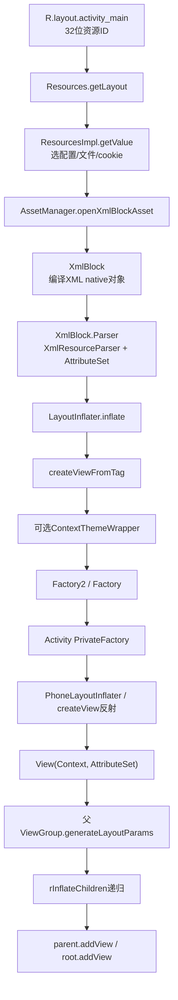
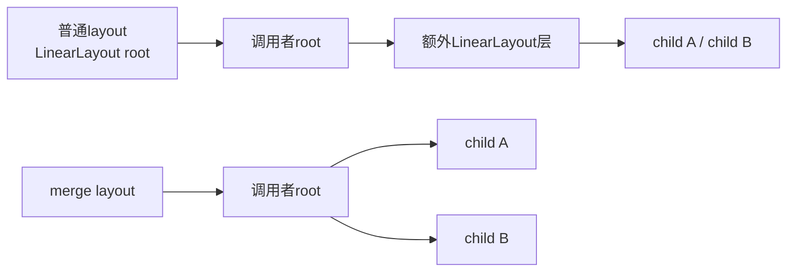

# 211 Android LayoutInflater：XML解析、Factory链与View对象构造

> 源码版本：Android 11 `android-11.0.0_r48`。  
> 当前在 macOS 上只读源码，不实际编译APK、运行Activity或测量inflate耗时。

## 1. 本章目标

第210章看到 `PhoneWindow.setContentView()` 调用：

```java
mLayoutInflater.inflate(layoutResID, mContentParent);
```

本章把这行展开，回答一个看似简单、实际跨越资源系统和对象构造的问题：一个 `R.layout.xxx` 整数怎样变成带父子关系、Context、属性和LayoutParams的Java View树。

读完应能区分：

- 工程纯文本XML、APK编译XML、XmlBlock和XmlResourceParser；
- LayoutInflater、Factory2/Factory、PrivateFactory和默认反射创建；
- View自己的属性与父ViewGroup解释的layout属性；
- `root`、`attachToRoot`、返回值和最终parent四者关系；
- 普通标签、`<view>`、`<merge>`、`<include>`、`ViewStub`的不同语义；
- inflate完成与measure/layout/draw完成的边界。

## 2. 一句话主线

```text
R.layout整数
→ Resources解析当前配置对应资源文件
→ AssetManager打开编译XML XmlBlock
→ XmlResourceParser输出START_TAG/END_TAG事件
→ LayoutInflater递归读取标签
→ 主题包装Context
→ Factory2/Factory/PrivateFactory尝试创建
→ 默认ClassLoader+反射调用(Context, AttributeSet)
→ 父ViewGroup生成LayoutParams
→ 递归子节点并onFinishInflate
→ 按attachToRoot决定是否加到root
```

## 3. 完整调用与对象图



整个普通inflate主线发生在App进程调用线程；Activity的setContentView通常在主线程执行。

## 4. LayoutInflater不是“把字符串XML翻译成View”的孤立工具

它依赖：

- Resources选择正确的layout资源变体；
- AssetManager提供APK/资源包里的编译XML；
- XmlResourceParser提供事件和AttributeSet；
- Context提供Resources、Theme和ClassLoader；
- Factory链提供可替换的创建钩子；
- 父ViewGroup解释其孩子的LayoutParams。

缺少任一层，都无法完整解释inflate结果。

## 5. LayoutInflater从哪里来

`LayoutInflater.from(context)` 实际取得Context系统服务：

```java
return (LayoutInflater) context.getSystemService(
        Context.LAYOUT_INFLATER_SERVICE);
```

它不是跨Binder向system_server申请一个远程服务；这是Context内的本地系统服务对象。

## 6. Android 11手机策略返回PhoneLayoutInflater

`SystemServiceRegistry` 注册：

```java
registerService(Context.LAYOUT_INFLATER_SERVICE,
        LayoutInflater.class,
        new CachedServiceFetcher<LayoutInflater>() {
    public LayoutInflater createService(ContextImpl ctx) {
        return new PhoneLayoutInflater(ctx.getOuterContext());
    }
});
```

所以Activity中的典型对象是 `PhoneLayoutInflater`，不是直接实例化抽象基类LayoutInflater。

## 7. 为什么服务使用OuterContext

ContextImpl内部可对应Activity等外层Context。Inflater创建View时需要正确的主题、资源和Activity语义，因此构造PhoneLayoutInflater时传 `ctx.getOuterContext()`。

这与简单保存裸ContextImpl不同，也解释了Activity.attach阶段为何还把Activity设为PrivateFactory。

## 8. PhoneLayoutInflater补充系统类名前缀

r48依次尝试：

```java
private static final String[] sClassPrefixList = {
    "android.widget.",
    "android.webkit.",
    "android.app."
};
```

因此XML写 `<TextView>` 时，可解析成 `android.widget.TextView`；若是完整类名 `com.example.MyView`，则无需系统前缀。

## 9. 基类的默认前缀只是android.view

LayoutInflater基类 `onCreateView()` 最终尝试：

```java
return createView(name, "android.view.", attrs);
```

PhoneLayoutInflater先尝试widget/webkit/app，失败后再让基类尝试view。短标签能工作不是Java自动导包，而是Inflater显式拼前缀并逐个加载类。

## 10. Inflater绑定Context

构造函数保存：

```java
protected LayoutInflater(Context context) {
    mContext = context;
    initPrecompiledViews();
}
```

这个Context决定资源、默认Theme和ClassLoader，也是无子级主题覆盖时View构造器得到的基础环境。

## 11. cloneInContext不是随便换一个字段

PhoneLayoutInflater实现：

```java
public LayoutInflater cloneInContext(Context newContext) {
    return new PhoneLayoutInflater(this, newContext);
}
```

拷贝构造会继承Factory、PrivateFactory和Filter，同时换Context。ViewStub延迟inflate、主题包装等场景需要保持创建策略又使用新环境。

## 12. 从资源ID开始而不是文件路径

应用传入的是编译常量 `R.layout.activity_main`。Resources先根据ID取得TypedValue，其中包含当前配置匹配后的文件路径和asset cookie：

```java
impl.getValue(id, value, true);
if (value.type == TypedValue.TYPE_STRING) {
    return loadXmlResourceParser(value.string.toString(),
            id, value.assetCookie, "layout");
}
```

这一步已体现资源表对语言、横竖屏、尺寸等变体的选择。

## 13. 一个资源ID不是磁盘偏移量

资源ID编码package/type/entry身份，ResourcesImpl结合当前Configuration和资源表解析实际条目。不能仅根据整数低位直接定位APK里的字节，也不能假设同名layout永远选默认目录版本。

## 14. Resources.getLayout返回Parser

公开方法只是：

```java
public XmlResourceParser getLayout(int id) {
    return loadXmlResourceParser(id, "layout");
}
```

它没有直接生成View；它返回能遍历编译XML事件、同时暴露资源属性值的Parser。

## 15. APK里的布局不是工程纯文本原样

Resources文档明确说明XML已在构建期预解析，文本被合并、注释被移除。LayoutInflater文档也提示普通纯文本XmlPullParser不能直接替代这种运行时编译资源Parser。

因此本章“解析XML”指解析Android编译XML事件流，不是用通用DOM重新读工程文件。

## 16. AssetManager打开XmlBlock

缓存未命中时ResourcesImpl调用：

```java
final XmlBlock block =
        mAssets.openXmlBlockAsset(assetCookie, file);
return block.newParser(id);
```

AssetManager再经native层打开资源包中的编译XML，得到由Java XmlBlock包装的native对象。

## 17. XmlBlock缓存缓存了什么

ResourcesImpl以 `assetCookie + file` 查一个小型XmlBlock数组缓存。命中时从已有block创建新的Parser；未命中时替换轮转位置并关闭旧block。

它不是缓存最终View树，也不是保证同一layout每次返回同一个Parser对象。

## 18. XmlBlock与Parser生命周期分开

`XmlBlock.newParser()` 创建native parse state，并增加block open count。Parser关闭时释放自己的解析状态和引用；block无引用后才销毁native对象。

这让同一个编译XML block可产生多个独立遍历位置的Parser。

## 19. 为什么inflate必须关闭Parser

资源ID重载使用try/finally：

```java
XmlResourceParser parser = res.getLayout(resource);
try {
    return inflate(parser, root, attachToRoot);
} finally {
    parser.close();
}
```

即使创建View或解析属性抛异常，也要释放parse state及block引用。只读源码时可从这里学习资源句柄的结构化清理。

## 20. 三参数inflate是语义核心

资源ID版本最终进入：

```java
inflate(XmlPullParser parser,
        ViewGroup root,
        boolean attachToRoot)
```

`root` 和 `attachToRoot` 必须分开理解：root既可提供将来的父容器类型/LayoutParams，也可成为立即attach目标；attachToRoot决定当前是否真正加入。

## 21. 两参数重载的隐式规则

```java
public View inflate(int resource, ViewGroup root) {
    return inflate(resource, root, root != null);
}
```

传非空root时默认立即attach；传null时不attach。第210章PhoneWindow传 `mContentParent`，所以应用布局自动加入 `android.R.id.content`。

## 22. inflate开始时为什么锁mConstructorArgs

核心方法：

```java
synchronized (mConstructorArgs) {
    ...
}
```

Inflater复用 `mConstructorArgs[0/1]` 作为反射构造参数，并在递归中临时切换Context/AttributeSet；加锁防止同一个Inflater实例被并发inflate时互相覆盖这些数组槽位。

这不等于所有LayoutInflater实例共享一把全局锁。

## 23. 普通Activity为什么仍应在主线程inflate UI

本章源码锁只保护Inflater的构造参数，不让View体系变成线程安全。View创建可能访问Theme、Drawable、Looper相关对象或触发自定义View逻辑；最终加入Activity树和后续ViewRoot操作也要求主线程语义。

不能因看到`synchronized`就推导“后台线程inflate后直接操作UI完全安全”。

## 24. AttributeSet不是复制出的Map

```java
final AttributeSet attrs = Xml.asAttributeSet(parser);
```

对XmlBlock.Parser来说，Parser本身实现AttributeSet。attrs反映Parser当前标签的位置；解析推进后同一对象代表的当前属性也随之变化。

自定义View若需要长期保留某个属性，应在构造期间解析/复制所需值，不能无条件保存attrs引用等待以后读取。

## 25. 先推进到第一个根START_TAG

`advanceToRootNode()` 跳过START_DOCUMENT等事件，直到START_TAG或END_DOCUMENT。没有根标签时抛：

```text
No start tag found!
```

它不根据缩进或文本猜根节点，而依赖Parser事件类型和深度。

## 26. 普通根标签的四步

非`<merge>`根节点走：

```text
createViewFromTag 创建根View temp
→ root非空时由root生成temp的LayoutParams
→ rInflateChildren递归创建temp内部子树
→ attachToRoot=true时root.addView(temp, params)
```

最后根据参数决定返回root还是temp。

## 27. createViewFromTag先处理特殊view标签

若标签名是字面量 `<view>`：

```java
if (name.equals("view")) {
    name = attrs.getAttributeValue(null, "class");
}
```

因此 `<view class="com.example.MyView">` 与直接写完整类名是两种入口语法，最终都进入相同创建链。

## 28. 每个标签可以覆盖android:theme

未要求忽略主题属性时：

```java
int themeResId = ta.getResourceId(0, 0);
if (themeResId != 0) {
    context = new ContextThemeWrapper(context, themeResId);
}
```

该View构造器得到包装Context；递归子节点又使用父View的Context，因此主题可自然向子树传播。

## 29. View的Context可能不等于Activity对象

没有局部主题时常是Activity Context；有 `android:theme`、include主题覆盖或其他Factory包装时，可以是ContextThemeWrapper。

所以业务代码不应无条件把 `view.getContext()` 强转成具体Activity。需要Activity时应明确解包或使用可靠的所有权传递方式。

## 30. Factory调用顺序

`tryCreateView()` 的顺序是：

```java
if (mFactory2 != null) {
    view = mFactory2.onCreateView(parent, name, context, attrs);
} else if (mFactory != null) {
    view = mFactory.onCreateView(name, context, attrs);
}
if (view == null && mPrivateFactory != null) {
    view = mPrivateFactory.onCreateView(parent, name, context, attrs);
}
```

只有前面的钩子返回null，后续创建者才有机会。

## 31. Factory2比Factory多了parent

Factory只能看到name/context/attrs；Factory2还看到“将来的parent”。这有助于基于父层主题、布局语义或兼容策略选择View实现。

这里传入parent不表示View已经attach；它只是创建阶段的上下文信息。

## 32. Factory只允许公开设置一次

`setFactory()`/`setFactory2()`检查 `mFactorySet`，重复设置抛IllegalStateException。若Inflater已有Factory，源码可通过FactoryMerger把新旧链组合。

这避免后设置者悄悄覆盖先设置者，同时也要求库在正确时机安装自己的Factory。

## 33. FactoryMerger的短路规则

合并器先询问第一Factory，返回非null就结束；否则询问第二Factory。Factory2路径优先调用带parent版本，缺失时回退Factory接口。

因此多个Factory的“顺序”会改变谁有权替换某个标签，并非所有Factory都会收到每一个成功创建的View。

## 34. PrivateFactory属于框架内部链

`setPrivateFactory()` 是隐藏API，可合并多个私有Factory。Activity.attach执行：

```java
mWindow.getLayoutInflater().setPrivateFactory(this);
```

Activity实现Factory2，因此普通公开Factory未创建标签时，平台Activity还有一次处理机会。

## 35. r48 Activity PrivateFactory具体做什么

Activity的四参数 `onCreateView()` 对非`fragment`标签继续调用旧版回调，默认通常返回null；遇到 `<fragment>` 时交给 `mFragments.onCreateView(...)`。

所以不能笼统说“Activity PrivateFactory创建所有View”。它是一个钩子，是否创建取决于标签和重写实现。

## 36. AppComponentFactory不负责普通View标签

第209章AppComponentFactory参与Activity等组件实例化。LayoutInflater创建普通View使用Factory链和ClassLoader反射，没有默认转去AppComponentFactory。

组件工厂与布局工厂名称相似，但职责和调用链不同。

## 37. Factory返回View后默认反射被跳过

若Factory2/Factory/PrivateFactory任一返回非null，`createViewFromTag()` 直接采用该对象。Inflater仍会继续生成LayoutParams、递归XML子标签并把它加入父容器。

因此Factory替换的是“这个标签对应的对象如何产生”，不是自动接管整个递归与attach流程。

## 38. 所有Factory返回null才走默认创建

```java
if (-1 == name.indexOf('.')) {
    view = onCreateView(context, parent, name, attrs);
} else {
    view = createView(context, name, null, attrs);
}
```

无点短类名交给PhoneLayoutInflater逐前缀尝试；含点完整类名直接按原名加载。

## 39. ClassLoader从Inflater基础Context取得

默认创建使用：

```java
Class.forName(fullName, false,
        mContext.getClassLoader()).asSubclass(View.class);
```

传给构造器的 `viewContext` 可是ThemeWrapper，但类查找使用Inflater持有Context的ClassLoader。这两种Context角色不要混为一谈。

## 40. asSubclass先验证类型

`asSubclass(View.class)` 确保加载类确实是View子类。不是View时转成带位置描述的InflateException，而不是让任意Java对象进入View树。

这属于类型安全门，不是Android权限或SELinux检查。

## 41. 默认反射要求哪个构造器

签名固定为：

```java
static final Class<?>[] mConstructorSignature = {
    Context.class, AttributeSet.class
};
```

Inflater取得该构造器并调用 `newInstance(context, attrs)`。自定义View只有单参数Context构造器而缺少XML构造器时，直接从XML inflate会失败。

## 42. 四参数View构造器不是Inflater直接反射目标

很多View类内部让二参数构造器链到三/四参数构造器以应用styleAttr/styleRes。但LayoutInflater默认反射入口仍是 `(Context, AttributeSet)`。

后续默认样式解析发生在View类自己的构造链，不是Inflater为所有View统一反射四参数版本。

## 43. 构造器缓存的目的

```java
private static final HashMap<String,
        Constructor<? extends View>> sConstructorMap;
```

首次成功查类和构造器后缓存Constructor，后续相同标签可跳过部分反射查找成本。

缓存的是构造器元数据，不是View实例；每次inflate仍new一个新对象。

## 44. 构造器缓存为什么校验ClassLoader

命中缓存后先 `verifyClassLoader(constructor)`；不兼容就移除并重新加载。应用/动态代码环境里同名类可能来自不同ClassLoader，盲目复用旧Constructor会创建错误类型或泄漏加载环境。

因此“静态Map按类名永久全局复用”不是完整描述。

## 45. Filter是可选的类加载限制

Inflater可设置Filter，在准备inflate类时调用 `onLoadClass(clazz)`。不允许则抛InflateException；缓存构造器场景还用mFilterMap缓存允许结果。

它是调用者可配置的Inflater级白名单钩子，不等价于Manifest权限、PackageManager校验或SELinux策略。

## 46. 反射参数数组为何需要恢复

createView临时把：

```java
mConstructorArgs[0] = viewContext;
mConstructorArgs[1] = attrs;
```

传给构造器，finally恢复旧Context；外层inflate最终也清空AttributeSet槽位，避免Inflater长期持有Parser/Context引用或递归主题串位。

## 47. 构造器执行的是应用代码边界

`constructor.newInstance(args)` 可能执行自定义View构造逻辑：读取StyledAttributes、创建子对象、加载Drawable，甚至做不合适的I/O。

所以inflate耗时不仅是XML Parser和反射，也包括每个View构造器及其资源解析成本。

## 48. ViewStub为何得到克隆Inflater

若新对象是ViewStub：

```java
viewStub.setLayoutInflater(
        cloneInContext((Context) args[0]));
```

ViewStub稍后变为visible或显式inflate时，使用同一主题Context和Factory策略创建目标布局，而不是在当前递归中立即创建目标子树。

## 49. ViewStub对象已创建不等于目标布局已创建

当前inflate只创建轻量ViewStub并放进树；其 `android:layout` 指向的真实布局留到以后。故查性能和对象数量时，必须区分stub本身与延迟布局。

## 50. rInflate是深度递归

普通子节点循环：

```java
View view = createViewFromTag(parent, name, context, attrs);
ViewGroup group = (ViewGroup) parent;
LayoutParams params = group.generateLayoutParams(attrs);
rInflateChildren(parser, view, attrs, true);
group.addView(view, params);
```

顺序是先构造父对象，再完整构造其子树，最后把该对象加入外层parent。

## 51. 为什么先递归孩子再加到外层父容器

新View对象已存在，可以作为自己的孩子的parent；其内部子树完成并调用onFinishInflate后，外层再addView。

这不代表整棵树直到最后都没有任何parent：内层子节点会逐级加入新建的ViewGroup，只是当前节点尚未加入再外一层。

## 52. XML含子标签时父标签必须是ViewGroup

rInflate把parent强转ViewGroup并调用generateLayoutParams/addView。若普通View标签里错误嵌套子View，运行时会失败。

XML的层级合法性不仅靠语法，还是由对应Java对象是否能承载子View决定。

## 53. LayoutParams由父容器创建

关键代码：

```java
ViewGroup.LayoutParams params =
        viewGroup.generateLayoutParams(attrs);
```

`layout_width/height` 以及 `layout_gravity`、RelativeLayout规则等描述“孩子在父容器中怎么摆”，所以由父ViewGroup解释并生成自己的LayoutParams子类。

## 54. 同一个子View换父容器为何参数可能不兼容

LinearLayout.LayoutParams、FrameLayout.LayoutParams等携带不同字段。父容器addView时会检查/转换参数。

因此LayoutParams不是View的绝对尺寸说明书，而是特定父容器与该孩子之间的布局协议。

## 55. root即使不attach也很重要

调用：

```java
inflate(layout, parent, false)
```

不会把结果加入parent，但会用parent的 `generateLayoutParams(attrs)` 给XML根View生成正确参数并调用 `temp.setLayoutParams(params)`。

这就是Adapter创建item时推荐传parent且attachToRoot=false的核心原因之一。

## 56. 传null root会失去父容器参数语义

`inflate(layout, null, false)` 无法知道未来父容器类型，因此不会在根节点阶段生成对应LayoutParams。之后add入真实父容器时可能只能生成默认参数，或无法体现XML根标签中的某些 `layout_*` 属性。

不是所有场景都会立刻崩溃，但语义信息可能缺失。

## 57. attachToRoot决定谁执行addView

- `root != null && attachToRoot=true`：Inflater最后 `root.addView(temp, params)`；
- `root != null && attachToRoot=false`：只把params设给temp，由调用者稍后add；
- `root == null && attachToRoot=false`：返回temp，当前无外层父容器可加；
- 普通根布局若 `root == null && attachToRoot=true`，add条件仍不成立并返回temp，这个true没有实际attach目标；若根是merge则会因缺少root直接抛异常。

不要在Inflater已attach后再由调用者重复add同一个View，否则会遇到已有parent错误。

## 58. 返回值规则必须单独记

```java
View result = root;
...
if (root == null || !attachToRoot) {
    result = temp;
}
```

所以：

| root | attachToRoot | 返回值 | 是否已加到root |
|---|---:|---|---:|
| null | false | XML根View | 否 |
| null | true（普通根） | XML根View | 否，无root可加 |
| 非null | false | XML根View | 否 |
| 非null | true | 传入的root | 是 |

两参数 `inflate(layout, root)` 在root非空时属于最后一行。

## 59. onFinishInflate何时调用

`rInflate(..., finishInflate=true)` 在当前View所有XML孩子完成后调用：

```java
parent.onFinishInflate();
```

自定义ViewGroup可在这里通过ID取得XML子View并完成绑定。此时孩子对象已加进它，但整棵树未必已attach到Window。

## 60. onFinishInflate不等于onAttachedToWindow

前者属于XML对象树构造收尾；后者发生在View树接入ViewRoot并分发窗口attach时。两者中间可能隔着Activity onCreate余下逻辑、resume和WindowManager.addView。

同理，onFinishInflate也不代表measure/layout/draw完成。

## 61. `<merge>`为什么没有自己的View对象

根标签是`<merge>`时，Inflater不调用createViewFromTag，而是把它的子节点直接rInflate到调用者提供的root。



它可减少无意义包裹层，但也改变布局参数归属和层级。

## 62. `<merge>`的严格条件

```java
if (root == null || !attachToRoot) {
    throw new InflateException(
        "<merge /> can be used only with a valid "
        + "ViewGroup root and attachToRoot=true");
}
```

因为没有一个独立根View可返回或暂存；孩子必须当场知道并加入真实root。

## 63. `<merge>`不能出现在普通内部位置

rInflate遇到内部merge直接抛：

```text
<merge /> must be the root element
```

它是布局文件根级扁平化指令，不是任意层级的透明ViewGroup。

## 64. `<include>`是“解析另一份布局”

`parseInclude()` 先确认当前parent是ViewGroup，再解析include的layout资源引用，打开另一份XmlResourceParser。

若被include布局根是merge，就把其子节点直接加入当前parent；否则创建被include的根View、递归其孩子并add。

## 65. include标签可以覆盖主题

include自身的 `android:theme` 会先包装Context，并在创建被include根节点时忽略该根自己的theme属性，避免两个来源重复覆盖。

这是一条特定优先规则，不应简单说“被include文件自己的theme永远最高”。

## 66. include可以覆盖ID与可见性

r48标准XML解析分支读取include标签的 `id` 和 `visibility`，在被include根View创建后覆盖对应属性。

所以运行时查到的根ID/visibility可能来自include位置，而不是被include XML根标签原始声明。可选预编译布局旁路有自己的生成约束，本章不把标准分支的每个覆盖细节自动外推给它。

## 67. include的LayoutParams优先级

系统先尝试用include标签当前attrs让外层parent生成LayoutParams；失败时回退被include根标签的attrs。

这使include处声明的layout_width/height等可覆盖复用布局的根参数，同时在缺失时沿用被include布局自身参数。

## 68. `<requestFocus>`与`<tag>`不是普通View

rInflate对两者特殊处理：

- `<requestFocus>` 记录pending，完成当前层子节点后调用 `restoreDefaultFocus()`；
- `<tag>` 解析id/value并调用父View的 `setTag(key, value)`。

它们不会反射出名为requestFocus或tag的View对象。

## 69. `<blink>`是平台历史特殊标签

`tryCreateView()` 对字面量 `blink` 直接创建内部BlinkLayout。它是源码保留的特殊分支，不是Factory或通用反射结果，也不值得作为现代UI实践推荐。

阅读它的价值是提醒：标签到对象的映射并不全由类名规则决定。

## 70. 预编译布局是可选旁路

资源ID版本先调用 `tryInflatePrecompiled()`；仅在 `mUseCompiledView` 启用且成功时，才从生成的 `package.CompiledView` 方法取得View。

失败会回到标准编译XML Parser主线。不能看到这段就断言Android 11所有应用布局默认都绕过XML递归。

## 71. 预编译成功仍需父参数

即便CompiledView返回对象，只要root非空，系统仍短暂打开XML、推进到根标签、用root生成LayoutParams，再按attachToRoot选择addView或setLayoutParams。

优化对象创建不代表能丢掉父容器布局协议。

## 72. 异常怎样带出XML位置

Parser/ClassLoader/构造器异常会被包装为InflateException，并加入 `getParserStateDescription(context, attrs)`，通常包含资源和行位置。

排查“Error inflating class”时应继续看cause：可能是类不存在、缺二参数构造器、不是View、自定义构造器抛错、Factory抛错或LayoutParams属性非法，不能只归咎于反射慢。

## 73. inflate完成时已经有什么

普通成功路径已有：

- 当前配置选择出的资源文件；
- 对应标签的Java View实例；
- 每个View的构造属性和主题Context；
- 内部父子关系；
- 外层父容器生成的LayoutParams；
- 已执行的onFinishInflate；
- 若attachToRoot=true，已加入调用者传入的本地root。

## 74. inflate完成时还没有什么

不能仅凭返回成功断言：

- 整棵树已attach到ViewRoot/Window；
- 已收到真实WindowInsets；
- 已执行measure/layout；
- 已建立DisplayList或提交GPU命令；
- 已申请/取得可用Surface；
- SurfaceFlinger已合成或屏幕已present。

这些属于后续窗口与遍历阶段。

## 75. 性能成本应怎样分层

inflate耗时可能来自：

```text
资源变体解析与XmlBlock/Parser
→ 标签事件遍历
→ Factory链逻辑
→ 类加载/首次构造器查找
→ 自定义View构造器
→ StyledAttributes与Drawable/字体等资源
→ 子树递归和addView/requestLayout/invalidate标记
```

源码静态阅读能找成本来源，但当前Mac阶段没有运行trace，不能声称哪一项在具体应用里最慢。

## 76. 深层嵌套为什么有成本

每多一层通常增加对象、构造、属性解析、LayoutParams和后续measure/layout遍历；某些无意义包裹层还会增加测量传递。

但不能只按XML深度机械判定性能：View类型、测量算法、约束、绘制和复用方式同样重要。`<merge>`只在层级确实冗余且调用条件匹配时才合适。

## 77. 常见误解集中纠正

### 误解一：LayoutInflater运行时直接读工程纯文本XML

实际通常读取构建期编译、资源表选择后的XmlBlock事件流。

### 误解二：所有标签都直接反射

先有Factory2/Factory和PrivateFactory；特殊标签也可绕过默认反射。

### 误解三：LayoutParams由子View自己解析

它表达父子布局协议，由未来父ViewGroup根据标签attrs生成。

### 误解四：attachToRoot=false时root没有作用

root仍用于创建正确的根LayoutParams。

### 误解五：inflate返回的一定是XML根View

root非空且attachToRoot=true时返回传入root。

### 误解六：onFinishInflate表示View已上屏

它只表示该View的XML孩子创建完成。

### 误解七：构造器缓存复用了View对象

只缓存Constructor，每次仍创建新实例。

## 78. 用RecyclerView式item场景理解参数

概念代码：

```java
View item = inflater.inflate(
        R.layout.row_item, parent, false);
```

此时：

- parent帮助生成适用于它的LayoutParams；
- false避免Inflater立即添加，因为RecyclerView稍后管理attach；
- 返回值是row_item根View；
- item当前可能没有parent，但已经携带正确LayoutParams。

如果误用两参数 `inflate(layout, parent)`，它默认attach，调用方随后再add就会冲突。

## 79. 用PhoneWindow场景理解两参数重载

```java
mLayoutInflater.inflate(layoutResID, mContentParent);
```

因为mContentParent非空：

```text
attachToRoot = true
→ XML根View参数由content FrameLayout生成
→ 根View加入android.R.id.content
→ inflate返回mContentParent
```

PhoneWindow不使用返回值，因为它关心的是内容已被添加。

## 80. 源码阅读入口

建议顺序：

1. `frameworks/base/core/java/android/view/LayoutInflater.java`
   - `from`、构造与Factory接口
   - 三组inflate重载
   - `createViewFromTag`、`tryCreateView`、`createView`
   - `rInflate`、`parseInclude`
2. `frameworks/base/core/java/com/android/internal/policy/PhoneLayoutInflater.java`
3. `frameworks/base/core/java/android/app/SystemServiceRegistry.java`
   - LayoutInflater服务注册
4. `frameworks/base/core/java/android/content/res/Resources.java`
   - `getLayout`、`loadXmlResourceParser`
5. `frameworks/base/core/java/android/content/res/ResourcesImpl.java`
   - XmlBlock缓存与打开
6. `frameworks/base/core/java/android/content/res/AssetManager.java`
   - `openXmlBlockAsset`
7. `frameworks/base/core/java/android/content/res/XmlBlock.java`
8. `frameworks/base/core/java/android/view/ViewGroup.java`
   - `generateLayoutParams`、`addView`

## 81. macOS只读练习一：画出创建优先级

```bash
cd /Users/ninebot/androidSource
sed -n '950,1080p' \
  frameworks/base/core/java/android/view/LayoutInflater.java
```

请画：主题包装→Factory2/Factory→PrivateFactory→短类名PhoneLayoutInflater→完整类名createView。标注“返回非null即短路”。

## 82. macOS只读练习二：验证root四种语义

```bash
cd /Users/ninebot/androidSource
sed -n '627,710p' \
  frameworks/base/core/java/android/view/LayoutInflater.java
```

自己填写三种有效组合的返回值、LayoutParams来源和是否addView；再解释为什么 `root=null, attachToRoot=true` 没有实际外层可attach。

## 83. macOS只读练习三：追资源到XmlBlock

```bash
cd /Users/ninebot/androidSource
rg -n "getLayout\(|loadXmlResourceParser|openXmlBlockAsset|newParser" \
  frameworks/base/core/java/android/content/res/{Resources.java,ResourcesImpl.java,AssetManager.java,XmlBlock.java}
```

目标是区分资源ID解析、编译XML block缓存和每次Parser状态三个对象层次。

## 84. macOS只读练习四：比较merge与include

```bash
cd /Users/ninebot/androidSource
sed -n '1088,1280p' \
  frameworks/base/core/java/android/view/LayoutInflater.java
```

记录merge的合法条件、include主题覆盖、id/visibility覆盖和LayoutParams回退规则，不需要创建测试APK。

## 85. 自测题

1. R.layout整数如何找到当前配置的layout文件？
2. 为什么运行时Parser不是通用纯文本XML Parser？
3. Factory2、Factory、PrivateFactory和默认反射的顺序是什么？
4. Activity PrivateFactory默认重点处理哪类标签？
5. `<TextView>` 如何定位到android.widget.TextView？
6. 自定义View从XML创建至少需要哪个反射入口构造器？
7. LayoutParams为什么由parent生成？
8. `inflate(layout, parent, false)` 中parent有什么作用？
9. attachToRoot=true时返回值为什么可能不是XML根View？
10. `<merge>`为什么必须有非空root且立即attach？
11. include处的id/visibility和LayoutParams怎样覆盖？
12. onFinishInflate与onAttachedToWindow有什么区别？

## 86. 自测答案

1. ResourcesImpl结合资源表和Configuration解析TypedValue，得到文件路径和asset cookie。
2. APK布局在构建期已编译预处理，XmlBlock.Parser遍历的是该格式的高层事件和资源属性。
3. Factory2优先；没有时Factory；返回null后PrivateFactory；再进入PhoneLayoutInflater/默认createView。
4. r48平台Activity对 `<fragment>` 交给FragmentController处理。
5. PhoneLayoutInflater按android.widget、android.webkit、android.app前缀尝试，最后基类尝试android.view。
6. 默认反射查找 `(Context, AttributeSet)`。
7. layout属性描述孩子在特定父容器中的关系，不同ViewGroup需要不同LayoutParams子类。
8. 即使不attach，parent仍为XML根生成正确LayoutParams。
9. root非空且attachToRoot=true时result保持传入root，XML根只是其新孩子。
10. merge本身不产生可返回的根对象，只能把孩子当场加入真实root。
11. include的theme/id/visibility可在复用位置覆盖；父参数先尝试include attrs，失败再用被include根attrs。
12. onFinishInflate是XML孩子构造完成；onAttachedToWindow是整棵树接入ViewRoot/Window后的生命周期。

## 87. 本章结论

LayoutInflater不是单一“XML反射器”，而是一条多阶段对象装配流水线：Resources先按配置解析资源ID，AssetManager/XmlBlock提供编译XML Parser；Inflater按事件递归，每个标签先应用主题Context，再交给Factory链或默认类加载/二参数构造器；父ViewGroup生成孩子的LayoutParams，子树完成后调用onFinishInflate，并由attachToRoot决定何时加入外层root。

看懂这条链后，`setContentView()` 里的一行inflate就不再神秘：它完成的是App进程本地View对象树构造和内容容器挂接，还没有自动越过ViewRoot、WMS、Surface与屏幕显示边界。

## 88. 复读时必须核对的边界

- 不把Resources选择资源文件写成仅按文件名查找；它先结合资源表和当前Configuration解析TypedValue。
- 不把XmlBlock缓存说成View树或Parser复用；缓存是编译XML block，每次可创建独立Parser状态。
- 不把Factory链说成全部都会执行；某一层返回非null后后续创建层被短路。
- 不把Factory创建View说成接管递归；Inflater仍处理LayoutParams、孩子和addView。
- 不把局部Theme Context与用于类加载的Inflater基础Context混为一个角色。
- 不把静态构造器Map描述成无ClassLoader校验的永久复用，也不把Constructor缓存误写成实例缓存。
- 不把rInflate的“先递归后加外层parent”扩大为整棵子树都无parent；内层节点会逐级加入自己的父ViewGroup。
- 不把传入root等同立即attach；还必须看attachToRoot。
- 不把ViewStub对象出现等同其目标布局已经inflate。
- 不把预编译布局写成r48所有应用默认路径；标准编译XML递归仍是必须掌握的主线与回退。
- 不把onFinishInflate、attach到ViewRoot、首次Traversal和首帧present合并成一个完成点。

下一章将进入 `ViewRootImpl.setView()` 与WindowManagerGlobal：DecorView怎样真正接入应用窗口根、创建InputChannel并向WMS发起addWindow。
