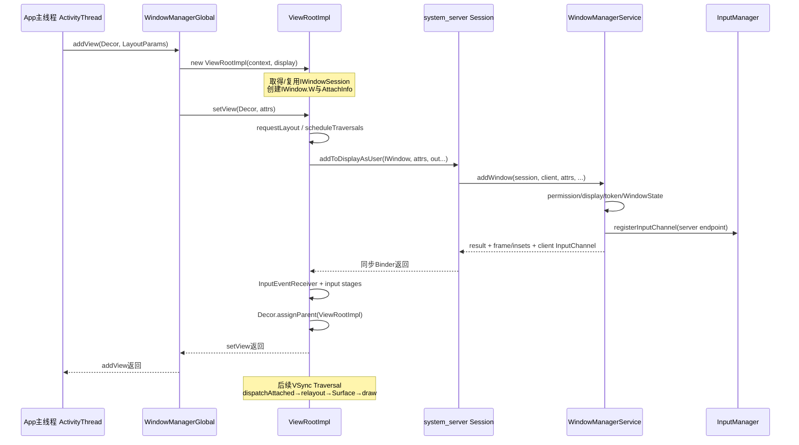
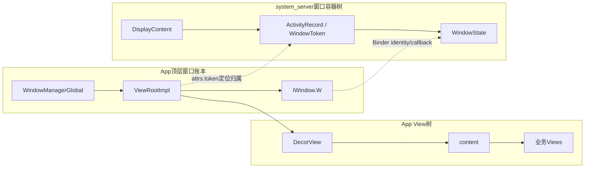

# 212 Android WindowManagerGlobal、ViewRootImpl.setView 与 WMS addWindow

> 源码版本：Android 11 `android-11.0.0_r48`。  
> 当前在 macOS 上只读源码，不实际启动Activity、连接WMS或抓取Surface/InputChannel运行状态。

## 1. 本章目标

第211章已经构造好DecorView及其业务子树，但它仍只是App进程中的本地View对象树。本章从Activity resume时这句继续：

```java
wm.addView(decor, l);
```

读完应能准确区分：

- WindowManagerImpl、WindowManagerGlobal与ViewRootImpl的职责；
- Activity token、IWindow、IWindowSession与InputChannel token；
- 本地View账本和system_server WindowState账本；
- `setView()` 为什么先排Traversal再同步调用WMS；
- WMS addWindow做哪些授权、token、层级、输入和Insets工作；
- addWindow完成时为什么仍没有可绘制窗口Surface和首帧。

## 2. 一句话主线

```text
ActivityThread resume
→ WindowManagerImpl.addView(DecorView, LayoutParams)
→ WindowManagerGlobal建立View/ViewRoot/Params本地账本
→ ViewRootImpl.setView先scheduleTraversal
→ 通过IWindowSession同步addToDisplayAsUser
→ WMS校验权限/display/user/token
→ 创建WindowState并挂入WindowToken层级
→ 创建并注册InputChannel对
→ 返回frame/insets/控制权与状态flags
→ App创建InputEventReceiver并让ViewRoot成为Decor的parent
→ 下一次Traversal才attach View、relayout、申请Surface并绘制
```

## 3. 跨进程序列图



## 4. 先区分两种addView

第211章的 `ViewGroup.addView(child)` 只是在一棵本地View树里建立父子关系。

本章的 `WindowManager.addView(decor, params)` 是把一棵顶层View树接入窗口系统：创建ViewRootImpl、向WMS登记WindowState并建立输入通道。

方法名相同，边界完全不同。

## 5. 为什么在resume阶段才加入窗口

`ActivityThread.handleResumeActivity()` 先调用 `performResumeActivity()` 完成客户端onResume，再根据Activity是否finished、是否将被destroy、能否可见及是否已添加窗口决定后续UI操作。

所以“Activity对象已onCreate并setContentView”不是WMS必须立即接受窗口的充分条件。

## 6. handleResumeActivity 的可见性门

普通主线要求：

```text
r.window == null
Activity未finish
willBeVisible为true
mVisibleFromClient为true
mWindowAdded为false
```

不满足时可能延迟加入、隐藏、复用保留窗口或直接跳过。源码中的willBeVisible还可能同步询问ATMS。

## 7. Decor先以INVISIBLE加入

加入前ActivityThread执行：

```java
View decor = r.window.getDecorView();
decor.setVisibility(View.INVISIBLE);
...
wm.addView(decor, l);
```

稍后满足服务端与客户端可见条件时，`Activity.makeVisible()` 才把Decor设为VISIBLE。

这避免窗口刚登记但布局/状态尚未准备好时立刻暴露内容。

## 8. TYPE_BASE_APPLICATION在这里确定

ActivityThread设置：

```java
l.type = WindowManager.LayoutParams.TYPE_BASE_APPLICATION;
```

它告诉WMS这是Activity的基础应用窗口。类型影响token合法性、层级、策略、权限和焦点规则，不只是一个调试标签。

## 9. WindowManager.LayoutParams是跨进程窗口请求

它包含：

- type、token、packageName、title；
- width/height、gravity、x/y；
- flags/privateFlags/inputFeatures；
- softInputMode、format、alpha、animation；
- system UI、cutout、Insets与Surface相关属性。

它继承ViewGroup.LayoutParams，但语义已扩展为顶层窗口和WMS之间的协议对象。

## 10. Activity怎样取得自己的WindowManager

`Activity.attach()` 调用PhoneWindow的 `setWindowManager()`，Window内部最终执行：

```java
mWindowManager = ((WindowManagerImpl) wm)
        .createLocalWindowManager(this);
```

这个WindowManagerImpl记住父PhoneWindow，使新增窗口能补齐Activity token、标题、包名和硬件加速策略。

## 11. WindowManagerImpl不是WMS Binder代理本身

它是App进程中的轻量门面，字段包括Context、ParentWindow、DefaultToken以及全局WindowManagerGlobal引用。

真正的Binder接口由WindowManagerGlobal缓存的IWindowManager/IWindowSession承担。

## 12. adjustLayoutParamsForSubWindow名字有迷惑性

WindowManagerGlobal只要收到非空parentWindow，就调用：

```java
parentWindow.adjustLayoutParamsForSubWindow(wparams);
```

这个方法不仅处理子窗口；对于普通应用窗口的else分支，也会在token为空时填 `mAppToken`、补title/packageName并设置硬件加速flag。

## 13. Activity token怎样进入LayoutParams

Activity.attach保存从服务端传来的 `mToken`，并把它传给Window.setWindowManager成为 `mAppToken`。添加普通应用窗口时：

```java
if (wp.token == null) {
    wp.token = mContainer == null
            ? mAppToken : mContainer.mAppToken;
}
```

WMS后面用这个token查已有ActivityRecord/WindowToken，防止应用凭空伪造Activity窗口归属。

## 14. DefaultToken不是Activity主窗口的主要来源

WindowManagerImpl的 `applyDefaultToken()` 只在mDefaultToken非空且没有parentWindow时使用，并且仅在LayoutParams.token仍为空时补入。

Activity本地WindowManager有parentPhoneWindow，普通主窗口token主要由Window.adjustLayoutParamsForSubWindow的应用窗口分支填入。

## 15. WindowManagerGlobal是进程内全局协调者

它是App进程单例，核心并行数组：

```java
ArrayList<View> mViews;
ArrayList<ViewRootImpl> mRoots;
ArrayList<WindowManager.LayoutParams> mParams;
```

同一索引表示同一个顶层窗口的Decor/ViewRoot/Params。Dialog、Popup或其他顶层窗口通常也会各占一个条目。

## 16. 一个进程不是只有一个ViewRootImpl

每次成功添加新的顶层View通常创建一个ViewRootImpl。一个应用进程可以同时有多个Activity窗口、Dialog窗口或不同Display窗口。

“ViewRootImpl是整个应用唯一根”是错误的；它是一棵顶层窗口View树的根控制器。

## 17. WindowManagerGlobal先检查重复添加

它用View对象在mViews中查找。若同一个View已添加且不在异步死亡清理路径，会抛：

```text
View ... has already been added to the window manager.
```

这与ViewGroup中“child已有parent”相关但不是同一个账本检查。

## 18. 子窗口怎样找到本地父View

当type在FIRST_SUB_WINDOW到LAST_SUB_WINDOW之间，WindowManagerGlobal遍历现有ViewRoot，比较：

```java
mRoots.get(i).mWindow.asBinder() == wparams.token
```

匹配后把对应mViews条目作为panelParentView，供新ViewRoot记录父窗口token和局部关系。

## 19. 创建ViewRootImpl发生在跨Binder之前

```java
root = new ViewRootImpl(view.getContext(), display);
view.setLayoutParams(wparams);
mViews.add(view);
mRoots.add(root);
mParams.add(wparams);
root.setView(...);
```

因此App本地账本和ViewRoot对象先出现，随后setView才尝试让system_server接受窗口。

## 20. setView被放到最后是因为会产生外部效果

源码注释说明setView会发消息启动工作。它会排Traversal、同步Binder请求、创建输入接收器和建立ViewParent关系。

前面的参数校验与本地对象准备完成后再调用，可减少半初始化过程被其他逻辑观察的机会；异常路径仍必须按源码实际状态清理，不能假设所有数组天然事务化提交。

## 21. ViewRootImpl构造时绑定调用线程

```java
mThread = Thread.currentThread();
mChoreographer = Choreographer.getInstance();
```

Activity主窗口由主线程创建，所以这个ViewRoot以后用 `checkThread()` 约束View树布局/更新线程，并使用主线程Choreographer调度帧。

## 22. ViewRootImpl不是View

它实现ViewParent等接口，负责：

- 顶层树的measure/layout/draw调度；
- IWindowSession/relayout通信；
- InputChannel事件接收与输入stage；
- Insets、Configuration、可见性和焦点回调；
- ThreadedRenderer/Surface接入；
- 无障碍、IME和生命周期桥接。

DecorView才是View对象树的Java根View。

## 23. 构造时取得IWindowSession

普通构造调用：

```java
this(context, display,
        WindowManagerGlobal.getWindowSession(), false);
```

第一次使用时WindowManagerGlobal通过IWindowManager.openSession创建会话，之后在进程内缓存sWindowSession。

## 24. IWindowManager与IWindowSession的分工

IWindowManager是WMS总入口，可openSession、查询display/动画比例等；IWindowSession是面向一个客户端进程的高频窗口会话，提供add、remove、relayout、finishDrawing等调用。

应用通常不会为每个窗口重新openSession，而是多个ViewRoot共享进程级会话。

## 25. system_server Session记录原始调用身份

Session构造时保存：

```java
mUid = Binder.getCallingUid();
mPid = Binder.getCallingPid();
```

并预先计算是否拥有内部系统窗口、隐藏overlay、获取sleep token等权限。后续WMS不能只相信LayoutParams.packageName自报身份。

## 26. Session一般是一进程一个，但不是逻辑定律

Session源码注释是“generally one Session object per process”。普通应用WindowManagerGlobal确实缓存一个；测试、系统内部或特殊调用环境可能传显式Session。

因此准确表述是r48普通应用路径进程级复用，而非协议绝对禁止多个Session。

## 27. Session首次窗口会创建SurfaceSession

`windowAddedLocked()` 在mSurfaceSession为空时执行：

```java
mSurfaceSession = new SurfaceSession();
mService.mSessions.add(this);
```

SurfaceSession是该客户端与SurfaceFlinger侧SurfaceControl创建的会话环境；这一步不等于已经为当前WindowState创建可绘制Surface。

## 28. ViewRootImpl构造时创建IWindow回调Stub

```java
mWindow = new W(this);
```

内部 `W extends IWindow.Stub`，是App暴露给WMS的Binder回调端点。WMS以后通过它通知resize、Insets、可见性、焦点、关闭、拖放等事件。

## 29. W为什么弱引用ViewRootImpl

```java
WeakReference<ViewRootImpl> mViewAncestor;
```

Binder Stub可能被远端引用；弱引用避免它单独把已经应释放的ViewRoot/View树永久强保活。真正窗口生命周期仍由本地账本、WMS记录和remove协议共同管理。

## 30. IWindow回调不等于直接在主线程调用View

WMS回调进入App Binder线程。W的方法通常取得ViewRoot弱引用，再调用dispatch方法；这些dispatch方法进一步把消息投到ViewRoot的Handler/主Looper处理。

所以“WMS调用IWindow”是跨进程回调入口，不代表system_server线程直接执行Activity View代码。

## 31. AttachInfo在构造期建立

ViewRootImpl创建 `View.AttachInfo`，其中关联IWindowSession、IWindow、Display、ViewRoot Handler、窗口可见性/Insets/硬件渲染等共享树状态。

此时只是准备共享上下文；Decor尚未执行 `dispatchAttachedToWindow()`。

## 32. setView只允许设置一次主View

方法在 `synchronized(this)` 内检查 `mView == null`。首次设置后保存Decor引用、复制Window属性并建立后续通道；重复用同一ViewRoot设置另一棵树不是普通API路径。

## 33. 为什么复制LayoutParams

```java
mWindowAttributes.copyFrom(attrs);
attrs = mWindowAttributes;
```

ViewRoot维护自己的当前属性快照，后续updateViewLayout/Traversal计算变化并传给WMS。不能依赖调用者原对象在任意线程随意修改就自动生效。

## 34. setView补齐packageName与BLAST私有flag

若packageName为空，用base package补齐；r48还加入 `PRIVATE_FLAG_USE_BLAST`，后续根据WMS返回flags决定是否采用BLAST adapter。

这只是能力协商初值，不表示setView此刻已建立BLASTBufferQueue或提交帧。

## 35. surfaceInsets在add前估算

若调用者未手动指定，ViewRoot按View elevation等估算surfaceInsets；硬件加速也在add前根据Window flags和Surface持有模式启用。

这些是创建/布局Surface所需参数准备，不代表Surface已经由WMS创建。

## 36. 兼容模式可能临时转换LayoutParams

旧屏幕兼容Translator会备份attrs、转换窗口坐标/尺寸，Binder返回后再restore；ViewRoot同时记录applicationScale和scalingRequired。

因此跨给WMS的几何可与App逻辑坐标不同，返回frame/insets也要按需转回App空间。

## 37. setView先标记mAdded

在调用WMS前：

```java
mAttachInfo.mRootView = view;
mAdded = true;
```

这是客户端进入添加流程的内部状态，不证明服务端已创建WindowState。若RemoteException或负错误码，源码会撤回若干字段并取消Traversal。

## 38. 为什么先requestLayout再addWindow

源码注释非常直接：

```java
// Schedule the first layout -before- adding to the window
// manager, to make sure we do the relayout before receiving
// any other events from the system.
requestLayout();
```

目的是让第一次Traversal尽早排队，在系统回调到来前已建立后续relayout节奏。

## 39. requestLayout并不在这里同步测量

```java
mLayoutRequested = true;
scheduleTraversals();
```

它只是标记并调度。当前主线程仍继续同步执行addToDisplay；measure/layout/draw要等消息循环和Choreographer回调。

## 40. scheduleTraversals怎样入队

```java
mTraversalBarrier = queue.postSyncBarrier();
mChoreographer.postCallback(
        CALLBACK_TRAVERSAL, mTraversalRunnable, null);
```

同步屏障会暂缓普通同步消息，让异步VSync/Choreographer相关工作按调度规则推进；TraversalRunnable最终调用doTraversal/performTraversals。

## 41. “先schedule”不等于Traversal先于addWindow完成

schedule只排回调，当前主线程尚未返回Looper。紧接着的 `mWindowSession.addToDisplayAsUser()` 是同步Binder调用，通常先等WMS返回，主Looper以后才执行Traversal。

若Binder回调并发到达，也由Binder线程/Handler边界处理，不能把“代码先调用requestLayout”写成“已经完成layout”。

## 42. 是否申请InputChannel由inputFeatures决定

若没有 `INPUT_FEATURE_NO_INPUT_CHANNEL`：

```java
InputChannel inputChannel = new InputChannel();
```

这个新对象是AIDL out参数的接收容器，此刻还不是已经连接InputDispatcher的完整客户端端点。

## 43. addToDisplayAsUser传递哪些数据

核心输入：

- App的IWindow Binder；
- seq与WindowManager.LayoutParams；
- 当前host visibility；
- displayId与userId。

核心输出：

- frame提示；
- content/stable Insets与DisplayCutout；
- InputChannel客户端端点；
- InsetsState和可控InsetsSourceControl；
- 整数结果码/flags。

## 44. 这是同步Binder边界

App主线程通过IWindowSession Proxy发送Parcel，system_server Binder线程执行Session.addToDisplayAsUser，再调用WMS.addWindow；结果和out对象写回后App主线程才继续。

所以窗口添加慢可以直接延长启动主线程的resume阶段，但当前Mac只读分析不能量化具体设备耗时。

## 45. Session只是转发吗

addToDisplayAsUser主体确实转到WMS.addWindow，但Session不是无状态透传：它持uid/pid、权限能力、SurfaceSession、窗口计数和客户端死亡状态，并作为WMS创建WindowState的所有者会话。

## 46. WMS先检查窗口类型权限

进入全局锁前，policy `checkAddPermission()` 按type、圆角overlay、packageName等检查是否允许添加。普通Activity基础应用窗口与系统alert/overlay窗口的授权规则不同。

BadToken和permission denied是不同失败类别。

## 47. WMS保存原调用者后清Binder身份

```java
int callingUid = Binder.getCallingUid();
int callingPid = Binder.getCallingPid();
long origId = Binder.clearCallingIdentity();
```

后续在system_server身份下操作内部对象，但仍显式把原pid/uid用于policy和用户校验；结束前恢复身份。

## 48. Display必须存在且调用者可访问

WMS取得或创建DisplayContent，失败返回ADD_INVALID_DISPLAY；即使display存在，`displayContent.hasAccess(session.mUid)`不通过也拒绝。

多显示添加不是只把displayId写进LayoutParams，还要经过访问权和display类型约束。

## 49. system_server也防重复IWindow

```java
if (mWindowMap.containsKey(client.asBinder())) {
    return ADD_DUPLICATE_ADD;
}
```

本地WindowManagerGlobal按View对象防重复，WMS按IWindow Binder身份防重复。这是两个进程各自维护的不变量。

## 50. 子窗口token语义与Activity token不同

子窗口的attrs.token通常是父窗口IWindow Binder；WMS据此找parentWindow，并禁止把子窗口继续作为另一个子窗口的父token。

普通顶层Activity窗口的attrs.token则指Activity/应用WindowToken。不能把所有“window token”压成一种身份证。

## 51. 四类关键身份表

| 身份 | 创建/来源 | 主要用途 |
|---|---|---|
| Activity token / attrs.token | system_server ActivityRecord代际传给App | 顶层应用窗口归属、Task/Activity生命周期 |
| IWindow `mWindow` Binder | App ViewRootImpl.W | 每个客户端窗口身份及WMS→App回调 |
| IWindowSession Binder | WMS openSession | 一个客户端会话的add/relayout/remove调用 |
| InputChannel token | InputChannel pair | InputDispatcher路由与连接身份 |

它们可能在同一条添加链出现，但不可互换。

## 52. 应用窗口token必须对应ActivityRecord

当rootType在应用窗口范围，WMS要求已有WindowToken能转成ActivityRecord；否则返回：

- ADD_NOT_APP_TOKEN；
- ADD_APP_EXITING；
- 未知应用token时ADD_BAD_APP_TOKEN。

这就是Activity已结束或使用错误Context/token时常见BadTokenException的服务端根源。

## 53. 非应用窗口的token规则各自不同

IME、VoiceInteraction、Wallpaper、Accessibility Overlay、Toast、QS Dialog等类型都有对应token/权限检查；某些非特权非应用窗口允许WMS创建新WindowToken，某些严格禁止未知token。

不能从Activity主窗口规则直接外推所有Window type。

## 54. 请求userId也要校验

若请求用户与Session uid所属用户不同，WMS调用ActivityManager内部用户入口校验；失败返回ADD_INVALID_USER。

这防止应用只改userId参数就向其他用户空间任意加窗口。

## 55. WindowState是服务端窗口记录

通过前置校验后：

```java
WindowState win = new WindowState(
        this, session, client, token, parentWindow,
        appOp, seq, attrs, viewVisibility,
        session.mUid, userId, ...);
```

它保存服务端属性、token/parent、owner uid、可见性、frame、Animator、InputWindowHandle等，是WMS层级中的真实窗口节点。

## 56. WindowState不是App里的View对象

system_server无法持有DecorView Java引用。它持IWindow Binder和Parcelable后的LayoutParams等服务端副本；App与WMS用Binder消息、frame/Insets/SurfaceControl结果保持协作。

因此WMS“管理窗口”不是跨进程直接遍历应用View树。

## 57. WindowState建立客户端死亡监控

构造阶段给IWindow Binder链接DeathRecipient；若已无法建立死亡通知，说明客户端可能已死，addWindow返回APP_EXITING。

后续App进程死亡时，WMS可清理WindowState、输入通道和Surface资源，避免孤儿窗口长期存在。

## 58. Policy还会调整并验证参数

DisplayPolicy对WindowState/LayoutParams执行adjust和validate，例如系统窗口限制、cutout/栏策略、特定类型单例等。通过前面token检查仍不表示所有policy约束都满足。

服务端有权修正客户端请求，LayoutParams不是无条件命令。

## 59. InputChannel在哪一侧真正成对创建

WMS确定需要输入时调用：

```java
InputChannel[] channels =
        InputChannel.openInputChannelPair(name);
mInputChannel = channels[0];
mClientChannel = channels[1];
```

服务端端点注册到InputManager，客户端端点transfer到AIDL outInputChannel后由服务端释放自己的客户端包装引用。

## 60. InputChannel创建不等于立即收到触摸

WMS还要把InputWindowHandle纳入输入窗口快照、选择焦点/触摸目标；App端还要创建InputEventReceiver并让主Looper消费事件。

此外窗口当前INVISIBLE时也未必可成为普通触摸目标。

## 61. “从此不能失败”是WMS提交边界

源码在InputChannel和Toast检查后写：

```java
// From now on, no exceptions or errors allowed!
res = ADD_OKAY;
```

含义是后续开始正式挂账，代码必须按成功提交路径维护一致性，不再随意返回错误；它不是说系统运行中永远不会发生异步死亡或后续relayout失败。

## 62. win.attach连接Session窗口计数

`win.attach()` 调用 `session.windowAddedLocked(packageName)`：首次窗口创建SurfaceSession并把Session加入WMS集合，然后窗口计数加一。

这里的attach是WindowState→Session账本动作，不是View.onAttachedToWindow回调。

## 63. mWindowMap用IWindow Binder作主键

```java
mWindowMap.put(client.asBinder(), win);
```

后续relayout/remove/finishDrawing传同一个IWindow，WMS据此找回WindowState并校验Session。

这解释了IWindow为什么既是回调接口又是服务端窗口身份键。

## 64. WindowToken把WindowState挂入层级

```java
win.mToken.addWindow(win);
displayPolicy.addWindowLw(win, attrs);
```

ActivityRecord作为应用WindowToken可拥有基础窗口、starting window和相关子窗口；容器层级、策略层级与App View层级是不同树。

## 65. addWindow会更新焦点与输入窗口快照

WMS按窗口是否能收键尝试更新focused window，重算IME target，设置InputMonitor需要更新，并把当前窗口集合推给输入系统。

焦点变化可能发生在窗口尚未真正绘制之前；“成为WMS焦点候选”和“用户已看到内容”仍是两件事。

## 66. addWindow返回的是初始frame提示

DisplayPolicy.getLayoutHint填outFrame、content/stable Insets和cutout；WMS还返回当前InsetsState/控制权。

ViewRoot把outFrame写入mWinFrame，第一次Traversal可用它估计测量尺寸，减少relayout后重复测量的机会。

## 67. WMS源码明确说add阶段不做最终layout

```java
// Don't do layout here, the window must call
// relayout to be displayed, so we'll do it there.
```

因此addWindow创建WindowState和层级记录，但要等客户端首次Traversal调用relayout，WMS才进行Surface placement和可见Surface创建。

## 68. addWindow不会为当前窗口创建WindowSurfaceController

Session首次窗口可能已有SurfaceSession，WindowState也已有WindowStateAnimator；但 `createSurfaceControl()` 位于WMS.relayoutWindow的可见shouldRelayout路径。

必须区分：

```text
SurfaceSession会话
WindowStateAnimator对象
WindowSurfaceController/SurfaceControl
App可绘制Surface
已提交Buffer
已present画面
```

## 69. 返回值同时包含成功flags

非负res可附带：

- 当前touch mode；
- Activity客户端可见性；
- BLAST/三缓冲能力；
- 是否总消费系统栏提示。

ViewRoot据此初始化mAddedTouchMode、mAppVisible、Insets和渲染策略。不要只判断“res==0才成功”，源码用 `res < ADD_OKAY` 识别错误。

## 70. 负错误码怎样变成App异常

ViewRootImpl把ADD_BAD_APP_TOKEN/ADD_NOT_APP_TOKEN/ADD_APP_EXITING等转成 `WindowManager.BadTokenException`，把无效display转成InvalidDisplayException，权限/type/user错误也给出对应消息。

所以App看到的BadTokenException往往是WMS状态/授权拒绝的客户端翻译，不是DecorView token字段空这一种原因。

## 71. RemoteException与业务拒绝不同

Binder通信本身失败进入catch：撤回mAdded/mView/AttachInfo root、取消Traversal并抛“Adding window failed”。

WMS正常返回负错误码则是一次成功通信后的业务校验失败。诊断时要看异常类型和cause，不能把二者统称为“Binder断了”。

## 72. Binder返回后先接收Insets状态

ViewRoot更新content/stable Insets、DisplayCutout、InsetsController state与controls，并按兼容缩放转换坐标。

这些是WMS初始窗口环境快照；后续系统栏、IME、旋转和窗口大小变化仍会经IWindow回调更新。

## 73. App端何时创建InputEventReceiver

add成功且收到客户端InputChannel后：

```java
mInputEventReceiver =
        new WindowInputEventReceiver(
                inputChannel, Looper.myLooper());
```

它绑定当前Looper，原始InputChannel消息到达后进入ViewRoot输入stage链。

## 74. 输入stage链在setView末尾组装

r48建立：

```text
NativePreIme
→ ViewPreIme
→ Ime
→ EarlyPostIme
→ NativePostIme
→ ViewPostIme
→ SyntheticInputStage
```

这只是管道结构就绪；具体Key/Motion怎样流经这些stage在输入专题已有深入章节。

## 75. assignParent把Decor的ViewParent设为ViewRootImpl

```java
view.assignParent(this);
```

从此Decor向上调用requestLayout/invalidate等可到达ViewRoot。ViewRoot不是ViewGroup，却作为顶层ViewParent承接树与窗口调度。

## 76. assignParent不等于dispatchAttachedToWindow

setView末尾只建立parent关系。第一次 `performTraversals()` 的mFirst分支才执行：

```java
host.dispatchAttachedToWindow(mAttachInfo, 0);
treeObserver.dispatchOnWindowAttachedChange(true);
dispatchApplyInsets(host);
```

所以WindowState可以已经存在，而View的onAttachedToWindow尚未回调。

## 77. 为什么WMS add成功后View仍可能是INVISIBLE

ActivityThread在add前设INVISIBLE；add返回后、完成配置和softInput属性处理，再设置 `mVisibleFromServer=true` 并调用Activity.makeVisible，将Decor改为VISIBLE。

第一次Traversal随后读取最新visibility并通过relayout告诉WMS。

## 78. Activity.makeVisible也可能补addView

```java
if (!mWindowAdded) {
    wm.addView(mDecor, attrs);
    mWindowAdded = true;
}
mDecor.setVisibility(View.VISIBLE);
```

普通handleResume主线通常已添加，但setVisible等特殊路径允许makeVisible负责补加。不能把唯一入口绝对化成ActivityThread那一处。

## 79. 第一次Traversal才进入relayout

Choreographer执行TraversalRunnable后，performTraversals：

- 首次dispatchAttachedToWindow和Insets；
- 计算期望尺寸并measure；
- 调用IWindowSession.relayout；
- WMS进行layout/Surface placement，按可见条件创建SurfaceControl；
- App更新Surface并layout/draw。

本章止于入口，后续章节继续拆每一步。

## 80. addWindow完成边界清单

成功返回通常能证明：

- App已有ViewRootImpl/IWindow/AttachInfo；
- WindowManagerGlobal本地账本已登记顶层View；
- WMS已有WindowState并挂入token/display层级；
- IWindow死亡监控建立；
- 普通可输入窗口已有InputChannel pair并注册服务端端点；
- App拿到frame/Insets初值与结果flags；
- ViewRoot已排第一次Traversal。

## 81. addWindow不能证明什么

它不能单独证明：

- Decor已经执行onAttachedToWindow；
- measure/layout已完成；
- WMS relayout已完成；
- 当前WindowState已有WindowSurfaceController；
- App已有有效可绘制Surface；
- RenderThread已提交首Buffer；
- SurfaceFlinger已latch/compose；
- 屏幕硬件已present首帧。

## 82. 三棵树不要混在一起



View树表达UI父子；WindowManagerGlobal表达App顶层根账本；WMS树表达跨应用窗口层级、策略和Surface管理。

## 83. 线程与进程表

| 阶段 | 进程 | 线程 |
|---|---|---|
| handleResume/wm.addView | App | 主线程 |
| WindowManagerGlobal/ViewRoot.setView | App | 主线程 |
| IWindowSession.addToDisplay | App发起 | 主线程同步等待 |
| Session/WMS.addWindow | system_server | Binder线程，持WMS全局锁处理核心账本 |
| IWindow回调接收 | App | Binder线程入口，通常转主Handler |
| 首次Traversal | App | 主线程Choreographer回调 |

锁只保护各自账本，不把跨进程两边变成一份共享Java对象。

## 84. 常见误解集中纠正

### 误解一：WindowManagerImpl就是system_server的WMS对象

它是App本地门面，真正跨进程经IWindowSession。

### 误解二：一个App只有一个ViewRootImpl

每个顶层窗口通常各有一个，进程内可有多个。

### 误解三：Activity token就是IWindow Binder

前者关联Activity/WindowToken，后者标识具体客户端WindowState和承载回调。

### 误解四：setView返回就执行了onAttachedToWindow

onAttached通常在稍后的首次Traversal分发。

### 误解五：addWindow已经创建可绘制Surface

r48明确把最终layout和SurfaceControl创建留给relayout。

### 误解六：InputChannel存在就一定能收到触摸

还取决于窗口可见、输入窗口快照、焦点/触摸命中和App接收器。

### 误解七：requestLayout紧接着完成measure

它只排Traversal，当前线程先继续同步addWindow调用。

## 85. BadTokenException诊断思路

按顺序核对：

1. LayoutParams.type属于哪类窗口；
2. attrs.token到底是Activity token、父IWindow token还是空；
3. ActivityRecord是否仍在层级、是否exiting；
4. 使用的是Activity WindowManager还是无token的其他Context WindowManager；
5. display/user是否有效且有访问权；
6. type是否需要额外permission或专用token；
7. 是否重复添加同一View/IWindow。

不要先用catch吞掉异常，而应找到服务端返回的具体ADD_*原因。

## 86. macOS只读练习一：从resume追到setView

```bash
cd /Users/ninebot/androidSource
rg -n "wm.addView\(|void addView\(|root.setView\(|void setView\(" \
  frameworks/base/core/java/android/app/ActivityThread.java \
  frameworks/base/core/java/android/view/{WindowManagerImpl.java,WindowManagerGlobal.java,ViewRootImpl.java}
```

画出每次调用所在类、进程和是否跨Binder。

## 87. macOS只读练习二：区分四类token

```bash
cd /Users/ninebot/androidSource
rg -n "mAppToken|attrs.token|client.asBinder|openInputChannelPair|mInputWindowHandle.token" \
  frameworks/base/core/java/android/view/Window.java \
  frameworks/base/services/core/java/com/android/server/wm/{WindowManagerService.java,WindowState.java}
```

为每个命中标注Activity token、IWindow、Session或InputChannel身份，避免见到token就认为同一对象。

## 88. macOS只读练习三：证明Surface不在add阶段创建

```bash
cd /Users/ninebot/androidSource
rg -n "Don't do layout here|relayoutWindow\(|createSurfaceControl\(|createSurfaceLocked\(" \
  frameworks/base/services/core/java/com/android/server/wm/{WindowManagerService.java,WindowStateAnimator.java}
```

目标是用源码位置证明WindowState添加与窗口Surface创建是两个阶段。

## 89. macOS只读练习四：追InputChannel两端

```bash
cd /Users/ninebot/androidSource
rg -n "new InputChannel|openInputChannel\(|openInputChannelPair|transferTo|WindowInputEventReceiver" \
  frameworks/base/core/java/android/view/ViewRootImpl.java \
  frameworks/base/services/core/java/com/android/server/wm/WindowState.java
```

记录哪端由InputManager注册、哪端通过AIDL out参数回到App、何时绑定主Looper。

## 90. 自测题

1. 为什么Activity setContentView后还没有ViewRootImpl？
2. WindowManagerImpl、Global和ViewRootImpl分别负责什么？
3. Activity token与IWindow Binder各自定位什么？
4. 为什么一个进程能有多个ViewRootImpl却常复用一个IWindowSession？
5. setView为何先requestLayout再addToDisplay？
6. scheduleTraversals后为什么不会立刻在当前栈measure？
7. WMS addWindow主要有哪些校验层？
8. WindowState与DecorView为什么不能互相直接引用？
9. InputChannel pair的两端怎样分配？
10. Session创建SurfaceSession是否等于当前窗口已有Surface？
11. addWindow成功后onAttachedToWindow为何还可能没执行？
12. 什么时候才进入窗口Surface创建？

## 91. 自测答案

1. setContentView只建本地View树；resume时WindowManager.addView才new ViewRootImpl。
2. Impl补本地Window/token策略并转Global；Global维护进程顶层窗口账本；ViewRoot连接单棵View树、IWindowSession、输入和Traversal。
3. Activity token定位服务端Activity/WindowToken归属；IWindow Binder唯一标识具体客户端窗口并承载WMS回调。
4. 每个顶层树需要独立根状态；Session是进程级WMS会话，可服务多个WindowState。
5. 先把首Traversal排队，确保系统事件到来前已建立relayout调度意图。
6. 它向Choreographer排回调，当前主线程仍继续同步Binder add，回Looper后才执行。
7. type permission、display访问、重复IWindow、父/Activity/专用token、userId、Policy参数与单例约束。
8. 位于不同进程，只能用Binder接口和Parcelable状态协作。
9. WMS创建pair，服务端端点注册InputManager，客户端端点经out InputChannel返回并绑定App主Looper接收器。
10. 不等于；窗口WindowSurfaceController/SurfaceControl通常在后续可见relayout创建。
11. setView只assignParent；首次performTraversals才dispatchAttachedToWindow。
12. 第一次Traversal调用IWindowSession.relayout，WMS shouldRelayout为真时createSurfaceControl。

## 92. 本章结论

WindowManager.addView是本地View树第一次正式接入跨进程窗口系统的边界。App先由WindowManagerGlobal建立View、ViewRootImpl和LayoutParams三联账本；ViewRoot创建IWindow回调端、复用进程IWindowSession，先排Traversal，再同步向WMS addWindow。WMS依据真实uid/pid、display、user、type和token创建WindowState、挂入WindowToken层级并建立InputChannel，返回frame/Insets和能力状态。

但这一完成点仍只是“窗口登记成功”。Decor尚可能未dispatchAttachedToWindow，WMS明确没有在add阶段完成layout，当前窗口的SurfaceControl通常要等首次Traversal的relayout才创建，更不代表首Buffer已提交或屏幕已显示。

## 93. 复读后的边界修订

- 不把ActivityThread中的addView写成唯一入口；Activity.makeVisible和其他顶层窗口类型也可进入WindowManager链。
- 不把Window.adjustLayoutParamsForSubWindow理解为只处理sub-window；普通Activity主窗口也经它补app token/title/packageName。
- 不把WindowManagerGlobal三联数组当成system_server窗口表；WMS另有以IWindow Binder为键的mWindowMap与容器树。
- 不把“Session一般一进程一个”写成协议强制唯一；这是普通WindowManagerGlobal缓存路径。
- 不把ViewRoot构造、mAdded=true、WMS WindowState创建、assignParent、dispatchAttached、relayout、Surface创建和首帧present合并。
- 不把SurfaceSession、WindowStateAnimator、WindowSurfaceController、Surface和Buffer当成同一对象或同一时刻完成。
- 不把WMS `clearCallingIdentity`误解为丢失调用者；它先保存callingPid/Uid，Session也持有原客户端身份。
- 不把InputChannel out对象创建当成通道已注册；真正pair在WMS创建，服务端端点注册后客户端端点才传回。
- 不把ADD_FLAG_APP_VISIBLE解释成Decor已经VISIBLE或画面已显示；它反映ActivityRecord客户端可见条件。
- 不把requestLayout的代码顺序外推为layout完成顺序；同步Binder add通常先返回，Traversal以后执行。
- 不把setView的assignParent当成onAttachedToWindow；后者位于首次performTraversals。
- 不把BadTokenException缩成“token为null”；错误token类型、Activity退出、权限、display、user和重复窗口都要分别取证。

下一章将精读第一次 `performTraversals()`：measure、relayout、Surface建立、layout、draw的真实先后，以及为什么首帧可能发生二次测量。
