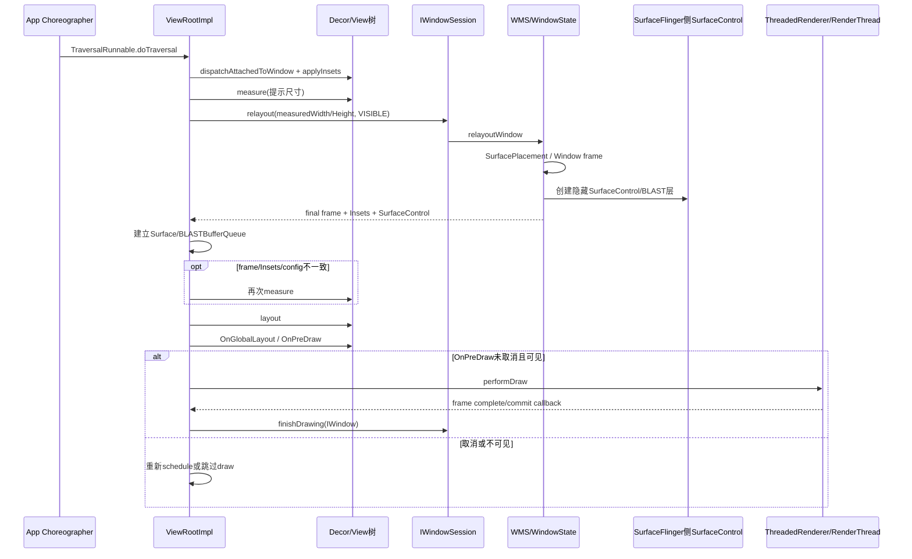
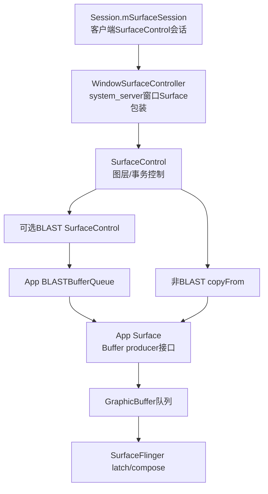

# 213 Android ViewRootImpl 首次 performTraversals：测量、relayout 与 Surface 建立

> 源码版本：Android 11 `android-11.0.0_r48`。  
> 当前在 macOS 上只读源码，不实际运行Traversal、分配图形Buffer或采集首帧trace。

## 1. 本章目标

第212章停在 `ViewRootImpl.setView()`：WindowState和InputChannel已经登记，第一次Traversal也已排入Choreographer，但Decor尚未执行窗口attach，当前窗口还没有可绘制Surface。

本章进入：

```java
private void performTraversals()
```

读完应能说明：

- 首次View attach、Insets、measure、relayout、Surface、layout、draw的真实顺序；
- 为什么第一次Traversal可能测量两次甚至更多次；
- App测量尺寸与WMS最终窗口frame怎样协商；
- SurfaceSession、SurfaceControl、BLASTBufferQueue和Surface的区别；
- `RELAYOUT_RES_FIRST_TIME`、`reportNextDraw()`和`finishDrawing()`的关系；
- 首次performDraw完成为什么仍不等于屏幕硬件已present。

## 2. 一句话主线

```text
Choreographer执行TraversalRunnable
→ 首次dispatchAttachedToWindow与初始Insets
→ 用addWindow返回的frame提示第一次measure
→ 同步IWindowSession.relayout提交测量需求/可见性
→ WMS布局WindowState并创建隐藏SurfaceControl
→ App建立普通Surface或BLASTBufferQueue Surface
→ 若真实frame/Insets/config变化则重新measure
→ layout与GlobalLayout/InternalInsets
→ OnPreDraw可取消
→ performDraw
→ 首帧需要时finishDrawing通知WMS
→ WMS把窗口推进到可显示状态
```

## 3. 首次Traversal时序图



## 4. “measure→layout→draw”为什么不够

这三个词描述单棵View树内部的主要阶段，却漏掉窗口级协商：

```text
attach/Insets
→ 初测
→ 跨Binder relayout
→ Surface建立
→ 可能重测
→ layout
→ draw与finishDrawing协议
```

要理解首帧和卡顿，必须把WMS往返放回主线。

## 5. TraversalRunnable从哪里来

第212章看到setView先调用requestLayout，最终：

```java
mChoreographer.postCallback(
        Choreographer.CALLBACK_TRAVERSAL,
        mTraversalRunnable, null);
```

收到合适VSync调度后，Choreographer执行TraversalRunnable，进入 `doTraversal()`。

## 6. doTraversal先撤同步屏障

```java
if (mTraversalScheduled) {
    mTraversalScheduled = false;
    queue.removeSyncBarrier(mTraversalBarrier);
    performTraversals();
}
```

屏障只服务于这次调度优先关系。进入Traversal后立即撤掉，避免主Looper普通同步消息永久饥饿。

## 7. 重复requestLayout会不会排很多Traversal

`scheduleTraversals()` 先检查 `mTraversalScheduled`。同一轮已经安排时，后续requestLayout通常只更新布局标志/脏区，不重复投递同一个TraversalRunnable。

这是“合并失效请求”的基础，但不保证一帧只会发生一次内部measure或layout。

## 8. performTraversals的第一道门

```java
final View host = mView;
if (host == null || !mAdded) return;
```

窗口已移除或setView未建立时不遍历。随后设置 `mIsInTraversal=true`、`mWillDrawSoon=true`，这些是过程状态，不代表一定走到draw。

## 9. mFirst控制首次专用逻辑

ViewRootImpl构造时：

```java
mFirst = true;
```

第一次performTraversals用它触发attach、完整重绘、初始布局、焦点与首次draw报告；尾部才置false。

如果中途因Surface资源异常提前return，不能简单假设所有首次步骤都完成。

## 10. getHostVisibility不只看View.getVisibility

```java
return (mAppVisible || mForceDecorViewVisibility)
        ? mView.getVisibility() : View.GONE;
```

它综合WMS add结果中的App可见状态、强制Decor可见标志和Decor自身visibility。单独看到Decor.VISIBLE不代表host一定以VISIBLE向WMS relayout。

## 11. 第一次Traversal通常已看到VISIBLE

ActivityThread先以INVISIBLE addView，add返回后调用Activity.makeVisible把Decor设为VISIBLE；主线程回到Looper后才执行此前排好的Traversal。

所以普通冷启动首次Traversal常以VISIBLE进入，但特殊no-display、延迟可见、Activity切换或系统策略可以不同。

## 12. addWindow返回的mWinFrame是初始提示

ViewRoot.setView同步addToDisplay时，WMS通过DisplayPolicy.getLayoutHint返回frame。第一次performTraversals读取 `mWinFrame`，多数MATCH_PARENT应用窗口把它当desired width/height。

这不是最终relayout承诺，而是帮助App减少无谓重测的提示。

## 13. WRAP_CONTENT首次为何不用frame宽高

当Window LayoutParams某维是WRAP_CONTENT，源码用Configuration的screenWidthDp/screenHeightDp换算成像素作为可用上限。

因为窗口希望由内容决定大小，不能先假定最终frame就是它必须填满的尺寸。

## 14. 特殊系统窗口可直接用Display真实尺寸

`shouldUseDisplaySize()` 对附加状态栏、IME、音量overlay等特定type返回true，初始desired size来自Display.getRealSize。

普通Activity基础窗口通常走frame提示或Configuration上限，不应把这个特殊分支套到所有窗口。

## 15. 首次attach发生在measure之前

首次分支依次：

```java
host.dispatchAttachedToWindow(mAttachInfo, 0);
treeObserver.dispatchOnWindowAttachedChange(true);
dispatchApplyInsets(host);
```

然后才进入后面的measureHierarchy。故 `onAttachedToWindow()` 中View还未必拥有最终测量宽高。

## 16. assignParent与dispatchAttached再次区分

setView末尾的 `view.assignParent(ViewRootImpl)` 只是建立ViewParent桥；第一次Traversal的dispatchAttached才把AttachInfo递归下发整棵树并触发View窗口attach生命周期。

WindowState则早在WMS addWindow阶段存在，三者不是同一“attach”。

## 17. attach期间会发生什么

View树递归获得AttachInfo、window token、可见性与硬件加速环境，执行各View的 `onAttachedToWindow()`，注册树观察者和需要依赖窗口的资源。

自定义View可在这个回调请求布局或Insets，因此首次Traversal必须容纳回调造成的新状态变化。

## 18. 初始Insets也在第一次measure之前分发

ViewRoot根据addWindow返回的InsetsState、DisplayCutout、Window flags/softInputMode计算WindowInsets，然后：

```java
host.dispatchApplyWindowInsets(insets);
```

View处理padding、consume或requestLayout后，测量应看到这些影响。

## 19. addWindow Insets只是当前快照

第一次relayout还会返回新的frame、InsetsState与controls；若cutout、always-consume-system-bars、caption或系统UI状态变化，performTraversals会再次dispatchApplyInsets并可能重测。

所以“第一次measure前已分发Insets”不等于Insets在本帧绝不会再变化。

## 20. RunQueue在每次Traversal执行

尚未attach的View可能通过ViewRootImpl.RunQueue暂存动作；performTraversals调用：

```java
getRunQueue().executeActions(mAttachInfo.mHandler);
```

这些动作被post到Handler，不等于在这一行同步执行全部Runnable；它保证detach时期积累的请求重新进入正确Looper。

## 21. layoutRequested还受停止状态限制

```java
boolean layoutRequested = mLayoutRequested
        && (!mStopped || mReportNextDraw);
```

停止窗口可以暂缓常规布局，但若WMS等待下一次draw报告，仍需完成必要Traversal，避免系统一直等待。

## 22. 首次同步touch mode

首次layoutRequested时，源码故意把AttachInfo缓存设成相反值，再调用 `ensureTouchModeLocally(mAddedTouchMode)`，确保touch mode初始化逻辑执行。

焦点选择会受touch mode影响，不能把WMS返回的ADD_FLAG_IN_TOUCH_MODE只当调试字段。

## 23. measureHierarchy是窗口根测量入口

普通路径最终生成根MeasureSpec并调用：

```java
performMeasure(childWidthMeasureSpec,
        childHeightMeasureSpec);
```

performMeasure再调用 `mView.measure()`，View.measure进入DecorView.onMeasure并向下递归各ViewGroup/child。

## 24. MeasureSpec包含size和mode

它不是两个独立参数，而是编码后的整数。根规格由Window LayoutParams决定：

| Window根维度 | MeasureSpec mode | size |
|---|---|---|
| MATCH_PARENT | EXACTLY | 可用windowSize |
| WRAP_CONTENT | AT_MOST | 可用windowSize |
| 明确像素值 | EXACTLY | 指定值 |

子树各层再根据父规格、padding、margin和自己的LayoutParams派生新规格。

## 25. MATCH_PARENT不表示屏幕物理尺寸

这里的EXACTLY size是ViewRoot当前认为的窗口可用尺寸，可能已受多窗口、DisplayArea、Insets策略、兼容缩放或surfaceInsets影响。

“match parent=铺满整块物理屏”是错误推导。

## 26. WRAP_CONTENT不是随便多大

AT_MOST给出上限，View在不超过它的前提下报告需要的measured dimension，并可带 `MEASURED_STATE_TOO_SMALL` 状态。

最终WMS还要决定窗口frame，所以内容期望与窗口政策之间仍有一次relayout协商。

## 27. 浮动窗口可能先尝试较窄宽度

measureHierarchy对Window width=WRAP_CONTENT有Dialog优化：先用 `config_prefDialogWidth` 测量；若未报告TOO_SMALL就接受，否则尝试它与desired width的中间值，仍不合适再用完整desired width。

因此第一次“measureHierarchy调用”内部就可能执行1至3次performMeasure。

## 28. View.measure本身还有缓存

View.measure比较新旧spec、FORCE_LAYOUT和已测尺寸，可能调用onMeasure，也可能从mMeasureCache恢复结果；最终必须设置measured dimension，否则抛异常。

所以“源码出现performMeasure一次”等于“每个子View onMeasure一定执行一次”也不准确。

## 29. 自定义View必须正确实现onMeasure

Inflater只创建对象，真正尺寸在这里确定。自定义View.onMeasure应尊重MeasureSpec并调用setMeasuredDimension；否则会得到错误布局或IllegalStateException。

当前Mac静态阅读只能验证协议，不能证明某个业务View运行时测量结果。

## 30. 第一次测量输出是App的尺寸请求

根View的measuredWidth/Height代表在当前提示约束下App希望的内容/窗口尺寸。ViewRoot随后把经compat scale转换后的值作为requestedWidth/Height传给WMS.relayout。

它不是App单方面最终决定的WindowState frame。

## 31. windowSizeMayChange怎样产生

常规测量后，如果ViewRoot缓存的mWidth/mHeight与host measured尺寸不同，measureHierarchy返回true；WRAP_CONTENT、drag resize、Activity relaunch等也可强制windowShouldResize。

首次无论这个布尔值如何，mFirst本身就确保执行relayout。

## 32. collectViewAttributes可能修改Window参数

View树可通过keepScreenOn、systemUiVisibility等属性影响AttachInfo。`collectViewAttributes()` 汇总后更新Window LayoutParams并让params非空，促使本次relayout把新属性送到WMS。

因此窗口属性不只来自Theme和Activity显式API，也可能由View树聚合产生。

## 33. softInput adjust模式可能在首遍确定

若softInputMode是ADJUST_UNSPECIFIED，ViewRoot检查已显示的scroll container：存在则选ADJUST_RESIZE，否则ADJUST_PAN，并更新params。

这是兼容决策，不表示IME此刻一定显示或窗口立即被缩小。

## 34. Insets回调可能触发补测

若mApplyInsetsRequested为true，ViewRoot再次dispatchApplyInsets；若回调产生mLayoutRequested，会立刻再measureHierarchy，尽量在同一次Traversal中吸收变化。

这也是首帧measure次数不能只按主干数行代码计算的原因。

## 35. 何时决定必须relayout

满足任一条件：

```text
mFirst
windowShouldResize
viewVisibilityChanged
cutoutChanged
params != null
mForceNextWindowRelayout
```

首次永远命中。后续只有窗口级状态需要WMS参与时才跨Binder，单纯局部invalidate未必每帧relayout。

## 36. Internal Insets为什么有pending协议

若ViewTreeObserver有ComputeInternalInsets监听，首次/可见性变化时先在relayout传 `RELAYOUT_INSETS_PENDING`，让WMS暂时不要根据尚未layout完成的原始窗口内部区域影响其他窗口。

View完成layout后再通过IWindowSession.setInsets回报最终content/visible/touchable区域。

## 37. relayout前暂停ThreadedRenderer

若已有ThreadedRenderer，源码先调用pause，因为WMS relayout可能销毁或替换Surface；若动画在运行，还会标脏以便恢复后补帧。

首次Surface尚未建立时也统一走防御式窗口布局路径。

## 38. relayoutWindow传给WMS什么

ViewRoot传：

- IWindow和seq；
- 必要时更新的Window LayoutParams；
- 经过applicationScale的measuredWidth/Height；
- 当前viewVisibility；
- Insets pending flags；
- 已有Surface时的下一frameNumber。

WMS返回frame、Insets、cutout、MergedConfiguration、SurfaceControl、BLAST SurfaceControl及surface size。

## 39. 不需要更新属性时params可为null

relayout协议允许attrs为空，表示不重新提交整份属性；requested size、visibility等仍单独传递。

首次通常因mWindowAttributesChanged而传params，但后续不能假设每次relayout都带一份新LayoutParams。

## 40. Window type加入后不可随意改变

ViewRoot兼容旧target时会恢复mOrigWindowType；WMS也检查：

```java
if (win.mAttrs.type != attrs.type) {
    throw new IllegalArgumentException(
        "Window type can not be changed after the window is added.");
}
```

Insets provider types同样有不可变约束。想换窗口种类通常应移除并重新添加，而非update属性。

## 41. WMS先记录请求尺寸与可见性

非GONE时 `win.setRequestedSize(requestedWidth, requestedHeight)`；随后复制允许变化的attrs，更新requested visibility并标记display layout needed。

WMS并不读取App View子树，只接收根测量结果和窗口协议状态。

## 42. shouldRelayout是Surface创建门

r48要求viewVisibility=VISIBLE，并且：

- Window无ActivityRecord；或
- 是starting window；或
- ActivityRecord.isClientVisible。

即使App Decor.VISIBLE，若Activity服务端客户端可见状态不允许，也不会在该分支创建新Surface。

## 43. WMS强制执行SurfacePlacement

源码调用：

```java
mWindowPlacerLocked.performSurfacePlacement(true);
```

它运行窗口布局/层级/Insets等系统级计算，使返回给客户端的frame与状态基于当前DisplayContent布局，而不是照抄App请求。

## 44. Window frame由谁最终决定

WMS结合Window LayoutParams、DisplayPolicy、Activity/Task边界、多窗口、系统栏/IME、cutout和父窗口等计算WindowState frame。

App的measured尺寸是重要输入，WMS frame是协商结果；两边都不能脱离另一边单独解释最终尺寸。

## 45. relayoutVisibleWindow设置首次显示标志

```java
result |= (!wasVisible || !isDrawnLw())
        ? RELAYOUT_RES_FIRST_TIME : 0;
```

它不只看“Java第一次调用relayout”，而看服务端WindowState之前是否可见/已drawn。Surface重建等路径也可能再次要求下一draw报告。

## 46. createSurfaceControl位于relayout

shouldRelayout为true时：

```java
result = createSurfaceControl(
        outSurfaceControl, outBLASTSurfaceControl,
        result, win, winAnimator);
```

这再次证明addWindow只建WindowState/Session，窗口SurfaceControl在可见relayout阶段创建或取回。

## 47. WindowStateAnimator创建的Surface初始隐藏

`createSurfaceLocked()` 使用：

```java
int flags = SurfaceControl.HIDDEN;
```

再根据secure、opaque、format、surfaceInsets和计算尺寸构造WindowSurfaceController。创建图层对象不等于立刻让用户看到它。

## 48. 为什么Surface初始隐藏

应用还没画出有效内容。若创建后立即显示，SurfaceFlinger可能合成空白、未初始化或旧内容。WMS用draw state与finishDrawing协议等到首帧准备好再show。

## 49. Window draw state从DRAW_PENDING开始

创建Surface时WindowStateAnimator.resetDrawState设为DRAW_PENDING；后续客户端finishDrawing使其到COMMIT_DRAW_PENDING，WMS提交显示时到READY_TO_SHOW/HAS_DRAWN。

它是WMS窗口画面就绪状态机，不是View的PFLAG或Choreographer frame状态。

## 50. Surface尺寸可能与Window frame不同

Surface尺寸会考虑surfaceInsets；drag resize可能使用全屏Surface避免频繁重分配；FLAG_SCALED可采用requested size。

因此window frame width/height、View measured size、Surface buffer size不是无条件相等。

## 51. secure与opaque在SurfaceControl层生效

FLAG_SECURE影响SurfaceControl.SECURE，非alpha格式且无surfaceInsets/drag resize时可能设置OPAQUE；硬件加速路径Surface format又可能用TRANSLUCENT。

这些标志参与合成、安全截图和优化，不能只从View背景颜色推断。

## 52. OutOfResources不是普通测量失败

SurfaceControl创建可能抛OutOfResourcesException；WMS尝试回收Surface内存，App端ThreadedRenderer初始化失败也会调用outOfMemory协议，严重时应用可能自杀以恢复。

当前Mac只读阶段不会实际触发或验证这种资源压力行为。

## 53. WMS返回的是SurfaceControl不是Java Canvas

AIDL relayout out参数包含SurfaceControl及BLAST SurfaceControl、surface size。ViewRoot收到后才把这些图层控制对象接成App可生产buffer的Surface。

SurfaceControl负责图层/事务控制；Surface提供producer绘制/queue buffer接口，两者职责不同。

## 54. 非BLAST路径怎样得到Surface

```java
if (!useBLAST()) {
    mSurface.copyFrom(mSurfaceControl);
}
```

ViewRoot让Java Surface连接到WMS返回SurfaceControl所关联的buffer生产环境。`mSurface.isValid()`只说明可用句柄存在，不代表已有一帧内容。

## 55. BLAST路径怎样得到Surface

ViewRoot用WMS返回的mBlastSurfaceControl创建或更新：

```java
mBlastBufferQueue = new BLASTBufferQueue(
        mBlastSurfaceControl, width, height,
        mEnableTripleBuffering);
Surface blastSurface = mBlastBufferQueue.getSurface();
mSurface.transferFrom(blastSurface);
```

后续尺寸更新可复用BLASTBufferQueue而不必每次换Surface generation。

## 56. BLASTBufferQueue解决什么层次的问题

它把buffer提交与SurfaceControl.Transaction更紧密地同步，支持窗口同步变换、resize和多窗口事务协调。

它不是View绘制算法，也不会替View执行measure/layout；它位于渲染buffer与图层事务衔接层。

## 57. mSurface generation ID用来识别替换

relayout前记录generation，返回后比较：

```text
surfaceCreated：原无效→现有效
surfaceDestroyed：原有效→现无效
surfaceReplaced：generation变化且现有效
surfaceSizeChanged：WMS result flag
```

这些事件决定Renderer初始化、updateSurface、完整重绘和Surface回调。

## 58. Surface created不等于Buffer已分配完毕

Surface刚有效后ViewRoot标记full redraw，ThreadedRenderer.initialize连接Surface；必要时allocateBuffers可预分配，但透明区域场景可能推迟。

即使allocateBuffers执行，也不能据此断言某个业务View像素已绘入并提交。

## 59. ThreadedRenderer在Surface创建后初始化

```java
hwInitialized = renderer.initialize(mSurface);
renderer.setup(mWidth, mHeight, attachInfo,
        windowAttributes.surfaceInsets);
```

initialize连接渲染后端，setup配置根尺寸/Insets。真正记录DisplayList、交给RenderThread和queue buffer在performDraw路径继续。

## 60. SurfaceHolder分支不同

若Decor实现RootViewSurfaceTaker并接管Surface，ViewRoot通过SurfaceHolder回调 `surfaceCreated/surfaceChanged/surfaceDestroyed` 通知持有者，普通ThreadedRenderer策略也会不同。

普通Activity Decor通常不走自持有Surface主线，不能把SurfaceView/Wallpaper式回调直接套到所有Activity窗口。

## 61. relayout返回后更新真实mWidth/mHeight

```java
if (mWidth != frame.width()
        || mHeight != frame.height()) {
    mWidth = frame.width();
    mHeight = frame.height();
}
```

这把ViewRoot窗口缓存切到WMS最终frame尺寸，随后比较host measured size决定是否补测。

## 62. 为什么通常会有第二次measure

若以下任一变化：

- touch mode导致焦点变化；
- WMS frame与host measured size不同；
- relayout后重新分发Insets；
- 合并Configuration更新；

ViewRoot按新的mWidth/mHeight生成根MeasureSpec，再调用performMeasure。

## 63. 第一次frame提示相同可避免补测

addWindow返回的frameHint多数普通窗口会接近relayout结果；初测后若host measured尺寸与mWidth/mHeight一致，Insets/config也稳定，可以跳过第二次测量。

所以源码的优化目标是“可能一遍”，不是协议保证永远一遍。

## 64. Window LayoutParams weight还可触发再测

补测后，如果horizontalWeight/verticalWeight>0，ViewRoot按剩余空间比例增大width/height，重新生成EXACTLY spec再测一次。

因此同一Traversal中根measure次数受Window级weight影响，不只受ViewGroup内部weight影响。

## 65. measure次数与onMeasure次数再次区分

View.measure缓存可能让某次performMeasure不重新调用所有onMeasure；而不同spec、forceLayout或Insets变化会使缓存失效。

性能分析应看实际trace/调用栈，不能仅数源码中performMeasure文本出现次数。

## 66. layout只在didLayout为true时执行

```java
boolean didLayout = layoutRequested
        && (!mStopped || mReportNextDraw);
if (didLayout) {
    performLayout(lp, mWidth, mHeight);
}
```

首次正常可见窗口layoutRequested为true；后续仅draw脏区而尺寸不变时可能跳过measure/layout直接draw。

## 67. performLayout把Decor放在窗口局部原点

```java
host.layout(0, 0,
        host.getMeasuredWidth(),
        host.getMeasuredHeight());
```

子ViewGroup的onLayout再递归确定孩子left/top/right/bottom。窗口在屏幕上的frame.left/top由WMS管理，不需要把Decor layout到屏幕绝对坐标。

## 68. measure与layout输出不同

- measure输出measuredWidth/measuredHeight和状态，是尺寸提议；
- layout写left/top/right/bottom，是父容器给孩子的实际位置范围。

测量完成不代表位置已确定；layout完成也不代表像素已经绘制。

## 69. layout期间requestLayout怎样处理

ViewRoot收集在layout期间仍有有效布局请求的View，完成第一遍后可在同一Traversal执行第二次measure/layout，并打印警告。

若第二遍仍请求，源码把请求post到下一帧，避免当前帧无限循环。

## 70. “一帧最多两次layout”也不是普遍数学定律

这里的防护针对ViewRoot发现的layout-during-layout请求；自定义ViewGroup内部可有自身测量轮次，窗口Insets/配置还可重新schedule下一Traversal。

正确结论是ViewRoot有二次补救与跨帧限流机制，而不是整个Android布局系统固定次数。

## 71. layout后处理透明区域

请求透明区域的根View会计算透明Region，变化时通过：

```java
mWindowSession.setTransparentRegion(
        mWindow, mTransparentRegion);
```

WMS/合成侧可据此优化或正确处理下层内容；透明区域属于窗口级信息，不只是Canvas alpha。

## 72. OnGlobalLayout发生在layout之后

didLayout或全局属性需要重算时：

```java
treeObserver.dispatchOnGlobalLayout();
```

监听器此时可读取本次layout后的几何，但在它里面再次requestLayout会影响后续Traversal；也仍不能宣称当前帧已draw/present。

## 73. Internal Insets最终回报在layout后

ComputeInternalInsets监听器根据最终View几何给出content/visible/touchable区域；ViewRoot必要时通过IWindowSession.setInsets通知WMS，结束前面RELAYOUT_INSETS_PENDING的暂存状态。

这对输入可触区域、窗口交互和其他窗口布局有影响。

## 74. 首次焦点恢复发生在layout后

ViewRoot根据touch mode、兼容target和现有焦点，尝试 `restoreDefaultFocus()`。部分ScrollView等容器在有真实尺寸后才适合把焦点交给孩子。

窗口焦点由WMS控制，View树内部焦点又由ViewRoot/ViewGroup管理，两者相关但不是同一变量。

## 75. mFirst在draw前被置false

源码先完成layout、焦点、可见性状态，然后：

```java
mFirst = false;
mWillDrawSoon = false;
...
```

再处理reportNextDraw、OnPreDraw和performDraw。故看到mFirst=false不等于首帧draw已经完成。

## 76. RELAYOUT_RES_FIRST_TIME触发draw报告

```java
if ((relayoutResult
        & RELAYOUT_RES_FIRST_TIME) != 0) {
    reportNextDraw();
}
```

reportNextDraw增加待报告计数并设置mReportNextDraw，要求下一次成功绘制后向WMS finishDrawing。

## 77. BLAST Sync也会要求报告下一draw

RELAYOUT_RES_BLAST_SYNC触发reportNextDraw、设置下一帧使用BLAST同步transaction，并要求把下一frame交给WMS协调。

这是多窗口/事务同步机制，不等于普通FIRST_TIME标志的同义词。

## 78. OnPreDraw可以取消本次绘制

```java
boolean cancelDraw =
    treeObserver.dispatchOnPreDraw()
        || !isViewVisible;
```

监听器返回取消或窗口不可见时不执行performDraw；若仍可见则重新scheduleTraversals，等待下一次机会。

## 79. 为什么OnPreDraw取消可能拖慢首帧

WMS已经有隐藏Surface并等待finishDrawing，若监听器持续返回false/取消，ViewRoot会反复排Traversal，首帧报告被延后。

这常用于等共享元素/布局准备，但错误使用可造成界面长期不出现。

## 80. performDraw并不一定使用GPU

硬件加速且ThreadedRenderer enabled时走HWUI记录/RenderThread路径；否则可走软件Canvas lock/draw/unlockAndPost。SurfaceHolder接管又有自己的回调协调。

本章只建立分叉边界，下一章再精读硬件渲染主线。

## 81. UI线程在硬件绘制中做什么

通常遍历View树、更新DisplayList/RenderNode并把帧工作提交给ThreadedRenderer；RenderThread执行更靠近GPU的渲染与buffer提交。

因此“硬件加速=所有draw代码都不占主线程”不准确，业务View.draw/onDraw和记录工作仍会影响UI线程帧预算。

## 82. reportNextDraw怎样等到合适完成点

硬件路径在需要时给ThreadedRenderer设置frame-complete callback，回到主Handler后调用pendingDrawFinished；非异步路径可能先renderer.fence，再pendingDrawFinished。

SurfaceHolder路径则用surfaceRedrawNeededAsync等回调聚合完成后再报告。

## 83. finishDrawing通知WMS什么

```java
mWindowSession.finishDrawing(
        mWindow, mSurfaceChangedTransaction);
```

它告诉WMS：客户端已完成本轮要求报告的绘制，可把WindowState draw state从DRAW_PENDING推进，并在Surface placement/事务中考虑show。

不是把整张Bitmap通过Binder传给WMS。

## 84. WMS draw state怎样推进

概念顺序：

```text
NO_SURFACE
→ DRAW_PENDING（Surface创建）
→ COMMIT_DRAW_PENDING（finishDrawing）
→ READY_TO_SHOW
→ HAS_DRAWN（满足Activity/transition策略并show）
```

具体commit/show可能在WMS后续Surface placement中完成，而不是finishDrawing Binder栈内一步到终态。

## 85. 为什么WMS还要等待Activity级条件

真实窗口可能和starting window、Activity transition、兄弟窗口、Task可见性协同。WindowState准备好Buffer不代表系统立刻展示它；WMS要保证Activity窗口集合和动画时序一致。

首个真实主窗口drawn后，ActivityRecord还会处理starting window移除、all-drawn和启动可见性报告。

## 86. performDraw完成不等于屏幕present

绘制命令/Buffer提交之后还要经过：

```text
BufferQueue acquire/latch
→ SurfaceFlinger层事务与合成选择
→ HWC/GPU合成
→ 显示VSync/面板扫描present
```

finishDrawing更不是物理显示时间戳。要证明present需SurfaceFlinger/FrameTimeline等运行时证据。

## 87. 首帧的多个完成点

| 完成点 | 能证明什么 |
|---|---|
| onAttachedToWindow | View树接入ViewRoot窗口环境 |
| 第一次measure | App在提示约束下给出尺寸 |
| relayout返回 | WMS给出frame/Insets/Surface控制对象 |
| layout完成 | View局部位置确定 |
| performDraw提交 | 客户端生成/提交绘制工作 |
| finishDrawing | 客户端通知WMS本轮draw完成 |
| WindowState HAS_DRAWN | WMS窗口画面状态已推进 |
| SF latch/compose | 合成器接收并参与合成 |
| hardware present | 最终图像真正扫描到显示设备 |

任何较早一行都不能自动替代后面完成点。

## 88. Surface对象关系图



图是职责关系，不表示所有对象都由同一进程new，也不表示创建后已有Buffer。

## 89. 首次Traversal成功时已经有什么

普通可见硬件加速路径走完通常已有：

- View树AttachInfo与onAttached回调；
- 至少一次有效根测量和layout；
- WMS最终WindowState frame/Insets；
- WindowSurfaceController/SurfaceControl；
- App有效Surface或BLASTBufferQueue；
- ThreadedRenderer与Surface连接；
- performDraw提交路径；
- 必要时finishDrawing报告已安排或完成。

## 90. 仍不能无证据断言什么

不能仅靠静态源码/performTraversals返回断言：

- 每个View onMeasure恰好调用一次；
- GPU命令已全部执行；
- Buffer已经被SurfaceFlinger latch；
- WindowState已经show且无遮挡；
- starting window已经移除；
- Activity windowsDrawn已回报；
- 用户肉眼已在面板看到首帧；
- 具体首帧耗时是多少毫秒。

## 91. 常见误解集中纠正

### 误解一：首次Traversal固定只测量一次

Dialog宽度试探、relayout尺寸/Insets变化、Window weight和layout中requestLayout都可增加轮次。

### 误解二：onAttachedToWindow时宽高一定最终可用

attach发生在首次measure之前，通常应在layout/size changed后使用几何。

### 误解三：View测量尺寸就是WMS窗口尺寸

它是App请求；WMS结合系统政策返回frame，必要时App再测。

### 误解四：SurfaceControl就是可draw Canvas的Surface

前者控制图层；ViewRoot还要建立Surface/BLASTBufferQueue生产buffer。

### 误解五：Surface.isValid说明首帧已有像素

只说明句柄/连接有效，不证明已经queue buffer。

### 误解六：finishDrawing说明硬件已present

它是App→WMS的draw完成协议，后面仍有show、latch、compose与present。

## 92. 一次普通MATCH_PARENT首遍的简化推演

假设：Activity已可见、普通全屏、无新Insets变化、addWindow frame提示等于最终frame。

```text
dispatchAttached + 初始Insets
→ EXACTLY(frameWidth, frameHeight) measure
→ relayout(measured尺寸, VISIBLE)
→ WMS创建隐藏SurfaceControl并返回相同frame
→ App建立Surface，初始化Renderer
→ 尺寸相同，可能无需第二次measure
→ layout(0,0,w,h)
→ global layout / pre-draw
→ performDraw
→ frame complete后finishDrawing
```

这是常见优化路径，不是所有窗口的固定模板。

## 93. 一次WRAP_CONTENT浮动窗口推演

```text
以config_prefDialogWidth试测
→ TOO_SMALL则中间宽度再测
→ 必要时desired上限再测
→ relayout把内容期望交WMS
→ WMS按display/policy给最终frame
→ frame或Insets不同时按最终尺寸补测
→ layout/draw
```

同一帧多次onMeasure在这种场景可能是正常协议，不应一看到次数>1就判定bug。

## 94. macOS只读练习一：给performTraversals分段

```bash
cd /Users/ninebot/androidSource
sed -n '2350,3120p' \
  frameworks/base/core/java/android/view/ViewRootImpl.java
```

在自己的笔记上标出attach、first measure、relayout、second measure、layout、global layout、pre-draw和draw八段，不修改源码。

## 95. macOS只读练习二：验证根MeasureSpec

```bash
cd /Users/ninebot/androidSource
sed -n '3615,3660p' \
  frameworks/base/core/java/android/view/ViewRootImpl.java
```

分别代入MATCH_PARENT、WRAP_CONTENT和600px，写出EXACTLY/AT_MOST及size来源。

## 96. macOS只读练习三：追Surface创建两端

```bash
cd /Users/ninebot/androidSource
rg -n "createSurfaceControl|createSurfaceLocked|getOrCreateBLASTSurface|copyFrom\(mSurfaceControl\)|transferFrom" \
  frameworks/base/services/core/java/com/android/server/wm/{WindowManagerService.java,WindowStateAnimator.java} \
  frameworks/base/core/java/android/view/ViewRootImpl.java
```

把system_server创建图层控制对象和App创建buffer producer Surface分别标色。

## 97. macOS只读练习四：追首次draw回报

```bash
cd /Users/ninebot/androidSource
rg -n "RELAYOUT_RES_FIRST_TIME|reportNextDraw|pendingDrawFinished|finishDrawing" \
  frameworks/base/core/java/android/view/{ViewRootImpl.java,WindowManagerGlobal.java} \
  frameworks/base/services/core/java/com/android/server/wm/{WindowManagerService.java,WindowStateAnimator.java,WindowState.java}
```

画出FIRST_TIME→App draw→finishDrawing→WMS draw state/show，注明这仍不是hardware present。

## 98. 自测题

1. 首次performTraversals中onAttached、measure、relayout、layout谁先谁后？
2. addWindow返回的frame为什么只是测量提示？
3. MATCH_PARENT和WRAP_CONTENT分别得到什么根MeasureSpec？
4. measureHierarchy一次调用为什么可能执行多次performMeasure？
5. App measured尺寸与WMS frame是什么关系？
6. shouldRelayout为什么同时看Decor visibility和ActivityRecord clientVisible？
7. SurfaceSession、SurfaceControl和Surface有什么区别？
8. BLAST路径如何把SurfaceControl接成App Surface？
9. relayout后为什么可能第二次measure？
10. layout期间继续requestLayout会怎样？
11. OnPreDraw取消对首帧有什么影响？
12. finishDrawing与hardware present有什么区别？

## 99. 自测答案

1. 首次attach/Insets→初测→relayout/Surface→按需重测→layout→pre-draw→draw。
2. 它由add阶段policy给出，最终还要结合App measured需求和当时系统布局在relayout计算。
3. MATCH_PARENT用windowSize的EXACTLY；WRAP_CONTENT用windowSize的AT_MOST。
4. WRAP_CONTENT Dialog会试探多档宽度；每次View.measure内部也可能按spec/cache决定onMeasure。
5. measured是App在约束下的尺寸请求；WMS结合窗口政策返回最终frame，App必要时适配重测。
6. 只有View想显示且服务端Activity允许客户端窗口显示，才应创建/返回可见Surface。
7. SurfaceSession是SurfaceControl创建会话；SurfaceControl管图层/事务；Surface是App生产GraphicBuffer的接口。
8. 用BLAST SurfaceControl创建/更新BLASTBufferQueue，取得Surface后transfer到mSurface。
9. 最终frame、Insets、Configuration或touch mode可能与初测假设不同。
10. ViewRoot可同一Traversal补一次measure/layout；第二遍再请求则post到下一帧避免死循环。
11. 本次不draw，可见时重新schedule；WMS等待的首次finishDrawing被延后。
12. finishDrawing通知WMS客户端draw就绪；present还需WMS show、SF latch/compose和显示硬件扫描。

## 100. 本章结论

第一次performTraversals不是单向的 `measure→layout→draw`，而是App与WMS的尺寸、可见性和Surface协商。View树先获得AttachInfo与初始Insets，再依据addWindow frame提示测量；relayout把测量需求同步交给WMS，WMS完成窗口布局并创建初始隐藏的SurfaceControl，App再通过普通或BLAST路径建立可生产buffer的Surface。若真实frame、Insets、配置或touch mode变化，App在layout前重新测量。

layout之后还有GlobalLayout、Internal Insets、PreDraw和实际draw；首次窗口由reportNextDraw/finishDrawing把客户端绘制完成回报WMS，WMS才能推进draw state并选择何时show。即便如此，SurfaceFlinger latch、合成和硬件present仍是更后的完成点。

## 101. 复读后的边界修订

- 不把首次View attach放到measure之后；r48首次分支先dispatchAttached和初始Insets，再进入measureHierarchy。
- 不把addWindow frameHint称为最终窗口大小；它是减少二次measure的预测输入，relayout结果才更新mWidth/mHeight。
- 不把一次measureHierarchy等同每个View只onMeasure一次；Dialog试探、补测、weight、layout请求和View measure cache都会改变调用情况。
- 不把MATCH_PARENT解释为物理全屏；EXACTLY size来自当前窗口可用尺寸。
- 不把Internal Insets pending和WindowInsets分发混成同一对象；前者是View树向WMS回报content/visible/touchable区域的协议。
- 不把SurfaceSession首次创建扩大为当前窗口Surface已存在；WindowSurfaceController在可见relayout创建。
- 不把SurfaceControl、BLAST SurfaceControl、BLASTBufferQueue和Java Surface合并成一个对象。
- 不把Surface valid或Renderer initialize解释成已有业务像素Buffer。
- 不把 `RELAYOUT_RES_FIRST_TIME` 解释为Java首次调用计数；它与服务端可见/drawn状态相关。
- 不把mFirst=false解释为首帧已完成；r48在OnPreDraw/performDraw之前就清它。
- 不把OnGlobalLayout、OnPreDraw、performDraw、frame-complete callback、finishDrawing、WindowState HAS_DRAWN和hardware present合并。
- 不把当前Mac源码推演写成真机已验证次数或耗时；动态分支需未来trace/FrameTimeline证据。

下一章将继续精读硬件渲染首帧：DisplayList/RenderNode怎样在UI线程记录，ThreadedRenderer如何把工作交给RenderThread，并经过BLAST/BufferQueue提交给SurfaceFlinger。
