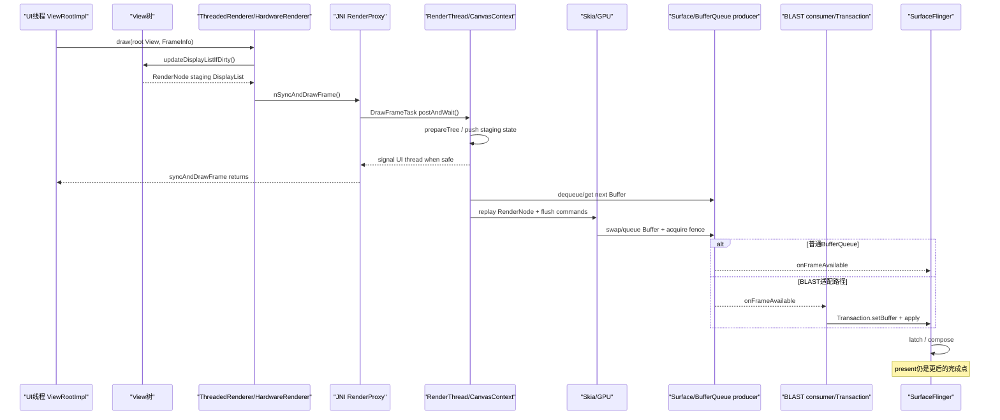
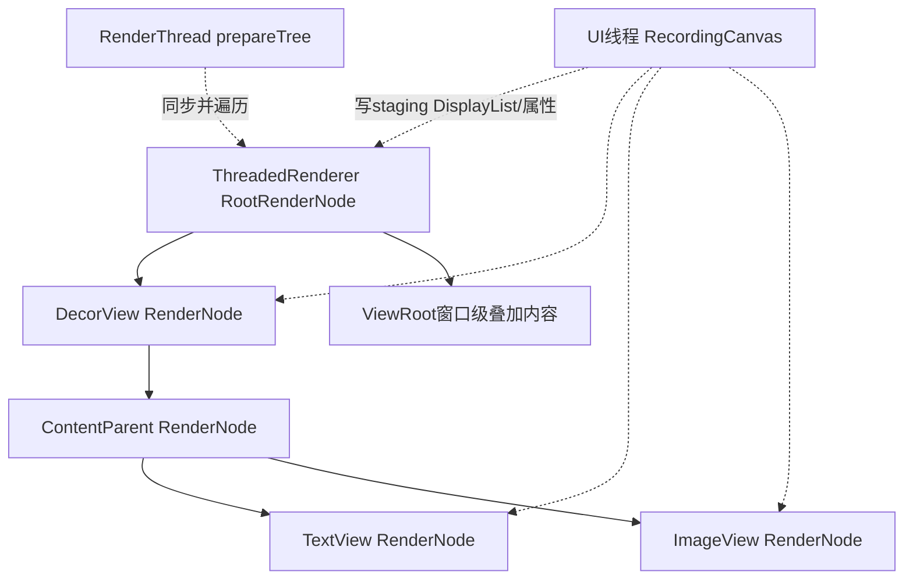
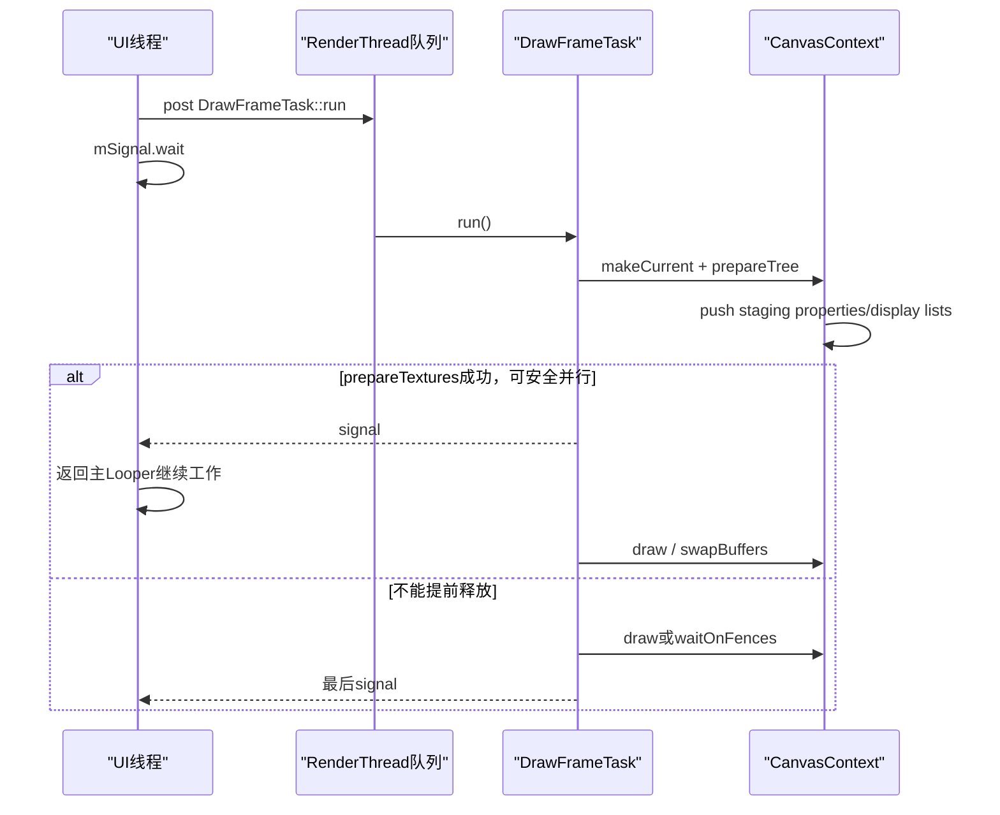

# 214 Android DisplayList、ThreadedRenderer、RenderThread 与首 Buffer 提交

> 源码版本：Android 11 `android-11.0.0_r48`。  
> 当前在 macOS 上只读源码，不实际创建 EGL/Vulkan 上下文、不分配 GraphicBuffer，也不宣称采集过真机首帧 trace。

## 1. 本章目标

第213章停在 `ViewRootImpl.performDraw()`：View树已经完成首次attach、测量、窗口relayout和布局，App也已拿到可用的 `Surface`。但“进入draw”并不等于像素已经出现在屏幕上。

本章继续回答：

- UI线程在硬件加速路径里到底“画”了什么；
- DisplayList、`RenderNode`、`RecordingCanvas`分别是什么；
- `ThreadedRenderer.draw()`怎样跨Java/JNI进入HWUI；
- UI线程为什么会等待RenderThread，又为何通常能在GPU工作完成前继续运行；
- Skia OpenGL与Skia Vulkan怎样取得可写Buffer并提交；
- 普通BufferQueue与Android 11 BLAST适配路径有什么不同；
- 首次 `queueBuffer`、frame-complete、WMS `finishDrawing`、SurfaceFlinger latch和硬件present为何必须分开。

## 2. 一句话主线

```text
ViewRootImpl.performDraw
→ UI线程选择硬件渲染
→ RecordingCanvas把View.draw记录为RenderNode DisplayList
→ HardwareRenderer.syncAndDrawFrame经JNI进入RenderProxy
→ DrawFrameTask投递RenderThread并等待同步阶段
→ RenderThread把staging RenderNode树同步为渲染树
→ UI线程通常被提前唤醒
→ RenderThread从Surface取得Buffer
→ Skia回放RenderNode并提交GPU命令
→ EGL swap或Vulkan queue把Buffer交给生产者队列
→ 普通路径通知SF，或BLAST本地消费后用Transaction把Buffer交给SurfaceControl
→ 后续才是SF latch/合成和显示硬件present
```

## 3. 首帧硬件绘制时序图



## 4. 先建立五个不同完成点

学习图形链路最容易犯的错误，是把“画完了”当成一个时刻。至少要区分：

1. UI线程完成DisplayList录制；
2. RenderThread完成RenderNode staging状态同步；
3. Skia/GPU命令已发出或flush；
4. producer完成 `queueBuffer`；
5. SurfaceFlinger latch、合成并最终由显示硬件present。

这五个点之间可能跨线程、跨进程，并由fence协调。

## 5. 本章只讲硬件加速主路径

普通Activity窗口通常请求硬件加速，`ViewRootImpl`持有启用的 `ThreadedRenderer`。本章主线以此为准。

软件Canvas、应用自己接管 `SurfaceHolder`、Magnifier的SimpleRenderer等分支会指出边界，但不与主路径混写。

## 6. 入口仍是 ViewRootImpl.performDraw

第213章看到Traversal尾部调用：

```java
performDraw();
```

`performDraw()`先检查Display是否关闭、根View是否存在，再决定是否注册首帧完成回调，最后调用内部的：

```java
boolean canUseAsync = draw(fullRedrawNeeded);
```

这里的 `draw()` 是ViewRootImpl的窗口绘制调度，不是某个业务View的 `onDraw()`。

## 7. Surface valid 是绘制前提

`ViewRootImpl.draw()`第一道门：

```java
Surface surface = mSurface;
if (!surface.isValid()) {
    return false;
}
```

`isValid()`只说明Java Surface仍连接到有效native对象，不能推出已经有Buffer、已经入队或已经显示。

## 8. 第一次窗口绘制通常需要全量脏区

首次Traversal或WMS要求报告下一帧时，`fullRedrawNeeded`为true，ViewRoot把窗口范围放进 `mDirty`：

```java
dirty.set(0, 0,
        (int) (mWidth * appScale + 0.5f),
        (int) (mHeight * appScale + 0.5f));
```

后续局部invalidate可以缩小damage，但首Buffer通常不能依赖旧内容，因此按完整窗口理解更安全。

## 9. dirty 表示需要重画的区域，不是一个Buffer

`mDirty`是窗口坐标中的损坏/失效区域。它回答“哪些内容可能需要更新”，不持有像素内存，也不是GraphicBuffer slot。

后面RenderThread还会结合RenderNode属性变化、历史buffer age和Surface要求，计算真正提交给渲染后端的damage。

## 10. dispatchOnDraw 在真正录制前发生

ViewRoot在选择硬件或软件分支前调用：

```java
mAttachInfo.mTreeObserver.dispatchOnDraw();
```

因此 `OnDrawListener` 是View树即将绘制的观察点。它不是RenderThread回调，更不是Buffer已提交的通知。

## 11. 硬件路径的选择条件

核心判断是：

```java
if (mAttachInfo.mThreadedRenderer != null
        && mAttachInfo.mThreadedRenderer.isEnabled()) {
    // hardware renderer
}
```

“对象存在”与“当前enabled”仍不同：Surface失效、renderer停止或重建期间，ThreadedRenderer可以存在但暂时不能用。

## 12. ViewRoot会先处理根节点失效

无障碍焦点图形变化、窗口硬件偏移变化或显式 `invalidateRoot()` 会使：

```java
mAttachInfo.mThreadedRenderer.invalidateRoot();
```

它要求重录ThreadedRenderer自己的root RenderNode。它不意味着整棵业务View树的每个RenderNode都必须重录。

## 13. 为什么进入硬件路径后 Java dirty 被清空

ViewRoot执行：

```java
dirty.setEmpty();
mAttachInfo.mThreadedRenderer.draw(mView, mAttachInfo, this);
```

因为接下来由HWUI的RenderNode树和DamageAccumulator接管损坏跟踪。清空Java `mDirty` 表示本轮失效请求已经消费，不表示这一帧没有内容要画。

## 14. useAsyncReport 的含义

硬件分支把 `useAsyncReport=true` 返回给 `performDraw()`。这表示首帧报告可以依赖ThreadedRenderer的frame-complete回调，而不是说整个draw调用完全不阻塞。

事实上 `syncAndDrawFrame()`至少要等待RenderThread完成安全的同步阶段。

## 15. ThreadedRenderer 先标记 DrawStart

`ThreadedRenderer.draw()`开头：

```java
final Choreographer choreographer =
        attachInfo.mViewRootImpl.mChoreographer;
choreographer.mFrameInfo.markDrawStart();
```

这把UI线程的Traversal/Draw时间写入FrameInfo，后续native HWUI会导入同一帧信息，用于gfxinfo和jank统计。

## 16. 第一步不是GPU绘制，而是更新DisplayList

紧接着：

```java
updateRootDisplayList(view, callbacks);
```

这一步仍运行在UI线程，主要工作是把本轮需要更新的View绘制命令录制进RenderNode，而不是把像素直接填进窗口Buffer。

## 17. DisplayList 是什么

可以把DisplayList理解为“可回放的绘制命令列表”，例如：

```text
save
translate
clipRect
drawRoundRect
drawText
draw child RenderNode
restore
```

它保存的是命令及其资源引用，不是整张View截图。

## 18. Android 11 中 DisplayList 寄生在 RenderNode 上

Java层常见入口是 `View.mRenderNode`。RenderNode除了DisplayList，还持有位置、矩阵、alpha、elevation、clip、layer等渲染属性。

所以不要把RenderNode只理解成“命令数组”；它是可同步、可动画、可组成树的渲染节点。

## 19. View.updateDisplayListIfDirty 是关键入口

`ThreadedRenderer.updateViewTreeDisplayList()`先设置本轮标志，再调用：

```java
view.updateDisplayListIfDirty();
```

该调用从Decor根View进入，并由ViewGroup在录制或恢复子DisplayList时递归触及子节点。

## 20. View必须attached且存在ThreadedRenderer

`View.canHaveDisplayList()`判断：

```java
return !(mAttachInfo == null
        || mAttachInfo.mThreadedRenderer == null);
```

脱离窗口的View不能凭空建立这条窗口HWUI DisplayList链。测试中直接new View后调用方法，与已attach窗口中的行为不同。

## 21. 哪些条件触发重新录制

源码检查三类条件：

```java
if ((mPrivateFlags & PFLAG_DRAWING_CACHE_VALID) == 0
        || !renderNode.hasDisplayList()
        || mRecreateDisplayList) {
    ...
}
```

首次绘制没有DisplayList，必然进入录制；后续只有被失效或需要重建的节点才应付出录制成本。

## 22. 父节点可复用时仍要检查子节点

当父RenderNode已有有效DisplayList且父自身无需重录时，源码可能只调用：

```java
dispatchGetDisplayList();
return renderNode;
```

ViewGroup利用它让需要更新的子节点恢复/重建DisplayList。父命令中对子RenderNode的引用可以保持不变。

## 23. 这是 retained-mode 的关键价值

传统即时绘制每帧从根调用所有绘制逻辑；RenderNode树允许保留未变化的绘制命令，只更新失效节点，并让RenderThread独立处理部分属性动画。

“保留”不代表永不重新录制，也不保证所有内容零成本。

## 24. beginRecording 创建的是 RecordingCanvas

需要重录时：

```java
final RecordingCanvas canvas =
        renderNode.beginRecording(width, height);
```

这个Canvas记录操作到staging DisplayList。它不等同于绑定窗口GraphicBuffer的SkCanvas。

## 25. onDraw 确实会在UI线程调用

硬件加速并没有把业务View的Java `onDraw(Canvas)`整体搬到RenderThread。录制阶段仍在UI线程执行：

```java
draw(canvas);
```

自定义View里昂贵的Java计算、对象分配仍会阻塞UI线程。

## 26. PFLAG_SKIP_DRAW 不等于子View都不画

没有背景且自身无需绘制的ViewGroup可走：

```java
dispatchDraw(canvas);
```

它跳过自身 `View.draw()`中的部分装饰阶段，但仍会记录对子View RenderNode的绘制。

## 27. drawChild 记录对子 RenderNode 的引用

父ViewGroup的DisplayList通常不是把所有子命令物理复制成一个扁平数组，而会记录“绘制这个子RenderNode”。

因此子节点内容更新后，父节点常能复用原有引用关系。

## 28. endRecording 才结束本节点命令录制

`finally`中：

```java
renderNode.endRecording();
setDisplayListProperties(renderNode);
```

即使View.draw抛出异常，录制资源也要收尾。成功结束只表示DisplayList就绪，不表示RenderThread已看见，更不表示GPU执行完成。

## 29. 属性与内容命令可以分开更新

平移、缩放、alpha等RenderNode属性常可更新staging properties，而无需重新执行整个业务 `onDraw()`。

这也是某些动画能在RenderThread运行、UI线程偶尔迟到时画面仍可推进的基础。

## 30. 根 View 的 RenderNode 之外还有 HWUI root node

`ThreadedRenderer`自身持有 `mRootNode`。`updateRootDisplayList()`先更新业务根View节点，再在需要时录制renderer root：

```java
RecordingCanvas canvas =
        mRootNode.beginRecording(mSurfaceWidth, mSurfaceHeight);
```

两者不是同一个节点。

## 31. renderer root 负责窗口级变换与装饰

root录制包含surface inset平移、ViewRoot绘制回调以及业务根RenderNode：

```java
canvas.translate(mInsetLeft, mInsetTop);
callbacks.onPreDraw(canvas);
canvas.drawRenderNode(view.updateDisplayListIfDirty());
callbacks.onPostDraw(canvas);
```

窗口级可访问性焦点等内容可以由 `onPostDraw` 叠加。

## 32. enableZ/disableZ 让Z顺序参与录制

源码在绘制业务根节点前后调用：

```java
canvas.enableZ();
canvas.drawRenderNode(...);
canvas.disableZ();
```

这让elevation和阴影等Z相关语义由HWUI处理，而不是简单按Java递归顺序绘像素。

## 33. 一棵简化 RenderNode 树



真实树会受ViewGroup录制、硬件layer、RenderNode复用和窗口额外节点影响，这张图只表达所有权层次。

## 34. invalidate 不直接请求一个新 Buffer

`View.invalidate()`主要传播脏标志、脏矩形并促成下一次Traversal。到了draw阶段，HWUI才根据最新RenderNode树决定是否取Buffer和提交。

因此“invalidate次数”不能直接等同“queueBuffer次数”。多个请求可以合并，空帧也可能跳过。

## 35. UI录制完成后进入 syncAndDrawFrame

`ThreadedRenderer.draw()`把Choreographer FrameInfo传给父类：

```java
int syncResult = syncAndDrawFrame(choreographer.mFrameInfo);
```

`ThreadedRenderer`继承 `android.graphics.HardwareRenderer`，这里开始穿过Java/native边界。

## 36. HardwareRenderer 的 Java 入口很薄

```java
public int syncAndDrawFrame(@NonNull FrameInfo frameInfo) {
    return nSyncAndDrawFrame(
            mNativeProxy,
            frameInfo.frameInfo,
            frameInfo.frameInfo.length);
}
```

`mNativeProxy`是native `RenderProxy*`的句柄；long数组携带UI帧时间戳。

## 37. JNI 先复制 FrameInfo

`android_graphics_HardwareRenderer.cpp`中：

```cpp
env->GetLongArrayRegion(frameInfo, 0, frameInfoSize,
        proxy->frameInfo());
return proxy->syncAndDrawFrame();
```

这里没有跨进程Binder，Java与native仍在App进程、当前仍是UI线程调用栈。

## 38. RenderProxy 是UI侧到RenderThread的代理

`RenderProxy`持有：

- 进程内 `RenderThread::getInstance()`；
- 当前renderer对应的 `CanvasContext`；
- 可复用的 `DrawFrameTask`；
- root RenderNode指针。

Proxy不是SurfaceFlinger代理，也不是WMS Session。

## 39. 一个进程通常只有一个 RenderThread

`RenderThread::getInstance()`用静态实例：

```cpp
static RenderThread* sInstance = new RenderThread();
```

多个窗口/renderer可以共享这条RenderThread，但分别拥有CanvasContext和Surface状态。不要写成“每个View一个RenderThread”。

## 40. RenderThread 何时创建

构造 `RenderProxy`时调用 `RenderThread::getInstance()`；RenderThread构造函数：

```cpp
Properties::load();
start("RenderThread");
```

它按需创建，随后初始化自己的Looper、Choreographer、EGL/Vulkan manager、RenderState与缓存。

## 41. CanvasContext 是窗口渲染上下文

RenderProxy构造时在RenderThread队列上同步创建CanvasContext：

```cpp
mContext = mRenderThread.queue().runSync([&]() {
    return CanvasContext::create(...);
});
```

CanvasContext连接root RenderNode、native Surface、渲染pipeline、damage、动画、帧统计等窗口级状态。

## 42. setSurface 是异步投给 RenderThread 的

RenderProxy接到ANativeWindow后持有引用，并：

```cpp
mRenderThread.queue().post([this, win = window, ...]() {
    mContext->setSurface(win, enableTimeout);
});
```

真正创建/更新EGLSurface或VulkanSurface等工作在RenderThread串行完成；随后draw任务排在同一队列，可依赖先前任务顺序。

## 43. DrawFrameTask.drawFrame 开始一次同步绘制请求

```cpp
mSyncResult = SyncResult::OK;
mSyncQueued = systemTime(SYSTEM_TIME_MONOTONIC);
postAndWait();
return mSyncResult;
```

`syncAndDrawFrame`这个名字很准确：它不只是“发个异步消息”，至少包含一个同步等待协议。

## 44. postAndWait 的真实行为

```cpp
AutoMutex _lock(mLock);
mRenderThread->queue().post([this]() { run(); });
mSignal.wait(mLock);
```

UI线程把 `DrawFrameTask::run()`投到RenderThread，然后在条件变量等待。它没有在此持有View层级Java锁，但等待时间仍计入UI帧。

## 45. RenderThread run 的两大阶段

`DrawFrameTask::run()`可粗分为：

```text
A. syncFrameState：同步RenderNode树、动画、layer、纹理准备和Surface状态
B. CanvasContext.draw：取Buffer、回放绘制、swap/queue
```

中间在安全时可先唤醒UI线程。

## 46. UI与RenderThread同步时序



## 47. syncFrameState 先接收 UI VSync 时间

```cpp
int64_t vsync = mFrameInfo[FrameInfoIndex::Vsync];
mRenderThread->timeLord().vsyncReceived(vsync);
```

RenderThread拥有自己的VSync/动画调度，但UI驱动帧仍把该帧时间线传入，避免两边完全各算各的。

## 48. makeCurrent 绑定当前图形上下文

```cpp
bool canDraw = mContext->makeCurrent();
```

OpenGL路径需要把正确EGLContext/EGLSurface设为当前；Vulkan的上下文模型不同，但同一抽象返回当前能否绘制。

## 49. layer 更新也在同步阶段应用

`DrawFrameTask`先遍历待更新的 `DeferredLayerUpdater`：

```cpp
for (...) {
    mLayers[i]->apply();
}
```

硬件layer、SurfaceTexture相关资源可能在此同步到RenderThread，不能只盯普通View DisplayList。

## 50. prepareTree 是 staging 状态交接点

核心调用：

```cpp
mContext->prepareTree(info, mFrameInfo,
        mSyncQueued, mTargetNode);
```

`TreeInfo::MODE_FULL`表示UI线程驱动的一次完整同步：RenderNode把UI侧staging properties、staging DisplayList和动画提交到RenderThread使用的当前状态。

## 51. RenderNode确实有 staging 与当前两份概念

native RenderNode包含类似：

```cpp
DisplayList* mDisplayList;
DisplayList* mStagingDisplayList;
RenderProperties mProperties;
RenderProperties mStagingProperties;
```

UI录制/属性修改写staging；RenderThread `prepareTree()`再push。这样能明确线程所有权，避免两线程同时改同一活动渲染状态。

## 52. pushStagingPropertiesChanges 不只是 memcpy

属性同步还会计算前后damage、推进动画、更新位置监听与layer状态。位置/矩阵变化即使没重录DisplayList，也可能扩大需要重画的区域。

## 53. pushStagingDisplayListChanges 切换命令列表

`RenderNode::prepareTreeImpl()`在FULL模式下调用：

```cpp
pushStagingDisplayListChanges(observer, info);
```

随后遍历当前DisplayList中的子RenderNode，准备整棵渲染树并累积damage。

## 54. prepareTree 也运行RenderThread动画

`mAnimationContext->startFrame()`、RenderNode animator和 `runRemainingAnimations()`都在这条链上。

因此某些RenderNode属性动画不需要每帧重新进入业务View.onDraw，但会持续产生damage和新Buffer。

## 55. 同步结果为何能提前释放UI线程

`syncFrameState()`最后返回 `info.prepareTextures`。如果准备纹理成功，RenderThread已经消费完UI本轮可能继续改写的staging数据，可调用：

```cpp
unblockUiThread();
```

此后RenderThread继续绘制，UI线程可以返回Looper处理下一批工作。

## 56. 提前唤醒不等于完全没有竞争

UI和RenderThread形成pipeline后，UI可以准备下一帧，RenderThread/GPU仍处理当前帧。但资源、BufferQueue深度、fence和帧节奏仍会产生背压。

如果RenderThread落后，下一次UI `syncAndDrawFrame()`仍可能等得更久。

## 57. 什么情况下不能提前唤醒

源码注释说明：`prepareTextures=false`通常表示纹理缓存空间不足，可能需要让UI线程一直等到本轮draw结束，防止UI改动被当前RenderThread继续访问的资源。

所以“UI一定在GPU提交前立即返回”不是无条件保证。

## 58. Surface丢失会形成同步结果

若CanvasContext没有Surface或无法makeCurrent：

```cpp
mSyncResult |= LostSurfaceRewardIfFound;
info.out.canDrawThisFrame = false;
```

Java `ThreadedRenderer.draw()`收到后会让ViewRoot强制下一次window relayout并requestLayout，尝试重新取得Surface。

## 59. canDrawThisFrame 为false时不会硬画

`DrawFrameTask::run()`分支：

```cpp
if (canDrawThisFrame) {
    context->draw();
} else {
    context->waitOnFences();
}
```

即便丢帧，也要等待相关fence，避免资源工作与下一帧错误重叠。

## 60. CanvasContext.draw 才进入实际帧输出

它先结束damage累积：

```cpp
SkRect dirty;
mDamageAccumulator.finish(&dirty);
```

此时damage已经综合Java invalidate、RenderNode属性、动画、layer和Surface历史，不再只是ViewRoot的 `mDirty`。

## 61. 空 damage 可以跳过整帧

若dirty为空、属性允许跳空帧且Surface不要求重画，CanvasContext标记SkippedFrame并执行等待中的frame complete callback，然后return。

这进一步说明“调用draw”不保证发生dequeue/queueBuffer。

## 62. 新Surface通常要求重画

首次Surface没有可复用的旧内容，`surfaceRequiresRedraw()`/`mHaveNewSurface`等状态会阻止把首帧误当空帧跳过。

但是否完整damage仍应由实际状态决定，不能仅凭“第一次Java draw调用”推测每个厂商后端细节。

## 63. getFrame 是取得本轮后端帧的抽象

```cpp
Frame frame = mRenderPipeline->getFrame();
```

OpenGL与Vulkan实现不同，因此不要把一条后端的函数名硬套到另一条。

## 64. Skia OpenGL 路径的 getFrame

`SkiaOpenGLPipeline::getFrame()`调用：

```cpp
return mEglManager.beginFrame(mEglSurface);
```

`beginFrame()`查询EGLSurface宽高与buffer age并调用 `eglBeginFrame`。底层EGL实现会通过ANativeWindow取得可渲染buffer，但它可以把实际dequeue安排在make-current、begin-frame、首次绘制或swap相关的惰性位置；Java/AOSP HWUI上层不一定直接出现一个固定时刻、同名的 `Surface::dequeueBuffer`调用栈。

## 65. Skia Vulkan 路径更显式

```cpp
return mVkManager.dequeueNextBuffer(mVkSurface);
```

`VulkanSurface`最终调用native window的 `dequeueBuffer`，取得GraphicBuffer和acquire fence，再为它准备SkSurface/交换链状态。

## 66. dequeueBuffer 的所有权含义

BufferQueue producer从可用slot取出一块Buffer后，producer暂时拥有它；必须等待返回的release fence后才能安全写。

取不到slot时可能阻塞，这就是消费者慢、队列塞满会反压RenderThread的重要位置。

## 67. setPresentTime 只是期望时间

CanvasContext在绘制前设置native window buffer timestamp。render-ahead启用时可能给出未来期望present时间。

时间戳帮助SF调度，不是“这个时刻已经present”的证明。

## 68. SkiaPipeline.draw 回放渲染树

RenderThread调用pipeline `draw()`，再进入 `SkiaPipeline::renderFrame()`。它创建/取得面向当前buffer的SkCanvas，并回放root RenderNode：

```cpp
RenderNodeDrawable root(nodes[0].get(), canvas);
root.draw(canvas);
```

这里才把先前记录的命令翻译为真正的Skia/GPU工作。

## 69. RenderNode回放不再执行普通Java onDraw

RenderThread操作的是native RenderNode/DisplayList及其资源，不会重新进入常规业务View的Java `onDraw()`。

这正是“UI线程录制、RenderThread回放”的线程分工。

## 70. layer、阴影和裁剪在回放时实现

硬件layer会先更新，RenderNode属性决定矩阵、alpha、clip、elevation/阴影等。最终结果不是简单逐条照抄Java Canvas调用，而是由HWUI/Skia结合节点属性组织。

## 71. flush commands 仍不等于GPU完成

SkiaPipeline尾部：

```cpp
surface->getCanvas()->flush();
```

flush通常把积累命令提交给图形API/驱动；GPU可能仍异步执行。除非显式等待fence或finish，CPU函数返回不能证明所有像素计算已结束。

## 72. waitOnFences 管的是特定异步资源工作

CanvasContext在swap前调用 `waitOnFences()`，用于等待本帧登记的异步任务/fence，防止提交依赖尚未完成。

它不是“等待显示器扫描完成”的通用屏障。

## 73. swapBuffers 是生产者提交阶段

```cpp
bool didSwap = mRenderPipeline->swapBuffers(
        frame, drew, windowDirty,
        mCurrentFrameInfo, &requireSwap);
```

名字来自交换链语义；在Android窗口系统中，它最终必须让已渲染的GraphicBuffer连同fence进入producer→consumer协议。

## 74. OpenGL 路径调用 eglSwapBuffersWithDamageKHR

`EglManager::swapBuffers()`：

```cpp
eglSwapBuffersWithDamageKHR(
        mEglDisplay, frame.mSurface,
        rects, screenDirty.isEmpty() ? 0 : 1);
```

EGL实现通过EGLSurface背后的ANativeWindow提交当前buffer；damage用于部分更新优化。

## 75. Vulkan 路径显式 queue 当前 Buffer

`VulkanSurface`在提交时调用：

```cpp
mNativeWindow->queueBuffer(
        mNativeWindow.get(),
        currentBuffer.buffer.get(), queuedFd);
```

`queuedFd`携带GPU完成该buffer写入所需的fence，消费者必须在fence signal后读取。

## 76. ANativeWindow 在这里通常就是 libgui Surface

Java `Surface`包装native `android::Surface`；后者实现ANativeWindow函数表。RenderThread/EGL/Vulkan只依赖ANativeWindow接口，不必知道它是普通SF producer还是BLAST本地producer。

这层抽象使上游绘制链基本一致，而下游消费方式可变化。

## 77. Surface::queueBuffer 组装 QueueBufferInput

libgui `Surface.cpp`会把下列元数据与slot一起提交：

- timestamp与是否自动时间戳；
- dataspace；
- crop、scaling mode、transform；
- surface damage；
- 写入完成fence；
- HDR metadata与帧时间戳请求。

Buffer从来不只是“一个像素指针”。

## 78. 真正的 producer 调用

核心代码：

```cpp
status_t err = mGraphicBufferProducer->queueBuffer(
        i, input, &output);
```

`IGraphicBufferProducer`可能是本地对象，也可能经过Binder代理；接口抽象保持一致。

## 79. queueBuffer 改变 slot 状态

`BufferQueueProducer::queueBuffer()`验证slot处于DEQUEUED；调用成功时把它转成QUEUED，构造 `BufferItem`，追加或替换队尾，并更新frame number、pending数和transform hint。

成功返回后，这才是生产者明确放弃写所有权、把Buffer提供给消费者的协议点；校验或连接错误导致queue失败时不能宣称所有权已正常交接。

## 80. acquire fence 为什么随 Buffer 走

producer提交时GPU可能还没写完。消费者收到BufferItem后先等待acquire fence，而不是让CPU在queueBuffer前同步等GPU全部结束。

这保留CPU、GPU、SF并行能力。

## 81. 普通 BufferQueue 路径

在传统窗口路径里，窗口Surface的producer端在App，consumer端由SurfaceFlinger管理。queue后consumer listener收到frame available，SF在合适的合成周期acquire/latch。

“frame available”仍不保证SF已经选中它，更不保证显示器已经扫描。

## 82. Android 11 的 ViewRoot 默认请求 BLAST

`ViewRootImpl.setView()`给窗口属性加：

```java
mWindowAttributes.privateFlags |=
        WindowManager.LayoutParams.PRIVATE_FLAG_USE_BLAST;
```

WMS add返回 `ADD_FLAG_USE_BLAST`时，App才把 `mUseBLASTAdapter=true`。最终仍以服务端返回和未被强制关闭为准。

## 83. BLAST Surface 的 producer 接到本地 BufferQueue

第213章看到ViewRoot创建 `BLASTBufferQueue(mBlastSurfaceControl, ...)`，然后把它的producer包装成Java Surface交给ThreadedRenderer。

因此HWUI照常dequeue/queue，但这条BufferQueue的consumer适配器也在App进程。

## 84. BLAST收到 onFrameAvailable 后做什么

`BLASTBufferQueue::processNextBufferLocked()`从本地consumer acquire BufferItem，然后创建或复用SurfaceComposerClient Transaction：

```cpp
t->setBuffer(mSurfaceControl, buffer);
t->setAcquireFence(mSurfaceControl, bufferItem.mFence);
t->setFrame(...);
t->setCrop(...);
t->setTransform(...);
t->setDesiredPresentTime(...);
t->apply();
```

它把“Buffer内容”和“图层几何事务”统一交给目标SurfaceControl。

## 85. BLAST不是另一套绘制引擎

View/RenderNode/Skia/GPU的上游绘制主线不因BLAST改变。BLAST主要改变buffer如何与SurfaceControl Transaction绑定、同步和送往SF。

不要把BLAST解释成替代Skia或替代RenderThread。

## 86. BLAST Sync Transaction 的首帧作用

WMS要求BLAST同步时，ViewRoot在draw前：

```java
mBlastBufferQueue.setNextTransaction(
        mRtBLASTSyncTransaction);
```

下一Buffer会写入这笔Transaction而不立即自行apply；frame-complete后ViewRoot再apply或merge，使buffer与窗口Surface变化保持原子关系。

## 87. 普通路径与 BLAST 路径对照

| 维度 | 普通窗口BufferQueue | BLAST适配路径 |
|---|---|---|
| HWUI看到的接口 | ANativeWindow/Surface | ANativeWindow/Surface |
| producer | App渲染侧 | App渲染侧 |
| queue后的直接consumer | 通常SF管理的BufferQueue consumer | App内BLASTBufferItemConsumer |
| 交给SF方式 | consumer frame available/acquire链 | Transaction.setBuffer到SurfaceControl |
| 上游DisplayList/Skia | 不变 | 不变 |

表中“普通路径”是概念化主线；具体BufferQueue对象是否本地/远程由创建方式决定。

## 88. 首 Buffer queue 后为什么还看不到窗口

至少还可能等待：

```text
acquire fence signal
→ BLAST Transaction到达SF（若使用BLAST）
→ SF在合成周期选择并latch
→ WMS/SF图层可见事务生效
→ GPU或HWC合成
→ present fence/显示硬件扫描
```

因此日志停在 `eglSwapBuffers` 返回，不能证明肉眼已经看到画面。

## 89. CanvasContext 的 frame-complete callback 时机

正常绘制并成功swap/queue的分支中，CanvasContext在 `didSwap` 后调用登记的frame-complete callbacks。空damage且允许跳帧时，源码为避免调用者无限等待，也会直接执行回调，但那条分支没有新Buffer提交；首次新Surface要求重画，通常不会落入这个空帧例外。

源码自己还写有 `TODO: Use a fence for real completion?`，明确提醒它不是严谨的最终GPU/display完成点。

## 90. ViewRoot如何使用这个 callback

`performDraw()`在首帧报告、BLAST sync或 `registerFrameCommitCallback`存在时，为ThreadedRenderer设置FrameCompleteCallback。

callback运行在RenderThread相关执行上下文，随后把 `pendingDrawFinished()`和应用commit callbacks post回ViewRoot Handler前部。

## 91. pendingDrawFinished 最终通知 WMS

当计数归零：

```java
mWindowSession.finishDrawing(
        mWindow, mSurfaceChangedTransaction);
```

WMS据此把WindowStateAnimator从DRAW_PENDING推进到COMMIT_DRAW_PENDING等状态，并在策略允许时show窗口。

## 92. finishDrawing 与 queueBuffer 谁先谁后

硬件异步报告主路径通常是：

```text
RenderThread swap/queue成功
→ frame-complete callback
→ Handler执行pendingDrawFinished
→ Binder finishDrawing到WMS
```

但SurfaceHolder、软件路径、空帧、错误回退和额外draw pending计数会改变报告方式，不能把这个简化顺序当所有窗口的唯一实现。

## 93. frame commit callback 也不是 present callback

`ViewTreeObserver.registerFrameCommitCallback`表示一帧已提交给渲染系统的回调边界，适合知道内容已进入提交阶段。

它不承诺显示硬件已经展示该buffer；测量真实present需FrameTimeline/present fence等更后证据。

## 94. 软件绘制分支有什么不同

硬件renderer不可用且不处于“请求硬件但暂时失效”的状态时，ViewRoot可走 `drawSoftware()`：锁Surface Canvas，在UI线程直接调用View.draw，最后unlockCanvasAndPost。

它没有RenderNode/RenderThread主链，但最终仍通过Surface生产Buffer，也仍不等于post返回即硬件present。

## 95. RootViewSurfaceTaker 为什么 ViewRoot不画

若根View通过 `RootViewSurfaceTaker`接管Surface，`mSurfaceHolder != null`时ViewRoot清空dirty并返回，应用/组件自己的Surface回调负责生产内容。

不能用Activity普通Decor首帧链解释SurfaceView/特殊SurfaceHolder所有细节。

## 96. RenderThread动画可以独立驱动后续帧

RenderThread拥有native Choreographer和frame callbacks。已提交的RenderNode动画若不要求UI重录，可以由 `CanvasContext::doFrame()`继续 `prepareAndDraw()`。

若动画需要UI重绘，sync结果会带 `UIRedrawRequired`，Java侧invalidate并排下一次Traversal。

## 97. 三线程流水线怎么理解

```text
UI线程：运行应用逻辑、measure/layout、录制下一棵staging DisplayList
RenderThread：同步RenderNode、组织Skia命令、dequeue/swap/queue
GPU：异步执行绘制/合成相关命令
```

SurfaceFlinger还在另一个进程消费应用Buffer并合成。流水线提高吞吐，但任一阶段过慢都会沿fence、队列或同步点反压。

## 98. 常见卡顿定位映射

| 现象 | 优先检查 |
|---|---|
| `Record View#draw()`长 | 自定义onDraw、复杂View树、DisplayList重录 |
| `syncAndDrawFrame`等待长 | RenderThread落后、纹理上传、资源同步、队列背压 |
| `DequeueBufferDuration`长 | 可用slot不足、SF/HWC/显示消费慢 |
| `Issue Draw Commands`长 | Skia回放、GPU负载、layer/阴影/过绘制 |
| `QueueBufferDuration`长 | producer queue节流、consumer处理/队列状态 |
| queue后仍晚显示 | SF latch、合成、present调度或窗口可见事务 |

这只是源码入口地图，不能用单一trace片段自动断言根因。

## 99. 一个首帧对象账本

| 对象 | 所在侧 | 主要职责 | 不是 |
|---|---|---|---|
| RecordingCanvas | UI录制期 | 记录绘制命令 | 窗口像素buffer |
| RenderNode | Java/native HWUI | 命令、属性、树、动画同步 | View对象本身 |
| ThreadedRenderer | App Java | ViewRoot硬件渲染适配 | 独立线程 |
| RenderProxy | App native/UI调用侧 | 向RenderThread提交任务 | Binder proxy |
| RenderThread | App进程 | HWUI同步与实际渲染提交 | SurfaceFlinger线程 |
| CanvasContext | RenderThread侧 | 单renderer窗口状态/pipeline | Android Context |
| Surface | App producer接口 | dequeue/queue Buffer | 图层控制句柄 |
| SurfaceControl | App/WMS/SF控制面 | 图层事务与层级 | 可直接Canvas绘制对象 |
| GraphicBuffer | 图形内存 | 承载像素 | DisplayList |

## 100. macOS只读练习一：追 UI 录制

```bash
cd /Users/ninebot/androidSource
rg -n "updateRootDisplayList|updateViewTreeDisplayList|updateDisplayListIfDirty|beginRecording|endRecording" \
  frameworks/base/core/java/android/view/{ThreadedRenderer.java,View.java}
```

在纸上标注哪些调用运行在UI线程，并圈出真正调用业务 `View.draw()`的位置。

## 101. macOS只读练习二：追 Java 到 RenderThread

```bash
cd /Users/ninebot/androidSource
rg -n "syncAndDrawFrame|nSyncAndDrawFrame|postAndWait|syncFrameState|unblockUiThread" \
  frameworks/base/graphics/java/android/graphics/HardwareRenderer.java \
  frameworks/base/libs/hwui/jni/android_graphics_HardwareRenderer.cpp \
  frameworks/base/libs/hwui/renderthread/{RenderProxy.cpp,DrawFrameTask.cpp}
```

写出Java→JNI→RenderProxy→DrawFrameTask四层，并标出条件变量等待/唤醒点。

## 102. macOS只读练习三：对比 OpenGL 与 Vulkan

```bash
cd /Users/ninebot/androidSource
rg -n "getFrame|swapBuffers|eglSwapBuffersWithDamageKHR|dequeueNextBuffer|queueBuffer" \
  frameworks/base/libs/hwui/pipeline/skia \
  frameworks/base/libs/hwui/renderthread/{EglManager.cpp,VulkanSurface.cpp}
```

不要强行寻找完全相同的调用名；分别写出两条pipeline如何取得和提交ANativeWindow Buffer。

## 103. macOS只读练习四：追普通 Queue 与 BLAST

```bash
cd /Users/ninebot/androidSource
rg -n "Surface::queueBuffer|mGraphicBufferProducer->queueBuffer|onFrameAvailable|processNextBufferLocked|setBuffer\(" \
  frameworks/native/libs/gui/{Surface.cpp,BufferQueueProducer.cpp,BLASTBufferQueue.cpp}
```

画出 `Surface→IGraphicBufferProducer→BufferItem` 后的两种消费者方向，并注明BLAST `Transaction.setBuffer()`不是再次渲染像素。

## 104. 自测题

1. 硬件加速时业务View.onDraw运行在哪条线程？
2. RecordingCanvas与窗口GraphicBuffer有什么区别？
3. 为什么父RenderNode有效时仍可能检查子DisplayList？
4. renderer root RenderNode与Decor RenderNode是什么关系？
5. JNI调用是否跨进程？
6. `postAndWait()`为何说明syncAndDrawFrame不是纯异步？
7. UI线程在什么条件下可以先于RenderThread绘制结束返回？
8. `prepareTree()`同步哪些状态？
9. flush Skia命令为何不等于GPU完成？
10. queueBuffer提交哪些像素外元数据？
11. BLAST路径的直接consumer在哪里，如何把Buffer交给SF？
12. frame-complete、finishDrawing与hardware present分别是什么边界？

## 105. 自测答案

1. 普通业务View的Java onDraw在UI线程录制期运行；RenderThread随后回放native DisplayList。
2. RecordingCanvas记录命令；GraphicBuffer是真正承载输出像素的图形内存slot。
3. 父命令可保留对子RenderNode的引用，子内容仍可能独立失效和重录。
4. ThreadedRenderer root包裹窗口级变换/叠加，并引用Decor业务根RenderNode。
5. 不跨进程；Java→JNI仍在App进程和UI调用栈，之后才切到进程内RenderThread。
6. UI把任务post后在条件变量等待，至少等到RenderThread安全消费本轮staging状态。
7. `syncFrameState()`完成且纹理准备允许时，RenderThread先signal UI，再继续draw/swap。
8. staging属性/DisplayList、动画、layer、纹理准备、damage、Surface可绘制状态和FrameInfo。
9. GPU通常异步执行，flush只保证命令向后端推进，不是显示完成屏障。
10. timestamp、dataspace、crop、transform、damage、fence、HDR/帧时间戳等。
11. App内BLAST consumer acquire Buffer，用SurfaceComposerClient Transaction.setBuffer/acquireFence/apply交目标SurfaceControl与SF。
12. frame-complete是HWUI提交/交换回调；finishDrawing是App→WMS窗口绘制协议；present是SF/HWC之后的显示结果。

## 106. 本章结论

Android硬件加速的View绘制不是“UI线程把Canvas像素直接画进屏幕”。UI线程运行View.draw/onDraw，把命令和RenderNode属性写入staging状态；`ThreadedRenderer`再通过HardwareRenderer/JNI/RenderProxy把DrawFrameTask送到进程内唯一RenderThread。RenderThread在 `prepareTree()`同步staging渲染树，条件允许时提前唤醒UI，然后由CanvasContext和Skia取得Surface Buffer、回放DisplayList、提交GPU命令并swap/queue。

普通BufferQueue让SF侧consumer收到frame；Android 11常用BLAST适配时，App内consumer先acquire，再以SurfaceControl Transaction把Buffer和几何/同步信息交给SF。无论哪条路径，首次queueBuffer都只表示producer提交；HWUI frame-complete、WMS finishDrawing、SF latch/compose、硬件present仍是不同完成边界。

## 107. 复读后的边界修订

- 不把业务View.onDraw说成运行在RenderThread；Java onDraw主要在UI录制阶段执行。
- 不把RecordingCanvas或DisplayList说成像素缓存；它们保存可回放命令与资源引用。
- 不把RenderNode只称为DisplayList；它还承载属性、树、动画与staging/current同步状态。
- 不把一次invalidate等同一次DisplayList全树重录，更不等同一次queueBuffer。
- 不把ThreadedRenderer当线程；真正线程是进程级RenderThread，renderer通过RenderProxy/CanvasContext使用它。
- 不把Java→JNI当跨进程；线程切换发生在DrawFrameTask投递RenderThread处。
- 不把 `syncAndDrawFrame()`写成完全异步；UI会等待RenderThread同步，是否提前释放取决于资源准备等条件。
- 不把 `prepareTree()`简化成指针交换；它还同步属性/动画、遍历子树、计算damage和准备layer/纹理。
- 不把OpenGL `getFrame()`硬写成AOSP上层显式调用 `Surface::dequeueBuffer`；具体dequeue藏在EGL/驱动ANativeWindow交互，Vulkan路径更显式。
- 不把Skia flush、EGL swap返回或queueBuffer成功写成GPU完成、SF latch或硬件present。
- 不把acquire fence理解为producer等待完才queue；它允许消费者稍后等待GPU写完成。
- 不把BLAST当绘制引擎；它是BufferQueue到SurfaceControl Transaction的适配与同步机制。
- 不把所有Android 11窗口无条件写成BLAST；ViewRoot会请求，最终仍看WMS配置/add返回以及客户端是否强制关闭。
- 不把HWUI frame-complete或frame commit callback称为显示器present callback。
- 不把当前macOS源码推演写成已观测到具体Buffer数量、线程耗时或厂商GPU行为。

下一章将沿首Buffer继续进入SurfaceFlinger：Transaction/Buffer怎样进入Layer状态，SF何时latch Buffer，CompositionEngine怎样选择GPU或HWC合成，以及present fence如何界定真正上屏。
