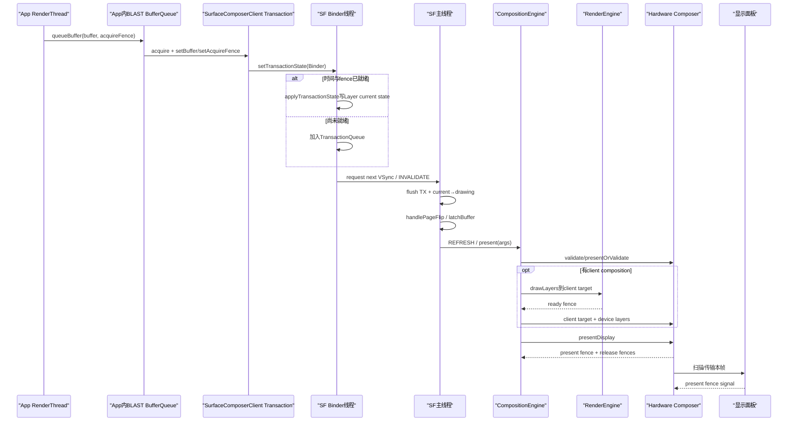
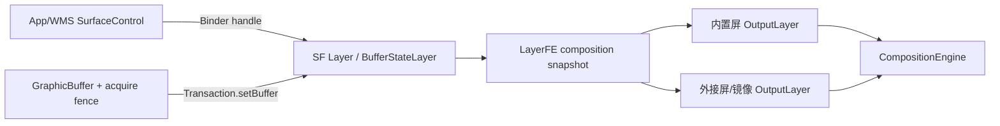
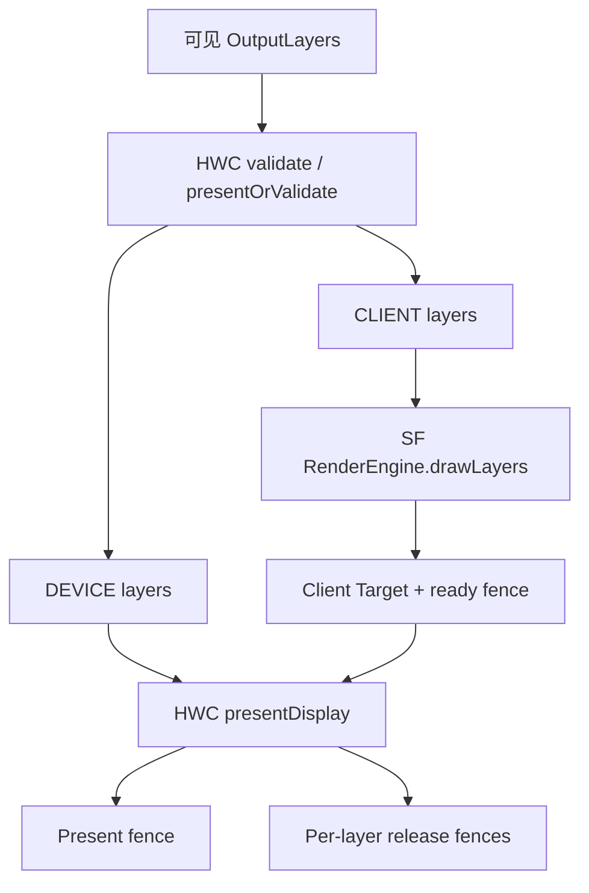

# 215 Android SurfaceFlinger Layer、Buffer latch、CompositionEngine 与硬件 present

> 源码版本：Android 11 `android-11.0.0_r48`。  
> 当前在 macOS 上只读源码，不启动SurfaceFlinger、不连接真实Composer HAL，也不宣称观察过设备present fence。

## 1. 本章目标

第214章已经把Activity首帧追到App进程的 `Surface::queueBuffer()`：RenderThread完成DisplayList回放，通过普通BufferQueue或BLAST适配路径把GraphicBuffer送出。

本章进入SurfaceFlinger进程，回答：

- Android 11 BLAST首Buffer如何随Transaction到达SF；
- `SurfaceControl`、SF `Layer`、`BufferStateLayer`是什么关系；
- SF的current state、drawing state和Buffer latch分别何时发生；
- INVALIDATE与REFRESH为何是两个阶段；
- CompositionEngine如何计算可见层、选择client/device composition；
- RenderEngine、client target与HWC各自负责什么；
- acquire fence、release fence、present fence分别保护谁；
- `presentDisplay()`返回与present fence signal为何又是两个时刻；
- 首帧“真正显示”的源码证据应落在哪个边界。

## 2. 本章的一句话主线

```text
App首Buffer queue到BLAST本地BufferQueue
→ BLAST acquire BufferItem
→ Transaction.setBuffer/acquireFence/apply
→ Binder setTransactionState到SurfaceFlinger
→ SF按desiredPresentTime与acquire fence决定立即应用或排队
→ setClientStateLocked写BufferStateLayer current state并请求下次VSync
→ INVALIDATE阶段handleTransaction把current提交为drawing
→ handlePageFlip选择ready Layer并latch Buffer
→ 若有新内容则发REFRESH
→ CompositionEngine构建每Display可见OutputLayer
→ HWC validate选择client/device composition
→ 必要时RenderEngine先合成client target
→ HWC presentDisplay并返回present/release fences
→ present fence signal才是可靠设备上“开始显示/传输”的证据
```

## 3. 从 App Buffer 到显示硬件的时序图



## 4. 先区分八个状态点

一帧进入SF后仍不是一个原子动作：

1. Transaction到达SF Binder入口；
2. Transaction写入Layer current state；
3. current state提交成drawing state；
4. Buffer被Layer latch为活动Buffer；
5. CompositionEngine选定合成策略；
6. RenderEngine完成client target提交（若需要）；
7. HWC接受present并返回fence；
8. present fence signal，内容开始出现在物理显示或开始传入面板内存。

“Transaction完成”“latch完成”“present调用完成”都不能自动代替第8点。

## 5. 四个执行主体

| 主体 | 进程/线程 | 本章职责 |
|---|---|---|
| BLASTBufferQueue | App进程，queue/callback调用路径 | 把本地BufferQueue内容转为SurfaceControl Transaction |
| SurfaceFlinger Binder入口 | surfaceflinger进程Binder线程 | 收Transaction、权限判断、写current state或排队 |
| SurfaceFlinger主线程 | surfaceflinger主Looper | 在VSync节奏下commit、latch、启动composition |
| HWC/Composer HAL | composer服务/厂商实现/显示硬件 | validate策略、device composition与present |

RenderEngine通常也由SF通过GPU执行client composition，但不是App的RenderThread。

## 6. 本章主线为何从 BLAST Transaction 开始

Android 11的ViewRoot会请求BLAST，WMS允许时，App窗口的HWUI Surface连接到App内 `BLASTBufferQueue`。第214章看到producer queue后，本地 `BLASTBufferItemConsumer`收到frame available。

所以BLAST主路径不是“App的queueBuffer直接唤醒SF的BufferQueue consumer”，而是先在App内完成一次producer→consumer交接。

## 7. BLAST acquire BufferItem

`BLASTBufferQueue::processNextBufferLocked()`调用：

```cpp
status_t status =
        mBufferItemConsumer->acquireBuffer(&bufferItem, -1, false);
```

`BufferItem`带GraphicBuffer、frame number、timestamp、crop、transform和acquire fence。acquire只是BLAST取得本地队列中这帧的消费权，还未把它交给SF Layer。

## 8. BLAST把Buffer写进SurfaceControl Transaction

核心代码：

```cpp
t->setBuffer(mSurfaceControl, buffer);
t->setAcquireFence(mSurfaceControl, bufferItem.mFence);
t->setFrame(mSurfaceControl, {0, 0, mWidth, mHeight});
t->setCrop(mSurfaceControl, computeCrop(bufferItem));
t->setTransform(mSurfaceControl, bufferItem.mTransform);
t->setDesiredPresentTime(bufferItem.mTimestamp);
```

这把内容、几何、同步和期望时间放进同一笔事务。

## 9. SurfaceControl 在这里是什么

App持有的 `SurfaceControl`是对SF图层控制对象的客户端句柄。Transaction通过它找到目标Layer，并描述该Layer状态如何改变。

它不是GraphicBuffer，也不能被View.Canvas直接画；Buffer内容由 `setBuffer()`作为状态载荷附着。

## 10. BLAST目标通常是 BufferStateLayer

WMS为BLAST创建的SurfaceControl使用buffer-state类型，SF对应 `BufferStateLayer`。这种Layer不以SF侧传统BufferQueue为主要输入，而由Transaction直接设置Buffer状态。

因此“BufferState”表示Buffer随状态事务提交，不表示Buffer像素被复制进一个普通C++结构体。

## 11. Transaction.setBuffer 只修改客户端事务快照

`SurfaceComposerClient::Transaction::setBuffer()`做的核心事情是：

```cpp
s->what |= layer_state_t::eBufferChanged;
s->buffer = buffer;
mContainsBuffer = true;
```

这时还没调用SurfaceFlinger；它只是把目标SurfaceControl的 `layer_state_t` 填好。

## 12. setAcquireFence 与 setBuffer必须配套理解

```cpp
s->what |= layer_state_t::eAcquireFenceChanged;
s->acquireFence = fence;
```

Buffer可能由App GPU异步写入。SF/HWC不得在acquire fence signal前把它当作可读完成内容。

## 13. Transaction.apply 进入 Binder

客户端整理 `ComposerState`、DisplayState、flags、desiredPresentTime、listener callbacks后调用：

```cpp
sf->setTransactionState(...);
```

`sf`是 `ISurfaceComposer` Binder接口。这里才跨进程到SurfaceFlinger。

## 14. apply返回不等于事务已显示

默认Transaction不是同步事务。Binder入口可以写入current state、设置flags并很快返回，实际commit/latch/compose等待SF主线程与VSync。

即便显式同步，也主要等待事务“生效”的服务端协议，不应解释成物理面板已经显示。

## 15. applyToken 维持同一客户端队列顺序

Transaction使用TransactionCompletedListener的Binder作为apply token。SF的 `mTransactionQueues`按applyToken组织待处理事务。

同一token前面已有pending事务时，后续事务不能越过它直接应用，否则客户端观察到的状态顺序会错乱。

## 16. SF先缓存expected present time

`setTransactionState()`在无前序pending时计算：

```cpp
mExpectedPresentTime =
        calculateExpectedPresentTime(systemTime());
```

它是SF对当前/下一显示周期的预测，用于判断期望时间是否已经到达；不是硬件实际present时间。

## 17. transactionIsReady 的第一道门：desiredPresentTime

若期望时间尚未到，且没有离谱到超过未来1秒，SF返回not ready：

```cpp
if (desiredPresentTime >= expectedPresentTime
        && desiredPresentTime < expectedPresentTime + s2ns(1)) {
    return false;
}
```

超过一秒的异常未来时间会为稳定性被忽略，避免Layer永久卡住。

## 18. transactionIsReady 的第二道门：acquire fence

SF遍历ComposerState：

```cpp
if (s.acquireFence
        && s.acquireFence->getStatus()
                == Fence::Status::Unsignaled) {
    return false;
}
```

BLAST BufferState事务因此通常在GPU写完成fence signal后才进入Layer current state。

## 19. 这与传统 BufferQueue latch 检查有差异

传统 `BufferQueueLayer`的Buffer可先排在队列里，SF在latch时再看头部fence/时间戳。BufferStateLayer的Transaction在更前面的apply阶段就按desired time和acquire fence排队。

两条路径最终都要防止过早读Buffer，但门所在层次不同。

## 20. not ready 时进入 mTransactionQueues

```cpp
mTransactionQueues[applyToken].emplace(...);
setTransactionFlags(eTransactionFlushNeeded);
return;
```

它不是丢弃事务。后续SF主线程在INVALIDATE中 `flushTransactionQueues()`，只要队头就绪就按顺序apply。

## 21. 为什么只检查队头

同一applyToken内事务有先后依赖。即使第二笔fence先signal，也不能跳过第一笔直接应用。

这类“队头阻塞”是保证状态序列一致性的代价。

## 22. ready 后进入 applyTransactionState

`applyTransactionState()`遍历每个 `ComposerState`，调用：

```cpp
clientStateFlags |= setClientStateLocked(...);
```

这里会解析Layer句柄、权限和 `what` 位，分别设置position、crop、alpha、parent、buffer等状态。

## 23. Buffer变化落到 BufferStateLayer.setBuffer

当 `eBufferChanged`有效：

```cpp
layer->setBuffer(buffer, s.acquireFence,
        postTime, desiredPresentTime, s.cachedBuffer);
```

`Layer`基类提供虚函数，BLAST目标由 `BufferStateLayer`实现。

## 24. setBuffer 写的是 current state

```cpp
mCurrentState.frameNumber++;
mCurrentState.buffer = buffer;
mCurrentState.modified = true;
setTransactionFlags(eTransactionNeeded);
```

current state表示最新客户端/系统请求；它还不是本轮CompositionEngine使用的稳定drawing快照。

## 25. frame number 在这里推进

BufferStateLayer每次接受新Buffer就增加自己的frame number，并把post/desired时间交给TimeStats与LayerHistory。

它不是App Choreographer frameId，也不是HWC显示序号；跨层分析必须注明编号域。

## 26. setTransactionFlags 唤醒的是下次 SF VSync

SF把 `eTransactionNeeded/eTraversalNeeded` OR进原子flags；第一次从无到有时调用 `signalTransaction()`，最终：

```cpp
mEventQueue->invalidate();
```

`invalidate()`向Scheduler请求下一次VSync，而不是立刻在Binder线程完整合成。

## 27. Binder线程为何不直接compose

多个客户端事务、Buffer、显示刷新率和硬件present必须汇合到一致的帧节奏。若每个Binder调用都即时合成，会破坏批处理、Z顺序快照与显示时序。

所以Binder线程主要更新current state和调度，SF主线程负责帧边界。

## 28. MessageQueue 的两类消息

Android 11 SF主队列区分：

- `INVALIDATE`：在VSync到达时处理事务、latch Buffer、判断是否需要刷新；
- `REFRESH`：真正调用CompositionEngine进行合成与present。

两者可以在同一帧连续发生，但语义不能合并。

## 29. VSync如何变成 INVALIDATE

MessageQueue从DisplayEventReceiver读到VSync事件后：

```cpp
mHandler->dispatchInvalidate(
        buffer[i].vsync.expectedVSyncTimestamp);
```

Handler把预测present时间交给 `SurfaceFlinger::onMessageInvalidate()`。

## 30. INVALIDATE阶段总览

```text
记录expected VSync/present时间
→ handleMessageTransaction
→ flush ready TransactionQueues
→ handleTransaction current→drawing
→ handleMessageInvalidate
→ handlePageFlip/latchBuffer
→ 计算bounds、damage
→ 有新内容则signalRefresh
```

“PageFlip”是历史命名，里面做的是Layer Buffer latch与刷新判断。

## 31. handleMessageTransaction 先flush待处理事务

它读取transaction flags并调用：

```cpp
bool flushedATransaction = flushTransactionQueues();
```

这使刚刚signal的acquire fence或到期时间能在本次VSync被重新检查。

## 32. handleTransaction 把Layer请求变成drawing状态

在全局锁内，`handleTransactionLocked()`遍历有 `eTransactionNeeded` 的Layer并调用 `doTransaction()`，计算可见区域/输入信息变化等。

随后 `commitTransactionLocked()`执行：

```cpp
mDrawingState = mCurrentState;
```

drawing state是接下来latch与composition使用的相对稳定快照。

## 33. current/drawing不是简单“两块全局内存”

SF既有全局State的current/drawing，也有每个Layer内部的current/drawing字段和pending状态。`doTransaction()`负责逐Layer推进、计算派生几何，再由全局commit固定树结构。

学习时用“请求态→本帧绘制态”理解即可，不要假设只有一次浅拷贝。

## 34. Layer树与View树不是同一棵树

SF Layer树描述窗口、SurfaceView、壁纸、状态栏等可独立合成图层及其parent/Z关系。它不认识App内部Button/TextView。

App整个Decor通常已经被HWUI画进一个窗口Buffer；SF只看到对应窗口层及其他Surface层。

## 35. BLAST层常位于WMS容器层之下

WMS可持有容器/父SurfaceControl处理窗口层级、动画和裁剪，App Buffer附在BLAST BufferStateLayer子层。

因此“一个WindowState等于一个唯一SF Layer”过度简化；窗口可能拥有父、buffer、bounds、动画等多个SurfaceControl节点。

## 36. 传统 BufferQueueLayer 仍需认识

非BLAST或其他producer可使用 `BufferQueueLayer`：SF侧有BufferQueue consumer，`onFrameAvailable`把BufferItem放入内部队列，latch时选择合适帧。

本章首帧以BufferStateLayer为主，但公共 `BufferLayer::latchBuffer()`同时服务两类派生层。

## 37. handlePageFlip先冻结待latch集合

SF先遍历drawing Layer树，把ready且应在本周期present的Layer放进：

```cpp
mLayersWithQueuedFrames
```

源码特意先收集再latch，避免遍历期间producer继续进帧导致不同Layer互相等待或死锁。

## 38. hasReadyFrame 是候选条件

BufferLayer统一判断：

```cpp
return hasFrameUpdate()
        || getSidebandStreamChanged()
        || getAutoRefresh();
```

对首个BufferStateLayer，current/drawing中有已修改Buffer即构成frame update。

## 39. BufferStateLayer.shouldPresentNow 为什么很简单

它基本返回 `hasFrameUpdate()`，不再次比较expectedPresentTime。因为BufferState事务在 `transactionIsReadyToBeApplied()`阶段已经按desired time排队。

传统BufferQueueLayer则在 `shouldPresentNow(expectedPresentTime)`检查队首timestamp是否到期。

## 40. latchBuffer 的第一道门：已有refresh pending

若上一Buffer已 `updateTexImage()`但尚未经历compositionComplete，`mRefreshPending`为true，本次跳过，避免连续更新纹理却没有对应合成完成。

这保护RenderEngine/Buffer生命周期，不是“有新Buffer就无限吞”。

## 41. latchBuffer 的第二道门：fenceHasSignaled

```cpp
if (!fenceHasSignaled()) {
    mFlinger->signalLayerUpdate();
    return false;
}
```

BufferState主线通常已在Transaction apply前等过fence；传统BufferQueue或特殊配置仍使这道公共防线有意义。

## 42. debug.sf.latch_unsignaled 是危险调试旁路

`BufferLayer::latchUnsignaledBuffers()`读取 `debug.sf.latch_unsignaled`。启用时允许跳过正常fence门，主要用于调试，不是生产协议默认。

不能用这个分支解释普通设备为何安全读取GPU Buffer。

## 43. latchBuffer 还要满足跨Layer同步点

`allTransactionsSignaled(expectedPresentTime)`检查defer transaction等本地sync point。关联Layer目标frame尚不可用或事务未应用时，本次不latch，并请求后续traversal。

这支持“窗口移动与某个Buffer frame原子发生”等跨Layer协调。

## 44. updateTexImage 在 BufferStateLayer 做什么

它校验Buffer尺寸/变换与当前Layer active尺寸，给transaction callbacks记录latchTime/frameNumber，并登记acquire fence与TimeStats。

如果设备不用native fence sync，还可能在此把新Buffer绑定到GL纹理；现代native fence路径可推迟到真正client composition。

## 45. updateActiveBuffer 才换活动内容

```cpp
mPreviousBufferId = getCurrentBufferId();
mBufferInfo.mBuffer = s.buffer;
mBufferInfo.mFence = s.acquireFence;
```

`mBufferInfo`是BufferLayer提供给CompositionEngine/HWC的活动Buffer信息。latch前的current state只是候选请求。

## 46. updateFrameNumber 记录 latch

SF把 `mCurrentFrameNumber`推进到drawing state的frame number，并在FrameEventHistory记录latch时间。

latch time表示SF选中并接纳这帧，不是HWC开始扫描的时间。

## 47. 第一块Buffer会使可见区域失效

公共latch逻辑看到旧 `mBufferInfo.mBuffer == nullptr` 时：

```cpp
recomputeVisibleRegions = true;
```

没有Buffer时BufferLayer通常不可见；首Buffer到来后必须重新计算它对屏幕覆盖、遮挡和damage的影响。

## 48. crop/transform/size变化也触发几何重算

新旧Buffer的crop、transform、scale mode、display inverse或尺寸不同，都会令visible regions dirty。

即便SurfaceControl位置没变，Buffer自身元数据变化也可能改变屏幕占用范围。

## 49. latch成功只把Layer内容准备好

`latchBuffer()`返回true后，Layer进入 `mLayersPendingRefresh`，SF把对应屏幕区域标脏。

这一步没有调用HWC present，也没有承诺该Buffer最终没被更上层不透明Layer遮住。

## 50. offscreen Layer为何也要latch/release

不可达/离屏Layer不参与当前显示，但producer仍可能不断提交。SF对offscreen Layer调用 `latchAndReleaseBuffer()`，避免producer因为没有slot回收而永久阻塞。

消费并释放离屏Buffer不代表它曾出现在屏幕上。

## 51. 有新数据才发 REFRESH

`handlePageFlip()`返回：

```cpp
return !mLayersWithQueuedFrames.empty()
        && newDataLatched;
```

onMessageInvalidate综合事务/重绘请求后调用 `signalRefresh()`，向主Looper投递REFRESH消息。

## 52. REFRESH阶段入口

`SurfaceFlinger::onMessageRefresh()`收集：

- 所有Display对应的CompositionEngine Output；
- drawing Layer树的LayerFE；
- 本轮latch过Buffer的layersWithQueuedFrames；
- 是否全量重绘、颜色、geometry/damage标志。

然后调用：

```cpp
mCompositionEngine->present(refreshArgs);
```

## 53. CompositionEngine 不等于 GPU

CompositionEngine是SF内组织合成的框架。它协调Layer前端状态、每Display Output、RenderSurface、RenderEngine和HWComposer。

真正的client composition由RenderEngine/GPU执行；device composition交给HWC/HWC HAL。

## 54. Layer、LayerFE、OutputLayer 三者

| 类型 | 作用 |
|---|---|
| SF `Layer` | 全局图层树、Buffer与事务状态 |
| `LayerFE` | CompositionEngine读取Layer前端快照的接口 |
| `OutputLayer` | 某个Layer在某个Output/Display上的投影与合成状态 |

同一Layer可能出现在多个Display Output上，因此可能对应多个OutputLayer。



## 55. CompositionEngine.present 的骨架

```cpp
preComposition(args);
for (output) output->prepare(args, latchedLayers);
updateLayerStateFromFE(args);
for (output) output->present(args);
```

它先收集/准备几何快照，再让每个输出独立选择与执行合成。

## 56. Output.prepare 重建可见Layer栈

geometry变化时，`rebuildLayerStacks()`从前到后/后到前计算：

- Layer是否属于该output的layer stack；
- hidden、alpha、bounds与transform；
- opaque、visible、covered、transparent、shadow region；
- dirty与新暴露区域；
- Z顺序和OutputLayer创建/复用。

这一步决定“有哪些候选内容实际影响这个显示器”。

## 57. 被完全遮挡的Layer可不进入输出

上层不透明区域会从下层visible region扣除。下层窗口即使成功latch Buffer，也可能因完全被遮挡而没有可见draw region。

因此“Layer latched”不等于“用户能看到该Layer像素”。

## 58. Output.present 的固定阶段

```cpp
updateColorProfile();
updateAndWriteCompositionState();
setColorTransform();
beginFrame();
prepareFrame();
finishFrame();
postFramebuffer();
```

策略选择发生在 `prepareFrame()`，GPU client composition发生在 `finishFrame()`，HWC present/fence处理发生在 `postFramebuffer()`。

## 59. 先把每个OutputLayer状态写给HWC

`updateAndWriteCompositionState()`计算displayFrame、sourceCrop、buffer transform、dataspace、blend、alpha、damage等，然后调用：

```cpp
layer->writeStateToHWC(...);
```

HWC只有看到完整候选状态，才能判断哪些Layer可由硬件直接处理。

## 60. client composition 与 device composition

- Client composition：SurfaceFlinger用RenderEngine/GPU把若干Layer画进一个client target；
- Device composition：HWC直接拿Layer Buffer，使用overlay、display processor或其他厂商硬件组合。

“client”这里指HWC的客户端SurfaceFlinger，不是应用进程。

## 61. 一帧可以混合合成

例如：

```text
App窗口A → DEVICE
视频Surface → DEVICE overlay
模糊/复杂颜色层 → CLIENT
CLIENT层先由RenderEngine合成到client target
HWC再把client target与两个DEVICE层一起present
```

不是只能“全GPU”或“全HWC”二选一。



## 62. 什么会强制 client composition

源码可因下列条件设置 `forceClientComposition`：

- 非secure output上出现secure内容；
- 无效buffer transform；
- Output颜色配置不支持该dataspace；
- 背景模糊等必须由RenderEngine完成的效果；
- 开发者强制禁用HWC或调试脏区。

具体厂商HWC还可在validate时要求更多Layer改为CLIENT。

## 63. chooseCompositionStrategy 与 HWC validate

物理Display覆盖基类策略，调用：

```cpp
hwc.getDeviceCompositionChanges(
        displayId,
        anyLayersRequireClientComposition(),
        &changes);
```

HWC validate返回changed composition types、display requests、layer requests和client target属性，SF接受并更新每个OutputLayer。

## 64. validate不是实际显示

validate的作用是协商“这帧谁合成什么”。它可能要求SF把原计划DEVICE的Layer改成CLIENT，然后SF据此生成client target。

即使validate成功，内容仍未必提交给显示面板。

## 65. presentOrValidate 快路径

当当前帧没有client composition时，SF先尝试：

```cpp
hwcDisplay->presentOrValidate(...);
```

若HWC确认无需重新validate，可直接完成present并返回present fence；否则退回正常validate→present流程。

## 66. fast path 不改变完成边界

presentOrValidate若直接present，只减少一次往返/validate成本。返回fence仍可能未signal；物理开始显示仍看fence信号语义。

## 67. beginFrame 决定是否需要重组

Output根据dirty region、是否有可见层及上一帧是否为空计算 `mustRecompose`，再调用RenderSurface beginFrame。

没有变化时可避免重复client composition，但HWC状态机或显示请求仍可能需要走后续步骤。

## 68. RenderSurface 是SF输出目标抽象

对物理显示，RenderSurface背后常由FramebufferSurface/BufferQueue连接到HWC client target。它承载的是SF GPU合成结果，不是App窗口自己的Surface。

不要把App GraphicBuffer和SF client target混成同一块Buffer。

## 69. finishFrame 只在需要时执行GPU合成

```cpp
auto optReadyFence = composeSurfaces(...);
if (!optReadyFence) return;
mRenderSurface->queueBuffer(std::move(*optReadyFence));
```

若没有client composition，`composeSurfaces()`返回的是一个已构造、但内部fd无效的NO_FENCE语义值，而不是失败用的空optional；RenderEngine不画这些Layer，RenderSurface仍可完成本帧必要的状态机/queue步骤，device layers继续直接交HWC。

## 70. client composition 先 dequeue client target

需要client composition或HWC要求flip client target时：

```cpp
buf = mRenderSurface->dequeueBuffer(&fd);
```

`fd`是该client target可安全重写的fence。SF也会受到显示输出BufferQueue的slot/consumer背压。

## 71. generateClientCompositionRequests 生成RenderEngine输入

SF只为 `requiresClientComposition()` 的OutputLayer生成LayerSettings，带：

- source buffer/solid color；
- boundaries、transform、clip；
- alpha、blend、filtering；
- dataspace、rounded corners、shadow/blur；
- clear client target请求。

DEVICE层通常不会重复画进client target，除非HWC要求清理/特殊混合。

## 72. RenderEngine.drawLayers 执行SF GPU合成

```cpp
renderEngine.drawLayers(
        clientCompositionDisplay,
        layerPointers,
        buf->getNativeBuffer(),
        true,
        std::move(fd),
        &readyFence);
```

这里的GPU工作发生在surfaceflinger侧RenderEngine，不是App HWUI RenderThread。

## 73. readyFence 保护 client target

RenderEngine可能异步写client target，`readyFence`告诉HWC何时可以读取这块合成结果。

它在HWC语义中成为client target acquire fence，与App Layer各自的acquire fence作用相似，但保护的Buffer不同。

## 74. RenderSurface.queueBuffer 提交 client target

SF把client target及ready fence交给RenderSurface/HWC路径。此时HWC可把它作为一个整体层，与DEVICE composition的原始App Layer组合。

因此GPU client composition不是最终物理present，只是为HWC准备一个输入。

## 75. DEVICE composition 也不是“无GPU成本”承诺

DEVICE表示合成交给HWC。具体使用overlay、2D硬件、display processor还是厂商GPU实现，由HAL/硬件决定。

源码层只能断言责任边界，不能凭composition type推断功耗和硬件单元。

## 76. postFramebuffer 进入最终present阶段

```cpp
mRenderSurface->flip();
auto frame = presentAndGetFrameFences();
```

对物理Display，`Display::presentAndGetFrameFences()`调用HWComposer present并取回present/release fences。

## 77. HWC presentDisplay 的前置条件

正常慢路径必须先成功validate并接受changed types。随后 `HWComposer::presentAndGetReleaseFences()`调用：

```cpp
hwcDisplay->present(&lastPresentFence);
hwcDisplay->getReleaseFences(&releaseFences);
```

fast path若已由presentOrValidate present，则这里只flush command buffer并复用已经取得的fences。

## 78. present() 返回表示什么

它表示HWC接受/安排了本帧present，并把未来会signal的fence交回SF。函数返回时面板通常还没到目标VSync。

所以trace中的HWC `present` slice结束不是物理上屏完成时间。

## 79. present fence 的规范语义

HWC 2.1接口说明：

- video-mode物理面板：在本帧合成结果开始出现在显示器的VSync时signal；
- command-mode面板：在内容开始传入面板内存时signal；
- virtual display：输出Buffer写完成、可安全读取时signal。

它是系统可获得的实际present时间证据，但“开始出现”不等于整屏扫描已经结束。

## 80. present fence 也可能不可靠或不存在

Composer capability `PRESENT_FENCE_IS_NOT_RELIABLE`明确允许实现声明present fence不能准确代表实际present时间；无sync framework或特殊VR composer也会让SF忽略它。

源码还在无有效present fence时用HWC refresh timestamp回退。因此诊断前必须检查能力与fence有效性。

## 81. release fence 的规范语义

HWC为Layer返回release fence，表示显示系统已经不再读取此前提交的Buffer，producer之后可以安全复用/重写相应slot。

它保护Buffer生命周期，不是“这一帧开始显示”的时间戳。

## 82. 三类 fence 对照

| Fence | 谁产生 | 谁等待/使用 | signal含义 |
|---|---|---|---|
| App Layer acquire fence | App GPU/HWUI | SF/RenderEngine/HWC | App完成该Buffer写入，可读 |
| Layer release fence | HWC/SF | App producer/BLAST | 显示系统不再读旧Buffer，可复用 |
| Display present fence | HWC | SF统计/Scheduler/回调 | 本帧开始显示或开始传入面板 |

同一个fd在跨层传递时可能被dup/merge，概念角色仍应按被保护的资源区分。

## 83. Output.postFramebuffer 分发 release fence

SF先取得HWC每个device Layer的release fence；只要整个Output本帧使用了client composition，源码就保守地把各OutputLayer的release fence与当前client target acquire fence合并（它没有精确跟踪上一帧client target fence），再调用：

```cpp
layer->getLayerFE().onLayerDisplayed(releaseFence);
```

这样BufferStateLayer能把旧Buffer何时可释放反馈给BLAST客户端。

## 84. 为什么release通常对应“前一块Buffer”

当前帧新Buffer成为显示输入后，release fence通常描述被它替换的上一Buffer何时不再被读。新Buffer自己的最终release要等后续帧替换或Layer移除。

首Buffer没有同Layer的前一块业务Buffer，因此相关previous release可为空/NO_FENCE。

## 85. SurfaceFlinger.postComposition 做收尾

CompositionEngine present返回后，SF：

- 让latched Layer `releasePendingBuffer()`；
- 取得默认Display的present fence；
- 记录GPU composition done与present时间；
- 调用每个Layer `onPostComposition()`；
- 给TransactionCompletedThread添加present fence并发送callbacks；
- 把fence交Scheduler/TimeStats。

这里仍通常只是持有未signal的present fence。

## 86. Transaction completed callback 如何回到 BLAST

BLAST在Transaction中注册completion callback。SF将latchTime、presentFence、SurfaceControlStats、previousReleaseFence等经 `ITransactionCompletedListener`回给App。

App `TransactionCompletedListener`再调用 `BLASTBufferQueue::transactionCallback()`。

## 87. callback到达不必等待present fence signal

SF在postComposition拿到fence后即可发送callback；fence对象本身可以仍是pending。客户端若需要实际present时间，必须观察/等待fence signal，而不是把callback执行时刻当present。

## 88. BLAST callback负责释放上一Buffer

BLAST保存pending release item，从SurfaceStats取 `previousReleaseFence`，再：

```cpp
mBufferItemConsumer->releaseBuffer(
        pendingItem,
        previousReleaseFence);
```

只有fence允许时该GraphicBuffer slot才真正安全回到producer循环。

## 89. BLAST还能继续处理影子队列

transaction callback释放旧Buffer、更新frame timestamps后调用 `processNextBufferLocked(false)`，继续提交积压的下一帧。

这形成：App RenderThread producer→本地BLAST consumer→SF Transaction→HWC fences→BLAST release的闭环。

## 90. WMS finishDrawing 与 SF首Buffer的关系

第214章看到App在HWUI frame-complete后调用WMS `finishDrawing()`；它让WMS把窗口从DRAW_PENDING推进并提交show事务。

SF同时需要收到窗口首Buffer和show/alpha/layer事务。最终可见结果由这两类控制面/数据面状态在SF帧边界汇合，不是单靠任一调用。

## 91. WindowState HAS_DRAWN 仍早于present fence signal

WMS的draw state描述客户端绘制协议和窗口可show资格。SurfaceFlinger latch/compose/HWC present属于之后的图形管线。

所以“WMS显示窗口”“windowsDrawn回调”“屏幕光子已变化”必须按具体API与fence证据区分。

## 92. 首帧完成点总表

| 观察点 | 能证明 | 不能证明 |
|---|---|---|
| App `queueBuffer`返回 | producer已提交Buffer | SF已latch |
| SF `latchBuffer`成功 | Layer选中活动Buffer | Layer可见或已present |
| HWC validate成功 | 合成责任已协商 | 已提交显示 |
| `presentDisplay`返回 | HWC接受present并给fence | fence已signal |
| reliable present fence signal | 本帧开始显示/传输到面板 | 整屏扫描完全结束 |

## 93. Buffer会不会被跳过

可能。传统BufferQueue的droppable/async模式可以用新帧替换旧队尾；timestamp尚未到的帧延后；fence太晚会错过本VSync；Layer离屏时Buffer可被消费后直接释放。

“App每queue一帧，面板就逐帧展示”不是BufferQueue保证。

## 94. Late acquire 如何导致错过本周期

acquire fence未signal时，Transaction或latch暂缓，SF请求下一次layer update。本轮可能继续显示旧Buffer。

这避免读半成品，但增加输入到显示的延迟，并可能被统计为latch skipped/late acquire。

## 95. desiredPresentTime 如何避免过早显示

App/HWUI给Buffer timestamp，BLAST转成Transaction desired present time。SF在预计present时间尚早时把Transaction留在队列。

它是调度目标，不保证一定精准命中；系统负载、fence、HWC和VSync都可能使实际present更晚。

## 96. 背压如何向App传播

显示消费慢时：

```text
HWC/panel迟迟不release旧Buffer
→ BLAST consumer不能release slot
→ producer可用slot减少
→ App RenderThread dequeueBuffer阻塞
→ syncAndDrawFrame/下一帧UI可能等待更久
```

这是图形流水线保持有限内存和有序所有权的自然结果。

## 97. 多Display时不能只看默认屏

CompositionEngine为每个Output构建OutputLayer并独立present。同一Layer可投影到多个输出，合成类型、颜色空间、fence与实际时序可能不同。

`SurfaceFlinger::postComposition()`中的部分全局统计以默认Display为主，不能外推所有虚拟/外接屏。

## 98. secure/protected 内容会改变合成选择

受保护GraphicBuffer不能随意被普通GPU上下文读取；CompositionEngine检查output secure属性与RenderEngine protected support，必要时使用受保护上下文或强制特定路径。

非secure输出上的secure Layer可能被强制CLIENT，随后由protected-content能力和安全输出策略决定能否取样、合成或被替代；不能只凭这一处分支断言一定正常显示或一定黑屏。

## 99. “Hardware Composer”不一定亲自画所有像素

HWC是合成策略与显示提交接口。它可以让SF GPU生成client target，也可以让overlay硬件直出Layer，还可混合两者。

它的核心价值是把显示硬件能力暴露给SF，而不是保证“所有合成都不用GPU”。

## 100. macOS只读练习一：追 BLAST Transaction

```bash
cd /Users/ninebot/androidSource
rg -n "processNextBufferLocked|setBuffer\(|setAcquireFence|setTransactionState" \
  frameworks/native/libs/gui/{BLASTBufferQueue.cpp,SurfaceComposerClient.cpp} \
  frameworks/native/services/surfaceflinger/SurfaceFlinger.cpp
```

标出App本地BufferQueue、Binder边界和SF Layer setBuffer三个阶段。

## 101. macOS只读练习二：追 transaction ready 与 latch

```bash
cd /Users/ninebot/androidSource
rg -n "transactionIsReadyToBeApplied|flushTransactionQueues|handlePageFlip|latchBuffer|updateActiveBuffer" \
  frameworks/native/services/surfaceflinger/{SurfaceFlinger.cpp,BufferLayer.cpp,BufferStateLayer.cpp}
```

分别写出desiredPresentTime、acquire fence、sync point、active buffer四道门。

## 102. macOS只读练习三：对比 CLIENT/DEVICE 合成

```bash
cd /Users/ninebot/androidSource
rg -n "chooseCompositionStrategy|getDeviceCompositionChanges|composeSurfaces|drawLayers|presentAndGetFrameFences" \
  frameworks/native/services/surfaceflinger/CompositionEngine/src/{Output.cpp,Display.cpp} \
  frameworks/native/services/surfaceflinger/DisplayHardware/HWComposer.cpp
```

画出纯DEVICE、纯CLIENT和混合三种输入到HWC的形态。

## 103. macOS只读练习四：核对 fence 语义

```bash
cd /Users/ninebot/androidSource
rg -n "SET_PRESENT_FENCE|SET_RELEASE_FENCES|PRESENT_FENCE_IS_NOT_RELIABLE" \
  hardware/interfaces/graphics/composer/2.1/{IComposer.hal,IComposerClient.hal}
```

用自己的话写出acquire、release、present三个fence的生产者、消费者和signal含义，不把present fence写成“整屏扫描结束”。

## 104. 自测题

1. BLAST路径中App queueBuffer后谁直接消费BufferQueue？
2. `Transaction.setBuffer()`何时真正跨进程？
3. desiredPresentTime和acquire fence在哪一步阻止Transaction过早应用？
4. SF current state和drawing state分别表示什么？
5. INVALIDATE与REFRESH各做什么？
6. BufferStateLayer与BufferQueueLayer的时间/fence门有何差异？
7. latchBuffer成功能否证明用户已经看到？
8. Layer、LayerFE、OutputLayer有什么区别？
9. CLIENT与DEVICE composition中的“client/device”指谁？
10. client target是谁生成、给谁消费？
11. present()返回与present fence signal有什么区别？
12. acquire、release、present fence分别保护什么？

## 105. 自测答案

1. App内BLASTBufferItemConsumer先消费，再用Transaction把Buffer交给SF BufferStateLayer。
2. setBuffer只写客户端快照，Transaction.apply调用ISurfaceComposer.setTransactionState时跨Binder。
3. SF `transactionIsReadyToBeApplied()`；未就绪事务按applyToken排队。
4. current是最新请求态；drawing是本帧commit后供latch/composition使用的稳定快照体系。
5. INVALIDATE处理事务、latch和damage；REFRESH调用CompositionEngine合成并present。
6. BufferState事务apply前已按时间/fence排队；传统BufferQueue常在队列选择/latch时检查。
7. 不能；还要可见区域、策略、HWC present和可靠present fence signal。
8. Layer是全局SF图层；LayerFE是合成前端快照接口；OutputLayer是该Layer在具体Display上的实例。
9. CLIENT指HWC客户端SurfaceFlinger/RenderEngine；DEVICE指HWC负责。
10. SF RenderEngine把CLIENT层合成到client target，HWC再与DEVICE层一起提交显示。
11. present返回表示已安排并取得fence；fence signal才表示按HAL语义开始显示/传输。
12. acquire保护新Buffer写完成，release保护旧Buffer可复用，present标记显示提交实际生效时点。

## 106. 本章结论

Android 11的BLAST首帧在App内完成一次BufferQueue消费，再将GraphicBuffer、acquire fence、crop/transform和desired present time组成SurfaceControl Transaction。SurfaceFlinger Binder入口不会直接把它画到屏幕，而是按时间、fence和applyToken顺序写入BufferStateLayer current state；SF主线程在VSync对应的INVALIDATE阶段把请求提交为drawing状态并latch活动Buffer，首Buffer还会触发可见区域和damage重算。

REFRESH阶段，CompositionEngine为每个Display构建OutputLayer，HWC validate决定CLIENT、DEVICE或混合合成。CLIENT层由SF RenderEngine先画进client target，HWC再把client target与DEVICE层一起present。`presentDisplay()`返回只说明HWC接受本帧并返回fence；在实现可靠时，present fence signal才表示内容开始出现在video-mode面板或开始传入command-mode面板。它仍不等于整屏扫描完全结束。

## 107. 复读后的边界修订

- 不把BLAST路径写成App `queueBuffer`直接触发SF侧BufferQueueLayer；App内BLAST consumer先acquire，再通过Transaction设置BufferStateLayer。
- 不把 `SurfaceControl`、SF Layer和GraphicBuffer当成同一对象；前者是控制句柄，中间是服务端图层状态，后者承载像素。
- 不把 `Transaction.setBuffer()`当跨进程；真正Binder边界在apply→`setTransactionState()`。
- 不把Transaction apply返回当事务已latch、已compose或已present。
- 不忽略applyToken队头顺序、desiredPresentTime和acquire fence三类Transaction ready条件。
- 不把全局current/drawing和Layer内部current/drawing简化成唯一一次浅拷贝；它们共同形成请求态→本帧绘制态。
- 不把INVALIDATE与REFRESH混成同一回调；前者commit/latch，后者composition/present。
- 不把传统BufferQueueLayer的timestamp/fence选择规则原样套给BufferStateLayer；后者在Transaction apply前已有一道门。
- 不把latch称为“上屏”；它只把Buffer选为Layer活动内容。
- 不把Layer树当View树；SF不知道窗口内部TextView/Button。
- 不把CompositionEngine当GPU，也不把HWC DEVICE类型断言为具体overlay硬件。
- 不把CLIENT解释为App客户端；它是HWC视角下由SurfaceFlinger/RenderEngine完成合成。
- 不把SF client target与App窗口Buffer混成一块Buffer。
- 不把HWC validate当present，也不把present函数返回时刻当fence signal时刻。
- 不把present fence signal写成整屏扫描完成；规范是开始显示或开始传入面板，且实现可声明不可靠。
- 不把release fence当present时间；它解决旧Buffer何时可复用。
- 不把Transaction completed callback到达时间当实际present；callback可以携带仍pending的present fence。
- 不把当前Mac静态推演写成设备实际选择了CLIENT/DEVICE、具体fence时间或首帧耗时。

下一章将回到帧节奏源头，精读Choreographer、DisplayEventReceiver、app/SF VSync phase、callback队列与Android 11的FrameInfo/jank时间戳，解释UI线程为何在某个时刻开始一帧，以及“掉帧”究竟掉在哪一段；不把Android 12以后更完整的FrameTimeline机制倒灌到r48。
