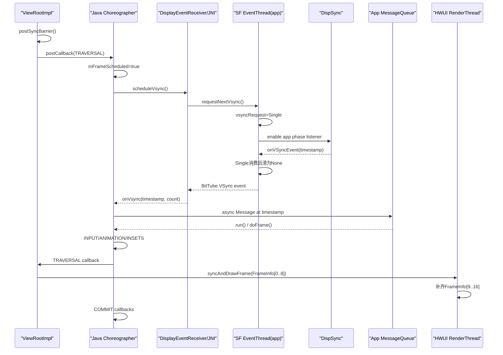
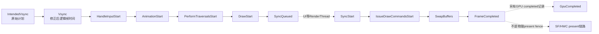
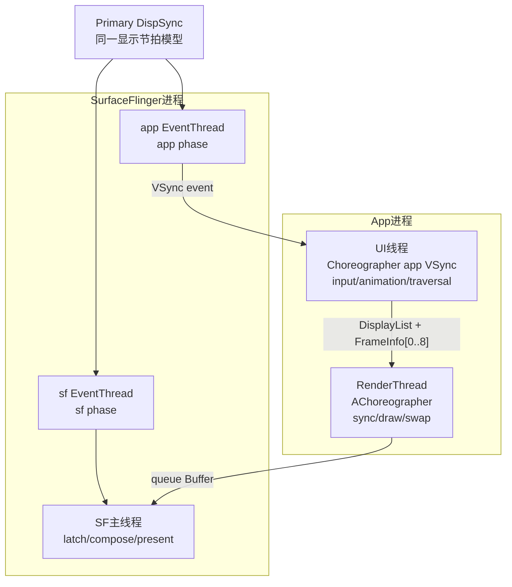

# 216 Android Choreographer、DisplayEventReceiver、VSync 与 FrameInfo 时间线

> 源码版本：Android 11 `android-11.0.0_r48`。  
> 当前环境：macOS 只读源码；本章不编译、不连设备，不把源码推导写成真机实测结论。

## 1. 本章要解决什么

第213章看到 `ViewRootImpl.performTraversals()`，第214章把画面交给RenderThread并queue Buffer，第215章再把Buffer追到SurfaceFlinger与HWC。

这三章还留下一个关键问题：整条线为什么能围绕显示节拍协作？

本章回答：

- `requestLayout()`或 `invalidate()`如何合并成一次帧请求；
- Java `Choreographer`如何按需申请一次app VSync；
- `DisplayEventReceiver` 如何穿过JNI、Binder、BitTube和Looper返回事件；
- app VSync和SF VSync是不是两个独立的硬件信号；
- 迟到的VSync为什么会修正 `frameTimeNanos`；
- INPUT、ANIMATION、INSETS_ANIMATION、TRAVERSAL、COMMIT为什么必须按顺序执行；
- Java `FrameInfo` 的9个时间点如何被HWUI扩展为17项；
- `FrameMetrics`、`JankTracker`能证明什么，又不能证明什么。

## 2. 一句话主线

```text
ViewRootImpl投递TRAVERSAL callback
→ Choreographer只把本轮窗口工作合并成一个frame request
→ DisplayEventReceiver通过Binder向SurfaceFlinger EventThread请求Single VSync
→ DispSync按app phase产生时间点
→ EventThread通过BitTube写入事件
→ App Looper读fd，JNI回调FrameDisplayEventReceiver.onVsync
→ onVsync投递异步Message，而非当场开始画
→ doFrame计算迟到量并选定稳定frameTime
→ INPUT → ANIMATION → INSETS_ANIMATION → TRAVERSAL → COMMIT
→ FrameInfo把UI与RenderThread阶段串成一条渲染时间线
```

## 3. 先看全链路时序图



## 4. 一帧不是一个函数

日常语言常说“开始画一帧”，但源码中至少要区分：

1. 某个对象发生变化；
2. 把工作挂到Choreographer callback队列；
3. 向SF请求下一次VSync事件；
4. App主线程真正处理VSync Message；
5. 各类callback依次执行；
6. UI线程记录DisplayList并与RenderThread同步；
7. RenderThread发送GPU命令、queue Buffer；
8. SF latch、compose、HWC present。

本章主要讲第2到6步，不把第6步完成写成第8步完成。

## 5. Choreographer 是“线程级帧编排器”

`Choreographer` 不是全局单例。普通入口是 `ThreadLocal<Choreographer>`，它把实例绑在已有Looper的调用线程上。

对App界面而言，通常使用主线程的Choreographer；其他有Looper的线程也可以拥有自己的实例。

## 6. 普通实例使用app VSync source

Android 11 r48中，普通ThreadLocal初始化使用：

```java
protected Choreographer initialValue() {
    Looper looper = Looper.myLooper();
    return new Choreographer(looper, VSYNC_SOURCE_APP);
}
```

这个 `VSYNC_SOURCE_APP` 会一直传到SurfaceFlinger，使该接收者连到app节拍的EventThread。

## 7. SF用的Choreographer实例是另一个入口

`Choreographer.getSfInstance()` 使用 `VSYNC_SOURCE_SURFACE_FLINGER`。它说明API层能选择两种source，但不等于Java App的所有帧回调都会同时收到两种事件。

## 8. Java Choreographer与RenderThread Choreographer不是同一个对象

HWUI `RenderThread` 使用NDK层 `AChoreographer_create()`，并把 `AChoreographer_getFd()` 加入它自己的Looper。

所以至少要分开：

- App UI线程的Java Choreographer；
- HWUI RenderThread的native AChoreographer；
- SurfaceFlinger主线程的Scheduler/MessageQueue节拍。

它们都与VSync有关，但线程、对象、callback和任务都不同。

## 9. Choreographer初始化时做了什么

构造函数会创建：

- 绑定指定Looper的 `FrameHandler`；
- 绑定同一Looper的 `FrameDisplayEventReceiver`；
- 5个 `CallbackQueue`；
- 一个 `FrameInfo`；
- 当时默认显示模式换算的 `mFrameIntervalNanos`。

## 10. mFrameIntervalNanos的Android 11边界

r48构造时执行：

```java
mFrameIntervalNanos = (long) (1000000000 / getRefreshRate());
```

`getRefreshRate()` 读当时默认Display的当前mode。本文搜索该字段赋值，在r48的Java `Choreographer` 中只看到这次初始化。

因此不应笼统地说“Java Choreographer永远实时跟随变刷新率”。RenderThread的NDK Choreographer另有refresh-rate callback，两条实现不要混在一起。

## 11. VSync可以被调试属性关闭

`debug.choreographer.vsync` 默认为true。如果关闭，`scheduleFrameLocked()` 不走DisplayEventReceiver，而是按 `sFrameDelay` 计算下一个Message时间。

这是调试/实验分支，不是普通设备帧驱动主线。

## 12. View树如何提出一次Traversal

`ViewRootImpl.scheduleTraversals()` 是连接View树与Choreographer的重要入口：

```java
if (!mTraversalScheduled) {
    mTraversalScheduled = true;
    mTraversalBarrier = mHandler.getLooper().getQueue().postSyncBarrier();
    mChoreographer.postCallback(
            Choreographer.CALLBACK_TRAVERSAL, mTraversalRunnable, null);
    notifyRendererOfFramePending();
}
```

## 13. mTraversalScheduled先合并View层重复请求

在一次Traversal真正执行前，多次 `requestLayout()` 或绘制请求可能都走到 `scheduleTraversals()`。

`mTraversalScheduled` 已经为true时不会重复投递同一个 `mTraversalRunnable`。这是第一层合并。

## 14. mFrameScheduled再合并不同类型的帧需求

Choreographer中又有 `mFrameScheduled`。只要当前已经为某个callback请求了帧，新的input、animation或traversal callback可以加入队列，但不重复请求VSync。

这是第二层合并。

## 15. Sync Barrier为什么出现在Traversal前

`postSyncBarrier()` 会暂时挡住MessageQueue中的同步Message，允许异步Message穿过。

它的目的是让即将到来的帧事件及时驱动Traversal，而不是让主线程从此只能处理绘制。

## 16. Barrier不会永久留下

`doTraversal()` 一开始就清 `mTraversalScheduled`，并用token移除 `mTraversalBarrier`。

所以它是一段时间内的队列调度手段，不是一把覆盖整个 `performTraversals()` 的Java互斥锁。

## 17. notifyRendererOfFramePending又是什么

ViewRootImpl还会通知 `ThreadedRenderer` 将有新帧到来，用于RenderThread的离线动画调度。

它不代替 `postCallback(CALLBACK_TRAVERSAL)`，也不表示RenderThread此时已拿到新DisplayList。

## 18. 五类callback的固定顺序

r48定义：

| 索引 | 类型 | 主要意义 |
|---:|---|---|
| 0 | INPUT | 先消化会影响当帧的输入工作 |
| 1 | ANIMATION | 评估普通动画 |
| 2 | INSETS_ANIMATION | 汇总并应用Insets动画进度 |
| 3 | TRAVERSAL | measure/layout/draw主体 |
| 4 | COMMIT | Traversal之后的帧提交回调 |

## 19. 为什么INPUT要在ANIMATION前

输入可能改变按压状态、滚动位置，也可能启动动画。先处理它，后续animation才能使用本帧新状态。

## 20. 为什么Insets Animation单独成一类

Android 11需要把多个Insets animation update汇总后，在Traversal前统一分发到View系统。

因此它位于普通ANIMATION之后、TRAVERSAL之前，不是为了增加一个命名更好看的队列。

## 21. postFrameCallback实际进入ANIMATION队列

App熟悉的：

```java
choreographer.postFrameCallback(callback);
```

内部转成：

```java
postCallbackDelayedInternal(
        CALLBACK_ANIMATION, callback, FRAME_CALLBACK_TOKEN, delayMillis);
```

`FRAME_CALLBACK_TOKEN` 让 `CallbackRecord.run()` 知道应调 `FrameCallback.doFrame(frameTimeNanos)`，而不是普通 `Runnable.run()`。

## 22. CallbackQueue是按dueTime排序的单链表

5种callback各自拥有一个 `CallbackQueue`。`addCallbackLocked()` 把新记录按 `dueTime`插入，到期时 `extractDueCallbacksLocked()` 摘出从头部开始的到期前缀。

它不是五类callback混在一个全局FIFO中。

## 23. 无延时callback会立即触发帧请求

`postCallbackDelayedInternal()` 先计算：

```java
long now = SystemClock.uptimeMillis();
long dueTime = now + delayMillis;
```

如果 `dueTime <= now`，它直接进入 `scheduleFrameLocked(now)`。

## 24. 延时callback不会提前申请无用VSync

尚未到期时，Choreographer投递异步 `MSG_DO_SCHEDULE_CALLBACK`，到时再检查该类队列头是否已到期，然后请求帧。

这避免为很久以后的callback持续取VSync。

## 25. scheduleFrameLocked是一次帧的合并门

核心结构是：

```java
if (!mFrameScheduled) {
    mFrameScheduled = true;
    if (USE_VSYNC) {
        // request one VSync
    }
}
```

`mFrameScheduled=true` 表示“已有一次未消费的帧请求”，不是“GPU正在绘制”。

## 26. 为什么非Looper线程不能直接scheduleVsync

`DisplayEventReceiver` 明确不是线程安全的，只能在它绑定的Looper线程使用。

所以非Looper线程投递callback时，Choreographer会发 `MSG_DO_SCHEDULE_VSYNC`，并放到队列前端；这个Message也标记为异步。

## 27. 放到队列前端不是直接执行

`sendMessageAtFrontOfQueue()` 仍然是投递Message。它不会在当前后台线程上跨线程直接进入native receiver。

线程归属没有被“前端”两个字改变。

## 28. scheduleVsyncLocked只做一件关键事

```java
private void scheduleVsyncLocked() {
    mDisplayEventReceiver.scheduleVsync();
}
```

它没有直接调 `doFrame()`，也没有自己制造一个硬件VSync。它只是向下层表达“请在下一个合适节拍通知我一次”。

## 29. DisplayEventReceiver的单次语义

Java注释直接写道：

```java
/** Schedules a single vertical sync pulse ... */
public void scheduleVsync() {
    nativeScheduleVsync(mReceiverPtr);
}
```

接收者处理完一帧后，如果还有动画或其他工作，需要再次请求下一个VSync。

## 30. 按需请求比永久订阅更省

静止页面没有新帧callback时，Java Choreographer不需要每个显示周期都唤醒主线程。

连续动画之所以能连续收VSync，是因为callback在本帧又投递下一帧，而不是Single请求自动变成Periodic。

## 31. Java构造函数如何进JNI

`DisplayEventReceiver` 保留Looper的 `MessageQueue`，并调用：

```java
mReceiverPtr = nativeInit(
        new WeakReference<DisplayEventReceiver>(this),
        mMessageQueue, vsyncSource, configChanged);
```

WeakReference避免native peer必须用一个强Java引用永久绑住receiver；但native侧仍保留全局弱引用对象以便回调。

## 32. NativeDisplayEventReceiver继承DisplayEventDispatcher

JNI层构造：

```cpp
DisplayEventDispatcher(messageQueue->getLooper(),
        static_cast<ISurfaceComposer::VsyncSource>(vsyncSource),
        static_cast<ISurfaceComposer::ConfigChanged>(configChanged))
```

这一层把Java MessageQueue对应的native Looper、VSync source和config change策略串起来。

## 33. DisplayEventDispatcher把接收fd注册到Looper

`initialize()` 的核心是：

```cpp
mLooper->addFd(mReceiver.getFd(), 0,
        Looper::EVENT_INPUT, this, nullptr);
```

因此VSync不是一个Binder线程直接回调App Java对象的普通同步Binder返回值；它会变成可由Looper poll的fd事件。

## 34. DisplayEventReceiver C++侧先连SurfaceFlinger Binder

native GUI层构造时：

```cpp
mEventConnection = sf->createDisplayEventConnection(
        vsyncSource, configChanged);
mEventConnection->stealReceiveChannel(mDataChannel.get());
```

Binder用来创建连接、控制VSync请求；真正的事件载荷通过 `BitTube` 接收端fd传回。

## 35. BitTube是什么角色

对本章来说，可以把BitTube理解为适合Looper监听的跨进程事件通道。

不要把它理解为GraphicBuffer传输管道；VSync event传的是timestamp、display id和count等小型结构。

## 36. requestNextVsync经过Binder回到EventThreadConnection

C++ `DisplayEventReceiver::requestNextVsync()` 调用 `IDisplayEventConnection::requestNextVsync()`，SF侧的 `EventThreadConnection` 再调：

```cpp
mEventThread->requestNextVsync(this);
```

这次Binder调用表达订阅意图，不携带一个已经到来的VSync timestamp作为返回结果。

## 37. EventThread把None改成Single

```cpp
if (connection->vsyncRequest == VSyncRequest::None) {
    connection->vsyncRequest = VSyncRequest::Single;
    mCondition.notify_all();
}
```

已经是Single时，重复请求不会变成“欠两个VSync”。这和Java的 `mFrameScheduled` 合并语义相互呼应。

## 38. EventThread只在有需求时开VSyncSource

EventThread遍历连接，只要有一个 `vsyncRequest != None`，就进入 `State::VSync`，并启用它的 `VSyncSource`。

当没有任何请求，它回到Idle并可以禁用该listener。

## 39. Single是在选中事件时被消费

`shouldConsumeEvent()` 遇到VSync时：

```cpp
case VSyncRequest::Single:
    connection->vsyncRequest = VSyncRequest::None;
    return true;
```

这是“一次请求对应一次事件”在SF端的确切证据。

## 40. app source与SF source如何分流

SurfaceFlinger入口选择连接柄：

```cpp
const auto& handle =
        vsyncSource == eVsyncSourceSurfaceFlinger
        ? mSfConnectionHandle : mAppConnectionHandle;
```

普通App Java Choreographer传入app source，因此连 `mAppConnectionHandle`对应的EventThread。

## 41. app EventThread与SF EventThread在初始化时分别创建

```cpp
mAppConnectionHandle = mScheduler->createConnection(
        "app", offsets.late.app, ...);
mSfConnectionHandle = mScheduler->createConnection(
        "sf", offsets.late.sf, ...);
```

两者有独立的EventThread和 `DispSyncSource`，而不是在同一条connection上临时修改一个名字。

## 42. 两种source并非两块独立的VSync硬件

`Scheduler::makePrimaryDispSyncSource()` 都把同一个 `mPrimaryDispSync` 传给 `DispSyncSource`，但给出不同 `phaseOffsetNs`。

更准确的理解是：它们基于同一主显示节拍模型，为App准备和SF合成安排不同相位的软件回调点。

## 43. phase offset不要背一个固定数字

Android 11的 `PhaseConfiguration`、`VSyncModulator` 可根据刷新率和运行状态调整early/late app/SF offsets。

因此学习时应记住“相对相位与截止时间”，而不是把某台设备的一组纳秒常量当成Android 11全局规则。

## 44. DispSyncSource如何应用phase

VSync启用时：

```cpp
mDispSync->addEventListener(
        mName, mPhaseOffset,
        static_cast<DispSync::Callback*>(this),
        mLastCallbackTime);
```

phase改变时，已启用的listener通过 `changePhaseOffset()` 更新，不需要把整个App Choreographer对象重建一次。

## 45. EventThread生成的count是VSync计数

`onVSyncEvent()` 中使用 `++mVSyncState->count`构造VSync event。Java `onVsync(..., int frame)` 收到的第三个参数来自这个计数。

它不是BufferQueue frame number，不能拿来与 `BufferItem.mFrameNumber` 直接等值对账。

## 46. EventThread如何把事件写回App

EventThread选出应该消费此VSync的connection，对每个调 `postEvent()`，最终由 `DisplayEventReceiver::sendEvents()` 向BitTube写结构。

App进程中注册的fd变为可读，所以App Looper被唤醒。

## 47. DisplayEventDispatcher会排空已有事件

`scheduleVsync()` 在发起新请求前调 `processPendingEvents()`。fd真正可读时，`handleEvent()` 也会循环读取。

同一次drain如果看到多个VSync event，后者覆盖前者，分发最新一个；hotplug/config event则按类型另行分发。

## 48. mWaitingForVsync是native端的第三层合并

`DisplayEventDispatcher::scheduleVsync()` 只在 `!mWaitingForVsync` 时调 `requestNextVsync()`，成功后置true，收到事件才清false。

所以完整链路上不只Java有防重，native dispatcher也不会让同一个receiver无限叠加未完成Single请求。

## 49. Native回调先回到dispatchVsync

JNI `NativeDisplayEventReceiver::dispatchVsync()` 取弱引用referent，对Java对象调：

```cpp
env->CallVoidMethod(receiverObj.get(), dispatchVsync,
        timestamp, displayId, count);
```

Java私有 `dispatchVsync()` 再调可覆盖的 `onVsync()`。Choreographer的内部子类覆盖了它。

## 50. onVsync不会当场调doFrame

`FrameDisplayEventReceiver.onVsync()` 把时间戳和count存入字段，然后创建一个以自己为Runnable的Message：

```java
Message msg = Message.obtain(mHandler, this);
msg.setAsynchronous(true);
mHandler.sendMessageAtTime(
        msg, timestampNanos / TimeUtils.NANOS_PER_MS);
```

`run()` 真正执行时才调 `doFrame()`。

## 51. 为什么要多绕一次Message

源码注释给出直接原因：防止不断到来的VSync完全饿饿此前已排队的Message。

时间早于此frame timestamp的Message可以先处理；如果没有更早工作，VSync Message则可以立即运行。

## 52. 异步Message为什么重要

ViewRootImpl在Traversal前放了Sync Barrier。如果VSync Message是同步Message，它会被这道barrier挡住，而触发Traversal的机会又在VSync后，将形成调度僵局。

异步标记让帧事件穿过barrier，再在 `doFrame()` 内执行TRAVERSAL callback。

## 53. 未来时间戳会被修正

VSync timestamp应与 `System.nanoTime()` 使用同一单调时间基。如果 `timestampNanos > now`，Java会警告HAL时间基可能有问题，并把timestamp改为now。

这是容错，不表示框架认可两种不同clock随意混算。

## 54. 为什么会警告已有pending VSync

`mHavePendingVsync` 期望同一个FrameDisplayEventReceiver同时只有一个待执行VSync Message。

如果再收到一个，代码记录警告并更新保存字段。它是异常状况的保护，不是一个有意设计的多VSync FIFO。

## 55. 到这里才将真正进入doFrame

`FrameDisplayEventReceiver.run()` 先把 `mHavePendingVsync=false`，再调：

```java
doFrame(mTimestampNanos, mFrame);
```

此时执行主体是Choreographer绑定的Looper线程，对Activity界面通常就是App主线程。

## 56. doFrame先检查是否真有工作

```java
if (!mFrameScheduled) {
    return;
}
```

收到一个VSync事件不意味着必须对View树执行一次无意义绘制。如果对应帧请求已经取消或消失，`doFrame()` 可直接返回。

## 57. IntendedVsync先保留原始事件时间

```java
long intendedFrameTimeNanos = frameTimeNanos;
long startNanos = System.nanoTime();
long jitterNanos = startNanos - frameTimeNanos;
```

`intendedFrameTimeNanos` 是SF事件携带的原始时间戳；`startNanos` 是App主线程真正开始处理 `doFrame()` 的现在时间。

## 58. jitter是“事件时间到开始处理”的差

`jitterNanos` 可能包含：

- App主线程前一任务占用；
- 队列中时间更早的Message；
- 线程调度延迟；
- 进程暂时没获得CPU。

它不是GPU绘制耗时，因为GPU工作尚未从本次 `doFrame()` 发出。

## 59. 迟到超过一个周期时如何修正

```java
if (jitterNanos >= mFrameIntervalNanos) {
    long skippedFrames = jitterNanos / mFrameIntervalNanos;
    long lastFrameOffset = jitterNanos % mFrameIntervalNanos;
    frameTimeNanos = startNanos - lastFrameOffset;
}
```

修正后的 `frameTimeNanos` 对齐到距离当前最近的理论节拍，而不是继续把几个周期前的时间交给动画。

## 60. 一个60 Hz的简化例子

假设周期约16.67 ms，VSync timestamp为100 ms，主线程到140 ms才进 `doFrame()`：

```text
jitter = 40 ms
skippedFrames = floor(40 / 16.67) = 2
lastFrameOffset ≈ 6.66 ms
usedVsync ≈ 140 - 6.66 = 133.34 ms
```

`IntendedVsync` 仍是100 ms，`Vsync`则记为约133.34 ms。两者的差保留了“原计划帧被跳过”的线索。

## 61. 日志中的Skipped N frames有阈值

`debug.choreographer.skipwarning` 默认30。只有 `skippedFrames >= 30` 才打那条熟悉的日志：

```text
Skipped N frames! The application may be doing too much work on its main thread.
```

没有看到这条日志，不等于一帧都没跳过；这个默认阈值本来就很高。

## 62. 日志文案不是完整根因分析

文案说“application may be doing too much work on its main thread”，其中有 `may`。跳帧可以与长主线程任务有关，也可以受系统调度、Binder等待或其他竞争影响。

它是症状提示，不是自动归因器。

## 63. frameTime为什么不直接使用now

动画需要稳定节拍。如果每个callback都用它实际执行刹那的 `System.nanoTime()`，同一帧内不同对象就会看到不同的“帧开始”，并把队列抖动直接带入动画位置。

修正后的VSync时间是稳定逻辑钟，不是某个callback实际开始执行的墙钟时间。

## 64. 时间倒退时放弃本次事件

如果修正后 `frameTimeNanos < mLastFrameTimeNanos`，Choreographer不执行callback，而是再次 `scheduleVsyncLocked()` 等下一次。

这避免动画看到倒退的逻辑时间。

## 65. FPS divisor是另一个可以跳过callback的条件

`mFPSDivisor > 1` 时，若距上次使用的VSync还不足 `frameInterval * divisor`，当前事件不执行callback，只申请下一次VSync。

这是调试/低FPS实验机制，不要用它解释所有普通帧率适配。

## 66. 选定本帧后如何更新状态

```java
mFrameInfo.setVsync(intendedFrameTimeNanos, frameTimeNanos);
mFrameScheduled = false;
mLastFrameTimeNanos = frameTimeNanos;
```

清 `mFrameScheduled` 后，本帧callback执行期间如果有对象投递下一帧，就能再次请求VSync。这是连续动画形成链式调度的基础。

## 67. 动画时钟在本帧内被锁定

```java
AnimationUtils.lockAnimationClock(
        frameTimeNanos / TimeUtils.NANOS_PER_MS);
```

各类callback处理期间，框架动画使用同一个帧时间；finally再unlock。这保证同帧内动画评估一致。

## 68. doFrame的真实callback顺序

```java
mFrameInfo.markInputHandlingStart();
doCallbacks(CALLBACK_INPUT, frameTimeNanos);

mFrameInfo.markAnimationsStart();
doCallbacks(CALLBACK_ANIMATION, frameTimeNanos);
doCallbacks(CALLBACK_INSETS_ANIMATION, frameTimeNanos);

mFrameInfo.markPerformTraversalsStart();
doCallbacks(CALLBACK_TRAVERSAL, frameTimeNanos);

doCallbacks(CALLBACK_COMMIT, frameTimeNanos);
```

这段源码是本章最值得记忆的“五阶段顺序证据”。

## 69. 阶段之间不是五次VSync

五类callback是同一次 `doFrame()` 中依次执行的五个队列。不是INPUT收一个VSync，ANIMATION再收一个，TRAVERSAL又收一个。

## 70. 同一帧内新投递的后续阶段callback可以赶上

`doCallbacks()` 不是在 `doFrame()` 开头一次性摘出所有队列，而是每个阶段开始时用当前 `System.nanoTime()` 提取该类已到期callback。

因此INPUT callback如果立即启动一个ANIMATION callback，后者可以在同一帧的ANIMATION阶段运行。

## 71. 新投递的更早阶段callback不会时光倒流

如果TRAVERSAL期间投递一个INPUT callback，本次 `doFrame()` 的INPUT提取时机已过，它不会回头再跑一轮INPUT。

它会保留在INPUT队列，并由新帧请求驱动。

## 72. CallbackRecord是一次性的

`doCallbacks()` 从队列摘出callback链，逐个运行，finally再回收 `CallbackRecord`。

帧callback并不因为注册一次就永久周期执行；要连续动画，callback需要再投递自己或由动画系统投递下一帧。

## 73. callback抛异常会发生什么

callback运行在App主线程调用栈中。`finally` 会尽量恢复 `mCallbacksRunning`、回收记录和Trace，但未处理的App异常仍可以向外传播并导致主线程崩溃。

Choreographer不是一个吞掉业务异常的任务沙箱。

## 74. COMMIT阶段还有第二次时间修正

如果到COMMIT时已比当前 `frameTimeNanos` 晚至少两个周期，代码重新计算：

```java
lastFrameOffset = jitter % interval + interval;
frameTimeNanos = now - lastFrameOffset;
mLastFrameTimeNanos = frameTimeNanos;
```

多加一个interval，是为了让下一帧的开始时间仍能严格向前，避免重复或倒退。

## 75. COMMIT callback可能看到不同的frameTime

Choreographer注释明确允许COMMIT在Traversal特别慢时使用更新后的frame time。

所以“同一帧所有callback在任何情况都必然收到字节级相同的timestamp”过于绝对；对INPUT到TRAVERSAL稳定，COMMIT有明确迟到修正分支。

## 76. getFrameTimeNanos只能在callback中调

`mCallbacksRunning=false` 时调 `getFrameTimeNanos()` 会抛 `IllegalStateException`。

这个API给的是当前帧逻辑时间，不是一个可随时当通用高精度计时器使用的替代品。

## 77. getLastFrameTimeNanos的语义也要读名称

`getLastFrameTimeNanos()` 在callback外也能取得，但它返回“最后一帧使用的frame time”，不是“最后一帧何时真正上屏”。

## 78. FrameInfo是如何进入这条线的

Choreographer拥有一个 `android.graphics.FrameInfo`。它在 `doFrame()` 开始重置本帧字段，然后在INPUT、ANIMATION、TRAVERSAL和draw边界写时间点。

它是一组已排列的 `long[]`，目的是低成本经JNI交给HWUI native层。

## 79. Java FrameInfo的9个位置

| 索引 | 名称 | 写入意义 |
|---:|---|---|
| 0 | Flags | 首次layout后draw、Surface Canvas等标志 |
| 1 | IntendedVsync | 未经jitter修正的原始VSync |
| 2 | Vsync | 动画/绘制真正使用的VSync |
| 3 | OldestInputEvent | 本帧处理输入中最早事件时间 |
| 4 | NewestInputEvent | 本帧处理输入中最新事件时间 |
| 5 | HandleInputStart | INPUT阶段起点 |
| 6 | AnimationStart | ANIMATION阶段起点 |
| 7 | PerformTraversalsStart | Traversal阶段起点 |
| 8 | DrawStart | View draw起点 |

## 80. FrameInfo使用单调时间基

Java类注释指定所有时间均是nanosecond，基于 `CLOCK_MONOTONIC/System.nanoTime()`。

因此它适合计算过程时差，不适合直接转成日历时间问“今天几点几分上屏”。

## 81. setVsync会重置输入与flags

```java
frameInfo[INTENDED_VSYNC] = intendedVsync;
frameInfo[VSYNC] = usedVsync;
frameInfo[OLDEST_INPUT_EVENT] = Long.MAX_VALUE;
frameInfo[NEWEST_INPUT_EVENT] = 0;
frameInfo[FLAGS] = 0;
```

这保证上一帧的input时间和flags不泄漏到本帧。

## 82. input event时间从哪里写入

`ViewRootImpl.doProcessInputEvents()` 遍历pending input时取 `getEventTimeNano()`；MotionEvent有history时，取第一个historical event time作为oldest，然后调：

```java
mChoreographer.mFrameInfo.updateInputEventTime(
        eventTime, oldestEventTime);
```

## 83. Oldest/Newest Input不是整个系统输入链路trace

它们反映ViewRoot本次处理的pending input event timestamp范围。它们不含InputReader每一层、InputDispatcher每一次等待、内核evdev每一个事件的独立里程碑。

要查整条input latency，还需要与InputDispatcher/Perfetto等证据联合，不能靠这两格还原全部细节。

## 84. mark函数记的是阶段起点

`markInputHandlingStart()`、`markAnimationsStart()`、`markPerformTraversalsStart()`、`markDrawStart()` 都只写一次 `System.nanoTime()`。

阶段耗时不需要每段再存一个end，可以用“下一阶段start - 本阶段start”推导。

## 85. DrawStart不等于GPU Start

`DrawStart` 是View树draw/DisplayList记录阶段的时间点。此时UI线程可能正在构建或更新DisplayList，还不是GPU已开始执行全部绘制命令的硬件证据。

## 86. UI的9项如何交给HWUI

ThreadedRenderer与RenderProxy路径把 `frameInfo` 数组传入native层，`FrameInfo::importUiThreadInfo()` 直接复制前9项：

```cpp
memcpy(mFrameInfo, info,
       UI_THREAD_FRAME_INFO_SIZE * sizeof(int64_t));
```

Java与native的索引必须保持同步，否则后续差值就会把不同意义的时间相减。

## 87. native FrameInfo扩展为17项

HWUI在前9项后再补：

| 索引 | 名称 | 含义 |
|---:|---|---|
| 9 | SyncQueued | UI工作排队等待RT同步 |
| 10 | SyncStart | RenderThread真正开始同步 |
| 11 | IssueDrawCommandsStart | 开始发送绘制命令 |
| 12 | SwapBuffers | 进入swap/queue边界 |
| 13 | FrameCompleted | HWUI对本帧记录的完成点 |
| 14 | DequeueBufferDuration | 获取Buffer耗时 |
| 15 | QueueBufferDuration | queue Buffer耗时 |
| 16 | GpuCompleted | GPU完成时间点（有效时） |

## 88. 9+8不是Android 12后的完整FrameTimeline

Android 11 r48这里的类名是 `FrameInfo`，`FrameMetrics` 从这组数据计算阶段耗时。

后续Android版本引入更完整的FrameTimeline和跨系统帧标识概念。学r48时不应把未来整套机制倒灌进这17个数字。

## 89. FrameInfo时间线图



## 90. SyncQueued到SyncStart是特殊等待段

UI线程把本帧同步工作交给RenderThread后，RenderThread可能仍忙于前一帧。`SyncStart - SyncQueued` 反映这段排队/停滞。

`FrameInfo::duration()` 在计算跨过SyncQueued的某些阶段时，会减去这段offset，避免将已在前一帧体现的停顿重复归账。

## 91. FrameMetrics如何用相邻时间点

Android 11的 `FrameMetrics` 定义了一组起止索引：

```text
UNKNOWN_DELAY  = IntendedVsync → HandleInputStart
INPUT          = HandleInputStart → AnimationStart
ANIMATION      = AnimationStart → PerformTraversalsStart
LAYOUT_MEASURE = PerformTraversalsStart → DrawStart
DRAW           = DrawStart → SyncQueued
SYNC           = SyncStart → IssueDrawCommandsStart
COMMAND_ISSUE  = IssueDrawCommandsStart → SwapBuffers
SWAP_BUFFERS   = SwapBuffers → FrameCompleted
TOTAL          = IntendedVsync → FrameCompleted
```

## 92. UNKNOWN_DELAY不等于“不知道的GPU时间”

它的起点是IntendedVsync，终点是HandleInputStart，主要表示帧原计划开始到UI线程真正进入callback阶段的延迟。

不能看到“unknown”就把一切未解释的耗时都塞进这一项。

## 93. TOTAL_DURATION的终点是FrameCompleted

`FrameMetrics.TOTAL_DURATION` 算 `FrameCompleted - IntendedVsync`。文档表述是渲染并发送给display subsystem所需时间。

它不是第215章HWC可靠present fence signal时间，更不是面板从第一行到最后一行扫描完成的时间。

## 94. FrameCompleted与GpuCompleted为什么两项并存

CPU/RenderThread可以完成帧的提交和账本更新，而GPU命令仍在异步执行。

`gpuDrawTime()` 在GpuCompleted有效时用 `GpuCompleted - SwapBuffers` 作估算，源码还明确说GPU start是用swap前时刻近似，因为增加精确EGL sync会有额外开销。

## 95. Dequeue/Queue duration是耗时值，不是绝对时间点

17项数组中多数项是monotonic timestamp，但 `DequeueBufferDuration` 和 `QueueBufferDuration` 已经是duration。

读 `gfxinfo framestats`或相关数据时不能对所有17列一律做“后列-前列”。

## 96. JankTracker先看总耗时

`JankTracker::finishFrame()` 使用 `IntendedVsync → FrameCompleted` 的duration，并在一定条件下对dequeue阻塞给出有上限的forgiveness。

总耗时超过 `mFrameInterval` 就记为jank，但后续的类型判断还需要deadline和分段阈值。

## 97. Android 11 JankTracker的四类分段比较

| 类型 | 时段 | r48阈值 |
|---|---|---:|
| MissedVsync | IntendedVsync → Vsync | ≥1 ns，即发生了jitter修正 |
| SlowUI | Vsync → SyncStart | ≥0.5帧周期 |
| SlowSync | SyncStart → IssueDrawCommandsStart | ≥0.2帧周期 |
| SlowRT | IssueDrawCommandsStart → FrameCompleted | ≥0.75帧周期 |

注意源码中函数名 `computeThreadshold` 的拼写不影响这组实际计算。

## 98. 这四类只在真正miss deadline后统计

`finishFrame()` 会先更新swap deadline。如果FrameCompleted赶上deadline，或总耗时仍小于一周期，代码可以提前返回；仅在记了MissedDeadline后再遍历四类comparison。

所以某一段超阈值不代表每次都必然会产生对应jank type统计。

## 99. HighInputLatency在r48中不是OldestInput相减

JankTracker的 `kHighInputLatency` 在这段实现中与triple-buffered/deadline账本相关，并不在 `COMPARISONS` 里用 `OldestInputEvent → ...` 一个固定时差判定。

这是一个很容易被名称误导的地方。

## 100. 超过10秒的段不按普jank type统计

`IGNORE_EXCEEDING` 是10秒。注释认为这已经是ANR量级，应由对应机制处理，不要再把它当一个普通小卡顿样本进行类型归类。

## 101. RenderThread为什么也需要VSync

HWUI RenderThread可维护离线动画、绘制任务和运行时节拍。它的 `ChoreographerSource::requestNextVsync()` 调 `AChoreographer_postFrameCallback64()`。

收到时 `RenderThread::frameCallback()` 经TimeLord检查，然后按 `frameTime + mDispatchFrameDelay` 投递RT frame callback task。

## 102. RenderThread的刷新率回调是明确存在的

```cpp
AChoreographer_registerRefreshRateCallback(
        mChoreographer,
        RenderThread::refreshRateCallback, this);
```

`refreshRateCallback()` 更新 `DeviceInfo` 并重算frame interval与dispatch delay。这可与第10节Java Choreographer构造时一次赋值对照阅读。

## 103. RT也会合并VSync请求

`RenderThread::requestVsync()` 只在 `!mVsyncRequested` 时向source请求，frame callback到来后清false。

这与Java `mFrameScheduled`、native dispatcher `mWaitingForVsync`形成同一种重复设计模式：未完成的单次节拍请求只保留一份。

## 104. UI、RT、SF的流水线理解



流水线的意义是不同主体可处理不同帧，而不是所有线程在同一个VSync刹那同时开始、同时结束。

## 105. 不要把app phase理解为“屏幕已经刷新”

app phase是给App一个准备新Buffer的调度时点。它后面还有UI、RT、BufferQueue、SF、HWC和fence。

因此 `FrameCallback.doFrame()` 运行只证明App开始处理这个逻辑帧，不证明此时像素已经出现在面板上。

## 106. 也不要把SF phase理解为物理扫描完成

SF phase驱动SF检查Transaction/Buffer、latch和composition。后面还有HWC present调用和present fence signal。

第215章已经区分了present函数返回、present fence signal和整屏扫描完成，这些边界在本章仍然有效。

## 107. 帧时间的五类“完成”

| 说法 | 可证明的边界 | 不能自动证明 |
|---|---|---|
| VSync event已到App | fd事件已分发 | doFrame已执行 |
| doFrame已开始 | UI主线程开始处理帧 | Traversal或GPU已完成 |
| Traversal已返回 | UI View树本轮工作结束 | Buffer已latch/present |
| FrameCompleted | HWUI渲染账本到完成点 | 物理显示已开始 |
| present fence signal | 可靠fence条件下开始显示/传输 | 整屏扫描必然完成 |

## 108. 常见误解一：VSync到了就立即画

错在忽略 `onVsync()` 到异步Message，以及MessageQueue中早于timestamp的旧消息。

更准确地说，VSync事件使帧Message获得了按时间排队的执行机会，何时真正进 `doFrame()` 仍受App Looper与线程调度影响。

## 109. 常见误解二：Choreographer会自动每帧回调

普通Java路径是Single请求。静止界面没有callback就不需要为每个VSync运行 `doFrame()`。

连续效果来自每帧持续产生下一帧需求。

## 110. 常见误解三：IntendedVsync和Vsync必然相等

主线程准时处理时它们可以相等。迟到至少一个周期并进行jitter修正时，IntendedVsync保留原始意图，Vsync记动画/绘制真正使用的时间。

## 111. 常见误解四：FrameMetrics total就是点亮像素耗时

FrameMetrics的TOTAL终点是HWUI `FrameCompleted`。它很适合拆UI/RT渲染阶段，但没有穿过SurfaceFlinger和HWC一直记到可靠present fence signal。

## 112. 常见误解五：一个frame数能跨全系统对账

EventThread VSync count、Choreographer `frame`参数、BufferQueue frame number、SurfaceControl Transaction id、HWUI frame record是不同命名空间。

Android 11没有在这条老FrameInfo路径中提供一个可随意用相等号跨全系统join的统一frame id。

## 113. 常见误解六：CallbackQueue就是Handler MessageQueue

CallbackQueue是Choreographer锁下管理的due-time单链表；MessageQueue是Looper处理Message、sync barrier和FD事件的队列。

Choreographer会用Message来请求VSync、到期调度或执行frame runnable，但callback记录本身不等于MessageQueue里一条一样的Message。

## 114. 从一次invalidate到FrameInfo的口语复述

1. View变化让ViewRoot请求Traversal；
2. ViewRoot仅投递一个TRAVERSAL callback，并放Sync Barrier；
3. Choreographer把所有未完成callback合并成一次帧请求；
4. DisplayEventReceiver向SF app EventThread请求Single VSync；
5. EventThread按app phase将事件写回BitTube，Single消费后清空；
6. App Looper读fd，onVsync再投递异步frame Message；
7. doFrame保留IntendedVsync，根据jitter选used Vsync；
8. 五类callback依次执行，Traversal中产生绘制工作；
9. Java FrameInfo的9项交给HWUI，native再补齐至17项；
10. FrameMetrics/JankTracker用这些里程碑算UI/RT卡顿，但终点不是物理present。

## 115. 问题定位表

| 现象 | 先看哪个边界 | 下一层证据 |
|---|---|---|
| callback根本不运行 | 是否post成功、Looper是否正确 | mFrameScheduled / scheduleVsync |
| VSync到但UI开始晚 | IntendedVsync→HandleInputStart | 主线程Message/CPU调度 |
| input慢 | HandleInputStart→AnimationStart | ViewRoot pending input与业务callback |
| 动画慢 | AnimationStart→PerformTraversalsStart | animation/insets callback |
| measure/layout慢 | PerformTraversalsStart→DrawStart | View树Traversal |
| UI等RT | SyncQueued→SyncStart | RenderThread前帧负载 |
| RT发命令慢 | IssueDrawCommandsStart→FrameCompleted | Skia/GPU/Buffer路径 |
| FrameMetrics正常但视觉仍卡 | 越过HWUI终点 | SF latch/HWC/present fence |

## 116. macOS只读练习一：找到五阶段顺序

在AOSP根目录执行：

```bash
sed -n '700,740p' \
  frameworks/base/core/java/android/view/Choreographer.java
```

请亲自标出：

- `setVsync()` 在什么时候调；
- `mFrameScheduled=false` 在callback前还是后；
- Insets Animation在哪两类callback之间；
- COMMIT前是否还有FrameInfo mark函数。

本练习只读文本，不需要编译。

## 117. macOS只读练习二：追Single请求

```bash
rg -n "scheduleVsync|requestNextVsync|VSyncRequest::Single" \
  frameworks/base/core/java/android/view \
  frameworks/base/core/jni/android_view_DisplayEventReceiver.cpp \
  frameworks/native/libs/gui \
  frameworks/native/services/surfaceflinger/Scheduler
```

把结果按这个顺序重排：

```text
Java scheduleVsync
→ JNI nativeScheduleVsync
→ DisplayEventDispatcher::scheduleVsync
→ DisplayEventReceiver::requestNextVsync
→ EventThreadConnection::requestNextVsync
→ EventThread::requestNextVsync
→ shouldConsumeEvent清Single
```

## 118. macOS只读练习三：对齐9与17个索引

```bash
sed -n '35,130p' \
  frameworks/base/graphics/java/android/graphics/FrameInfo.java

sed -n '25,115p' \
  frameworks/base/libs/hwui/FrameInfo.h

sed -n '20,70p' \
  frameworks/base/libs/hwui/FrameInfo.cpp
```

检查前9项名称是否完全对齐，再解释为什么 `static_assert(NumIndexes == 17)` 对 `FrameMetrics` 很重要。

## 119. macOS只读练习四：手算一个迟到帧

假设：

```text
frame interval = 16 ms
IntendedVsync = 100 ms
doFrame start = 137 ms
HandleInputStart = 138 ms
AnimationStart = 140 ms
PerformTraversalsStart = 143 ms
DrawStart = 149 ms
SyncQueued = 154 ms
SyncStart = 157 ms
IssueDrawCommandsStart = 159 ms
SwapBuffers = 166 ms
FrameCompleted = 169 ms
```

手算：

1. `skippedFrames`、修正后Vsync；
2. UNKNOWN_DELAY、INPUT、ANIMATION、LAYOUT_MEASURE、DRAW；
3. SYNC、COMMAND_ISSUE、SWAP_BUFFERS、TOTAL；
4. 哪个结果仍不能回答“像素几时开始出现”。

提示：jitter=37 ms，`37 % 16 = 5 ms`，修正后used Vsync=132 ms；FrameMetrics UNKNOWN_DELAY仍是 `HandleInputStart - IntendedVsync`，不是减used Vsync。

## 120. 自测问题

1. 为什么 `scheduleTraversals()` 既有 `mTraversalScheduled`，Choreographer又要 `mFrameScheduled`？
2. 为什么VSync event到Java后不直接当场 `doFrame()`？
3. Sync Barrier为什么不会挡死VSync Message？
4. app VSync与SF VSync是两个独立面板中断吗？
5. IntendedVsync与Vsync不同说明什么？
6. `FrameCompleted` 为什么不是present fence signal？
7. 为什么COMMIT callback可能看到修正后的frame time？
8. RenderThread的AChoreographer与UI线程Java Choreographer有什么不同？

## 121. 自测答案要点

1. 前者合并ViewRoot的Traversal，后者合并该Choreographer所有callback类型的帧请求。
2. 要尊重MessageQueue中早于frame timestamp的Message，避免VSync饿饿其他任务。
3. 该Message被标记为asynchronous，可穿过sync barrier。
4. 不是；两个DispSyncSource基于同一primary DispSync模型，使用不同phase offset/EventThread。
5. App迟到至少一周期，框架保留原计划时间并选了更近逻辑节拍给动画。
6. 它是HWUI渲染账本终点，后面还有SF/HWC/present fence链路。
7. Traversal迟到超两周期时，为保证下一帧时间继续严格向前，COMMIT有专用修正。
8. 它们属于不同线程和实现层；RT使用NDK AChoreographer，还有明确refresh-rate callback和RT frame callback调度。

## 122. 源码导航

| 主题 | Android 11 r48文件 |
|---|---|
| Java帧编排 | `frameworks/base/core/java/android/view/Choreographer.java` |
| ViewRoot请求Traversal/input记账 | `frameworks/base/core/java/android/view/ViewRootImpl.java` |
| Java display event入口 | `frameworks/base/core/java/android/view/DisplayEventReceiver.java` |
| DisplayEventReceiver JNI | `frameworks/base/core/jni/android_view_DisplayEventReceiver.cpp` |
| native fd dispatcher | `frameworks/native/libs/gui/DisplayEventDispatcher.cpp` |
| Binder connection/BitTube | `frameworks/native/libs/gui/DisplayEventReceiver.cpp` |
| app/SF source选择 | `frameworks/native/services/surfaceflinger/SurfaceFlinger.cpp` |
| Single/Periodic分发 | `frameworks/native/services/surfaceflinger/Scheduler/EventThread.cpp` |
| DispSync phase source | `frameworks/native/services/surfaceflinger/Scheduler/DispSyncSource.cpp` |
| Java 9项FrameInfo | `frameworks/base/graphics/java/android/graphics/FrameInfo.java` |
| native 17项FrameInfo | `frameworks/base/libs/hwui/FrameInfo.h/.cpp` |
| 公开帧耗时映射 | `frameworks/base/core/java/android/view/FrameMetrics.java` |
| jank阈值/截止时间 | `frameworks/base/libs/hwui/JankTracker.cpp` |
| RT native Choreographer | `frameworks/base/libs/hwui/renderthread/RenderThread.cpp` |

## 123. 本章结论

Choreographer的核心不是“定时调用一个 `doFrame()`”，而是把线程上不同来源的帧工作按INPUT、ANIMATION、INSETS、TRAVERSAL、COMMIT编排，并用单次app VSync请求将它们合并到合适显示节拍。

`DisplayEventReceiver` 展示了一条很典型的Android跨层链路：Java对象绑Looper，JNI创建native dispatcher，Binder请求SF EventThread connection，BitTube返回事件，fd再融入App MessageQueue。

`FrameInfo` 则把“原计划VSync”、“实际使用的逻辑VSync”、UI五阶段和RenderThread里程碑串成可计算的渲染账本。但它的`FrameCompleted`仍然没有跨过SurfaceFlinger/HWC记到物理present，所以在做卡顿分析时必须先问清“我手里这个时间点到底结束在哪一层”。

## 124. 复读后的准确性修订

本章成文后重新对照r48源码，专门修正了以下易混点：

1. 把“VSync到Java就立即doFrame”修正为 `onVsync → async Message → run → doFrame`；
2. 把“Choreographer永久订阅VSync”修正为Single请求，并用EventThread消费Single后清None作证；
3. 把“app/SF是两个独立硬件VSync”修正为同一primary DispSync上的两个phase source/EventThread；
4. 不硬编app/SF offset数字，保留PhaseConfiguration/VSyncModulator的动态边界；
5. 不把Java Choreographer初始化周期与RT refresh-rate callback混成同一实现；
6. 把`FrameInfo` 准确写成Java 9项+native补齐17项，不倒灌Android 12后的完整FrameTimeline；
7. 把 `FrameMetrics.TOTAL_DURATION` 终点限定为FrameCompleted，不误写成present fence或整屏扫描完成；
8. 根据 `JankTracker.cpp` 纠正HighInputLatency：该r48路径不是直接用OldestInputEvent做一个固定时差comparison；
9. 加入COMMIT超过两周期的二次frame-time修正，避免“同帧所有callback无条件相同timestamp”的过度概括；
10. 明确VSync count、Buffer frame number和Transaction/FrameInfo记录不是同一编号空间。

## 125. 下一章预告

第217章将从Activity首次 `scheduleTraversals()` 的触发条件出发，把“启动完成”拆成Activity生命周期、Window可见、首次Traversal、首次draw、WMS finishDrawing、SF latch/present等多个时间点，构建一条可用于分析冷启动的首帧时间线。
