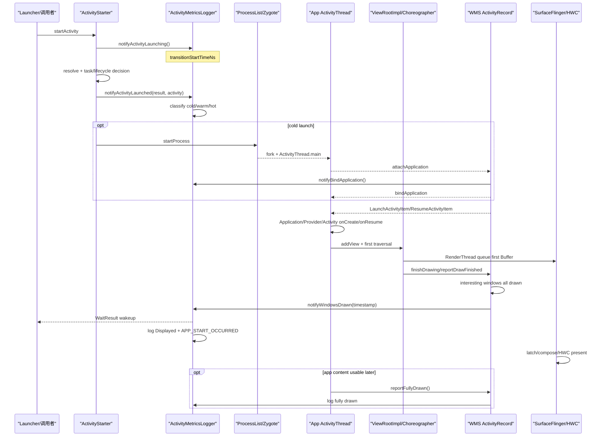
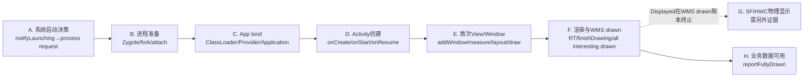

# 217 Android应用冷启动首帧时间线与耗时分段

> 源码版本：Android 11 `android-11.0.0_r48`。  
> 当前仅在macOS上只读源码，本章的耗时数字仅用于手算示例，不宣称已编译、安装或在真机实测。

## 1. 为什么要再单独讲一次冷启动

第201章已经建立从Launcher点击到首Buffer显示的总链，第202至215章又将Activity、进程、Window、View、RenderThread和SurfaceFlinger逐层展开。

本章不是把那条链路简单复制一遍，而是专门回答“启动耗时到底从哪里算到哪里”：

- 系统启动计时的起点在哪里；
- cold、warm、hot是怎样分类的；
- starting window drawn、transition starting、windows drawn分别表示什么；
- logcat `Displayed ...` 是否就是像素已上屏；
- `reportFullyDrawn()` 为什么既重要又不完全可信；
- `am start -W` 的 `WaitResult.totalTime` 等的是什么；
- 如何把冷启动拆成可定位的耗时段。

## 2. 一句话主线

```text
ActivityStarter尽早记notifyActivityLaunching的elapsedRealtimeNanos
→ resolve/launch decision确认目标
→ ActivityMetricsLogger根据进程与Activity附着状态分cold/warm/hot
→ 冷启动继续经ProcessList/Zygote/attach/bindApplication/launch Activity
→ Activity创建Window、ViewRoot、Surface并完成首次draw
→ WMS根据interesting windows的drawn状态调onWindowsDrawn
→ windowsDrawnDelay = drawn timestamp - transition start
→ WaitResult被唤醒，后台输出Displayed日志和APP_START_OCCURRED
→ App数据真正可用时再调reportFullyDrawn
```

## 3. 启动时间线全图



## 4. 这张图中最重要的错位

WMS收到并确认window drawn，会触发系统启动耗时的主要终点；而App的首Buffer还要经SurfaceFlinger latch、composition和HWC present。

所以“Displayed耗时”与“物理像素开始显示耗时”很接近但不是同一个源码完成点。

## 5. 启动度量的中心类

Android 11 r48中，`ActivityMetricsLogger` 的类注释直接把它称为activity metrics的source of truth，它为Tron/MetricsLogger、logcat、EventLog、statsd与 `WaitResult` 提供数据。

这意味着要理解r48的系统启动口径，先读它，不要只凭外层shell输出猜测。

## 6. 一次典型launch的五个通知

类注释给出典型顺序：

```text
notifyActivityLaunching
→ notifyActivityLaunched
→ notifyStartingWindowDrawn（可选）
→ notifyTransitionStarting
→ notifyWindowsDrawn
```

starting window不一定存在，transition starting与windows drawn的先后也有容错逻辑；这个列表是常见顺序，不是每个异常分支都必然通过的五道门。

## 7. 起点为什么叫“earliest possible point”

`notifyActivityLaunching()` 的注释说，它在尽可能早的Activity启动点通知tracker。

`ActivityStarter.execute()` 在进入resolve之前就调它，因此这个起点不是 `Activity.onCreate()`，也不是“Zygote fork完成”。

## 8. 起点使用elapsedRealtimeNanos

```java
final long transitionStartTimeNs =
        SystemClock.elapsedRealtimeNanos();
```

它是包含设备休眠时间的monotonic elapsed clock，不受用户调整日历时间影响。本类后续drawn时间也使用 `elapsedRealtimeNanos()`，可相减得到稳定delay。

## 9. 起点在Intent resolve之前

`ActivityStarter.execute()` 的简化顺序是：

```java
launchingState = metrics.notifyActivityLaunching(intent, caller);
if (mRequest.activityInfo == null) {
    mRequest.resolveActivity(mSupervisor);
}
res = executeRequest(mRequest);
metrics.notifyActivityLaunched(
        launchingState, res, mLastStartActivityRecord);
```

所以常见路径的windows-drawn delay包含Intent resolve和后续Task/权限/生命周期决策时间。

## 10. notifyActivityLaunching还不知道启动一定成功

这一步只创建 `LaunchingState`。Intent可能无法resolve，可能被拒绝，可能最后没有一个Activity需要绘制。

因此调用者必须保证后续调 `notifyActivityLaunched()`，让logger或者建立正式TransitionInfo，或者abort。

## 11. LaunchingState和TransitionInfo不是同一阶段

`LaunchingState` 表示“Intent已开始，成功与否尚不确定”；`TransitionInfo` 表示“已确认一个可跟踪的Activity launch”。

前者保留当前起点，后者把首次起点、launch type、process state、pending draw activities和各类delay组成正式账本。

## 12. 连续启动可以被合并

如果调用者Activity已在活跃transition中，或callingUid命中最近活跃transition，新launch可以沿用原 `LaunchingState`。

这为跳板Activity、连续重定向等情况提供一次用户感知launch event，而不是每个中间Activity都强行生成一份完整Displayed账。

## 13. 合并时保留哪个起点

`TransitionInfo.mTransitionStartTimeNs` 由构造时 `LaunchingState.mCurrentTransitionStartTimeNs` 写入，用作该transition的标识和耗时起点。

后续合并launch会更新LaunchingState的current start，但已创建TransitionInfo的final start不会因为新跳板就被改成最后一次时间。

## 14. 哪些start result能创建TransitionInfo

`TransitionInfo.create()` 只接受：

```text
START_SUCCESS
START_TASK_TO_FRONT
```

其他result返回null并abort tracking。因此不要将所有 `startActivity()` 返回都当成一个有windows-drawn delay的完整冷启动。

## 15. cold、warm、hot的r48源码定义

```java
if (processRunning) {
    transitionType = r.attachedToProcess()
            ? HOT_LAUNCH : WARM_LAUNCH;
} else {
    transitionType = COLD_LAUNCH;
}
```

`WaitResult` 文档则用更口语的方式表达：

- cold：新进程启动；
- warm：复用进程，但Activity需要创建/附着；
- hot：复用进程且Activity已附着，主要拉到前台。

## 16. processRunning是怎样得到的

logger先看 `launchedActivity.app`，没有时再用processName和uid到ATMS查 `WindowProcessController`。找到就认为process running。

这是系统服务端的进程账本判断，不是App自己用某个静态变量猜测“我可能还活着”。

## 17. 进程存在不一定是hot

只有目标 `ActivityRecord` 已 `attachedToProcess()` 才分为hot。进程可能因Service、Provider或其他Activity而存活，但目标Activity仍要新建，这属warm。

## 18. Task存在不一定是warm/hot

源码特别注释：Task可能还在，`START_TASK_TO_FRONT` 也可能对应进程已不存在；这种情况仍当cold launch。

所以不能用“最近任务列表里看得到卡片”代替processRunning判断。

## 19. processSwitch是另一个维度

```java
processSwitch = !processRunning
        || !processRecord.hasStartedActivity(launchedActivity);
```

它表示目标进程在launch开始时没有started Activity，系统认为这种情况的cache更可能被清，首帧耗时更值得记录。

## 20. launch type与processSwitch不是同一个boolean

launch type分cold/warm/hot；processSwitch决定该transition是否对MetricsLogger/StatsLog/LaunchObserver“interesting”。

一个transition可以被跟踪到windows drawn，但因无process switch而不向所有observer输出同等的启动事件。

## 21. 已经drawn且visible的Activity不能重新算一次draw delay

`notifyActivityLaunched()` 如果看到 `mDrawn && isVisible()`，直接abort，因为无法从这个新起点等到一个有意义的首次windows drawn。

这也说明logger不是每次点击都无条件制造一条`Displayed` 日志。

## 22. 同一display的跳板Activity如何合并

已有active transition且新Activity在同一DisplayContent时，logger只更新latest launched activity，并把尚未drawn且非noDisplay的Activity加到pending draw list。

这个transition要等所有pending draw activities移除，才算all drawn。

## 23. noDisplay Activity不会成为draw等待对象

`setLatestLaunchedActivity()` 只在 `!r.noDisplay && !r.mDrawn` 时加pending list。

透明跳板或无界面Activity可以参与launch决策，但不能永久阻塞一个永远不会有window drawn的账本。

## 24. 冷启动的进程段包含什么

对cold launch，transition start之后通常要经过：

1. AMS/ATMS创建ProcessRecord/WindowProcessController账本；
2. ProcessList整理uid/gid/ABI/runtime flags等参数；
3. 选Zygote socket并fork/specialize；
4. 父进程收pid，子进程进 `ActivityThread.main()`；
5. App反向attach到AMS/ATMS；
6. system_server安排bindApplication与Activity launch。

这些都发生在首次View draw之前。

## 25. notifyBindApplication记的是哪个时刻

ActivityMetricsLogger的注释是：系统将要对client调 `bindApplication` 之前立即通知。

```java
info.mBindApplicationDelayMs =
        info.calculateCurrentDelay();
```

所以bindApplication delay终点是system_server发出客户端bind命令的前夕，不是App已经执行完 `Application.onCreate()`。

## 26. notifyBindApplication如何匹配transition

此时App还未必已附加到 `ActivityRecord.app`，所以logger遍历active transitions，用 `ApplicationInfo` 对象身份匹配latest launched activity。

这是一个特定启动阶段的关联方法，不是通用的跨进程唯一ID。

## 27. bindApplication delay包含fork之前与attach汇合的时间

从transition start到system_server准备bind之间，可包含解析、Task/生命周期、Zygote通信、fork/specialize、ActivityThread.main与attach等待。

但它不能细分这些内部子段；若bind delay大，还需Perfetto/trace或更细源码埋点定位。

## 28. App bind阶段又包含哪些工作

`ActivityThread.handleBindApplication()` 普通r48路径包含：

- 进程环境和compat/StrictMode初始化；
- LoadedApk/Context/ClassLoader/Resources准备；
- NetworkSecurityConfig、Instrumentation准备；
- `Application` 构造与 `attachBaseContext()`；
- Provider `attachInfo()/onCreate()` 并统一发布；
- `Instrumentation.onCreate()`；
- `Application.onCreate()`。

它们发生在bind通知之后、Activity首帧之前。

## 29. Provider自启动耗时为什么会进Displayed账本

普通初始Application绑定中，Provider安装和 `onCreate()` 早于 `Application.onCreate()`。如果Provider做大量主线程I/O，Activity launch Message就要继续等待。

因为ActivityMetricsLogger的起点更早，这段时间自然会出现在最终windows-drawn delay中。

## 30. Activity创建不是一个时间点

客户端Activity阶段还要分：

```text
LaunchActivityItem进主Looper
→ performLaunchActivity
→ Context/Activity实例化
→ Activity.attach/PhoneWindow
→ performCreate/onCreate
→ Start/Resume lifecycle item
→ onStart/onResume
→ Decor加到WindowManagerGlobal
```

某个 `onCreate()` 返回不等于window drawn，也不等于最终数据可用。

## 31. setContentView为什么不是首帧终点

`setContentView()` 主要安装Decor系统骨架并inflate应用View对象。此时还可能没有ViewRootImpl、WMS WindowState、Surface或任何Buffer。

将setContentView自己计时很有价值，但它只是Displayed链中的一个子段。

## 32. onResume为什么也不是Displayed

Activity服务端可先进RESUMED，客户端再执行 `onResume()`。两者之后才有首次Traversal、Surface建立、draw和WMS drawn回报。

所以“生命周期已resume”只是Activity可交互资格的一部分，不是像素完成证据。

## 33. 首次Traversal从哪里被安排

`WindowManagerGlobal.addView()` 创建 `ViewRootImpl`，`setView()` 在同步 `addToDisplay()` 之前就调 `requestLayout()`，最终通过 `scheduleTraversals()` 投递Choreographer TRAVERSAL callback。

它可与WMS addWindow返回、Activity resume及主Looper其他Message相互编排。

## 34. 首次Traversal的主要子段

第213章已经证明它不是只调一遍 `measure/layout/draw`，而是包含：

- dispatchAttached和初始Insets；
- 用addWindow frame提示首次measure；
- 同步relayout向WMS提交尺寸/可见性；
- WMS计算frame、Insets、Configuration并建Surface；
- App拿最终结果必要时补measure；
- layout、pre-draw与draw。

## 35. 首次draw为什么可能被PreDraw取消

ViewTreeObserver pre-draw listener可返回false，此轮Traversal就不进真正draw，而是再安排一次。

因此measure/layout已执行不保证当轮会产生首Buffer或触发windows drawn。

## 36. UI线程draw不等于Buffer queue

硬件加速路径中，UI线程主要记录/更新DisplayList，`syncAndDrawFrame()` 把工作交给RenderThread。

RenderThread还要prepare tree、提交Skia/GPU命令、swap/queue Buffer。这些是UI draw后的另一段渲染链。

## 37. ViewRoot如何向WMS报draw finished

首次需要report next draw时，`performDraw()` 完成后进 `reportDrawFinished()`，通过IWindowSession `finishDrawing()` 回到WMS。

这个回报表示App/WMS窗口draw state可以向前推进，不是HWC present fence反向回报。

## 38. WMS的drawn不是只看一个boolean

ActivityRecord会统计关联WindowState中的interesting与drawn数量。主App window是重要等待对象，其他 `isInteresting()` 窗口也可纳入。

只有 `numInteresting > 0 && numDrawn >= numInteresting` 才得到activity-level `nowDrawn=true`。

## 39. starting window不计入真实app window的allDrawn数量

`updateDrawnWindowStates()` 对 `w != startingWindow` 才计interesting/drawn；starting window如果drawn，只调 `notifyStartingWindowDrawn()` 并置 `startingDisplayed=true`。

所以starting window可以让用户更早看到启动过渡，但不会伪装成真实App content windows drawn。

## 40. StartingWindowDelay的确切口径

`notifyStartingWindowDrawn()` 首次调用时：

```java
info.mStartingWindowDelayMs =
        info.calculateDelay(
                SystemClock.elapsedRealtimeNanos());
```

它是transition start→starting window drawn。没有starting window时保持 `INVALID_DELAY=-1`，不应自动填0。

## 41. starting window快只代表过渡反馈快

一张theme splash/starting surface很快drawn，能减少用户面对空白屏的时间。

但真实Activity仍可能在Provider/Application/Activity初始化、inflate或首次Traversal卡住。因此starting delay与windows drawn delay必须分开看。

## 42. onFirstWindowDrawn会处理starting window

第一个真实window drawn时，ActivityRecord置 `firstWindowDrawn=true`，移除dead placeholders，必要时取消真实window自身动画，然后remove starting window并更新reported visibility。

这是“过渡窗口让位给App真实窗口”的WMS边界。

## 43. ActivityRecord.updateReportedVisibilityLocked的drawn计算

```java
boolean nowDrawn = numInteresting > 0
        && numDrawn >= numInteresting;
if (nowDrawn != reportedDrawn) {
    onWindowsDrawn(nowDrawn,
            SystemClock.elapsedRealtimeNanos());
    reportedDrawn = nowDrawn;
}
```

这个elapsed timestamp传给ActivityMetricsLogger，与启动起点使用同一clock。

## 44. nowDrawn与reportedDrawn为什么分开

`nowDrawn` 是本轮基于窗口统计得到的当前结果，`reportedDrawn` 是上次已经向ActivityRecord状态机报告的结果。

只有变化时才调 `onWindowsDrawn()`，避免每轮SurfacePlacement重复完成同一账本。

## 45. 窗口暂时不再drawn时有保持逻辑

Activity尚未nowGone时，若本轮不再drawn/visible，代码可以保留已有reportedDrawn/reportedVisible，避免在正常过渡中无谓反复。

因此drawn是Activity/WMS状态机的稳定语义，不是每个Surface刹那状态的完整快照。

## 46. notifyWindowsDrawn先检查active transition

如果Activity不在active transition，或pending draw list已空，返回null。

这意味着平时窗口因配置变化重画或从隐藏恢复drawn，不一定都会生成新的App start metric。

## 47. WindowsDrawnDelay如何计算

```java
info.mWindowsDrawnDelayMs =
        info.calculateDelay(timestampNs);
```

`calculateDelay()` 是：

```java
(int) NANOSECONDS.toMillis(
        timestampNs - mTransitionStartTimeNs)
```

也就是常说的系统窗口首次drawn耗时主口径。

## 48. 多Activity合并时delay会被更新

每个pending Activity报drawn时，`mWindowsDrawnDelayMs` 都先用该timestamp更新，再从pending list移除它。

因此最终all-drawn transition的windows delay通常对应最后一个必须等待的Activity drawn，不是最早跳板页面的短暂drawn。

## 49. transition starting和all drawn是两道完成门

`notifyWindowsDrawn()` 只有在 `mLoggedTransitionStarting && allDrawn()` 时调 `done()`。

`notifyTransitionStarting()` 反过来也检查：如果窗口已先all drawn，它在记录transition reason/delay后立即 `done()`。

这允许两种事件顺序不完全固定，但两个条件都到齐才完成transition账本。

## 50. TransitionDelay不是WindowsDrawnDelay

`mCurrentTransitionDelayMs` 计 `transition start → notifyTransitionStarting`，并记录transition reason。

`mWindowsDrawnDelayMs` 计 `transition start → windows drawn`。两者可以都从同一起点开始，但终点和分析意义不同。

## 51. 一次启动的平行delay账本

| delay | 起点 | 终点 | 是否可选 |
|---|---|---|---|
| startingWindowDelay | notifyActivityLaunching | starting window drawn | 是，无starting window为-1 |
| bindApplicationDelay | notifyActivityLaunching | system_server即将bind client | 是，通常冷启动才有；warm/hot可为-1 |
| transitionDelay | notifyActivityLaunching | app transition starting | 通常记录 |
| windowsDrawnDelay | notifyActivityLaunching | pending Activity windows drawn | 主Displayed口径 |
| fullyDrawnDelay | notifyActivityLaunching | App reportFullyDrawn或系统推迟点 | 必须由App调用 |

## 52. 这些delay不能简单相加

它们大多都从同一transition start计到不同终点，是平行的累计延迟，不是五段互不重叠的切片。

要得到子段，应用后一累计点减前一累计点，且先确认两个点在当次启动中都有效。

## 53. done(false)做了什么

正常完成时：

- 停止launch trace；
- 对interesting transition通知LaunchObserver finished；
- 对TransitionInfo快照；
- 把Metrics/Stats/EventLog/logcat工作投到BackgroundThread；
- 如果早到的fully-drawn尚在pending，现在运行它；
- 清pending list并从active transition list移除。

所以日志输出可以比计时终点本身更晚，但日志内duration仍使用先前快照的drawn delay。

## 54. 为什么要先做TransitionInfoSnapshot

ActivityRecord、process record和launch token等都可以在后续继续变化。在持有系统状态的当前时刻复制不变快照，再丢到BackgroundThread输出，可避免日志线程读到半更新对象。

这是Android system_server中常见的“锁内取快照，锁外做慢I/O”模式。

## 55. `Displayed package/activity: +Nms` 从哪里打印

`logAppDisplayed()` 只对warm和cold launch输出EventLog `WM_ACTIVITY_LAUNCH_TIME` 和logcat：

```java
sb.append("Displayed ");
sb.append(shortComponentName);
sb.append(": ");
TimeUtils.formatDuration(windowsDrawnDelayMs, sb);
```

hot launch不走这条 `Displayed` 日志输出分支。

## 56. Displayed表示“WMS windows drawn”

日志名叫Displayed，但数据来自 `windowsDrawnDelayMs`，其timestamp在ActivityRecord根据WindowState drawn统计中产生。

更严谨的学习语句是：“系统认定该启动所需App windows已drawn的耗时”。

## 57. Displayed不是SurfaceFlinger present fence

WMS window draw state向前推进后，App的Buffer仍需通过BLAST/Transaction到SF，然后latch、validate/compose、HWC present。

因此Displayed可作为启动首帧的系统Framework指标，但不是对“面板像素已经开始更新”的fence级直接证据。

## 58. Displayed也不表示业务数据已可用

Activity可以先draw出skeleton、loading、空列表或占位图，然后异步加载数据。WMS看到window drawn即可记Displayed，它不理解业务上“首页已可用”的含义。

这就是 `reportFullyDrawn()` 存在的原因。

## 59. reportFullyDrawn是App对“可用”的主动申明

Activity API文档要求：在首次launch中，当UI已完全绘制并填充重要数据时调用。

系统自己只能判断window首次drawn/displayed，不知道数据库、网络结果、首页列表和业务缓存哪些才算用户可用。

## 60. Activity端只会成功上报一次

```java
if (mDoReportFullyDrawn) {
    mDoReportFullyDrawn = false;
    ActivityTaskManager.getService()
            .reportActivityFullyDrawn(...);
    VMRuntime.getRuntime().notifyStartupCompleted();
}
```

后续重复调用会被Activity本地flag忽略。所以它不适合当一个每次刷新数据都上报的通用性能事件。

## 61. reportFullyDrawn走Binder回ATMS

Activity传自mToken和 `mRestoredFromBundle`，ATMS按token找ActivityRecord，再调 `reportFullyDrawnLocked()`。

token使系统把上报关联到当前ActivityRecord/transition，而不是只按packageName归到一个可能包含多Activity的粗粒度账本。

## 62. 太早reportFullyDrawn不能超车windows drawn

`logAppTransitionReportedDrawn()` 看到transition还未all drawn时，不立即记fully-drawn duration，而是把一个 `mPendingFullyDrawn` Runnable存起来。

等windows drawn使transition正常done时，`logAppTransitionFinished()` 再运行这个pending Runnable。

## 63. 早报时fully-drawn delay如何取值

```java
startupTimeMs = info.mPendingFullyDrawn != null
        ? info.mWindowsDrawnDelayMs
        : now - info.mTransitionStartTimeNs;
```

如枟App在window drawn前调用，最终fully drawn时间被推到windows-drawn delay，不会记成一个比首次窗口drawn更短的“可用”时间。

## 64. 晚报时fully-drawn delay如何取值

如果windows已all drawn，此时才report，就用当前elapsed realtime减transition start。

所以它可以包含首帧后的异步数据加载、第二次布局和内容绘制。

## 65. 为什么不能故意很晚报

Activity API文档明确说过早或过晚虚报可能降低启动和应用性能，系统可能利用该边界调整启动前工作的优先级和优化。

它是一个性能语义契约，不是用来让指标看起来更好的自由按钮。

## 66. restoredFromBundle为什么被记录

fully-drawn metric区分带saved state bundle和不带bundle的report type。恢复状态可以影响Activity初始化工作和可用时间，统计上需要知道这个上下文。

它不改变“终点仍由App报告”这一本质。

## 67. Fully drawn不是物理present时间

App通常在UI业务状态就绪后调report，系统记的是Binder上报被处理的elapsed timestamp，或被推迟后的windows-drawn delay。

它并没有等此业务内容对应Buffer的HWC present fence signal后再上报。

## 68. 可以用TTID/TTFD帮助理解，但要对齐r48实现

现在常用TTID（Time To Initial Display）和TTFD（Time To Full Display）表述启动。在本章r48源码中，可将windows-drawn delay视为TTID的Framework主口径，fully-drawn delay视为TTFD类语义。

但两者都要带上本章的边界：windows drawn不是present fence，fully drawn又依赖App正确上报。

## 69. `WaitResult` 是什么

`startActivityAndWait()` 创建 `WaitResult`，把它交给ActivityStarter，启动线程在system_server的global lock wait/通知协议中等待结果。

关键字段是：

- `result`：START_* result；
- `timeout`：是否超时；
- `who`：最终组件；
- `totalTime`：对应等待终点的耗时；
- `launchState`：cold/warm/hot。

## 70. START_SUCCESS时WaitResult等什么

ActivityStarter把WaitResult加入 `mWaitingActivityLaunched`，直到：

- result变为START_TASK_TO_FRONT；
- timeout为true；
- 或 `who != null`。

ActivityRecord `onWindowsDrawn()` 会通过 `reportActivityLaunchedLocked()` 填who、totalTime和launchState并notifyAll。

## 71. START_DELIVERED_TO_TOP为什么totalTime是0

这个result表示Intent发给已在top的Activity，没有一条新的窗口首次drawn链要等。代码立即填component并置 `totalTime=0`。

这0不表示业务处理 `onNewIntent()` 与后续UI更新没有耗时，只是该WaitResult不建新launch-drawn账。

## 72. START_TASK_TO_FRONT有两种等待分支

若Activity已 `nowVisible && RESUMED`，立即返回，totalTime=0；否则把目标component包装成 `WaitInfo` 加入 `mWaitingForActivityVisible`可见等待表，等ActivityRecord的drawn/visible路径唤醒。

这又说明`am start -W`不是一个无视start result、每次都等同一终点的简单stopwatch。

## 73. WaitResult.totalTime不是从shell进程自己开始计时

windows-drawn路径填入的totalTime来自ActivityMetricsLogger的windowsDrawnDelayMs，起点是 `notifyActivityLaunching()`。

shell命令自身启动、Binder前处理和输出格式化可以影响用户体感的端到端wall time，但不一定都在 `totalTime` 里。

## 74. 旧教程中的ThisTime/TotalTime要以当前版本为准

Android不同版本的shell输出和WaitResult字段有调整。r48 `WaitResult.java` 的主要耗时字段是 `totalTime`，没有在该Java类中定义一个 `thisTime`字段。

阅读其他版本命令截图时，不要将字段不加核对地倒灌回r48源码。

## 75. stopWaitingForActivityVisible也能填totalTime

`onWindowsDrawn()` 在有valid transition info或当前Activity是top running时，既调 `reportActivityLaunchedLocked()`，又调 `stopWaitingForActivityVisible()`。

后者用component匹配visible wait list，填timeout=false、who和totalTime，然后notifyAll。这服务于TASK_TO_FRONT等可见等待情况。

## 76. “等待完成”不是Activity线程被阻塞

wait发生在处理 `startActivityAndWait()` 的system_server调用线程协议上。App主线程仍必须正常处理bindApplication、LaunchActivityItem、生命周期和Choreographer帧消息。

如枟把App主线程也等住，窗口就无法drawn，当然不能完成WaitResult。

## 77. 从Displayed账本看冷启动六大段



## 78. A段：启动决策慢的常见证据点

这一段包含Intent resolve、权限/URI grant/后台启动检查、Task复用和launch mode决策、前Activity pause门等。

仅看App `onCreate()` 中的trace会完全漏掉这一段，因为它早于目标App进程执行任何业务代码。

## 79. B段：进程准备慢怎么分

可用第206至208章的边界：

```text
startProcess请求
→ Zygote socket发参数
→ fork/specialize
→ pid返system_server
→ ActivityThread.main
→ Binder attachApplication
→ bindApplication准备
```

`bindApplicationDelay` 只给这整条的累计终点，要找具体慢在fork还是attach，需更细trace slice。

## 80. C段：App bind慢的主要后果

bindApplication Message在App主Looper中执行时，后面的Activity launch不会穿过这个同步处理主体。Provider、Application、ClassLoader/静态初始化太重，会直接推迟Activity生命周期。

这是冷启动与热启动差异最集中的区域之一。

## 81. D段：Activity业务代码慢怎么看

对 `onCreate()`、`onStart()`、`onResume()` 分别放trace，同时继续拆：

- `setContentView()` 的XML解析与反射构造；
- 同步数据库/磁盘读取；
- 大图decode；
- 第三方SDK初始化；
- 主线程Binder同步调用；
- 锁竞争和Class initialization。

不要只把整个 `onCreate()` 打一个粗标签就停止定位。

## 82. E段：Window/View慢的特征

如Activity生命周期已快速返回，但Displayed仍很晚，要看：

- Decor何时加入WindowManagerGlobal；
- addWindow/relayout Binder耗时；
- 首次measure是否反复多轮；
- layout中是否又requestLayout；
- PreDraw listener是否持续返回false；
- 软件绘制/硬件绘制路径是否与预期一致。

## 83. F段：UI已draw但WMS还未all drawn

可能原因包括：

- RenderThread忙于前帧，UI等sync；
- 首次DisplayList或shader/纹理准备很重；
- Buffer dequeue/queue阻塞；
- finishDrawing回WMS尚未处理；
- 同Activity还有其他interesting window未drawn；
- transition-start与all-drawn两道门尚有一道未满足。

## 84. G段：Displayed后视觉仍慢怎么办

如Framework windows-drawn delay很好，但物理观感仍慢，继续追：

```text
App queue Buffer
→ BLAST Transaction
→ SF apply/current→drawing
→ latch
→ CompositionEngine validate
→ RenderEngine client target（如需）
→ HWC present
→ reliable present fence signal
```

这部分不能通过调整 `reportFullyDrawn()` 解决，因为两者根本不是同一完成边界。

## 85. H段：首帧快但fully drawn慢

这通常表示App很快显示骨架/缓存内容，但重要数据加载、列表首页构建或第二次绘制很慢。

要把“网络服务器慢”、“本地解析慢”、“主线程更新View慢”分开，fully-drawn只给一个总终点。

## 86. 一组手算示例

假设累计delay：

```text
starting window drawn = 80 ms
bindApplication = 140 ms
Activity onCreate start = 230 ms
Activity onResume end = 330 ms
first Choreographer doFrame = 350 ms
WMS windows drawn = 520 ms
reportFullyDrawn = 910 ms
```

可初步切成：

```text
启动起点→bind前 = 140 ms
bind前→onCreate start = 90 ms
Activity create/resume段 ≈ 100 ms
resume end→首doFrame = 20 ms
首doFrame→WMS drawn = 170 ms
WMS drawn→fully drawn = 390 ms
```

但starting window 80 ms是一条平行用户反馈路径，不能再与上述切片相加。

## 87. 为什么子段不能只凭日志名猜

`notifyBindApplication` 记的是发client命令前，不是handleBind完成；`onResume end` 是App自己trace，与ATMS service state的RESUMED时间不同；`windows drawn` 是WMS窗口统计，不是SF present。

两个时间点做减法前，必须先写出它们的调用者、线程、clock和源码完成语义。

## 88. elapsedRealtime、uptime、nanoTime不能无条件混减

ActivityMetricsLogger的启动duration使用elapsedRealtimeNanos；Choreographer/FrameInfo主要使用System.nanoTime/CLOCK_MONOTONIC；部分Handler和Activity状态用uptimeMillis。

普通短时启动中它们数值趋势接近，但不应将不同clock的原始绝对值不加转换直接相减。

## 89. 启动计时中为什么选elapsed realtime

启动是用户观察的端到端经过时间，设备即使因某些原因进入休眠，用户等待也没有凭空消失。

`elapsedRealtime` 包含deep sleep，而uptime排除deep sleep；这也是为什么需要忠实使用该类选择的clock。

## 90. LaunchObserver为什么要保证顺序

ActivityMetricsLogger注释说全局只有一个并发launch sequence，observer调用必须在同一线程按顺序发生，才满足happens-before。

这让intent started、activity launched、launch finished/cancelled、fully drawn可以用开始timestamp相互关联，而不是多线程乱序通知。

## 91. abort不是启动崩溃的同义词

metrics `abort()` 表示这次跟踪不再能/不需等一个有效windows-drawn transition，原因可以是Intent失败、Activity已drawn visible、无可识别launch result或目标变为invisible。

它不必然意味着App process crash或ANR。

## 92. 可见性变化如何避免永久等drawn

如pending Activity不再visible requested或正在finishing，logger把它从pending draw list移除。对latest launched activity，还会异步检查Task中是否还有会draw的Activity。

如果没有，就cancel/abort transition，而不是让一个永远不会出现的窗口占着active metrics。

## 93. 常见误解一：冷启动就是 `Application.onCreate()` 耗时

冷启动系统账本在Application之前已包含resolve、Task/lifecycle、进程启动与attach，之后还有Activity、View/Window、RenderThread和WMS drawn。

`Application.onCreate()` 很重要，但只是其中一段。

## 94. 常见误解二：Displayed日志就是屏幕present

该duration终点是ActivityRecord windows drawn。它与首帧显示强相关，但不是SF/HWC present fence的timestamp。

## 95. 常见误解三：Starting window已drawn就是App首页已好

starting window是系统为启动过渡显示的窗口，它有独立delay、不计入真实app windows allDrawn。

## 96. 常见误解四：reportFullyDrawn越早越好

早于windows drawn会被系统推迟到windows-drawn delay；过早也违反“重要内容已填充”的API契约。

## 97. 常见误解五：Warm launch表示Activity对象仍在

r48 logger中，process running但目标Activity未attached为warm；已attached才是hot。warm恰恰可以需要新建Activity。

## 98. 常见误解六：Task在Recents就不是cold

Task账本可存在而App进程已死亡。此时TASK_TO_FRONT仍可触发新进程，logger分cold。

## 99. 常见误解七：WaitResult.totalTime就是完整shell wall time

totalTime主要由windows-drawn delay或特定start result分支填入，它不自动包含shell进程从准备命令到打印结果的每一微秒。

## 100. 常见误解八：只要onResume快，启动就快

onResume之后的ViewRoot addWindow/relayout、多轮measure/layout、PreDraw、DisplayList/RenderThread和WMS all-drawn都可以很慢。

## 101. 启动证据金字塔

| 证据 | 能回答 | 不能单独回答 |
|---|---|---|
| App自定义trace | 业务函数/阶段耗时 | system_server/Zygote/SF时间 |
| Displayed日志 | windows-drawn累计耗时 | 哪个子阶段慢、物理present |
| WaitResult | start result、who、launch state、等待耗时 | 所有内部trace slice |
| ActivityMetricsLogger fields | starting/bind/transition/windows/fully口径 | UI/RT内部细分 |
| Perfetto/atrace | 跨线程、跨进程子段和调度 | 未采集或被截断的真实设备数据 |
| present fence/Display trace | 硬件显示边界 | App业务上是否“可用” |

## 102. 不要用单个数字代替时间线

两次启动都是520 ms Displayed，可以分别是：

- A：fork/attach慢，Activity/View很快；
- B：进程启动很快，但inflate/首次measure很慢。

优化点完全不同。所以先拆累计里程碑，再对慢段追trace，才是源码学习能带来的价值。

## 103. 冷启动优化的第一原则：把工作放到正确边界

不是所有工作都应异步，也不是所有工作都应赶在首帧前。先问：

- 没有它能否安全创建Application？
- 没有它能否draw出有意义的初始UI？
- 它属于用户首次交互前必需，还是后台预热？
- 推迟它会不会造成首帧后明显卡顿？

优化是重排必需工作和延迟工作的依赖图，不是把同步代码全部套一层线程。

## 104. 冷启动优化的第二原则：不牺牲正确性

将Provider初始化、数据库migration、权限状态读取等移出首帧前，必须确保消费者不会提前读未就绪状态。

指标变快但用户首次操作崩溃、闪烁或读到错数据，不是成功优化。

## 105. 冷启动优化的第三原则：不将耗时偷渡到fully drawn之后

快速draw一个空壳可以改善Displayed，但若随后主线程被大量延迟任务占满，用户仍无法滚动、点击或看到关键内容。

因此要同时看windows drawn、fully drawn、首帧后主线程占用和交互可用性。

## 106. macOS只读练习一：找启动起点

```bash
sed -n '458,580p' \
  frameworks/base/services/core/java/com/android/server/wm/ActivityMetricsLogger.java

sed -n '630,710p' \
  frameworks/base/services/core/java/com/android/server/wm/ActivityStarter.java
```

请回答：

1. timestamp在resolve前还是后？
2. 什么时候才知道processRunning？
3. 哪两种start result能创建TransitionInfo？
4. Activity已drawn/visible时为什么abort？

## 107. macOS只读练习二：对齐drawn终点

```bash
sed -n '5425,5480p' \
  frameworks/base/services/core/java/com/android/server/wm/ActivityRecord.java

sed -n '590,665p' \
  frameworks/base/services/core/java/com/android/server/wm/ActivityMetricsLogger.java
```

把 `numInteresting/numDrawn → onWindowsDrawn → notifyWindowsDrawn → calculateDelay` 画成四个节点，并在图后写一句：“这里为什么没有SurfaceFlinger present fence”。

## 108. macOS只读练习三：验证reportFullyDrawn防早报

```bash
sed -n '2675,2720p' \
  frameworks/base/core/java/android/app/Activity.java

sed -n '917,990p' \
  frameworks/base/services/core/java/com/android/server/wm/ActivityMetricsLogger.java
```

请分别写出：

- Activity本地防重flag；
- windows未drawn时pending Runnable的保存条件；
- 早报与晚报的 `startupTimeMs` 取值分支；
- fully drawn与VMRuntime startup completed通知的关系。

## 109. macOS只读练习四：追WaitResult

```bash
sed -n '1,135p' \
  frameworks/base/core/java/android/app/WaitResult.java

sed -n '780,830p' \
  frameworks/base/services/core/java/com/android/server/wm/ActivityStarter.java

sed -n '545,635p' \
  frameworks/base/services/core/java/com/android/server/wm/ActivityStackSupervisor.java
```

用表格对比 `START_SUCCESS` / `START_DELIVERED_TO_TOP` / `START_TASK_TO_FRONT`的等待条件和totalTime来源。

## 110. 自测问题

1. windows-drawn delay的起点是 `onCreate()` 吗？
2. process已存在为什么还可能是warm？
3. starting window drawn为什么不能代替App windows drawn？
4. transition starting和all drawn为什么要双门汇合？
5. Displayed日志的duration是在BackgroundThread打印时重新计算吗？
6. 为什么早调reportFullyDrawn不会得到比windows drawn更短的值？
7. WaitResult totalTime为0是否意味着App任何工作都没有耗时？
8. Displayed很快但用户还在等数据，应看哪个指标？

## 111. 自测答案要点

1. 不是，常见execute路径在Intent resolve前就记 `notifyActivityLaunching()`。
2. 目标Activity尚未attached到该进程时分warm；已attached才hot。
3. 它是过渡窗口，有独立delay且被排除在真实App interesting windows allDrawn计数外。
4. 这两个事件可能前后交错，logger需要既有transition原因/起动记录，又确认所有pending windows drawn。
5. 不是，drawn delay已在系统状态线程取快照，BackgroundThread只格式化/输出。
6. 未drawn时只存pending Runnable，完成后取 `mWindowsDrawnDelayMs`。
7. 不是，DELIVERED_TO_TOP或已visible/resumed的TASK_TO_FRONT不新建windows-drawn wait，但onNewIntent/UI刷新仍可耗时。
8. 主要看语义正确的fully-drawn耗时，再对数据加载、主线程更新和交互可用性做子段trace。

## 112. 源码导航

| 主题 | Android 11 r48文件 |
|---|---|
| launch起点与决策入口 | `frameworks/base/services/core/java/com/android/server/wm/ActivityStarter.java` |
| cold/warm/hot、delay与日志 | `frameworks/base/services/core/java/com/android/server/wm/ActivityMetricsLogger.java` |
| Activity windows drawn/visible统计 | `frameworks/base/services/core/java/com/android/server/wm/ActivityRecord.java` |
| startActivityAndWait | `frameworks/base/services/core/java/com/android/server/wm/ActivityTaskManagerService.java` |
| WaitResult等待表 | `frameworks/base/services/core/java/com/android/server/wm/ActivityStackSupervisor.java` |
| WaitResult数据结构 | `frameworks/base/core/java/android/app/WaitResult.java` |
| reportFullyDrawn App API | `frameworks/base/core/java/android/app/Activity.java` |
| App bind过程 | `frameworks/base/core/java/android/app/ActivityThread.java` |
| 首次Traversal | `frameworks/base/core/java/android/view/ViewRootImpl.java` |
| 帧调度/FrameInfo | `frameworks/base/core/java/android/view/Choreographer.java` |
| SF首Buffer与present | `frameworks/native/services/surfaceflinger/` |

## 113. 本章结论

Android 11 r48的App启动计时不是在Activity里临时开一个stopwatch，而是system_server在ActivityStarter尽可能早地记下transition start，再用ActivityMetricsLogger跨越resolve、Task/生命周期、进程创建、App bind、Activity/View/Window和drawn状态维护一本账。

`Displayed` 的主数字是windows-drawn delay：它比 `onCreate()`、`onResume()`或starting window drawn更接近“用户看到App初始界面”，但源码终点仍是WMS的interesting windows drawn，没有一直跟到SurfaceFlinger/HWC present fence。

`reportFullyDrawn()` 补足了系统无法理解业务“可用”的缺口，但它依赖App按契约上报，且早报会被推迟到windows drawn。因此真正的启动优化不能只追一个数字，而应用系统起点、bind、Activity lifecycle、首doFrame、windows drawn、fully drawn和present边界组成时间线，找到第一个真正过慢的分段。

## 114. 复读后的易混点修订

初稿完成后重新对照r48源码，做了以下纠正和限定：

1. 把启动起点从常被误认的`onCreate()`前移到ActivityStarter的 `notifyActivityLaunching()`，并明确常见execute路径中它早于resolve；
2. 严格按 `processRunning + attachedToProcess` 区cold/warm/hot，不用Recents中是否有Task卡片猜测；
3. 把launch type与processSwitch/interesting维度分开，避免把是否记observer event与是否cold混为一个boolean；
4. 把starting window delay明确写成可选平行指标，无starting window为-1，且它不计入真实App allDrawn窗口；
5. 把bindApplication delay终点限定为system_server即将向client发bind命令，不误写成 `Application.onCreate()` 已完成；
6. 把Displayed终点限定为ActivityRecord interesting windows drawn，不误写成SF latch、HWC present或present fence signal；
7. 核对 `notifyTransitionStarting()` 和 `notifyWindowsDrawn()` 的双向汇合，不强行声称两者在所有容错分支中只能固定顺序；
8. 核对reportFullyDrawn早报时先存pending Runnable，最终startupTime取windows-drawn delay，不允许TTFD早于系统首draw；
9. 核对r48 `WaitResult.java` 只有 `totalTime`耗时字段，不将其他版本教程中的`thisTime`字段倒灌进来；
10. 把TTID/TTFD作为帮助理解的现代术语，但仍以r48 windows-drawn/fully-drawn实现为准，不把术语当作新源码机制。

## 115. 下一章预告

第218章将沿着这条冷启动时间线，专门深入Android启动窗口（starting window）：它的theme背景、Snapshot/StartingSurface选择、WindowState创建、何时认定drawn、如何在真实App首窗口绘制后移除，以及为什么“白屏/黑屏”不能只归因于App `onCreate()`。
