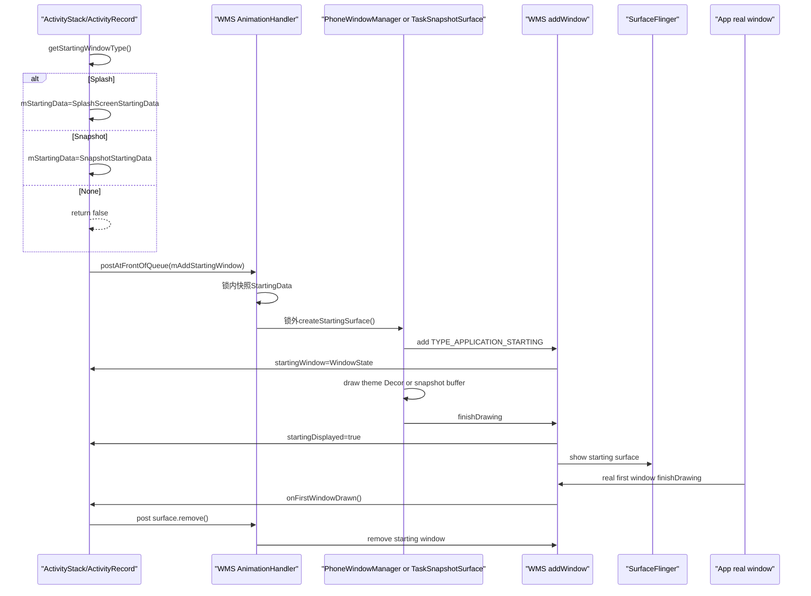
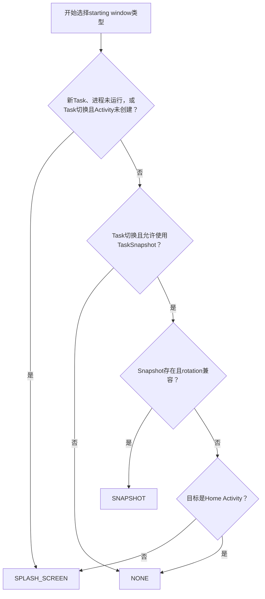
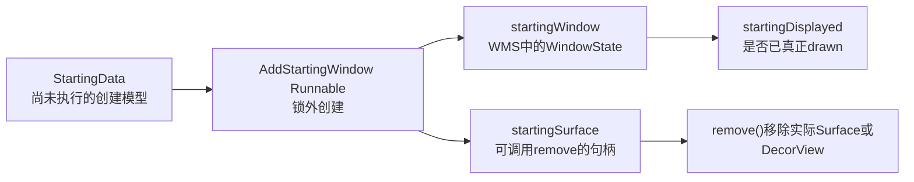

# 218 Android Starting Window、Splash、Task Snapshot与首窗口交接

> 源码：Android 11 `android-11.0.0_r48`。  
> macOS只读学习，不编译、不连设备；本章不倒灌Android 12后新SplashScreen API的统一图标动画模型。

## 1. 本章目标

第217章发现starting-window delay与windows-drawn delay是两条平行指标。本章继续回答：

- 何时选theme splash、Task Snapshot或NONE；
- 为什么冷启动常用splash，Task切换才可能用snapshot；
- theme的translucent/floating/wallpaper/disablePreview如何影响创建；
- starting window在哪个进程、哪个线程创建；
- `StartingData`、`startingWindow`、`startingSurface`为什么是三个对象；
- snapshot尺寸不匹配时如何crop/scale/补背景；
- 真实App首window drawn后如何移除过渡窗口；
- 跳板Activity如何转移starting window避免闪烁；
- 白屏/黑屏怎样分层定位。

## 2. 一句话主线

```text
ActivityStack准备打开Activity
→ ActivityRecord.showStartingWindow
→ getStartingWindowType选SPLASH/SNAPSHOT/NONE
→ 先写StartingData，再mAnimationHandler锁外创真窗口
→ Splash用PhoneWindow+App theme，Snapshot用TaskSnapshotSurface+GraphicBuffer
→ 两者都以TYPE_APPLICATION_STARTING加入WMS
→ WindowStateAnimator完成draw state后startingDisplayed=true
→ AppTransition可用starting surface作为就绪条件
→ 真实App首window drawn
→ ActivityRecord.onFirstWindowDrawn移除starting surface
```

## 3. 总时序图



## 4. Starting window是过渡窗口

它由系统在App真实窗口尚未drawn时先显示，目的是给即时反馈、掩盖冷启动空档并保持Task视觉连续性。

它不是Activity的DecorView，不运行App Activity业务代码，也不接收用户触摸。

## 5. Android 11的三种类型

`ActivityRecord` 定义：

```java
STARTING_WINDOW_TYPE_NONE = 0;
STARTING_WINDOW_TYPE_SNAPSHOT = 1;
STARTING_WINDOW_TYPE_SPLASH_SCREEN = 2;
```

Splash是传统theme starting window；Snapshot是上次Task画面或theme代用snapshot；NONE则继续显示下层/旧画面或等App真实窗口。

## 6. showStartingWindow的上层入口

ActivityStack准备App transition时，找到Task中可转移starting preview的前Activity，然后调：

```java
r.showStartingWindow(prev, newTask,
        isTaskSwitch(r, focusedTopActivity));
```

launch-task-behind和共享元素scene transition等路径会跳过普通starting window。

## 7. Overlay Activity不显示starting window

`mTaskOverlay` 直接return。Overlay是附着在Task上的特殊界面，为它覆盖一层全屏starting preview会破坏原有Task语义。

## 8. Shared-element transition不显示普通preview

pending options为 `ANIM_SCENE_TRANSITION`时return。共享元素需要用前后Activity的真实View/动画交接，一张theme splash盖在上面会与动画冲突。

## 9. addStartingWindow的第一道门：display可用

`!okToDisplay()` 时return false。比如display frozen时，系统本来就不会立即展示该新窗口，无需多建一层preview。

## 10. 同一Activity不重复建StartingData

`mStartingData != null` 直接return false。这个字段既表示已选中的模型，也表示可能正在异步创建。

## 11. 已有可见主窗口不再建preview

`findMainWindow()` 非空且Animator `getShown()`时return false。真实窗口已在显示，再盖starting window不仅无益，还会造成闪烁。

## 12. 选类型前先查TaskSnapshot缓存

```java
snapshotController.getSnapshot(taskId, userId,
        false /* restoreFromDisk */,
        false /* isLowResolution */);
```

这里明确不从磁盘恢复，只看运行时cache；所以磁盘有历史snapshot不保证此次starting window会当场读它。

## 13. getStartingWindowType的主决策

```java
if (newTask || !processRunning
        || (taskSwitch && !activityCreated)) {
    return SPLASH_SCREEN;
} else if (taskSwitch && allowTaskSnapshot) {
    if (isSnapshotCompatible(snapshot)) return SNAPSHOT;
    if (!isActivityTypeHome()) return SPLASH_SCREEN;
    return NONE;
}
return NONE;
```

把源码里的条件按判断顺序画出来，会比只记三个返回值更容易理解：



注意这是一条有先后顺序的决策链：进程未运行已经在第一层选中Splash，不会因为缓存里碰巧存在旧snapshot就改走Snapshot。

## 14. 新Task为什么用Splash

新Task没有一张可代表此次页面的旧Task内容，使用theme背景更符合启动语义。

## 15. 进程不运行为什么用Splash

这是cold launch的关键分支。旧snapshot可能表示Task上一次状态，但冷启动可经入口重建、路由变更；源码优先使用theme splash。

## 16. Task switch但Activity未创建也用Splash

这种情况虽有Task，但目标Activity需重建，旧内容不一定能准确预告将出现的页面。

## 17. 什么时候才优先Snapshot

同时满足：

- 是Task switch；
- 前面没命中newTask/process dead/activity not created；
- `allowTaskSnapshot()`；
- snapshot存在且rotation兼容。

这更像将已存在Task快速拉回前台。

## 18. allowTaskSnapshot还会审查新Intent

Launcher MAIN intent、空intent、与上次等价且无extras的intent可放行。如果新Intent不同或带extras，这次可能要打开特定页面，展示旧Task图会误导用户，因此return false。

## 19. Snapshot兼容性至少检查rotation

`isSnapshotCompatible()` 先考虑Activity将导致的目标rotation，否则用Task当前rotation，要求snapshot rotation与目标一致。

文档说“at least rotation”，不应将它夸大成对所有尺寸、Insets、资源与业务状态完美兼容。

## 20. Home snapshot有特殊限制

Home snapshot在屏幕亮时不持续更新，使用后会清cache；除非是keyguard going away no-animation的直接解锁路径，否则不用Home snapshot做starting window。

## 21. Snapshot不兼容时的fallback

普通Activity回退到Splash；Home回退到NONE。所以“有snapshot就一定显示snapshot”不对。

## 22. Snapshot分支早于theme过滤

`type == SNAPSHOT`时立即 `createSnapshot()` 并return。下面的theme translucency/floating/disable-preview检查只针对可能创建的Splash路径。

## 23. theme资源解析失败不创建Splash

`AttributeCache` 用package、theme、Window styleable和current user查属性。Entry为null直接return false，不用一个随机系统主题伪装App preview。

## 24. Translucent theme不创建传统Splash

传统starting window是全屏不透明遮罩，当真实Activity设计为透明、需透出后方内容时，这种过渡效果不正确，因此return false。

## 25. Floating theme不创建Splash

浮动Activity可能是Dialog尺寸。系统传统preview是全屏MATCH_PARENT窗口，用它代替浮动UI会产生尺寸和背景跳变。

## 26. windowDisablePreview是App显式放弃

theme `windowDisablePreview=true` 对应源码变量 `windowDisableStarting`，与floating一起直接return false。

放弃preview会暴露更多启动空档/底层画面，应有明确视觉理由，不要把它当通用“消灭白屏”开关。

## 27. Wallpaper theme的两种分支

若theme要求show wallpaper且当前没有wallpaper target，starting window也加 `FLAG_SHOW_WALLPAPER`；若wallpaper已可见，则不创建全屏不透明preview，以免破坁应透出的壁纸效果。

## 28. 创新Splash前先尝试转移

```java
if (transferStartingWindow(transferFrom)) {
    return true;
}
```

prev Activity已有同Task starting window时，转移旧窗口比移除再创建一个更连续。

## 29. NONE分支仍可以转移已有preview

转移尝试发生在 `type != SPLASH` 的return之前。因此“决策类型是NONE”不必然表示最终屏幕上没有从prev继承的starting window。

## 30. StartingData是模型，不是WindowState

`SplashScreenStartingData` 保存package/theme/icon/logo/configuration；`SnapshotStartingData` 保存TaskSnapshot。

它们的共同职责只是在合适线程调 `createStartingSurface(activity)`，并不是WMS已加入层级的窗口。

## 31. startingWindow是WMS WindowState

`TYPE_APPLICATION_STARTING` 通过 `addWindow()` 进WMS后，WMS建 `WindowState`，并写：

```java
tokenActivity.startingWindow = win;
```

它用于层级、draw state、可见性、动画和移除判断。

## 32. startingSurface是便于移除的句柄

`WindowManagerPolicy.StartingSurface` 只定义 `remove()`。Splash实现持有DecorView/token，Snapshot实现持有IWindow/Surface/SurfaceControl等。

因此三者必须分开：创建模型、WMS窗口账本、客户端移除句柄。



最容易混淆的一点是：`startingDisplayed=true` 不能由 `StartingData` 已存在推导出来，也不能由 `startingSurface` 已创建直接推导出来；它要等WMS观察到starting `WindowState` 进入drawn状态。

## 33. 为什么要异步创建

`StartingData` 明确要求 `createStartingSurface()` 不能持WMS lock。因为create会加View、走WindowSession/WMS、读资源甚至draw Buffer，持全局锁回调这些路径容易死锁和扩大锁等待。

## 34. mAnimationHandler使用队列前端

`scheduleAddStartingWindow()` 先防重，再 `postAtFrontOfQueue()`。过渡窗口越早出现越能遮住启动空档。

但front-of-queue仍是异步Runnable，不保证在 `showStartingWindow()` 返回前已经drawn。

## 35. AddStartingWindow两次持锁、中间锁外调用

1. 第一次锁内取 `mStartingData` 快照；
2. 锁外 `createStartingSurface()`；
3. 第二次锁内检查请求是否已取消，并登记surface。

这是典型的锁外慢调用+锁内代际校验。

## 36. 创建期间被取消怎么办

如果锁外create完成后 `mStartingData == null`，说明真实窗口已来、Activity已取消或其他路径已不需preview。代码不登记surface，而是锁外 `surface.remove()`。

## 37. create抛异常不会拖垮system_server

AddStartingWindow捕获Exception并记警告，将surface保持null。Starting preview是用户体验优化，创建失败时应继续等App真实窗口，不应让系统服务崩溃。

## 38. Splash路径运行在system_server

`SplashScreenStartingData` 调WMS policy，r48默认实现是 `PhoneWindowManager.addSplashScreen()`。PhoneWindowManager在system_server，它使用system_server内的Context/WindowManagerGlobal建窗口。

这不是SystemUI进程为每个App实例化一个Activity。

## 39. 非默认Display的Context

PhoneWindowManager先根据displayId取display context；找不到目标Display就return null，不把本应在外接屏的preview错放到主屏。

## 40. 如何使用App资源

需要时用 `createPackageContextAsUser(packageName, CONTEXT_RESTRICTED, user)` 创建限制package context，再set App theme。

所以Splash能使用App theme的windowBackground/icon/logo，但代码执行者仍是system_server。

## 41. OverrideConfiguration下的资源选择

存在merged override config时，policy创建configuration context并查其 `windowBackground`。只有该drawable真实可用才切到override context，否则保留默认context，避免得到无背景starting window。

## 42. Splash内部是PhoneWindow+DecorView

```java
PhoneWindow win = new PhoneWindow(context);
win.setIsStartingWindow(true);
win.setType(TYPE_APPLICATION_STARTING);
```

它是轻量的系统窗口客户端，不是目标Activity的PhoneWindow。

## 43. Splash为什么不可触、不聚焦

policy强制加：

```text
FLAG_NOT_TOUCHABLE
FLAG_NOT_FOCUSABLE
FLAG_ALT_FOCUSABLE_IM
```

过渡画面不能窃取真实App的input focus，也不能让用户点击一个没有业务逻辑的假UI。

## 44. Splash是MATCH_PARENT

width/height设MATCH_PARENT。这也解释了为什么floating/translucent Activity不适合传统preview。

## 45. 标题、动画与token

params使用App token、packageName、theme的windowAnimationStyle，标题是 `Splash Screen <package>`。Token让WMS把它挂到目标ActivityRecord，而不是挂成无主系统overlay。

## 46. PRIVATE_FLAG_FAKE_HARDWARE_ACCELERATED

Splash加这个private flag，表明它是系统生成的假硬件加速窗口语义，不等于目标App已创建自己的ThreadedRenderer。

## 47. windowSplashscreenContent在Android 11已存在

r48 policy会读 `Window_windowSplashscreenContent`，若有drawable，建一个View、把drawable设为background并 `win.setContentView(v)`。

这证明Android 11有传统splash content能力；但它不等于Android 12公开SplashScreen API、统一icon animation和exit listener的整套机制。

## 48. 没有windowSplashscreenContent时显示什么

PhoneWindow仍会使用theme的windowBackground等装饰属性生成Decor。因此常见“白屏”其实是App launch theme的windowBackground为白色，不是系统随机插入一张白图。

## 49. wm.addView后如何判定成功

policy取DecorView并 `wm.addView(view, params)`，只有 `view.getParent() != null` 才返回 `SplashScreenSurface`。

如BadToken、资源失败或其他RuntimeException，捕获后return null；finally会移除未成功附着的View。

## 50. SplashScreenSurface.remove做什么

它用View context取WindowManager并 `removeView(mView)`。因此ActivityRecord移除starting surface最终回到system_server这棵ViewRoot/Window的正常remove路径。

## 51. Snapshot是怎样生产的

Task关闭/隐藏或屏幕关闭等时机，TaskSnapshotController找可见Task和主窗口，记录rotation、orientation、task size、content Insets、system UI visibility和GraphicBuffer。

它是上一次Task内容快照，不是目标Activity此次刚绘制的首帧。

## 52. Secure window不生成真实像素snapshot

`shouldUseAppThemeSnapshot()` 在Activity禁止preview screenshot或任一Window `isSecureLocked()` 时返回true。TaskSnapshotController此时draw一张不透明theme/task background+system bars的代用snapshot，不捕获敏感窗口像素。

## 53. 不是所有设备都开Task snapshot

Wear、TV和IoT特性设备上 `shouldDisableSnapshots()` 为true，TaskSnapshotController不走常见snapshot记录。

## 54. Snapshot缓存与持久化

正常snapshot放入running cache，并可由Persister持久化。但本章starting-window选择查询明确 `restoreFromDisk=false`，当次快速路径只使用cache中现成对象。

## 55. Snapshot starting surface也是TYPE_APPLICATION_STARTING

`TaskSnapshotSurface.create()` 组装LayoutParams：type仍是 `TYPE_APPLICATION_STARTING`，token仍是Activity token，width/height仍MATCH_PARENT。

它与Splash的内容来源不同，但在WMS窗口类型和ActivityRecord交接账本上统一。

## 56. Snapshot创建先复制真实窗口的部分属性

它在WMS lock内找Activity主窗口与Task顶部不透明窗口，复制window animation、dim、system UI visibility、Insets behavior/appearance、cutout mode和部分flags。

这让旧画面与系统栏、Task范围尽量连续。

## 57. 为什么不继承所有flags

`FLAG_INHERIT_EXCLUDES` 排除focus/touch、secure、scaled、hardware-accelerated等会产生副作用的flag，再强制NOT_FOCUSABLE/NOT_TOUCHABLE。

Snapshot的目的是绘制一张可见图，不是把旧App窗口的input/安全/运行时行为整体克隆。

## 58. Snapshot先addToDisplay再relayout

`TaskSnapshotSurface.create()` 直接使用 `IWindowSession`：

```text
addToDisplay(View.GONE)
→ 创TaskSnapshotSurface并setOuter
→ relayout(View.VISIBLE)
→ setFrames
→ drawSnapshot
```

这是system_server内本地Window client的完整加窗口/取Surface/绘制链。

## 59. 尺寸完全匹配时零拷贝挂Buffer

`drawSizeMatchSnapshot()` 调：

```java
mSurface.attachAndQueueBufferWithColorSpace(
        snapshot.getSnapshot(), snapshot.getColorSpace());
```

它将已有GraphicBuffer挂给Surface并queue，不需要用Canvas把整张图重画一遍。

## 60. 尺寸不匹配时为什么需要child Surface

快照Buffer尺寸与新window不同，直接attach到父Surface会失败。代码建一个精确Buffer尺寸的child SurfaceControl，再crop/position/matrix放缩到目标Task区域。

## 61. aspect ratio mismatch的阈值

快照与frame宽高比差大于0.01才当作明显比例不匹配；小差异可能是像素取整，直接scale fill用户不易察觉。

## 62. 比例不匹配时的crop

`calculateSnapshotCrop()` 按snapshot/task scale把内容Insets投影到snapshot坐标，并根据Task是否顶到屏幕顶部决定是否保留status-bar方向的top inset。

这是减少旧导航栏/装饰被拉伸到新区域的视觉修复。

## 63. 空白区域如何填充

父Surface用Canvas画TaskDescription background color，并画status/navigation bar background。所以size-mismatch snapshot不是简单把一张图全屏拉伸，还会处理裁剪后的空洞与系统栏。

## 64. Snapshot draw完成后何时report

`drawSnapshot()` 设 `mShownTime`、`mHasDrawn=true`，然后 `mSession.finishDrawing(mWindow, null)`。

这使WMS WindowStateAnimator将draw state从DRAW_PENDING推到COMMIT_DRAW_PENDING，不是反向等HWC present fence。

## 65. resized(reportDraw)的补报

Snapshot Window的 `resized()` 收到reportDraw时，主Looper Handler检查 `mHasDrawn`再次reportDrawn。这是WMS窗口resize/draw协议的容错，不是重新生成一张TaskSnapshot。

## 66. Orientation变化时移除snapshot

`resized()` 若看到merged configuration orientation与创建时不同，尽快post `remove()`。错方向的旧图比等真实新window更容易误导用户。

## 67. Size mismatch snapshot最少显示450 ms

`remove()` 在 `mSizeMismatch && shown < 450ms && activityType != HOME` 时延迟到450 ms再remove。

目的是避免刚显示一张需复杂crop/scale的快照立即又被移除，造成明显闪烁；Home解锁要尽快显示最新内容，不受此保底。

## 68. 450 ms不是所有starting window的最短时长

它只在Snapshot且size mismatch分支中生效。Splash、size-match snapshot和Home不能用这个常量解释。

## 69. WMS如何防止重复starting window

`addWindow()` 看到type是APPLICATION_STARTING且ActivityRecord已有 `startingWindow` 时返回 `ADD_DUPLICATE_ADD`。

它是服务端最后防线，与ActivityRecord `mStartingData` 防重一起应对异步竞态。

## 70. starting window的token必须是ActivityRecord

APPLICATION window type的token找不到ActivityRecord、Activity已退出层级，会返回BAD/EXITING错误。

这保证preview不会在目标Activity已消失后变成孤立系统窗口。

## 71. startingDisplayed何时置true

ActivityRecord `updateDrawnWindowStates()` 遇到startingWindow且 `isDrawnLw()`时：

```java
metrics.notifyStartingWindowDrawn(this);
startingDisplayed = true;
```

所以已schedule/add不等于displayed；要等它自己完成WMS draw state。

## 72. startingWindowDelay不在create成功时停表

第217章的metrics终点来臧3个条件：WindowState已建、内容已finishDrawing、WMS评估为drawn。只拿 `showStartingWindow()` 方法耗时不是starting-window delay。

## 73. starting window可让AppTransition先开始

AppTransitionController对opening Activity检查：

```text
allDrawn || startingDisplayed || startingMoved
```

三者都不满足才继续等。这是preview改善体感的核心：真实App还未all drawn，但过渡画面已可用于开始window transition。

## 74. Transition reason区分Splash与Snapshot

若非allDrawn，controller根据 `mStartingData instanceof SplashScreenStartingData` 记 `APP_TRANSITION_SPLASH_SCREEN`，否则记SNAPSHOT。

这是过渡metrics reason，不表示真实App窗口已drawn。

## 75. 转移已经显示的starting window

prev同Task Activity有 `startingWindow + startingSurface`时，新Activity直接接手：

- 转StartingData/surface/displayed状态；
- WindowState改token和ActivityRecord；
- 从prev层级removeChild，加到new Activity；
- 传allDrawn/firstWindowDrawn/visible/clientVisible；
- 必要时转动画和fixed-rotation transform。

## 76. 为什么转移时skip app transition animation

已显示的starting icon/window被直接换token，再播一次新Activity普通opening animation可造成二次过渡，代码置 `mSkipAppTransitionAnimation=true`。

## 77. 转移尚未创建的StartingData

prev只有 `mStartingData`、尚未有surface时，新Activity“偷走”模型，prev清null并 `startingMoved=true`，new Activity重新schedule add。

这避免两个异步AddStartingWindow都为同一次跳板创窗口。

## 78. startingMoved不等于window已present

它是AppTransition就绪判断的一个账本flag，表示preview所有权已在token之间移动。不是SurfaceFlinger/HWC完成事件。

## 79. 真实首窗口drawn是主要交接点

`ActivityRecord.onFirstWindowDrawn()` 置 `firstWindowDrawn=true`，清理dead placeholder；如有starting window，取消真实window自己的初始动画，再 `removeStartingWindow()` 并更新reported visibility。

## 80. 为什么取消真实window的动画

交接将使用starting window让位给真实content的transition；真实window如同时还播自己的初始动画，会叠加两层运动。

## 81. removeStartingWindow能在“尚未add”时取消

`startingWindow == null` 但 `mStartingData != null` 时，只清StartingData并return。稍后AddStartingWindow Runnable取锁看到null就不创建。

这避免App首窗口来得很快时，preview反而在其后闪现。

## 82. remove真实surface前先清账本

锁内取 `startingSurface`，清StartingData/surface/window/displayed，然后在AnimationHandler post中调surface.remove。

账本先清使后续决策不再认为Activity仍有preview；真实View/Window移除使用与add相同线程，避免View hierarchy跨线程访问。

## 83. startingWindow存在但surface为null的容错

源码记录警告并return，不在WMS lock内猜测一个不存在的移除对象。这是异步add/remove竞态下的防御分支。

## 84. 隐藏Activity的孤儿preview清理

INITIALIZING Activity被全屏Activity挡住且不会resume时，`cancelInitializing()` 将state置REMOVED并remove starting window，避免永远不会有真实window交接的孤儿preview留下。

## 85. Surface被销毁会清startingDisplayed

`WindowStateAnimator.destroySurfaceLocked()` 如果目标正是Activity startingWindow，将 `startingDisplayed=false`。显示状态不能在Surface已没有时仍粘住true。

## 86. 白屏并不一定是“App什么都没画”

常见情况是系统已成功显示Splash starting window，只是launch theme `windowBackground` 为纯白且没有splash content。

这时starting-window delay可能很短，白色持续时间主要由真实App first-window drawn决定。

## 87. 黑屏的第一层检查

检查launch theme的windowBackground/windowSplashscreenContent、是否使用dark theme，以及theme是否translucent/floating/disablePreview导致starting window根本未创建。

## 88. 黑/白屏的第二层检查

看getStartingWindowType是Splash、Snapshot还是NONE，并检查snapshot是否兼容、Home特例、新Intent是否禁用snapshot。

## 89. 黑/白屏的第三层检查

区分：

```text
StartingData已写
→ AddStartingWindow已运行
→ WMS startingWindow已建
→ finishDrawing已到
→ startingDisplayed=true
→ SF真正显示
```

某一层失败都可能看到旧画面/底色，不要全部归因 `Activity.onCreate()`。

## 90. 黑/白屏的第四层检查

若starting window已正常drawn，主要查为什么真实window迟迟不交接：Provider/Application、Activity lifecycle、inflate、measure/layout多轮、PreDraw取消、RenderThread和finishDrawing。

## 91. Splash色彩与真实首帧不一致会发生什么

即使性能指标很好，两帧背景色、system bar颜色、cutout/insets处理不同也会在交接时产生闪烁。

优化不只是缩短耗时，还要让launch theme与Activity真实初始状态视觉对齐。

## 92. Snapshot可能显示过时内容

Snapshot本质是上一次Task像素。源码用Intent/extras限制、rotation检查和secure-theme fallback降低误导，但不能保证业务数据一定仍最新。

这是为什么它只是过渡画面，真实window drawn后必须尽快交接。

## 93. 常见误解一：Splash由目标App进程画

r48传统Splash由system_server中PhoneWindowManager使用App package resources创建PhoneWindow/Decor，不需等目标App fork、attach或Activity.onCreate。

## 94. 常见误解二：所有启动都显Splash

Overlay、scene transition、translucent/floating/disablePreview、已显示主window、冻结display、Task snapshot可用或NONE决策都可让结果不是Splash。

## 95. 常见误解三：Snapshot就是实时屏幕截图

它在Task关闭/隐藏等时机生产并cache/persist，starting window使用时取现有cache；不是每次点Task卡片都先对当前隐藏App实时截一张。

## 96. 常见误解四：Secure Activity没有snapshot任何替代图

secure/disable preview会让TaskSnapshotController选APP_THEME模式，画不透明背景与系统栏，既保留Task视觉占位，又不泄漏真实像素。

## 97. 常见误解五：startingDisplayed等于presented

它来自WMS WindowState `isDrawnLw()`的状态统计，不是SurfaceFlinger reliable present fence signal。

## 98. 常见误解六：450 ms是Splash强制最小时长

这个保底仅属于size-mismatch TaskSnapshotSurface，Home还被明确排除。

## 99. macOS只读练习一：手推选型表

```bash
sed -n '1910,1940p' \
  frameworks/base/services/core/java/com/android/server/wm/ActivityRecord.java
```

分别推导：新Task、进程死亡、Task switch+未创Activity、Task switch+可用snapshot、Home snapshot不兼容的结果。

## 100. macOS只读练习二：追Splash跨层

```bash
rg -n "SplashScreenStartingData|addSplashScreen|addSplashscreenContent|SplashScreenSurface" \
  frameworks/base/services/core/java/com/android/server/wm \
  frameworks/base/services/core/java/com/android/server/policy
```

标出每段的进程/线程，并解释为什么“使用App Context”不等于“在App进程运行”。

## 101. macOS只读练习三：比较Snapshot尺寸分支

```bash
sed -n '330,510p' \
  frameworks/base/services/core/java/com/android/server/wm/TaskSnapshotSurface.java
```

画出size-match与size-mismatch两条路径，标出child SurfaceControl、crop、matrix、背景/system bar与450 ms延迟属于哪一条。

## 102. macOS只读练习四：追取消竞态

```bash
sed -n '1840,2005p' \
  frameworks/base/services/core/java/com/android/server/wm/ActivityRecord.java
```

回答：

1. 为什么createStartingSurface必须锁外；
2. create完后怎样发现请求已取消；
3. startingWindow还未建时remove如何生效；
4. 为什么真实surface.remove要post回与add相同线程。

## 103. 源码导航

| 主题 | r48文件 |
|---|---|
| 选型、theme过滤、转移/移除 | `services/core/java/com/android/server/wm/ActivityRecord.java` |
| 模型抽象 | `StartingData.java` |
| Splash模型 | `SplashScreenStartingData.java` |
| Snapshot模型 | `SnapshotStartingData.java` |
| Splash真实窗口 | `services/core/java/com/android/server/policy/PhoneWindowManager.java` |
| Splash移除句柄 | `services/core/java/com/android/server/policy/SplashScreenSurface.java` |
| Snapshot生产/cache | `TaskSnapshotController.java` |
| Snapshot starting surface | `TaskSnapshotSurface.java` |
| starting WindowState登记 | `WindowManagerService.java` |
| draw state | `WindowStateAnimator.java` |
| transition就绪判断 | `AppTransitionController.java` |

## 104. 复读修订

成文后重新核对r48，专门修正：

1. 传统Splash创建进程是system_server，不是SystemUI或目标App；
2. App Context只是资源/主题上下文，不改变执行进程；
3. 冷启动/process dead优先Splash，不是有旧Task就优先Snapshot；
4. starting-window查snapshot明确不restore from disk；
5. theme translucent/floating/disablePreview过滤发生在Snapshot早返回之后，主要约束Splash；
6. `StartingData`/`startingWindow`/`startingSurface` 分别是模型、WMS WindowState和remove句柄；
7. Android 11有 `windowSplashscreenContent`，但不等于Android 12后公开SplashScreen API全套实现；
8. secure/disable-preview Task生产theme snapshot，不捕获真实像素；
9. 450 ms延迟只属size-mismatch snapshot且排除Home；
10. `startingDisplayed` 是WMS drawn状态，不是HWC present fence；
11. NONE类型仍可先成功转移prev starting window；
12. remove能通过清StartingData取消尚未执行的异步add，也能在锁外create后发现代际变化并移除新surface。

## 105. 本章结论与下一章

Android 11 starting window是一套系统代理的过渡窗口协议：ActivityRecord根据Task/进程/Intent/snapshot/theme决策内容，异步在system_server创建 `TYPE_APPLICATION_STARTING`，用WMS draw state参与AppTransition，再在真实App首window drawn后交接并移除。

白屏/黑屏不是一个单一`onCreate()`问题；需分别检查选型、theme资源、异步创建、WMS drawn、SF显示与真实首窗口交接。

第219章将继续追ViewRootImpl首帧与WMS draw state的反向协议：`reportNextDraw`、`finishDrawing`、WindowStateAnimator的DRAW_PENDING→COMMIT_DRAW_PENDING→READY_TO_SHOW→HAS_DRAWN，以及这些状态与BLAST sync transaction、AppTransition交接的精确边界。
