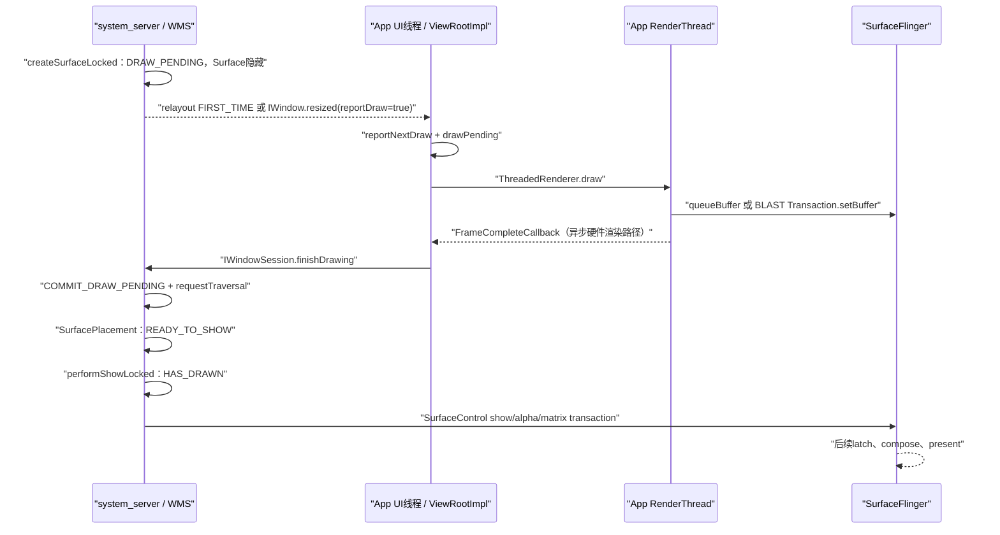
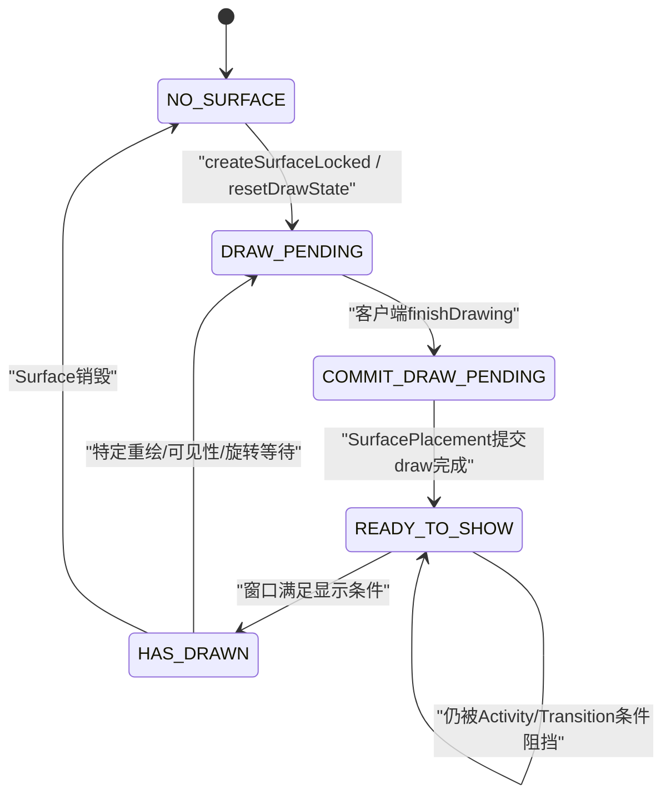

# 219 Android ViewRootImpl reportNextDraw、finishDrawing 与 WMS draw state 状态机

> 源码版本：Android 11 / `android-11.0.0_r48`  
> 学习方式：macOS 只读源码追踪，不编译、不刷机、不把推演写成真机结论  
> 前置章节：第 213、214、215、217、218 章

## 1. 本章要解决什么问题

“Activity首帧画完了”在口头交流里看似简单，源码中却至少涉及App、WMS、SurfaceFlinger和显示硬件四套不同进度。

本章只把中间一段彻底拆清：`ViewRootImpl` 为什么要报告下一次绘制，`IWindowSession.finishDrawing()`如何进入WMS，窗口又如何经历 `DRAW_PENDING → COMMIT_DRAW_PENDING → READY_TO_SHOW → HAS_DRAWN`。

## 2. 先给出最短主线

```text
WMS创建隐藏Surface并把draw state设为DRAW_PENDING
  → ViewRootImpl收到首次relayout或redraw请求
  → reportNextDraw()登记一笔待报告绘制
  → performDraw()生产窗口帧
  → reportDrawFinished()跨Binder调用finishDrawing
  → WMS改为COMMIT_DRAW_PENDING并请求SurfacePlacement
  → commitFinishDrawingLocked()改为READY_TO_SHOW
  → 满足Activity/Transition/Policy条件后performShowLocked()
  → draw state改为HAS_DRAWN
  → prepareSurfaceLocked()才把隐藏Surface提交为show
```

这条线里的每个箭头都有条件，不能把它压缩成“draw后立即show”。

## 3. 全链路时序图



## 4. 第一个关键结论：finishDrawing不是SurfaceFlinger接口

`finishDrawing` 定义在Framework的 `IWindowSession.aidl`，App通过Window Session Binder把“客户端已完成本轮需报告的绘制”告诉WMS。

它不是App直接通知SurfaceFlinger“这帧已经显示”，也不是HWC present fence回调。

## 5. 第二个关键结论：draw state属于WMS窗口账本

五个draw state定义在：

```text
frameworks/base/services/core/java/com/android/server/wm/
    WindowStateAnimator.java
```

状态记录在system_server里的 `WindowStateAnimator.mDrawState`，并不等于App `View` 的dirty、RenderNode录制状态或BufferQueue slot状态。

## 6. 五态总览



## 7. NO_SURFACE的准确含义

`NO_SURFACE` 表示WMS对外认为这个窗口当前没有可用窗口Surface。

源码还提醒：即使内部为了平滑切换保留了旧Surface，对外状态仍可能被置为 `NO_SURFACE`；所以它是WMS生命周期语义，不是“SurfaceFlinger中绝无任何相关Layer”的绝对物理断言。

## 8. DRAW_PENDING的准确含义

源码注释写得很明确：Surface已经创建，但窗口尚未完成绘制，在此期间Surface保持隐藏。

“隐藏”很重要：WMS先给App一个可绘制目标，避免未初始化或半成品内容直接露出。

## 9. COMMIT_DRAW_PENDING的准确含义

App已经调用 `finishDrawing`，WMS接受了这次报告，但尚未在下一次布局/SurfacePlacement事务中把它推进成可显示状态。

它是“报告已收到、等待WMS提交”的中间态。

## 10. READY_TO_SHOW的准确含义

WMS已在SurfacePlacement中提交draw完成，窗口内容从draw state角度已准备好。

但Activity可能还在等待其他窗口，AppTransition也可能要求一组窗口一起出现，所以READY不等于已经show。

## 11. HAS_DRAWN的准确含义

`performShowLocked()` 满足条件后把状态改成 `HAS_DRAWN`，并安排动画事务。

源码注释把它称为窗口第一次在screen上shown，但做性能分析时仍应保持分层：这是WMS的show/drawn账本，不是可靠的HWC present fence signal，更不是面板整屏扫描完成。

## 12. Surface创建时状态怎样进入DRAW_PENDING

`WindowStateAnimator.createSurfaceLocked()`先确认没有已有 `mSurfaceController`，随后调用：

```java
resetDrawState();
```

而 `resetDrawState()` 的核心就是：

```java
mDrawState = DRAW_PENDING;
```

## 13. 新建Surface默认为什么隐藏

创建SurfaceControl时初始flags含 `SurfaceControl.HIDDEN`。

这使“分配绘制目标”和“允许用户看到”成为两个独立步骤：App可以先提交完整Buffer，WMS再选择合适的整体时机show。

## 14. resetDrawState还会影响Activity.allDrawn

如果窗口属于Activity，且Activity没有正处于Transition动画，`resetDrawState()`会调用 `ActivityRecord.clearAllDrawn()`。

这避免Activity沿用上一代窗口内容的 `allDrawn=true`，误认为新Surface已准备完成。

## 15. 首次relayout怎样要求App报告下一次draw

WMS的 `relayoutVisibleWindow()`在窗口此前不可见或当前还没drawn时返回：

```java
result |= (!wasVisible || !isDrawnLw())
        ? RELAYOUT_RES_FIRST_TIME : 0;
```

这个bit由同步relayout返回给App。

## 16. FIRST_TIME不应按字面理解成对象一生仅一次

窗口首次可见当然会拿到它；但格式改变无法原地完成、drag resize需保留旧Surface等路径也会重新附加 `RELAYOUT_RES_FIRST_TIME`。

它更接近“这一代可见Surface需要一次完成绘制报告”。

## 17. ViewRootImpl在哪里消费FIRST_TIME

首次Traversal接近draw前，`ViewRootImpl`检查relayout结果：

```java
if ((relayoutResult & RELAYOUT_RES_FIRST_TIME) != 0) {
    reportNextDraw();
}
```

它不是当场调用finishDrawing，而是要求“下一次真正draw完成后再报告”。

## 18. reportNextDraw本身做什么

```java
private void reportNextDraw() {
    if (mReportNextDraw == false) {
        drawPending();
    }
    mReportNextDraw = true;
}
```

第一次从false变true时登记一笔pending；重复请求只保持boolean，不重复为同一个根窗口请求加账。

## 19. mReportNextDraw是门，不是完成标志

它表示下一次draw具有“必须回报WMS”的额外职责。

`mReportNextDraw=true`时甚至还没开始执行 `performDraw()`，因此不能拿它当“首帧已画”的证据。

## 20. mDrawsNeededToReport为什么是计数器

ViewRootImpl除了自己的根窗口帧，还可能要等 `SurfaceView`、WindowCallbacks或SurfaceHolder redraw callback完成。

因此“这一轮可以告诉WMS了”不是简单boolean，而是所有参与者的待完成数归零。

## 21. drawPending与pendingDrawFinished必须配平

```java
void drawPending() {
    mDrawsNeededToReport++;
}

void pendingDrawFinished() {
    if (mDrawsNeededToReport == 0) throw ...;
    if (--mDrawsNeededToReport == 0) reportDrawFinished();
}
```

多完成一次会直接抛出 `Unbalanced drawPending/pendingDrawFinished calls`，说明这个计数是协议不变量。

## 22. WMS还可通过resized回调要求重绘报告

`WindowState.reportResized()`计算 `reportDraw`，并通过 `IWindow.resized(...)`回调App。

`ViewRootImpl.W`是Binder接收端，它把回调转给 `dispatchResized()`，再投递到UI线程。

## 23. Binder线程不直接改ViewRoot状态

`dispatchResized()`选择：

```java
reportDraw ? MSG_RESIZED_REPORT : MSG_RESIZED
```

消息进入ViewRoot Handler；只有UI线程处理 `MSG_RESIZED_REPORT`时才调用 `reportNextDraw()`。

## 24. 为什么同进程回调还要复制Rect

`dispatchResized()`检查Binder caller pid；如果是同进程调用，会主动复制 `Rect`、`MergedConfiguration`等可变对象。

这说明“没有进程边界”不等于可以安全共享调用方随后会复用的可变参数。

## 25. WMS的reportDraw条件不只看DRAW_PENDING

r48中包含：

```java
mDrawState == DRAW_PENDING
        || useBLASTSync()
        || !mRedrawForSyncReported
```

因此reportDraw有时是为了同步resize/BLAST事务，并不总表示一个全新的WindowState首次Surface。

## 26. 旋转或drag resize会重新进入DRAW_PENDING

`updateResizingWindowIfNeeded()`发现orientation changing或drag-resizing状态变化时，会把窗口draw state重新设为 `DRAW_PENDING`并清Activity `allDrawn`。

系统要等App按新几何重绘后再解除冻结或完成resize，不能沿用旧尺寸Buffer的完成状态。

## 27. BLAST_SYNC结果也会触发reportNextDraw

ViewRootImpl看到 `RELAYOUT_RES_BLAST_SYNC`时同时执行：

```java
reportNextDraw();
setUseBLASTSyncTransaction();
mSendNextFrameToWm = true;
```

这次报告还承担“将Buffer与几何事务捆在同一个同步边界”的职责。

## 28. setReportNextDraw是特殊系统接口

ViewRootImpl还提供隐藏方法 `setReportNextDraw()`，内部调用 `reportNextDraw()`并invalidate。

源码注释明确警告：它仅用于SystemUI/WMS在亮屏等场景等待下一帧，不是普通业务代码随意调用的性能标记API。

## 29. stopped窗口为什么仍可能执行布局和绘制

许多Traversal条件写成：

```java
!mStopped || mReportNextDraw
```

如果WMS正在等待一笔draw报告，即使ViewRoot处于stopped状态，也必须允许这一轮推进，否则系统与客户端会互相等待。

## 30. display off为什么也有例外

`performDraw()`通常在display state为OFF时早退，但条件同样保留：

```java
if (displayOff && !mReportNextDraw) return;
```

已有待报告请求时不能单纯因为屏幕关闭就吞掉协议完成。

## 31. PreDraw取消会发生什么

如果 `OnPreDrawListener`返回取消且View仍可见，ViewRoot不会执行本轮 `performDraw()`，而是重新 `scheduleTraversals()`。

`mReportNextDraw`仍保留，待下一轮真正允许draw时再完成，避免把未生产的帧报告给WMS。

## 32. reportNextDraw会强制full redraw

```java
final boolean fullRedrawNeeded =
        mFullRedrawNeeded || mReportNextDraw;
```

当系统要求一次可确认的完整绘制时，不能只依赖一小块旧dirty区域恰好更新。

## 33. performDraw先捕获原始report标志

代码保存：

```java
boolean reportNextDraw = mReportNextDraw;
```

这是给异步FrameComplete callback使用的快照，避免回调晚到时误读后续另一轮请求的boolean。

## 34. 硬件渲染为何优先异步报告

有ThreadedRenderer且启用时，ViewRoot给HWUI设置 `FrameCompleteCallback`。

UI线程提交DisplayList给RenderThread并不代表Buffer已经完成swap/queue；等RenderThread执行完本轮更符合“客户端完成draw”的协议意图。

## 35. FrameCompleteCallback在哪个线程触发

native `CanvasContext`在RenderThread绘制和swap路径调用callback，经JNI回Java。

ViewRoot callback本身不直接操作UI状态，而是用Handler `postAtFrontOfQueue()`把 `pendingDrawFinished()`送回UI线程。

## 36. postAtFrontOfQueue仍不是同步回调

它提高完成消息在UI消息队列中的优先级，但不会跨越当前正在执行的UI消息。

所以“RenderThread完成”与“App发出finishDrawing Binder调用”之间仍可有调度间隔。

## 37. FrameComplete不等于GPU完成或物理显示

r48 `CanvasContext`在swap路径后调用callback，同时源码附近仍有：

```cpp
// TODO: Use a fence for real completion?
markFrameCompleted();
```

因此不能把这个名称扩张成GPU fence signal、SF latch、HWC present或面板scanout。

## 38. skip empty frame也会触发FrameComplete

如果dirty为空且允许跳过空帧，HWUI为了不让等待者永久挂住，会直接调用并清理FrameComplete callbacks。

这进一步证明callback首先是一个软件协议完成点，不是“一定提交了新像素Buffer”的绝对保证。

## 39. canUseAsync失败时怎样回退

如果 `draw()`返回不能使用异步报告，ViewRoot清掉FrameComplete callback、结束相应BLAST sync处理，然后走后面的同步完成分支。

这防止一笔pending被留给永远不会到来的异步callback。

## 40. 软件渲染怎样报告完成

没有异步硬件报告时，ViewRoot在draw返回后直接调用 `pendingDrawFinished()`。

如果ThreadedRenderer对象存在但本轮未异步使用，还会先调用renderer `fence()`，收紧CPU继续前进与渲染工作之间的边界。

## 41. SurfaceHolder窗口需要等外部回调

如果根窗口本身通过 `SurfaceHolder`管理有效Surface，ViewRoot使用 `SurfaceCallbackHelper.dispatchSurfaceRedrawNeededAsync()`。

只有所有SurfaceHolder callbacks调用完成runnable，才用 `MSG_DRAW_FINISHED`回到UI线程减账。

## 42. SurfaceView会给根窗口额外加账

`SurfaceView`需要redraw时执行：

```java
mPendingReportDraws++;
viewRoot.drawPending();
```

SurfaceView的surface redraw callbacks全部完成后，才调用 `viewRoot.pendingDrawFinished()`。

## 43. 为什么不能只等DecorView画完

一个Activity视觉上可能由根窗口Buffer加一个或多个独立SurfaceView Layer共同组成，例如视频、相机预览或游戏画面。

若根View一提交就报告完成，WMS可能show出一个背景已好但视频Layer尚空的组合画面。

## 44. WindowCallbacks又是一套协调机制

多线程窗口渲染路径可通过 `onContentDrawn()`和 `onRequestDraw()`参与绘制。

ViewRoot创建 `CountDownLatch(mWindowCallbacks.size())`，各callback最终经 `reportDrawFinish()`倒数。

## 45. CountDownLatch等待点需要谨慎理解

当 `mReportNextDraw`仍为true时，`performDraw()`会等待 `mWindowDrawCountDown.await()`。

这是客户端内部参与者的同步，并不是WMS全局锁等待；但错误实现的WindowCallback若不完成，仍可能卡住App UI线程。

## 46. mReportNextDraw何时清零

draw执行后，ViewRoot进入：

```java
if (mReportNextDraw) {
    mReportNextDraw = false;
    ...
}
```

清boolean并不立刻代表Binder finishDrawing已发出；异步硬件、SurfaceHolder或SurfaceView仍可能持有pending计数。

## 47. drawPending计数何时真正归零

根请求、SurfaceView和其他异步redraw各自完成时调用 `pendingDrawFinished()`。

只有最后一个参与者把 `mDrawsNeededToReport`减到0，才进入 `reportDrawFinished()`。

## 48. reportDrawFinished是真正的App→WMS边界

```java
mWindowSession.finishDrawing(
        mWindow, mSurfaceChangedTransaction);
```

`mWindow`是IWindow客户端token，WMS用它在当前Session中找到准确的WindowState。

## 49. finishDrawing是oneway吗

r48的AIDL声明是普通返回void的方法，没有 `oneway`关键字。

因此App Binder调用会等待system_server执行该事务并返回；但返回只表示WMS处理完这次Binder调用，不表示后续SurfacePlacement、SF合成或硬件present完成。

## 50. RemoteException为什么被忽略

ViewRoot捕获RemoteException后不再补救，因为WMS Binder服务若已失效，单个窗口的draw完成报告也失去正常接收者。

这不是“finishDrawing绝不会失败”，只是Framework在系统服务异常场景下没有可恢复的普通窗口协议。

## 51. mSurfaceChangedTransaction有什么作用

Surface创建或替换回调可把相关 `SurfaceControl.Transaction`变化写入这笔事务。

App将它和finishDrawing一起交给WMS，目的是让“新内容完成”与相关Surface变化在WMS选择的事务时机合并，而不是随意提前apply。

## 52. Session只是薄Binder入口

`Session.finishDrawing()`几乎只做一件事：

```java
mService.finishDrawingWindow(this, window,
        postDrawTransaction);
```

真正的校验、状态更新和布局请求都在WMS及WindowState中。

## 53. WMS为什么clearCallingIdentity

`finishDrawingWindow()`先保存并清除Binder调用者身份，最后恢复。

随后WMS执行布局和系统内部逻辑时使用system_server身份，避免把App uid意外带进系统内部调用链。

## 54. WMS如何找窗口

```java
windowForClientLocked(session, client, false)
```

同时使用Session和IWindow客户端标识找WindowState，避免另一个Session拿任意IWindow引用修改不属于它的窗口状态。

## 55. 窗口已移除时怎样处理

若找不到WindowState，`finishDrawingWindow()`什么也不推进。

这允许迟到的FrameComplete或Surface redraw callback安全落地：窗口生命周期已经结束时，旧完成报告不会复活窗口。

## 56. WMS状态修改运行在哪个锁内

窗口查找、`win.finishDrawing()`、wallpaper/layout标志与requestTraversal都在 `mGlobalLock`内完成。

App侧渲染不持这把锁；Binder进入后才对WMS全局窗口账本做短小、串行更新。

## 57. WindowState.finishDrawing先处理BLAST分支

非BLAST sync时直接调用：

```java
mWinAnimator.finishDrawingLocked(postDrawTransaction)
```

使用BLAST sync时先把客户端事务merge进 `mBLASTSyncTransaction`，标记稍后在SurfacePlacement通知，再以null推进传统draw state。

## 58. DRAW_PENDING怎样变成COMMIT_DRAW_PENDING

`finishDrawingLocked()`只在当前状态恰好是 `DRAW_PENDING`时执行：

```java
mDrawState = COMMIT_DRAW_PENDING;
layoutNeeded = true;
```

并把非null postDrawTransaction merge进WMS保存的post-draw事务。

## 59. 为什么finishDrawing不直接改HAS_DRAWN

WMS还需要在统一SurfacePlacement事务里检查Activity是否allDrawn、窗口是否ready for display、AppTransition是否正在等待，以及policy visibility、父窗口、销毁状态等条件。

客户端只负责报告自己的绘制，不应单方面决定系统窗口何时露出。

## 60. 重复finishDrawing怎样处理

如果状态已不再是 `DRAW_PENDING`，第二次finishDrawing不会重复推进状态。

但传入的postDrawTransaction不能一直滞留；源码选择立即 `apply()`，避免把不属于当前pending draw代际的事务拖到未知未来。

## 61. finishDrawing返回true代表什么

返回值只是 `layoutNeeded`：本次确实把 `DRAW_PENDING`推进到 `COMMIT_DRAW_PENDING`，需要安排SurfacePlacement。

它不表示窗口已经show，也不作为App侧API返回值暴露。

## 62. wallpaper窗口为什么附带layout change

若完成绘制的窗口带 `FLAG_SHOW_WALLPAPER`，WMS设置 `FINISH_LAYOUT_REDO_WALLPAPER`。

窗口内容可改变wallpaper target与可见关系，因此不能只更新自身Surface。

## 63. requestTraversal怎样继续状态机

WMS标记display layout needed并调用 `mWindowPlacerLocked.requestTraversal()`。

这会安排后续统一的SurfacePlacement，而不是在当前App Binder调用栈里深度完成所有窗口布局与Surface提交。

## 64. App拿到finishDrawing返回时到了哪一步

正常首次路径中，至少WMS已经记录 `COMMIT_DRAW_PENDING`并安排Traversal。

但后续 `commitFinishDrawingLocked()`通常还没执行，因此此时甚至不一定已经是READY_TO_SHOW。

## 65. SurfacePlacement在哪推进COMMIT状态

`DisplayContent.applySurfaceChangesTransaction()`逐窗口处理；有Surface时调用：

```java
winAnimator.commitFinishDrawingLocked();
```

这发生在WMS组织显示事务的统一阶段。

## 66. commitFinishDrawingLocked接受哪两个状态

只有当前是 `COMMIT_DRAW_PENDING`或 `READY_TO_SHOW`才继续。

允许READY再次进入，是因为窗口可能上一轮已经ready，但Activity整体或Transition条件当时还不允许show。

## 67. COMMIT怎样变成READY

方法先无条件把符合条件的状态写成：

```java
mDrawState = READY_TO_SHOW;
```

然后再判断Activity及窗口显示条件，决定是否调用 `performShowLocked()`。

## 68. Activity窗口为什么不能各自随到随show

对普通Activity窗口，条件是：

```java
activity == null
        || activity.canShowWindows()
        || type == TYPE_APPLICATION_STARTING
```

`activity.canShowWindows()`通常要求 `allDrawn`，这样同一个Activity的一组重要窗口可以在统一时机显示。

## 69. Starting Window为什么例外

`TYPE_APPLICATION_STARTING`不等待真实Activity所有窗口allDrawn。

它存在的目的就是尽快遮住启动空档；若也等待真实窗口集合完成，就失去preview价值。

## 70. canShowWindows还考虑广色域过渡

r48实现要求 `allDrawn`，并在父级正做Transition动画且存在非默认color mode窗口时暂缓。

源码注释说明这是为了避免过渡中途切换wide-color-gamut显示配置产生卡顿。

## 71. allDrawn不是“所有WindowState无条件全算”

ActivityRecord按 `mightAffectAllDrawn()`、`isInteresting()`、可见性、freezing、destroying等条件选择窗口。

starting window单独记录 `startingDisplayed`，不计入真实Activity interesting window完成数。

## 72. 主窗口怎样成为interesting基线

每个WMS transaction sequence首次统计时，若找到不含starting的main window，`mNumInterestingWindows`先置为1。

其他满足条件的非主窗口再累加；drawn数达到interesting数且所有子窗口都已评估，Activity才可 `allDrawn=true`。

## 73. READY_TO_SHOW为何可能停留多轮

第一个真实Window finishDrawing后可以先到READY，但Activity还有另一个interesting窗口未drawn。

下一轮SurfacePlacement仍会调用commit方法；直到 `allDrawn`或其他门满足，才真正performShow。

## 74. updateAllDrawn为什么再请求一次layout

Activity从not-all-drawn变成allDrawn时会 `setLayoutNeeded()`。

源码注释直接说明：强制再来一轮layout，让先前停在READY_TO_SHOW的窗口再次进入 `commitFinishDrawingLocked()`并调用show。

## 75. checkAppWindowsReadyToShow又做什么

Activity检测allDrawn变化；旋转冻结场景会show all并结束freeze，普通场景设置动画layout change。

如果Activity不在opening apps且已允许显示，会直接遍历 `showAllWindowsLocked()`。

## 76. AppTransition如何延迟窗口出现

`WindowState.isReadyForDisplay()`开头检查：token正在waitingToShow且AppTransition已设置时返回false。

因此即使单窗READY、Activity allDrawn，窗口仍可等待过渡统一启动。

## 77. isReadyForDisplay还有哪些门

窗口必须有Surface、policy允许可见、未destroying，父窗口和客户端可见；或者当前正通过Transition/父级动画维持可见语义。

draw完成只是众多显示条件之一。

## 78. performShowLocked先做哪件容易忽略的事

方法在真正检查READY之前，如果当前状态已经是HAS_DRAWN或READY且属于Activity，会回调：

- 普通真实窗口：`ActivityRecord.onFirstWindowDrawn()`；
- starting window：`ActivityRecord.onStartingWindowDrawn()`。

随后才检查是否能从READY实际show。

## 79. onFirstWindowDrawn为何可能早于SurfaceControl show提交

它绑定的是WMS `performShowLocked()`流程，不是SF present回调。

此处会标记 `firstWindowDrawn=true`、移除starting window并更新reported visibility，所以“首真实窗口交接”仍属于WMS事务组织阶段。

## 80. performShowLocked怎样进入HAS_DRAWN

满足 `READY_TO_SHOW && isReadyForDisplay()`后，WMS应用enter animation，强制下次surface prepare更新alpha，并写：

```java
mWinAnimator.mDrawState = HAS_DRAWN;
mWmService.scheduleAnimationLocked();
```

## 81. HAS_DRAWN后为何Surface仍可能尚未show

实际 `SurfaceControl.show()`在 `WindowStateAnimator.prepareSurfaceLocked()`看到 `mDrawState == HAS_DRAWN`且 `mLastHidden`时执行。

也就是说draw state改变与show命令组织虽相邻，源码仍把它们拆成独立步骤。

## 82. showSurfaceRobustlyLocked成功后发生什么

WMS清 `mLastHidden`，处理保留Surface、替换窗口与wallpaper可见性，并把相关Transaction交给SurfaceFlinger。

SF随后还要按VSync应用事务、latch Buffer、选择合成路径并present。

## 83. isDrawFinishedLw与isDrawnLw并不相同

`isDrawFinishedLw()`接受：

```text
COMMIT_DRAW_PENDING / READY_TO_SHOW / HAS_DRAWN
```

`isDrawnLw()`只接受：

```text
READY_TO_SHOW / HAS_DRAWN
```

所以收到finishDrawing后、SurfacePlacement提交前，窗口是draw-finished但还不算WMS drawn。

## 84. hasDrawnLw更加严格

`hasDrawnLw()`只检查 `mDrawState == HAS_DRAWN`。

命名相似的方法实际用于不同决策；阅读调用者时必须核对具体谓词，不能凭中文“画完”互换。

## 85. isDisplayedLw还叠加可见性

它要求 `isDrawnLw()`、policy visibility、父窗口可见或动画条件等。

因此 `HAS_DRAWN`只是draw state维度；窗口可能因policy、用户、父层级或动画仍不构成当前displayed窗口。

## 86. Activity reportedDrawn怎样计算

`updateReportedVisibilityLocked()`遍历非starting、可见且未destroying的窗口，统计interesting与drawn。

drawn数达到interesting数后调用 `onWindowsDrawn(true, elapsedRealtimeNanos())`，进而通知ActivityMetricsLogger和等待启动的调用方。

## 87. starting window不会让Activity reportedDrawn提前完成

`WindowState.updateReportedVisibility()`明确跳过 `TYPE_APPLICATION_STARTING`。

所以启动Splash已经显示可以让Transition先ready，却不会被当成真实Activity的windows drawn完成。

## 88. startingDisplayed在哪里置true

ActivityRecord的drawn状态统计发现当前窗口正是startingWindow且 `isDrawnLw()`时，通知starting-window metric并设 `startingDisplayed=true`。

这至少要等starting窗口到READY/HAS_DRAWN，不是StartingData创建或addWindow成功就置true。

## 89. firstWindowDrawn与reportedDrawn的差别

`firstWindowDrawn`在第一个真实窗口走 `performShowLocked()`时即可置true，并触发starting window交接。

`reportedDrawn`要求Activity统计范围内的interesting窗口整体满足，因此有多个窗口时二者可不同时发生。

## 90. allDrawn与reportedDrawn也不完全相同

`allDrawn`服务于WMS何时允许Activity窗口成组show；`reportedDrawn`来自reported visibility统计并向启动度量/等待者报告。

二者都依赖窗口draw状态，但统计函数、历史保持规则和消费者不同。

## 91. r48 BLAST sync试图解决什么

resize时若Buffer尺寸内容和Surface位置/裁剪分两笔事务到达，用户可能看到一帧错位。

BLAST sync把RenderThread产生的Buffer事务导向 `mRtBLASTSyncTransaction`，再随finishDrawing交给WMS的同步事务集合。

## 92. ViewRoot的两阶段BLAST boolean为何必要

源码注释给出竞态：第一轮draw在等callback时，第二轮又设置sync请求；若只用一个boolean，第一轮callback可能清掉第二轮请求。

因此 `mNextDrawUseBLASTSyncTransaction`由performDraw消费，`mNextReportConsumeBLAST`由finish callback消费。

## 93. mSendNextFrameToWm区分哪两类sync

它标记这次BLAST sync由WMS请求。

若只是SurfaceView等App内部sync，应由App apply；若WMS请求，ViewRoot把RenderThread事务merge到 `mSurfaceChangedTransaction`，通过finishDrawing交给WMS。

## 94. WMS何时通知BLAST事务ready

WindowState在 `prepareSurfaces()`中调用 `notifyBlastSyncTransaction()`。

如果本层还有children sync set，先setReady等待集合；没有本地集合时直接回调waiting listener，仍由同步框架决定整组事务何时ready。

## 95. BLAST timeout意味着什么

WMS启动WindowState BLAST sync时会设置超时消息，避免客户端永不finishDrawing导致整组WindowOrganizer事务无限等待。

超时是协议逃生通道，不意味着没按时完成的内容突然变成正确或已经显示。

## 96. doDie里的特殊finishDrawing

ViewRoot销毁时若最后一次relayout返回FIRST_TIME，会直接调用 `finishDrawing(window, null)`，再销毁Surface。

这是避免WMS永久等一笔已不可能正常绘制的报告；不能把它解释成窗口临死前真的生产了完整新帧。

## 97. 常见误解一：finishDrawing等于onDraw返回

不等。View.onDraw只是在UI线程录制或软件绘制的一环；硬件路径还要等RenderThread，SurfaceView等参与者还要各自完成，最后才跨Binder报告。

## 98. 常见误解二：finishDrawing返回等于屏幕出现

不等。它通常只推进到COMMIT_DRAW_PENDING，后面还有SurfacePlacement、Activity整体门、Transition、SurfaceControl show、SF latch/compose和HWC present。

## 99. 常见误解三：HAS_DRAWN就是present fence signal

不等。HAS_DRAWN在system_server的 `performShowLocked()`中写入；它不是SurfaceFlinger从HWC得到的present fence状态。

## 100. 常见误解四：每次invalidate都调用finishDrawing

不对。普通动画或invalidate可以持续提交Buffer，但只有WMS/系统明确要求report next draw的轮次才走这套完成报告协议。

## 101. 常见误解五：一个Activity只有一个待绘制对象

不对。Activity可能有主窗口、附属窗口、SurfaceView、WindowCallbacks；WMS和ViewRoot分别用interesting计数、pending report计数协调不同层级的参与者。

## 102. 常见误解六：READY_TO_SHOW一定下一行就HAS_DRAWN

不对。Activity allDrawn、wide-color transition、waitingToShow、policy visibility、父窗口和用户显示条件都可能让窗口停留READY多轮。

## 103. 故障推理：长时间停在DRAW_PENDING

优先检查App是否收到FIRST_TIME或 `MSG_RESIZED_REPORT`、Traversal是否被不断PreDraw取消、UI/RenderThread是否卡住、SurfaceView callback是否忘记完成。

此时根因通常还在客户端未发出有效finishDrawing，不能先归咎于SF合成。

## 104. 故障推理：长时间停在COMMIT_DRAW_PENDING

说明WMS已收到客户端报告，却没完成下一次SurfacePlacement提交。

检查WMS traversal是否被安排、全局锁/WindowPlacer是否阻塞，以及窗口是否仍有Surface；这与App业务onDraw慢已经不是同一层。

## 105. 故障推理：长时间停在READY_TO_SHOW

检查Activity `allDrawn`、interesting窗口数、opening apps/AppTransition、`waitingToShow`、policy/parent visibility、destroying和wide-color transition条件。

此时客户端单窗内容已被WMS视为drawn，但系统还在等“可以整组露出”的条件。

## 106. 故障推理：HAS_DRAWN但用户仍说黑屏

继续向下检查SurfaceControl是否真正show、alpha/crop/layer、SF是否latch到目标Buffer、CLIENT/DEVICE合成、acquire/present fence、物理Display与遮挡Layer。

HAS_DRAWN只能帮你排除一部分App→WMS draw协议问题，不能终止图形链诊断。

## 107. macOS只读练习一：手抄五态转换

```bash
cd /Users/ninebot/androidSource
sed -n '175,205p' \
  frameworks/base/services/core/java/com/android/server/wm/WindowStateAnimator.java
```

为每个状态写下“谁写入、进入条件、下一消费者”，尤其比较COMMIT和READY。

## 108. macOS只读练习二：追App报告链

```bash
cd /Users/ninebot/androidSource
rg -n 'reportNextDraw|drawPending|pendingDrawFinished|reportDrawFinished|finishDrawing' \
  frameworks/base/core/java/android/view/ViewRootImpl.java \
  frameworks/base/core/java/android/view/SurfaceView.java
```

画出根窗口、SurfaceView、RenderThread callback三者如何共同把计数减到0。

## 109. macOS只读练习三：追WMS状态推进

```bash
cd /Users/ninebot/androidSource
rg -n 'finishDrawingWindow|finishDrawingLocked|commitFinishDrawingLocked|performShowLocked' \
  frameworks/base/services/core/java/com/android/server/wm
```

逐个标注所在类、是否持WMS全局锁、是否处于Surface transaction和返回值真实含义。

## 110. macOS只读练习四：比较三个drawn谓词

```bash
cd /Users/ninebot/androidSource
sed -n '1875,1910p' \
  frameworks/base/services/core/java/com/android/server/wm/WindowState.java
```

自己列一张表，对比 `isDrawFinishedLw()`、`isDrawnLw()`、`hasDrawnLw()`分别接受哪些状态，再各找一个调用者。

## 111. 源码导航：App端

```text
frameworks/base/core/java/android/view/ViewRootImpl.java
frameworks/base/core/java/android/view/SurfaceView.java
frameworks/base/core/java/com/android/internal/view/SurfaceCallbackHelper.java
frameworks/base/core/java/android/view/IWindowSession.aidl
frameworks/base/core/java/android/view/IWindow.aidl
frameworks/base/graphics/java/android/graphics/HardwareRenderer.java
frameworks/base/libs/hwui/renderthread/DrawFrameTask.cpp
frameworks/base/libs/hwui/renderthread/CanvasContext.cpp
```

## 112. 源码导航：WMS端

```text
frameworks/base/services/core/java/com/android/server/wm/Session.java
frameworks/base/services/core/java/com/android/server/wm/WindowManagerService.java
frameworks/base/services/core/java/com/android/server/wm/WindowState.java
frameworks/base/services/core/java/com/android/server/wm/WindowStateAnimator.java
frameworks/base/services/core/java/com/android/server/wm/DisplayContent.java
frameworks/base/services/core/java/com/android/server/wm/ActivityRecord.java
```

## 113. 复读修订一：状态名中的“shown”只能在本层解释

初稿最容易把WindowStateAnimator注释里的“shown on the screen”直译成物理面板已经扫描。

复读源码后应限定为WMS首次show/drawn账本：真正硬件显示仍须结合SF事务、latch、HWC present返回与present fence signal。

## 114. 复读修订二：FrameComplete不是严格GPU fence

HWUI名称看起来很强，但r48源码自己保留“Use a fence for real completion?” TODO，空帧跳过时也主动触发callback。

因此本章只把它描述为RenderThread/HWUI本轮软件完成协议，不把它升级为物理显示证据。

## 115. 复读修订三：reportDraw不总是首次Surface

首次relayout只是最常见入口；orientation、drag resize、preserved surface、WindowOrganizer/BLAST sync和显式SystemUI请求也会要求下一次draw报告。

所以排查日志时必须同时看触发原因和当前draw state代际。

## 116. 复读修订四：finishDrawing可能不推进状态

只有当前状态为DRAW_PENDING时，`finishDrawingLocked()`才进入COMMIT并返回layoutNeeded。

迟到或重复报告在其他状态下不会重新走首次显示状态机；在非BLAST sync路径中，携带的普通post-draw transaction会立即apply，避免错误滞留到下一代draw。

## 117. 本章最终心智模型

可以把整个协议记成三层账本：

1. App账本：`mReportNextDraw + mDrawsNeededToReport`，回答“本轮所有客户端参与者是否完成”；
2. WMS单窗账本：五态，回答“这个WindowState从隐藏Surface到允许show走到哪里”；
3. Activity组账本：`allDrawn / firstWindowDrawn / reportedDrawn`，回答“一组窗口是否可一起出现以及启动等待是否可结束”。

三层账本完成后，下面仍有SF/HWC显示流水线。

## 118. 本章结论与下一章

`reportNextDraw`是一次需回报绘制的登记，`finishDrawing`是App对WMS的客户端完成确认，五态则让WMS把“Surface存在”“客户端报告”“系统提交”“整组可显示”“已安排show”逐层分开。最重要的诊断原则是：先判断卡在哪一层账本，再决定向App、WMS还是SF继续追。

下一章进入第220章“Android Activity allDrawn、reportedDrawn、nowVisible与启动完成回调”，把本章已经出现的Activity级多窗口聚合、启动度量和等待者唤醒继续拆细。
