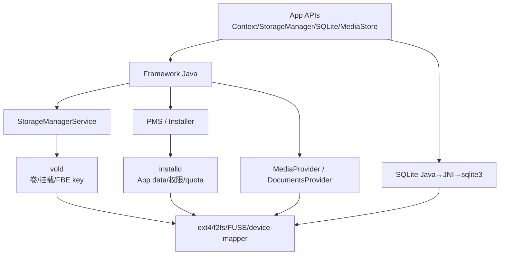
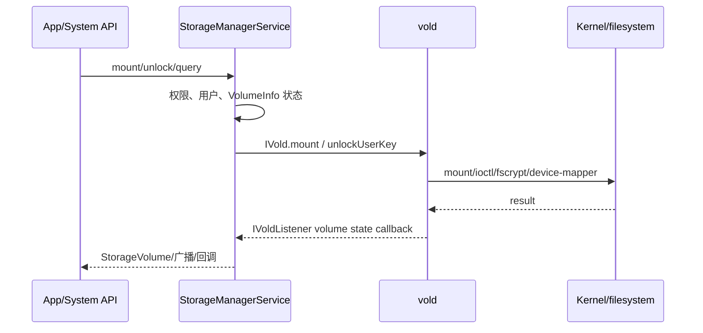
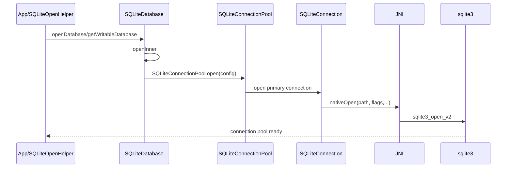
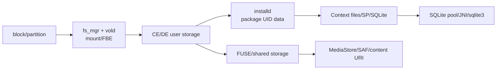

# 22 Android 存储、文件系统与数据持久化

> 源码版本：Android 11 / API 30 / `android-11.0.0_r48`  
> 学习方式：macOS 只读源码，不要求编译或挂载镜像。  
> 前置章节：[04-init进程与rc脚本](./04-init进程与rc脚本.md)、[13-PackageManagerService包管理与APK安装](./13-PackageManagerService包管理与APK安装.md)、[15-AMS进程管理与LMKD](./15-AMS进程管理与LMKD.md)

---

## 1. 本章先解决四个“存储”

Android 开发里“存储”至少有四层含义：

```text
块设备/分区：system、vendor、userdata、metadata、super...
文件系统/挂载：ext4/f2fs、dm-verity、FBE、vold、FUSE
应用文件空间：files/cache/databases/shared_prefs/external files
数据持久化格式：普通文件、SharedPreferences、SQLite、MediaStore
```

混在一起会产生典型误解：

- “内部存储”是不是 `/sdcard`？
- `getExternalFilesDir()` 为什么叫 external，却不一定是可拔 SD 卡？
- 用户没解锁时，为什么同一个 App 有些文件能读、有些不能？
- App 已有文件权限，为什么仍打不开路径？
- 数据库文件私有，为什么查询仍可能在 Binder 线程？
- `apply()` 返回了，数据是否已经安全落盘？

本章目标：

1. 认识 Android 11 常见分区和动态分区。
2. 区分 fs_mgr、vold、installd、StorageManagerService。
3. 解释 FBE 的 CE/DE 与 Direct Boot。
4. 区分内部私有、外部 app-specific、MediaStore/SAF。
5. 理解 Linux UID、DAC、SELinux、mount/FUSE 的多层访问控制。
6. 追踪 Context 文件 API 到真实目录。
7. 解释 SharedPreferences 的内存、排队和落盘语义。
8. 从 SQLiteDatabase 追到 connection pool、JNI、sqlite3。
9. 理解 WAL、事务、锁和主线程 I/O 风险。

---

## 2. 整体架构图



---

## 3. 常见分区的职责

设备实现会变化，但 Android 11 常见逻辑分区包括：

| 分区/挂载点 | 典型内容 |
|---|---|
| `/system` | Android Framework、核心库和系统文件 |
| `/vendor` | SoC/设备厂商 HAL、配置、库 |
| `/product` | 产品级应用、overlay、配置 |
| `/system_ext` | 对 system 扩展的系统组件 |
| `/odm` | ODM/板级定制 |
| `/data` | 用户安装 App、应用数据、系统可变数据 |
| `/metadata` | 加密/检查点等早期元数据，设备相关 |
| `/boot`/`vendor_boot` | kernel、ramdisk 等启动内容，布局依设备而异 |

这些是逻辑职责，不保证每个名字都有独立物理分区。

---

## 4. 动态分区与 super

Android 10+ 常用 dynamic partitions：

```text
super 物理容器
 ├─ system_a / system_b（逻辑）
 ├─ vendor_a / vendor_b
 ├─ product...
 └─ system_ext...
```

liblp 读取 logical partition metadata，通过 device-mapper 暴露逻辑块设备。好处是 OTA 可在 super 总空间内调整各逻辑分区大小，不必为每个分区固定永久边界。

`super` 不是普通 App 可直接当目录浏览的“超级文件夹”。它是块设备/逻辑分区容器概念。

---

## 5. system 只读不只是 chmod

现代 Android 系统分区通常受多层保护：

- 挂载只读。
- Android Verified Boot/AVB 验证完整性。
- dm-verity 检测块级篡改。
- production build 限制 adb root/remount。
- SELinux 约束访问。

因此“root 后 chmod 一下 system 文件”不能描述完整修改链。第 14 章编译部署实验也强调镜像、签名、启动验证和设备构建类型。

---

## 6. fs_mgr 做什么

源码入口：

```text
system/core/fs_mgr/
```

fs_mgr 读取 fstab，协助早期启动阶段：

- 发现/等待块设备。
- 按 flags 挂载文件系统。
- 建立 dm-verity/AVB 映射。
- 处理 logical/slotselect。
- metadata encryption/checkpoint/snapshot 等相关流程。
- first stage mount。

fs_mgr 更靠近 init/早期挂载；它不是 App 调 `getFilesDir()` 时每次动态创建路径的服务。

---

## 7. fstab 不只是设备与目录

Android fstab 一行通常表达：

```text
block device / logical name
mount point
filesystem type
mount flags
fs_mgr flags
```

fs_mgr flags 可描述：

- `wait`、`check`。
- `logical`、`slotselect`。
- `avb`。
- `fileencryption`、`metadata_encryption`。
- `checkpoint`。
- `latemount`。

分析某设备真实挂载，应查看其 vendor fstab 和运行时 `/proc/mounts`，不能只看 AOSP 通用源码。

---

## 8. vold 是什么

`vold` 是 native root daemon，源码：

```text
system/vold/
```

主要负责：

- 发现和管理 disk/volume。
- public/private/emulated volume 挂载与卸载。
- adoptable storage。
- 用户 FBE key 创建、安装、解锁、锁定、销毁。
- prepare/destroy user storage。
- volume benchmark/trim/idle maintenance。
- checkpoint/部分加密协作。

system_server 的 StorageManagerService 通过 `IVold` Binder 调用它。

---

## 9. StorageManagerService 与 vold



SMS 维护 Framework 可见的 `DiskInfo`、`VolumeInfo`、`StorageVolume` 等模型；vold 执行高权限 native 文件系统操作。

---

## 10. Volume 模型

常见 volume：

```text
private：内部/adopted 私有卷，承载 App 私有数据
public：传统可移除公共介质，如 vfat/exfat
emulated：基于内部私有存储模拟出的共享空间
stub/OBB：特殊用途
```

`/storage/emulated/0` 通常不是一块名叫 emulated 的独立物理盘。它以 `/data/media/0` 等后端数据为基础，经 FUSE/运行时视图暴露共享存储语义。

---

## 11. Android 11 的共享存储视图

共享存储路径可能经过：

```text
/data/media/<userId> 后端
 → vold/ExternalStorageService/FUSE 相关挂载
 → /mnt/user、/mnt/runtime 等内部视图
 → /storage/emulated/<userId> 给 App 的视图
```

具体 mount tree 受设备、kernel、FUSE 实现和权限模式影响。不要把 `/sdcard` 当作真实单一分区；它通常是指向共享存储视图的兼容路径。

---

## 12. installd 是什么

源码：

```text
frameworks/native/cmds/installd/
```

`installd` 是高权限 native daemon，主要处理：

- 创建/销毁 App CE/DE data。
- 设置 owner、mode、SELinux context。
- cache/code cache 管理和 quota。
- dexopt/profile/snapshot 等安装相关工作。
- 用户数据目录准备。

system_server 的 `com.android.server.pm.Installer` 是 Java 包装，通过 `IInstalld` Binder 调它。

---

## 13. vold 与 installd 对照

| 维度 | vold | installd |
|---|---|---|
| 核心对象 | disk/volume/user key/mount | package/user app data/dex/cache |
| 上层服务 | StorageManagerService | PMS/Installer |
| 典型调用 | mount、unlockUserKey | createAppData、destroyAppData、dexopt |
| 权限层级 | 文件系统/卷 | 包数据目录/UID/SELinux/quota |

记忆：

```text
vold 准备“这块存储和用户密钥可用了”
installd 准备“这个包在这个用户下的数据目录正确”
```

---

## 14. App 数据目录怎样创建

安装/用户启动相关流程中：

```text
PMS 的 prepareAppData... 流程
 → Installer.createAppData(...)
 → IInstalld.createAppData
 → InstalldNativeService.createAppData
 → create_data_user_ce_package_path / de path
 → mkdir/chown/chmod/restorecon/quota
```

应用首次 `getFilesDir()` 也可能按需创建 `files` 子目录，但 package 根目录和正确 UID/SELinux 标签由系统安装数据链管理，不是 App 自己随意在 `/data/user` 下 mkdir。

---

## 15. Linux UID 是私有数据隔离基础

普通应用安装后获得 appId；结合 userId 得到 Linux UID：

```text
uid = userId * PER_USER_RANGE + appId
```

App 私有目录 owner 为该 UID。Linux DAC 默认阻止其他普通 UID 访问。

但 Android 隔离不只有 UID：

```text
DAC owner/mode
+ SELinux domain/type
+ mount namespace/FUSE view
+ Framework permission/AppOps
+ Provider/URI grant
```

某一层允许，不代表全部允许。

---

## 16. FBE：文件级加密

File-Based Encryption 为不同目录/文件树使用不同加密 policy/key。Android Direct Boot 关心两类：

```text
DE：Device Encrypted，设备开机后较早可用
CE：Credential Encrypted，用户凭据解锁后才可用
```

这里“DE/CE”是加密和可用时机语义，不是两个独立 App 或两个数据库引擎。

---

## 17. CE 与 DE 路径

先记住逻辑模型：

```text
CE: /data/user/<userId>/<package>/
DE: /data/user_de/<userId>/<package>/
```

但阅读 Android 11 源码时，会遇到一个很容易绕晕的实现细节。对默认内部卷的 user 0，`installd` 的路径辅助函数会直接生成：

```text
/data/data/<package>
```

与此同时，`system/core/rootdir/init.rc` 会把 `/data/data` bind mount 到 `/data/user/0`。所以这两个入口看到的是同一份 user 0 CE 数据。这里在当前 Android 11 启动流程中是**绑定挂载**，不要简单理解成普通软链接。其他用户通常是 `/data/user/<userId>`；采用的外置卷还会出现 `/mnt/expand/<volumeUuid>/...` 一类根路径。

因此，`/data/user/0/...` 很适合帮助我们建立多用户模型，但不能据此断言底层所有场景都由这一字符串生成。业务代码不要硬编码任何一种路径，应使用 Context API；用户、volume 和设备实现都会改变实际目录。

---

## 18. 用户解锁链

简化：

```text
开机
 → DE key 可用，准备 DE storage
 → Direct Boot aware 组件可运行
 → 用户输入凭据/生物认证解锁凭据
 → LockSettings/StorageManager 协作得到 token/secret
 → IVold.unlockUserKey
 → 安装 CE fscrypt key
 → prepare CE storage
 → ACTION_USER_UNLOCKED / 普通 CE 数据可访问
```

多用户每个 user 有独立 CE/DE key 和目录。

---

## 19. Device Protected Context

```java
Context de = context.createDeviceProtectedStorageContext();
File files = de.getFilesDir();
```

普通 Context 默认通常指 credential-protected storage。DE context 的 files/databases/shared_prefs 落入该包 DE 根目录。

可用：

```java
context.isDeviceProtectedStorage();
context.moveSharedPreferencesFrom(...);
context.moveDatabaseFrom(...);
```

不能只复制文件路径而忽略数据库 sidecar、XML 备份和原子性，应使用相应迁移 API。

---

## 20. Direct Boot aware 的边界

Manifest 组件可声明 directBootAware，在用户未解锁时接收有限的 Direct Boot 生命周期事件。

适合 DE 的数据：

- 闹钟触发所需最小状态。
- 用户解锁前必须工作的设备策略/通信状态。

不适合：

- 大量敏感用户内容。
- 可等解锁后再访问的数据。

DE 是“早期可用”，不等于“无加密”或“任何 App 可读”。

---

## 21. ContextImpl 如何决定数据目录

`ContextImpl` 持有 package/user/storage flag，根据 `LoadedApk`/ApplicationInfo 的 dataDir、deviceProtectedDataDir、credentialProtectedDataDir 选择根路径。

```text
普通 Context → credentialProtectedDataDir
DEVICE_PROTECTED_STORAGE flag → deviceProtectedDataDir
```

`getDataDir()` 是后续 files/cache/databases/shared_prefs 的根基。

---

## 22. 内部私有目录

普通 Context 常见：

```text
getFilesDir()       → <dataDir>/files
getCacheDir()       → <dataDir>/cache
getCodeCacheDir()   → <dataDir>/code_cache
getDatabasePath(n)  → <dataDir>/databases/n
getSharedPreferencesPath(n) → <dataDir>/shared_prefs/n.xml
getNoBackupFilesDir() → <dataDir>/no_backup
```

这些路径通常仅本 App UID 和受信系统组件可访问，不需要运行时“存储权限”。

---

## 23. files、cache、no_backup 的语义

| 目录 | 生命周期/用途 |
|---|---|
| files | 应用长期私有文件，卸载清除 |
| cache | 可重建缓存，低空间时系统可清理，但不保证立即或按业务期望清理 |
| code_cache | 生成代码/优化相关可重建缓存 |
| no_backup | 排除自动备份的持久私有数据 |

“cache 可能被清”不等于系统会替 App 自动控制无上限增长。应用仍需容量策略和失败处理。

---

## 24. internal storage 不是固定物理芯片名

Android API 文档中的 internal storage 通常指应用私有、始终可用的内部数据命名空间；external storage 指共享/外部存储模型。

`external` 不保证可拔，`internal` 也不是在讨论 NAND 芯片封装位置。应按 API 权限和生命周期语义理解，而不是字面硬件位置。

---

## 25. App-specific external 目录

```java
getExternalFilesDir(type)
getExternalCacheDir()
getExternalMediaDirs()
```

常见视图：

```text
/storage/emulated/<userId>/Android/data/<package>/files
/storage/emulated/<userId>/Android/data/<package>/cache
/storage/emulated/<userId>/Android/media/<package>
```

本 App 访问自己的 app-specific external 通常不需要传统存储权限；卸载时 Android/data 对应目录通常由系统清理。介质可能不可用，应检查返回 null/volume state。

---

## 26. 共享媒体与 MediaStore

照片、视频、音频等需要被其他应用和用户媒体库发现时，应通过 MediaStore：

```text
ContentResolver.insert(collectionUri, ContentValues)
 → MediaProvider 创建记录/分配位置
 → openOutputStream(uri)
 → 写数据
 → 更新 IS_PENDING 等状态
```

优势：

- 使用 content URI，不依赖绝对路径。
- MediaProvider 统一权限、索引、所有者和元数据。
- 适应 scoped storage。

---

## 27. SAF：用户选择文档

Storage Access Framework：

```text
ACTION_OPEN_DOCUMENT
ACTION_CREATE_DOCUMENT
ACTION_OPEN_DOCUMENT_TREE
```

用户在 DocumentsUI 选择 provider 暴露的文档，App 获得 content URI 和临时/持久 URI grant。

SAF 可访问本地、云盘、USB 等 provider，不等价于给 App 一个任意文件系统绝对路径。

---

## 28. Android 11 scoped storage

面向 Android 11/target 30 时，普通 App 对共享存储的直接路径访问受范围限制。主要合法入口：

- 自己的 app-specific external 目录。
- 自己创建/拥有的 MediaStore 项及允许访问的媒体。
- SAF 用户明确选择的文档/目录。
- 系统授予的特定 URI。

`MANAGE_EXTERNAL_STORAGE` 是高度敏感的特殊“所有文件访问”能力，需符合应用商店政策和系统授权，不能作为普通业务默认方案。

---

## 29. 路径权限与 URI 权限

```text
File path：依赖 Linux/mount/FUSE/SELinux 权限
content URI：依赖 ContentProvider、Framework permission、AppOps、URI grant
```

拿到 content URI 后应使用 `ContentResolver.openFileDescriptor/openInputStream`，不要强行把 URI 转成 `_data` 绝对路径。

反过来，知道一个 `/storage/...` 字符串也不意味着进程拥有读取它的能力。

---

## 30. 多用户路径

不同 Android user：

```text
/data/user/0/pkg
/data/user/10/pkg
/storage/emulated/0
/storage/emulated/10
```

同一个 package 在不同 user 下通常 appId 相同但完整 UID 不同，数据独立。

工作资料还会叠加 profile 隔离和跨 profile 策略。不能把 user 0 的硬编码路径用于所有用户。

---

## 31. adopted storage

可采纳外置介质可被格式化为 private/adoptable storage：

- 由系统加密并绑定设备。
- 可承载部分 App/私有数据。
- 不再是随意插电脑读取的公共 FAT 盘。

Framework 用 volume UUID 抽象具体卷，Context dataDir 可能位于非默认 private volume。硬编码 `/data` 会绕过该抽象。

---

## 32. 文件写入的持久性层次

```text
Java write 返回
 → 数据进入用户态/native buffer
 → write syscall 进入 page cache
 → fsync/fdatasync 请求落稳定介质
 → 文件系统 journal/metadata 提交
 → 存储设备完成 flush
```

“方法返回”不总等于断电后数据可靠存在。持久性要求越强，I/O 延迟越高。

---

## 33. 原子文件更新

避免直接覆盖关键配置：

```text
写临时文件
 → flush/fsync 数据
 → rename 替换目标
 → 必要时 fsync 父目录
```

同一文件系统内 rename 通常提供名称替换原子性，但不能自动保证业务多文件事务。

Android `AtomicFile` 使用主文件/备份或新文件策略帮助安全更新；仍应调用其 finishWrite/failWrite 协议。

---

## 34. SharedPreferences 对象模型

`ContextImpl.getSharedPreferences()` 取得/缓存 `SharedPreferencesImpl`：

```text
XML 文件
 ↔ 内存 Map
 ↔ Editor 修改集
```

初次加载通常在后台线程读取 XML，但调用 getter 时可能等待加载完成。大 XML 或主线程首次访问仍可能造成卡顿。

SharedPreferences 适合小型键值配置，不适合大列表、二进制对象或高频日志。

---

## 35. commit 与 apply

### commit

```text
先修改内存
 → 排队/执行磁盘写
 → 调用线程等待结果
 → 返回 boolean
```

主线程 commit 可能阻塞。

### apply

```text
同步更新内存
 → 立即返回
 → 异步安排磁盘写
```

后续 getter 立刻可见新内存值，但进程突然死亡/掉电前磁盘写未完成时，不能把“apply 返回”当成已持久化完成证明。

---

## 36. SharedPreferences 写入合并与监听

Editor 的修改先通过 `commitToMemory()` 形成 MemoryCommitResult，再写磁盘并通知 listener。

多个 apply 可排队，磁盘写会尽量序列化/合并状态，但高频 apply 仍可能造成 I/O 和 XML 全量序列化压力。

监听器回调线程语义应查看实现；Android Framework 通常把 listener 通知切到主线程。回调中不应做重工作或再次形成复杂写循环。

---

## 37. SharedPreferences 多进程问题

SharedPreferences 的进程内缓存和 XML 写入协议不提供可靠多进程一致性。旧 `MODE_MULTI_PROCESS` 已废弃且不可靠。

多进程共享状态应使用：

- ContentProvider。
- 明确的 Binder service。
- 单一 owner 进程的数据库/存储层。

不能靠两个进程各自持有 SharedPreferences Map 再期待自动一致。

---

## 38. SQLite 文件组成

默认 rollback journal 模式可能有：

```text
database.db
database.db-journal
```

WAL 模式：

```text
database.db
database.db-wal
database.db-shm
```

复制/迁移数据库时只复制 `.db`，若仍有未 checkpoint 的 WAL，可能丢最新事务或得到不一致快照。应先安全关闭/checkpoint，或使用 SQLite backup/Framework 支持的迁移方式。

---

## 39. Android SQLite Java 层

核心对象：

| 类 | 职责 |
|---|---|
| `SQLiteDatabase` | 对外数据库句柄、配置、事务入口 |
| `SQLiteOpenHelper` | 创建/版本升级/降级生命周期 |
| `SQLiteSession` | 每线程 session 与事务栈 |
| `SQLiteConnectionPool` | primary/non-primary connection 调度 |
| `SQLiteConnection` | 一条 native sqlite connection 包装 |
| `SQLiteStatement/Query` | SQL 与绑定参数 |
| `CursorWindow` | 查询结果窗口化传递 |

`SQLiteDatabase` 对象不是“一条永远固定的 sqlite3* connection”。

---

## 40. openDatabase 源码链



源码：

```text
SQLiteDatabase.openInner
 → SQLiteConnectionPool.open
 → SQLiteConnection.open
 → nativeOpen
 → android_database_SQLiteConnection.cpp
 → sqlite3_open_v2
```

---

## 41. SQLiteOpenHelper 的版本流程

```text
getWritableDatabase
 → 若已有可用 DB 则复用
 → SQLiteDatabase.openDatabase
 → onConfigure：先配置连接级行为
 → 读取 PRAGMA user_version
 → 版本 0：onCreate
 → 旧→新：onUpgrade
 → 新→旧：onDowngrade
 → onOpen
```

`onConfigure()` 位于创建/升级判断之前，适合设置外键约束、lookaside 等连接配置；不要把依赖“表已经创建完成”的业务查询随意放进去。创建/升级通常放在事务中。升级代码应可从每个旧版本正确迁移，不能只测试全新安装。

onCreate/onUpgrade 在首次打开路径同步执行；放主线程会造成启动卡顿甚至 ANR。

---

## 42. SQLiteSession 与线程

SQLiteDatabase 用 ThreadLocal 创建该数据库的 `SQLiteSession`。Session 记录：

- 当前线程事务栈。
- acquire 的 connection。
- nested transaction 状态。
- connection flags/priority。

事务绑定线程：在哪个线程 begin，通常应在同线程 end。把 transaction 跨线程拆开会破坏 session 语义。

---

## 43. ConnectionPool

连接池通常包含：

```text
一个 primary connection：写和需要 primary affinity 的操作
若干 non-primary connection：WAL 下支持并发只读等
等待队列：没有合适 connection 的 session 排队
```

连接数不是越多越好；受 WAL、内存、文件描述符、设备能力和配置控制。

rollback journal 下并发能力更有限。WAL 能提高读写并发，但不是让多写事务真正同时提交。

---

## 44. 一次 query 的链路

```text
SQLiteDatabase.rawQuery/query
 → SQLiteDirectCursorDriver
 → SQLiteQuery
 → SQLiteSession.executeForCursorWindow
 → acquireConnection
 → SQLiteConnection.executeForCursorWindow
 → nativeExecuteForCursorWindow
 → sqlite3_prepare_v2 / bind / step
 → CursorWindow 填充行
 → Cursor 按需移动/继续 fill
```

Cursor 不一定一次把所有行和列完整装入 Java heap；CursorWindow 保存一部分结果窗口，移动超出时可能再次查询/填充。

---

## 45. 参数绑定与 SQL 注入

安全：

```java
db.query("user", null, "name=?", new String[]{name}, null, null, null);
```

绑定参数用于值，不用于表名/列名/排序关键字。动态 identifier 需要白名单选择，不能把用户输入直接拼入 SQL。

`selectionArgs` 不只是安全，也减少字符串转义错误并利于 statement 使用。

---

## 46. 事务模式

SQLiteSession 将 Android transaction mode 映射到：

```text
DEFERRED
IMMEDIATE
EXCLUSIVE
```

常见写法：

```java
db.beginTransaction();
try {
    // writes
    db.setTransactionSuccessful();
} finally {
    db.endTransaction();
}
```

没调用 successful 就 rollback。必须 finally end，否则 connection/锁长期占用。

---

## 47. WAL 原理

传统 rollback journal：修改前保存旧页，写入主库。

WAL：

```text
写事务追加 database-wal
读者可继续读取稳定快照
checkpoint 再把 WAL 页合并回主库
```

优势：常见场景读写并发更好、顺序追加写。

限制：

- 仍通常只有一个 writer。
- 长读事务会阻碍 checkpoint/保留旧 frame。
- WAL 文件可能增长。
- 多连接和同步策略增加复杂度。

---

## 48. WAL 不等于无锁

常见阻塞：

- 一个长写事务占 writer。
- connection pool 已耗尽。
- 长 Cursor/读事务占 connection。
- checkpoint 与繁忙读者协作。
- 同一线程嵌套/错误事务。
- Binder Provider 线程等待数据库锁。

看到 `database is locked` 或 acquire connection wait，应查看事务生命周期和线程池，而非只开 WAL。

---

## 49. synchronous 与 durability

SQLite `PRAGMA synchronous` 决定关键点的 fsync 强度，Android 根据 journal/WAL/兼容设置配置。

权衡：

```text
更强同步 → 掉电一致性更好，写延迟更高
更弱同步 → 更快，但异常断电风险更高
```

不要为跑分在生产中随意关闭同步。先使用事务批量写，减少不必要提交次数。

---

## 50. 为什么事务能提升批量写性能

没有显式事务时，每条写可能成为独立事务并承担 journal/fsync 成本：

```text
1000 次 insert → 可能 1000 次提交
```

一个事务：

```text
begin
 → 1000 次修改
 → commit 一次
```

既保证原子性，又显著减少提交开销。但事务也不应无限长，否则阻塞其他连接、增大 WAL 和回滚成本。

---

## 51. 主线程数据库风险

SQLite 调用看似 Java 方法，底层可能：

- 等 connection pool。
- 打开/升级数据库。
- page fault 和磁盘 I/O。
- sqlite3 prepare/step。
- CursorWindow 分配/填充。
- fsync/checkpoint。

主线程执行可能造成 jank 或 ANR。尤其首次 open、migration、大 query、事务 commit 应放到合适后台执行器。

---

## 52. ContentProvider 与 SQLite 线程

远程客户端 query 通常进入 Provider 进程 Binder 线程。若 Provider 直接在该线程使用 SQLite：

```text
Binder thread
 → SQLiteDatabase/query
 → connection pool
 → Cursor/结果返回
```

多客户端会并发进入，Provider 与 DAO 必须线程安全。连接池可管理连接，不代表业务复合操作天然原子；仍需事务和一致性设计。

---

## 53. Cursor 生命周期

Cursor 持有 query/driver/CursorWindow 等资源，应及时 close：

```java
try (Cursor c = db.query(...)) {
    while (c.moveToNext()) { ... }
}
```

未关闭会长期占用 CursorWindow、query/driver 等 Java/native 资源；某些事务或正在填充窗口的调用还会连带占用 connection。需要注意：普通 Cursor 并不必然从创建到关闭一直独占一条连接，`SQLiteSession` 通常会在一次 fill/execute 结束后释放非事务连接。因此看到连接池等待时，要同时检查未结束事务、慢查询和 Cursor 的实际填充调用，不能只凭“有一个 Cursor 未关”就断定它始终扣着 connection。

不要返回一个依赖已关闭数据库/事务的 Cursor 给异步生命周期未知的调用方。

---

## 54. 数据库损坏与恢复

可能原因：

- 存储硬件/文件系统错误。
- 非法复制 WAL 组合。
- 多进程不协调直接操作。
- 断电与错误同步配置。
- 应用自定义文件覆盖。

`DatabaseErrorHandler`/默认 corruption handler 可能删除受损 DB 及 sidecar，但“删除重建”只适合可恢复数据。关键数据需要备份、同步或业务级恢复策略。

---

## 55. Room 在哪里

Room 是 Jetpack 上层库，不在这条 AOSP Framework 核心源码链内。它提供：

- 编译期 SQL 校验。
- DAO/实体映射。
- migration 管理。
- invalidation tracking。
- coroutine/Flow/Rx 接入。

底层仍通过 Android SQLite/SupportSQLite 抽象落到 SQLite。使用 Room 不会让磁盘 I/O 自动免费，也不能消除错误事务设计。

---

## 56. 备份与卸载

通常：

- App 卸载清理该用户私有 data 和 app-specific external data。
- `no_backup` 排除 Auto Backup。
- cache 通常不应备份。
- 共享 MediaStore 媒体可能作为用户内容保留，取决于所有权/API/卸载处理。
- `allowBackup`、backup rules、设备策略影响备份。

不要把“卸载会清所有我写过的共享文件”当作统一保证。

---

## 57. 低存储与 cache 清理

DeviceStorageMonitorService 监测可用空间并发出低存储状态；PackageManager/installd 可按 cache quota/策略清理缓存。

App 写文件仍必须处理：

```text
ENOSPC
EDQUOT
只读/介质卸载
权限变化
I/O error
```

检查“写入前剩余空间”无法消除竞态：检查后其他进程仍可能占满。最终以 write/fsync/transaction 返回结果为准。

---

## 58. 可选观察命令

```bash
adb shell df -h
adb shell mount
adb shell cat /proc/mounts
adb shell sm list-disks
adb shell sm list-volumes all
adb shell dumpsys mount
adb shell dumpsys diskstats
adb shell dumpsys package <package>
adb shell run-as <package> ls -la files databases shared_prefs
adb shell dumpsys dbinfo
```

`run-as` 需要 debuggable App；`/data` 直接查看通常需要 userdebug/root。量产设备权限不足是正常安全行为。

---

## 59. 常见故障一：用户未解锁

现象：开机广播组件访问普通数据库失败。

检查：

- 组件是否 directBootAware。
- Context 是 CE 还是 DE。
- 用户是否 unlocked。
- 数据是否应迁移到 DE。

修复不是给文件 chmod，而是选择正确加密域和生命周期。

---

## 60. 常见故障二：路径存在但 Permission denied

沿层检查：

```text
Linux UID/mode
SELinux denial
mount namespace/FUSE view
scoped storage
runtime permission/AppOps
URI grant
用户/profile
```

知道绝对路径只解决“名字”，没有解决访问能力。

---

## 61. 常见故障三：apply 后数据丢失

若进程在异步磁盘写完成前被强杀/崩溃，内存已更新但文件未完成。需要强确认时使用合适的同步事务/commit 并处理返回值；更重要的数据应使用数据库事务和可靠同步策略。

不要在主线程无脑把所有 apply 改 commit，否则会把一致性问题换成卡顿问题。

---

## 62. 常见故障四：数据库偶发卡住

检查：

- 哪个线程等 connection。
- 是否有长 transaction。
- Cursor 是否未关闭。
- writer 是否执行大批量工作。
- WAL/checkpoint 状态。
- Provider Binder pool 是否一起被占满。
- I/O/PSI/存储延迟。

`enableWriteAheadLogging()` 不是万能修复。

---

## 63. 常见误区纠正

1. `/sdcard` 是可拔 SD 卡——错误，常是 emulated shared storage。
2. external 一定可拔——错误，它是 API/共享模型概念。
3. App 有存储权限就能读任意路径——错误，还有 UID、SELinux、FUSE、scoped storage。
4. DE 不加密——错误，DE 是设备级早期可用加密域。
5. chmod 能解决 CE 未解锁——错误，密钥未安装。
6. vold 创建每个 App files——错误，卷/密钥归 vold，App data 主要由 installd。
7. 知道 content URI 的文件路径即可直接读——错误，应使用 ContentResolver/URI grant。
8. cache 一定会被系统及时清——错误，App 自己也要限额。
9. apply 返回等于已落盘——错误，内存同步、磁盘异步。
10. SharedPreferences 支持可靠多进程——错误。
11. SQLiteDatabase 等于单个 sqlite connection——错误，它背后有 session/pool。
12. WAL 允许多个 writer 同时无锁提交——错误。
13. Cursor 已得到就不占资源——错误，需关闭。
14. 只复制 `.db` 就是完整备份——WAL 模式下可能错误。
15. 数据库 API 是 Java 内存操作，不会卡 UI——错误，底层有锁和 I/O。

---

## 64. 源码路线一：挂载与 vold

```text
system/core/fs_mgr/fs_mgr.cpp
system/core/fs_mgr/fs_mgr_fstab.cpp
system/core/fs_mgr/liblp/
system/vold/main.cpp
system/vold/VoldNativeService.cpp
system/vold/VolumeManager.cpp
system/vold/model/PrivateVolume.cpp
system/vold/model/PublicVolume.cpp
system/vold/model/EmulatedVolume.cpp
system/vold/FsCrypt.cpp
system/vold/KeyStorage.cpp
```

追 fstab→volume→mount，再追 create/unlock user key。

---

## 65. 源码路线二：Framework 存储服务

```text
frameworks/base/services/core/java/com/android/server/StorageManagerService.java
frameworks/base/core/java/android/os/storage/StorageManager.java
frameworks/base/core/java/android/os/storage/VolumeInfo.java
frameworks/base/core/java/android/os/storage/StorageVolume.java
```

记录 `VolumeInfo` 状态如何来自 vold callback，又如何转换为 App 可见 StorageVolume/广播。

---

## 66. 源码路线三：App data 与 Context

```text
frameworks/base/services/core/java/com/android/server/pm/Installer.java
frameworks/native/cmds/installd/InstalldNativeService.cpp
frameworks/native/cmds/installd/utils.cpp
frameworks/base/core/java/android/app/ContextImpl.java
frameworks/base/core/java/android/os/Environment.java
```

从 package/user/appId 追到 CE/DE root、files/database/shared_prefs。

### 66.1 共享存储、FUSE 与 MediaProvider

```text
frameworks/base/services/core/java/com/android/server/storage/StorageSessionController.java
frameworks/base/services/core/java/com/android/server/storage/StorageUserConnection.java
packages/providers/MediaProvider/src/com/android/providers/media/MediaProvider.java
```

这条路线补上“卷已经挂载以后，App 为什么仍不能任意访问共享存储”的中间环节：`StorageSessionController` 管理按用户划分的外部存储 session，`StorageUserConnection` 负责同外部存储服务建立和维护连接；`MediaProvider` 则承接 MediaStore 的媒体索引、查询和受控修改。先分别理解 session 与媒体数据库，再回头看 scoped storage，层次会清楚很多。

---

## 67. 源码路线四：SharedPreferences

```text
frameworks/base/core/java/android/app/ContextImpl.java
frameworks/base/core/java/android/app/SharedPreferencesImpl.java
frameworks/base/core/java/android/util/AtomicFile.java
frameworks/base/core/java/android/app/QueuedWork.java
```

追 loadFromDisk、commitToMemory、enqueueDiskWrite、listener、apply/commit 等待差异。

---

## 68. 源码路线五：SQLite

```text
frameworks/base/core/java/android/database/sqlite/SQLiteDatabase.java
SQLiteOpenHelper.java
SQLiteSession.java
SQLiteConnectionPool.java
SQLiteConnection.java
SQLiteQuery.java
frameworks/base/core/jni/android_database_SQLiteConnection.cpp
external/sqlite/dist/sqlite3.c
```

追 open、query、transaction、connection acquisition、native step、CursorWindow。

---

## 69. 八组只读练习

1. 画 super→logical partition→mount point。
2. 画 SMS→IVold 与 PMS→IInstalld 两条链。
3. 为 user 0/10 各画 CE、DE、emulated 路径和解锁时机。
4. 从 `getFilesDir()` 追 ContextImpl 根目录与 mkdir。
5. 比较 app-specific external、MediaStore、SAF 的权限/卸载/URI。
6. 追一次 SharedPreferences apply 和 commit，标内存/线程/磁盘完成点。
7. 追 SQLite open/query 到 sqlite3 和 CursorWindow。
8. 画 WAL 下 reader、writer、checkpoint、pool connection 等待图。

---

## 70. 自测题与答案

1. fs_mgr 与 vold 区别？——早期 fstab/挂载基础与运行期卷/密钥管理。
2. vold 与 installd 区别？——卷/FBE key 与 package app data/权限/quota。
3. CE/DE 区别？——凭据解锁后可用与开机较早可用的不同 FBE 域。
4. DE 是否明文？——否。
5. `/data/data` 是什么？——常是 user 0 CE 兼容视图，不应硬编码。
6. external 是否可拔？——不保证。
7. `/storage/emulated/0` 后端通常是什么？——`/data/media/0` 经共享存储视图/FUSE 暴露。
8. 路径权限和 URI 权限区别？——内核/挂载访问与 Provider/Framework grant。
9. app-specific external 是否需传统权限？——本 App 通常不需，但需处理 volume 可用性。
10. apply 与 commit？——内存同步磁盘异步返回；等待磁盘并返回结果。
11. SharedPreferences 适合多进程吗？——不适合。
12. SQLiteDatabase 是否一条 connection？——不是，通常管理 session/connection pool。
13. WAL 为什么并发更好？——写追加 WAL，读者可读稳定快照。
14. WAL 是否多 writer 无锁？——否，仍有单 writer/锁/connection 限制。
15. 为什么 Cursor 要 close？——释放 Window/query/connection/native 资源。
16. 为什么主线程 SQLite 会卡？——open/锁/pool/I/O/step/fsync 都可能阻塞。
17. WAL DB 备份为何不能只复制 db？——最新提交可能仍在 wal，需一致快照。

---

## 71. 最终记忆图



请记住：

1. 分区、挂载、App 目录、数据格式是不同层。
2. vold 管卷和密钥，installd 管包数据目录。
3. CE/DE 决定解锁时机，不只是路径差异。
4. external/shared 访问应优先使用 app-specific、MediaStore、SAF 抽象。
5. 持久化方法返回、写入 page cache、fsync 和最终稳定介质不是同一时刻。
6. SQLite 并发要从 session、connection pool、transaction、WAL 一起理解。
