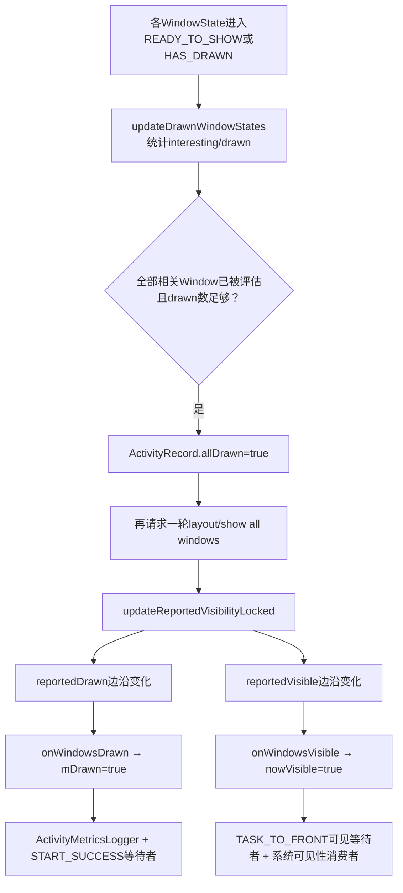
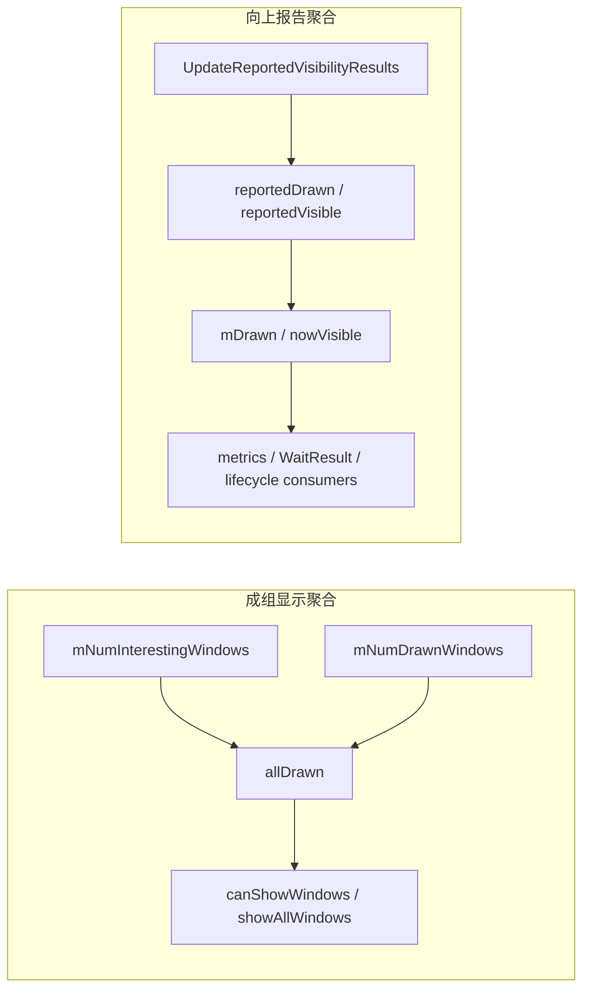
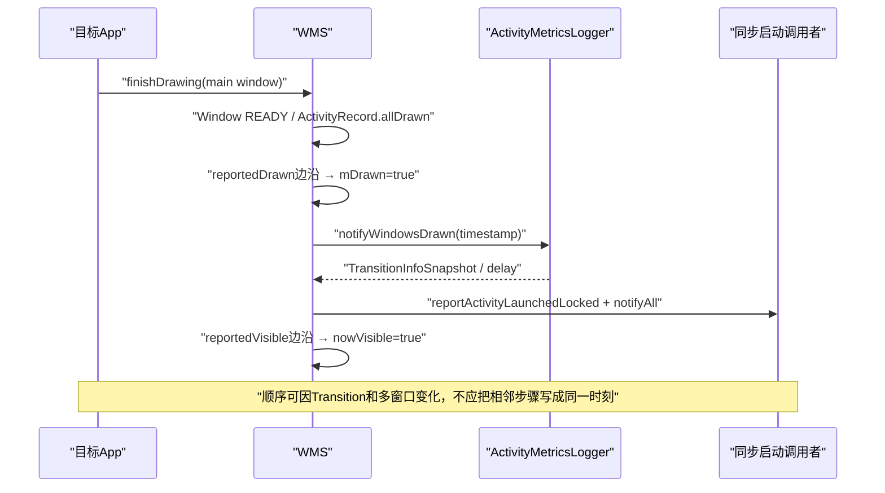

# 220 Android Activity allDrawn、reportedDrawn、nowVisible 与启动完成回调

> 源码版本：Android 11 / `android-11.0.0_r48`  
> 学习方式：macOS只读核对，不在当前Mac上实际编译AOSP  
> 前置章节：第 217、218、219 章

## 1. 本章为什么必须单独讲

上一章解决的是一个 `WindowState`如何从隐藏Surface走到 `HAS_DRAWN`。但Activity并不等于一个窗口，也不只有一个“可见”boolean。

r48的 `ActivityRecord`同时维护 `allDrawn`、`mDrawn`、`reportedDrawn`、`reportedVisible`、`nowVisible`、`mVisible`、`mVisibleRequested`等状态。它们名字相近，服务的消费者却完全不同。

## 2. 本章最终要回答的四个问题

1. WMS怎样判断Activity的一组重要窗口都已drawn？
2. 为什么 `allDrawn=true`后还要再走一轮布局？
3. `reportedDrawn`、`mDrawn`与 `nowVisible`分别是谁的账本？
4. `am start -W`一类同步等待究竟被哪个回调唤醒？

## 3. 先看总关系图



这不是严格单向流水线：visibility、transition、窗口增删和销毁会让其中一些状态重新变false。

## 4. 先把八个相近字段分组

```text
请求/容器显示：mVisibleRequested、mVisible
客户端可见：mClientVisible
成组显示门：allDrawn、mLastAllDrawn
向上报告去重：reportedDrawn、reportedVisible
对ATMS/度量暴露：mDrawn、nowVisible
```

阅读源码时先问“这是哪一组”，比背字段中文翻译更可靠。

## 5. mVisibleRequested表示期望

它表示系统当前希望这个Activity的Surface被保留或变为可见。

源码注释特意说它有时比真正visible更早：AppTransition尚未执行时，系统已经请求打开Activity，但容器Surface还在等待统一切换。

## 6. mVisible表示已提交的容器可见性

`ActivityRecord.isVisible()`在r48中直接返回私有字段 `mVisible`。

`setVisible()`改变它并schedule animation；Activity自身SurfaceControl在 `prepareSurfaces()`中依据它决定show/hide。

## 7. mClientVisible表示告诉App什么

即使系统正在准备AppTransition，也要先 `setClientVisible(true)`，让App窗口开始绘制。

否则WMS一边等opening app的窗口drawn，一边又让客户端保持不可见，双方会形成逻辑死等。

## 8. mVisibleRequested与mVisible为何会短暂不同

`setVisibility(true)`先写requested，并把Activity放入opening apps；若AppTransition已设置，会return，暂不 `commitVisibility(true)`。

Transition真正ready后，`AppTransitionController.handleOpeningApps()`才提交mVisible并show窗口。

## 9. nowVisible不是mVisible的别名

`nowVisible`由 `onWindowsVisible()`设置，前提是Activity统计范围内的窗口实际满足WMS visible条件。

容器已经 `mVisible=true`但子窗口还未drawn，`nowVisible`仍可为false。

## 10. mDrawn也不是allDrawn的别名

`mDrawn`在 `onWindowsDrawn(boolean)`中更新，主要供ActivityMetricsLogger、启动跟踪和可见性判断使用。

`allDrawn`则是控制Activity窗口何时可成组show的内部门，二者来源和生命周期不同。

## 11. reportedDrawn与reportedVisible是边沿记忆

`updateReportedVisibilityLocked()`每次重新统计窗口后，与上一次 `reportedDrawn/reportedVisible`比较。

只有boolean发生变化才调用 `onWindowsDrawn`、`onWindowsVisible`或 `onWindowsGone`，避免每次relayout都重复通知。

## 12. mLastAllDrawn同样是边沿记忆

`checkAppWindowsReadyToShow()`先比较：

```java
if (allDrawn == mLastAllDrawn) return;
mLastAllDrawn = allDrawn;
```

它用于只在Activity的allDrawn发生变化时执行show/unfreeze动作，不是另一个独立“更晚完成”状态。

## 13. 两套聚合不要混在一起



两套都遍历WindowState，却使用不同的筛选、历史保持与消费者。

## 14. allDrawn统计运行在什么阶段

`DisplayContent.applySurfaceChangesTransaction()`逐窗口调用 `ActivityRecord.updateDrawnWindowStates(w)`。

它发生在WMS SurfacePlacement里，和单窗 `commitFinishDrawingLocked()`处于同一轮统一窗口事务处理。

## 15. 每轮统计如何重置

ActivityRecord比较WMS的 `mTransactionSequence`：

```java
if (mLastTransactionSequence != mWmService.mTransactionSequence) {
    mNumDrawnWindows = 0;
    startingDisplayed = false;
    mNumInterestingWindows = findMainWindow(false) != null ? 1 : 0;
}
```

计数属于当前WMS transaction sequence，不能跨轮简单累加。

## 16. 主窗口为何先占一个interesting名额

只要找到不包含starting window的main window，interesting初值就是1。

遍历到主窗口时不会再次加一；这样base application window成为Activity完整画面的基本门槛。

## 17. 其他窗口何时增加interesting

窗口必须先 `mightAffectAllDrawn()`，再满足 `isInteresting()`。

如果它不是main window，Activity才递增 `mNumInterestingWindows`；这可把可见的附属应用窗口纳入成组显示等待。

## 18. mightAffectAllDrawn审查什么

窗口是on-screen或属于base/drawn application类型，同时不能正在exit animation，也不能destroying。

它先回答“这个WindowState是否可能影响Activity的allDrawn决策”。

## 19. isInteresting又审查什么

窗口必须属于Activity、App未死亡、没有处于应忽略的freezing状态，并且客户端View visibility为VISIBLE。

因此一个存在于层级中的GONE窗口不必阻挡allDrawn。

## 20. 为什么两层筛选不合并

`mightAffectAllDrawn()`还被 `allDrawnStatesConsidered()`用于判断所有相关child是否已经过本轮评估；`isInteresting()`用于实际计数。

一个窗口可能值得“被评估”，但因当前visibility或freezing不成为必须drawn的interesting目标。

## 21. 哪些draw state算已drawn

`WindowState.isDrawnLw()`接受 `READY_TO_SHOW`或 `HAS_DRAWN`，同时要求有Surface且未destroying。

所以Activity聚合并不要求每个窗口已经物理show；READY已经足以说明内容可参与整体放行。

## 22. COMMIT_DRAW_PENDING为何还不计drawn

此时App finishDrawing已到WMS，但统一SurfacePlacement尚未把单窗提交成READY。

若现在就增加drawn数，会破坏“所有窗口在同一系统事务阶段准备好”的边界。

## 23. starting window为何单独处理

若遍历窗口正是 `startingWindow`，它不进入真实Activity的interesting/drawn计数。

只要starting window `isDrawnLw()`，系统记录starting-window metric并设 `startingDisplayed=true`。

## 24. Splash显示为何不能完成allDrawn

Splash只是一张临时preview，真实Activity可能仍没有main window Buffer。

如果starting window也算interesting drawn，系统会过早移除启动等待、错误报告Displayed，并让真实窗口交接失去意义。

## 25. drawnStateEvaluated解决什么竞态

WindowState每次进入 `updateDrawnWindowStates()`先标记“本轮已评估”。

Activity不能只看数字相等，因为遍历早期可能尚有另一个child没有处理；数字暂时相等并不代表集合已经完整。

## 26. allDrawnStatesConsidered怎样兜底

它遍历所有child：只要某窗口might affect all drawn但还未设置evaluated，就返回false。

这相当于集合完整性检查，避免用半轮统计提前做allDrawn决策。

## 27. updateAllDrawn的完整条件

```java
numInteresting > 0
        && allDrawnStatesConsidered()
        && mNumDrawnWindows >= numInteresting
        && !isRelaunching()
```

四项全部满足才把 `allDrawn=true`。

## 28. 为什么必须numInteresting大于0

没有任何真实interesting窗口时，`0 >= 0`在数学上为真，但不能据此宣称Activity已经画完。

源码用显式大于0挡住这种空集合误判。

## 29. 为什么使用大于等于而非严格相等

计数可能受窗口层级和本轮遍历时机影响；决策只需确保已drawn数量覆盖所有interesting目标。

真正的安全性还由完整评估和筛选条件共同保证，不依赖一个脆弱的严格等式。

## 30. relaunching为何阻止allDrawn

Activity配置重建期间，旧窗口与新窗口可能短暂交叠，当前计数不能代表新实例的完整视觉结果。

等relaunch结束后再确认，避免把旧Surface当作新Activity已经完成。

## 31. allDrawn变true后为何setLayoutNeeded

前一轮可能已有窗口停在 `READY_TO_SHOW`，因为当时 `activity.canShowWindows()`看见allDrawn仍为false。

设置layout needed强制下一轮再次调用 `commitFinishDrawingLocked()`，这时窗口才可进入 `performShowLocked()`。

## 32. NOTIFY_ACTIVITY_DRAWN消息是什么

allDrawn变true后WMS Handler还收到 `H.NOTIFY_ACTIVITY_DRAWN`。

WMS Handler把token转给 `ActivityTaskManagerService.notifyActivityDrawn()`；r48中它会进入Root Task的 `notifyActivityDrawnLocked()`，用于例如半透明Activity转换时等待下层Activity重绘完成。它不是App的 `Activity.reportFullyDrawn()`，也不是SF present回调。

## 33. checkAppWindowsReadyToShow何时运行

WindowContainer/SurfacePlacement流程观察 `allDrawn`与 `mLastAllDrawn`变化后调用该方法。

它将“计数已经足够”转为“停止冻结或允许整组窗口show”的动作。

## 34. 冻屏场景怎样处理

若Activity正 `mFreezingScreen`，系统调用 `showAllWindowsLocked()`、停止freezing并触发布局变化。

旋转时旧画面不能永远冻结；但解除必须等待新几何下的重要窗口drawn。

## 35. 普通场景怎样处理

系统设置 `FINISH_LAYOUT_REDO_ANIM`。

如果Activity不在opening apps且 `canShowWindows()`为true，就立即show all；若在opening apps，则由AppTransition统一放行。

## 36. canShowWindows并不只等于allDrawn

r48还检查父级Transition动画中是否存在非默认color-mode窗口。

广色域显示配置的中途变化可能导致jank，因此即使allDrawn也可短暂延迟show。

## 37. AppTransition ready怎样消费allDrawn

opening app满足transition ready条件后，`handleOpeningApps()`依次：

1. `commitVisibility(true, false)`；
2. `updateReportedVisibilityLocked()`；
3. 清 `waitingToShow`；
4. 在Surface transaction中 `showAllWindowsLocked()`。

## 38. 为什么Transition前先让客户端可见

`setVisibility(true)`在等待Transition时已经 `setClientVisible(true)`。

客户端可以构建和绘制窗口，容器mVisible及最终Surface show则留到过渡统一时机，这正是请求、生产、展示三阶段分离。

## 39. closing app为何强制allDrawn=true

`handleClosingApps()`明确写 `app.allDrawn = true`，目的是让关闭动画不被“窗口还没画完”阻塞。

这个赋值服务于退出动画调度，不能当成应用真的完成了一次新绘制的性能证据。

## 40. allDrawn何时被清除

常见入口包括：Activity重新变为visible时需要新一轮窗口、WindowStateAnimator reset draw state、窗口移除、旋转/resize和某些relaunch路径。

因此它是可重复代际状态，不是ActivityRecord一生只从false变true一次。

## 41. 显示请求如何重置旧draw state

Activity从隐藏变可见且客户端此前也隐藏时，会遍历已有 `HAS_DRAWN`窗口调用 `resetDrawState()`，并重置content insets提示。

这样WMS保证收到新的reportDrawn，而不是看到旧Surface就立即移除starting window。

## 42. transferred starting window为何会复制allDrawn

启动窗口跨ActivityRecord转移时，源码可把旧record的allDrawn、firstWindowDrawn、reportedVisible等状态带到新record。

这是一次显式的交接优化，不代表这些字段在普通Activity间共享。

## 43. transfer状态要按源码逐项看

transfer复制 `reportedVisible`，但并没有简单地把所有draw/visibility字段完全克隆。

这提醒我们：不能因为两个字段通常相关，就假设迁移、relaunch或token替换时必然同步变化。

## 44. 第二套聚合从updateReportedVisibilityLocked开始

它先reset一个复用的 `UpdateReportedVisibilityResults`，再让每个WindowState递归贡献：

```text
numInteresting / numDrawn / numVisible / nowGone
```

这是Activity对上层报告状态的重新计算。

## 45. UpdateReportedVisibilityResults为何复用对象

窗口布局和动画期间该统计会频繁执行，复用对象减少system_server热路径临时分配。

`reset()`必须同时清三个计数并把 `nowGone=true`恢复为保守初始值。

## 46. reported统计会跳过哪些窗口

WindowState遇到以下情况直接不贡献自身：

- app freezing；
-客户端View不是VISIBLE；
- `TYPE_APPLICATION_STARTING`；
- destroying。

但它会先递归统计child窗口。

## 47. reported的interesting含义更直接

通过上述过滤的WindowState直接 `numInteresting++`。

它不像allDrawn那套先以main window占基线、再判断 `mightAffectAllDrawn/isInteresting`；两套数字不能互相对照推断。

## 48. reported的drawn怎样判断

仍调用 `isDrawnLw()`，即READY_TO_SHOW或HAS_DRAWN，并要求Surface有效且未destroying。

如果drawn，`numDrawn++`并把 `nowGone=false`。

## 49. reported的visible为何排除动画中窗口

只有drawn且不处于Transition/父级动画时才 `numVisible++`。

动画中窗口可能仍在屏幕上，但系统暂缓把最终稳定visible边沿报告给Activity级消费者。

## 50. nowGone并不等于mVisibleRequested=false

如果窗口虽未drawn但正在Transition动画，统计仍把 `nowGone=false`。

它表达“窗口集合是否已经真正消失、允许报告状态回退”，不是单纯复制请求可见性。

## 51. Activity级nowDrawn公式

```java
boolean nowDrawn = numInteresting > 0
        && numDrawn >= numInteresting;
```

这一次的interesting来自reported统计，不是allDrawn的 `mNumInterestingWindows`。

## 52. Activity级nowVisible公式

```java
boolean nowVisible = numInteresting > 0
        && numVisible >= numInteresting
        && isVisible();
```

窗口全部稳定visible还不够，Activity容器自身 `mVisible`也必须已经提交为true。

## 53. 为什么drawn不额外要求Activity isVisible

drawn回答“内容是否完成”，窗口在Transition等待或容器尚未最终show时也可以成立。

visible则必须把容器状态纳入，二者有意允许不同步。

## 54. 历史保持规则是最容易漏掉的一段

```java
if (!nowGone) {
    if (!nowDrawn) nowDrawn = reportedDrawn;
    if (!nowVisible) nowVisible = reportedVisible;
}
```

只要Activity尚未真正gone，统计不会因为一轮临时窗口变化轻易把已报告drawn/visible翻回false。

## 55. 为什么需要这种sticky语义

动画、窗口替换、短暂层级调整可能让某一轮即时计数下降。

若每次都向上报告visible→invisible→visible，ATMS等待者、GC调度和启动度量会收到抖动的生命周期信号。

## 56. 何时允许reported状态变false

只有 `nowGone=true`时不再沿用旧 `reportedDrawn/reportedVisible`。

窗口确实消失或销毁后，统计可触发 `onWindowsDrawn(false)`与 `onWindowsGone()`，为下一次可见代际清账。

## 57. reportedDrawn变化时做什么

```java
if (nowDrawn != reportedDrawn) {
    onWindowsDrawn(nowDrawn, elapsedRealtimeNanos());
    reportedDrawn = nowDrawn;
}
```

时间戳在状态边沿处取 `elapsedRealtimeNanos()`，供启动度量计算相对delay。

## 58. reportedVisible变化时做什么

这条分支先把 `reportedVisible`写成新值，再在true边沿调用 `onWindowsVisible()`、false边沿调用 `onWindowsGone()`。

这层字段是“上一次已处理边沿”，而 `nowVisible`是onWindowsVisible/onWindowsGone最终写给ActivityRecord的状态。

## 59. onWindowsDrawn先更新mDrawn

无论drawn参数真假，第一行都是：

```java
mDrawn = drawn;
```

若为false立即return；只有true边沿才进入启动度量和等待者完成逻辑。

## 60. mDrawn=false为何不向Metrics报告一次结束

一次启动完成事件只关心首次窗口绘制成功；之后窗口gone不是另一个app-start完成事件。

后续重新启动若需跟踪，会建立新的TransitionInfo和pending draw集合。

## 61. onWindowsVisible怎样更新nowVisible

它先尝试停止TASK_TO_FRONT可见等待，然后仅在 `!nowVisible`时：

```java
nowVisible = true;
lastVisibleTime = uptimeMillis();
scheduleAppGcsLocked();
```

重复visible统计不会不断刷新lastVisibleTime。

## 62. onWindowsGone怎样更新nowVisible

它简单地把 `nowVisible=false`，并打印相应调试信息。

nowVisible因此参与Activity是否真正可见、停止旧Activity和等待task-to-front等更高层决策。

## 63. nowVisible为何与RESUMED分开

生命周期RESUMED说明服务端/客户端生命周期调度进度；nowVisible说明WMS窗口聚合已达到可见边沿。

Activity可以先RESUMED后窗口可见，也可能在转场中窗口仍可见但生命周期正在PAUSING。

## 64. completeResumeLocked如何使用nowVisible

Activity完成服务端resume收尾时，如果 `nowVisible`已经为true，会立即停止等待可见。

这处理“窗口比某条等待注册/生命周期收尾更早完成”的竞态，避免漏唤醒。

## 65. RootWindowContainer如何使用nowVisible

`allResumedActivitiesVisible()`遍历所有display/task display area/stack的resumed Activity。

只要任意resumed Activity的nowVisible为false就返回false；这影响前一个Activity何时可以继续stop/finish处理。

## 66. nowVisible仍不是物理面板证据

它来自WMS窗口drawn、动画和容器visible统计。

没有读取SurfaceFlinger present fence，更不知道显示面板扫描到第几行，因此不能作为精确“用户已看到像素”的硬件时间点。

## 67. ActivityMetricsLogger还有自己的allDrawn

`TransitionInfo.allDrawn()`只是：

```java
mPendingDrawActivities.isEmpty()
```

它与 `ActivityRecord.allDrawn`同名但完全不是同一字段：前者聚合一次启动序列中的ActivityRecord，后者聚合一个Activity里的WindowState。

## 68. 同名allDrawn的三层语义

```text
WindowState级：isDrawnLw，单窗口READY/HAS_DRAWN
ActivityRecord.allDrawn：同一Activity的重要Window集合
TransitionInfo.allDrawn()：同一launch sequence待绘制Activity集合为空
```

源码阅读必须带上拥有者类型。

## 69. Metrics为何可能等多个Activity

连续trampoline启动可被合并为同一个TransitionInfo。

每次 `setLatestLaunchedActivity()`遇到尚未mDrawn、非noDisplay Activity，就把它加入 `mPendingDrawActivities`。

## 70. noDisplay Activity为何不进入pending draw

它按定义没有需等待的窗口；若加入集合，永远收不到真实windows drawn回调。

系统必须将“参与启动控制流”和“会产生显示窗口”分开。

## 71. 已经mDrawn的Activity为何不重复加入

热启动时目标可能已有完整窗口。

Metrics不应把旧已drawn Activity重新当成必须等待的新首帧；如果启动时它已drawn且visible，跟踪甚至会直接abort为不可测。

## 72. notifyWindowsDrawn如何更新启动账本

它找到Active TransitionInfo，计算从launch start到传入timestamp的delay，移除当前Activity的pending项，并生成snapshot。

返回snapshot让ActivityRecord即使不是整条transition最后一个Activity，也能拿到自己的drawn delay。

## 73. Metrics transition何时真正done

需要同时满足：

1. AppTransition已经 `notifyTransitionStarting()`；
2. `mPendingDrawActivities`已经为空。

两个事件谁先来都可以：后到的一方负责调用 `done()`。

## 74. 为什么transition start和windows drawn是双门

窗口可能极快drawn，早于动画正式开始；也可能动画已经开始，窗口很晚才drawn。

只有两边都到齐，日志才能同时拥有transition reason/start delay和最终windows drawn delay。

## 75. starting window metric是旁路时间点

`notifyStartingWindowDrawn()`只记录第一次starting window delay，不从pending real activity集合移除项目。

Splash出现可改善感知等待，却不能替代真实Activity windows drawn。

## 76. mDrawn如何参与Metrics启动建账

`TransitionInfo.setLatestLaunchedActivity()`只对 `!r.mDrawn`的显示型Activity加pending。

`notifyActivityLaunched()`若发现Activity已经 `mDrawn && isVisible()`，认为无法测得此次windows drawn delay并abort跟踪。

## 77. Activity变不可见时Metrics如何避免永等

`notifyVisibilityChanged()`发现Activity不再visible requested或finishing，会从pending draw集合移除它。

若最新launched Activity所在Task中也没有任何仍应draw的Activity，异步 `checkVisibility()`会cancel并abort这次transition。

## 78. 为什么checkVisibility异步再持锁检查

visibility变化与Activity/Task层级可能继续改变，不能只用通知瞬间的半成品状态作最终取消决定。

Handler稍后在全局锁内重新取Active Transition和Task中待draw Activity，降低竞态误判。

## 79. reportFullyDrawn与reportedDrawn不是一回事

`reportedDrawn`是WMS内部窗口统计边沿；`Activity.reportFullyDrawn()`是App主动声明业务可用状态。

前者自动发生，后者需要应用选择合适时机调用，通常晚于首窗口drawn。

## 80. reportFullyDrawn过早时怎样处理

如果Metrics的pending Activity集合还未清空，系统保存 `mPendingFullyDrawn` Runnable并暂不记fully-drawn。

等windows drawn与transition完成后再执行，避免fully drawn时间早于首窗口完成。

## 81. 过早fully-drawn最终采用哪个时间

r48发现存在pending fully drawn时，最终使用 `mWindowsDrawnDelayMs`作为startupTime。

这是防早报下界，并不证明业务真实可用恰好发生在windows drawn时刻。

## 82. 启动同步等待有两张表

`ActivityStackSupervisor`维护：

- `mWaitingActivityLaunched`：通常等待START_SUCCESS新启动的windows drawn；
- `mWaitingForActivityVisible`：TASK_TO_FRONT场景按Component等待目标可见/drawn。

两者不要混成一个“am start等待列表”。

## 83. START_SUCCESS怎样等待

`ActivityStarter.waitForResult()`把WaitResult加入 `mWaitingActivityLaunched`，随后在ATMS global lock上wait。

循环直到结果变TASK_TO_FRONT、timeout或 `who != null`。

## 84. onWindowsDrawn怎样唤醒START_SUCCESS

ActivityRecord拿到有效TransitionInfoSnapshot，或自己仍是display area的top running Activity时，调用：

```java
reportActivityLaunchedLocked(false, this,
        windowsDrawnDelayMs, launchState);
```

Supervisor填WaitResult并 `notifyAll()`。

## 85. 为什么允许top running但metrics info无效

Activity可能因中间visibility变化没有有效metrics snapshot，但同步调用者仍在等待目标启动结果。

如果它仍是当前top running，系统用INVALID_DELAY等降级信息唤醒，避免等待者永久挂住。

## 86. reportActivityLaunchedLocked填哪些字段

它为尚无who的WaitResult写：

- `timeout`；
- 实际Activity component；
- `totalTime`；
- cold/warm/hot `launchState`。

它特意不修改原始 `result`。

## 87. START_DELIVERED_TO_TOP为何不等draw

Intent只投给已经top的Activity，不会有新的launch/window drawn信号。

所以WaitResult立即写component、`totalTime=0`并返回。

## 88. START_TASK_TO_FRONT为何先检查nowVisible

如果目标Activity已经 `nowVisible && RESUMED`，bring-to-front无需再等，totalTime为0。

否则注册component级 `waitActivityVisible()`，等待后续drawn或visible边沿。

## 89. TASK_TO_FRONT等待为何drawn和visible都能停止

`onWindowsDrawn(true)`在有效Metrics或当前仍为top-running的完成分支中，会调用带windows-drawn delay的 `stopWaitingForActivityVisible()`；`onWindowsVisible()`也会调用默认版本。

谁先满足相应路径谁就填WaitResult并notifyAll，避免对转场/可见统计顺序作单一假设。

## 90. component匹配意味着什么

`WaitInfo.matches()`按目标Component匹配等待项。

这张表不是简单FIFO取第一项；同一组件的多个等待可在一次状态变化中一起完成。

## 91. cleanup时为何用INVALID_DELAY停止等待

Activity被清理时，真实可见完成已经不可能发生。

Supervisor仍移除匹配等待项、填component和INVALID_DELAY并唤醒，保证同步API有终止路径。

## 92. idle timeout又是一条逃生路径

Activity长时间不报告idle时，`activityIdleInternal(... fromTimeout=true)`会调用 `reportActivityLaunchedLocked()`，使用INVALID_DELAY与未知launch state结束等待。

这不是把idle当drawn，而是防止启动同步等待和launch wakelock无限拖住。

## 93. 等待完成仍不等于硬件显示

WaitResult由WMS/ATMS窗口drawn或visible账本完成。

它没有等待SurfaceFlinger present fence signal，因此适合Framework启动延迟，不适合精确光子到屏幕测量。

## 94. 一次冷启动的四级完成



## 95. 为什么mDrawn可能先于nowVisible

READY_TO_SHOW已经满足isDrawnLw，但窗口可能仍在opening transition或动画中，不计stable visible。

因此启动windows-drawn metric可先完成，nowVisible稍后在动画/容器可见条件满足时变true。

## 96. nowVisible能否先于mDrawn

按reported统计公式，numVisible只在窗口isDrawnLw时增加，所以一次正常false→true边沿中visible建立以drawn为前提。

但历史sticky、状态transfer和不同调用轮次会使观察日志不宜仅凭打印顺序推导所有内部写入顺序。

## 97. reportedDrawn为何可能在READY_TO_SHOW时为true

因为 `isDrawnLw()`接受READY。

WMS认为内容已完整、可以参与整体显示，即可结束drawn统计；SurfaceControl show和HWC present属于后续显示层。

## 98. 常见误解一：allDrawn表示屏幕所有窗口

不对。它只属于某个ActivityRecord，并只统计满足筛选条件的WindowState。

状态栏、导航栏、其他Activity、wallpaper、IME和别的Display都不是这一个boolean的“全部”。

## 99. 常见误解二：allDrawn与Metrics allDrawn相同

不对。一个聚合WindowState，一个聚合launch sequence里的ActivityRecord。

同名方法必须写出拥有者：`ActivityRecord.allDrawn`与 `TransitionInfo.allDrawn()`。

## 100. 常见误解三：nowVisible就是onResume完成

不对。RESUMED是Activity生命周期状态，nowVisible是WMS窗口聚合状态。

二者相互协作但由不同回调和条件推进。

## 101. 常见误解四：reportedVisible是客户端收到的visibility

不完全对。它是ActivityRecord内部“上一次窗口聚合visible结果”的记忆，用来决定是否触发onWindowsVisible/Gone。

客户端visibility由 `mClientVisible`和 `dispatchAppVisibility()`另一条链处理。

## 102. 常见误解五：startingDisplayed可以完成Displayed日志

不对。它可让AppTransition认为opening app已有preview并开始，但reported visibility明确排除starting window。

真实windows drawn仍等待非starting窗口。

## 103. 常见误解六：closing app的allDrawn=true证明它刚绘制

不对。AppTransitionController会为关闭动画强制设置allDrawn，纯属控制流放行。

性能诊断必须查看WindowState draw state和实际windows-drawn metric，而非孤立读boolean。

## 104. 故障推理：Window已HAS_DRAWN但Activity allDrawn仍false

检查是否还有另一个interesting窗口、是否所有child都被本轮评估、Activity是否isRelaunching，以及计数是否在新的transaction sequence重置。

不要只盯main window；Dialog/附属窗口可能进入聚合集合。

## 105. 故障推理：allDrawn=true但nowVisible=false

检查Activity容器mVisible是否已commit、是否仍在opening apps/waitingToShow、窗口是否处于Transition动画、policy/parent visibility，以及reported visible统计是否尚未再次运行。

这是“内容准备好但展示边沿未完成”的典型分层状态。

## 106. 故障推理：mDrawn=true但同步启动仍未返回

检查WaitResult属于 `mWaitingActivityLaunched`还是component级visible表，TransitionInfo是否有效、目标Activity是否仍top running、who是否已被其他start result路径填写，以及global lock等待条件。

还要防止把另一个ActivityRecord的mDrawn误认成当前等待目标。

## 107. 故障推理：starting window出现但Displayed很慢

startingDisplayed只说明preview已drawn。

继续检查真实main window的finishDrawing、Activity allDrawn、reportedDrawn、Metrics pending draw集合；白屏持续时间常由这段真实窗口链决定。

## 108. 故障推理：reportedVisible反复抖动

正常动画期间sticky逻辑应抑制临时下降。

若日志确实反复true/false，检查窗口是否真正gone、Activity/token是否重建或transfer、容器visibility是否反复commit，以及是否混看了不同ActivityRecord实例。

## 109. macOS只读练习一：画两套聚合表

```bash
cd /Users/ninebot/androidSource
sed -n '5434,5570p' \
  frameworks/base/services/core/java/com/android/server/wm/ActivityRecord.java
```

把 `updateReportedVisibilityLocked()`与 `updateDrawnWindowStates()`使用的筛选、计数、输出各写成一张表。

## 110. macOS只读练习二：核对allDrawn完整条件

```bash
cd /Users/ninebot/androidSource
sed -n '3915,3975p' \
  frameworks/base/services/core/java/com/android/server/wm/ActivityRecord.java
```

解释numInteresting>0、all children considered、drawn覆盖和not relaunching缺一项分别会造成什么误判。

## 111. macOS只读练习三：追WaitResult唤醒

```bash
cd /Users/ninebot/androidSource
rg -n 'mWaitingActivityLaunched|waitActivityVisible|stopWaitingForActivityVisible|reportActivityLaunchedLocked' \
  frameworks/base/services/core/java/com/android/server/wm/ActivityStarter.java \
  frameworks/base/services/core/java/com/android/server/wm/ActivityStackSupervisor.java
```

分别画START_SUCCESS、DELIVERED_TO_TOP、TASK_TO_FRONT的wait/notify条件。

## 112. macOS只读练习四：区分两个allDrawn

```bash
cd /Users/ninebot/androidSource
rg -n 'boolean allDrawn|void updateAllDrawn|mPendingDrawActivities' \
  frameworks/base/services/core/java/com/android/server/wm/ActivityRecord.java \
  frameworks/base/services/core/java/com/android/server/wm/ActivityMetricsLogger.java
```

为每一个结果写出集合元素类型：WindowState还是ActivityRecord。

## 113. 源码导航

```text
frameworks/base/services/core/java/com/android/server/wm/WindowState.java
frameworks/base/services/core/java/com/android/server/wm/WindowStateAnimator.java
frameworks/base/services/core/java/com/android/server/wm/DisplayContent.java
frameworks/base/services/core/java/com/android/server/wm/ActivityRecord.java
frameworks/base/services/core/java/com/android/server/wm/AppTransitionController.java
frameworks/base/services/core/java/com/android/server/wm/ActivityMetricsLogger.java
frameworks/base/services/core/java/com/android/server/wm/ActivityStarter.java
frameworks/base/services/core/java/com/android/server/wm/ActivityStackSupervisor.java
frameworks/base/services/core/java/com/android/server/wm/RootWindowContainer.java
frameworks/base/core/java/android/app/WaitResult.java
```

## 114. 复读修订一：不把nowVisible说成真实像素present

初稿若把“windows visible”直译为用户已经看到，会越过WMS到SF/HWC之间的剩余流水线。

修订后只称其为WMS Activity级窗口可见边沿；需要光子到屏幕证据时仍应使用显示侧trace/fence或外部测量。

## 115. 复读修订二：不把两套interesting窗口数混用

allDrawn统计以main window预占基线并使用mightAffect/isInteresting；reported visibility统计通过另一组排除条件后直接计数。

两处变量都叫interesting，不代表数量在同一轮必然相等。

## 116. 复读修订三：mDrawn并非永久true

窗口真正gone后，reportedDrawn可产生false边沿，`onWindowsDrawn(false)`会把mDrawn清回false。

它只是Activity当前窗口绘制聚合状态，也为后续启动代际提供正确输入。

## 117. 复读修订四：WaitResult完成存在降级路径

最理想路径使用ActivityMetricsLogger的windows-drawn delay和launch state；但metrics无效、Activity清理或idle timeout时可用INVALID_DELAY结束等待。

同步命令返回证明Framework等待协议终止，不自动证明采样字段全部有效。

## 118. 本章最终心智模型

把Activity显示过程记成四本账：

1. requested账：系统想不想显示，客户端是否开始生产；
2. group-ready账：同一Activity的重要窗口是否全部READY；
3. reported账：窗口集合的drawn/visible边沿是否已经向上处理；
4. launch账：一次启动序列里的所有Activity是否完成，哪些同步等待者可以被唤醒。

同一个“完成”一词必须附带账本名称。

## 119. 本章结论与下一章

`ActivityRecord.allDrawn`负责把多个WindowState聚合成可成组show的门；`reportedDrawn/reportedVisible`负责去重和稳定窗口统计边沿；`mDrawn/nowVisible`则把结果交给启动度量、同步WaitResult与系统生命周期决策。它们都发生在WMS/ATMS语义层，不能越级等同于SurfaceFlinger或显示硬件完成。

下一章进入第221章“Android AppTransitionController opening/closing apps与转场启动条件”，继续追allDrawn、startingDisplayed、startingMoved如何共同决定旧版AppTransition何时ready、如何选动画目标和提交可见性。
