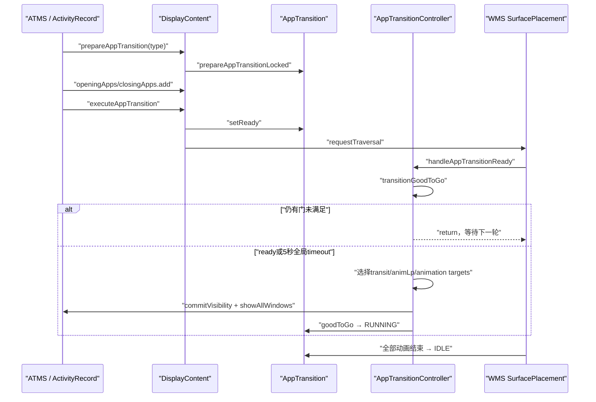
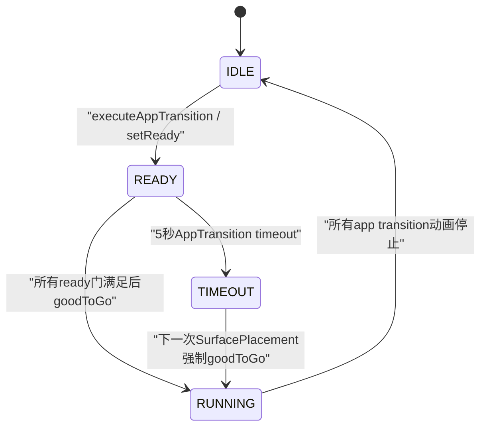
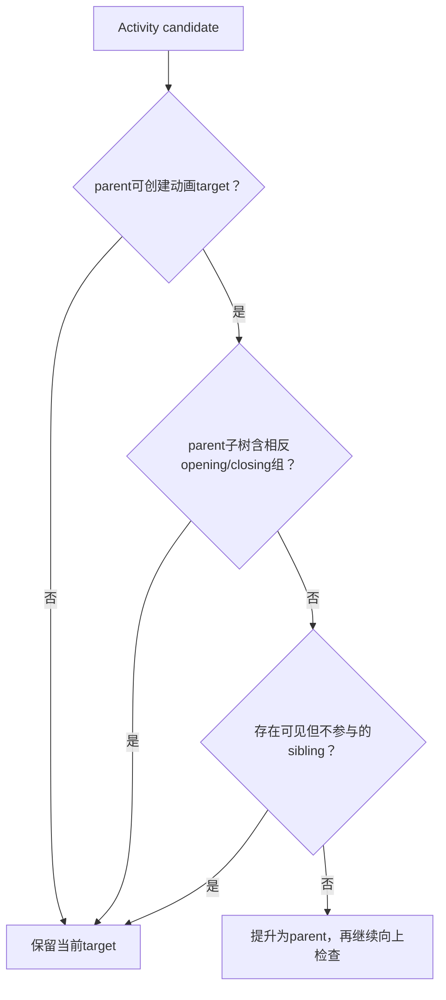

# 221 Android AppTransitionController opening/closing apps 与转场启动条件

> 源码版本：Android 11 / `android-11.0.0_r48`  
> 学习方式：macOS只读核源，不在当前Mac上编译或运行AOSP  
> 前置章节：第 218、219、220 章

## 1. 本章要解决什么问题

Activity已经resume、Starting Window已经显示或真实窗口已经allDrawn，为什么新页面有时仍不立刻切换？

答案位于Android 11旧版AppTransition管线：系统需要把opening、closing和changing对象作为一组，等待多个门都满足，再统一选择transit、动画目标、可见性和Surface事务。

## 2. 先给出全链路

```text
prepareAppTransition(transit)
  → 记录下一种transition并进入IDLE/pending
setVisibility()
  → ActivityRecord加入openingApps或closingApps
executeAppTransition()
  → AppTransition进入READY并请求WMS traversal
SurfacePlacement
  → transitionGoodToGo检查draw/preview/rotation/spec/unknown visibility/wallpaper
handleAppTransitionReady
  → 修正transit、选动画主题、提升动画target
  → applyAnimations
  → commit closing/opening visibility并show windows
  → AppTransition.goodToGo进入RUNNING
动画全部结束
  → handleAnimatingStoppedAndTransition进入IDLE并收尾
```

## 3. 总时序图



## 4. 这是Android 11的旧版转场模型

本章基于r48的 `AppTransition`、`AppTransitionController`和opening/closing集合。

不要把Android 12以后Shell Transitions、TransitionInfo、TransitionPlayer等新架构倒灌进来；名字相似，控制中心和同步模型已不同。

## 5. 主要类的职责

```text
AppTransition：记录transit、状态、override动画信息、timeout和listener
DisplayContent：每个Display持有AppTransition及三组参与集合
AppTransitionController：检查ready、改写transit、选target并提交可见性
ActivityRecord：把自己加入opening/closing，维护draw/starting/visible状态
RootWindowContainer：在SurfacePlacement中逐Display触发ready检查
```

## 6. 三个参与集合

每个 `DisplayContent`有：

```java
final ArraySet<ActivityRecord> mOpeningApps;
final ArraySet<ActivityRecord> mClosingApps;
final ArraySet<WindowContainer> mChangingContainers;
```

opening/closing以ActivityRecord为元素；changing可直接是Task等更高层WindowContainer。

## 7. openingApps表达什么

Activity已被请求变为可见，但在AppTransition存在时，最终 `commitVisibility(true)`被推迟。

集合既是ready检查输入，也是动画source与最终可见性提交清单。

## 8. closingApps表达什么

Activity被请求隐藏，但退出可见性和动画需要与opening对象配对提交。

旧Activity在这段时间仍可能保留Surface，避免新Activity尚未准备好时先露出背景空洞。

## 9. changingContainers表达什么

它处理窗口层级保持可见但边界或windowing mode变化的transition，例如Task改变窗口模式。

changing对象不适合简单归类为opening或closing，所以有独立集合和动画路径。

## 10. 集合不是历史日志

三组集合只描述当前待执行transition，`handleAppTransitionReady()`成功后会统一clear。

若看到空集合，可能是尚未加入、已经执行完成或被清理，不能仅凭空集合断言从未发生转场。

## 11. prepare与execute是两个动作

`prepareAppTransition()`选择/合并“下一种transit”，安装timeout并通知pending。

`executeAppTransition()`才把状态设为READY、开始获取异步animation specs并请求Traversal。

## 12. AppTransition四态



`prepare()`在当前不RUNNING时将状态置IDLE；它不等于动画已经ready。

## 13. prepareAppTransitionLocked如何选transit

初次未设置时可直接写入；Keyguard和crashing transition有更高保护优先级。

后续请求可能根据 `alwaysKeepCurrent`、Task级优先于Activity级、open优先覆盖对应close等规则更新当前transit。

## 14. 为什么Task transition可覆盖Activity transition

连续trampoline Activity可能先产生Activity级开关，最终实际跨Task。

源码选择Task动画作为更能代表最终视觉层级的transition，减少重复或错误范围动画。

## 15. prepare会安装5秒timeout

只要transition仍set，`prepareAppTransitionLocked()`移除旧timeout并重新post `APP_TRANSITION_TIMEOUT_MS=5000`。

这是整条AppTransition的总逃生门，不是每个Activity各有5秒。

## 16. execute为何只请求Traversal

`DisplayContent.executeAppTransition()`：

```java
mAppTransition.setReady();
mWmService.mWindowPlacerLocked.requestTraversal();
```

它不直接在ATMS调用栈里执行动画，真正ready检查留给WMS统一SurfacePlacement。

## 17. RootWindowContainer何时检查

SurfacePlacement结束阶段逐Display处理；只有 `mAppTransition.isReady()`为true才调用：

```java
curDisplay.mAppTransitionController.handleAppTransitionReady();
```

TIMEOUT也被 `isReady()`视为ready。

## 18. handleAppTransitionReady首先清理由映射

`mTempTransitionReasons`每轮先clear，用于记录每个参与对象最终因真实windows drawn、Splash或Snapshot而ready。

后面ActivityMetricsLogger使用它为transition start标注原因。

## 19. opening和changing都要good-to-go

入口先检查：

```java
transitionGoodToGo(mOpeningApps, reasons)
transitionGoodToGo(mChangingContainers, reasons)
```

任意一组返回false，本轮整体return。

## 20. 为什么不检查closingApps是否drawn

closing Activity代表即将离开的旧内容，通常已有可展示Surface；即便自身未完成新一轮draw，也不能阻挡退出动画。

源码在真正处理closing时还会强制 `app.allDrawn=true`，明确把关闭动画放行与绘制完成分开。

## 21. 第一道门：旧旋转动画

未timeout时，如果默认Display的ScreenRotationAnimation仍在运行，并且当前Display rotation需要更新，transition延迟。

避免旧旋转动画中途启动App动画，随后又被新旋转打断。

## 22. 多Display代码的一个版本边界

r48这里取的是 `Display.DEFAULT_DISPLAY`的rotation animation，再结合当前Display `needsUpdate()`。

不能无证据地把它描述成“每个Display完全独立检查自己的旋转动画”；应按当前源码和实际产品行为分别验证。

## 23. 每个opening Activity的三选一ready条件

```java
final boolean allDrawn = activity.allDrawn
        && !activity.isRelaunching();
if (!allDrawn
        && !activity.startingDisplayed
        && !activity.startingMoved) {
    return false;
}
```

真实窗口、已显示preview、或已转移preview任一成立即可继续。

## 24. allDrawn为何还要排除relaunching

配置重建时旧窗口状态可能暂时满足allDrawn，但新Activity实例仍在重建。

转场若直接使用旧代际draw状态，会露出内容或尺寸不一致的窗口。

## 25. startingDisplayed的作用

Splash或TaskSnapshot已达到WMS drawn状态时，用户已有过渡内容，AppTransition可以先启动，不必等真实窗口。

这解释Starting Window不仅遮白屏，也参与启动transition的ready门。

## 26. startingMoved的作用

preview从一个ActivityRecord转移到另一个时，旧record会标记 `startingMoved=true`。

它告诉ready检查：preview所有权已交接，不应让原Activity继续阻挡整组转场。

## 27. startingMoved不代表当前Activity显示了一张preview

字段描述“starting window已经被移走”，不是“startingDisplayed”的同义词。

两者都可放行transition，但对应的窗口所有权和诊断意义相反。

## 28. ready reason怎样选择

真实allDrawn记录 `APP_TRANSITION_WINDOWS_DRAWN`。

否则根据 `mStartingData instanceof SplashScreenStartingData`记录SPLASH_SCREEN；非Splash分支统一记SNAPSHOT。这个二选一也覆盖startingMoved但当前StartingData为空的情况，所以reason是粗粒度放行分类，不是对当前窗口对象的完整类型证明。

## 29. reason映射不是draw完成证明

它说明transition为什么获准开始，用于启动度量和诊断。

Splash/Snapshot reason明确表示真实Activity窗口可能仍未完成。

## 30. 第二道门：异步AnimationSpecs

缩略图或多目标动画可通过future异步获取spec。

只要 `isFetchingAppTransitionsSpecs()`为true，ready检查return false，避免动画已开跑才收到起止矩形或缩略图。

## 31. setReady为何会触发fetch specs

`AppTransition.setReady()`不仅改状态，还调用 `fetchAppTransitionSpecsFromFuture()`。

异步结果回到WMS后清pending标志、安装spec并requestTraversal，再次尝试ready。

## 32. specs等待也受全局5秒timeout保护

若future永远不返回，AppTransition timeout把状态改为TIMEOUT并执行SurfacePlacement。

TIMEOUT路径会跳过普通good-to-go门，优先避免界面永久卡住。

## 33. 第三道门：unknown app visibility

锁屏上启动Activity时，首次relayout前还不知道它是否会设置show-when-locked等flag。

`UnknownAppVisibilityController`在状态未解析前阻止transition，避免先展示后又因Keyguard规则立刻隐藏产生闪烁。

## 34. unknown visibility三态

```text
WAITING_RESUME
  → WAITING_RELAYOUT
  → WAITING_VISIBILITY_UPDATE
  → 从unknown集合移除
```

resume、首次relayout和Keyguard flag可见性重算缺一不可。

## 35. unknown状态如何重新触发检查

最终visibility更新完成后，controller移除已解析Activity并直接 `performSurfacePlacement()`。

这让被挡住的AppTransition立即重新评估，而不是等一个无关窗口事件碰巧到来。

## 36. 第四道门：Wallpaper ready

只有wallpaper当前可见时才检查 `wallpaperTransitionReady()`。

若可见wallpaper尚未drawn，App transition先等wallpaper，避免目标App动画时背景突然补上。

## 37. Wallpaper有自己的500毫秒timeout

r48的 `WALLPAPER_DRAW_PENDING_TIMEOUT_DURATION`为500ms。

超时后wallpaper draw state变TIMEOUT，transition可继续；它与AppTransition的5秒总timeout是两层不同逃生门。

## 38. 为什么Wallpaper timeout更短

wallpaper是背景参与者，长时间阻挡前台App切换得不偿失。

源码注释直接表达：对Recents动画而言，看不到wallpaper也好过动画完全不开始。

## 39. 全局TIMEOUT怎样绕过所有普通门

`transitionGoodToGo()`外层结构是：未timeout才逐项检查；否则直接return true。

因此旋转、Activity draw、spec、unknown visibility与wallpaper门都会被5秒逃生路径绕过。

## 40. timeout表示继续，不表示条件已满足

TIMEOUT只防止系统永久等待。

被绕过的App可能仍未drawn，wallpaper仍为空或spec缺失；后续代码必须以降级方式继续，不能把timeout日志当成功证据。

## 41. ready通过后先确定原始transit

Controller读取 `appTransition.getAppTransition()`。

若Display设置 `mSkipAppTransitionAnimation`且不是Keyguard-going-away，transit改成UNSET，随后清skip flag。

## 42. skip animation不等于跳过可见性提交

transit为UNSET会让 `applyAnimations()`早退，但closing/opening的commitVisibility、show窗口、集合清理与layout仍继续。

“无动画”只去掉视觉插值，不取消状态转换。

## 43. ready后取消5秒timeout

Controller调用 `removeAppTransitionTimeoutCallbacks()`。

一旦开始执行，不应让旧timeout在RUNNING阶段突然把状态改成TIMEOUT或重复SurfacePlacement。

## 44. 为什么先clear opening app的animating flags

旧exit animation标志会影响WindowState visibility和wallpaper target选择。

源码在重算wallpaper与transit前清理opening/changing Activity的遗留动画状态，避免用旧可见性选错新动画。

## 45. Wallpaper target为何在选transit前调整

opening app可能带 `FLAG_SHOW_WALLPAPER`，清动画标志也可能改变旧target是否可见。

必须先 `adjustWallpaperWindowsForAppTransitionIfNeeded()`，再判断opening/closing是否为wallpaper target。

## 46. 原始transit还会被改写

ready不代表最终使用最初prepare的枚举值。

Controller会依次考虑translucent animation和wallpaper animation，把普通Activity/Task open-close转成更符合实际视觉关系的transit。

## 47. translucent open怎样识别

目标必须是Task或Activity transit；opening集合非空，并且尚未visible的opening Activity都不fillsParent；closing集合为空。

此时可改成 `TRANSIT_TRANSLUCENT_ACTIVITY_OPEN`。

## 48. translucent close怎样识别

closing集合非空且都不fillsParent，同时opening Activity已经visible。

系统使用translucent close动画，避免普通Task/Activity close对后方仍可见内容做不合适的整体动画。

## 49. change transit为何不改成translucent

源码直接排除change transition。

边界/窗口模式变化没有对应的translucent专用动画语义，强行套用可能破坏changing container的几何动画。

## 50. Wallpaper transit改写的主要情况

系统区分：

- opening/closing两边都有wallpaper：intra open/close；
- 从有wallpaper切到无wallpaper：wallpaper close；
- 从无wallpaper切入可见wallpaper target：wallpaper open；
- Keyguard going away且目标可当wallpaper target：专用Keyguard-on-wallpaper。

## 51. 哪些transit不做Wallpaper改写

`TRANSIT_NONE`、crashing close、dock-from-recents和change transit直接保留。

Keyguard transit也不会被随意降级为非Keyguard transit，避免破坏锁屏安全与策略假设。

## 52. 动画主题由哪个Activity决定

`findAnimLayoutParamsToken()`在opening、closing、changing三组里找一个Activity，其main window LayoutParams控制动画theme/style。

它不是固定取top opening，也不是简单取集合第一个。

## 53. animLp选择优先级

1. 最高层且为当前transit注册RemoteAnimationDefinition的Activity；
2. 最高层、fillsParent且有main window的Activity；
3. 最高层、有main window的Activity。

“最高”以WindowContainer `getPrefixOrderIndex()`比较真实层级顺序。

## 54. 为什么fullscreen优先非fullscreen

当多个Activity参与时，全屏窗口的theme通常更能代表整个转场背景和动画范围。

但RemoteAnimationDefinition优先于普通theme选择，因为它明确声明要接管对应transit/activity types。

## 55. activityTypes集合有什么用

Controller收集三组参与者的WindowConfiguration activity type，例如standard、home、recents、assistant。

RemoteAnimationDefinition用transit加activityTypes组合选择adapter，避免同一transit在Home与普通App间使用错误runner。

## 56. Remote Animation两级查找

先查动画目标container自己的definition；若无匹配，再查Display级 `mRemoteAnimationDefinition`。

crashing activity close明确禁止Remote Animation覆盖，系统崩溃关闭动画拥有更高优先级。

## 57. r48 voiceInteraction存在一处可疑重复

源码实际写成：

```java
containsVoiceInteraction(mOpeningApps)
        || containsVoiceInteraction(mOpeningApps)
```

第二项仍是openingApps，按上下文很可能本意是closingApps；本章忠实记录r48行为，不擅自把源码讲成已经检查两边。

## 58. 这处可疑重复的影响边界

若只有closing Activity属于voice interaction而opening不属于，当前表达式不会得到true。

这是静态源码审计结论；没有真机实验时不进一步宣称具体设备一定出现某种动画错误。

## 59. 动画target为何可能不是ActivityRecord

开启层级动画时，多个Activity可提升到共同Task或更高WindowContainer动画。

这样共享位移/缩放只需一条leash动画，也能让容器内相关窗口保持相对关系。

## 60. target提升算法先建立candidates

opening或closing集合中只有 `shouldApplyAnimation(visible)`为true的Activity进入候选队列。

已经处于目标visibility且无退出/替换特殊情况的Activity无需重复应用动画。

## 61. shouldApplyAnimation的三个条件

```text
当前isVisible与目标visible不同
或Activity隐藏但处于mIsExiting
或opening Activity存在waiting-for-replacement窗口
```

最后一项允许窗口替换即使容器可见性未变仍获得正确转场。

## 62. 何时不能提升到parent

parent为空或不能创建RemoteAnimationTarget时不能提升。

更关键的是：parent子树若包含另一组opening/closing对象，就不能把一边动画提升到会同时包住另一边的共同parent。

## 63. 为什么相反组ancestor会阻止提升

同一个Task内A关闭、B打开时，如果opening和closing都提升成整个Task，两条相反动画会争用同一容器。

系统保留Activity级target，分别处理进入和退出。

## 64. 可见sibling为何阻止提升

parent下若还有一个visible sibling不参与当前动画，提升到parent会把无关内容也一起移动或淡出。

典型例子是同Task打开半透明Activity，下面原Activity仍应保持不动。

## 65. 所有可见siblings都参与时可以提升

算法把同parent的candidate siblings一并收集；若没有不参与的visible sibling，也没有相反组冲突，就把parent重新放回candidate队列。

它会逐层重复，直到无法继续提升，再加入最终targets。

## 66. target提升图



## 67. 提升后如何通知每个Activity动画完成

动画实际挂在提升后的WindowContainer，SurfaceAnimator只会回调该target。

Controller额外收集所有作为其descendant的transitioning Activity，传给 `applyAnimation()`作为sources，保证每个Activity仍能收到对应收尾。

## 68. 为何先deferStartingAnimations

Controller在给opening、closing、changing逐个安装动画前调用 `SurfaceAnimationRunner.deferStartingAnimations()`。

所有动画都配置好后再continue，减少第一条已开跑、其他对象尚未装好造成的不同步。

## 69. applyAnimations何时直接不做

transit为UNSET，或opening与closing都为空时直接return。

changing containers有自己的 `handleChangingApps()`，不依赖这条opening/closing动画函数。

## 70. applyAnimations还通知Accessibility

动画安装后，若存在AccessibilityController，会通知对应Display发生App window transition。

无障碍放大、窗口事件等系统功能需要知道界面结构正在变化，但这也不代表动画已结束。

## 71. closing可见性提交顺序

`handleClosingApps()`对每个Activity：

1. `commitVisibility(false, false)`；
2. 更新reported visibility；
3. 强制allDrawn=true；
4. 安排移除尚未退出的starting window；
5. 需要时附加thumbnail-down动画。

## 72. closing为何先commit再更新reported

reported visible计算必须看到容器已经目标隐藏，才能产生正确gone/visible历史。

`performLayout=false`表示整组处理结束后再统一layout，不为每个Activity各跑一轮SurfacePlacement。

## 73. opening可见性提交顺序

`handleOpeningApps()`先 `commitVisibility(true, false)`，随后处理动画完成通知来源、更新reported visibility、清waitingToShow，并在Surface transaction里show all windows。

这一步将之前“客户端可绘制但容器等待Transition”的状态正式提交。

## 74. no-animation完成通知为何单独记录

有些opening Activity没有实际动画target或不是提升target的source，正常SurfaceAnimator结束回调不会覆盖它。

系统把token放进 `mNoAnimationNotifyOnTransitionFinished`，待整个transition结束时补发finished。

## 75. waitingToShow何时清除

opening处理完成可见性与reported统计后，明确设置 `app.waitingToShow=false`。

WindowState `isReadyForDisplay()`不再因“token waiting且transition set”阻挡窗口show。

## 76. showAllWindowsLocked做什么

它遍历Activity所有WindowState调用 `performShowLocked()`。

只有已到READY_TO_SHOW且满足policy/parent等条件的窗口才真正进入HAS_DRAWN和后续SurfaceControl show。

## 77. opening处理中的Surface transaction边界

每个Activity的showAllWindows被包在WMS open/closeSurfaceTransaction中。

它让同一Activity窗口show变化批量提交；更外层的animation defer则保证多目标动画启动协调。

## 78. changing container怎样处理

`handleChangingApps()`直接对每个WindowContainer调用 `applyAnimation(null, transit, true, false, null)`。

它不走opening/closing visibility切换，因为对象仍可见，只是几何/窗口模式发生change。

## 79. setLastAppTransition记录什么

Controller保存最终transit以及top opening、closing、changing Activity字符串，用于dump和诊断。

这里的top以prefix order选择，不应由ArraySet迭代顺序推断。

## 80. AppTransition.goodToGo是状态切换点

它清 `mNextAppTransition`与flags，把状态设为RUNNING，并通知AppTransition listeners启动时间、duration hint和状态栏动画时机。

若有RemoteAnimationController，也在这里 `goodToGo()`让远端runner正式开始。

## 81. goodToGo返回值是什么

返回所有listener要求的 `FINISH_LAYOUT_REDO_*` bit OR结果。

Controller最后把这些bit与强制REDO_LAYOUT/REDO_CONFIG并入Display pendingLayoutChanges，驱动后续一致性布局。

## 82. AppTransition callback何时触发

`postAnimationCallback()`发送pending callback，随后 `clear()`清custom/thumbnail/remote spec等“下一次动画”配置。

clear不把RUNNING改回IDLE；实际动画结束由另一条收尾路径处理。

## 83. clear与状态清理不要混淆

`AppTransition.clear()`清的是override资源、spec、remote controller和finished callback。

状态仍由 `goodToGo()`设RUNNING，直到 `handleAnimatingStoppedAndTransition()`调用setIdle。

## 84. Keyguard非App窗口动画

Keyguard-going-away可能额外启动wallpaper exit和非App窗口（状态栏、导航栏等）退出动画。

因此AppTransition不只影响Activity Surface；但非App窗口由policy和DisplayContent专门处理。

## 85. TaskSnapshotController为何在transition start被通知

opening/closing/animation状态都确定后，WMS调用 `onTransitionStarting(mDisplayContent)`。

Snapshot controller可据此处理待关闭Task的snapshot缓存/持久化时机，而不是随意在Activity pause瞬间截图。

## 86. 三组集合何时清空

animation与visibility已经安装、AppTransition goodToGo后，Controller清opening、closing、changing以及unknown visibility controller。

后续RUNNING阶段依赖已安装的SurfaceAnimator sources，不再把集合当实时动画目标表。

## 87. 清集合后为何还要setLayoutNeeded

Activity容器可见性、窗口show/hide、动画leash和wallpaper关系已改变。

统一再做layout可刷新frame、layers、Insets、focus和Surface状态。

## 88. IME target为何重新计算

opening/closing切换改变可接受输入的顶层窗口。

Controller在转场提交后以 `updateImeTarget=true`重算IME目标，避免软键盘仍跟随离开的Activity。

## 89. Metrics为什么在最后收到notifyTransitionStarting

此时mTempTransitionReasons已包含每个Activity以windows、Splash或Snapshot放行的原因，最终transit也已确定。

ActivityMetricsLogger可将“动画开始”和“窗口drawn”两门正确闭合；它不是handle入口一来就记transition starting。

## 90. 动画结束如何被检测

RootWindowContainer发现AppTransition状态RUNNING，但Display已没有App transitioning对象时，调用 `handleAnimatingStoppedAndTransition()`。

这不是固定delay计时器，而是根据SurfaceAnimator/transition sources实际是否仍在运行。

## 91. 结束后首先setIdle

DisplayContent把AppTransition状态从RUNNING改回IDLE。

下一次prepare才可正常建立新的pending transition；若仍RUNNING，`prepare()`会返回false。

## 92. no-animation token何时补finished

收尾遍历 `mNoAnimationNotifyOnTransitionFinished`，逐token通知listener，然后clear。

这与第74节的登记配套，保证没挂真实动画的Activity也获得统一完成语义。

## 93. 结束还会做哪些系统收尾

包括隐藏延迟wallpaper、递归 `onAppTransitionDone()`、重算IME target、请求layout，并让ActivityRecord处理动画finished、客户端visibility与停止/销毁调度。

所以“动画视觉结束”后仍有一轮系统状态收束。

## 94. Remote Animation失败会怎样

RemoteAnimationController有独立finish与timeout/cancel机制；Controller在goodToGo才让它启动。r48基础timeout为2秒，并按控制App的animator scale缩放。

runner启动RemoteException、Binder死亡、显式cancel或remote timeout都会进入animation-finished清理，释放被SurfaceAnimator捕获的finish callback；本章不把它展开成Shell Transition模型。

## 95. 常见误解一：executeAppTransition立即开始动画

不对。它只setReady并requestTraversal。

真实开始仍等待draw/preview、rotation、spec、unknown visibility和wallpaper等门。

## 96. 常见误解二：opening app必须等真实窗口

不对。`startingDisplayed`或 `startingMoved`也能放行。

Starting Window正是为了在真实首窗口较慢时让视觉转场先发生。

## 97. 常见误解三：closing app也必须allDrawn

不对。ready入口不检查closing集合，处理closing时还强制allDrawn=true。

它是退出动画对象，不是这次新内容生产的完成门。

## 98. 常见误解四：timeout表示动画条件全部成功

不对。5秒timeout绕过所有普通ready条件。

它只说明系统选择降级继续，现场仍需检查究竟是哪一门未完成。

## 99. 常见误解五：动画一定挂在Activity上

不对。层级动画可把所有参与siblings提升到Task或更高container。

诊断Surface leash时要同时检查animation sources和promoted target。

## 100. 常见误解六：transit在prepare后不会改变

不对。prepare阶段可被后续请求覆盖，ready阶段还可改成translucent或wallpaper transit，skip flag也可改成UNSET。

dump的last used transit比只看早期prepare日志更接近实际执行类型。

## 101. 故障推理：AppTransition一直READY

依次检查：

1. rotation animation + needsUpdate；
2. opening/changing Activity的allDrawn/startingDisplayed/startingMoved；
3. specs future；
4. unknown app visibility；
5. wallpaper drawn；
6. 5秒timeout是否被重置或尚未到。

## 102. 故障推理：真实窗口已allDrawn仍不开始

allDrawn只是Activity门之一。

检查isRelaunching、同组其他opening Activity、changing container对应Activity、spec future、Keyguard unknown visibility、wallpaper及旋转门。

## 103. 故障推理：动画带了不该动的页面

检查target promotion：是否存在本应阻止提升的visible sibling，Activity的isVisible或参与集合是否错误，另一组ancestor是否正确建立。

也要确认sHierarchicalAnimations设备配置与最终animation target层级。

## 104. 故障推理：动画theme不对

检查animLpActivity选择优先级、prefix order、fillsParent、main window是否存在，以及RemoteAnimationDefinition是否匹配transit+activityTypes。

不要默认使用新Activity的windowAnimationStyle。

## 105. 故障推理：锁屏启动闪一下又消失

检查UnknownAppVisibilityController是否按resume→relayout→visibility update完整走完，Activity首次窗口flag是否及时提供，以及transition是否被timeout绕过。

这类问题不是简单的allDrawn慢。

## 106. 故障推理：Wallpaper背景晚到

查看wallpaperTransitionReady、visible wallpaper drawn状态、500ms wallpaper timeout和5秒AppTransition timeout。

若已走wallpaper timeout，转场继续而背景暂缺是显式降级结果。

## 107. macOS只读练习一：手推ready门

```bash
cd /Users/ninebot/androidSource
sed -n '640,735p' \
  frameworks/base/services/core/java/com/android/server/wm/AppTransitionController.java
```

为每个return false写出“谁能改变该条件、改变后怎样重新触发SurfacePlacement”。

## 108. macOS只读练习二：追prepare到RUNNING

```bash
cd /Users/ninebot/androidSource
rg -n 'prepareAppTransitionLocked|executeAppTransition|setReady|handleAppTransitionReady|goodToGo' \
  frameworks/base/services/core/java/com/android/server/wm/AppTransition.java \
  frameworks/base/services/core/java/com/android/server/wm/DisplayContent.java \
  frameworks/base/services/core/java/com/android/server/wm/AppTransitionController.java
```

标注每一步AppTransition state、是否持WMS锁和是否立即执行动画。

## 109. macOS只读练习三：模拟target提升

```bash
cd /Users/ninebot/androidSource
sed -n '350,510p' \
  frameworks/base/services/core/java/com/android/server/wm/AppTransitionController.java
```

分别画“同Task不透明A关、B开”和“同Task上打开半透明B”两棵树，判断动画应停在Activity还是提升到Task。

## 110. macOS只读练习四：核对两个timeout

```bash
cd /Users/ninebot/androidSource
rg -n 'APP_TRANSITION_TIMEOUT_MS|WALLPAPER_DRAW_PENDING_TIMEOUT_DURATION|setTimeout|wallpaperTransitionReady' \
  frameworks/base/services/core/java/com/android/server/wm/AppTransition.java \
  frameworks/base/services/core/java/com/android/server/wm/WallpaperController.java
```

解释5秒总timeout与500ms wallpaper timeout分别绕过哪些条件。

## 111. 源码导航

```text
frameworks/base/services/core/java/com/android/server/wm/AppTransition.java
frameworks/base/services/core/java/com/android/server/wm/AppTransitionController.java
frameworks/base/services/core/java/com/android/server/wm/DisplayContent.java
frameworks/base/services/core/java/com/android/server/wm/RootWindowContainer.java
frameworks/base/services/core/java/com/android/server/wm/ActivityRecord.java
frameworks/base/services/core/java/com/android/server/wm/WindowContainer.java
frameworks/base/services/core/java/com/android/server/wm/UnknownAppVisibilityController.java
frameworks/base/services/core/java/com/android/server/wm/WallpaperController.java
frameworks/base/services/core/java/com/android/server/wm/SurfaceAnimator.java
frameworks/base/services/core/java/com/android/server/wm/SurfaceAnimationRunner.java
```

## 112. 复读修订一：TIMEOUT状态本身也被isReady接受

初稿若写“超时后直接调用动画函数”会遗漏真实调度。

实际是timeout Handler设TIMEOUT并触发SurfacePlacement，RootWindowContainer因 `isReady()`接受TIMEOUT，才再次进入Controller并跳过普通门。

## 113. 复读修订二：changing集合也做ready检查

入口不只检查openingApps，还检查changingContainers，并用 `getAppFromContainer()`把Task映射到top non-finishing Activity。

窗口模式变化的Task若找不到Activity会被跳过，但有Activity时同样受allDrawn/preview门约束。

## 114. 复读修订三：closingApps不参与ready gate

这不是文档简化，而是r48入口确实没有调用 `transitionGoodToGo(mClosingApps, ...)`。

closing仍参与transit改写、animLp选择、target选择和实际退出动画，只是不作为新内容ready阻塞项。

## 115. 复读修订四：忠实记录voiceInteraction重复opening检查

源码的OR两侧均传 `mOpeningApps`。除非结合补丁历史或其他版本证据，不能在r48学习文档里悄悄改写为opening+closing。

本章将其标为高度可疑的实现边界，而不是宣称已经在当前工程修复。

## 116. 复读修订五：show与transition running仍非present

Controller安装动画、提交visibility和调用showAllWindows后，SurfaceFlinger仍需应用Transaction、latch Buffer、compose并交HWC present。

AppTransition从READY进RUNNING是窗口动画协议起点，不是第一帧物理显示完成点。

## 117. 本章最终心智模型

可以把旧版AppTransition看成一次“带逃生门的成组提交”：

1. 三个集合定义参与对象；
2. READY表示允许开始检查，不表示条件已齐；
3. draw/preview、rotation、spec、Keyguard visibility和wallpaper组成门；
4. transit与动画target在最后一刻根据实际层级重算；
5. 可见性、动画和窗口show成组安装；
6. RUNNING结束后再统一收尾。

## 118. 本章结论与下一章

Android 11的AppTransitionController不是一个“播放动画”的薄类，而是连接Activity绘制状态、Starting Window、锁屏可见性、Wallpaper、Remote Animation、层级target和最终visibility提交的协调器。诊断转场卡住时，先确定AppTransition四态，再沿good-to-go门逐层排除，远比只看Activity生命周期有效。

下一章进入第222章“Android TransitionAnimation、AnimationAdapter、SurfaceAnimator与动画Leash”，继续追选中的动画如何变成SurfaceControl leash上的逐帧Transaction，以及动画结束回调怎样回到ActivityRecord。
