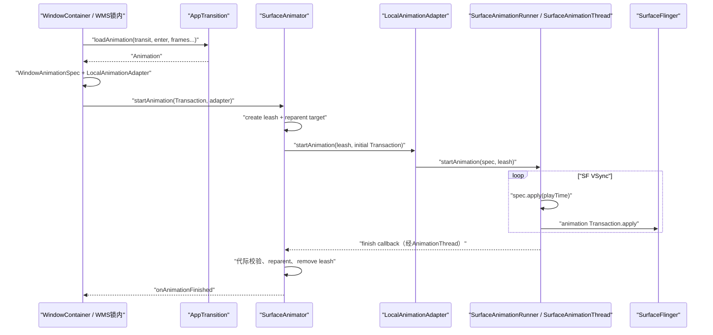
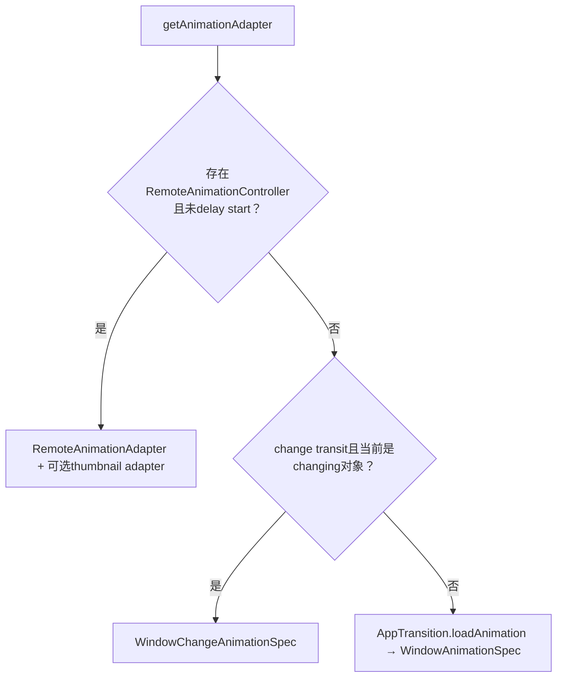
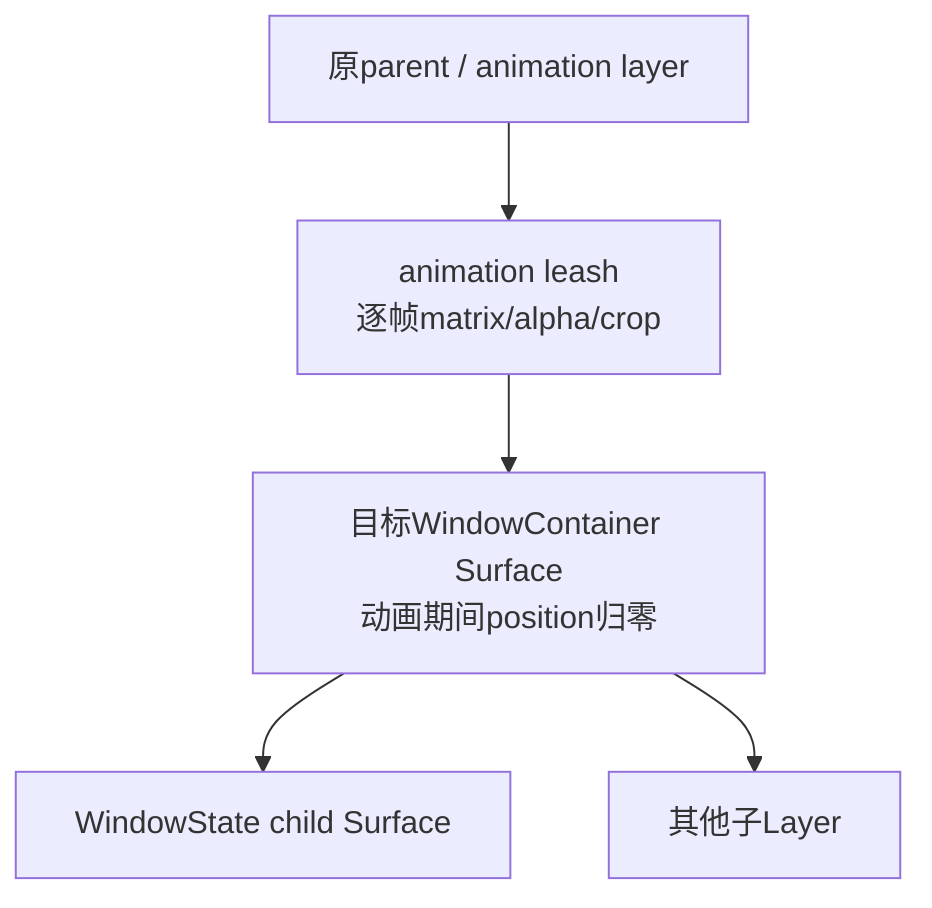

# 222 Android AppTransition动画加载、AnimationAdapter、SurfaceAnimator与动画Leash

> 源码版本：Android 11 / `android-11.0.0_r48`  
> 版本纠偏：本版本主线没有后来独立的 `TransitionAnimation`类，动画选择主要在 `AppTransition`  
> 学习方式：macOS只读核源，不编译、不运行AOSP

## 1. 本章要追到哪里

上一章已经选出transit和动画target。本章继续回答：一个XML `Animation`怎样变成SurfaceControl逐帧矩阵，为什么要创建leash，以及动画结束后如何把真实Surface放回原父节点。

完整终点不是“ValueAnimator走到1”，而是finish callback在WMS锁内校验代际、拆leash、恢复层级并通知ActivityRecord收尾。

## 2. 先做版本纠偏

在当前 `android-11.0.0_r48`源码中检索不到承担本主线的独立 `TransitionAnimation.java`。

动画资源解析、custom/thumbnail/voice/keyguard选择主要位于：

```text
frameworks/base/services/core/java/com/android/server/wm/AppTransition.java
```

## 3. 最短主线

```text
WindowContainer.applyAnimation
  → getAnimationAdapter
  → AppTransition.loadAnimation得到android.view.animation.Animation
  → WindowAnimationSpec封装“每个playTime如何写Surface”
  → LocalAnimationAdapter桥接runner
  → SurfaceAnimator创建leash并把真实Surface reparent进去
  → SurfaceAnimationRunner用SF VSync驱动ValueAnimator
  → spec.apply把matrix/alpha/crop写入共享Transaction
  → Transaction在Traversal callback统一apply
  → finish callback回AnimationThread，再进WMS全局锁
  → reset、reparent回原parent、remove leash、ActivityRecord收尾
```

## 4. 全链路时序图



## 5. 六层对象不要混用

```text
Animation：传统时间插值与Transformation
AnimationSpec：给定playTime，怎样写SurfaceControl Transaction
AnimationAdapter：SurfaceAnimator与执行器之间的接口
SurfaceAnimator：管理leash、取消、转移和finish代际
SurfaceAnimationRunner：VSync驱动本地动画
SurfaceControl leash：真正被逐帧变换的合成层
```

## 6. applyAnimation的总入口

`WindowContainer.applyAnimation(...)`先检查全局disable flag和Display是否 `okToAnimate()`。

显示被冻结或动画禁用时会cancel现有动画，不会为了“保持调用链完整”强行创建一个无用leash。

## 7. Organized容器为何不加载本地Animation

`WindowContainer.loadAnimation()`发现 `isOrganized()`时直接返回null，注释写明交给Task Organizer运行动画。

因此看到本地adapter为空不一定是异常，也可能是更高层organizer已接管。

## 8. getAnimationAdapter先算几何

它获取animation bounds和相对parent位置，拆成：

- `screenBounds`：容器在屏幕/父层级中的范围；
- `mTmpPoint`：动画位置；
- 归零后的local rect：spec内部裁剪与尺寸。

## 9. 非层级动画的位置差异

当 `sHierarchicalAnimations=false`，源码把animation position设为全局bounds左上角。

层级动画保留相对parent位置，因为leash仍位于原有Surface树附近。

## 10. Adapter选择有三大分支



本章重点是第三条本地普通App动画，但会标清另外两条边界。

## 11. delay start为何不兼容Remote Animation

源码只有在 `!mSurfaceAnimator.isAnimationStartDelayed()`时选择RemoteAnimationController。

Remote runner依赖一次性创建target/leash并回调外部进程，和本地SurfaceAnimator内部延迟启动协议不兼容。

## 12. change transition使用什么

Task窗口模式变化使用 `WindowChangeAnimationSpec`，还可给SurfaceFreezer snapshot创建thumbnail adapter。

它以旧freeze bounds到新bounds插值，而不是读取普通windowAnimationStyle。

## 13. 普通本地路径怎样建Adapter

拿到非null `Animation a`后创建：

```java
new LocalAnimationAdapter(
    new WindowAnimationSpec(a, position, stackBounds,
        canSkipFirstFrame, clipMode,
        true /* isAppAnimation */, cornerRadius),
    getSurfaceAnimationRunner())
```

## 14. 为什么Animation不能直接交给SurfaceAnimator

传统 `Animation`输出的是 `Transformation`，不知道SurfaceControl leash、Transaction批处理或runner线程。

`WindowAnimationSpec`负责把传统动画结果翻译为合成层操作。

## 15. AppTransition.loadAnimation的输入

它接收transit、enter、uiMode、orientation、window frame、display frame、content/stable/surface insets、voice/freeform及目标container。

这些参数共同决定资源、pivot、crop、thumbnail匹配和freeform阴影偏移。

## 16. frame与displayFrame的差别

frame是目标窗口动画结束/开始所对应的内容范围；displayFrame是整个逻辑Display范围。

Clip reveal或从小矩形放大时，两者决定裁剪与移动距离，不能统一替换成屏幕宽高。

## 17. surfaceInsets为何单独传入

freeform窗口Surface可能为阴影比内容更大。

若缩略图动画只按内容frame计算，阴影扩展会造成终点对不齐，因此要额外补偿Surface边缘。

## 18. 动画选择优先顺序很长

主要分支顺序包括：Keyguard、crashing、voice、relaunch、custom、custom-in-place、clip reveal、scale up、thumbnail、aspect thumbnail、cross-profile、change，最后才回退windowAnimationStyle属性。

先命中的专用分支会阻止后续theme属性分支。

## 19. Keyguard动画由Policy创建

Keyguard going away进入 `loadKeyguardExitAnimation()`，读取no-animation/to-shade/subtle等flags，再让WindowManagerPolicy生成动画。

这是系统安全界面转场，不由目标App随意提供custom资源覆盖。

## 20. Crashing close为何返回null

`TRANSIT_CRASHING_ACTIVITY_CLOSE`在本地load路径不加载普通动画。

崩溃场景优先快速、一致地清理窗口，避免依赖已异常App的视觉资源。

## 21. voice animation资源

voice interaction的open/close分别使用framework内置 `voice_activity_*`资源。

上一章已审计r48 Controller的voice boolean只重复检查openingApps；本章只解释boolean为true后的资源路径。

## 22. custom animation从哪里来

`overridePendingTransition`或ActivityOptions可设置package、enter/exit resource。

AppTransition按enter选择资源，并给custom Animation安装可选finished callback。

## 23. theme动画从哪里来

fallback把transit+enter映射到 `WindowAnimation_*Animation` styleable索引，再通过main window LayoutParams的 `windowAnimations` style取资源。

这就是第221章animLpActivity为何重要。

## 24. AttributeCache解决什么

系统按package、style resource和user缓存解析后的WindowAnimation typed array及Context。

framework资源ID高字节属于android包时会把package改成 `android`，避免用App Context加载系统动画。

## 25. loadAnimationSafely的失败边界

`AnimationUtils.loadAnimation()`抛 `NotFoundException`时记录warning并返回null。

资源缺失不会让system_server崩溃；结果是该目标可能无本地动画，但visibility提交仍继续。

## 26. translucent资源还会二次替换

若transit是translucent open且资源正是默认activity_open_enter，换成translucent专用enter；close同理替换默认close exit。

自定义非默认资源不会被无条件重写。

## 27. 动画最长时长保护

WindowContainer对加载成功的Animation调用：

```java
a.restrictDuration(MAX_APP_TRANSITION_DURATION);
```

r48上限为3秒，防止恶意custom动画或无限repeat长期占据系统转场。

## 28. restrict之后还要initialize

系统以container width/height和parent/display width/height初始化Animation。

相对尺寸、pivot百分比和TranslateAnimation的RELATIVE_TO_SELF/PARENT需要在这里解析成具体像素。

## 29. duration scale何时应用

初始化后调用 `scaleCurrentDuration(getTransitionAnimationScaleLocked())`。

SurfaceAnimationRunner随后强制ValueAnimator duration scale为1，因为Animation本身已经按系统缩放系数调整，避免重复缩放。

## 30. 默认336ms不是所有动画时长

`DEFAULT_APP_TRANSITION_DURATION=336ms`用于多种程序构造动画。

theme/custom资源可有自己的duration，最终还受3秒restrict和全局transition scale影响。

## 31. WindowAnimationSpec保存什么

它持有Animation、初始position、stack bounds、clip mode、skip-first-frame、is-app-animation和corner radius。

spec是不可离开上下文理解的执行说明，而不是一份像素帧缓存。

## 32. 每帧apply先清Transformation

```java
transformation.clear();
animation.getTransformation(playTime, transformation);
```

同一个ThreadLocal临时对象被复用，必须先清理旧matrix、alpha和clip。

## 33. position怎样合入矩阵

Animation产生local transformation matrix后，spec执行 `postTranslate(mPosition.x, mPosition.y)`。

然后通过 `Transaction.setMatrix(leash, matrix, floats)`写入leash。

## 34. Alpha怎样应用

`Transformation.getAlpha()`直接写到leash alpha。

leash下所有子Surface作为整体一起淡入淡出，不需要逐个窗口Surface设置alpha。

## 35. clip mode为NONE时

只有Animation Transformation本身含clip rect才设置WindowCrop。

没有clip时保留leash既有crop，不凭空套一个stack bounds。

## 36. stack clip模式时

spec先取stack bounds；若Animation还有clip rect，再取两者intersection。

这样窗口动画不会越出Task/Stack允许区域，同时保留clip reveal等动态裁剪。

## 37. rounded corner为何依赖crop

SurfaceControl corner radius需要一个明确裁剪边界作为圆角参考。

源码只有已设置crop、Animation声明rounded corners且radius>0时才调用setCornerRadius。

## 38. multi-window为何radius可为0

WindowContainer只在非multi-window时使用Display window corner radius。

PiP/split/freeform的圆角和容器边界可能由其他层处理，避免普通App动画重复裁切。

## 39. status bar transition时机怎样估算

WindowAnimationSpec尝试找到TranslateAnimation，二分近似interpolator达到99%的时间，再减去固定120ms状态栏转场时长。

找不到TranslateAnimation时直接使用当前uptime。

## 40. 这不是动画精确完成时间

它是让SystemUI状态栏动画在App移动接近完成时协调开始的预测。

Interpolator搜索、调度和Surface提交都会引入误差，不应当作present时间戳。

## 41. canSkipFirstFrame的意图

某些默认transition的第0帧与静态初始画面相同，可直接从下一帧playTime开始，减少一帧视觉停顿。

custom、custom-in-place、clip reveal和Keyguard going away明确禁止skip。

## 42. Runner怎样实现skip first frame

ValueAnimator `start()`后，若spec允许skip，将currentPlayTime推进一个SF frame interval对应的毫秒数。

它不是丢弃App Buffer，而是本地动画时间轴从约第二帧位置开始。

## 43. AnimationAdapter接口的核心

Adapter接收leash、初始Transaction、animation type和finish callback。

它抽象“谁来执行动画”：Local runner、Remote runner或其他adapter都能接入SurfaceAnimator的同一leash生命周期。

## 44. Adapter还暴露哪些信息

- 是否需要显示wallpaper；
- duration hint；
- status bar transition start time；
- cancel；
- dump/proto；
- 是否延迟finish。

这些是WMS协调动画之外系统状态所需的最小能力集。

## 45. LocalAnimationAdapter有多薄

它主要把 `AnimationSpec`和 `SurfaceAnimationRunner`组合起来：

```java
runner.startAnimation(spec, leash, t,
    () -> finishCallback.onAnimationFinished(type, this));
```

具体逐帧插值不在Adapter自身执行。

## 46. SurfaceAnimator解决的根本问题

动画期间WindowContainer仍会更新自己的position、layer和子Surface。

如果runner直接反复修改真实container Surface，布局事务与动画事务会互相覆盖；leash提供一层临时变换坐标系。

## 47. leash结构图



动画结束后S重新parent回P，L被remove。

## 48. startAnimation先取消旧动画

SurfaceAnimator调用内部cancel，参数为 `restarting=true, forwardCancel=true`。

旧adapter收到cancel，但不会把“被新动画替换”误报成容器普通动画完成回调。

## 49. 为什么保存AnimationAdapter对象做代际标识

finish callback可能晚到。这里的 `anim`参数实际是AnimationAdapter，SurfaceAnimator按对象身份检查：

```java
if (anim != mAnimation) return;
```

旧动画结束消息不能拆掉新动画的leash或清新状态。

## 50. 目标Surface为空时

若Animatable没有SurfaceControl，记录warning并cancel。

没有可reparent的对象就无法建立leash；系统走取消/完成清理而不是创建悬空动画。

## 51. SurfaceFreezer可提供已有leash

change transition可能先freeze并创建leash/snapshot。

SurfaceAnimator优先 `freezer.takeLeashForAnimation()`，没有才自行create，避免重复嵌套不必要leash。

## 52. createAnimationLeash的parent

builder parent来自 `Animatable.getAnimationLeashParent()`。

普通Activity在非层级模式可能放到专用App animation layer；层级动画通常使用原父container Surface。

## 53. leash为什么是EffectLayer

它本身不提交图像Buffer，只对子树应用alpha、matrix、crop和层级关系。

EffectLayer正适合做纯合成属性容器。

## 54. 创建leash的初始Transaction

系统设置crop、position、show、alpha，并把真实Surface reparent进leash。

这些操作使用调用方传入的pending Transaction，与转场其他初始Surface变化成组提交。

## 55. hidden参数怎样影响初始alpha

builder创建时带hidden状态；随后Transaction会统一 `show(leash)`，但初始alpha仍按hidden取0或1。也就是说运行期是否露出主要由alpha兜住，而不是省略show调用。

这保证opening container在第一帧变换安装前不会闪出未插值的完整内容。

## 56. onAnimationLeashCreated为何把目标position归零

leash已经位于目标原位置，真实Surface若仍保留旧position会被重复平移。

WindowContainer重排layer后将自身Surface position设为(0,0)，让leash承担外部坐标。

## 57. ActivityRecord还会设leash层级

它以prefix order index计算animation layer；需要Z boost时加固定基数。

closing transit或Animation ZORDER_TOP可触发boost，让转场对象在动画期间位于合适层级。

## 58. animation bounds layer是什么

clip mode要求动画后裁剪时，ActivityRecord会再建一个bounds EffectLayer，将leash reparent其下，并对bounds layer设置stack/task crop。

层级可能变为：animation parent → bounds layer → leash → Activity Surface。

## 59. within-task动画怎样选crop

若transit只涉及同一个Task内的Activity open/close/relaunch，使用Task bounds。

否则用ActivityStack bounds，防止跨Task动画被错误裁在单个Task区域。

## 60. 延迟启动的SurfaceAnimator语义

`startDelayingAnimationStart()`只在当前未animating时置flag。

之后startAnimation仍创建leash并把mAnimation设好，所以 `isAnimating()`返回true，只是adapter尚未真正启动。

## 61. endDelaying怎样启动

它调用adapter.startAnimation，传Animatable pending transaction，然后 `commitPendingTransaction()`。

这与SurfaceAnimationRunner的“批量defer starting animations”不同：一个属于单个SurfaceAnimator，一个属于全局local runner pending队列。

## 62. 两种defer不要混用

```text
SurfaceAnimator start delay：leash已建，某一动画adapter尚未start
SurfaceAnimationRunner defer：多个Local Animation已入pending，统一等一帧开始
```

AppTransitionController主要使用后者把opening/closing/changing动画成组启动。

## 63. SurfaceAnimationRunner运行在哪些线程

它使用：

- `SurfaceAnimationThread`的Handler与SF Choreographer驱动帧；
- `AnimationThread` Handler投递finish callback；
- WMS调用线程负责建adapter/leash和初始Transaction。

因此“system_server内动画”仍跨多个线程。

## 64. 为什么使用Choreographer.getSfInstance

Runner在SurfaceAnimationThread上取得SF VSync Choreographer，并给AnimationHandler设置 `SfVsyncFrameCallbackProvider`。

窗口合成属性动画跟随SurfaceFlinger节拍，而不是App UI线程Choreographer。

## 65. startAnimation先进入pending map

key是animation leash，value包含spec、leash、finish callback。

未处于全局defer时post SF frame callback；处于defer时等continue统一post。

## 66. 第0帧为何立即apply

即使真正ValueAnimator要到下一次SF VSync才start，Runner先对调用方Transaction执行 `spec.apply(playTime=0)`。

移动动画等需要初始transform与leash创建同事务生效，避免短暂跳到未变换位置。

## 67. pending怎样转为running

SF frame callback中遍历pending，逐个创建ValueAnimator并移入running map，最后clear pending。

同时发送PowerHint.INTERACTION，提示系统转场期间需要及时响应。

## 68. ValueAnimator为何overrideDurationScale(1)

Animation或change spec在构造前已经乘过系统duration scale。

若ValueAnimator再次读取全局Animator scale，会二次缩放时长。

## 69. 每帧playTime怎样限制

update listener获取currentPlayTime，并clamp到duration。

即使调度晚到超过末尾，spec最多应用最终状态，不向传统Animation传无限增长时间。

## 70. 每帧不立即apply Transaction

update listener只写共享 `mFrameTransaction`，随后schedule一个Choreographer `CALLBACK_TRAVERSAL`。

同一帧多个动画更新可合并成一次Transaction.apply，减少Binder/事务开销和不同步。

## 71. applyTransaction做什么

```java
mFrameTransaction.setAnimationTransaction();
mFrameTransaction.apply();
```

animation flag让SurfaceFlinger按动画事务语义处理，但apply返回仍不等于硬件present完成。

## 72. mApplyScheduled为何是合并门

第一个update post Traversal callback并置true；同帧后续update不重复post。

apply后再清false，为下一SF VSync接受新一轮调度。

## 73. ValueAnimator start时为何设alpha=1

源码暂用 `setAlpha(leash, 1)`而非show，旁边有bug TODO。

这确保未hidden的运行leash可见；真实逐帧alpha随后由WindowAnimationSpec覆盖。

## 74. 动画结束回调为什么换线程

ValueAnimator onEnd先从running map移除，再把finish callback post到AnimationThread。

注释说明可在另一线程推最终状态以避免jank，也避免在SurfaceAnimationThread动画回调栈里直接持WMS全局锁做复杂层级操作。

## 75. finish回SurfaceAnimator后先取WMS锁

`mInnerAnimationFinishedCallback`在 `synchronized(mGlobalLock)`内处理transfer map、代际校验、defer finish、reset与上层callback。

Surface层级账本必须与其他WMS操作串行。

## 76. finish还能被Animatable延迟

ActivityRecord可通过AnimatingActivityRegistry要求延迟某个Activity拆leash，让一组Activity协调结束。

只有调用提供的end-defer Runnable后才真正reset。

## 77. Adapter也可请求defer finish

若Animatable不延迟，SurfaceAnimator再询问AnimationAdapter。

两者都想延迟时，Animatable优先，Adapter不会收到finish Runnable；责任归属必须清晰，否则会永久保留leash。

## 78. reset的第一步是清代际账本

移除transfer map项，清 `mAnimation`、per-animation callback和type。

然后才处理leash，防止拆层级过程中重入代码仍认为动画在运行。

## 79. removeLeash如何恢复层级

若目标Surface仍存在且parent有效，把Surface reparent回原parent。

随后按参数remove leash，并调用 `onAnimationLeashLost()`恢复position/layer/freezer状态。

## 80. parent失效时为何仍回调leash lost

即使parent无效无法真正reparent，只要目标Surface对象存在，源码仍通知Animatable。

WMS内部必须清理“当前由leash控制”的状态，不能因Surface树已变化就留下粘住标志。

## 81. Activity bounds layer何时移除

ActivityRecord覆盖 `onAnimationLeashLost()`，先走父类恢复，再remove `mAnimationBoundsLayer`并通知AnimatingActivityRegistry finished。

所以bounds layer与leash有配对生命周期。

## 82. ActivityRecord动画结束做什么

包括清transit/flags/clip需要、请求anim/wallpaper relayout、清thumbnail、更新client visibility、重算IME target，并处理停止/销毁调度。

“动画结束”会触发Framework状态收尾，不只是释放一个Surface对象。

## 83. cancel pending动画

若leash仍在Runner pending map，cancel只需remove pending项；ValueAnimator尚未创建。

SurfaceAnimator随后负责拆leash和上层状态，不会收到runner finish callback。

## 84. cancel running动画

Runner从running map移除，在cancel lock下置 `mCancelled=true`，再让SurfaceAnimationThread调用ValueAnimator.cancel并apply剩余Transaction。

onAnimationEnd看到cancelled后不会post正常finish callback，避免cancel与finish双重收尾。

## 85. SurfaceAnimator为何还要forwardCancel

普通取消必须通知Adapter停止runner；动画transfer时却不能让源Animator把同一正在运行的Adapter取消。

因此内部cancel带 `forwardCancel`参数区分“真取消”与“只转移所有权”。

## 86. restarting为何不调上层finish

新动画替换旧动画时，旧动画视觉生命周期结束，但容器仍立即进入下一动画。

若触发普通finished callback，Activity可能提前清transit、更新client visibility或执行stop，因此restarting路径抑制上层finish。

## 87. animation transfer怎样工作

目标SurfaceAnimator接管源leash、adapter、type和finish callback；源端cancel但不forward给runner。

目标Surface reparent进同一leash，并把 `animation → target animator`写入WMS transfer map。

## 88. transfer map解决迟到finish路由

runner仍持原来创建时的finish callback对象。

回调到源SurfaceAnimator时先查transfer map，若找到目标，就转发给目标的inner callback，由新owner拆leash。

## 89. layer操作为何要感知leash

SurfaceAnimator的 `setLayer/setRelativeLayer/reparent`在有leash时操作leash，否则操作真实Surface。

动画期间改真实Surface外部层级不会生效或会破坏leash树，所以必须通过这层代理。

## 90. WindowContainer animation sources

动画target提升到Task时，实际SurfaceAnimator属于Task，但来源可能是多个ActivityRecord。

WindowContainer保存sources，target结束后逐一调用其 `onAnimationFinished()`，再clear集合。

## 91. isAnimating的语义

SurfaceAnimator只检查 `mAnimation != null`。

它包含已创建但delayed start的动画，也可能在finish deferred期间仍为true，不严格等于ValueAnimator当前正在tick。

## 92. expensive animation早唤醒

WindowAnimator观察全局是否存在AppTransition、screen rotation或recents动画；开始时暂停TaskSnapshot持久化并设置Transaction early-wakeup-start，结束时恢复并early-wakeup-end。

这是全局动画负载优化，不是WindowAnimationSpec `needsEarlyWakeup()`在Runner中逐spec调用。

## 93. 一个r48接口/实现边界

AnimationSpec定义 `needsEarlyWakeup()`，WindowAnimationSpec对App动画返回true。

但当前SurfaceAnimationRunner源码没有调用该方法；实际可见的early wakeup主线在WindowAnimator按animation type整体切换，文档不能把接口意图写成Runner现有行为。

## 94. 动画帧Transaction与窗口Buffer独立

Runner每帧只改leash的matrix/alpha/crop等合成属性，不要求App重新绘制Buffer。

所以一个静态Buffer可以平滑移动；App UI卡住不必然让正在运行的Surface动画停止tick。

## 95. 但acquire fence仍可能影响内容

若目标首Buffer尚未ready，leash动画可以开始，SF却可能仍展示Starting Window、旧Buffer或无新内容。

动画属性进度和Buffer可用性必须分别诊断。

## 96. 常见误解一：Leash是截图

不对。普通leash是EffectLayer和临时parent，本身不持GraphicBuffer。

change transition的SurfaceFreezer snapshot是另一对象，可能作为leash下的thumbnail动画。

## 97. 常见误解二：动画逐帧让App重绘

不对。本地主线在system_server的SurfaceAnimationThread更新SurfaceControl属性。

App Buffer可完全不变。

## 98. 常见误解三：ValueAnimator结束等于动画收尾完成

不对。finish还要post到AnimationThread、获取WMS锁、通过代际/transfer/defer检查、拆leash并执行ActivityRecord callback。

中间存在可观察调度延迟。

## 99. 常见误解四：Transaction.apply等于画面present

不对。apply只是把事务交给SurfaceFlinger。

后面仍有事务应用、Layer状态提交、latch/compose、HWC present与fence signal。

## 100. 常见误解五：cancel一定触发正常finish

不对。Runner cancel抑制正常finish callback；SurfaceAnimator依据restarting/forwardCancel决定是否自行通知static/per-animation finished。

必须同时看两层取消协议。

## 101. 常见误解六：动画资源总来自新Activity theme

不对。animLp可能由closing/changing/fullscreen或Remote定义目标决定；专用Keyguard/voice/custom/thumbnail分支还可能完全绕过theme fallback。

## 102. 故障推理：动画完全没运行

检查全局disable、Display frozen/okToAnimate、organized容器、loadAnimation是否返回null、Remote/change分支、目标Surface是否存在以及SurfaceAnimator是否start-delayed未结束。

## 103. 故障推理：动画起点跳一下

检查第0帧Transformation是否随leash创建Transaction应用、目标Surface position是否归零、animation position坐标系、surfaceInsets与clip bounds，以及skip-first-frame是否允许。

## 104. 故障推理：动画带着窗口跑出Task

检查appStackClipMode、stack/task bounds、within-task判断、animation bounds layer是否创建、层级动画开关及Transformation clip rect。

## 105. 故障推理：动画结束后窗口位置错

检查removeLeash是否成功reparent、parent是否仍valid、onAnimationLeashLost是否更新Surface position、bounds layer是否移除，以及是否有旧finish回调越过代际检查。

## 106. 故障推理：动画永久处于isAnimating

检查ValueAnimator是否仍running、finish callback是否投递、Animatable/Adapter是否defer finish却未调用end Runnable、transfer map是否指向正确owner，以及WMS锁是否长期阻塞。

## 107. macOS只读练习一：追资源选择

```bash
cd /Users/ninebot/androidSource
sed -n '1580,1790p' \
  frameworks/base/services/core/java/com/android/server/wm/AppTransition.java
```

选择一个 `TRANSIT_ACTIVITY_OPEN + enter=true`，分别推演默认theme、custom和voice三种分支。

## 108. macOS只读练习二：追leash创建与拆除

```bash
cd /Users/ninebot/androidSource
rg -n 'startAnimation|createAnimationLeash|removeLeash|onAnimationLeashCreated|onAnimationLeashLost' \
  frameworks/base/services/core/java/com/android/server/wm/SurfaceAnimator.java \
  frameworks/base/services/core/java/com/android/server/wm/WindowContainer.java \
  frameworks/base/services/core/java/com/android/server/wm/ActivityRecord.java
```

画出原parent、leash、目标Surface在start、running、finish三个时刻的父子关系。

## 109. macOS只读练习三：追线程切换

```bash
cd /Users/ninebot/androidSource
rg -n 'SurfaceAnimationThread|AnimationThread|postFrameCallback|CALLBACK_TRAVERSAL|mFinishCallback' \
  frameworks/base/services/core/java/com/android/server/wm/SurfaceAnimationRunner.java \
  frameworks/base/services/core/java/com/android/server/wm/SurfaceAnimator.java
```

标注每个callback在哪个线程执行，以及进入SurfaceAnimator finish后何时获取WMS global lock。

## 110. macOS只读练习四：核对每帧属性

```bash
cd /Users/ninebot/androidSource
sed -n '70,150p' \
  frameworks/base/services/core/java/com/android/server/wm/WindowAnimationSpec.java
```

列出matrix、alpha、crop、corner radius四类Transaction字段及各自触发条件。

## 111. 源码导航

```text
frameworks/base/services/core/java/com/android/server/wm/AppTransition.java
frameworks/base/services/core/java/com/android/server/wm/WindowContainer.java
frameworks/base/services/core/java/com/android/server/wm/AnimationAdapter.java
frameworks/base/services/core/java/com/android/server/wm/LocalAnimationAdapter.java
frameworks/base/services/core/java/com/android/server/wm/WindowAnimationSpec.java
frameworks/base/services/core/java/com/android/server/wm/WindowChangeAnimationSpec.java
frameworks/base/services/core/java/com/android/server/wm/SurfaceAnimator.java
frameworks/base/services/core/java/com/android/server/wm/SurfaceAnimationRunner.java
frameworks/base/services/core/java/com/android/server/wm/ActivityRecord.java
frameworks/base/services/core/java/com/android/server/wm/SurfaceFreezer.java
frameworks/base/services/core/java/com/android/server/wm/WindowAnimator.java
```

## 112. 复读修订一：纠正TransitionAnimation类名

初始计划沿用了新版本常见类名，但r48本地主线没有该独立类。

正文已改为按真实入口 `AppTransition.loadAnimation()`讲解，避免读者在Android 11工程中搜索不存在的实现。

## 113. 复读修订二：区分两种defer

SurfaceAnimator的单对象delay和SurfaceAnimationRunner的批量start defer作用层不同。

前者isAnimating但adapter尚未start；后者Local adapter已把spec放入pending map，等待统一SF frame callback。

## 114. 复读修订三：finish callback不是直接从SF线程拆leash

ValueAnimator结束发生在SurfaceAnimationThread，Runner把finish post到AnimationThread；SurfaceAnimator随后获取WMS锁执行层级恢复。

这个线程跳转是防止动画线程被复杂WMS收尾拖慢的重要设计。

## 115. 复读修订四：AnimationSpec.needsEarlyWakeup未在当前Runner消费

接口和WindowAnimationSpec返回值真实存在，但r48 SurfaceAnimationRunner没有读取它。

本章将实际early-wakeup证据定位到WindowAnimator对expensive animation类型的全局检测。

## 116. 复读修订五：动画结束仍不等于物理显示

末帧Transaction.apply、leash拆除和ActivityRecord finished都属于Framework/SF事务提交前后边界。

要证明像素何时出现在屏幕，仍需继续检查SurfaceFlinger/HWC present fence，而不是读取ValueAnimator fraction=1。

## 117. 本章最终心智模型

把leash想成WMS临时套在窗口子树外的一只“控制手柄”：布局系统继续维护手柄里的真实Surface，动画线程只旋转、平移、裁剪这只手柄。开始时建立parent替换，运行时按SF VSync批量写Transaction，结束时在WMS锁内验证动画代际，再把真实Surface放回去。

## 118. 本章结论与下一章

Android 11本地App转场由AppTransition选择传统Animation，WindowAnimationSpec翻译每帧合成属性，LocalAnimationAdapter连接SurfaceAnimationRunner，而SurfaceAnimator专门保证leash层级、取消、转移和finish代际安全。理解这些分工后，动画“没播”“位置跳”“结束粘住”可以分别定位到资源、spec、runner或leash账本，而不再笼统归因于WMS动画。

下一章进入第223章“Android RemoteAnimationAdapter、RemoteAnimationController与Launcher/Recents远程转场”，追动画控制权跨Binder交给外部runner时，target、leash、timeout、死亡回调与权限边界如何工作。
