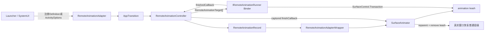
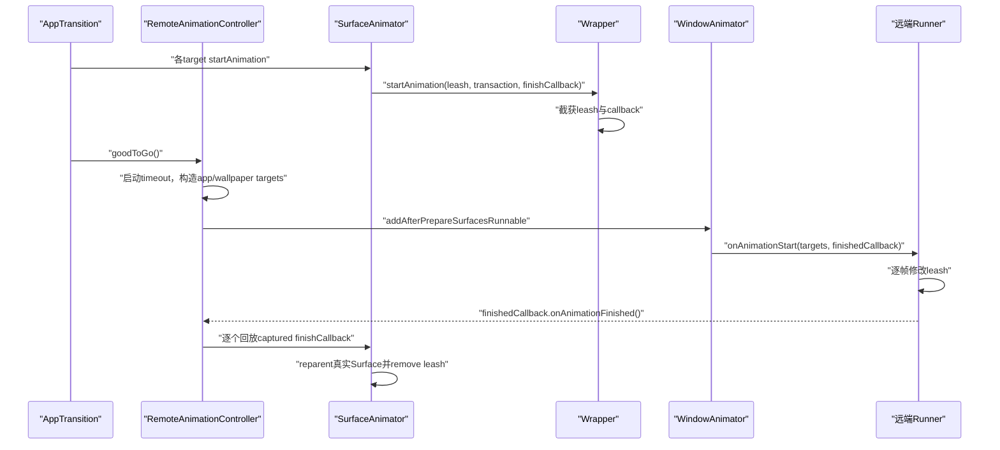
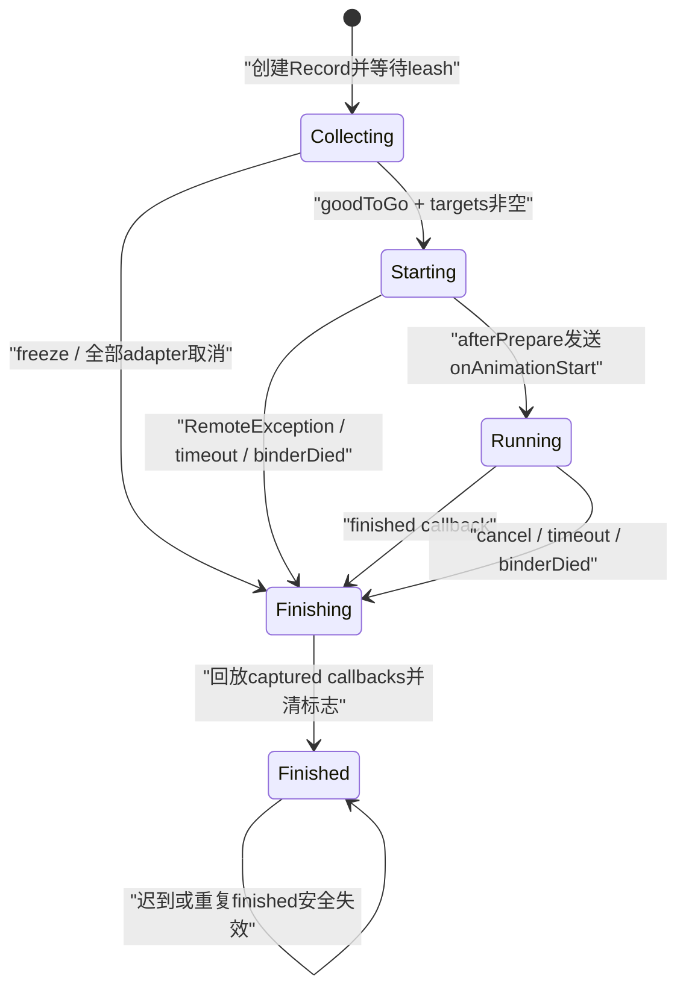

# 223 Android RemoteAnimationAdapter、RemoteAnimationController与Launcher/Recents远程转场

> 源码版本：Android 11 / `android-11.0.0_r48`  
> 学习方式：macOS只读核源，不编译、不运行AOSP  
> 本章边界：先讲普通AppTransition的Remote Animation；Recents交互式手势只讲接口边界，下一章再深入

## 1. 本章要解决什么问题

上一章的本地动画由system_server中的`SurfaceAnimationRunner`逐帧驱动。本章换一个问题：为什么Launcher或SystemUI可以拿到应用窗口的合成层，并自己决定缩放、位移、透明度和圆角？

答案不是把应用Surface的所有权永久交出去，而是WMS通过`SurfaceAnimator`创建临时动画leash，再把这个leash的Binder句柄装进`RemoteAnimationTarget`交给受信任进程暂时控制。

## 2. 先记住一句话

Remote Animation是“远端进程决定动画帧，WMS保留窗口层级和生命周期最终控制权”的协议。

远端能改leash的合成属性，却不能因此接管Activity生命周期、真实窗口Surface、Task组织关系或SurfaceAnimator的最终清理。

## 3. 两条链千万不要混成一条

Android 11里与Launcher有关的远程窗口动画主要有两类：

```text
普通Remote Animation
  RemoteAnimationAdapter
  → RemoteAnimationController
  → IRemoteAnimationRunner
  → 完成后恢复普通AppTransition

Recents交互式动画
  IRecentsAnimationRunner
  → RecentsAnimationController
  → 手势期间持续控制Task
  → finish时决定回Home还是回App
```

本章主角是第一条。两者都使用`RemoteAnimationTarget`和leash，所以外观相似；但开始条件、控制接口、取消语义和最终提交选择并不相同。

## 4. 总体对象图



## 5. RemoteAnimationAdapter是什么

`RemoteAnimationAdapter`是一个可跨Binder传递的配置对象，核心字段只有：

```java
private final IRemoteAnimationRunner mRunner;
private final long mDuration;
private final long mStatusBarTransitionDelay;
private final boolean mChangeNeedsSnapshot;
private int mCallingPid;
private int mCallingUid;
```

它不是逐帧执行器，也不保存每个窗口的矩阵。

## 6. 五个字段分别负责什么

- `mRunner`：远端进程的Binder回调端；
- `mDuration`：WMS可查询的时长提示，也是超时之外的动画元数据；
- `mStatusBarTransitionDelay`：协调状态栏转场的开始时间；
- `mChangeNeedsSnapshot`：change transition是否需要旧状态快照；
- `mCallingPid/mCallingUid`：system_server记录真正控制动画的进程身份。

## 7. duration不是强制逐帧时钟

WMS不会按`mDuration`替远端插值。Launcher可以用自己的`AnimatorSet`，也可以立即完成。

这个值主要通过`AnimationAdapter.getDurationHint()`参与转场通知、状态栏协调和外部观察；真正的防卡死机制是Controller的单独超时。

## 8. statusBarTransitionDelay的含义

Wrapper返回：

```java
return SystemClock.uptimeMillis()
        + mRemoteAnimationAdapter.getStatusBarTransitionDelay();
```

因此它表达的是“从查询时刻起延迟多久开始状态栏视觉转场”，不是远端动画完成deadline。

## 9. changeNeedsSnapshot只服务change目标

窗口模式或Task边界变化时，结束态真实窗口与开始态截图可能要同时动画。

`changeNeedsSnapshot=true`时，一个`RemoteAnimationRecord`可以同时创建主adapter和thumbnail adapter；后者的leash最终进入`RemoteAnimationTarget.startLeash`。

## 10. Adapter如何跨进程

`writeToParcel()`写入runner Binder、duration、delay和snapshot标志；PID/UID没有写入Parcel。

```java
dest.writeStrongInterface(mRunner);
dest.writeLong(mDuration);
dest.writeLong(mStatusBarTransitionDelay);
dest.writeBoolean(mChangeNeedsSnapshot);
```

控制者身份由system_server在接收请求时重新补入，不能相信客户端Parcel自报身份。

## 11. 为什么PID/UID不应由客户端填写

若调用者能随Parcel伪造PID，WMS可能把动画运行状态记到错误进程，影响OOM优先级与生命周期判断。

源码在Binder边界使用`Binder.getCallingPid()/getCallingUid()`，再调用`setCallingPidUid()`。

## 12. 第一种入口：ActivityOptions

受信任调用者可用：

```java
ActivityOptions.makeRemoteAnimation(remoteAnimationAdapter)
```

它把animation type设为`ANIM_REMOTE_ANIMATION`并把adapter放进Bundle，随Activity启动请求进入ATMS。

## 13. ActivityOptions入口也要验权限

`SafeActivityOptions.checkPermissions()`发现remote adapter后检查：

```text
android.permission.CONTROL_REMOTE_APP_TRANSITION_ANIMATIONS
```

普通三方应用没有这项signature级能力，因此这不是任意App可用来截取其他应用窗口的公开机制。

## 14. SafeActivityOptions怎样记录真实调用者

权限检查完成后，`setCallingPidUidForRemoteAnimationAdapter()`用构造SafeActivityOptions时保存的原始Binder身份写入adapter。

它还检查callingPid不能是system_server自身PID，防止清除Binder identity之后才错误构造安全包装。

## 15. 第二种入口：Activity注册RemoteAnimationDefinition

Launcher常用：

```java
activity.registerRemoteAnimations(definition);
```

Activity通过`IActivityTaskManager.registerRemoteAnimations(activityToken, definition)`把一组“transit→adapter”规则挂到自己的`ActivityRecord`。

## 16. 注册Definition同样受权限保护

ATMS先执行：

```java
mAmInternal.enforceCallingPermission(
    CONTROL_REMOTE_APP_TRANSITION_ANIMATIONS,
    "registerRemoteAnimations");
```

然后给Definition内所有adapter写入相同的calling PID/UID。

## 17. Activity token解决什么问题

注册不是全局字符串配置，而是挂在一个仍存在的`ActivityRecord`上。

ATMS先用token查`ActivityRecord.isInStackLocked(token)`；找不到就直接返回，避免把规则挂到已经消失或伪造的Activity上。

## 18. Definition是transit查找表

`RemoteAnimationDefinition`内部使用：

```java
SparseArray<RemoteAnimationAdapterEntry> mTransitionAnimationMap;
```

key是`WindowManager.TRANSIT_*`，value包含adapter和一个activity type过滤器。

## 19. activityTypeFilter怎样匹配

`getAdapter(transit, activityTypes)`先按transit精确取entry，再判断：

```java
entry.activityTypeFilter == ACTIVITY_TYPE_UNDEFINED
        || activityTypes.contains(entry.activityTypeFilter)
```

这是“转场涉及的Activity类型集合中至少包含目标类型”，不是要求所有Activity都属于该类型。

## 20. 为什么需要activity type过滤

同一个`TRANSIT_WALLPAPER_OPEN`可能涉及标准App、Home、Recents或其他系统Activity。

Launcher只希望在符合Home/standard语义的转场中接管，不能只看一个过于粗的transit整数。

## 21. Definition的死亡监听

`ActivityRecord.registerRemoteAnimations()`保存Definition并调用其`linkToDeath()`；runner Binder死亡时会触发`unregisterRemoteAnimations()`。

这解决的是“长期注册规则”的清理；真正一场已经开始的动画还会由`RemoteAnimationController`建立另一条死亡监听。

## 22. 两条死亡监听不要混淆

```text
Definition.linkToDeath
  目的：runner死后移除Activity上的长期注册规则

Controller.linkToDeathOfRunner
  目的：当前动画运行中runner死亡，立即cancel并释放leash
```

它们生命周期不同，不能用其中一个替代另一个。

## 23. 第三种入口：Display级注册

ATMS还有`registerRemoteAnimationsForDisplay(displayId, definition)`，把Definition保存到对应DisplayContent的AppTransitionController。

它适合系统级控制者，不依赖某个ActivityRecord，但同样要求控制远程转场权限。

## 24. 第四种入口：直接override pending transition

`IWindowManager.overridePendingAppTransitionRemote(adapter, displayId)`可以覆盖已pending的转场。

WMS检查权限、确认Display存在，再调用`AppTransition.overridePendingAppTransitionRemote()`。

## 25. 直接override的身份边界

Android 11这段WMS入口负责权限和Display检查；与ATMS Definition/ActivityOptions路径相比，源码片段中没有在此给adapter补写calling PID/UID。

因此阅读时不能把不同入口的身份填充步骤想当然地合并；实际调用封装必须保证Controller后续能拿到非零callingPid。

## 26. AppTransitionController什么时候选Definition

转场已经根据opening/closing/changing集合得到最终transit和activityTypes后，Controller寻找决定animation layout params的Activity。

它优先寻找自身Definition能匹配当前transit的高层、合适目标，再回退普通fullscreen/theme窗口。

## 27. Remote Animation为什么“总是赢”

源码注释写着“Remote animations always win”，意思是在寻找`animLpActivity`时，带匹配Definition的候选优先于普通窗口主题候选。

这不是说它能覆盖crash close等所有安全优先级分支。

## 28. 崩溃关闭转场例外

`overrideWithRemoteAnimationIfSet()`遇到`TRANSIT_CRASHING_ACTIVITY_CLOSE`直接返回。

崩溃清理的系统一致性优先于已注册的远程视觉效果。

## 29. Activity级与Display级Definition优先级

`getRemoteAnimationOverride(container, transit, activityTypes)`先查container自己的Definition；匹配不到才查Display级Definition。

因此局部Activity可为自己的特定转场提供更具体规则，Display级规则是后备。

## 30. 选中Adapter后发生什么

AppTransitionController调用：

```java
mAppTransition.overridePendingAppTransitionRemote(adapter);
```

只有当前确实`isTransitionSet()`时才清理旧override、设置`NEXT_TRANSIT_TYPE_REMOTE`并创建`RemoteAnimationController`。

## 31. clear不是取消当前SurfaceAnimator的同义词

`AppTransition.clear()`主要清next transition类型、spec和controller引用。

若转场被`freeze()`，源码会先显式`controller.cancelAnimation("freeze")`，再clear，避免尚未goodToGo的远程动画失去收尾入口。

## 32. Controller的职责

`RemoteAnimationController`负责：

- 收集所有待动画窗口；
- 等SurfaceAnimator为它们创建leash；
- 构造`RemoteAnimationTarget[]`；
- 在合适的Surface提交边界回调远端runner；
- 管理timeout、cancel、Binder death和finished；
- 最终把每个被截获的finish callback还给SurfaceAnimator。

## 33. Controller不是动画帧执行线程

它没有`ValueAnimator`，也不会每个VSync调用`Transaction.setMatrix()`。

逐帧操作发生在Launcher/SystemUI进程，由远端自行创建`SurfaceControl.Transaction`。

## 34. WindowContainer何时创建RemoteAnimationRecord

`WindowContainer.getAnimationAdapter()`发现AppTransition已有RemoteAnimationController，且SurfaceAnimator没有delay start时，调用：

```java
controller.createRemoteAnimationRecord(
    this, position, localBounds, screenBounds, startBounds);
```

返回的主adapter和可选thumbnail adapter继续走普通`SurfaceAnimator.startAnimation()`框架。

## 35. delay start为何不兼容

源码明确写着：delaying animation start与remote animations完全不兼容。

Remote Controller需要等待整组目标的leash都已创建，再一次性跨进程通知；单个SurfaceAnimator仍处于延迟启动态会破坏这个集合屏障。

## 36. Record是一窗一桥

`RemoteAnimationRecord`保存：

```text
WindowContainer
主 RemoteAnimationAdapterWrapper
可选 thumbnail Wrapper
startBounds
稍后创建的 RemoteAnimationTarget
```

它把服务端动画对象与远端看到的一个target对应起来。

## 37. opening、closing、changing模式怎样判断

Record根据DisplayContent集合计算mode：

```java
if (dc.mOpeningApps.contains(topActivity)) MODE_OPENING;
else if (dc.mChangingContainers.contains(windowContainer)) MODE_CHANGING;
else MODE_CLOSING;
```

opening/closing按Activity判断，changing按WindowContainer（通常Task）判断。

## 38. closing为什么是兜底分支

进入Remote Animation目标收集的对象应已属于本次转场集合。

若既不是opening也不是changing，源码将其视为closing；不能据此推导任意陌生容器都会自动变成closing target。

## 39. Wrapper实现AnimationAdapter

这使远程路径能复用上一章的`SurfaceAnimator`：创建leash、把真实Surface reparent进去、管理取消与恢复层级的代码不用重写。

差别只在adapter的`startAnimation()`如何处理leash。

## 40. 最关键源码：Wrapper.startAnimation

```java
public void startAnimation(SurfaceControl animationLeash, Transaction t,
        int type, OnAnimationFinishedCallback finishCallback) {
    // 先恢复初始position/crop
    mCapturedLeash = animationLeash;
    mCapturedFinishCallback = finishCallback;
    mAnimationType = type;
}
```

它不启动本地runner，只截获三个对象。

## 41. 为什么必须截获finishCallback

从SurfaceAnimator角度看，动画已交给AnimationAdapter，必须等adapter回调才能拆leash。

远端进程无法直接持有服务端Java callback，因此Controller先保存它；远端调用AIDL finished后，Controller再代为逐个调用。

## 42. 初始position和crop为何要先设置

跨Binder把target交给远端到远端第一笔Transaction之间存在时间差。

Wrapper先把leash放到正确的startBounds或结束态position/crop，避免等待远端时窗口突然跳到坐标原点或暴露未裁剪区域。

## 43. change transition的初始几何

存在`startBounds`时，主leash先设置为旧bounds的左上角和宽高：

```java
t.setPosition(leash, startBounds.left, startBounds.top);
t.setWindowCrop(leash, startBounds.width(), startBounds.height());
```

远端随后把它变换到结束bounds。

## 44. 普通opening/closing的初始几何

没有startBounds时使用记录的`mPosition`和`mStackBounds`尺寸。

这提供稳定基线，但远端仍需结合`localBounds`、`screenSpaceBounds`和`contentInsets`正确计算自己的矩阵与裁剪。

## 45. 主adapter与thumbnail adapter

change且需要snapshot时：

- 主adapter控制真实结束态窗口；
- thumbnail adapter控制开始态截图；
- 两者都有独立leash和finish callback；
- `RemoteAnimationTarget`分别通过`leash`和`startLeash`暴露。

## 46. thumbnail的坐标基线

源码把startBounds复制后offset到`(0,0)`作为thumbnail stack bounds，并使用`Point(0,0)`。

它是相对主窗口的旧态快照，不应按另一个独立Task的全局位置重复偏移。

## 47. SurfaceAnimator仍然拥有leash生命周期

虽然远端拿到`SurfaceControl`句柄，leash仍由system_server创建并纳入SurfaceAnimator的animation generation。

完成时真正的reparent、remove和服务端状态清理由SurfaceAnimator的finish callback执行。

## 48. target何时才能创建

Record只有同时满足以下条件才创建target：

```text
主adapter仍存在
captured finish callback非空
captured leash非空
```

也就是说，必须等SurfaceAnimator确实调用过Wrapper.startAnimation。

## 49. target创建失败怎样收口

`createAppAnimations()`遇到null target不会简单跳过。

它会主动调用已捕获的主/缩略图finish callback，并从pending列表移除Record，防止SurfaceAnimator永远等待一个不会交给远端的动画。

## 50. ActivityRecord构造target的前置条件

`ActivityRecord.createRemoteAnimationTarget()`要求：

```text
task != null
findMainWindow() != null
```

没有Task ID或主窗口就无法提供完整的远端窗口语义，于是返回null走上述清理。

## 51. RemoteAnimationTarget字段总览

一个App target主要包含：

```text
taskId、mode、leash、startLeash
isTranslucent、clipRect、contentInsets
prefixOrderIndex
position、localBounds、screenSpaceBounds、startBounds
windowConfiguration、isNotInRecents
```

这些是远端正确计算动画所需的只读快照与可控Surface句柄。

## 52. taskId用来做什么

Launcher可以用taskId把窗口target与Recents任务模型、图标、缩略图或正在启动的任务关联。

它不是Surface层级ID，也不能作为Activity token使用。

## 53. mode不是生命周期状态

`MODE_OPENING/CLOSING/CHANGING`描述目标在本次转场里的动画角色。

它不等于Activity的RESUMED/PAUSED/STOPPED，也不保证closing Activity已经执行`onStop()`。

## 54. leash是远端真正操作的对象

远端通常执行：

```java
transaction.setMatrix(target.leash, ...)
           .setAlpha(target.leash, ...)
           .setWindowCrop(target.leash, ...)
           .apply();
```

真实窗口Surface作为leash子节点随之整体变化。

## 55. 为什么不直接交真实Surface

一个Activity可能有多个子Surface、窗口装饰或受WMS维护的位置。

leash把复杂子树包装成一个临时变换节点，动画完成后拆除即可恢复原层级，避免远端永久改坏真实Surface的基础属性。

## 56. isTranslucent怎样得出

ActivityRecord传入`!fillsParent()`。

这是窗口容器视觉覆盖能力的近似语义，提醒远端透明目标后面可能需要保留其他窗口；它不是逐像素alpha检测。

## 57. clipRect是什么

它来自主窗口animator的`mLastClipRect`，描述WMS已知的主Surface裁剪提示。

远端做clip动画时应意识到超过该范围的内容可能本来就不可见。

## 58. contentInsets怎样计算

源码先读取主窗口content insets，再加上Activity的letterbox insets。

因此它不是简单的状态栏高度；在兼容模式或信箱显示中还包含额外内边距。

## 59. prefixOrderIndex为何重要

它是对象在窗口树前序遍历中的索引，可用于尽量保持原始Z序。

Launcher对多个opening/closing target重新设layer时，如果无视该字段，可能把原本位于上层的窗口放到下层。

## 60. prefixOrderIndex不是绝对Surface layer

它表达相对树序提示，不是可直接等同于SurfaceFlinger最终layer值的全局编号。

系统栏提升、动画层级提升和其他特殊策略仍可能影响最终合成顺序。

## 61. position为什么已废弃

`position`是屏幕坐标中的源位置，遇到嵌套Task或非全屏父容器容易产生坐标系混淆。

Android 11字段注释建议使用`localBounds`，按相对parent的left/top计算。

## 62. localBounds与screenSpaceBounds

```text
localBounds：目标相对父节点的bounds
screenSpaceBounds：目标在屏幕空间的bounds
```

前者适合设置leash相对父层级的位置，后者适合与屏幕上的图标、手势坐标或裁剪终点对齐。

## 63. sourceContainerBounds是兼容别名

该字段已deprecated，并在构造时复制同一个`screenSpaceBounds`。

阅读旧Launcher代码时仍会看到它，但新推理应优先使用语义更明确的`screenSpaceBounds`。

## 64. startBounds只在changing有意义

它表示源容器变化前的屏幕空间bounds，尺寸应与start thumbnail相匹配。

普通opening/closing目标通常为null，不能不判空直接参与插值。

## 65. windowConfiguration提供什么

它携带activity type、windowing mode和bounds等配置语义。

Launcher兼容层会从中取`activityType`，以区分standard、home、recents、assistant目标。

## 66. isNotInRecents的边界

普通ActivityRecord路径传`false`；Recents路径会根据Task是否应出现在最近任务中设置。

因此这个字段更贴近任务列表语义，不是“该动画是否由Recents控制”。

## 67. wallpaper target为什么也用同一个类

`WallpaperAnimationAdapter`为可见壁纸窗口创建leash，并构造taskId=-1、mode=-1的`RemoteAnimationTarget`。

所以处理wallpaperTargets时不能假定mode一定属于三个App mode，也不能按taskId查普通任务。

## 68. wallpaper目标如何收集

Controller遍历所有wallpaper windows，只选择其Display的WallpaperController认为可见的窗口。

每个窗口启动自己的WallpaperAnimationAdapter，目标单独放入wallpaperTargets数组。

## 69. goodToGo是整组屏障

AppTransition在所有目标动画adapter已经应用之后调用`mRemoteAnimationController.goodToGo()`。

此时Controller才构造targets、启动超时并准备跨Binder通知，避免远端只收到半组窗口。

## 70. goodToGo的完整时序



## 71. pending为空时怎么办

若没有待动画App或Controller已经cancel，`goodToGo()`直接调用`onAnimationFinished()`。

它不会为了保持协议形式而向远端发送一个空数组动画。

## 72. 基础超时是两秒

Controller常量：

```java
private static final long TIMEOUT_MS = 2000;
```

它是防止远端不回finished导致窗口永远挂在leash下的兜底，不等于所有远程动画都应该播放两秒。

## 73. 超时会乘动画缩放

实际post delay为：

```java
(long) (TIMEOUT_MS * mService.getCurrentAnimatorScale())
```

因此开发者选项的Animator duration scale会影响该保护时间；不能写成恒定墙钟2秒。

## 74. scale为0的推论

源码按乘法得到0延迟，timeout Runnable会尽快进入Handler队列并取消动画。

这是从r48实现直接推得的行为；它不意味着远端仍拥有一个隐藏的固定2秒窗口。

## 75. targets为0时仍要finish

Controller创建App targets后若数组长度为0，立即`onAnimationFinished()`且不回调runner。

因为Remote Animation至少需要一个可控App目标；只有壁纸目标不足以启动这条普通App转场协议。

## 76. 为什么不立即Binder回调

Controller使用：

```java
mService.mAnimator.addAfterPrepareSurfacesRunnable(...)
```

把`onAnimationStart()`安排在prepareSurfaces之后，使创建leash、设置初始position/crop的Transaction先进入一致的Surface准备边界。

## 77. afterPrepareSurfaces不是物理显示完成

它只是WMS动画/Surface事务准备顺序屏障。

此时不能声称首个远程动画画面已被SurfaceFlinger latch、HWC present或面板scanout。

## 78. onAnimationStart是oneway

`IRemoteAnimationRunner.aidl`声明`oneway interface`。

system_server发出调用后不等待Launcher在Binder线程完成动画创建，避免WMS关键路径被远端UI工作同步阻塞。

## 79. oneway不代表无序或永不失败

Binder仍会把事务排入目标进程；发送阶段可能抛`RemoteException`，目标Binder也可能死亡。

Controller分别用try/catch和DeathRecipient收口这些失败。

## 80. 发起回调前先linkToDeath

afterPrepare runnable中先调用`linkToDeathOfRunner()`，再调用runner的`onAnimationStart()`。

这样可以缩小“已交出leash但尚未建立死亡监听”的竞态窗口。

## 81. RemoteException怎样处理

若启动回调发送失败，Controller记录错误并直接`onAnimationFinished()`。

它不会继续等待两秒超时，因为已知远端无法接手。

## 82. runningRemoteAnimation标志何时设置

安排afterPrepare runnable后，Controller调用`setRunningRemoteAnimation(true)`。

它根据adapter保存的calling PID/UID查`WindowProcessController`，标记该进程正在运行远程动画。

## 83. 这个标志的意义

远程动画控制者在关键视觉期间不应被当成普通后台进程轻易处理。

这个标志属于进程管理/优先级协作，不表示动画线程一定正在逐帧执行，也不是finished fence。

## 84. callingPid为0为何直接抛异常

Controller认为控制者身份是协议必要条件：

```java
if (pid == 0) {
    throw new RuntimeException("Calling pid ... was null");
}
```

这也解释了为什么入口必须正确填充PID/UID。

## 85. 找不到WindowProcessController怎么办

源码只记录warning并返回，不阻止动画继续。

可能进程状态已变化或记录暂不可查；Surface/Binder清理仍由Controller自己的超时和死亡协议保障。

## 86. Launcher收到的是兼容包装

Android 11 Launcher3通过SystemUI shared里的`RemoteAnimationAdapterCompat`把平台AIDL包装成`RemoteAnimationRunnerCompat`。

它将平台`RemoteAnimationTarget[]`逐个转换为`RemoteAnimationTargetCompat[]`，并把AIDL finished callback包装为普通`Runnable`。

## 87. Compat不会复制新的Surface内容

`RemoteAnimationTargetCompat`只是保存字段，并用`SurfaceControlCompat`包装同一个跨进程SurfaceControl句柄。

这不是截图，也不是把应用buffer搬到Launcher进程。

## 88. Launcher为什么把Binder回调切到Handler

`LauncherAnimationRunner.onAnimationStart()`标为`@BinderThread`，它只把工作post到指定Handler。

Animator、Launcher View和状态对象应在UI线程使用，不能直接在Binder线程构造和启动整套动画。

## 89. startAtFrontOfQueue的取舍

某些转场把创建动画任务异步插到消息队列前部，目标是降低收到target到首笔Transaction之间的延迟。

它仍是异步消息，不会把oneway Binder调用变成同步UI执行。

## 90. 新动画到来先结束旧动画

Launcher runner在创建新`AnimationResult`前调用`finishExistingAnimation()`。

这会运行旧finished Runnable，让system_server释放旧leash，避免同一个Launcher实例持有两场互相冲突的普通远程转场。

## 91. AnimationResult是一次性完成门

它维护`mInitialized`和`mFinished`：

- `setAnimation()`只能调用一次；
- `finish()`只真正运行一次；
- null Animator会立即finish；
- cancel先到时，之后设置的Animator会start后立刻end。

## 92. Animator结束怎样回到system_server

Launcher给AnimatorSet添加`onAnimationEnd`监听，调用`AnimationResult.finish()`。

finish Runnable再调用AIDL的`IRemoteAnimationFinishedCallback.onAnimationFinished()`，完成跨进程闭环。

## 93. 为什么首帧会跳一个frame

Launcher源码在start后把play time推进到`min(singleFrameMs, totalDuration)`。

注释认为t=0与当前屏幕中的原始图标位置相同，因此可跳过视觉不变帧，让移动提前一帧；这属于Launcher实现策略，不是Remote Animation协议强制行为。

## 94. Launcher取消回调如何处理

平台调用`onAnimationCancelled()`后，Launcher把`finishExistingAnimation()`post到Handler。

这保证已存在AnimationResult最终执行finished Runnable，但此时system_server可能已经先自行清理leash，后到finished callback必须可安全失效。

## 95. FinishedCallback如何防Binder身份污染

system_server的`FinishedCallback.onAnimationFinished()`先`Binder.clearCallingIdentity()`，执行Controller收尾后再restore。

清理窗口和进程状态应以system_server身份执行，不能沿用Launcher的Binder调用身份。

## 96. FinishedCallback为何清空outer引用

完成后将`mOuter=null`，避免客户端长期持有finished callback时，间接泄漏Controller和runner。

Controller主动finish/cancel时也会调用`releaseFinishedCallback()`达到同样目的。

## 97. 重复finished是否安全

第一次完成后`mOuter`被清空，之后再次调用只会看到null，不再重复清理。

这为Animator结束、取消和超时竞态提供幂等保护。

## 98. onAnimationFinished做了哪些事

按源码顺序：

```text
移除timeout Runnable
持有WMS全局锁
unlink runner death
release客户端finished callback对Controller的引用
打开Surface transaction
逐个回放App主/thumbnail finish callback
逐个回放wallpaper finish callback
关闭并提交Surface transaction
清除进程runningRemoteAnimation标志
```

## 99. 为什么在一个Surface transaction里finish

多个target应作为一场转场整体退出动画层级。

把reparent、leash remove等收尾集中在一次WMS Surface transaction，能减少部分窗口已恢复、另一部分仍留在动画树上的中间视觉状态。

## 100. finish callback真正触发什么

被截获的是SurfaceAnimator给AnimationAdapter的`OnAnimationFinishedCallback`。

回放后SurfaceAnimator进行代际校验、清animation状态、把真实Surface reparent回原父节点、移除leash，并继续ActivityRecord动画收尾。

## 101. Controller会主动release远端leash句柄吗

服务端负责删除动画leash和恢复层级；客户端兼容对象还提供`RemoteAnimationTargetCompat.release()`，释放自己持有的`SurfaceControl`引用以及可选startLeash引用。

“删除服务端Surface节点”与“客户端释放本地句柄引用”是两件事，都不应靠Java GC时机碰运气。

## 102. cancelAnimation的顺序

```java
mCanceled = true;          // WMS锁保护，防重复
onAnimationFinished();     // 先释放目标与leash
invokeAnimationCancelled();// 再通知远端
```

远端收到cancel时，目标可能已经失效；AIDL注释也明确说此后继续更新leash不再有效。

## 103. 为什么先清理再通知cancel

system_server不能把资源回收依赖于可能已卡死或死亡的远端。

先完成本地确定性清理，再best-effort通知客户端，才能保证窗口不会永久冻结在动画层级。

## 104. 四类取消/失败入口

常见入口包括：

```text
2秒×scale timeout → cancelAnimation("timeoutRunnable")
runner Binder death → cancelAnimation("binderDied")
所有App adapter被SurfaceAnimator取消 → allAppAnimationsCanceled
AppTransition.freeze → cancelAnimation("freeze")
```

启动Binder RemoteException则直接finish，不额外发送cancel。

## 105. 单个Wrapper取消怎样聚合

`onAnimationCancelled()`先把Record中的主adapter或thumbnail adapter置null。

只有主和thumbnail都为null才移除整个Record；只有全局pending列表为空才取消整场Remote Animation。

## 106. 为什么单个目标取消不立刻取消全场

窗口集合可能在转场准备过程中局部失效，但其他目标仍可继续。

Controller允许Record按主/缩略图粒度收缩，直到无任何App目标时才终止整场动画。

## 107. Launcher的真实注册示例

Android 11 Launcher3在`QuickstepAppTransitionManagerImpl.registerRemoteAnimations()`中为`TRANSIT_WALLPAPER_OPEN`注册runner，并过滤`ACTIVITY_TYPE_STANDARD`。

启用相应特性时，还会为`TRANSIT_KEYGUARD_GOING_AWAY_ON_WALLPAPER`注册另一runner。

## 108. Launcher为何用弱引用Wrapper

WMS长期持有runner Binder；若runner强引用旧Launcher Activity，Activity重建后旧对象可能被Binder链继续保留。

`WrappedLauncherAnimationRunner`自身保持稳定Binder对象，但只用`WeakReference`指向具体实现，减少旧Activity泄漏。

## 109. 弱引用消失时怎么办

Wrapper收到`onCreateAnimation()`后若实现已被回收，源码不再转发。

因此生命周期管理仍需及时unregister或确保上层完成协议；弱引用只解决泄漏，不自动创造一场有效动画。

## 110. 普通Remote Animation与Recents的共同点

二者都会把`RemoteAnimationTarget`和SurfaceControl leash交给Launcher/SystemUI，并允许远端Transaction逐帧改变窗口外观。

这就是为什么Launcher侧许多几何工具和target包装可复用。

## 111. 两者最关键的不同点

```text
普通Remote Animation：
  已确定一次AppTransition，远端播放一段动画，finished后结束

Recents Animation：
  手势开始后保持Task可交互控制，目标可动态出现，结束时还要选择toHome/toApp等提交方向
```

Recents不是给普通Controller多传一个progress字段就能实现。

## 112. Recents为何需要独立Controller

手势过程中可能要接管输入、处理新Task出现、截图任务、隐藏输入法、设置系统栏、延后取消、恢复或提交Task层级。

这些能力远超普通`IRemoteAnimationRunner`的start/cancel/finished三段式协议。

## 113. 不要把Launcher注册动画等同于“最近任务手势”

本章看到的`TRANSIT_WALLPAPER_OPEN`注册常用于回Home窗口动画；真正Quickstep上滑手势会经RecentsAnimation启动链和`IRecentsAnimationRunner`。

两条链最终可能调用相同Launcher视觉辅助类，但system_server控制面不同。

## 114. 生命周期与显示完成点再校准

远端Animator结束只表示Launcher决定不再产生动画帧，并请求WMS收尾。

Controller关闭Surface transaction也只表示提交了层级恢复操作；都不是该事务已经被SF latch、HWC present或面板扫描完成的严格证据。

## 115. 一张状态图看竞态



## 116. 常见误解纠正

| 误解 | 正确理解 |
|---|---|
| Adapter自己逐帧播放 | Adapter携带runner和元数据，帧由远端实现 |
| 远端拿到真实窗口所有权 | 它拿到临时leash句柄，WMS保留层级和清理权 |
| duration就是强制deadline | 它是提示；基础保护timeout另为2秒并乘scale |
| Remote和Recents是一套Controller | target相似，但控制协议和提交语义不同 |
| finished等于画面已显示 | 只进入WMS收尾和Surface transaction提交 |
| 任意App都可注册 | 需要CONTROL_REMOTE_APP_TRANSITION_ANIMATIONS |

## 117. macOS只读练习一：验证注册与选择链

```bash
cd /Users/ninebot/androidSource
rg -n "registerRemoteAnimations|setCallingPidUid|getRemoteAnimationOverride|overridePendingAppTransitionRemote" \
  frameworks/base/core/java/android/app/Activity.java \
  frameworks/base/core/java/android/view/RemoteAnimationDefinition.java \
  frameworks/base/services/core/java/com/android/server/wm
```

目标：按“Launcher注册→ATMS验权/记身份→ActivityRecord保存→AppTransitionController按transit查找→AppTransition创建Controller”复述一次。

## 118. macOS只读练习二：验证leash桥接

```bash
cd /Users/ninebot/androidSource
sed -n '330,480p' \
  frameworks/base/services/core/java/com/android/server/wm/RemoteAnimationController.java
sed -n '2215,2260p' \
  frameworks/base/services/core/java/com/android/server/wm/WindowContainer.java
```

目标：指出Wrapper没有启动本地runner，只保存`mCapturedLeash`、`mCapturedFinishCallback`和`mAnimationType`。

## 119. macOS只读练习三：手算一个target

假设Activity的屏幕bounds为`[100, 200 - 900, 1400]`，父Task内localBounds为`[20, 40 - 820, 1240]`，contentInsets顶部80，mode为closing。

请回答：图标坐标若来自屏幕应与哪个bounds对齐？给leash设置相对parent位置应优先用哪个bounds？顶部内容裁剪为何不能只减状态栏固定高度？

参考：屏幕对齐用screenSpaceBounds，相对父节点用localBounds，contentInsets还可能叠加letterbox。

## 120. macOS只读练习四：推演三种异常

分别推演：

```text
A. runner在onAnimationStart前死亡
B. runner收到target后不调用finished
C. Animator正常结束，但finished Binder调用迟到且timeout已发生
```

检查答案：A由linkToDeath/RemoteException收口；B由2秒×scale timeout收口；C第一次finish/cancel清理后释放FinishedCallback outer引用，迟到回调不能重复拆leash。

## 121. 源码阅读导航

建议按此顺序阅读：

```text
frameworks/base/core/java/android/view/RemoteAnimationAdapter.java
frameworks/base/core/java/android/view/RemoteAnimationDefinition.java
frameworks/base/core/java/android/view/RemoteAnimationTarget.java
frameworks/base/core/java/android/view/IRemoteAnimationRunner.aidl
frameworks/base/services/core/java/com/android/server/wm/AppTransitionController.java
frameworks/base/services/core/java/com/android/server/wm/AppTransition.java
frameworks/base/services/core/java/com/android/server/wm/WindowContainer.java
frameworks/base/services/core/java/com/android/server/wm/RemoteAnimationController.java
frameworks/base/services/core/java/com/android/server/wm/ActivityRecord.java
frameworks/base/packages/SystemUI/shared/src/com/android/systemui/shared/system/RemoteAnimationAdapterCompat.java
packages/apps/Launcher3/quickstep/src/com/android/launcher3/LauncherAnimationRunner.java
packages/apps/Launcher3/quickstep/src/com/android/launcher3/QuickstepAppTransitionManagerImpl.java
```

## 122. 本章复读后的精确结论

1. Remote Animation复用SurfaceAnimator建leash，但用Wrapper截获finish callback，把逐帧控制移到远端进程。  
2. WMS只有在整组leash准备好后才构造targets，并在prepareSurfaces之后通过oneway Binder启动runner。  
3. Runner的finished只把控制权交还WMS；真正拆leash、恢复父节点和窗口动画收尾仍在服务端。  
4. timeout、Binder death、freeze、adapter取消和RemoteException都必须独立闭合，不能依赖客户端善意回调。  
5. 普通Remote Animation与Recents共享target/leash思想，但Recents是另一套可交互控制与最终提交协议。

## 123. 检查题

1. `RemoteAnimationAdapterWrapper.startAnimation()`为什么看起来“什么动画也没做”？  
2. 为什么target必须等captured leash和finish callback都存在才能创建？  
3. duration、status bar delay和timeout三者分别控制什么？  
4. Definition长期死亡监听与Controller当前动画死亡监听有什么区别？  
5. Launcher调用finished后，真实Surface由谁恢复到原父节点？  
6. 为什么普通Remote Animation不能直接代表Recents手势控制？

## 124. 下一章预告

下一章进入独立的`RecentsAnimation`/`RecentsAnimationController`链路：从Quickstep请求、Task目标收集和输入消费者开始，追手势过程中窗口怎样保持可控，以及finish时如何选择回Home或回App并提交最终层级。
