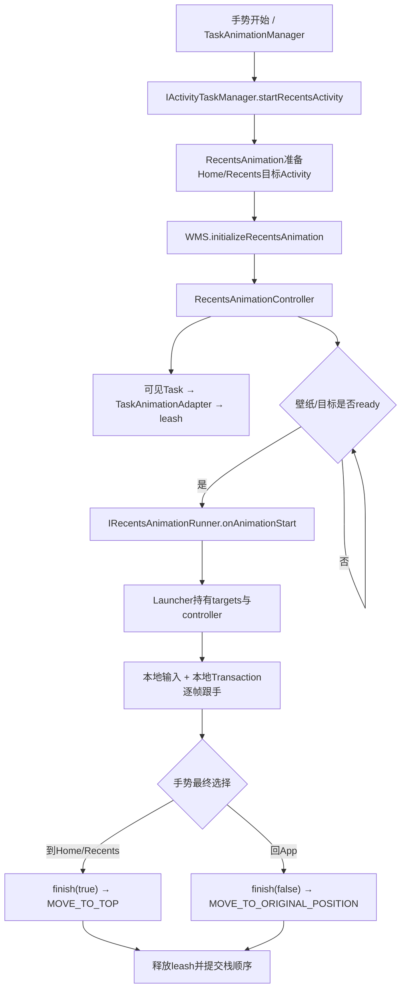
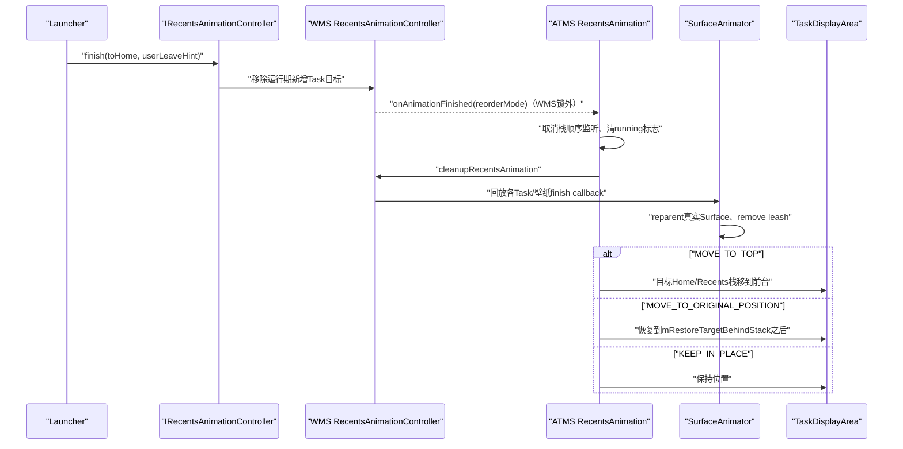
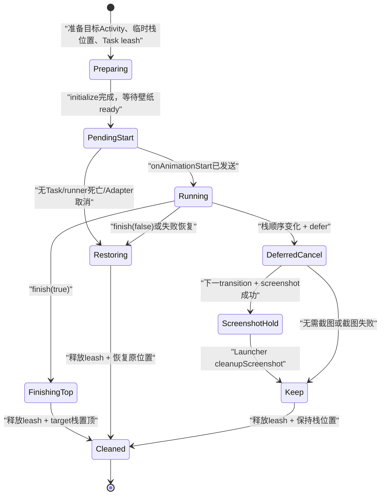

# 224 Android RecentsAnimationController手势控制、输入消费者与结束提交

> 源码版本：Android 11 / `android-11.0.0_r48`  
> 学习方式：macOS只读核源，不编译、不运行AOSP  
> 本章主线：Quickstep发起Recents Animation，WMS交出Task leash，Launcher本地跟手，最后由system_server提交Task层级

## 1. 本章要解决什么问题

上一章讲普通Remote Animation：转场已确定，远端播放一段Animator，然后调用finished。

本章进入交互式Recents Animation：用户手指可能上滑、停住、反向、进入Overview、回Home或返回原App。系统怎样在整个手势期间保持真实Task可控，同时确保最后的Activity/Task层级与画面一致？

## 2. 最重要的一句话

手势进度不需要每帧跨Binder传给WMS。

Quickstep收到输入后在自己的进程中计算矩阵，并直接用`SurfaceControl.Transaction`修改Task leash；Binder Controller主要处理控制面的离散命令，例如启用输入接管、截图、改变系统栏归属、完成到Home或App。

## 3. 三层职责先分清

```text
Quickstep / Launcher进程
  读取手势、算progress、逐帧改leash、决定最终方向

RecentsAnimationController（WMS）
  创建Task leash、发targets、输入路由协作、截图、取消、释放动画控制

RecentsAnimation（ATMS/WM桥）
  准备Home/Recents Activity、临时调整Task栈位置、完成时提交最终栈顺序
```

同名“Controller”在Launcher和system_server各有包装类，阅读时必须看包名。

## 4. 总体流程图



## 5. 客户端第一站：TaskAnimationManager

Launcher3的`TaskAnimationManager.startRecentsAnimation()`在UI线程建立`RecentsAnimationCallbacks`，注册手势状态与业务监听器，然后把真正Binder调用提交给`UI_HELPER_EXECUTOR`。

这样ActivityTaskManager调用不会阻塞Launcher主线程的触摸与绘制。

## 6. 为什么先结束旧动画

开始新Recents Animation前，如果`mController`仍非null，源码记录错误并强制`finishRunningRecentsAnimation(false)`。

一套手势状态只能对应一组当前Task leash；两场动画同时控制同一Task会造成矩阵、输入和最终栈顺序冲突。

## 7. initialized不等于started

Launcher先设置`STATE_RECENTS_ANIMATION_INITIALIZED`，但此时system_server可能仍在准备Home/Recents Activity、壁纸和Task leash。

只有收到`onAnimationStart()`并分发给监听器后，才真正拥有可用targets。

## 8. ActivityManagerWrapper做什么

SystemUI shared里的`ActivityManagerWrapper.startRecentsActivity()`把Launcher监听器包装成`IRecentsAnimationRunner.Stub`。

它负责平台`RemoteAnimationTarget[]`与兼容对象之间的转换，不负责每帧手势动画。

## 9. IRecentsAnimationRunner有三个回调

```text
onAnimationStart(controller, apps, wallpapers, homeInsets, minimizedHomeBounds)
onAnimationCanceled(nullable TaskSnapshot)
onTaskAppeared(RemoteAnimationTarget)
```

相比普通Remote Animation，多了双向Controller、取消截图和运行期新增Task目标。

## 10. Runner为什么是oneway

`IRecentsAnimationRunner.aidl`声明`oneway interface`，WMS发送start/cancel/taskAppeared时不等待Launcher Binder线程做完UI工作。

Launcher收到后再post到主线程，降低锁与Binder线程相互等待风险。

## 11. 谁可以调用startRecentsActivity

ATMS执行：

```java
enforceCallerIsRecentsOrHasPermission(
    MANAGE_ACTIVITY_STACKS,
    "startRecentsActivity()");
```

合法的Recents组件可调用，其他进程需要系统级栈管理权限；普通应用不能借此控制任意Task Surface。

## 12. 原始调用身份怎样保存

ATMS先记录Binder calling PID/UID，再清除calling identity。

它用这两个值查`WindowProcessController caller`，稍后通过`setRunningRecentsAnimation(true/false)`标记真正发起动画的进程。

## 13. runner为null代表预加载

同一个API允许`recentsAnimationRunner=null`。

此时只执行`preloadRecentsActivity()`，提前创建/附加Recents Activity并完成部分measure准备，不会创建RecentsAnimationController或交出Task leash。

## 14. 预加载为何不把Activity真正显示出来

后台启动使用`ActivityOptions.setAvoidMoveToFront()`以及`FLAG_ACTIVITY_NO_ANIMATION`。

目标是让进程、Activity对象和View准备更早，而不是在用户尚未手势时突然把Overview放到前台。

## 15. 预加载后的停止策略

目标Activity若尚未STOPPING/STOPPED，源码把它加入stopping列表，并选择延迟到idle再真正stop。

这样它还有机会在非stopped的ViewRoot状态下完成一次traversal，提前初始化measure等内容。

## 16. targetActivityType怎样决定

若目标Intent component等于系统配置的Recents component，类型为`ACTIVITY_TYPE_RECENTS`；否则为`ACTIVITY_TYPE_HOME`。

所以“完成到Home”在源码中更准确的说法是“把目标Home/Recents栈移到顶部”。

## 17. 先找现有目标栈和Activity

`RecentsAnimation.startRecentsActivity()`先按target activity type找栈，再按当前user和Intent base component找目标Task顶部Activity。

存在就复用，不存在才在后台创建。

## 18. 为什么要记mRestoreTargetBehindStack

已有Home/Recents栈时，源码记录当前位于它上方的栈。

如果手势最后返回App，目标栈必须恢复到动画前的位置；这个引用就是`REORDER_MOVE_TO_ORIGINAL_POSITION`的锚点。

## 19. 找不到上方栈为何启动前取消

若目标栈已经没有任何栈在它上方，说明它本来就在最前或场景不符合“从App进入Recents”。

源码调用`onAnimationCanceled(null)`并返回，不制造没有有效前景App可缩小的动画。

## 20. 启动功耗提示与指标

目标Activity不存在或尚不可见时，RootWindowContainer发送launch power hint；ActivityMetricsLogger也登记LaunchingState。

Recents手势既是Surface动画，也是一次可能需要启动/唤醒Launcher Activity的系统启动事件。

## 21. 为什么deferWindowLayout

准备期间要移动栈、创建Activity、设置launch-behind、初始化多组动画Surface。

`deferWindowLayout()`把中间状态的重复layout推迟，到finally中的`continueWindowLayout()`统一收敛，减少半完成层级被观察到的机会。

## 22. 已有目标栈怎样临时摆放

源码调用`moveStackBehindBottomMostVisibleStack(targetStack)`，把Home/Recents栈放到最底部可见App栈后方。

这样前景App仍覆盖在上面，手势缩小时后面的目标Activity可以逐渐露出。

## 23. 同一Home栈可能有多个Task

例如默认Launcher与第三方Launcher可以共存于Home类型栈。

若目标Activity所在Task不是该栈顶部Task，源码先`positionChildAtTop(task)`，确保这次目标Launcher位于正确位置。

## 24. 新建目标Activity的特殊处理

后台启动后同样把目标栈移动到可见App之后，并准备/执行`TRANSIT_NONE`。

这里不播放普通AppTransition动画；真正视觉过渡即将由RecentsAnimation的Task leash接管。

## 25. mLaunchTaskBehind的意义

目标Activity被设置：

```java
targetActivity.mLaunchTaskBehind = true;
```

这让Home/Recents Activity在手势期间保持可见/可绘制，却仍位于前景App后面，不立即夺走最终前台栈语义。

## 26. 为什么先捕获Task再更新可见性

源码先初始化Recents Animation、获取当前可见Task控制权，然后才`ensureActivitiesVisible(..., PRESERVE_WINDOWS)`。

如果先改变可见性，某些前景Task可能先被隐藏或重建，来不及成为远程动画目标。

## 27. 开新动画前先取消旧Controller

WMS先以`REORDER_MOVE_TO_ORIGINAL_POSITION`同步取消旧Recents Animation，再创建新Controller。

旧动画必须先把Home/Recents栈恢复并释放leash，不能只覆盖一个成员变量引用。

## 28. WMS初始化入口

```java
mWindowManager.initializeRecentsAnimation(
    targetActivityType,
    runner,
    callbacks,
    displayId,
    recentTaskIds,
    targetActivity);
```

WMS保存唯一`mRecentsAnimationController`，调用initialize，并更新AppTransition booster。

## 29. RecentsAnimation与Controller的回调关系

`RecentsAnimation`实现`RecentsAnimationCallbacks`。

Controller只决定“动画结束，应该用哪个reorderMode”；真正移动Home/Recents栈、恢复launch-behind和重新resume Activity由RecentsAnimation执行。

## 30. Controller初始化先注册AppTransition监听

这个监听器用于“延迟取消到下一场AppTransition开始或取消”的功能。

它不是监听本次手势每一帧，而是为手势期间又启动其他Task时平滑交接。

## 31. 初始目标从哪些Task来

Controller取得默认TaskDisplayArea的`getVisibleTasks()`，并把目标Home/Recents栈的所有leaf Task补入集合且去重。

所以targets既包括屏幕上可见App，也包括位于后方、即将被露出的目标栈Task。

## 32. 为什么补入目标栈Task

Home/Recents当前可能被前景App完全遮住，不一定出现在普通可见Task结果中。

但手势需要控制或至少正确分层显示它，因此必须显式纳入动画集合。

## 33. 哪些Task被跳过

源码跳过：

```text
config.tasksAreFloating()
WINDOWING_MODE_SPLIT_SCREEN_PRIMARY
```

浮动Task与分屏主侧有独立窗口管理语义，不按普通全屏Recents target处理。

## 34. recentTaskIds参与什么

每个Task创建Adapter时传入：

```java
isRecentTaskInvisible = !recentTaskIds.get(taskId)
```

最终写入`RemoteAnimationTarget.isNotInRecents`，告诉Launcher该Task不在最近任务列表中。

## 35. isNotInRecents不等于Surface不可见

一个Task可以当前在屏幕上、需要动画，却因为排除策略不显示在Recents列表。

该字段描述任务模型归属，不决定是否创建leash。

## 36. TaskAnimationAdapter复用SurfaceAnimator

`addAnimation()`调用：

```java
task.startAnimation(
    task.getPendingTransaction(),
    taskAdapter,
    hidden,
    ANIMATION_TYPE_RECENTS,
    finishedCallback);
```

因此Task真实Surface仍被放入临时leash，最终由SurfaceAnimator callback恢复。

## 37. Recents以Task为粒度

普通Remote Animation的opening/closing常以Activity为目标；Recents Controller为每个Task创建`TaskAnimationAdapter`。

最近任务卡片和手势返回对象本来就是Task，Task内多个Activity应作为整体移动。

## 38. Adapter.startAnimation仍然只截获

它设置初始position/crop，并保存：

```text
mCapturedLeash
mCapturedFinishCallback
mLastAnimationType
```

与上一章一样，system_server不在这里运行逐帧Animator。

## 39. Recents初始crop怎样算

Adapter把leash放到Task相对parent的`mLocalBounds.left/top`，再将local bounds offset到`(0,0)`作为window crop。

位置属于父坐标系，crop属于leash局部尺寸，不能把屏幕left/top重复放进crop。

## 40. 没有任何动画Task怎么办

`mPendingAnimations.isEmpty()`时，以`REORDER_MOVE_TO_ORIGINAL_POSITION`取消。

没有Task leash就无法进行Recents手势，目标栈临时位置必须恢复。

## 41. 初始化时建立runner死亡监听

有目标后立即`linkToDeathOfRunner()`。

失败则取消并恢复原位置；运行中runner死亡也走同一方向，避免Launcher进程消失后Home栈卡在临时位置。

## 42. 壁纸为何影响启动

若目标Activity可作为wallpaper target，Controller请求重做壁纸布局。

上滑时Home壁纸通常需要随目标一起正确显现，过早交出Task leash可能先出现黑底或旧壁纸状态。

## 43. minimizedHomeBounds是什么

Controller保存root Home Task的bounds；真正start时只有目标Activity处于split-screen secondary才把它传给Launcher，否则传null。

它帮助Launcher理解分屏下Home被最小化后的目标几何，不是所有设备恒有的屏幕矩形。

## 44. initialize为何主动performSurfacePlacement

Task animation adapter已安装，壁纸和目标可见性也已变化，需要一次SurfacePlacement创建leash、应用层级与更新窗口状态。

之后Controller才有可能从Adapter拿到有效captured leash。

## 45. FixedRotation与StatusBar也要知道

初始化通知FixedRotationTransitionListener开始Recents动画，并调用`StatusBarManagerInternal.onRecentsAnimationStateChanged(true)`。

手势窗口动画不是孤立效果；旋转变换与系统栏状态必须在同一生命周期内协调。

## 46. pending start为什么存在

Controller构造时`mPendingStart=true`。

即使Task leash已经创建，也可能等待目标壁纸可用；只有ready后才调用runner的`onAnimationStart()`。

## 47. wallpaper ready门

`checkAnimationReady()`计算：

```java
!isTargetOverWallpaper()
    || (wallpaperTarget != null
        && wallpaperTransitionReady())
```

不需要壁纸则立即允许；需要壁纸时必须已有wallpaper target且其转场ready。

## 48. pendingStart防什么竞态

Wallpaper/layout检查可能多次触发。

`startAnimation()`先检查`!mPendingStart || mCanceled`，并在成功构造目标后设false，防止重复发送一组leash给runner。

## 49. startAnimation构造App targets

Controller倒序遍历TaskAnimationAdapter，调用`createRemoteAnimationTarget()`。

若某Task已找不到top visible Activity或主窗口，就回放其finish callback并从pending集合移除。

## 50. target的mode怎样决定

Task顶部可见Activity的activity type等于目标Home/Recents类型时为`MODE_OPENING`，其他Task为`MODE_CLOSING`。

这里没有普通Remote Animation的`MODE_CHANGING`分支。

## 51. Recents target的几何

Target包含Task屏幕bounds、相对父节点localBounds、prefix order、主窗口clip/contentInsets、windowConfiguration和Task leash。

position使用Task bounds左上角；Launcher仍应优先区分屏幕与父坐标系。

## 52. contentInsets也叠加letterbox

Controller先读主窗口contentInsets，再加主窗口ActivityRecord的letterbox insets。

手势卡片裁剪若忽略信箱区域，会在宽高比不匹配应用上出现内容错位。

## 53. wallpaper targets何时创建

App targets非空后，Controller为当前可见wallpaper windows启动WallpaperAnimationAdapter。

Recents传入duration和statusBar delay均为0，因为手势持续时间由用户决定，不是固定时长动画。

## 54. Recents Adapter duration为何为0

`TaskAnimationAdapter.getDurationHint()`返回0，status bar start time返回当前uptime。

这不表示动画瞬间结束；它表示本地AppTransition时长模型不适用于开放式手势。

## 55. start前再performLayout的原因

Controller在回调runner前执行一次`performLayout(false, false)`，注释说明旋转后要取得正确content insets。

目标数组中的几何是一个准备时快照，必须尽量与当前Display配置一致。

## 56. Home contentInsets的回退

若目标Activity主窗口已存在，使用其contentInsets；否则调用WMS取得Display stable insets。

预加载也不能保证窗口必然已创建，所以协议必须有无主窗口的回退数据。

## 57. onAnimationStart传了什么

```java
mRunner.onAnimationStart(
    mController,
    appTargets,
    wallpaperTargets,
    contentInsets,
    minimizedHomeBounds);
```

与普通Remote Animation不同，finished callback没有单独参数；Launcher通过传入的`IRecentsAnimationController.finish()`结束。

## 58. start RemoteException的r48边界

当前源码catch `RemoteException`后只记录错误，未在这个catch块中立即调用cancel。

runner已在initialize阶段linkToDeath，进程死亡通常由DeathRecipient收口；但阅读时应如实保留“start发送失败不直接cancel”的实现差异，不能套用上一章行为。

## 59. 收到start后如何切线程

`ActivityManagerWrapper`先把平台target包装为Compat；`RecentsAnimationCallbacks`再把创建Controller与监听器通知post到Launcher主线程。

Binder线程不直接访问RecentsView、GestureState或动画View对象。

## 60. start与cancel可能乱序吗

客户端显式维护`mCancelled`。

若cancel先被处理、start后到，`onAnimationStart()`不会再通知正常监听器，而是异步调用`finishAnimationToApp()`，把服务端控制尽快归还。

## 61. Launcher本地Controller是什么

`com.android.quickstep.RecentsAnimationController`包装SystemUI shared的`RecentsAnimationControllerCompat`。

它增加线程切换、结束监听、系统栏标志、分屏最小化和截图清理协作，不是WMS创建leash的那个Controller。

## 62. 每帧progress在哪里

Launcher的Swipe Handler根据MotionEvent计算位移和动画进度，再通过持有的target leash更新矩阵、crop、alpha、corner radius等。

`IRecentsAnimationController.aidl`没有`setProgress(float)`，这正是“数据面本地、控制面Binder”的直接证据。

## 63. 为什么本地逐帧更跟手

若每个MOVE都要Launcher→system_server→SurfaceFlinger往返，会增加Binder调度与锁竞争。

直接对SurfaceControl提交Transaction缩短输入到合成属性更新路径，也允许与Launcher自身View动画在同一帧策略内协调。

## 64. 输入消费者为何预先注册

TouchInteractionService在用户解锁后创建`InputConsumerController.getRecentsAnimationInputConsumer()`并注册。

源码注释说明：动画中途才注册InputConsumer会cancel当前MotionEvent链，所以先建InputChannel，真正需要时只切换enabled和可见路由。

## 65. 注册InputConsumer做了什么

客户端调用WMS `createInputConsumer()`取得一端InputChannel，并创建`BatchedInputEventReceiver`。

WMS侧保存名为`recents_animation_input_consumer`的InputConsumerImpl及另一端channel。

## 66. 注册不等于立即抢输入

InputMonitor每次更新先hide所有InputConsumer。

只有Recents Controller存在、`mInputConsumerEnabled=true`、窗口属于正在动画的非目标App时，才把Recents consumer显示到对应窗口之上。

## 67. enableInputConsumer的客户端顺序

Launcher包装执行：

```java
mController.hideCurrentInputMethod();
mController.setInputConsumerEnabled(true);
```

先隐藏IME可减少键盘窗口与手势区域、Insets动画之间的冲突，再启用App区域输入接管。

## 68. setInputConsumerEnabled服务端做什么

在WMS锁内更新布尔值，强制`updateInputWindowsLw(true)`并schedule animation。

它不是直接读取触摸事件，而是让下一次InputWindow快照把预注册consumer放到正确位置。

## 69. 哪些Activity会被覆盖输入

`shouldApplyInputConsumer(activity)`要求：

```text
consumer已enabled
activity非null
不是目标Home/Recents Activity
activity属于某个正在动画Task
```

因此Launcher自己的目标窗口不会被自己的Recents consumer再次覆盖。

## 70. consumer的触摸区域怎样设置

Controller取目标Home/Recents Activity主窗口bounds，写入consumer的`touchableRegion`，并按当前被遍历App窗口焦点设置hasFocus。

随后InputMonitor把consumer Surface reparent/show在命中的动画App窗口附近。

## 71. 为什么遍历到第一个命中后停止添加

`mAddRecentsAnimationInputConsumerHandle`成功show后设false。

一条Recents consumer channel代表本次手势输入接收端，不为每个动画窗口创建独立channel。

## 72. BatchedInputEventReceiver怎样消费

SystemUI shared的InputConsumerController使用`BatchedInputEventReceiver`，把事件交给注册的InputListener，finally中调用`finishInputEvent(event, handled)`。

输入仍要完成回执，否则InputDispatcher会保留未完成事件并可能造成超时问题。

## 73. 注册时可选哪个VSync

`registerInputConsumer(boolean withSfVsync)`可选择普通App Choreographer或SF Choreographer实例。

Recents当前TouchInteractionService调用无参版本；PIP等路径可显式选择SF VSync，不能把所有InputConsumer都写成SF VSync批处理。

## 74. runner死亡为何还销毁consumer

`binderDied()`先取消动画恢复原位置，再显式`destroyInputConsumer(INPUT_CONSUMER_RECENTS_ANIMATION)`。

控制进程死亡后，即使系统侧enabled状态来不及复位，也不能留下吞掉应用触摸的孤儿输入窗口。

## 75. IRecentsAnimationController的控制面能力

主要方法包括：

```text
screenshotTask
finish
setInputConsumerEnabled
setAnimationTargetsBehindSystemBars
hideCurrentInputMethod
setDeferCancelUntilNextTransition
cleanupScreenshot
setWillFinishToHome
removeTask
```

没有逐帧矩阵API。

## 76. screenshotTask怎样限制目标

服务端只遍历`mPendingAnimations`，taskId匹配才调用TaskSnapshotController同步截图。

Launcher不能通过这个Controller随意截取不属于当前Recents动画的其他Task。

## 77. 截图从哪里取

Controller让TaskSnapshotController对目标Task执行snapshot、加入skip closing snapshot集合，再以内存路径、全分辨率获取TaskSnapshot。

这是Task快照，不是对最终面板输出做全屏截屏。

## 78. screenshotTask里的userId边界

r48这段`getSnapshot(taskId, 0 /* userId */, ...)`写死0，而延迟取消的`screenshotRecentTask()`使用`task.mUserId`。

这是源码真实差异，分析多用户截图问题时不能假设两条路径参数完全相同。

## 79. 系统栏标志归谁控制

Launcher跨过手势阈值后可调用`setAnimationTargetsBehindSystemBars()`。

服务端对非目标Task设置`setCanAffectSystemUiFlags(behindSystemBars)`，决定系统栏外观继续取动画App还是改由Home/Launcher状态主导。

## 80. 参数命名容易反读

Launcher的`setUseLauncherSystemBarFlags(true)`实际调用服务端：

```java
setAnimationTargetsBehindSystemBars(false)
```

意思是旧App targets不再位于/控制系统栏背后，于是使用Launcher的系统栏flags。

## 81. setWillFinishToHome只影响failsafe

该方法更新`mWillFinishToHome`。

它不会立刻移动Home栈；当外部触发1秒failsafe时，Runnable才据此选择`MOVE_TO_TOP`还是`MOVE_TO_ORIGINAL_POSITION`。

## 82. 1秒failsafe不是启动总超时

Controller常量`FAILSAFE_DELAY=1000`，但initialize/startAnimation没有自动post它。

WMS收到`triggerAnimationFailsafe()`消息后才调用`scheduleFailsafe()`。因此不能把它写成“每场Recents动画启动后固定1秒必须结束”。

## 83. 正常finish的两个方向

Launcher调用：

```text
finish(true, sendUserLeaveHint)  → REORDER_MOVE_TO_TOP
finish(false, sendUserLeaveHint) → REORDER_MOVE_TO_ORIGINAL_POSITION
```

UI包装名`finishAnimationToHome/ToApp`是更直观的语义。

## 84. finish为什么先移除新增Task目标

运行期间通过`onTaskAppeared()`加入的目标记录在`mPendingNewTaskTargets`。

最终finish前先尝试`removeTaskInternal()`，避免临时进入动画集合的新Task影响原始Home/App提交关系。

## 85. finish回调为何必须在WMS锁外调用

源码明确先退出`synchronized(mService.getWindowManagerLock())`，再调用`mCallbacks.onAnimationFinished()`。

回调进入RecentsAnimation后会取得ATMS全局锁、执行WMS清理和栈移动；持有旧锁调用会放大锁顺序死锁风险。

## 86. sendUserLeaveHint有什么用

MOVE_TO_TOP且该值为true时，RecentsAnimation设置`mUserLeaving=true`并用`moveTaskToFront()`。

这允许前一个Activity收到用户离开语义，并可能按其PiP配置进入画中画；false则只把目标栈moveToFront。

## 87. 三种ReorderMode总表

| 模式 | 含义 | 常见来源 |
|---|---|---|
| `REORDER_MOVE_TO_TOP` | 目标Home/Recents栈成为前台 | 正常完成到Home/Overview、failsafe判定toHome |
| `REORDER_MOVE_TO_ORIGINAL_POSITION` | 恢复目标栈到原来后方位置 | 正常返回App、runner死亡、无目标失败 |
| `REORDER_KEEP_IN_PLACE` | 保持当前栈位置，不做普通重排转场 | 延迟取消交接、显式取消不恢复位置 |

## 88. MOVE_TO_TOP怎样提交

RecentsAnimation先把目标Activity加入`mNoAnimActivities`，再把其Task或整个targetStack移到前台。

视觉已经由手势完成，不应在提交真实栈顺序时再叠一段普通窗口动画。

## 89. MOVE_TO_ORIGINAL_POSITION怎样提交

使用启动前保存的`mRestoreTargetBehindStack`，调用`moveStackBehindStack(targetStack, restoreStack)`。

这把临时放到可见App后方的Home/Recents栈恢复到原有相对位置，用户继续看到原App。

## 90. KEEP_IN_PLACE为何提前return

它只按条件更新目标栈可见性，不执行后续prepare/execute AppTransition和resume逻辑。

该模式用于已有下一场转场接手的交接场景，强行再排一次栈会打乱新的启动。

## 91. 结束提交的时序图



## 92. 清理为何放在Surface transaction中

RecentsAnimation调用`mWindowManager.inSurfaceTransaction()`，内部先`cleanupRecentsAnimation()`再移动栈。

释放多条Task leash、恢复Surface父节点与最终窗口层级尽量在同一合成事务边界收敛，减少中间闪烁。

## 93. WMS何时清空唯一Controller

`cleanupRecentsAnimation()`先把`mRecentsAnimationController=null`，再调用旧Controller的`cleanupAnimation()`。

这样后续窗口/输入查询不会继续把正在清理的对象当成活跃Recents控制者。

## 94. cleanupAnimation如何释放Task

倒序遍历pending TaskAnimationAdapter，恢复Task可影响SystemUI flags，回放captured finish callback并移出列表。

SurfaceAnimator收到回调后拆leash，真实Task Surface回到普通层级。

## 95. KEEP/TOP为何dontAnimateDimExit

对`MOVE_TO_TOP`或`KEEP_IN_PLACE`，清理前调用`task.dontAnimateDimExit()`。

这避免Task离开Recents控制时又补一段dim layer退出动画，造成已完成手势后的亮度闪动。

## 96. 还要清哪些状态

Controller还会：

```text
释放wallpaper animation
移除failsafe Runnable
注销AppTransition listener
unlink runner death并清runner引用
取消残留截图Animator
强制更新InputWindows
结束fixed rotation协作
通知StatusBar recents running=false
```

## 97. target Activity的launch-behind何时恢复

WMS Controller释放leash后，RecentsAnimation把`targetActivity.mLaunchTaskBehind=false`。

launch-behind只是手势期间的临时可见性工具，最终Activity可见性应重新由真实栈顺序决定。

## 98. 清理后为何还prepare TRANSIT_NONE

TOP或ORIGINAL_POSITION分支改变了栈顺序与Activity可见性。

源码准备`TRANSIT_NONE`、ensure visible、resume focused stacks，再execute transition，让生命周期和窗口可见状态收敛，但不叠加普通视觉动画。

## 99. organized root Task的额外同步

若rootTask被TaskOrganizer组织，完成后强制`dispatchTaskInfoChanged()`。

手势期间客户端状态可能变化，Organizer需要一份最新TaskInfo与system_server最终状态重新对齐。

## 100. onTaskAppeared为何存在

Recents动画运行中，用户可能从Overview启动新Task，或系统出现新的enter Task。

`Task.applyAnimationUnchecked()`检测活跃Recents Controller后，不走普通动画，而调用`addTaskToTargets()`把它动态纳入控制。

## 101. 新Task target为何hidden启动

`createTaskRemoteAnimation()`调用`addAnimation(..., hidden=true, finishedCallback)`。

在Launcher收到target并设置正确初始变换前先隐藏，可避免新Task以最终全屏状态闪现一帧。

## 102. onTaskAppeared是单个target增量

若Task已在pending动画集合就不重复发送；否则创建leash/target并通过oneway runner回调。

Launcher无需重新接收整组数组，可以增量接管新Task。

## 103. Launcher怎样替换旧appeared target

TaskAnimationManager保存`mLastAppearedTaskTarget`。

新taskId不同且Controller仍活跃时，先调用`removeTaskTarget(old)`，再把新target写入GestureState。

## 104. removeTask为何要求Task isOnTop

服务端只在taskId匹配且`target.mTask.isOnTop()`时移除。

注释说明要等Task已经对用户可见，避免在remove动画与Task真正可见之间形成闪烁窗口。

## 105. 单个Task Adapter取消与普通Remote不同

Recents的`TaskAnimationAdapter.onAnimationCancelled()`只要任意一个Task animator被取消，就取消整场并恢复原位置。

上一章普通Remote Controller允许局部Record收缩；Recents手势依赖整组Task一致性，策略更严格。

## 106. 栈顺序变化为什么会触发延迟取消

RecentsAnimation注册`OnStackOrderChangedListener`。

当新的可见栈不是当前动画Task，或它正是目标Home Activity，且Launcher请求defer时，系统准备`TRANSIT_NONE`并标记“下一场transition开始时取消”。

## 107. 为什么不能立刻拆leash

另一Task启动瞬间若直接移除当前Task leash，Launcher画面可能从live tile突然跳回真实全屏窗口，产生闪烁。

延迟到下一场AppTransition开始，使旧手势画面和新启动动画有明确交接点。

## 108. deferred cancel的两个开关

```text
mRequestDeferCancelUntilNextTransition：是否请求延迟
mCancelDeferredWithScreenshot：延迟时是否用截图替换leash内容
```

只有前者为true时，栈顺序变化才设置`mCancelOnNextTransitionStart`。

## 109. AppTransition listener何时继续取消

下一场AppTransition开始或被取消，listener都调用`continueDeferredCancel()`。

它先注销自身，确认Controller未cancel，再按标志调用`cancelAnimationWithScreenshot()`。

## 110. 截图取消怎样避免闪烁

Controller对旧Task生成TaskSnapshot，创建`TaskScreenshotAnimatable`，然后让新的SurfaceAnimator从Task SurfaceAnimator转移动画。

真实Task可脱离原leash去参与下一转场，而Launcher暂时看到相同内容的截图并继续控制视觉外壳。

## 111. cancel回调中的null含义

`onAnimationCanceled(null)`表示leash立即失效，Launcher应直接清理。

非null TaskSnapshot表示画面已被截图替代，Launcher必须先把live tile切到截图，等不再需要后调用`cleanupScreenshot()`。

## 112. cleanupScreenshot完成什么

服务端取消`mRecentScreenshotAnimator`并清引用。

截图Animator的finish callback再通知RecentsAnimation完成对应reorderMode，最终释放延迟取消所保留的控制。

## 113. 截图失败怎么办

若`screenshotRecentTask()`返回null，Controller立即调用`onAnimationFinished()`，不能等待一个永远不存在的`cleanupScreenshot()`。

客户端仍会收到cancel null，按立即失效路径清理。

## 114. cancel的其他入口

常见包括：

```text
新Recents动画开始前取消旧动画
无可见Task/无App窗口
runner linkToDeath失败或binderDied
任意Task AnimationAdapter被取消
调用cancelRecentsAnimation
外部触发failsafe
栈顺序变化后的延迟取消
```

不同入口选择TOP、ORIGINAL或KEEP，不能统一写成“取消就回App”。

## 115. cancelRecentsAnimation布尔参数

ATMS API的`restoreHomeStackPosition=true`映射`MOVE_TO_ORIGINAL_POSITION`；false映射`KEEP_IN_PLACE`。

它不是正常`finish(toHome)`的同一个布尔含义，两个API不要靠参数位置类比。

## 116. runner死亡的完整后果

DeathRecipient选择`MOVE_TO_ORIGINAL_POSITION`取消，通知/清理动画，并销毁Recents InputConsumer。

调用者进程的`runningRecentsAnimation`标志则在RecentsAnimation.finishAnimation中清除。

## 117. 状态图



## 118. 四个“完成”点不要混淆

```text
Launcher手势动画到达终点
  只是客户端视觉决策完成

IRecentsAnimationController.finish返回
  Binder请求已处理，不保证屏幕已显示

SurfaceAnimator finish callback执行
  leash层级已在Transaction中恢复/删除

SurfaceFlinger/HWC present fence signal
  才接近实际显示时间证据
```

本章前三者源码没有自动等价于第四个。

## 119. 常见误解纠正

| 误解 | 正确理解 |
|---|---|
| 手势progress每帧传给WMS | Launcher本地直接改Task leash |
| 注册InputConsumer后立即吞输入 | 还需Controller enable并由InputMonitor show |
| 1秒failsafe是所有动画固定时长 | 只有外部trigger后才post的兜底 |
| finish(false)只是停止Animator | 还会恢复目标栈原始位置并收敛生命周期 |
| cancel一定返回原App | 可能TOP、ORIGINAL或KEEP |
| 普通Remote与Recents只差一个接口名 | Recents还管理输入、动态Task、截图交接与栈提交 |

## 120. macOS只读练习一：追启动主链

```bash
cd /Users/ninebot/androidSource
rg -n "startRecentsActivity|initializeRecentsAnimation|mLaunchTaskBehind|moveStackBehindBottomMostVisibleStack" \
  packages/apps/Launcher3/quickstep \
  frameworks/base/packages/SystemUI/shared/src \
  frameworks/base/services/core/java/com/android/server/wm
```

目标：用自己的话解释为什么Home/Recents Activity先放到可见App后方，却要设置launch-behind保持可绘制。

## 121. macOS只读练习二：验证“没有setProgress”

```bash
cd /Users/ninebot/androidSource
sed -n '1,180p' frameworks/base/core/java/android/view/IRecentsAnimationController.aidl
sed -n '1,120p' frameworks/base/core/java/android/view/IRecentsAnimationRunner.aidl
```

目标：列出所有离散控制方法，并说明每帧矩阵为什么由Launcher直接写leash。

## 122. macOS只读练习三：追输入接管

```bash
cd /Users/ninebot/androidSource
rg -n "registerInputConsumer|setInputConsumerEnabled|shouldApplyInputConsumer|updateInputConsumerForApp" \
  packages/apps/Launcher3/quickstep/recents_ui_overrides \
  frameworks/base/packages/SystemUI/shared/src \
  frameworks/base/services/core/java/com/android/server/wm
```

目标：画出“预注册InputChannel→手势中enable→InputMonitor把consumer放到动画App之上→Launcher receiver回执事件”的链路。

## 123. macOS只读练习四：手算结束模式

判断下列场景的reorderMode：

```text
A. 用户上滑到底回Home
B. 用户反向滑动回原App
C. Launcher进程死亡
D. 栈顺序变化且请求截图延迟交接
E. cancelRecentsAnimation(false)
```

参考：A TOP；B ORIGINAL；C ORIGINAL；D KEEP并等待下一transition/截图清理；E KEEP。

## 124. 源码阅读导航

```text
packages/apps/Launcher3/quickstep/src/com/android/quickstep/TaskAnimationManager.java
packages/apps/Launcher3/quickstep/src/com/android/quickstep/RecentsAnimationCallbacks.java
packages/apps/Launcher3/quickstep/src/com/android/quickstep/RecentsAnimationController.java
packages/apps/Launcher3/quickstep/recents_ui_overrides/src/com/android/quickstep/TouchInteractionService.java
frameworks/base/packages/SystemUI/shared/src/com/android/systemui/shared/system/ActivityManagerWrapper.java
frameworks/base/packages/SystemUI/shared/src/com/android/systemui/shared/system/InputConsumerController.java
frameworks/base/core/java/android/view/IRecentsAnimationRunner.aidl
frameworks/base/core/java/android/view/IRecentsAnimationController.aidl
frameworks/base/services/core/java/com/android/server/wm/RecentsAnimation.java
frameworks/base/services/core/java/com/android/server/wm/RecentsAnimationController.java
frameworks/base/services/core/java/com/android/server/wm/InputMonitor.java
frameworks/base/services/core/java/com/android/server/wm/Task.java
```

## 125. 本章复读后的精确结论

1. Recents Animation把可见Task和目标Home/Recents Task放入SurfaceAnimator leash，Launcher在本地按输入逐帧变换。  
2. target Activity通过临时栈位置和launch-behind保持“在后方但可绘制”，直到finish才提交真实前台关系。  
3. InputConsumer在服务启动后预注册，手势中只enable并更新InputWindow，避免中途创建channel打断Motion链。  
4. 正常finish、即时cancel、延迟cancel和截图交接是不同协议，最终可能TOP、ORIGINAL或KEEP。  
5. system_server始终保留Task层级、Activity生命周期、leash清理、runner死亡和failsafe的最终控制权。

## 126. 检查题

1. 为什么`IRecentsAnimationController`没有`setProgress()`？  
2. `mLaunchTaskBehind`与把目标栈移到App后方分别解决什么问题？  
3. InputConsumer的“registered”和“enabled/visible”有什么区别？  
4. `finish(true)`为何不仅是结束Animator，还要移动目标栈？  
5. 延迟取消为什么要等下一AppTransition，截图又解决什么闪烁？  
6. `REORDER_KEEP_IN_PLACE`与`MOVE_TO_ORIGINAL_POSITION`在真实Task层级上有什么差异？

## 127. 下一章预告

下一章继续深入Quickstep的数据面：`RemoteAnimationTargets`、TransformParams、TaskViewSimulator与SurfaceParams怎样把手势progress转换为Task leash的矩阵、裁剪、圆角和层级，并与Launcher自身View动画同帧提交。
