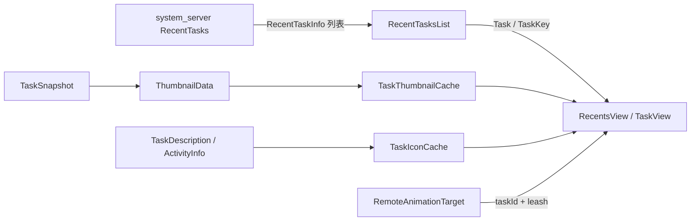
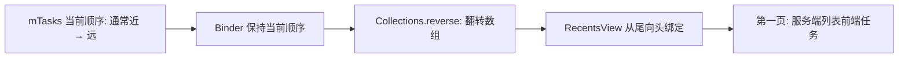
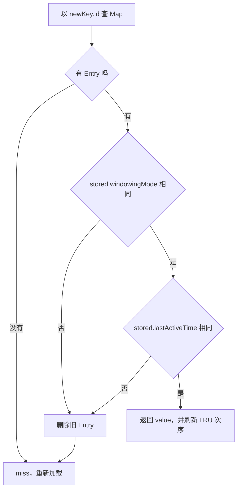
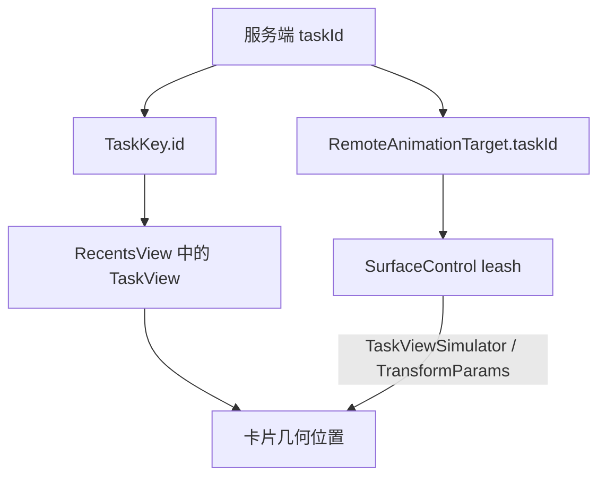

# 227 Android RecentTasks、TaskKey、ThumbnailData与Overview任务数据加载

> 源码版本：Android 11 / `android-11.0.0_r48`  
> 阅读方式：macOS 只读核源，不编译、不运行 AOSP

## 1. 先固定问题：Overview 的一张卡片究竟由谁提供

从应用上滑进入 Overview 时，屏幕上很快出现一组卡片：顺序先确定，图标和缩略图随后补齐，当前应用还能从实时画面平滑交给静态截图。这个结果很像一次完整查询，源码却把它拆成三条相互独立的数据链：

```text
任务列表：RecentTasks → RecentTaskInfo → RecentTasksList → Task / TaskKey
缩略图：TaskSnapshot → ThumbnailData → TaskThumbnailCache → TaskThumbnailView
图标：TaskDescription / ActivityInfo → TaskIconCache → TaskView
```

任务列表回答“有哪些卡片、以什么顺序出现”；缩略图回答“卡片里画什么”；图标链回答“怎样辨认应用及用户”。它们不是同一个 Binder 事务，返回时刻也不相同。`TaskView` 必须允许先绑定骨架，再异步补视觉数据。

本章围绕一个固定场景推演：

1. 用户从应用 A 上滑进入 Overview；
2. 最近任务中同时存在个人资料和工作资料的任务；
3. 列表加载期间又发生一次任务栈变化；
4. 当前应用先由实时动画的 `SurfaceControl` 控制句柄（live leash）显示，动画控制结束前再交给静态图。

需要回答的不是“有哪些类”，而是四个可验证的问题：

- system_server 以什么顺序过滤任务？
- Launcher 的 `changeId` 到底保证什么，又没有保证什么？
- `TaskKey.equals()` 与视觉最近最少使用缓存（LRU）的有效性为何是两套规则？
- 静态 `ThumbnailData` 和实时 `SurfaceControl leash` 怎样只靠 `taskId` 汇合？

本章只追“已有列表和快照怎样进入 Overview”；不展开 TaskSnapshot 在 system_server 内何时捕获、怎样落盘，那是下一章的主线。

先记住总原则：**列表、缩略图和图标只有身份关联，没有事务一致性。** 后面的缓存键、代际号和 View 绑定都在补偿这件事。

## 2. 拓扑与线程：两个后台串行器，三个到达时刻

Launcher 侧的统一入口是 `RecentsModel`。它持有 `RecentTasksList`、`TaskThumbnailCache`、`TaskIconCache` 和视觉变化监听器，但它不是任务真相的所有者；权威任务集合仍在 system_server 的 `RecentTasks`。



这里有两个不同的后台执行环境：

- `RecentTasksList` 把 recent-tasks Binder 查询交给 `UI_HELPER_EXECUTOR`；
- `RecentsModel` 为图标和缩略图建立名为 `TaskThumbnailIconCache` 的后台 Looper，两类视觉请求共享这条串行队列；
- 列表、图标和缩略图的业务回调最终回到主线程更新 View。

因此“卡片出现后图标稍晚”“低分图先出现再变清晰”不是反常状态，而是设计允许的增量装配。也不要把两个后台串行器混成一条队列：列表查询堵塞不等于视觉缓存 Looper 也被同一任务直接占住，反之亦然。

再看数据所有权：

| 层级 | 持有的数据 | 能否当作权威状态 |
|---|---|---|
| system_server `Task` | WindowContainer、Activity 层级、运行状态 | 是 |
| `RecentTaskInfo` | 跨 Binder 的序列化副本 | 否 |
| Launcher `Task` | 卡片所需字段及可变视觉引用 | 否 |
| `TaskKey` | 本地身份和部分版本字段 | 否 |
| live leash | 动画期间的实时 Surface 句柄 | 只在控制期有效 |

同名的 `com.android.server.wm.Task` 与 `com.android.systemui.shared.recents.model.Task` 不是同一个对象体系。读到 `Task` 时先看包名，能避免把 UI 模型误解成 WindowManager 容器。

## 3. Binder 入口：用户边界、可见权限与分块返回彼此独立

Launcher 的 `ActivityManagerWrapper.getRecentTasks()` 调用：

```text
IActivityTaskManager.getRecentTasks(
    numTasks,
    RECENT_IGNORE_UNAVAILABLE,
    currentUserId)
```

ATMS 入口按顺序取得 `callingUid`，用 `handleIncomingUser()` 解析目标用户，计算 `isGetTasksAllowed()`，然后持有 `mGlobalLock` 调入 `RecentTasks`。这里有两道不能混写的授权边界：

1. `handleIncomingUser()` 决定调用者能否指定这个用户；
2. `isGetTasksAllowed()` 决定在该用户范围内能否看到完整任务集合。

profile group 是主用户及其关联资料组成的用户组。Recents 组件访问同一 profile group 有专门通路；跨到其他用户仍受 `INTERACT_ACROSS_USERS` 或 `INTERACT_ACROSS_USERS_FULL` 等检查。通过用户边界不代表拥有完整 recent-tasks 可见权。

`getTasksAllowed` 在 r48 中满足任一条件即可为真：

- 调用 UID 与系统配置的 Recents 组件 UID 属于同一 appId；
- 持有 `REAL_GET_TASKS`；
- 兼容旧路径中，调用 UID 持有 `GET_TASKS` 且属于 privileged 应用。

没有完整可见权并不会让这个 API 立即抛权限异常，而是在后续过滤中缩小结果。真正越权指定用户时，`handleIncomingUser()` 才可能抛 `SecurityException`。这两类失败的外观完全不同。

服务端把结果包装为 `ParceledListSlice<RecentTaskInfo>`。它是 Binder 传输分块，不是业务分页：主 reply 先内联一段元素，接近建议 IPC 大小时放入 retriever Binder，客户端反序列化期间再同步 transact 拉取余项。

这解决的是“列表不能无限塞进一个 Parcel”，不是绝对保证任何单个超大 Parcelable 都不会超限。更重要的失败语义是：

- 初始 ATMS 调用发生 `RemoteException` 时，Launcher wrapper 返回空 `ArrayList`；
- 后续 retriever transact 发生 `RemoteException` 时，slice 反序列化器保留已取得的前缀；
- 所以调用方只看结果，不能区分“确实没有任务”“首个事务失败”和“只拿到部分前缀”。

`RecentTaskInfo` 仍只是副本。Launcher 修改它不会修改服务端 `Task`，启动或移动任务时必须再次携带 `taskId` 调 ATMS。

## 4. RecentTasks 的真实过滤顺序：先计 visible，再决定能否加入结果

`RecentTasks.getRecentTasksImpl()` 的控制流比“按权限过滤最近任务”更具体。以 Launcher 当前传入的 `RECENT_IGNORE_UNAVAILABLE` 为前提，顺序如下：

| 顺序 | 判断 | 失败后的结果 |
|---:|---|---|
| 1 | 目标 user 是否 running 且 unlocked | 整个查询返回空 |
| 2 | 为目标 user 载入持久 recent tasks | 建立查询基础 |
| 3 | 建立目标 user 同 profile group 的 `includedUsers` | 形成用户集合 |
| 4 | 按 `mTasks` 下标从 0 开始遍历 | 不在查询时重排 |
| 5 | `isVisibleRecentTask(task)` | 跳过不适合 Overview 的窗口任务 |
| 6 | `numVisibleTasks++`，再做 `isInVisibleRange()` | 可能消耗 visible 名额后被拒绝 |
| 7 | `res.size() >= maxNum` | 不再加入，但循环用 `continue` |
| 8 | task user 是否属于 `includedUsers` | 跳过其他 profile group |
| 9 | `realActivitySuspended` | 跳过 suspended 组件 |
| 10 | 低权限调用者的 UID 门 | 只保留自身有效 UID 任务 |
| 11 | auto-remove 且没有 top non-finishing Activity | 跳过已结束的一次性任务 |
| 12 | flag 要求忽略 unavailable，且 `!isAvailable` | 跳过不可用组件 |
| 13 | `!mUserSetupComplete` | 跳过未完成设置时产生的任务 |
| 14 | `createRecentTaskInfo(task, true)` | 才加入结果 |

第 6 步最值得停下来：`numVisibleTasks` 在 user、suspended、权限、available 等门之前增加。因此一个稍后被过滤掉的任务仍可能消耗 visible-range 预算；而 `maxNum` 比较的是已经加入 `res` 的数量，两者不是同一个计数器。

`isVisibleRecentTask()` 的排除项可以按用途分组：系统界面类型中的 Home、Recents、Dream；特殊窗口形态中的 Pinned、always-on-top 多窗口，以及分屏主区域最上方、会由分屏整体表示的任务；嵌入 `ActivityView` 或独占 single-task-instance display 的任务；还有锁定任务模式的根任务。Assistant 只有带 exclude flag 时才在这一层被排除。

低权限分支的代码看似允许 Home 或 `effectiveUid == callingUid`。但 Home 已被更早的 `isVisibleRecentTask()` 无条件排除，所以在这条 r48 查询链上，稳定可返回的是调用 UID 自己且通过其余所有门的任务；不能概括成“自己的任务和 Home”。共享 UID 也会被视为调用者自身。

目标用户检查与 profile 隐私也要分开。服务端查询入口只验证解析后的目标 user running + unlocked；`getProfileIds(userId, false)` 得到同一 profile group，正常有效用户集合通常已含目标 user，后面的 `add(userId)` 则保证目标 user 一定纳入。`enabledOnly=false` 也不等于“只含已启用资料”。

这段查询没有逐个检查关联 profile 是否解锁。Launcher 在构造完整 `Task` 时，才按每个 `taskKey.userId` 调用 `KeyguardManager.isDeviceLocked(userId)` 并写入 `Task.isLocked`。这道本地隐私状态会影响真实快照展示。

`createRecentTaskInfo(task, true)` 中的 `running` 指 `getTopNonFinishingActivity() != null`，不是“应用进程此刻存活”。运行中的任务把旧字段 `id` 设为 `taskId`，非运行任务把 `id` 设为 `INVALID_TASK_ID`；`persistentId` 始终是 `taskId`。现代 `TaskKey` 读取的是 `taskId`，不依赖已废弃的 `id`。

`stripExtras=true` 会以 `cloneFilter()` 生成 base Intent，并单独恢复 flags。action、data、type、identifier、package、component 和 categories 等过滤身份仍在；extras、ClipData、selector、sourceBounds、contentUserHint、launchToken 等非 filter 内容不随副本保留。展示模型不能被当成原始启动 Intent 的完整载荷。

## 5. 顺序与范围：reverse 改数组方向，不改最近性

`RecentTasks` 把 `mTasks` 维护为从列表前端到后端的 recent 顺序，通常是近到远。查询直接沿当前顺序输出，不会在调用瞬间按 `lastActiveTime` 再排序。Quick switch 期间可以短暂冻结：已有、非 affiliated 的任务即使变为活跃，也暂不移到首位，所以列表顺序可能与当下的活跃先后不一致；新增、删除和 affiliated task 仍可改变列表。解冻时才把指定的 top task 提到前面。

`isInVisibleRange()` 的判断也依赖这条原始遍历顺序：

1. 若没有 `RECENT_WITH_EXCLUDED`，带 exclude flag 的任务只有在原始 `taskIndex == 0` 时可继续；
2. 先保证配置的最小 visible 数量；
3. 若配置了最大 visible 数量，超过它就拒绝；
4. 否则还可由 inactive duration / session window 保留。

这里的 `taskIndex == 0` 不是“第一个 visible task”，也不是“第一个 included user 的 task”。`RECENT_WITH_EXCLUDED` 只跳过 exclude flag 这一项，并不会绕过 activity type、windowing mode、用户、权限、包状态、setup、range 或 `maxNum`。Launcher 只传 `RECENT_IGNORE_UNAVAILABLE`，没有请求全部 excluded 任务。

服务端结果保持当前 `mTasks` 的前端到后端顺序。`RecentTasksList.loadTasksInBackground()` 随即调用 `Collections.reverse(rawTasks)`，把本地数组方向翻转。`RecentsView.applyLoadPlan()` 又从数组尾部向头部取任务，并把尾项绑定到第一个任务页，所以屏幕第一页对应服务端列表前端的任务——正常未冻结时也就是最新任务。



reverse 只改变数组下标方向，不改 `lastActiveTime`，也不会重写服务端冻结期的顺序。遇到“最近任务方向反了”时，应分别核对服务端列表顺序、本地数组方向和页面坐标，不能只盯一个 reverse。

## 6. RecentTasksList 的 changeId：缓存代际，不是回调提交令牌

`RecentTasksList` 有三项关键状态：

```text
mResultsBg：UI_HELPER_EXECUTOR 上最近加载的 TaskLoadResult
mResultsUi：已经发布到主线程的 TaskLoadResult
mChangeId：Launcher 进程内的列表失效计数器
```

`mChangeId` 从 1 开始。task stack 改变、recent list 更新、task removed、activity pinned 或 unpinned 都会调用 `invalidateLoadedTasks()`：主线程侧立即把 `mResultsUi` 置为无效并递增 `mChangeId`，后台缓存清理则排入 `UI_HELPER_EXECUTOR`。

它不是服务端返回的 generation，也不与服务端每次变更一一对应。多种监听事件可以描述同一现实变化，进程重启后计数也重新开始。正确含义只有：**在这个 `RecentTasksList` 实例中，请求者拿到的编号是否仍等于当前编号。**

cache hit 时，源码先同步 `copyOf(mResultsUi)`，再把 callback `post` 到下一条主线程消息，因此 `getTasks()` 能先返回 request id。cache miss 则在 UI helper 上加载，回主线程后写 `mResultsUi` 并调用 callback。

最容易误读的是旧请求：

```text
主线程：请求 A，返回 id=7
后台：  A 正在查询
主线程：栈变化，changeId 变为 8；请求 B，返回 id=8
主线程：A 的结果仍可能发布并执行 applyLoadPlan
后台/主线程：随后 B 发布新结果
```

`TaskLoadResult.mId` 会阻止旧结果成为下一次 cache hit，却不会在发布 callback 时自动拒绝它。`RecentsView.reloadIfNeeded()` 只在发起请求前用 `isTaskListValid(mTaskListChangeId)` 判断；它交给 `getTasks(this::applyLoadPlan)` 的 callback 只携带 `ArrayList<Task>`，`applyLoadPlan()` 本身没有 request id 校验。因此旧 A 在 B 之前短暂应用是这份实现允许的窗口，最终由串行的后续加载收敛。

不要把这个事实扩张为“任意乱序覆盖”。`UI_HELPER_EXECUTOR` 是串行队列，A、后台失效任务和 B 按入队次序运行；此处要指出的是缺少 callback 提交门，而不是声称这条队列并行返回。

若要在更严格的实现中消除短暂旧提交，callback 必须携带 request id，或闭包捕获该 id 并在真正调用 `applyLoadPlan()` 前再次与当前 generation 比较。r48 的现有代码没有这一步。

## 7. 两种 keys-only 与浅复制：轻量不等于同一协议

源码里有两条“只要 key”的路径，名字相近但缓存语义不同：

| 调用 | 是否绕过缓存 | request id | 典型用途 |
|---|---:|---:|---|
| `getTaskKeys(numTasks, callback)` | 是 | 内部固定 `-1`，不返回给调用者 | 缩略图预加载 |
| `getTasks(true, callback)` | 否 | 当前 `mChangeId` | `findTaskWithId()` |

`getTaskKeys()` 每次直接排入 UI helper，按指定数量查询，不参与 `mResultsBg/mResultsUi` 的代际命中。`getTasks(true)` 则与完整列表共用缓存，并以 `Integer.MAX_VALUE` 作为 miss 时的查询数量。

`TaskLoadResult.isValidForRequest()` 的规则是：

```text
mId == requestId
AND
已有结果是完整结果，或者本次也只要求 keys-only
```

完整结果包含 key，因而能满足 keys-only；只有 key 的结果缺少颜色、`TaskDescription`、锁定状态等，不能满足完整请求。这是单向复用。

完整加载还用一个懒填充的 `SparseBooleanArray` 缓存每个 user 的锁定状态。同一 user 的多个任务只查询一次 `isDeviceLocked(userId)`，但不同 user 独立判断，所以不能拿主用户的一次结果覆盖工作资料。

向 UI 返回前，`copyOf()` 会为每项创建新的 Launcher `Task`，复制：

- `key` 引用；
- primary/background color；
- `isDockable`、`isLocked`；
- `taskDescription` 引用和 `topActivity`。

它没有复制 icon、thumbnail、titleDescription 等稍后填入的字段；也不是深复制：`TaskKey`、`TaskDescription` 与不可变的 `ComponentName topActivity` 都沿用原引用。复制隔离的是最外层可变 `Task` 实例，不能推导出内部对象都独立。尤其 `baseIntent` 是 final 引用而不是不可变对象，正常调用路径仍应把这些共享内容视作只读输入。

## 8. TaskKey 的身份：equals、缓存版本与服务端 taskId 三套概念

`TaskKey(ActivityManager.RecentTaskInfo)` 抽取的主要字段是：

```text
id              ← recentTaskInfo.taskId
windowingMode   ← configuration.windowConfiguration
baseIntent      ← recentTaskInfo.baseIntent
sourceComponent ← origActivity 非空则用它，否则用 realActivity
userId          ← recentTaskInfo.userId
lastActiveTime  ← recentTaskInfo.lastActiveTime
displayId       ← recentTaskInfo.displayId
```

`equals()` 与 `hashCode()` 只使用 `id + windowingMode + userId`。`baseIntent`、`sourceComponent`、`lastActiveTime` 和 `displayId` 都不参与对象相等。

为什么包含 windowing mode？同一个 taskId 从全屏转到分屏后，几何和视觉解释可能改变，把 mode 纳入身份能让依赖布局的使用方看到变化。但这个字段是可变的：应通过 `setWindowingMode()` 同时更新预计算 hash。若外部直接写 public `windowingMode`，对象放入哈希容器后就可能破坏 hash 约束。

`getComponent()` 直接读取 `baseIntent.getComponent()`；`getPackageName()` 在 component 为空时还能回退到 Intent package。图标加载需要 ActivityInfo 时必须承认 component 可能为空，不能把 package fallback 当作有效 Activity component。

`displayId` 不参与 equals；`lastActiveTime` 也不参与 equals，却会参与视觉 LRU 的版本校验。由此必须区分：

| 语境 | 使用的规则 |
|---|---|
| 两个 `TaskKey` 对象相等 | id + windowingMode + userId |
| `TaskKeyLruCache` 查找入口 | 先以 id 命中 Map |
| 命中项是否仍有效 | windowingMode + lastActiveTime |
| live target 与卡片匹配 | taskId / `TaskKey.id` |

r48 的 taskId 分配按用户划分互不重叠的数值区间，所以只按整数 id 建 LRU 在这版实现中有系统约束支撑。但这是具体分配器事实，不应被提升成 `TaskKey.equals()` 的定义，更不能据此说 LRU 比较了 userId。

## 9. TaskKeyLruCache：命中、失效和对象可变性的边界

`TaskKeyLruCache<V>` 内部是 `LinkedHashMap<Integer, Entry<V>>`，以 `taskId` 为 Map key，并开启 `accessOrder=true`。容量超过资源配置的 max size 时，`removeEldestEntry()` 静默移走最久未访问项。这个容量控制图标/图形内存工作集，不是 Overview 最多显示多少任务。

`getAndInvalidateIfModified(newKey)` 的路径如下：



几项边界很容易被简化掉：

- `put()` 保存传入的 `TaskKey` 引用，不保存不可变版本快照；如果调用者原地修改同一个 key，再拿同一对象查询，比较双方都可能已经变化，从而漏掉修改；
- `put()` 相同 id 会替换 value 和 stored key，并成为最新访问项；
- `remove()` 只用 id，因而任务删除时构造的 dummy key 足够；
- `removeAll(predicate)` 对 stored key 做谓词判断，图标缓存可按 package + user 批量失效；
- `updateIfAlreadyInCache()` 更新 value、保留 stored key 的版本元数据；其中 `mMap.get(taskId)` 还会刷新 access-order 次序；
- 所有公开缓存操作都同步，但同步只保护容器，不会替调用者取消已在途的异步请求。

正常列表重建会创建新 `TaskKey`，所以 `windowingMode` / `lastActiveTime` 比较通常能发现版本变化。错误往往发生在绕开这条正常路径时：原地改 public 字段、误以为 equals 就是缓存有效性、或在 task removal 后让旧异步结果重新写回。

## 10. ThumbnailData：有快照、坏 buffer 与无快照是三种结果

`ActivityManagerWrapper.getTaskThumbnail(taskId, lowResolution)` 请求 `TaskSnapshot`。服务端返回非空时构造 `ThumbnailData(snapshot)`；返回 null 或初始 Binder 调用失败时返回默认 `ThumbnailData()`。

构造非空 snapshot 时有两条图像路径：

1. buffer 非空且带 `USAGE_GPU_SAMPLED_IMAGE`：调用 `Bitmap.wrapHardwareBuffer(buffer, colorSpace)` 尝试生成硬件 Bitmap 包装；
2. buffer 为空或缺 sampled usage：记录错误，按 `taskSize` 创建 `ARGB_8888` Bitmap 并填黑。

第二种仍有非空 Bitmap，也仍复制 snapshot 的 metadata；它表示“buffer 不可采样时的防崩占位”，不是“应用最后一帧恰好全黑”。

随后复制的字段包括 content insets、orientation、rotation、`reducedResolution`、`isRealSnapshot`、`isTranslucent`、windowing mode、system UI visibility 和 snapshot id。`scale` 仅以 `thumbnail.width / taskSize.x` 计算，依赖宽高等比和合法 task width；这不是对畸形输入的完整校验。

三种结果要明确区分：

| 输入 | `thumbnail` | metadata | 关键陷阱 |
|---|---|---|---|
| sampled buffer 且包装成功 | 硬件 Bitmap | 来自 snapshot | 占用图形 buffer 生命周期 |
| snapshot 存在但 buffer 坏 | 非空黑色软件 Bitmap | 仍来自 snapshot | 黑图不代表真实内容 |
| 没取得 snapshot | null | 默认字段 | 默认 `isRealSnapshot` 竟为 true |

`Bitmap.wrapHardwareBuffer()` 的返回值可为 null，而构造器随后直接用 `thumbnail.getWidth()` 计算 scale；包装失败因此可能变成构造期空指针，而不会自动走黑图分支。默认构造对象的 `reducedResolution=false`、`scale=1`、`snapshotId=0`、`thumbnail=null`，而 `isRealSnapshot=true`。因此任何判断都不能只看 `isRealSnapshot`；至少还要确认 Bitmap 存在，并结合 `Task.isLocked`。

`TaskKeyLruCache.put()` 拒绝的是 null value，不会拒绝“value 非空但内部 thumbnail 为 null”。默认 `ThumbnailData` 完全可能进入 LRU，而且因 `reducedResolution=false` 被质量判断视为无需升级，直到 key 失效、条目被驱逐或 snapshot-change 覆盖。这是“对象存在”与“画面存在”之间的典型差别。

`TaskThumbnailView` 只有在 `ThumbnailData` 和其 Bitmap 都非空时才建立缩略图着色器；否则绘制背景。它对真实内容的判断还会合并 `thumbnailData.isRealSnapshot && !task.isLocked`，把工作资料锁定状态带到展示边界。

## 11. TaskThumbnailCache：高低分策略与较强的取消门

高分加载状态的公式是：

```text
forceHighRes || (visible && !flingingFast)
```

Overview 可见且没有快速 fling 时允许高分；快速滚动时低分更省带宽和图形内存；停稳后状态回调会重新触碰可见 `TaskView`，让低分条目升级。

这里有两个实现边界。若设备不支持低分快照，构造时会把 `forceHighRes=true`，但构造函数没有立即调用 `updateState()`，所以第一次 setter 调用前 `mHighResLoadingEnabled` 仍是 Java 默认的 false。`setVisible()` 与 `setFlingingFast()` 本身也没有线程断言，它们依赖调用方遵守主线程纪律。

一次请求按以下次序判断：

1. `Task.thumbnail` 已存在，且它是高分，或本次允许低分：直接回调；
2. 用 `TaskKeyLruCache.getAndInvalidateIfModified(key)` 查缓存，再做相同质量判断；
3. 当前要高分但现有图是 reduced：不能复用，转后台请求；
4. Binder 返回后投递主线程；主线程再次检查 `isCanceled()`；
5. 未取消才写 LRU、写 `task.thumbnail` 并调用业务 callback。

这使正常 `TaskView` 主线程调用路径中的 thumbnail 取消语义相对强：未开始时可从后台 Handler 队列移除；Binder 已开始后不能中断远端调用，但在主线程提交前仍有第二道取消门，所以取消后不会写缓存、不会改 Task、不会调用 callback。

snapshot-change 是另一条路径。`onTaskSnapshotChanged(taskId, snapshot)` 只更新已经驻留的 LRU 项，然后通知视觉监听器；它不会因为事件新建缓存项，也不比较 snapshot id、分辨率或新旧 `TaskKey`。监听器找到当前卡片时，`RecentsModel` 才同步更新那个 `Task.thumbnail`。

预加载只在资源开关开启且 Overview 的 high-res state 标记为 visible 时运行。它调用绕过代际缓存的 `getTaskKeys(cacheSize)`，跳过当前 running task，并统一请求 low-res。跳过当前任务是因为应用仍在运行时的快照通常不是下一次 Overview 所需的最新离开画面。

这里还留下一个异步边界：预加载请求句柄没有被集中保存，task removal 只删除当时已经驻留的 LRU 项，不会取消在途加载；晚到结果理论上可以把同一 taskId 再写回缓存。同步容器并不等于请求生命周期已同步。

## 12. TaskIconCache：四级来源与较弱的取消门

图标加载的准确优先级是：

```text
TaskDescription 内存 icon
→ TaskDescription.iconFilename 对应的持久图标
→ baseIntent component 的 ActivityInfo / IconProvider 图标
→ 按 userId 缓存的默认图标
```

前两级由 `TaskDescriptionCompat.getIcon()` 串起，不能只写“优先内存 Bitmap”。Activity 可为文档任务提供专属图标，所以 TaskDescription 应优先于应用默认 Activity 图标。

所有非默认图标都会经 `LauncherIcons.createBadgedIconBitmap()` 添加对应用户的角标。源码以 Android O 作为 target version，把非自适应图标包进自适应图标外壳（adaptive wrapping），以 task primary color 作为外壳背景，并关闭颜色提取，避免每项重复计算。默认图标也按 userId 单独缓存，个人资料与工作资料不能共享一个无用户标记的结果。

content description 只在 low-RAM Recents 或 AccessibilityManager 已启用时解析。它会结合带用户标记的 application label 与 TaskDescription/activity label；普通路径可以省去额外的 PackageManager 和字符串工作。

icon 与 thumbnail 的取消语义并不对称：

- icon 后台任务会先查或写 icon LRU；
- 随后在后台检查 `isCanceled()`；
- 检查通过并投递主线程 lambda 后，主线程执行前没有第二次取消检查。

因此取消可能仍保留已经写入的 icon cache；更窄但真实的窗口是：取消发生在后台检查之后、主线程 lambda 执行之前，旧请求仍可能修改 `Task.icon` 并调用 callback。`TaskView.bind()` 会取消上一个请求再换 task，但 icon callback 只调用 `setIcon()`，没有再次按 taskId 核验，所以极端时序下旧图标可能短暂落到复用后的 View。thumbnail 的主线程取消检查能挡住对应窗口。

再严格一层，`HandlerRunnable.mCanceled` 是普通 boolean，并非 volatile；`cancel()` 还允许由任意线程调用。上述对比描述的是 `TaskView` 按设计在 UI 线程取消的路径，不能扩张成任意跨线程调用都有 Java 内存模型上的可见性保证。

包图标变化时，缓存按 `package + user` 异步删除匹配 `TaskKey`，再通知 View 重载；这覆盖“资源已变但 lastActiveTime 未变”的情形。`TaskIconCache.clear()` 只清 task icon LRU，不清每用户默认图标表，内存策略也有层级。

## 13. RecentsModel 的事件失效矩阵：清什么，也要看不清什么

`RecentTasksList` 与 `RecentsModel` 各自向 `ActivityManagerWrapper` 注册监听，不是由后者把事件再转发给前者。两边收到相关事件后分别处理，作用域如下：

| 事件 | 列表 | thumbnail LRU | icon LRU | 在途请求 |
|---|---|---|---|---|
| task stack changed | `changeId++` | `RecentsModel` 可触发预加载 | 不直接清 | 不统一取消 |
| recent list updated | `changeId++` | 不触发该预加载入口 | 不变 | 不统一取消 |
| task snapshot changed | 不失效 | 只更新已有项 | 不变 | 不比较代际 |
| task removed | 列表失效 | 按 id 删除 | 按 id 删除 | 不统一取消 |
| package icon changed | 不直接失效 | 不变 | 按 package + user 删除 | 不统一取消 |
| `TRIM_MEMORY_UI_HIDDEN` | 不清 | 仅把 high-res visible 置 false | 不清 | 不统一取消 |
| `TRIM_MEMORY_RUNNING_CRITICAL` | 不清 | 清 LRU | 清 task icon LRU | 不统一取消 |

内存回调使用精确等值判断，而不是“达到或超过”：只有 `level == TRIM_MEMORY_UI_HIDDEN` 执行第一条，只有 `level == TRIM_MEMORY_RUNNING_CRITICAL` 执行第二条。UI hidden 只是把 `visible` 设为 false；通常会关闭高分加载，但 `forceHighRes=true` 的设备仍满足公式。图标的 per-user 默认表仍保留。

这个矩阵解释了几个常见现象：

- 删除任务后旧异步加载仍可能晚到，因为 removal 只操作驻留条目；
- snapshot 事件不会把所有历史任务都塞进 LRU，只照顾当前工作集；
- 包升级必须有独立 icon invalidation，不能等待 `lastActiveTime` 改变；
- UI 隐藏只改 high-res state 的 visible 输入，既有 Bitmap 不会因此被逐出，`forceHighRes` 还可能让高分保持启用。

任务列表与 TaskSnapshot 是两次独立 Binder 读取。两次之间任务可以继续运行、切 windowing mode 或产生新 snapshot；`TaskKey` 版本、事件覆盖和 View 重新绑定只能让系统逐步收敛，不能提供跨两次 Binder 调用的原子快照。

## 14. taskId 汇合静态卡片与 live leash，但两者从不互相变成对方

静态链中，`RecentsView.getTaskView(taskId)` 线性比较 `Task.key.id`。动画链中，`RemoteAnimationTargets.findTask(taskId)` 只遍历已经按 `targetMode` 过滤出的 `apps`，比对 `target.taskId`；找到的实时画面载体是 `RemoteAnimationTargetCompat.leash`。

两组数据不能按数组下标配对：RecentTasks 会过滤、反转并异步刷新；remote targets 只含本次受控窗口，长度和窗口树顺序都不同。稳定桥梁是同一个服务端 taskId。



live 模式不是把 leash 塞进 `TaskThumbnailView`。运行中卡片的 `showScreenshot=false` 时，`TaskThumbnailView` 停止绘制静态截图区域；独立的 Surface leash 由 `TaskViewSimulator/TransformParams` 变换到相同卡片几何位置。一个是 View 内 Bitmap，一个是合成器控制的 Surface。

在收到非空 cancellation snapshot、已经存在 `RecentsView` 且找到 running `TaskView` 的延迟取消路径中，调用时间线才是“取得静态图 → View 完成一帧绘制 → 发起清理控制截图 → 请求释放实时 Surface”。它不等于“动画结束时总把新图写入 `TaskThumbnailCache`”：

- 正常进入 Overview 可用 animation controller 的 `screenshotTask(taskId)` 同步捕获受控任务，并直接更新对应 `TaskThumbnailView`；
- 延迟清理的取消路径（deferred cancellation）若收到服务端 snapshot，`TaskAnimationManager` 先把它交给正在运行任务的 `TaskView`；已有 `RecentsView` 时，找到 running View 会借 `postDraw` 等待一帧，找不到则直接进入 cleanup；
- 若连承载 Overview 的 activity 都尚未创建，r48 的 `BaseActivityInterface` 会直接返回且不调用传入 callback，这条路径不能保证继续 cleanup；
- cancellation snapshot 可以为 null，普通 finished callback 也主要负责清理，截图可能由上层状态机提前取得；
- 这些直接交接路径没有调用 `TaskThumbnailCache.put()`，缓存仍由独立加载或 snapshot-change 路径维护。

`cleanupScreenshot()` 在 Launcher wrapper 中只是向 `UI_HELPER_EXECUTOR` 排队；`targets.release()` 还可能被 `ReleaseCheck` 延迟。因此上面的调用次序不是远端清理或 Surface 释放的完成 fence。可见连续性依靠有 running View 时先建立静态可画内容，而不是要求两种对象互相转换，也不要求缓存与 View 在每一瞬间持有同一代 snapshot。

## 15. 用“不变量—失败外观—证据点”诊断，而不是凭卡片长相猜

把本章的关键不变量压成一张诊断表：

| 现象 | 先检查的不变量 | 可能的真实边界 |
|---|---|---|
| 列表为空 | 目标 user 是否 running + unlocked；首个 Binder 是否失败 | 空结果不携带原因 |
| 列表缺少工作资料项 | includedUsers、suspended/available/setup、`Task.isLocked` | 服务端并不逐 profile 做 unlock 门 |
| 列表比预期短 | visible 计数发生在多道过滤之前 | 被过滤项仍可能消耗 range |
| 页面顺序看似反向 | 服务端当前顺序、reverse、View 尾到头绑定 | freeze 期间不按 time 重排 |
| 栈变化后短暂显示旧列表 | callback 提交时是否再验 request id | changeId 只约束缓存复用 |
| key equals 但视觉 miss | LRU 还比较 lastActiveTime | equals 与缓存版本不同 |
| 默认缩略图对象却没有画面 | `thumbnail != null` 是否成立 | 默认 `isRealSnapshot=true` 不足为证 |
| task 删除后缓存又出现 | 是否有未取消的预加载/视觉请求 | 删除驻留项不取消在途任务 |
| View 复用后闪过旧图标 | icon 主线程提交前无第二次取消检查 | icon 与 thumbnail 取消门不同 |
| live 结束时闪黑 | 静态 View draw 是否先于 leash cleanup | 直接交接未必写 LRU |

一次可靠排查至少要同时记录：`taskId`、userId、windowing mode、lastActiveTime、请求的 `changeId`、thumbnail 的 reduced/real/snapshotId、View 当前绑定 taskId，以及回调所在的线程和时间。只截一张 UI 图，很难分辨“服务端没返回”“列表旧提交”“视觉缓存 miss”还是“live/static 交接次序错误”。

至此可以得到五条结论：

1. 服务端按当前 `mTasks` 顺序遍历，并以 visible、range、用户、权限和生命周期门逐步缩小 `RecentTaskInfo`；过滤顺序本身会影响结果数量。
2. `RecentTasksList.changeId` 是 Launcher 本地缓存代际；它能阻止旧结果被后续命中，却没有自动阻止旧 callback 短暂提交。
3. `TaskKey.equals()`、LRU 有效性和 live-target 匹配各有不同字段规则，不能互相替代。
4. thumbnail 与 icon 共用视觉后台 Looper，却有不同的取消提交门；task removal 也不会统一取消在途请求。
5. 静态 Bitmap 与 live Surface 只通过 taskId 和几何位置协作；有 running View 时以 `postDraw` 保护静态接管，远端清理与 Surface 真正释放则各有独立完成点。

## 16. 九个只读练习：把结论重新从源码推出来

以下命令只读取固定源码范围。每次先写下预测，再运行命令；在适用时注明线程，每题至少写清比较字段或先后顺序，以及失败后留下什么状态。

### 练习 1：拆开用户授权与完整任务权限

```bash
cd /Users/ninebot/androidSource
nl -ba frameworks/base/services/core/java/com/android/server/wm/ActivityTaskManagerService.java |
  sed -n '1513,1558p;2882,2892p;3642,3670p'
nl -ba frameworks/base/services/core/java/com/android/server/am/UserController.java |
  sed -n '1857,1951p'
```

分别回答：谁决定可否指定目标用户，谁决定可否查看完整任务；为何前者失败可抛异常，而后者失败主要表现为结果缩小。

### 练习 2：按源码顺序走完过滤门

```bash
cd /Users/ninebot/androidSource
nl -ba frameworks/base/services/core/java/com/android/server/wm/RecentTasks.java |
  sed -n '850,968p;1298,1395p'
```

假设三个任务都先通过 `isVisibleRecentTask()` 与 range 检查，再分别令它们属于其他 profile group、suspended、unavailable。标出它们是否已增加 `numVisibleTasks`，是否会增加 `res.size()`；再解释 `RECENT_WITH_EXCLUDED` 为什么不能绕过其他门。

### 练习 3：证明 reverse 没有重写最近性

```bash
cd /Users/ninebot/androidSource
nl -ba frameworks/base/services/core/java/com/android/server/wm/RecentTasks.java |
  sed -n '275,315p;899,965p;1074,1113p'
nl -ba packages/apps/Launcher3/quickstep/src/com/android/quickstep/RecentTasksList.java |
  sed -n '165,197p'
nl -ba packages/apps/Launcher3/quickstep/recents_ui_overrides/src/com/android/quickstep/views/RecentsView.java |
  sed -n '765,826p'
```

画出服务端数组、本地数组与页面索引三个方向；指出 freeze 改变的是已有、非 affiliated 任务何时 move-to-front，而不是查询时重新按 `lastActiveTime` 排序。

### 练习 4：构造一次旧列表短暂提交

```bash
cd /Users/ninebot/androidSource
nl -ba packages/apps/Launcher3/quickstep/src/com/android/quickstep/RecentTasksList.java |
  sed -n '55,160p;210,226p'
nl -ba packages/apps/Launcher3/quickstep/recents_ui_overrides/src/com/android/quickstep/views/RecentsView.java |
  sed -n '765,826p;1090,1095p'
```

用 A(id=7)、invalidate、B(id=8) 写时序。找出旧结果为何不能成为 id=8 的 cache hit，也找出 `applyLoadPlan()` 为何仍可能在 B 完成前接收 A。

### 练习 5：比较两条 keys-only 路径与浅复制

```bash
cd /Users/ninebot/androidSource
nl -ba packages/apps/Launcher3/quickstep/src/com/android/quickstep/RecentTasksList.java |
  sed -n '67,115p;165,225p'
nl -ba packages/apps/Launcher3/quickstep/src/com/android/quickstep/RecentsModel.java |
  sed -n '84,118p;120,147p'
```

说明 `getTaskKeys(n)` 与 `getTasks(true)` 在缓存、数量和 request id 上的差异；列出 `copyOf()` 没有复制的视觉字段，并指出三个直接沿用的对象引用，其中哪两个仍可能被修改。

### 练习 6：分开 equals 与 LRU 有效性

```bash
cd /Users/ninebot/androidSource
nl -ba frameworks/base/packages/SystemUI/shared/src/com/android/systemui/shared/recents/model/Task.java |
  sed -n '55,180p'
nl -ba packages/apps/Launcher3/quickstep/src/com/android/quickstep/util/TaskKeyLruCache.java |
  sed -n '20,122p'
```

构造两个 `equals()==true` 但 `lastActiveTime` 不同的 key，解释为何 LRU 会 miss。再推演“同一个 key 对象原地修改后查询”为什么可能绕过修改检测。

### 练习 7：区分三种 ThumbnailData

```bash
cd /Users/ninebot/androidSource
nl -ba frameworks/base/packages/SystemUI/shared/src/com/android/systemui/shared/recents/model/ThumbnailData.java |
  sed -n '48,92p'
nl -ba frameworks/base/packages/SystemUI/shared/src/com/android/systemui/shared/system/ActivityManagerWrapper.java |
  sed -n '151,166p'
nl -ba packages/apps/Launcher3/quickstep/src/com/android/quickstep/TaskThumbnailCache.java |
  sed -n '90,183p'
```

分别填写正常 buffer、坏 buffer、无 snapshot 时的 Bitmap、scale、reduced、real 和 snapshotId；说明哪一种“对象非空但画面为空”仍能进入 LRU。

### 练习 8：对比 thumbnail 与 icon 的取消时间窗

```bash
cd /Users/ninebot/androidSource
nl -ba packages/apps/Launcher3/quickstep/src/com/android/quickstep/TaskThumbnailCache.java |
  sed -n '110,220p'
nl -ba packages/apps/Launcher3/quickstep/src/com/android/quickstep/TaskIconCache.java |
  sed -n '86,210p'
nl -ba frameworks/libs/systemui/iconloaderlib/src/com/android/launcher3/icons/cache/HandlerRunnable.java |
  sed -n '30,70p'
nl -ba packages/apps/Launcher3/quickstep/recents_ui_overrides/src/com/android/quickstep/views/TaskView.java |
  sed -n '410,415p;517,555p'
```

用“后台开始、写缓存、检查 cancel、投递主线程、改 Task、callback”这些节点，分别按源码重排两种请求；注意 thumbnail 与 icon 的写缓存位置不同。指出取消发生在哪个窗口仍可能让旧 icon 写入复用后的 View。

### 练习 9：沿 taskId 画出 live/static 交接

```bash
cd /Users/ninebot/androidSource
nl -ba packages/apps/Launcher3/quickstep/src/com/android/quickstep/RemoteAnimationTargets.java |
  sed -n '45,75p'
nl -ba packages/apps/Launcher3/quickstep/src/com/android/quickstep/TaskAnimationManager.java |
  sed -n '65,110p;165,195p'
nl -ba packages/apps/Launcher3/quickstep/recents_ui_overrides/src/com/android/quickstep/views/TaskThumbnailView.java |
  sed -n '300,340p'
nl -ba packages/apps/Launcher3/quickstep/recents_ui_overrides/src/com/android/quickstep/BaseSwipeUpHandlerV2.java |
  sed -n '1220,1270p'
nl -ba packages/apps/Launcher3/quickstep/recents_ui_overrides/src/com/android/quickstep/views/RecentsView.java |
  sed -n '516,530p;638,646p;2396,2410p'
```

画两条查找链：`TaskKey.id → TaskView` 与 `taskId → RemoteAnimationTarget.leash`。标出 snapshot 写入 View、等待 draw、cleanup screenshot 和释放 leash 的调用顺序，再区分其中哪些真实完成可能被后台队列或 `ReleaseCheck` 推迟；解释为什么这些步骤不要求写入 thumbnail LRU。

下一章将进入 TaskSnapshot 的服务端生产链：捕获时机、真实截图与主题占位、SurfaceControl 截图、低分缩放、Insets/rotation 元数据、内存与磁盘缓存，以及安全窗口和锁屏隐私如何阻止真实内容进入快照。
